# 4

# 使用垃圾回收释放内存

当不再需要分配的内存时，需要释放它。在某些语言中，开发者需要负责这一点。在其他一些语言中，例如 Java，这会自动发生。对于 Java，垃圾收集器会这样做。内存的释放对于应用程序保持运行是必要的。如果没有在不再需要时释放内存的能力，我们只能分配一次内存，最终我们会耗尽内存。在本章中，我们将学习如何使用垃圾收集器在堆上释放内存。

这是一个棘手的话题！在你准备好这一章之前，你需要对堆空间有一个清晰的理解。再次强调，我们将尽可能地可视化这些概念，以增加你的理解。

这里将讨论以下主题：

+   对象的**垃圾回收**（**GC**）资格

+   垃圾收集器的标记

+   垃圾收集器的清除

+   不同的 GC 实现

# 技术要求

本章的代码可以在 GitHub 上找到：[`github.com/PacktPublishing/B18762_Java-Memory-Management`](https://github.com/PacktPublishing/B18762_Java-Memory-Management)。

# 有资格进行 GC

我们已经知道，当堆上的对象不再需要时，它们会被移除。那么，接下来要问的正确问题是，*对象何时不再需要*？

那个问题很容易回答，但同时也引出了一个复杂的问题。让我们首先看看答案：*当对象不再与* *栈* *有连接时，堆上的对象就不再需要了*。

当栈不存储对象的引用变量时，对象与栈没有连接。这里有一个简单的例子：

```java
Object o = new Object();
```

```java
System.out.println(o);
```

```java
o = null;
```

在第一行，我们创建了对象，它在堆上被创建。`o`变量持有对栈上`Object`类型对象的引用。我们使用对象是因为我们存储了引用。在这种情况下，我们在示例的第二行打印它，这显然是一个相当愚蠢的输出，因为`Object`的`toString()`方法只会返回以下输出到控制台：

```java
java.lang.Object@4617c264
```

在下一行，我们将变量设置为`null`。这覆盖了对对象的引用，并且简单地指向了某个地方，因为没有对象存储在`o`中。我们的应用程序中没有其他东西持有对创建的`Object`的引用。因此，它变得有资格进行 GC。

这个例子相当简单。为了展示这个问题实际上有多复杂，让我们看看一个稍微复杂一些的问题，并用一些图表来展示。我们需要回答的问题是，*在每一行中，哪些对象有资格进行 GC*？

```java
Person p1 = new Person(); // 1
```

```java
Person p2 = new Person(); // 2
```

```java
Person p3 = new Person(); // 3
```

```java
List<Person> personList = Arrays.asList(p1, p2, p3); // 4
```

```java
p1 = null; // 5
```

```java
personList = null; // 6
Figure 4*.1* after the first four lines.
```

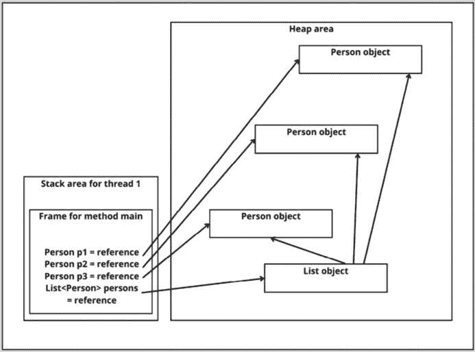

图 4.1 – 资格示例的栈和堆概述

在第五行，我们将 `p1` 设置为 `null`。这意味着 `p1` 有资格进行 GC 吗？快速提醒：堆上的对象一旦不再与栈有连接，就有资格进行 GC。但是，让我们看看执行第 5 行之后会发生什么：

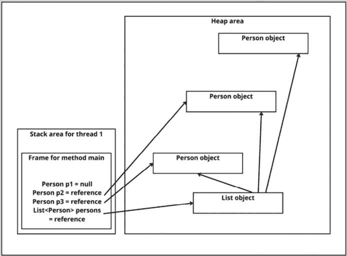

图 4.2 – 执行第 5 行后的堆和栈概述

如我们所见，`p1` 与栈的连接已经消失。但这并不意味着没有与栈的连接。仍然存在间接连接。我们可以从栈到 `Person` 对象的列表，然后我们可以继续访问 `p1` 持有引用的对象，因为列表仍然持有对该对象的引用。因此，在执行第 5 行之后，堆上的所有对象都没有资格进行 GC。

这在执行第 6 行后发生变化。在第 6 行，我们将持有列表的变量设置为 `null`。这意味着 `p1` 在此行之后不再与栈有连接，正如你在 *图 4.3* 中可以看到的那样。

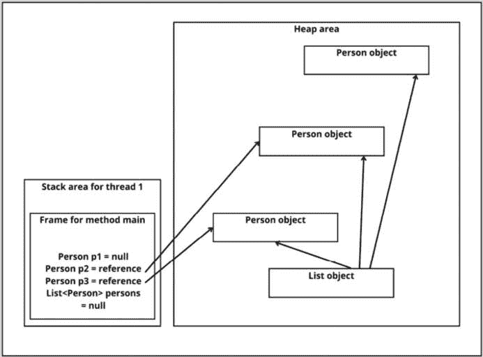

图 4.3 – 代码结束时的堆和栈概述

列表和栈之间没有连接，现在 `List` 对象和 `Person` 对象的第一个实例都有资格进行 GC。同时，`p2` 和 `p3` 变量仍然持有对堆上对象的引用，因此这些对象没有资格进行 GC。

一旦你理解了从堆到栈的直接和间接连接，就不难判断哪些对象已准备好进行 GC。然而，确定哪些对象与栈有连接将需要一些时间，这将减慢应用程序的其他部分。有几种方法可以做到这一点，但每种方法都有其自身的缺点，无论是关于准确性还是性能。

这个复杂的问题与语言无关：我们如何确定一个对象是否仍然与栈有连接？我们将讨论的解决方案当然是 Java 特定的。在标记阶段，通过垃圾回收器找到不再需要的对象。标记阶段由一个特殊的算法组成，该算法确定哪些对象有资格进行 GC。

# 垃圾回收器的标记

标记会标记任何活动对象以及那些未标记为准备垃圾回收的对象。对象保留一个特殊的位来决定它们是否被标记。在创建时，该位是 `0`。在标记阶段，如果一个对象仍在使用且不应被移除，则将其设置为 `1`。

堆和栈都在不断变化。堆上没有与步骤连接的对象有资格进行 GC。它们是不可达的，应用程序没有可能使用这些对象。那些尚未准备好移除的对象被标记；未标记的对象将被移除。

这究竟是如何实现的，取决于 Java 的实现以及你使用的特定垃圾回收器。但从高层次来看，这个过程从栈开始。栈上所有对象引用都会被跟踪，对象会被标记。

如果我们回顾之前的例子，这就是它们的标记方式。我们使用以下代码示例，其中我们没有将`personList`的引用设置为`null`：

```java
Person p1 = new Person(); // 1
```

```java
Person p2 = new Person(); // 2
```

```java
Person p3 = new Person(); // 3
```

```java
List<Person> personList = Arrays.asList(p1, p2, p3); // 4
```

```java
p1 = null; // 5
```

在垃圾回收开始之前，所有对象都是未标记的。这意味着特殊位是 `0`，这是它们在创建时得到的值。


图 4.4 – 在垃圾回收开始之前，没有任何对象被标记

因此，首先，所有对象都是未标记的，正如我们可以从对象后面的所有 `0` 来判断。下一步是将与栈有连接的对象标记，通过将 `0` 改为 `1`。

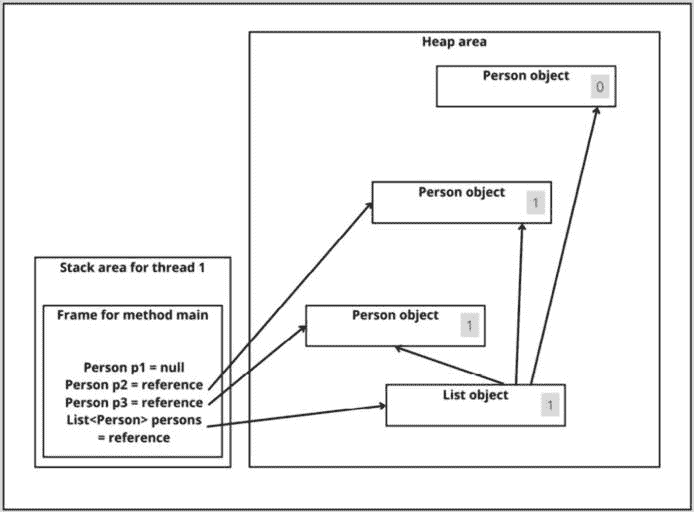

图 4.5 – 标记步骤一：与栈的直接连接

但仅仅标记与栈有直接连接的对象是不够的。目前，由`Person p1`引用的对象即使可达，也有资格进行垃圾回收。这也是为什么每个对象的引用也会被遍历并标记，直到没有更多的嵌套对象。*图 4.6* 展示了标记阶段之后我们的例子看起来是什么样子。

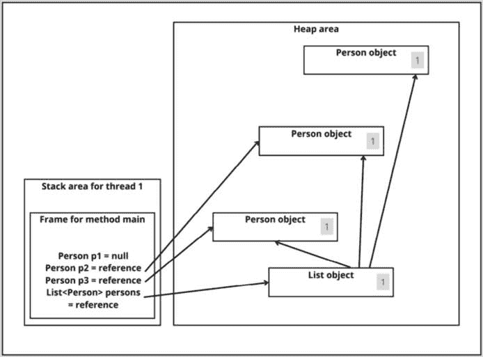

图 4.6 – 标记后

我们堆上的所有对象都被标记了，我们可以从每个对象后面的 `1` 来判断。所以，在我们的例子中，没有任何对象有资格进行垃圾回收，因为它们仍然都是可达的。

在标记阶段，有不同算法发挥着重要作用。我们将首先探讨的是停止世界方法。

## 停止世界

想想这该如何实现。当你检查栈上的所有变量并标记它们及其嵌套对象时，新对象可能在此期间被创建。有可能你错过了栈的那部分。这会导致未标记的对象（记住，对象在创建时最初是未标记的）应该被标记，结果它们会被移除。这将非常有问题。

解决这个问题会影响性能，因为垃圾回收器需要暂停主应用程序的执行，以确保在标记阶段不会创建新的对象。这种策略被称为停止世界，尽管听起来很戏剧化，但它是一个 Java 术语。在计算机科学领域还有其他策略，其中之一是引用计数，我们将在下一节中探讨。

## 引用计数和隔离孤岛

另一种实现方法是计数一个对象上的引用数量。所有对象都会包含一个计数，表示它们被引用的次数作为某种属性。这样，执行 GC 仅仅是移除所有引用次数为 `0` 的对象。

你可能会想，这比暂停应用程序要好得多，那么为什么我们不使用它呢？答案是孤岛。这不是某种现代社会现象；孤岛是那些仅仅相互引用而没有与堆栈连接的对象。

让我们探索以下代码示例的栈和堆。在这个例子中，我们有一个 `Nest` 类：

```java
class Nest {
```

```java
    private Nest;
```

```java
    public Nest getNest() {
```

```java
        return nest;
```

```java
    }
```

```java
    public void setNest(Nest nest) {
```

```java
        this.nest = nest;
```

```java
    }
```

```java
}
```

我们创建了两个 `Nest` 实例，并将它们设置为彼此的 `nest` 属性：

```java
public class IslandOfIsolation {
```

```java
    public static void main(String[] args) {
```

```java
        Nest n1 = new Nest(); // 1
```

```java
        Nest n2 = new Nest(); // 2
```

```java
        n1.setNest(n2); // 3
```

```java
        n2.setNest(n1); // 4
```

```java
        n1 = null; // 5
```

```java
        n2 = null; // 6
```

```java
    }
```

```java
}
```

让我们看看在第四行之后想要计数引用并暂停的情况。

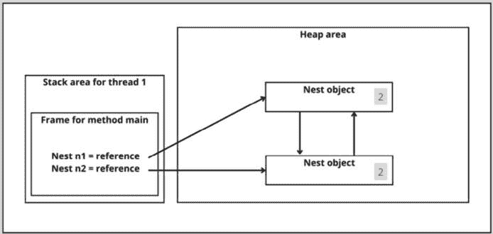

图 4.7 – 创建两个 Nest 对象并将它们分配给彼此的字段后的概览

在第四行之后，两个计数器都是 2。对象被另一个对象和堆栈所引用。这会在第五行和第六行之后改变，因为堆栈的引用被移除了。

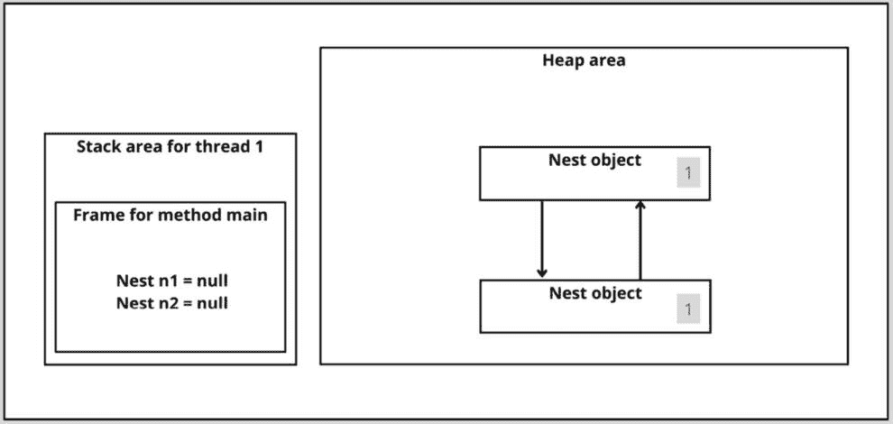

图 4.8 – 设置堆栈引用为 null 后的概览

如代码所示，在执行末尾注释 6 的行之后，两个对象都无法从堆栈中访问。然而，如果我们使用引用计数，它们仍然都会有一个 `1`，因为它们都相互引用。

由于这些对象没有 `0` 的计数，但也没有与堆栈的连接。它们是孤岛：孤立的孤岛。它们应该被垃圾收集，但简单的计数垃圾收集器无法检测到它们，因为它们没有 `0` 的引用计数。更高级的垃圾收集器，它会标记所有与堆栈有连接且需要暂停应用程序的元素，会将它们垃圾收集，因为它们没有与堆栈的连接。

因此，Java 使用更精确的标记阶段来暂停应用程序。如果没有标记垃圾收集器，孤岛会导致内存泄漏：本可以释放但从未再次提供给应用程序使用的内存。

接下来，让我们谈谈标记之后如何释放内存。

# 垃圾收集器清扫

一旦需要保留的对象被标记，就到了开始下一阶段以实际释放内存的时候了。在 GC 术语中，这种对象的删除称为清扫。为了使其更有趣，我们有三种清扫方式：

+   正常清扫

+   压缩清扫

+   复制清扫

我们将通过插图详细讨论所有这些，以帮助您理解正在发生的事情。

## 正常清除

正常清除是移除未标记的对象。*图 4.9* 显示了内存中的五个对象。其中两个，带有 **x** 的那些，将被移除。

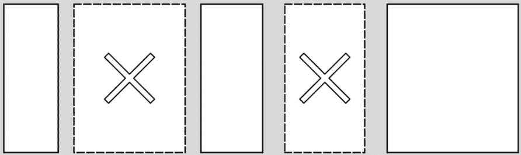

图 4.9 – 带有标记对象的内存示意图

内存块的大小并不相等；其中一些较小，而另一些较大。在清除不可达的对象之后，内存看起来如下：


图 4.10 – 清除后的内存示意图

通过清除和内存块之间的间隙，内存已被释放，可以再次分配。然而，只有适合间隙的块才能存储在那里。现在内存是碎片化的，这可能导致存储较大内存块时出现问题。

### 碎片化

在首先存储内存然后从中移除块之后，会发生内存碎片化。在内存块之间，可以分配新的内存。这如图 *图 4.11* 所示。

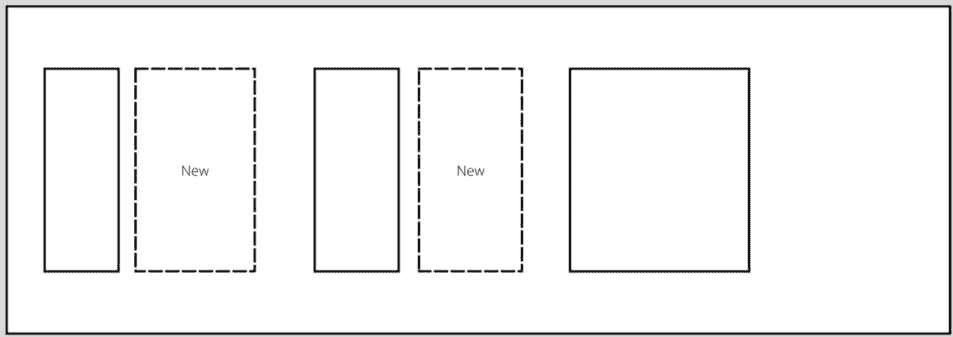

图 4.11 – 分散内存中新对象分配

新的内存块存储在间隙中。在特定显示的情况下，这种方法效果很好，因为内存块适合间隙。如果内存块不适合间隙之间（或在此概述的末尾），我们就会遇到问题。让我们看看我们想要存储一个新块的情况。


图 4.12 – 尝试存储小于可用内存的大块内存

如果我们查看总的可用内存，前面图中的块是适合的。然而，我们无法在碎片化内存中存储它，因为没有足够的连续内存来存储新块。

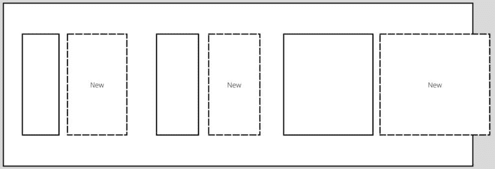

图 4.13 – 示意概述显示新内存块不合适

如果请求的内存块无法容纳，将导致错误：`OutOfMemoryError`。尽管我们没有用完内存，并且从技术上讲有足够的内存来存储新的块，但它无法容纳，因为可用的内存是碎片化的。这是正常清除操作的问题。这是一个非常高效且简单的过程，但它会导致内存碎片化。如果内存充足，并且应用程序只需要快速释放内存，这个过程可能是可取的。当内存更紧张时，最好使用其他清除操作的选项之一：压缩后的清除操作或复制后的清除操作。让我们首先看看压缩后的清除操作。

## 压缩后的清除操作

压缩后的清除操作是一个两步过程。就像在正常清除操作中一样，内存块被删除。这次，我们不接受碎片化的内存作为最终结果，而是执行一个额外的步骤，称为压缩。这会将内存块移动以确保它们之间没有间隙。过程如图 *4.14* 所示。我们假设与图 *4.9* 所示相同的内存块已准备好删除。

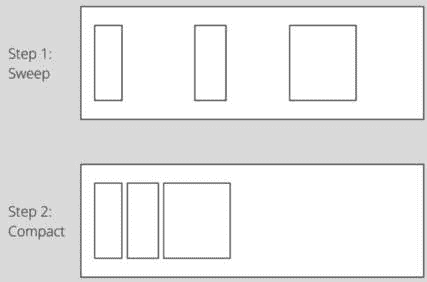

图 4.14 – 压缩后的清除操作

如您所见，这次我们没有得到碎片化的内存。因此，我们不会得到 `OutOfMemoryError`。这听起来很棒，但就像往常一样，魔法是有代价的。在这种情况下，代价是性能。从性能的角度来看，内存的压缩是一个代价高昂的过程，因为所有内存块都需要移动（这通常需要按顺序进行）。

这种代价高昂的压缩过程有一个替代方案，那就是复制后的清除操作。别忘了压缩后的清除操作，因为复制后的清除操作也有其自身的成本。

## 复制后的清除操作

复制后的清除操作是一个巧妙的过程。为此我们需要两个内存区域。我们不是删除不再需要的内存块，而是删除所有内存块！但在删除之前，我们需要将我们仍然需要的内存块复制到第二个内存区域（参见图 *4.15*）。

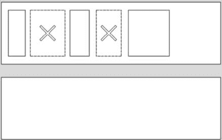

图 4.15 – 实际清除操作前的复制操作

首先，我们有我们的内存区域，其中包含不再需要的对象，然后我们有一个尚未分配的第二个内存区域。

在下一步中，我们将所有需要的对象复制到第二个内存区域。

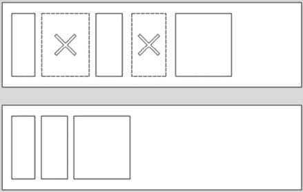

图 4.16 – 复制后的清除操作

到目前为止，我们只进行了复制，还没有进行清除。这正是下一步将要做的：清除第一个内存区域，因为所有我们仍然需要的对象都保存在第二个内存区域中。结果如图 *4.17* 所示。

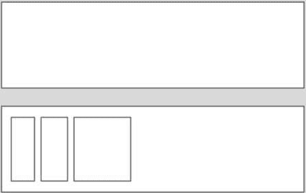

图 4.17 – 使用复制清扫后的内存示意图

在清扫第一个内存区域之后，我们所有的对象都仍然可以在第二个内存区域中访问。这在性能上比带有压缩的清扫更好，但正如你可以想象的那样，这需要更多的可用空闲内存。

使用的清扫类型取决于垃圾回收器的选择实现。现在有很多实现。我们将在下一节中探讨最常见的一些。

# 探索 GC 实现

标准 JVM 有五种 GC 实现。其他 Java 实现可以有其他的 GC 实现，例如 IBM 和 Azul 的垃圾回收器。在理解了标准 JVM 附带的以下五种实现之后，这些工作方式相对容易理解：

+   序列 GC

+   并行 GC

+   CMS（并发标记清除）GC

+   G1 GC

+   ZGC（Z 垃圾回收器）

我们将在稍后详细检查这些实现是如何工作的（然而，我们不会讨论每个的不同的命令行选项）。但在我们讨论这些特定的垃圾回收器是如何工作的之前，另一个概念需要被解决：代式 GC 的概念。

## 代式 GC

如果你有一个大型 Java 应用程序正在运行，为了等待垃圾回收器标记每个活动的对象而暂停整个程序，将会是一个性能噩梦。幸运的是，他们通过利用堆上的不同代想出了一个更聪明的办法。并非所有即将解释的垃圾回收器都使用这种策略，但其中一些确实如此。

与一次性运行完整的垃圾回收器不同，代式垃圾回收器专注于内存的某个部分，例如，年轻代。这种方法对于大多数对象都年轻死亡的应用程序来说效果很好。它节省了很多标记。

代式垃圾回收器通常与**记忆集**一起工作。这是一个包含所有从老年代到年轻代对象引用的集合。这样，老年代就不需要被扫描，因为指向年轻代的引用已经在记忆集中了。

对于大多数对象都在持久代的应用程序，使用 GC 专注于年轻代的方法不会繁荣。因为在这种情况下，堆特别重的是老年代，只收集年轻代不会释放高比例的内存。

通常，代垃圾收集器必须为不同的内存区域使用不同的策略。例如，年轻代可以使用停止世界垃圾收集器进行垃圾收集，将整个可到达对象集复制到老年代，然后删除年轻代。同时，老年代可以使用压缩，也许还有停止世界的替代方案，如 CMS 垃圾收集器，我们将在查看不同实现时看到。

现在我们已经讨论了清扫的不同选项以及停止世界和代垃圾收集器，我们现在处于更好的位置来理解我们之前列出的五种实现。（所以，坚持住，你几乎已经通过了这个艰难的章节！）

## Serial GC

**串行 GC** 在单个线程上运行并使用停止世界策略。这意味着当垃圾收集器运行时，应用程序不会执行其主要任务。这是垃圾收集的最简单选项。

对于年轻代，它使用标记策略来识别哪些对象有资格进行 GC，并使用复制方法进行实际的内存释放。对于老年代，它使用标记和压缩的清除方法。

串行垃圾收集器适用于小型程序，但对于像**Spring**或**Quarkus**应用程序这样的大型程序，有更好的选择。

## Parallel GC

**并行垃圾收集器** 是 Java 8 的默认垃圾收集器。它对年轻代使用标记-复制方法，对老年代使用标记-清除-压缩方法，就像串行垃圾收集器一样。然而，这可能是个惊喜，它是以并行的方式做到这一点的。在这种情况下，并行意味着使用多个线程来清理堆空间。所以，不是只有一个线程负责标记、复制和压缩阶段，而是多个线程。尽管它仍然是停止世界，但由于世界需要停止的时间更短，所以它的性能比串行垃圾收集器更好。

并行垃圾收集器在多核机器上运行良好。在（较少见的）单核机器上，由于管理多个线程的成本以及单核上实际上并没有并行处理，串行垃圾收集器可能是一个更好的选择。

## CMS GC

**并发标记清除垃圾收集器**（**CMS GC**）有一个改进的标记-清除算法。它通过多个线程实现这一点，并大大减少了暂停时间。这是 CMS GC 与并行垃圾收集器之间的主要区别。

尽管并非所有系统都能处理主应用程序和垃圾收集器之间的资源共享，但如果它们可以，与并行垃圾收集器相比，这将是一个性能上的巨大提升。

CMS GC 也是一个代式垃圾回收器。它为年轻代和老年代分别设置了不同的周期。对于年轻代，它使用带有停止世界的标记和复制。因此，在年轻代的垃圾回收期间，主要的应用线程会被暂停。

老年代使用 *主要并发* 标记和清除进行垃圾回收。这里的“主要并发”意味着它大部分的垃圾回收是并发的，但在垃圾回收周期中仍会使用两次停止世界的操作。它第一次在垃圾回收周期的开始时暂停所有主要的应用线程，然后在标记阶段非常短暂地暂停，然后在垃圾回收周期中间的某个时候（通常）稍微长一点的时间进行最终标记。

这些暂停通常非常短，因为 CMS GC 尝试在并发于主应用线程的同时收集足够的旧代内存，从而防止它填满。有时，这是不可能的。如果 CMS GC 在旧代内存填满时无法释放足够的内存，或者应用程序无法分配对象，CMS GC 会暂停所有应用线程，主要关注点转向垃圾回收。这种垃圾回收器无法主要并发进行垃圾回收的情况被称为 *并发* *模式失败*。

如果收集器仍然无法释放足够的内存，则会抛出 `OutOfMemoryError`。这种情况发生在应用程序的 98% 的时间都花在垃圾回收上，而堆中恢复的内存不到 2%。

这与其他我们讨论过的垃圾回收器并没有太多不同。CMS GC 的非常短的暂停时间听起来已经相当不错了，但还有更晚的升级可用。让我们来看看 G1 GC。

## G1 GC

**G1**（垃圾优先）垃圾回收器随着 Java 7（次要版本 4）推出，是 CMS GC 的升级。它以巧妙的方式结合了不同的算法。G1 收集器是并行、并发，并旨在缩短应用程序的暂停时间。它采用了一种称为增量压缩的技术。

G1 垃圾回收器将堆分成更小的区域：比代式垃圾回收器小得多。它与这些较小的内存段一起工作，对它们进行标记和清除。它跟踪每个内存区域中可达和不可达对象的数量。具有最多不可达对象的区域首先进行垃圾回收，因为这样可以释放最多的内存。这就是为什么它被称为垃圾优先垃圾回收器。具有最多垃圾的区域首先被收集。

它在将对象从一个区域复制到另一个区域的同时完成所有这些操作。这将导致第一个区域完全释放。这样，G1 GC 一石二鸟：同时实现垃圾回收和压缩。这就是为什么它相对于之前提到的垃圾回收器来说是一个如此大的升级。

G1 GC 是一个优秀的垃圾收集器。你可能想知道这个垃圾收集器是否能够不停止世界来工作。不，压缩仍然需要以这种方式发生。但由于区域较小，暂停时间要短得多。

G1 GC 垃圾收集器的另一个新特性是*字符串去重*。这实际上就是你所想的：垃圾收集器运行一个进程来检查`String`对象。当它找到包含相同内容但引用堆上不同`char`数组的`String`对象时，它们将被更新为都指向同一个`char`数组。这使得另一个`char`数组有资格进行 GC，从而优化了内存使用。更令人兴奋的是，这一切都是完全并发发生的！此选项需要使用以下命令启用：`-XX:+UseStringDeduplication`。

就像 CMS GC 一样，G1 GC 试图并发地做很多事情。因此，应用程序线程大多数时候不需要暂停。然而，如果 G1 GC 无法释放足够的内存，并且应用程序分配的内存超过了可以并发释放的内存，那么应用程序线程需要暂停。

G1 垃圾收集器是针对性能强大且内存空间大的系统的首选 GC。但这并不是最近添加的垃圾收集器。让我们看看 ZGC。

## Z GC

Java 15 为我们提供了垃圾收集器的另一个生产就绪实现，即**Z 垃圾收集器**（**ZGC**）。它并发地执行所有垃圾回收，并且不需要在每次暂停时使应用程序停止超过 10 毫秒。

它通过首先标记活动对象来实现这一点。它不保留映射，而是使用**引用着色**。引用着色意味着引用的活动状态存储为构成引用的位。这需要一些额外的位，这就是为什么 ZGC 只能在 64 位系统上运行，而不能在 32 位系统上运行。

通过使用重新定位来避免碎片化。这个过程与应用程序并行发生，以避免超过 10 毫秒的暂停，但这是在应用程序执行的同时发生的。

没有额外的测量，这可能会导致不愉快的惊喜。想象一下，我们正在尝试使用参考访问某个对象，但在做这个过程中，它被重新定位并且有了新的参考。旧的内存位置可能已经被覆盖或清除。在这种情况下，调试将是一场噩梦。

当然，Java 团队不会将存在那样问题的垃圾收集器推向生产。他们引入了加载屏障来处理这个问题。加载屏障在从堆加载引用时运行。它检查引用的元数据位，并根据结果，在检索结果之前可能或可能不会进行一些处理。这种魔法被称为重映射。

我们刚才讨论的五个垃圾回收器是目前写作本书时可以选择的主要选项。你的选择取决于你使用的 Java 版本、系统配置以及应用程序的类型。为了确保垃圾回收器表现良好，需要实施监控。这正是我们将在下一节中探讨的内容。

# 监控 GC

为了决定合适的垃圾回收器，你需要了解你的应用程序。有几个指标对于 GC 特别重要：

+   **分配率**：应用程序在内存中分配对象的速度。

+   **堆内存占用**：堆上存活的对象的数量和大小。

+   **突变率**：内存中引用更新的频率。

+   **平均对象存活时间**：对象平均存活的时间。一个应用程序可能有存活时间短的对象，而另一个应用程序可能有存活时间长的对象。

监控垃圾回收器的性能需要不同的指标。其中最重要的包括标记时间、压缩时间和 GC 周期时间。标记时间是指垃圾回收器在堆上找到所有存活对象所需的时间。压缩时间是指垃圾回收器释放所有空间并重新定位对象所需的时间。GC 周期时间是指垃圾回收器执行完整 GC 所需的时间。

每当可用的堆空间很少时，你会看到垃圾回收（GC）的 CPU 使用率增加。选择合适的内存量可以提高你应用程序的性能。可用的内存量越大，垃圾回收器的工作就越容易。

复制并压缩收集器需要足够的可用空间来进行复制和重新定位。当可用内存有限时，这是一个成本更高的过程。只能复制一小段内存来释放更多空间，希望下次能复制更多，依此类推。垃圾回收器的 CPU 使用率在低内存时最高。在另一端，在假设我们有无限内存的情况下，我们实际上根本不需要进行垃圾回收。

在*第六章*中，我们将探讨如何使用 JVM 调优来管理内存，以改善 JVM 内存的功能。在那里，我们还将了解如何调整垃圾回收器。

# 摘要

在本章中，我们更深入地了解了堆的 GC 工作原理。当堆上的对象不再与栈有直接或间接的连接时，它们就有资格进行 GC。

垃圾回收器在标记阶段确定哪些对象有资格进行 GC。与栈有连接的对象会被标记。有资格进行 GC 的对象不会被标记。

在标记阶段之后，实际的删除操作发生在清除阶段。我们讨论了三种清除方式，即正常清除、压缩清除和复制清除。

然后，我们讨论了垃圾收集器的不同实现方式。其中之一是代际垃圾收集器。这些垃圾收集器专注于堆内存中的一代，因此，在标记阶段不需要扫描堆内存中的所有对象。之后，我们讨论了垃圾收集器的五种常见实现。

在下一章中，我们将聚焦于元空间（Metaspace）。
