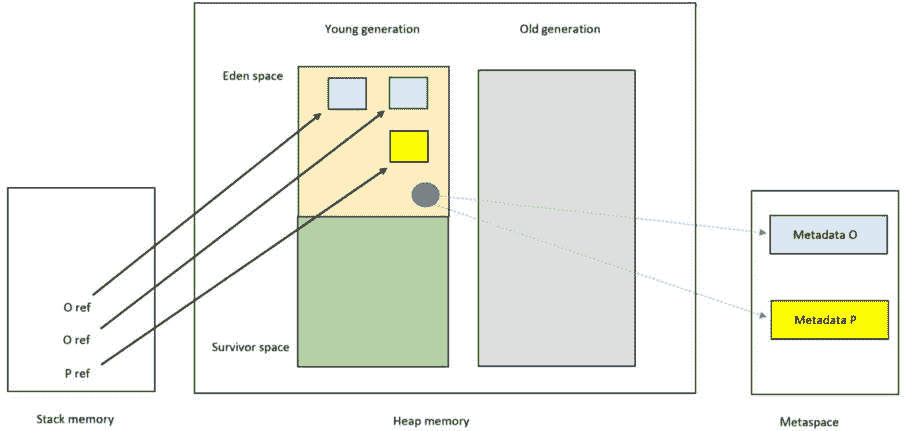
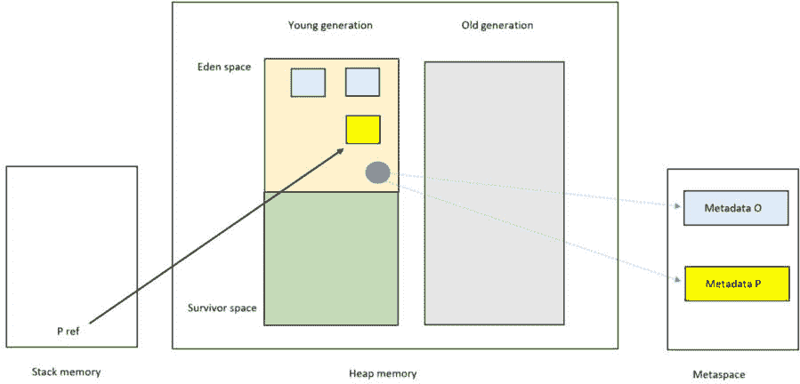
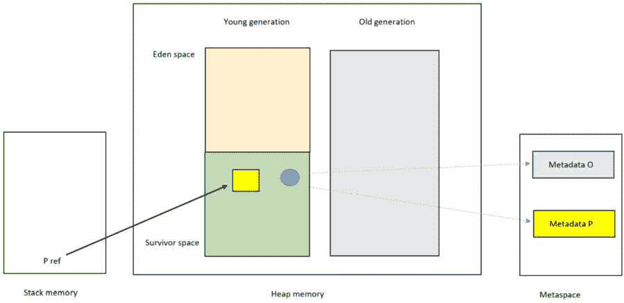
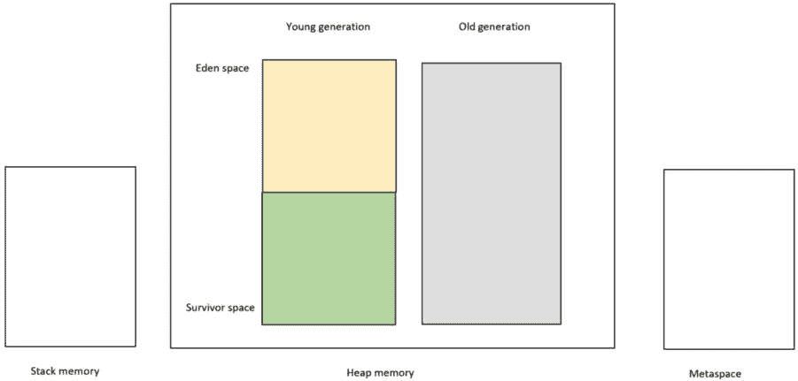

# 5

# 专注于元空间

在*第四章*中，我们详细研究了垃圾回收。我们发现没有引用的对象有资格进行垃圾回收。实际上，垃圾收集器标记了那些有回溯到栈的对象，将它们标记为活动对象。垃圾收集器的清除阶段随后回收了未标记的对象（即已死亡的对象）的内存。

我们还研究了各种垃圾收集实现。根据您的具体标准，需要对每个实现进行评估。

本章重点介绍一个称为**元空间**的区域。我们将以下标题下检查元空间：

+   JVM 对元空间的利用

+   类加载

+   释放元空间内存

让我们从 JVM 对元空间的利用开始。

# JVM 对元空间的利用

元空间是堆之外的本机内存的一个特殊区域。本机内存是操作系统提供给应用程序用于其自身使用的内存。JVM 使用元空间来存储与类相关的信息，即类的运行时表示。这是类的元数据；因此，*元数据*存储在*元空间*中。

元数据

元数据是关于数据的信息。例如，数据库中的列是关于列中数据的元数据。因此，如果列名为**Name**，而特定行的值是**John**，那么**Name**是关于**John**的元数据。

这项元数据包括以下内容：

+   类文件

+   类的结构和方法

+   常量

+   注解

+   优化

因此，在元数据中，JVM 拥有与类一起工作所需的一切。

PermGen

在 Java 8 之前，元数据存储在一个称为**PermGen**或**永久代**的区域（与堆连续）。PermGen 存储类元数据、内部字符串和类的静态变量。从 Java 8 开始，类元数据现在存储在元空间中，内部字符串和类/静态变量存储在堆上。

现在我们来检查类加载。

# 类加载

当第一次访问类时（例如，当创建类的对象时），类加载器定位类文件并在元空间中为其分配元数据。类加载器拥有分配的元空间，并且类加载器实例本身被加载到堆上。一旦加载，后续的引用将重用该类相同的元数据。

在此阶段，有两个类加载器值得提及：引导类加载器（负责加载类加载器本身）和应用类加载器。这两个类加载器的元数据永久存储在元空间中，因此永远不会被垃圾回收。动态类加载器（以及它们加载的类）另一方面，有资格进行垃圾回收。

这导致我们从元空间中释放内存。

# 释放元空间内存

从 PermGen（Java 8 之前）到 Metaspace（Java 8 及以后）的一个主要变化是，Metaspace 现在可以按需增长大小。默认情况下，分配给 Metaspace 的内存量是无界的，因为它属于本地内存的一部分。Metaspace 的大小可以使用 JVM 的 `–XX:MetaspaceSize` 标志进行自定义。

Metaspace 只能在两种情况下触发垃圾回收：

+   Metaspace 内存耗尽

+   Metaspace 的大小超过了 JVM 设置的阈值

让我们逐一检查这些内容。

## Metaspace 内存耗尽

如前所述，默认情况下，Metaspace 可用的本地内存是无限的。如果你耗尽内存，你会收到一个 `OutOfMemoryError` 信息，这将触发垃圾回收器的运行。你可以使用 JVM 的 `–XX:MaxMetaspaceSize` 标志来限制 Metaspace 的大小。如果你达到这个限制，也会触发垃圾回收器的运行。

## Metaspace 的大小超过了 JVM 设置的阈值

我们可以配置 JVM，当 Metaspace 达到某个特定阈值时触发垃圾回收，这个阈值被称为 `-XX:MetaspaceSize` 标志。我们使用 `–XX:MinMetaspaceFreeRatio` 和 `–XX:MaxMetaspaceFreeRatio` 标志来分别提高或降低高水位线。

既然我们已经知道了垃圾回收在 Metaspace 中运行的时间，让我们来检查垃圾回收在 Metaspace 中的工作方式。

## Metaspace 的垃圾回收

由于类加载器拥有类的元数据，垃圾回收器只能在类加载器本身死亡时回收这些元数据。类加载器只有在没有由该加载器加载的任何类的实例时才会死亡。

让我们通过一个例子来进一步解释这一点。该例子假设了一个动态类加载器，并使用简化的图表来便于解释。

*图 5.1* 详细说明了我们在创建了两个 **O** 类型的对象和一个 **P** 类型的对象后内存中的情况。

图 5.1 – Metaspace 分配

在前面的图中，最初，JVM 在堆上创建了类加载器对象（深蓝色），两个 **O** 类型的对象（浅蓝色）和一个 **P** 类型的对象（黄色）。**O** 和 **P** 引用在栈上。在创建第一个 **O** 和 **P** 实例时，类加载器在 Metaspace 中加载了 **O** 和 **P** 的元数据。然而，在创建第二个 **O** 实例时，Metaspace 中没有发生任何事情，因为 **O** 的元数据已经加载。

*图 5.2* 将展示当两个 **O** 引用都超出作用域但垃圾回收尚未运行时内存中的情况：

图 5.2 – Metaspace（两个 O 引用超出作用域）

如您所见，JVM 已经从栈中弹出了两个 **O** 引用。由于垃圾回收尚未运行，实例仍然在堆上。*图 5.3* 展示了第一次运行垃圾回收后的情况：

图 5.3 – 垃圾回收后的元空间（运行#1）

在前面的图中，我们可以看到垃圾收集器从堆中回收了两个（已死亡）**O**对象。此外，垃圾收集器将类加载器和**P**对象都移动到了幸存空间。

注意，即使没有**O**类型的对象在堆上，**O**的元数据仍然保留在元空间中。这是因为垃圾收集器由于堆上存在**P**类型的对象（同一个类加载器同时加载了**O**和**P**）而无法回收**O**的类加载器。

*图 5**.4*展示了当**P**引用超出作用域且再次运行垃圾收集时的内存情况：

图 5.4 – 垃圾回收后的元空间（运行#2）

我们可以看到 JVM 已经从栈中弹出**P**的引用。因此，垃圾收集器回收了**P**类型的对象。

由于垃圾收集器现在已经回收了**O**和**P**类型的所有实例，它可以回收加载**O**和**P**的类加载器。现在，最终，垃圾收集器可以回收元空间中**O**和**P**类的元数据。

本章到此结束。让我们回顾一下主要观点。

# 摘要

在本章中，我们聚焦于元空间（以前称为 PermGen）。元空间是非堆内存的一个特殊区域，用于存储类的元数据。元数据包括使 JVM 能够与类一起工作的信息：例如，方法字节码、常量和注解。当一个类首次使用时，其元数据被加载到元空间中。例如，首次创建一个对象。

默认情况下，元空间可用的本地内存是无限的。可以使用 JVM `–XX:MaxMetaspaceSize`标志配置最大元空间大小。可以使用`–XX:MetaspaceSize`标志最初设置一个阈值值或高水位标记。如果设置了阈值值并达到，这将引发垃圾收集器的运行。通过结合使用 JVM 标志`–XX:MinMetaspaceFreeRatio`和`–XX:MaxMetaspaceFreeRatio`以及垃圾收集结果，我们可以动态地影响高水位标记，因此影响垃圾收集器下一次运行的间隔。

我们通过一个例子看到了一个类的元数据如何保留在元空间中，直到垃圾收集器释放加载该类的类加载器。这只有在所有由该类加载器加载的类都没有实例时才能发生。

现在我们已经聚焦于元空间，我们将把注意力转向下一章，本章将重点介绍配置和监控 JVM 的内存管理。
