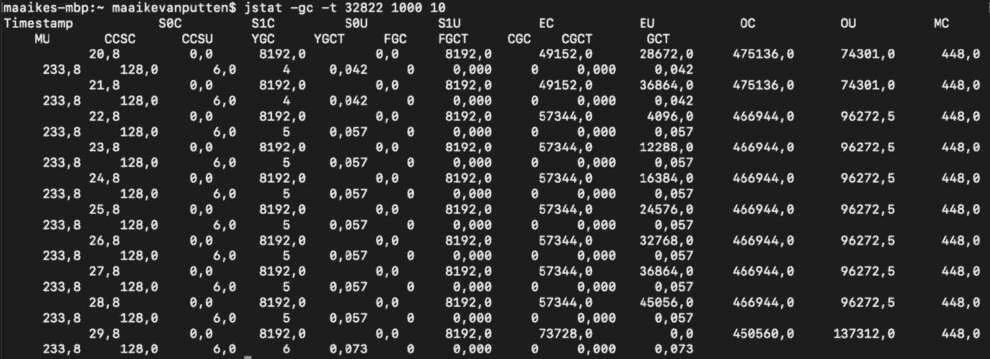
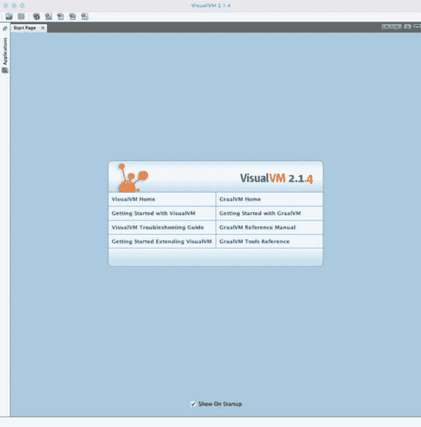
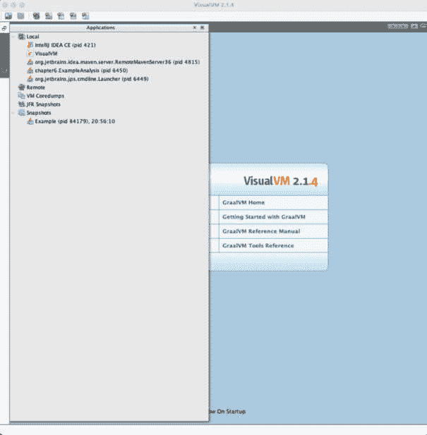
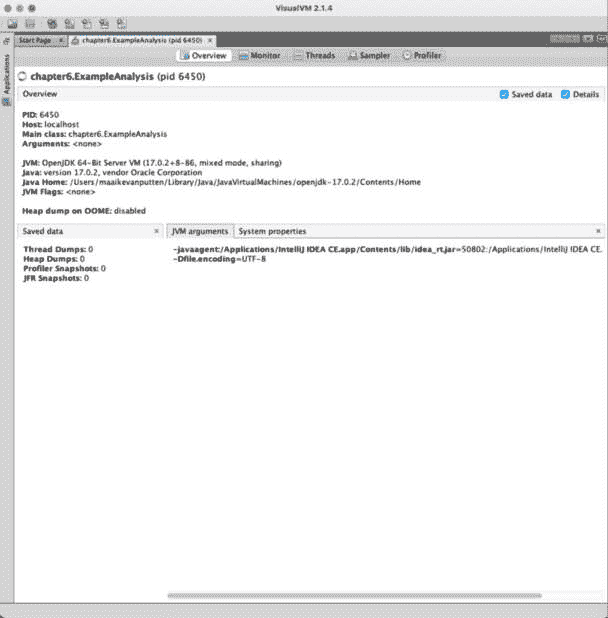
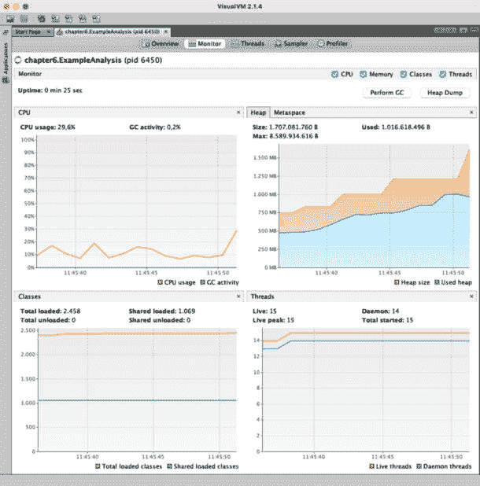
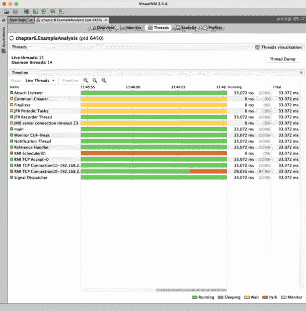
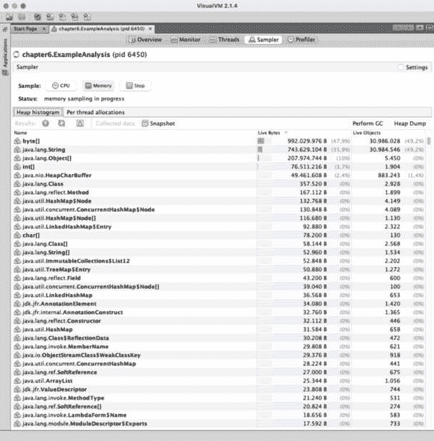
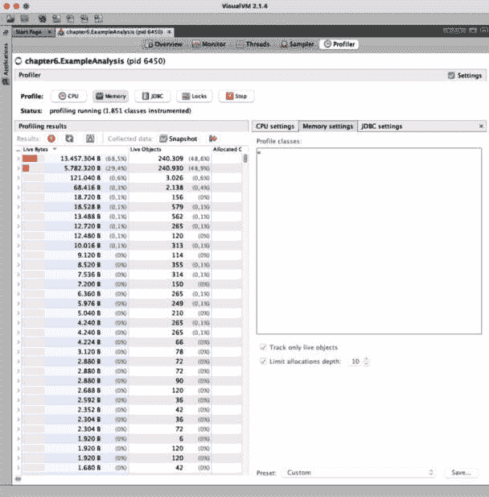
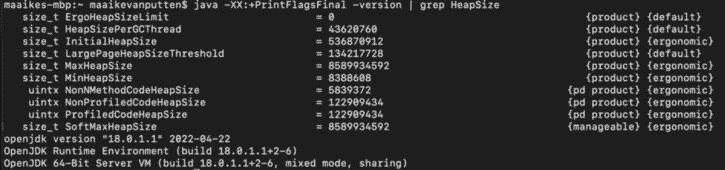

# 6

# 配置和监控 JVM 的内存管理

到目前为止，我们已经探讨了内存的不同区域以及它是如何被释放的，但我们还没有探讨优化 **Java 虚拟机**（**JVM**）执行此操作的方式。JVM 用于管理内存的方法可以通过不同的方式进行配置。

虽然没有一种明显的方式来配置 JVM，但最佳配置实际上取决于应用程序和需求。获得最佳配置将提高应用程序的性能并最小化内存需求。监控性能和内存将有助于在用户之前发现问题。

在本章中，我们将探讨如何配置 JVM 和监控内存管理。调整 JVM 的配置通常是通过调优来完成的，这意味着你有一个起点，然后进行小的调整，并仔细测量它们的影响。以下是将要讨论的主题：

+   JVM 内存管理调优的基本知识

+   获取内存管理的相关指标

+   Java 应用程序的性能分析

+   调整 JVM 的配置

# 技术要求

本章的代码可以在 GitHub 上找到，链接为 [`github.com/PacktPublishing/B18762_Java-Memory-Management`](https://github.com/PacktPublishing/B18762_Java-Memory-Management)。

# JVM 内存管理调优的基本知识

对于性能改进的 JVM 调优，可能是最后的选择。看看这个代码片段：

```java
int i = 0;
```

```java
List<Integer> list = new ArrayList<>();
```

```java
while(i < 100) {
```

```java
    list.add((int)Math.ceil(Math.random()*1000));
```

```java
}
```

JVM 调优有帮助吗？不，因为我们陷入了无限循环，因为 `i` 永远不会增加。当然，还有很多不那么明显的例子，但当代码可以被改进和优化时，这必须在考虑 JVM 调优之前完成。

如果硬件可以实际优化，这也应该在 JVM 调优之前完成。通过这种方式，我并不是说你应该通过仅仅增加更多内存来修复内存泄漏；当然，这并不是一个解决方案。但当你应用程序意外取得巨大成功而事情变得缓慢时，你升级硬件可能比深入 JVM 调优来修复这个问题更有利。当所有其他影响性能的因素都得到优化时，这就是 JVM 调优可以应用于性能改进的时候。

当我们调整 JVM 时，我们正在设置参数。但这还不算完；这需要被仔细监控。在更改任何设置之前，我们必须确保对应用程序的指标有一个很好的了解。这些新设置需要被仔细监控。如果性能有所提高，你可以尝试稍微调整参数；如果它变得更差，你可能至少需要稍微改回来以衡量差异。

到目前为止，这听起来可能像是试错，在某种程度上确实如此——这是专业进行的试错。让我们看看相关的指标来调整 JVM 的内存管理。

# 获取内存管理的相关指标

了解应用程序内存状况的重要指标有几个。理解以下三个定义应用程序性能的重要概念是第一步：

+   功能良好的内存

+   正常延迟

+   正常的吞吐量水平

让我们逐一查看这些内容。

## 功能良好的内存

当您对特定应用程序有经验时，您可能知道其稳定的内存使用点。然而，需要比稳定的内存使用点更多的内存。相反，Java 应用程序需要有一定的安全内存可用，并且这部分预留内存不应接近满载。相反，为 Java 应用程序分配过多的内存也不是一个好的选择。这是因为系统的其余部分也需要一些内存来运行其他进程，因为操作系统也在运行。

如果您对应用程序在良好运行时的正常内存指标有所了解，这将有助于您测量您可能后来做出的任何调整的结果。

## 正常延迟

延迟也称为应用程序的响应性。具有正常延迟的应用程序会按预期和需求响应。这可以通过时间来衡量——例如，应用程序处理某个请求所需的时间，如处理传入的 HTTP 请求。

当然，测量延迟并不总是那么容易。如果我们有一个独立的 Java 应用程序，这相对简单。我们知道我们正在测量应用程序的延迟。如果我们试图测量企业应用程序的延迟，这就会变得复杂。我们需要确保我们测量的是应用程序的延迟，而不是网络问题、另一个应用程序的服务器端或我们企业应用程序景观中的任何层。在这些情况下，延迟结果的问题可能并不与我们的应用程序的内存管理相关。

## 吞吐量水平

吞吐量是在一定时间内应用程序可以完成的工作量。通常，您希望追求高吞吐量，但这需要更多的内存，可能会影响延迟。

# 分析 Java 应用程序

性能分析用于分析应用程序的运行时性能。这是一项需要谨慎处理的工作，因为它通常会对被分析的应用程序产生影响。因此，如果可能的话，建议对开发环境进行性能分析。我们将探讨使用`jstat`和`jmap`命令行工具以及**VisualVM**应用程序进行性能分析。前两者包含在您的**Java 开发工具包**（**JDK**）中；后者曾经包含在其中，但现在可以单独下载。

重要注意事项

您可以在此处下载 VisualVM：[`visualvm.github.io/download.xhtml.`](https://visualvm.github.io/download.xhtml.)

还有其他配置文件；一些 IDE 甚至内置了自己的分析器，它们的工作方式类似。

## 使用 jstat 和 jmap 进行性能分析

使用两个命令行工具`jstat`和`jmap`，我们可以分析和分析内存。我们将探讨如何做到这一点。

假设我们有一个简单的 Java 应用程序：

```java
package chapter6;
```

```java
import java.util.ArrayList;
```

```java
import java.util.List;
```

```java
public class ExampleAnalysis {
```

```java
   public static List<String> stringList = new ArrayList<>();
```

```java
    public static void main(String[] args) {
```

```java
        for(int i = 0; i < 1000000000; i++) {
```

```java
            stringList.add("String " + i);
```

```java
            System.out.println(stringList.get(i));
```

```java
        }
```

```java
    }
```

```java
}
```

这个应用程序并没有做很多有趣的事情，只是向我们的`stringList`静态列表中添加了很多`String`对象。

我们可以运行这个程序并查看内存中发生了什么。为了做到这一点，我们首先需要编译程序：

```java
javac ExampleAnalysis.java
```

之前的命令假设您在命令提示符或终端的同一文件夹中，因为我们直接访问文件而没有前面的文件夹。此命令编译代码并将结果存储在`ExampleAnalysis.class`中。让我们通过执行以下命令来运行此文件（确保在*第六章*目录的上一个级别）：

```java
java chapter6.ExampleAnalysis
```

现在，我们首先需要进程 ID，以便使用`jstat`分析我们的代码。我们可以在命令行中运行以下命令来获取所有 Java 进程的进程 ID：

```java
jps
```

命令会产生以下输出：

```java
35169 Launcher
```

```java
35397 Jps
```

```java
30565
```

```java
35384 ExampleAnalysis
```

```java
34846
```

我们的程序很容易识别，因为它在其后写有类的名称。因此，我们的进程 ID 是`35384`。

我们需要这个进程 ID 来运行`jstat`分析。这个命令行工具有几个选项。我们将首先以这种方式运行它：

```java
jstat -gc -t 35384 1000 10
```

这将为我们具有 ID `35384`的进程产生结果。`-gc`选项是可用于获取垃圾收集堆统计信息的选项之一。它确保显示垃圾收集堆的行为。还有一些其他标志也可以使用；这里有一些示例：

+   `gccapacity`: 显示各代容量的数据

+   `gcnew`: 显示年轻代行为的数据

+   `gcnewcapacity`: 显示年轻代大小的数据

+   `gcold`: 显示旧代和元空间的数据

+   `gcoldcapacity`: 显示旧代的数据

+   `gcutil`: 显示垃圾回收数据的摘要

`-t`表示应该打印时间戳。`1000`意味着它将每 1,000 毫秒显示一次统计信息，而`10`表示它将显示 10 次迭代。

输出将看起来像*图 6**.1*所示：



图 6.1 – 显示带有选项的 jstat 命令的输出

如您所见，它显示了多个列。让我们看看这些列代表什么；对于讨论来说，确切的值并不太重要。我们将从左到右逐一介绍：

+   **Timestamp**: 程序开始运行的时间。您可以看到它随着秒数的增加而增加，这是有道理的，因为我们请求了 1,000 毫秒的迭代。

+   **S0C**: 存活空间 0 当前的容量，单位为 KB。

+   **S1C**: 存活空间 1 当前的容量，单位为 KB。

+   **S0U**: 在 KB 中使用的幸存空间 0 的部分。

+   **S1U**: 在 KB 中使用的幸存空间 1 的部分。

+   **EC**: Eden 空间当前容量，单位为 KB。您可以看到，当 Eden 空间变满时，容量会扩大。

+   **EU**: 在 KB 中使用的 Eden 空间的部分。在第 7 行，它下降，数据被移动到旧空间。

+   **OC**: 旧空间当前容量，单位为 KB。

+   **OU**: 在 KB 中使用的旧空间的部分。您可以看到它在程序运行期间增加。

+   **MC**: 元空间当前容量，单位为 KB。

+   **MU**: 在 KB 中使用的元空间的部分。

+   **CCSC**: **压缩类空间容量**，单位为 KB。

+   **CCSU**: **已使用压缩类空间**，单位为 KB。

+   **YGC**: 发生的年轻代垃圾回收事件的数量。

+   **YGCT**: 年轻代垃圾回收事件的总时间。

+   **FGC**: 完全垃圾回收事件的总数。

+   **FGCT**: 完全垃圾回收事件的总时间。

+   **CGC**: **并发**垃圾回收。

+   **CGCT**: 并发垃圾回收的总时间。

+   **GCT**: 垃圾回收的总时间。

使用`jmap`命令，我们可以更深入地了解当前进程的堆内存使用情况。以下是使用方法（Java 9 及以后版本）：

```java
jhsdb jmap --heap --pid 35384
```

`jhsdb`是一个 JDK 工具，可以附加到正在运行的 Java 进程，执行快照调试，并检查崩溃 JVM 的核心转储内容。这输出了当前的堆配置和用法。让我们看看如何借助 VisualVM 在 Java 分析中获得更直观的结果。

## 使用 VisualVM 进行分析

有许多分析器可以提供内存的视觉表示。其中之一是 VisualVM。这是一个适合获取正在运行的 Java 应用程序详细信息的工具。VisualVM 不再默认包含在 JDK 中，因此需要在此处单独安装：[`visualvm.github.io/`](https://visualvm.github.io/)。

如果您的 IDE 支持分析，您也可以使用它。然而，以下示例使用 VisualVM，因为它是一个免费工具，可以轻松下载。使用 VisualVM 分析应用程序很简单。首先，启动 VisualVM。您将看到一个类似于**图 6.2**的屏幕。



图 6.2 – VisualVM 的启动屏幕

在**图 6.2**的屏幕上，我们可以检查正在运行的应用程序。**应用程序**标签位于左上角，垂直排列。在这里，我们可以看到正在运行的本地 Java 进程，我们可以简单地选择所需的进程。让我们开始我们的示例 Java 应用程序，我们将创建一个巨大的字符串列表。

在**应用程序**标签中，我们可以看到进程，如图**图 6.3**所示。



图 6.3 – Java 进程概述

现在，我们可以选择我们想要检查的进程。在这种情况下，我们想要分析具有**6450** PID 的进程。一旦我们点击它，我们就会得到进程的概述，如**图 6.4**所示。



图 6.4 – Java 进程概述

我们可以在**图 6.4**所示的概述中看到数据摘要。我们看到我们正在分析的过程、我们运行的 JVM 和 Java 版本，以及启动应用程序时使用的 JVM 参数。VisualVM 还可以提供更多详细的数据。在顶部，我们有几个标签页：**概述**、**监控**、**线程**、**采样器**和**分析器**。我们已经看到了**概述**标签；在**图 6.5**中，让我们看看**监控**标签下的数据。



图 6.5 – 使用 VisualVM 监控 Java 进程

这是我们获取应用程序中正在发生的一些重要细节的地方。我们看到四个图表。左上方的图表显示**CPU 使用率**，如您所见，我们为这个程序使用了相当多的 CPU。这个图表还显示了垃圾回收活动，总体上非常低。这是有道理的，因为实际上没有太多东西需要垃圾回收。垃圾回收活动与右上方的内存图表结合，为我们提供了关于应用程序内存健康状况的深刻见解。如果垃圾回收器工作非常努力（如您所见，左上方的图表中有大量的 GC 活动），并且内存持续增加（右上方的图表中代表**已使用堆**的较低线条），这意味着我们可能存在内存泄漏问题。基本上，如果 GC 周期过于频繁，那么这可能表明你需要深入挖掘，看看 GC 和内存是否存在问题。在这样做之后，如果 GC 周期仍然过于频繁，并且内存也没有下降，那么这就是一个红色警报，你必须进行调查。实际上，如果 JVM 在 GC 上花费了超过 98%的时间，并且恢复的堆小于 2%，则会抛出**OutOfMemoryError: GC Overhead limit exceeded**错误。

两个底部的图表显示了加载的 Java 类（左侧）和应用程序中的线程（右侧）。我们可以通过切换到**线程**标签来获取更多关于线程的详细信息。在**图 6.6**中，我们看到了我们应用程序中线程的概述。



图 6.6 – 我们应用程序中的线程

我们可以在最左侧看到我们线程的名称。条形图表示我们的线程随时间的状态——例如，运行或等待。然后我们可以看到它们运行的时间。

在**采样器**标签页中，如**图 6.7**所示，我们可以看到 CPU 或内存的表现情况。



图 6.7 – VisualVM 中的采样标签页

我们现在正在查看内存采样，它显示了有多少活动对象以及某个类占用了多少空间。在这里，`byte`数组是最大的。这很有道理，因为字符串的值存储在`byte`数组中。您还可以按线程过滤此概述，或查看 CPU 的性能。

在最后一个标签页中，我们可以看到剖析。剖析和采样用于类似的目的，但过程不同。采样是通过制作线程转储并分析这些转储来完成的。剖析需要在应用程序中添加一些逻辑，以便在发生某些事情时发出信号。这将对应用程序的性能产生相当大的影响。因此，您不希望在运行中的应用程序上执行此操作。尽管如此，它可以提供很多见解。

您可以在*图 6.8*中看到对所有类进行剖析的结果。在这里，您可以看到与采样（尽管在那个时间点分配的对象较少）相似的结果。在这种情况下，采样同样有效。

VisualVM 非常适合快速直观地了解应用程序内存的情况。在调整 JVM 和检查结果时，这将特别有用。在下一节中，我们将做的是——学习如何调整 JVM 的配置并查看这些调整的影响。



图 6.8 – 分析所有类

# 调整 JVM 的配置

JVM 的设置可以调整。调整 JVM 设置的过程称为**调整**。这些调整的想法是提高 JVM 的性能。再次强调，调整不应是提高性能的第一步。好的代码始终应该是首要的。

我们将查看与内存管理相关的设置：堆大小、元空间和垃圾收集器。

## 调整堆大小和线程栈大小

堆大小可以更改。通常，将堆大小设置为服务器可用内存的一半以下是一个最佳实践。这可能会导致性能问题，因为服务器还将运行其他进程。

默认大小取决于系统。此命令将在 Windows 系统上显示默认值：

```java
java -XX:+PrintFlagsFinal -version | findstr HeapSize
```

此命令显示了 macOS 系统的默认输出：

```java
java -XX:+PrintFlagsFinal -version | grep HeapSize
```

输出以字节为单位显示。您可以在*图 6.9*中看到我电脑的输出。



图 6.9 – macOS 系统上的输出

堆的大小会影响垃圾收集。这乍一看可能有些反直觉，但让我们在这里进行一个小小的思维实验。如果我们有无限的堆内存，我们需要垃圾收集吗？不，对吧？为什么运行这样一个昂贵的进程，如果我们根本不需要释放内存呢？

堆越小，我们越需要垃圾收集器活跃，因为它需要更努力地工作以保持空间可用，因为内存更容易被填满。然而，堆越大，完整的垃圾收集周期就越长。需要扫描的垃圾就越多。一个很好的经验法则是，你希望应用程序执行时间中少于 5%用于垃圾收集。

实际的调整对于不同的服务器可能不同。在这里，我们将通过启动应用程序时使用命令行来展示如何进行。请注意，我们设置的选项名称在不同的服务器之间是相同的，但设置它们的方式或位置可能不同。

当我们启动 Java 应用程序时，我们可以使用不同的内存选项。我们可以指定内存池的起始大小、最大内存池和线程栈大小。以下是设置所有为 1,024 MB 的方法：

+   `-Xms1024m`（初始堆大小）

+   `-Xmx1024m`（最大堆大小）

+   `-Xss1024m`（线程栈大小）

如果你想要将其设置为不同的大小，选择一个不同的大小，并相应地调整选项。你可以使用以下命令以调整后的内存设置启动 Java 应用程序（在 64 位系统上）：

```java
java -Xms4g -Xmx6g ExampleAnalysis
```

这将使我们的示例 Java 应用程序以 4 GB 的初始堆大小和 6 GB 的最大堆大小启动。

与你可以使用`–Xmx`和`–Xms`绑定总堆大小的方式类似，你可以使用以下方式绑定年轻代大小：

+   `-XX:MaxNewSize=1024m`（最大新大小）

+   `-XX:NewSize=1024m`（最小新大小）

在这里，我们将最小和最大内存大小设置为 1,024 MB。我们可能会耗尽内存。这将导致`OutOfMemoryError`错误。让我们看看当这种情况发生时如何获取堆转储，以便我们可以检查出了什么问题。

## 记录低内存

当应用程序因内存不足错误而结束时，获取**堆转储**非常有帮助。堆转储是应用程序内存中对象的快照。在这种情况下，我们可以检查在内存不足时存在于应用程序中的对象。这样，我们可以用它来查看哪个对象可能溢出内存。

如果你希望 JVM 在发生`OutOfMemoryError`异常时创建堆转储，那么你可以在启动 JVM 时使用以下 JVM 参数：

```java
java -XX:+HeapDumpOnOutOfMemoryError ExampleAnalysis
```

我们也可以指定路径：

```java
java -XX:+HeapDumpOnOutOfMemoryError -XX:HeapDumpPath=/some/path/to/dumps ExampleAnalysis
```

使用这种方式，堆转储将被存储在指定的路径中。创建堆转储有不同的方法——例如，如果应用程序不是因为`OutOfMemoryError`而崩溃，`jmap`也可以用来创建应用程序的堆转储。

接下来，让我们看看如何配置 Metaspace。

## 调整 Metaspace

Metaspace 的默认行为相当特殊，因为它似乎有一个限制。由于这个限制不是真正的限制，因此很容易误解，如果达到这个限制，它将查看在垃圾回收方面可以做什么，然后它就会扩展。因此，仔细设置以下变量很重要：

+   使用 `-XX:MaxMetaspaceSize=2048m` 设置最大空间大小为 2048 兆字节

+   使用 `-XX:MetaspaceSize=1024m` 设置垃圾回收的阈值大小为 1024 兆字节

+   使用以下设置最小和最大空闲比率：

    +   `-XX:MinMetaspaceFreeRatio=50` 设置最小空间使用率阈值为 50%

    +   `-XX:MaxMetaspaceFreeRatio=50` 的最大空间使用率设置为 50%

最小和最大空闲比率非常适合您计划动态加载大量类的情况。通过确保有足够的内存可用，您可以提高动态加载类的速度。这是因为为需要加载的类释放内存需要一些 CPU 时间。我们可以通过选择足够大的空闲比率并确保内存可用来跳过需要分配额外内存的步骤。在先前的示例中，它们被设置为 50%。

## 垃圾回收调优

如您现在可能已经意识到的，垃圾回收是一个昂贵的进程。优化它确实可以帮助提高应用程序的性能。您不能自己触发垃圾回收；这是 JVM 的决定。您可能已经听说过以下建议 JVM 进行垃圾回收的方法：

```java
System.gc();
```

这并不保证会发生垃圾回收。因此，您不能触发垃圾回收，但您可以影响 JVM 处理垃圾回收的方式。

然而，在调整与垃圾回收相关的任何设置之前，确保您确切了解您正在做什么非常重要。为此，您需要关于垃圾收集器的扎实知识。

在调整任何设置之前，您必须查看内存使用情况。确保了解哪些空间被填满以及何时发生这种情况。一个健康的堆在 VisualVM 中看起来有点像一把锯子。它上下波动，形成尖峰，类似于锯齿。它有一定量的已使用内存，然后垃圾回收器出现并将已使用内存降低到一定的基础水平。它再次增长，然后在大约相同的使用水平上，垃圾回收器再次出现并将它降低到基础水平，以此类推。

如果您看到内存随着时间的推移而增长，并且每次垃圾回收结束时都略微高于基础水平，那么您可能有一个需要处理的内存泄漏。正如我们在 *第四章* 中所看到的，有几种不同的垃圾收集器实现可用。在启动 JVM 时，我们还可以选择希望它使用的垃圾收集器：

+   `-XX:+UseSerialGC` 使用串行垃圾回收器

+   `-XX:-UseParallelGC` 禁用并行垃圾回收器

+   `-XX:+UseConcMarkSweepGC` 使用并发标记清除垃圾回收器

+   `-XX:+G1GC` 使用 G1 垃圾回收器

+   `-XX:+UseZGC` 使用 ZGC 垃圾回收器

这并不是每个系统都能做到的，所有这些垃圾回收选择都附带了自己的额外选项。例如，我们可以选择并行垃圾回收器并指定垃圾回收器的线程数：

```java
java -XX:+UseParallelGC -XX:ParallelGCThreads=4 ExampleAnalysis
```

这就是如何使用并行垃圾回收器启动应用程序，并给它分配四个线程来工作。所有垃圾回收器的选项过于复杂，无法详细讨论。详细信息可以在您使用的 Java 实现的官方文档中找到。以下是 Oracle 实现的链接，尽管在您阅读这本书的时候，可能会有更新的版本发布：[`docs.oracle.com/javase/9/gctuning/introduction-garbage-collection-tuning.htm.`](https://docs.oracle.com/javase/9/gctuning/introduction-garbage-collection-tuning.htm.)

摘要

在本章中，我们了解了在调整 JVM 时需要注意的事项。我们需要关注内存功能、延迟和吞吐量。

为了监控我们的应用程序表现如何，我们可以使用配置文件。我们已经看到了如何使用 JDK 默认提供的`jstat`命令行工具。之后，我们看到了如何使用 VisualVM 来更好地可视化正在发生的事情。

接下来，我们看到了如何调整我们的应用程序的堆、元空间和垃圾回收器。我们也看到了这些调整对我们简单示例应用程序的影响。

再次强调，请记住，调整 JVM 以提升性能应该是最后的步骤，并且应该首先采取更明显的行动，例如改进代码。

在介绍完这些内容后，您现在可以查看如何在下一章中避免内存泄漏。
