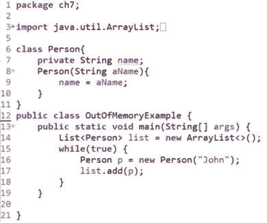
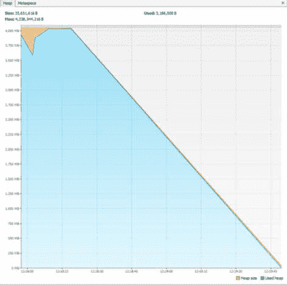
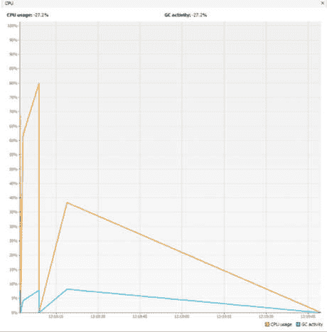
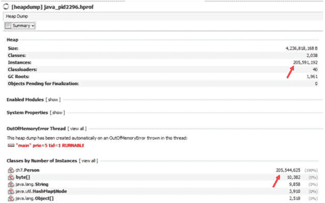
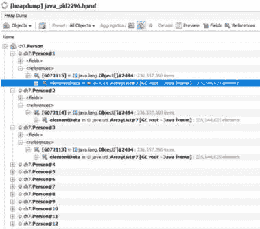
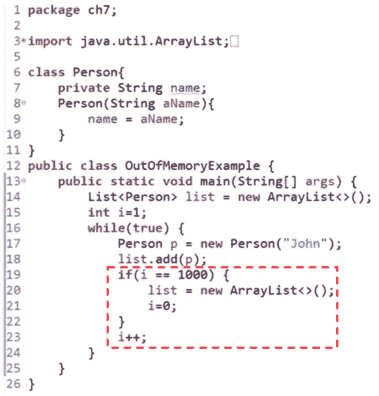
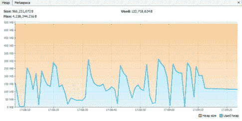
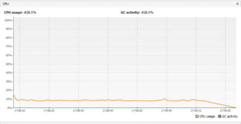

# 第七章：避免内存泄漏

在上一章中，我们探讨了如何配置和监控 JVM 的内存管理。这涉及到与 JVM 调优相关的指标知识。我们讨论了如何获取这些指标，以及如何据此调整 JVM。我们还探讨了如何使用分析来深入了解调整的影响。

本章重点介绍内存泄漏。我们将以下标题下探讨内存泄漏：

+   理解内存泄漏

+   发现内存泄漏

+   避免内存泄漏

让我们从理解内存泄漏开始。之后，我们将学习如何在我们的代码中找到它们，并了解如何避免和解决它们。

# 技术要求

本章的代码可以在 GitHub 上找到：[`github.com/PacktPublishing/B18762_Java-Memory-Management`](https://github.com/PacktPublishing/B18762_Java-Memory-Management)。

# 理解内存泄漏

当不再需要的对象没有被释放时，就会发生内存泄漏。这导致这些对象在内存中积累。鉴于内存是一种有限的资源，这最终可能导致你的应用程序变慢，甚至崩溃（出现**内存不足**（**OOM**）错误）。

即使拥有快速的服务器或在云端托管你的应用程序，也无法让你摆脱糟糕的内存管理（内存泄漏）的影响。正如之前所述，内存是一种有限的资源，即使是快速的服务器也可能耗尽内存。如果在云端部署，简单地扩展以解决内存泄漏问题可能很有吸引力；然而，这会导致部署比实际需要的更大的实例的成本增加。甚至可能导致昂贵的云服务账单。

你耗尽内存的速度取决于内存泄漏发生在你的代码的哪个位置。如果这是一段很少运行的代码，那么内存填满需要很长时间。然而，如果这是一段经常运行的代码，它可能去得很快。

虽然内存泄漏的原因可能各不相同，但一个可能的原因是代码中的错误。这让我们转向下一个主题：发现内存泄漏。

# 发现内存泄漏

因此，你可能想知道通常情况下，当你的应用程序运行一段时间后开始响应变慢时会发生什么。系统管理员可能会时不时地重新启动应用程序以释放不必要的累积内存。这种需要重新启动的需求是内存泄漏的典型症状。

由于内存泄漏，内存逐渐填满，应用程序会变慢，甚至崩溃。虽然应用程序变慢不一定是由内存泄漏引起的，但这通常是这种情况。当你面对你怀疑含有内存泄漏的代码时，以下指标对于诊断应用程序非常有帮助：

+   堆内存足迹

+   垃圾收集活动

+   堆转储

为了演示如何监控这些指标，我们需要一个包含内存泄漏的应用程序。*图 7.1* 展示了这样一个程序：



图 7.1 – 存在内存泄漏的程序

在**图 7.1**中，我们从**第 15 行**开始进入一个无限循环，创建`Person`对象并将它们添加到`ArrayList`对象中。每当`Person`引用（`p`）被重新初始化时，很容易认为之前引用的每个`Person`对象现在都符合垃圾回收的条件。然而，事实并非如此，因为这些`Person`对象正被`ArrayList`对象引用，因此垃圾回收器无法回收它们。因此，虽然无限循环最终会导致程序耗尽内存，但内存泄漏本身是因为垃圾回收器无法回收`Person`对象。让我们看看我们如何诊断正在运行的代码，以帮助我们得出这个结论。

我们将使用命令行运行这个程序，因为我们很容易指定如果堆耗尽内存，我们希望将堆转储到文件中。当前目录是：

```java
C:\Users\skennedy\eclipse-workspace\MemoryMgtBook\src\
```

命令行中的以下命令（为了清晰起见，分多行书写）实现了这一点：

```java
java
```

```java
-XX:+HeapDumpOnOutOfMemoryError
```

```java
-XX:HeapDumpPath=C:\Users\skennedy\eclipse-workspace\MemoryMgtBook\src\ch7
```

```java
ch7.OutOfMemoryExample
```

这里有趣的部分是指定的`–XX`选项。在第一种情况下，我们开启了`HeapDumpOnOutOfMemoryError`选项。这意味着如果堆耗尽内存，JVM 会将堆转储到一个文件中。我们现在需要指定该文件的位置和名称。这就是第二个`–XX`选项所做的事情，使用`HeapDumpPath`标志。

现在我们已经启动了受内存泄漏影响的应用程序，我们将使用**VisualVM**应用程序来监控感兴趣的指标。VisualVM 是以前与 Java SDK 一起提供的应用程序，但现在您必须从[`visualvm.github.io/download.xhtml`](https://visualvm.github.io/download.xhtml)（注意，这是撰写本文时的有效链接）单独下载。让我们从使用堆内存占用开始我们的诊断。

## 堆内存占用

我们在这里寻找的不是堆的大小，而是堆**使用量**。我们也非常关注垃圾回收器是否回收了使用的堆。**图 7.2**显示了**图 7.1**中概述的应用程序的堆占用：



图 7.2 – 堆内存占用

如前一个屏幕截图所示，使用的堆（*x*轴和图表线之间的区域）迅速占据了所有可用的堆空间。垃圾回收器确实设法回收了一些内存（左边的下降），但这不是我们应用程序分配的内存。程序因`OutOfMemoryError`错误而耗尽内存并崩溃。这就是为什么使用的堆回到`0`的原因。

让我们检查这个期间垃圾回收器的活动。

## 垃圾回收器活动

在上一节中，我们看到了包含内存泄漏的应用程序对堆足迹的影响。有趣的是，检查垃圾收集器在那段时间的活动。*图 7**.3*反映了这一点：



图 7.3 – 垃圾收集器活动

*图 7**.3*显示垃圾收集器在程序运行期间非常忙碌。然而，根据*图 7**.2*，我们知道这并没有对释放堆上的空间（由我们的应用程序分配）产生影响。因此，尽管垃圾收集器很忙碌，堆仍然满载。这是一个典型的内存泄漏迹象。

因此，我们现在已经验证了我们的程序中存在内存泄漏。下一步是找出导致泄漏的原因。在我们的例子中，这相当明显，但为了更好地理解，让我们进一步调查。下一步将是查看我们的程序崩溃时 JVM 创建的堆转储。

## 堆转储

当我们运行应用程序时，我们指定了如果应用程序内存不足，则创建堆转储。这将使我们能够进一步调试为什么最初会耗尽内存。*图 7**.4*展示了生成的堆转储摘要：



图 7.4 – 堆转储摘要

*图 7**.4*中的两个值立即跳入眼帘。第一个是实例的数量（第一个箭头）。在*205,591,192*，这太多了。现在，我们需要知道导致内存泄漏的实例类型。第二个红色箭头突出显示`ch7.Person`为违规类型，因为仅该类型就有*205,544,625*个实例。

堆转储还使我们能够进一步深入。在这种情况下，我们将这样做，因为我们想看看是什么*阻止*了这些`Person`对象的垃圾收集。*图 7**.5*将帮助我们讨论这一点：



图 7.5 – 堆转储深入分析

在前面的屏幕截图中，我们已经从摘要级别深入到对象级别。正如我们所知，有很多`Person`对象。通过深入到任何一个`Person`对象，我们可以看到引用它的类型。正如在其中一个`Person`对象（以蓝色突出显示）中所示，我们可以看到它是一个`ArrayList`对象。

现在，我们对正在发生的事情有了更清晰的认识。我们正在向一个`ArrayList`对象添加`Person`对象，其引用永远不会超出作用域。因此，垃圾收集器无法从堆中移除这些`Person`对象中的任何一个，最终导致`OutOfMemoryError`错误。

总结来说，在本节中，我们诊断了一个包含内存泄漏的程序。通过使用堆内存足迹和垃圾回收活动，我们确认了内存泄漏的存在。然后我们分析了堆转储，以确定导致问题的集合（`ArrayList`）和类型（`Person`）。下一节将讨论如何从一开始就避免内存泄漏。

# 避免内存泄漏

避免内存泄漏的最佳方式是编写不包含任何泄漏的代码。换句话说，我们不再需要的对象不应有回连到栈上的连接，因为这会阻止垃圾收集器回收它们。在我们探讨帮助您避免代码中泄漏的技术之前，让我们首先修复 *图 7.1* 中展示的泄漏。*图 7.6* 展示了无泄漏代码：



图 7.6 – 无泄漏程序

在 *图 7.6* 中，无限循环仍然存在。然而，*第 19 行* 到 *第 23 行* 是新的。在这个新部分中，我们每次向 `ArrayList` 对象添加一个 `Person` 引用时，都会增加一个 `i` 本地变量。当我们这样做 1,000 次之后，我们重新初始化我们的 `list` 引用。这是至关重要的，因为它使垃圾收集器能够回收旧的 `ArrayList` 对象和从 `ArrayList` 对象引用的 1,000 个 `Person` 对象。此外，我们将 `i` 重置回 `0`。这将解决泄漏问题。（如果您发现这个特定示例有实际应用场景，请发送电子邮件给我们，我们将将其添加到下一版书籍中。然而，它确实很好地说明了示例图表。）

我们现在将使用与之前相同的命令行参数运行程序。程序不会生成 `OutOfMemoryError` 错误。我们将现在使用 VisualVM 检查代码的性能。*图 7.6* 反映了新无内存泄漏代码的堆内存足迹：



图 7.7 – 堆内存足迹（无泄漏代码）

如前一个屏幕截图所示，使用的堆空间（*x* 轴和图表之间的区域）上下波动。下降区域反映了垃圾收集器回收内存的地方。这种模式类似于锯齿，是健康程序的标志。在最后，我们停止了程序的运行。

接下来，我们将查看那段时间的垃圾收集器活动。*图 7.8* 反映了这一点：



图 7.8 – 垃圾收集器活动（无泄漏代码）

在 *图 7.3*（表示有内存泄漏的代码的图表）中，垃圾收集器运行在超过 5% 的水平。然而，在 *图 7.8* 中，垃圾收集器几乎完全不可见，几乎与 *x* 轴相同。这再次是健康程序的标志。由于这个程序没有耗尽堆空间，因此不需要堆转储。

## 常见陷阱及其避免方法

现在我们已经解决了内存泄漏问题，我们将回顾代码中的一些常见问题以及如何避免它们。我们将讨论一些技术，这些技术将使我们能够编写无泄漏的代码，并使用内存以最佳方式，而不浪费我们实际上不需要使用的资源。

一些提示比较明显，不需要很多例子，例如，如果系统允许，为你的程序分配足够的堆空间，以及不要创建不需要的对象，并在可能的情况下重用对象。其中一些需要更多的解释，我们将在下面详细说明。

### 栈上的不必要引用和将引用设置为 null

可能存在栈上的引用实际上不再需要。在我们前面的例子中就是这样。

重新初始化引用（或将它设置为`null`）是本节中用来修复内存泄漏的方法。两种方法都切断了与栈的链接，使垃圾收集器能够回收堆内存。不过，请注意，只有在你应用程序完成与对象的交互时才这样做；否则，你会得到`NullPointerException`异常。你可以看到以下示例：

```java
Person personObj = new Person();
```

```java
// use personObj
```

```java
personObj = null;
```

在这个例子中，我们有一个对象引用存储在`personObj`中；当我们不再需要它时，我们将其设置为`null`。这样，在将引用设置为`null`的行之后，堆上的`Person`对象就变得适合垃圾回收（假设我们没有将引用分配给其他变量）。

这种方法是否仍然适用于今天的软件是有疑问的；对于大多数现代应用程序，这种方法不太受欢迎，但当然，也可能有合理的用例。

### 资源泄漏和关闭资源

当你打开资源，如文件、数据库、流等时，它们会占用内存。如果这些资源没有被关闭，这可能导致资源泄漏。在某些情况下，甚至可能导致可用资源的严重耗尽，影响应用程序的性能——例如，缓冲区可能被填满。如果你正在生成输出——例如，写入文件或提交到数据库——不关闭资源实际上可能导致数据持久化或写入错误，数据可能无法到达预期的目的地，如输出文件或数据库。

完成后关闭资源（如文件和数据库连接）是防止这种情况发生的一种方法。使用`finally`块或`try-with-resources`在这里非常有帮助。`finally`块总是被执行，无论是否发生异常。`try-with-resources`有一个内置的`finally`块来关闭在`try`部分中打开的任何资源。使用`finally`块或`try-with-resources`确保资源将被关闭。

考虑以下常规`try`-`catch`块的代码：

```java
String path = "some path";
```

```java
FileReader fr = null;
```

```java
BufferedReader br = null;
```

```java
try {
```

```java
    fr = new FileReader(path);
```

```java
    br = new BufferedReader(fr);
```

```java
    System.out.println(br.readLine());
```

```java
} catch(IOException e) {
```

```java
    e.printStackTrace();
```

```java
}
are opening a FileReader and a BufferedReader class and dealing with the checked exceptions in the catch block. However, we never close them. This way, they don’t become eligible for garbage collection. Make sure to close them. This can be done in the finally block, like so:
```

```java
String path = "some path";
```

```java
FileReader fr = null;
```

```java
BufferedReader br = null;
```

```java
try {
```

```java
    fr = new FileReader(path);
```

```java
    br = new BufferedReader(fr);
```

```java
    System.out.println(br.readLine());
```

```java
} catch(IOException e) {
```

```java
    e.printStackTrace();
```

```java
}
```

```java
finally {
```

```java
    if(br != null) {
```

```java
        br.close();
```

```java
    }
```

```java
    if(fr != null) {
```

```java
        fr.close();
```

```java
    }
```

```java
}
```

无论是否发生异常，`finally`块都会执行。这样，我们可以确保资源被关闭。

自 Java 7 以来，更常见的是使用`try-with-resources`。在`try`块的末尾，它将调用在`try`语句中初始化的对象的`close()`方法（这些对象必须实现`AutoCloseable`接口）。以下是一个示例：

```java
String path = "some path";
```

```java
try (FileReader fr = new FileReader(path);
```

```java
    BufferedReader br = new BufferedReader(fr)) {
```

```java
                        System.out.println(br.readLine());
```

```java
} catch(IOException e) {
```

```java
    e.printStackTrace();
```

```java
}
```

如你所见，这要干净得多，并且可以防止你忘记关闭资源。因此，建议尽可能使用`try-with-resources`。

### 使用`StringBuilder`避免不必要的字符串对象

`String`对象是不可变的，因此创建后不能更改。在后台，你的请求更改会导致创建一个新的`String`对象（它反映了你的更改），而原始的`String`对象保持不变。

例如，当你将一个`String`对象连接到另一个`String`对象上时，实际上你在内存中会得到三个不同的对象：原始的`String`对象、你想要连接的`String`对象以及反映连接结果的新`String`对象。

将字符串连接代码放入循环中，后台会创建许多不必要的对象。考虑以下示例：

```java
String strIntToChar = "";
```

```java
for(int i = 97; i < 123; i++) {
```

```java
    strIntToChar += i + ": " + (char)i + "\n";
```

```java
}
```

```java
System.out.println(strIntToChar);
```

这就是循环结束后输出的`String`对象的样子。我们省略了中间部分，以避免使这个片段变得不必要地长：

```java
97: a
```

```java
98: b
```

```java
99: c
```

```java
... omitted middle ...
```

```java
120: x
```

```java
121: y
```

```java
122: z
```

在这个例子中，我们创建了大量的对象，并且每个中间的`concat`步骤都会创建一个新的对象。例如，在第一次和第二次迭代之后，`strIntToChar`的值如下：

```java
97: a
```

```java
98: b
```

经过三次迭代后，结果如下：

```java
97: a
```

```java
98: b
```

```java
99: c
```

所有这些中间值都存储在*字符串池*中。这是因为`String`对象是不可变的，而字符串池在这里被用作一个与我们作对的优化。

解决这个问题的方法就是使用`StringBuilder`。`StringBuilder`对象是可变的。如果我们用`StringBuilder`重写之前的代码，由于我们不是为每个中间值创建一个单独的`String`对象，因此创建的对象会少得多。以下是使用`StringBuilder`的代码示例：

```java
StringBuilder sbIntToChar  = new StringBuilder("");
```

```java
for(int i = 97; i < 123; i++) {
```

```java
    sbIntToChar.append(i + ": " + (char)i + "\n");
```

```java
}
```

```java
System.out.println(sbIntToChar);
```

当进行连接操作时，JVM 会操作原始的`StringBuilder`对象，因此不会创建一个新的`StringBuilder`对象。正如你所见，这不需要对代码进行大幅修改，但它确实大大提高了内存管理效率。因此，当频繁地连接`String`对象时，应使用`StringBuilder`。

### 通过使用原始类型而不是包装类来管理内存使用

包装类比原始类型需要更多的内存。有时，你必须使用包装类——这不是可选的。在其他情况下，使用原始类型而不是包装类型是一个选择。例如，创建一个类型为`int`的局部变量而不是`Integer`。

原始变量占用很少的内存，如果原始变量是方法局部变量，它将存储在栈上（比堆更快访问）。另一方面，包装器是类类型，总是导致在堆上创建一个对象。此外，如果可能的话，你应该使用`long`和`double`原始类型而不是`BigInteger`和`BigDecimal`。特别是`BigDecimal`因其计算精度而受到欢迎。然而，这种精度是以需要更多内存和较慢的计算速度为代价的，因此只有在你确实需要精度时才使用这个类。

请注意，这并不是你正在防止的实际内存泄漏，而是通过不需要比实现应用程序目标所需的更多内存来优化内存的使用。

### 静态集合的问题以及为什么要避免使用它

在某些情况下，可能会诱使你在一个类中使用静态集合来保持应用程序中的对象，尤其是在你只使用 Java SE 环境并且想要存储对象时。这对健康的内存足迹来说是非常危险的。这样的例子可能看起来是这样的：

```java
public class AvoidingStaticCollections {
```

```java
    public static List<Person> personList = new
```

```java
        ArrayList<>();
```

```java
    public static void addPerson(Person p) {
```

```java
        personList.add(p);
```

```java
    }
```

```java
    // other code omitted
```

```java
}
```

这可能会迅速失控。创建的对象不能被垃圾收集，因为静态集合使它们保持活跃。有几种更好的方法可以处理这个问题。如果你真的觉得你需要这样做，那么你可能能够使用数据库来代替。

如果你正在使用`HashMap`类作为静态集合，那么你很可能可以使用`WeakHashMap`（从 Java 8 开始）来代替。这将具有对键的弱引用（请注意这一点；不是值——这些由强引用持有）。这些键引用在`WeakHashMap`中以弱引用的形式存储，但这不会阻止垃圾收集器从堆中移除对象。如果键不再被应用程序的其他部分使用，`WeakHashMap`中的条目将被移除。这意味着，如果你不希望丢失任何其他地方没有引用的信息，那么这是完全可以的。所以，如果你的意图是在`HashMap`中维护信息，那么你*不应该*使用`WeakHashMap`。然而，如果你不需要在堆上维护`HashMap`的键，如果这是唯一的引用，那么`WeakHashMap`可能是你堆使用的一个优化。像往常一样，在实现之前仔细研究这是否符合你的要求。

# 摘要

在本章中，我们学习了如何避免代码中的内存泄漏。第一步是理解内存泄漏发生在对象不再需要时，但仍然保持对栈的链接。这阻止了垃圾收集器回收它们。鉴于内存是一种有限的资源，这从来不是所希望的。随着这些对象的积累，你的应用程序会变慢，最终崩溃。

内存泄漏的一个常见来源是我们代码中的错误。然而，有方法可以调试内存泄漏。为了演示如何调试泄漏代码，我们展示了一个包含内存泄漏的程序。VisualVM 是一个工具，它使我们能够监控感兴趣的指标——堆内存占用、垃圾回收活动以及堆转储（当我们耗尽堆空间时）。

堆占用验证了内存泄漏的存在，因为它显示了*使用*的堆空间完全占用了可用的堆空间。换句话说，堆上的对象没有被回收。同时，垃圾收集器徒劳地非常忙碌地试图释放堆空间。为了找出哪种类型导致了问题，我们检查了堆转储。这引导我们到一个`ArrayList`对象，它引用了大量的`Person`实例。

我们处理了泄漏代码，并再次使用 VisualVM 检查了堆占用和垃圾收集器活动指标。这两个指标都变得更加健康。

然而，避免内存泄漏的最佳方式是首先不要编写它们。这类似于“预防胜于治疗”的原则。本着这个想法，我们讨论了几种常用的避免内存泄漏的技术。

这就结束了这一章。简而言之，我们首先介绍了内存泄漏发生的原因和方式。然后我们诊断并修复了包含内存泄漏的代码。最后，我们讨论了在编写代码时需要注意的事项以防止代码泄漏，以及如何首先优化内存使用。

这不仅结束了这一章，也结束了这本书。我们从一个内存概述开始，然后聚焦于不同的方面。之后，我们深入探讨了垃圾回收。这本书的最后几章专注于如何提高性能：如何调整 JVM 以及如何避免内存泄漏。

如果你想要了解更多关于 JVM 如何管理内存的信息，JVM 的官方文档就在那里等着你。你可以在这里找到最新版本：[`docs.oracle.com/javase/specs/index.xhtml`](https://docs.oracle.com/javase/specs/index.xhtml)。
