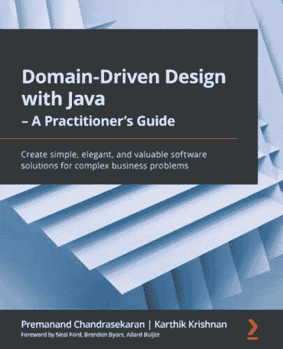
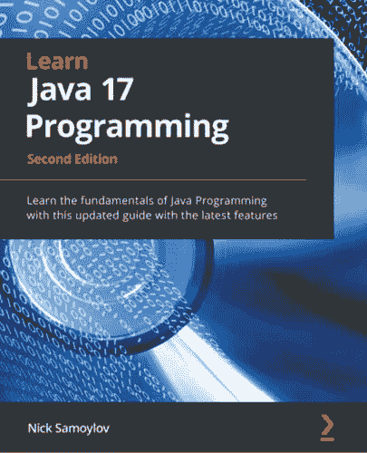

[Packt.com](http://Packt.com)

订阅我们的在线数字图书馆，全面访问超过 7,000 本书籍和视频，以及领先的工具来帮助你规划个人发展和提升职业生涯。更多信息，请访问我们的网站。

# 为什么订阅？

+   使用来自超过 4,000 位行业专业人士的实用电子书和视频，节省学习时间，多花时间编码

+   通过为你量身定制的技能计划提高学习效果

+   每月免费获得一本电子书或视频

+   完全可搜索，便于轻松访问关键信息

+   复制粘贴、打印和收藏内容

你知道吗？Packt 为每本书都提供电子书版本，提供 PDF 和 ePub 文件。你可以在[packt.com](http://packt.com)升级到电子书版本，作为印刷书客户，你有权获得电子书副本的折扣。如需了解更多详情，请联系我们 customercare@packtpub.com。

在[www.packt.com](https://www.packt.com/)，你还可以阅读一系列免费技术文章，注册各种免费通讯，并享受 Packt 书籍和电子书的独家折扣和优惠。

# 你可能还会喜欢的其他书籍

如果你喜欢这本书，你可能还会对 Packt 的其他书籍感兴趣：

**使用 Java 的领域驱动设计 - 实践指南**

普雷马南德·查克拉谢卡拉恩，卡西克·克里希南

ISBN: 978-1-80056-073-4

+   发现如何开发对问题域的共享理解

+   在核心系统和外围系统之间建立清晰的界限

+   识别如何使复杂系统演化和分解成良好设计的组件

+   应用如领域故事讲述和事件风暴等细化技术

+   实施 EDA、CQRS、事件存储和更多

+   设计一个由紧密、松散耦合和分布式微服务组成的生态系统

+   测试驱动 Java 中事件驱动系统的实现

+   掌握非功能性需求如何影响边界上下文分解

**学习 Java 17 编程 - 第二版**

尼克·萨莫约洛夫

ISBN: 978-1-80324-143-2

+   在 Java 中理解和应用面向对象原则

+   探索 Java 设计模式和最佳实践以解决日常问题

+   轻松构建用户友好且吸引人的 GUI

+   在实际示例的帮助下理解微服务的使用

+   发现编写高质量 Java 代码的技术和惯用语

+   掌握 Java 中数据结构的使用

# Packt 正在寻找像你这样的作者

如果你对成为 Packt 的作者感兴趣，请访问[authors.packtpub.com](http://authors.packtpub.com)并今天申请。我们已与成千上万的开发者和技术专业人士合作，就像你一样，帮助他们将见解与全球技术社区分享。你可以提交一般申请，申请我们正在招募作者的特定热门话题，或者提交你自己的想法。

# 分享你的想法

现在你已经完成了《Java 内存管理》，我们很乐意听听你的想法！如果你从亚马逊购买了这本书，请[点击此处直接进入该书的亚马逊评论页面](https://packt.link/r/1801812853)并分享你的反馈或在该购买网站上留下评论。

你的评论对我们和科技社区都很重要，并将帮助我们确保我们提供高质量的内容。

# 下载此书的免费 PDF 副本

感谢你购买这本书！

你喜欢在旅途中阅读，但无法携带你的印刷书籍到处走吗？

你的电子书购买是否与你的选择设备不兼容？

别担心，现在每购买一本 Packt 书籍，你都可以免费获得该书的 DRM 免费 PDF 版本。

在任何地方、任何时间、任何设备上阅读。直接从你最喜欢的技术书籍中搜索、复制和粘贴代码到你的应用程序中。

优惠远不止这些，你还可以获得独家折扣、时事通讯和每日免费内容的每日邮箱访问权限。

按照以下简单步骤获取优惠：

1.  扫描下面的二维码或访问以下链接

[`packt.link/free-ebook/9781801812856`](https://packt.link/free-ebook/9781801812856)

1.  提交您的购买证明

1.  就这些！我们将直接将你的免费 PDF 和其他优惠发送到你的邮箱。
