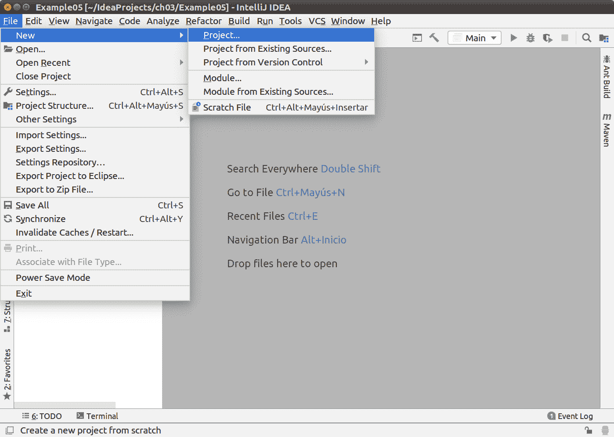
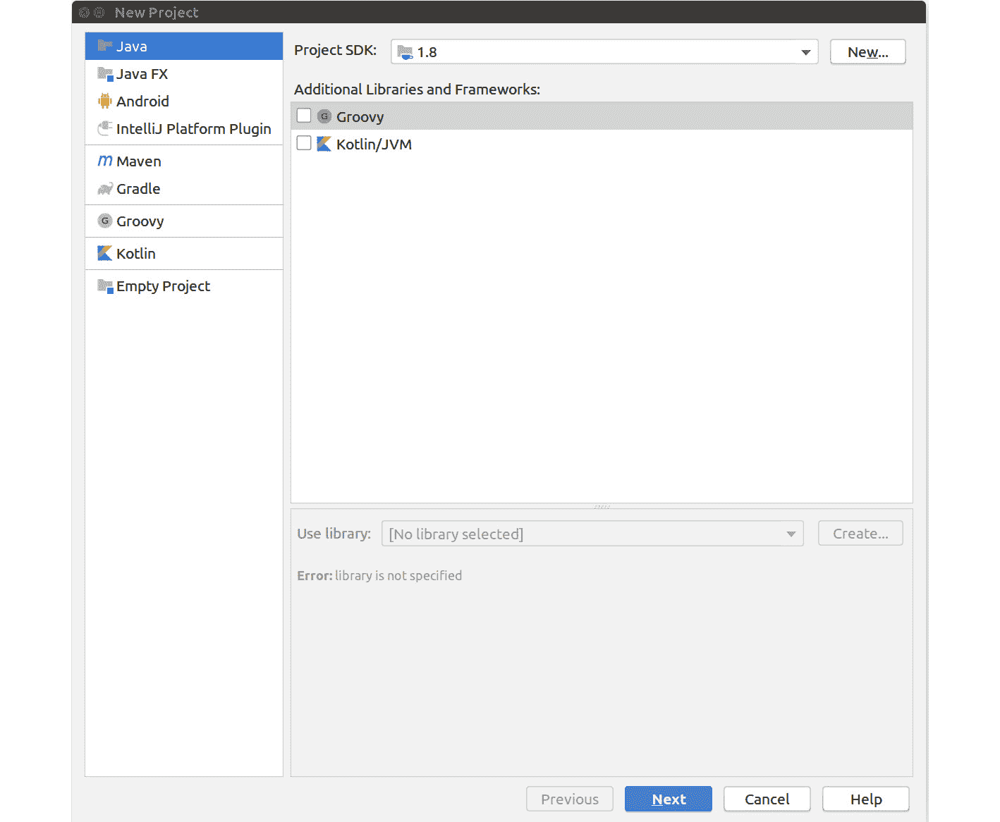
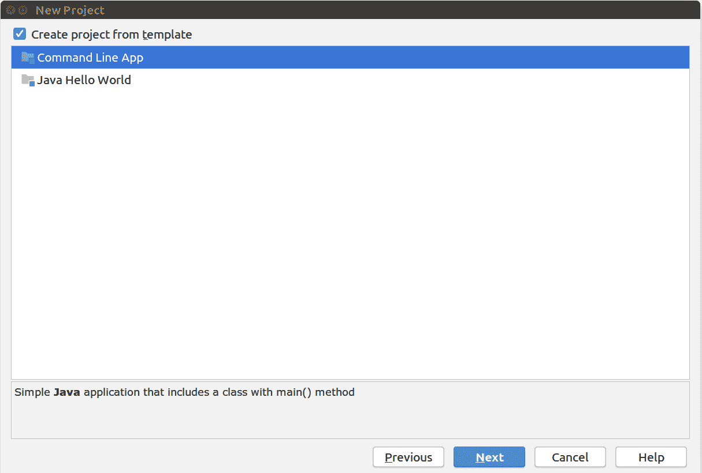
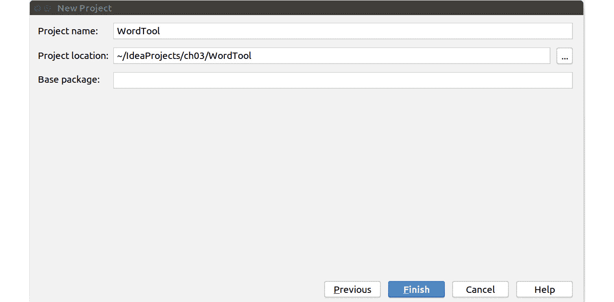
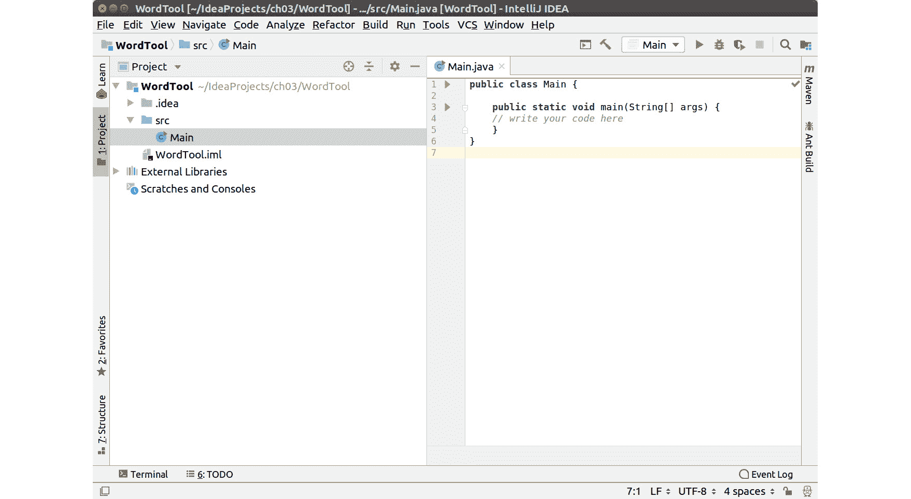
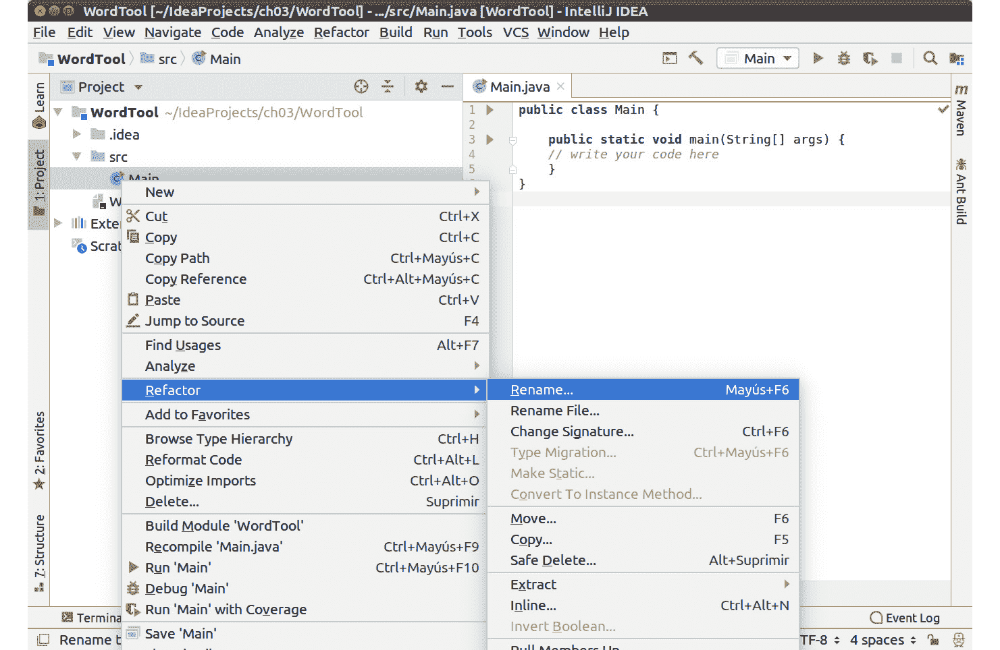
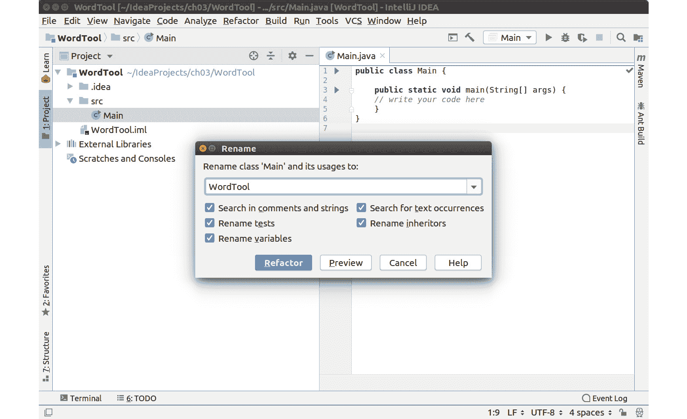
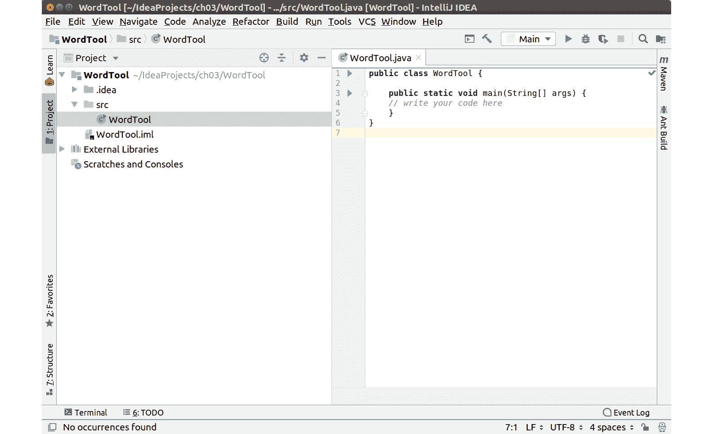
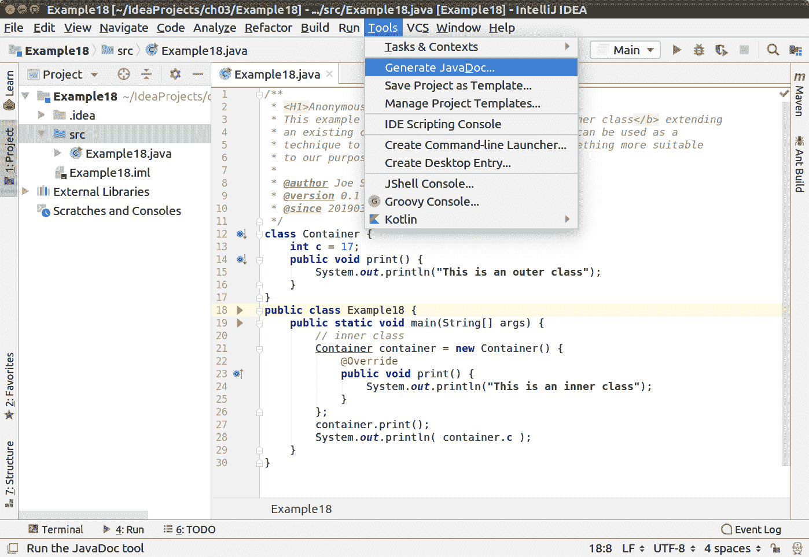

# 3. 面向对象编程

概述

在本章中，我们将探讨 Java 实现面向对象编程（**OOP**）概念的方式。为此，你将首先练习创建和实例化自己的类，以便你可以在以后创建可以处理其中数据的方法。然后我们将带你了解如何编写递归方法，甚至如何覆盖现有方法以使用你自己的方法。到本章结束时，你将完全准备好重载方法的定义，以适应不同场景，并为同一方法或构造函数提供不同的参数，并注释代码以告知编译器必须采取的特定操作。

# 简介

Java 类是一个模板，用于定义数据类型。类由携带数据和用于在该数据上执行操作的方法的对象组成。类可以是自包含的，可以扩展其他类以添加新功能，或实现其他类的功能。从某种意义上说，类是类别，允许我们定义可以存储在其中的数据类型，以及处理这些数据的方式。

类在运行时告诉编译器如何构建特定的对象。请参考“Java 中处理对象”主题中关于对象解释的内容。

类定义的基本结构如下所示：

```java
class <name> {
    fields;
    methods;
}
```

注意

类名应该以大写字母开头，例如`TheClass`、`Animal`、`WordCount`或任何以某种方式表达类主要目的的字符串。如果包含在单独的文件中，包含源代码的文件名应与类名相同：`TheClass.java`、`Animal.java`等。

## 类的解剖结构

类中包含不同的软件组件。以下示例展示了一个包含一些主要组件的类。

```java
Example01.java
1  class Computer {
2      // variables
3      double cpuSpeed;  // in GHz
4  
5      // constructor
6      Computer() {
7          cpuSpeed = 0;
8      }
9  
10     //methods
11     void setCpuSpeed ( double _cpuSpeed ) {
12         cpuSpeed = _cpuSpeed;
13     }
https://packt.live/32w1ffg
```

本例的输出结果为：

```java
2.5
Process finished with exit code 0
```

之前的代码列表展示了名为`Computer`的基本类的定义，该类包括处理类`Computer`的一个属性（在这种情况下，`cpuSpeed`）的变量和方法。代码展示了两个不同的类。第一个是定义程序中`Computer`类型对象的蓝图。第二个，`Example01`，是在编译后执行的一个，它将创建一个名为`myPC`的`Computer`类的实例。

类中还有一个可选的组件，即构造函数，因为 Java 为所有类提供了一个默认构造函数。`cpuSpeed`变量具有`0`的值：

```java
// constructor
Computer() {
    cpuSpeed = 0;
}
```

构造函数也可以有参数。类的构造函数可以是这样的：

```java
// constructor
Computer( double _c ) {
    cpuSpeed = _c;
}
```

这样，你可以使用以下方式调用构造函数：

```java
Computer myPC = new Computer( 2.5 );
```

这也会需要一个参数。此外，类可以有多个构造函数。这一点将在本章后面进行解释。

# Java 中处理对象

对象对于类，就像变量对于数据类型一样。虽然类定义了某种数据类型的结构和可能的行为，但对象是包含该数据的计算机内存中的实际可使用部分。创建对象的动作被称为创建类的实例。从某种意义上说，就像制作一个模板的副本，然后通过访问其变量或方法来修改它。让我们看看它是如何工作的：

```java
Computer myPC = new Computer( 2.5 );
```

`myPC` 是实际的对象。我们可以说，在口语中，`myPC` 是 `class Computer` 类的对象。

类内的不同字段和方法可以通过输入对象名称后跟一个点号和要处理的变量或方法名称来访问。对变量或方法的任何更改或调用都只在该对象的范围内生效。如果你在程序中有相同类的更多对象，每个对象都会有自己的内存部分。以下是如何调用方法的示例：

```java
myPC.setCpuSpeed( 2.5 );
```

另一方面，如何调用变量的示例如下所示：

```java
myPC.cpuSpeed = 2.5;
```

由于 `Computer` 类的定义方式，最后两个代码示例具有完全相同的效果。整个类默认定义为 `public`，这意味着类中的所有方法、变量和对象都可以通过之前描述的机制被调用。可能有必要防止用户直接与类内的变量交互，并且只允许通过某些方法进行修改。

类内的不同组件可以定义为 `public` 或 `private`。前者将使组件可用，如之前所示，而后者将阻碍其他开发人员访问该部分。以下示例显示了如何将 `cpuSpeed` 变量定义为 `private`：

```java
Example02.java
1  class Computer {
2      // variables
3      private double cpuSpeed;  // in GHz
4  
5      // constructor
6      Computer() {
7          cpuSpeed = 0;
8      }
9  
10     // methods
11     void setCpuSpeed ( double _cpuSpeed ) {
12         cpuSpeed = _cpuSpeed;
13     }
14 
15     double getCpuSpeed () {
16         return cpuSpeed;
17     }
18 }
https://packt.live/2pBgWTS
```

该代码列表的结果与之前相同：

```java
2.5
Process finished with exit code 0
```

如果你尝试从 `Example02` 类直接访问 `cpuSpeed` 变量，程序将抛出异常。以下示例显示了这种情况。试一试，看看当尝试访问 `private` 变量时，调试器是如何通知你的：

```java
Example03.java
20 public class Example03 {
21     public static void main(String[] args) {
22         Computer myPC = new Computer();
23         myPC.setCpuSpeed( 2.5 );
24         System.out.println( myPC.cpuSpeed );
25     }
26 }
https://packt.live/2pvLu9Q
```

该程序的结果是：

```java
Example03.java:23: error: cpuSpeed has private access in Computer
        System.out.println( myPC.cpuSpeed );
1 error
Process finished with exit code 1.
```

编译器显示的错误是在从 `java.lang` 继承的 `Computer` 类中

# 使用 `instanceof` 检查类的优先级

你可以检查一个对象是否是特定类的实例。这可以方便地进行错误检查，根据其优先级以不同的方式处理数据，等等。以下示例显示了 `checkNumber` 方法，它可以区分不同类型的变量，并据此打印不同的消息：

```java
public class Example04 {
    public static void checkNumber(Number val) {
        if( val instanceof Integer )
            System.out.println("it is an Integer");
        if( val instanceof Double )
            System.out.println("it is a Double");
    }
    public static void main(String[] args) {
        int val1 = 3;
        double val2 = 2.7;
        checkNumber( val1 );
        checkNumber( val2 );
    }
}
```

之前示例的结果是：

```java
it is an Integer
it is a Double
Process finished with exit code 0
```

## 练习 1：创建 WordTool 类

`WordTool`是一个类，可以帮助您对一段文本执行一系列操作，包括计算单词数量、查看字母频率以及搜索特定字符串的出现：

1.  打开 IntelliJ 并单击`文件`|`新建`|`项目`菜单选项：

    图 3.1：创建新项目

1.  展开一个新的界面。默认选项是用于创建 Java 程序。您只需点击`下一步`：

    图 3.2：新建项目对话框

1.  打开复选框以从模板创建项目。选择`命令行应用程序`模板。点击`下一步`：



图 3.3：从模板创建项目

将项目命名为`WordTool`。点击`完成`：



图 3.4：添加项目名称

1.  默认情况下，模板调用您的基类`Main`。让我们将其更改为`WordTool`。首先，在新项目中导航到`Main.java`文件；它在列表中显示为`main`入口：

    图 3.5：模板 Java 程序

1.  右键单击`Main`条目，在下拉列表中，选择`重构`选项。在其中，选择`重命名...`：

    图 3.6：重构 Java 类

1.  弹出一个对话框。在其中写入类的名称，`WordTool`。复选框允许您选择哪些代码部分将被重构以适应新类的名称：

    图 3.7：在 IntelliJ 中重命名类

1.  您会看到类现在被命名为`WordTool`，文件名为`WordTool.java`：

    图 3.8：WordTool

1.  为类创建构造函数；在这种情况下，它将是空的：

    ```java
    WordTool() {};
    ```

1.  添加一个方法来计算字符串中的单词数量：

    ```java
        public int wordCount ( String s ) {
            int count = 0;    // variable to count words
            // if the entry is empty or is null, count is zero
            // therefore we evaluate it only otherwise
            if ( !(s == null || s.isEmpty()) ) {
                // use the split method from the String class to
                // separate the words having the whitespace as separator
                String[] w = s.split("\\s+");
                count = w.length;
            }
            return count;
        }
    ```

1.  添加一个方法来计算字符串中的字母数量，并添加带空格和不带空格字符的计数能力：

    ```java
        public int symbolCount ( String s, boolean withSpaces ) {
            int count = 0;  // variable to count symbols
            // if the entry is empty or is null, count is zero
            // therefore we evaluate it only otherwise
            if ( !(s == null || s.isEmpty()) ) {
                if (withSpaces) {
                    // with whitespaces return the full length
                    count = s.length();
                } else {
                    // without whitespaces, eliminate whitespaces
                    // and get the length on the fly
                    count = s.replace(" ", "").length();
                }
            }
            return count;
        }
    ```

1.  在`main`类中，创建一个`WordTool`类的对象，并添加一个包含您选择的文本的`String`变量：

    ```java
    WordTool wt = new WordTool();
    String text = "The river carried the memories from her childhood.";
    ```

1.  在`main`方法中添加代码以打印出`WordTool`执行的计算：

    ```java
    System.out.println( "Analyzing the text: \n" + text );
    System.out.println( "Total words: " + wt.wordCount(text) );
    System.out.println( "Total symbols (w. spaces): " + wt.symbolCount(text, true) );
    System.out.println( "Total symbols (wo. spaces): " + wt.symbolCount(text, false) );
    ```

1.  运行程序；结果应该如下所示：

    ```java
    Analyzing the text: 
    The river carried the memories from her childhood.
    Total words: 8
    Total symbols (w. spaces): 50
    Total symbols (wo. spaces): 43
    Process finished with exit code 0
    ```

    注意

    您可以使用本练习中介绍的方法，通过使用模板并对它们进行重构以具有示例名称，来创建本书中所有示例的类。之后，您只需将代码复制到新的项目中。

## 活动一：将符号频率计算添加到 WordTool

向之前创建的`WordTool`类中添加一个方法来计算特定符号的频率。为此，执行以下步骤：

1.  添加一个方法来计算字符串中的单词数量。

1.  添加一个方法来计算字符串中的字母数量，并添加区分是否有空格的情况。

1.  在`main`类中，创建一个`WordTool`类的对象，并添加一个包含你选择的文本行的字符串变量。

1.  在主方法中添加代码以打印出 WordTool 所做的计算。

    这个活动的预期结果如下：

    ```java
    Analyzing the text: 
    The river carried the memories from her childhood.
    Total words: 8
    Total symbols (w. spaces): 50
    Total symbols (wo. spaces): 43
    Total amount of e: 7
    Process finished with exit code 0
    ```

    注意

    这个活动的解决方案可以在第 534 页找到。

# Java 中的继承

继承是面向对象编程的一个关键原则。它涉及将一个类的现有结构，包括其构造函数、变量和方法，转移到另一个类。新的类被称为子类（或子类），而它所继承的那个类被称为父类（或超类）。我们说子类扩展了父类。子类扩展父类的意思是，它不仅继承了父类定义的结构，而且还创建了新的结构。以下是一个父类示例以及子类如何通过向其添加新方法来扩展它。我们将使用我们之前定义的`Computer`类作为父类，并创建一个新的类`Tablet`，它是一种计算机。

```java
Example05.java
20 class Tablet extends Computer {
21     // variables
22     private double screenSize;  // in inches
23 
24     // methods
25     void setScreenSize ( double _screenSize ) {
26         screenSize = _screenSize;
27     }
28 
29     double getScreenSize () {
30         return screenSize;
31     }
32 }
33 
34 public class Example05 {
35     public static void main(String[] args) {
36         Tablet myTab = new Tablet();
37         myTab.setCpuSpeed( 2.5 );
38         myTab.setScreenSize( 10 );
39         System.out.println( myTab.getCpuSpeed() );
40         System.out.println( myTab.getScreenSize() );
41     }
42 }
https://packt.live/2o3NaqE
```

注意到`Tablet`类的定义中不包含任何名为`setCpuSpeed()`或`getCpuSpeed()`的方法；然而，当调用它们时，程序不仅不会给出任何错误，而且命令也成功执行。

这是因为`Tablet`类的定义扩展了`Computer`类，从而继承了其所有内部对象、变量和方法。当创建`Tablet`类的一个对象，例如`myTab`时，JVM 在内存中为`cpuSpeed`变量及其相应的 setter 和 getter 方法预留空间。

# 重写和隐藏方法

在扩展一个类时，可以重新定义其中的一些方法。重写意味着重写某个功能。这是通过创建一个新的具有相同名称和原始类方法属性的方法声明来完成的。以下是一个示例。请注意，为了清晰起见，我们继续使用`Computer`和`Tablet`，但它们已经被简化，以免使示例程序太长。

```java
class Computer {
    public void whatIsIt() {
        System.out.println( "it is a PC");
    }
}
class Tablet extends Computer {
    public void whatIsIt() {
        System.out.println( "it is a tablet");
    }
}
class Example06 {
    public static void main(String[] args) {
        Tablet myTab = new Tablet();
        myTab.whatIsIt();
    }
}
```

由于`Tablet`类扩展了`Computer`类，你可以将程序中的主类修改如下：

```java
class Example06 {
    public static void main(String[] args) {
        Computer myTab = new Tablet();
        myTab.whatIsIt();
    }
}
```

从技术上来说，平板电脑是计算机，这意味着你可以首先将其定义为`Computer`，然后创建`Tablet`类的一个对象。这两种情况的结果将是相同的：

```java
it is a tablet
Process finished with exit code 0
```

由于子类和父类都包含一个名为 `whatIsIt()` 的非静态方法，所以这两个类的结果是相同的。当调用方法时，覆盖的方法将具有优先权。这是由 JVM 在运行时完成的。这个原则就是我们所说的运行时多态。同一个方法可以有多个定义，而哪个定义将被执行是在程序执行过程中决定的。

但是，如果你调用的是静态方法会怎样呢？这可能是由创建你扩展的类的开发者做出的设计决策，因此这是一个你无法控制的情况。在这种情况下，无法覆盖该方法。然而，子类可以使用相同的机制隐藏父类定义的方法。接下来的代码示例演示了这一点。

```java
class Computer {
    public static void whatIsIt() {
        System.out.println( "it is a PC");
    }
}
class Tablet extends Computer {
    public static void whatIsIt() {
        System.out.println( "it is a tablet");
    }
}
class Example07 {
    public static void main(String[] args) {
        Computer myTab = new Tablet();
        myTab.whatIsIt();
    }
}
```

这个示例的结果是：

```java
it is a PC
Process finished with exit code 0
```

静态方法应该使用哪个方法的决定不是在运行时，而是在编译时做出的，这确保了被调用的是父类的方法。这个动作被称为 `Tablet` 类。要做到这一点，你应该将 `main` 类中的代码修改如下：

```java
class Example07 {
    public static void main(String[] args) {
        Computer myTab = new Tablet();
        Tablet.whatIsIt();
    }
}
```

注意我们如何清楚地指定你实际调用的类。修改后的示例结果是：

```java
it is a tablet
Process finished with exit code 0
```

## 避免覆盖：最终类和方法

如果你想要阻止其他开发者覆盖你类的一部分，你可以将你想要保护的方法声明为 `final`。一个例子是处理温度的类。将摄氏度转换为华氏度的方法被声明为 `final`，因为覆盖这样的方法没有意义。

```java
class Temperature {
    public double t = 25;
    public double getCelsius() {
        return t;
    }
    final public double getFahrenheit() {
        return t * 9/5 + 32;
    }
}
class Example08 {
    public static void main(String[] args) {
        Temperature temp = new Temperature();
        System.out.println( temp.getCelsius() );
        System.out.println( temp.getFahrenheit() );
    }
}
```

这个程序将给出这个结果：

```java
25.0
77.0
Process finished with exit code 0
```

注意

或者，你可以声明整个类为 `final`。一个 `final` 类不能被扩展。一个这样的类的例子是 `String`。你可能会问，如果一个类不能被扩展，这会不会违背面向对象编程的目的。但是，有些类对于编程语言来说非常基础，比如 `String`，它们最好保持原样。

# 方法重载和构造函数

Java 的一个非常有趣的特性是它允许你通过使用相同的名称但改变参数的类型或数量来定义具有相同概念功能的方法。让我们看看这是如何工作的。

```java
class Age {
    public double a = 0;
    public void setAge ( double _a ) {
        a = _a;
    }
    public void setAge ( int year, int month ) {
        a = year + (double) month / 12;
    }
    public double getAge () {
        return a;
    }
}
class Example09 {
    public static void main(String[] args) {
        Age age = new Age();
        age.setAge(12.5);
        System.out.println(age.getAge());
        age.setAge(9, 3);
        System.out.println(age.getAge());
    }
}
```

注意

看一下前面代码中高亮的部分。由于我们正在将整数参数 `month` 除以一个数，所以操作的结果将是一个双精度浮点数。为了避免可能出现的错误，你需要将整数转换为浮点数。这个过程称为类型转换，通过在要转换的对象、变量或操作之前添加括号中的新类型来完成。

这个示例的结果是：

```java
12.5
9.25
Process finished with exit code 0
```

这表明两种方法通过不同的参数集修改了`Age`类中的`a`变量。从不同的代码块中产生概念上等效结果的同一种机制，可以用于类的构造函数，如下例所示。

```java
class Age {
    public double a = 0;
    Age ( double _a ) {
        a = _a;
    }
    Age ( int year, int month ) {
        a = year + (double) month / 12;
    }
    public double getAge () {
        return a;
    }
}
class Example10 {
    public static void main(String[] args) {
        Age age1 = new Age(12.5);
        Age age2 = new Age(9, 3);
        System.out.println(age1.getAge());
        System.out.println(age2.getAge());
    }
}
```

在这种情况下，为了展示功能，我们不得不创建两个不同的对象，`age1`和`age2`，并带有一个或两个参数，因为这些是`Age`类中可用的构造函数提供的可能选项。

# 递归

编程语言允许使用某些机制来简化问题的解决。递归就是这些机制之一。它是方法调用自身的能力。当设计得当，递归方法可以简化使用代码表达特定问题解决方案的方式。

递归的经典例子包括计算一个数的阶乘或对数字数组进行排序。为了简化，我们将查看第一种情况：找到一个数的阶乘。

```java
class Example11 {
    public static long fact ( int n ) {
        if ( n == 1 ) return 1;
        return n * fact ( n – 1 );
    }
    public static void main(String[] args) {
        int input = Integer.parseInt(args[0]);
        long factorial = fact ( input );
        System.out.println(factorial);
    }
}
```

要运行此代码，您需要进入终端，并使用`java Example11 m`调用示例，其中`m`是要计算阶乘的整数。根据您在计算机上创建项目的地方，它可能看起来像这样（请注意，我们已缩短示例的路径以保持其简洁）：

```java
usr@localhost:~/IdeaProjects/chapter03/[...]production/Example11$ java Example11 5
120
```

或者，它可能看起来像这样：

```java
usr@localhost:~/IdeaProjects/chapter03/[...]production/Example11$ java Example11 3
6
```

调用的结果是阶乘：`120`是`5`的阶乘，而`6`是`3`的阶乘。

虽然一开始可能看起来不太直观，但`fact`方法在返回行中调用自身。让我们仔细看看这一点：

```java
public static long fact ( int n ) {
    if ( n == 1 ) return 1;
    return n * fact ( n – 1 );
}
```

在设计功能递归方法时，你需要满足一些条件。否则，递归方法将不会收敛到任何东西：

1.  需要有一个基本条件。这意味着你需要一些东西来停止递归的发生。在`fact`方法的情况下，基本条件是`n`等于 1：

    ```java
    if ( n == 1 ) return 1;
    ```

1.  需要一种方法，在经过一定步骤后，在计算上达到基本条件。在我们的例子中，每次调用`fact`时，我们都使用一个比当前方法调用参数小一个单位的参数：

    ```java
    return n * fact ( n – 1 );
    ```

# 注解

注解是一种特殊的元数据，可以添加到你的代码中，以通知编译器有关其相关方面的信息。注解可以在声明类、字段、方法、变量和参数时使用。注解的一个有趣方面是，它们在类内部保持可见，指示一个方法是否是父类中不同方法的覆盖，例如。

注解是通过使用`@`符号后跟注解的名称来声明的。有一些内置的注解，但也可以声明自己的注解。在这个阶段，重要的是要关注一些内置的注解，因为它将帮助你理解本章中迄今为止所介绍的一些概念

最相关的内置注解是`@Override`、`@Deprecated`和`@SuppressWarnings`。这三个命令向编译器告知代码或其生成过程的不同方面。

`@Override`用于指示在子类中定义的方法是父类中另一个方法的覆盖。它将检查父类中是否存在与子类中相同名称的方法，如果不存在，将引发编译错误。以下示例展示了如何使用这个注解，该示例基于我们在本章关于`Tablet`类扩展`Computer`类的早期示例。

```java
class Computer {
    public void whatIsIt() {
        System.out.println( "it is a PC");
    }
}
class Tablet extends Computer {
    @Override
    public void whatIsIt() {
        System.out.println( "it is a tablet");
    }
}
class Example12 {
    public static void main(String[] args) {
        Tablet myTab = new Tablet();
        myTab.whatIsIt();
    }
}
```

`@Deprecated`表示该方法即将变得过时。这通常意味着它将在类的未来版本中被移除。由于 Java 是一种活的语言，核心类被修订、新方法被产生，以及其他功能变得不再相关并变得过时是很常见的。以下示例重新审视了之前的代码列表，如果`Computer`类的维护者决定将`whatIsIt()`方法重命名为`getDeviceType()`。

```java
Example13.java
1  class Computer {
2      @Deprecated
3      public void whatIsIt() {
4          System.out.println( "it is a PC");
5      }
6  
7      public void getDeviceType() {
8          System.out.println( "it is a PC");
9      }
10 }
11 
12 class Tablet extends Computer {
13     @Override
14     public void whatIsIt() {
15         System.out.println( "it is a tablet");
16     }
17 }
https://packt.live/35NGCgG
```

调用上一个示例的编译将会发出一个警告，指出`whatIsIt()`方法将很快不再被使用。这应该有助于开发者规划他们的程序，因为他们会知道一些方法可能在将来消失：

```java
Warning:(13, 17) java: whatIsIt() in Computer has been deprecated
```

`@SuppressWarnings`使编译器隐藏在注解参数中定义的可能警告。应该指出的是，注解可以有如`overrides`、`deprecation`、`divzero`和`all`之类的参数。还有更多类型的警告可以被隐藏，但现在介绍它们还为时尚早。虽然我们目前不会深入探讨这个概念，但你可以在以下代码列表中看到一个例子。

```java
Example14.java
1  class Computer {
2      @Deprecated
3      public void whatIsIt() {
4          System.out.println( "it is a PC");
5      }
6  
7      public void getDeviceType() {
8          System.out.println( "it is a PC");
9      }
10 }
11 
12 @SuppressWarnings("deprecation")
13 class Tablet extends Computer {
14     @Override
15     public void whatIsIt() {
16         System.out.println( "it is a tablet");
17     }
18 }
https://packt.live/33GKnTt
```

当调用最新示例的编译时，你会看到与上一个示例的不同之处，因为这次编译不会产生关于`whatIsIt()`方法过时的任何警告。

注意

使用`@SuppressWarnings`时应小心，因为它可以隐藏由代码潜在故障引起的风险。特别是应避免使用`@SuppressWarnings("all")`，因为它可能会掩盖在其他代码部分可能产生运行时错误的警告。

# 接口

在 Java 中，接口是引用类型。因此，它们定义了类和对象的骨架，但没有包括方法的功能。类实现接口，但不扩展它们。让我们看看一个简单接口的例子，进一步发展构建表示不同类型计算机的类的想法。

```java
interface Computer {
    public String getDeviceType();
    public String getSpeed();  
}
class Tablet implements Computer {
    public String getDeviceType() {
        return "it is a tablet";
    }
    public String getSpeed() {
        return "1GHz";
    }
}
class Example15 {
    public static void main(String[] args) {
        Tablet myTab = new Tablet();
        System.out.println( myTab.getDeviceType() );
        System.out.println( myTab.getSpeed() );
    }
}
```

如您所猜测的，这个例子的输出是：

```java
it is a tablet
1GHz
Process finished with exit code 0
```

接口的一些相关注意事项如下：

+   接口可以扩展其他接口。

+   与一次只能扩展一个类的类不同，接口可以一次扩展多个接口。您可以通过添加以逗号分隔的不同接口来实现这一点。

+   接口没有构造函数。

# 内部类

如我们所见，类不能被程序的其他部分隐藏。在代码术语中，它们不能被设置为私有。为了提供这种安全机制，Java 开发了所谓的 **内部类**。这种类型的类是在其他类内部声明的。以下是一个快速示例：

```java
Example16.java
1  class Container {
2      // inner class
3      private class Continent {
4      public void print() {
5              System.out.println("This is an inner class");
6          }
7      }
8  
9      // method to give access to the private inner class' method
10     void printContinent() {
11         Continent continent = new Continent();
12         continent.print();
13     }
14 }
https://packt.live/2P2vc30
```

之前例子的结果是：

```java
This is an inner class
Process finished with exit code 0
```

之前的例子是一个非静态内部类的例子。还有两个：方法局部内部类（这些是在方法内部定义的）和匿名类。与之前看到的方法局部类的声明相比，没有太大的区别。方法局部内部类的主要特征是它只在该方法的范围内定义；它不能被程序的其他部分调用。

当涉及到匿名内部类时，它们构成了一个值得研究的有意思的案例。它们存在的原因是为了使代码更加简洁。使用匿名类，您可以在同一时间声明和实例化该类。这意味着对于这样的类，只创建了一个对象。匿名类通常通过扩展现有类或接口来创建。让我们看看一个定义这些特定类型匿名类的例子：

```java
class Container {
    int c = 17;
    public void print() {
        System.out.println("This is an outer class");
    }
}
class Example17 {
    public static void main(String[] args) {
        // inner class
        Container container = new Container() {
            @Override
            public void print() {
                System.out.println("This is an inner class");
            }
        };
        container.print();
        System.out.println( container.c );
    }
}
```

这个例子展示了如何以即兴的方式创建一个匿名类来覆盖原始类的一个方法。这是这种内部类可能应用的许多可能之一。这个程序的输出是：

```java
This is an inner class
17
Process finished with exit code 0
```

# 使用 JavaDoc 进行文档化

Javadoc 是 JDK 中的一个工具，可以用来从带有适当注释的代码中直接生成类的文档。它需要使用一种与 *第一章*，*入门* 中看到的不同类型的注释。在那里，我们看到可以通过使用 `//` 或 `/*` 或 `*/` 来向代码中添加注释。JavaDoc 使用一种特定的标记来检测哪些注释是故意为了文档目的而制作的。Javadoc 注释包含在 `/**` 和 `*/` 之间。以下是一个简单的例子。

```java
Example18.java
1  /**
2   * Anonymous class example
3   * This example shows the declaration of an inner class extending
4   * an existing class and overriding a method. It can be used as a
5   * technique to modify an existing method for something more suitable
6   * to our purpose.
7   *
8   * @author Joe Smith
9   * @version 0.1
10  * @since 20190305
11  */
https://packt.live/2J5u4aT
```

注意

如果您要从类中生成文档，您需要确保该类是公共的，否则，JavaDoc 生成器将抱怨文档化非公共类没有意义。

新的注释包括有关程序本身的信息。详细解释程序做什么是良好的实践。有时，甚至添加代码块可能很方便。为了支持这些额外信息，有一些标签允许向文档添加特定的功能或元数据。`@author`、`@version` 和 `@since` 是此类元数据的例子——它们分别确定谁编写了代码、代码的版本以及它首次创建的时间。有一个长长的标签列表你可以使用；访问 [`packt.live/2J2Px4n`](https://packt.live/2J2Px4n) 获取更多信息。

JavaDoc 将文档渲染为一个或多个 HTML 文件。因此，也可以添加 HTML 标记以帮助信息。你可以将上一个示例中的文档部分更改如下：

```java
/**
 * <H1>Anonymous class example</H1>
 * This example shows the declaration of an <b>inner class</b> extending
 * an existing class and overriding a method. It can be used as a
 * technique to modify an existing method for something more suitable
 * to our purpose.
 *
 * @author Joe Smith
 * @version 0.1
 * @since 20190305
 */
```

最后，你可以通过从菜单中选择 `工具` | `生成 JavaDoc` 来创建文档文件：



图 3.9：生成 JavaDoc

JavaDoc 生成对话框将弹出并给你一些选项。确保你插入你想存储文档文件的文件夹（示例中的 `/tmp`）并勾选 `@author` 和 `@version` 的复选框：

![图 3.10：指定 JavaDoc 的作用域]

![img/C13927_03_10.jpg]

图 3.10：指定 JavaDoc 的作用域

这将生成一个格式与官方 Java 文档相同的 HTML 文件：

![图 3.11：生成的 JavaDoc]

![img/C13927_03_11.jpg]

图 3.11：生成的 JavaDoc

## 活动二：为 WordTool 添加文档

为 *练习 1* 中创建的 *WordTool 类* 创建文档。

1.  确保为每个示例编写文档，并添加足够的元数据，以便人们知道如何处理不同的方法。

1.  导出生成的文档文件。

    注意

    本活动的解决方案可以在第 536 页找到。

# 摘要

本章向你介绍了面向对象编程的核心——类的创建以及可以使用它们执行的操作，例如扩展它们、使用它们来覆盖代码的部分，或创建局部实例。

这里提供的示例展示了创建类以更好地组织代码并提高其经济性的重要性。如果在特定上下文中存在多个类，它们很可能具有可以在父类或甚至接口中描述的共同特征。

本章的一部分专门介绍了使用编译器进行的操作。作为开发者，你可能想在你的代码的某些部分将要弃用时通知其他人，或者是否有一个特定类的某个方法已被覆盖。注释代码是维护与他人沟通的好方法。你也看到了如何关闭在开发期间发生的注释可能产生的警告。

最后，我们讨论了文档化的过程。这在分享代码或将其传递给其他人时是相关的。在下一章中，我们将探讨 Java 集合框架，这将简化您处理复杂数据结构的工作。
