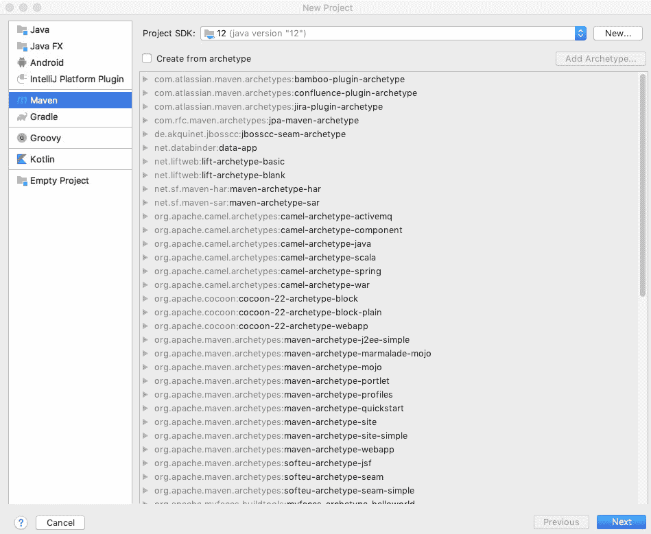
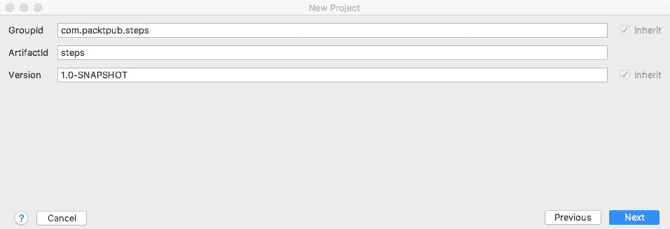
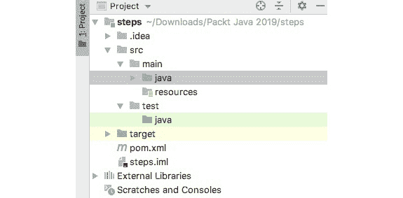
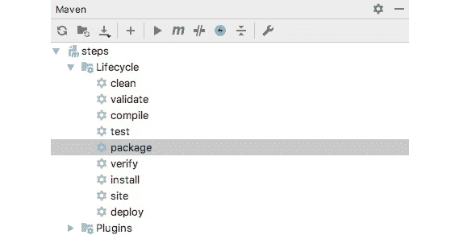
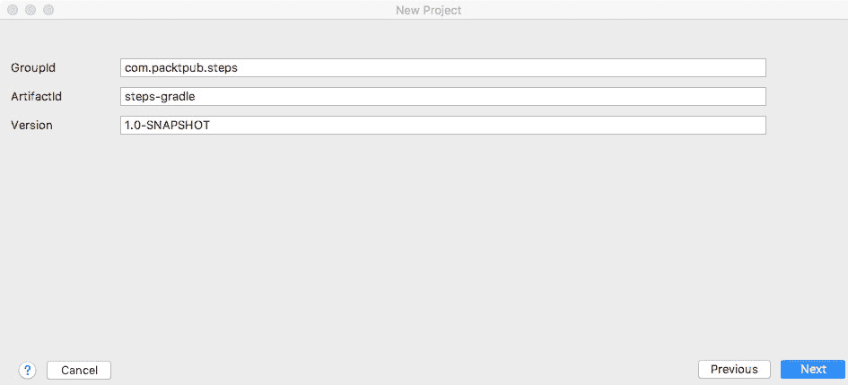
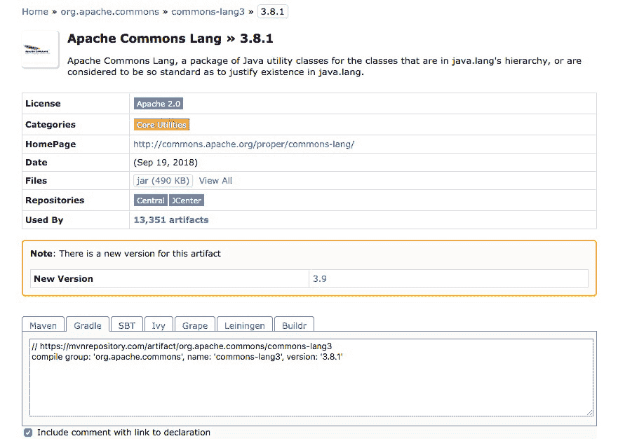
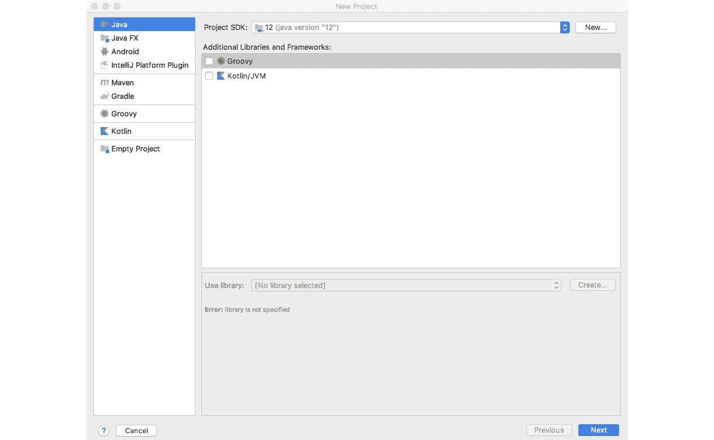
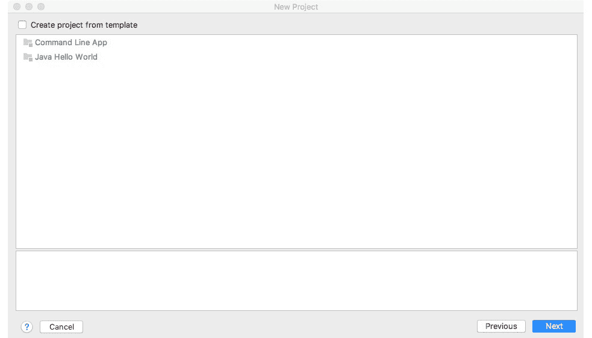
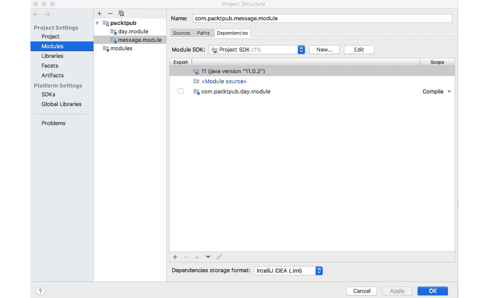

# 第六章：6. 库、包和模块

概述

本章将向您介绍打包和捆绑 Java 代码的各种方法，以及帮助构建您自己的 Java 项目的工具。第一步是学习如何将代码组织到包中，这样您就可以从这些包中构建一个**Java ARchive**（**JAR**）文件。从那里，您将练习使用 Maven 和 Gradle 等 Java 构建工具创建可执行 JAR 文件，这将进一步帮助您在项目中包含第三方开源库。到本章结束时，您将准备好创建自己的 Java 模块来组合您的包。

# 简介

任何复杂的 Java 应用程序都将需要许多独立的 Java 类。Java 提供了几种帮助您组织类的方法；其中之一就是包的概念。您可以将多个编译包组合成一个 Java 库，或者一个**Java ARchive**（**JAR**）文件。此外，您可以使用模块在代码中提供更高层次的抽象，仅暴露您认为适当的元素。

当您开始创建较大的应用程序时，您将想要利用 Java 的便捷构建工具——其中 Maven 和 Gradle 是最受欢迎的。构建工具使得构建可能依赖于其他项目和库的大型项目更加容易。构建工具还提供了运行测试和打包项目的标准方式。

Maven 和 Gradle 在将第三方开源库包含到您的应用程序中方面提供了显著的帮助。有数千个这样的库可供使用。

# 将代码组织到包中

Java 包将相关的类、接口、枚举（包含固定组常量的数据类型）和注解（包含元数据）组合在一起。换句话说，包是一组以共同名称汇集的 Java 类型。使用共同名称使得在较大的项目中查找代码更加容易，并有助于将您的代码与其他可能相似的代码分开。例如，可能不止一个包包含名为`Rectangle`的类，因此引用适当的包将允许您指定您正在寻找的哪个`Rectangle`类。包允许您组织您的代码，随着您处理越来越大的应用程序，这一点变得越来越重要。

Java 的 API 包括数百个类，这些类被分为包，例如`java.math`和`java.net`。正如您所期望的，`java.math`包含与数学相关的类，而`java.net`包含与网络相关的类。

## 导入类

当您使用`java.lang`包之外的包中的 Java 类时，您需要使用`import`语句来导入它们。Java 编译器默认导入`java.lang`包中的所有类。其余的则由您自己决定。

这里有一个例子：

```java
import java.time.DayOfWeek;
import java.time.LocalDateTime;
```

此代码从 `java.time` 包中导入了两种类型，`DayOfWeek` 和 `LocalDateTime`。现在，`DayOfWeek` 是一个表示星期的 Java `enum`，而 `LocalDateTime` 是一个包含日期和时间的类。

一旦你导入了这些类型，你就可以在代码中使用它们，如下所示：

```java
LocalDateTime localDateTime = LocalDateTime.now();
DayOfWeek day = localDateTime.getDayOfWeek();
System.out.println("The week day is: " + day);
```

## 练习 1：导入类

在这个练习中，我们将显示当前是星期几，并使用 `java.time` 包提取系统日期和时间。

1.  在 IntelliJ 中，从 `文件` 菜单中选择 `文件`、`新建`，然后选择 `项目`。

1.  在 `新建项目` 对话框中，选择一个 Java 项目。点击 `下一步`。

1.  打开复选框以从模板创建项目。点击 `命令行应用`。点击 `下一步`。

1.  将项目命名为 `chapter06`。

1.  对于项目的位置，点击带有三个点 (`…`) 的按钮，然后选择你之前创建的源文件夹。

1.  将 `com.packtpub.chapter06` 作为基本包名输入。我们将在本章后面更多地使用包。

1.  点击 `完成`。

    IntelliJ 将创建一个名为 `chapter06` 的项目，并在 `chapter06` 内部创建一个 `src` 文件夹。这是你的 Java 代码将驻留的地方。在这个文件夹内，IntelliJ 将为 `com`、`packtpub` 和 `chapter06` 创建子文件夹。

    IntelliJ 还会创建一个名为 `Main` 的类：

    ```java
    public class Main {
        public static void main(String[] args) {
        // write your code here
        }
    }
    ```

    将名为 `Main` 的类重命名为 `Example01`。

1.  在文本编辑器窗口中双击单词 `Main`。

1.  右键点击并从菜单中选择 `重构` | `重命名…`。

1.  输入 `Example01` 并按 *Enter*。

    你现在会看到以下代码：

    ```java
    public class Example01 {
        public static void main(String[] args) {
        // write your code here
        }
    }
    ```

    现在，在 `main()` 方法内输入以下代码：

    ```java
    LocalDateTime localDateTime = LocalDateTime.now();
    DayOfWeek day = localDateTime.getDayOfWeek();
    System.out.println("The weekday is: " + day);
    ```

    IntelliJ 应该会提供导入两种类型 `DayOfWeek` 和 `LocalDateTime` 的选项。如果由于某种原因你点击了错误的按钮，你可以在包声明之后和类定义之前添加以下几行：

    ```java
    package com.packtpub.chapter06;
    import java.time.DayOfWeek;
    import java.time.LocalDateTime;
    public class Example01 {
    ```

1.  现在，点击文本编辑器窗口左侧指向类名 `Example01` 的绿色箭头。选择第一个菜单选项，`运行` `Example01.main()`。

1.  在 `运行` 窗口中，你会看到你的 Java 程序的路径，然后是一些输出，如下所示：

    ```java
    The weekday is: SATURDAY
    ```

    你应该能看到当前是星期几。

包声明标识了此代码所在的包。请参阅本章后面的 `创建包` 部分，了解更多关于此主题的信息。

## 完全限定类名

你不必使用 `import` 语句。相反，你可以使用完全限定类名，如下所示：

```java
java.time.LocalDateTime localDateTime = java.time.LocalDateTime.now();
```

完全限定名称包括包和类型名称。以下示例也会给出与 *练习 01*、*导入类* 相同的结果。

```java
package com.packtpub.chapter06;
public class Example02 {
    public static void main(String[] args) {
        java.time.LocalDateTime localDateTime = java.time.LocalDateTime.now();
        java.time.DayOfWeek day = localDateTime.getDayOfWeek();
        System.out.println("The weekday is: " + day);
    }
}
```

通常，导入类和类型会使你的代码更容易阅读，并且需要更少的输入。在大型项目中，你会找到非常长的包名。将这些长名称放在每个声明的前面会使你的代码难以阅读。大多数 Java 开发者都会导入类，除非你有两个具有相同名称但存储在不同包中的类。

注意

大多数 IDE，如 IntelliJ，可以为您找到大多数类，并将提供导入类的建议。

## 导入包中的所有类

您可以使用星号 `*` 来导入包中的所有类，如下所示：

```java
import java.time.*;
```

星号被视为通配符字符，并导入给定包中的所有公共类型，在本例中为 `java.time`。Java 编译器将自动导入您在代码中使用此包中的任何类型。

注意

使用通配符导入可能会引入您未打算引入的不同类。一些包使用常见的类名，如 `Event`、`Duration` 或 `Distance`，这些可能与您想要使用的类型名称冲突。因此，如果您使用通配符导入，您可能会导入错误的类。通常，最好只导入您需要的类型。

`Example03.java` 展示了如何使用通配符导入：

```java
package com.packtpub.chapter06;
import java.time.*;
public class Example03 {
    public static void main(String[] args) {
        LocalDateTime localDateTime = LocalDateTime.now();
        DayOfWeek day = localDateTime.getDayOfWeek();
        System.out.println("The weekend is: " + day);
    }
}
```

当您运行此程序时，您将看到如下输出，具体取决于星期几：

```java
The weekday is: MONDAY
```

## 处理重复名称问题

如果出于某种原因，您必须使用两个具有相同名称的不同类，您将需要使用完全限定的类名。

当您与第三方库一起工作时，您可能会发现您的项目中存在多个具有相同名称的类。例如，`StringUtils` 在多个库的多个包中定义。在这种情况下，使用完全限定的类名来消除歧义。以下是一个示例：

```java
boolean notEmpty = org.springframework.util.StringUtils.isNotEmpty(str);
boolean hasLength = org.apache.commons.lang3.StringUtils.hasLength(str);
```

这两个类具有相同的基本名称 `StringUtils`，它们来自不同的第三方库。您将在本章后面了解更多关于第三方库的内容。

## 静态导入

许多类定义了常量，通常定义为 `static` `final` 字段。您可以通过导入封装类然后从类名引用它们来使用这些常量，如 *第三章*，*面向对象编程* 中所示。例如，Java 使用 `LocalDateTime` 类中的 `MAX` 常量定义时间的结束。

`Example04.java` 展示了如何静态导入 `LocalDateTime` 的 `MAX`，以查看宇宙何时结束，至少根据 Java 背后的公司的说法：

```java
package com.packtpub.chapter06;
import java.time.LocalDateTime;
public class Example04 {
    public static void main(String[] args) {
        System.out.println("The end of time is: " + LocalDateTime.MAX);
    }
}
```

当您运行此程序时，您将看到以下输出：

```java
The end of time is: +999999999-12-31T23:59:59.999999999
```

## 创建一个包

如前所述，一旦您开始编写更复杂的 Java 程序，您将希望将您的代码捆绑到一个包中。要创建一个包，您应该遵循以下步骤：

1.  命名您的包。

1.  为包创建适当的源目录。

1.  根据需要，在新的包中创建类和其他类型。

## 命名您的包

从技术上讲，您可以命名您的 Java 包任何您想要的名字，只要您遵守 Java 中变量和类型的命名规则。不要使用 Java 会解释为代码的字符。例如，您不能在 Java 包名称中使用连字符，-。Java 编译器会认为您正在进行减法操作。您也不能使用 Java 的保留词，如 `class`。

通常，您会使用您组织的域名反向作为包名。例如，如果域名是`packtpub.com`，那么您的包名将始于`com.packtpub`。您几乎总是希望在域名部分之后添加描述性名称，以便您组织代码。例如，如果您正在制作一个从健身追踪设备中提取数据的医疗应用程序，您可能会创建以下包：

+   `com.packtpub.medical.heartrate`

+   `com.packtpub.medical.tracker`

+   `com.packtpub.medical.report`

+   `com.packtpub.medical.ui`

使用对您的组织以及包中类的目的都有意义的名称。

使用您组织的域名的原因之一是，防止您的 Java 包与第三方库中的包具有相同的名称。域名注册商已经使域名变得独特。将域名反向使用可以使包的名称在深入包树时更加易于理解，例如`com.packtpub.medical.report.daily.exceptions`。此外，这个约定有助于将包与多个组织区分开来。

注意

Java API 提供的类位于以`java`或`javax`开头的包中。不要使用这些名称为您的包命名。

通常，您会希望将相关的类、接口、枚举和注解分组到同一个包中。

## 目录和包

Java 大量使用目录来定义包。包名中的每个点，如`java.lang`，都表示一个子目录。

在您为本章创建的 IntelliJ 项目中，您还创建了一个名为`com.packtpub.chapter06`的包。使用 IntelliJ 的`项目`窗格，您可以看到为该包创建的文件夹。

1.  在`项目`窗格中点击齿轮图标。

1.  取消选择`紧凑中间包`选项。

1.  您现在将看到`com.packtpub.chapter06`的文件夹，如图*6.1*所示：

![图 6.1：IntelliJ 的项目窗格可以显示构成 Java 包的各个文件夹]

![img/C13927_06_01.jpg]

图 6.1：IntelliJ 的项目窗格可以显示构成 Java 包的各个文件夹

注意

文件夹结构可能因您在本章中尝试的示例数量而有所不同。

通常，您会希望保持 IntelliJ 的`紧凑中间包`设置，因为它使得项目组织在直观上更容易看到。

## 练习 2：为健身追踪应用创建包

我们已创建一个名为`com.packtpub.chapter06`的包，作为本章示例的通用容器。在这个练习中，我们将创建另一个包来收集相关的一组类。

当创建一个与健身追踪器交互的应用程序时，你希望有一个用于跟踪每日步数的类包。用户将为每天想要走的步数设定一个目标，比如 10,000 步。追踪器将记录已走的步数，以及每日总步数的集合：

1.  在之前创建的`chapter06`项目中，在 IntelliJ 项目面板中点击齿轮图标。确保`Flatten Packages`和`Hide Empty Middle Packages`都已被选中。

1.  保持处于`Project`面板中，并在`src`文件夹上右键点击。选择`New`，然后选择`Package`。输入`com.packtpub.steps`包名，然后点击`OK`。这是我们新的包。

1.  在`com.packtpub.steps`包上右键点击，选择`New`，然后选择`Java Class`。输入`Steps`类名。

1.  输入以下字段定义：

    ```java
    private int steps;
    private LocalDate date;
    ```

1.  允许 IntelliJ 导入`java.time.LocalDate`，或者简单地在包声明之后、类定义之前输入以下代码：

    ```java
    package com.packtpub.steps;
    import java.time.LocalDate;
    /**
     * Holds steps taken (so far) in a day.
     */
    public class Steps {
        private int steps;
        private LocalDate date;
    }
    ```

1.  在类定义内右键点击。从菜单中选择`Generate…`。然后选择`Constructor`。选择`steps`和`date`，然后点击`OK`。

    你将看到一个全新的构造函数，如下所示：

    ```java
    public Steps(int steps, LocalDate date) {
        this.steps = steps;
        this.date = date;
    }
    ```

1.  再次在类定义内右键点击。选择`Generate…`，然后选择`Getter and Setter`。选择`steps`和`date`，然后点击`OK`。你现在将看到 getter 和 setter 方法：

    ```java
    public int getSteps() {
        return steps;
    }
    public void setSteps(int steps) {
        this.steps = steps;
    }
    public LocalDate getDate() {
        return date;
    }
    public void setDate(LocalDate date) {
        this.date = date;
    }
    ```

    我们现在有了新包中的第一个类。接下来，我们将创建另一个类。

1.  在项目面板中，在`com.packtpub.steps`包上右键点击，选择`New`，然后选择`Java Class`。输入`DailyGoal`类名。

1.  输入以下字段定义：

    ```java
    int dailyGoal = 10000;
    ```

    注意，我们默认每日步数目标为 10,000 步。

1.  在类定义内右键点击。从菜单中选择`Generate…`。然后选择`Constructor`，接着选择`dailyGoal`，然后点击`OK`。

1.  定义以下方法，用于确定`Steps`对象是否实现了每日目标：

    ```java
    public boolean hasMetGoal(Steps steps) {
        if (steps.getSteps() >= dailyGoal) {
            return true;
        }
        return false;
    }
    ```

1.  在项目面板中，在`com.packtpub.steps`包上右键点击，选择`New`，然后选择`Java Class`。输入`WeeklySteps`类名。

1.  输入以下字段：

    ```java
    List<Steps> dailySteps = new ArrayList<>();
    DailyGoal dailyGoal;
    ```

    你需要导入`java.util.List`和`java.util.ArrayList`。

1.  再次在类定义内右键点击。选择`Generate…`，然后选择`Getter and Setter`。选择`dailySteps`和`dailyGoal`，然后点击`OK`。你现在将看到 getter 和 setter 方法。

    要使用这个新类，我们将添加一些方法来确定最佳日（步数最多的一天），总计步数，并格式化输出。

1.  输入以下方法以确定最佳步数日：

    ```java
    public DayOfWeek bestDay() {
        DayOfWeek best = DayOfWeek.MONDAY;
        int max = 0;
        for (Steps steps : dailySteps) {
            if (steps.getSteps() > max) {
                max = steps.getSteps();
                best = steps.getDate().getDayOfWeek();
            }
        }
        return best;
    }
    ```

1.  现在，输入以下方法以总计每周步数：

    ```java
    public int getTotalSteps() {
        int total = 0;
        for (Steps steps : dailySteps) {
            total += steps.getSteps();
        }
        return total;
    }
    ```

    注意，这两个方法都会遍历`dailySteps`。这两个方法可以合并为一个。

    在一个真实的健身跟踪应用程序中，你可能会有一个智能手机或 Web 用户界面。然而，在这个例子中，我们将简单地生成每周步骤结果的字符串。

1.  输入以下方法：

    ```java
    WeeklySteps.java
    36 public String format() {
    37 
    38     StringBuilder builder = new StringBuilder();
    39 
    40     builder.append("Total steps: " + getTotalSteps() + "\n");
    41 
    42     for (Steps steps : dailySteps) {
    43         if (dailyGoal.hasMetGoal(steps)) {
    44             builder.append("YAY! ");
    45         } else {
    46             builder.append("     ");
    47         }
    https://packt.live/2quq4uh
    ```

    此方法使用`StringBuilder`和`DayOfWeek`，它们都是 Java API 的一部分。每当用户达到步骤目标时，都会出现一个鼓励的信息`YAY!`。最好的日子也会得到一个振奋人心的信息。

1.  为了帮助初始化每周步骤数据，我们将创建一个便利方法（一个存在以简化我们的代码并减少输入的方法）：

    ```java
    public void addDailySteps(int steps, LocalDate date) {
        dailySteps.add(new Steps(steps, date));
    }
    ```

1.  为了测试整个步骤跟踪包，我们将创建一个`main()`方法，以展示一切是如何结合在一起的：

    ```java
    WeeklySteps.java
    84 public static void main(String[] args) {
    85     // Initialize sample data.
    86     DailyGoal dailyGoal = new DailyGoal(10000);
    87
    88     WeeklySteps weekly = new WeeklySteps();
    89     weekly.setDailyGoal(dailyGoal);
    90
    91     int year = 2021;
    92     int month = 1;
    93     int day = 4;
    https://packt.live/2pB8nIG
    ```

    通常，你会将此类代码放入单元测试中，这是一种特殊的代码，用于确保你的类和算法是正确的。有关单元测试的更多信息，请参阅*第十八章*，*单元测试*。

1.  点击位于文本编辑器窗口左侧的绿色箭头，该箭头指向`WeeklySteps`类名。选择第一个菜单选项，`运行 'WeeklySteps.main()'`。

    你将看到类似以下内容的输出，对于 2021 年的一周健身数据（在 2021 年）：

    ```java
    Total steps: 92772
    YAY! MONDAY 11543
    YAY! TUESDAY 12112
    YAY! WEDNESDAY 10005
    YAY! THURSDAY 10011
         FRIDAY 9000
    YAY! SATURDAY 20053 ***** BEST DAY!
    YAY! SUNDAY 20048
    ```

现在你已经了解了 Java 代码组织的基本知识，我们将探讨一种特殊类型的文件，称为 Java 归档。

## 构建 JAR 文件

JAR 文件，即 Java 归档，包含多个文件，并提供了一种平台无关的方式来分发 Java 代码。对于一个 Java 库，JAR 文件将包含编译后的.class 文件，以及可能的其他文件，如配置数据、证书和图像文件，这些文件被称为资源，是库所必需的。专门版本的 JAR 文件用于打包和部署服务器端 Java 应用程序。

**WAR**文件，即**Web 归档**，包含 Web 应用程序的编译 Java 代码和资源。**EAR**文件，即**企业归档**，包含完整服务器端**Java 企业版**（**JavaEE**）应用程序的编译 Java 代码和资源。在底层，JAR 文件是一个压缩的 ZIP 文件。

要构建一个 JAR 文件，我们可以使用以下命令：

```java
jar cvf jar_file_name files_to_put_in
```

`c`选项告诉`jar`命令创建一个新的 JAR 文件。`f`选项指定新 JAR 文件的文件名。此文件名应紧接在选项之后出现。最后，你列出要放入 JAR 文件中的所有文件，通常是.class 文件。

注意

`v`选项（`cvf`的一部分）代表详细；也就是说，它是可选的，告诉 JAR 工具在执行时输出详细输出。

## 练习 3：构建 JAR 文件

在这个练习中，我们将编译`com.packtpub.steps`包的 Java 代码，然后构建一个 JAR 文件：

1.  在 IntelliJ 的终端面板中运行以下命令：

    ```java
    cd src
    javac com/packtpub/steps/*.java
    ```

    `javac`命令在`com/packtpub/steps`文件夹中创建了.class 文件。

1.  接下来，使用以下命令创建一个 JAR 文件：

    ```java
    jar cvf chapter6.jar  com/packtpub/steps/*.class
    ```

    此命令将生成输出，因为我们使用了详细选项：

    ```java
    added manifest
    adding: com/packtpub/steps/DailyGoal.class(in = 464) (out= 321)(deflated 30%)
    adding: com/packtpub/steps/Steps.class(in = 622) (out= 355)(deflated 42%)
    adding: com/packtpub/steps/WeeklySteps.class(in = 3465) (out= 1712)(deflated 50%)
    ```

您将看到当前目录中的新 JAR 文件，`chapter6.jar`。按照惯例，为 JAR 文件使用 `.jar` 文件名扩展名。

注意

名称 `jar` 和命令行语法基于一个更早的 UNIX 和 Linux 工具，名为 `tar`。

就像所有压缩文件一样，在我们开始使用它们之前，我们也必须解压缩 JAR 文件。要从 JAR 文件中提取所有文件，请使用 `jar xvf` 命令：

```java
jar xvf chapter6.jar
```

在这种情况下，`chapter6.jar` 是 JAR 文件的名称。

注意

JAR 命令行选项按顺序处理。在这种情况下，`f` 选项需要一个文件名参数。如果您添加另一个也需要参数的选项（例如后面在 *练习 04，构建可执行 JAR 文件* 中提到的 `e`），那么文件名需要在该附加参数之前。

要查看 JAR 文件内部的内容，请使用 `jar tf` 命令。在这种情况下，您可以通过从终端面板运行以下命令来查看您的新 JAR 文件内部：

```java
jar tf chapter6.jar
```

您将看到 JAR 文件中的文件列表作为输出：

```java
META-INF/
META-INF/MANIFEST.MF
com/packtpub/steps/DailyGoal.class
com/packtpub/steps/Steps.class
com/packtpub/steps/WeeklySteps.class
```

注意 `jar` 命令如何在其中创建一个名为 `META-INF` 的文件夹和一个在该文件夹中的名为 `MANIFEST.MF` 的文件。

默认情况下，`jar` 命令将创建一个包含以下内容的 `MANIFEST.MF` 文件：

```java
Manifest-Version: 1.0
Created-By: 11.0.2 (Oracle Corporation)
```

文件列出了一个版本号，以及创建该文件的 Java 版本——在这种情况下，来自 Oracle 的 Java 11。

## 定义清单

`MANIFEST.MF` 文件用于向 Java 工具提供有关 JAR 文件内容的信息。您可以添加版本信息，电子签名 JAR 文件等。可能添加到 JAR 文件清单中最有用的事情是标识 `main` 类。此选项命名具有 `main()` 方法的类，您希望从 JAR 文件中运行。本质上，这创建了一个可执行 JAR 文件。

可执行 JAR 文件允许您使用如下命令在 JAR 文件内运行 Java 应用程序：

```java
java -jar chapter6.jar
```

要做到这一点，您需要在 `MANIFEST.MF` 文件中创建一个条目，以定义主类。例如，对于 `WeeklySteps` Java 类，您会在 `MANIFEST.MF` 文件中创建一个条目，如下所示：

```java
Main-Class: com.packtpub.steps.WeeklySteps
```

## 练习 4：构建可执行 JAR 文件

在这个练习中，我们将在 JAR 文件内的 `MANIFEST.MF` 文件中添加一个 Main-Class 条目：

1.  使用以下命令重新创建 JAR 文件（所有内容都在一行上）：

    ```java
    jar cvfe chapter6.jar com.packtpub.steps.WeeklySteps com/packtpub/steps/*.class
    ```

    `e` 选项定义了一个入口点，换句话说，就是 Main-Class 标头。由于 JAR 命令行选项按顺序处理，这意味着您首先提供 JAR 文件名，然后是主类（入口点）的名称。这些选项很容易混淆。

    使用此 `jar` 命令，您将看到如下输出：

    ```java
    added manifest
    adding: com/packtpub/steps/DailyGoal.class(in = 464) (out= 321)(deflated 30%)
    adding: com/packtpub/steps/Steps.class(in = 622) (out= 355)(deflated 42%)
    adding: com/packtpub/steps/WeeklySteps.class(in = 251) (out= 185)(deflated 26%)
    ```

1.  现在，我们可以从 JAR 文件中运行我们的 Java 应用程序：

    ```java
    java -jar chapter6.jar
    ```

    此命令应生成 *练习 02*，*为健身追踪应用程序创建包* 中所示的输出：

    ```java
    Total steps: 92772
    YAY! MONDAY 11543
    YAY! TUESDAY 12112
    YAY! WEDNESDAY 10005
    YAY! THURSDAY 10011
         FRIDAY 9000
    YAY! SATURDAY 20053 ***** BEST DAY!
    YAY! SUNDAY 20048
    ```

    注意

    您可以在 [`packt.live/2MYsN6N`](https://packt.live/2MYsN6N) 上了解更多关于 jar 命令以及其他 Java 工具的信息。

当你只有一个包时，手动构建 JAR 文件并不困难。但是，当你开始添加越来越多的包时，手动构建 JAR 文件和操作内容变得相当繁琐。有更简单的方法来做这件事——最显著的是，通过使用可以帮助构建 JAR 文件的 Java 构建工具。

## 构建工具

随着应用程序变得越来越复杂，你会发现使用 Java 构建工具变得至关重要。构建工具允许你做以下事情：

+   构建跨多个包的 Java 应用程序。

+   使构建更容易运行和维护。

+   使构建保持一致。

+   从你的代码中创建库或多个库。

+   下载并将第三方库包含到你的应用程序中。

这些只是 Java 构建工具能为你做的事情的一小部分。

两个主要的 Java 构建工具有以下几种：

+   **Maven**，它生成 XML 配置文件

+   **Gradle**，它使用基于 Groovy 的领域特定语言进行配置

    注意

    有关 Maven 的更多信息，请参阅[`packt.live/33Iqprj`](https://packt.live/33Iqprj)，有关 Gradle 的更多信息，请参阅[`packt.live/35PNREO`](https://packt.live/35PNREO)。

## Maven

Maven 对你的软件项目的结构有非常具体的要求。例如，Maven 预期你的源代码将放入名为 `src` 的文件夹中。一般来说，最好是不要与 Maven 的期望作斗争。

注意

有关 Maven 对项目目录结构的期望的更多信息，请参阅[`packt.live/2nVNI1A`](https://packt.live/2nVNI1A)。

## 练习 5：创建 Maven 项目

IntelliJ 在与 Maven 一起工作时提供了一些非常实用的功能。我们现在将使用这些功能来创建 Maven 项目：

1.  在 IntelliJ 中，转到“文件”菜单，选择“新建”，然后选择“项目…”。

1.  在“新建项目”对话框中，选择`Maven`。然后，点击“下一步”，如图 *图 6.2* 所示：

    图 6.2：创建 Maven 项目时选择 Maven

    在下一屏，你需要输入三个值，如图 *图 6.3* 所示：

    

    图 6.3：输入 GroupId、ArtifactId 和版本

1.  对于 `GroupId`，输入 `com.packtpub.steps`。

    Maven 中的 `GroupId` 用来标识整个项目。通常，你将使用你的主要包名作为 `GroupId`。

1.  对于 `ArtifactId`，输入 steps。

    `ArtifactId` 是你为任何 JAR 文件想要的名字，不包括版本号。Maven 会为你添加版本信息。

1.  将 `Version` 保持为 `1.0-SNAPSHOT`。

    注意

    在 Maven 中，SNAPSHOT 版本表示正在进行中的工作。当你准备发布时，你通常会从版本信息中移除 SNAPSHOT 部分。

1.  点击“下一步”。

1.  在下一屏，IntelliJ 将默认将项目名称设置为 steps（来自 `ArtifactId`）。在磁盘上选择一个项目位置，然后点击“完成”。

现在你已经有一个 Maven 项目了。

在`项目`面板中，注意创建的目录结构。您将找到一个`src`文件夹。这个文件夹包含项目的源代码。在`src`下，您会看到名为`main`和`test`的文件夹。`main`文件夹是 Java 源代码所在的位置。`test`文件夹是单元测试所在的位置。单元测试是测试主代码的 Java 类。

注意

参考第十八章*单元测试*以获取有关单元测试的更多信息。

在主文件夹和测试文件夹中，您会看到名为`java`的文件夹。这表示 Java 源代码（例如，与 Groovy 或 Kotlin 代码相对）。

*图 6.4*显示了包含`src/main/java`和`src/test/java`文件夹的目录结构：



图 6.4：Maven 项目的 src/main/java 和 src/test/java 文件夹

当 Maven 构建您的项目时，编译代码和构建 JAR 文件，它将构建输出包含在名为`target`的文件夹中。

您还会看到一个名为`pom.xml`的文件。简称为**项目对象模型**，**POM**提供了 Maven 的配置，它告诉 Maven 您想构建什么以及如何构建。

IntelliJ 默认创建的 POM 文件`pom.xml`包含以下内容：

```java
<?xml version="1.0" encoding="UTF-8"?>
<project 

    xsi:schemaLocation="http://maven.apache.org/POM/4.0.0       http://maven.apache.org/xsd/maven-4.0.0.xsd">
    <modelVersion>4.0.0</modelVersion>
    <groupId>com.packtpub.steps</groupId>
    <artifactId>steps</artifactId>
    <version>1.0-SNAPSHOT</version>
</project>
```

您应该看到在 IntelliJ 中创建项目时输入的`groupId`、`artifactId`和版本信息。

## 练习 6：将 Java 源代码添加到 Maven 项目

我们现在将 Java 源代码添加到 Maven 项目中，如下所示：

1.  首先转到`src/main/java`文件夹。

1.  右键单击，选择`新建`，然后选择`包`。

1.  将`com.packtpub.steps`作为包名输入。

1.  接下来，从`Exercise 02`中引入三个源文件。您可以复制之前的文件。

1.  将`Steps.java`、`DailyGoal.java`和`WeeklySteps.java`复制到这个项目中。

    现在，让我们看看这三个文件。首先，这是`Steps.java`：

    ```java
    Steps.java
    1  package com.packtpub.steps;
    2  
    3  import java.time.LocalDate;
    4  
    5  /**
    6  * Holds steps taken (so far) in a day.
    7  */
    8  public class Steps {
    9      private int steps;
    10    private LocalDate date;
    https://packt.live/2MVxFJO
    ```

    这里是`DailyGoal.java`：

    ```java
    package com.packtpub.steps;
    public class DailyGoal {
        int dailyGoal = 10000;
        public DailyGoal(int dailyGoal) {
            this.dailyGoal = dailyGoal;
        }
        public boolean hasMetGoal(Steps steps) {
            if (steps.getSteps() >= dailyGoal) {
                return true;
            }
            return false;
        }
    }
    ```

    这里是`WeeklySteps.java`：

    ```java
    WeeklySteps.java
    1  package com.packtpub.steps;
    2  
    3  import java.time.DayOfWeek;
    4  import java.time.LocalDate;
    5  import java.util.ArrayList;
    6  import java.util.List;
    7  
    8  public class WeeklySteps {
    9      List<Steps> dailySteps = new ArrayList<>();
    10    DailyGoal dailyGoal;
    https://packt.live/32wiz3Q
    ```

1.  在 IntelliJ 编辑器窗口中调用`Steps.java`。

    您会注意到项目中出现了一些错误。这是因为 Maven 默认不使用 Java 12。下一步将解决这个问题。

1.  在 IntelliJ 编辑器窗口中调用`pom.xml`。

1.  在`groupId`、`artifactId`和`version`之后输入以下内容：

    ```java
    <groupId>com.packtpub.steps</groupId>
    <artifactId>steps</artifactId>
    <version>1.0-SNAPSHOT</version>
    <build>
        <plugins>
            <plugin>
                <groupId>org.apache.maven.plugins</groupId>
                <artifactId>maven-compiler-plugin</artifactId>
                <version>3.6.1</version>
                <configuration>
                    <source>12</source>
                    <target>12</target>
                </configuration>
            </plugin>
        </plugins>
    </build>
    ```

    当您输入此配置时，注意 IntelliJ 如何提供帮助您输入 XML 元素。

1.  当您完成时，IntelliJ 将显示一个警告，表明 Maven 项目需要导入。单击`导入更改`。

    `Steps`和`WeeklySteps`的红色错误行应该消失。

现在，您应该能够构建您的项目。这将在*练习 07，构建 Maven 项目*中介绍。

## 练习 7：构建 Maven 项目

现在我们已经添加了 Java 源代码，我们将构建 Maven 项目。

1.  首先，转到`steps`项目，然后单击 IntelliJ 窗口右上角附近的`Maven`选项卡。

1.  展开`steps`项目。

1.  展开`生命周期`。

    您现在将看到一个 Maven 目标列表，如图*图 6.5*所示：

    

    图 6.5：IntelliJ 的 Maven 选项卡

1.  双击 `package`。在 `运行` 窗格中，你会看到很多输出。Maven 默认是一个非常冗长的工具。项目现在已构建。

1.  查看目标目录。你会看到构建的输出。

Maven 创建的 JAR 文件名为 steps-`1.0-SNAPSHOT.jar`。它包含了所有编译后的 `.class` 文件。

然而，Maven 创建的 JAR 文件并不是可执行的 JAR 文件。*练习 08*，*使用 Maven 创建可执行 JAR* 将会展示如何配置 Maven 以创建一个可执行 JAR。

## 练习 8：使用 Maven 创建可执行 JAR

在这个练习中，我们将使用 Maven 创建一个可执行 JAR。

1.  在 `步骤` 项目中，在 IntelliJ 编辑器窗口中打开 `pom.xml`。

1.  在 Maven 编译器插件的 `<plugin>` 部分之后输入以下内容：

    ```java
    pom.xml
    24 <plugin>
    25     <groupId>org.apache.maven.plugins</groupId>
    26     <artifactId>maven-shade-plugin</artifactId>
    27     <executions>
    28         <execution>
    29             <goals>
    30                 <goal>shade</goal>
    31             </goals>
    32             <configuration> 
    33                 <transformers>
    34                     <transformer implementation=
    35                         "org.apache.maven.plugins.shade.resource.ManifestResourceTransformer">
    https://packt.live/33KFUPs
    ```

    此配置引入了 Maven shade 插件，它提供了创建可执行 JAR 的主要方法之一。shade 插件还会创建一个包含所有必要依赖项的 JAR 文件，例如第三方库，这使得这个 Maven 插件非常实用。

1.  在 `Maven` 选项卡中运行 `package` 目标。

    你将看到很多输出。

1.  切换到 `终端` 窗格。

1.  切换到 `target` 目录：

    ```java
    cd target
    ```

1.  运行可执行 JAR：

    ```java
    java -jar steps-1.0-SNAPSHOT.jar
    ```

    你将看到如下输出：

    ```java
    Total steps: 92772
    YAY! MONDAY 11543
    YAY! TUESDAY 12112
    YAY! WEDNESDAY 10005
    YAY! THURSDAY 10011
         FRIDAY 9000
    YAY! SATURDAY 20053 ***** BEST DAY!
    YAY! SUNDAY 20048
    ```

Maven 有很多内容。这个练习只是触及了构建工具的表面。

注意

请参考 [`packt.live/33Iqprj`](https://packt.live/33Iqprj) 了解有关 Maven 的多个教程。

## 使用 Gradle

虽然 Maven 可以为你做很多事情，但它通常不够灵活，有时还会让人困惑，尤其是在大型项目中。试图解决这些问题导致了 Gradle 的诞生。例如，在 Maven 中，每个 POM 文件构建一个东西，比如一个 JAR 文件。使用 Gradle，你可以使用同一个构建文件（Gradle 的 POM 文件等价物）执行额外的任务。

Gradle 比 Maven 更灵活，通常——但并非总是——更容易理解。

## 练习 9：创建 Gradle 项目

在这个练习中，我们将创建一个 Gradle 项目。

1.  首先，打开 IntelliJ，然后在 `文件` 菜单中选择 `新建`，然后选择 `项目`。

1.  选择 `Gradle`，在右侧窗格中，保持 Java 选中，如图 *图 6.6* 所示：

    图 6.6：创建新项目时选择 Gradle

1.  点击 `下一步`。输入 `GroupId`、`ArtifactId` 和 `Version`，就像你在 Maven 项目中做的那样，如图 *图 6.7* 所示：

    图 6.7: 输入 GroupId、ArtifactId 和 Version

1.  为 `GroupId` 输入 `com.packtpub.steps`。

1.  为 `ArtifactId` 输入 `steps-gradle`。

1.  将版本信息保留在 `1.0-SNAPSHOT`。

    注意，Gradle 使用与 Maven 相同的机制来识别依赖项。

1.  点击 `下一步`。

1.  保留所有默认选项。为每个源集创建一个单独的模块，并使用默认的 gradle wrapper。

1.  点击 `下一步`。

1.  在下一个屏幕上，IntelliJ 会默认将 IntelliJ 项目名称设置为 steps-gradle（从 `ArtifactId`）。在磁盘上选择一个项目位置，然后点击 `Finish`。

    IntelliJ 会构建一段时间，然后你可以查看新的项目目录。

IntelliJ 创建的 Gradle 项目与 Maven 项目非常相似。例如，你会在 `src` 里面看到相同的 `main` 和 `test` 文件夹。

你还会看到两个新文件：

+   `build.gradle` 文件为 Gradle 提供了主要的配置文件。

+   `settings.gradle` 包含一些额外的设置。

IntelliJ 生成的 `build.gradle` 文件包含以下配置：

```java
plugins {
    id 'java'
}
group 'com.packtpub.steps'
version '1.0-SNAPSHOT'
sourceCompatibility = 1.8
repositories {
    mavenCentral()
}
dependencies {
    testCompile group: 'junit', name: 'junit', version: '4.12'
}
```

## 练习 10：使用 Gradle 构建可执行 JAR

在这个练习中，我们将添加与 Maven 示例中相同的三个 Java 类，然后配置 `build.gradle` 文件以创建一个可执行 JAR 文件。我们将在这个之前练习中创建的 `steps-gradle` 项目中工作。

1.  在 `steps-gradle` 项目中，转到 `src/main/java` 文件夹。

1.  右键点击，然后选择 `New` 并选择 `Package`。

1.  将包名输入为 `com.packtpub.steps`。

1.  接下来，从 `Exercise 02` 中引入三个源文件。你可以复制之前的文件。

1.  在 IntelliJ 文本编辑器中调用 `build.gradle` 文件。

1.  将 `sourceCompatibility` 设置为 12：

    ```java
    sourceCompatibility = 12
    ```

1.  在 `build.gradle` 文件的末尾添加以下部分：

    ```java
    jar { 
        manifest { 
            attributes 'Main-Class': 'com.packtpub.steps.WeeklySteps' 
        } 
    }
    ```

1.  点击 IntelliJ 窗口右上角附近的 `Gradle` 选项卡。

1.  展开并进入 `steps-gradle` 项目，然后是 `Tasks`，再然后是 `build`。

1.  双击 `ASSEMBLE` 来构建项目。

    你会看到 Gradle 输出的文本比 Maven 少得多。完成后，你会看到一个构建目录。这与 Maven 使用的目标目录类似。Java `.class` 文件和 JAR 文件都放在构建目录中。

1.  切换到 `Terminal` 面板。

1.  切换到 `build/libs` 目录：

    ```java
    cd build
    cd libs
    ```

1.  运行可执行 JAR：

    ```java
    java -jar steps-gradle-1.0-SNAPSHOT.jar
    ```

    你应该会看到与之前相同的输出。

与 Maven 一样，你可以用 Gradle 做很多事情。

备注

你可以在 [`packt.live/2P3Hjg2`](https://packt.live/2P3Hjg2) 上了解更多关于 Gradle 的信息。你可以在 [`packt.live/2Mv5CBZ`](https://packt.live/2Mv5CBZ) 上找到更多关于 Gradle 处理 Java 项目的信息。

## 使用第三方库

使用 Java 进行开发最美好的事情之一是成千上万的开源第三方库可用。第三方库是一组现成的包，你可以在自己的程序中使用。这意味着你可以实现特定的功能，而无需从头编写代码。

从 Spring Boot 框架到日志库和简单的实用工具，你都可以在网上找到。而且，为了使事情更简单，Maven 和 Gradle 构建工具都支持下载第三方库并将这些库集成到你的项目中。

## 查找库

对于 Java，有大量的第三方库可用。要查看一些库的描述，一个好的起点是 [`packt.live/2qnRAcx`](https://packt.live/2qnRAcx)，它列出了许多 Java 库和框架。

`Spring`、`Hibernate`、`Apache`、`Eclipse` 和 `BouncyCastle` 项目提供了大量的库。它们都可以在之前提到的链接中找到，并且是寻找所需功能的好地方。

在选择开源库之前，您可能想查看以下主题：

+   **文档** – 良好的文档不仅有助于您学习如何使用库，而且可以作为库成熟度的良好指标。您能理解如何使用库吗？如果不能，这个库可能不适合您。

+   **社区** – 一个活跃的社区表明库正在被使用。它还提供了对库维护者如何对待提问者的一个了解。寻找有关该库的邮件列表和讨论组。

+   **动力** – 检查库更新的频率。您希望选择处于积极开发中的库。

+   **它适合您吗**？ – 总是尝试每个库，以确保它确实适用于您的项目，并且您能够理解如何使用该库。

+   **许可证** – 您能否合法使用这个库？首先确保这一点。参考 [`packt.live/2MTZfqD`](https://packt.live/2MTZfqD) 了解最常见的开源许可证列表。阅读许可证，看看它是否适合您的组织。如果许可证看起来很奇怪或限制性太强，请避免使用该库。

    注意

    总是查看任何开源库的许可证，以确保您的组织可以合法地以您想要的方式使用该库。

一旦找到一个看起来很有希望的库，下一步就是将库导入到您的应用程序中。

## 添加项目依赖

您在项目中包含的第三方库被称为依赖项。将此视为您的项目现在依赖于这个库。Maven 和 Gradle 都以类似的方式识别依赖项。您需要以下内容：

+   GroupId

+   ArtifactId

+   版本信息

+   一个构建工具可以从中下载库的仓库

最常用的第三方开源库可以从一个名为 `Maven Central` 的庞大仓库中下载，该仓库位于 [`packt.live/2pvXmZs`](https://packt.live/2pvXmZs)。

您可以在位于 [`packt.live/33UlfZF`](https://packt.live/33UlfZF) 的便捷网站上搜索组、工件和版本信息。

一个好用的开源库是 `Apache Commons Lang`，它包含了一些方便的类，用于处理字符串和数字。

## 练习 11：添加第三方库依赖项

在这个练习中，我们将向之前在 *练习 09 和 10* 中创建的 Gradle 项目添加 Apache Commons Lang 库。在这些练习中，我们将只添加一个，以简化整个设置。

在大型、复杂的项目中，你经常会看到很多依赖项。这里使用的概念在你开始添加更多依赖项时同样适用：

1.  在[`packt.live/33UlfZF`](https://packt.live/33UlfZF)上搜索 Apache Commons Lang。你应该能在[`packt.live/33JnQ8n`](https://packt.live/33JnQ8n)找到这个库的页面。

1.  查找最新发布的版本。在撰写本文时，版本是 3.8.1。

    注意有多少个发布版本。这个库似乎正在积极开发中。

1.  点击`3.8.1`链接。

1.  查看许可信息。Apache 许可证与大多数组织兼容。

    在这个页面上，你会看到一组用于不同 Java 构建工具的标签页，默认选中 Maven 标签页。在标签页内，你会看到在 Maven POM 文件中使用的格式显示的组、工件和版本信息。

1.  点击`Gradle`选项卡以查看格式化的相同信息，如图 6.8 所示：

    图 6.8：使用 Gradle 选项卡查看 Gradle 依赖信息

1.  复制此文本并将其添加到你的`build.gradle`文件中的依赖块。

1.  将单词`*compile*`改为`*implementation*`：

    ```java
    implementation group: 'org.apache.commons', name: 'commons-lang3', version: '3.8.1'
    ```

    在 Gradle 的较新版本中，编译依赖已被实现依赖所取代。

1.  在 IntelliJ 的提示需要导入 Gradle 项目的警告中，点击`导入更改`。

    现在我们已经在项目中有了这个库。接下来我们需要做两件事。首先，我们需要配置 Gradle 以构建一个包含所有依赖项的可执行 JAR 文件。其次，我们需要在我们的代码中使用这个新依赖项——这个新库。

    下一步是将 Gradle shadow 插件添加到项目中。此插件将项目中的代码（以及任何第三方库和其他依赖项）合并到一个单独的 JAR 文件中，其中包含所需的一切。

    注意

    你可以在[`packt.live/33Irb7H`](https://packt.live/33Irb7H)和[`packt.live/31qGIYs`](https://packt.live/31qGIYs)找到关于 Gradle shadow 插件的更多信息。

1.  在 IntelliJ 文本编辑器中调用`build.gradle`。

1.  将`plugins`块替换为以下内容：

    ```java
    buildscript {
        repositories {
            jcenter()
        }
        dependencies {
            classpath 'com.github.jengelman.gradle.plugins:shadow:2.0.1'
        }
    }
    apply plugin: 'java'
    apply plugin: 'com.github.johnrengelman.shadow' 
    ```

    这告诉 Gradle 将 shadow 插件引入我们的项目。

1.  前往 IntelliJ 中的 Gradle 面板。点击`刷新`图标（两个圆形箭头）。

1.  展开新的 shadow 任务。

1.  双击`shadowJar`。

    这将构建一个新的 JAR 文件，`steps-gradle-1.0-SNAPSHOT-all.jar`，其中包含项目代码以及所有依赖项。注意，格式是工件 ID - 版本 - `all.jar`。

1.  切换到`终端`面板。

1.  输入以下命令：

    ```java
    cd build
    cd libs
    java -jar steps-gradle-1.0-SNAPSHOT-all.jar
    ```

    你将看到`Steps`应用程序的输出。

在这个练习中，我们添加了一个第三方依赖库。接下来，我们将在应用程序中使用这个新库。

## 使用 Apache Commons Lang 库

当使用新库时，通常最好先查看文档。对于 Java 实用库，Javadoc 是一个好的起点。

对于 Apache Commons Lang 库，您可以在 [`packt.live/32wkrJR`](https://packt.live/32wkrJR) 找到 Javadoc。打开第一个包，`org.apache.commons.lang3`。

在这个包中，您会发现一组非常实用的实用工具类，包括出色的 `StringUtils` 类。`StringUtils` 提供了处理字符串的多种方法。而且，更好的是，这些方法是空安全，所以如果您传递一个 null 字符串，您的代码不会抛出异常。

打开 `StringUtils` 的 Javadoc。您将看到许多与这个类相关的良好文档。

## 练习 12：使用 Apache Commons Lang 库

在这个练习中，我们将使用 `StringUtils` 类的两个实用方法，`leftPad()` 和 `rightPad()`。这些方法通过在左侧或右侧填充空格字符来确保字符串具有特定的长度。

我们将使用这些方法使 `Steps` 应用程序的输出看起来更好：

1.  在 IntelliJ 中，将 `WeeklySteps` 类调入文本编辑器。

1.  滚动到 `format()` 方法。

1.  将该方法替换为以下代码：

    ```java
    public String format() {
        StringBuilder builder = new StringBuilder();
        builder.append("Total steps: " + getTotalSteps() + "\n");
        for (Steps steps : dailySteps) {
            if (dailyGoal.hasMetGoal(steps)) {
                builder.append("YAY! ");
            } else {
                builder.append("     ");
            }
            String day = steps.getDate().getDayOfWeek().toString();
            builder.append( StringUtils.rightPad(day, 11) );
            builder.append(" ");
            String stp = Integer.toString(steps.getSteps());
            builder.append( StringUtils.leftPad( stp, 6 ) );
            DayOfWeek best = bestDay();
            if (steps.getDate().getDayOfWeek() == best) {
                builder.append(" ***** BEST DAY!");
            }
            builder.append("\n");
        }
        return builder.toString();
    }
    ```

    这段代码将一周中每一天的日期填充到一致长度。它对每日步数计数也做了同样处理。

1.  再次从 Gradle 面板运行 `shadowJar` 构建任务。

1.  在终端面板中，在 `build/libs` 目录下，运行以下命令：

    ```java
    java -jar steps-gradle-1.0-SNAPSHOT-all.jar 
    ```

    您将看到现在输出已经对齐得更好：

    ```java
    Total steps: 92772
    YAY! MONDAY       11543
    YAY! TUESDAY      12112
    YAY! WEDNESDAY    10005
    YAY! THURSDAY     10011
         FRIDAY        9000
    YAY! SATURDAY     20053 ***** BEST DAY!
    YAY! SUNDAY       20048
    ```

几乎您所工作的每个 Java 项目都将需要多个依赖项。

## 使用模块

Java 包允许您将相关的类（以及其他类型）聚集在一起。然后您可以将多个包打包成一个 JAR 文件，创建一个可以使用的库。

模块更进一步，允许您有效地封装您的库。这意味着您可以声明模块的哪些公共类（以及其他类型）可以在模块外部访问。

注意

Java 9 及更高版本支持称为 **Java 平台模块系统**（**JPMS**）的模块。

此外，模块可以声明对其他模块的显式依赖。这有助于清理 Java 类路径的混乱。而不是在类路径中搜索类，模块将直接搜索一个命名的依赖模块。这在引入大量依赖项时非常有帮助。对于大型 Java 应用程序，某些库可能依赖于同一库的不同版本，导致各种问题。相反，每个模块都允许您将它的依赖项与其他应用程序部分隔离开来。

模块会查找所谓的模块路径。模块路径只列出模块，不列出类。

在一个模块中，可以导出模块中的包。如果一个模块中的包没有被导出，那么其他模块就不能使用该包。

想要从另一个模块使用代码的模块必须指明它需要该模块。在一个模块内部，您的代码只能使用依赖模块中导出的包。

注意

当你开始使用模块时，你将希望将你创建的每个 Java 库转换为一个或多个模块。每个 JAR 文件只能有一个模块。

注意

创建 Java 模块系统的原始项目被称为 PROJECT JIGSAW。有关模块的更多信息，请参阅[`packt.live/32yH1le`](https://packt.live/32yH1le)。这项工作的大部分努力是向**Java 开发工具包**（或**JDK**）添加模块。这允许你创建针对移动平台等的小型 JDK。

要查看构成 JDK 的所有模块，请使用 java 命令。

从 IntelliJ 终端面板运行以下命令：

```java
java --list-modules
```

你将在输出中看到很多模块（这里已缩短）：

```java
java.base@11.0.2
java.compiler@11.0.2
java.datatransfer@11.0.2
java.desktop@11.0.2
java.instrument@11.0.2
java.logging@11.0.2
java.management@11.0.2
java.management.rmi@11.0.2
java.naming@11.0.2
java.net.http@11.0.2
…
jdk.hotspot.agent@11.0.2
jdk.httpserver@11.0.2
jdk.internal.ed@11.0.2
```

以 java 开头的模块是我们认为属于 JDK 的类，即你可以在 Java 代码中使用这些类的类。以 jdk 开头的模块是 JDK 内部需要的模块。你不应该使用这些类。

## 创建模块

一个模块将一组 Java 包和附加资源（文件）组合在一起。每个模块都需要一个`module-info.java`文件，该文件指定了模块导出什么以及需要哪些其他模块。

## 练习 13：为模块创建项目

在这个练习中，我们将创建一个 IntelliJ 项目，我们可以使用它来探索 Java 模块，然后在项目中创建一个 Java 模块：

1.  从`文件`菜单中选择`New`，然后选择`Project…`。

1.  选择一个`Java`项目并点击`Next`，如图 6.9 所示：

    图 6.9：选择 Java 项目

1.  不要指定项目模板。点击`Next`，如图 6.10 所示：

    图 6.10：不要选择项目模板

1.  命名项目模块。

1.  点击`Finish`。你现在有一个空的 Java 项目。下一步将是创建一个非常简单的模块。

1.  从`文件`菜单中选择`New`，然后选择`Module…`。

1.  确保选择了 Java。点击`Next`。

1.  将`com.packtpub.day.module`作为模块名输入。确保内容根和文件位置都在模块文件夹下的`com.packtpub.day.module`。

1.  点击`Finish`。你现在有一个模块了。

    初始时可能会觉得模块名`com.packtpub.day.module`被创建为一个单独的目录可能会令人困惑。

    注意

    通常，在包中，每个点号在名称中代表一个单独的子文件夹。在模块中，你得到一个带有点号的文件夹名。

    IntelliJ 在项目中创建了一个名为`com.packtpub.day`.module 的文件夹，并在`com.packtpub.day.module`下创建了一个`src`文件夹。

1.  右键点击`com.packtpub.day`模块下的`src`文件夹。

1.  选择`New`，然后选择`Package`。

1.  将`com.packtpub.day`作为包名输入。

1.  右键点击新包`com.packtpub.day`，选择`New`，然后选择`Java class`。将类命名为`Today`。

1.  在文本编辑器窗口中，向新类添加一个方法：

    ```java
    public String getToday() {
        return LocalDate.now().getDayOfWeek().toString();
    }
    ```

    此方法返回当前日期的星期几作为字符串。

1.  右键点击包`com.packtpub.day`，选择`New`，然后选择`module-info.java`。

1.  在文本编辑器中，在`module`块内添加以下`exports`行：

    ```java
    module com.packtpub.day.module {
        exports com.packtpub.day;
    }
    ```

    `com.packtpub.day`模块导出一个包，`com.packtpub.day`。添加到此模块的任何其他内容都将被隐藏。

现在我们已经有一个模块了，下一步是将此模块用于另一个模块。这将展示模块如何控制哪些类被导出供其他模块使用，以及哪些类在模块内部保持私有。模块并排存在，但两者都需要包含在你的项目模块路径中——这是 Java 类路径的模块等价物。

## 练习 14：使用第一个模块创建第二个模块

接下来，我们将创建一个第二个非常简单的模块，该模块使用之前创建的`com.packtpub.day`模块。

1.  从`文件`菜单中选择`新建`然后`模块…`。

1.  确保已选择 Java，然后点击`下一步`。

1.  将此模块命名为`com.packtpub.message.module`。

1.  点击`完成`。

1.  右键点击`com.packtpub.message`模块下的`src`文件夹。

1.  选择`新建`然后`包`。

1.  将`包`命名为`com.packtpub.message`并点击`确定`。

1.  右键点击`com.packtpub.message`包。选择`新建`然后`module-info.java`。

1.  右键点击`com.packtpub.message`包。选择`新建`然后`Java 类`。

1.  将类命名为`Message`。

1.  在文本编辑器中，编辑`Message`类并导入`Today`类：

    ```java
    import com.packtpub.day.Today;
    ```

1.  在文本编辑器中，创建一个如下所示的`main()`方法：

    ```java
    public static void main(String[] args) {
        Today today = new Today();
        System.out.println("Today is " + today.getToday());
    }
    ```

1.  编辑`com.packtpub.message.module`模块中的`module-info.java`文件。添加以下`requires`语句：

    ```java
    module com.packtpub.message.module {
        requires com.packtpub.day.module;
    }
    ```

    `requires`语句将显示错误。我们需要在 IntelliJ 项目中将`com.packtpub.day.module`模块作为依赖项添加。

1.  从`文件`菜单中选择`项目结构`。

1.  点击`模块`。

1.  在`com.packtpub`下选择`message.module`。

1.  点击`依赖项`选项卡。

1.  在对话框窗口底部点击`+`图标并选择`模块依赖…`。

1.  选择`com.packtpub.day.module`并点击`确定`。

    你应该看到新模块依赖项已添加，如图 6.11 所示。

1.  在之前的对话框中点击`确定`。错误应该不再存在。

1.  在`Message`类中，点击类定义左侧的绿色箭头，并选择`运行'Message.main()'`。

    你将看到如下输出：

    ```java
    Today is THURSDAY
    ```




## 活动一：跟踪夏季高温

关于气候变化的研究已经确定了 2100 年夏季高温将是什么样的。

你可以在[`packt.live/33IrCyR`](https://packt.live/33IrCyR)上看到许多世界城市的此类信息。

创建一个应用程序，显示在不进行重大排放削减或进行适度排放削减的情况下，预计 2100 年夏季高温将有多高。

要完成此操作，请按照以下步骤：

1.  在 IntelliJ 中创建一个新的 Gradle 项目。

1.  将 Guava 第三方库作为依赖项引入。有关 Guava 的更多信息，请参阅[`packt.live/2qkLutt`](https://packt.live/2qkLutt)。

1.  创建一个名为 `City` 的类，该类包含城市的名称、城市所在国家的名称以及其夏季高温。请记住，IntelliJ 可以为你生成 getter 和 setter 方法。

1.  创建一个名为 `SummerHigh` 的类，该类包含一个基础城市，以及在没有减少排放的情况下最接近 2100 年夏季预测的城市，以及如果适度减少排放则匹配 2100 年夏季预测的城市（基于 Climate Central 的数据）。

1.  创建一个名为 `SummerHighs` 的类来存储整体数据存储。这个类应该有通过城市名称（不考虑大小写）或国家名称（不考虑大小写）检索数据的方法。

1.  使用 Guava Table 来存储底层的 `SummerHigh` 数据，使用如下所示的 Table：

    ```java
    Table<String String, SummerHigh> data = HashBasedTable.create();
    ```

1.  创建一个 `Main` 类，它接受一个城市或国家名称，查找适当的数据，然后打印出来。使用命令行参数 `-city` 进行城市查找，使用 `-country` 进行国家查找。

    应该将项目的整个代码库合并到一个可执行的 JAR 中。从 IntelliJ 终端面板运行此 JAR。

    你应该能够像以下这样运行这个 JAR：

    ```java
    java -jar temps-1.0-all.jar  -city London
    ```

    应该生成如下所示的输出：

    ```java
    In 2100, London, United Kingdom 20.4 C will be like
       Milan, Italy 25.2 C with no emissions cuts,
       Paris, France 22.7 C with moderate emissions cuts
    ```

1.  添加一个温度转换类，使其能够输出华氏度而不是摄氏度。

1.  添加一个 `-f` 命令行选项，告诉应用程序以华氏度返回温度。

1.  创建一个名为 `TempConverter` 的类来执行转换。

1.  使用以下公式来转换温度单位：

    ```java
    double degreesF = (degreesC * 9/5) + 32
    ```

    你应该能够运行应用程序：

    ```java
    java -jar temps-1.0-all.jar  -city London -f
    ```

    你应该看到以华氏度输出的温度。以下是一个示例：

    ```java
    In 2100, London, United Kingdom 68.72 F will be like
       Milan, Italy 77.36 F with no emissions cuts,
       Paris, France 72.86 F with moderate emissions cuts
    ```

    注意

    有关 `Table` 类的更多信息，请参阅[`packt.live/2pvYxbk`](https://packt.live/2pvYxbk)。`row()` 和 `column()` 方法。我们使用这个类来允许通过城市或国家进行查找。

**夏季高温**

这里列出了来自 Climate Central 地图的一些选定城市。每个城市都列出了其夏季高温。请随意将这些城市包含在你的程序中。如果你喜欢，还可以添加更多来自 Climate Central 的城市。

**伦敦，英国，20.4 °C**：

+   将类似于巴黎，法国，22.7 °C，适度减少排放。

+   将类似于米兰，意大利，25.2 °C，没有减少排放。

**斯德哥尔摩，瑞典，19.3 °C**：

+   将类似于维尔纽斯，立陶宛，21.7 °C，适度减少排放。

+   将类似于基辅，乌克兰，24.2 °C，没有减少排放。

**巴塞罗那，西班牙，25.7 °C**：

+   将类似于马德里，西班牙，28.9 °C，适度减少排放。

+   将类似于伊兹密尔，土耳其，32.2 °C，没有减少排放。

**纽约，美国，27.7 °C**：

+   将类似于伯利兹城，伯利兹，31.3 °C，适度减少排放。

+   将类似于华雷斯，墨西哥，34.4 °C，没有减少排放。

**东京，日本，26.2 °C**：

+   将与中国的北京一样，气温为 29.0°C，有适度的排放削减。

+   将与中国的武汉一样，气温为 31.2°C，没有排放削减。

    注意

    这个活动的解决方案可以在第 542 页找到。

# 摘要

在本章中，我们看到了如何通过包来更好地组织你的代码，这在处理大型项目时变得至关重要。当你使用来自另一个包的类时，你需要将这些类导入到你的代码中。

当你创建自己的包时，将你的代码放入基于代码目的的包中，并根据你组织的互联网域名来命名这些包。例如，你可能创建名为`com.packtpub.medical.report`和`com.packtpub.medical.heartrate`的包。

你经常会将你的 Java 代码集成到一个 JAR 文件中。JAR 文件就像是一个编译后的 Java 代码库。可执行 JAR 文件包含一个具有`main()`方法的 Java 类名，你可以使用`java-jar`命令来运行它。

当你在大型项目中工作时，Java 构建工具如 Maven 或 Gradle 非常有帮助。这两个构建工具还支持下载和使用第三方开源 Java 库——这些库几乎在每一个大型 Java 项目中都会用到。

模块是一种新的代码分离方式。在下一章中，我们将介绍关系型数据库以及如何使用 Java 与数据库结合。
