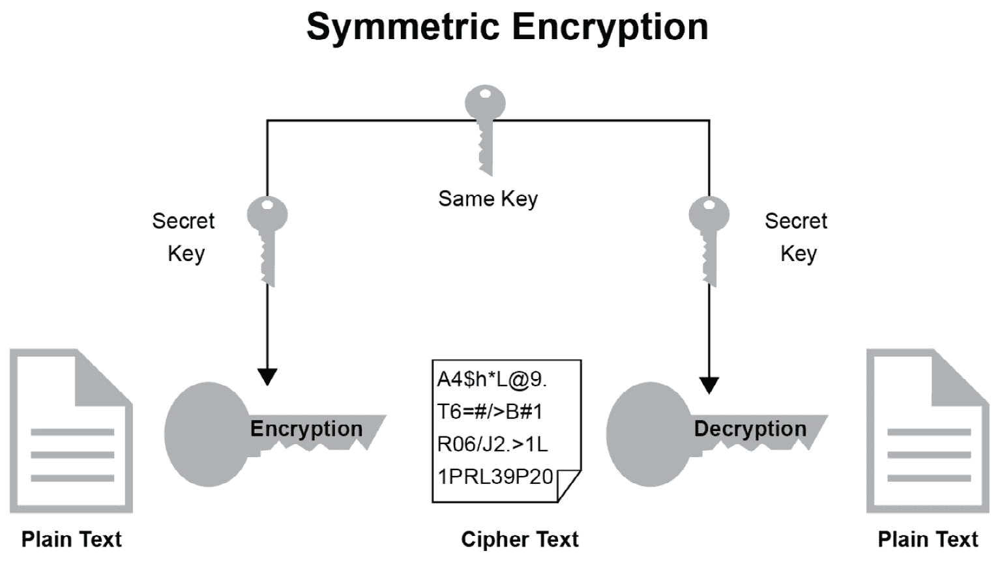

# 10. 加密

概述

本章讨论 Java 对加密的支持。它首先通过定义对称密钥加密和非对称密钥加密来实现这一点，然后教你如何实现这些加密**高级加密标准**（**AES**）和**RSA**（**Rivest-Shamir-Adleman**），分别。你还将进一步学习区分块密码和流密码，以便在加密文件时能够适当使用它们。

# 简介

加密是将数据打乱的过程，以便可以在两个或多个当事人之间公开发送，而其他人无法理解发送了什么。如今，你在网上做的几乎所有事情都是加密的——无论是阅读电子邮件、将照片发送到流行的社交网络，还是下载源代码。今天的大多数严肃网站也都是加密的。将加密应用于你的软件对于保护你的完整性、数据、业务以及客户的利益至关重要。

注意

加密是一个非常复杂的话题，每年都在变得更加复杂，因为我们试图保护我们的应用程序免受新的恶意代码和个人的侵害。本章不会详细介绍如何在软件中实现加密。相反，我们将解释如何使用 Java 中可用的 API。

在 Java 中，我们有一系列专门为处理 Java 平台上的大多数安全相关案例而创建的类和接口——它们都被收集在被称为**Java 密码架构**（**JCA**）的地方。在 JCA 中，为在 Java 中构建安全应用程序奠定了基础。Java 中还有其他几个安全库使用 JCA 来实现它们的安全性。使用 JCA，你可以创建自己的自定义安全提供者或使用已提供的标准提供者。在大多数情况下，使用标准提供者就足够了。

## 明文

在密码学术语中，明文是指你希望加密的数据。明文是另一个常用的术语，其使用与明文可以互换，这取决于你询问的对象。

## 密文

这是明文的加密版本。这是可以安全发送给接收方的数据。

## 密码

密码是一种数学函数或算法，用于将明文数据加密成密文。然而，仅使用密码从明文创建密文是不够的——你还需要一个密钥来定义你的加密将如何独特地工作。所有密钥都是唯一生成的。根据你选择的密码类型，你可能需要一个或两个密钥来加密和解密你的数据。

要在 Java 中初始化一个密码，你需要了解关于它的三个信息：使用的算法、模式和填充类型。不同的密码以不同的方式工作，因此定义正确的转换对于避免引发异常或创建不安全的应用程序至关重要：

```java
Cipher cipher = Cipher.getInstance(<transformation>);
cipher.init(Cipher.ENCRYPT_MODE, <key>);
```

算法或加密算法存储在我们所说的加密提供程序（或简称提供程序）中。根据应用程序运行的系统，您可能无法直接访问所有类型的加密算法。在某些情况下，您甚至可能需要安装额外的提供程序才能访问您希望使用的加密算法。

然而，每个 **Java 虚拟机**（**JVM**）都附带了一套具有不同转换的可用加密算法。至少，您现在在任何 JVM 上都可以找到以下转换：

+   AES/CBC/NoPadding

+   AES/CBC/PKCS5Padding

+   AES/ECB/NoPadding

+   AES/ECB/PKCS5Padding

+   AES/GCM/NoPadding

+   DES/CBC/NoPadding

+   DES/CBC/PKCS5Padding

+   DES/ECB/NoPadding

+   DES/ECB/PKCS5Padding

+   DESede/CBC/NoPadding

+   DESede/CBC/PKCS5Padding

+   DESede/ECB/NoPadding

+   DESede/ECB/PKCS5Padding

+   RSA/ECB/PKCS1Padding

+   RSA/ECB/OAEPWithSHA-1AndMGF1Padding

+   RSA/ECB/OAEPWithSHA-256AndMGF1Padding

## 密钥

每个加密算法至少需要一个密钥来加密明文和解密密文。根据加密算法的类型，密钥可以是对称的或非对称的。通常，您会处理存储在非易失性内存中的密钥，但您也可以从代码中生成密钥。在 JCA 中，有一个简单的命令用于为特定加密算法生成密钥：

```java
KeyPair keyPair = KeyPairGenerator.getInstance(algorithm).generateKeyPair();
```

# 对称密钥加密

对称加密通常被认为比非对称加密不安全。这并不是因为算法比非对称加密不安全，而是因为用于解锁内容的密钥必须由多个实体共享。以下图表以一般术语说明了对称加密的工作原理。



图 10.1：对称加密

您可以通过这种方式创建对称加密的密钥：

```java
Key key = KeyGenerator.getInstance(<algorithm>).generateKey();
```

目前最受欢迎的对称加密方法之一是 **高级加密标准**（**AES**）。

## 练习 1：使用高级加密标准加密字符串

在这个练习中，我们将使用 AES 加密字符串 "`My secret message`"：

1.  如果 IntelliJ 已经启动但没有打开项目，则选择 `创建新项目`。如果 IntelliJ 已经打开了项目，则从菜单中选择 `文件` -> `新建` -> `项目`。

1.  在 `新建项目对话框` 中，选择 Java 项目。单击 `下一步`。

1.  打开复选框以从模板创建项目。选择 `命令行应用程序`。然后，单击 `下一步`。

1.  给新项目命名为 `Chapter10`。

1.  IntelliJ 会为您提供一个默认的项目位置；如果您想选择自己的位置，可以在这里输入。

1.  将包名设置为 `com.packt.java.chapter10`。

1.  单击 `完成`。IntelliJ 将创建名为 `Chapter10` 的项目，并具有标准文件夹结构。IntelliJ 还将为您的应用程序创建主入口点，称为 `Main.java`。

1.  将此文件重命名为 `Exercise1.java`。完成时，它应该看起来像这样：

    ```java
    package com.packt.java.chapter10;

    public class Exercise1 {

        public static void main(String[] args) {
        // write your code here
        }
    }
    ```

1.  决定您想要用于加密的算法——在这个例子中，我们使用 AES——然后，生成加密密钥。如果选定的算法不被系统上的任何提供者支持，生成密钥可能会抛出异常：

    ```java
    package com.packt.java.chapter10;

    import javax.crypto.KeyGenerator;
    import java.security.Key;
    import java.security.NoSuchAlgorithmException;

    public class Exercise1{

        public static void main(String[] args) {
            try {
                String algorithm = "AES";
                Key privateKey = KeyGenerator.getInstance(algorithm)              .generateKey();
            } catch (NoSuchAlgorithmException e) {
                e.printStackTrace();
            }
        }
    }
    ```

    注意

    在这个练习中，我们使用一个变量来存储密钥。然而，在大多数实际场景中，您可能会使用一种更稳定的存储形式——例如文件或数据库。

1.  下一步是定义实际要使用的加密转换。如前所述，转换包含有关如何处理加密器的信息。在这种情况下，我们使用 AES，它是一种分组密码，因此我们需要定义如何将密钥应用于明文数据的每个块。此外，我们还需要定义是否应该有任何填充，以及这种填充应该是什么样子：

    ```java
    package com.packt.java.chapter10;

    import javax.crypto.KeyGenerator;
    import java.security.Key;
    import java.security.NoSuchAlgorithmException;

    public class Exercise1 {

        public static void main(String[] args) {
            try {
                String algorithm = "AES";
                Key privateKey = KeyGenerator.getInstance                           (algorithm).generateKey();
                String transformation = algorithm + "/ECB/NoPadding";
            } catch (NoSuchAlgorithmException e) {
                e.printStackTrace();
            }
        }
    }
    ```

    我们已经选择了 AES 作为算法，所以我们从那个开始转换。在此之后，我们决定采用不太安全的**电子密码本**（**ECB**）转换模式，这意味着我们将以相同的方式为每个明文数据块应用密钥。最后，我们定义，如果明文数据块短于密文块长度，我们将不使用填充。

1.  查询系统以获取建议的转换的加密器。此方法可能会抛出`NoSuchAlgorithmException`和`NoSuchPaddingException`。如果出现这种情况，请确保处理：

    ```java
        public static void main(String[] args) {
            try {
                String algorithm = "AES";
                Key privateKey = KeyGenerator.getInstance(algorithm)              .generateKey();
                String transformation = algorithm + "/ECB/NoPadding";
                Cipher cipher = Cipher.getInstance(transformation);
            } catch (NoSuchAlgorithmException e) {
                e.printStackTrace();
            } catch (NoSuchPaddingException e) {
                e.printStackTrace();
            }
        }
    ```

1.  与 Java API 相比，加密和解密几乎相同。当加密明文文件时，您在加密模式下初始化加密器，当解密密文文件时，您在解密模式下初始化加密器。如果密钥错误，这可能会导致`InvalidKeyException`：

    ```java
        public static void main(String[] args) {
            try {
                String algorithm = "AES";
                Key privateKey = KeyGenerator.getInstance(algorithm)              .generateKey();
                String transformation = algorithm + "/ECB/NoPadding";
                Cipher cipher = Cipher.getInstance(transformation);
                cipher.init(Cipher.ENCRYPT_MODE, privateKey);
            } catch (NoSuchAlgorithmException e) {
                e.printStackTrace();
            } catch (NoSuchPaddingException e) {
                e.printStackTrace();
            } catch (InvalidKeyException e) {
                e.printStackTrace();
            }
        }
    ```

1.  实际上，加密您的文本是一个两步过程，并且您始终需要根据实际数据字节调整您的工作。由于我们正在处理一个`String`，您将需要获取这个`String`的实际字节：

    ```java
    Exercise1.java
    1 package com.packt.java.chapter10;
    2 
    3 import javax.crypto.*;
    4 import java.security.InvalidKeyException;
    5 import java.security.Key;
    6 import java.security.NoSuchAlgorithmException;
    7 
    8 public class Exercise1 {
    9 
    10     public static void main(String[] args) {
    11         try {
    12         String algorithm = "AES";
    13         Key privateKey = KeyGenerator.getInstance(algorithm)             .generateKey();
    14         String transformation = algorithm + "/ECB/PKCS5Padding";
    15         Cipher cipher = Cipher.getInstance(transformation);
    16         cipher.init(Cipher.ENCRYPT_MODE, privateKey);
    https://packt.live/32veWeE
    ```

    如您可能已经注意到的，在使用加密时可能会出现很多问题。通常，您应该优雅地处理这些异常，但在这个例子中，我们只是将它们打印出来。

1.  现在，最后要做的就是打印文本的加密版本以验证您已加密数据。您应该在终端中看到乱码。这是正常的；这意味着您已成功将明文消息隐藏在密文文件中：

    如果您将转换填充更改为`NoPadding`，会发生什么？

    如果您保留`PKCS5Padding`但将明文消息更改为"`This is 16 bytes`"，会发生什么？

    尝试通过将加密器初始化为`MODE_DECRYPT`而不是明文消息来传递密文来解密消息。记住，您需要使用相同的密钥才能使此过程正常工作；否则，您将再次看到乱码。

# 分组密码

AES 是一种分组密码，这意味着加密是逐个处理一个明文块的。块大小取决于密钥大小；也就是说，更大的密钥意味着更大的块。

## 初始化向量

一些分组密码的转换模式要求你使用初始化向量——这是对 ECB 模式明显重复模式的改进。这可以通过一个显示 AES/ECB 和 AES/CBC 加密差异的图像来直观地展示。

CBC 指的是**分组密码链**，简而言之，它是根据前一个数据块来混淆当前数据块的。或者，如果是第一个数据块，则是根据初始化向量来混淆数据。

## 流密码

另一方面，流密码通过逐个字节加密来工作。有一个关于被称为“一次性密码”的理论讨论，它代表了理想的流加密。在理论上，这些非常安全，但也很不实用，因为密钥必须与明文数据长度相同。对于大量明文数据，这样的密钥是无法使用的。

# 非对称密钥加密

在非对称密钥加密中，私钥只由一方持有——接收者或数据的所有者。数据发送者，即不被视为所有者的一方，使用我们所说的公钥来加密数据。公钥可以被任何人持有，而不会危及任何之前加密的消息。这被认为是一种更安全的加密处理方式，因为只有接收者才能解密消息。

## 练习 2：使用 RSA 非对称密钥加密加密字符串

使用**Rivest–Shamir–Adleman**（**RSA**）非对称密钥加密来加密"`My secret message`"消息。这是一个公钥/私钥组合：

1.  如果尚未打开，请打开 IDEA 中的`Chapter10`项目。

1.  使用`File -> New -> Java Class`菜单创建一个新的 Java 类。

1.  将`Name`设置为`Exercise2`，然后选择`OK`。现在你应该在你的项目中有一个空的类：

    ```java
    package com.packt.java.chapter10;
    public class Exercise2 {
    }
    ```

1.  添加一个`main`方法——你将在其中编写所有代码进行这个练习：

    ```java
    package com.packt.java.chapter10;
    public class Exercise2 {
        public static void main(String[] args) {
        }
    }
    ```

1.  声明一个包含内容"`My secret message`"的明文`String`：

    ```java
    package com.packt.java.chapter10;
    public class Exercise2 {
        public static void main(String[] args) {
            String plaintext = "My secret message";
        }
    }
    ```

1.  在其中添加另一个字符串"RSA"，你将在那里编写这个练习的算法：

    ```java
    package com.packt.java.chapter10;
    public class Exercise2 {
        public static void main(String[] args) {
            String plaintext = "My secret message";
            String algorithm = "RSA";
        }
    }
    ```

1.  因为 RSA 是一种非对称密钥加密形式，所以你需要生成一个密钥对而不是一个密钥。如果找不到算法，请捕获异常：

    ```java
    public class Exercise2 {
        public static void main(String[] args) {
            try {
                String plaintext = "My secret message";
                String algorithm = "RSA";
                KeyPair keyPair = KeyPairGenerator.getInstance(algorithm)              .generateKeyPair();
            } catch (NoSuchAlgorithmException e) {
                 e.printStackTrace();
            }
        }
    }
    ```

1.  定义转换；在这个练习中，我们将使用电子密码本和`PKCS1Padding`：

    ```java
    public class Exercise2 {
        public static void main(String[] args) {
            try{
                String plaintext = "My secret message";
                String algorithm = "RSA";
                KeyPair keyPair = KeyPairGenerator.getInstance(algorithm)              .generateKeyPair();
                String transformation = algorithm + "/ECB/PKCS1Padding";
            } catch (NoSuchAlgorithmException e) {
                e.printStackTrace();
            }
        }
    }
    ```

1.  为算法创建一个密文并使用所选的转换初始化它。记住，在用 RSA 加密时始终使用公钥：

    ```java
            try{
                String plaintext = "My secret message";
                String algorithm = "RSA";
                KeyPair keyPair = KeyPairGenerator.getInstance(algorithm)              .generateKeyPair();
                String transformation = algorithm + "/ECB/PKCS1Padding";
                Cipher cipher = Cipher.getInstance(transformation);
                cipher.init(Cipher.ENCRYPT_MODE, keyPair.getPublic());
            } catch (NoSuchAlgorithmException e) {
                e.printStackTrace();
            } catch (NoSuchPaddingException e) {
                e.printStackTrace();
            } catch (InvalidKeyException e) {
                e.printStackTrace();
            }
        }
    ```

1.  最后，将明文加密成密文，你会注意到使用 RSA 加密的密文比 AES 加密的密文大得多。这是因为密钥大小的原因。

```java
Exercise2.java
1  package com.packt.java.chapter10;
2  
3  import javax.crypto.*;
4  import java.security.InvalidKeyException;
5  import java.security.KeyPair;
6  import java.security.KeyPairGenerator;
7  import java.security.NoSuchAlgorithmException;
8  
9  public class Exercise2 {
10 
11     public static void main(String[] args) {
12         try {
13             String plaintext = "My secret message";
14             String algorithm = "RSA";
15             KeyPair keyPair = KeyPairGenerator.getInstance(algorithm)              .generateKeyPair();
16             String transformation = algorithm + "/ECB/PKCS1Padding";
17             Cipher cipher = Cipher.getInstance(transformation);
18             cipher.init(Cipher.ENCRYPT_MODE, keyPair.getPublic());
https://packt.live/2MvdL9x
```

你也可以使用 RSA 的解密逻辑。记住，在解密时使用私钥；否则，它将不起作用。

# 加密文件

加密文件非常类似于加密字符串。然而，对于大文件，清空加密流可能更明智。但如果文件太大，或者有多个文件，那么应用`CipherStreams`可能更明智——不要与流加密混淆。

`CipherStreams`继承了 Java 的`InputStream`和`OutputStream`的大部分行为，修改之处在于你可以使用提供的加密解密你读取的文件，或者加密你写入的文件。

## 练习 3：加密文件

以下练习展示了如何加密一个文件。你可以在代码仓库中找到这个文件。

1.  如果尚未打开，请打开 IDEA 中的`Chapter10`项目。

1.  使用`File` | `New` | `Java Class` 菜单创建一个新的 Java 类。

1.  将名称输入为`Exercise3`，然后选择`OK`。现在你应该在你的项目中有一个空的类：

    ```java
    package com.packt.java.chapter10;
    public class Exercise3 {
    }
    ```

1.  添加一个`main`方法，在其中编写这个练习的代码：

    ```java
    package com.packt.java.chapter10;

    public class Exercise3 {
        public static void main(String[] args) {
        }
    }
    ```

1.  定义用于加密的算法；在这个练习中我们将回到 AES 并生成密钥：

    ```java
        public static void main(String[] args) {
            try {
                String algorithm = "AES";
                Key secretKey = KeyGenerator.getInstance(algorithm)              .generateKey();
            } catch (NoSuchAlgorithmException e) {
                e.printStackTrace();
            }
        }
    }
    ```

1.  获取加密实例并初始化它以进行加密：

    ```java
            try{
                String algorithm = "AES";
                Key secretKey = KeyGenerator.getInstance(algorithm)              .generateKey();
                String transformation = algorithm + "/CBC/NoPadding";
                Cipher cipher = Cipher.getInstance(transformation);
                cipher.init(Cipher.ENCRYPT_MODE, secretKey);
            } catch (NoSuchAlgorithmException e) {
                e.printStackTrace();
            } catch (NoSuchPaddingException e) {
                e.printStackTrace();
            } catch (InvalidKeyException e) {
                e.printStackTrace();
            }
        }
    ```

1.  创建一个用于加密的文件；如果你愿意，可以从书籍的 GitHub 仓库下载`plaintext.txt`文件。或者，你也可以使用 lipsum 创建自己的文本文件——甚至更好的是，从你的电脑上复制一个文档。我们将把这些文件放在你项目的"`res`"文件夹中：

    ```java
            try {
                String algorithm = "AES";
                Key secretKey = KeyGenerator.getInstance(algorithm)              .generateKey();
                String transformation = algorithm + "/CBC/NoPadding";
                Cipher cipher = Cipher.getInstance(transformation);
                cipher.init(Cipher.ENCRYPT_MODE, secretKey);
                Path pathToFile = Path.of("res/plaintext.txt");
                File plaintext = pathToFile.toFile();
            } catch (NoSuchAlgorithmException e) {
                e.printStackTrace();
            } catch (NoSuchPaddingException e) {
                e.printStackTrace();
            }catch (InvalidKeyException e){
                e.printStackTrace();
            }
        }
    ```

1.  此外，创建一个将保存加密内容的文件。确保该文件不存在：

    ```java
                File ciphertext = Path.of("res/ciphertext.txt").toFile();
                if (ciphertext.exists()) {
                    ciphertext.delete();
                }
            } catch (NoSuchAlgorithmException e) {
                e.printStackTrace();
            } catch (NoSuchPaddingException e) {
                e.printStackTrace();
            } catch (InvalidKeyException e) {
                e.printStackTrace();
            }
    ```

1.  现在是时候添加加密流了。在这个例子中，我们需要`FileInputStream`来读取`plaintext.txt`文件的内容，`FileOutputStream`来写入初始化向量，以及`CipherOutputStream`来执行加密：

    ```java
                try (FileInputStream fileInputStream = new               FileInputStream(plaintext);
                    FileOutputStream fileOutputStream = new                   FileOutputStream(ciphertext);
                    CipherOutputStream cipherOutputStream = new                   CipherOutputStream(fileOutputStream, cipher)); {
    }
                } catch (NoSuchAlgorithmException e) {
                    e.printStackTrace();
                } catch (NoSuchPaddingException e) {
                    e.printStackTrace();
                } catch (InvalidKeyException e) {
                    e.printStackTrace();
                } catch (FileNotFoundException e) {
                    e.printStackTrace();
                } catch (IOException e) {
                    e.printStackTrace();
                }
            }
        }
    ```

1.  编写初始化向量；你将在初始化的加密中找到它。确保使用`FileOutputStream`，因为我们不希望加密这些字节：

    ```java
                try (FileInputStream fileInputStream = new               FileInputStream(plaintext);
                    FileOutputStream fileOutputStream = new                   FileOutputStream(ciphertext);
                    CipherOutputStream cipherOutputStream =                   new CipherOutputStream(fileOutputStream,  cipher))  {
                    fileOutputStream.write(cipher.getIV());
    }
                } catch (NoSuchAlgorithmException e) {
                    e.printStackTrace();
                } catch (NoSuchPaddingException e) {
                    e.printStackTrace();
                } catch (InvalidKeyException e) {
                    e.printStackTrace();
                } catch (FileNotFoundException e) {
                    e.printStackTrace();
                } catch (IOException e) {
                    e.printStackTrace();
                }
            }
    ```

1.  最后，将`FileInputStream`的内容写入`CipherOutputStream`，允许在过程中加密内容：

    ```java
    Exercise3.java
    1  package com.packt.java.chapter10;
    2  
    3  import javax.crypto.Cipher;
    4  import javax.crypto.CipherOutputStream;
    5  import javax.crypto.KeyGenerator;
    6  import javax.crypto.NoSuchPaddingException;
    7  import java.io.*;
    8  import java.nio.file.Path;
    9  import java.security.InvalidKeyException;
    10 import java.security.Key;
    11 import java.security.NoSuchAlgorithmException;
    12 
    13 public class Exercise3 {
    14 
    15     public static void main(String[] args) {
    https://packt.live/2J4nKjI
    ```

    在 Java 中处理文件有众多方法，这只是加密内容的一种方式。如果你有更大的文件，也许使用`BufferedReader`会是一个不错的选择。

1.  不是加密文件，而是使用加密流来加密整个文件夹。也许最好的做法是首先将文件夹压缩成 ZIP 存档，然后加密那个文件。

# 概述

JCA 包含了你需要用于加密的一切。在本章中，你只是刚刚触及了这个主要框架的表面。这已经足够让你开始，但如果你打算进一步深入这个框架的复杂性，你将首先需要更深入地了解密码学。

在下一章中，我们将介绍进程的启动，以及向子进程发送输入和捕获输出。

XRB39
