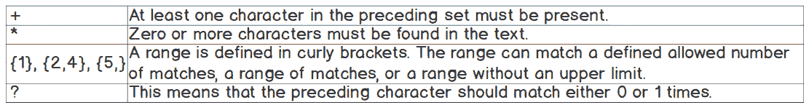
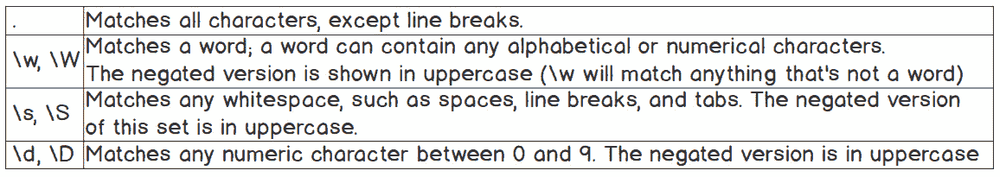
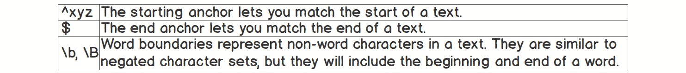
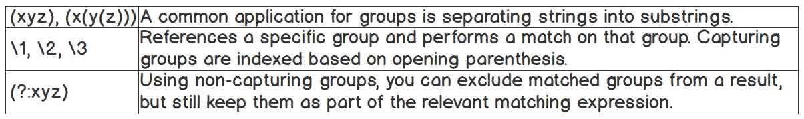
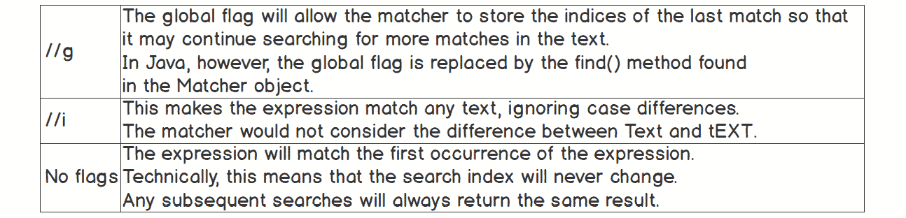
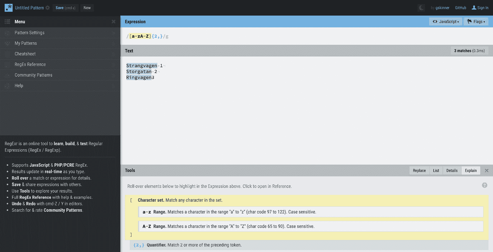
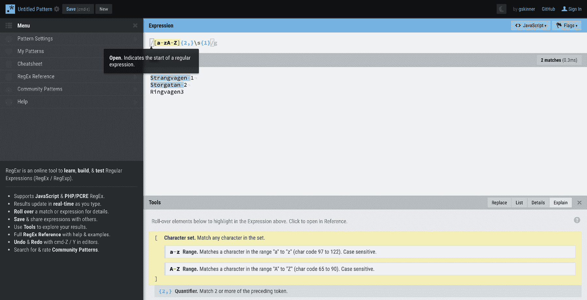
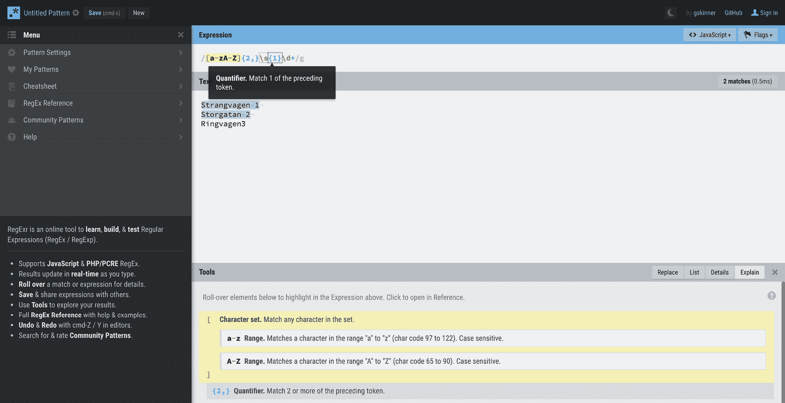

# 第十二章：12. 正则表达式

概述

本章讨论正则表达式，并考虑了它们在 Java 中为何以及如何如此有用。首先，你将探索如何构建这些表达式以便在程序中搜索信息——这是任何开发者的一项基本技能。当你对正则表达式的本质和功能有了牢固的理解后，你将能够使用它们在搜索中执行简单的全文匹配，并在本章的后面部分，使用组和非捕获组从文本中提取子字符串。在最后的练习中，你必须运用所有这些技能来执行递归匹配，并从文本中提取一组相似元素（即模式）。

# 简介

在你的开发者职业生涯中，你经常会发现搜索信息是解决问题的逻辑第一步：搜索文档、搜索特定的代码行，或者只是编写一个程序，从给定的文本体中提取信息，使其成为程序可以理解的数据。

正则表达式是定义这些搜索规则的一种特定语言，就像 Java 是一种构建程序的语言一样。其语法可能相当复杂。当你第一次看到正则表达式时，可能会感到有些令人畏惧。

以下是一个非常基础的用于构建电子邮件地址的模式匹配器，存在许多缺陷：

```java
/.+\@.+\..+/
```

如果你第一次看到这个，你可能会认为这是一个打字错误（或者认为一只猫参与了其中）。然而，这是一段完全合法的代码。我们很快就会深入探讨这个示例的构建，但首先，让我们看看一个更详尽的模式匹配器，它可以验证电子邮件地址的构建：

```java
/[a-zA-Z]+[a-zA-Z0-9]+\@[a-zA-Z0-9]{2,}\.[a-zA-Z]{2,}/
```

对于初学者来说，这看起来更像是一堆乱码。也许同样的猫正在你的键盘上筑巢。

在本章中，我们将揭示这种疯狂背后的逻辑。我们将从解码正则表达式的含义开始，然后看看这如何在 Java 中派上用场。

# 解码正则表达式

正则表达式的构建遵循一些基本规则，这些规则在所有平台和实现中都是相同的；然而，有些实现特定的规则可能会根据正则表达式构建的平台和实现而有所不同。

让我们回顾一下最初的电子邮件模式匹配表达式 `/.+\@.+\..+/`。我们可以看到它以一个斜杠标记开始，像这样 `/`，并以一个斜杠结束。这些是表达式的开始和结束标记；这些字符之间的任何内容都属于实际的表达式。

正则表达式由几个基本组件构成；它们是字符类、锚点、组和特殊转义字符。然后，我们有量词，它控制应该匹配前面多少个字符。最后但同样重要的是，我们有表达式标志，它控制整个表达式的某些行为。让我们在接下来的章节中更详细地看看它们。

## 字符类

字符类定义了模式匹配器将搜索的字符集。集是在方括号中定义的。

表达式 `[xyz]` 将匹配一个 `x`、`a y` 或一个 `z`。这些是区分大小写的，所以 `X` 不会匹配。如果你要匹配按字母顺序排列的字符，你可以用范围来替换表达式。而不是 `[xyz]`，你可以写成 `[x-z]`。如果你想在表达式中覆盖很多字符，这非常方便：


](img/C13927_12_02.jpg)

图 12.1：字符类的正则表达式

同时也存在预定义的字符类。这些允许你搜索特定的字符集，而无需输入完整的字符集。例如，前面提到的点（`.`）将匹配除换行符之外的任何字符。如果完整地写出作为一个集合，这个搜索的表达式看起来会是 `[^\n\r]`，所以你可以看到仅使用 `.` 是更快更简单的。你可以在以下表中看到 `^`、`\n` 和 `\r` 符号代表什么。

你也可以使用否定集进行搜索。这将匹配不属于该集的任何内容。

## 字符集

字符集匹配集合中定义的任何字符。以下图示展示了几个示例：



](img/C13927_12_01.jpg)

图 12.2：字符集的正则表达式

预定义字符集帮助你快速构建表达式。以下图列出了预定义字符集，这对于构建快速表达式很有用：



](img/C13927_12_03.jpg)

图 12.3：预定义字符集的正则表达式

## 量词

量词是简单的规则，允许你定义前面的字符集应该如何匹配。是否只允许一个字符，或者一个介于一个和三个之间的范围？请参见以下图示以了解可接受的量词：


](img/C13927_12_02.jpg)

图 12.4：量词的正则表达式

## 锚点

锚点为你提供了一个额外的控制维度，这样你就可以定义文本的边界而不是文本本身：



](img/C13927_12_05.jpg)

图 12.5：锚点的正则表达式

## 捕获组

捕获组允许你在表达式中对标记进行分组以形成子字符串。任何捕获标记都可以在组中使用，包括嵌套其他组。它们还允许在表达式中使用引用进行重用：



图 12.6：捕获组的正则表达式

## 转义字符

你可以使用反斜杠字符`\`来转义字符以在字符串中匹配它们。这对于匹配序列化数据（如 XML 和 JSON）非常有用。它也用于匹配非文本字符，如制表符和换行符。

这里有一些常见的转义字符：


图 12.7：转义字符的正则表达式

## 标志

直接放置在结束标记之后的任何字符都称为标志。有五个标志，你可以以任何方式组合它们，尽管你可以完全避免使用标志。



图 12.8：标志的正则表达式

现在你已经基本了解了这些正则表达式的工作原理，让我们在下面的练习中看看一个完整的示例。

## 练习 1：实现正则表达式

使用在线正则表达式检查器，我们将构建一个正则表达式来验证街道地址是否正确指定。地址遵循的格式是街道名称后跟街道号码。街道名称和街道号码之间用一个空格分隔。

我们将检查以下常见的瑞典地址是否有效：

+   Strandvagen 1

+   Storgatan 2

+   Ringvagen3

+   Storgatan

    注意：

    我们将使用[`packt.live/2MYzyFq`](https://packt.live/2MYzyFq)进行此练习，因为它具有易于使用的界面和现代感。然而，正则表达式也应该在其他平台上工作。

为了完成练习，请执行以下步骤：

1.  访问[`packt.live/2MYzyFq`](https://packt.live/2MYzyFq)。

1.  在标题“文本”下的空间中输入你选择的三个不同的本地地址，至少有一个地址格式不正确。我选择的地址是`Strandvagen 1`、`Storgatan 2`和`Ringvagen3`。这些都是瑞典非常常见的街道名称，最后一个地址格式不正确，因为它在街道名称和号码之间缺少空格。

    图 12.9：输入格式不正确的文本

    从我们定义的简单规则中，我们可以提取以下内容：

    街道地址必须以名称开头

    街道地址应该有一个号码

1.  添加第一条规则。名称是一个仅包含字母的单词（即只包含字母）：

    图 12.10：添加第一条规则

1.  在数字和数字之间，最多只能有一个空格。我们已经开始看到有一个地址格式不正确：

    图 12.11：修改规则以考虑数字和数字之间有一个空格

1.  至少在地址中添加一个数字。现在又有一个地址消失了：



图 12.12：修改规则以在地址中添加一个数字

此示例展示了一个简单的构建正则表达式以验证地址的过程。

## 活动一：使用正则表达式检查入口是否以期望的格式输入

在前面的正则表达式中添加一条新规则；允许在数字后面有一个可选字符。这将定义在地址有多个入口时使用哪个入口——例如，`Strandvagen 1a`或`Ringvagen 2b`。

注意

此活动的解决方案可以在第 560 页找到。

# Java 中的正则表达式

现在你已经了解了正则表达式如何用于匹配模式，这个主题将重点介绍如何在 Java 应用程序中使用正则表达式。要在 Java 中使用正则表达式，可以使用`java.util.regex`包。那里有两个主要的类，分别称为`Pattern`和`Matcher`。

`Pattern`类处理实际的模式；它验证、编译并返回一个可以存储和多次重用的`Pattern`对象。它还可以用于对提供的字符串进行快速验证。

`Matcher`类允许我们提取更多信息，并在提供的文本上执行不同类型的匹配。

创建一个`Pattern`对象就像使用静态的`compile`方法一样简单。

例如，你可能想编译一个模式以确保文本中至少有一个`a`。你的 Java 代码应该是这样的：

```java
Pattern pattern = Pattern.compile("a+");
Matcher matcher = pattern.matcher("How much wood would a woodchuck chuck if a woodchuck could chuck wood?");
Boolean matches = matcher.matches();
```

注意

在 Java 中，我们不应该提供正则表达式的起始和结束标记。有了`Pattern`对象，然后你可以在给定的字符串上执行匹配。

注意，此方法将尝试将整个字符串与正则表达式匹配；如果只有字符串的一部分与正则表达式匹配，它将返回 false。

如果你只想进行快速验证，可以使用静态的`matches`方法，它将返回一个布尔值；它只是上一个示例的简写：

```java
boolean matches = Pattern.matches("a+", "How much wood would a woodchuck chuck if a woodchuck could chuck wood?");
```

## 练习 2：使用模式匹配提取域名

在这个练习中，你将提取 URL 的每个部分并将它们存储在变量中，从协议开始，然后是域名，最后是路径：

1.  如果 IntelliJ IDEA 已经启动，但没有打开任何项目，请选择`创建新项目`。如果 IntelliJ 已经打开了一个项目，请从菜单中选择`文件` -> `新建` -> `项目`。

1.  在`新建项目`对话框中，选择一个 Java 项目。点击`下一步`。

1.  打开复选框以从模板创建项目。选择`命令行应用程序`。点击`下一步`。

1.  给新项目命名为`Chapter12`。

1.  IntelliJ 将提供默认的项目位置。你也可以输入任何其他希望的位置。

1.  将包名设置为`com.packt.java.chapter12`。

1.  点击`完成`。你的项目将以标准文件夹结构创建，并包含程序的入口点类。

1.  将此文件重命名为`Exercise2.java`。完成时，它应该看起来像这样：

    ```java
    package com.packt.java.chapter12;
    public class Exercise2 {
       public static void main(String[] args) {
    // write your code here
       }
    }
    ```

1.  声明这本书的网站`url`，我们将将其分割成单独的部分。如果你还没有访问过该网站，你可以在[`www.packtpub.com/application-development/mastering-java-9`](https://www.packtpub.com/application-development/mastering-java-9)找到它：

    ```java
    package com.packt.java.chapter12;
    public class Exercise2 {
        public static void main(String[] args) {
            String url = "https://www.packtpub.com/application-          development/mastering-java-9";
        }
    }
    ```

1.  我们将首先使用正则表达式找到协议。声明一个字符串来保存正则表达式，并将其命名为`regex`。它应该至少包含字母`http`和一个可选的`s`。将整个表达式包裹在一个组中，以确保你可以在稍后将其提取为子字符串：

    ```java
    package com.packt.java.chapter12;
    public class Exercise2 {
        public static void main(String[] args) {
            String url = "https://www.packtpub.com/application-development/mastering-java-9";
            String regex = "(http[s]?)";
        }
    }
    ```

    注意

    这当然只是提取协议的一个例子。你可以尝试找到第一个冒号之前或其它有趣的字符串。

1.  将表达式编译成`pattern`对象。由于我们不是进行全局匹配，所以不会使用简写。相反，我们将创建`Matcher`以供以后使用：

    ```java
    package com.packt.java.chapter12;
    import java.util.regex.Matcher;
    import java.util.regex.Pattern;
    public class Exercise2 {
        public static void main(String[] args) {
            String url = "https://www.packtpub.com/application-development/          mastering-java-9";
            String regex = "(http[s]?)";
            Pattern pattern = Pattern.compile(regex);
            Matcher matcher = pattern.matcher(url);
        }
    }
    ```

1.  尝试使用`find()`方法找到第一个组：

    ```java
    package com.packt.java.chapter12;
    import java.util.regex.Matcher;
    import java.util.regex.Pattern;
    public class Exercise2 {
        public static void main(String[] args) {
            String url = "https://www.packtpub.com/application           development/mastering-java-9";
            String regex = "(http[s]?)";
            Pattern pattern = Pattern.compile(regex);
            Matcher matcher = pattern.matcher(url);
            boolean foundMatches = matcher.find();
        }
    }
    ```

    注意

    你可以使用`groupCount()`方法找到可用的组数。如果你想要按顺序遍历所有组，这将非常有用。

1.  如果找到了匹配项，开始将组提取到变量中。目前，只需简单地打印变量：

    ```java
            String url = "https://www.packtpub.com/application-          development/mastering-java-9";
            String regex = "(http[s]?)";
            Pattern pattern = Pattern.compile(regex);
            Matcher matcher = pattern.matcher(url);
            boolean foundMatches = matcher.find();
            if (foundMatches) {
                String protocol = matcher.group(1);
                System.out.println("Protocol: " + protocol);
            }
        }
    }
    ```

1.  在捕获域名之前，我们需要忽略域名和协议之间的无用字符——`://`。为这些字符添加一个非捕获组：

    ```java
            String url = "https://www.packtpub.com/application-          development/mastering-java-9";
            String regex = "(http[s])(?:://)";
            Pattern pattern = Pattern.compile(regex);
            Matcher matcher = pattern.matcher(url);
            boolean foundMatches = matcher.find();
            if (foundMatches) {
                String protocol = matcher.group(1);
                System.out.println("Protocol: " + protocol);
            }
        }
    }
    ```

1.  现在，在正则表达式中添加第三个组来查找域名。我们将尝试找到整个域名，让`www`应用标记是可选的：

    ```java
            String regex = "(http[s])(?:://)([w]{0,3}\\.?[a-zA-Z]+\\.[a-zA-         Z]{2,3})";
            Pattern pattern = Pattern.compile(regex);
            Matcher matcher = pattern.matcher(url);
            boolean foundMatches = matcher.find();
            if (foundMatches) {
                String protocol = matcher.group(1);
                System.out.println("Protocol: " + protocol);
            }
        }
    }
    ```

1.  现在，收集域名组并打印出来：

    ```java
            String regex = "(http[s])(?:://)([w]{0,3}\\.?[a-zA-Z]+\\.[a-zA-          Z]{2,3})";
            Pattern pattern = Pattern.compile(regex);
            Matcher matcher = pattern.matcher(url);
            boolean foundMatches = matcher.find();
            if (foundMatches) {
                String protocol = matcher.group(1);
                String domain = matcher.group(2);
                System.out.println("Protocol: " + protocol);
                System.out.println("domain: " + domain);
            }
        }
    }
    ```

1.  最后，提取`path`组件并将它们打印到终端：

```java
Exercise2.java
1  package com.packt.java.chapter12;
2  
3  import java.util.regex.Matcher;
4  import java.util.regex.Pattern;
5  
6  public class Exercise2 {
7  
8      public static void main(String[] args) {
9  
10         String url = "https://www.packtpub.com/application-             development/mastering-java-9";
11 
12         String regex = "(http[s])(?:://)([w]{0,3}\\.?[a-zA-Z]+\\.[a-zA-             Z]{2,3})(?:[/])(.*)";
13 
14         System.out.println(regex);
https://packt.live/2J4qn57
```

当运行这个练习时，你应该在终端看到以下文本：

```java
(http[s])(?:://)([w]{0,3}\.?[a-zA-Z]+\.[a-zA-Z]{2,3})(?:[/])(.*)
Protocol: https
domain: www.packtpub.com
Path: application-development/mastering-java-9
```

这个例子展示了如何使用捕获组从一个小字符串中提取关键信息。然而，你会注意到匹配操作只进行了一次。在 Java 中，使用类似的技术，对大量文本进行递归匹配很容易。

## 练习 3：使用模式匹配提取链接

在这个练习中，你将对 Packt 网站进行递归匹配以提取所有链接，然后在终端打印这些链接。为了简单起见，我们将使用已保存的 Packt 网站快照；当然，你也可以根据自己的平台使用 curl、wget 或类似工具下载网站。你还可以在你的浏览器中查看网站的源代码并将其复制到文件中。

1.  如果尚未打开，请打开 IntelliJ IDEA 中的`Chapter12`项目。

1.  通过访问`File` -> `New` -> `Java Class`创建一个新的 Java 类。

1.  将名称输入为`Exercise 3`并点击`OK`。IntelliJ IDEA 将创建一个新的类，其外观可能如下所示：

    ```java
    package com.packt.java.chapter12;
    public class Exercise3 {
    }
    ```

1.  为你的程序创建主入口点——`static` `main`方法：

    ```java
    public class Exercise3 {
        public static void main(String[] args) {
        }
    }
    ```

1.  将 Packt 网站的数据包复制到你的项目的`res`文件夹中。如果该文件夹不存在，则将其创建为`src`的兄弟文件夹。

1.  将文件内容读取到新的字符串中；命名为`packtDump`：

    ```java
    public class Exercise3 {
        public static void main(String[] args) {
            String filePath = System.getProperty("user.dir") + File.separator           +"res" + File.separator + "packt.txt";
            try {
                String packtDump = new               String(Files.readAllBytes(Paths.get(filePath)));
            } catch (IOException e) {
                e.printStackTrace();
            }
        }
    }
    ```

1.  开始创建用于从网站捕获链接的正则表达式。它们通常看起来像这样。我们需要寻找链接的开始和结束标记，并捕获两者之间的任何内容：

    ```java
    <a href="http://link.to/website">visible text</a>
    ```

    首先寻找开标记，`"<a href=\"`：

    ```java
            String filePath = System.getProperty("user.dir") + File.separator           +"res" + File.separator + "packt.txt";
            try {
                String packtDump = new               String(Files.readAllBytes(Paths.get(filePath)));
                String regex = "(?:<a href=\")";
            } catch (IOException e) {
                e.printStackTrace();
            }
        }
    }
    ```

1.  为结束标记添加另一个非捕获组。链接以下一个双引号实例结束（`"`）：

    ```java
            String filePath = System.getProperty("user.dir") + File.separator           +"res" + File.separator + "packt.txt";
            try {
                String packtDump = new               String(Files.readAllBytes(Paths.get(filePath)));
                String regex = "(?:<a href=\")(?:\"{1})";
            } catch (IOException e) {
                e.printStackTrace();
            }
        }
    }
    ```

1.  最后，添加这个正则表达式所需的唯一捕获组——链接组：

    ```java
            String filePath = System.getProperty("user.dir") + File.separator          + "res" + File.separator + "packt.txt";
            try {
                String packtDump = new               String(Files.readAllBytes(Paths.get(filePath)));
                String regex = "(?:<a href=\")([^\"]+)(?:\"{1})";
            } catch (IOException e) {
                e.printStackTrace();
            }
        }
    }
    ```

1.  编译模式并将其与`packtDump`字符串匹配：

    ```java
            String filePath = System.getProperty("user.dir") + File.separator           +  "res" + File.separator + "packt.txt";
            try {
                String packtDump = new               String(Files.readAllBytes(Paths.get(filePath)));
                String regex = "(?:<a href=\")([^\"]+)(?:\"{1})";
                Pattern pattern = Pattern.compile(regex);
                Matcher matcher = pattern.matcher(packtDump);
            } catch (IOException e) {
                e.printStackTrace();
            }
        }
    }
    ```

1.  创建一个用于存储链接的列表：

    ```java
                String regex = "(?:<a href=\")([^\"]+)(?:\"{1})";
                Pattern pattern = Pattern.compile(regex);
                Matcher matcher = pattern.matcher(packtDump);
                List<String> links = new ArrayList<>();
            } catch (IOException e) {
                e.printStackTrace();
            }
        }
    }
    ```

1.  最后，遍历所有匹配项并将它们添加到列表中。这里我们只有一个捕获组，因此没有必要检查组数并遍历它们：

    ```java
            String regex = "(?:<a href=\")([^\"]+)(?:\"{1})";
            Pattern pattern = Pattern.compile(regex);
            Matcher matcher = pattern.matcher(packtDump);
            List<String> links = new ArrayList<>();
            while (matcher.find()) {
                links.add(matcher.group(1));
            }
            } catch (IOException e) {
                e.printStackTrace();
            }
        }
    }
    ```

1.  现在，你可以通过将列表打印到终端来结束练习：

```java
Exercise3.java
12 public class Exercise3 {
13 
14     public static void main(String[] args) {
15         String filePath = System.getProperty("user.dir") + File.separator +             "res" + File.separator + "packt.txt";
16         try {
17             String packtDump = new                 String(Files.readAllBytes(Paths.get(filePath)));
18             String regex = "(?:<a href=\")([^\"]+)(?:\"{1})";
19             Pattern pattern = Pattern.compile(regex);
20             Matcher matcher = pattern.matcher(packtDump);
21             List<String> links = new ArrayList<>();
22             while (matcher.find()) {
23                 links.add(matcher.group(1));
24             }
25             System.out.println(links);
https://packt.live/35OorYo
```

执行此练习时，你应该在终端看到一个包含相对和绝对链接的长列表。

```java
[/account, #, /register, https://account.packtpub.com/, https://www.packtpub.com/account/password, #, /, /all, /tech, /, /books/content/support, https://hub.packtpub.com, ... ]
```

你已成功从 Packt 网站提取了链接。现实世界的应用可能使用此功能来构建网站地图或以其他方式记录网站之间的相互连接。这个程序的下一步完全取决于你。以下步骤将帮助你更彻底地分析 Packt 网站的内容：

1.  删除任何非函数式链接，例如`#`和指向`home /`的链接。

1.  此外，删除所有以`http`开头的链接；只保留相对链接。

1.  相对链接的第一个路径代表该书的类别。将网站上的书籍分为不同的类别，并查看哪个类别最受欢迎。

# 摘要

在本章中，你学习了如何使用正则表达式从大量文本中搜索和提取信息。这在解析结构化或半结构化数据时非常有用。正则表达式并非特定于 Java。Java 实现可能与其他平台和语言略有不同；然而，通用语法保持不变。

在下一章中，你将探索一个日益流行的编程范式。虽然函数式编程最初并非为 Java 设计，但它可以帮助你编写更容易测试的程序，这可能会限制状态改变问题的数量。
