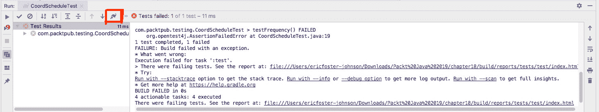
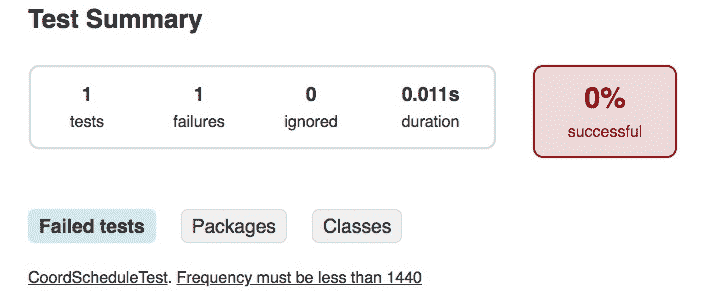

# 第十八章：18. 单元测试

概述

本章重点介绍使用 JUnit 进行测试，它是 Java 的主要测试框架之一。在其早期章节和练习中，你将学习如何使用 JUnit 编写成功的单元测试来测试你的代码，使用断言来验证你的代码是否正确。然后，你将介绍参数化测试——一种允许你在一系列数据输入上运行相同测试的单元测试类型——你也将学习如何编写。最后，本章将定义模拟技术，这是一种练习如何“模拟”外部依赖的技术，这样你就可以专注于测试单个 Java 类。

# 简介

测试可以帮助你确保你的 Java 代码运行正确。例如，如果你在计算员工的工资，你希望代码是准确的；否则，你的组织可能会面临法律后果。虽然并非每个编程问题都会导致法律灾难，但测试你的代码仍然是一个好主意。

在编码时编写测试，而不是在完成时编写，可以加快你的工作速度。这是因为你不会花费时间去试图弄清楚为什么事情似乎不起作用。相反，你会确切地知道代码的哪个部分是不正确的。这对于任何需要复杂逻辑的代码来说特别有用。

此外，随着代码中添加了新的增强功能，你将想要确保新代码中没有破坏旧功能。一套编写良好的单元测试可以在这一方面真正帮助你。如果你是一名新开发人员，被雇佣到一个已经开发了一段时间的应用程序团队中，一套良好的测试是团队遵循工程最佳实践的标志。

# 开始编写单元测试

单元测试测试一个代码单元。在 Java 术语中，这通常意味着单元测试测试一个单一的 Java 类。测试应该运行得很快，这样你就可以尽快知道是否有任何问题。

单元测试是一个专门用于测试的独立 Java 类。你应该为原始类中你想测试的每个部分编写单独的测试方法。通常，测试越细粒度，越好。

有时，由于必要性，单元测试可能会测试多个类。这是可以的，不必担心。不过，通常来说，你希望专注于为你的 Java 应用程序中的每个类编写单独的测试。

注意

编写易于测试的 Java 类可以提高你的代码质量。这将使你的代码组织更好，代码更清晰，质量更高。

相反，集成测试测试整个系统的一部分，包括外部依赖。例如，单元测试不应该访问数据库。这是集成测试的工作。

功能测试更进一步，测试整个系统，例如在线银行应用程序或零售商店应用程序。这有时被称为端到端测试。

注意

如果你表示不相信编写测试，软件开发工作面试往往会进行得很糟糕。

## 介绍 JUnit

JUnit 为 Java 代码提供了最广泛使用的测试框架。现在已经是第 5 版，JUnit 已经存在多年。

使用 JUnit，你的测试将位于测试类中，即使用 JUnit 框架来验证代码的类。这些测试类位于主应用程序代码之外。这就是为什么 Maven 和 Gradle 项目在 `src` 目录下都有两个子目录：main，用于你的应用程序代码，test，用于测试。

通常，测试不是你构建的应用程序的一部分。所以，如果你为你的应用程序构建一个 JAR 文件，测试将不会包含在那个 JAR 文件中。

JUnit 已经存在很长时间了，你可以在[`packt.live/2J9seWE`](https://packt.live/2J9seWE)找到官方文档，在[`packt.live/31xFtXu`](https://packt.live/31xFtXu)找到官方网站。

注意

另一个流行的测试框架叫做 Spock。Spock 使用 Groovy 语言，这是一种类似于 Java 的 JVM 语言。你可以参考[`packt.live/2P4fPqG`](https://packt.live/2P4fPqG)了解更多关于 Spock 的信息。TestNG 是另一个 Java 单元测试框架。你可以参考[`packt.live/33X2nct`](https://packt.live/33X2nct)了解更多关于 TestNG 的信息。

## 使用 JUnit 编写单元测试

Oozie 是 Hadoop 大数据集群的工作流调度器。Oozie 工作流是在 Hadoop 集群中存储的潜在大量数据上执行任务的作业。Oozie 协调器作业按计划运行工作流作业。

在定义计划时，你通常设置三个值：

+   开始时间戳，定义协调器何时应该启动工作流作业。

+   结束时间戳，定义协调器何时应该结束。

+   协调器应该启动作业的频率（以分钟为单位）。例如，60 的频率表示每 60 分钟（即每小时）启动一个工作流作业，从开始时间戳到结束时间戳。

    注意

    你可以参考[`packt.live/2BzqlOJ`](https://packt.live/2BzqlOJ)了解更多关于 Oozie 协调器和更多调度选项的信息。现在，我们只需集中验证协调器的调度信息。

在这里，我们将定义一个简单的 JavaBean 类来存储调度信息，然后编写一个 JUnit 测试来验证协调器的调度。

基本 Bean 的样子如下（省略了 getters、setters 和构造函数）：

```java
public class CoordSchedule {
    private String startingTimestamp;
    private String endingTimestamp;
    private int frequency;

}
```

开始和结束时间戳是基于这样一个假设，即这个 Bean 会持有从配置文件中读取的数据的 `String` 值。它还允许我们验证时间戳的 `String` 格式。

注意

记住 IntelliJ 可以生成构造函数以及 getter 和 setter 方法。

现在，考虑你想要测试的内容，以及你将如何编写这些测试。测试边缘情况是一个好主意。

对于协调者，以下是一些规则：

+   结束时间戳必须晚于开始时间戳。

+   两个时间戳都必须以 `yyyy-MM-ddTHH:mmZ` 的格式（这是 ISO 8601 格式）在 UTC 中。

+   频率必须小于 1,440（即正常一天中的分钟数）。Oozie 提供了超越此限制的替代配置设置。现在，我们只需测试这个限制。

+   频率应大于 5（这是一个旨在防止在另一个工作流程仍在运行时启动新工作流程的任意规则）。

要创建一个测试，你需要创建一个单独的测试类。测试类应该有一个无参数的构造函数。测试类不能是抽象类。

注意

如果你使用 Maven 构建工具（参考第六章，*库、包和模块*），那么你的测试类应该都以 `Test`、`Tests` 或 `TestCase` 结尾。本章中所有测试类的名称都以 `Test` 结尾。

JUnit 使用 `@Test` 注解来识别测试方法。你可以添加一个 `@DisplayName` 注解来指定在测试失败时显示的文本。这可以使你的测试报告更容易阅读：

```java
@Test
@DisplayName("Frequency must be less than 1440")
void testFrequency() {
}
```

在你的测试方法中，使用 `Assertions` 类的方法来验证结果：

```java
Assertions.assertTrue(schedule.getFrequency() < 1440);
```

注意

JUnit 提供了一些其他断言方法，例如 `assertEquals()` 和 `assertAll()`。

## 练习 1：编写第一个单元测试

这个例子将展示编写 JUnit 单元测试的基础。对于这个练习，我们将简单地测试属性是否正确；尽管通常，你还会测试程序逻辑：

1.  从 IntelliJ 的 `文件` 菜单中选择 `新建`，然后选择 `项目…`。

1.  选择项目的类型为 `Gradle`。点击 `下一步`。

1.  对于 `Group Id`，输入 `com.packtpub.testing`。

1.  对于 `Artifact Id`，输入 `chapter18`。

1.  对于 `版本`，输入 `1.0`。

1.  接受下一页的默认设置。点击 `下一步`。

1.  将项目名称保留为 `chapter18`。

1.  点击 `完成`。

1.  在 IntelliJ 文本编辑器中调用 `build.gradle`。

1.  将 `sourceCompatibility` 修改为 `12`：

    ```java
    sourceCompatibility = 12
    ```

1.  从 `build.gradle` 文件中删除定义的 JUnit 依赖项（它是为旧版本设计的）。用以下依赖项替换该依赖项：

    ```java
    testImplementation('org.junit.jupiter:junit-jupiter-api:5.4.2')
    testImplementation('org.junit.jupiter:junit-jupiter-engine:5.4.2')
    ```

    这会将 JUnit 5 引入到我们的项目中，而不是 JUnit 4。

    在依赖项部分之后添加以下内容到 `build.gradle`：

    ```java
    test {
        useJUnitPlatform()
    }
    ```

    这确保了你使用 JUnit 5 测试平台来运行测试。

1.  在 `src/main/java` 文件夹中，创建一个新的 Java 包。

1.  将包名输入为 `com.packtpub.testing`。

1.  在 `src/test/java` 文件夹中，创建一个新的 Java 包。

1.  输入相同的名称，`com.packtpub.testing`。

    `src/test/java` 文件夹是你放置测试类的地方。`src/main/java` 文件夹是应用程序类所在的位置。

1.  在 `src/main/java` 文件夹中右键单击此包，并创建一个名为 `CoordSchedule` 的新 Java 类。

1.  输入两个我们将用于验证数据的常量：

    ```java
    public static final int MAX_FREQUENCY = 1440;
    public static final int MIN_FREQUENCY = 5;
    ```

1.  输入这个类的属性：

    ```java
    private String startingTimestamp;
    private String endingTimestamp;
    private int frequency;
    ```

1.  将编辑光标放在类内部（即起始和结束的大括号之间），右键点击并选择 `Generate…`。

1.  选择 `Constructor`，然后选择所有三个属性。您应该看到一个如下所示的构造函数：

    ```java
    public CoordinatorSchedule(String startingTimestamp, 
        String endingTimestamp, int frequency) {
        this.startingTimestamp = startingTimestamp;
        this.endingTimestamp = endingTimestamp;
        this.frequency = frequency;
    }
    ```

1.  再次，将编辑光标放在类内部（即起始和结束的大括号之间），右键点击并选择 `Generate…`。

1.  选择 `Getter` 和 `Setter`，然后选择所有三个属性。您将看到三个属性的 `get` 和 `set` 方法。

1.  输入以下方法来解析 `String` 时间戳值：

    ```java
    private Date parseTimestamp(String timestamp) {
        Date date = null;
        SimpleDateFormat format =       new SimpleDateFormat("yyyy-MM-dd'T'HH:mm'Z'",Locale.getDefault());
        format.setTimeZone(TimeZone.getTimeZone("UTC"));
        try {
            date = format.parse(timestamp);
        } catch (ParseException e) {
            e.printStackTrace();
        }
        return date;
    }
    ```

1.  输入以下两个实用方法来返回两个时间戳的 `Date` 对象：

    ```java
    public Date getStartingTimestampAsDate() {
        return parseTimestamp(startingTimestamp);
    }
    public Date getEndingTimestampAsDate() {
        return parseTimestamp(endingTimestamp);
    }
    ```

    这些方法允许其他代码以日期格式获取时间戳，而不是作为字符串。

    我们现在有了将要测试的 Java 类。

    下一步是创建一个单元测试类。

1.  在 `src/test/java` 文件夹中右键点击此包，创建一个名为 `CoordScheduleTest` 的新 Java 类。

1.  输入以下测试方法：

    ```java
    @Test
    @DisplayName("Frequency must be less than 1440")
    void testFrequency() {
        CoordSchedule schedule = new CoordSchedule(
                "2020-12-15T15:32Z",
                "2020-12-30T05:15Z",
                60
        );
        Assertions.assertTrue(schedule.getFrequency() < 50);
    }
    ```

    注意，这个测试应该失败，因为我们使用了 `50` 的最大值而不是实际要求的最大值 `1,440`。首先看到失败的样子是好的。

1.  点击 `Gradle` 面板。展开 `Tasks`，然后展开 `verification`。

1.  双击 `Test`。这会运行 Gradle 的 `test` 任务。这将显示如下输出（为了清晰起见，省略了大部分堆栈跟踪）：

    ```java
    > Task :compileJava UP-TO-DATE
    > Task :processResources NO-SOURCE
    > Task :classes UP-TO-DATE
    > Task :compileTestJava UP-TO-DATE
    > Task :processTestResources NO-SOURCE
    > Task :testClasses UP-TO-DATE
    > Task :test FAILED
    expected: <true> but was: <false>
    org.opentest4j.AssertionFailedError: expected: <true> but was: <false>
    at com.packtpub.testing.CoordScheduleTest.testFrequency(CoordScheduleTest.java:19)
    com.packtpub.testing.CoordScheduleTest > testFrequency() FAILED
        org.opentest4j.AssertionFailedError at CoordScheduleTest.java:19
    1 test completed, 1 failed
    FAILURE: Build failed with an exception.
    ```

1.  这不是一个很好的测试报告。幸运的是，JUnit 提供了一个更好的报告。点击 Gradle 的象形图标，测试报告将在您的网页浏览器中显示：

    

    图 18.1：显示 Gradle 图标的 IntelliJ 运行面板

1.  切换到您的网页浏览器，您将看到测试报告：



图 18.2：在浏览器中显示的测试报告

您将看到失败测试的列表，其中包含 `DisplayName` 注解的文本。对于每个失败的测试，您可以深入测试。这提供了一个更好的格式来显示测试结果。

接下来，我们将修复损坏的测试并验证其他规则。

## 练习 2：编写成功的测试

现在我们有一个失败的测试，我们需要修复测试并添加测试方法来验证开始和结束时间戳：

1.  在 IntelliJ 中编辑 `CoordScheduleTest`。

1.  将 `testFrequency()` 方法替换为以下代码：

    ```java
    @Test
    @DisplayName("Frequency must be less than 1440")
    void testFrequency() {
        CoordSchedule schedule = new CoordSchedule(
                "2020-12-15T15:32Z",
                "2020-12-30T05:15Z",
                60
        );
        int frequency = schedule.getFrequency();
        Assertions.assertTrue(frequency
                < CoordSchedule.MAX_FREQUENCY);
        Assertions.assertTrue(frequency
                > CoordSchedule.MIN_FREQUENCY);
    }
    ```

1.  添加一个测试方法来检查格式不正确的日期：

    ```java
    @Test
    @DisplayName("Timestamp will be null if not formatted correctly")
    void testStartingTimestamps() {
        CoordSchedule schedule = new CoordSchedule(
                "2020/12/15T15:32Z",
                "2020-12-15T15:35Z",
                60
        );
        Date starting = schedule.getStartingTimestampAsDate();
        // Timestamp is not formatted properly.
        Assertions.assertNull(starting);
    }
    ```

1.  添加一个测试方法来验证结束时间戳是否晚于开始时间戳：

    ```java
    @Test
    @DisplayName("Ending timestamp must be after starting")
    void testTimestamps() {
        CoordSchedule schedule = new CoordSchedule(
                "2020-12-15T15:32Z",
                "2020-12-15T15:35Z",
                60
        );
        Date starting = schedule.getStartingTimestampAsDate();
        Assertions.assertNotNull(starting);
        Date ending = schedule.getEndingTimestampAsDate();
        Assertions.assertNotNull(ending);
        Assertions.assertTrue(ending.after(starting));
    }
    ```

1.  点击 `Gradle` 面板。展开 `Tasks`，然后展开 `verification`。

1.  双击 `Test`。这会运行 Gradle 的 `test` 任务。这将显示如下输出（为了清晰起见，省略了大部分堆栈跟踪）：

    ```java
    Testing started at 14:59 ...
    14:59:33: Executing tasks ':cleanTest :test --tests "com.packtpub.testing.CoordScheduleTest"'...
    > Task :cleanTest
    > Task :compileJava
    > Task :processResources NO-SOURCE
    > Task :classes
    > Task :compileTestJava
    > Task :processTestResources NO-SOURCE
    > Task :testClasses
    > Task :test
    java.text.ParseException: Unparseable date: "2020/12/15T15:32Z"
    at java.base/java.text.DateFormat.parse(DateFormat.java:395)
    at com.packtpub.testing.CoordSchedule.parseTimestamp(CoordSchedule.java:64)
    at com.packtpub.testing.CoordSchedule.getStartingTimestampAsDate(CoordSchedule.java:49)
    at com.packtpub.testing.CoordScheduleTest.testStartingTimestamps(CoordScheduleTest.java:41)
    …
    BUILD SUCCESSFUL in 0s
    4 actionable tasks: 4 executed
    14:59:34: Tasks execution finished ':cleanTest :test --tests "com.packtpub.testing.CoordScheduleTest"'.
    ```

注意，格式错误的日期时间戳显示了一个异常堆栈跟踪（此处已截断以节省空间）。这是预期的（输入的日期时间戳不正确），因此这不是错误。这些测试应该成功。

## 决定要测试什么

你总是可以编写更多的测试，所以，迟早，你需要决定你真正需要测试什么。

通常，专注于以下内容是一个好主意：

+   如果代码出错，哪种代码会造成最大的影响？

+   什么代码被其他代码依赖最多？这段代码应该得到额外的测试。

+   你是否正在检查边缘情况，例如最大值和最小值？

为了简化编写更好的测试，特别是为了处理一些边缘情况，你可能想要使用参数化测试。

## 编写参数化测试

参数化测试是一种接受参数的单元测试。你不需要在`test`方法中设置所有测试值，而是可以传递参数。这使得测试多个案例变得容易得多。例如，在处理字符串数据时，你可能想要测试多个字符串，包括 null 和空字符串。

使用参数化测试，你需要指定要传递给测试的参数。JUnit 会将这些参数作为实际方法参数传递给你的测试。例如，看看以下：

```java
@ParameterizedTest
@ValueSource(ints = { 10000, 11000 })
public void testMetStepGoal(int steps) {
    DailyGoal dailyGoal = new DailyGoal(DAILY_GOAL);
    Assertions.assertTrue(dailyGoal.hasMetGoal(steps));
}
```

在这个例子中，你使用`@ParameterizedTest`注解而不是`@Test`。这告诉 JUnit 寻找参数。

`@ValueSource`注解定义了两个值传递给`test`方法：`10000`和`11000`。在这两种情况下，这个测试假设传入的参数将导致`hasMetGoal()`方法返回`true`。

注意

参数化测试使 JUnit 对使用 Spock 的人更加可接受。

JUnit 将为`@ValueSource`列表中的每个值调用一次`test`方法，所以在这个例子中会调用两次。

`@ValueSource`注解期望一个值列表传递给测试方法。如果你有更复杂的值，可以使用`@CsvSource`注解。

`@CsvSource`注解接受一个以逗号分隔的值集。例如，看看以下：

```java
@ParameterizedTest
@CsvSource({
    "10,     false",
    "9999,   false",
    "10000,  true",
    "20000,  true"
})
public void testHasMetStepGoal(int steps, boolean expected) {
   // …
}
```

在这个例子中，对`testHasMetStepGoal()`的第一个调用将为`steps`参数返回`10`，为`expected`参数返回`false`。请注意，JUnit 会为你转换类型。类似于`@ValueSource`，每行数据都会导致对`test`方法的单独调用。

如果你想要传递多个值进行比较，或者在这个例子中，你想要传递好值和坏值，以及一个参数来指示测试是否预期为`true`，那么`@CsvSource`非常有用。

因为`@CsvSource`中的值存储为字符串，所以你需要一些特殊的语法来处理空字符串、null 字符串和包含空格的字符串：

```java
@CsvSource({
    "'A man, a plan, a canal. Panama',  7",
    "'Able was I ere I saw Elba',  7",
    ", 0",
    "'', 0"
})
```

第一行有一个包含空格的字符串。使用单引号字符（`'`）来界定包含空格的字符串。

第三行只有一个逗号作为第一个参数。JUnit 将为这个构造传递`null`。

第四行使用了两个单引号来生成一个空字符串。

除了 `@CsvSource`，你还可以使用 `@CsvFileSource` 注解从外部逗号分隔值（CSV）文件加载数据。

注意

JUnit 支持几种获取参数值的方法，包括从单独的文件、从你编写的方法中获取，等等。你可以参考 [`packt.live/2J8oXGU`](https://packt.live/2J8oXGU) 获取有关参数化测试的更多信息。

## 练习 3：编写参数化测试

假设你正在编写访问可穿戴健身设备的代码。设备跟踪的一件事是佩戴者在某一天所走的步数。然后你可以将所走的步数与每日目标进行比较。佩戴者是否达到了这个目标？

本例演示了如何根据第六章中*库、包和模块*的每日步数目标编写参数化测试：

1.  编辑 `build.gradle` 文件。

1.  将以下内容添加到依赖项块中：

    ```java
    testImplementation('org.junit.jupiter:junit-jupiter-params:5.4.2')
    ```

1.  这个依赖项引入了对参数化测试的支持。

1.  在 `src/main/java` 文件夹中的 `com.packtpub.testing` 包上右键单击。选择 `New` 和 `Java Class`。

1.  将 `DailyGoal` 作为类名。

1.  为此类输入以下代码：

    ```java
    int dailyGoal = 10000;
    public DailyGoal(int dailyGoal) {
        this.dailyGoal = dailyGoal;
    }
    public boolean hasMetGoal(int steps) {
        if (steps >= dailyGoal) {
            return true;
        }
        return false;
    }
    ```

    这是我们将要测试的类。

1.  在 `src/test/java` 文件夹中的 `com.packtpub.testing` 包上右键单击。选择 `New` 和 `Java Class`。

1.  将 `DailyGoalTest` 作为类名。

1.  为设备佩戴者的每日步数目标输入以下常量：

    ```java
    public static final int DAILY_GOAL = 10000;
    ```

1.  接下来，输入一个用于满足或超过每日步数目标的 `test` 方法：

    ```java
    @ParameterizedTest
    @ValueSource(ints = { 10000, 11000 })
    public void testMetStepGoal(int steps) {
        DailyGoal dailyGoal = new DailyGoal(DAILY_GOAL);
        Assertions.assertTrue(dailyGoal.hasMetGoal(steps));
    }
    ```

    每日步数目标为 `10000` 步时，`10000` 和 `11000` 都达到了这个目标。

1.  接下来，我们将测试步数低于每日步数目标的结果：

    ```java
    @ParameterizedTest
    @ValueSource(ints = { 10, 9999 })
    public void testNotMetStepGoal(int steps) {
        DailyGoal dailyGoal = new DailyGoal(DAILY_GOAL);
        Assertions.assertFalse(dailyGoal.hasMetGoal(steps));
    }
    ```

    注意 `9999` 只比目标少一步。

    接下来，使用 `@CsvSource` 的测试参数值输入一个测试方法：

    ```java
    @ParameterizedTest
    @CsvSource({
        "10,     false",
        "9999,   false",
        "10000,  true",
        "20000,  true"
    })
    public void testHasMetStepGoal(int steps, boolean expected) {
        DailyGoal dailyGoal = new DailyGoal(DAILY_GOAL);
        // Using a lambda will lazily evaluate the expression
        Assertions.assertTrue(
                dailyGoal.hasMetGoal(steps) == expected,
                () -> "With " + steps +
                      " steps, hasMetGoal() should return " +
                        expected);
    }
    ```

    这个测试方法稍微复杂一些。每次调用测试都会传递两个参数。

    在 `Assertions.assertTrue()` 调用中的 lambda 表达式是错误消息。使用 lambda 表达式意味着错误消息只有在测试断言失败时才会被评估。

    当你运行这个测试类时，它应该成功。

## 当测试无法工作——禁用测试

`@Disabled` 注解允许你禁用测试。通常，简单地禁用任何失败的测试并不是一个好的实践。这违背了测试的整个目的。然而，你可能遇到由于一些你无法控制的条件，你不得不禁用测试的情况。例如，如果你正在使用另一个组的代码，并且该组在其代码中破坏了一个期望或引入了一个错误，你可能需要——暂时——禁用依赖于该代码的测试：

```java
@Disabled("Until platform team fixes issue 5578")
@Test
public void testThatShouldNotFail() {
   // …
}
```

你可以将 `@Disabled` 注解添加到整个测试类，或者只添加到测试方法，如前面的代码块所示。

## 测试设置

在许多测试中，你可能需要执行一些设置工作，以及测试后的清理工作。例如，你可能需要初始化测试所需的对象。JUnit 提供了一系列生命周期注解来支持此类工作。

如果你用`@BeforeEach`注解一个方法，JUnit 将在运行每个测试方法之前运行该方法。同样，用`@AfterEach`注解的方法将在每个测试方法之后运行。如果你想为测试类只运行一次设置或清理代码，可以使用`@BeforeAll`和`@AfterAll`。尽管这两个方法有一些限制。

JUnit 为每个测试方法创建你的测试类的新实例。这确保了你的测试在隔离状态下运行，避免了所谓的测试污染，即一个测试影响另一个测试。通常，这是好事，因为追踪依赖于测试执行顺序的测试失败尤其令人沮丧。

因为 JUnit 为每个测试方法创建测试类的新实例，所以`@BeforeAll`和`@AfterAll`方法必须是`static`。此外，这些方法初始化或清理的数据也应该是`static`。

如果你不想创建`static`方法，你可以更改 JUnit 为每个测试方法创建测试类新实例的策略。

如果你用以下内容注解你的测试类，JUnit 将为所有测试方法创建一个共享的测试类实例：

```java
@TestInstance(TestInstance.Lifecycle.PER_CLASS)
```

你可以在*Mocking*部分看到一个例子。

*练习 4*，*使用测试设置和清理方法*演示了如何编写这些设置和清理方法。

## 练习 4：使用测试设置和清理方法

这个练习演示了一个简单的单元测试，其中包含用于设置和清理的占位符方法。该测试将验证一个简单的类，该类将摄氏温度值转换为华氏温度：

1.  右键点击`src/main/java`文件夹中的`com.packtpub.testing`包。选择`New`然后`Java Class`。

1.  将类名输入为`TempConverter`。

1.  输入以下方法：

    ```java
    public static double convertToF(double degreesC) {
        double degreesF = (degreesC * 9/5) + 32;
        // Round to make nicer output.
        return Math.round(degreesF * 10.0) / 10.0;
    }
    ```

1.  右键点击`src/test/java`文件夹中的`com.packtpub.testing`包。选择`New`然后`Java Class`。

1.  将类名输入为`TempConverterTest`。

1.  输入以下测试方法，检查两种温度尺度上的`-40.0`度：

    ```java
    @Test
    public void testFahrenheitWhenCold() {
        // -40 C == -40 F
        double degreesC = -40.0;
        double degreesF = TempConverter.convertToF(degreesC);
        Assertions.assertEquals(degreesC, degreesF);
    }
    ```

    无论使用哪种温度尺度，这种温度都是令人不愉快的。

    注意这个测试是如何使用`assertEquals()`断言的。

1.  输入另一个测试方法以确保当温度为`100.0`摄氏度时转换工作正常：

    ```java
    @Test
    public void testFahrenheitWhenHot() {
        // 100 C == 212 F
        double degreesC = 100.0;
        double degreesF = TempConverter.convertToF(degreesC);
        Assertions.assertEquals(212.0, degreesF);
    }
    ```

1.  接下来，输入在每个测试之前运行的测试方法：

    ```java
    @BeforeAll
    public static void runBeforeAllTests() {
        System.out.println("Before all tests");
    }
    ```

    注意，此方法必须是静态的（或者你必须使用前面列出的类级别注解）。

    通常，你会使用此方法来设置复杂的测试数据，而不仅仅是打印一个值。

1.  输入一个在每个测试之后运行的测试方法：

    ```java
    @AfterAll
    public static void runAfterAllTests() {
        System.out.println("After all tests");
    }
    ```

    再次强调，此方法必须是静态的。

1.  现在，输入在每个两个测试方法之前运行的测试方法：

    ```java
    @BeforeEach
    public void runBeforeEachTest() {
        System.out.println("Before each test");
    }
    ```

1.  类似地，输入一个在每个测试方法之后运行的测试方法：

    ```java
    @AfterEach
    public void runAfterEachTest() {
        System.out.println("After each test");
    }
    ```

1.  点击类语句旁边的绿色箭头，并选择“运行'TempConverterTest'”。测试应该无错误运行。

    您将看到以下类似的输出：

    ```java
    Before all tests
    Before each test
    After each test
    Before each test
    After each test
    After all tests
    BUILD SUCCESSFUL in 0s
    4 actionable tasks: 2 executed, 2 up-to-date
    ```

    注意，`@BeforeAll`方法只运行一次。然后，对于每个测试方法，执行`@BeforeEach`和`@AfterEach`方法。最后，执行`@AfterAll`方法。

## 模拟

单元测试应该只测试一个 Java 类。然而，有时一个类高度依赖于其他类，甚至可能依赖于外部系统，如数据库或手持设备。在这些情况下，一种称为模拟的技术非常有用。模拟就是模拟其他依赖项，以便您可以测试您想要查看的类。

**模拟**是一个仅用于测试的类，它假装是某些外部依赖。使用模拟框架，您可以检查模拟类以确保正确的方法以正确的次数和参数被调用。

当您有代码在数据库或外部系统中查询数据时，模拟效果很好。您所做的是创建一个特定类的模拟实例。然后，当查询方法被调用时，模拟返回任意测试数据。这避免了对外部系统的依赖。

模拟在您想验证特定方法被调用，而实际上并没有调用该方法时也效果很好。想象一下一个在某种失败情况下发送电子邮件消息的电子邮件通知器。在单元测试中，您不希望实际发送电子邮件消息。（然而，在集成或功能测试中，您应该验证消息确实被发送。）

## 使用 Mockito 进行模拟测试

Mockito 是一个用于向测试添加模拟的出色框架。假设您有一个监控在大数据集群中运行的工作流程的应用程序；这些可能是之前提到的 Oozie 工作流程，或者任何其他类型的工作流程。

您的应用程序通过调用远程 Web 服务来获取工作流程的状态。在您的单元测试中，您不想调用远程 Web 服务。相反，您只想模拟外部系统。

我们想要测试的代码可能看起来像以下这样：

```java
WorkflowStatus workflowStatus = workflowClient.getStatus(id);
if (!workflowStatus.isOk()) {
    emailNotifier.sendFailureEmail(workflowStatus);
}
```

首先，代码调用远程 Web 服务以获取工作流程的状态，基于工作流程 ID。然后，如果工作流程状态不是 OK，代码发送电子邮件消息。对于单元测试，我们需要模拟对`getStatus()`和`sendFailureEmail()`的调用。

`WorkflowClient`类管理对远程 Web 服务的 HTTP 通信。

使用工作流程 ID 调用`getStatus()`方法返回给定工作流程的状态：

```java
WorkflowStatus workflowStatus = workflowClient.getStatus(id);
```

注意

您可以参考*第九章*，*与 HTTP 协作*，以获取更多关于 HTTP 和 Web 服务的相关信息。

使用 Mockito，您需要做的第一件事是创建`WorkflowClient`类的模拟：

```java
import static org.mockito.Mockito.*;
workflowClient = mock(WorkflowClient.class);
```

下一步是模拟对`getStatus()`的调用。在 Mockito 术语中，当发生某事时，将返回特定的结果。在这种情况下，模拟的代码应该返回一个预先构建的、具有所需测试状态的`WorkflowStatus`对象。

```java
String id = "WORKFLOW-1";
WorkflowStatus workflowStatus =   new WorkflowStatus(id, WorkflowStatus.OK);
when(workflowClient.getStatus(id)).thenReturn(workflowStatus);
```

在此代码中，我们首先设置一个工作流程 ID 的字符串，然后使用成功状态（`OK`）构造一个`WorkflowStatus`对象。关键代码从`when()`开始。当在模拟的`WorkflowClient`类上使用给定 ID 调用`getStatus`时，请阅读此代码，然后返回我们预先构建的`WorkflowStatus`对象。

在这种情况下，Mockito 正在寻找一个精确匹配。传入的工作流程 ID 必须匹配，否则模拟将不会返回指定的结果。你还可以指定模拟应该返回任何输入工作流程 ID 的结果，如下所示：

```java
when(workflowClient.getStatus(anyString())).thenReturn(workflowStatus);
```

在这种情况下，`anyString()`调用意味着任何传入的字符串值都会匹配。请注意，Mockito 还有其他调用，例如`anyInt()`。

注意

Mockito 在[`packt.live/2P6ogl9`](https://packt.live/31xFtXu)提供了非常好的文档。你可以使用模拟做比这里展示的更多的事情，但你应该避免模拟一切的诱惑。

在模拟外部 Web 服务调用之后，下一步是检查是否发送了失败电子邮件。为此，模拟发送电子邮件失败消息的类：

```java
import static org.mockito.Mockito.*;
EmailNotifier emailNotifier = mock(EmailNotifier.class);
```

在我们想要测试的代码中，只有在失败时才会发送电子邮件消息。因此，我们将想要测试以下两点：

+   如果状态是 OK，则不会发送电子邮件。

+   如果状态不是 OK，则会发送电子邮件。

在这两种情况下，我们将使用 Mockito 来检查`sendFailureEmail()`方法被调用的次数。如果为零次，则不会发送电子邮件。如果是一次或更多次，则发送电子邮件消息。

要确保没有发送电子邮件消息，请使用以下代码：

```java
verify(emailNotifier, times(0)).sendFailureEmail(workflowStatus);
```

此代码检查`sendFailureEmail()`方法没有被调用零次，即完全没有被调用。

要验证是否发送了电子邮件消息，你可以指定次数为`1`：

```java
verify(emailNotifier, times(1)).sendFailureEmail(workflowStatus);
```

你也可以使用 Mockito 的快捷方式，它假设该方法只被调用一次：

```java
verify(emailNotifier).sendFailureEmail(workflowStatus);
```

在更复杂的测试中，你可能想要确保一个方法被调用几次。

如前所述，JUnit 为每个测试方法创建你的测试类的新实例。在模拟时，你可能想要在测试方法运行时只设置一次模拟。

要让 JUnit 只为测试类创建一个实例并在所有测试方法之间共享它，请将以下注解添加到类中：

```java
@TestInstance(TestInstance.Lifecycle.PER_CLASS)
public class WorkflowMonitorTest {
    private EmailNotifier emailNotifier;
    private WorkflowClient workflowClient;
    private WorkflowMonitor workflowMonitor;
    @BeforeAll
    public void setUpMocks() {
        emailNotifier = mock(EmailNotifier.class);
        workflowClient = mock(WorkflowClient.class);
        workflowMonitor =
                new WorkflowMonitor(emailNotifier, workflowClient);
    }
}
```

`setUpMocks()`方法将在所有测试方法运行之前被调用一次。它设置了两个模拟类，然后将模拟对象传递给`WorkflowMonitor`类的构造函数。

以下练习展示了所有这些类一起使用，在单元测试中使用基于 Mockito 的模拟。

## 练习 5：在测试时使用模拟

这个练习创建了一个`WorkflowMonitor`类，然后使用模拟对象来处理外部依赖：

1.  在 IntelliJ 的`项目`面板中的`src/main/java`文件夹中创建一个新的 Java 包。

1.  输入包名`com.packtpub.workflow`。

1.  在`src/test/java`文件夹中创建一个新的 Java 包。

1.  输入相同的名称，`com.packtpub.workflow`。

1.  编辑`build.gradle`。

1.  在依赖项块中添加以下内容：

    ```java
    testImplementation("org.mockito:mockito-core:2.+")
    ```

1.  在`src/main/java`文件夹中的`com.packtpub.workflow`包上右键单击。选择`新建`然后选择`Java 类`。

1.  将类名命名为`WorkflowStatus`。

1.  为此简单值对象类输入以下代码：

    ```java
    public static final String OK = "OK";
    public static final String ERROR = "ERROR";
    private String id;
    private String status = OK;
    public WorkflowStatus(String id, String status) {
        this.id = id;
        this.status = status;
    }
    public boolean isOk() {
        if (OK.equals(status)) {
            return true;
        }
        return false;
    }
    ```

    在实际系统中，这个类将包含额外的值，例如工作流程开始的时间、停止的时间以及其他关于工作流程的信息。为了这个练习，状态信息被简化了。

1.  在`src/main/java`文件夹中的`com.packtpub.workflow`包上右键单击。选择`新建`然后选择`Java 类`。

1.  将类名命名为`EmailNotifier`。

1.  输入以下方法：

    ```java
    public void sendFailureEmail(WorkflowStatus workflowStatus) {
        // This would have actual code...
    }
    ```

    在实际应用中，这将发送电子邮件消息。为了简单起见，我们将留空。

1.  在`src/main/java`文件夹中的`com.packtpub.workflow`包上右键单击。选择`新建`然后选择`Java 类`。

1.  将类名命名为`WorkflowClient`。

1.  输入以下方法：

    ```java
    public WorkflowStatus getStatus(String id) {
        // This would use HTTP to get the status.
        return new WorkflowStatus(id, WorkflowStatus.OK);
    }
    ```

    同样，这也是简化的。

1.  在`src/main/java`文件夹中的`com.packtpub.workflow`包上右键单击。选择`新建`然后选择`Java 类`。

1.  将类名命名为`WorkflowMonitor`。

1.  输入以下属性：

    ```java
    private EmailNotifier emailNotifier;
    private WorkflowClient workflowClient;
    ```

1.  在类上右键单击，选择`生成…`然后选择`构造函数`。

1.  选择两个属性，然后点击`确定`。

1.  输入以下方法：

    ```java
    public void checkStatus(String id) {
        WorkflowStatus workflowStatus = workflowClient.getStatus(id);
        if (!workflowStatus.isOk()) {
            emailNotifier.sendFailureEmail(workflowStatus);
        }
    }
    ```

    这是我们将使用模拟对象进行测试的方法。

1.  在`src/test/java`文件夹中的`com.packtpub.workflow`包上右键单击。选择`新建`然后选择`Java 类`。

1.  将类名命名为`WorkflowMonitorTest`。

1.  注释该类，以便我们可以创建一个`@BeforeAll`方法：

    ```java
    @TestInstance(TestInstance.Lifecycle.PER_CLASS)
    ```

1.  输入以下属性并设置`@BeforeAll`方法：

    ```java
    private EmailNotifier emailNotifier;
    private WorkflowClient workflowClient;
    private WorkflowMonitor workflowMonitor;
    @BeforeAll
    public void setUpMocks() {
        emailNotifier = mock(EmailNotifier.class);
        workflowClient = mock(WorkflowClient.class);
        workflowMonitor =       new WorkflowMonitor(emailNotifier, workflowClient);
    }
    ```

    这设置了模拟对象，然后使用模拟的依赖项实例化一个`WorkflowMonitor`对象。

1.  输入以下测试方法以测试工作流程成功的情况：

    ```java
    @Test
    public void testSuccess() {
        String id = "WORKFLOW-1";
        WorkflowStatus workflowStatus =       new WorkflowStatus(id, WorkflowStatus.OK);
        when(workflowClient.getStatus(id)).thenReturn(workflowStatus);
        workflowMonitor.checkStatus(id);
        verify(emailNotifier, times(0)).sendFailureEmail(workflowStatus);
    }
    ```

    我们还应该测试一个工作流程状态不是 OK 的情况。

1.  输入以下测试方法：

    ```java
        @Test
        public void testFailure() {
            String id = "WORKFLOW-1";
            WorkflowStatus workflowStatus =           new WorkflowStatus(id, WorkflowStatus.ERROR);
            when(workflowClient.getStatus(anyString()))          .thenReturn(workflowStatus);
            workflowMonitor.checkStatus(id);
            verify(emailNotifier).sendFailureEmail(workflowStatus);
        }
    }
    ```

1.  点击类声明旁边的绿色箭头，选择`运行 'WorkflowMonitorTest'`。测试应该没有错误运行。

## 活动一：计算字符串中的单词

单词计数在出版行业中至关重要。编写一个类，给定一个字符串，将计算字符串中的所有单词。

1.  您可以使用`split()`方法将字符串拆分为单词，使用`\s+`正则表达式来分隔单词，这匹配空白字符（即空格和制表符）。将此类命名为`WordCount`。

1.  去除输入字符串开头或结尾的任何空格。

    注意，空字符串应该生成单词计数为零；同样，`null`字符串也应该生成零。全部为空格的输入字符串也应该生成零。

1.  一旦你写好了类，就为该类编写一个参数化单元测试。使用参数和`@CsvSource`传递一个字符串以及预期的单词数。确保在你的输入字符串中包含标点符号，如逗号和句号。此外，确保在输入参数中包含包含空字符串和空字符串的输入字符串。

    注意

    本活动的解决方案可以在第 569 页找到。

# 摘要

本章介绍了单元测试。测试是好的，你希望为所有的 Java 代码编写测试。如果你编写了成功的测试，那么你可以有信心你的代码是正确编写的。

JUnit 提供了编写 Java 单元测试最流行的测试框架，尽管你也可以尝试其他框架。方法上的`@Test`注解告诉 JUnit 给定的代码被视为一个测试。JUnit 将执行测试并查看它是否成功。JUnit 断言类包含一些你可以用来验证测试结果的`static`方法。

参数化测试是一种测试，你向其中传递一些参数。当你需要为想要确保能够处理各种输入的代码编写测试时，这非常有用。模拟是一种技术，通过模拟外部依赖，使得单元测试可以专注于测试单个类。
