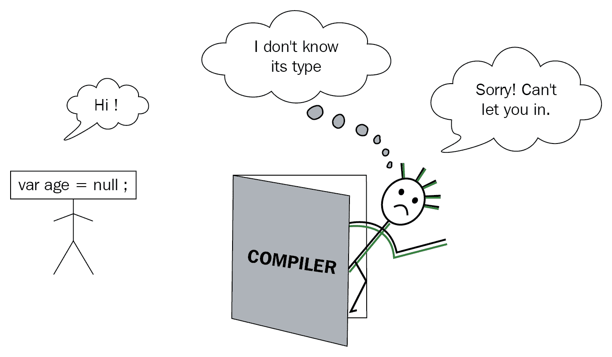
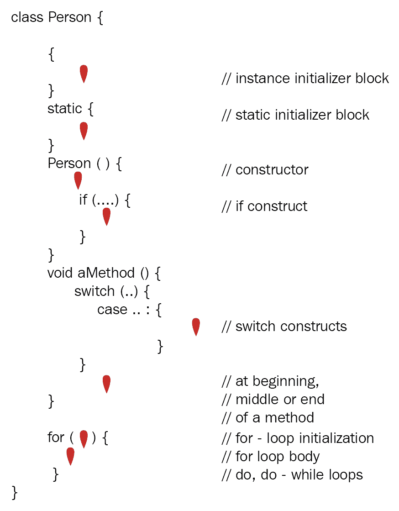
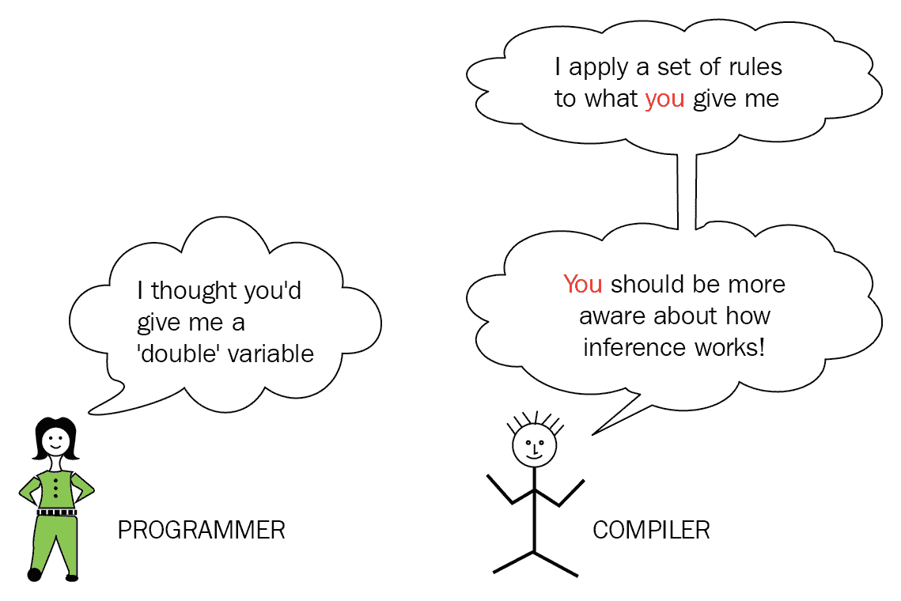
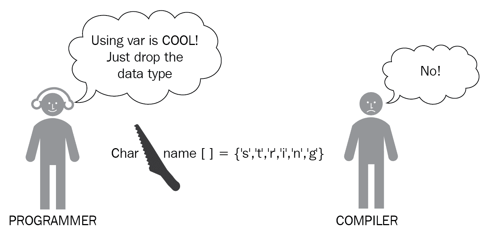
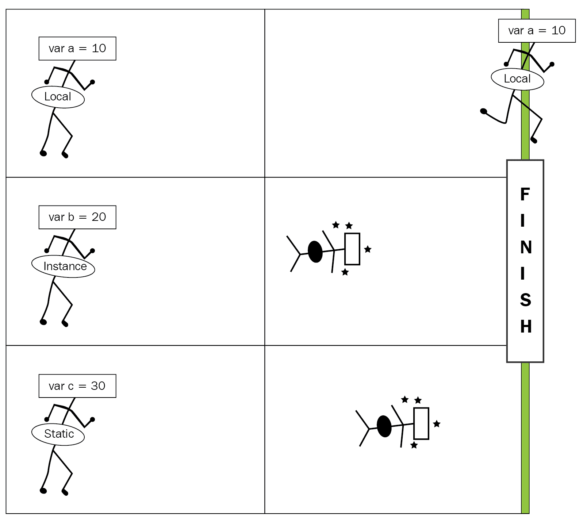

# 第一章：类型推断

能够使用局部变量（`var`）进行类型推断是 Java 10 的明星特性之一。它减少了语言的冗长性，同时没有牺牲 Java 的可靠静态绑定和类型安全。编译器通过使用代码中可用的信息来推断类型，并将其添加到它生成的字节码中。

每个新概念都有自己的优点、局限性和复杂性。使用`var`进行类型推断也不例外。当你通过这一章工作时，使用`var`会既让你着迷又让你沮丧，但最终你会胜利地出现。

在本章中，我们将涵盖以下主题：

+   什么是类型推断？

+   使用`var`进行类型推断

+   与`var`一起工作的注意事项和禁忌

+   类型推断与动态绑定

# 什么是类型推断？

想象一下，用以下图像中显示的多个以提示形式存在的约束条件来解决一个谜题。你通过解决约束条件来得出答案。你可以将类型推断与生成约束条件然后解决它们，以确定编程语言中的数据类型进行比较。类型推断是编译器通过使用代码中已存在的信息（如字面值、方法调用及其声明）来确定数据类型的能力。对于开发者来说，类型推断减少了冗长性，如下面的图所示：


为了参考，前面谜题的答案是 87（只需将图像颠倒过来，你就能找到数字的顺序）。

类型推断对 Java 来说并不新鲜。随着 Java 10 中引入`var`（局部变量）的概念，它被提升到了一个新的水平。

让我们通过查看一些`var`的示例来深入了解这个主题。

# 使用`var`进行类型推断

以下代码行显示了在 Java 10 之前如何定义局部变量（以及所有其他变量）：

```java
String name = "Java Everywhere"; 
LocalDateTime dateTime = new LocalDateTime.now();
```

从 Java 10 开始，通过使用`var`，你可以在局部变量的声明中省略强制显式类型，如下所示：

```java
var name = "Java Everywhere";            // variable 'name' inferred as 
                                         // String 
var dateTime = new LocalDateTime.now();  // var 'dateTime' inferred as 
                                         // LocalDateTime 
```

前面的代码看起来没有提供很多好处吗？想象一下，你可以用以下代码替换它：

```java
HashMap<Integer, String> map = new HashMap<Integer, String>(); 
```

并用以下代码替换它：

```java
var map = new HashMap<Integer, String>();  
```

通过将`HashMap<Integer, String>`替换为`var`，前面的代码行变得更短了。

当你不再明确声明变量的数据类型时，编译器就会接管以确定或推断变量类型。类型推断是编译器评估代码中已存在的信息（如字面值、操作和方法调用或它们的声明）以确定变量类型的能力。它遵循一系列规则来推断变量类型。作为开发者，当你选择使用`var`进行类型推断时，你应该了解编译器的推断算法，以免得到意外结果。

每当有新的功能时，您都应该遵守一些规则和限制，并尝试遵循最佳实践以充分利用该功能。让我们从使用 `var` 定义的变量强制初始化开始。

`var` 的类型推断不是动态类型；Java 仍然是一种强静态类型语言。使用 `var` 可以使您的代码更简洁；您可以从局部变量的定义中省略其类型。

# 强制非空初始化

使用 `var` 定义的局部变量必须在声明时进行初始化，否则代码将无法编译。编译器无法推断未初始化变量或被赋予 `null` 值的变量的类型。以下代码将无法编译：

```java
var minAge;                   // uninitialized variable 
var age = null;               // variable assigned a null value  
```

以下图像说明了如果未初始化的变量 `age` 去寻求进入 Mr. Java 编译器的位置会发生什么。编译器不会让 `age` 进入：



使用 `var` 定义变量时，必须始终伴随其初始化，否则代码将无法编译。

# 局部变量

`var` 的使用仅限于局部变量。这些变量用于存储中间值，与实例和静态变量相比，生命周期最短。局部变量在方法、构造函数或初始化块（实例和静态）内定义。在方法或初始化块内，它们可以在诸如 `if..else` 循环、`switch` 语句和 `try-with-resources` 构造等结构中定义。

以下是一个 `Person` 类的示例，展示了在初始化块、方法（包括构造函数）、循环、`switch` 分支内的局部变量或 `try with resources` 语句中使用 `var` 定义局部变量的可能用法：

```java
public class Person { 
    { 
        var name = "Aqua Blue";         // instance initializer block 
    } 

    static { 
        var anotherLocalVar = 19876;    // static initializer block 
    } 

    Person() { 
        var ctr = 10;                   // constructor 
        for (var loopCtr = 0; loopCtr < 10; ++loopCtr) {   // loop -                                                            
                                                           // for
            switch(loopCtr) { 
                case 7 :{ 
                    var probability = ctr / loopCtr;       // switch 
                    System.out.println(probability); 
                    break; 
                } 
            } 
        } 
    } 

    public String readFile() throws IOException { 
        var filePath = "data.txt"; 
        // try with resources
        try (var reader = new BufferedReader(new FileReader(filePath))) {    
            return reader.readLine(); 
        } 
    } 
}  
```

如您从前面的代码中可以看出，局部变量可以在类的不同位置使用 `var` 进行声明。您还记得大多数吗？如果不记得，让我们为您简化一下。

让我们使用一个应用程序来 *查找* 所有可以定义使用 `var` 的局部变量的可能位置，并以图示方式标记：



本章包含一些代码检查练习供您尝试。这些练习使用了两位假设程序员的名称——Pavni 和 Aarav。

# 代码检查 – 第一部分

我们的程序员 Aarav 通过他的团队成员 Pavni 重构了一些代码。代码不再提供 `char` 数组存储的值的 `char` 和相应的 ASCII 数字。你能帮助 Aarav 吗？以下是要使用的代码：

```java
class Foo {   
    public static void main(String args[]) {   
        try {   
           char[] name = new char[]{'S','t','r','i','n','g'};   
           for (var c : name) {   
               System.out.println(c + ":"   + (c + 1 - 1));   
           }   
        }   
        catch (var e) {   
            //code   
        }   
    }   
}   
```

代码检查的答案：`var` 类型不能用于指定 `catch` 处理程序中异常的类型，`(var e)`。

# 使用 `var` 与原始数据类型

使用 `var` 与原始数据类型似乎是最简单的情况，但外表可能具有欺骗性。尝试执行以下代码：

```java
var counter = 9_009_998_992_887;       // code doesn't compile 
```

你可能认为一个不适用于原始`int`类型范围的整数字面量（例如`9_009_998_992_887`）会被推断为`long`类型。然而，事实并非如此。由于整数字面量的默认类型是`int`，你必须将前缀`L`或`l`附加到值的前面，如下所示：

```java
var counter = 9_009_998_992_887L;       // code compiles 
```

类似地，要使`int`字面量被推断为`char`类型，你必须使用显式转换，如下所示：

```java
var aChar = (char)91; 
```

当你将`5`除以`2`时，结果是什么？你以为它是`2.5`吗？但这并不是 Java 中（总是）的工作方式！当整数用作除法的操作数时，结果是整数，而不是小数。小数部分被舍弃，以得到整数结果。虽然这是正常的，但当你期望编译器推断变量类型时，可能会觉得有点奇怪。以下是一个例子：

```java
// type of result inferred as int; 'result' stores 2 
var divResult = 5/2; 

// result of (5/2), that is 2 casted to a double; divResult stores 2.0 
var divResult = (double)(5/ 2); 

// operation of a double and int results in a double; divResult stores 
// 2.5 
var divResult = (double)5/ 2;
```

虽然这些情况与`var`类型没有直接关系，但开发者认为编译器会推断特定类型的假设导致了不匹配。以下是一个快速图解，帮助你记住这一点：



整数字面量的默认类型是`int`，浮点数的默认类型是`double`。将`100`赋值给用`var`定义的变量时，其类型会被推断为`int`，而不是`byte`或`short`。

在算术运算中，如果任一操作数是`char`、`byte`、`short`或`int`，结果至少会被提升到`int`：

```java
byte b1 = 10; 
char c1 = 9; 
var sum = b1 + c1;        // inferred type of sum is int  
```

类似地，对于包含至少一个操作数为`long`、`float`或`double`值的算术运算，结果会被提升到`long`、`float`或`double`类型，分别：

```java
byte cupsOfCoffee = 10; 
long population = 10L; 
float weight = 79.8f; 
double distance = 198654.77; 

var total1 = cupsOfCoffee + population;     // inferred type of total1 
                                           // is long 
var total2 = distance + population;        // inferred type of total2 
                                           // is double 
var total3 = weight + population;    // inferred type of total3 is 
                                          // float  
```

原始变量隐式扩展的规则在理解 Java 编译器如何推断原始值变量方面起着重要作用。

# 派生类的类型推断

在 JDK 9 和其他早期版本中，你可以定义一个基类变量并将其赋值为其派生类的实例。你可以通过变量访问的成员仅限于在基类中定义的成员。但是，使用`var`的情况不再是这样，因为变量的类型是通过为其分配的实例的具体类型来推断的。

想象一个类`Child`继承自类`Parent`。当你创建一个局部变量并将其赋值为`Child`类的实例时，变量的类型被推断为`Child`。这看起来很简单。以下是一个例子：

```java
class Parent { 
    void whistle() { 
        System.out.println("Parent-Whistle"); 
    } 
} 
class Child extends Parent { 
    void whistle() { 
        System.out.println("Child-Whistle"); 
    } 
    void stand() { 
        System.out.println("Child-stand"); 
    } 
} 
class Test{ 
    public static void main(String[] args) { 
        var obj = new Child();                             
        obj.whistle(); 
        obj.stand();     // type of obj inferred as Child 
    } 
}
```

如果你使用可以返回`Child`类或`Parent`类实例的方法来赋值给`obj`变量，会发生什么？以下是修改后的代码：

```java
class Parent { 
    void whistle() { 
        System.out.println("Parent-Whistle"); 
    } 
} 

class Child extends Parent { 
    void whistle() { 
        System.out.println("Child-Whistle"); 
    } 
    void stand() { 
        System.out.println("Child-stand"); 
    } 
} 

class Test{ 
    public static Parent getObject(String type) { 
        if (type.equals("Parent")) 
            return new Parent(); 
        else 
            return new Child(); 
    } 

    public static void main(String[] args) { 
        var obj = getObject("Child"); 
        obj.whistle(); 
        obj.stand();              // This line doesn't compile 
    } 
} 
```

在上述代码中，`getObject()` 方法返回的实例类型在代码执行之前无法确定。在编译期间，`obj` 变量的类型被推断为 `Parent`，这是 `getObject()` 方法的返回类型。由于 `Parent` 类没有定义 `stand()`，因此 `main()` 方法无法编译。

使用 `var` 定义的变量类型是在编译时推断的。如果使用 `var` 定义的方法的返回类型来分配变量，其推断类型是方法的返回类型，而不是在运行时返回的实例类型。

# 接口的类型推断

让我们将上一节的内容扩展到接口的使用。想象一下，`Child` 类实现了 `MarathonRunner` 接口，如下所示：

```java
interface MarathonRunner{ 
    default void run() { 
        System.out.println("I'm a marathon runner"); 
    } 
} 

class Child implements MarathonRunner { 
    void whistle() { 
        System.out.println("Child-Whistle"); 
    } 
    void stand() { 
        System.out.println("Child-stand"); 
    } 
}  
```

让我们定义一个 `obj` 局部变量，将其赋值为 `Child` 类的实例：

```java
class Test{ 
    public static void main(String[] args) { 
        var obj = new Child();              // inferred type of var obj 
                                            // is Child 
        obj.whistle(); 
        obj.stand();                     
        obj.run(); 
    } 
}  
```

如果使用返回类型为 `MarathonRunner` 的方法初始化相同的变量，其推断类型为 `MarathonRunner`（无论它返回的实例类型如何）：

```java
class Test{ 
    public static MarathonRunner getObject() { 
        return new Child(); 
    } 
    public static void main(String[] args) { 
        var obj = getObject();     // inferred type of var obj is 
                                   // MarathonRunner 
        obj.whistle(); 
        obj.stand(); 
        obj.run(); 
    } 
}
```

# 使用 `var` 与数组

使用 `var` 并不意味着只是丢弃局部变量的类型；剩下的应该能够使编译器推断其类型。想象一下一个定义 `char` 类型数组的函数，如下所示：

```java
char name[] = {'S','t','r','i','n','g'};
```

你不能在上述代码中将数据类型名称，即 `char`，替换为 `var` 并使用以下任何一种代码示例来定义它：

```java
var name[] = {'S','t','r','i','n','g'};
var[] name = {'S','t','r','i','n','g'};
var name = {'S','t','r','i','n','g'};
```

这是一种包含相关信息的方法之一，以便编译器可以推断类型：

```java
var name = new char[]{'S','t','r','i','n','g'};
```

看起来 Java 编译器已经对程序员的这个假设感到困扰，如下面的图像所示：



你不能仅仅为了使用 `var` 而丢弃数据类型。剩下的应该能够使编译器推断出所赋值的类型。

# 泛型的类型推断

泛型被引入 Java 中是为了促进类型安全。它使开发者能够指定他们使用具有固定类型或一系列类型的类、接口和集合类的意图。违反这些意图将通过编译错误而不是运行时异常来强制执行，从而提高了合规性标准。

例如，以下展示了如何定义 `ArrayList` 来存储 `String` 值（在赋值右侧重复 `<String>` 是可选的）：

```java
List<String> names = new ArrayList<>();  
```

然而，将 `List<String>` 替换为 `var` 将会使泛型的类型安全受到威胁：

```java
var names = new ArrayList<>(); 
names.add(1); 
names.add("Mala"); 
names.add(10.9); 
names.add(true); 
```

上述代码允许向 `names` 添加多个数据类型，这并不是我们的意图。使用泛型时，更推荐的方法是向编译器提供相关信息，以便它可以正确推断其类型：

```java
var names = new ArrayList<String>(); 
```

当使用 `var` 与泛型一起时，确保在赋值右侧的尖括号内传递相关数据类型，这样就不会丢失类型安全。

现在，是我们进行下一项代码检查的时候了。

# 代码检查 – 第二部分

我们的一位程序员，Pavni，尝试在泛型和集合类中使用`var`，但她的代码似乎没有输出排序好的钢笔集合。你能帮忙吗？查看以下代码：

```java
class Pen implements Comparable<Pen> {   
    String name;   
    double price;   
    public Pen(String name, double price) {   
        this.name = name;   
        this.price = price;   
    }   
    public int compareTo(Pen pen) {   
        return ((int)(this.price - pen.price));   
    }   
    public String toString() {   
        return name;   
    }   

    public static void main(String   args[]) {   
        var pen1 = new Pen("Lateral",   219.9);   
        var pen2 = new Pen("Pinker",   19.9);   
        var pen3 = new Pen("Simplie",   159.9);   

        var penList = List.of(pen1, pen2,   pen3);   

        Collections.sort(penList);   
        for (var a : penList)    
            System.out.println(a);   
    }   
}   
```

代码检查的答案：这里的问题是试图通过使用`Collections.sort()`来修改不可变集合。这是为了强调并非所有问题都与`var`的使用相关。

# 将推断变量传递给方法

尽管`var`的使用仅限于局部变量的声明，但这些变量（包括原始类型和引用类型）可以作为值传递给方法。推断的类型和方法期望的类型必须匹配，以便代码能够编译。

在以下示例代码中，`Child`类实现了`MarathonRunner`接口。`Marathon`类中的`start()`方法期望`MarathonRunner`对象（实现此接口的类的实例）作为其方法参数。`aRunner`变量的推断类型是`Child`。由于`Child`类实现了`MarathonRunner`，`aRunner`可以被传递给`start()`方法，`aRunner`的推断类型（`Child`）和`start()`期望的类型（`MarathonRunner`）匹配，允许代码编译。

代码如下：

```java
interface MarathonRunner { 
    default void run() { 
        System.out.println("I'm a marathon runner"); 
    } 
} 
class Child implements MarathonRunner { 
    void whistle() { 
        System.out.println("Child-Whistle"); 
    } 
    void stand() { 
        System.out.println("Child-stand"); 
    } 
} 
class Marathon { 
    public static void main(String[] args) { 
        var aRunner = new Child();         // Inferred type is Child 
        start(aRunner);                    // ok to pass it to method start 
                                           // (param - MarathonRunner) 
    } 
    public static void start(MarathonRunner runner) { 
        runner.run(); 
    } 
}  
```

只要变量的推断类型与方法参数的类型相匹配，就可以将其作为参数传递给它。

# 重新分配推断变量的值

对于所有非最终变量，你可以重新分配值给推断变量。只需确保重新分配的值与其推断类型匹配。在以下代码中，由于`age`变量的类型被推断为`int`，你不能将其分配为小数`10.9`。同样，由于`query`变量的类型被推断为`StringBuilder`。变量的类型只推断一次，如下所示：

```java
var age = 9;     // type of variable age inferred as int 
age = 10.9;      // can't assign 10.9 to variable of type int 

var query = new StringBuilder("SELECT");         // Type of variable 
                                              // query is StringBuilder 
query = query.toString() + "FROM" + "TABLE";     // won't compile;  
                                                 // can't assign String                                                                                                 
                                                // to variable query
```

使用`var`定义的局部变量的类型只推断一次。

# 推断变量的显式转换

假设一个合作程序员将`29`赋值给推断的局部变量（比如说`age`），假设编译器会推断变量`age`的类型为`byte`：

```java
var age = 29;           // inferred type of age is int 
```

然而，编译器会推断变量`age`的类型为`int`，因为整型字面值的默认类型是`int`。为了修复前面的假设，你可以使用显式数据类型或通过使用显式转换覆盖编译器的默认推断机制，如下所示：

```java
byte age = 29;                // Option 1 - no type inference 
var age = (byte)29;           // Option 2 - explicit casting 
```

通过使用显式转换类型推断，你可以覆盖编译器的默认类型推断机制。这可能是为了修复现有代码中的假设。

类似地，你可以使用显式转换与其他原始数据类型，如`char`和`float`：

```java
var letter = (char)97;        // inferred type of letter is char 
var debit = (float)17.9;      // inferred type of debit is float  
```

在前面的例子中没有使用显式转换的情况下，被分配整型字面值的变量会被推断为`int`，而小数会被推断为`double`。

以下示例展示了引用变量的显式转换：

```java
class Automobile {} 
class Car extends Automobile { 
    void check() {} 
} 
class Test{ 
    public static void main(String[] args) { 
        var obj = (Automobile)new Car();                             
        obj.check();     // Won't compile; type of obj is Automobile 
    } 
} 
```

使用类型推断进行显式类型转换以修复任何现有的假设。我不建议使用显式类型转换来初始化推断变量；这违背了使用`var`的目的。

# 使用显式类型转换赋值 null

再次，虽然使用显式类型转换将`null`赋值给`var`类型没有意义，但它是一种有效的代码，如下所示：

```java
var name = (String)null;             // Code compiles 
```

尽管前面的代码在语法上是正确的，但它是一种不良的编码实践。请避免使用它！

# Java 先前版本中的类型推断

虽然`var`在 Java 10 中将推断提升到了一个新的水平，但在 Java 的先前版本中已经存在类型推断的概念。让我们看看 Java 先前版本中类型推断的一些例子。

# Java 5 中的类型推断

泛型引入了一种类型系统，使开发者能够对类型进行抽象。它限制了一个类、接口或方法只能与指定类型的实例一起工作，提供了编译时的类型安全性。泛型被定义为向集合框架添加编译时的类型安全性。泛型使程序能够在编译期间检测某些错误，因此它们不能渗透到运行时代码中。

Java 5 中使用了类型推断来推断泛型方法类型参数。考虑以下代码：

```java
List<Integer> myListOfIntegers = Collections.<Integer>emptyList(); // 1
```

而不是前面的代码，你可以使用以下代码：

```java
 List<Integer> myListOfIntegers = Collections.emptyList(); // 1 
```

# Java 7 中的类型推断

Java 7 引入了对泛型构造函数参数的类型推断。考虑以下代码行：

```java
List<String> myThings = new ArrayList<String>(); 
```

在 Java 7 中，前面的代码行可以用以下代码替换：

```java
List<String> myThings = new ArrayList<>();  
```

前面的代码不应与以下代码混淆，后者试图将泛型与原始类型混合：

```java
List<String> myThings = new ArrayList();  
```

Java 7 还允许对泛型方法进行类型推断。对于一个在类中定义的泛型方法（例如，`print()`），代码如下：

```java
class MyClass<T> { 
   public <X> void print(X x) { 
         System.out.println(x.getClass()); 
   } 
}  
```

前面的代码可以用以下两种方式之一调用（第三行代码使用类型推断来推断传递给`print()`方法的参数的类型）：

```java
MyClass<String> myClass = new MyClass<>(); 
myClass.<Boolean>deliver(new Boolean("true"));     
myClass.deliver(new Boolean("true")); 
```

# Java 8 中的类型推断

Java 8 引入了函数式编程，包括 lambda 函数。lambda 表达式可以推断其形式参数的类型。考虑以下代码：

```java
Consumer<String> consumer = (String s) -> System.out.println(s);
```

而不是前面的代码，你可以输入以下代码：

```java
Consumer<String> consumer = s -> System.out.print(s);
```

# 挑战

`var`的使用并非没有其挑战，这既包括 Java 语言的开发者，也包括其用户。让我们从`var`使用受限的原因开始。

# 限制失败假设的范围

如你所知，`var`类型的用法仅限于 Java 中的局部变量。它们不允许在公共 API 中使用，例如作为方法参数或方法的返回类型。一些语言支持对所有类型变量的类型推断。Java 可能在将来允许我们这样做，但我们不知道具体何时。

然而，有强烈的理由限制推断变量的作用域，以便尽早发现由于假设与实际情况不匹配而产生的错误。公共 API 的合同应该是明确的。使用公共 API 进行类型推断将允许这些错误被捕获和纠正得晚得多。

公共 API 的合同应该是明确的；它们不应该依赖于类型推断。

以下是一个实际示例，说明了假设与实际情况之间的不匹配可能导致错误。

最近，我的女儿随学校出国参加学生交流项目。学校要求我为她签证申请发送一组照片。我联系了一位摄影师，要求他打印签证照片（并指定了国家）。两天后，学校要求我重新提交照片，因为它们不符合规则。

发生了什么问题？学校和我自己都没有明确照片的规格。学校认为我会知道规格；我假设摄影师会知道规格（因为他已经做了很多年）。在这种情况下，至少有一个人假设结果符合特定的输出，而没有明确指定输出。没有明确的合同，总是有可能期望与实际情况不符。

尽管存在困惑，但在应用程序提交给大使馆之前，错误已被发现并纠正。

以下是一个有趣的图像，展示了为什么类型推断的使用仅限于局部变量。局部实例和静态变量在比赛中竞争，只有局部变量才能到达终点线：



# 破坏现有代码

截至 Java 10，`var` 是一个受限的局部变量类型，不能用于类型声明。使用 `var` 作为类、接口、方法、方法参数或变量名称的代码，在 JDK 10 及以后的版本中将无法编译。

以下是一个使用 `var` 在多个位置且无法编译的代码示例：

```java
class var {}          // can't use var as class name
interface var {}      // can't use var as interface name
class Demo {
    int var = 100;               // can't use var as instance variable 
                                 // name
    static long var = 121;       // can't use var as static variable 
                                 // name

    void var() {                 // can't use var as method name
        int var = 10;            // cant use var as the name of a local 
                                 // variable
    }
    void aMethod(String var) {}  // can't use var as the name of method parameter
}
```

即使你计划不将生产代码部署到最新版本的 Java 中，也很重要使用最新的 Java 发布版本测试你的生产代码。这有助于解决与你的生产代码的任何兼容性问题，帮助你将其迁移到 Java 的未来版本。

# 不可表示类型

你可以在程序中使用的 Java 类型，如 `int`、`Byte`、`Comparable` 或 `String`，被称为 **可表示** 类型。编译器内部使用的类型，如匿名类的子类，你无法在程序中编写，被称为 **不可表示** 类型。

到目前为止，变量的类型推断似乎很容易实现——只需获取传递给方法的价值和从方法返回的价值的信息，并推断类型。然而，当涉及到不可表示类型的推断时——`null`类型、交集类型、匿名类类型和捕获类型，事情并不像那样简单。

例如，考虑以下代码并思考推断变量的类型：

```java
// inferred type java.util.ImmutableCollections$ListN 
var a = List.of(1, "2", new StringBuilder());
var b = List.of(new ArrayList<String>(), LocalTime.now());
```

变量`a`和`b`的类型并不是你之前读过的类型。但这并不妨碍它们被推断。编译器将它们推断为一个不可表示的类型。

# 有意义的变量名

使用`var`进行类型推断应负责任地使用。当你从变量声明中移除显式数据类型时，变量名就成为了焦点。在使用推断类型的情况下，你有责任使用描述性和适当的变量名，以便它们在代码中更有意义。正如你所知，一段代码只编写一次，但会被阅读多次。

例如，以下代码行在一段时间后对你或你的团队成员（尤其是大型或分布式团队）来说可能没有太多意义：

```java
var i = getData();             // what does getData() return? Is 'i' a 
                              // good name? 
```

关键问题是——变量`i`用于什么？`getData()`方法返回什么？想象一下你离开后将与这段代码一起工作的其他团队成员的困境。

此外，定义与目的不匹配的变量名也没有帮助。例如，创建一个名为`database`的连接对象并将其分配给一个`URL`实例，或者定义一个名为`query`的变量并将其分配给一个`Connection`实例，都没有太多意义：

```java
var database = new URL("http://www.eJavaGuru.com/malagupta.html"); 
var query = con.getConnection(); 
```

当使用`var`定义变量时，变量名变得更加重要。没有类型，可能难以理解变量的目的，尤其是如果其名称不够表达。仔细且负责任地选择变量名，使其目的明确。

# 代码重构

使用`var`进行类型推断是为了减少 Java 语言的冗长。这将帮助程序员在方法中更加简洁。编译器会推断使用`var`声明的变量的类型，并将其插入到字节码中。无需重构现有或遗留代码，将局部变量的显式数据类型替换为`var`。

# 类型推断与动态绑定

使用`var`进行类型推断并没有推动 Java 走向动态绑定领域。Java 仍然是一个强类型静态语言。Java 中的类型推断是语法糖。编译器推断类型并将其添加到字节码中。在动态绑定中，变量类型在运行时推断。这可能导致更晚发现更多的错误。

# 摘要

在本章中，我们介绍了 Java 10 中引入的局部变量推断，或称为`var`。`var`类型允许你在方法中省略局部变量的显式数据类型。我们讨论了使用`var`的各种注意事项。限于局部变量，使用`var`定义的变量必须初始化。它们可以与所有类型的变量一起使用——原始类型和对象。使用`var`定义的变量也可以传递给方法并从方法返回；方法声明兼容性规则适用。

为了避免在使用泛型时冒着类型安全的风险，确保在使用`var`与泛型一起使用时传递相关信息。尽管这样做没有太多意义，但使用显式转换在用`var`定义的变量中是允许的。

我们还讨论了类型推断在 Java 的先前版本（5、7 和 8）中存在的方式。在结尾部分，我们讨论了为什么类型推断仅限于局部变量，并且不允许在公共 API 中使用。

使用有意义的变量名一直被推荐，并且这一点非常重要。有了`var`，这一点变得更加重要。由于`var`提供了语法糖，因此没有必要重构现有的或遗留代码以添加`var`的使用。
