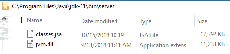
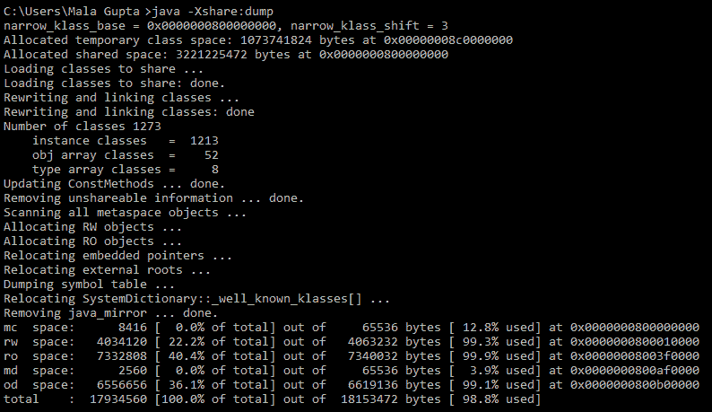
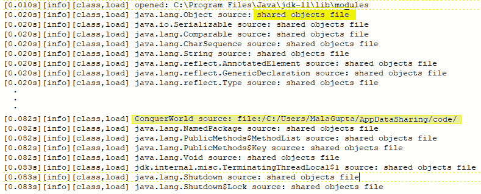
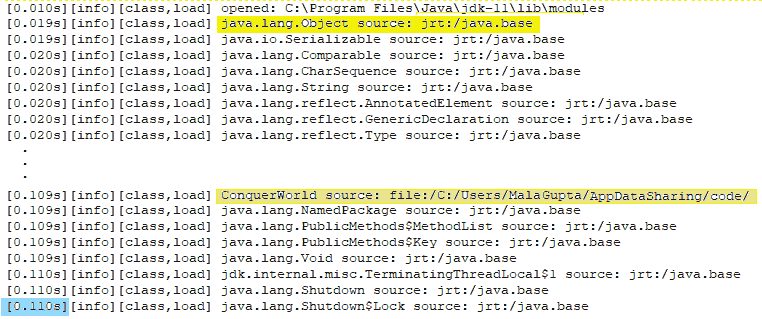
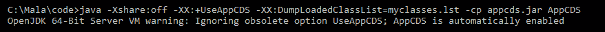
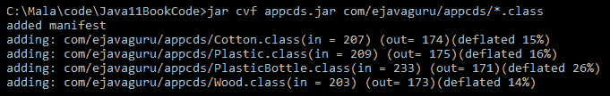
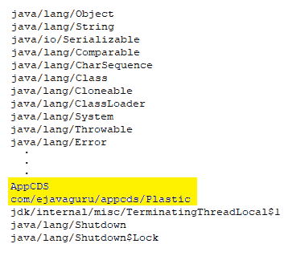
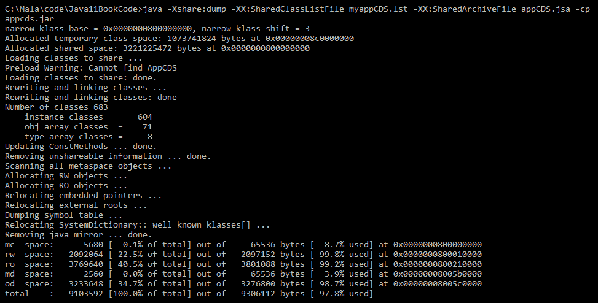

# AppCDS

**应用程序类数据共享**（**AppCDS**）或**AppCDS**扩展了**类数据共享**（**CDS**）的功能。它允许程序员将选定的应用程序类以及核心库类包含在共享归档文件中，以减少 Java 应用程序的启动时间。这也导致了内存占用减少。

使用 AppCDS 创建的共享归档文件可以包括运行时映像中的类、运行时映像中的应用程序类以及类路径中的应用程序类。

在本章中，我们将涵盖以下主题：

+   CDS 简介

+   使用 CDS 创建共享归档

+   AppCDS 简介

+   使用 AppCDS 识别要放入共享归档中的应用程序文件

+   创建和使用共享应用程序归档文件

# 技术要求

要使用本章中的代码，你应该在你的系统上安装了 JDK 版本 10 或更高版本。

本章中的所有代码都可以在[`github.com/PacktPublishing/Java-11-and-12-New-Features`](https://github.com/PacktPublishing/Java-11-and-12-New-Features)找到。

由于 AppCDS 扩展了 CDS 的功能，因此在开始使用 AppCDS 之前了解 CDS 会有所帮助。下一节介绍了 CDS，包括如何找到共享归档文件、如何创建或重新创建它以及相关的命令。如果你有实际使用 CDS 的经验，可以跳过下一节关于 CDS 的内容。

# 什么是 CDS？

自 Java 8 以来，CDS 一直是 Oracle JVM 的商业特性。CDS 以两种方式帮助——它有助于减少 Java 应用程序的启动时间，并使用多个**Java 虚拟机**（**JVMs**）减少其内存占用。

当你启动你的 JVM 时，它会执行多个步骤来为执行准备环境。这包括字节码加载、验证、链接以及核心类和接口的初始化。类和接口被组合到 JVM 的运行时状态中，以便它们可以被执行。它还包括方法区域和常量池。

这些核心类和接口的集合除非你更新了你的 JVM，否则不会改变。所以每次你启动你的 JVM 时，它都会执行相同的步骤来为执行准备环境。想象一下，你可以将结果导出到一个文件中，这个文件可以在 JVM 启动时被读取。随后的启动可以不执行加载、验证、链接和初始化的中间步骤。欢迎来到 CDS 的世界。

当你*安装*JRE 时，CDS 会从系统`jar`文件中的一系列预定义类创建一个共享归档文件。在类可以使用之前，它们会被类加载器验证——这个过程适用于所有类。为了加快这个过程，安装过程将这些类加载到内部表示中，然后将该表示导出到`classes.jsa`——一个共享归档文件。当 JVM 启动或重启时，`classes.jsa`会被内存映射以节省加载这些类的步骤。

当 JVM 的元数据在多个 JVM 进程之间共享时，它会导致更小的内存占用。从填充的缓存中加载类比从磁盘加载更快；它们也部分经过验证。此功能对启动新 JVM 实例的 Java 应用程序也有益。

# 共享归档文件的存放位置

默认情况下，JDK 安装过程创建名为`classes.jsa`的类数据共享文件。`classes.jsa`的默认位置如下：

+   Solaris/Linux/macOS: `/lib/[arch]/server/classes.jsa`

+   Windows 平台: `/bin/server/classes.jsa`（如下截图所示）：



在 Windows 系统上，共享归档文件的大小，即`classes.jsa`，大约为 17.2 MB。

# 手动创建 classes.jsa

此共享归档文件也可以使用以下运行时命令手动创建（你应该有足够的权限写入目标目录）：

```java
    java -Xshare:dump 
```

下面是前面命令的示例输出：



如前一个屏幕截图中的输出消息所示，此命令执行了许多操作——它加载类、链接它们、计算包含在共享归档中的类数量、分配读写和只读对象，等等。

如果文件已存在，前面的命令将简单地覆盖现有文件。

使用前面命令创建的共享归档文件不包括**所有**的系统 API 类或接口。它只包括启动时所需的那些。

# CDS 的使用

您可以通过开启、关闭或设置为自动模式来手动控制 CDS 的使用。以下是这样做的命令行选项：

+   `java -Xshare:off`: 禁用 CDS

+   `java -Xshare:on`: 启用 CDS

+   `java -Xshare:auto`: 默认模式（尽可能启用 CDS）

让我们快速定义一个类如下：

```java
class ConquerWorld { 
    public static void main(String args[]) { 
        System.out.println("Go and conquer the world"); 
    } 
} 
```

让我们使用共享归档文件`classes.jsa`执行前面的类（`ConquerWorld`）。要查看从共享归档中加载的系统类，可以使用带有类执行的`log`文件，如下所示：

```java
    java -Xlog:class+load:file=myCDSlog.log ConquerWorld  
```

前面的命令输出以下内容：

```java
    Go and conquer the world  
```

让我们检查`myCDSlog.log`文件的内容（我已经突出显示文本以引起您对特定行的注意；突出显示的文本不包括在`log`文件中）：



`classes.jsa`文件也被称为**共享对象文件**。JVM 从`classes.jsa`加载大约 500 个类或接口来设置执行环境。它从系统相关位置加载`ConquerWorld`类的字节码。

如果你仔细检查`myCDSlog.log`文件，你会注意到有一些类没有从共享对象文件中加载。这是因为它们无法归档；这种情况可能发生在某些情况下。

让我们看看如果你通过声明不使用共享对象文件来执行相同的类（`ConquerWorld`）会发生什么。为此，你可以使用 `-Xshare:off` 命令，如下所示：

```java
    java -Xshare:off -Xlog:class+load:file=myCDSshareoff.log     
    ConquerWorld  
```

以下代码将输出与之前相同的结果。让我们检查 `myCDSshareoff.log` 文件的内容：



如你所见，由于之前的执行不再使用共享对象文件（使用 `Xshare:off` 选项已关闭），系统或核心 API 类在运行时从各自的模块中加载。如截图左下角所突出显示的，你还可以看到这次执行花费了更长的时间，即大约 0.110 秒。这个时间超过了使用共享存档（如前一个截图所示）的类似执行的 0.083 秒执行时间。

在了解了 CDS 如何降低代码执行时间的基本信息后，让我们开始使用 AppCDS。

# AppCDS

增加的用户和技术使用正在推动每天探索或制定更好的方法来提高性能。JEP 310 提出了将 CDS 扩展到支持应用程序文件。在本节中，你将了解 AppCDS 如何提高 Java 应用程序的性能以及如何创建和使用它。

# AppCDS 的好处

AppCDS 将 CDS 的好处扩展到应用程序类，使你能够将应用程序类与核心库类的共享存档一起放置。这消除了类加载、链接和字节码验证的工作，从而减少了应用程序的启动时间。多个 JVM 可以访问共享存档，从而减少了整体内存占用。

在云中，服务器扩展 Java 应用程序是很常见的，多个 JVM 执行相同的应用程序。这是一个非常适合 AppCDS 的用例。此类应用程序将从减少启动时间和减少内存占用中受益巨大。

无服务器云服务在启动时加载成千上万的应用程序类。AppCDS 将显著减少它们的启动时间。

# 启用应用程序类数据存档

在 Java 10 中，默认配置仅启用了 JVM 的引导类加载器的类数据共享。由于引导类加载器不加载你的应用程序文件，因此你预计需要显式地为应用程序类加载器和其他类加载器使用以下命令启用它：

```java
    -XX:+UseAppCDS
```

然而，在 Java 11 中，AppCDS 在 OpenJDK 64 位系统上自动启用。当包含此选项时，你可能会收到如下错误消息：



如果你正在使用 Java 11 或更高版本，你可以跳过此选项。

Java 运行时选项对大小写敏感。`-XX:+UseAppCDS` 和 `-XX:+useAppCDS` 选项并不相同。

# 哪些应用程序类需要存档

创建共享归档的下一步是指定要包含的应用程序类。检查您在前一节中创建的`myCDSlog.log`文件。它不包含在核心 Java API 中定义的每个类或接口。

同样，尽管您的应用程序可能包含很多类，但您不需要将**所有**它们包含在共享归档文件中，仅仅是因为不是所有类在启动时都是必需的。这也减少了共享归档文件的大小。

这里有一个示例，用于找到应该添加到共享归档中的应用程序类。首先，创建应用程序文件的`jar`文件。

让我们在`com.ejavaguru.appcds`包中创建四个骨架类文件：

```java
// Contents of Cotton.java 
package com.ejavaguru.appcds; 
public class Cotton {} 

// Contents of Plastic.java 
package com.ejavaguru.appcds; 
public class Plastic {} 

// Contents of PlasticBottle.java 
package com.ejavaguru.appcds; 
public class PlasticBottle extends Plastic {}  

// Contents of Wood.java 
package com.ejavaguru.appcds; 
public class Wood {}
```

这里是`AppCDS`类的内容，它使用前面提到的其中一个类。它不在同一个包中定义：

```java
// Contents of class AppCDS.java 
import com.ejavaguru.appcds.*; 
class AppCDS { 
    public static void main(String args[]) { 
        System.out.println(new Plastic()); 
    } 
} 
```

如果您的目录结构与包结构匹配，您可以使用以下命令创建`jar`文件：



要确定应该放入共享归档中的应用程序类，执行以下命令：

```java
java -Xshare:off  
     -XX:DumpLoadedClassList=myappCDS.lst 
     -cp appcds.jar 
      AppCDS 
```

执行前面的命令后，`myappCDS.lst`记录了由 JVM 加载的所有类的完全限定名（使用`\`分隔，大约有 500 个），包括核心 API 类和您的应用程序类。

以下截图显示了`myappCDS.lst`文件中的一些类名。我已经突出显示了列表中包含的两个应用程序文件的名字——`AppCDS`和`com/ejavaguru/appcds/Plastic`：



如果您重新查看`AppCDS`类的代码，您会注意到它只使用了一个类，即`com.ejavaguru.appcds`包中的`Plastic`类。同一包中的其他类没有加载，因为它们没有被使用。如果您想加载其他特定的类，您应该在应用程序中使用它们。

在访问要包含在共享归档中的应用程序文件列表后，您可以继续并创建它。

# 创建应用程序共享归档文件

要使用应用程序文件创建共享归档，您可以在命令提示符中执行以下命令：

```java
    java -Xshare:dump 
    -XX:+UseAppCDS 
         -XX:SharedClassListFile=myappCDS.lst
    -XX:SharedArchiveFile=appCDS.jsa 
         -cp appcds.jar  
```

如在*启用应用程序类数据归档*部分所述，如果您在系统上使用 Java 11 或更高版本，可以跳过使用`-XX:+UseAppCDS`选项（AppCDS 是在 Java 10 中引入的；在 Java 11 中，您不需要显式启用它）。前面的命令使用存储在`myappCDS.lst`中的类名列表来创建应用程序共享归档文件。它还指定共享归档文件的名称为`appCDS.jsa`。

这里是前面命令的输出截图：



让我们进入最后一步——使用共享应用程序归档文件。

# 使用共享应用程序归档文件

要使用与 AppCDS 一起的共享应用程序归档文件（`appCDS.jsa`），请执行以下命令：

```java
    java -Xshare:on 
    -XX:+UseAppCDS 
    -XX:SharedArchiveFile=appCDS.jsa 
    -cp appcds.jar 
         AppCDS  
```

上一段代码将使用共享应用程序归档文件来加载预定义的核心 API 类和应用程序类到内存中。这导致用户应用程序的启动时间减少。本章中使用的演示应用程序只包含四到五个类来演示这个过程，不会让你感到负担。你应该能够注意到更大用户应用程序启动时间的显著减少。此外，你可以在 JVM 之间共享`.jsa`文件，以减少内存占用。

# 摘要

本章从介绍 AppCDS 开始，它扩展了 CDS 到你的应用程序文件的能力。AppCDS 减少了你应用程序的启动时间和内存占用。

你已经了解了识别要包含在共享应用程序归档文件中的应用程序类、创建文件以及使用它的过程。

AppCDS 只是提高 Java 应用程序性能的多种方法之一。在下一章中，你将了解到垃圾回收优化如何进一步帮助提高 Java 应用程序的性能。

在下一章中，我们将探讨垃圾收集器中引入的各种优化。
