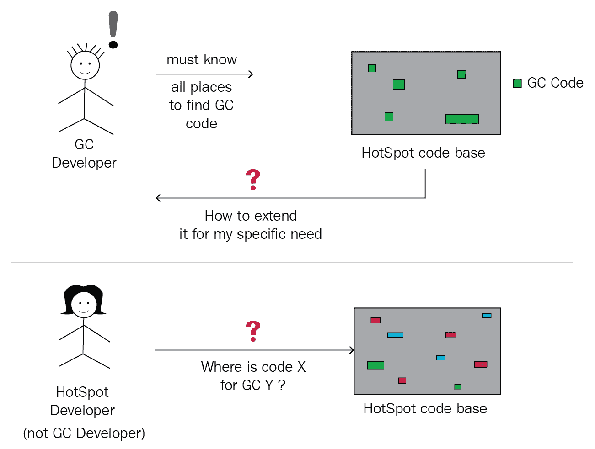
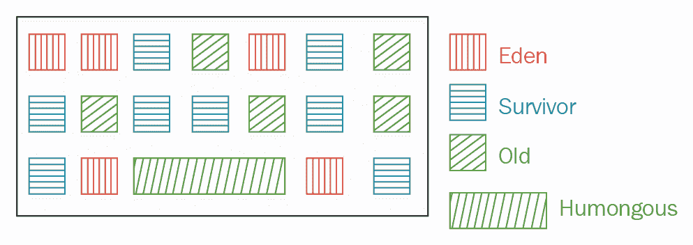
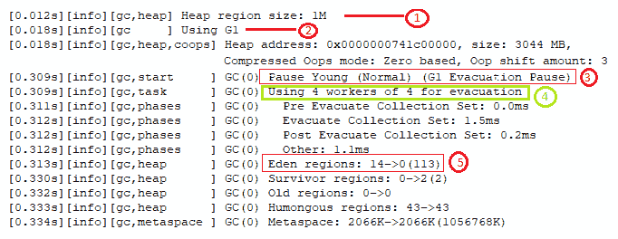
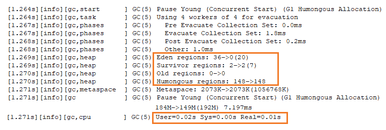
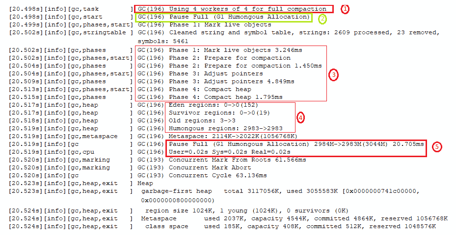

# 第三章：垃圾收集器优化

Java 10 在垃圾收集（**GC**）领域提供了两大改进。它包括为**垃圾优先**（**G1**）GC 提供并行完全 GC，提高了其最坏情况下的延迟。它还改善了 HotSpot 中多个 GC 的源代码隔离，引入了 GC 接口。

G1 被指定为 Java 9 的默认 GC。G1 通过将内存划分为幸存者、伊甸园和老年代区域，并通过执行中间 GC 来释放堆空间，旨在避免完全收集。然而，当对象分配速度很快且内存无法快速回收时，就会发生完全 GC。直到 JDK 9，G1 的完全 GC 使用单个线程执行。Java 10 支持 G1 的并行完全 GC。

GC 接口的创建是对 HotSpot 内部代码的纯重构。它通过引入一个干净的 GC 接口来隔离 GC 的源代码。这将使新的 HotSpot 开发者能够找到 GC 代码，并使 GC 开发者能够开发新的 GC。

在本章中，我们将学习以下主题：

+   GC 接口

+   G1 的并行完全 GC

# 技术要求

要使用本章中的代码，你应该在你的系统上安装了 JDK 版本 10 或更高版本。

本章中的所有代码都可以通过以下 URL 访问：[`github.com/PacktPublishing/Java-11-and-12-New-Features`](https://github.com/PacktPublishing/Java-11-and-12-New-Features)。

让我们从 GC 接口开始吧。

# GC 接口

想象一下，如果你是一个正在开发新 GC 的开发者？或者，一个 HotSpot 开发者（不是 GC 开发者）正在修改现有的 GC 代码？在 JEP 304 或 Java 10 之前，你将会有一个艰难的生活，因为 GC 代码散布在 HotSpot 源代码的各个地方。

JDK 增强提案（**JEP**）304 的目标是通过引入 GC 接口来提高 GC 的源代码隔离。这提供了许多好处。

# 利益

通过隔离 GC 源代码，HotSpot 内部 GC 代码的组织更好，符合基本的设计原则，即推荐代码模块化和组织。一个干净的 GC 接口将帮助开发者轻松地将新的 GC 添加到 HotSpot。GC 代码的隔离也使得从特定的 JDK 构建中排除 GC 变得更加容易。

它不会添加任何新的 GC 或删除现有的一个。

GC 代码隔离和 GC 接口使得从 JDK 构建中排除 GC 变得更加容易。

# 驱动因素

想象一下，如果你是一个 GC 开发者，你应该知道所有可以找到 HotSpot 中 GC 代码的地方。如果这还不够可怕，想象一下如果你不知道如何将其扩展到你的特定需求会是什么感觉。或者，想象一下，如果你是一个 HotSpot 开发者（而不是 GC 开发者），你似乎找不到 GC 的特定代码。我们还没有结束——现在想象一下，你必须排除构建时的特定 GC。这些情况在以下图中表示：



上述用例展示了推动代码库变化的主要因素——通过推动创建一个干净的 GC 接口。

尽管 GC 的代码在其各自的目录中定义（例如，`src/hotspot/share/gc/g1` 存储了 G1 GC 的代码），但一些代码是在这些目录之外定义的。一个典型的例子是大多数 GC 所需的屏障。由于屏障代码是在 C1 和 C2 运行时解释器中实现的，因此这些代码定义在定义 C1 和 C2 代码的目录中。然而，这导致 GC 代码碎片化，难以追踪和定位。

GC 接口引入了一层抽象，将跟踪所有 GC 代码的负担从开发者（包括 GC 和 HotSpot）身上移开。

# 影响

GC 接口将影响其他 **JavaServer Pages** (**JSPs**)。它将有助于弃用 **并发标记清除** (**CMS**) **垃圾收集器** (**GC**) (**JEP 291**)。使用 GC 接口，GC 可以在基础代码中隔离。

GC 接口还将有助于降低在 HotSpot 中引入新 GC 的影响。例如，它将有助于降低 Shenandoah (JEP 189) GC 所做的更改的侵入性。

在下一节中，我们将看看 G1 GC 的变化是如何帮助使应用程序更响应的。

# G1 的并行完全 GC（JEP 307）

想象一下，你被要求独自打扫你家的每一个角落，没有任何帮助。在这种情况下，你的房子将保持多长时间无法进入（因为你不想在打扫过程中有任何干扰）？

现在将你自己与一个单线程相比，将你的房子与分配给 JVM 的内存相比。如果一个单线程执行完全 GC，你的应用程序将见证最坏情况的延迟。

G1 GC 在 Java 9 中被设置为默认 GC，但完全 GC 使用单个线程。随着 JEP 307，Java 10 使完全 G1 GC 并行化，以改善应用程序的延迟。

让我们快速了解一下 G1 的细节，以便 JEP 307 对您更有意义。

# G1 GC 的设计目标

G1 GC 被设计为避免完全 GC 收集。G1 的一个主要设计目标是向 *停止世界的* GC 暂停的持续时间和分布添加可预测性和可配置性。

例如，使用 G1 GC，你可以在一个 *y* 毫秒的时间范围内指定停止世界的暂停不应超过 *x* 毫秒。一个真实的例子是，指定 G1 GC 的停止世界暂停不应超过每 70 秒 8 毫秒。G1 GC 将尽力达到这个性能目标。

然而，您配置这些值的方式可能与 G1 GC 的实际暂停时间不匹配。

停止世界 GC 暂停指的是 JVM 应用程序在 GC 标记或清理内存时不允许任何更改时变得无响应的状态。

# G1 内存

G1 将内存划分为区域——即**伊甸**、**幸存者**和**老年代**区域——这通常在计数上约为 2,048（或尽可能接近这个数字）。区域是用于存储不同代对象的内存空间，不需要它们连续分配。每个区域的大小取决于内存大小。所有**伊甸**和**幸存者**区域合在一起被称为年轻代，所有**老年代**区域合在一起被称为老年代。区域的大小计算为*X*的*2*次方，其中*X*介于 1 MB 和 64 MB 之间。G1 还定义了用于大对象的**巨无霸**内存区域，其大小大于**伊甸**区域大小的 50%。由于这些区域不是连续分配的，以下是使用 G1 GC 时内存可能的样子：



新对象分配在**伊甸**区域。在年轻收集期间，G1 GC 将活动对象从**伊甸**区域移动到**幸存者**区域。如果**幸存者**区域的对象存活时间足够长（这是通过使用`XX:MaxTenuringThreshold`指定的），或者直到它们被收集，它们将被移动到**老**区域。

**年轻收集**从**伊甸**区域收集、清除和压缩对象到**幸存者**区域。**混合收集**，正如其名所示，将包括一组**伊甸**和**老年代**区域。混合收集通过快速频繁地收集对象，以便**伊甸**和**幸存者**区域能够尽快释放。

当一个对象的大小超过一个区域大小的 50%时，它会被分配到**巨无霸**区域——这是**老年代**区域中一系列连续的区域。**巨无霸**区域不会分配在**伊甸**区域中，以保持复制或清除它的成本较低。

当年轻和混合收集无法回收足够的内存时，就会发生完全 GC。这包括标记活动对象、准备压缩、调整指针以及压缩堆。

本节仅概述了 G1 GC 中内存的组织和回收情况，以便您能理解本节的内容。对于更详细的信息，您可以参考[`www.oracle.com/technetwork/tutorials/tutorials-1876574.html`](https://www.oracle.com/technetwork/tutorials/tutorials-1876574.html)。

让我们用一个示例代码来工作，这个代码除了触发年轻和混合收集之外，还会触发完全垃圾回收（GC），最终由于堆空间耗尽和无法分配更多对象而退出 JVM。

# 示例代码

以下示例代码分配了一个大小为`999999`的图像数组，并将图像加载到其中。然后，代码检索图像字节并将它们存储到一个大小为`999999`的字节数组中。

在 3,044 MB 的堆大小和 1 MB 的区域大小下，此代码将强制执行完全 G1 GC，并最终因`OutOfMemoryError`而关闭 JVM：

```java
import java.io.*; 
import java.awt.image.BufferedImage; 
import javax.imageio.ImageIO; 
public class TriggerG1FullGC { 
    final BufferedImage[] images = new BufferedImage[999999]; 
    final byte[][] imgByte = new byte[999999][]; 

    public TriggerG1FullGC() throws Exception { 
        for (int i = 0; i < 999999; i++) { 
            images[i] = ImageIO.read(new File("img.jpg")); 
        } 
        System.out.println("Images read"); 

        for (int i = 0; i < 999999; i++) { 
            ByteArrayOutputStream baos=new ByteArrayOutputStream(); 
            ImageIO.write(images[i], "jpg", baos ); 
            imgByte[i] = baos.toByteArray(); 
        } 
        System.out.println("Bytes read"); 
    } 
    public static void main(String... args) throws Exception { 
        new TriggerG1FullGC(); 
    } 
} 
```

您可以使用以下命令执行前面的代码：

```java
    > java -Xlog:gc* -Xlog:gc*:myG1log.log TriggerG1FullGC 
```

前面的代码将输出 GC 日志到控制台（由`-Xlog:gc*`提供便利）。它还将日志存储到`myG1log.log`文件中。代码（正如我们预期的）将以`OutOfMemoryError`失败。让我们检查 GC 日志文件的内容。

从 Java 9 开始，G1 是默认的 GC。因此，前面的代码没有使用任何运行时选项来特别使用 G1。

# 理解 G1 GC 日志

在本节中，我们将详细查看 G1 GC 日志。

在以下截图中的以下功能被标记：

1.  每个堆区域的大小为，1M。

1.  JVM 正在使用 G1 作为其 GC。

1.  G1 收集器在启动应用程序执行后 0.309 秒开始年轻收集。

1.  G1 收集器使用多个线程进行年轻收集。

1.  G1 收集器将 14 个 Eden 区域中的存活对象移动到 2 个 Survivor 区域：



让我们检查同一 GC 日志的另一部分，如下所示：



前一个截图中的日志是同一 GC 收集的一部分（注意日志中的 GC（5））。它显示了 G1 GC 进行的另一个年轻收集的日志。我已经突出显示了收集器工作的 Eden、Survivor、Old 和 Humongous 区域。箭头左侧的值显示收集前的区域数量，右侧的值是 GC 后的区域数量。

在 JVM 因`OutOfMemoryError`退出之前，让我们检查 G1 日志的最后部分，如下所示：

1.  收集使用多个线程进行完全收集。

1.  完全 GC 开始。

1.  完全 GC 包括多个步骤，包括标记存活对象、准备压缩、调整指针和压缩堆。

1.  如您将注意到的，没有更多的 Eden 区域和 Survivor 区域可用于分配和压缩（0 -> 0）。Old 和 Humongous 区域包含无法回收的存活对象。因此，JVM 以`OutOfMemoryError`错误关闭。

1.  此信息记录了完全 GC 的实际耗时：



前一个截图的底部包括一些最终统计数据，包括总堆大小、已用堆大小、区域大小等。

# 摘要

在本章中，我们介绍了两个对 GC 领域带来改进的 JEP。JEP 304 通过引入 GC 接口来提高 GC 的源代码隔离性。它组织了 HotSpot 内部 GC 代码，使 GC 开发者能够轻松地将新的 GC 添加到 HotSpot 中，并使得从特定的 JDK 构建中排除 GC 变得更加容易。JEP 307 通过使全 G1 GC 并行化来提高应用程序的最坏情况延迟。

在下一章中，我们将介绍 Java 10 中的多个较小的新增和修改。
