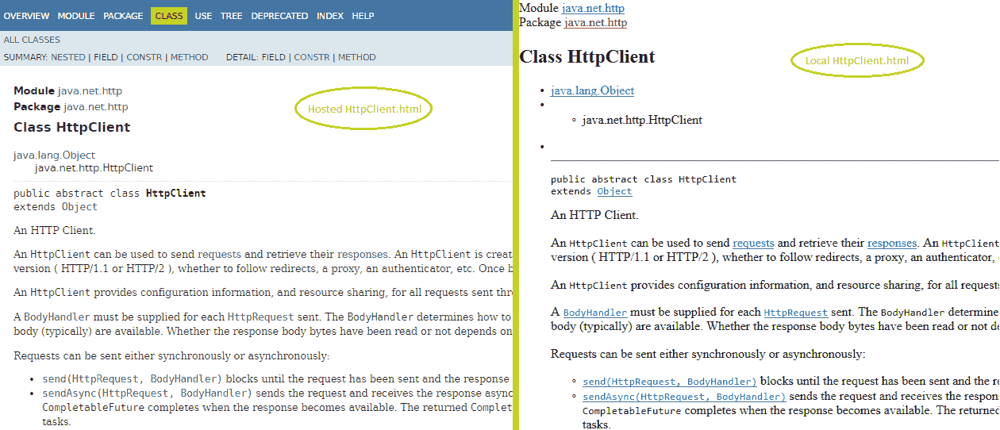

# HTTP 客户端 API

使用 HTTP 客户端 API，你的 Java 代码可以通过 HTTP/2 协议以非阻塞和异步的方式请求网络上的 HTTP 资源。它对现有的`HttpURLConnection`类进行了重大改进，该类在 Java 1.1 版本中添加，并且仅以阻塞和同步的方式工作。

HTTP 客户端在 Java 9 中被孵化，Java 10 中进行了多次修改，并在 Java 11 中标准化。它位于`java.net.http`包和模块中。

在本章中，我们将涵盖以下主题：

+   HTTP 客户端简介

+   同步和异步发送请求

+   将响应字节转换为高级格式

+   使用响应式流处理 HTTP 请求和响应

+   `BodyHandler`、`BodyPublisher`和`BodySubscriber`

# 技术要求

本章中的代码将使用 Java 11 的标准 HTTP 客户端 API 类。如果你使用的是之前 Java 版本（如 9 或 10）的孵化 HTTP 客户端，那么本章中的所有代码将无法按指定方式工作。许多方法名称已经更改。

本章中的所有代码都可以在[`github.com/PacktPublishing/Java-11-and-12-New-Features`](https://github.com/PacktPublishing/Java-11-and-12-New-Features)找到。

在深入细节之前，让我们了解一下导致引入这个新 API 以请求 HTTP 资源的问题。

# 快速回顾

HTTP 客户端 API 在 Java 9 中被孵化。本质上，这意味着这个 API 不是 Java SE 的一部分。它定义在`jdk.incubator.httpclient`包中。孵化特性应该明确添加到项目的类路径中。Oracle 通过发布孵化特性来允许开发者使用和实验它们，并提供反馈，这决定了 HTTP 客户端 API 的命运。在未来的 Java 版本中，孵化 API 和特性要么作为完整功能包含，要么完全取消。没有部分包含。

如果你需要快速回顾一下 HTTP，我们在这里提供。

# 你可以用 HTTP 做什么？

HTTP 是一种在**万维网**（**WWW**）上传输超文本（记得`<html>`吗？）的协议。如果你已经使用网页浏览器访问过任何网站（可能性很大），那么你已经使用了 HTTP。你的网页浏览器作为系统上的客户端工作，通过网络请求访问资源，如网页或文件。你的网页浏览器使用 HTTP 将请求发送到服务器。请求的资源使用 HTTP 协议从服务器传输到客户端。

最常见的 HTTP 操作是`GET`、`POST`、`PUT`和`DELETE`。以下是一些快速示例：

+   想象一下在网站上注册的过程；你填写你的详细信息并提交它们。这是一个`POST`请求，其中表单值不会附加到 URI 上。

+   现在，想象一下在在线门户（比如 [`www.amazon.co.uk/`](https://www.amazon.co.uk/)）中为您最喜欢的书的详情页面设置书签。您会注意到在问号（`?`）之后跟随的 URI 后附加了一系列变量名和值（由 `&` 分隔）。在 [`www.amazon.co.uk/s/ref=nb_sb_noss?url=search-alias%3Daps&field-keywords=mala+oca+8`](https://www.amazon.co.uk/s/ref=nb_sb_noss?url=search-alias%3Daps&field-keywords=mala+oca+8) 有一个示例。这是一个 `GET` 请求。

+   `PUT` 请求用于在服务器上创建或更新一个实体，使用 URI。`PUT` 请求指的是实体，而 `POST` 请求指的是将处理提交数据的资源。

+   `DELETE` 请求可以通过将标识 ID 添加到 URI 来删除实体。

如果您无法理解所有的 HTTP 操作，例如 `GET`、`POST`、`PUT` 或 `DELETE`，请不要担心。随着您对本章的深入，您将能够理解它们。

就像您可以使用网页浏览器通过网络访问资源一样，您也可以使用您的 Java 代码以编程方式访问相同的资源。有多种用例；例如，想象一下连接到一个网站，下载最新的新闻，并将其简单地列出给您的应用程序用户。

更多关于 HTTP/2 的信息可以在 [`tools.ietf.org/html/rfc7540`](https://tools.ietf.org/html/rfc7540) 查找。

# HTTP 客户端 API 的需求

到目前为止，Java 开发者一直在使用 `HttpURLConnection` 类通过网络请求 HTTP 资源。然而，它有多个缺点，这导致了 HTTP 客户端 API 的发展。

在 JDK 1.1 中引入的 `HttpURLConnection` 类从未被设计为以异步方式工作；它仅以阻塞模式工作。这与今天我们处理的应用程序和数据的变化性质形成对比。世界正在向响应式编程迈进，它涉及处理实时数据，我们无法承担使用阻塞通信或通过连接发送一个请求或响应。

`HttpURLConnection` 类对于开发者来说也难以使用；其行为的一部分没有文档记录。`HttpURLConnection` 的基类，即 `URLConnection` API，支持多种协议，其中大多数现在不再使用（例如 Gopher）。此 API 不支持 HTTP/2，因为它是在 HTTP/2 制定之前很久就创建的。

此外，还有类似的先进 API 可用，例如 Apache `HttpClient`、Eclipse Netty 和 Jetty 等。现在是时候 Oracle 更新其自己的 HTTP 访问 API，以跟上发展并支持其开发者了。HTTP 客户端的主要目标之一是使其内存消耗和性能与 Apache `HttpClient`、Netty 和 Jetty 相当。

`HttpURLConnection` 无法以异步、非阻塞的方式工作，这是创建 HTTP 客户端的主要原因之一。

现在你已经知道了为什么你需要 HTTP 客户端 API，让我们开始使用它。

# HTTP 客户端使用

你可以使用 HTTP 客户端通过网络访问 HTTP 资源，使用 HTTP/1.1 或 HTTP/2，异步发送请求并接受响应，以非阻塞方式。它使用响应式流以异步方式与请求和响应一起工作。

它也可以用于同步发送请求并接收响应。

HTTP 客户端 API 由三个主要类或接口组成：

+   `HttpClient` 类

+   `HttpRequest` 类

+   `HttpResponse` 接口

`HttpClient` 类用于发送请求并检索相应的响应；`HttpRequest` 封装了请求资源的细节，包括请求 URI。`HttpResponse` 类封装了来自服务器的响应。

在 Java 11 中，标准化的 HTTP 客户端定义在 `java.net.http` 模块和包中。

# 一个基本示例

在深入到 HTTP 客户端各个类的细节之前，我包括了一个基本示例，让你熟悉发送请求到服务器并使用 HTTP 客户端处理响应。随着我们继续前进，我会添加到这个示例中，详细涵盖 `HttpClient`、`HttpRequest` 和 `HttpResponse`。这是为了帮助你获得更大的图景，然后深入细节。

以下示例展示了如何创建一个基本的 `HttpClient` 实例，使用它来访问由 `HttpRequest` 封装的 URI，并处理响应，该响应作为 `HttpResponse` 实例可访问：

```java
// basic HttpClient instance 
HttpClient client = HttpClient.newHttpClient();        

// Using builder pattern to get a basic HttpRequest instance with just //the URI 
HttpRequest request = HttpRequest.newBuilder()         
                     .uri(URI.create("http://www.ejavaguru.com/"))   
                     .build();                                       

// response instance not created using a builder. 
// HttpClient sends HttpRequests and makes HttpResponse available 
HttpResponse<String> response = client.send(request,  
                            HttpResponse.BodyHandlers.ofString()); 
System.out.println(response.body()); 
```

在前面的代码中，`newHttpClient()` 工厂方法返回一个基本的 `HttpClient` 实例，该实例可用于发送 HTTP 请求并接收其相应的响应。`HttpRequest` 通过传递要连接的 URI（这是最低要求）使用构建器模式创建。`HttpResponse` 实例不是由开发者显式创建的，而是在从 `HttpClient` 发送请求到服务器后接收到的。

`send()` 方法以同步方式发送请求并等待响应。当客户端收到响应代码和头信息时，在接收到响应体之前，它将调用 `BodyHandler`。在调用时，`BodyHandler` 创建 `BodySubscriber`（一个响应式流订阅者），它接收来自服务器的响应数据流并将它们转换为适当的更高层次的 Java 类型。

如果你没有完全理解前面的解释，不要担心；我将在以下部分中详细说明。

HTTP 客户端使用响应式流（`BodyPublisher` 和 `BodySubscriber`）以异步和非阻塞方式发送和接收数据流。建议对响应式流有基本了解，以便理解 HTTP 客户端如何使用它们发送和接收数据。

让我们深入细节，从 `HttpClient` 类开始。

# `HttpClient` 类

`HttpClient` 类用于发送请求并接收响应。它封装了诸如使用哪个版本的 HTTP 协议、是否遵循重定向（如果您尝试连接的资源已移动到另一个位置）、是否使用代理或验证器等细节。`HttpClient` 类用于配置客户端状态（`HttpClient` 从客户端发送数据到服务器并接收数据）。`HttpClient` 实例可以用来发送多个请求并接收它们相应的响应。然而，一旦创建，`HttpClient` 实例就是不可变的。

# 创建 HttpClient 实例

您可以通过两种方式创建 `HttpClient` 实例：使用其静态 `getHttpClient()` 方法，或使用 `newBuilder()` 方法（这遵循构建器模式）。

静态 `getHttpClient()` 方法返回具有基本或默认设置的 `HttpClient` 实例，如下所示：

```java
HttpClient client = HttpClient.newHttpClient(); 
```

要添加自定义设置，您可以使用其 `newBuilder()` 方法，该方法遵循构建器设计模式并调用相关方法。让我们从一个基本版本开始，然后添加到它。例如，您可以使用以下代码将 HTTP 版本设置为 `2`：

```java
HttpClient client = HttpClient.builder(). 
                     .version(Version.HTTP_2) 
                     .build(); 
```

如果不支持 HTTP/2 协议，`HttpClient` 实例默认使用 HTTP/1.1。

通常，当您使用网络浏览器访问资源时，您会看到一个消息，表明资源已移动到另一个位置，并且您正在被重定向到新地址。在这种情况下，您的网络浏览器接收新的 URI。您可以通过指定 `followRedirects()` 方法程序化地完成到新 URI 的重定向。以下是一个示例：

```java
HttpClient client = HttpClient.builder(). 
                     .version(Version.HTTP_2) 
                     .followRedirects(Redirect.NORMAL), 
                     .build(); 
```

上述代码调用 `followRedirects()`，传递 `Redirect.NORMAL`。现在，`Redirect` 是在 `HttpClient` 类中定义的一个嵌套枚举，具有以下常量值：

| **枚举值** | **描述** |
| --- | --- |
| `ALWAYS` | 总是重定向 |
| `NEVER` | 永不重定向 |
| `NORMAL` | 总是重定向，除了 HTTPS URL 重定向到 HTTP URL |

许多网站通常通过注册的用户名和密码来验证用户。您可以通过使用 `authenticator()` 方法将身份验证值添加到 `HttpClient`。以下示例使用默认身份验证：

```java
HttpClient client = HttpClient.newBuilder(). 
                      .version(Version.HTTP_2) 
                      .followRedirects(redirect.NORMAL), 
                      .authenticator(Authenticator.getDefault()) 
                      .build(); 
```

以下代码使用自定义值（`"admin"` 和 `"adminPassword"`）进行身份验证：

```java
HttpClient client = HttpClient.newBuilder(). 
                      .version(Version.HTTP_2) 
                      .followRedirects(redirect.NORMAL), 
                      .authenticator(new Authenticator() { 
                        public PasswordAuthentication 
                         getPasswordAuthentication() { 
                          return new PasswordAuthentication( 
                          "admin", "adminPassword".toCharArray()); 
                       }) 
                    .build(); 
```

本节中的代码片段展示了如何创建 `HttpClient` 的实例。

# HttpClient 类的方法

要通过网络请求 HTTP 资源，您需要在 `HttpClient` 实例上调用 `send()` 或 `sendAsync()` 方法之一。`send()` 方法同步地发送请求并接收其响应；它将在这些任务完成之前阻塞。`sendAsync()` 方法异步地与服务器通信；它发送请求并立即返回 `CompletableFuture`。

在我包含 `send()` 和 `sendAsync()` 方法的示例之前，理解其他两个类（`HttpRequest` 和 `HttpResponse`）非常重要。我将在 `HttpResponse` 部分介绍这些方法（`send()` 和 `sendAsync()`）。

这里是一个 `HttpClient` 类的重要方法的快速列表：

| **方法返回类型** | **方法名称** | **方法描述** |
| --- | --- | --- |
| **`抽象 Optional<Authenticator>`** | **`authenticator()`** | 返回包含在此客户端上设置的 `Authenticator` 实例的 `Optional` |
| `抽象 Optional<Executor>` | `executor()` | 返回包含此客户端的 `Executor` 的 `Optional` |
| `抽象 HttpClient.Redirect` | `followRedirects()` | 返回此客户端的 `followRedirects` 策略 |
| `静态 HttpClient.Builder` | `newBuilder()` | 创建一个新的 `HttpClient` 构建器 |
| `静态 HttpClient` | `newHttpClient()` | 返回一个具有默认设置的新的 `HttpClient` |
| `WebSocket.Builder` | `newWebSocketBuilder()` | 创建一个新的 `WebSocket` 构建器（可选操作） |
| `抽象 Optional<ProxySelector>` | `proxy()` | 返回包含此客户端提供的 `ProxySelector` 实例的 `Optional` |
| `抽象 <T> HttpResponse<T>` | `send (HttpRequest request, HttpResponse.BodyHandler<T> responseBodyHandler)` | 使用此客户端发送给定的请求，如果需要，则阻塞以获取响应 |
| `抽象 <T> CompletableFuture<HttpResponse<T>>` | `sendAsync (HttpRequest request, HttpResponse.BodyHandler<T> responseBodyHandler)` | 以异步方式发送给定的请求，使用此客户端和给定的响应体处理器 |
| `抽象 <T> CompletableFuture<HttpResponse<T>>` | `sendAsync (HttpRequest request, HttpResponse.BodyHandler<T> responseBodyHandler, HttpResponse.PushPromiseHandler<T> pushPromiseHandler)` | 以异步方式发送给定的请求，使用此客户端和给定的响应体处理器以及推送承诺处理器 |
| `抽象 SSLContext` | `sslContext()` | 返回此客户端的 `SSLContext` |
| `抽象 SSLParameters` | `sslParameters()` | 返回此客户端的 `SSLParameters` 的副本 |
| `抽象 HttpClient.Version` | `version()` | 返回此客户端首选的 HTTP 协议版本 |

下一步是使用 `HttpRequest` 类来定义请求的详细信息。

# HttpRequest

`HttpRequest` 类封装了客户端需要通过网络发送到服务器的信息。它包括连接的 URI、带有一系列变量名及其对应值的头信息、超时值（丢弃请求前等待的时间）以及要调用的 HTTP 方法（`PUT`、`POST`、`GET` 或 `DELETE`）。

与 `HttpClient` 类不同，`HttpRequest` 不提供具有默认值的类实例，这很有意义。想象一下，如果你不指定它，客户端将连接到的 URI。

让我们通过调用其 `newBuilder()` 方法并传递一个 URI 来创建一个 `HttpRequest` 实例：

```java
HttpRequest request = HttpRequest.newBuilder() 
                        .uri(URI.create("http://www.eJavaGuru.com/")) 
                        .build(); 
```

你可以通过使用 `timeout()` 方法将超时添加到你的请求中，如下所示：

```java
HttpRequest request = HttpRequest.newBuilder() 
                        .uri(URI.create("http://www.eJavaGuru.com/")) 
                        .timeout(Duration.ofSeconds(240)) 
                        .build(); 
```

一个 `request` 实例必须包含要使用的 HTTP 方法。如果没有指定方法，则默认执行 `GET` 请求。在上面的代码中，执行了一个 `GET` 请求。让我们明确指定 HTTP 方法。最常用的 HTTP 方法是 `GET` 和 `POST`。`DELETE` 和 `PUT` HTTP 方法也被使用。

以下示例指定了方法为 `POST` 方法：

```java
HttpRequest request = HttpRequest.newBuilder() 
                     .uri(new URI("http://www.eJavaGuru.com/")) 
                     .timeout(Duration.ofSeconds(240)) 
                     .POST(HttpRequest.noBody()) 
                     .build(); 
```

`POST` 方法要求你传递 `BodyProcessor` 类的实例。对于不需要正文的 `POST` 请求，你可以传递 `HttpRequest.noBody()`。你可以使用多个来源，例如字符串、`InputStream`、字节数组或文件，并将其传递给 `POST` 方法。以下是一个将文件传递给 `POST` 方法的示例：

```java
HttpRequest request = HttpRequest.newBuilder() 
                        .uri(new URI("http://www.eJavaGuru.com/")) 
                        .timeout(Duration.ofSeconds(240)) 
                        .POST(HttpRequest.BodyProcessor 
                        .fromFile(Paths.get("data.txt"))) 
                        .build(); 
```

以下示例将一个字符串传递给 `POST()` 方法：

```java
HttpRequest request = HttpRequest.newBuilder() 
                        .uri(new URI("http://www.eJavaGuru.com/")) 
                        .timeout(Duration.ofSeconds(240)) 
                        .POST(HttpRequest.BodyProcessor 
                        .fromString("This is sample data")) 
                        .build(); 
```

想象一下，你正在处理一个应用程序，该应用程序在股票价格上升或下降到或低于某个阈值时购买股票。对你来说这是个好消息。`BodyProcessor` 是一个响应式流发布者；你可以通过使用它来处理实时数据（如股票价格），并通过控制背压来处理。

`BodyProcessor` 定义了方便的方法，例如 `fromFile()`、`fromString()`、`fromInputStream()` 和 `fromByteArray()`，以便方便地传递各种值。

另一种常用的方法是 `header()`，它用于指定请求的内容。以下是一个示例，它将 `request` 的内容指定为 `text/plain`：

```java
HttpRequest request = HttpRequest.newBuilder() 
                        .uri(URI.create("http://www.eJavaGuru.com/")) 
                        .header("Content-Type", "text/plain") 
                        .build();
```

下面是 `HttpClient` 类的重要方法的列表：

| 方法 返回类型 | 方法名称 | 方法描述 |
| --- | --- | --- |
| `abstract Optional<HttpRequest.BodyPublisher>` | `bodyPublisher()` | 返回包含在此请求上设置的 `HttpRequest.BodyPublisher` 实例的 `Optional` |
| `abstract boolean` | `expectContinue()` | 返回请求继续设置 |
| `abstract HttpHeaders` | `headers()` | 返回此请求（或将要发送的）请求头（用户可访问的） |
| `abstract String` | `method()` | 返回此请求的请求方法 |
| `static HttpRequest.Builder` | `newBuilder()` | 创建 `HttpRequest` 构建器 |
| `static HttpRequest.Builder` | `newBuilder (URI uri)` | 使用给定的 URI 创建 `HttpRequest` 构建器 |
| `abstract Optional<Duration>` | `timeout()` | 返回包含此请求的超时持续时间的 `Optional` |
| `abstract URI` | `uri()` | 返回此请求的 URI |
| `abstract Optional<HttpClient.Version>` | `version()` | 返回包含将为此 `HttpRequest` 请求的 HTTP 协议版本的 `Optional` |

与 `HttpClient` 和 `HttpRequest` 类不同，你不需要创建 `HttpResponse` 类的实例。让我们在下一节中看看如何实例化它。

# HttpResponse

当您使用 `HttpClient` 实例发送 `HttpRequest` 实例时，您会收到 `HttpResponse`。在发送 HTTP 请求后，服务器通常会返回响应的状态码、响应头和响应正文。

因此，您何时可以访问响应正文？这取决于您在发送请求时指定的 `BodyHandler`，使用 `HttpClient` 的 `send()` 或 `sendAsync()` 方法。根据指定的 `BodyHandler`，您可能在响应状态码和头信息可用后（在响应正文可用之前）能够访问响应正文。

让我们回顾本章的第一个示例：

```java
HttpClient client = HttpClient.newHttpClient();        

HttpRequest request = HttpRequest.newBuilder()         
                       .uri(URI.create("http://google.com/"))   
                       .build();                                       

HttpResponse<String> response = client.send(request, HttpResponse.
                                            BodyHandlers.ofString()); 
System.out.println(response.body()); 
```

在前面的示例中，`send()` 方法将 `BodyHandler` 指定为 `BodyHandlers.ofString()`。它将接收到的响应正文字节转换为高级 Java 类型：字符串。您还可以使用 `BodyHandlers.ofFile()`、`BodyHandlers.ofInputStream()` 或 `BodyHandlers.discard()` 将响应保存到文件、将响应用作输入流或丢弃它。

`BodyHandler` 是在 `HttpResponse` 接口中定义的静态接口。`HttpResponse` 还定义了一个静态类，`BodyHandler`，它定义了 `BodyHandler` 接口的多种有用实现。例如，您可以使用 `BodyHandlers.ofFile()` 将接收到的响应写入指定的文件。幕后，`BodyHandler` 使用 `BodySubscriber`（一个响应式流），它订阅来自服务器的响应字节。

`BodyHandlers` 的便捷静态方法（`ofFile()`、`ofString()`、`ofInputStream()` 和 `discard()`）让您可以与响应式数据流：`BodySubscriber` 一起工作。

这里是 `HttpResponse` 接口的重要方法列表：

| **方法返回类型** | **方法名称** | **方法** **描述** |
| --- | --- | --- |
| `T` | `body()` | 返回正文 |
| `HttpHeaders` | `headers()` | 返回接收到的响应头 |
| `Optional<HttpResponse<T>>` | `previousResponse()` | 返回包含前一个中间响应的 `Optional`，如果已接收 |
| `HttpRequest` | `request()` | 返回与该响应对应的 `HttpRequest` 实例 |
| `Optional<SSLSession>` | `sslSession()` | 返回包含此响应中有效 `SSLSession` 实例的 `Optional` |
| `int` | `statusCode()` | 返回此响应的状态码 |
| `URI` | `uri()` | 返回接收响应的 URI |
| `HttpClient.Version` | `version()` | 返回用于此响应的 HTTP 协议版本 |

让我们来看一些示例。

# 一些示例

当您使用 HTTP 连接到网络应用程序或网络服务时会发生什么？服务器可以以多种格式返回文本或数据，包括 HTML、JSON、XML、二进制等。此外，编写服务器端应用程序或服务的语言或框架无关紧要。例如，您连接到的网络应用程序或服务可能使用 PHP、Node、Spring、C#、Ruby on Rails 或其他语言编写。

让我们处理一些简单的用例，例如使用 `GET` 或 `POST` 请求连接到网络服务器，同步或异步地提交请求数据，并使用多种格式接收响应并存储。

# 使用同步 GET 访问 HTML 页面

`HttpClient` 可以以同步或异步的方式从服务器接收响应。要同步接收响应，请使用 `HttpClient` 的 `send()` 方法。此请求将阻塞线程，直到完全接收到响应。

以下代码使用同步发送 `GET` 请求连接到托管 `HttpClient` 类 API 文档的 Oracle 网络服务器：

```java
class SyncGetHTML { 
    public static void main(String args[]) throws Exception { 
        HttpClient client = HttpClient.newHttpClient(); 
        HttpRequest request = HttpRequest.newBuilder() 
        .uri(URI.create("https://docs.oracle.com/en/java/javase
        /11/docs/api/java.net.http/java/net/http/HttpClient.html")) 
              .build(); 

        HttpResponse<String> response = 
              client.send(request, BodyHandlers.ofString()); 
        System.out.println(response.body()); 
    } 
} 
```

上一段代码生成了大量文本。以下只是输出的一小部分初始行：

```java
<!DOCTYPE HTML> 
<!-- NewPage --> 
<html lang="en"> 
<head> 
<!-- Generated by javadoc --> 
<title>HttpClient (Java SE 11 & JDK 11 )</title> 
<meta http-equiv="Content-Type" content="text/html; charset=UTF-8"> 
<meta name="keywords" content="java.net.http.HttpClient class"> 
```

上一段代码通过将 `BodyHandlers.ofString()` 传递给 `send()` 方法，将 HTML 数据作为字符串接收。用于接收此响应的变量是 `HttpResponse<String>` 实例，它与用于处理响应体字节的响应体订阅者 (`BodyHandlers.ofString()`) 匹配。

让我们看看如果我们将前一个请求的响应存储为 `.html` 文件会发生什么。以下是修改后的代码：

```java
class SyncGetHTMLToFile { 
    public static void main(String args[]) throws Exception { 
        HttpClient client = HttpClient.newHttpClient(); 
        HttpRequest request = HttpRequest.newBuilder() 
        .uri(URI.create("https://docs.oracle.com/en
        /java/javase/11/docs/api/java.net.http/java
        /net/http/HttpClient.html")) 
              .build(); 

        HttpResponse<Path> response = 
           client.send(request, 
           BodyHandlers.ofFile(Paths.get("HttpClient.html"))); 
    } 
} 
```

在上一段代码中，`HttpClient.html` 的内容与之前示例中发送到控制台的文字相同。在这个例子中，响应体字节被写入到文件中。

由于文件保存为 `.html` 格式，您可以在您的网页浏览器中查看它。然而，此文件的显示效果将与托管 `HttpClient` 类的显示效果不匹配，因为您的本地 `.html` 文件无法访问 `HttpClient.html` 所使用的 `.css` 或其他托管样式。

以下截图比较了本地和托管 `HttpClient.html` 的渲染效果：



让我们修改前面的示例以异步接收响应。

# 使用异步 GET 访问 HTML 页面

要异步接收响应，您可以使用 `HttpClient` 的 `sendAsync()` 方法。此请求将立即返回 `CompletableFuture`。您可以在 `CompletableFuture` 上调用 `get()` 方法来检索响应。

让我们修改上一节中使用的示例，以异步方式将响应（HTML 文本）存储到文件中：

```java
class AsyncGetHTMLToFile { 
    public static void main(String args[]) throws Exception { 
        HttpClient client = HttpClient.newHttpClient(); 
        HttpRequest request = HttpRequest.newBuilder() 
        .uri(URI.create("https://docs.oracle.com/en
        /java/javase/11/docs/api/java.net.http/java/net
        /http/HttpClient.html")) 
              .build(); 

        CompletableFuture<Path> response = 
            client.sendAsync(request, 
            BodyHandlers.ofFile(Paths.get("http.html"))) 
            .thenApply(HttpResponse::body); 
        response.get(); 
    } 
} 
```

`BodyHandlers.ofFile()` 是 `BodyHandler` 接口的一个实现，它使用 `BodySubscriber`（一个响应式流）来订阅响应体字节。在接收到响应体后，它将内容写入指定的文件。

使用 HTTP `GET` 请求，你还可以将一组参数名称及其值作为 URI 的一部分包含在内。例如，通过将 URI 定义为 `http://www.eJavaGuru.com/Java11.html?name="Mala"`，客户端可以将 `Mala` 值传递给参数名称。

# 下载多个托管图像文件

假设你想下载多个托管图像文件，而不使用 FTP 客户端（或类似的应用程序）。别担心；你可以通过使用 HTTP 客户端，无论是同步还是异步地做到这一点。

要实现这一功能，代码与上一节中看到的大致相同；只需将响应体字节保存到具有适当文件扩展名的文件中。

以下代码从 eJavaGuru ([`ejavaguru.com/`](http://ejavaguru.com/)) 下载三个托管图像到与你的源代码文件相同的文件夹：

```java
class MultipleImageDownload{ 
    public static void main(String args[]) throws Exception { 
        List<URI> imageURIs =  
List.of(  
URI.create("http://ejavaguru.com/images/about/jbcn-actual-2018.jpg"), 
URI.create("http://ejavaguru.com/images/about/iit-delhi.jpg"), 
URI.create("http://ejavaguru.com/images/about/techfluence.jpg")); 

        HttpClient client = HttpClient.newHttpClient(); 

        List<HttpRequest> imgDwnldRequests = imageURIs.stream() 
                                    .map(HttpRequest::newBuilder) 
                                    .map(builder -> builder.build()) 
                                    .collect(Collectors.toList()); 

        CompletableFuture.allOf(imgDwnldRequests.stream() 
            .map(request -> client.sendAsync(request, 
                                 BodyHandlers.ofFile( 
                                 Paths.get(((String)request.uri() 
                                        .getPath()).substring(14) 
                                     ) 
                                 ) 
                            )) 
                           .toArray(CompletableFuture<?>[]::new)) 
                           .join(); 
    } 
} 
```

上一段代码使用相同的 `HttpClient` 实例，`client`，通过向服务器发送多个异步请求来下载多个托管图像。图像的 `URI` 实例存储在 URI 列表 `imageURIs` 中。然后，使用此列表创建多个 `HttpRequest` 实例：`imgDwnldRequests`。然后，代码在客户端上调用 `sendAsync()` 方法，以异步方式发送请求。

如前例所述，`BodyHandlers.ofFile()` 创建了一个 `BodyHandler` 的实现，该实现创建并订阅 `BodySubscriber`。`BodySubscriber` 是一个反应式流订阅者，它以非阻塞背压从服务器接收响应体。

# 发布表单详细信息

假设你想以编程方式将表单的详细信息发布到 Web 应用程序或 Web 服务。你可以通过发送 `POST` 请求，使用 HTTP 客户端 API 来做到这一点。以下代码使用 `HttpClient` 的 `send()` 方法将一组参数名称和值发布到服务器。参数名称及其值存储为 `String` 值：

```java
public class HttpReqPost { 
    public static void main(String uri[]) throws Exception { 
        String postData = "?
        name='Mala'&email='info@ejavaguru
        @gmail.com'"; 
        HttpClient client = HttpClient.newHttpClient(); 
        HttpRequest request = HttpRequest.newBuilder() 
       .uri(URI.create("http://www.ejavaguru.com/Java11/register.php")) 
            .POST(BodyPublishers.ofString(postData)) 
            .build(); 

        HttpResponse<?> response = client.send(request, 
        BodyHandlers.discarding()); 
        System.out.println(response.statusCode()); 
    } 
} 
```

在前面的代码中，`HttpRequest` 构建器包括以下代码：

```java
.POST(BodyPublishers.ofString(postString)  
```

`BodyPublishers` 类定义了 `BodyPublisher` 的常见实现，`BodyPublisher` 是一个反应式流，用于将请求体字节发布到服务器。`BodyPublishers` 定义了静态方法 `ofString`、`ofFile`、`ofInputStream` 和 `ofByteArray`，用于从 `String`、文件或 `InputStream` 发布请求体，将高级 Java 类型转换为要作为请求体发送的数据流。

在此示例中，`POST` 数据存储在字符串 `postData` 中，该字符串与请求一起发送到服务器。在这种情况下，我不想处理从服务器接收到的响应，因此在访问响应时使用 `BodyHandlers.discarding()`。

如果你记得，本章中所有之前的示例都使用反应式流以非阻塞和异步方式从服务器接收响应体字节。因此，HTTP 客户端使你能够发送请求并从服务器接收响应，使用反应式流。

HTTP 客户端使用 `BodySubscriber` 和 `BodyPublishers` 以非阻塞方式异步地发送和接收来自服务器的响应。`BodyPublisher` 接口扩展了 `Flow.Publisher` 接口。`BodySubscriber` 接口扩展了 `Flow.Subscriber` 接口。

当您使用 HTTP 客户端工作时，您还可以以 JSON、XML 或其他数据类型接收响应。同样，您也可以向服务器发送多种数据类型。您可以使用 Java SE 或其他供应商的适当 API 将一种格式转换为另一种格式。

# 摘要

HTTP 客户端是在 Java 9 中孵化出来的，并在 Java 11 中标准化。本章从介绍 HTTP 客户端 API 开始，包括导致其创建的因素。今天的网络应用程序和服务应该是响应式的，支持异步、非阻塞的数据传输。HTTP 客户端使用反应式流来实现这些目标。

HTTP 客户端可用于通过网络访问 HTTP 资源，使用 HTTP/1.1 或 HTTP/2，以同步和非同步的方式进行。HTTP 客户端 API 由三个主要类或接口组成：`HttpClient` 类、`HttpRequest` 类和 `HttpResponse` 接口。`HttpClient` 类用于发送请求并检索相应的响应；`HttpRequest` 封装了请求资源的详细信息，包括请求 URI。`HttpResponse` 类封装了来自服务器的响应。

在底层，HTTP 客户端使用 `BodySubscriber` 和 `BodyPublishers` 以非阻塞方式异步地发送和接收来自服务器的响应。`BodyPublisher` 接口扩展了 `Flow.Publisher` 接口。`BodySubscriber` 接口扩展了 `Flow.Subscriber` 接口。

本章包含多个示例，以演示常见用例。

在甲骨文公司的 Project Amber 项目中正在进行许多有趣的语言添加和修改。我们将在下一章开始探索这一点。
