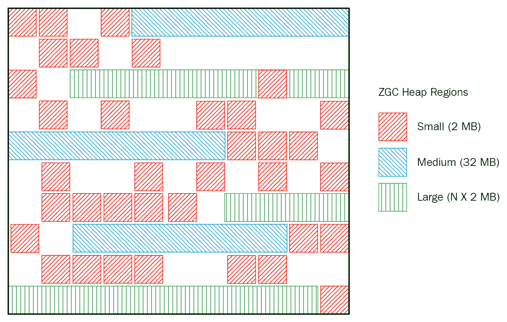
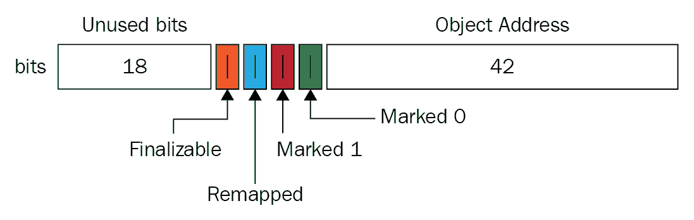

# ZGC

Java 11 在 GC（垃圾回收）领域包含了许多改进和变化。随着**Z 垃圾回收器**（**ZGC**），Java 为您带来了另一个 GC——可扩展的，低延迟。这是一个全新的 GC，从头开始编写。它可以与堆内存一起工作，从 KB 到大型 TB 内存。作为一个并发垃圾回收器，ZGC 承诺不会使应用程序延迟超过 10 毫秒，即使对于更大的堆大小。它也很容易调整。

它作为 Java 11 的一个实验性 GC 发布。在 OpenJDK 上对这种 GC 的工作正在进行中，您可以期待随着时间的推移对其进行更多更改。

在本章中，我们将涵盖以下主题：

+   为什么需要 ZGC

+   ZGC 的特性

+   与 ZGC 一起工作的示例

+   ZGC 的用例

# 技术要求

您可以使用 ZGC 与 Java 11 和 Linux/x64 系统一起使用。ZGC 是一个实验性 GC。本章中的所有代码都可以通过访问本书的 GitHub 仓库来获取：[`github.com/PacktPublishing/Java-11-and-12-New-Features`](https://github.com/PacktPublishing/Java-11-and-12-New-Features)。

让我们从评估为什么我们需要 ZGC 开始。

# 动机

在 Java 早期崛起的一个特性是其 GC 的自动内存管理，这使开发者免于手动内存管理并降低了内存泄漏。

然而，由于不可预测的时间和持续时间，垃圾回收有时可能对应用程序造成比好处更大的伤害。增加的延迟会直接影响应用程序的吞吐量和性能。随着硬件成本的不断降低和旨在使用较大内存的程序，应用程序对垃圾收集器提出了更低的延迟和更高的吞吐量的要求。

ZGC 承诺的延迟不超过 10 毫秒，这不会随着堆大小或活动集的增加而增加。这是因为它的停止世界暂停仅限于根扫描。

ZGC 是一个可扩展的、低延迟的 GC，承诺即使对于大型堆内存（TB 大小），延迟也不会超过 10 毫秒。

# ZGC 的特性

从头开始编写的 ZGC 带来了许多特性，这些特性在其提案、设计和实现中发挥了关键作用。

ZGC 最突出的特性之一是它是一个并发 GC。它可以并发地标记内存、复制和重新定位它。它还有一个并发引用处理器。这本质上意味着您可以添加各种引用，例如弱引用、软引用、虚引用或终结器（这些现在已弃用）。即使如此，ZGC 也不会为您添加更多的 GC 暂停（因为它将并发地清理或回收内存）。

与其他 HotSpot GC 使用的存储屏障不同，ZGC 使用加载屏障。加载屏障用于跟踪堆的使用情况。ZGC 的一个有趣特性是使用带有彩色指针的加载屏障。这使得 ZGC 能够在 Java 线程运行时执行并发操作，例如对象重定位或重定位集选择。

ZGC 是基于区域的垃圾收集器。然而，如果您将其与 G1 垃圾收集器进行比较，ZGC 在配置其大小和方案方面更加灵活。与 G1 相比，ZGC 有更好的方法来处理非常大的对象分配。

ZGC 是单代垃圾收集器。它还支持部分压缩。在回收内存和重新分配内存方面，ZGC 的性能也非常高。

ZGC 是 NUMA 兼容的，这意味着它具有 NUMA 兼容的内存分配器。

作为实验性的垃圾收集器，ZGC 仅适用于 Linux/x64。如果对其有相当大的需求，将来将添加更多平台支持。

# 开始使用 ZGC

使用 ZGC 涉及多个步骤。您应该安装针对 Linux/x64 的 JDK 二进制文件，并构建和启动它。您可以使用以下命令下载 ZGC 并在您的系统上构建它：

```java
$ hg clone http://hg.openjdk.java.net/jdk/jdk
$ cd zgc
$ sh configure --with-jvm-features=zgc
$ make images
```

执行前面的命令后，您可以在以下位置找到 JDK 根目录：

```java
g./build/linux-x86_64-normal-server-release/images/jdk  
```

Java 工具，如 `java`、`javac` 等，可以在前面路径的 `/bin` 子目录中找到（其通常位置）。

提示：除非您有 Linux/x64，否则您将无法使用 ZGC。

让我们创建一个基本的 `HelloZGC` 类，如下所示：

```java
class HelloZGC { 
    public static void main(String[] args) { 
        System.out.println("Say hello to new low pause GC - ZGC!"); 
    } 
} 
```

您可以使用以下命令来启用 ZGC 并使用它：

```java
java -XX:+UnlockExperimentalVMOptions -XX:+UseZGC HelloZGC
```

由于 ZGC 是一个实验性的垃圾收集器，您需要使用运行时选项来解锁它，即 `XX:+UnlockExperimentalVMOptions`。

要启用基本的 GC 日志记录，您可以添加 `-Xlog:gc` 选项。让我们修改前面的代码，如下所示：

```java
java -XX:+UnlockExperimentalVMOptions -XX:+UseZGC -Xlog:gc HelloZGC
```

详细日志记录在您微调应用程序时非常有帮助。您可以通过使用 `-Xlog:gc*` 选项来启用它，如下所示：

```java
java -XX:+UnlockExperimentalVMOptions -XX:+UseZGC -Xlog:gc* HelloZGC
```

前面的命令将输出所有日志到控制台，这可能会使搜索特定内容变得困难。您可以将日志指定写入文件，如下所示：

```java
java -XX:+UnlockExperimentalVMOptions -XX:+UseZGC -Xlog:gc:mylog.log* HelloZGC  
```

与 G1 和并行 GC 相比，ZGC 在降低延迟和提高应用程序吞吐量方面表现更好。

让我们窥视一下 ZGC 如何安排堆以进行对象分配（简而言之，让我们从探索 ZGC 的秘密配方开始）。

# ZGC 堆

ZGC 将内存划分为区域，也称为 **ZPages**。ZPages 可以动态创建和销毁。它们也可以动态调整大小（与 G1 GC 不同），大小是 2 MB 的倍数。以下是堆区域的大小组：

+   小型（2 MB）

+   中等（32 MB）

+   大型 (*N ** 2 MB)

ZGC 堆可以有多个这些堆区域的出现。中等和大型区域是连续分配的，如下面的图所示：



与其他 GC 不同，ZGC 的物理堆区域可以映射到一个更大的堆地址空间（这可能包括虚拟内存）。这对抗内存碎片问题可能至关重要。想象一下，你可以在内存中分配一个非常大的对象，但由于内存中连续空间不可用，你无法这样做。

这通常会导致多个 GC 周期以释放足够的连续空间。如果没有可用空间，即使经过（多个）GC 周期，你的 JVM 也会因为 `OutOfMemoryError` 而关闭。然而，这个特定的用例与 ZGC 没有问题。由于物理内存映射到一个更大的地址空间，定位更大的连续空间是可行的。

ZPages 是相同数字的倍数，例如，在英特尔机器上为 2 MB。它可能变化，例如，在 *S* 机器上为 4 MB。

现在，让我们看看 ZGC 如何从其区域回收内存。

# ZGC 阶段

ZGC 的一个 GC 周期包括多个阶段：

+   暂停标记开始

+   暂停标记结束

+   暂停重定位开始

在第一阶段，暂停标记开始，ZGC 标记由根指针指向的对象。这包括遍历活动对象集，然后找到并标记它们。这无疑是 ZGC GC 周期中最繁重的工作负载之一。

一旦完成，下一个周期是暂停标记开始，用于同步，并从 1 毫秒的短暂暂停开始。在这个第二阶段，ZGC 从引用处理开始，然后转向弱根清理。它还包括重定位集选择。ZGC 标记它想要压缩的区域。

下一步，暂停重定位开始，触发实际的区域压缩。它从指向位置集的根扫描开始，然后是重定位集中对象的并发重新分配。

第一阶段，即暂停标记开始，还包括重映射活动数据。由于标记和重映射活动数据是最繁重的 GC 操作，它不会作为一个单独的操作执行。重映射在暂停重定位开始后开始，但与下一个 GC 周期的暂停标记开始阶段重叠。

# 彩色指针

彩色指针是 ZGC 的核心概念之一。它使 ZGC 能够找到、标记、定位和重映射对象。它不支持 x32 平台。彩色指针的实现需要虚拟地址掩码，这可以在硬件、操作系统或软件中完成。以下图表显示了 64 位指针布局：



如前图所示，64 位对象引用如下划分：

+   18 位：**未使用位**

+   1 位：**可终止**

+   1 位：**重映射**

+   1 位：**标记 1**

+   1 位：**标记 0**

+   42 位：**对象地址**

前面的 18 位被保留供将来使用。42 位可以寻址高达 4TB 的地址空间。现在剩下的是剩余的、引人入胜的 4 位。`Marked1`和`Marked0`位用于标记对象以进行垃圾收集。通过设置单个位为**Remapped**，对象可以被标记为不指向重定位集。最后的 1 位用于最终化，与并发引用处理相关。它标记了一个对象只能通过最终化器访问。

当你在系统上运行 ZGC 时，你会注意到它使用了大量的虚拟内存空间，正如你所知，这并不等同于物理内存空间。这是由于堆多映射。它指定了带有彩色指针的对象如何在虚拟内存中存储。

例如，对于一个无色的指针，比如`0x0000000011111111`，它的彩色指针将是`0x0000**10**0011111111`（重映射位设置），`0x00000**8**0011111111`（`Marked1`位设置），和`0x00000**4**0011111111`（`Marked0`位设置）。相同的物理堆内存将映射到地址空间中的三个不同位置，每个位置对应一个彩色指针。当映射处理不同时，这将以不同的方式实现。

让我们探索其他重要的 JVM 运行时参数，你可以使用这些参数来调整 ZGC。

# 调整 ZGC

让我们看看一些调整 ZGC 的选项（本章仅涵盖一些基本选项）。让我们从设置最大堆大小的最基本选项开始。我们可以通过以下 JVM 运行时选项来实现：

```java
-Xmx<size>
```

为了获得最佳性能，你必须设置一个堆大小，不仅能够存储应用程序的存活集，而且还有足够的空间来服务分配。

ZGC 是一个并发垃圾收集器。通过设置分配给 ZGC 线程的 CPU 时间量，你可以控制 GC 触发的频率。你可以通过以下选项来实现：

```java
-XX:ConcGCThreads=<number> 
```

`ConcGCThreads`选项的更高值将留给应用程序更少的 CPU 时间。另一方面，较低的值可能会导致应用程序在内存上挣扎；应用程序可能会生成比 ZGC 收集的更多垃圾。ZGC 也可以使用`ConcGCThreads`的默认值。为了在此参数上微调你的应用程序，你可能更喜欢针对测试值执行。

对于高级 ZGC 调整，你还可以为应用程序的性能增强启用大页。你可以通过以下选项来实现：

```java
-XX:+UseLargePages
```

前面的命令需要 root 权限。请参阅[`wiki.openjdk.java.net/display/zgc`](https://wiki.openjdk.java.net/display/zgc)以获取详细步骤。

除了启用大页之外，你也可以通过以下选项启用透明大页：

```java
-XX:+UseTransparentHugePage
```

前面的选项还包括额外的设置和配置，这些可以通过使用 ZGC 的官方 wiki 页面访问，该页面托管在[`wiki.openjdk.java.net/display/zgc`](https://wiki.openjdk.java.net/display/zgc)。

ZGC 是一个 NUMA 意识的垃圾回收器。在 NUMA 机器上执行的应用程序可以带来明显的性能提升。默认情况下，ZGC 启用了 NUMA 支持。然而，如果 JVM 认为它绑定在 JVM 的一个子集上，则此功能可以被禁用。要覆盖 JVM 的决定，可以使用以下选项：

```java
-XX:+UseNUMA
```

# 摘要

在本章中，我们介绍了适用于 OpenJDK 的一个可扩展、低延迟的垃圾回收器——ZGC。它是一个从头开始编写的实验性垃圾回收器。作为一个并发垃圾回收器，它承诺最大延迟小于 10 毫秒，并且不会随着堆大小或存活数据的增加而增加。

目前，它仅支持 Linux/x64。如果对其有相当大的需求，未来可以支持更多平台。

在下一章中，你将了解到如何使用 **Java 飞行记录器**（**JFR**）和 **任务控制**（**MC**）将操作系统和 JVM 事件捕获到文件中并进行分析。
