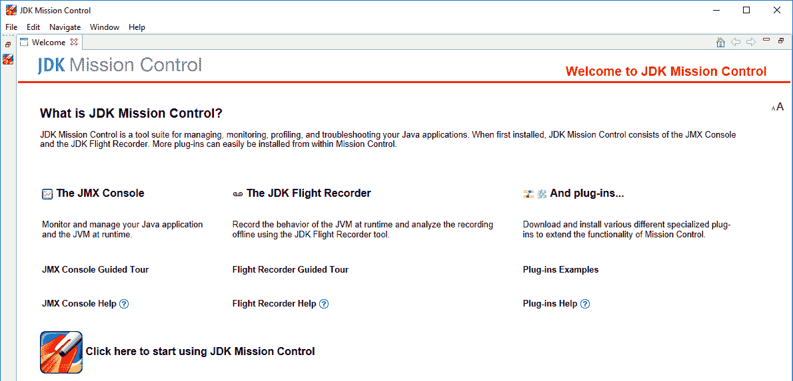
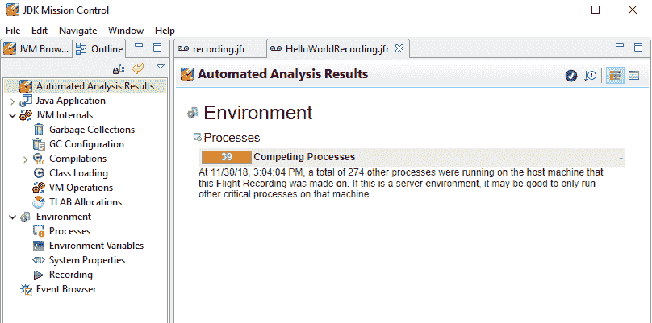
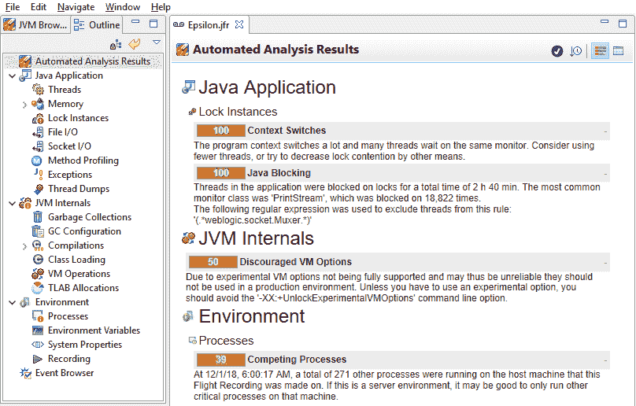
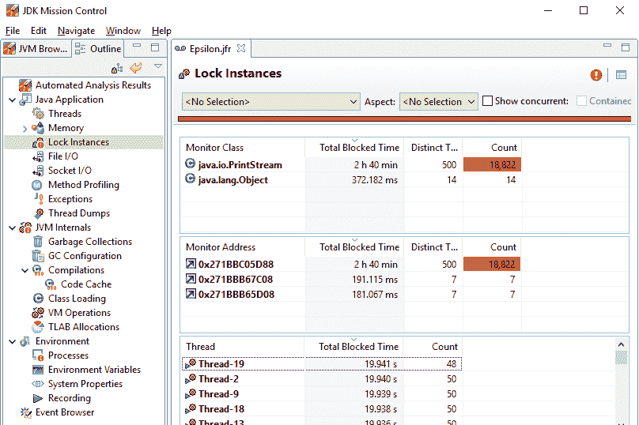
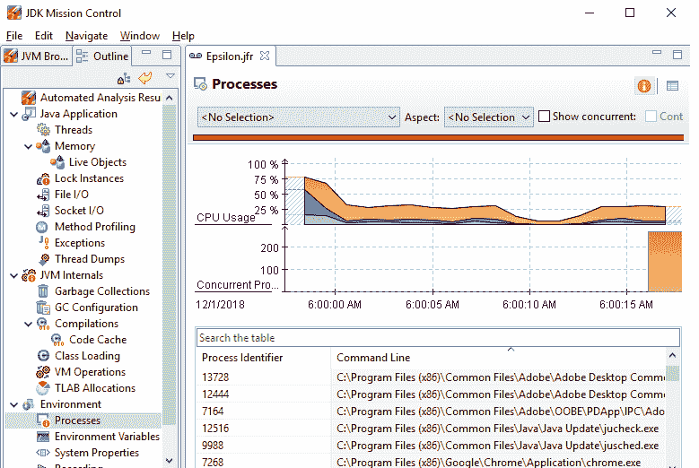

# 飞行记录器和任务控制

**Java Flight Recorder**（**JFR**）是一个内置在 JVM 中的高性能、低开销的剖析器。它是一个数据收集框架，可以记录你可以用来调试你的 Java 应用程序和 HotSpot JVM 的事件。

JFR 记录来自操作系统、HotSpot JVM 和 JDK 二进制事件的**二进制数据**。这本质上意味着你需要一个解析器，例如**Mission Control**（**MC**），来理解这些二进制数据。

MC 是一个高级工具，用于程序开发人员和管理员详细分析 JFR 剖析器收集的数据。它可以用来分析在本地或远程环境中运行的应用程序收集的数据。

在本章中，我们将涵盖以下主题：

+   需要 JFR 和 MC 的原因

+   JFR 和 MC 的特点

+   JFR 和 MC 的使用

# 技术要求

从 Java 11 开始，JFR 包含在 OpenJDK 发行版中。根据你使用的 JDK 发行版，你可能需要单独下载和安装 MC。**Java Mission Control**（**JMC**）不是 OpenJDK 发行版的一部分。它自 JDK 版本 7 更新 40 以来一直是 OracleJDK 的一部分。

如果 JMC 没有包含在你的 JDK 中，你可以从[`jdk.java.net/jmc/`](https://jdk.java.net/jmc/)下载它。

本章中所有的代码都可以从[`github.com/PacktPublishing/Java-11-and-12-New-Features`](https://github.com/PacktPublishing/Java-11-and-12-New-Features)访问。

让我们开始探索为什么我们需要 JFR。

# JFR 背后的动机

银行的保险库几乎零缺陷地创建，但它们并不是不可战胜的。想象一下银行保险库被破坏后会发生什么。可能的一个步骤包括扫描安全摄像头录像——以检查盗窃发生的时间和方式。这可能导致各种结果——从确定问题的原因和制定预防措施以防止其再次发生。

同样，你永远无法预见你的应用程序在生产中可能遇到的所有挑战。一个剖析器，如 JFR，可以帮助你在应用程序执行时记录事件。当你的应用程序崩溃或未按预期执行时，你可以使用剖析器收集的数据来监控或调试它。这些数据可以为你提供反馈循环。

MC 读取由 JFR 记录的应用程序分析数据，并以**视觉化**的方式显示，在多个值上（因此可以节省你从大量文本中筛选信息）。

# 特点

JFR 可以记录大量事件——从你的应用程序到你的 JVM 到操作系统。它是一个高性能但低开销的剖析器。

JFR 扩展了基于事件的 JVM 跟踪（JEP 167）的功能，为 HotSpot 添加了一组初始事件以在 Java 中创建事件。它还提供了一个高性能的后端，将事件数据写入二进制格式。

MC 在可视化环境中显示由 JFR 收集的应用程序分析数据。您可以选择您想要分析的分类——从类加载到 JVM 内部（如垃圾回收），应用程序线程，内存分配，到完整的应用程序数据分析。我们将在本章中介绍一些 MC 功能（对所有功能的完整覆盖超出了本书的范围）。

# 模块

JFR 定义了以下模块：

+   `jdk.jfr`：这定义了 JFR 分析器的 API 和内部结构。您可以使用它来分析在资源受限设备上运行的应用程序，例如 **IoT**（物联网的简称）或移动设备。`Jdk.jfr` 只需要 `java.base` 模块。

+   `jdk.management.jfr`：要使用 **Java 管理扩展（JMX**）远程使用飞行记录，您可以使用此模块。它需要 `jdk.jfr` 和 `jdk.management` 模块。

我们不会介绍 JMC 的代码，只会介绍其功能和如何使用它们。

# 开始使用 JFR

让我们从一个简单的 `HelloWorld` 示例开始，如下所示：

```java
class HelloWorld { 
    public static void main(String[] args) { 
        System.out.println("Hello World - This is being recorded"); 
    } 
} 
```

要为前面的应用程序启动飞行记录，请在您的控制台执行以下命令：

```java
  > java -XX:StartFlightRecording,filename=hello.jfr 
     HelloWorld  
```

第一行指示 Java 运行时为您的 `HelloWorld` 应用程序启动飞行记录并将其保存到 `HelloWorldRecording.jfr` 文件。

之前的命令有三个部分，如下所示：

+   使用 `-XX:StartFlightRecording` JVM 选项启动 JFR

+   指定要保存记录的目标文件 `hello.jfr`

+   指定要运行的 `HelloWorld`

让我们启动 MC 来查看存储在 `hello.jfr` 中的分析数据。使用 `jmc.exe` 文件启动 JMC。您将看到一个类似于以下屏幕截图的窗口：



点击底部的“点击此处开始使用 JDK Mission Control”选项。使用文件 | 打开菜单选项，打开您之前创建的 `hello.jfr` 文件。以下是它在“自动分析结果”登录页面上的显示内容：



MC 分析应用程序的类别不仅限于进程。根据您的应用程序及其分析方式，还包括其他类别（您可以在前面的屏幕截图中看到其中的一些）。

# 进一步探索

让我们分析另一个创建大量（500）线程的应用程序；每个线程创建一个包含 1,000,000 个 `Double` 值的 `ArrayList`，并用随机数填充它：

```java
class AThread implements Runnable { 
    String name = "default"; 
    private Random numGenerator = new Random(); 
    private ArrayList<Double> list = new ArrayList<Double>(10_00_000); 

    AThread(String name) { 
        this.name = name; 
    } 
    public void run() { 
        for (int i = 0; i < 10_00_000; i++) { 
            list.add(numGenerator.nextDouble()); 
            System.out.println("Allocated : " + name + "[" + i + "]"); 
        } 
    } 
} 
public class TestFlightRecorder { 
    public static void main(String... args) throws Exception { 
        for (int i = 0; i < 500; i++) { 
            new Thread(new AThread("Thread" + i)).start(); 
        } 
    } 
} 
```

让我们执行前面的 `TestFlightRecorder` 应用程序，使用 Epsilon GC（以检查我们是否也能获得有关内存分配的数据）进行 10 秒的配置文件分析：

```java
    > java 
    -XX:+UnlockExperimentalVMOptions 
    -XX:+UseEpsilonGC 
    -XX:StartFlightRecording,filename=Epsilon.jfr 
         TestFlightRecorder
```

当您在 MC 中打开 `Epsilon.jfr` 时，这是登录页面：



在我们详细讨论 MC 显示的结果之前，让我们快速回顾一下被性能分析的`TestFlightRecorder`应用程序。`TestFlightRecorder`创建了 500 个`AThread`类的实例。`AThread`类实现了`Runnable`接口。在启动时，每个`AThread`实例创建了一个包含 1,000,000 个`Double`值的`ArrayList`，用随机值填充它们并将它们输出到控制台。

现在，让我们查看前面的截图——MC 显示了关于您的应用程序整体表现的汇总报告。它包括执行 Java 应用程序的机器的环境、JVM 内部信息以及应用程序中线程在锁上的阻塞情况。以下是这些类别的快速列表：

+   Java 应用程序

+   上下文切换（缩进）

+   Java 阻塞（缩进）

+   JVM 内部

+   环境

由于 MC 报告称此应用程序在上下文切换和线程阻塞类别中表现不佳，让我们浏览 MC 左侧面板菜单中 Java 应用程序类别下的选项，找出哪个选项将包含相关信息。正如您将注意到的，锁实例选项旁边显示了一个感叹号。以下截图显示了您点击它时将看到的内容：



前面的截图显示，在`TestFlightRecorder`应用程序中创建的所有 500 个线程都在`PrintStream`和`Object`上阻塞。它甚至显示了总的阻塞时间，即 2 小时 40 分钟（为所有阻塞线程共同计算，针对 20 秒的应用程序性能分析）。

由于 JFR 分析器将性能分析数据以二进制格式记录到文件中，您可以在以后使用 MC 查看这些数据，并找出许多其他问题。例如，如果您点击进程，您将知道您的 CPU 被许多在您的宿主机器上执行的其他进程所使用，这也可以包括自动软件更新。确保您关闭所有这些。假设您正在服务器上调整应用程序的性能。

如果您在 MC 中点击进程（当然，结果将因系统而异）：



# 使用自定义事件

作为一名开发者，您也可以使用 JFR API 创建自己的自定义事件，并使用 MC 查看和分析它们。以下是一个示例；让我们定义一个自定义事件：

```java
class MyEvent extends Event { 
   @Label("EventMessage") 
   String message; 
} 
```

现在，让我们修改`AThread`类以使用事件，而不是打印到控制台：

```java
class AThread implements Runnable { 
    String name = "default"; 
    private Random numGenerator = new Random(); 
    private ArrayList<Double> list = new ArrayList<Double>(1000000); 

    AThread(String name) { 
        this.name = name; 
    } 

    public void run() { 
        MyEvent event; 
        for (int i = 0; i < 1000000; i++) { 
            list.add(numGenerator.nextDouble()); 
            event = new MyEvent(); 
            event.message = "Allocated : " + name + "[" + i + "]"; 
            event.commit(); 
        } 
    } 
} 
public class WithCustomEvents { 
    public static void main(String... args) throws Exception { 
        for (int i = 0; i < 500; i++) { 
            new Thread(new AThread("Thread" + i)).start(); 
        } 
    } 
} 
```

您可以使用相同的命令行选项来执行应用程序，并使用 JFR 进行性能分析：

```java
    > java 
    -XX:StartFlightRecording,filename=CustomEvents.jfr 
         WithCustomEvents
```

现在，您不再使用 MC 来查看这些事件，而是可以创建另一个应用程序，读取从`CustomEvents.jfr`记录的事件，如下所示：

```java
class ReadFRData { 
    public static void main(String args[]) throws Exception { 
        Path p = Paths.get("CustomEvents.jfr"); 
        for (RecordedEvent e : RecordingFile.readAllEvents(p)) { 
           System.out.println(e.getStartTime() +  
                              " : " +  
                              e.getValue("message")); 
        } 
    } 
}
```

# 摘要

在本章中，我们学习了 JFR 分析器。使用内置在 JVM 中的高性能、低开销的 JFR 分析器，你无需依赖第三方分析器来调试你的 Java 应用程序和 HotSpot JVM。

我们还介绍了 MC——一个高级工具，供开发人员和管理员详细分析 JFR 收集的数据——在本地和远程环境中进行可视化分析。

在下一章中，我们将介绍 JDK 11 中的多个改进和新增功能。
