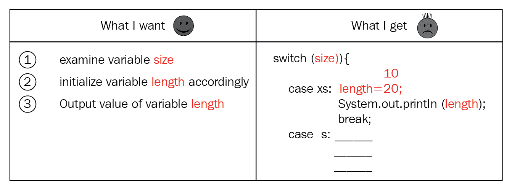
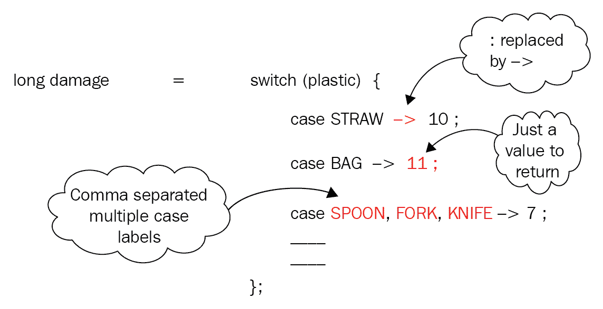

# 第十一章：`switch`表达式

使用`switch`表达式，Java 12 正在增强其基本语言结构之一——`switch`——以改善开发者的日常编码体验。这种做法的好处是多方面的。与**传统**的`switch`结构相比，`switch`表达式（JDK 增强提案**JEP** 325—[`openjdk.java.net/jeps/325`](http://openjdk.java.net/jeps/325)）可以返回一个值。通过在`switch`分支中定义多个常量并改进代码语义，可以使代码更加简洁。通过移除`switch`分支间的默认穿透控制，你不太可能在`switch`表达式中引入逻辑错误。

在本章中，你将涵盖以下主题：

+   现有`switch`语句的问题

+   `switch`表达式语法

+   在`switch`分支中定义局部变量

+   扩展的`break`语句

+   比较`break`与`break <返回值>`

+   完全情况

+   预览语言特性

+   在`switch`表达式中使用`return`和`continue`

# 技术要求

要编译和执行本章包含的代码，请在您的系统上安装 JDK 12。本章中的所有代码都可以通过以下 URL 访问：[`github.com/PacktPublishing/Java-11-and-12-New-Features`](https://github.com/PacktPublishing/Java-11-and-12-New-Features)。

让我们从解决现有`switch`语句的问题开始。

# 传统`switch`结构的问题

目前，`switch`语句的语法受到高度限制。它不如`if-else`结构强大。使用`if-else`结构，你可以定义和匹配复杂的模式；但使用`switch`结构则不行。此外，`switch`的语法较为冗长，这使其在视觉上令人烦恼。这可能导致易于出错且难以调试的代码。

让我们通过一个例子来展示所有这些问题。以下示例定义了一个枚举，`Size`。`Shirt`类定义了一个`setSize()`方法，该方法接受`Size`并根据需要将一个整数值分配给实例变量`length`：

```java
enum Size {XS, S, M, L, XL, XXL};          
class Shirt { 
    private int length; 
    public void setSize(Size size) { 
        switch(size) { 
            case XS :   length = 10; 
                        System.out.println(length); 
                        break; 
            case S  :   length = 12; 
                        System.out.println(length); 
                        break; 
            case M  :   length = 14; 
                        System.out.println(length); 
            case L  :   length = 16; 
                        break; 
            case XL :   length = 18; 
                        System.out.println(length); 
                        break; 
            case XXL:   length = 20; 
                        System.out.println(length); 
                        break; 
        } 
    } 
} 
```

这是调用前面方法的示例：

```java
Shirt s = new Shirt(); 
s.setSize(Size.XXL); 
System.out.println(s.length);
```

上一段代码输出以下预期结果：

```java
20 
20 
```

然而，让我们看看当你尝试执行以下代码时会发生什么：

```java
Shirt s = new Shirt(); 
s.setSize(Size.M); 
System.out.println(s.length); 
```

上一段代码输出一个意外的值不匹配：

```java
14 
16 
```

你认为这些不匹配的值的原因是什么？为了回答这个问题，这里有一个快速回顾——现有`switch`结构中的`switch`分支（即`case`标签）必须包含一个`break`语句以防止控制流穿透。这本质上意味着，当控制流找到一个匹配的`case`值时，它将执行语句直到找到一个`break`语句或达到`switch`结构的末尾。

仔细检查后，你会发现对应于 `M` 值的分支没有定义 `break` 语句。对应于下一个情况的分支（即 `L`），缺少了 `System.out.println` 值语句。因此，当你调用 `s.setSize(Size.M)` 时，以下情况发生：

1.  `14` 被分配给 `length` 实例变量

1.  `System.out.println()` 输出 `14`

1.  控制贯穿与 `L` 值对应的分支

1.  `16` 被分配给 `length` 实例变量

传统 `switch` 构造在缺少 `break` 语句的情况下，会在 `case` 标签之间贯穿控制，这可能导致意外的错误。

`switch` 构造作为一个块工作。然而，如果你回顾前面章节中的示例代码，你会同意语言构造将焦点从业务逻辑转移开，并引入了复杂性。

这在以下图中展示：



新的 `switch` 表达式旨在将焦点重新投向业务逻辑。

# 使用 switch 表达式

下面是一个修改变量的传统 `switch` 构造示例，该变量基于传递给方法的枚举值：

```java
enum SingleUsePlastic {STRAW, BAG, SPOON, FORK, KNIFE, PLATE, BOTTLE}; 

class Planet { 
    private static long damage; 
    public void use(SingleUsePlastic plastic) { 
        switch(plastic) { 
            case STRAW :    damage += 10; 
                            break; 
            case BAG   :    damage += 11; 
                            break; 
            case SPOON :    damage += 7; 
                            break; 
            case FORK  :    damage += 7; 
                            break; 
            case KNIFE :    damage += 7; 
                            break; 
            case PLATE :    damage += 15; 
                            break; 
            case BOTTLE:    damage = 20; 
                            break; 
        } 
    } 
} 
```

让我们看看如果我们使用 `switch` 表达式，前面的代码会如何变化：

```java
damage += switch(plastic) { 
                case STRAW -> 10; 
                case BAG -> 11; 
                case SPOON, FORK, KNIFE -> 7; 
                case PLATE -> 15; 
                case BOTTLE -> 20; 
          }; 
```

让我们比较新的 `switch` 表达式与传统 `switch` 语句。前面代码块中使用 `switch` 表达式的代码要简洁得多。你定义在箭头（`->`）右侧要执行的操作。此外，你不再需要在每个 `switch` 分支中使用 `break` 语句。减少了样板代码，减少了由于缺少 `break` 语句而导致的意外错误的可能性。

以下图解突出了这些变化：



这些 `switch` 表达式是传统 `switch` 构造的补充。它们并不是要取代现有的 `switch` 构造。

`switch` 表达式提供了多个优点和特性：

+   与 `switch` 语句不同，`switch` 表达式可以返回一个值

+   `switch` 分支的返回值定义在 `->` 的右侧

+   同一个 `switch` 分支可以定义多个使用逗号（`,`）分隔的标签

+   在 `switch` 分支之间没有默认的贯穿控制

+   代码更简洁

让我们探讨 `switch` 表达式的更细微的细节。

# 在 `switch` 分支中定义局部变量

可以定义局部于 `switch` 分支的变量。为此，`switch` 分支可以定义一个代码块来执行匹配的 `case` 标签。要从中返回值，它可以在其中包含一个指定要返回的值的 `break` 语句。

让我们修改前面示例中的代码，以定义一个代码块，如下所示：

```java
class Planet { 
    private static long damage; 
    public void use(SingleUsePlastic plastic) { 
        damage += switch(plastic) { 
            case STRAW -> 10; 
            case BAG -> 11; 
            case SPOON, FORK, KNIFE -> 7; 
            case PLATE -> { 
                                int radius = 20;  // Local variable           

                                break (radius < 10 ? 15 : 20); // Using 
                                                    // break to return 
                                                    // a value 
                          } 
            case BOTTLE -> 20; 
        }; 
    } 
} 
```

局部变量 `radius` 的作用域和可访问性仅限于定义它的 `switch` 分支。

# `switch` 表达式的另一种语法

除了使用 `->` 来指定返回值之外，`switch` 表达式还可以使用冒号（`:`）来标记要执行的代码的开始，并使用 `break` 语句来返回一个值。以下是一个示例：

```java
class Planet { 
    private static long damage; 
    public void use(SingleUsePlastic plastic) { 
        damage += switch(plastic) { 
            case STRAW : break 10;      // Use colon (:) to start code,  
                                        // Use break to return val 
            case BAG   : break 11; 
            case SPOON, FORK, KNIFE : break 7; 
            case PLATE : int radius = 6;         // no need 
                                                // of using curly brace
                         break (radius < 10 ? 15 : 20); // Using 
                                                       // break to  
                                                      // return a value 
            case BOTTLE : break 20; 
        }; 
    } 
} 
```

# 比较 `break` 与 `break <return value>`

形式为 `break <return value>` 的 `break` 语句被称为**扩展的 break 语句**。

传统的 `switch` 构造在 `switch` 分支中不包含任何返回值的 `break` 语句，以从 `switch` 构造中退出控制。这也防止了在多个 `switch` 分支之间的控制跳过。`switch` 表达式使用带返回值的 `break` 语句并从 `switch` 表达式中退出。

让我们比较 `break` 语句和 `return` 语句，后者可以带或不带值使用。在方法中，你可以使用 `return` 语句返回一个值并退出方法，或者只是退出方法而不返回值。以下是一个快速示例：

```java
int sum(int x, int y) {                   // return type of method is 
                                         // int 
    int result = x + y; 
    return result;                        // returns int value 
}
void output(List<Integer> list) {         // return type of method is 
                                         // void
    if (list == null)
        return;                           // exit method without 
                                          // returning a value
    else {
        for (Integer i : list)
            System.out.println(i);
    }
    System.out.println("End of method");  // this doesn't execute if 
                                         // list is null
}
```

`switch` 表达式使用 `break` 来返回一个值。传统的 `switch` 构造使用 `break` 语句来防止控制流在其 `case` 标签之间跳过。

# 预览语言特性

`switch` 表达式是一个预览语言特性（JEP 12）。这本质上意味着，尽管它是完整的，但它有可能在未来 Java 版本中不被确认为一个永久性特性。这有一个原因。

Java 在数十亿台设备上运行，并被数百万开发者使用。任何新的 Java 语言特性中的错误都存在高风险。在永久性地将语言特性添加到 Java 之前，Java 的架构师会评估开发者对它的反馈——也就是说，它有多好或多坏。根据反馈，预览语言特性可能会在添加到 Java SE 之前进行改进，或者完全取消。因此，如果你对 `switch` 表达式有任何反馈，请与 `amber-dev` 分享（[`mail.openjdk.java.net/mailman/listinfo/amber-dev`](https://mail.openjdk.java.net/mailman/listinfo/amber-dev)）。

# 穷尽情况

`switch` 表达式可以用来返回一个值或仅执行一组语句，就像传统的 `switch` 语句一样。

当你使用 `switch` 表达式返回一个值并将其用于给变量赋值时，其情况必须是穷尽的。这本质上意味着，无论你传递给 `switch` 参数的值是什么，它都必须能够找到一个适当的分支来执行。`switch` 表达式可以接受 `byte`、`short`、`int`、`Byte`、`Short`、`Integer` 或 `String` 类型的参数或枚举。在这些中，只有枚举有穷尽值。

在以下示例中，`switch` 表达式被用来给 `damage` 变量赋值。由于没有匹配的分支来执行 `PLATE` 值，这段代码将无法编译：

```java
class Planet { 
    private static long damage; 
    public void use(SingleUsePlastic plastic) { 
        damage += switch(plastic) { 
            case SPOON, FORK, KNIFE -> 7; 
        }; 
    } 
} 
```

要编译前面的代码，你可以添加带有`case`标签`PLATE`的`switch`分支，或者添加一个`default`分支，如下所示：

```java
class Planet { 
    private static long damage; 
    public void use(SingleUsePlastic plastic) { 
        damage += switch(plastic) { 
            case SPOON, FORK, KNIFE -> 7; 
            // Adding (1) or (2), or both will enable the code to 
            // compile
            case PLATE -> 10;     // line number (1)
            default -> 100;       // line number (2)
        }; 
    } 
}
```

对于像原始类型、包装类或`String`类这样的`switch`参数，它们没有穷尽的值列表，你必须定义一个默认的`case`标签（如果你从`switch`表达式中返回值），如下所示：

```java
String getBook(String name) {
    String bookName = switch(name) { 
        case "Shreya" -> "Harry Potter";
        case "Paul" -> "Management tips";
        case "Harry" -> "Life of Pi";
        default -> "Design Patters - everyone needs this";   
    };
    return bookName;
} 
```

让我们来看第二种情况，即你*不*使用`switch`表达式来返回值。以下代码修改了前面代码中的`getBook()`方法。尽管`switch`表达式使用了新的语法（使用`->`来定义要执行的代码），但它*不*返回值。在这种情况下，`switch`表达式的 case 不需要是穷尽的：

```java
 String getBook(String name) {
    String bookName = null;
    switch(name) {                                    // NOT returning 
                                                     // a value
        case "Shreya" -> bookName = "Harry Potter";
        case "Paul" -> bookName = "Management tips";
        case "Harry" -> bookName = "Life of Pi";      // default case 
                                                    // not included
    }
    return bookName;
}
```

当你使用`switch`表达式返回值时，其 case 必须是穷尽的，否则你的代码将无法编译。当你使用`switch`表达式执行一组语句而不返回值时，其 case 可能不是穷尽的。

# `switch`分支除了返回值之外还能执行什么？

在`switch`表达式中，当一个`switch`分支不返回值时，它可以执行单个语句、一组语句，甚至抛出异常。在以下示例中，`switch`语句不返回值。它为`case`标签`Sun`执行单个语句（打印出一个值），为`case`标签`Mon`和`Tue`执行一组代码，并为默认情况抛出异常：

```java
String day = // assign a value here    
switch(day) {                                    
    case "Sun" -> System.out.println("OSS-Jav");
    case "Mon", "Tue" -> {
        // some simple/complex code
    }
    default -> throw new RuntimeException("Running out of projects");
}
```

# 如何在`switch`表达式中不使用标签和`continue`

你可以在`switch`表达式中使用标签和`continue`语句。然而，你不能像以下这样通过使用它们来跳过`switch`表达式。以下是一个示例：

```java
class Planet { 
    private static long damage; 
    public void use(SingleUsePlastic plastic) { 
        myLabel:                                           // Label  
            for (...) { 
                damage += switch(plastic) { 
                    case SPOON, FORK, KNIFE : break 7;    
                    case PLATE : continue myLabel;         // NOT 
                                                           // allowed 
                                                           // illegal                                                            
                                                           // jump 
                                                           // through                                                             
                                                           // switch 
                                                          // expression 
                }; 
            } 
    } 
}
```

# 摘要

在本章中，你看到了`switch`表达式如何增强了传统的`switch`语句。你可以使用`switch`表达式返回一个值，该值可以用来初始化变量或将值重新分配给它们。这也使你的代码更简洁。通过移除`switch`分支之间的默认穿透，你使用`switch`表达式时更不容易引入逻辑错误。

在下一章中，我们将介绍 JDK 12 中的多个改进和新增功能。
