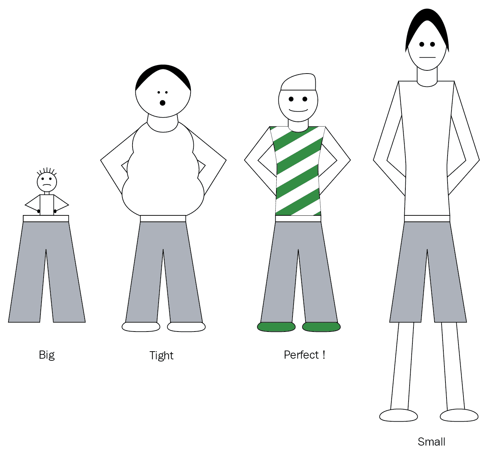
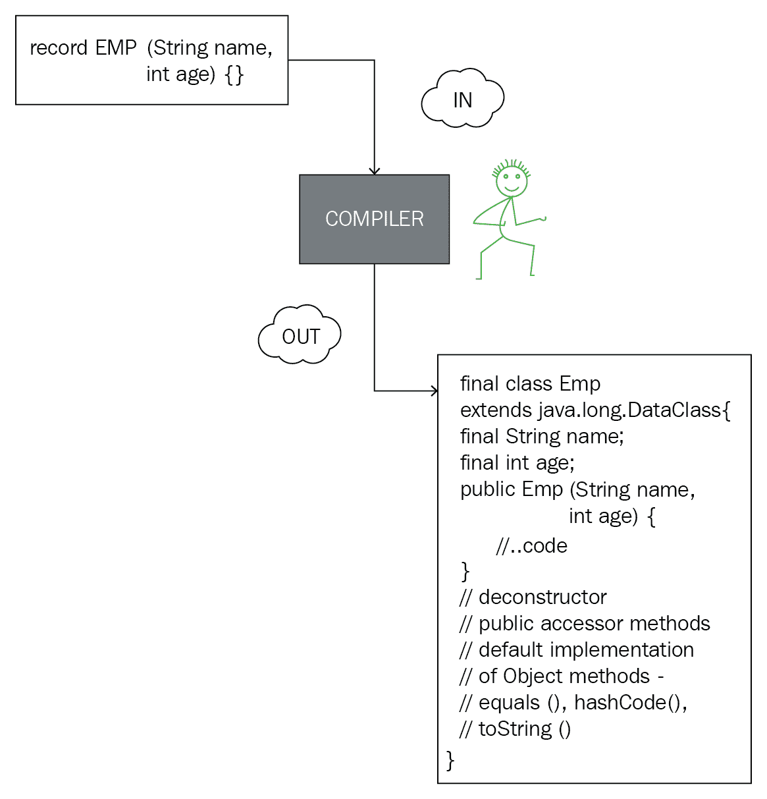
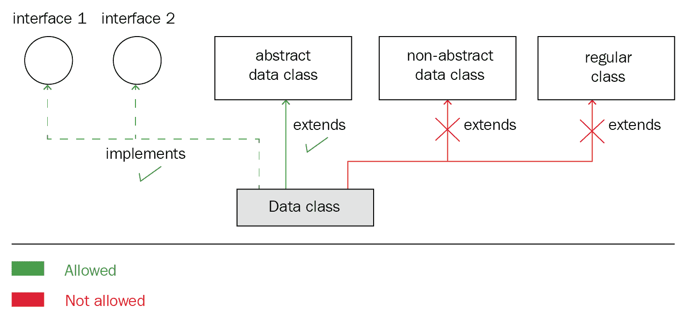

# 第十四章：数据类及其用法

关于 Project Amber 中的数据类，工作正在进行中。它提议为开发者提供一个简化的数据建模方法，引入带有`record`关键字的特殊类。数据类的状态可以通过使用类头来捕捉，这与现有的**普通 Java 对象**（**POJOs**）形成鲜明对比。

在本章中，我们将涵盖以下主题：

+   数据类的介绍

+   数据类的需求及其局限性

+   数据类的聚合形式和展开形式

+   使用数据类进行模式匹配

+   使用抽象数据类和接口进行继承

+   添加变量和方法

+   覆盖默认行为

# 数据类的介绍

我们知道有两种数据类版本——POJO（旧的形式）和刚刚提出的新的数据类。为了理解 Project Amber 中正在工作的数据类，你需要了解现有 POJO 类的功能和局限性，以及为什么我们需要新提出的类。

POJO 不是通过语言结构实现的。提出的数据类将包括对编程语言的修改或添加。

# 什么是数据类？

作为 Java 开发者，你可能已经在你的某些（或所有）项目中使用和创建了 POJOs。POJO 是一个封装了一组数据的类，没有额外的行为来操作其状态。它通常包括构造函数、访问器、修改器以及从对象类中重写的的方法（`hashCode()`、`equals()`和`toString()`）。访问器和修改器允许访问和分配状态变量。此外，修改器可能包括检查分配给实例状态的值范围的代码。以下是一个示例：

```java
final class Emp { 
    private String name; 
    private int age; 

    public Emp(String name, int age) { 
        this.name = name; 
        this.age = age; 
    } 

    // accessor methods - getName, getAge 
    public String getName() { 
        return name; 
    } 

    public int getAge() { 
        return age; 
    } 

    // mutator methods - setName, setAge 
    public void setName() { 
        this.name = name; 
    } 

    public void setAge() { 
        this.age = age; 
    } 

    public boolean equals(Object obj) { 
        if (obj == null || (!(obj instanceof Emp))) 
            return false; 
        else { 
            if ( ( ((Emp)obj).getName().equals(this.name) && 
                 ( ((Emp)obj).getAge() ) == this.age)) { 
                return true; 
            } 
            else 
                return false; 
        } 
    } 

    public String toString() { 
        return name + ":" + age; 
    } 
    public int hashCode() { 
        // ..code 
    } 
} 
```

一种场景是使用`Emp`类将员工数据保存到你的数据库中。以下是一个示例：

```java
interface EmpDAO { 
    Emp read(); 
    void write(Emp emp); 
    List<Emp> getAllEmp(); 
} 
```

类似地，你可以使用`Emp`类来传递消息，通过网络发送，插入到 JSON 对象中，等等。

所有这些都看起来很好。最重要的是，自从 Java 被引入开发者以来，它一直运行良好。那么，问题是什么？

# 在语言中添加数据类的需求

想象一下保卫一个国家的边境，这些边境通常由防御部队守卫。安全水平是否会根据与邻国的（友好、中立或紧张）关系而改变？如果边境是渗透性的（例如，西欧的边境，对于申根国家而言），会发生什么？现在，比较保卫一个国家的边境与保卫我们的家园或确保房间内柜子的内容安全。

尽管前一个示例中的每个实例都涉及实体的安全及其对物理攻击的保护，但这些实例有不同的需求。

类似地，到目前为止，Java 中的类被用来模拟广泛的需求。虽然这对于很多情况来说效果很好，但对于某些情况则不适用。如果你想使所有大小都适合，你需要做很多调整，对于大多数情况来说。

将其与以下图中所示的使用相同裤子尺寸来适应不同身高和腰围的人进行比较：



在过去，枚举被添加到 Java 语言中（版本 5）。尽管可以通过编程创建原始类型或对象的枚举，但枚举简化了开发者的过程。

枚举减少了开发者的编码工作。同时，它们使每个枚举的意图对用户来说更加明确。

在上一节中，`Emp` POJO 只是一个其数据的载体。然而，要让一个类表现得像数据类，需要开发者定义多个方法——构造函数、访问器、修改器以及来自对象类的其他方法。你可能会争辩说，你可以使用 IDE 轻松地为你的类生成所有这些方法。你说得对！这样做很简单。

然而，这仅仅解决了代码的编写部分。对于类的用户来说，代码的阅读部分会发生什么？我们这些开发者明白，一段代码可能只写一次，但会被阅读多次。这就是为什么经验丰富的程序员强调良好的编码实践，以便理解、阅读和维护代码。

当语言中引入数据类的定义时，代码的读者将知道其作为数据类的明确意图。开发者不需要深入挖掘以找到除了是数据类之外还包含的代码，这样他们就不会错过任何重要信息。

这也将防止开发者使用半成品的类作为数据类。有时，开发者会将这样的类用作数据类，而这些类并不包含所有相关的方法（例如`equals()`或`hashCode()`）。这无疑会导致在应用程序中插入微小的错误。例如，`Map`这样的集合类需要类实现其`equals()`和`hashCode()`方法才能正常高效地工作。

通过语言的变化引入数据类将减少语言的冗长，将结构的意图广播给所有人。

# 深入数据类

定义数据类的语法看起来很简单。然而，语法和语义都很重要。让我们通过查看以下章节中的示例来开始。

# 语法和语义示例

让我们重新定义本章开头使用的`Emp`类，将其作为数据类：

```java
record Emp(String name, int age) { }      // data class - one liner 
                                          // code 
```

上述代码使用`record`关键字来定义数据类，接受逗号分隔的变量`name`和类型，这些变量是存储状态所必需的。编译器会自动为数据类生成对象方法的默认实现（`equals()`、`hashCode()`和`toString()`）。

代码看起来清晰且紧凑。读者会立即知道这一行代码的意图——携带数据`name`（类型`String`）和`age`（类型`int`）。对于读者来说，另一个优点是他们不必阅读构造函数、访问器、修改器或对象类的方法，只需确认他们正在做他们应该做的事情。

在幕后，Java 编译器将记录类`Emp`转换为以下代码：

```java
final class Emp extends java.lang.DataClass {
     final String name; final int age; 
         public Emp(String name, int age) {
         this.name = name; this.age = age; } // deconstructor // public        
        // accessor methods // default implementation of equals,     
       // hashCode, and toString } 
```

上述数据类是一个非抽象数据类的示例。数据类也可以定义为抽象数据类。非抽象数据类隐式地是最终的。在两种情况下，数据类都将获得`hashCode()`、`equals()`和`toString()`以及访问器方法的默认实现。对于抽象数据类，构造函数将是受保护的。

在以下图中，编译器看起来很高兴将数据类的单行代码转换为完整的类：



默认情况下，数据类是`final`的；你不能扩展它。

# 数据类的聚合形式和展开形式

数据类的聚合形式将是数据类的名称。其展开形式将指用于存储其数据的变量。从聚合形式到展开形式的转换被称为**解构模式**。

以下代码引用了我们在上一节中使用的示例：

```java
record Emp(String name, int age) { }       
```

`Emp`是`Emp`数据类的聚合形式。其展开形式将是`String name`和`int age`。语言需要在这两者之间提供简单的转换，以便它们可以与其他语言构造一起使用，例如`switch`。

# 局限性

当你使用`record`关键字来定义你的数据类时，你将受到语言允许你做什么的限制。你将不再能够精细控制你的数据类是否可扩展，其状态是否可变，可以分配给字段值的范围，字段的可访问性等等。在添加额外字段或多个构造函数方面，你也可能受到限制。

数据类在 Oracle 中仍在开发中。更详细的内容仍在完善中。2018 年 3 月，`datum`关键字被用来定义数据类，但现在已改为`record`。

现在，开发者不再局限于使用单一编程语言。Java 程序员通常与或了解在 JVM 上工作的其他编程语言，例如 Scala、Kotlin 或 Groovy。使用不同语言的经验带来了许多对数据类（使用`record`定义）的能力和限制的期望和假设。

# 过去的一些例子——定义枚举的变化

在枚举引入之前，开发者经常使用`public`、`static`和`final`变量来定义常量。以下是一个示例：

```java
class Size { 
    public final static int SMALL = 1; 
    public final static int MEDIUM = 2; 
    public final static int LARGE = 3; 
}
```

使用`public`、`static`、`final`和`int`变量的主要缺点是类型安全；任何`int`值都可以分配给类型为`int`的变量，而不是`Size.SMALL`、`Size.MEDIUM`或`Size.LARGE`常量。

Java 5 引入了枚举，这是一种语言结构的补充，使开发者能够定义常量的枚举。以下是一个快速示例：

```java
enum Size {SMALL, MEDIUM, LARGE} 
class SmallTShirt { 
    Size size = Size.SMALL; 
    //..other code 
} 
```

对于类型为`Size`的变量，赋值仅限于`Size`中定义的常量。枚举是语言如何简化模型实现的一个完美例子，代价是某些约束。枚举限制了接口的可扩展性。除此之外，枚举是完整的类。作为开发者，你可以向它们添加状态和行为。另一个好处是枚举也可以使用`switch`构造，这之前仅限于原始类型和`String`类。

新的语言结构就像是一种新的人类关系，无论是生物的还是其他类型的。它有自己的快乐和悲伤。

# 使用数据类的模式匹配

当你使用`record`关键字定义你的数据类时，你将获得转换数据类聚合和展开形式的额外优势。例如，以下代码展示了`switch`语句如何展开数据：

```java
interface Garment {} 
record Button(float radius, Color color); 
record Shirt(Button button, double price); 
record Trousers(float length, Button button, double price); 
record Cap(..) 

switch (garment) { 
     case Shirt(Button(var a1, var a2), Color a3): ... 
     case Trousers(float a1, Button(var a2, var a3), double a4): ... 
     .... 
}
```

`switch`语句可以使用数据类，而不使用其展开形式。以下代码也是有效的：

```java
switch (garment) { 
     case Shirt(Button a1, Color a2): ... 
     case Trousers(float a1, Button a2, double a3): ... 
     .... 
}  
```

# 封装状态

记录类封装字段，提供 JavaBean 风格的访问器方法的默认实现（设置字段值的公共方法）。值可以在数据类实例的初始化期间分配，使用它们的构造函数。

例如，让我们回顾一下前一个部分中的`Emp`数据类及其反编译版本：

```java
record Emp(String name, int age) { }

final class Emp extends java.lang.DataClass { 
    final String name; 
    final int age; 

    public Emp(String name, int age) { 
        this.name = name; 
        this.age = age; 
    } 

    // deconstructor 
    // public accessor methods 
    // default implementation of equals, hashCode, and toString 
} 

```

# 抽象和非抽象数据类

数据类可以是抽象的或非抽象的。一个抽象数据类是通过在其声明中使用`abstract`关键字来定义的。作为一个抽象类，你不能直接使用抽象数据类。以下是一个抽象数据类`JVMLanguage`和一个非抽象数据类`Conference`的示例：

```java
abstract record JVMLanguage(String name, int year); 
record Conference(String name, String venue, DateTime when); 
```

# 数据类和继承

目前，建议取消以下继承情况：

+   数据类可以扩展普通类

+   普通类可以扩展数据类

+   数据类扩展了另一个数据类

允许上述任何一种情况都会违反数据类作为数据载体的契约。目前，针对数据类和继承、接口以及抽象数据类，提出了以下限制：

+   非抽象和抽象数据类可以扩展其他抽象数据类

+   抽象或非抽象数据类可以扩展任何接口

以下图总结了这些继承规则：



让我们从扩展一个抽象数据类开始。

# 扩展一个抽象数据类

在以下示例中，`Emp` 抽象数据类正被非抽象的 `Manager` 数据类扩展：

```java
abstract record Emp(String name, int age); 
record Manager(String name, int age, String country) extends Emp(name, age); 
```

当非抽象数据类扩展抽象数据类时，它接受其头部的所有数据——那些为自己和其基类所必需的。

数据类可以扩展单个抽象数据类。

# 实现接口

数据类可以实现接口及其抽象方法，或者只是继承其默认方法。以下是一个示例：

```java
interface Organizer {} 
interface Speaker { 
   abstract void conferenceTalk(); 
} 

abstract record Emp(String name, int age); 

record Manager(String name, int age, String country)  
   extends Emp(name, age)                    // subclass a record
   implements Organizer;                     // implement one interface

record Programmer(String name, int age, String programmingLang)  
   extends Emp(name, age)                    // subclass a record
   implements Organizer, Speaker {           // implementing multiple 
                                             // interfaces
        public void conferenceTalk() {       // implement abstract 
                                             // method
            //.. code                        // from interface Speaker
        } 
    };
```

上述代码定义了一个标记接口 `Organizer`（没有方法）和一个具有抽象方法 `conferenceTalk()` 的接口。我们有以下两种情况：

+   扩展另一个数据类并实现接口的数据类——`Manager` 数据类扩展了抽象的 `Emp` 数据类并实现了 `Organizer` 接口。

+   扩展另一个数据类并实现多个接口的数据类——`Programmer` 数据类扩展了抽象的 `Emp` 数据类并实现了两个接口——`Organizer` 和 `Speaker`。`Programmer` 数据类必须实现 `Speaker` 接口中的抽象 `conferenceTalk()` 方法，才能作为非抽象数据类。

数据类可以实现单个或多个接口。

# 额外变量

虽然这是允许的，但在向数据类添加变量或字段之前，请自问，*字段是否来自状态？* 不是来自状态的字段会对数据类初始概念的严重违反。以下代码是一个定义额外字段 `style` 的示例，该字段来自 `Emp` 数据类的状态：

```java
record Emp(String name, int age) { 
    private String style; 
    Emp(String name, int age) { 
        //.. initialize name and age 
        if (age => 15 && age =< 30) style = "COOL"; 
        else if (age >= 31 && age <= 50) style = "SAFE"; 
        else if (age >= 51) style = "ELEGANT"; 
    } 
    public String getStyle() { 
        return style; 
    } 
}
```

上述代码运行良好，因为 `Emp` 数据类的状态仍然来自其状态（`name` 和 `age` 字段）。`getStyle` 方法不会干扰 `Emp` 的状态；它纯粹是实现细节。

# 覆盖隐式行为

假设你想要限制在数据类实例化期间可以传递给字段的值。这是可行的；只需覆盖默认构造函数。以下是一个示例：

```java
record Emp(String name, int age) { 
    // override default constructor 
    @Override 
    public Emp(String name, int age) { 
        // validate age 
        if (age > 70) 
            throw new IllegalArgumentException("Not employable above 70             
            years"); 
        else { 
            // call default constructor 
            default.this(name, age); 
        } 
    } 
} 
```

同样，你可以覆盖对象方法的默认实现，例如 `equals()`、`hashCode()` 和 `toString()`，以及其他方法，如访问器方法。

覆盖数据类方法的默认行为并不会削弱其创建的目的。它们仍然作为数据类工作，对它们的功能有更精细的控制。让我们将其与之前用于建模数据类的 POJOs 进行比较。编译器不会为 POJO 自动生成任何方法。因此，用户仍然需要阅读所有代码，寻找不是其方法默认实现的代码。在数据类的情况下，这种覆盖行为非常明确。因此，用户不必担心阅读所有代码；他们可以假设行为有默认实现，而这种实现尚未被开发者覆盖。

明确地覆盖行为说明了数据类偏离其默认行为的地方，从而减少了用户为了理解其行为而必须阅读的代码量。

# 额外的方法和构造函数

编译器为数据类生成默认构造函数，以及访问器方法和对象类方法的默认实现。开发者可以重载构造函数并向数据类添加更多方法，如下所示：

```java
record Emp(String name, int age) { 
    // overloading constructor 
    public Emp(String name, String style) { 
            this.name = name; 
            if (style.equals("COOL") age = 20; 
            else if (style.equals("SAFE") age = 30; 
            else if (style.equals("ELEGANT") age = 50; 
            else age = 70; 
        } 
    } 
    public String fancyOutput() {                 // additional method 
        return "My style is COOL"; 
    } 
} 
```

# 可变性

关于数据类是否应指定为可变或不可变，工作仍在进行中。两种选项都有优点和缺点。不可变数据在多线程、并行或并发系统中表现良好。另一方面，可变数据在需要频繁修改数据的情况中表现良好。

关于线程安全，由于数据类尚未指定为不可变，使用它们进行线程安全配置是开发者的责任。

# 摘要

在本章中，我们讨论了使用 POJOs 来建模数据的挑战。我们介绍了数据类如何提供一种简单且简洁的方式来建模数据。数据类的实现将包括语言的变化，引入`record`关键字。使用数据类的主要目标是建模数据，而不是减少样板代码。

我们还讨论了数据类的聚合和展开形式。数据类可以与其他语言结构一起使用，例如`switch`。默认情况下，数据类是不可变的，包括定义为数据成员的数组。由于这些结构不是不可变的，开发者在处理它们时必须包含代码以确保线程安全。

在下一章中，你将了解更多关于一个令人兴奋的语言增强功能——原始字符串字面量。这难道意味着一个纯净的、未触动的字符串吗？通过继续阅读来找出答案。
