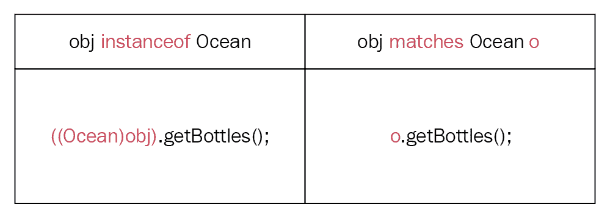

# 模式匹配

作为一名 Java 程序员，想象一下，如果你有选择跳过使用`instanceof`运算符和显式类型转换运算符来从你的对象中检索值。模式匹配（JDK 增强提案（JEP）305）通过添加类型测试模式和常量模式来解决这个痛点。它增强了 Java 编程语言，引入了允许你确定实例和派生类的类型，并访问它们的成员而不使用显式类型转换的功能。

在本章中，我们将涵盖以下主题：

+   模式匹配

+   类型测试模式

+   常量模式

# 技术要求

本章中的代码使用了模式匹配（JEP 305）中定义的功能，这些功能尚未针对任何 JDK 发布版本进行目标化。要实验代码，你可以克隆相关的仓库。

本章中所有代码都可以在[`github.com/PacktPublishing/Java-11-and-12-New-Features`](https://github.com/PacktPublishing/Java-11-and-12-New-Features)找到[.](https://github.com/PacktPublishing/Java-11-and-12-New-Features)

让我们讨论使用`instanceof`和显式类型转换运算符的问题。

# 模式匹配

模式匹配将增强 Java 编程语言。首先，它将添加类型测试模式和常量模式，这些模式将由`switch`语句和`matches`表达式支持。随后，这个 JEP 可能会扩展支持的模式和语言结构。

模式匹配是一种古老的技巧（大约 65 年历史），它已被各种语言所采用并使用，如面向文本、函数式（Haskell）和面向对象语言（Scala、C#）。

模式是以下组合：

+   谓词

+   一个目标

+   一组绑定变量

当一个谓词成功应用于一个目标时，会从目标中提取一组绑定变量。本章涵盖的模式包括类型测试模式和常量模式。

在详细处理示例之前，让我们了解现有问题和为什么我们需要模式匹配。

# 类型测试存在的问题

作为一名 Java 开发者，你应该已经与以下块中加粗的高亮代码一起工作过：

```java
Object obj = new Ocean();                         // variable type - Object 
if (obj instanceof Ocean) {                         // check instance type 
    System.out.println(((Ocean)obj).getBottles());  // cast & extract value 
} 
// A basic class - Ocean  
class Ocean { 
   private long bottles; 
   public long getBottles() { 
         return bottles; 
   } 
}
```

上述代码包括三个步骤来使用`bottles`变量的值：

1.  `obj instanceof Ocean`：测试`obj`变量的类型

1.  `(Ocean)obj`：将引用变量`obj`转换为`Ocean`

1.  `((Ocean)obj).getBottles()`: 通过销毁实例来获取值

作为开发者，我们长期以来一直在编写类似的代码，但也在秘密地讨厌它。这就像一遍又一遍地重复相同的指令。这些测试、铸造和分解实例以提取值的步骤是不必要的冗长。我们都知道代码重复是错误被忽视的最好方式之一。更糟糕的是，当在一个地方有多个代码重复实例时，它只会变得更糟。以下代码示例就是一个例子：

```java
void dyingFish(Object obj) { 
    if (obj instanceof Ocean) {                          // test 
        System.out.println(((Ocean)obj).getBottles());   // cast & 
                                                         // destruct 
    } 
    else if (obj instanceof Sea) {                       // test 
        System.out.println(((Sea)obj).getDeadFish()); 
    } 
    else if (obj instanceof River) {                     // test 
        if ( ((Ocean)obj).getPlasticBags() > 100) {      // cast & 
                                                        // destruct 
            System.out.println("Say no to plastic bags. Fish are dying!"); 
        } 
    } 
} 
class Ocean { .. } 
class Sea { .. } 
class River { .. } 
```

当你添加更多测试-铸造-实例销毁模式的实例来检索字段值时，你会在由语言引起的复杂性中失去业务逻辑。开发者直接复制并粘贴这样的代码并修改不同的部分是非常常见的——但同样常见的是一些代码部分被保留不变（这要么成为逻辑错误，要么应该被标记为复制粘贴错误）。

这段代码也难以优化；即使底层问题通常是 `O(1)`，它的时间复杂度也将是 `O(n)`。

# 类型测试模式

为了解决测试-铸造-实例销毁模式造成的问题，Java 提议采用模式匹配。

这里是一个语言提出的更改示例：

```java
Object obj = new Ocean();                         // variable type - Object 
if (obj matches Ocean o) {                        // check & bind  
    System.out.println(o.getBottles());           // extract  
} 
```

上述代码引入了一个新的 Java 关键字 `matches`，它包括一个 **谓词** (`obj`) 和一个 **目标** (`Ocean o`)。谓词，即 `obj` 应用到目标，即 `Ocean o`，将 `o` 变量绑定到由 `obj` 指代的实例。如果匹配成功，你可以使用 `bound` 变量，即 `o`，来访问实例的成员。以下图表比较了使用 `instanceof` 和 `matches` 的代码更改。显然，`matches` 操作符从代码中移除了丑陋的显式转换：



让我们看看类型匹配是否可以简化我们代码中的多次出现：

```java
void dyingFish(Object obj) { 
    if (obj matches Ocean o) {                          // check & bind 
        System.out.println(o.getBottles());             // extract 
    } 
    else if (obj matches Sea sea) {                       // test 
        System.out.println(sea.getDeadFish()); 
    } 
    else if (obj matches River riv) {                     // test 
        if (riv.getPlasticBags() > 100) {      // cast & destruct 
            System.out.println("Say no to plastic bags. Fish are 
            dying!"); 
        } 
    } 
} 
class Ocean { .. } 
class Sea { .. } 
class River { .. } 
```

测试模式不仅限于 `if`-`else` 语句。让我们看看它如何与 `switch` 构造一起使用。

# 使用模式匹配与 `switch` 构造

`switch` 语句似乎是可以使用模式匹配的最好构造之一。目前，`switch` 构造可以匹配原始字面量值（不包括 `long`、`float` 和 `double`）、`String` 和枚举常量。

如果 `case` 标签可以指定一个模式，前面部分（使用多个对象检查和值提取的实例）的代码可以修改如下：

```java
void dyingFish(Object obj) { 
    switch (obj) { 
        case Ocean o:   System.out.println(o.getBottles()); 
                        break; 
        case Sea sea:   System.out.println(sea.getDeadFish()); 
                        break; 
        case River riv: if (riv.getPlasticBags() > 100) { 
                            System.out.println("Humans enjoy! Fish die!"); 
                        } 
                        break; 
    } 
} 
```

使用模式匹配，业务逻辑成为焦点。它还简化了语法的复杂性，从而提高了代码的可读性。前面的代码也是可优化的，因为我们很可能会在 `O(1)` 时间内进行调度。

在模式匹配中，也在对解构模式（与实例构造相反）进行工作。

# 摘要

在本章中，你了解了模式匹配将如何改变你的日常代码。模式匹配引入了一个新的关键字`matches`，以简化从实例中检查、转换和检索值的过程。

这本书带你了解了最新的 Java 版本——10、11 和 12，以及 Amber 项目。Java 拥有强大的发展路线图，并且凭借其现有特性和新功能，继续激发开发者和企业的热情。随着新的六个月发布节奏，Java 的发展速度之快是我们之前未曾见过的。作为开发者，你将比以往任何时候都能更早地使用到新的 Java 特性和改进。

我鼓励所有开发者检查新 Java 版本的改进和新增功能，因为它们一旦发布。同时，也不要错过在 Oracle 网站上浏览诸如 Valhalla、Loom、Panama 以及许多其他项目。这些项目将提升 Java 的能力，例如轻量级线程、更简单的外部库访问，以及新的语言候选者，如值类型和泛型特化。敬请期待！
