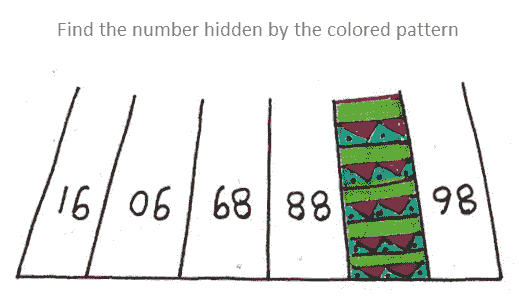
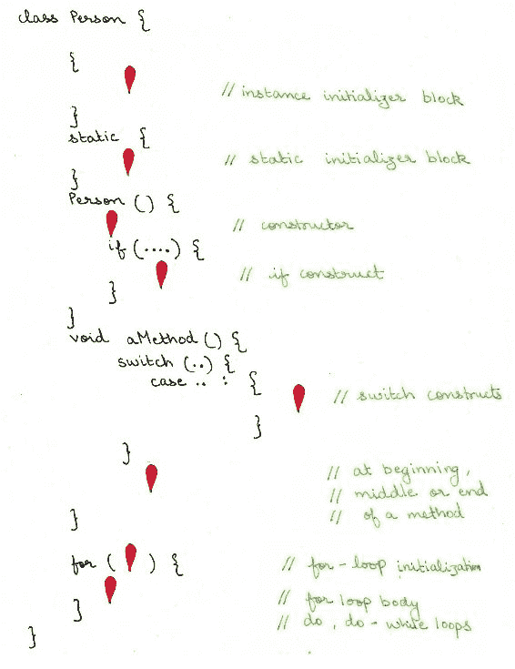
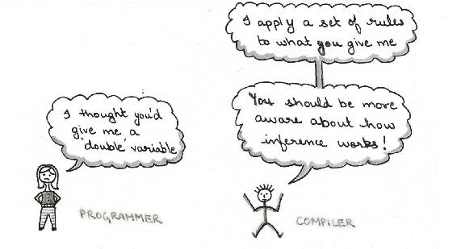
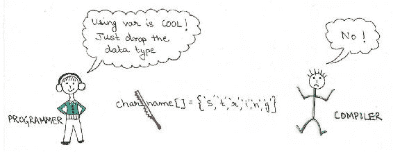
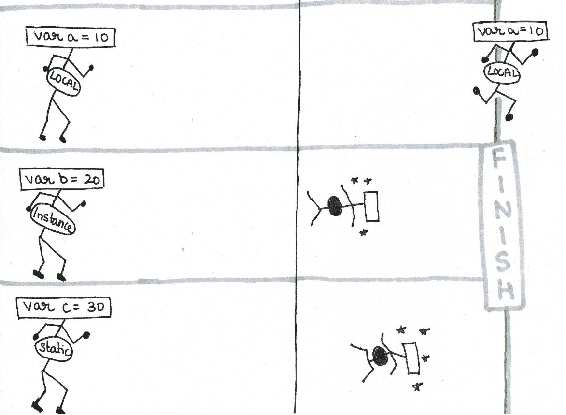

# 类型推断

使用局部变量或`var`的类型推断是 Java 10 中最受讨论的明星特性之一。它减少了语言的冗长性，同时没有牺牲 Java 可靠的静态绑定和类型安全。编译器使用代码中已经可用的信息推断类型，并将其添加到它生成的字节码中。

每个新概念都有自己的优点、局限性和复杂性。使用`var`进行类型推断也不例外。随着您学习本章，您将看到使用`var`将如何让您着迷、让您沮丧，但最终取得胜利。

在本章中，我们将涵盖以下主题：

+   什么是类型推断？

+   使用`var`的类型推断

+   与`var`一起工作的注意事项

+   类型推断与动态绑定

# 什么是类型推断？

想象一下解决一个谜题，就像以下图像中所示的那样，它以提示的形式呈现多个约束。您通过解决约束来得出答案。您可以将类型推断与生成约束然后解决它们来比较，以确定编程语言中的数据类型。类型推断是编译器通过使用代码中已经可用的信息来确定数据类型的能力；字面值、方法调用及其声明。对于开发者来说，类型推断减少了冗长性：



为了您的参考，前一个谜语的答案是 87（只需翻转图像，你就能在序列中找到数字）。

类型推断对 Java 来说并不新鲜。随着 Java 10 中引入局部变量`var`，它被提升到了一个新的水平。

让我们通过使用`var`的示例进行深入研究。

# 使用 var 的类型推断

以下代码行显示了在 Java 10 之前您是如何定义局部变量（以及所有其他变量）的：

```java
String name = "Java11"; 
LocalDateTime dateTime = new LocalDateTime.now(); 
```

从 Java 10 开始，使用`var`，您可以在局部变量的声明中省略强制显式类型，如下所示：

```java
var name = "Java11";         // variable 'name' inferred as String 
var dateTime = new LocalDateTime.now();  // var 'dateTime' inferred as LocalDateTime 
```

您认为前面的代码似乎没有提供很多好处吗？如果，而不是以下？

```java
HashMap<Integer, String> map = new HashMap<Integer, String>(); 
```

您可以使用以下方法：

```java
var map = new HashMap<Integer, String>();  
```

前面的示例在左侧删除了很多字母，使其更加简洁。

当您不再明确声明变量的数据类型时，编译器接管以确定或推断变量类型。类型推断是编译器评估代码中已存在的信息的能力，例如，字面值、操作、方法调用或它们的声明，以确定变量类型。它遵循一系列规则来推断变量类型。作为开发者，当您选择使用`var`进行类型推断时，您应该了解编译器的推断算法和其他规则，以免得到意外结果。

每当出现新功能时，您都应该遵守一些规则、限制，并尝试遵循最佳实践以从中受益。让我们从使用 `var` 定义的变量的强制初始化开始。

使用 `var` 的类型推断不是动态类型；Java 仍然是一种强静态类型语言。使用 `var` 可以使您的代码更简洁；您可以从局部变量的定义中省略其类型。

# 强制非空初始化

使用 `var` 定义的局部变量必须在声明时进行初始化，否则代码将无法编译。编译器无法推断未初始化变量或被赋予空值的变量的类型。以下代码将无法编译：

```java
var minAge;                   // uninitialized variable 
var age = null;               // variable assigned a null value  
```

以下图像说明了如果未初始化的变量 `age` 去寻求进入 Mr. Java 编译器的位置会发生什么。编译器不会让它进入：


使用 `var` 定义变量时，必须始终伴随其初始化；否则，代码将无法编译。

# 局部变量

`var` 的使用仅限于局部变量。这些变量用于存储中间值，与实例和静态变量相比，它们的生命周期最短。局部变量在方法、构造函数或初始化块（实例或静态）内定义。在方法或初始化块内，它们可以在 `if`-`else` 循环、`switch` 语句或 `try-with-resources` 构造中定义。以下是一个 `Person` 类的示例，该类在多个地方定义了局部变量：

```java
public class Person { 
    { 
        var name = "Aqua Blue";         // instance initializer block 
    } 

    static { 
        var anotherLocalVar = 19876;    // static initializer block 
    } 

    Person() { 
        var ctr = 10;                   // constructor 
        for (var loopCtr = 0; loopCtr < 10; ++loopCtr) {    // loop - for initializer 
            switch(loopCtr) { 
                case 7 :{ 
                            var probability = ctr / loopCtr;    // switch 
                            System.out.println(probability); 
                            break; 
                        } 
            } 
        } 
    } 

    public String readFile() throws IOException { 
        var filePath = "data.txt"; 
        try (var reader = new BufferedReader(new FileReader(filePath))) {   // try-with-resources 
            return reader.readLine(); 
        } 
    } 
}  
```

由于这些地方很多，您可能觉得很难记住它们。我们刚刚请求 Google Maps 找到所有可能的实例，这是我们得到的结果：



本章包含一些代码检查练习，供您快速尝试新主题。练习使用了两位假设程序员的姓名，Pavni 和 Aarav。

# 代码检查——第一部分

我们的程序员之一，Aarav，重构了他团队成员 Pavni 的代码。代码不再输出 `char` 及其对应的 ASCII 数字，这些数字存储在一个 `char` 数组中。你能帮帮 Aarav 吗？以下是代码：

```java
class Foo {   
    public static void main(String   args[]) {   
        try {   
           char[] name = new char[]{'S','t','r','i','n','g'};   
           for (var c : name) {   
               System.out.println(c + ":"   + (c + 1 - 1));   
           }   
        }   
        catch (var e) {   
            //code   
        }   
    }   
}   
```

代码检查的答案——`var` 类型不能用于指定捕获处理程序中的异常类型 `(var e)`。

# 使用 `var` 与原始数据类型

这看起来是最简单的，但外表可能具有欺骗性。尝试执行以下代码：

```java
var counter = 9_009_998_992_887;       // code doesn't compile 
```

您可能会假设一个整数文字值（在这种情况下为 `9_009_998_992_887`）如果超出原始 `int` 类型的范围，将被推断为 `long` 类型。然而，事实并非如此。由于整数文字值的默认类型是 `int`，您需要将前缀 `L` 或 `l` 添加到值之后，如下所示：

```java
var counter = 9_009_998_992_887L;       // code compiles 
```

同样，为了使一个 `int` 文字值被推断为 `char` 类型，您必须使用显式转换，如下所示：

```java
var aChar = (char)91; 
```

当你将`5`除以`2`时，结果是什么？你说`2.5`吗？但这在 Java 中（总是）不是这样工作的！当整数用作除法运算的操作数时，结果是整数而不是小数。小数部分被舍弃以得到整数结果。尽管这是常见的，但当你期望编译器推断变量类型时，这可能会显得有些奇怪。以下是一个例子：

```java
// type of result inferred as int; 'result' stores 2 
var divResult = 5/2; 

// result of (5/2), that is 2 casted to a double; divResult stores 2.0 
var divResult = (double)(5/ 2); 

// operation of a double and int results in a double; divResult stores 2.5 
var divResult = (double)5/ 2;  
```

尽管这些情况与`var`类型没有直接关系，但开发者认为编译器会推断特定类型的假设，导致不匹配。以下是一个快速图像来帮助你记住这一点。



整数字面量的默认类型是`int`，浮点数的默认类型是`double`。将`100`赋值给使用`var`定义的变量将推断其类型为`int`；而不是`byte`或`short`。

在算术运算中，如果任一操作数是`char`、`byte`、`short`或`int`，结果至少会被提升为`int`。

```java
byte b1 = 10; 
char c1 = 9; 
var sum = b1 + c1;        // inferred type of sum is int  
```

类似地，对于至少包含一个操作数为`long`、`float`或`double`值的算术运算，结果会被提升为相应的`long`、`float`或`double`类型：

```java
byte cupsOfCoffee = 10; 
long population = 10L; 
float weight = 79.8f; 
double distance = 198654.77; 

var total1 = cupsOfCoffee + population;     // inferred type of total1 is long 
var total2 = distance + population;        // inferred type of total2 is double 
var total3 = weight + population;    // inferred type of total3 is float  
```

原始变量隐式扩展的规则在理解 Java 编译器如何推断具有原始值的变量时起着重要作用。

# 使用派生类的类型推断

在 JDK 9 和之前的版本中，你可以定义一个基类变量并将其赋值为其派生类的实例。你可以使用这个变量访问的成员仅限于在基类中定义的成员。使用`var`之后就不再是这样了；因为变量的类型是通过分配给它的实例的具体类型来推断的。

假设`Child`类扩展了`Parent`类。当你创建一个局部变量并将其赋值为`Child`类的实例时，变量的类型被推断为`Child`。这看起来很简单。以下是一个例子：

```java
class Parent { 
    void whistle() { 
        System.out.println("Parent-Whistle"); 
    } 
} 
class Child extends Parent { 
    void whistle() { 
        System.out.println("Child-Whistle"); 
    } 
    void stand() { 
        System.out.println("Child-stand"); 
    } 
} 
class Test{ 
    public static void main(String[] args) { 
        var obj = new Child();                             
        obj.whistle(); 
        obj.stand();     // type of obj inferred as Child 
    } 
}  
```

如果你使用一个可以返回`Child`类或`Parent`类实例的方法来赋值变量`obj`，会发生什么？以下是修改后的代码：

```java
class Parent { 
    void whistle() { 
        System.out.println("Parent-Whistle"); 
    } 
} 

class Child extends Parent { 
    void whistle() { 
        System.out.println("Child-Whistle"); 
    } 
    void stand() { 
        System.out.println("Child-stand"); 
    } 
} 

class Test{ 
    public static Parent getObject(String type) { 
        if (type.equals("Parent")) 
            return new Parent(); 
        else 
            return new Child(); 
    } 

    public static void main(String[] args) { 
        var obj = getObject("Child"); 
        obj.whistle(); 
        obj.stand();              // This line doesn't compile 
    } 
} 
```

在前面的代码中，方法`getObject()`返回的实例类型在代码执行之前无法确定。在编译时，变量`obj`的类型被推断为`Parent`；因此`main()`方法无法编译。

使用`var`定义的变量类型是在编译时推断的。如果方法返回类型用于赋值使用`var`定义的变量，其推断类型是方法的返回类型；而不是在运行时返回的实例类型。

# 类型推断 – 使用接口

让我们将前面章节中学到的知识扩展到接口的使用。想象一下`Child`类实现了`MarathonRunner`接口：

```java
interface MarathonRunner{ 
    default void run() { 
        System.out.println("I'm a marathon runner"); 
    } 
} 

class Child implements MarathonRunner { 
    void whistle() { 
        System.out.println("Child-Whistle"); 
    } 
    void stand() { 
        System.out.println("Child-stand"); 
    } 
}  
```

让我们定义一个局部变量`obj`，将其赋值为`Child`类的实例：

```java
class Test{ 
    public static void main(String[] args) { 
        var obj = new Child();              // inferred type of var obj is Child 
        obj.whistle(); 
        obj.stand();                     
        obj.run(); 
    } 
}  
```

如果使用返回类型为 `MarathonRunner` 的方法初始化相同的变量，其推断类型为 `MarathonRunner`（无论它返回的实例类型如何）：

```java
class Test{ 
    public static MarathonRunner getObject() { 
        return new Child(); 
    } 
    public static void main(String[] args) { 
        var obj = getObject();     // inferred type of var obj is MarathonRunner 
        obj.whistle(); 
        obj.stand(); 
        obj.run(); 
    } 
} 
```

# 使用 `var` 与数组

使用 `var` 并不意味着只是丢弃局部变量的类型；剩下的内容应该能够使编译器推断其类型。想象一下一个定义 `char` 类型数组的方法：

```java
char name[] = {'S','t','r','i','n','g'};  
```

你不能丢弃其类型，并使用以下任一代码来定义它：

```java
var name[] = {'S','t','r','i','n','g'}; 
var[] name = {'S','t','r','i','n','g'}; 
var name = {'S','t','r','i','n','g'};  
```

这里是向编译器提供相关信息以使其能够推断类型的一种方法：

```java
var name = new char[]{'S','t','r','i','n','g'}; 
```

看起来 Java 编译器已经因为程序员的这个假设而感到有些吃力，如下面的图片所示：



你不能仅仅丢弃数据类型来使用 `var`。剩下的内容应该能够使编译器推断出被分配的值的类型。

# 泛型的类型推断

引入泛型的动机是为了包含类型安全。它使开发者能够指定他们使用具有固定或类型范围的类、接口和集合类的意图。违反这些意图将通过编译错误强制执行，而不是运行时异常；提高合规性标准。

例如，以下是定义一个用于存储 `String` 值的 `ArrayList` 的方法（在赋值右侧重复 `<String>` 是可选的）：

```java
List<String> names = new ArrayList<>();  
```

然而，将 `List<String>` 替换为 `var` 将会使泛型中的类型安全受到威胁：

```java
var names = new ArrayList<>(); 
names.add(1); 
names.add("Mala"); 
names.add(10.9); 
names.add(true); 
```

上述代码允许向 `names` 添加多个数据类型，这并不是意图。使用泛型时，首选的方法是向编译器提供相关信息，以便它可以正确推断其类型：

```java
var names = new ArrayList<String>(); 
```

当使用 `var` 与泛型时，确保你在赋值右侧的尖括号内传递相关数据类型；这样你就不会失去类型安全。

是时候进行我们的下一个代码检查了。

# 代码检查 – 第二部分

我们的程序员之一，Pavni，尝试在泛型和集合类中使用 `var`，但她的代码似乎没有输出排序好的钢笔集合。你能帮忙吗？

```java
class Pen implements Comparable<Pen> {   
    String name;   
    double price;   
    Pen(String name, double price) {   
        this.name = name;   
        this.price = price;   
    }   
    public int compareTo(Pen pen) {   
        return ((int)(this.price-pen.price));   
    }   
    public String toString() {   
        return name;   
    }   

    public static void main(String   args[]) {   
        var pen1 = new Pen("Lateral",   219.9);   
        var pen2 = new Pen("Pinker",   19.9);   
        var pen3 = new Pen("Simplie",   159.9);   

        var penList = List.of(pen1, pen2,   pen3);   

        Collections.sort(penList);   
        for (var a : penList)    
            System.out.println(a);   
    }   
}   
```

代码检查的答案——问题是尝试使用 `Collections.sort()` 修改不可变集合。这是为了强调所有问题并不都与 `var` 的使用相关。

# 将推断变量传递给方法

尽管 `var` 的使用仅限于局部变量的声明，但这些变量（包括原始类型和引用类型）可以作为值传递给方法。推断出的类型和方法期望的类型必须匹配，才能使代码编译。

在下面的示例代码中，`Child` 类实现了 `MarathonRunner` 接口。`Marathon` 类中的 `start()` 方法期望传入的参数是 `MarathonRunner` 对象（实现此接口的类的实例）。变量 `aRunner` 的推断类型是 `Child`。由于 `Child` 类实现了 `MarathonRunner`，因此可以将 `aRunner` 传递给 `start()` 方法，`aRunner` 的推断类型（`Child`）与 `start()` 方法期望的类型（`MarathonRunner`）相匹配，使得代码能够编译。

这是代码：

```java
interface MarathonRunner { 
    default void run() { 
        System.out.println("I'm a marathon runner"); 
    } 
} 
class Child implements MarathonRunner { 
    void whistle() { 
        System.out.println("Child-Whistle"); 
    } 
    void stand() { 
        System.out.println("Child-stand"); 
    } 
} 
class Marathon { 
    public static void main(String[] args) { 
        var aRunner = new Child();         // Inferred type is Child 
        start(aRunner);    // ok to pass it to start (param - MarathonRunner) 
    } 
    public static void start(MarathonRunner runner) { 
        runner.run(); 
    } 
}  
```

只要变量的推断类型与方法参数的类型相匹配，就可以将其作为参数传递给它。

# 将值重新赋给推断变量

对于所有非最终变量，你可以将值重新赋给推断变量。只需确保重新赋的值与其推断类型相匹配。变量的类型仅推断一次。

```java

var age = 9;     // type inferred as int 
age = 10.9;      // won't compile 

StringBuilder query = new StringBuilder("SELECT"); // Type - StringBuilder 
query = query.toString() + "FROM" + "TABLE";       // won't compile;  
                          // can't convert String  
                          // to StringBuilder 

```

使用 `var` 定义的局部变量的类型仅推断一次。

# 显式类型转换与推断变量

假设一个同事将 `29` 赋值给一个推断的局部变量，比如 `age`，假设编译器会推断变量 `age` 的类型为 `byte`：

```java
var age = 29;           // inferred type of age is int 
```

然而，编译器会推断变量 `age` 的类型为 `int`，因为整数字面量的默认类型是 `int`。要修复前面的假设，你可以使用显式数据类型，或者通过使用显式类型转换覆盖编译器的默认推断机制，如下所示：

```java
byte age = 29;                // Option 1 - no type inference 
var age = (byte)29;           // Option 2 - explicit casting 
```

通过使用显式类型推断，你可以覆盖编译器的默认类型推断机制。这可能是为了修复现有代码中的假设。

类似地，你可以使用显式类型转换与其他原始数据类型，如 `char` 和 `float`：

```java
var letter = (char)97;        // inferred type of letter is char 
var debit = (float)17.9;      // inferred type of debit is float  
```

在前面的示例中，如果没有显式类型转换，赋值为整数字面量的变量会被推断为 `int` 类型，而小数会被推断为 `double` 类型。

以下是一个使用显式类型转换的引用变量示例：

```java
class Automobile {} 
class Car extends Automobile { 
    void check() {} 
} 
class Test{ 
    public static void main(String[] args) { 
        var obj = (Automobile)new Car();                             
        obj.check();     // Won't compile; type of obj is Automobile 
    } 
} 
```

使用类型推断的显式类型转换来修复任何现有的假设。我不建议使用显式类型转换来初始化推断变量；这违背了使用 `var` 的目的。

# 使用显式类型转换赋值 null

再次，虽然将 `null` 显式转换为 `var` 类型的值没有意义，但这是一种有效的代码：

```java
var name = (String)null;             // Code compiles 
```

尽管上一行代码在语法上是正确的，但这是一种不良的编码实践。请避免这样做！

# Java 早期版本中的类型推断

虽然 `var` 在 Java 10 中将推断提升到了新的水平，但类型推断的概念在它的早期版本中就已经存在。让我们看看 Java 早期版本中类型推断的示例。

# Java 5 中的类型推断

泛型引入了一种类型系统，使开发者能够对类型进行抽象。它限制了类、接口或方法只能与指定类型的实例一起工作，提供了编译时的类型安全。泛型被定义为为集合框架添加编译时安全性。泛型使程序能够在编译期间检测到某些错误，从而防止它们在运行时代码中蔓延。在开发阶段修复错误比在生产阶段修复错误要容易。

Java 在 Java 5 中为泛型方法类型参数使用了类型推断。而不是以下这样的代码：

```java
List<Integer> myListOfIntegers = Collections.<Integer>emptyList(); // 1 
```

你可以使用：

```java
 List<Integer> myListOfIntegers = Collections.emptyList(); // 1 
```

# Java 7 中的类型推断

Java 7 引入了泛型构造函数参数的类型推断。这实际上意味着以下这样的代码行：

```java
List<String> myThings = new ArrayList<String>(); 
```

可以替换为：

```java
List<String> myThings = new ArrayList<>();  
```

前面的内容不应与以下内容混淆，后者试图将泛型与原始类型混合：

```java
List<String> myThings = new ArrayList();  
```

Java 7 也允许对泛型方法进行类型推断。例如，在 `MyClass` 类中定义的泛型方法 `print()`：

```java
class MyClass<T> { 
   public <X> void print(X x) { 
         System.out.println(x.getClass()); 
   } 
}  
```

可以以下两种方式之一调用（第三行代码使用类型推断来推断传递给 `print()` 方法的参数类型）：

```java
MyClass<String> myClass = new MyClass<>(); 
myClass.<Boolean>deliver(new Boolean("true"));     
myClass.deliver(new Boolean("true")); 
```

# Java 8 中的类型推断

Java 8 通过 lambda 函数引入了 Java 中的函数式编程。lambda 表达式可以推断其形式参数的类型。因此，可以不用以下这样的代码行：

```java
Consumer<String> consumer = (String s) -> System.out.println(s);  
```

你可以编写：

```java
Consumer<String> consumer = s -> System.out.print(s); 
```

# 挑战

`var` 的使用并非没有挑战，这既包括 Java 语言的开发者，也包括其用户。让我们从 `var` 使用受限的原因开始讨论。

# 限制失败假设的作用域

如你所知，`var` 类型的使用仅限于 Java 中的局部变量。它们不允许在公共 API 中使用，例如作为方法参数或方法的返回类型。一些语言支持对所有类型变量的类型推断。Java 可能会在未来允许这样做（谁知道呢？会发生吗？如果会，什么时候？）。

然而，有强有力的理由限制推断变量的作用域，以便及早发现由于假设与实际情况不符而产生的错误。公共 API 的契约应该是明确的。使用公共 API 的类型推断将允许这些错误被捕获和纠正得晚一些。

公共 API 的契约应该是明确的，它们不应该依赖于类型推断。

这里有一个实际例子，说明了假设与实际情况不符可能导致错误。

最近，我的孩子随学校出国参加学生交流项目。学校要求我为她签证申请发送一组照片。我打电话给我的摄影师，要求他打印签证照片（指定国家）。两天后，学校要求我重新提交照片，因为之前提交的照片不符合规则。

发生了什么问题？学校和我都未明确说明照片的规格。学校认为我会知道规格；我则认为摄影师会知道规格（因为他已经做了很多年）。在这种情况下，至少有一个人假设结果符合特定的输出，而没有明确指定输出。没有明确的合同，期望和实际之间总是存在不匹配的范围。

尽管存在困惑，错误在应用程序提交给大使馆之前被发现并得到了纠正。

这里有一张有趣的图片，可以解释为什么类型推断的使用仅限于局部变量，当局部实例和静态变量在比赛中竞争时，只有局部变量能够到达终点线：



# 破坏现有代码

使用`var`作为类、接口、方法、方法参数或变量名称的代码，在 JDK 10 及以后的版本中将无法编译。以下是一个在多个地方使用`var`的代码示例；它将无法编译：

```java
class var {}          // can't use var as class name
interface var {}      // can't use var as interface name
class Demo {
    int var = 100;               // can't use var as instance variable name
    static long var = 121;       // can't use var as static variable name

    void var() {                 // can't use var as method name
        int var = 10;            // cant use var as the name of a local variable
    }
    void aMethod(String var) {}  // can't use var as the name of method parameter
}
```

重要的是要使用最新的 Java 发布版本测试你的生产代码，即使你并不打算将你的生产代码部署到它们上。这将有助于消除与你的生产代码的任何兼容性问题；有助于将其迁移到未来的 Java 版本发布。

# 不可表示类型

你可以在程序中使用的一些 Java 类型，如`int`、`Byte`、`Comparable`或`String`，被称为**可表示类型**。编译器内部使用的类型，如匿名类的子类，你无法在程序中编写，被称为不可表示类型。

到目前为止，变量的类型推断似乎很容易实现，只需获取传递给方法、从方法返回的值的有关信息，并推断类型。但当涉及到非可表示类型的推断——`null`类型、交叉类型、匿名类类型和捕获类型时，事情并不像那样简单。

例如，你认为以下推断变量的类型是什么：

```java
// inferred type java.util.ImmutableCollections$ListN 
var a = List.of(1, "2", new StringBuilder());
var b = List.of(new ArrayList<String>(), LocalTime.now());  
```

前面的案例不是类型之一。它们既没有被禁止推断，也没有被规范化为可表示类型。

# 有意义的变量名

新功能应该负责任地使用。当你使用变量名删除显式数据类型时，名称就成为了焦点。使用推断类型时，你有责任使用描述性和适当的变量名，以便它们在代码中更有意义。正如你所知，一段代码只写一次，但会被阅读很多次。

例如，以下代码行在一段时间后对你或你的团队成员（尤其是大型或分布式团队）可能不会很有意义：

```java
var i = getData();             // what does getData() return? Is 'i' a good name? 
```

关键问题是——变量`i`是用来做什么的，方法`getData()`返回什么？想象一下在你离开后，将与这段代码一起工作的维护团队的困境。

此外，定义与目的不匹配的变量名称也无济于事。例如，创建一个名为`database`的连接对象并将一个`URL`实例分配给它，或者定义一个名为`query`的变量并将一个`Connection`实例分配给它，都没有太多意义：

```java
var database = new URL("http://www.eJavaGuru.com/malagupta.html"); 
var query = con.getConnection(); 
```

当你省略局部变量的显式类型时，其名称就占据了中心舞台。仔细且负责任地选择它们的名称，这使它们的目的明确无误。

# 代码重构

使用`var`的类型推断被引入以减少 Java 语言的冗长性。它将帮助程序员在方法中输入更少的代码。编译器推断使用`var`声明的变量的类型并将其插入到字节码中。

我认为没有理由重构现有或遗留代码，用`var`替换方法中的显式数据类型。这不会在任何方面带来任何好处。

不要重构你的现有或遗留代码，用`var`替换方法中的现有显式类型。这不会带来任何好处。

# 类型推断与动态绑定

使用`var`的类型推断并没有推动 Java 走向动态绑定的领域。Java 仍然是一种强类型静态语言。Java 中的类型推断是语法糖。编译器推断类型并将其添加到字节码中。在动态绑定中，变量类型在运行时推断。这可能导致更晚发现更多错误。

调试应用程序是一笔昂贵的交易，在寻找错误并修复它所需的时间和精力方面。你越早发现错误，修复它就越容易。在单元测试期间修复错误比在集成测试期间修复相同的错误，或者说是当应用程序上线几个月后出现错误时，要容易得多。在开发阶段修复错误比在生产或维护阶段修复错误要容易。

# 摘要

在本章中，你介绍了 Java 10 中引入的局部变量推断，或称`var`。`var`类型使你能够在方法中省略局部变量的显式数据类型。你介绍了`var`使用的各种注意事项。限于局部变量，使用`var`定义的变量必须用非空值初始化。它们可以与所有类型的变量一起使用——原始类型和对象。使用`var`定义的变量也可以传递给方法并从方法返回，方法声明兼容性规则适用。

为了避免在使用泛型时冒着类型安全的风险，确保你传递相关信息，同时使用`var`与泛型一起。尽管这没有太多意义，但使用`var`定义的变量允许显式类型转换。你同样也介绍了 Java 之前版本中存在的类型推断，即 Java 5、7 和 8 版本。在最后，你还解释了为什么类型推断仅限于局部变量，而不允许在公共 API 中使用。

使用具有意义的变量名一直被推荐，并且这一点非常重要。使用`var`之后，这一点变得更加重要。由于`var`提供了语法糖，因此没有必要重构现有的或遗留代码以在其中使用`var`。
