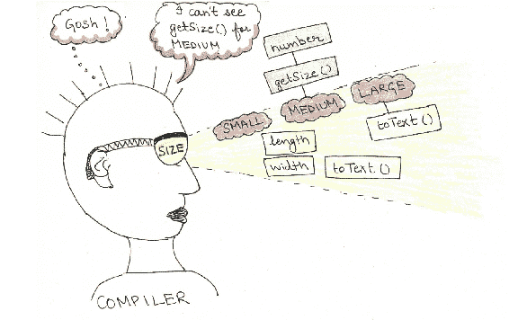
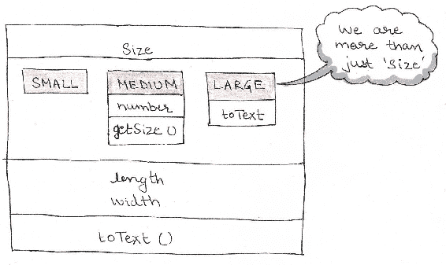

# 第八章：Project Amber 中的增强枚举

在 Java 5 中，枚举引入了一种强大的方式来定义有限和预定义的常量集，具有类型安全。枚举使您能够定义一个新的类型（如类或接口），具有状态和行为。**Project Amber** 正在增强枚举，将其提升到下一个层次；通过添加类型变量（泛型）并允许对枚举进行更严格的类型检查。这两个特性将使枚举具有常量特定的类型信息和常量特定的状态和行为。这些增强将减少将枚举重构为类以使用泛型的需求。

在本章中，我们将涵盖以下主题：

+   增强枚举的原因是什么？

+   为枚举常量添加状态和行为

+   如何创建泛型枚举？

+   访问特定常量的状态和行为

+   对枚举常量执行更严格的类型检查

+   挑战

# Java 5 中枚举的介绍

**枚举**为常量的使用引入了类型安全，这些常量之前是用静态最终变量定义的，例如 `int` 类型或其他类型。想象一下将衬衫的尺寸限制为一些预定义的尺寸，比如 `Small`、`Medium` 或 `Large`。以下是使用枚举（例如 `Size`）来实现这一点的示例：

```java
enum Size {SMALL, MEDIUM, LARGE} 
```

Java 的编码规范建议使用大写字母来定义枚举常量（如 `SMALL`）。枚举常量中的多个单词可以使用下划线分隔。

这就是如何在类（例如 `Shirt`）中使用枚举 `Size` 来限制其尺寸为枚举 `Size` 中定义的常量：

```java
class Shirt { 
    Size size;              // instance variable of type Size 
    Color color; 

    Shirt(Size size, Color color) {      // Size object with Shirt instantiation 
        this.size = size; 
        this.color = color; 
    } 
} 
```

`Shirt` 类中类型为 `Size` 的实例变量限制了分配给它的值只能是 `Size.SMALL`、`Size.MEDIUM` 和 `Size.LARGE`。以下是如何使用枚举常量创建 `Shirt` 类实例的另一个类（例如 `GarmentFactory` 类）的示例：

```java
class GarmentFactory { 
    void createShirts() { 
        Shirt redShirtS = new Shirt(Size.SMALL, Color.red); 
        Shirt greenShirtM = new Shirt(Size.MEDIUM, Color.green); 
        Shirt redShirtL = new Shirt(Size.LARGE, Color.red); 
    } 
} 
```

枚举定义了一个具有预定义常量值的新类型。枚举为常量值添加了类型安全。

# 反编译枚举 – 背后的事情

每个用户定义的 `enum` 都隐式地扩展了 `java.lang.Enum` 类。在幕后，前面章节中定义的一行枚举 `Size`（`Size`）被编译成类似以下的内容：

```java
final class Size extends Enum                 // 'enum' converted to final class  
{ 
    public static final Size SMALL;           // variables to store  
    public static final Size MEDIUM;          // enum constants 
    public static final Size LARGE;           //  

    private static final Size $VALUES[];      // array of all enum constants 

    static 
    {                                // static initializer 
        SMALL = new Size("SMALL", 0);         // to initialize enum constants 
        MEDIUM = new Size("MEDIUM", 1);       // 
        LARGE = new Size("LARGE", 2);         // 
        $VALUES = (new Size[] {               // 
            SMALL, MEDIUM, LARGE              // & populate array of enum constants 
        }); 
    } 
    public static Size[] values() 
    { 
        return (Size[])$VALUES.clone();       // Avoiding any modification to  
    }                                // $VALUES by calling methods 
    public static Size valueOf(String s) 
    { 
        return (Size)Enum.valueOf(Size, s); 
    } 
    private Size(String s, int i) 
    { 
        super(s, i); 
    } 
} 
```

枚举是语法糖。编译器将你的枚举结构扩展为 `java.lang.Enum` 以创建一个类。它添加了变量、初始化器和方法以获得所需的行为。

# 为枚举常量添加状态和行为

枚举常量可以有自己的状态和行为。实现这一点的其中一种方法是在枚举中定义实例变量和方法。所有这些都可以被枚举常量访问。让我们修改上一节中定义的枚举 `Size`，给它添加状态和行为。

每个枚举常量都可以定义一个常量特定的类体 - 定义新的状态和行为或覆盖它所定义的枚举方法的默认行为。以下是一个示例：

```java
enum Size { 
    SMALL(36, 19), 
    MEDIUM(32, 20) {               // Constant specific class body  
        int number = 10;                    // variable specific to MEDIUM 
        int getSize() {                     // method specific to MEDIUM 
            return length + width; 
        } 
    }, 
    LARGE(34, 22) { 
        @Override  
        public String toText() {            // overriding method toText for  
            return "LARGE";                 // constant LARGE 
        } 
    }; 

    int length;                             // instance variable accessible 
    int width;                              // to all enum constants 

    Size(int length, int width) {           // enum constructor; accepts length 
        this.length = length;               // and width 
        this.width = width; 
    } 

    int getLength() {                       // method accessible to all enum 
        return length;                      // constants 
    } 

    int getWidth() {                        // method accessible to all enum 
        return width;                       // constants 
    }  

    public String toText() {              // method accessible to all enum 
        return length + " X " + width;      // constants 
    } 
} 
```

在前面的例子中，枚举 `Size` 定义了三个枚举常量 - `SMALL`、`MEDIUM` 和 `LARGE`。它还定义了实例变量（`length` 和 `breadth`）、构造函数和 `getLength()`、`getWidth` 和 `toText()` 方法。

# 访问枚举常量的状态和行为

目前，枚举常量可以访问：

+   所有枚举常量共有的状态和行为

+   由枚举常量重写的方法

对于在前面部分定义的 `Size` 枚举，你可以按照以下方式访问所有枚举常量共有的状态和行为：

```java
System.out.println(Size.SMALL.toText());  // toString is defined for all constants 
```

上述代码输出：

```java
36 X 19 
```

你也可以访问特定枚举常量重写的行为：

```java
System.out.println(Size.LARGE.toText()); 
```

上述代码输出：

```java
LARGE 
```

但是，你不能访问特定于枚举常量的状态或行为：

```java
System.out.println(Size.MEDIUM.number);          // Doesn't compile 
System.out.println(Size.MEDIUM.getSize());       // Doesn't compile 
```

使用 `MEDIUM` 常量无法访问 `getSize()` 方法或 `number` 变量。这是因为，`MEDIUM` 创建了一个匿名类并覆盖了 `Size` 枚举的方法。由于它仍然通过一个 `Size` 类型的变量引用，无法访问特定于常量的状态或行为，而这个变量没有定义它们。以下是一张图片来帮助你记住这一点：



现有的枚举不允许访问特定于枚举常量的状态或行为，因为这会创建一个匿名类来执行此操作。

# 访问枚举特定常量状态和行为的解决方案

解决这个问题并访问枚举常量特定成员的一种方法是为所有成员定义它们，但只允许使用特定成员（我知道，这是一个愚蠢的方法）。我有意移除了与展示如何实现此功能无关的代码：

```java
enum Size {
    SMALL(36, 19),
    MEDIUM(32, 20),
    LARGE(34, 22);
    int length; // instance variable accessible
    int width; // to all enum constants
    Size(int length, int width) { // enum constructor; accepts length
         this.length = length; // and width
         this.width = width;
    }
    int getSize() {
       if (this == MEDIUM)
         return length + width;
       else // throws runtime exception
         throw new UnsupportedOperationException(); // if used with constans
    } // other than MEDIUM
}

```

让我们尝试使用枚举常量访问方法 `getSize()`：

```java
System.out.println(MEDIUM.getSize());
System.out.println(LARGE.getSize());
```

上述代码的输出如下：

```java
52
```

线程异常 - `java.lang.UnsupportedOperationException`。

首先，添加不适用于所有枚举常量的代码（方法 `getSize()`）会破坏封装。在前面的例子中，我在主体中定义了 `getSize()`，而只有枚举常量 `MEDIUM` 需要这个方法。这既不理想，也不推荐。

将它与一个基类及其派生类的排列进行比较，并在基类中添加所有特定于不同派生类的行为。这对我来说听起来很疯狂。请不要在工作时尝试这样做。

不要在工作时尝试这个解决方案；它没有定义封装的代码。

# 另一个例子 - 使用枚举常量进行继承

这里是另一个枚举的例子，它通过将子类的实例传递给枚举构造函数与一组子类一起工作。为了说明这一点，我已经修改了 `Size` 枚举，我们从本章开始就一直使用它。以下是修改后的代码：

```java
class Measurement {}                      // base class 
class Small extends Measurement {         // derived class 
    String text = "Small";                // state specific to class Small 
} 
class Medium extends Measurement {        // derived class 
    public int getLength() {              // behavior specific to class Medium 
        return 9999; 
    } 
} 
class Large extends Measurement {}        // derived class 

enum Size {                                
    SMALL(new Small()),                   // constant created using Small instance 
    MEDIUM(new Medium()),                 // constant created using Medium instance 
    LARGE(new Large());                   // constant created using Large instance 

    private Measurement mObj;     // Measurement is base class of  
                                  // classes Small, Medium & Large 

    Size(Measurement obj) {       // wraps Measurement instance as an Enum instance 
        mObj = obj; 
    } 
    Measurement getMeasurement() { // get the wrapped instance 
        return mObj; 
    } 
} 
```

再次强调，你不能访问特定于枚举常量的代码的状态和行为。以下是一个例子：

```java
class Test1 { 
    public static void main(String args[]) { 
        var large = Size.LARGE; 
        System.out.println(large.getMeasurement().getLength()); // doesn't compile 
                                                  // the type of the variable used 
// to wrap the value of enum  
// constant is Measurement  
    } 
} 
```

增强枚举正是为了解决这个问题而出现的。JEP 301 通过添加类型变量或泛型来引入增强枚举。让我们在下一节中看看它是如何工作的。

# 向枚举添加泛型

让我们重写前面示例（列表 8.x）中的枚举代码，向枚举 `Size` 添加类型变量。以下是修改后的代码：

```java
enum Size <T extends Measurement> {      // enum with type parameter 
    SMALL(new Small()), 
    MEDIUM(new Medium()), 
    LARGE(new Large()); 

    private T mObj; 

    Size(T obj) { 
        mObj = obj; 
    } 
    T getMeasurement() { 
        return mObj; 
    } 
} 
```

```java
class Measurement {} 
class Small extends Measurement { 
    String text = "Small"; 
} 
class Medium extends Measurement {} 
class Large extends Measurement { 
    public int getLength() { 
        return 40; 
    } 
}
```

```java
class Measurement {} 
class Small extends Measurement { 
    String text = "Small"; 
} 
class Medium extends Measurement {} 
class Large extends Measurement { 
    public int getLength() { 
        return 40; 
    } 
} 

class Measurement {} 
class Small extends Measurement { 
    String text = "Small"; 
} 
class Medium extends Measurement {} 
class Large extends Measurement { 
    public int getLength() { 
        return 40; 
    } 
} 
```

以下代码可以用来访问特定常量的行为，如下所示：

```java
var large = Size.LARGE; 
System.out.println(large.getMeasurement().getLength());  
```

在增强枚举（添加了泛型）的情况下，你将能够访问枚举常量的特定状态或行为。

让我们再来看一个通用枚举的例子，它可以用来限制用户数据到某些类型。

以下示例创建了一个泛型枚举 `Data`，它可以传递一个类型参数 `T`：

```java
public enum Data<T> { 
    NAME<String>,                // constants of generic  
    AGE<Integer>,                // enum Data 
    ADDRESS<Address>; 
} 
```

`FormData` 类定义了一个泛型方法，它可以接受枚举 `Data` 的常量以及用于枚举常量的相同类型的值：

```java
public class FormData { 
    public <T> void add(Data<T> type, T value) { 
        //..code 
    } 
} 
```

以下是使用枚举 `Data` 的常量来限制传递给 `add` 方法的值类型的组合的方法：

```java
FormData data = new FormData(); 
data.add(Data.NAME, "Pavni");            // okay; type of NAME and Pavni is String 
data.add(Data.AGE, 22);                  // okay; type of AGE and 22 is Integer 
data.add(Data.ADDRESS, "California");    // Won't compile. "California"  
                                         // is String, not Address instance 
```

在数据不匹配的情况下，代码将在编译时失败，这使得开发者更容易纠正她的假设或程序流程。

编译错误总是比运行时异常要好。使用泛型枚举 `Data` 将使代码在编译时失败，对于传递给 `add()` 的值组合不匹配。

# 枚举常量的更精确类型化

增强枚举的两个主要目标之一是执行枚举的更精确类型检查。目前，所有枚举常量的类型是它们定义的枚举。参考我们的枚举示例 `Size`，这本质上意味着所有枚举常量的类型，即 `SMALL`、`MEDIUM` 和 `LARGE`，是 `Size`，这是不正确的（如下面的图像所示）：



尽管枚举常量可以定义特定于常量的类体，包括变量和方法，但常量类型不够精确，无法访问特定于枚举常量的值。即使在泛型枚举的情况下，枚举常量的静态类型也不够精确，无法捕获个别常量的完整类型信息。

# 摘要

在本章中，你从 Java 5 中枚举如何引入类型安全到常量开始。你了解了枚举可以拥有状态和行为，不仅仅是适用于枚举中所有常量的行为；还可以是特定于常量的。然而，使用现有的枚举无法访问特定于枚举常量的状态和行为。

你了解了增强枚举如何使用泛型并允许访问特定于常量的状态和行为。通过示例，你也了解了当类型参数添加到枚举中时，如何促进枚举常量的更精确类型化。
