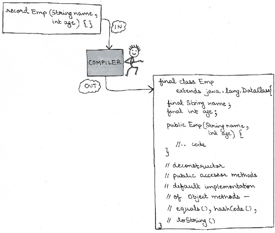
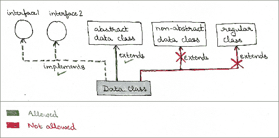
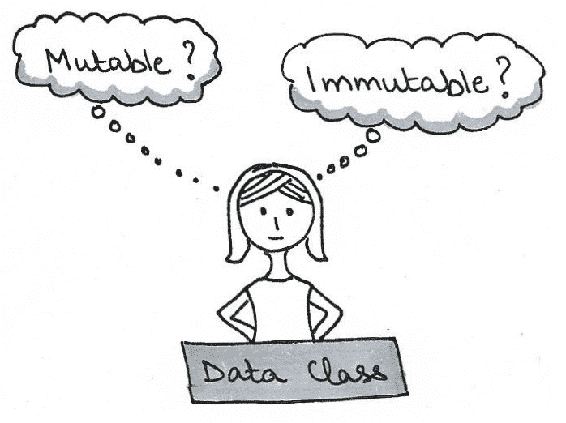

# 数据类及其用法

在 Project Amber 项目中，正在对数据类进行工作。它提议通过引入具有关键字 record 的特殊类，为开发者提供一种简化的方式来建模数据作为数据。数据类的状态可以通过类头来捕获，这与现有的**普通 Java 对象**（**POJO**）目前提供的功能形成鲜明对比。

在本章中，我们将涵盖以下主题：

+   数据类的介绍

+   数据类的必要性及其局限性

+   数据类的聚合和展开形式

+   数据类与模式匹配

+   抽象数据类和接口的继承

+   添加变量和方法

+   覆盖默认行为

# 数据类的介绍

我们知道有两种版本的数据类——POJO（旧的和现有的方式）以及新提议的数据类。为了欣赏在 Project Amber 下进行工作的数据类，你需要了解现有 POJO 类的功能和局限性，以及为什么我们需要新提议的数据类。

POJO 不是使用语言结构实现的。拟议的数据类将包括对编程语言的更改或添加。

# 什么是数据类

作为 Java 开发者，你可能已经在你的某些或所有项目中使用并创建了 POJO。这是一个封装了一组数据的类，没有额外的行为来操作其状态。它通常包括构造函数、访问器、修改器和从对象类继承的覆盖方法，即——`hashCode()`、`equals()`和`toString()`。访问器和修改器允许访问和分配状态变量。此外，修改器可能包括检查分配给实例状态的值范围的代码。以下是一个示例：

```java
final class Emp { 
    private String name; 
    private int age; 

    public Emp(String name, int age) { 
        this.name = name; 
        this.age = age; 
    } 

    // accessor methods - getName, getAge 
    public String getName() { 
        return name; 
    } 

    public int getAge() { 
        return age; 
    } 

    // mutator methods - setName, setAge 
    public void setName() { 
        this.name = name; 
    } 

    public void setAge() { 
        this.age = age; 
    } 

    public boolean equals(Object obj) { 
        if (obj == null || (!(obj instanceof Emp))) 
            return false; 
        else { 
            if ( ( ((Emp)obj).getName().equals(this.name) && 
                 ( ((Emp)obj).getAge() ) == this.age)) { 
                return true; 
            } 
            else 
                return false; 
        } 
    } 

    public String toString() { 
        return name + ":" + age; 
    } 
    public int hashCode() { 
        // ..code 
    } 
} 
```

其中一个案例是使用`Emp`类将员工数据保存到您的数据库中。以下是一个示例：

```java
interface EmpDAO { 
    Emp read(); 
    void write(Emp emp); 
    List<Emp> getAllEmp(); 
} 
```

同样，您也可以使用`Emp`类将消息传递过去，通过网络发送，将其插入 JSON 对象，等等。

这看起来都很好。更重要的是，自从 Java 被引入开发者以来，这一直工作得很好。那么，问题是什么？

# 添加数据类到语言中的必要性

想象一下保卫一个国家的边境。通常的做法是由国防部队来守卫。安全水平是否会根据邻国之间的关系（友好、中立或紧张）而改变？如果边境是渗透的，或者说，例如，像西欧对申根国那样，会发生什么？现在，将保卫一个国家的边境与保卫我们的家园或，比如说，保卫房间里一个柜子的内容进行比较。

尽管前面示例中的每个实例都在谈论实体的安全性和其免受物理攻击的保护，但它们都有不同的需求。

类似地，到目前为止，Java 中的类被用来模拟广泛的需求。虽然这对于很多情况来说效果很好，但对于某些情况则不适用。如果你想使所有的大小都适合，你将需要对大多数进行调整。以下图像显示了使用相同裤子尺寸为身高和腰围各不相同的人穿裤子的情况：


在过去，枚举被添加到 Java 语言中（版本 5）。尽管一个类可以被编程来创建原始类型或对象的枚举，但枚举简化了开发者的过程。

枚举减少了开发者的编码工作。同时，它使枚举的意图对用户来说更加明确

在前面的章节中，`Emp` POJO 只是一个数据的载体。然而，为了让一个类表现得像一个数据类，需要开发者定义多个方法——构造函数、访问器、修改器以及从对象类中来的其他方法。你可能会争辩说你可以使用 IDE 轻松地为你的类生成所有这些方法。你说得对！而且这样做很简单。

但它只关注代码的编写部分。对于类的用户来说，代码的阅读情况如何呢？作为开发者，我们都明白一段代码可能只编写一次，但它会被多次阅读。这就是为什么经验丰富的程序员强调良好的编码实践，以便理解、阅读和维护代码。

当数据类的定义被引入到语言中时，代码的读者就会知道它仅仅是一个数据类的明确意图。开发者不需要深入挖掘代码，寻找除了作为数据类之外的其他代码，这样他们就不会错过任何重要信息。

它还将防止开发者使用半成品类作为数据类。有时开发者倾向于使用可能不包括所有相关方法（如`equals()`或`hashCode()`）的类作为数据类，但这确实是在应用程序中插入细微错误的良方。像`Map`这样的集合类需要类实现其`equals()`和`hashCode()`方法才能正常高效地工作。

通过语言的变化引入数据类将减少语言的冗长性，向所有人传达结构的目的。

# 深入了解数据类

定义数据类的语法看起来很简单。然而，语法和语义都很重要。

# 一个例子

让我们从重新定义`Emp`类开始，这是我们在本章开头使用的，将其定义为数据类：

```java
record Emp(String name, int age) { }      // data class - one liner code 
```

前面的代码使用关键字`record`来定义数据类，接受逗号分隔的变量名和类型，这些是存储状态所必需的。编译器会自动为数据类生成默认实现 Object 方法（`equals()`、`hashCode()`、`toString()`）。

代码看起来清晰且紧凑。读者会立即知道这一行代码的意图，这是一个携带数据`name`（类型`String`）和`age`（类型`int`）的数据载体。对读者来说另一个优点是，她不需要阅读构造函数、访问器、修改器或对象类的其他方法，只需确认它们正在做它们应该做的事情，不多也不少，这是他们应该知道的。

在幕后，Java 编译器将记录类`Emp`转换为以下形式：

```java
final class Emp extends java.lang.DataClass { 
    final String name; 
    final int age; 

    public Emp(String name, int age) { 
        this.name = name; 
        this.age = age; 
    } 

    // deconstructor 
    // public accessor methods 
    // default implementation of equals, hashCode, and toString 
} 
```

前面的数据类是一个非抽象数据类的示例。数据类也可以定义为抽象数据类。非抽象数据类隐式为最终类。在两种情况下，数据类都会获得`hashCode()`、`equals()`和`toString()`以及访问器方法的默认实现。对于抽象数据类，构造函数将是受保护的。

在以下图像中，编译器很高兴将数据类的单行代码转换为完整的类：



数据类隐式为最终类。

# 数据类的聚合形式和展开形式

数据类的聚合形式将是数据类的名称。其展开形式将指的是用于存储其数据的变量。从聚合到展开形式的转换也被称为解构模式。

参考我们前节中使用的示例：

```java
record Emp(String name, int age) { }       
```

`Emp`是数据类`Emp`的聚合形式。其展开形式将是`String name`和`int age`。语言需要在这两者之间提供简单的转换，以便它们可以与其他语言结构，如`switch`一起使用。

解构模式指的是将数据类从聚合形式转换为展开形式。

# 局限性

当你使用关键字`record`来定义你的数据类时，你将受到语言允许你做什么的限制。你将不再能精细控制你的数据类是否可扩展，其状态是否可变，你是否可以控制分配给字段值的范围，字段的可访问性。在添加额外字段或多个构造函数方面，你也可能受到限制。

数据类在 Oracle 仍在开发中。更详细的内容仍在完善中。就在一个月前，关键字`datum`被用来定义数据类，现在已改为`record`。

现在，开发者不再局限于使用单一编程语言。Java 程序员通常使用，或者了解在 JVM 上运行的 Scala、Kotlin 或 Groovy 等其他编程语言。使用不同语言的体验带来了对数据类（使用`record`定义）的能力和限制的许多期望和假设。

# 过去的例子——定义枚举的变化

在枚举引入之前，开发者经常使用`public`、`static`和`final`变量来定义常量。例如：

```java
class Size { 
    public final static int SMALL = 1; 
    public final static int MEDIUM = 2; 
    public final static int LARGE = 3; 
} 
```

使用`public`、`static`、`final`、`int`变量的主要缺点是类型安全，任何`int`值都可以分配给类型为`int`的变量，而不是`Size.SMALL`、`Size.MEDIUM`或`Size.LARGE`常量。

Java 5 引入了枚举，这是语言结构的补充，使开发者能够定义常量的枚举。以下是一个快速示例：

```java
enum Size {SMALL, MEDIUM, LARGE} 
class SmallTShirt { 
    Size size = Size.SMALL; 
    //..other code 
} 
```

使用类型为`Size`的变量时，赋值限于`Size`中定义的常量。枚举是语言如何以一定的约束为代价简化模型实现的完美示例。枚举限制了可扩展性到接口。除此之外，枚举是完整的类。作为开发者，你可以向其添加状态和行为。另一个好处是枚举也可以在`switch`结构中使用，这之前仅限于原始类型和`String`类。

新的语言结构就像一种新的人际关系——无论是生物学上的还是其他方面的。它有自己的快乐和悲伤。

# 使用数据类进行模式匹配

当你使用`record`关键字定义你的数据类时，你将获得转换数据类聚合和展开形式的额外优势。例如，以下是 switch 语句如何展开数据的示例：

```java
interface Garment {} 
record Button(float radius, Color color); 
record Shirt(Button button, double price); 
record Trousers(float length, Button button, double price); 
record Cap(..) 

switch (garment) { 
     case Shirt(Button(var a1, var a2), Color a3): ... 
     case Trousers(float a1, Button(var a2, var a3), double a4): ... 
     .... 
} 
```

switch 语句可以使用数据类，而不必使用其展开形式。以下也是可以的：

```java
switch (garment) { 
     case Shirt(Button a1, Color a2): ... 
     case Trousers(float a1, Button a2, double a3): ... 
     .... 
}  
```

# 封装状态

记录类封装了字段，提供了 JavaBean 风格访问器的默认实现（设置字段值的公共方法）。值可以在数据类实例初始化期间分配，使用其构造函数。

# 数据类和继承

目前，提议拒绝以下继承情况：

+   数据类扩展常规类

+   常规类扩展数据类

+   数据类可以扩展另一个数据类

允许上述任何一种情况都会违反数据类作为数据承载者的契约。目前，为数据类及其与接口和抽象数据类的继承提出以下限制：

+   非抽象和抽象数据类可以扩展其他抽象数据类

+   抽象或非抽象数据类可以扩展任何接口（s）。

以下图像总结了这些继承规则。



让我们从定义一个抽象数据类开始。

# 扩展抽象数据类

在以下示例中，`Emp`抽象数据类正被非抽象数据类`Manager`扩展：

```java
abstract record Emp(String name, int age); 
record Manager(String name, int age, String country) extends Emp(name, age); 
```

当非抽象数据类扩展抽象数据类时，它接受其头部的所有数据，包括为其自身和其基类所必需的数据。

数据类可以扩展单个抽象数据类。

# 实现接口

数据类可以实现接口及其抽象方法，或者只是继承其默认方法。以下是一个示例：

```java
interface Organizer {} 
interface Speaker { 
   abstract void conferenceTalk(); 
} 

abstract record Emp(String name, int age); 

record Manager(String name, int age, String country)  
   extends Emp(name, age)  
   implements Organizer; 

record Programmer(String name, int age, String programmingLang)  
   extends Emp(name, age)  
   implements Organizer, Speaker { 
        public void conferenceTalk() { 
            //.. code 
        } 
    }; 
```

数据类可以实现单个或多个接口。

# 额外变量

虽然允许，但在向数据类添加变量或字段之前，请自问——*字段是否来源于状态？* 不来源于状态的字段，对数据类初始概念的严重违反。以下是一个示例，它定义了一个额外的字段`style`，该字段来源于数据类`Emp`的状态：

```java
record Emp(String name, int age) { 
    private String style; 
    Emp(String name, int age) { 
        //.. initialize name and age 
        if (age => 15 && age =< 30) style = "COOL"; 
        else if (age >= 31 && age <= 50) style = "SAFE"; 
        else if (age >= 51) style = "ELEGANT"; 
    } 
    public String getStyle() { 
        return style; 
    } 
} 
```

上述代码表现良好，因为数据类`Emp`的状态仍然来源于其状态（字段`name`和`age`）。`getStyle`方法不会干扰`Emp`的状态，它纯粹是实现细节。

# 覆盖隐式行为

假设你希望在数据类实例化期间限制可以传递给其字段的值。这是可行的，只需覆盖默认构造函数。以下是一个示例：

```java
record Emp(String name, int age) { 
    // override default constructor 
    @Override 
    public Emp(String name, int age) { 
        // validate age 
        if (age > 70) 
            throw new IllegalArgumentException("Not employable above 70 years"); 
        else { 
            // call default constructor 
            default.this(name, age); 
        } 
    } 
} 
```

同样，你也可以覆盖对象方法的默认实现，如`equals()`、`hashCode()`和`toString()`以及其他访问器方法。

覆盖数据类方法的默认行为并不会违背其创建的目的。它们仍然作为数据类工作，对它们的工作有更精细的控制。让我们将其与之前用于建模数据类的 POJOs 进行比较。编译器不会为 POJO 自动生成任何方法。因此，用户仍然需要阅读所有代码，寻找不是其方法默认实现的代码。在数据类的情况下，这种覆盖行为非常明确。因此，用户不必担心阅读所有代码，他/她可以假设行为有默认实现，该实现尚未被开发者覆盖。

明确地覆盖行为说明了数据类偏离其默认行为的地方，从而减少了用户阅读代码以理解其行为所需的代码量。

# 额外的方法和构造函数

编译器为数据类生成默认构造函数、访问器方法和从对象类继承的方法的默认实现。开发者可以覆盖构造函数并向数据类添加更多方法：

```java
record Emp(String name, int age) { 
    // overloading constructor 
    public Emp(String name, String style) { 
            this.name = name; 
            if (style.equals("COOL") age = 20; 
            else if (style.equals("SAFE") age = 30; 
            else if (style.equals("ELEGANT") age = 50; 
            else age = 70; 
        } 
    } 
    public String fancyOutput() {                 // additional method 
        return "My style is COOL"; 
    } 
} 
```

# 可变性

关于数据类是否应指定为可变或不可变的工作仍在进行中。两者都有其自身的优缺点。不可变数据在多线程、并行或并发系统中表现良好。另一方面，可变数据也是数据。可变数据适用于需要频繁修改数据的情况。以下图像展示了这种混淆：



# 线程安全

由于数据类尚未指定为不可变，开发者有责任在使用它们时确保线程安全配置。

# 摘要

数据类提议为开发者提供一种简单简洁的方式来模型化数据作为数据。它将包括通过引入关键字 record 的语言变化。Oracle 对数据类的工作仍在进行中。提议的数据类与现有的 POJOs 不同，POJOs 是完整的类，开发者将其建模为数据类。数据类将使用关键字 record 在其类头中封装数据。

到目前为止，类已经被用来模型化和实现广泛的需求。尽管这已经工作得很好，但它确实需要在某些地方做额外的工作，那里的成本远远超过了它提供的利益。通过过去的例子（枚举），你已经了解了添加一个功能如何使开发者能够以简洁的方式定义实体，但可能会失去一些更精细的控制。同样，数据类提供了一种简化封装一组数据的方式。

你已经了解了数据类的必要性及其在减少任何开发者需要阅读的代码中的重要性。数据类的主要目标是模型化数据作为数据，而不是减少样板代码。

Java 平台提供了访问数据类状态的方法、默认构造函数以及类对象方法（`equals()`、`hashCode()`和`toString()`）的默认实现。你可以在数据类中添加字段或行为（包括构造函数），并且也可以覆盖所有方法的默认实现。数据类可以被定义为抽象的。它们可以扩展抽象类并实现接口。

你已经了解了数据类的聚合形式和展开形式。数据类可以与其他语言结构，如 switch 一起使用。

默认情况下，数据类是不可变的，包括定义为数据成员的数组。由于这些结构不是不可变的，当与它们一起工作时，开发者必须包含代码以确保线程安全。
