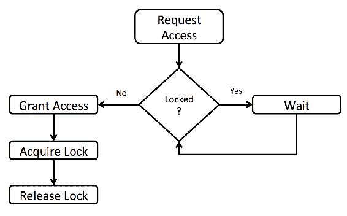
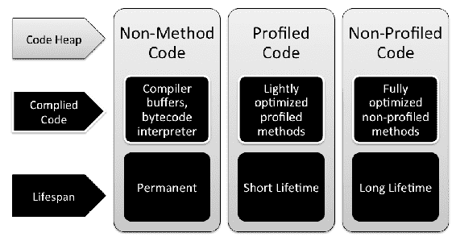
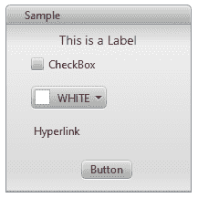
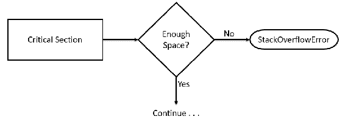
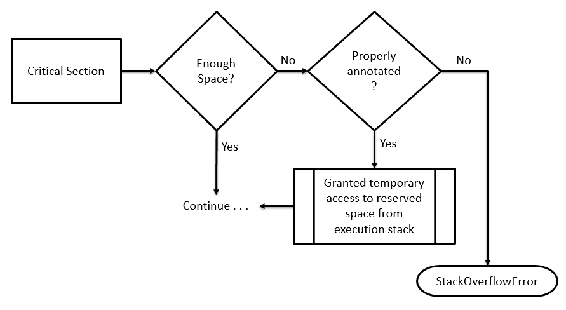

# 第三章：探索 Java 9

Java 9 是一个重大版本，包含对 Java 平台的大量内部更改。这些内部更改共同代表了一组巨大的新可能性，对于 Java 开发者来说，这些可能性有些来自开发者的请求，有些来自 Oracle 启发的增强。在本章中，我们将回顾 26 项最重要的更改。每个更改都与一个**JDK 增强提案**（**JEP**）相关。JEPs 被索引并托管在[openjdk.java.net/jeps/0](http://openjdk.java.net/jeps/0)。你可以访问这个网站获取每个 JEP 的更多信息。

JEP 项目是 Oracle 对开源、开放创新和开放标准支持的一部分。虽然可以找到其他开源 Java 项目，但 OpenJDK 是 Oracle 唯一支持的项目。

在本章中，我们将介绍 Java 平台的变化。这些变化具有几个令人印象深刻的含义，包括：

+   堆空间效率

+   内存分配

+   编译过程改进

+   类型测试

+   注解

+   自动化运行时编译器测试

+   改进的垃圾收集

# 在 Java Shell 中玩耍

很长一段时间以来，Java 编程语言没有提供标准的 shell 来实验新的语言特性或库，或者用于快速原型设计。如果你想要这样做，你可以编写一个带有 main 方法的测试应用程序，使用`javac`编译它，然后运行。这可以在命令行或使用 Java IDE 完成；然而，在这两种情况下，这都不如拥有一个交互式 shell 那么方便。

在 JDK 9 中启动交互式 shell 就像运行以下命令一样简单（假设你的 JDK 9 安装的`bin`目录在当前路径中）：

```java
jshell
```

你可能会觉得有些困惑，为什么交互式 shell 没有在 Java 平台早期版本中引入，因为许多编程语言，如 Python、Ruby 以及其他一些语言，在它们的早期版本中已经包含了交互式 shell；然而，这仍然没有成为早期 Java 版本优先功能列表的一部分，直到现在，它已经出现并准备好使用。Java shell 利用了 JShell API，该 API 提供了一组功能，包括自动完成或评估表达式和代码片段等。

# 控制外部进程

使用 JDK 9 之前，如果您想创建一个 Java 进程并处理进程的输入/输出，您必须使用 `Runtime.getRuntime.exec()` 方法，该方法允许我们在单独的操作系统进程中执行一个命令，并获取一个 `java.lang.Process` 实例，通过它提供某些操作来管理外部进程，或者使用新的 `java.lang.ProcessBuilder` 类，它在与外部进程交互方面提供了一些增强，并创建一个 `java.lang.Process` 实例来表示外部进程。这两种机制都不灵活，也不可移植，因为外部进程执行的命令集高度依赖于操作系统（需要付出额外的努力才能使特定的进程操作在多个操作系统之间可移植）。有一个章节专门介绍新的进程 API，为开发者提供创建和管理外部进程的更简单方式的知识。

# 使用 G1 提升性能

G1 垃圾收集器已经在 JDK 7 中被引入，现在在 JDK 9 中默认启用。它针对的是具有多个处理核心和大量可用内存的系统。与之前的垃圾收集器类型相比，G1 的优势是什么？它是如何实现这些改进的？是否需要手动调整它，以及在什么场景下？这些问题以及更多关于 G1 的问题将在单独的章节中讨论。

# 使用 JMH 测量性能

在许多情况下，Java 应用程序可能会遭受性能下降。加剧这个问题的是缺乏性能测试，这些测试至少可以提供一组保证，即满足性能要求，而且某些功能的性能不会随时间退化。测量 Java 应用程序的性能并不简单，特别是由于存在许多可能影响性能统计信息的编译器和运行时优化。因此，必须使用额外的措施，如预热阶段和其他技巧，以提供更准确的性能测量。Java Microbenchmark Harness 是一个框架，它结合了多种技术，并附带一个方便的 API，可用于此目的。它不是一个新工具，但它包含在 Java 9 的发行版中。如果您还没有将 JMH 添加到您的工具箱中，请阅读关于在 Java 9 应用程序开发中使用 JMH 的详细章节。

# 开始使用 HTTP 2.0

HTTP 2.0 是 HTTP 1.1 协议的继任者，这个新版本的协议解决了之前版本的一些局限性和缺点。HTTP 2.0 通过多种方式提高了性能，并提供了诸如在单个 TCP 连接中进行请求/响应多路复用、服务器推送响应、流量控制和请求优先级等功能。

Java 提供了`java.net.HttpURLConnection`实用工具，可用于建立非安全的 HTTP 1.1 连接。然而，该 API 被认为难以维护，并且随着对 HTTP 2.0 的支持，进行了进一步的扩展。因此，引入了一个全新的客户端 API，以便通过 HTTP 2.0 或 WebSocket 协议建立连接。新的 HTTP 2.0 客户端及其提供的功能将在单独的章节中介绍。

# 涵盖响应式编程

响应式编程是一种用于描述系统变化传播特定模式的范式。响应性不是 Java 本身固有的，但可以使用第三方库如 RxJava 或 Reactor 项目（Spring 框架的一部分）建立响应式数据流。JDK 9 还通过提供`java.util.concurrent.Flow`类来满足开发围绕响应式流概念构建的高响应性应用程序的 API 需求。`Flow`类以及 JDK 9 中引入的其他相关更改将在单独的章节中介绍。

# 扩展愿望清单

除了 JDK 9 中的所有新特性外，平台未来版本预计还将引入一系列全新的功能。其中一些包括：

+   **原始类型上的泛型**：这是 JDK 10 计划中 Valhalla 项目的一部分特性。其他语言增强，如值处理，已经是 Java 9 的一部分，将在本书的后续章节中介绍。

+   **具现泛型**：这是 Valhalla 项目的一个特色部分，旨在提供在运行时保留泛型类型的能力。相关目标如下：

    +   外部功能接口旨在引入一个新的 API 来调用和管理本地函数。该 API 解决了 JNI 的一些缺点，特别是对于应用开发者来说缺乏简单性。外部功能接口是作为 JDK 生态系统中的 Panama 项目的一部分开发的。

    +   新的货币和货币 API（在 JSR 354 下开发）最初计划在 Java 9 中推出，但已推迟。

    +   新的轻量级 JSON API（在 JSR 353 下开发）也计划在 Java 9 中推出，但已推迟到 Java 10。

这些只是 JDK 后续版本中可能期待的一些新特性。Penrose 项目旨在弥合 Java 模块系统与 OSGi 模块系统之间的差距，并为两个系统之间的互操作性提供不同的方法。

Graal VM 是另一个有趣的研究项目，它可能是 Java 平台后续版本的一个潜在候选者。它的目标是提高 Java 的运行时性能，使其达到动态语言如 JavaScript 或 Ruby 的水平。

专门讨论 JDK 未来的章节详细讨论了所有这些点。

# 摘要

在本简要的介绍章节中，我们揭示了由 JDK 9 提供的强大功能的小宇宙。在这个平台版本中引入的模块系统无疑是 Java 应用程序开发的一个基石。我们还发现，JDK 9 中引入了许多其他重要特性和变更，这些特性和变更值得特别关注，将在后续章节中详细讨论。

在下一章中，我们将探讨 Java 平台的 26 个内部变更。

# 改进的竞争锁 [JEP 143]

JVM 使用堆空间来存储类和对象。每当创建一个对象时，JVM 都会在堆上分配内存。这有助于促进 Java 的垃圾回收，它释放了之前用于存储不再有引用的对象的内存。Java 栈内存有些不同，通常比堆内存小得多。

JVM 在管理多个线程共享的数据区域方面做得很好。它将监视器与每个对象和类关联；这些监视器有锁，在任何时候都由一个线程控制。这些由 JVM 控制的锁，本质上是在给予控制线程对象监视器的权限。

那么，什么是竞争锁？当一个线程正在等待当前已锁定对象的队列中时，它就被说成是在竞争该锁。以下图展示了这一竞争的高级视图：



如前图所示，任何等待的线程在对象被释放之前都不能使用被锁定的对象。

# 改进目标

JEP 143 的一般目标是提高 JVM 管理锁定 Java 对象监视器竞争的整体性能。竞争锁的改进全部在 JVM 内部进行，并且不需要任何开发者的行动来从中受益。整体改进目标与更快操作相关。这包括：

+   更快的监视器进入

+   更快的监视器退出

+   更快的通知

通知是当对象锁定状态改变时调用的 `notify()` 和 `notifyAll()` 操作。测试这一改进并不是一件容易的事情。在任何级别上的更高效率都是受欢迎的，因此，即使没有容易观察到的测试，这一改进也是我们可以感激的。

# 分段代码缓存 [JEP 197]

分段代码缓存 JEP (197) 升级已完成，并导致更快的、更高效的执行时间。这一变化的核心理念是将代码缓存分割成三个不同的部分——非方法、已分析和未分析代码。

代码缓存是 Java 虚拟机存储生成的本地代码的内存区域。

如前所述的代码缓存分段将包含特定类型的编译代码。如以下图所示，代码堆区域按编译代码的类型进行分段：



# 内存分配

包含非方法代码的代码堆是用于 JVM 内部代码的，由一个 3MB 的固定内存块组成。其余的代码缓存内存平均分配给已分析代码和非分析代码段。你可以通过命令行命令来控制这一点。

以下命令可以用来定义非方法编译代码的代码堆大小：

```java
-XX:NonMethodCodeCodeHeapSize
```

以下命令可以用来定义已分析编译方法的代码堆大小：

```java
-XX:ProfiledCodeHeapSize
```

以下命令可以用来定义非分析编译方法的代码堆大小：

```java
-XX:NonProfiledCodeHeapSize
```

这个 Java 9 特性确实有助于提高 Java 应用程序的效率。它还影响了使用代码缓存的其他进程。

# 智能 Java 编译，第二阶段 [JEP 199]

JDK 增强提案 199 旨在改进代码编译过程。所有 Java 开发者都将熟悉用于将源代码编译成字节码的**javac**工具，这是 JVM 运行 Java 程序所使用的。**智能 Java 编译**，也称为 Smart Javac 和**sjavac**，在 javac 进程周围添加了一个*智能*包装。sjavac 可能带来的核心改进是只重新编译必要的代码。在这个上下文中，必要的代码是指自上次编译周期以来已更改的代码。

如果开发者只在小项目上工作，这个增强可能不会让他们感到兴奋。然而，考虑到在中等和大型项目中你不得不不断重新编译代码时在效率上的巨大提升，开发者可以节省的时间足以让他们接受 JEP 199。

这将如何改变你编译代码的方式？可能不会，至少目前不会。Javac 将继续作为默认编译器。虽然 sjavac 在增量构建方面提供了效率，但 Oracle 认为它没有足够的稳定性成为标准编译工作流程的一部分。

你可以在此处阅读有关智能 javac 包装工具的更多信息：[`cr.openjdk.java.net/~briangoetz/JDK-8030245/webrev/src/share/classes/com/sun/tools/sjavac/Main.java-.html`](http://cr.openjdk.java.net/~briangoetz/JDK-8030245/webrev/src/share/classes/com/sun/tools/sjavac/Main.java-.html)。

# 解决 Lint 和 Doclint 警告 [JEP 212]

如果你对 Java 中的 Lint 或 Doclint 不熟悉，请不要担心。正如标题所示，它们是向 javac 报告警告的来源。让我们逐一看看：

+   **Lint**分析 javac 的字节码和源代码。Lint 的目标是识别正在分析代码中的安全漏洞。Lint 还可以提供关于可扩展性和线程锁定问题的见解。Lint 还有更多功能，其总体目的是节省开发者的时间。

你可以在此处了解更多关于 Lint 的信息：[`en.wikipedia.org/wiki/Lint_(software)`](https://en.wikipedia.org/wiki/Lint_(software))。

+   **Doclint** 与 Lint 类似，且特定于 javadoc。Lint 和 Doclint 都在编译过程中报告错误和警告。这些警告的解决是 JEP 212 的重点。当使用核心库时，不应有任何警告。这种心态导致了 JEP 212，它已在 Java 9 中得到解决并实现。

可以在 [`bugs.openjdk.java.net`](https://bugs.openjdk.java.net) JDK Bug 系统中查看 Lint 和 Doclint 警告的完整列表。

# javac 的分层归因 [JEP 215]

JEP 215 代表了对 javac 类型检查架构进行简化的令人印象深刻的努力。让我们首先回顾一下 Java 8 中的类型检查是如何工作的；然后我们将探讨 Java 9 中的变化。

在 Java 8 中，多态表达式类型检查由一个**推测性归因**工具处理。

推测性归因是 javac 编译过程的一部分类型检查方法。它具有显著的处理开销。

使用推测性归因方法进行类型检查是准确的，但缺乏效率。这些检查包括参数位置，在递归、多态、嵌套循环和 lambda 表达式中测试时，速度呈指数级下降。因此，JEP 215 的目标是改变类型检查架构以创建更快的结果。使用推测性归因的结果本身并不不准确；只是生成速度不够快。

新的方法，随 Java 9 一起发布，使用分层归因工具。此工具为所有方法调用中的参数表达式类型检查实现分层方法。还允许方法重写。为了使此新架构工作，为以下列出的每种方法参数类型创建了新的结构化类型：

+   Lambda 表达式

+   多态表达式

+   正常方法调用

+   方法引用

+   钻石实例创建表达式

JEP 215 对 javac 的更改比本节所强调的更为复杂。除了更高效的 javac 和节省的时间外，对开发者的直接影响并不立即显现。

# 注解管道 2.0 [JEP 217]

Java 注解指的是位于您的 Java 源代码文件中的特殊类型的元数据。它们不会被 javac 移除，因此它们可以在运行时对 JVM 可用。

注解看起来与 JavaDocs 引用相似，因为它们以 `@` 符号开头。有三种类型的注解。让我们逐一检查：

+   最基本的注解形式是**标记**注解。这些是独立的注解，唯一的组件是动画的名称。以下是一个示例：

```java
        @thisIsAMarkerAnnotation
        public double computeSometing(double x, double y) 
        {
          // do something and return a double
        }
```

+   第二种类型的注解是包含一个*单个值*或数据的注解。正如您在以下代码中所看到的，以 `@` 符号开始的注解后面跟着包含数据的括号：

```java
        @thisIsAMarkerAnnotation (data="compute x and y 
         coordinates")
        public double computeSometing(double x, double y) 
        {
          // do something and return a double
        }
```

编码单值注解类型的另一种方法是省略 `data=` 组件，如下面的代码所示：

```java
        @thisIsAMarkerAnnotation ("compute x and y coordinates")
        public double computeSometing(double x, double y) 
        {
          // do something and return a double
        }
```

+   第三种类型的注解是当存在*多个数据组件*时。在这种类型的注解中，`data=`组件不能省略。以下是一个示例：

```java
        @thisIsAMarkerAnnotation (data="compute x and y 
         coordinates", purpose="determine intersecting point")
         public double computeSometing(double x, double y) 
         {
           // do something and return a double
         }
```

那么，Java 9 中有什么变化？要回答这个问题，我们需要回顾一下 Java 8 中引入的一些变化，这些变化影响了 Java 注解：

+   Lambda 表达式

+   重复注解

+   Java 类型注解

这些与 Java 8 相关的更改影响了 Java 注解，但并没有导致 javac 处理它们的方式发生变化。有一些硬编码的解决方案允许 javac 处理新的注解，但它们并不高效。此外，这种类型的编码（硬编码解决方案）难以维护。

因此，JEP 217 专注于重构 javac 注解管道。这次重构完全在 javac 内部进行，所以它不应该对开发者明显。

# 新的版本字符串方案 [JEP 223]

在 Java 9 之前，发布号没有遵循行业标准版本控制--**语义版本控制**。例如，在撰写本文时，最后四个 JDK 发布版是：

+   JDK 8 更新 131

+   JDK 8 更新 121

+   JDK 8 更新 112

**语义版本控制**使用主版本、次版本、补丁版本（0.0.0）的方案：

**主版本**等同于不向后兼容的新 API 变更。

**次版本**是指添加了向后兼容的功能。

**补丁**指的是向后兼容的错误修复或小更改。

Oracle 已经接受了 Java 9 及以后的语义版本控制。对于 Java，将使用**主版本-次版本-安全**方案来表示 Java 版本号的前三个元素：

+   **主版本**：包含一组重大新功能的重大版本

+   **次版本**：向后兼容的修订和错误修复

+   **安全**：被认为对提高安全性至关重要的修复

JEP 223 的这个描述可能会使版本控制方案看起来很基础。相反，已经开发了一套非常详细的规则和实践来管理未来的版本号。为了展示复杂性，请参见以下示例：

```java
    1.9.0._32.b19
```

# 自动生成运行时编译器测试 [JEP 233]

Java 可能是使用最广泛的编程语言，并且运行在日益多样化的平台上。这加剧了在高效方式下运行针对编译器的测试的问题。JEP 233 的目的是创建一个可以自动化运行时编译器测试的工具。

创建的工具首先生成一组随机的 Java 源代码和/或字节码。生成的代码将具有三个关键特征：

+   语法正确

+   语义正确

+   使用一个允许重用相同随机生成代码的随机种子

随机生成的源代码将被保存在以下目录中：

```java
    hotspot/test/testlibrary/jit-tester
```

这些测试用例将被存储以供以后重用。它们可以从`j-treg`目录或从工具的 makefile 中运行。重新运行保存的测试的好处之一是测试系统的稳定性。

# 测试由 Javac 生成的类文件属性 [JEP 235]

缺乏或能力不足创建用于类文件属性的测试是 JEP 235 的动力。目标是确保 javac 完全且正确地创建类文件的属性。这表明即使某些属性没有被类文件使用，所有类文件都应生成一个完整的属性集。还需要有一种方法来测试类文件是否正确创建，特别是关于文件的属性。

在 Java 9 之前，没有测试类文件属性的方法。运行一个类并测试代码以获得预期的结果是最常用的测试 javac 生成类文件的方法。这种技术不足以测试以验证文件的属性。

类文件属性有三个类别——JVM 使用的属性、可选属性和 JVM 未使用的属性。

JVM 使用的属性包括：

+   `BootstrapMethods`

+   `Code`

+   `ConstantValue`

+   `Exceptions`

+   `StackMapTable`

可选属性包括：

+   `Deprecated`

+   `LineNumberTable`

+   `LocalVariableTable`

+   `LocalVariableTypeTable`

+   `SourceDebugExtension`

+   `SourceFile`

JVM 未使用的属性包括：

+   `AnnotationDefault`

+   `EnclosingMethod`

+   `InnerClasses`

+   `MethodParameters`

+   `RuntimeInvisibleAnnotations`

+   `RuntimeInvisibleParameterAnnotations`

+   `RuntimeInvisibleTypeAnnotations`

+   `RuntimeVisibleAnnotations`

+   `RuntimeVisibleParameterAnnotations`

+   `RuntimeVisibleTypeAnnotations`

+   `Signature`

+   `Synthetic`

# 在 CDS 归档中存储内部字符串 [JEP 250]

存储和访问字符串以及从 **类数据共享**（**CDS**）归档中存储字符串的方法效率低下，耗时过多，且浪费内存。以下图示说明了 Java 在 CDS 归档中存储内部字符串的方法：


低效源于当前的存储架构。特别是当**类数据共享**工具将类导出到共享归档文件时，包含`CONSTANT_String`项的常量池具有 UTF-8 字符串表示形式。

UTF-8 是一个 8 位可变长度字符编码标准。

# 问题

在当前使用 UTF-8 的情况下，字符串必须转换为字符串对象，即 `java.lang.String` 类的实例。这种转换是按需进行的，可能会导致系统运行速度变慢和不必要的内存使用。处理时间非常短，但内存使用不能忽视。每个内部字符串中的字符至少需要 3 字节内存，可能还需要更多。

相关问题是存储的字符串对所有 JVM 进程不可访问。

# 解决方案

CDS 归档现在在堆上为字符串分配特定空间：


字符串空间是通过共享字符串表、哈希表和去重来映射的。

去重是一种数据压缩技术，它消除了归档中的重复信息。

# 为模块化准备 JavaFX UI 控件和 CSS API [JEP 253]

JavaFX 是一组允许设计和开发富媒体图形用户界面的包。JavaFX 应用程序为开发者提供了一个优秀的 API，用于创建应用程序的一致界面。**层叠样式表**（**CSS**）可以用来自定义界面。JavaFX 的伟大之处之一是编程和界面设计任务可以轻松分离。

# JavaFX 概述

有一个叫做 Scene Builder 的出色的可视化脚本工具，它允许您通过拖放和属性设置来创建图形用户界面。Scene Builder 生成必要的 FXML 文件，这些文件由您的**集成开发环境**（**IDE**）如 NetBeans 使用。

下面是使用 Scene Builder 创建的示例 UI：



并且，以下是 Scene Builder 创建的 FXML 文件：

```java
    <?xml version="1.0" encoding="UTF-8"?>

    <?import java.lang.*?>
    <?import java.util.*?>
    <?import javafx.scene.control.*?>
    <?import javafx.scene.layout.*?>
    <?import javafx.scene.paint.*?>
    <?import javafx.scene.text.*?>

    <AnchorPane id="AnchorPane" maxHeight="-Infinity"
     maxWidth="-Infinity" minHeight="-Infinity"
     minWidth="-Infinity" prefHeight="400.0" prefWidth="600.0"

     >
     <children>
       <TitledPane animated="false" collapsible="false"
        layoutX="108.0" layoutY="49.0" text="Sample">
       <content>
         <AnchorPane id="Content" minHeight="0.0" minWidth="0.0"
          prefHeight="180.0" prefWidth="200.0">
         <children>
           <CheckBox layoutX="26.0" layoutY="33.0" 
            mnemonicParsing="false" prefWidth="94.0" 
            text="CheckBox" />
           <ColorPicker layoutX="26.0" layoutY="65.0" />
           <Hyperlink layoutX="26.0" layoutY="103.0"
            text="Hyperlink" />
           <Label alignment="CENTER" layoutX="14.0" layoutY="5.0" 
            prefWidth="172.0" text="This is a Label"
            textAlignment="CENTER">
            <font>
              <Font size="14.0" />
            </font>
           </Label>
           <Button layoutX="81.0" layoutY="146.0" 
            mnemonicParsing="false" text="Button" />
         </children>
         </AnchorPane>
       </content>
       </TitledPane>
     </children>
    </AnchorPane>
```

# Java 9 的影响

在 Java 9 之前，JavaFX 控件以及 CSS 功能只能通过接口内部 API 供开发者使用。Java 9 的模块化使得内部 API 不可访问。因此，JEP 253 被创建来定义公共 API，而不是内部 API。

这项工作比看起来要大得多。以下是作为此 JEP 一部分采取的一些行动：

+   将 javaFX 控件皮肤从内部 API 移动到公共 API（`javafx.scene.skin`）

+   确保 API 一致性

+   生成详尽的 javadoc

以下类已从内部包移动到公共`javafx.scene.control.skin`包：

| `AccordionSkin` | `ButtonBarSkin` | `ButtonSkin` | `CellSkinBase` |
| --- | --- | --- | --- |
| `CheckBoxSkin` | `ChoiceBoxSkin` | `ColorPickerSkin` | `ComboBoxBaseSkin` |
| `ComboBoxListViewSkin` | `ComboBoxPopupControl` | `ContextMenuSkin` | `DateCellSkin` |
| `DatePickerSkin` | `HyperLinkSkin` | `LabelSkin` | `LabeledSkinBase` |
| `ListCellSkin` | `ListViewSkin` | `MenuBarSkin` | `MenuButtonSkin` |
| `MenuButtonSkinbase` | `NestedTableColumHeader` | `PaginationSkin` | `ProgressBarSkin` |
| `ProgressIndicatorSkin` | `RadioButtonSkin` | `ScrollBarSkin` | `ScrollPaneSkin` |
| `SeparatorSkin` | `SliderSkin` | `SpinnerSkin` | `SplitMenuButtonSkin` |
| `SplitPaneSkin` | `TabPaneSkin` | `TableCellSkin` | `TableCellSkinBase` |
| `TableColumnHeader` | `TableHeaderRow` | `TableHeaderSkin` | `TableRowSkinBase` |
| `TableViewSkin` | `TableViewSkinBase` | `TextAreaSkin` | `TextFieldSkin` |
| `TextInputControlSkin` | `TitledPaneSkin` | `ToggleButtonSkin` | `TooBarSkin` |
| `TooltipSkin` | `TreeCellSkin` | `TreeTableCellSkin` | `TreeTableRowSkin` |
| `TreeTableViewSkin` | `TreeViewSkin` | `VirtualContainerBase` | `VirtualFlow` |

公共`javafx.css`包现在有额外的类：

+   `CascadingStyle.java:public class CascadingStyle implements Comparable<CascadingStyle>`

+   `CompoundSelector.java:final public class CompoundSelector extends Selector`

+   `CssError.java:public class CssError`

+   `Declaration.java:final public class Declaration`

+   `Rule.java:final public class Rule`

+   `Selector.java:abstract public class Selector`

+   `SimpleSelector.java:final public class SimpleSelector extends Selector`

+   `Size.java:final public class Size`

+   `Style.java:final public class Style`

+   `Stylesheet.java:public class Stylesheet`

+   `CssParser.java:final public class CssParser`

# 紧凑字符串 [JEP 254]

字符串数据类型是几乎所有 Java 应用程序的重要部分。虽然 JEP 254 的目标是使字符串更节省空间，但它采取了谨慎的态度，以确保现有的性能和兼容性不会受到负面影响。

# Java 9 之前的状态

在 Java 9 之前，字符串数据存储为字符数组。每个字符需要 16 位。确定大多数 String 对象可以用仅 8 位，即 1 字节的空间存储。这是因为大多数字符串由 Latin-1 字符组成。

ISO Latin-1 字符集是一个单字节字符编码集合。

# Java 9 新增

从 Java 9 开始，字符串现在使用字节数组内部表示，并带有编码引用的标志字段。

# 将选定的 Xerces 2.11.0 更新合并到 JAXP [JEP 255]

Xerces 是一个用于在 Java 中解析 XML 的库。它在 2010 年晚些时候更新到 2.11.0，因此 JEP 255 的目标是更新 JAXP 以包含 Xerces 2.11.0 的更改。

JAXP 是 Java 的 XML 处理 API。

在 Java 9 之前，JDK 关于 XML 处理的最新更新基于 Xerces 2.7.1。基于 Xerces 的 JDK 7 进行了一些额外的更改，版本为 2.10.0。JEP 255 是基于 Xerces 2.11.0 的 JAXP 的进一步改进。

Xerces 2.11.0 支持以下标准：

+   XML 1.0，第四版

+   XML 1.0 第二版中的命名空间

+   XML 1.1，第二版

+   XML 1.1 第二版中的命名空间

+   XML 包含 1.0，第二版

+   **文档对象模型** (**DOM**)

    +   第三级

        +   核心功能

        +   加载与保存

    +   第二级

        +   核心功能

        +   事件

+   遍历与范围

+   元素遍历，第一版

+   简单 XML API 2.0.2

+   **Java XML 处理 API** (**JAXP**) 1.4

+   XML 流式 API 1.0

+   XML Schema 1.0

+   XML Schema 1.1

+   XML 模式定义语言

JDK 更新以包括以下 Xerces 2.11.0 类别：

+   目录解析器

+   数据类型

+   文档对象模型第三级

+   XML 模式验证

+   XPointer

Java 9 中 JAXP 的公共 API 没有发生变化。

# 将 JavaFX/Media 更新到 GStreamer 的新版本 [JEP 257]

JavaFX 用于创建桌面和 Web 应用程序。JavaFX 是为了取代 Swing 而创建的，作为 Java 的标准 GUI 库。`Media` 类，`javafx.scene.media.Media`，用于实例化表示媒体资源的对象。JavaFX/Media 指的是以下类：

```java
    public final class Media extends java.lang.Object
```

此类为媒体资源提供引用数据。`javafx.scene.media` 包为开发者提供了将媒体集成到他们的 JavaFX 应用程序中的能力。JavaFX/Media 使用 GStreamer 管道。

GStreamer 是一个多媒体处理框架，可用于构建从多种不同格式获取媒体，并在处理后将它们导出为选定格式的系统。

JEP 257 的目的是确保 JavaFX/Media 被更新以包含 GStreamer 的最新版本，以提供稳定性、性能和安全保证。

# HarfBuzz 字体布局引擎 [JEP 258]

在 Java 9 之前，布局引擎用于处理字体复杂性；特别是具有超出常见拉丁字体渲染行为的字体。Java 使用统一客户端界面，也称为 ICU，作为默认文本渲染工具。ICU 布局引擎已被弃用，并在 Java 9 中被 HarfBuzz 字体布局引擎所取代。

HarfBuzz 是一个 **OpenType** 文本渲染引擎。这种布局引擎具有提供脚本感知代码的特性，以帮助确保文本按预期布局。

OpenType 是一种 HTML 格式的字体格式规范。

从 ICU 布局引擎到 HarfBuzz 字体布局引擎的变更动力源于 IBM 决定停止支持 ICU 布局引擎。因此，JDK 被更新以包含 HarfBuzz 字体布局引擎。

# Windows 和 Linux 上的 HiDPI 图形 [JEP 263]

JEP 263 专注于确保屏幕组件的清晰度，相对于显示器的像素密度。以下术语与该 JEP 相关，并附带以下列出的描述性信息：

+   **DPI 感知应用程序**：能够检测和缩放图像以适应显示特定像素密度的应用程序

+   **DPI 不可感知应用程序**：不尝试检测和缩放图像以适应显示器特定像素密度的应用程序

+   **HiDPI 图形**：每英寸高点的图形

+   **Retina 显示**：这个术语是由苹果公司创造的，指的是至少每英寸有 300 个像素密度的显示器

向用户显示图形，无论是图像还是图形用户界面组件，通常具有至关重要的性能。以高质量显示这些图像可能有些问题。计算机监视器的 DPI 存在很大的差异。开发针对显示器的三种基本方法如下：

+   开发不考虑潜在不同显示尺寸的应用程序。换句话说，创建一个 DPI 不可感知应用程序。

+   开发一个选择性地使用预渲染图像大小以适应特定显示的 DPI 感知应用程序。

+   开发一个 DPI 感知应用程序，能够适当地放大或缩小图像以适应应用程序运行的特定显示。

显然，前两种方法都有问题，原因各不相同。在第一种方法中，用户体验没有被考虑。当然，如果应用程序是为一个非常具体的显示而开发的，且没有预期的像素密度变化，那么这种方法可能是可行的。

第二种方法需要在设计和开发端进行大量工作，以确保为每个预期的显示密度创建并实现图像。除了大量的工作外，应用程序的大小将不必要地增加，并且没有考虑到新的和不同的像素密度。

第三种方法是通过创建具有高效和有效缩放能力的 DPI 感知应用程序。这种方法效果良好，并且已经在 Mac 视网膜显示器上得到验证。

在 Java 9 之前，Java 已经在 Mac OS X 操作系统上实现了自动缩放和尺寸调整功能。此功能在 Java 9 中添加到了 Windows 和 Linux 操作系统。

# 马林图形渲染器 [JEP 265]

JEP 265 在 Java 2D API 中将鱼鹰图形光栅化器替换为马林图形渲染器。此 API 用于绘制 2D 图形和动画。

目标是用一个效率更高且没有任何质量损失的光栅化器/渲染器替换鱼鹰。这个目标在 Java 9 中实现了。一个预期的附带好处是包括一个开发者可访问的 API。以前，与 AWT 和 Java 2D 交互的方式是内部的。

# Unicode 8.0.0 [JEP 267]

Unicode 8.0.0 于 2015 年 6 月 17 日发布。JEP 267 专注于更新相关 API 以支持 Unicode 8.0.0。

# 新增于 Unicode 8.0.0

Unicode 8.0.0 增加了近 8000 个字符。以下是发布的高亮内容：

+   泰阿洪语（印度）的阿洪文字

+   阿尔威语，泰米尔语（阿拉伯语）

+   切罗基符号

+   CJK 统一表意文字

+   带有肤色符号修饰符的表情符号

+   格鲁吉亚拉里货币符号

+   lk 语言（乌干达）

+   库朗戈语（科特迪瓦）

# Java 9 中更新的类

为了完全符合新的 Unicode 标准，几个 Java 类被更新。以下列出的类被更新以符合 Java 9 的新 Unicode 标准：

+   `java.awt.font.NumericShaper`

+   `java.lang.Character`

+   `java.lang.String`

+   `java.text.Bidi`

+   `java.text.BreakIterator`

+   `java.text.Normalizer`

# 为关键部分保留堆栈区域 [JEP 270]

JEP 270 的目标是在执行关键部分时减轻堆栈溢出问题。这种缓解措施是通过保留额外的线程堆栈空间来实现的。

# Java 9 之前的情况

当 JVM 被要求在缺乏堆空间且没有权限分配额外空间的线程中执行数据计算时，它会抛出`StackOverflowError`异常。这是一个异步异常。当方法被调用时，JVM 也可以同步地抛出`StackOverflowError`异常。

当一个方法被调用时，会使用一个内部过程来报告栈溢出。虽然当前的架构足以报告错误，但调用应用程序无法轻易地从错误中恢复。这可能会给开发人员和用户带来更多的不便。如果在关键的计算操作期间抛出了`StackOverflowError`，数据可能会被损坏，导致额外的麻烦。

虽然不是这些问题的唯一原因，但`ReentrantLock`类的受影响状态是导致不理想结果的一个常见原因。这个问题在 Java 7 中很明显，因为`ConcurrentHasMap`代码实现了`ReentrantLock`类。`ConcurrentHasMap`代码在 Java 8 中进行了修改，但对于`ReentrantLock`类的任何实现，问题仍然存在。类似的问题超出了仅仅使用`ReentrantLock`类的情况。

下面的图表提供了一个关于`StackOverflowError`问题的广泛概述：



在下一节中，我们将探讨如何解决 Java 9 中的这个问题。

# 新增于 Java 9

通过 Java 9 的 JEP 270 更改，关键部分将自动获得额外的空间，以便它可以完成其执行而不会受到`StackOverflowError`的影响。这基于额外的空间分配需求很小。为了允许这个功能，JVM 已经做出了必要的更改。

JVM 实际上会延迟`StackOverflowError`，或者至少在执行关键部分时尝试这样做。为了利用这个新的架构，方法必须使用以下注解：

```java
    jdk.internal.vm.annotation.ReservedStackAccess
```

当一个方法有这个注解并且存在`StackOverflowError`条件时，将授予对保留内存空间的临时访问权限。这个新过程在高度抽象的层面上可以表示如下：



# 语言定义的对象模型的动态链接 [JEP 276]

Java 互操作性通过 JEP 276 得到了增强。为了允许多种语言的运行时链接器在单个 JVM 实例中共存，已经做出了必要的 JDK 更改。正如您所期望的，这个更改适用于高级操作。一个相关的高级操作示例是使用访问器和修改器等元素读取或写入属性。

高级操作适用于未知类型的对象。它们可以使用`INVOKEDYNAMIC`指令来调用。以下是一个示例，当在编译时未知对象的类型时调用对象的属性：

```java
    INVOKEDYNAMIC "dyn:getProp:age"
```

# 概念验证

Nashorn 是一个轻量级、高性能的 JavaScript 运行时，允许在 Java 应用程序中嵌入 JavaScript。这是为 Java 8 创建的，并取代了基于 Mozilla Rhino 的先前 JavaScript 脚本引擎。Nashorn 已经具有此功能。它提供未知类型任何对象的高级操作之间的链接，例如 `obj.something`，它产生以下结果：

```java
    INVOKEDYNAMIC "dyn.getProp.something"
```

动态链接器迅速行动起来，并在可能的情况下提供适当的实现。

# G1 中针对巨大对象的额外测试 [JEP 278]

Java 平台长期受欢迎的功能之一是幕后垃圾收集。JEP 278 的重点是创建针对巨大对象的额外白盒测试，作为 G1 垃圾收集器的一个功能。

白盒测试是一个用于查询 JVM 内部的 API。白盒测试 API 在 Java 7 中引入，并在 Java 8 和 Java 9 中进行了升级。

G1 垃圾收集器工作得非常好，但还有改进效率的空间。G1 垃圾收集器的工作方式是基于首先将堆划分为大小相等的区域，如下所示：


G1 垃圾收集器的问题在于如何处理巨大对象。

在垃圾收集的上下文中，巨大对象是指占据堆上多个区域的任何对象。

巨大对象的问题在于，如果它们占据了堆上任何区域的一部分，剩余的空间就无法为其他对象分配。在 Java 9 中，WhiteBox API 通过四种新的方法进行了扩展：

+   用于阻止完全垃圾收集并启动并发标记的方法。

+   可以访问单个 G1 垃圾收集堆区域的方法。对这些区域的访问包括属性读取，例如读取区域的当前状态。

+   直接访问 G1 垃圾收集内部变量的方法。

+   可以确定巨大对象是否位于堆上以及（如果位于）位于哪些区域的方法。

# 改进测试故障排除 [JEP 279]

对于进行大量测试的开发者来说，阅读关于 JEP 279 的内容是值得的。Java 9 中添加了额外的功能，以自动收集信息以支持故障排除测试失败以及超时。在测试期间收集可用的诊断信息，可以为开发者和工程师提供更精确的日志和其他输出。

在测试的上下文中，有两种基本类型的信息——环境和进程。

# 环境信息

在运行测试时，测试环境信息对于故障排除工作可能很重要。以下信息包括：

+   CPU 负载

+   磁盘空间

+   I/O 负载

+   内存空间

+   打开文件

+   打开套接字

+   正在运行的进程

+   系统事件

+   系统消息

# Java 进程信息

在测试过程中，还可以直接获得与 Java 进程相关的信息。这些包括：

+   C 栈

+   核心转储

+   小型转储

+   堆统计信息

+   Java 栈

有关此概念的更多信息，请阅读 JDK 的回归测试工具（jtreg）。

# 优化字符串连接 [JEP 280]

JEP 280 是 Java 平台的一个有趣增强。在 Java 9 之前，字符串连接被 javac 转换为 `StringBuilder :: append` 链。这是一种次优的转换方法，通常需要 `StringBuilder` 预分配大小。

该增强改变了 javac 生成的字符串连接字节码序列，使其使用 `INVOKEDYNAMIC` 调用。增强的目的是提高优化并支持未来的优化，而无需重新格式化 javac 的字节码。

有关 `INVOKEDYNAMIC` 的更多信息，请参阅 JEP 276。

使用 `INVOKEDYAMIC` 调用 `java.lang.invoke.StringConcatFactory` 允许我们使用类似于 lambda 表达式的技术，而不是使用 `StringBuilder` 的逐步过程。这导致字符串连接处理更加高效。

# HotSpot C++ 单元测试框架 [JEP 281]

HotSpot 是 JVM 的名称。这个 Java 增强旨在支持为 JVM 开发 C++ 单元测试。以下是此增强的某些部分、非优先级列表的目标：

+   命令行测试

+   创建适当的文档

+   调试编译目标

+   框架弹性

+   IDE 支持

+   单独和隔离的单元测试

+   个性化测试结果

+   与现有基础设施集成

+   内部测试支持

+   正面和负面测试

+   短执行时间测试

+   支持所有 JDK 9 构建平台

+   测试编译目标

+   测试排除

+   测试分组

+   需要初始化 JVM 的测试

+   测试与源代码位于同一位置

+   测试平台相关代码

+   编写和执行单元测试（对于类和方法）

此增强是日益可扩展性的证据。

# 在 Linux 上启用 GTK 3 [JEP 283]

GTK+，正式名称为 GIMP 工具箱，是一个跨平台工具，用于创建 **图形用户界面**（**GUI**）。该工具由其 API 可访问的小部件组成。JEP 283 的重点是确保在开发具有图形组件的 Java 应用程序时，Linux 上支持 GTK 2 和 GTK 3。实现支持使用 JavaFX、AWT 和 Swing 的 Java 应用程序。

我们可以使用 JavaFX、AWT 和 Swing 创建 Java 图形应用程序。以下是一个表格，总结这三个方法与 GTK 的关系，在 Java 9 之前：

| **方法** | **备注** |
| --- | --- |
| JavaFX |

+   使用动态 GTK 函数查找

+   通过 JFXPanel 与 AWT 和 Swing 交互

+   使用 AWT 打印功能

|

| AWT |
| --- |

+   使用动态 GTK 函数查找

|

| Swing |
| --- |

+   使用动态 GTK 函数查找

|

那么，为了实现这个 JEP，需要做出哪些改变？对于 JavaFX，有三个具体的变化：

+   为 GTK 2 和 GTK 3 添加了自动测试

+   添加了动态加载 GTK 2 的功能

+   添加了对 GTK 3 的支持

对于 AWT 和 Swing，实施了以下更改：

+   为 GTK 2 和 GTK 3 添加了自动测试

+   `AwtRobot` 已迁移到 GTK 3

+   `FileChooserDilaog` 已更新以支持 GTK 3

+   添加了动态加载 GTK 3 的功能

+   Swing GTK LnF 已修改以支持 GTK 3

Swing GTK LnF 是 Swing GTK look and feel 的缩写。

# 新的 HotSpot 构建系统 [JEP 284]

在 Java 9 之前使用的 Java 平台是一个充斥着重复代码、冗余和其他低效的构建系统。该构建系统已根据内置的 build-infra 框架进行了重构。在此上下文中，infra 是 infrastructure 的缩写。JEP 284 的总体目标是升级构建系统，使其简化。具体目标包括：

+   利用现有的构建系统

+   可维护的代码

+   最小化重复代码

+   简化

+   支持未来的增强

您可以在此网站上了解更多关于 Oracle 基础设施框架的信息：[`www.oracle.com/technetwork/oem/frmwrk-infra-496656.html`](http://www.oracle.com/technetwork/oem/frmwrk-infra-496656.html)

# 摘要

在本章中，我们介绍了 Java 平台的一些令人印象深刻的新特性，特别关注 javac、JDK 库和各种测试套件。内存管理改进，包括堆空间效率、内存分配和改进的垃圾回收，代表了一组强大的 Java 平台增强。关于编译过程的更改，导致更高的效率，也是我们章节的一部分。我们还介绍了重要的改进，如编译过程、类型测试、注解和自动运行时编译器测试。

在下一章中，我们将探讨 Java 9 中引入的几个小的语言增强。
