# 第六章：将应用程序迁移到 Java 9

在上一章中，我们详细研究了 Project Jigsaw 规定的 Java 模块结构，并检查了 Project Jigsaw 如何实施以改进 Java 平台。我们还回顾了 Java 平台的关键内部更改，特别关注新的模块化系统。我们从模块入门开始，了解了 Java 9 的模块化系统在优势和需求方面的内容。接下来，我们探讨了 Java 9 如何将模块化引入 JDK。这包括查看 Java 9 的源代码是如何重新组织的。我们还探讨了 JDK 的七个主要工具类别，并了解到 Java 9 的模块化扩展到运行时镜像，从而提高了可维护性、性能和安全性。**链接时间**的概念被引入为编译时间和运行时间之间可选的阶段。我们以查看**Java 链接器**和 Java 9 如何封装内部 API 来结束本章。

在本章中，我们将探讨如何将现有的应用程序迁移到 Java 9 平台。我们将查看手动和半自动化的迁移过程。Java 9 是一个重大版本，对 JDK 进行了众多更改，因此如果开发者的 Java 8 代码不再与 Java 9 兼容，他们不应该感到惊讶。本章旨在为您提供深入了解和过程，以便使您的 Java 8 代码能够在 Java 9 上运行。

本章我们将涵盖以下主题：

+   Project Jigsaw 快速回顾

+   模块如何在 Java 生态系统中定位

+   迁移规划

+   来自 Oracle 的建议

+   有用的工具

# Project Jigsaw 快速回顾

Project Jigsaw 是一个包含对 Java 平台多个更改建议的 Java 项目。正如您在前面章节中读到的，Java 9 的最大变化涉及模块和模块化。将 Java 移向模块的倡议是由 Project Jigsaw 驱动的。模块化的需求源于 Java 的两个主要挑战：

+   类路径

+   JDK

接下来，我们将回顾这两个挑战，并看看它们是如何在 Java 平台的新版本 Java 9 中得到解决和克服的。

# 类路径

在 Java 9 之前，类路径存在问题，是开发者痛苦的来源。这在众多开发者论坛中很明显，幸运的是，Oracle 在关注。以下是一些类路径可能成为问题的实例；以下是两个主要案例：

+   第一个案例涉及在您的开发计算机上拥有两个或更多版本的库。以前，Java 系统处理这种方式的办法不一致。在类加载过程中使用哪个库是任何人都可以猜测的。这导致了一个不希望出现的缺乏具体性——关于加载了哪个库的细节不足。

+   第二个案例是在使用类加载器的最先进功能。这种类型的类加载器使用往往会导致最多的错误和漏洞。这些问题并不总是容易检测到，并给开发者带来了大量的额外工作。

在 Java 9 之前，类路径几乎总是非常长。在最近的一次演讲中，Oracle 分享了一个包含 110 个 JAR 文件的类路径。这种难以管理的类路径使得检测冲突或确定是否缺少某些内容变得困难，如果缺少，可能缺少什么。将 Java 平台重新构想为模块化系统使得这些类路径问题成为过去式。

模块通过提供可靠的配置解决了 Java 9 之前的类路径问题。

# JDK 的单体特性

自 1995 年以来，Java 一直在令人印象深刻地不断发展，并且随着每一次的进化步骤，JDK 变得越来越大。与 Java 8 一样，JDK 已经变得过于庞大。在 Java 9 之前，由于 JDK 的单体特性，存在几个问题，包括：

+   由于 JDK 非常大，它不适合非常小的设备。在一些开发领域，这足以成为寻找非 Java 解决方案来解决软件工程问题的理由。

+   过大的 JDK 导致了浪费。在设备、网络和云上运行时，在处理和内存方面都造成了浪费。这源于整个 JDK 被加载，即使只需要 JDK 的一小部分。

+   虽然 Java 平台在运行时具有出色的性能，但在加载和启动时间方面，启动性能还有很大的提升空间。

+   数量庞大的内部 API 也是一个痛点。由于存在许多内部 API 并被开发者使用，系统难以进化。

+   内部 API 的存在使得使 JDK 安全且可扩展变得困难。由于存在许多内部依赖，隔离安全和可扩展性问题变得过于复杂。

解决 JDK 单体问题的答案是模块。Java 9 引入了模块及其自身的模块化系统。平台的一个重大更新是，只需编译所需的模块，而不是整个 JDK。这个模块化系统在本书中进行了全面介绍。

模块通过提供强封装解决了 Java 9 之前的 JDK 单体问题。

# 模块如何融入 Java 生态

如您从以下插图中所见，包由类和接口组成，模块由包组成。模块是包的容器。这是 Java 9 新模块化系统的一个非常基本的原理，从非常高的层面来看。重要的是将模块视为模块化系统的一部分，而不仅仅是包之上的一个新抽象级别，如图表可能暗示的那样。

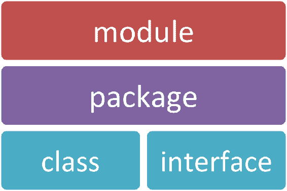

因此，模块是 Java 9 的新特性，并且正如你所预期的，在使用之前需要声明。模块的声明包括它所依赖的其他模块的名称。它还导出其他模块依赖的包。模块声明可能是你开始使用 Java 9 进行开发时需要解决的最重要模块问题之一。以下是一个示例：

```java
    module com.three19.irisScan 
    {
      // modules that com.three19.irisScan depends upon
      requires com.three19.irisCore;
      requires com.three19.irisData;

      // export packages for other modules that are dependent
         upon com.three19.irisScan
      exports com.three19.irisScan.biometric;
    }
```

当编程一个 Java 9 应用程序时，你的模块声明将被放置在一个`module-info.java`文件中。一旦这个文件完成，你只需运行`javac`，Java 编译器，来生成`module-info.class` Java 类文件。你将以与当前将`.java`文件编译成`.class`文件相同的方式完成这项任务。

你还可以创建具有根目录中的`module-info.class`文件的模块化 JAR 文件。这代表了一个很高的灵活性。

# 基础模块

当编程 Java 9 应用程序或移植使用较旧版本的 Java 编写的现有应用程序时，必须使用基本模块（`java.base`）。每个模块都需要`java.base`模块，因为它定义了关键的或基础性的 Java 平台 API。以下是`java.base`模块的内容：

```java
    module java.base 
    {
      exports java.io;
      exports java.lang;
      exports java.lang.annotation;
      exports java.lang.invoke;
      exports java.lang.module;
      exports java.lang.ref;
      exports java.lang.reflect;
      exports java.math;
      exports java.net;
      exports java.net.spi;
      exports java.nio;
      exports java.nio.channels;
      exports java.nio.channels.spi;
      exports java.nio.charset;
      exports java.nio.charset.spi;
      exports java.nio.file;
      exports java.nio.file.attribute;
      exports java.nio.file.spi;
      exports java.security;
      exports java.security.aci;
      exports java.security.cert;
      exports java.security.interfaces;
      exports java.security.spec;
      exports java.text;
      exports java.text.spi;
      exports java.time;
      exports java.time.chrono;
      exports java.time.format;
      exports java.time.temporal;
      exports java.time.zone;
      exports java.util;
      exports java.util.concurrent;
      exports java.util.concurrent.atomic;
      exports java.util.concurrent.locks;
      exports java.util.function;
      exports java.util.jar;
      exports java.util.regex;
      exports java.util.spi;
      exports java.util.stream;
      exports java.util.zip;
      exports java.crypto;
      exports java.crypto.interfaces;
      exports java.crytpo.spec;
      exports java.net;
      exports java.net,ssi;
      exports java.security.auth;
      exports java.security.auth.callbak;
      exports java.security.auth.login;
      exports java.security.auth.spi;
      exports java.security.auth.x500;
      exports java.security.cert;
    }
```

如你所见，`java.base`模块不需要任何模块，并导出许多包。在开始使用新的 Java 平台，Java 9 创建应用程序时，有一个这些导出包的列表会很有用。

你会注意到，在前一节中，我们没有在我们的`com.three19.irisScan`模块声明中包含`requires java.base;`代码行。更新后的代码如下，并现在包含了`requires java.base;`代码行：

```java
    module com.three19.irisScan 
    {
      // modules that com.three19.irisScan depends upon
      requires java.base; // optional inclusion 
      requires com.three19.irisCore;
      requires com.three19.irisData;

      // export packages for other modules that are dependent
         upon com.three19.irisScan
      exports com.three19.irisScan.biometric;
    }
```

如果你没有在你的模块声明中包含`requires java.base;`代码行，Java 编译器将自动包含它。

# 可靠的配置

如本章前面所建议的，模块为我们提供了 Java 9 应用程序的可靠配置，解决了 Java 平台早期版本中的类路径问题。

Java 读取并解释模块声明，使得模块可读。这些可读的模块允许 Java 平台确定是否有任何模块缺失，是否有重复声明的库，或者存在其他冲突。在 Java 9 中，编译器或运行时会生成并输出非常具体的错误信息。以下是一个编译时错误的示例：

```java
src/com.three19.irisScan/module-info.java: error: module not found: com.three19.irisScan 
requires com.three19.irisCore;
 ^
1 error
```

以下是一个示例，如果找不到模块`com.three19.isrisCore`但该模块被`com.three19.irisScan`应用程序所需要，将会发生运行时错误：

```java
Error occurred during initialization of VM
java.lang.module.ResolutionException: Module com.three19.irisCore not found, required by com.three19.irisScan app
```

# 强封装

在本章早期，您了解到 Java 9 的强封装解决了 JDK 的单一问题。在 Java 9 中，封装是由 `module-info.java` 文件中的信息驱动的。该文件中的信息让 Java 知道哪些模块依赖于其他模块，以及每个模块导出了什么。这强调了确保我们的 `module-info-java` 文件正确配置的重要性。让我们看看一个用标准 Java 代码编写的示例，这种方式在 Java 9 中并没有什么新变化：

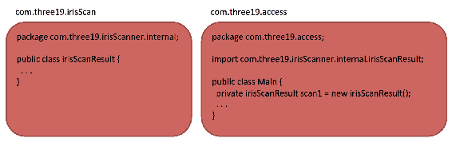

在前一个示例中，`com.three19.irisScan` 模块有一个用于内部使用的 `irisScanner` 包和一个 `irisScanResult` 类。如果 `com.three19.access` 应用程序尝试导入和使用 `irisScanResult` 类，Java 编译器将产生以下错误信息：

```java
src/com.three19.access/com/three19/access/Main.java: error: irisScanResult is not accessible because package com.three19.irisScanner.internal is not exported
 private irisSanResult scan1 = new irisScanResult();
 ^
1 error
```

如果出于某种原因编译器没有捕获这个错误，尽管这非常不可能，将会发生以下运行时错误：

```java
Exception in thread "main" java.lang.IllegalAccessError: class com.three19.access.Main (in module: com.three19.access) cannot access class com.three19.irisScanner.internal.irisScanResult (in module: com.three19.irisScan), com.three19.irisScanner.internal is not exported to com.three19.access.
```

详细错误信息将使调试和故障排除变得更加容易。

# 迁移规划

Java 平台的变化是显著的，Java 9 被认为是一个重大版本。认为我们的当前 Java 应用程序将在 Java 9 上无缝运行是过于天真的。虽然这可能适用于简单的程序，但至少在简单程序中，提前规划和考虑您最可能遇到的问题是很明智的。在我们查看这些问题之前，让我们在下一节测试一个简单的 Java 应用程序。

# 测试一个简单的 Java 应用程序

以下代码由一个单独的 Java 类 `GeneratePassword.` 组成。该类提示用户输入所需的密码长度，然后根据用户的请求长度生成密码。如果用户请求的长度小于 8，则将使用默认长度 8。此代码是用 Java SE 1.7 JRE 系统库编写的：

```java
    /*
    * This is a simple password generation app 
    */

    import java.util.Scanner;

    public class GeneratePassword 
    {
      public static void main(String[] args) 
      { 
        // passwordLength int set up to easily change the schema 
        int passwordLength = 8; //default value

        Scanner in = new Scanner(System.in); 
        System.out.println("How long would you like your
         password (min 8)?"); 
        int desiredLength; 
        desiredLength = in.nextInt(); 

        // Test user input 
        if (desiredLength >8) 
        { 
          passwordLength = desiredLength; 
        } 

        // Generate new password 
        String newPassword = createNewPassword(passwordLength); 

        // Prepare and provide output 
        String output = "nYour new " + passwordLength 
         + "-character password is: "; 
        System.out.println(output + newPassword); 
      }

      public static String createNewPassword(int lengthOfPassword) 
      { 
        // Start with an empty String 
        String newPassword = "";

        // Populate password  
        for (int i = 0; i < lengthOfPassword; i++) 
        { 
          newPassword = newPassword + randomizeFromSet(
            "aAbBcCdDeEfFgGhHiIjJkKlLmMnNoOpPqQrRsStTuUvVwWxXyYzZ
             0123456789+-*/?!@#$%&"); 
        } 

        return newPassword; 
      }

      public static String randomizeFromSet(String characterSet) 
      { 
        int len = characterSet.length();
        int ran = (int)(len * Math.random());
        return characterSet.substring(ran, ran + 1);
      }
    }
```

在下面的屏幕截图中，我们在运行 Java 8 的 Mac 上测试了 `GeneratePassword` 应用程序。如您所见，我们首先查询 Java 以验证当前版本。在这个测试中，使用了 Java `1.8.0_121`。接下来，我们使用 `javac` 工具编译 `GeneratePassword` Java 文件。最后，我们运行了应用程序：

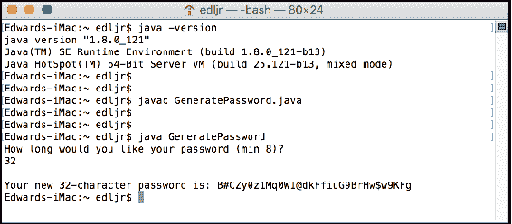

如前文测试所示，`GeneratePassword.java` 编译成功，生成了 `GeneratePassword.class` 文件。应用程序通过 `java GeneratePassword` 命令运行。用户被提示输入所需的密码长度，并输入了 `32`。然后应用程序成功生成了一个 32 位的随机密码并提供了适当的输出。

这个测试证明了示例应用程序在 JDK 1.8 上成功运行。接下来，让我们使用 JDK 9 测试同一个应用程序。

我们从 `java -version` 命令开始，以表明我们在这台计算机上使用 JDK 9。以下截图显示我们成功将 `.java` 文件编译成 `.class` 文件。当应用程序运行时，它按预期工作并提供了正确的结果：

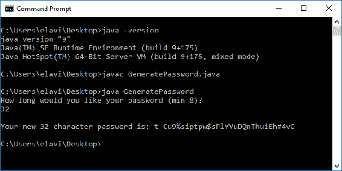

正如您所看到的，我们明确地证明了在 Java 9 之前的应用程序有可能在不进行任何修改的情况下成功运行在 Java 9 上。这是一个简单的案例研究，涉及一个非常基础的 Java 程序。这当然是最好的情况，但不能假设。您将想要测试您的应用程序，以确保它们在 Java 9 平台上按预期运行。

在下一节中，我们将回顾在测试您的 Java 9 之前的应用程序时可能会遇到的一些潜在问题，我们将使用新的 Java 平台和 JDK 9。

# 可能的迁移问题

本节中提到的潜在迁移问题包括直接访问 JRE、访问内部 API、访问内部 JAR、JAR URL 废弃、扩展机制以及 JDK 的模块化。让我们逐一查看这些潜在的迁移问题。

# JRE

创建 Java 9 的模块化系统在开发工具和实用工具的数量和位置方面带来了一些简化。一个例子是 JDK 对 JRE 的消耗。在所有 Java 9 之前的版本中，Java 平台包括 JDK 和 JRE 作为两个单独的组件。在 Java 9 中，这些组件已经被合并。这是一个重大的变化，开发者应该密切关注。如果您有一个指向 JRE 目录的应用程序，您将需要做出更改以避免问题。JRE 内容如下所示：

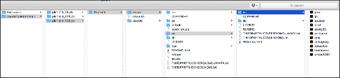

# 内部 API 的访问

Java 9 平台已经封装了内部 API 以提高平台和用 Java 编写的应用程序的安全性。与 Java 平台之前的版本不同，用 Java 9 编写的应用程序将无法默认访问 JDK 的内部 API。Oracle 已经将一些内部 API 识别为关键；这些 API 通过 `jdk.unsupported` JDK 模块保持可访问。

上述关键 API（JDK 内部）包括：

+   `sun.misc`

+   `sun.misc.Unsafe`

+   `sun.reflect.Reflection`

+   `sun.reflect.ReflectionFactory.newConstrutorForSerialization`

如果您有在 Java 9 之前实现任何 `sun.*` 或 `com.sun.*` 包的应用程序，您在迁移应用程序到 Java 9 时可能会遇到问题。为了解决这个问题，您应该检查您的类文件以确定是否使用了 `sun.*` 和 `com.sun.*` 包。或者，您可以使用 Java 依赖分析工具 `jdeps` 来帮助确定您的 Java 程序是否依赖于 JDK 内部 API。

`jdeps` 工具是 Java 依赖分析工具，可用于帮助确定您的 Java 程序是否依赖于 JDK 内部 API。

# 访问内部 JAR 文件

Java 9 不允许访问内部 JAR 文件，如`lib/ant-javax.jar`、`lib/dt.jar`以及在此处显示的`lib`目录中列出的其他文件：

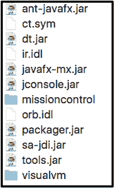

这里需要注意的关键点是，如果你有依赖于这些工具之一的 Java 应用程序，这些工具位于`lib`文件夹中，你需要相应地修改你的代码。

建议你在开始使用 Java 9 后测试一次你的 IDE，以确保 IDE 已更新并官方支持 Java 9。如果你使用多个 IDE 进行 Java 开发，测试每一个以避免意外。

# JAR URL 弃用

在 Java 9 之前，JAR 文件 URL 被一些 API 用来标识运行时图像中的特定文件。这些 URL 包含一个`jar:file:`前缀和两个路径；一个指向`jar`，另一个指向`jar`内部的具体资源文件。以下是 Java 9 之前 JAR URL 的语法：

```java
    jar:file:<path-to-jar>!<path-to-file-in-jar>
```

随着 Java 9 模块系统的出现，容器将容纳资源文件而不是单个 JAR 文件。访问资源文件的新语法如下：

```java
    jrt:/<module-name>/<path-to-file-in-module>
```

现在有一个新的 URL 模式`jrt`用于在运行时图像内命名资源。这些资源包括类和模块。新的模式允许在不引入对运行时图像的安全风险的情况下识别资源。这种增强的安全性确保了运行时图像的形式和结构保持隐蔽。以下是新的模式：

```java
    jrt:/[$MODULE[/$PATH]]
```

有趣的是，`jrt` URL 的结构决定了其含义，表明结构可以采取几种形式之一。以下是三种不同`jrt` URL 结构的示例：

+   `jrt:/$MODULE/$PATH`：这种结构提供了对由`$PATH`参数指定的资源文件的访问，该资源文件位于由`$MODULE`参数指定的模块中

+   `jrt:/$MODULE`：这种结构提供了对由`$MODULE`参数指定的模块中所有资源文件的引用

+   `jrt:/`：这种结构提供了对运行时图像中所有资源文件的引用

如果你有的现有代码使用 API 返回的 URL 实例，你应该不会有任何问题。另一方面，如果你的代码依赖于`jar` URL 结构，你将会有问题。

# 扩展机制

如下所示，Java 平台之前有一个扩展机制，它允许开发者将自定义 API 提供给所有应用程序。正如您在下面的插图中所看到的，扩展是某种插件，或者是 Java 平台的附加组件。每个扩展中的 API 和类默认情况下都是自动可用的：

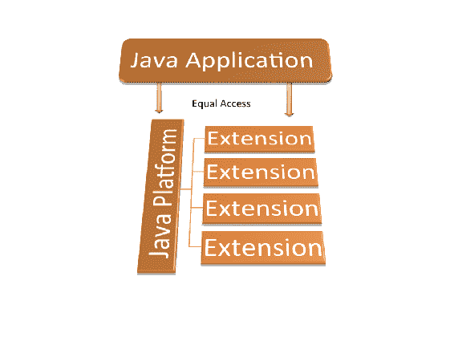

如插图所示，Java 应用程序可以访问 Java 平台和扩展，而无需要求类路径。这个特性在 Java 8 中被弃用，并且在 Java 9 中不再存在。

# JDK 的模块化

到目前为止，您已经对 Java 9 的模块化有了深刻的理解。Java 及其它面向对象编程语言中的古老谚语是“万物皆类”。现在，随着 Java 9 的推出，“万物皆模块”成为了新的谚语。有三种类型的模块，如下所述：

| **模块类型** | **描述** |
| --- | --- |
| 自动 | 当 JAR 文件放置在新的模块路径上时，模块会自动创建 |
| 显式/命名 | 这些模块通过编辑 `module-info.java` 文件手动定义 |
| 无名 | 当 JAR 文件放置在类路径上时，会创建无名模块 |

当您将应用程序迁移到 Java 9 时，您的应用程序及其库将变为无名称模块。因此，您需要确保所有模块都在模块路径中。

另一件需要注意的事情是，您的运行时映像将不会包含整个 JDK。相反，它将只包含应用程序所需的模块。值得回顾 Java 9 中 JDK 的模块化方式。以下表格包含 Java 9 中 JDK 的 API 规范：

| `jdk.accessibility` | `jdk.attach` | `jdk.charsets` | `jdk.compiler` |
| --- | --- | --- | --- |
| `jdk.crypto.cryptoki` | `jdk.crypto.ec` | `jdk.dynalink` | `jdk.editpad` |
| `jdk.hotspot.agent` | `jdk.httpserver` | `jdk.incubator.httpclient` | `jdk.jartool` |
| `jdk.javadoc` | `jdk.jcmd` | `jdk.jconsole` | `jdk.jdeps` |
| `jdk.jdi` | `jdk.jdwp.agent` | `jdk.jlink` | `jdk.jshell` |
| `jdk.jsobject` | `jdk.jstatd` | `jdk.localedata` | `jdk.management` |
| `jdk.management.agent` | `jdk.naming.dns` | `jdk.naming.rmi` | `jdk.net` |
| `jdk.pack` | `jdk.packager.services` | `jdk.policytool` | `jdk.rmic` |
| `jdk.scripting.nashorn` | `jdk.sctp` | `jdk.security.auth` | `jdk.security.jgss` |
| `jdk.snmp` | `jdk.xml.dom` | `jdk.zipfs` |  |

以下表格包含 Java 9 中 Java SE 的 API 规范：

| `java.activation` | `java.base` | `java.compiler` | `java.cobra` |
| --- | --- | --- | --- |
| `java.datatransfer` | `java.desktop` | `java.instrument` | `java.logging` |
| `java.management` | `java.management.rmi` | `java.naming` | `java.prefs` |
| `java.rmi` | `java.scripting` | `java.se` | `java.se.ee` |
| `java.security.jgss` | `java.security.sasi` | `java.sql` | `java.sql.rowset` |
| `java.transaction` | `java.xml` | `java.xml.bind` | `java.xml.crypto` |
| `java.xml.ws` | `java.xml.ws` | `java.xml.ws.annotation` |  |

记住，所有应用程序都将默认通过模块路径访问 `java.base`。

以下表格包含 Java 9 中 JavaFX 的 API 规范：

| `javafx.base` | `javafx.controls` | `javafx.fxml` | `javafx.graphics` |
| --- | --- | --- | --- |
| `javafx.media` | `javafx.swing` | `javafx.web` |  |

有两个额外的模块：

+   `java.jnlp` 定义了**JNLP**（**Java 网络启动协议**）的 API

+   `java.smartcardio` 定义了 Java 智能卡输入/输出的 API

关于这些模块的详细信息，请访问 Oracle 的*Java®平台，标准版和 Java 开发工具包版本 9 API 规范*网站：[`download.java.net/java/jdk9/docs/api/overview-summary.html`](http://download.java.net/java/jdk9/docs/api/overview-summary.html)。

# 来自 Oracle 的建议

Oracle 在将这个主要更新，版本 9，带到 Java 平台方面做得非常出色。他们对准备 Java 9 和如何迁移到新 JDK 的见解值得回顾。在本节中，我们将探讨准备步骤、打破封装、运行时图像的变化、已删除的工具和 API 组件、垃圾收集的变化以及部署。

# 准备步骤

Oracle 提供了一套五步流程，以帮助开发者将他们的 Java 应用程序迁移到版本 9。这些步骤如下，并在后续章节中进行详细说明：

1.  获取 JDK 9 的早期访问构建版本。

1.  在重新编译之前运行你的程序。

1.  更新第三方库和工具。

1.  编译你的应用程序。

1.  在你的代码上运行`jdeps`。

# 获取 JDK 9 早期访问构建版本

如果你在 Java 9 正式发布之前阅读这本书，你可以从这里获取 JDK 9 的早期访问构建版本——[`jdk.java.net/9/`](http://jdk.java.net/9/)。早期发布版本适用于 Windows（32 位和 64 位）、macOS（64 位）、Linux（32 位和 64 位）以及各种 Linux ARM、Solaris 和 Alpine Linux 版本。

在 Java 9 正式发布之前，花时间测试你的应用程序并迁移它们，有助于确保你不会因为依赖于你的 Java 应用程序的服务而经历任何停机时间。

# 在重新编译之前运行你的程序

如本章前面所述，你的现有 Java 应用程序有可能在 Java 9 平台上无需修改即可运行。因此，在你做出任何更改之前，尝试在 Java 9 平台上运行你的当前应用程序。如果你的应用程序在 Java 9 上运行良好，那很好，但你的工作还没有完成。请回顾下一节关于更新第三方库和工具、编译你的应用程序以及在代码上运行`jdeps`的内容。

# 更新第三方库和工具

第三方库和工具可以帮助扩展我们的应用程序并缩短开发时间。为了 Java 9 的兼容性，确保你使用的每个第三方库和工具都与 JDK 9 兼容并支持该版本非常重要。在 Java 9 上运行你的应用程序不会为你提供确保未来没有兼容性问题的洞察力。建议你查看每个库和工具的官方网站，以验证其与 JDK 9 的兼容性和支持情况。

如果你使用的库或工具有一个支持 JDK 9 的版本，请下载并安装它。如果你找到一个还不支持 JDK 9 的版本，考虑寻找替代品。

在我们的上下文中，工具包括**集成开发环境**（**IDE**）。NetBeans、Eclipse 和 IntelliJ 都有支持 JDK 9 的 IDE 版本。以下提供那些网站的链接：

+   **NetBeans**: [`bits.netbeans.org/download/trunk/nightly/latest/`](http://bits.netbeans.org/download/trunk/nightly/latest/)

+   **Eclipse**: [`www.eclipse.org/community/eclipse_newsletter/2015/june/article4.php`](https://www.eclipse.org/community/eclipse_newsletter/2015/june/article4.php)

+   **IntelliJ**: [`www.jetbrains.com/idea/nextversion/`](https://www.jetbrains.com/idea/nextversion/)

# 编译您的应用程序

您的下一步是使用 JDK 9 的 `javac` 编译您的应用程序。即使您的应用程序在 JDK 9 上运行正常，这也是很重要的。您可能不会收到编译器错误，但也要注意警告。以下是您的应用程序可能无法使用 JDK 9 编译的最常见原因，假设它们在 Java 9 之前可以编译。

首先，如本章前面所述，大多数 JDK 9 内部 API 默认情况下不可访问。您的指示将是在运行时或编译时出现的 `IllegalAccessErrors` 错误。您需要更新您的代码，以便使用可访问的 API。

第二个原因可能是您的 Java 9 之前的程序无法使用 JDK 9 编译，如果您使用了下划线字符作为单个字符标识符。根据 Oracle 的说法，这种做法在 Java 8 中会生成警告，在 Java 9 中会生成错误。让我们看一个例子。以下 Java 类实例化了一个名为 `_` 的对象，并向控制台打印了一条单数消息：

```java
    public class Underscore 
    { 
      public static void main(String[] args) 
      {
        Object _ = new Object();
        System.out.println("This ran successfully.");
      }
    }
```

当我们使用 Java 8 编译此程序时，我们会收到一个警告，表明使用 '`_`' 作为标识符可能在 Java SE 8 之后的版本中不受支持：

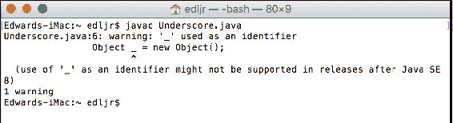

如您在下面的屏幕截图中所见，这只是一个警告，应用程序运行正常：

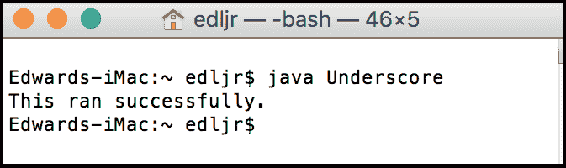

现在，让我们尝试使用 JDK 9 编译相同的类：

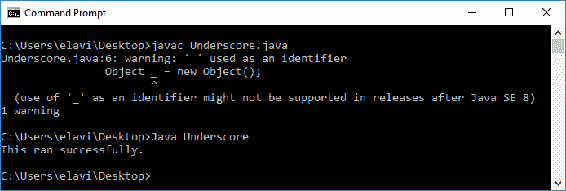

如您所见，使用下划线作为单个字符标识符仍然只会产生警告，而不会产生错误。应用程序运行成功。这次测试是在 JDK 9 仍处于早期发布阶段时运行的。假设一旦 JDK 9 正式发布，运行此测试将产生错误而不是仅仅警告。可能会抛出的错误如下：

```java
Underscore.java:2: error: as of release 9, '_' is a keyword, and may not be used as a legal identifier.
```

即使这个问题在 JDK 9 的正式发布中没有解决，使用下划线作为单个字符标识符也不是好的编程实践，因此您应该避免使用它。

第三个可能导致您的 Java 9 之前的程序无法使用 JDK 9 编译的可能原因是您正在使用 `-source` 和 `-target` 编译器选项。让我们看看 Java 9 之前和 Java 9 中的 `-source` 和 `-target` 编译器选项。

# Java 9 之前的 -source 和 -target 选项

`-source`选项指定了 Java SE 版本，并具有以下可接受的值：

| **值** | **描述** |
| --- | --- |
| 1.3 | `javac`不支持 Java SE 1.3 之后引入的特性。 |
| 1.4 | `javac`接受 Java SE 1.4 中引入的语言特性。 |
| 1.5 或 5 | `javac`接受 Java SE 1.5 中引入的语言特性。 |
| 1.6 或 6 | `javac`将编码错误报告为错误而不是警告。值得注意的是，Java SE 1.6 中没有引入新的语言特性。 |
| 1.7 或 7 | `javac`接受 Java SE 1.7 中引入的语言特性。如果没有使用`-source`选项，这是默认值。 |

`-target`选项告诉`javac`要针对哪个版本的 JVM。`-target`选项的可接受值是`1.1`、`1.2`、`1.3`、`1.4`、`1.5`或`5`、`1.6`或`6`和`1.7`或`7`。如果没有使用`-target`选项，默认的 JVM 目标是依赖于与`-source`选项一起使用的值。以下是`-source`值及其相关`-target`的表格：

| **-source 值** | **默认-target** |
| --- | --- |
| 未指定 | 1.7 |
| 1.2 | 1.4 |
| 1.3 | 1.4 |
| 1.4 | 1.4 |
| 1.5 或 5 | 1.7 |
| 1.6 或 6 | 1.7 |
| 1.7 | 1.7 |

# Java 9 -source 和-target 选项

在 Java 9 中，支持值如下所示：

| **支持值** | **备注** |
| --- | --- |
| 9 | 这是默认值，如果没有指定值 |
| 8 | 设置支持为 1.8 |
| 7 | 设置支持为 1.7 |
| 6 | 设置支持为 1.6 并生成一个警告（不是错误）来指示 JDK 6 已过时 |

# 在你的代码上运行 jdeps

`jdeps`类依赖分析工具对 Java 9 来说并不陌生，但也许随着 Java 9 的到来，它对开发者来说从未如此重要。将你的应用程序迁移到 Java 9 的重要一步是运行`jdeps`工具，以确定你的应用程序及其库的依赖关系。如果代码依赖于任何内部 API，`jdeps`工具会很好地建议替代方案。

以下截图显示了使用`jdeps`分析器时你可以使用的选项：

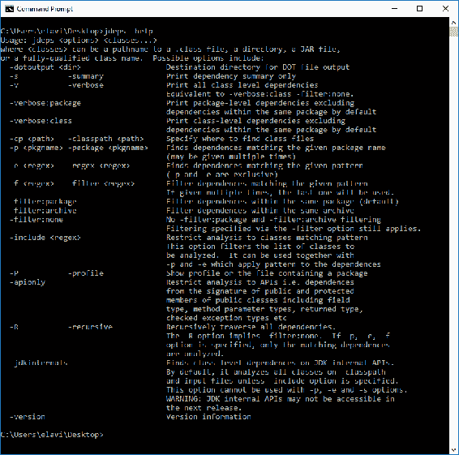

让我们来看一个例子。这里有一个简单的 Java 类，名为`DependencyTest`：

```java
    import sun.misc.BASE64Encoder;

    public class DependencyTest 
    {
      public static void main(String[] args) throws
       InstantiationException, IllegalAccessException 
      {
        BASE64Encoder.class.newInstance();
        System.out.println("This Java app ran successfully.");
      }
    }
```

现在，让我们使用`javac`来使用 Java 8 编译这个类：

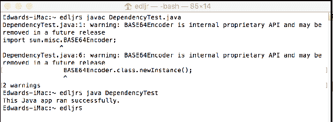

正如你所见，Java 8 成功编译了这个类，并且应用程序运行正常。编译器确实给出了一个`DependencyTest.java:6: warning: BASE64Encoder 是内部专有 API，可能在未来的版本中删除`警告。现在，让我们看看当我们尝试使用 Java 9 编译这个类时会发生什么：

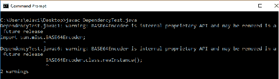

在这种情况下，使用 Java 9，编译器给出了两个警告而不是一个。第一个警告是针对 `import sun.misc.BASE64Encoder;` 语句，第二个是针对 `BASE64Encoder.class.newInstance();` 方法调用。正如你所见，这些只是警告而不是错误，所以 `DependencyTest.java` 类文件成功编译。接下来，让我们运行应用程序：

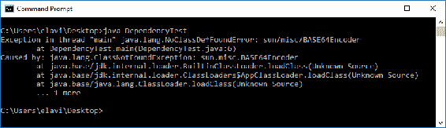

现在，我们可以清楚地看到 Java 9 不会允许我们运行应用程序。接下来，让我们使用 `jdeps` 分析器工具运行一个依赖性测试。我们将使用以下命令行语法——`jdeps DependencyTest.class`：

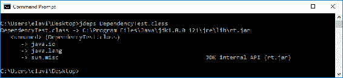

正如你所见，我们有三个依赖项：`java.io`、`java.lang` 和 `sun.misc`。在这里，我们被建议将我们的 `sun.misc` 依赖项替换为 `rt.jar`。

# 破坏封装

由于模块重组带来的封装性增强，Java 9 平台比其前辈版本更安全。尽管如此，你可能需要突破模块系统的封装。Java 9 允许突破这些访问控制边界。

如同你在本章前面所读到的，大多数内部 API 都被强封装。正如之前所建议的，在更新源代码时，你可能需要寻找替代 API。当然，这并不总是可行的。你可以采取三种额外的做法——在运行时使用 `--add-opens` 选项；使用 `--add-exports` 选项；以及 `--permit-illegal-access` 命令行选项。让我们看看这些选项中的每一个。

# --add-opens 选项

你可以使用 `--add-opens` 运行时选项来允许你的代码访问非公共成员。这可以被称为深度反射。执行深度反射的库能够访问所有成员，包括私有和公共成员。为了授予这种访问权限给你的代码，你使用 `--add-opens` 选项。以下是语法：

```java
    --add-opens module/package=target-module(,target-module)*
```

此选项允许指定的模块打开指定的包。当使用此选项时，编译器不会产生任何错误或警告。

# --add-exports 选项

你可以使用 `--add-exports` 来破坏封装，以便你可以使用默认不可访问的内部 API。以下是语法：

```java
    --add-exports <source-module>/<package>=<target-module>(
     ,<target-module>)*
```

此命令行选项允许 `<target-module>` 中的代码访问 `<source-module>` 包中的类型。

破坏封装的另一种方法是使用 JAR 文件的清单。以下是一个示例：

```java
    --add-exports:java.management/sun.management
```

应仅在认为绝对必要时使用 `--add-exports` 命令行选项。不建议除了短期解决方案之外使用此选项。常规使用此选项的危险在于，任何对引用内部 API 的更新都可能导致你的代码无法正常工作。

# --permit-illegal-access 选项

打破封装的第三种方法是使用`--permit-illegal-access`选项。当然，与第三方库创建者联系以查看他们是否有更新的版本是明智的。如果没有这个选项，您可以使用`--permit-illegal-access`来获取对类路径上要实现的操作的非法访问。由于这里的操作明显非法，每次这些操作发生时，您都会收到警告。

# 运行时图像更改

Java 9 对 JDK 和 JRE 进行了重大更改。其中许多更改与模块化相关，已在其他章节中介绍。还有一些其他事情您应该考虑。

# Java 版本架构

使用 Java 9，Java 平台版本显示的方式已更改。以下是一个 Java 9 之前的版本格式的示例：

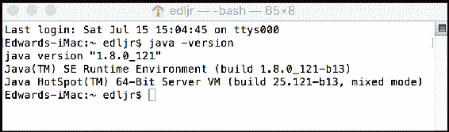

现在，让我们看看 Java 9 如何报告其版本：

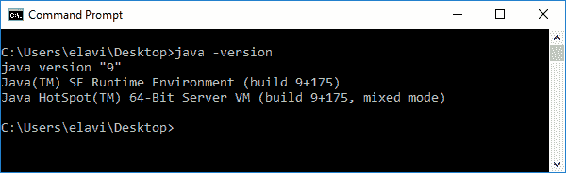

正如您所看到的，随着 Java 9 的发布，版本架构现在为`$MAJOR.$MINOR.$SECURITY.$PATCH`。这与 Java 的先前版本有显著不同。这只会影响您的应用程序，如果您有解析`java -version`命令返回的字符串的代码。

# JDK 和 JRE 布局

在 Java 的新版本中，JDK 和 JRE 中的文件组织方式已经发生了变化。花时间熟悉新的文件系统布局是值得的。以下截图显示了 JDK 的`/bin`文件夹的文件结构：

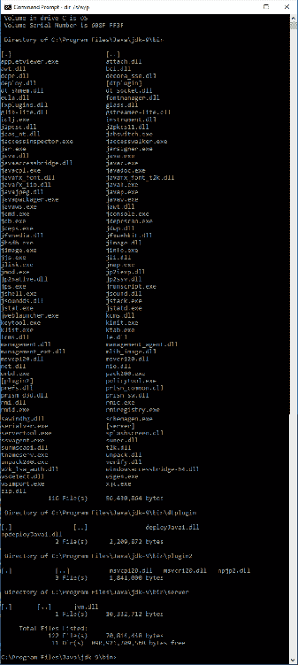

这里是`lib`文件夹的布局：

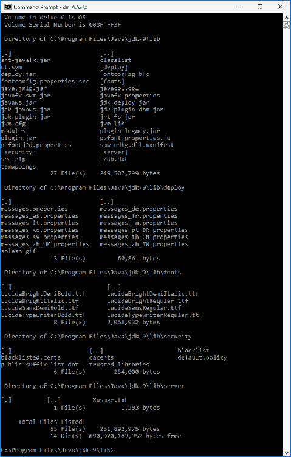

# 已移除的内容

对于 Java 平台的新版本，另一个变化领域是许多平台组件已被移除。以下各节表示最显著的组件。

显然，`rt.jar`、`tools.jar`和`dt.jar`已被移除。这些 JAR 文件包含类和其他资源文件，并且都位于`/lib`目录中。

`e*ndorsed standards override mechanism`已被移除。在 Java 9 中，如果`javac`和`java`检测到该机制，它们都会退出。该机制被用于应用程序服务器以覆盖一些 JDK 组件。在 Java 9 中，您可以使用可升级的模块来实现相同的结果。

如本章先前所述，`e*xtension mechanism`机制也已移除。

以下列出的 API 先前已被弃用，并已移除，在 Java 9 中不可访问。这些 API 的移除是 Java 平台模块化的结果：

+   `apple.applescript`

+   `com.apple.concurrent`

+   `com.sun.image.codec.jpeg`

+   `java.awt.dnd.peer`

+   `java.awt.peer`

+   `java.rmi.server.disableHttp`

+   `java.util.logging.LogManager.addPropertyChangeListener`

+   `java.util.logging.LogManager.removePropertyChangeListener`

+   `java.util.jar.Pack200.Packer.addPropertyChangeListener`

+   `java.util.jar.Pack200.Packer.removePropertyChangeListener`

+   `java.util.jar.Pack200.Unpacker.addPropertyChangeListener`

+   `java.util.jar.Pack200.Unpacker.removePropertyChangeListener`

+   `javax.management.remote.rmi.RMIIIOPServerImpl`

+   `sun.misc.BASE64Encoder`

+   `sun.misc.BASE64Decoder`

+   `` `sun.rmi.transport.proxy.connectTimeout` ``

+   `sun.rmi.transport.proxy.eagerHttpFallback`

+   `sun.rmi.transport.proxy.logLevel`

+   `sun.rmi.transport.tcp.proxy`

以下列出的一些工具已被删除。在每种情况下，该工具之前已被淘汰或其功能被更好的替代品所取代：

+   `hprof`

+   `java-rmi.cgi`

+   `java-rmi.exe`

+   `JavaDB`

+   `jhat`

+   `native2ascii`

Java 9 中删除的两个额外功能是：

+   AppleScript 引擎。这个引擎被认为不可用，并且没有替代品而被删除。

+   Windows 32 位客户端虚拟机。JDK 9 支持 32 位服务器 JVM，但不支持 32 位客户端 VM。这个变化是为了关注 64 位系统的性能提升。

# 更新的垃圾收集

垃圾收集一直是 Java 的伟大成就之一。在 Java 9 中，**垃圾-首次**（**G1**）垃圾收集器现在是 32 位和 64 位服务器上的默认垃圾收集器。在 Java 8 中，默认的垃圾收集器是并行垃圾收集器。Oracle 报告称，有三种垃圾收集组合将在 Java 9 中阻止你的应用程序启动。这些组合是：

+   DefNew + CMS

+   增量 CMS

+   ParNew + SerialOld

我们将在第七章“利用新的默认 G1 垃圾收集器”中深入探讨 Java 9 的垃圾收集。

# 部署

在将应用程序迁移到 Java 9 的背景下，你应该注意三个问题，这些问题是在部署你的应用程序时出现的。这些问题是 JRE 版本选择、序列化小程序和 JNLP 的更新。

**JNLP**是**Java 网络启动协议**的缩写，将在本章的后续部分中介绍。

# JRE 版本选择

在 Java 9 之前，开发人员可以在启动应用程序时请求除正在启动的版本之外的 JRE 版本。这可以通过命令行选项或适当的 JAR 文件清单配置来实现。由于我们通常部署应用程序的方式，这个特性在 JDK 9 中被删除。以下是三种主要方法：

+   激活安装程序

+   **Java Web Start**使用 JNLP

+   原生操作系统打包系统

# 序列化小程序

Java 9 不支持将小程序作为序列化对象部署的能力。在过去，小程序作为序列化对象部署以补偿缓慢的压缩和 JVM 性能问题。随着 Java 9 的推出，压缩技术更加先进，JVM 性能也更好。

如果你尝试将你的小程序作为序列化对象部署，当你的小程序启动时，你的对象属性和参数标签将被简单地忽略。从 Java 9 开始，你可以使用标准的部署策略来部署你的小程序。

# JNLP 更新

JNLP 用于在桌面客户端使用位于 Web 服务器上的资源启动应用程序。JNLP 客户端包括 Java Web Start 和 Java Plug-in 软件，因为它们能够启动远程托管的小程序。此协议对于启动 RIAs 至关重要。

**RIAs** 是 **富互联网应用程序**，当使用 JNLP 启动时，可以访问各种 JNLP API，在用户许可的情况下，可以访问用户的桌面。

在 Java 9 中，JNLP 规范已更新。以下几节详细介绍了四个具体的更新。

# 嵌套资源

在 Java 或 j2se 元素中使用具有嵌套资源的组件扩展之前已被支持，但在规范中未进行记录。规范现已更新以反映这一支持。之前的规范如下：

不能将任何 java 元素指定为资源的一部分。

Java 9 的更新规范现在如下所示：

组件扩展中的 java 元素不会控制使用哪个版本的 java，但可以包含嵌套资源元素，然后只有在使用与第 4.6 节中指定的版本匹配的 Java 版本时，才能使用这些资源。

这个特定的更改确保扩展 JLP 文件必须包含 `java` 或 `j2se` 资源，并且这些资源不会决定使用哪个 JRE。当使用指定版本时，允许嵌套资源。

# FX XML 扩展

当使用 JNLP 时，你创建一个 JNLP 文件。以下是一个示例：

```java
    <?xml version="1.0" encoding="UTF-8"?>
    <jnlp spec="1.0+" codebase="" href="">
      <information>
        <title>Sample/title>
        <vendor>The Sample Vendor</vendor>
        <icon href="sample-icon.jpg"/>
        <offline-allowed/>
     </information>
     <resources>
       <!-- Application Resources -->
       <j2se version="1.6+"  
        href="http://java.sun.com/products/autodl/j2se"/>
       <jar href="Sample-Set.jar" main="true" />
     </resources>
     <application-desc
       name="Sample Application"
       main-class="com.vendor.SampleApplication" 
       width="800" 
       height="500">
       <argument>Arg1</argument>
       <argument>Arg2</argument>
       <argument>Arg3</argument>
     </application-desc>
     <update check="background"/>
    </jnlp>
```

对 `<application-desc>` 元素进行了两项更改。首先，添加了可选的 `type` 属性，以便可以对应用程序类型进行注释。默认类型是 `Java`，因此如果你的程序是 Java 应用程序，你不需要包含 `type` 属性。或者，你可以如下指定 `Java` 作为你的类型：

```java
    <application-desc 
      name="Another Sample Application"
      type="Java" main-class="com.vendor.SampleApplication2" 
      width="800" 
      height="500">
      <argument>Arg1</argument>
      <argument>Arg2</argument>
      <argument>Arg3</argument>
    </application-desc>
```

我们可以指示其他应用类型，例如在此处所示包含 `JavaFX`：

```java
    <application-desc 
      name="A Great JavaFX Application"
      type="JavaFX" main-class="com.vendor.GreatJavaFXApplication" 
      width="800" 
      height="500">
      <argument>Arg1</argument>
      <argument>Arg2</argument>
      <argument>Arg3</argument>
    </application-desc>
```

如果你指定了一个 JNLP 客户端不支持的应用程序类型，你的应用程序启动将失败。有关 JNLP 的更多信息，你可以查阅官方文档：[`docs.oracle.com/javase/7/docs/technotes/guides/javaws/developersguide/faq.html`](http://docs.oracle.com/javase/7/docs/technotes/guides/javaws/developersguide/faq.html)。

Java 9 中 `<application-desc>` 元素的第二个更改是添加了 `param` 子元素。这允许我们使用 `value` 属性提供参数的名称及其值。以下是一个包含 `param` 子元素和 `value` 属性的 `<application-desc>` 元素的 JNLP 文件示例。此示例显示了三组参数：

```java
    <application-desc
      name="My JRuby Application"
      type="JRuby"
      main-class="com.vendor.JRubyApplication" 
      width="800" 
      height="500">
      <argument>Arg1</argument>
      <argument>Arg2</argument>
      <argument>Arg3</argument>
      <param name="Parameter1" value="Value1"/>
      <param name="Parameter2" value="Value2"/>
      <param name="Parameter3" value="Value3"/>
    </application-desc>
```

如果应用的 `type` 是 Java，那么你使用的任何 `param` 子元素都将被忽略。

# JNLP 文件语法

JNLP 文件语法现在完全符合 XML 规范。在 Java 9 之前，你可以使用 `&` 来创建复杂的比较。这不被标准 XML 支持。你仍然可以在 JNLP 文件中创建复杂的比较。现在你将使用 `&amp;` 而不是 `&`。

# 数字版本比较

JNLP 规范已被更改，以反映数字版本元素与非数字版本元素之间的比较方式。在更改之前，版本元素通过 ASCII 值进行字典序比较。在 Java 9 和这个 JNLP 规范更改之后，元素仍然通过 ASCII 值进行字典序比较。当两个字符串长度不同时，这种变化是明显的。在新比较中，较短的字符串将被前导零填充，以匹配较长的字符串长度。

字典序比较使用基于字母顺序的数学模型。

# 有用的工具

在将你的应用程序迁移到 Java 9 之前，你需要做的第一件事是下载 JDK 9。你可以通过这个网址下载早期访问版本--[`jdk.java.net/9/`](http://jdk.java.net/9/)。你需要接受许可协议，然后选择要下载的构建版本。正如你在以下截图中所看到的，根据你的操作系统，有几个选项：

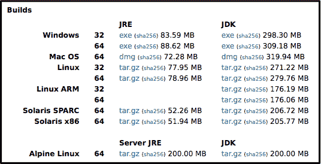

现在你已经在你的开发计算机上安装了 JDK 9，让我们看看一些可以帮助你将应用程序迁移到 Java 9 的工具。

# Java 环境 - jEnv

如果你在一个运行 Linux 或 macOS 的计算机上开发，你可能考虑使用 `jEnv`，这是一个开源的 Java 环境管理工具。这是一个命令行工具，所以不要期待有图形用户界面。你可以通过这个网址下载这个工具--[`github.com/gcuisinier/jenv`](https://github.com/gcuisinier/jenv)。

这是 Linux 的安装命令：

```java
$ git clone https://github.com/gcuisinier/jenv.git ~/.jenv
```

要使用 macOS 和 Homebrew 下载，请使用以下命令：

```java
$ brew install jenv
```

你也可以使用以下方式在 Linux 或 macOS 上使用 `Bash` 安装：

```java
$ echo 'export PATH="$HOME/.jenv/bin:$PATH"' >> ~/.bash_profile
$ echo 'eval "$(jenv init -)"' >> ~/.bash_profile
```

或者，你可以使用以下方式在 Linux 或 macOS 上使用 `Zsh` 安装：

```java
$ echo 'export PATH="$HOME/.jenv/bin:$PATH"' >> ~/.zshrc
$ echo 'eval "$(jenv init -)"' >> ~/.zshrc
```

在你安装了 `jEnv` 之后，你需要按照以下方式在你的系统上配置它。你需要修改脚本以反映你的实际路径：

```java
$ jenv add /Library/Java/JavaVirtualMachines/jdk17011.jdk/Contents/Home
```

你将需要为系统上的每个 JDK 版本重复执行 `jenv add` 命令。对于每个 `jenv add` 命令，你将收到确认，具体 JDK 版本已被添加到 `jEnv`，如下所示：

```java
$ jenv add /System/Library/Java/JavaVirtualMachines/1.6.0.jdk/Contents/Home
  oracle64-1.6.0.39 added
$ jenv add /Library/Java/JavaVirtualMachines/jdk17011.jdk/Contents/Home
  oracle64-1.7.0.11 added
```

你可以通过在命令提示符中使用 `$ jenv versions` 来检查你添加到 `jEnv` 的 JDK 版本。这将生成一个输出列表。

这里是三个额外的 `jEnv` 命令：

+   `jenv global <version>`：这将为全局设置版本

+   `jenv local <version>`：这将为本地设置版本

+   `jenv shell <version>`：这将为 shell 设置实例版本

# Maven

Maven 是一个开源工具，可用于构建和管理基于 Java 的项目。它已经支持 Java 9，并作为*Apache Maven 项目*的一部分。如果您尚未使用 Maven，并且进行大量 Java 开发，您可能会被以下 Maven 目标所吸引：

+   使构建过程变得简单

+   提供统一的构建系统

+   提供高质量的项目信息

+   提供最佳实践开发的指南

+   允许透明迁移到新功能

您可以在此站点阅读有关每个 Maven 目标的更多详细信息--[`maven.apache.org/what-is-maven.html`](https://maven.apache.org/what-is-maven.html)。要下载 Maven，请访问此站点--[`maven.apache.org/download.cgi`](https://maven.apache.org/download.cgi)。Windows、macOS、Linux 和 Solaris 的安装说明可在以下位置找到--[`maven.apache.org/install.html`](https://maven.apache.org/install.html)。

Maven 可以与 Eclipse（M2Eclipse）、JetBrains IntelliJ IDEA 和 Netbeans IDE 集成。以 M2Eclipse IDE 为例，它提供了丰富的 Apache Maven 集成，并具有以下功能：

+   您可以从 Eclipse 内部启动 Maven 构建

+   管理 Eclipse 构建路径的依赖项

+   容易解决 Maven 依赖项（您可以直接从 Eclipse 操作，而无需安装本地 Maven 仓库）

+   自动下载所需的依赖项（从远程 Maven 仓库）

+   使用软件向导创建新的 Maven 项目，创建`pom.xml`文件，并启用对您的纯 Java 项目的 Maven 支持

+   Maven 远程仓库的快速依赖项搜索

# 获取 M2Eclipse IDE

要获取 M2Eclipse IDE，您必须首先安装 Eclipse。以下是步骤：

1.  首先，打开您的当前 Eclipse IDE。接下来，选择首选项 | 安装/更新 | 可用软件站点，如以下截图所示：

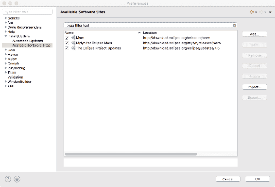

1.  下一个任务是向您的可用软件站点列表中添加 M2Eclipse 仓库站点。为此，请点击“添加”按钮，并在名称和位置文本输入框中输入值。对于名称，输入一些可以帮助您记住 M2Eclipse 位于此站点的信息。对于位置，输入 URL--`http://download.eclipse.org/technology/m2e/releases`。然后，点击“确定”按钮：

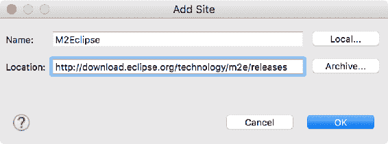

1.  您现在应该看到 M2Eclipse 站点列在您的可用软件站点列表中，如以下截图所示。您的最后一步是点击“确定”按钮：

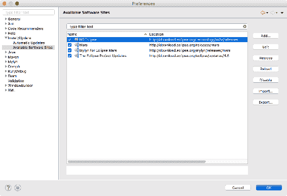

1.  现在，当您开始一个新项目时，您将看到“Maven 项目”作为选项：

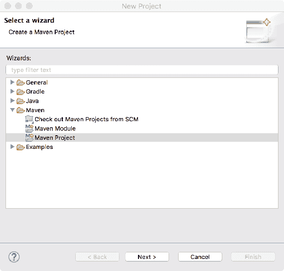

Maven 是 Java 开发者证明有效的工具。您可以考虑通过以下资源之一获取有关 Maven 的更多信息：

+   *Apache Maven 项目*：[`maven.apache.org/index.html`](https://maven.apache.org/index.html)

+   *Apache Maven 烹饪书*: [`www.packtpub.com/application-development/apache-maven-cookbook`](https://www.packtpub.com/application-development/apache-maven-cookbook)

+   *Apache Maven 3.0 烹饪书*: [`www.packtpub.com/application-development/apache-maven-3-cookbook`](https://www.packtpub.com/application-development/apache-maven-3-cookbook)

+   *Apache Maven 入门 [视频]*: [`www.packtpub.com/application-development/getting-started-apache-maven-video`](https://www.packtpub.com/application-development/getting-started-apache-maven-video)

# 摘要

在本章中，我们探讨了将现有应用程序迁移到 Java 9 平台可能涉及的问题。我们考虑了手动和半自动迁移过程。本章为您提供了使您的 Java 8 代码与 Java 9 兼容的见解和流程。具体来说，我们对 Project Jigsaw 进行了快速回顾，探讨了模块如何融入 Java 生态系统，提供了迁移规划的建议，分享了 Oracle 关于迁移的建议，并分享了您在开始使用 Java 9 时可以使用的工具。

在下一章中，我们将仔细研究 Java Shell 和 JShell API。我们将展示 JShell API 和 JShell 工具交互式评估 Java 编程语言的声明、语句和表达式的功能。我们将演示这个命令行工具的功能和使用方法。
