# 第七章：在 Java Shell 中进行实验

在上一章中，我们探讨了如何将 Java 9 之前的应用程序迁移到新的 Java 平台。我们检查了可能导致你的当前应用程序在 Java 9 上运行出现问题的几个问题。我们从 Project Jigsaw 的回顾开始，然后探讨了模块如何适应新的 Java 平台。我们为你提供了使你的 Java 8 代码与 Java 9 一起工作的见解和流程。具体来说，我们提供了迁移规划的建议、分享了 Oracle 关于迁移的建议，并分享了你可以使用的工具，以帮助你开始使用 Java 9。

在本章中，我们将首次了解 Java 9 中的新命令行工具，**读取-评估-打印循环**（也称为 **REPL**），即 **Java Shell**（**JShell**）。我们将从有关工具、读取-评估-打印循环概念的基础信息开始，然后进入用于 JShell 的命令和命令行选项。我们将采用实践者的方法来审查 Java Shell，并包括你可以尝试的示例。

本章涵盖了以下主题：

+   什么是 JShell？

+   开始使用 JShell

+   JShell 的实际用途

+   与脚本一起工作

# 什么是 JShell？

JShell 是 Java 9 中引入的一个新工具。它是一个交互式的读取-评估-打印循环工具，用于评估以下 Java 编程语言组件——声明、语句和表达式。它拥有自己的 API，因此可以被外部应用程序使用。

读取-评估-打印循环通常被称为 REPL，取自短语中每个单词的首字母。它也被称为语言壳或交互式顶层。

JShell 的引入是 **Java Enhancement Program** （**JEP**） 222 的结果。以下是关于 Java Shell 命令行工具的 JEP 的声明目标：

+   促进快速调查

+   促进快速编码

+   提供编辑历史

之前列出的快速调查和编码包括语句和表达式。令人印象深刻的是，这些语句和表达式不需要是方法的一部分。此外，变量和方法不需要是类的一部分，这使得这个工具特别灵活。

此外，以下列出的功能被包括进来，使 JShell 更易于使用，并使你在使用 JShell 的时间尽可能高效：

+   制表符自动完成

+   语句末尾分号的自动完成

+   导入的自动完成

+   定义自动完成

# 开始使用 JShell

JShell 是一个位于 `/bin` 文件夹中的命令行工具。此工具的语法是 `jshell <options> <load files>`。正如你所看到的，这个工具可以使用多个选项：

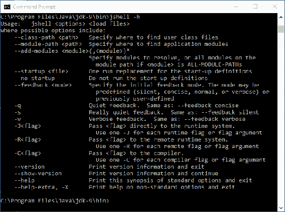

你已经看到了 `-h` 选项，我们通过 `jshell -h` 执行了它。这提供了 JShell 选项的列表。

要登录 JShell，您只需使用`jshell`命令。您会看到命令窗口中的提示符相应地改变：


退出 shell 就像输入`/exit`一样简单。一旦进入 JShell，您就可以输入以下任何命令：

| **命令** | **功能** |
| --- | --- |

| `/drop` | 使用此命令通过`name`或`id`引用删除源条目。以下是语法：

```java
    /drop <name or id>
```

|

| `/edit` | 使用此命令，您可以使用`name`或`id`引用编辑源条目。以下是语法：

```java
    /edit <name or id>
```

|

| `/env` | 此强大命令允许您查看或更改评估上下文。以下是语法：

```java
    /env [-class-path <path>] [-module-path <path>]
     [-add-modules <modules]
```

|

| `/exit` | 此命令用于退出 JShell。语法很简单，即`/exit`，没有可用的选项或参数。 |
| --- | --- |
| `/history` | 历史命令提供了您输入的历史记录。语法很简单，即`/history`，没有可用的选项或参数。 |
| `/<id>` |

```java
id. Here is the syntax: /<id>
```

您也可以通过引用第*n*个之前的代码片段来运行特定的代码片段，使用`/-<n>`。|

| `/imports` | 您可以使用此命令列出导入的项目。语法是`/imports`，它不接受任何选项或参数。 |
| --- | --- |

| `/list` | 此命令将列出您输入的源。以下是语法：

```java
    /list [<name or id> &#124; -all &#124; -start]
```

|

| `/methods` | 此命令列出所有声明的方法以及它们的签名。以下是语法：

```java
    /methods [<name or id> &#124; -all &#124; -start]
```

|

| `/open` | 使用此命令，您可以打开一个文件作为源输入。以下是语法：

```java
    /open <file>
```

|

| `/reload` | 重载命令允许您重置并重新播放相关历史记录。以下是语法：

```java
    /reload [-restore] [-quiet]  [-class-path 
     <path>] [-module-path <path>]
```

|

| `/reset` | 此命令重置 JShell。以下是语法：

```java
    /reset [-class-path <path>] [-module-path 
     <path>] [-add-modules <modules]
```

|

| `/save` | 此命令将代码片段源保存到您指定的文件中。以下是语法：

```java
    /save [-all &#124; -history &#124; -start] <file>
```

|

| `/set` | 此命令用于设置 JShell 配置信息。以下是语法：

```java
    /set editor &#124; start &#124; feedback &#124; mode &#124; prompt &#124; 
     truncation &#124; format
```

|

| `/types` | 此命令简单地列出声明的类型。以下是语法：

```java
    /types [<name or id> &#124; -all &#124; -start]
```

|

| `/vars` | 此命令列出所有声明的变量以及它们的值。以下是语法：

```java
    /vars [<name or id> &#124; -all &#124; -start]
```

|

| `/!` |
| --- |

```java
/!
```

|

列出的几个之前命令使用了术语**代码片段**。在 Java 9 和 JShell 的上下文中，代码片段是以下之一：

- 类声明

- 表达式

- 字段声明

- 导入声明

- 接口声明

- 方法声明

在 JShell 中输入`/help`或`/?`命令会提供可以在 shell 中使用的完整命令和语法列表。该列表如下所示：

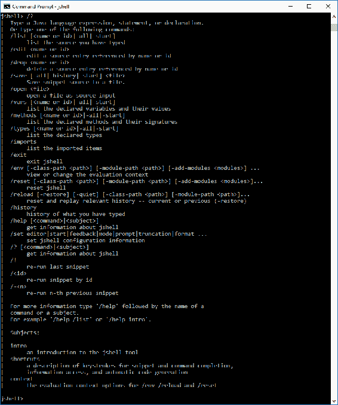

`/help`命令对于您刚开始使用 JShell 时特别有帮助。如您在以下屏幕截图中所见，只需输入`/help intro`命令，我们就可以获得 JShell 的介绍：

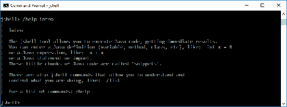

如果您经常使用 JShell，您可能从以下列出的快捷键中受益。您可以在 JShell 中使用`/help shortcuts`命令随时列出这些快捷键：

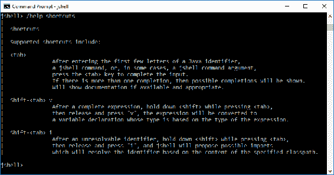

您可以通过在 JShell 中使用`/help`命令后跟您想要获取额外帮助的命令来从 JShell 内部获得更多帮助。例如，输入`/help reload`将提供关于`/reload`命令的详细信息。该信息如下：

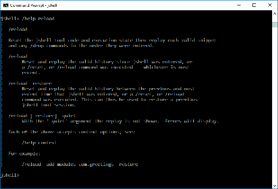

# JShell 的实际用途

无论您是新手开发者、经验丰富的开发者还是刚开始接触 Java，您都可能会发现 JShell 非常有用。在本节中，我们将探讨一些 JShell 的实际用途。具体来说，我们将涵盖：

+   反馈模式

+   列出您的资产

+   在 JShell 中编辑

# 反馈模式

命令行工具通常提供相对稀疏的反馈，以避免屏幕过于拥挤或成为开发者的麻烦。JShell 除了给开发者提供创建自定义模式的能力外，还有几种反馈模式。

如您从以下屏幕截图中所见，有四种反馈模式--`concise`、`normal`、`silent`和`verbose`。在这里，我们输入了`/set feedback`命令而没有任何参数，以列出反馈模式以及确定当前的反馈模式。输出第一行显示了将用于设置当前模式的命令行命令和参数集。因此，在以下屏幕截图中，当前的反馈模式设置为`verbose`，其他三种模式被列出：

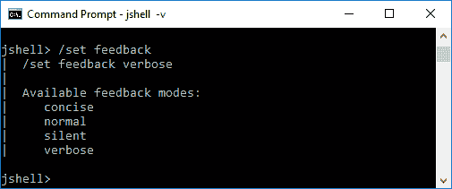

我们可以通过在启动 JShell 时包含一个选项来指定我们第一次进入 JShell 时想要进入的模式。以下是命令行选项：

| **命令行命令和选项** | **反馈模式** |
| --- | --- |
| `jshell -q` | `concise` |
| `jshell -n` | `normal` |
| `jshell -s` | `silent` |
| `jshell -v` | `verbose` |

您会注意到，我们使用`-q`来表示`concise`模式，而不是`-c`。`-c`选项具有`-c<flag>`语法，用于将`<flag>`传递给编译器。

最好的方法是通过使用示例来回顾不同反馈模式之间的差异。从`normal`模式开始，我们将执行命令行命令来完成以下顺序的反馈演示：

1.  创建变量。

1.  更新变量的值。

1.  创建方法。

1.  更新方法。

1.  运行方法。

为了开始我们的第一次测试，我们将在`jshell>`提示符下执行`/set feedback normal`命令，这将把 JShell 的反馈模式设置为`normal`。进入`normal`反馈模式后，我们将输入必要的命令来运行我们的演示：

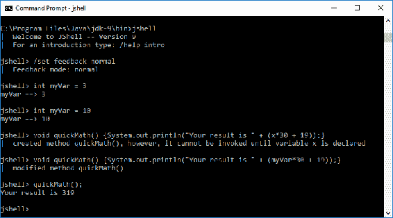

在进入`正常`反馈模式后，我们输入了`int myVar = 3`并收到了`myVar ==> 3`的反馈。在我们的下一个命令中，我们更改了相同变量的值，并收到了相同的新值输出。我们的下一个语句`void quickMath() {System.out.println("Your result is " + (x*30 + 19));}`使用了未声明的变量，您可以看到产生的两部分反馈——一部分指示方法已被创建，另一部分告知该方法在未声明的变量声明之前无法调用。接下来，我们将方法更改为包含`myVar`变量，反馈报告了方法的修改。我们的最后一步是使用`quickMath();`运行方法，结果正如我们所预期的。

让我们在`简洁`模式下尝试相同的反馈演示：

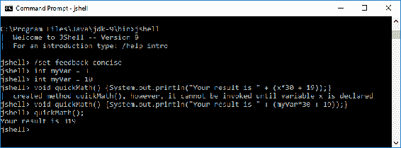

如您从前面的截图中所见，`简洁`反馈模式为我们提供的反馈信息要少得多。我们创建了并修改了变量，但没有收到任何反馈。当我们使用未声明的变量创建方法时，我们收到的反馈与`正常`模式下的反馈相同。我们更新了方法，但没有确认或其他反馈。

我们下一次使用反馈演示将在`静默`模式下：

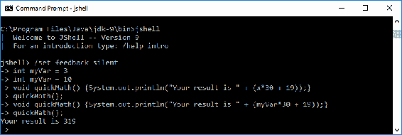

当我们进入`静默`反馈模式时，如您在前面的截图中所见，JShell 提示符从`jshell>`变为`->`。当我们创建`myVar`变量、修改`myVar`变量或创建`quickMath()`方法时，没有提供任何反馈。我们故意创建了一个使用未声明变量的`quickMath()`方法。因为我们处于`静默`反馈模式，所以我们没有被通知该方法有一个未声明的变量。基于这种缺乏反馈的情况，我们运行了方法，但没有提供任何输出或反馈。接下来，我们更新了方法以包含已声明的`myVar`变量，然后运行了该方法。

`静默`反馈模式可能看起来没有意义，因为没有提供任何反馈，但这个模式非常有用。使用`静默`模式可能适合管道操作，或者当你想要最小化终端输出量时。例如，你可以使用隐式的`System.out.println`命令包含特定的、条件性的输出。

我们最后一次使用反馈演示是在`详细`反馈模式下。正如您从其名称所假设的，这种反馈模式提供了最多的反馈。以下是我们的测试结果：

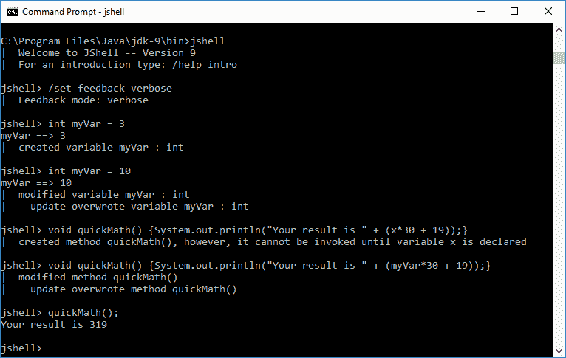

在我们的反馈演示中，使用`详细`反馈模式，我们收到了更多反馈以及更友好的反馈格式。

# 创建自定义反馈模式

虽然内部反馈模式（`normal`、`concise`、`silent` 和 `verbose`）不能修改，但您可以创建自己的自定义反馈模式。这个过程的第一步是复制一个现有模式。以下示例演示了如何使用 `/set mode myCustom verbose -command` 命令字符串将 `verbose` 模式复制到 `myCustom` 模式：


我们使用 `-command` 选项确保我们会收到命令反馈。您可以使用 `/set` 命令以及以下截图中的选项之一来对您的反馈模式进行各种更改：

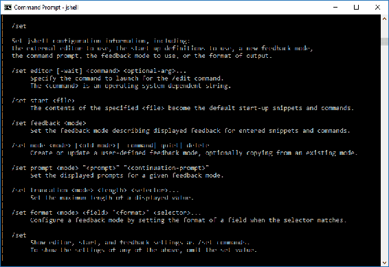

例如，让我们通过截断设置来了解它如何规定每行输出显示多少个字符。使用 `/set truncation` 命令，如下面的截图所示，显示了当前的截断设置：

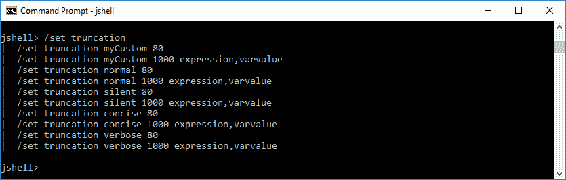

如您所见，我们的 `myCustom` 反馈模式具有 `80` 的截断。我们将使用 `/set truncation myCustom 60` 命令将其更改为 `60`，然后使用 `/set truncation` 命令进行验证：

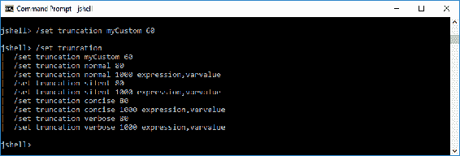

如前一个截图所示，我们的 `myCustom` 反馈模式的截断已成功从继承自 `verbose` 模式的 `80` 更改为 `60`，这是基于我们使用 `/set truncation myCustom 60` JShell 命令的结果。

# 列出您的资产

有几个 JShell 命令方便列出您创建的资产。使用上一节中的反馈演示，我们执行了 `/vars,` `/methods` 和 `/list` 命令，分别提供变量、方法和所有源列表：

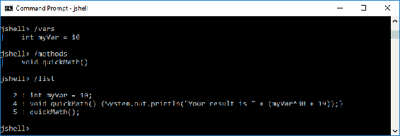

我们还可以使用 `/list -all` 命令和选项组合来查看 JShell 导入了哪些包。如下面的截图所示，JShell 导入了几个使我们在 shell 中工作更方便的包，节省了我们不得不在方法中导入这些标准包的时间：

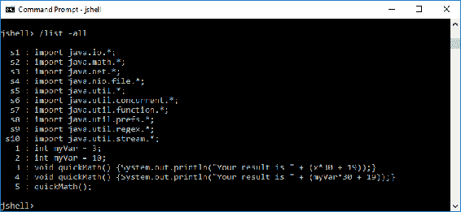

如果您只想列出启动导入，您可以使用 `/list -start` 命令和选项组合。如下面的截图所示，每个启动导入都有一个 "`s`" 前缀，并且是按数字顺序排列的：

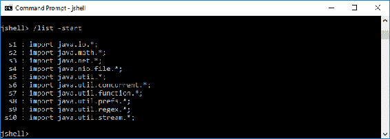

# 在 JShell 中编辑

JShell 不是一个功能齐全的文本编辑器，但在 shell 中您可以做几件事情。本节为您提供了编辑技巧，分为修改文本、基本导航、历史导航和高级编辑命令。

# 修改文本

默认的文本编辑/输入模式是您输入的文本将出现在当前光标位置。当您想要删除文本时，您有几个选项可供选择。以下是一个完整的列表：

| **删除动作** | **PC 键盘组合** | **Mac 键盘组合** |
| --- | --- | --- |
| 删除当前光标位置处的字符 | *Delete* | *Delete* |
| 删除光标左侧的字符 | *Backspace* | *Backspace* |
| 从光标位置删除到行尾的文本 | *Ctrl* + *K* | *Cmd* + *K* |
| 从光标位置删除到当前单词的末尾 | *Alt* + *D* | *Alt*/*Opt* + *D* |
| 从光标位置删除到前一个空白字符 | *Ctrl* + *W* | *Cmd* + *W* |
| 在光标位置粘贴最近删除的文本 | *Ctrl* + *Y* | *Cmd* + *Y* |
| 当使用*Ctrl* + *Y*（或在 Mac 上*c*md* - *E*）时，您可以使用*Alt* + *Y*键盘组合来循环浏览之前删除的文本 | *Alt* + *Y* | *Alt*/*Opt* + *Y* |

# 基本导航

虽然在 JShell 内部进行导航控制与大多数命令行编辑器相似，但列出基本导航控制列表是有帮助的：

| **键/键组合** | **导航动作** |
| --- | --- |
| *左箭头* | 向后移动一个字符 |
| *右箭头* | 向前移动一个字符 |
| *上箭头* | 向上移动一行，通过历史记录 |
| *下箭头* | 向下移动一行，通过历史记录 |
| *Return* | 输入（提交）当前行 |
| *Ctrl* + *A*（Mac 上的*c*md* - *A*） | 跳到当前行的开头 |
| *Ctrl* + *E*（Mac 上的*c*md* - *E*） | 跳到当前行的末尾 |
| *Alt* + *B* | 跳回一个单词 |
| *Alt* + *F* | 跳向前一个单词 |

# 历史导航

JShell 会记住您输入的片段和命令。它维护这个历史记录，以便您可以重复使用已经输入的片段和命令。要循环浏览片段和命令，您可以按住*Ctrl*键（Mac 上的*c*md* - *E*），然后使用上下箭头键，直到看到您想要的片段或命令。

# 高级编辑命令

还有更多编辑选项，包括搜索功能、宏的创建和使用等。JShell 的编辑器基于 JLine2，这是一个用于解析控制台输入和编辑的 Java 库。您可以在以下网址了解更多关于 JLine2 的信息：[`github.com/jline/jline2/wiki/JLine-2.x-Wiki`](https://github.com/jline/jline2/wiki/JLine-2.x-Wiki)。

# 使用脚本

到目前为止，您已经直接从键盘将数据输入到 JShell 中。您还有能力使用 JShell 脚本，这些脚本是一系列 JShell 命令和片段。其格式与其他脚本格式相同，每行一个命令。

在本节中，我们将探讨启动脚本，检查如何加载脚本，如何保存脚本，然后以 JShell 的高级脚本结束。

# 启动脚本

每次启动 JShell 时，都会加载启动脚本。这也发生在使用`/reset`、`/reload`和`/env`命令时。

默认情况下，JShell 使用 DEFAULT 启动脚本。如果你想使用不同的启动脚本，只需使用`/set start <script>`命令。以下是一个示例--`/set start MyStartupScript.jsh`。或者，你可以在命令提示符下使用`jshell --start MyStartupScript.jsh`命令来启动 JShell 并加载`MyStartupScript.jsh` JShell 启动脚本。

当你使用带有`-retain`选项的`/set start <script>`命令时，你是在告诉 JShell，下次你启动 JShell 时使用新的启动脚本。

# 加载脚本

在 JShell 中加载脚本可以通过以下方法之一完成：

+   你可以使用`/open`命令以及脚本的名称作为参数。例如，如果我们的脚本名称是`MyScript`，我们会使用`/open MyScript`。

+   加载脚本的第二种方法是使用命令提示符下的`jshell MyScript.jsh`。这将启动 JShell 并加载`MyScript.jsh` JShell 脚本。

# 保存脚本

除了在外部编辑器中创建 JShell 脚本，我们还可以在 JShell 环境中创建它们。采用这种方法时，你需要使用`/save`命令来保存你的脚本。正如以下截图所示，`/save`命令至少需要一个文件名参数：

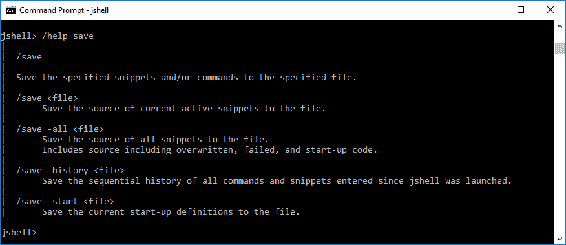

`/save`命令提供了三种选项供你选择：

+   `-all`选项可以将所有代码片段的源代码保存到指定的文件中。

+   `-history`选项保存自 JShell 启动以来输入的所有命令和代码片段的顺序历史。JShell 能够执行此操作表明它维护了你输入的所有内容的记录。

+   `-start`选项将当前启动定义保存到指定的文件中。

# 使用 JShell 进行高级脚本编写

JShell 的局限性是什么？你可以用这个工具做很多事情，实际上你只受限于你的想象力和编程能力。

让我们看看一个可以用于从 JShell 脚本编译和运行 Java 程序的先进代码库：

```java
    import java.util.concurrent.*
    import java.util.concurrent.*
    import java.util.stream.*
    import java.util.*

    void print2Console(String thetext) 
    { 
      System.out.println(thetext); 
      System.out.println("");
    }

    void runSomeProcess(String... args) throws Exception 
    { 
      String theProcess = 
        Arrays.asList(args).stream().collect(
         Collectors.joining(" ")); 
        print2Console("You asked me to run: '"+theProcess+"'"); 
        print2Console(""); 
        ProcessBuilder compileBuilder = new 
          ProcessBuilder(args).inheritIO(); 
        Process compileProc = compileBuilder.start(); 
        CompletableFuture<Process> compileTask =
         compileProc.onExit(); 
        compileTask.get();
    }

    print2Console("JShell session launched.")
    print2Console("Preparing to compile Sample.java. . . ")

    // run the Java Compiler to complete Sample.java
    runSomeProcess("javac", "Sample.java")
    print2Console("Compilation complete.")
    print2Console("Preparing to run Sample.class...")

    // run the Sample.class file
    runSomeProcess("java", "Sample")
    print2Console("Run Cycle compete.")

    // exit JShell
    print2Console("JShell Termination in progress...)
    print2Console("Session ended.")

    /exit
```

正如这个脚本所示，我们创建了一个`runSomeProcess()`方法，并可以使用它来显式编译和运行外部 Java 文件。

# 摘要

在本章中，我们探讨了 JShell，Java 9 的新读-求值-打印循环命令行工具。我们从有关该工具的简介开始，并仔细研究了读-求值-打印循环的概念。我们花了大量时间回顾 JShell 命令和命令行选项。我们的内容涵盖了反馈模式、资产列表和 shell 中的编辑的实际指南。我们还获得了使用脚本的经验。

在下一章中，我们将探讨 Java 9 的新默认垃圾回收器。具体来说，我们将探讨默认垃圾回收、已弃用的垃圾回收组合，并检查垃圾回收日志。
