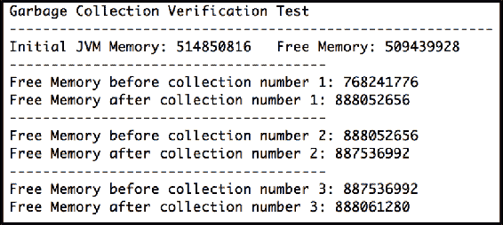
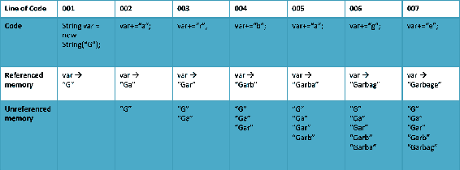
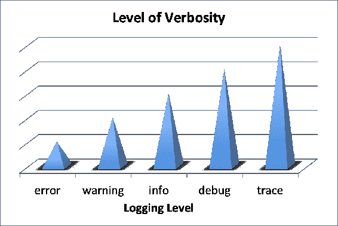

# 第八章：利用新的默认 G1 垃圾回收器

在上一章中，我们考察了**Java Shell**（**JShell**），Java 9 的新**读取-评估-打印循环**（**REPL**）命令行工具。我们从关于该工具的简介开始，并仔细研究了读取-评估-打印循环的概念。我们花费了大量时间回顾 JShell 命令和命令行选项。我们的覆盖范围包括关于反馈模式、资产列出和 shell 中的编辑的实际指南。我们还获得了使用脚本的经验。

在本章中，我们将深入探讨**垃圾回收**及其在 Java 9 中的处理方式。我们将从垃圾回收的概述开始，然后查看 Java 9 之前的特定细节。有了这些基础知识，我们将查看 Java 9 平台中的特定垃圾回收更改。最后，我们将探讨一些即使在 Java 9 之后仍然存在的垃圾回收问题。

本章涵盖了以下主题：

+   垃圾回收概述

+   Java 9 之前的垃圾回收方案

+   使用新的 Java 平台收集垃圾

+   持续性问题

# 垃圾回收概述

垃圾回收是 Java 中用来释放未使用内存的机制。本质上，当创建一个对象时，会分配内存空间并专门用于该对象，直到没有任何引用指向它。在那个时刻，系统会释放内存。Java 为我们自动执行垃圾回收，这可能导致对内存使用和内存管理及系统性能方面的编程实践缺乏关注。

Java 的垃圾回收被认为是自动内存管理方案，因为程序员不需要指定对象为准备释放的。垃圾回收在低优先级线程上运行，正如你将在本章后面读到的，它有可变的执行周期。

在我们关于垃圾回收的概述中，我们将探讨以下概念：

+   对象生命周期

+   垃圾回收算法

+   垃圾回收选项

+   与垃圾回收相关的 Java 方法

我们将在接下来的章节中逐一探讨这些概念。

# 对象生命周期

为了完全理解 Java 的垃圾回收，我们需要查看对象的整个生命周期。因为 Java 中垃圾回收的核心是自动的，所以看到“垃圾回收”和“内存管理”作为对象生命周期的假设组成部分并不罕见。

我们将开始回顾对象的生命周期，从对象的创建开始。

# 对象创建

对象被声明和创建。当我们编写对象声明或声明对象时，我们是在声明一个名称或标识符，以便我们可以引用对象。例如，以下代码行声明`myObjectName`为类型`CapuchinMonkey`的对象名称。在此点，没有创建对象，也没有为其分配内存：

```java
    CapuchinMonkey myObjectName;
```

我们使用`new`关键字来创建对象。以下示例说明了如何调用`new`操作来创建对象。这个操作会导致：

```java
    myObjectName = new CapuchinMonkey();
```

当然，我们可以通过使用`CapuchinMonkey myObjectName = new CapuchinMonkey();`而不是`CapuchinMonkey myObjectName;`和`myObjectName = new CapuchinMonkey();`来合并声明和创建语句。在前面的例子中，它们被分开是为了说明目的。

当一个对象被创建时，为存储该对象分配了特定数量的内存。分配的内存量可能因架构和 JVM 而异。

接下来，看看一个对象的中期生命周期。

# 对象中期

对象被创建，Java 为存储该对象分配系统内存。如果对象未被使用，分配给它的内存被认为是浪费的。这是我们想要避免的。即使是小型应用程序，这种类型的内存浪费也可能导致性能下降，甚至出现内存不足的问题。

我们的目标是释放或释放我们不再需要的任何先前分配的内存。幸运的是，在 Java 中，有一个处理此问题的机制。它被称为垃圾回收。

当一个对象，比如我们的`myObjectName`示例，不再有任何引用指向它时，系统将重新分配相关的内存。

# 对象销毁

Java 拥有一个在代码的阴暗角落（通常是一个低优先级线程）运行的垃圾回收器，并释放当前分配给未引用对象的内存，这一想法很有吸引力。那么，它是如何工作的呢？垃圾回收系统会监控对象，并在可能的情况下，计算每个对象的引用数量。

当一个对象没有引用时，当前运行的代码无法访问它，因此释放相关的内存是合理的。

术语**内存泄漏**指的是那些可能丢失或不当释放的小内存块。这些泄漏可以通过 Java 的垃圾回收避免。

# 垃圾回收算法

Java 虚拟机有几种垃圾回收算法或类型可供使用。在本节中，我们将介绍以下垃圾回收算法：

+   标记和清除

+   CMS 垃圾回收

+   序列垃圾回收

+   并行垃圾回收

+   G1 垃圾回收

# 标记和清除

Java 的初始垃圾回收算法，*标记和清除*，使用了一个简单的两步过程：

1.  Java 的第一步，标记，是遍历所有具有可访问引用的对象，将这些对象标记为存活。

1.  第二步，清除，涉及扫描海洋中任何未标记的对象。

如您所容易确定的，标记和清除算法似乎很有效，但由于这种方法的两步性质，可能不是非常高效。这最终导致 Java 垃圾回收系统效率大幅提高。

# 并发标记清除（CMS）垃圾回收

垃圾回收的 **并发标记清除** （**CMS**）算法使用多个线程扫描堆内存。类似于标记和清除方法，它标记要删除的对象，然后进行清除以实际删除这些对象。这种垃圾回收方法本质上是一种升级的标记和清除方法。它被修改以利用更快的系统并提高了性能。

要手动调用您应用程序的并发标记清除垃圾回收算法，请使用以下命令行选项：

```java
-XX:+UseConcMarkSweepGC 
```

如果您想使用并发标记清除垃圾回收算法并指定要使用的线程数，可以使用以下命令行选项。在以下示例中，我们告诉 Java 平台使用八个线程的并发标记清除垃圾回收算法：

```java
-XX:ParallelCMSThreads=8
```

# 串行垃圾回收

Java 的串行垃圾回收在单个线程上工作。在执行时，它会冻结所有其他线程，直到垃圾回收操作完成。由于串行垃圾回收的线程冻结特性，它仅适用于非常小的程序。

要手动调用您应用程序的串行垃圾回收算法，请使用以下命令行选项：

```java
-XX:+UseSerialGC
```

# 并行垃圾回收

在 Java 9 之前，并行垃圾回收算法是默认的垃圾回收器。它使用多个线程，但直到垃圾回收功能完成，应用程序中的所有非垃圾回收线程都会被冻结，就像串行垃圾回收算法一样。

# G1 垃圾回收

G1 垃圾回收算法是为与大型内存堆一起使用而创建的。这种方法涉及将内存堆分割成区域。使用 G1 算法进行的垃圾回收与每个堆区域并行进行。

G1 算法的另一部分是，当内存被释放时，堆空间会被压缩。不幸的是，压缩操作使用的是 *停止世界* 方法。

G1 垃圾回收算法还根据需要收集最多垃圾的区域进行优先级排序。

G1 名称指的是垃圾优先。

要手动调用您应用程序的 G1 垃圾回收算法，请使用以下命令行选项：

```java
-XX:+UseG1GC
```

# 垃圾回收选项

这里是 JVM 大小选项列表：

| **大小描述** | **JVM 选项标志** |
| --- | --- |
| 设置初始堆大小（年轻代空间加老年代空间）。 | `-XX:InitialHeapSize=3g` |
| 设置最大堆大小（年轻代空间加老年代空间）。 | `-XX:MaxHeapSize=3g` |
| 设置初始和最大堆大小（年轻代空间加老年代空间）。 | `-Xms2048m -Xmx3g` |
| 设置年轻代的大小。 | `-XX:NewSize=128m` |
| 设置年轻代的最大大小。 | `-XX:MaxNewSize=128m` |
| 设置年轻空间大小。使用年轻空间与老年代空间的比例。在右侧的示例标志中，`3`表示年轻空间将是老年代空间的三分之一。 | `-XX:NewRation=3` |
| 设置单存活空间大小作为 Eden 空间大小的部分。 | `-XX:SurvivorRatio=15` |
| 设置永久空间初始大小。 | `-XX:PermSize=512m` |
| 设置永久空间的最大大小。 | `-XX:MaxPermSize=512m` |
| 设置每个线程专用的堆栈区域大小（以 bytes 为单位）。 | `-Xss512k` |
| 设置每个线程专用的堆栈区域大小（以 Kbytes 为单位）。 | `-XX:ThreadStackSize=512` |
| 设置 JVM 可用的堆外内存的最大大小。 | `-XX:MaxDirectMemorySize=3g` |

这里是年轻代垃圾收集选项列表：

| **年轻代垃圾收集调整选项** | **标志** |
| --- | --- |
| 设置对象从年轻代晋升到老年代之前收集的初始次数。这被称为**存活阈值**。 | `-XX:InitialTenuringThreshold=16` |
| 设置最大存活阈值。 | `-XX:MaxTenuringThreshold=30` |
| 设置在年轻空间中允许分配的最大对象大小。如果一个对象大于最大大小，它将被分配到老年代空间，并绕过年轻空间。 | `-XX:PretenureSizeThreshold=3m` |
| 这可以用来将所有在年轻代收集中存活的年轻对象晋升到老年代空间。 | `-XX:+AlwaysTenure` |
| 使用此标志，只要存活空间有足够的空间，年轻空间的对象永远不会晋升到老年代空间。 | `-XX:+NeverTenure` |
| 我们可以在年轻空间中指示使用线程局部分配块。这是默认启用的。 | `-XX:+UseTLAB` |
| 切换此选项以允许 JVM 自适应调整线程的**TLAB**（**线程局部分配块**）大小。 | `-XX:+ResizeTLAB` |
| 设置线程 TLAB 的初始大小。 | `-XX:TLABSize=2m` |
| 设置 TLAB 的最小允许大小。 | `-XX:MinTLABSize=128k` |

这里是**并发标记清除**（**CMS**）调整选项列表：

| **CMS 调整选项** | **标志** |
| --- | --- |
| 指示您只想使用占用率作为启动 CMS 收集操作的准则。 | `-XX:+UseCMSInitiatingOccupancyOnly` |
| 设置 CMS 生成占用百分比以启动 CMS 收集周期。如果您指定一个负数，您是在告诉 JVM 您想使用`CMSTriggerRatio`。 | `-XX:CMSInitiatingOccupancyFraction=70` |
| 设置您想要启动 CMS 收集以进行引导收集统计信息的 CMS 生成占用百分比。 | `-XX:CMSBootstrapOccupancy=10` |
| 这是 CMS 生成中`MinHeapFreeRatio`的百分比，在 CMS 周期开始之前分配。 | `-XX:CMSTriggerRatio=70` |
| 设置在启动 CMS 收集周期之前分配到 CMS 永久生成中的`MinHeapFreeRatio`的百分比。 | `-XX:CMSTriggerPermRatio=90` |
| 这是触发 CMS 收集后的等待持续时间。使用此参数指定 CMS 被允许等待年轻收集的时间长度。`-XX:CMSWaitDuration=2000` |
| 启用并行 remark。`-XX:+CMSParallelRemarkEnabled` |
| 启用幸存空间的并行 remark。`-XX:+CMSParallelSurvivorRemarkEnabled` |
| 你可以使用此选项在 remark 阶段之前强制进行年轻收集。`-XX:+CMSScavengeBeforeRemark` |
| 使用此选项以防止 Eden 使用低于阈值时安排 remark。`-XX:+CMSScheduleRemarkEdenSizeThreshold` |
| 设置你想要 CMS 尝试安排 remark 暂停的 Eden 占用百分比。`-XX:CMSScheduleRemarkEdenPenetration=20` |
| 在年轻代占用达到你想要安排 remark 的大小（在我们的示例中为右侧的大小）的 1/4 之前，你想要开始采样 Eden 顶部。`-XX:CMSScheduleRemarkSamplingRatio=4` |
| 你可以选择 remark 之后的验证的`variant=1`或`variant=2`。`-XX:CMSRemarkVerifyVariant=1` |
| 选择使用并行算法进行年轻空间收集。`-XX:+UseParNewGC` |
| 启用并发阶段的多线程使用。`-XX:+CMSConcurrentMTEnabled` |
| 设置用于并发阶段的并行线程数。`-XX:ConcGCThreads=2` |
| 设置你想要用于*stop-the-world*阶段的并行线程数。`-XX:ParallelGCThreads=2` |
| 你可以启用**增量 CMS**（**iCMS**）模式。`-XX:+CMSIncrementalMode` |
| 如果此选项未启用，CMS 将不会清理永久空间。`-XX:+CMSClassUnloadingEnabled` |
| 这允许`System.gc()`触发并发收集而不是完整的垃圾收集周期。`-XX:+ExplicitGCInvokesConcurrent` |
| 这允许`System.gc()`触发永久空间的并发收集。`-XX:+ExplicitGCInvokesConcurrentAndUnloadsClasses` |

**iCMS**（增量并发标记清除）模式适用于 CPU 数量较少的服务器。它不应在现代硬件上使用。

这里有一些杂项垃圾收集选项：

| **杂项垃圾收集选项** | **标志** |
| --- | --- |
| 这将导致 JVM 忽略应用程序对`System.gc()`方法的调用。`-XX:+DisableExplicitGC` |
| 这是堆中每 MB 空闲空间中（软引用）存活时间的毫秒数。`-XX:SoftRefLRUPolicyMSPerMB=2000` |
| 这是用于限制在抛出`OutOfMemory`错误之前垃圾收集所花费时间的**使用策略**。`-XX:+UseGCOverheadLimit` |
| 这限制了在抛出`OutOfMemory`错误之前垃圾收集所花费的时间比例。这通常与`GCHeapFreeLimit`一起使用。`-XX:GCTimeLimit=95` |
| 这设置了在抛出`OutOfMemory`错误之前，在完全垃圾收集后堆中空闲空间的最低百分比。这通常与`GCTimeLimit`一起使用。`-XX:GCHeapFreeLimit=5` |

最后，这里有一些 G1 特定的选项。请注意，这些选项从 JVM 6u26 开始都得到了支持：

| **G1 垃圾回收选项** | **标志** |
| --- | --- |
| 堆区域的大小。默认为 2,048，可接受的范围是 1 MiB 到 32 MiB。 | `-XX:G1HeapRegionSize=16m` |
| 这是信心系数暂停预测启发式算法。 | `-XX:G1ConfidencePercent=75` |
| 这决定了堆的最小保留量。 | `-XX:G1ReservePercent=5` |
| 这是每个 MMU 的垃圾回收时间——时间片（以毫秒为单位）。 | `-XX:MaxGCPauseMillis=100` |
| 这是每个 MMU 的暂停间隔时间片（以毫秒为单位）。 | `-XX:GCPauseIntervalMillis=200` |

**MiB** 代表 **Mebibyte**，它是数字信息的字节数的倍数。

# 与垃圾回收相关的 Java 方法

让我们看看与垃圾回收相关的两个具体方法。

# 系统的 `gc()` 方法

虽然在 Java 中垃圾回收是自动的，但你可以通过显式调用 `java.lang.System.gc()` 方法来帮助调试过程。这个方法不接受任何参数，也不返回任何值。这是一个显式调用，它会运行 Java 的垃圾回收器。以下是一个示例实现：

```java
    System.gc();
    System.out.println("Garbage collected and unused 
     memory has been deallocated.");
```

让我们来看一个更深入的例子。在下面的代码中，我们首先通过 `Runtime myRuntime = Runtime.getRuntime();` 创建 `Runtime` 的一个实例，它返回一个单例。这使我们能够访问 JVM。在打印一些标题信息和初始内存统计信息后，我们创建了一个大小为 `300000` 的 `ArrayList`。然后，我们创建了一个循环，生成 `100000` 个数组列表对象。最后，我们通过三次输出，在每次之间暂停 `1` 秒，请求 JVM 调用垃圾回收器。以下是源代码：

```java
    package MyGarbageCollectionSuite;

    import java.util.ArrayList;
    import java.util.concurrent.TimeUnit;

    public class GCVerificationTest 
    {
      public static void main(String[] args) throws 
       InterruptedException 
       {
         // Obtain a Runtime instance (to communicate
          with the JVM)
         Runtime myRuntime = Runtime.getRuntime();

         // Set header information and output initial 
          memory stats
         System.out.println("Garbage Collection
          Verification Test");
         System.out.println("-----------------------------
          -----------------------------");
         System.out.println("Initial JVM Memory: " + 
          myRuntime.totalMemory() + 
            "tFree Memory: " + myRuntime.freeMemory());

         // Use a bunch of memory
         ArrayList<Integer> AccountNumbers = new 
          ArrayList<>(300000);
         for (int i = 0; i < 100000; i++)
         {
           AccountNumbers = new ArrayList<>(3000);
           AccountNumbers = null;
         }

         // Provide update with with three passes
         for (int i = 0; i < 3; i++)
         {
           System.out.println("---------------------------
            -----------");
           System.out.println("Free Memory before
            collection number " + 
              (i+1) + ": " + myRuntime.freeMemory());
           System.gc();
           System.out.println("Free Memory after
            collection number " + 
              (i+1) + ": " + myRuntime.freeMemory());
           TimeUnit.SECONDS.sleep(1); // delay thread 
            1 second
         }

       }

    }
```

如您从以下输出中看到的，垃圾回收器在第一次甚至第二次遍历中并没有重新分配所有的 '垃圾'：



使用 `System.gc()` 方法调用垃圾回收器有一个替代方案。在我们的例子中，我们本可以使用 `myRuntime.gc()`，我们之前的单例示例。

# `finalize()` 方法

你可以将 Java 的垃圾回收器想象成一个死神。当它从内存中移除某个东西时，它就消失了。这个所谓的死神并非没有同情心，因为它为每个方法提供了最后的遗言。对象通过 `finalize()` 方法来传达他们的 *最后遗言*。如果一个对象有 `finalize()` 方法，垃圾回收器在移除对象和释放相关内存之前会调用它。这个方法不接受任何参数，并且返回类型为 `void`。

`finalize()`方法只会被调用一次，其运行时可能会有变化。当然，该方法在移除之前会被调用，但垃圾回收器何时运行取决于系统。例如，如果您有一个相对较小的应用程序，在运行内存丰富的系统上，垃圾回收器可能根本不会运行。那么，为什么还要包含一个`finalize()`方法呢？被认为是不良的编程实践去重写`finalize()`方法。尽管如此，如果需要，您仍然可以使用该方法。实际上，您可以在那里添加代码，为您的对象添加引用，以确保它不会被垃圾回收器移除。再次强调，这并不建议。

因为在 Java 中，所有对象，即使是您自己创建的对象，也都是`java.lang.Object`的子类，所以 Java 中的每个对象都有一个`finalize()`方法。

即使垃圾回收器非常复杂，它可能也不会像您希望的那样关闭数据库、文件或网络连接。如果您的应用程序在对象被收集时需要特定的考虑，您可以重写对象的`finalize()`方法。

这里有一个示例实现，演示了您可能想要重写对象`finalize()`方法的用例：

```java
    public class Animal 
    {
      private static String animalName;
      private static String animalBreed;
      private static int objectTally = 0;

      // constructor
      public Animal(String name, String type) 
      {
        animalName = name;
        animalBreed = type;

       // increment count of object
        ++objectTally;
      }

      protected void finalize()
      {
        // decrement object count each time this method
        // is called by the garbage collector
        --objectTally;

        //Provide output to user
        System.out.println(animalName + " has been 
         removed from memory.");

        // condition for 1 animal (use singular form)
        if (objectTally == 1) 
        {
          System.out.println("You have " + objectTally + "
           animal remaining.");
        }

        // condition for 0 or greater than 1 
         animals (use plural form)
        else 
        {
          System.out.println("You have " + objectTally + "
           animals remaining.");
        }

      }

    }
```

如您在前面代码中看到的，每当创建一个`Animal`类型的对象时，`objectTally`计数就会增加，当垃圾回收器移除一个对象时，计数就会减少。

通常不建议重写对象的`finalize()`方法。`finalize()`方法通常应该声明为`protected`。

# Java 9 之前的垃圾回收

Java 的垃圾回收并非从 Java 9 开始，它自 Java 的初始发布以来就存在了。Java 长期以来一直拥有一个复杂的垃圾回收系统，它是自动的，在后台运行。我们所说的在后台运行，是指垃圾回收过程在空闲时间运行。

空闲时间指的是输入/输出之间的时间，例如键盘输入、鼠标点击和输出生成之间的时间。

这种自动垃圾回收一直是开发者选择 Java 作为编程解决方案的关键因素之一。其他编程语言，如 C#和 Objective-C，在 Java 平台成功之后也实现了垃圾回收。

在我们查看 Java 9 平台垃圾回收的更改之前，让我们先看看以下列出的概念：

+   可视化垃圾回收

+   Java 8 中的垃圾回收升级

+   案例研究 - 使用 Java 编写的游戏

# 可视化垃圾回收

```java
Garbage:
```

```java
    001 String var = new String("G");
    002 var += "a";
    003 var += "r";
    004 var += "b";
    005 var += "a";
    006 var += "g";
    007 var += "e";
    008 System.out.println("Your completed String
     is: " + var + ".");
```

显然，前面的代码生成了以下输出：

```java
    Your completed String is Garbage.
```

可能不清楚的是，示例代码导致五个未引用的字符串对象。这部分原因是字符串是不可变的。如您在以下插图中所见，随着每行代码的连续执行，引用的对象被更新，而另一个对象则变为未引用：



列出的先前未引用的对象当然不会打破内存银行，但它表明大量未引用的对象可以迅速积累。

# Java 8 的垃圾回收升级

截至 Java 8，默认的垃圾回收算法是并行垃圾回收器。Java 8 的发布带来了对 G1 垃圾回收系统的某些改进。这些改进之一是能够使用以下命令行选项通过删除重复的字符串值来优化堆内存：

```java
-XX:+UseStringDeduplication
```

当 G1 垃圾回收器看到字符串时，它可以查看字符数组。然后它将值存储起来，并使用一个新的弱引用将字符数组存储起来。如果 G1 垃圾回收器找到一个具有相同哈希码的字符串，它将逐字符比较这两个字符串。如果找到匹配项，两个字符串最终都会指向同一个字符数组。具体来说，第一个字符串将指向第二个字符串的字符数组。

此方法可能需要大量的处理开销，并且只有在被认为有益或绝对必要时才应使用。

# 案例研究 - 使用 Java 编写的游戏

多玩家游戏需要广泛的管理技术，包括服务器和客户端系统。JVM 在一个低优先级的线程中运行垃圾回收线程，并定期运行。服务器管理员以前使用现在已过时的 `-Xincgc` 命令行选项来避免当服务器过载时发生的**服务器停滞**。目标是让垃圾回收更频繁地运行，并且每次执行周期都更短。

在考虑内存使用和垃圾回收时，尽可能在目标系统上使用最少的内存，并在可行范围内将垃圾回收的暂停时间限制到最小。这些提示对于游戏、模拟和其他需要实时性能的应用程序尤为重要。

JVM 管理存储 Java 内存的区域。JVM 默认以一个小堆开始，随着更多对象的创建而增长。堆有两个分区--年轻代和旧代。当对象最初创建时，它们在年轻代中创建。持久对象被移动到旧代。对象的创建通常非常快，只需指针增量即可。年轻代的处理速度比旧代快得多。这对于整体应用或在我们的情况下，游戏的效率来说非常重要。

对于我们来说，监控游戏的内存使用情况和垃圾回收发生的时间变得非常重要。为了监控垃圾回收，我们可以在启动游戏时添加详细标志（`-verbose:gc`），例如以下示例：

```java
java -verbose:gc MyJavaGameClass
```

JVM 将为每次垃圾回收提供一行格式化的输出。以下是详细 GC 输出的格式：

```java
    [<TYPE> <MEMORY USED BEFORE> -> MEMORY USED AFTER
     (TOTAL HEAP SIZE), <TIME>]
```

让我们看看两个例子。在这个第一个例子中，我们看到`GC`类型指的是我们之前讨论过的年轻代：

```java
    [GC 31924K -> 29732K(42234K), 0.0019319 secs]
```

在这个第二个例子中，`Full GC`表示对内存堆的旧年代分区进行了垃圾收集操作：

```java
    [Full GC 29732K -> 10911K(42234K), 0.0319319 secs]
```

您可以使用`-XX:+PrintGCDetails`选项从垃圾收集器获取更详细的信息，如下所示：

```java
java -verbose:gc -XX:+PrintGCDetails MyJavaGameClass
```

# 使用新的 Java 平台收集垃圾

Java 从发布之初就提供了自动垃圾收集功能，使其成为许多程序员的开发平台选择。在其它编程语言中避免手动内存管理变得很常见。我们已经深入研究了垃圾收集系统，包括 JVM 使用的各种方法或算法。Java 9 对垃圾收集系统进行了一些相关更改，并成为三个**Java 增强计划**（**JEP**）问题的焦点。这些问题如下所示：

+   默认垃圾收集（JEP 248）

+   废弃的垃圾收集组合（JEP 214）

+   统一垃圾收集日志（JEP 271）

我们将在以下各节中回顾这些垃圾收集概念及其相应的**Java 增强计划**（**JEP**）问题。

# 默认垃圾收集

我们之前详细介绍了 Java 9 之前 JVM 使用的以下垃圾收集方法。这些仍然是可能的垃圾收集算法：

+   CMS 垃圾收集

+   串行垃圾收集

+   并行垃圾收集

+   G1 垃圾收集

让我们简要回顾一下这些方法：

+   **CMS 垃圾收集**：CMS 垃圾收集算法使用多个线程扫描堆内存。使用这种方法，JVM 标记要删除的对象，然后进行清扫以实际删除它们。

+   **串行垃圾收集**：这种方法在单个线程上使用无线程冻结模式。当垃圾收集正在进行时，它会冻结所有其他线程，直到垃圾收集操作完成。由于串行垃圾收集的线程冻结特性，它仅适用于非常小的程序。

+   **并行垃圾收集**：这种方法使用多个线程，但在垃圾收集功能完成之前，应用程序中的所有非垃圾收集线程都会被冻结，就像串行垃圾收集算法一样。

+   **G1 垃圾收集**：这是具有以下特征的垃圾收集算法：

    +   与大内存堆一起使用

    +   包括将内存堆分割成区域

    +   与每个堆区域并行进行

    +   在内存释放时压缩堆空间

    +   使用*停止世界*方法进行压缩操作

    +   根据需要收集的垃圾量最多的区域进行优先级排序

在 Java 9 之前，并行垃圾收集算法是默认的垃圾收集器。在 Java 9 中，G1 垃圾收集器是 Java 内存管理系统的新的默认实现。这对于 32 位和 64 位的服务器配置都是正确的。

Oracle 评估认为，由于 G1 垃圾收集器具有低暂停时间的特点，它比并行方法是一个更好的垃圾收集方法。这一变化基于以下概念：

+   限制延迟很重要

+   最大化吞吐量不如限制延迟重要

+   G1 垃圾收集算法是稳定的

在将 G1 垃圾收集方法作为默认方法而不是并行方法时，涉及两个假设：

+   将 G1 作为默认的垃圾回收方法将显著增加其使用率。这种增加的使用率可能会揭示之前在 Java 9 之前未意识到的性能或稳定性问题。

+   G1 方法比并行方法更占用处理器资源。在某些用例中，这可能会有些问题。

表面上看，这个变化可能对 Java 9 来说是一个巨大的进步，而且这完全可能是事实。然而，在盲目接受这个新的默认收集方法时，应该谨慎行事。建议在切换到 G1 时测试系统，以确保您的应用程序不会因性能下降或由 G1 使用引起的问题而受到影响。如前所述，G1 没有像并行方法那样受益于广泛的测试。

最后一点关于缺乏广泛测试的重要性是显著的。在 Java 9 中将 G1 作为默认的自动内存管理（垃圾收集）系统，相当于将开发者变成了不知情的测试者。虽然预期不会有重大问题，但知道在使用 Java 9 中的 G1 时可能存在性能和稳定性问题，这将更加重视测试您的 Java 9 应用程序。

# 弃用的垃圾回收组合

Oracle 在从 Java 平台的新版本中移除功能、API 和库之前，一直很擅长弃用它们。有了这个方案，Java 8 中弃用的语言组件将在 Java 9 中被移除。有几个被认为是很少使用并已在 Java 8 中弃用的垃圾回收组合。这些组合，如列表所示，已在 Java 9 中被移除：

+   DefNew + CMS

+   ParNew + SerialOld

+   增量内容管理系统

这些组合，除了很少使用外，还为垃圾回收系统引入了一个不必要的复杂性级别。这导致了系统资源的额外消耗，而没有为用户或开发者提供相应的利益。

以下列出的垃圾回收配置受到了之前在 Java 8 平台上提到的弃用的影响：

| **垃圾收集配置** | **标志(s)** |
| --- | --- |
| DefNew + CMS | `-XX:+UseParNewGC``-XX:UseConcMarkSweepGC` |
| ParNew + SerialOld | `-XX:+UseParNewGC` |
| ParNew + SerialOld | `-XX:+UseParNewGC` |
| ParNew + iCMS | `-XX:+CMSIncrementalMode` `-XX:+UseConcMarkSweepGC` |
| Defnew + ICMS | `-XX:+CMSIncrementalMode` `-XX:+UseConcMarkSweepGC` `-XX:-UseParNewGC` |

**Java 增强计划 214** （**JEP 214**）移除了在 JDK 8 中过时的垃圾回收组合。这些组合在上文中列出，以及控制这些组合的标志。此外，移除了启用 CMS 前台收集的标志，并且这些标志不在 JDK 9 中。以下列出了这些标志：

| **垃圾回收组合** | **标志** |
| --- | --- |
| CMS 前台 | `-XX:+UseCMSCompactAtFullCollection` |
| CMS 前台 | `-XX+CMSFullGCsBeforeCompaction` |
| CMS 前台 | `-XX+UseCMSCollectionPassing` |

移除已过时的垃圾回收组合的唯一缺点是，使用本节中列出的任何标志的 JVM 启动文件的应用程序，需要修改它们的 JVM 启动文件以删除或替换旧标志。

# 统一垃圾回收日志

标题为 *统一垃圾回收日志* 的 **Java 增强计划#271** （**JEP-271**）旨在重新实现垃圾回收日志，使用之前在 JEP-158 中引入的统一 JVM 日志框架。因此，让我们首先回顾一下统一 JVM 日志（JEP-158）。

# 统一 JVM 日志（JEP-158）

创建一个针对 JVM 所有日志操作的统一命令行选项集是 JEP-158 的核心目标。以下是 JEP 目标的高级列表：

+   为所有日志操作创建一个 JVM 范围的命令行选项集

+   使用分类标签进行日志记录

+   提供六个日志级别：

    +   Error

    +   Warning

    +   Information

    +   Debug

    +   Trace

    +   Develop

这不是目标列表的详尽无遗。我们将在第十四章，*命令行标志*中更详细地讨论 JEP-158。

在日志的上下文中，对 JVM 的更改可以分为以下几类：

+   Tags

+   Levels

+   Decorations

+   Output

+   Command-line options

让我们简要地看看这些类别。

# Tags

日志标签在 JVM 中标识，如果需要，可以在源代码中更改。标签应该是自我标识的，例如`gc`代表垃圾回收。

# Levels

每个日志消息都有一个关联的级别。如前所述，级别是错误、警告、信息、调试、跟踪和开发。以下图表显示了级别如何根据记录的信息量具有递增的详细程度：



# Decorations

在 Java 9 的日志框架的上下文中，装饰是关于日志消息的元数据。以下是可用的装饰的字母顺序列表：

+   level

+   pid

+   tags

+   tid

+   time

+   timemillis

+   timenanos

+   uptime

+   uptimemillis

+   uptimenanos

关于这些装饰的解释，请参阅第十四章，*命令行标志*。

# Output

Java 9 日志框架支持三种类型的输出：

+   stderr: 提供输出到标准错误

+   stdout: 提供输出到标准输出

+   文本文件：将输出写入文本文件

# 命令行选项

日志框架新增了一个命令行选项，以提供对 JVM 日志操作的总体控制。`-Xlog`命令行选项具有广泛的参数和可能性。以下是一个示例：

```java
-Xlog:gc+rt*=debug
```

在此示例中，我们正在告诉 JVM 执行以下操作：

+   至少记录带有 `gc` 和 `rt` 标签的所有消息

+   使用 `debug` 级别

+   输出到 `stdout`

# 统一 GC 日志（JEP-271）

现在我们对 Java 9 日志框架的更改有了总体了解，让我们看看 JEP-271 引入了哪些变化。在本节中，我们将探讨以下领域：

+   垃圾回收日志选项

+   `gc` 标签

+   宏

+   其他注意事项

# 垃圾回收日志选项

在 Java 9 日志框架引入之前，以下是我们可以使用的垃圾回收日志选项和标志列表：

| **垃圾回收日志选项** | **JVM 选项标志** |
| --- | --- |
| 这将打印基本的垃圾回收信息。 | `-verbose:gc` 或 `-XX:+PrintGC` |
| 这将打印更详细的垃圾回收信息。 | `-XX:+PrintGCDetails` |
| 您可以为每次垃圾回收事件打印时间戳。秒数是连续的，并从 JVM 启动时间开始。 | `-XX:+PrintGCTimeStamps` |
| 您可以打印每次垃圾回收事件的日期戳。示例格式：`2017-07-26T03:19:00.319+400:[GC . . . ]` | `-XX:+PrintGCDateStamps` |
| 您可以使用此标志来打印单个垃圾回收工作线程任务的时戳。 | `-XX:+PrintGCTaskTimeStamps` |
| 使用此选项可以将垃圾回收输出重定向到文件而不是控制台。 | `-Xloggc:` |
| 您可以在每次收集周期后打印有关年轻空间的详细信息。 | `-XX:+PrintTenuringDistribution` |
| 您可以使用此标志来打印 TLAB 分配统计信息。 | `-XX:+PrintTLAB` |
| 使用此标志，您可以在 *stop-the-world* 暂停期间打印引用处理的时间（即弱、软等）。 | `-XX:+PrintReferenceGC` |
| 这将报告垃圾回收是否正在等待原生代码取消内存中对象的固定。 | `-XX:+PrintJNIGCStalls` |
| 这将在每次 *stop-the-world* 暂停后打印暂停摘要。 | `-XX:+PrintGCApplicationStoppedTime` |
| 此标志将打印垃圾回收每个并发阶段的时间。 | `-XX:+PrintGCApplicationConcurrentTime` |
| 使用此标志将在完全垃圾回收后打印类直方图。 | `-XX:+PrintClassHistogramAfterFullGC` |
| 使用此标志将在完全垃圾回收前打印类直方图。 | `-XX:+PrintClassHistogramBeforeFullGC` |
| 这将在完全垃圾回收后创建一个堆转储文件。 | `-XX:+HeapDumpAfterFullGC` |
| 这将在完全垃圾回收前创建一个堆转储文件。 | `-XX:+HeapDumpBeforeFullGC` |
| 这将在内存不足的情况下创建堆转储文件。 | `-XX:+HeapDumpOnOutOfMemoryError` |
| 您使用此标志来指定您希望在系统上保存堆转储文件的路径。 | `-XX:HeapDumpPath=<path>` |
| 您可以使用此来打印 CMS 统计信息，`if n >= 1`。仅适用于 CMS。 | `-XX:PrintCMSStatistics=2` |
| 这将打印 CMS 初始化详细信息。仅适用于 CMS。 | `-XX:+PrintCMSInitiationStatistics` |
| 您可以使用此标志来打印有关空闲列表的附加信息。仅适用于 CMS。 | `-XX:PrintFLSStatistics=2` |
| 您可以使用此标志来打印有关空闲列表的附加信息。仅适用于 CMS。 | `-XX:PrintFLSCensus=2` |
| 您可以使用此标志在晋升（年轻到老年代）失败后打印详细的诊断信息。仅适用于 CMS。 | `-XX:+PrintPromotionFailure` |
| 此标志允许您在晋升（年轻到老年代）失败时转储有关 CMS 老年代状态的有关信息。仅适用于 CMS。 | `-XX:+CMSDumpAtPromotionFailure` |
| 当使用 `-XX:+CMSDumpAtPromotionFailure` 标志时，您可以使用 `-XX:+CMSPrintChunksInDump` 来包含有关空闲块的其他详细信息。仅适用于 CMS。 | `-XX:+CMSPrintChunksInDump` |
| 当使用 `-XX:+CMSPrintChunksInDump` 标志时，您可以使用 `-XX:+CMSPrintObjectsInDump` 标志包含有关分配对象的其他信息。仅适用于 CMS。 | `-XX:+CMSPrintObjectsInDump` |

# `gc` 标签

我们可以使用 `gc` 标签与 `-Xlog` 选项一起使用，以通知 JVM 只在 info 级别记录带有 `gc` 标签的项目。如您所回忆的那样，这与使用 `-XX:+PrintGC` 类似。使用这两个选项时，JVM 将为每次垃圾回收操作记录一行。

重要的是要注意，`gc` 标签并不是打算单独使用的；相反，建议与其他标签一起使用。

# 宏

我们可以创建宏来向我们的垃圾回收日志添加逻辑。以下是日志宏的一般语法：

```java
    log_<level>(Tag1[,...])(fmtstr, ...)
```

这里是一个日志宏的示例：

```java
    log_debug(gc, classloading)("Number of objects
     loaded: %d.", object_count)
```

以下是一个示例日志宏框架，展示了您如何使用新的 Java 9 日志框架创建脚本以实现更精确的日志记录：

```java
    LogHandle(gc, rt, classunloading) log;
    if (log.is_error())
    {
      // do something specific regarding the 'error' level
    }

    if (log.is_warning())
    {
      // do something specific regarding the 'warning'
      level
    }

    if (log.is_info())
    {
      // do something specific regarding the 'info' level
    }

    if (log.is_debug())
    {
      // do something specific regarding the 'debug' level
    }

    if (log.is_trace())
    {
      // do something specific regarding the 'trace' level
    }
```

# 其他注意事项

在垃圾收集日志方面，以下是一些需要考虑的附加项目：

+   使用新的 `-Xlog:gc` 应该会产生与 `-XX:+PrintGCDetails` 命令行选项和标志配对类似的结果

+   新的 `trace` 级别提供了与 `verbose` 标志之前提供的详细程度相同的信息

# 持续性问题

即使 Java 9 的出现，Java 的垃圾回收系统也有其缺点。因为它是一个自动过程，我们无法完全控制收集器何时运行。作为开发者，我们无法控制垃圾回收，JVM 才是。JVM 决定何时运行垃圾回收。正如您在本章前面所见，我们可以使用`System.gc()`方法请求 JVM 运行垃圾回收。尽管我们使用了这种方法，但我们保证我们的请求将被尊重，或者将及时得到遵守。

在本章的早期部分，我们回顾了几个垃圾回收的方法和算法。我们讨论了作为开发者，我们如何控制这个过程。这假设我们有能力控制垃圾回收。即使我们指定了特定的垃圾回收技术，例如使用`-XX:+UseConcMarkSweepGC`进行 CMS 垃圾回收，也不能保证 JVM 会使用该实现。因此，我们可以尽最大努力控制垃圾回收器的工作方式，但应记住 JVM 在如何、何时以及是否进行垃圾回收方面拥有最终决定权。

我们对垃圾回收的完全控制不足强调了编写考虑内存管理的有效代码的重要性。在接下来的几节中，我们将探讨如何编写代码，使对象明确地符合 JVM 的垃圾回收条件。

# 使对象符合垃圾回收条件

使对象可供垃圾回收的一个简单方法是将引用变量赋值为`null`，该引用变量指向对象。让我们回顾这个例子：

```java
    package MyGarbageCollectionSuite;

    public class GarbageCollectionExperimentOne 
    {
      public static void main(String[] args) 
      {

        // Declare and create new object.
        String junk = new String("Pile of Junk");

        // Output to demonstrate that the object
        has an active reference
        // and is not eligible for garbage collection.
        System.out.println(junk);

        // Set the reference variable to null.
        junk = null;

        // The String object junk is now eligible
        for garbage collection.

      }

    }
```

如代码注释所示，一旦字符串对象引用变量被设置为 null，在这种情况下使用`junk = null;`语句，对象就可供垃圾回收。

在我们的下一个示例中，我们将通过将引用变量设置为指向不同的对象来放弃一个对象。正如您在以下代码中所见，这会导致第一个对象可用于垃圾回收：

```java
    package MyGarbageCollectionSuite;

    public class GarbageCollectionExperimentTwo
    {
      public static void main(String[] args)
      {
        // Declare and create the first object.
        String junk1 = new String("The first pile of
         Junk");

        // Declare and create the second object.
        String junk2 = new String("The second pile of 
         Junk");

        // Output to demonstrate that both objects have
        active references
        // and are not eligible for garbage collection.
        System.out.println(junk1);
        System.out.println(junk2);

        // Set the first object's reference to the
         second object.
        junk1 = junk2;

        // The String "The first pile of Junk" is now
         eligible for garbage collection.

      }

    }
```

让我们回顾一种使对象可供垃圾回收的最终方法。在这个例子中，我们有一个单例变量（`objectNbr`），它是一个指向`GarbageCollectionExperimentThree`类实例的引用变量。该类除了创建指向`GarbageCollectionExperimentThree`类实例的额外引用变量外，没有做任何有趣的事情。在我们的例子中，我们将`objectNbr2`、`objectNbr3`、`objectNbr4`和`objectNbr5`引用设置为`null`。尽管这些对象有实例变量并且可以相互引用，但通过将它们的引用设置为`null`，它们（`objectNbr2`、`objectNbr3`、`objectNbr4`和`objectNbr5`）的可访问性在类外部已被终止。这使得它们（`objectNbr2`、`objectNbr3`、`objectNbr4`和`objectNbr5`）符合垃圾回收条件：

```java
    package MyGarbageCollectionSuite;
    {

      // instance variable
      GarbageCollectionExperimentThree objectNbr;

      public static void main(String[] args) 
      {
        GarbageCollectionExperimentThree objectNbr2 = new
         GarbageCollectionExperimentThree();
        GarbageCollectionExperimentThree objectNbr3 = new
         GarbageCollectionExperimentThree();
        GarbageCollectionExperimentThree objectNbr4 = new
         GarbageCollectionExperimentThree();
        GarbageCollectionExperimentThree objectNbr5 = new
         GarbageCollectionExperimentThree();
        GarbageCollectionExperimentThree objectNbr6 = new
         GarbageCollectionExperimentThree();
        GarbageCollectionExperimentThree objectNbr7 = new
         GarbageCollectionExperimentThree();

        // set objectNbr2 to refer to objectNbr3
        objectNbr2.objectNbr = objectNbr3;

        // set objectNbr3 to refer to objectNbr4
        objectNbr3.objectNbr = objectNbr4;

        // set objectNbr4 to refer to objectNbr5
        objectNbr4.objectNbr = objectNbr5;

        // set objectNbr5 to refer to objectNbr2
        objectNbr5.objectNbr = objectNbr2;

        // set selected references to null
        objectNbr2 = null;
        objectNbr3 = null;
        objectNbr4 = null;
        objectNbr5 = null;

      }

    }
```

# 摘要

在本章中，我们对垃圾回收作为一个关键的 Java 9 平台组件进行了深入回顾。我们的回顾包括对象生命周期、垃圾回收算法、垃圾回收选项以及与垃圾回收相关的方法。我们探讨了 Java 8 中垃圾回收的升级，并研究了一个案例研究以帮助我们理解现代垃圾回收。然后，我们将注意力转向了新 Java 9 平台对垃圾回收的变更。我们对 Java 9 中的垃圾回收的探索包括了对默认垃圾回收、已弃用的垃圾回收组合以及统一垃圾回收日志的考察。我们通过查看一些即使在 Java 9 之后仍然存在的垃圾回收问题来结束对垃圾回收的探索。

在下一章中，我们将探讨如何使用**Java Microbenchmark Harness**（**JMH**），一个用于编写 JVM 基准测试的 Java 工具库，来编写性能测试。
