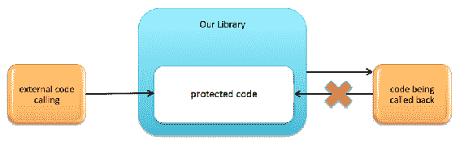
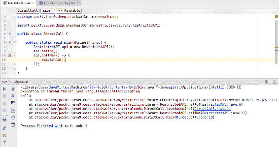

# 细粒度堆栈跟踪

Java 9 带来了一个新的栈遍历 API，允许程序遍历调用栈。这是一个非常特殊的功能，普通程序很少需要。该 API 对于一些非常特殊的情况非常有用——对于由框架提供的功能。因此，如果您想要一种高效的栈遍历方法，该方法可以提供可筛选的堆栈跟踪信息访问，您将喜欢这个新的栈遍历 API。

该 API 提供了对调用栈的快速和优化访问，实现了对单个帧的懒访问。

在本章中，我们将介绍以下主题：

+   Java 栈概述

+   栈信息的重要性

+   使用`StackWalker`

+   `StackFrame`

+   性能

# Java 栈概述

在我们深入研究栈遍历之前，让我们先了解 Java 栈。这是基本的栈信息，不特定于栈遍历。

Java 运行时有名为 Stack 的类，可以使用**后进先出**（**LIFO**）策略来存储对象。

当计算算术表达式时，它们是使用栈来完成的。如果我们首先在我们的代码中添加*A*和*B*，那么*A*会被推送到**操作数栈**，然后*B*被推送到操作数栈，最后执行加法操作，该操作从操作数栈的顶部获取两个元素并将结果*A* + *B*推送到那里。

JVM 是用 C 编写的，并执行调用 C 函数和从那里返回。这个调用-返回序列是通过使用本地方法栈来维护的，就像任何其他 C 程序一样。

最后，当 JVM 创建一个新的线程时，它也会分配一个包含帧的调用栈，这些帧反过来又包含局部变量、对前一个帧的引用以及对包含执行方法的类的引用。当一个方法被调用时，会创建一个新的帧。当方法完成其执行时，帧会被销毁，换句话说，返回或抛出异常。这个栈，即 Java 虚拟机栈，是栈遍历 API 管理的栈。

# 栈信息的重要性

一般而言，当我们想要开发依赖于调用者的代码时，我们需要栈信息。有关调用者的信息允许我们的代码根据该信息做出决策。在一般实践中，使功能依赖于调用者不是一个好主意。影响方法行为的信息应通过参数提供。依赖于调用者的代码开发应该相当有限。

JDK 使用原生方法访问栈信息，这些原生方法对 Java 应用程序不可用。《SecurityManager》是一个定义应用程序安全策略的类。这个类检查反射 API 的调用者是否有权访问另一个类的非公共成员。为了做到这一点，它必须能够访问调用者类，它通过一个受保护的本地方法来实现。

这是一个在不遍历堆栈的情况下实施某些安全措施的示例。我们向外部开发者开放我们的代码，让他们将其用作库。我们还调用库用户提供的类的方法，他们可能反过来调用我们的代码。有一些代码我们希望允许库用户调用，但前提是他们不是从我们的代码中调用的。如果我们不希望允许某些代码被库使用代码直接访问，我们可以使用 Java 9 的模块结构，不导出包含不调用的类的包。这就是我们设置额外条件的原因，即代码对来自外部的调用者可用，除非它们是由我们的代码调用的：



另一个例子是我们想要获取访问记录器的权限。Java 应用程序使用许多不同的记录器，日志系统通常非常灵活，可以根据实际需要切换不同记录器的输出。最常见的方法是为每个类使用不同的记录器，记录器的名称通常是类的名称。这种做法如此普遍，以至于日志框架甚至提供了接受类本身引用而不是名称的记录器访问方法。这本质上意味着获取记录器句柄的调用看起来像以下这样：

```java
    private static final Logger LOG = Logger.getLogger(MyClass.class); 
```

当我们从现有类创建新类时，如果我们忘记更改获取新记录器时类名的调用，可能会出现问题。这不是一个严重的问题，但很常见。在这种情况下，我们的代码将使用其他类的记录器，并且实际上可以工作，但在分析日志文件时可能会造成混淆。如果我们有一个返回名为调用者类名的记录器的函数，那就更好了。

让我们继续在下一两个部分中通过代码片段示例探索堆栈信息。

# 示例 - 限制调用者

在本节中，我们开发了一个包含两个方法的示例库。`hello()`方法将`hello`打印到标准输出。`callMe()`方法接受一个`Runnable`作为参数并运行它。然而，第一个方法是受限的。它仅在调用者完全在库外部时执行。如果调用者以某种方式获得了控制权，而库正在调用出去，假设是通过第二个方法调用传递的`Runnable`，它将抛出`IllegalCallerException`。API 的实现很简单：

```java
    package packt.java9.deep.stackwalker.myrestrictivelibrary; 
    public class RestrictedAPI { 
      public void hello(){ 
        CheckEligibility.itIsNotCallBack(); 
        System.out.println("hello"); 
      } 
      public void callMe(Runnable cb){ 
        cb.run(); 
      } 
    } 
```

执行资格检查的代码实现在一个单独的类中，以保持事情简单。我们很快就会检查那段代码，但在那之前，我们来看看我们用来启动演示的主要代码。我们用来演示功能的程序代码如下：

```java
    package packt.java9.deep.stackwalker.externalcode; 

    import
     packt.java9.deep.stackwalker.myrestrictivelibrary.RestrictedAPI; 

    public class DirectCall { 

      public static void main(String[] args) { 
        RestrictedAPI api = new RestrictedAPI(); 
        api.hello(); 
        api.callMe(() -> { 
            api.hello(); 
        }); 
      } 
    } 
```

此代码创建了我们 API 类的实例，然后直接调用`hello()`方法。它应该能正常工作，并在屏幕上打印字符`hello`。下一行代码要求`callMe()`方法回调以 lambda 表达式形式提供的`Runnable`。在这种情况下，调用将失败，因为调用者在外部，但却是从库内部调用的。

现在我们来看看资格检查是如何实现的：

```java
    package packt.java9.deep.stackwalker.myrestrictivelibrary; 

    import static java.lang.StackWalker.Option.RETAIN_CLASS_REFERENCE; 

    public class CheckEligibility { 
      private static final String packageName 
        = CheckEligibility.class.getPackageName(); 

      private static boolean notInLibrary(StackWalker.StackFrame f) { 
        return !inLibrary(f); 
      } 

      private static boolean inLibrary(StackWalker.StackFrame f) { 
        return f.getDeclaringClass().getPackageName() 
         .equals(packageName); 
      } 

      public static void itIsNotCallBack() { 
        boolean eligible = StackWalker 
         .getInstance(RETAIN_CLASS_REFERENCE) 
         .walk(s -> s.dropWhile(CheckEligibility::inLibrary) 
           .dropWhile(CheckEligibility::notInLibrary) 
           .count() == 0 
         ); 
         if (!eligible) { 
           throw new IllegalCallerException(); 
         } 
      } 
    } 
```

`itIsNotCallBack()`方法是`hello()`方法中调用的方法。此方法创建一个堆栈遍历器并调用`walk()`方法。`walk()`方法的参数是一个`Function`，它将`StackFrame`对象的`Stream`转换为`walk()`方法将返回的其他值。

最初，这种参数设置可能看起来复杂且难以理解。更合理的方式是返回一个提供`StackFrame`对象的`Stream`，而不是强迫调用者定义一个将作为参数获取此信息的`Function`。

示例代码使用 lambda 表达式定义`Function`作为`walk()`方法的参数。lambda 表达式的参数`s`是流。由于此流的第一个元素是实际调用，所以我们丢弃它。因为这些调用也应该在调用者不合格的情况下被拒绝，即使调用`hello()`方法是通过库内部的其他类和方法进行的，我们也丢弃属于`CheckEligibility`类包内的所有帧元素。这个包是`packt.java9.deep.stackwalker.myrestrictivelibrary`，在代码中这个字符串存储在字段`packageName`中。结果流只包含来自库外部的`StackFrame`对象。我们也丢弃这些，直到流耗尽或直到我们找到一个再次属于库的`StackFrame`。如果所有元素都被丢弃，我们就成功了。在这种情况下，`count()`的结果是零。如果我们找到`StackFrame`中的某个类属于库，这意味着外部代码是从库中调用的，在这种情况下，我们必须拒绝工作。在这种情况下，变量`eligible`将是`false`，我们将抛出一个异常，如下面的截图所示：



# 示例 - 获取调用者的日志记录器

要获取日志记录器，Java 9 有一个新的 API。使用此 API，一个模块可以为服务`LoggerFinder`提供一个实现，该服务随后可以返回一个实现`getLogger()`方法的`Logger`。这消除了库对特定记录器或记录器外观的依赖，这是一个巨大的优势。但仍然存在一个较小但仍然令人烦恼的问题，即我们需要再次将类的名称作为`getLogger()`方法的参数来写入。这个问题仍然存在。

为了避免这项繁琐的任务，我们创建了一个辅助类，该类查找调用者类并检索适合调用者类和模块的记录器。因为在这种情况下，我们不需要堆栈跟踪中引用的所有类，我们将调用`StackWalker`类的`getCallerClass()`方法。我们在`packt.java9.deep.stackwalker.logretriever`包中创建了一个名为`Labrador`的类：

```java
    package packt.java9.deep.stackwalker.logretriever; 

    import java.lang.System.Logger; 
    import java.lang.System.LoggerFinder; 

    import static java.lang.StackWalker.Option.RETAIN_CLASS_REFERENCE; 

    public class Labrador { 
      public static Logger retrieve() { 
        final Class clazz = StackWalker 
          .getInstance(RETAIN_CLASS_REFERENCE) 
          .getCallerClass(); 
        return LoggerFinder.getLoggerFinder().getLogger( 
          clazz.getCanonicalName(), clazz.getModule()); 
      } 
    } 
```

在 Java 9 之前，解决此问题的方法是获取`Thread`类的`StackTrace`数组，并从那里查找调用者类的名称。另一种方法是扩展具有受保护方法`getClassContext()`的`SecurityManager`，该方法返回堆栈上所有类的数组。这两种解决方案都会遍历堆栈并组成一个数组，尽管我们只需要数组中的一个元素。在日志检索的情况下，由于记录器通常存储在`private static final`字段中，因此每个类在类初始化期间只初始化一次，因此性能损失可能并不显著。在其他用例中，性能损失可能非常显著。

在我们看过两个示例之后，我们将查看`StackWalker`内部工作的细节。

# 使用`StackWalker`

在本节中，你将更熟悉如何使用`StackWalker`。在本节中，我们将探讨以下主题：

+   获取`StackWalker`实例

+   堆栈遍历选项

# 获取`StackWalker`实例

要遍历堆栈元素，我们需要一个堆栈遍历器的实例。为此，我们调用`getInstance()`方法。如所示，此方法有四个重载版本：

+   `static StackWalker getInstance()`

+   `static StackWalker getInstance(StackWalker.Option option)`

+   `static StackWalker getInstance(Set<StackWalker.Option> options)`

+   `static StackWalker getInstance(Set<StackWalker.Option> options, int estimateDepth)`

第一个版本不接受任何参数，并返回一个`StackWalker`实例，这将允许我们遍历正常的堆栈帧。这通常是我们感兴趣的。该方法的其他版本接受`StackWalker.Option`值或多个值。枚举`StackWalker.Option`，正如其名所示，位于`StackWalker`类内部，有三个值：

+   `RETAIN_CLASS_REFERENCE`

+   `SHOW_REFLECT_FRAMES`

+   `SHOW_HIDDEN_FRAMES`

这些`enum`选项具有自描述的名称，并在下一节中解释。

# 保留类引用

如果我们将第一个选项`enum`常量`RETAIN_CLASS_REFERENCE`作为`getInstance()`方法的参数，则返回的实例允许我们访问在遍历过程中各个堆栈帧引用的类。

# 显示反射帧

`SHOW_REFLECT_FRAMES`枚举常量将生成一个包括来自某些反射调用的帧的遍历器。

# 显示隐藏帧

最后，枚举常量选项 `SHOW_HIDDEN_FRAMES` 将包括所有隐藏框架，这些框架包含反射调用以及为 lambda 函数调用生成的调用框架。

这里是一个关于反射和隐藏框架的简单演示：

```java
    package packt; 
    import static java.lang.StackWalker.Option.SHOW_HIDDEN_FRAMES; 
    import static java.lang.StackWalker.Option.SHOW_REFLECT_FRAMES; 
    public class Main { 
```

允许我们直接执行此代码的主要方法调用的是名为 `simpleCall()` 的方法：

```java
    public static void main(String[] args) { 
      simpleCall(); 
    } 
```

如其名所示，`simpleCall()` 方法简单地调用：

```java
    static void simpleCall() { 
      reflectCall(); 
    } 
```

链中的下一个方法稍微复杂一些。尽管这也只调用下一个方法，但它使用反射来这样做：

```java
    static void reflectCall() { 
      try { 
        Main.class.getDeclaredMethod("lambdaCall", 
          new Class[0]) 
           .invoke(null, new Object[0]); 
      } catch (Exception e) { 
          throw new RuntimeException(); 
      } 
    } 
```

在下一个示例中，我们有一个使用 lambda 调用的方法：

```java
    static void lambdaCall() { 
      Runnable r = () -> { 
        walk(); 
      }; 
      r.run(); 
    } 
```

实际跟踪之前最后调用的方法是 `walk()`：

```java
    static void walk() { 
      noOptions(); 
      System.out.println(); 
      reflect(); 
      System.out.println(); 
      hidden(); 
    } 
```

前面的 `walk()` 方法依次调用三个方法。这些方法彼此非常相似，在此提供：

```java
    static void noOptions() { 
      StackWalker 
        .getInstance() 
        .forEach(System.out::println); 
    } 

    static void reflect() { 
      StackWalker 
        .getInstance(SHOW_REFLECT_FRAMES) 
        .forEach(System.out::println); 
    } 

    static void hidden() { 
      StackWalker 
        // shows also reflect frames 
        .getInstance(SHOW_HIDDEN_FRAMES) 
        .forEach(System.out::println); 
    } 
```

前面的三个方法将框架打印到标准输出。它们使用栈跟踪器的 `forEach()` 方法。以下是栈跟踪程序输出的内容：

```java
stackwalker/packt.Main.noOptions(Main.java:45) 
stackwalker/packt.Main.walk(Main.java:34) 
stackwalker/packt.Main.lambda$lambdaCall$0(Main.java:28) 
stackwalker/packt.Main.lambdaCall(Main.java:30) 
stackwalker/packt.Main.reflectCall(Main.java:19) 
stackwalker/packt.Main.simpleCall(Main.java:12) 
stackwalker/packt.Main.main(Main.java:8) 
```

此输出仅包含属于我们代码中调用框架的框架。`main()` 方法调用 `simpleCall()`，它又调用 `reflectCall()`，然后 `reflectCall()` 调用 `lambdaCall()`，`lambdaCall()` 调用一个 lambda 表达式，该表达式调用 `walk()`，依此类推。我们没有指定任何选项并不意味着从栈中删除 lambda 调用。我们执行了那个调用，因此它必须在那里。它删除的是 JVM 实现 lambda 所需要的额外栈框架。我们可以在下一个输出中看到，当选项为 `SHOW_REFLECT_FRAMES` 时，反射框架已经存在：

```java
stackwalker/packt.Main.reflect(Main.java:58) 
stackwalker/packt.Main.walk(Main.java:36) 
stackwalker/packt.Main.lambda$lambdaCall$0(Main.java:28) 
stackwalker/packt.Main.lambdaCall(Main.java:30) 
java.base/jdk.internal.reflect.NativeMethodAccessorImpl.invoke0(Native Method) 
java.base/jdk.internal.reflect.NativeMethodAccessorImpl.invoke(NativeMethodAccessorImpl.java:62) 
java.base/jdk.internal.reflect.DelegatingMethodAccessorImpl.invoke(DelegatingMethodAccessorImpl.java:43) 
java.base/java.lang.reflect.Method.invoke(Method.java:547) 
stackwalker/packt.Main.reflectCall(Main.java:19) 
stackwalker/packt.Main.simpleCall(Main.java:12) 
stackwalker/packt.Main.main(Main.java:8) 
```

在这种情况下，区别在于我们可以看到从 `reflectCall()` 方法到 `lambdaCall()` 方法的调用不是直接的。`reflectCall()` 方法调用 `invoke()` 方法，该方法调用另一个在另一个类中定义的同名方法，然后该同名方法调用 JVM 提供的本地方法 `invoke0()`。之后我们最终到达 `lambdaCall()` 方法。

在输出中，我们还可以看到这些反射调用属于模块 `java.base`，而不是我们的 `stackwalker` 模块。

如果我们在反射框架之外还包括隐藏框架，指定选项 `SHOW_HIDDEN_FRAMES`，那么我们将看到以下输出：

```java
stackwalker/packt.Main.hidden(Main.java:52) 
stackwalker/packt.Main.walk(Main.java:38) 
stackwalker/packt.Main.lambda$lambdaCall$0(Main.java:28) 
stackwalker/packt.Main$$Lambda$46/269468037.run(Unknown Source) 
stackwalker/packt.Main.lambdaCall(Main.java:30) 
java.base/jdk.internal.reflect.NativeMethodAccessorImpl.invoke0(Native Method) 
java.base/jdk.internal.reflect.NativeMethodAccessorImpl.invoke(NativeMethodAccessorImpl.java:62) 
java.base/jdk.internal.reflect.DelegatingMethodAccessorImpl.invoke(DelegatingMethodAccessorImpl.java:43) 
java.base/java.lang.reflect.Method.invoke(Method.java:547) 
stackwalker/packt.Main.reflectCall(Main.java:19) 
stackwalker/packt.Main.simpleCall(Main.java:12) 
stackwalker/packt.Main.main(Main.java:8) 
```

这包括 JVM 用于执行 lambda 调用的额外隐藏框架。此外，还包括反射框架。

# 枚举常量的最后思考

我们还可以指定多个选项，给出一个选项集。最简单的方法是使用 `java.util.Set` 接口的静态 `of()` 方法。这样，`RETAIN_CLASS_REFERENCE` 选项可以与 `SHOW_REFLECT_FRAMES` 选项或 `SHOW_HIDDEN_FRAMES` 选项组合。

虽然从技术上讲可以将 `SHOW_REFLECT_FRAMES` 和 `SHOW_HIDDEN_FRAMES` 作为选项集组合，但这样做实际上并没有任何优势。后者包含前者，所以两者的组合与后者完全相同。

# 访问类

当我们想在堆栈遍历期间访问类对象时，我们必须指定`RETAIN_CLASS_REFERENCE`选项。尽管`StackFrame`接口定义了`getClassName()`方法，可以使用它通过`Class.forName()`方法访问具有该名称的类，但这样做并不能保证`StackFrame`对象引用的类是由调用`Class.forName()`的代码相同的类加载器加载的。在某些特殊情况下，我们可能会遇到两个不同类加载器加载的具有相同名称的两个不同类。

如果在创建`StackWalker`实例时没有使用选项，那么原本会返回类对象的那些方法将抛出`UnsupportedOperationException`异常。这样就不能在`StackFrame`上使用`getDeclaringClass()`，也不能在`StackWalker`上使用`getCallerClass()`。

# 步骤方法

`StackWalker`定义了一个期望一个`Consumer`（最好是 lambda 表达式形式）的`forEach()`方法，该方法将对堆栈跟踪中的每个元素进行调用。`Consumer`方法的参数是一个`StackFrame`对象。

虽然`Stream`接口也定义了一个名为`forEach`的方法，并且`walk()`方法将一个`Stream`对象传递给作为参数的`Function`，但我们不应该混淆这两个方法。`StackWalker`的`forEach()`方法是一种更简单、大多数情况下效果较差的方法，用于遍历堆栈跟踪的所有元素。

在大多数情况下，它效果较差，因为它迫使`StackWalker`实例获取堆栈跟踪的所有元素，以便`forEach()`方法可以遍历每个元素到末尾。如果我们知道我们不会遍历堆栈跟踪到末尾，我们应该使用`walk()`方法，该方法以懒加载的方式访问堆栈，从而为性能优化留出更多空间。

`StackWalker`类有一个`walk()`方法，这是定义其作为遍历者的方法。该方法接受一个由`StackWalker`调用的`Function`。`walk()`方法的返回值将是`Function`返回的对象。`Function`的参数是一个`Stream<StackFrame>`，它传递堆栈帧。第一个帧是包含`walk()`方法调用的帧，下一个是调用`walk()`的调用方法的帧，依此类推。

`Function`可以用来根据从流中得到的`StackFrame`对象计算一些值，并决定调用者是否有资格调用我们的代码。

在审查了需要`Function`作为参数且该`Function`又需要一个`Stream<StackFrame>`作为参数的`walk()`方法之后，你可能会感到困惑。我们可能希望直接从`StackWalter`实例中获取一个`Stream<StackFrame>`。最简单的方法是将流从`Function`返回。考虑以下示例：

```java
    // EXAMPLE OF WHAT NOT TO DO!!!! 
    public static void itIsNotCallBack() { 
      Stream<StackWalker.StackFrame> stream = 
        StackWalker 
          .getInstance(RETAIN_CLASS_REFERENCE) 
          .walk(s -> s); 
      boolean eligible = // YOU GET EXCEPTION!!!! 
        stream.dropWhile(CheckEligibility::inLibrary) 
          .dropWhile(CheckEligibility::notInLibrary) 
          .count() == 0; 
      if (!eligible) { 
        throw new IllegalCallerException(); 
      } 
    } 
```

我们所做的是简单地从 walker 调用中直接返回流，并在之后遍历它执行相同的计算。我们的结果是`IllegalStateException`异常，而不是资格检查。

原因在于`StackWalker`的实现高度优化。它不会复制整个堆栈以提供流的信息。它从实际的、活动的堆栈工作。为了做到这一点，它必须确保在流使用期间堆栈不会被修改。这与我们在迭代集合时更改集合可能会得到的`ConcurrentModificationException`非常相似。如果我们把流传递到调用栈中，然后想要从中获取`StackFrame`，流将尝试从已经消失的堆栈帧中获取信息，因为我们已经从属于它的方法中返回了。这样，`StackWalker`不会对整个堆栈进行快照，而是从实际的堆栈工作，并且必须确保它需要的堆栈部分不会改变。我们可以从`Function`中调用方法，这样我们可以在调用链中深入挖掘，但在流使用时我们不能向上移动。

也不要尝试玩其他花招，比如扩展`StackWalker`类。这是不可能的，它是一个`final`类。

# StackFrame

在前面的章节中，我们遍历了`StackFrame`元素，并提供了示例代码片段，但没有花时间仔细检查。`StackFrame`是在`StackWalker`类内部定义的一个接口。它定义了访问器，以及一个可以将信息转换为`StackTraceElement`的转换器。

接口定义的访问器如下：

+   `getClassName()`将返回由`StackFrame`表示的方法的类的二进制名称。

+   `getMethodName()`将返回由`StackFrame`表示的方法的名称。

+   `getDeclaringClass()`将返回由`StackFrame`表示的方法的类。如果在创建`StackWalker`实例时没有使用`Option.RETAIN_CLASS_REFERENCE`，则该方法将抛出`UnsupportedOperationException`。

+   `getByteCodeIndex()`获取包含由`StackFrame`表示的方法的执行点的代码数组的索引。在查找由命令行工具`javap`提供的反汇编 Java 代码时，此值的程序化使用可能有助于调试。此值的程序化使用仅对具有直接访问代码的字节码的应用程序有价值，java 代理或库在运行时生成字节码。如果方法是本地的，该方法将返回一个负数。 

+   `getFileName()`返回由`StackFrame`表示的方法定义的源文件名。

+   `getLineNumber()`返回源代码的行号。

+   `isNativeMethod()` 如果 `StackFrame` 表示的方法是本地的，则返回 `true`，否则返回 `false`。

`StackFrame` 不提供访问方法所属对象的任何方式。您无法访问由 `StackFrame` 表示的方法的参数和局部变量，也没有其他方法可以完成这项任务。这一点很重要。此类访问会过于侵入性，并且不可能实现。

# 性能

如果不查看性能考虑因素，我们对 `StackWalker` 的介绍就不会完整。

`StackWalker` 高度优化，不会创建大量未使用的内存结构。这就是为什么我们必须使用传递给 `walker()` 方法的 `Function` 作为参数的原因。这也是为什么在创建时，`StackTrace` 不会自动转换为 `StackTraceElement` 的原因。这只会发生在我们查询特定 `StackTraceElement` 的方法名和行号时。重要的是要理解这种转换需要相当多的时间，如果它被用于代码中的某些调试目的，那么它不应该被留下。

为了使 `StackWalker` 更加快速，我们可以提供一个关于在流中将处理多少 `StackFrame` 元素的估计。如果我们不提供此类估计，JDK 中的当前实现将预先分配八个 `StackFrame` 对象，当这些用完时，JDK 将分配更多。JDK 将根据我们的估计分配元素的数量，除非我们估计的值大于 256。在这种情况下，JDK 将使用 256。

# 摘要

在本章中，我们学习了如何使用 `StackWalker` 并提供了示例代码。我们对 API 的详细审查包括不同的使用场景、选项和信息。我们解释了 API 的复杂性，并分享了如何以及如何不使用该类。我们以一些用户必须注意的相关性能问题结束。

在下一章中，我们将介绍十几个被纳入 Java 9 平台的 Java 增强提案。这些主要变更将涵盖广泛的工具和 API 更新，旨在使使用 Java 开发更容易，并能够创建优化的 Java 应用程序。我们将探讨新的 HTTP 客户端、Javadoc 和 Doclet API 的变更、新的 JavaScript 解析器、JAR 和 JRE 的变更、新的 Java 级 JVM 编译器接口、对 TIFF 图像的支持、平台日志记录、XML 目录支持、集合、新的平台特定桌面功能，以及方法处理和弃用注解的增强。
