# 新工具和工具增强

在上一章中，我们探讨了 Java 9 的新堆栈跟踪器 API，并学习了它如何使 Java 应用程序能够遍历调用堆栈。这是一个在 Java 应用程序中不常实现的专业功能。话虽如此，该 API 可能适用于一些非常特殊的情况，例如由框架提供的功能。您了解到，如果您开发支持框架的应用程序编程，并且希望代码依赖于调用上下文，那么堆栈跟踪器 API 就是您所需要的。我们还发现，该 API 提供了对调用堆栈的快速和优化访问，实现了对单个帧的懒访问。

在本章中，我们将介绍被纳入 Java 9 平台的 16 个**Java 增强提案**（**JEPs**）。这些 JEPs 涵盖了广泛的工具和 API 更新，以使使用 Java 开发更容易，并为我们的程序提供更大的优化可能性。

我们对新工具和工具增强的审查将包括以下内容：

+   新的 HTTP 客户端

+   Javadoc 和 Doclet API

+   mJRE 变更

+   JavaScript 解析器

+   多版本 JAR 文件

+   Java 级别的 JVM 编译器接口

+   TIFF 支持

+   平台日志记录

+   XML 目录

+   集合

+   平台特定的桌面功能

+   增强的方法处理

+   增强的弃用

# 新 HTTP 客户端[JEP-110]

在本节中，我们将回顾 Java 的**超文本传输协议**（**HTTP**）客户端，从 Java 9 之前的视图开始，然后深入探讨 Java 9 平台中的新 HTTP 客户端。这种做法是为了支持对 Java 9 中做出的更改的理解。

# Java 9 之前的 HTTP 客户端

JDK 版本 1.1 引入了支持 HTTP 特定功能的`HttpURLConnection` API。这是一个包含此处列出的字段的健壮类：

+   `chunkLength`

+   `fixedContentLength`

+   `fixedContentLengthLong`

+   `HTTP_ACCEPTED`

+   `HTTP_BAD_GATEWAY`

+   `HTTP_BAD_METHOD`

+   `HTTP_BAD_REQUEST`

+   `HTTP_CLIENT_TIMEOUT`

+   `HTTP_CONFLICT`

+   `HTTP_CREATED`

+   `HTTP_ENTITY_TOO_LARGE`

+   `HTTP_FORBIDDEN`

+   `HTTP_GONE`

+   `HTTP_INTERNAL_ERROR`

+   `HTTP_LENGTH_REQUIRED`

+   `HTTP_MOVED_PERM`

+   `HTTP_MOVED_TEMP`

+   `HTTP_MULT_CHOICE`

+   `HTTP_NO_CONTENT`

+   `HTTP_NOT_ACCEPTABLE`

+   `HTTP_NOT_AUTHORITATIVE`

+   `HTTP_NOT_FOUND`

+   `HTTP_NOT_IMPLEMENTED`

+   `HTTP_NOT_MODIFIED`

+   `HTTP_OK`

+   `HTTP_PARTIAL`

+   `HTTP_PAYMENT_REQUIRED`

+   `HTTP_PRECON_FAILED`

+   `HTTP_PROXY_AUTH`

+   `HTTP_REQ_TOO_LONG`

+   `HTTP_RESET`

+   `HTTP_SEE_OTHER`

+   `HTTP_SERVER_ERROR`

+   `HTTP_UNAUTHORIZED`

+   `HTTP_UNAVAIABLE`

+   `HTTP_UNSUPPORTED_TYPE`

+   `HTTP_USE_PROXY`

+   `HTTP_VERSION`

+   `instanceFollowRedirects`

+   `method`

+   `responseCode`

+   `responseMessage`

如您从字段列表中可以看到，对 HTTP 的支持非常广泛。除了构造函数之外，还有许多可用的方法，包括以下这些：

+   `disconnect()`

+   `getErrorStream()`

+   `getFollowRedirects()`

+   `getHeaderField(int n)`

+   `getHeaderFieldDate(String name, long Default)`

+   `getHeaderFieldKey(int n)`

+   `getInstanceFollowRedirects()`

+   `getPermission()`

+   `getRequestMethod()`

+   `getResponseCode()`

+   `getResponseMessage()`

+   `setChunkedStreamingMode(int chunklen)`

+   `setFixedLengthStreamingMode(int contentLength)`

+   `setFixedlengthStreamingMode(long contentLength)`

+   `setFollowRedirects(boolean set)`

+   `setInstanceFollowRedircts(boolean followRedirects)`

+   `setRequestMethod(String method)`

+   `usingProxy()`

列出的类方法是在继承自 `java.net.URLConnection` 类和 `java.lang.Object` 类的方法的基础上增加的。

原始 HTTP 客户端存在一些问题，使其适合使用新的 Java 平台进行更新。这些问题如下：

+   基础 `URLConnection` API 有过时的协议，如 Gopher 和 FTP，随着时间的推移越来越多

+   `HttpURLConnection` API 早于 HTTP 1.1，过于抽象，使其不太可用

+   HTTP 客户端文档不足，使 API 令人沮丧且难以使用

+   客户端一次只能在一个线程上运行

+   由于它早于 HTTP 1.1 以及缺乏足够的文档，该 API 极难维护

既然我们已经知道了 HTTP 客户端的问题，那么让我们看看 Java 9 将带来什么。

# Java 9 的新 HTTP 客户端

创建 Java 9 平台的新 HTTP 客户端有几个相关目标。JEP-110 是新 HTTP 客户端的组织提案。JEP-110 的主要目标在此列出，并展示了所提出的新 HTTP 客户端。这些目标按易用性、核心功能、附加功能和性能等广泛类别呈现：

+   易用性：

    +   API 设计旨在提供高达 90% 的 HTTP 相关应用程序需求。

    +   新的 API 对于最常见的使用案例来说，无需不必要的复杂性即可使用。

    +   包含简单的阻塞模式。

    +   API 支持现代 Java 语言特性。Java 8 中发布的新特性 Lambda 表达式是一个例子。

+   核心功能：

    +   支持 HTTPS/TLS

    +   支持 HTTP/2

    +   提供有关 HTTP 协议请求和响应的所有细节的可见性

    +   支持标准/常用认证机制

    +   提供接收到的**头部**事件通知

    +   提供接收到的**响应体**事件通知

    +   提供错误事件通知

+   附加功能：

    +   新的 API 可以用于 WebSocket 握手

    +   它与当前的网络 API 协同执行安全检查

+   性能：

    +   对于 HTTP/1.1：

        +   新的 API 必须至少与旧 API 一样高效。

        +   当作为客户端 API 使用时，内存消耗不得超过 Apache HttpClient、Netty 和 Jetty。

    +   对于 HTTP/2：

        +   性能必须超过 HTTP/1.1。

        +   当作为客户端 API 使用时，新的性能必须与 Netty 和 Jetty 相匹配或超过，新客户端不应导致性能下降。

        +   当作为客户端 API 使用时，内存消耗不得超过 Apache HttpClient、Netty 和 Jetty。

    +   避免运行定时线程

# 新 API 的限制

新 API 有一些故意的不足之处。虽然这听起来可能有些反直觉，但新 API 并不是要完全取代当前的`HttpURLConnection` API。相反，新 API 的目的是最终取代当前的 API。

```java
HttpURLConnect class to open and read a URL in a Java application:
```

```java
    /*
    import statements
    */

    public class HttpUrlConnectionExample
    {  
      public static void main(String[] args) 
      {
        new HttpUrlConnectionExample();
      }

      public HttpUrlConnectionExample()
      {
        URL theUrl = null;
        BufferedReader theReader = null;
        StringBuilder theStringBuilder;

        // put the URL into a String
        String theUrl = "https://www.packtpub.com/";

        // here we are creating the connection
        theUrl = new URL(theUrl);
        HttpURLConnection theConnection = (HttpURLConnection) 
         theUrl.openConnection();

        theConnection.setRequestedMethod("GET");

        // add a delay 
        theConnection.setReadTimeout(30000); // 30 seconds
        theConnection.connect();

        // next, we can read the output
        theReader = new BufferedReader(
          new InputStreamReader(theConnection.getInputStream()));
        theStringBuilder =  new StringBuilder();

        // read the output one line at a time
        String theLine = null;
        while ((theLine = theReader.readLine() != null)
        {
          theStringBUilder.append(line + "n");
        }

        // echo the output to the screen console
        System.out.println(theStringBuilder.toString());

        // close the reader
        theReader.close();
      }
    }
    . . . 
```

为了简洁，前面的代码没有包括异常处理。

以下是新 API 的一些具体限制：

+   并非所有与 HTTP 相关的功能都得到支持。据估计，大约有 10%的 HTTP 协议没有被 API 暴露。

+   标准的/常见的身份验证机制仅限于基本身份验证。

+   新 API 的总体目标是使用简单，这意味着性能提升可能不会实现。当然，不会出现性能下降，但也不太可能有一个压倒性的改进水平。

+   不支持对请求进行过滤。

+   不支持对响应进行过滤。

+   新的 API 不包括可插拔的连接缓存。

+   缺乏一个通用的升级机制。

新 API 作为 Java 9 平台的一部分以孵化模式提供。这表明该 API 将在未来的 Java 平台中得到标准化，也许是在 Java 10。

# 简化的 Doclet API [JEP-221]

Doclet API 和 Javadoc 密切相关。Javadoc 是一个文档工具，而 Doclet API 提供了功能，使我们能够检查嵌入在库和程序源代码级别的 javadoc 注释。在本节中，我们将回顾 Java 9 之前的 Doclet API 状态，然后探讨 Java 9 平台引入的 Doclet API 的变化。在下节中，我们将回顾 Javadoc。

# 在 Java 9 之前的 Doclet API

在 Java 9 之前的 Doclet API，或`com.sun.javadoc`包，使我们能够查看位于源代码中的 javadoc 注释。通过使用`start`方法来调用 Doclet。该方法签名是`public static boolean start(RootDoc root)`。我们将使用`RootDoc`实例作为程序结构信息的容器。

为了调用 javadoc，我们需要传递以下内容：

+   包名

+   源文件名（对于类和接口）

+   访问控制选项——以下之一：

    +   `包`

    +   `私有的`

    +   `受保护的`

    +   `公共的`

当使用前面列出的项目来调用 javadoc 时，会提供一个**已记录的集合**作为过滤后的列表。如果我们目的是获取一个全面、未过滤的列表，我们可以使用`allClasses(false)`。

让我们回顾一个示例 Doclet：

```java
    // Mandatory import statement.
    import com.sun.javadoc.*;

    // We will be looking for all the @throws documentation tags.
    public class AllThrowsTags extends Doclet 
    {
      // This is used to invoke the Doclet.
      public static boolean start(Rootdoc myRoot) 
      {
        // "ClassDoc[]" here referes to classes and interfaces.
        ClassDoc[] classesAndInterfaces = 
         myRoot.classesAndInterfaces();
        for (int i = 0; i < classesAndInterfaces.length; ++i)
        {
          ClassDoc tempCD = classesAndInterfaces[i];
          printThrows(tempCD.contructors());
          printThrows(tempCD.methods());
        }
        return true;
      }

      static void printThrows(ExecutableMemberDoc[] theThrows)
      {
        for (int i = 0; i < theThrows.length; ++i)
        {
          ThrowsTag[] throws = theThrows[i].throwsTags();

          // Print the "qualified name" which will be a the
             class or 
          // interface name.
          System.out.println(theThrows[i].qualifiedName());

          // A loop to print all comments with the Throws Tag that 
          // belongs to the previously printed class or
             interface name
          for (int j = 0; j < throws.length; ++j)
          {
            // A println statement that calls three methods
               from the 
            // ThrowsTag Interface: exceptionType(),
               exceptionName(),
            // and exceptionComment().
            System.out.println("--> TYPE: " +
              throws[j].exceptionType() + 
              " | NAME: " + throws[j].exceptionName() + 
              " | COMMENT: " + throws[j].exceptionComment());
          }
        }
      }
    }
```

如您通过详细注释的代码所看到的，获取 javadoc 内容相对容易。在我们的前一个例子中，我们将在命令行中使用以下代码调用`AllThrows`类：

```java
javadoc -doclet AllThrowsTags -sourcepath <source-location> java.util
```

我们的结果输出将包括以下结构：

```java
<class or interface name>
 TYPE: <exception type> | NAME: <exception name> | COMMENT: <exception comment>
 TYPE: <exception type> | NAME: <exception name> | COMMENT: <exception comment>
 TYPE: <exception type> | NAME: <exception name> | COMMENT: <exception comment>
<class or interface name>
 TYPE: <exception type> | NAME: <exception name> | COMMENT: <exception comment>
 TYPE: <exception type> | NAME: <exception name> | COMMENT: <exception comment>
```

# API 枚举

该 API 包含一个枚举类型`LanguageVersion`，它提供了 Java 编程语言的版本。该枚举类型的常量是`Java_1_1`和`Java_1_5`。

# API 类

`Doclet`类提供了一个如何创建一个类以启动 Doclet 的示例。它包含一个空的`Doclet()`构造函数和以下方法：

+   `languageVersion()`

+   `optionLength(String option)`

+   `start(RootDoc root)`

+   `validOptions(String[][] options, DocErrorReporter reporter)`

# API 接口

Doclet API 包含以下列出的接口。接口名称是自我描述的。您可以查阅文档以获取更多详细信息：

+   `AnnotatedType`

+   `AnnotationDesc`

+   `AnnotationDesc.ElementValuePair`

+   `AnnotationTypeDoc`

+   `AnnotationTypeElementDoc`

+   `AnnotationValue`

+   `ClassDoc`

+   `ConstructorDoc`

+   `Doc`

+   `DocErrorReporter`

+   `ExecutableMemberDoc`

+   `FieldDoc`

+   `MemberDoc`

+   `MethodDoc`

+   `PackageDoc`

+   `Parameter`

+   `ParameterizedType`

+   `ParamTag`

+   `ProgramElementDoc`

+   `RootDoc`

+   `SeeTag`

+   `SerialFieldTag`

+   `SourcePosition`

+   `Tag`

+   `ThrowsTag`

+   `Type`

+   `TypeVariable`

+   `WildcardType`

# 存在的 Doclet API 的问题

需要新的 Doclet API 的原因是几个与现有 Doclet API 相关的问题：

+   它不适合测试或并发使用。这源于其静态方法的实现。

+   API 中使用的语言模型存在几个限制，并且随着每个后续的 Java 升级而变得更加有问题。

+   该 API 效率低下，很大程度上是由于其大量使用子字符串匹配。

+   没有提供有关任何给定注释特定位置的参考。这使得诊断和故障排除变得困难。

# Java 9 的 Doclet API

现在您已经很好地掌握了 Java 9 之前存在的 Doclet API，让我们看看 Java 9 平台中已经做出的更改和交付的内容。新的 Doclet API 位于`jdk.javadoc.doclet`包中。

在高层次上，Doclet API 的更改如下：

+   更新`com.sun.javadoc` Doclet API 以利用几个 Java SE 和 JDK API

+   更新`com.sun.tools.doclets.standard.Standard` Doclet 以使用新的 API

+   支持更新的 Taglet API，用于创建自定义 javadoc 标签

除了前面列出的更改之外，新的 API 还使用了以下列出的两个 API：

+   编译器树 API

+   语言模型 API

让我们在接下来的部分中逐一探索这些内容。

# 编译器树 API

编译器树 API 位于`com.sun.source.doctree`包中。它提供了几个接口来记录源级注释。这些 API 表示为**抽象语法树**（**ASTs**）。

有两个枚举类型：

+   `AttributeTree.ValueKind`具有以下常量：

    +   `DOUBLE`

    +   `EMPTY`

    +   `SINGLE`

    +   `UNQUOTED`

+   `DocTree.Kind`具有以下常量：

    +   `ATTRIBUTE`

    +   `AUTHOR`

    +   `CODE`

    +   `COMMENT`

    +   `DEPRECATED`

    +   `DOC_COMMENT`

    +   `DOC_ROOT`

    +   `END_ELEMENT`

    +   `ENTITY`

    +   `ERRONEOUS`

    +   `EXCEPTION`

    +   `IDENTIFIER`

    +   `INHERIT_DOC`

    +   `LINK`

    +   `LINK_PLAIN`

    +   `LITERAL`

    +   `OTHER`

    +   `PARAM`

    +   `REFERENCE`

    +   `RETURN`

    +   `SEE`

    +   `SERIAL`

    +   `SERIAL_DATA`

    +   `SERIAL_FIELD`

    +   `SINCE`

    +   `START_ELEMENT`

    +   `TEXT`

    +   `THROWS`

    +   `UNKNOWN_BLOCK_TAG`

    +   `UNKNOWN_INLINE_TAG`

    +   `VALUE`

    +   `VERSION`

`com.sun.source.doctree` 包含了几个接口。它们在以下表格中详细说明：

| **接口名称** | **扩展** | **以下树节点用于：** | **非继承方法** |
| --- | --- | --- | --- |
| `AttributeTree` | `DocTree` | HTML 元素 | `getName()`, `getValue()`, `getValueKind()` |
| `AuthorTree` | `BlockTagTree`, `DocTree` | `@author` 块标签 | `getName()` |
| `BlockTagTree` | `DocTree` | 不同类型块标签的基类 | `getTagName()` |
| `CommentTree` | `DocTree` | 带有以下 HTML 标签的嵌入式 HTML 注释--`<!--text-->` | `getBody()` |
| `DeprecatedTree` | `BlockTagTree` | `@deprecated` 块标签 | `getBody()` |
| `DocCommentTree` | `DocTree` | 主体块标签 | `getBlockTags()`, `getBody()`, `getFirstSentence()` |
| `DocRootTree` | `InlineTagTree` | `@docroot` 内联标签 | N/A |
| `DocTree` | N/A | 所有类的通用接口 | `accept(DocTreeVisitor<R,D>visitor,Ddata)`, `getKind()` |
| `DocTreeVisitor<R,P>` | N/A | `R` = 访问者方法的返回类型; `P` = 额外参数的类型 | `visitAttribute(AttributeTree node, P p)`, `visitAuthor(AuthorTree node, P p)`, `visitComment(CommentTree node, P p)`, `visitDeprecated(DeprecatedTree node, P p)`, `visitDocComment(DocCommentTree node, P p)`, `visitDocRoot(DocRootTree node, P p)`, `visitEndElement(EndElementTree node, P p)`, `visitEntity(EntityTree node, P p)`, `visitErroneous(ErroneousTree node, P p)`, `visitIdentifier(IdentifierTree node, P p)`, `visitInheritDoc(InheritDocTree node, P p)`, `visitLink(LinkTree node, P p)`, `visitLiteral(LiteralTree node, P p)`, `visitOther(DocTree node, P p)`, `visitParam(ParamTree node, P p)`, `visitReference(ReferenceTree node, P p)`, `visitReturn(ReturnTree node, P p)`, `visitSee(SeeTree node, P p)`, `visitSerial(SerialTree node, P p)`, `visitSerialData(SerialDataTree node, P p)`, `visitSerialField(SerialFieldTree node, P p)`, `visitSince(SinceTree node, P p)`, `visitStartElement(StartElementTree node, P p)`, `visitText(TextTree node, P p)`, `visitThrows(ThrowsTree node, P p)`, `visitUnknownBlockTag(UnknownBlockTagTree node, P p)`, `visitUnknownInlineTag(UnknownInlineTagTree node, P p)`, `visitValue(ValueTree node, P p)`, `visitVersion(VersionTree node, P p)` |
| `EndElementTree` | `DocTree` | HTML 元素的结束 `</name>` | `getName()` |
| `EntityTree` | `DocTree` | HTML 实体 | `getName()` |
| `ErroneousTree` | `TextTree` | 这用于格式错误的文本 | `getDiagnostic()` |
| `IdentifierTree` | `DocTree` | 注释中的标识符 | `getName()` |
| `InheritDocTree` | `InlineTagTree` | `@inheritDoc` 内联标签 | N/A |
| `InlineTagTree` | `DocTree` | 内联标签的通用接口 | `getTagName()` |
| `LinkTree` | `InlineTagTree` | `@link` 或 `@linkplan` 内联标签 | `getLabel()`, `getReference()` |
| `LiteralTree` | `InlineTagTree` | `@literal` 或 `@code` 内联标签 | `getBody()` |
| `ParamTree` | `BlockTagTree` | `@param`块标签 | `getDescription()`, `getName()`, `isTypeParameter()` |
| `ReferenceTree` | `DocTree` | 用于引用 Java 语言元素 | `getSignature()` |
| `ReturnTree` | `BlockTagTree` | `@return`块标签 | `getDescription()` |
| `SeeTree` | `BlockTagTree` | `@see`块标签 | `getReference()` |
| `SerialDataTree` | `BlockTagTree` | `@serialData`块标签 | `getDescription()` |
| `SerialFieldTree` | `BlockTagTree` | `@serialData`块标签和`@serialField`字段名和描述 | `getDescription()`, `getName()`, `getType()` |
| `SerialTree` | `BlockTagTree` | `@serial`块标签 | `getDescription()` |
| `SinceTree` | `BlockTagTree` | `@since`块标签 | `getBody()` |
| `StartElementTree` | `DocTree` | HTML 元素的开始 `< name [attributes] [/] >` | `getAttributes()`, `getName()`, `isSelfClosing()` |
| `TextTree` | `DocTree` | 纯文本 | `getBody()` |
| `ThrowsTree` | `BlockTagTree` | `@exception`或`@throws`块标签 | `getDescription()`, `getExceptionname()` |
| `UnknownBlockTagTree` | `BlockTagTree` | 不可识别的内联标签 | `getContent()` |
| `UnknownInlineTagTree` | `InlineTagTree` | 不可识别的内联标签 | `getContent()` |
| `ValueTree` | `InlineTagTree` | `@value`内联标签 | `getReference()` |
| `VersionTree` | `BlockTagTree` | `@version`块标签 | `getBody()` |

# 语言模型 API

语言模型 API 位于`java.lang.model`包中。它包括用于语言处理和语言建模的包和类。它由以下组件组成：

+   `AnnotatedConstruct`接口

+   `SourceVersion`枚举

+   `UnknownEntityException`异常

每个这些语言模型 API 组件将在接下来的三个部分中进一步探讨。

# `AnnotatedConstruct`接口

`AnnotatedConstruction`接口为语言模型 API 提供了一个可注解的构造，该接口自 Java 平台 1.8 版本以来一直是 Java 平台的一部分。它适用于元素（接口`Element`）或类型（接口`TypeMirror`）的构造。这些构造的注释各不相同，如表中所示：

| **Construct type** | **Interface** | **Annotation** |
| --- | --- | --- |
| `element` | `Element` | 声明 |
| `type` | `TypeMirror` | 基于类型名的使用 |

`AnnotatedConstruction`接口有三个方法：

+   `getAnnotation(Class<A> annotationType)`: 此方法返回构造注释的类型

+   `getAnnotationMirrors()`: 此方法返回构造上存在的注释列表

+   `getAnnotationsByType(Class<A> annotationType)`: 此方法返回与构造关联的注释

# `SourceVersion`枚举

`SourceVersion`枚举包含以下常量：

+   `RELEASE_0`

+   `RELEASE_1`

+   `RELEASE_2`

+   `RELEASE_3`

+   `RELEASE_4`

+   `RELEASE_5`

+   `RELEASE_6`

+   `RELEASE_7`

+   `RELEASE_8`

预计一旦 Java 9 平台正式发布，`SourceVersion`枚举将更新以包括`RELEASE_9`。

此枚举还包含几个方法，如下所示：

**方法名称**: `isIdentifier`

`public static boolean isIdentifier(CharSequence name)`

如果参数字符串是 Java 标识符或关键字，则此方法返回`true`。

**方法名称**: `isKeyword`

`public static boolean isKeyword(CharSequence s)`

如果给定的`CharSequence`是字面量或关键字，则此方法返回`true`。

**方法名称**: `isName`

`public static boolean isName(CharSequence name)`

如果`CharSequence`是有效的名称，则此方法返回`true`。

**方法名称**: `latest`

`public static SourceVersion latest()`

此方法返回用于建模目的的最新源版本。

**方法名称**: `latestSupported`

`public static SourceVersion latestSupported()`

此方法返回可以完全支持的最新源版本，用于建模。

**方法名称**: `valueOf`

`public static SourceVersion valueOf(String name)`

此方法根据提供的参数字符串返回枚举常量。

您应该知道，`value(String name)`方法会抛出两个异常：`IllegalArgumentException`和`NullPointerException`。

**方法名称**: `values`

`public static SourceVersion[] values()`

此方法返回枚举常量的数组。

# 未知实体异常

`UnknownEntityException`类继承自`RuntimeException`，并且是未知异常的超类。类的构造函数如下：

```java
    protected UnknownEntityException(String message)
```

构造函数使用提供的字符串参数作为消息创建`UnknownEntityException`的新实例。该方法不接受任何额外的参数。

此类没有自己的方法，但如所示，从`java.lang.Throwable`和`class.java.lang.Object`类继承方法：

`java.lang.Throwable`类的方法：

+   `addSuppressed()`

+   `fillInStackTrace()`

+   `getCause()`

+   `getLocalizedMessage()`

+   `getMessage()`

+   `getStackTrace()`

+   `getSuppressed()`

+   `initCause()`

+   `printStackTrace()`

+   `setStackTrace()`

+   `toString()`

`java.lang.Object`类的方法：

+   `clone()`

+   `equals()`

+   `finalize()`

+   `getClass()`

+   `hashCode()`

+   `notify()`

+   `notifyAll()`

+   `wait()`

# HTML5 Javadoc [JEP-224]

Javadoc 工具已经针对 Java 9 平台进行了更新。现在它不仅可以生成 HTML 4 标记输出，还可以生成 HTML 5 标记输出。新的 Javadoc 工具提供了对 HTML 4 和 HTML 5 的支持。

即使 Java 9 平台出现，HTML 4 也将继续作为默认的 Javadoc 输出格式。HTML 5 将是一个选项，并且不会成为默认输出标记格式，直到 Java 10。

以下简短的 Java 应用程序简单地生成一个宽度和高度均为`319`的框架。这里显示的是没有 Javadoc 标签的版本，我们将在本节后面讨论：

```java
    /import javax.swing.JFrame;
    import javax.swing.WindowConstants;

    public class JavadocExample 
    {

      public static void main(String[] args) 
      {
        drawJFrame();
      }

      public static void drawJFrame()
      {
        JFrame myFrame = new JFrame("Javadoc Example");
        myFrame.setSize(319,319);
        myFrame.setDefaultCloseOperation(
          WindowConstants.EXIT_ON_CLOSE);
        myFrame.setVisible(true);
      }
    }
```

一旦你的包或类完成，你可以使用 Javadoc 工具生成 Javadoc。你可以从命令行或从你的 JDK /bin 目录中的 **集成开发环境**（**IDE**）内部运行 Javadoc 工具。每个 IDE 处理 Javadoc 生成的方式都不同。例如，在 Eclipse 中，你会从下拉菜单中选择“项目”，然后选择“生成 Javadoc”。在 IntelliJ IDEA IDE 中，你选择“工具”下拉菜单，然后选择“生成 Javadoc”。

以下截图显示了 IntelliJ IDEA 中生成 Javadoc 功能的界面。正如你所见，`-html5` 命令行参数已被包含：

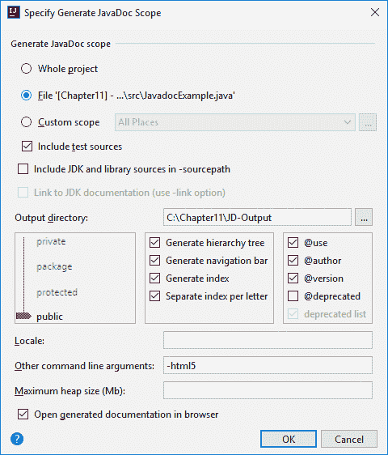

当点击“确定”按钮时，你会看到一系列状态消息，如下例所示：

```java
"C:Program FilesJavajdk-9binjavadoc.exe" -public -splitindex -use -author -version -nodeprecated -html5 @C:UserselaviAppDataLocalTempjavadoc1304args.txt -d C:Chapter11JD-Output
Loading source file C:Chapter11srcJavadocExample.java...
Constructing Javadoc information...
Standard Doclet version 9
Building tree for all the packages and classes...
Generating C:Chapter11JD-OutputJavadocExample.html...
Generating C:Chapter11JD-Outputpackage-frame.html...
Generating C:Chapter11JD-Outputpackage-summary.html...
Generating C:Chapter11JD-Outputpackage-tree.html...
Generating C:Chapter11JD-Outputconstant-values.html...
Generating C:Chapter11JD-Outputclass-useJavadocExample.html...
Generating C:Chapter11JD-Outputpackage-use.html...
Building index for all the packages and classes...
Generating C:Chapter11JD-Outputoverview-tree.html...
Generating C:Chapter11JD-Outputindex-filesindex-1.html...
Generating C:Chapter11JD-Outputindex-filesindex-2.html...
Generating C:Chapter11JD-Outputindex-filesindex-3.html...
Building index for all classes...
Generating C:Chapter11JD-Outputallclasses-frame.html...
Generating C:Chapter11JD-Outputallclasses-frame.html...
Generating C:Chapter11JD-Outputallclasses-noframe.html...
Generating C:Chapter11JD-Outputallclasses-noframe.html...
Generating C:Chapter11JD-Outputindex.html...
Generating C:Chapter11JD-Outputhelp-doc.html...

javadoc exited with exit code 0
```

当 Javadoc 工具退出后，你就可以查看 Javadoc。以下是基于之前提供的代码生成的截图。正如你所见，它以与 Oracle 正式 Java 文档相同的方式格式化：

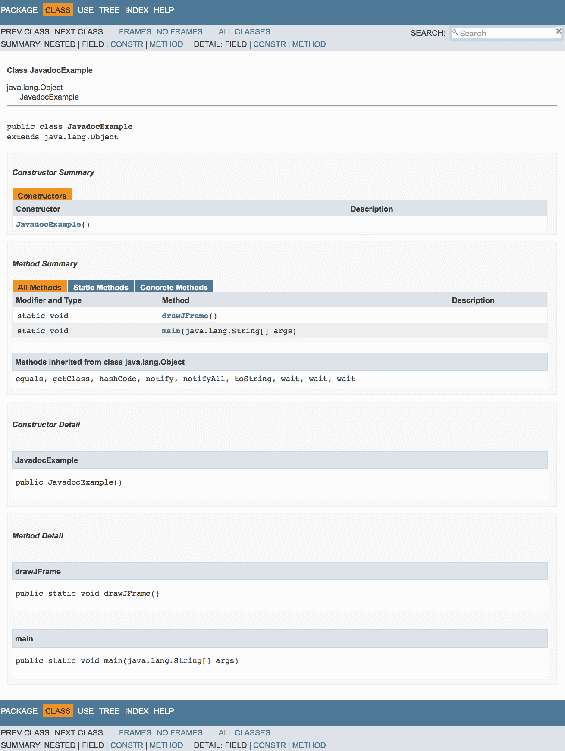

当我们生成 Javadoc 时，会创建多个文档，如下面的截图提供的目录树所示：

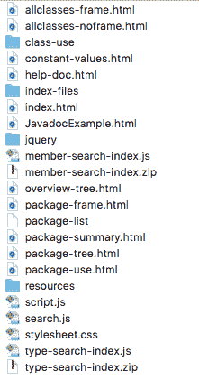

你还可以添加 Javadoc 工具可识别的可选标签。这些标签在此提供：

+   `@author`

+   `@code`

+   `@deprecated`

+   `@docRoot`

+   `@exception`

+   `@inheritDoc`

+   `@link`

+   `@linkplain`

+   `@param`

+   `@return`

+   `@see`

+   `@serial`

+   `@serialData`

+   `@serialField`

+   `@since`

+   `@throws`

+   `@value`

+   `@version`

关于如何为 Javadoc 工具编写文档注释的更多信息，你可以访问 Oracle 的官方说明[`www.oracle.com/technetwork/articles/java/index-137868.html`](http://www.oracle.com/technetwork/articles/java/index-137868.html)。

# Javadoc 搜索 [JEP-225]

在 Java 9 之前，标准 Doclet 生成的 API 文档页面使得导航变得困难。除非你非常熟悉这些文档页面的布局，否则你可能会使用基于浏览器的查找功能来搜索文本。这被认为是不灵活且次优的。

Java 9 平台将搜索框作为 API 文档的一部分。这个搜索框由标准 Doclet 提供，可以用来在文档中搜索文本。这对开发者来说非常方便，可能会改变我们对 Doclet 生成文档的使用方式。

使用新的 Javadoc 搜索功能，我们可以搜索以下索引组件：

+   模块名

+   包名

+   类型

+   成员

+   使用新 `@index` 内联标签索引的术语/短语

# 介绍驼峰式搜索

新的 Javadoc 搜索功能包括一个使用驼峰式搜索的快捷方式。例如，我们可以搜索 `openED` 来找到 `openExternalDatabase()` 方法。

# 移除启动时 JRE 版本选择 [JEP-231]

在 Java 9 之前，我们可以使用**mJRE**（**多个 JRE**）功能来指定用于启动应用程序的特定 JRE 版本或版本范围。我们可以通过命令行选项`-version`或在 JAR 文件清单中添加条目来实现这一点。以下流程图展示了根据我们的选择会发生什么：

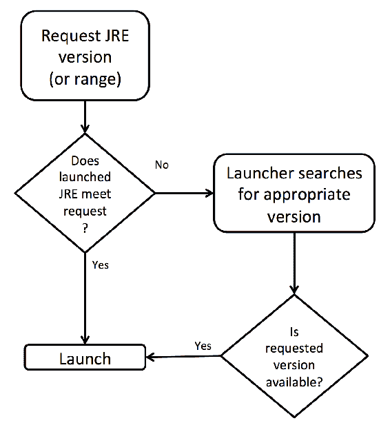

此功能是在 JDK 5 中引入的，在该版本或任何后续版本中都没有得到充分记录。

Java 9 平台引入了以下具体更改：

+   mJRE 功能已被移除。

+   当使用`-version`命令行选项时，启动器现在将产生一个错误。这是一个终止错误，处理将不会继续。

+   如果 JAR 的清单中有`-version`条目，将会产生一个警告。这个警告不会停止执行。

有趣的是，清单文件中存在`-version`条目只会生成一个警告。这是出于设计考虑，考虑到该条目可能存在于较旧的 JAR 文件中。预计当 Java 10 平台发布时，此警告将变为终止错误。

# Nashorn 解析器 API [JEP-236]

JEP 236 的重点是创建 Nashorn 的 ECMAScript 抽象语法树的 API。在本节中，我们将分别查看 Nashorn、ECMAScript 以及解析器 API。

# Nashorn

Oracle Nashorn 是 Oracle 在 Java 中开发的 JVM JavaScript 引擎。它与 Java 8 一起发布。它被创建为向开发者提供一个高效且轻量级的 JavaScript 运行时引擎。使用此引擎，开发者能够将 JavaScript 代码嵌入到他们的 Java 应用程序中。在 Java 8 之前，开发者可以访问由 Netscape 创建的 JavaScript 引擎。该引擎于 1997 年推出，由 Mozilla 维护。

Nashorn 既可以作为命令行工具，也可以作为 Java 应用程序中的嵌入式解释器使用。让我们看看这两个方面的例子。

Nashorn 是德语中犀牛的意思。这个名字来源于 Mozilla 基金会命名的 Rhino JavaScript 引擎。据说 Rhino 的名字来源于 JavaScript 书籍封面上的动物图片。把这个归入**有趣的事实**。

# 将 Nashorn 用作命令行工具

Nashorn 的可执行文件`jjs.exe`位于`bin`文件夹中。要访问它，你可以导航到该文件夹，或者如果你的系统路径设置得当，你可以在系统的终端/命令提示符窗口中输入`jjs`命令来启动 shell：

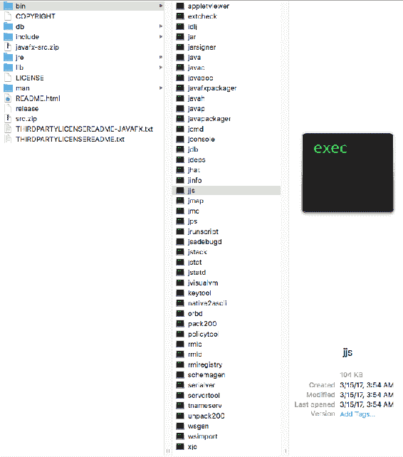

在这里，你可以看到一个打开的终端窗口，首先检查 Java 版本，然后使用`jjs -version`命令启动 Nashorn shell。在这个例子中，Java 和 Nashorn 都是 1.8.0.121 版本。或者，我们也可以简单地使用`jjs`命令启动 Nashorn，shell 将打开而不显示版本标识：


接下来，让我们创建一个简短的 JavaScript 并使用 Nashorn 运行它。考虑以下具有三条简单输出行的简单 JavaScript 代码。

```java
    var addtest = function()
    {
      print("Simple Test");
      print("This JavaScript program adds the numbers 300
       and 19.");
      print("Addition results = " + (300 + 19));
    }
    addtest();
```

要让 Java 运行这个 JavaScript 应用程序，我们将使用`jjs address.js`命令。以下是输出：

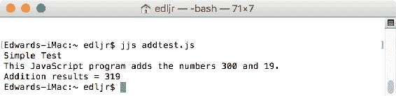

你可以用 Nashorn 做很多事情。从命令提示符/终端窗口，我们可以使用`jjs`与`-help`选项来查看完整的命令行命令列表：

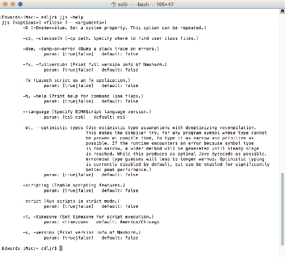

正如你所见，使用`-scripting`选项使我们能够使用 Nashorn 作为文本编辑器来创建脚本。当使用 Nashorn 时，有几个内置函数非常有用：

+   `echo()`: 这与 Java 方法`System.out.print()`类似

+   `exit()`: 这将退出 Nashorn

+   `load()`: 这将从给定的路径或 URL 加载一个脚本

+   `print()`: 这与 Java 方法`System.out.print()`类似

+   `readFull()`: 这将读取文件的内容

+   `readLine()`: 这从`stdin`读取一行

+   `quit()`: 这将退出 Nashorn

# 将 Nashorn 用作嵌入式解释器

与将其用作命令行工具相比，Nashorn 的一个更常见的用途是将其用作嵌入式解释器。`javax.script` API 是公开的，可以通过`nashorn`标识符访问。以下代码演示了如何在 Java 应用程序中访问 Nashorn，定义一个 JavaScript 函数，并获取结果：

```java
    // required imports
    import javax.script.ScriptEngine;
    import javax.script.ScriptEngineManager;

    public class EmbeddedAddTest 
    {
      public static void main(String[] args) throws Throwable
      {
        // instantiate a new ScriptEngineManager
        ScriptEngineManager myEngineManager =
          new ScriptEngineManager();

        // instantiate a new Nashorn ScriptEngine
        ScriptEngine myEngine = myEngineManager.getEngineByName(
         "nashorn");

        // create the JavaScript function
        myEngine.eval("function addTest(x, y) { return x + y; }");

        // generate output including a call to the addTest function
           via the engine
        System.out.println("The addition results are:
         " + myEngine.eval("addTest(300, 19);"));
      }
    }
```

这里是控制台窗口提供的输出：

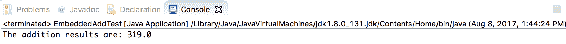

这是一个简单的例子，以给你一个关于如何使用 Nashorn 嵌入使用的一些可能性的概念。在 Oracle 的官方文档中有很多充足的例子。

# EMCAScript

**EMCA**（**欧洲计算机制造商协会**）成立于 1961 年，作为一个既为信息系统又为通信系统制定标准的一个组织。如今，EMCA 继续制定标准和发布技术报告，以帮助标准化消费电子、信息系统和通信技术的使用。他们有超过 400 个 ECMA 标准，其中大部分已被采用。

你会注意到 EMCA 不再使用全部大写字母拼写，因为它不再被视为一个缩写词。1994 年，欧洲计算机制造商协会正式将其名称更改为 EMCA。

EMCAScript，也称为 ES，于 1997 年作为一个脚本语言规范被创建。JavaScript 实现了这个规范。该规范包括以下内容：

+   补充技术

+   库

+   脚本语言语法

+   语义

# 解析器 API

Java 平台在版本 9 中的一个变化是为 Nashorn 的 EMCAScript 抽象语法树提供特定的支持。新 API 的目标是提供以下内容：

+   用于表示 Nashorn 语法树节点的接口

+   能够创建可以配置命令行选项的解析器实例

+   为与 AST 节点接口而设计的访问者模式 API

+   使用 API 的测试程序

新的 API，`jdk.nashorn.api.tree`，被创建以允许对 Nashorn 类进行未来的更改。在新解析器 API 之前，IDE 使用 Nashorn 的内部 AST 表示进行代码分析。根据 Oracle 的说法，使用 `idk.nashorn.internal.ir` 包阻止了 Nashorn 内部类的现代化。

下面是查看新 `jdk.nashorn.api.tree` 包的类层次结构：


下图展示了新 API 的复杂性，包括完整的接口层次结构：

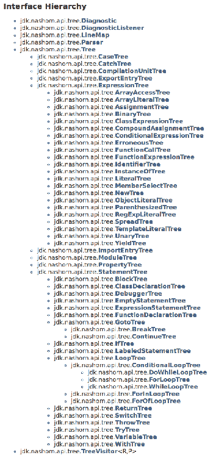

`jdk.nashorn.api.tree` 包的最后一个组件是枚举层次结构，如下所示：

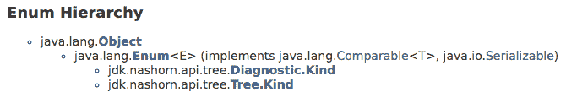

# 多版本 JAR 文件 [JEP-238]

JAR 文件格式在 Java 9 平台上得到了扩展，现在允许在单个 JAR 文件中存在多个版本的类文件。类版本可以针对特定的 Java 发布版本。这种增强允许开发人员使用单个 JAR 文件来容纳他们软件的多个版本。

JAR 文件增强包括以下内容：

+   支持 `JarFile` API

+   支持标准类加载器

JAR 文件格式的更改导致了核心 Java 工具的必要更改，以便它们能够解释新的多版本 JAR 文件。这些核心工具包括以下内容：

+   javac

+   javap

+   jdeps

最后，新的 JAR 文件格式支持模块化作为 Java 9 平台的关键特性。对 JAR 文件格式的更改并没有导致相关工具或过程的性能降低。

# 识别多版本 JAR 文件

多版本 JAR 文件将有一个新的属性，`Multi-Release: true`。此属性位于 JAR `MANIFEST.MF` 的主部分。

目录结构将在标准 JAR 文件和多版本 JAR 文件之间有所不同。以下是典型 JAR 文件结构的示例：

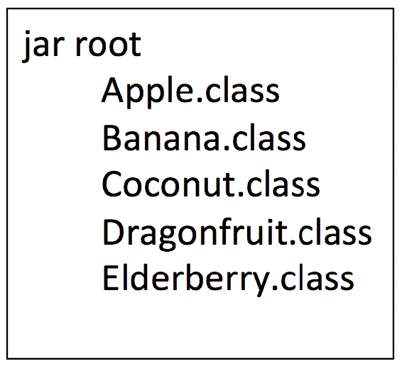

此图展示了新的多版本 JAR 文件结构，其中包含针对 Java 8 和 Java 9 的特定版本类文件：

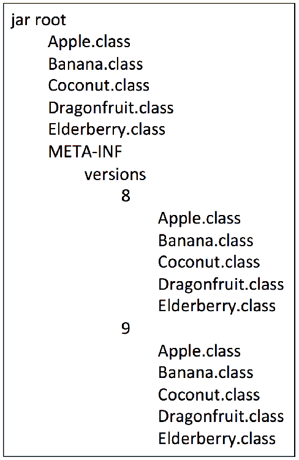

# 相关 JDK 更改

为了支持新的多版本 JAR 文件格式，必须对 JDK 进行一些更改。这些更改包括以下内容：

+   `URLClassLoader` 是基于 JAR 的，并且经过修改，可以读取指定版本的类文件。

+   新的基于模块的类加载器，Java 9 的新特性，被编写成可以读取指定版本的类文件。

+   `java.util.jar.JarFile` 类已被修改，以便从多版本 JAR 文件中选择适当的类版本。

+   JAR URL 方案的协议处理程序已被修改，以便从多版本 JAR 文件中选择适当的类版本。

+   Java 编译器 `javac` 被修改为读取已识别的类文件版本。这些版本识别是通过使用 `-target` 和 `-release` 命令行选项与 `JavacFileManager` API 和 `ZipFileSystem` API 来实现的。

+   以下工具已被修改以利用对 `JavacFileManager` API 和 `ZipFileSystem` API 的更改：

    +   `javah`：这会生成 C 头文件和源文件

    +   `schemagen`：这是 Java 类中命名空间的模式生成器

    +   `wsgen`：这是用于部署 Web 服务的解析器

+   javap 工具已更新以支持新的版本方案。

+   jdeps 工具已被修改以支持新的版本方案。

+   JAR 打包工具集已相应更新。此工具集包括 `pack200` 和 `unpack200`。

+   当然，JAR 工具也得到了增强，可以创建多版本 JAR 文件。

所有相关文档都已更新，以支持建立和支持新的多版本 JAR 文件格式所涉及的所有更改。

# Java 级 JVM 编译器接口 [JEP-243]

JEP-243 的目的是创建基于 Java 的 **JVM 编译器接口**（**JVMCI**）。JVMCI 允许 JVM 使用（必须是用 Java 编写的）Java 编译器作为动态编译器。

对 JVMCI 的需求背后的推理是它将是一个高度优化的编译器，不需要低级语言特性。一些 JVM 子系统需要低级功能，例如垃圾收集和 bytemode 解释。因此，JVMCI 是用 Java 而不是 C 或 C++ 编写的。这带来了 Java 一些最伟大特性的附带好处，如下所示：

+   异常处理

+   既是免费又强大的 IDE

+   内存管理

+   运行时可扩展性

+   同步

+   单元测试支持

由于 JVMCI 是用 Java 编写的，因此可以说它更容易维护。

JVMCI API 有三个主要组件：

+   虚拟机数据结构访问

+   安装带有其元数据的编译代码

+   使用 JVM 的编译系统

JVMCI 实际上在 Java 8 中就已经存在，某种程度上。JVMCI API 只可通过一个适用于启动类路径上代码的类加载器访问。在 Java 9 中，这将发生变化。它仍将在 Java 9 中保持实验性，但更易于访问。为了启用 JVMCI，必须使用以下一系列命令行选项：

```java
-XX:+UnlockExperimentalVMOptions -XX:+EnableJVMCI -XX:+UseJVMCICompiler - Djvmci.Compiler=<name of compiler>
```

Oracle 在 Java 9 中将 JVMCI 保持为实验性，以允许进一步的测试，并为开发者提供最大的保护。

# BeanInfo 注解 [JEP-256]

JEP-256 专注于用更合适的注解替换 `@beanifo` javadoc 标签。此外，这些新注解现在在运行时进行处理，以便可以动态生成 `BeanInfo` 类。Java 9 的模块化导致了这一变化。自定义 `BeanInfo` 类的创建已简化，客户端库也已模块化。

为了全面理解这个变化，在进一步探讨这个 JEP 之前，我们将回顾 `JavaBean`、`BeanProperty` 和 `SwingContainer`。

# JavaBean

`JavaBean` 是一个 Java 类。与其他 Java 类一样，`JavaBeans` 是可重用的代码。它们在设计上独特，因为它们将多个对象封装到一个中。一个 `JavaBean` 类必须遵循以下三个约定：

+   构造函数不应接受任何参数

+   它必须是可序列化的

+   它必须为其属性包含修改器和访问器方法

这里是一个 `JavaBean` 类的示例：

```java
    public class MyBean implements java.io.Serializable 
    {
      // instance variables  
      private int studentId;
      private String studentName;

      // no-argument constructor
      public MyBean() 
      {

      }

      // mutator/setter 
      public void setStudentId(int theID)
      {
        this.studentId = theID;
      }

      // accessor/getter
      public int getStudentId()
      {
        return studentId;
      }

      // mutator/setter 
      public void setStudentName(String theName)
      {
        this.studentName = theName;
      }

      // accessor/getter
      public String getStudentName()
      {
        return studentName;
      }

    }
```

访问 `JavaBean` 类就像使用修改器和访问器方法一样简单。这可能对你来说并不陌生，但你可能不知道你精心编写的那些类被称为 `JavaBean` 类。

# BeanProperty

`BeanProperty` 是一个注解类型。我们使用这个注解来指定一个属性，以便我们可以自动生成 `BeanInfo` 类。这是 Java 9 中的一个新注解。

`BeanProperty` 注解有以下可选元素：

+   `boolean bound`

+   `String description`

+   `String[] enumerationValues`

+   `boolean expert`

+   `boolean hidden`

+   `boolean preferred`

+   `boolean required`

+   `boolean visualUpdate`

# SwingContainer

`SwingContainer` 是一个注解类型。我们使用这个注解来指定与 Swing 相关的属性，以便我们可以自动生成 `BeanInfo` 类。这是 Java 9 中的一个新注解。

`SwingContainer` 注解有以下可选元素：

+   `String delegate`

+   `boolean value`

现在我们已经回顾了 `JavaBean`、`BeanProperty` 和 `SwingContainer`，让我们来看看 `BeanInfo` 类。

# BeanInfo 类

大部分情况下，`BeanInfo` 类在运行时自动生成。例外的是 Swing 类。这些类基于 `@beaninfo` javadoc 标签生成 `BeanInfo` 类。这是在编译时完成的，而不是在运行时。在 Java 9 中，`@beaninfo` 标签已被 `@interface JavaBean`、`@interface BeanProperty` 和 `@interface SwingContainer` 注解所取代。

```java
SwingContainer:
```

```java
    package javax.swing;

    public @interface SwingContainer
    {
      boolean value() default false;
      String delegate() default "";
    }
```

这为我们提供了三个好处：

+   在 Bean 类中指定属性将比创建单个 `BeanInfo` 类要容易得多

+   我们将能够移除自动生成的类

+   客户端库使用这种方法可以更容易地进行模块化

# TIFF 图像输入/输出 [JEP-262]

JEP-262 非常直接。对于 Java 9，图像输入/输出插件已扩展以包括对 TIFF 图像格式的支持。`ImageIO` 类扩展了 `Object` 类，并是 Java SE 的一部分。该类包含用于编码和解码图像的几个方法。以下是一个静态方法列表：

| **方法** | **返回值** |
| --- | --- |
| `createImageInputStream(Object input)` | `ImageInputStream` |
| `createImageOutputStream(Object output)` | `ImageOutputStream` |
| `getCacheDirectory()` | 当前 `CacheDirectory` 的值 |
| `getImageReader(ImageWriter writer)` | `ImageReader` |
| `getImageReaders(Object input)` | 当前`ImageReaders`的迭代器 |
| `getImageReadersByFormatName(String formatName)` | 具有指定格式名称的当前`ImageReaders`的迭代器 |
| `getImageReadersByMIMEType(String MIMEType)` | 指定 MIME 类型的当前`ImageReaders`的迭代器 |
| `getImageReadersBySuffix(String fileSuffix)` | 具有指定后缀的当前`ImageReaders`的迭代器。 |
| `getImageTranscoders(ImageReader reader)` | 当前`ImageTranscoders`的迭代器 |
| `getImageWriter(ImageReader reader)` | `ImageWriter` |
| `getImageWriters(ImageTypeSpecifier type, String formatName)` | 可以编码到指定类型的当前`ImageWriters`的迭代器 |
| `getImageWritersByFormatName(String formatName)` | 具有指定格式名称的当前`ImageWriters`的迭代器 |
| `getImageWritersByMIMEType(String MIMEType)` | 指定 MIME 类型的当前`ImageWriters`的迭代器 |
| `getImageWritersBySuffix(String fileSuffix)` | 具有指定后缀的当前`ImageWriters`的迭代器 |
| `getReaderFileSuffixes()` | 当前读取器理解的文件后缀的字符串数组 |
| `getReaderFormatNames()` | 当前读取器理解的格式名称的字符串数组 |
| `getReaderMIMETypes()` | 当前读取器理解的 MIME 类型的字符串数组 |
| `getUseCache()` | `UseCache`值 |
| `getWriterFileSuffixes()` | 当前写入器理解的文件后缀的字符串数组 |
| `getWriterFormatNames()` | 当前写入器理解的格式名称的字符串数组 |
| `getWriterMIMETypes()` | 当前写入器理解的 MIME 类型的字符串数组 |
| `read(File input)` | 带有`ImageReader`的`BufferedImage` |
| `read(ImageInputStream stream)` | 带有`ImageInputStream`和`ImageReader`的`BufferedImage` |
| `read(InputStream input)` | 带有`InputStream`和`ImageReader`的`BufferedImage` |
| `read(URL input)` | 带有`ImageReader`的`BufferedImage` |

也有一些不返回值或返回布尔值的静态方法：

| **方法** | **描述** |
| --- | --- |

| `scanForPlugins()` | 执行以下操作： |

+   在应用程序类路径中扫描插件

+   加载插件服务提供程序类

+   在 IIORegistry 中注册服务提供程序实例

|

| `setCacheDirectory(File cacheDirectory)` | 缓存文件将存储在这里。 |
| --- | --- |
| `setUseCache(boolean useCache)` | 此方法切换缓存是否基于磁盘。这适用于`ImageInputStream`和`ImageOutputStream`实例。 |
| `write(RenderedImage im, String formatName, File output)` | 将图像写入指定的文件。 |
| `write(RenderedImage im, String formatName, ImageOutputStream output)` | 将图像写入`ImageOutputStream`。 |
| `write(RenderedImage im, String formatName, OutputStream output)` | 将图像写入`OutputStream`。 |

从提供的方法中，您可以了解到图像输入/输出框架为我们提供了一个方便的方式来使用图像编解码器。截至 Java 7，以下图像格式插件是由 `javax.imageio` 实现的：

+   BMP

+   GIF

+   JPEG

+   PNG

+   WBMP

如您所见，TIFF 并不在图像文件格式的列表中。TIFFs 是一种常见的文件格式，在 2001 年，随着 MacOS X 的发布，macOS 广泛使用了这种格式。

Java 9 平台包括用于 TIFFs 的 `ImageReader` 和 `ImageWriter` 插件。这些插件是用 Java 编写的，并打包在新的 `javax.imageio.plugins.tiff` 包中。

# 平台日志 API 和服务 [JEP-264]

Java 9 平台包括一个新的日志 API，允许平台类记录消息。它有一个相应的服务来操作日志。在我们深入探讨关于日志 API 和服务的新特性之前，让我们回顾一下在 Java 7 中引入的 `java.util.logging.api`。

# `java.util.logging` 包

`java.util.logging` 包包含类和接口，共同构成了 Java 的核心日志功能。该功能创建的目标如下：

+   最终用户和系统管理员的问题诊断

+   现场服务工程师的问题诊断

+   开发组织的问题诊断

如您所见，主要目的是为了使远程软件的维护成为可能。

`java.util.logging` 包包含两个接口：

+   `public interface Filter`

    +   目的：这提供了对记录数据的精细控制

    +   方法：

        +   `isLoggable(LogRecord record)`

+   `public interface LoggingMXBean`

    +   目的：这是日志设施的管理接口

    +   方法：

        +   `getLoggerLevel(String loggerName)`

        +   `getLoggerNames()`

        +   `getparentLoggerName(String loggerName)`

        +   `setLoggerLevel(String loggerName, String levelName)`

以下表格提供了 `java.util.logging` 包的类，以及每个类在日志功能和管理方面的简要描述：

| **类** | **定义** | **描述** |
| --- | --- | --- |
| `ConsoleHandler` | `public class ConsoleHandler extends StreamHandler` | 将日志记录发布到 `System.err` |
| `ErrorManager` | `public class ErrorManager extends Object` | 用于在记录过程中处理错误 |
| `FileHandler` | `public class FileHandler extends StreamHandler` | 文件记录 |
| `Formatter` | `public abstract class Formatter extends Object` | 用于格式化 `LogRecords` |
| `Handler` | `public abstract class Handler extends Object` | 导出 `Logger` 消息 |
| `Level` | `public class Level extends Object implements Serializable` | 控制日志级别。级别按降序排列为--严重、警告、信息、配置、精细、更精细和最精细 |
| `Logger` | `public class Logger extends Object` | 记录消息 |
| `LoggingPermission` | `public final class LoggingPermission extends BasicPermission` | `SecurityManager` 检查此权限 |
| `LogManager` | `public class LogManager` | 用于在日志记录器和日志服务之间维护共享状态 |
| `LogRecord` | `public class LogRecord extends Object implements Serializable` | 在处理器之间传递 |
| `MemoryHandler` | `public class MemoryHandler extends Handler` | 在内存中缓冲请求 |
| `SimpleFormatter` | `public class SimpleFormatter extends Formatter` | 提供可读的 `LogRecord` 元数据 |
| `SocketHandler` | `public class SocketHandler extends StreamHandler` | 网络日志处理器 |
| `StreamHandler` | `public class StreamHandler extends Handler` | 基于流的日志处理器 |
| `XMLFormatter` | `public class XMLFormatter extends Formatter` | 将日志格式化为 XML |

接下来，让我们回顾一下 Java 9 中所做的更改。

# Java 9 中的日志记录

在 Java 9 之前，有多个日志架构可供选择，包括 `java.util.logging`、`SLF4J` 和 `Log4J`。后两者是具有独立门面和实现组件的第三方框架。这种模式在新 Java 9 平台上得到了复制。

Java 9 对 `java.base` 模块进行了修改，以便它将处理日志功能，而不是依赖于 `java.util.logging` API。它具有独立的门面和实现组件。这意味着当使用第三方框架时，JDK 只需提供实现组件并返回与请求的日志框架协同工作的平台日志记录器。

如以下插图所示，我们使用 `java.util.ServiceLoader` API 加载我们的 `LoggerFinder` 实现方式。如果使用系统类加载器找不到具体实现，JDK 将使用默认实现：

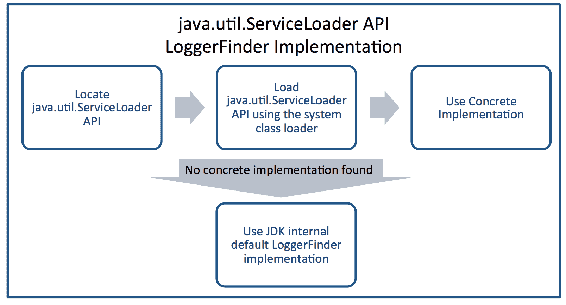

# XML 目录 [JEP-268]

JEP 268，标题为“XML 目录”，专注于创建一个标准的 XML 目录 API 以支持 OASIS XML 目录标准 v1.1。新的 API 定义了目录和目录解析抽象，以便 JAXP 处理器可以使用它们。在本节中，我们将探讨以下内容：

+   OASIS XML 目录标准

+   JAXP 处理器

+   Java 9 之前的 XML 目录

+   Java 9 平台变更

# OASIS XML 目录标准

**XML** (**可扩展标记语言**) 目录是由目录条目组成的 XML 文档。每个条目将一个标识符与另一个位置配对。OASIS 是一个非营利性联盟，其使命是推进开放标准。他们在 2005 年发布了 XML 目录标准，版本 1.1。此标准有两个基本用例：

+   将外部标识符映射到 URI 引用

+   将 URI 引用映射到另一个 URI 引用

下面是一个示例 XML 目录条目：

```java
    <public publicId="-//Packt Publishing Limited//Mastering Java 9//EN"
     uri="https://www.packtpub.com/application-development/mastering-java-9"/>
```

完整的 OASIS XML 目录标准可以在官方网站找到：[`www.oasis-open.org/committees/download.php/14809/xml-catalogs.html`](https://www.oasis-open.org/committees/download.php/14809/xml-catalogs.html)

# JAXP 处理器

Java API for XML processing 被称为 JAXP。正如其名称所暗示的，此 API 用于解析 XML 文档。有四个相关接口：

+   DOM：文档对象模型解析

+   SAX：XML 解析的简单 API

+   StAX：XML 解析的流式 API

+   XSLT：转换 XML 文档的接口

# Java 9 之前的 XML 目录

Java 平台自 JDK 6 以来就有一个内部目录解析器。当时没有公开的 API，因此使用外部工具和库来访问功能。进入 Java 9，目标是使内部目录解析器成为通用 API 的标准，以简化支持和使用。

# Java 9 平台变更

新的 XML 目录 API，随 Java 9 提供，遵循 OASIS XML 目录标准，v1.1。以下是功能和能力的高亮：

+   实现`EntityResolver`

+   实现`URIResolver`

+   通过`CatalogManager`创建 XML 目录是可能的

+   使用`CatalogManager`创建`CatalogResolvers`

+   将遵循 OASIS 开放目录文件语义

    +   将外部标识符映射到 URI 引用

    +   将 URI 引用映射到另一个 URI 引用

+   `CatalogResolvers`将实现 JAXP `EntityResolver`接口

+   `CatalogResolvers`将实现 JAXP `URIResolver`接口

+   解析器将支持 SAX `XMLFilter`。

由于新的 XML 目录 API 将是公开的，因此 Java 9 之前的内部目录解析器将被移除，因为它将不再必要。

# 集合的便利工厂方法 [JEP-269]

Java 编程语言不支持集合字面量。在 2013 年提出将此功能添加到 Java 平台，并在 2016 年重新审视，但它仅作为研究提案曝光，而不是未来的实现。

Oracle 对集合字面量的定义是“*一种评估为聚合类型的语法表达式形式，例如数组、列表或映射*”([`openjdk.java.net/jeps/186`](http://openjdk.java.net/jeps/186))。

当然，直到 Java 9 发布。在 Java 编程语言中实现集合字面量据报道有以下好处：

+   性能提升

+   提高安全性

+   减少样板代码

即使不是研究小组的一部分，我们对 Java 编程语言的知识也使我们了解到额外的优势：

+   能够编写更短的代码

+   能够编写空间高效的代码

+   使集合字面量不可变的能力

让我们看看两个案例——在 Java 9 之前使用集合，然后在新 Java 平台中对集合字面量的新支持。

# 在 Java 9 之前使用集合

这里是一个示例，说明我们如何在 Java 9 之前创建自己的集合。这个类定义了`PlanetCollection`的结构。它有以下组件：

+   单个实例变量

+   一个单参数构造函数

+   修改器/设置方法

+   访问器/获取方法

+   打印对象的方法

这里是实现前面列出的构造函数和方法的代码：

```java
    public class PlanetCollection 
    {
      // Instance Variable
      private String planetName;

      // constructor
      public PlanetCollection(String name)
      {
        setPlanetName(name);
      }

      // mutator
      public void setPlanetName(String name)
      {
        this.planetName = name;
      }

      // accessor
      public String getPlanetName()
      {
        return this.planetName;
      }

      public void print()
      {
        System.out.println(getPlanetName());
      }
    }
```

现在，让我们看看填充集合的驱动类：

```java
    import java.util.ArrayList;

    public class OldSchool 
    {
      private static ArrayList<PlanetCollection> myPlanets =
        new ArrayList<>();

      public static void main(String[] args) 
      {
        add("Earth");
        add("Jupiter");
        add("Mars");
        add("Venus");
        add("Saturn");
        add("Mercury");
        add("Neptune");
        add("Uranus");
        add("Dagobah");
        add("Kobol");

        for (PlanetCollection orb : myPlanets)
        {
          orb.print();
        }

      }

      public static void add(String name)
      {
        PlanetCollection newPlanet = new PlanetCollection(name);
        myPlanets.add(newPlanet);
      }
    }
```

下面是此应用程序的输出：

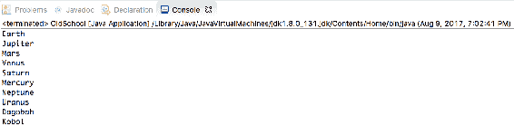

很遗憾，这段代码非常冗长。我们使用静态初始化块而不是字段初始化来填充我们的集合。还有其他填充列表的方法，但它们都比应有的冗长。这些其他方法还有额外的问题，例如需要创建额外的类、使用晦涩的代码和隐藏的引用。

现在，让我们看看新 Java 9 平台提供的解决方案，我们将在下一节中查看新功能。 

# 使用新的集合字面量

为了纠正目前创建集合所需的代码冗长性，我们需要用于创建集合实例的库 API。查看上一节中的 Java 9 之前的代码片段，然后考虑以下可能的重构：

```java
    PlanetCollection<String> myPlanets = Set.of(
      "Earth",
      "Jupiter",
      "Mars",
      "Venus",
      "Saturn",
      "Mercury",
      "Neptune",
      "Uranus",
      "Dagobah",
      "Kobol");
```

这段代码高度可读，且不冗长。

新的实现将包括以下接口上的静态工厂方法：

+   `List`

+   `Map`

+   `Set`

因此，我们现在能够创建不可修改的 `List` 集合、`Map` 集合和 `Set` 集合的实例。它们可以使用以下语法进行实例化：

+   `List.of(a, b, c, d, e);`

+   `Set.of(a, b, c, d, e);`

+   `Map.of();`

`Map` 集合将有一组固定参数。

# 平台特定桌面功能 [JEP-272]

令人兴奋的 JEP-272 是创建一个新的公共 API，这样我们就可以编写具有访问平台特定桌面功能的应用程序。这些功能包括与任务栏/托盘交互以及监听应用程序和系统事件。

macOS X 的 `com.apple.eawt` 包是一个内部 API，从 Java 9 开始不再可访问。为了支持 Java 9 的新嵌入式平台特定桌面功能，`apple.applescript` 类将从 Java 平台中移除，而不提供替代方案。

此努力有几个目标：

+   创建一个公共 API 来替代 `com.apple.{east,eio}` 中的功能

+   确保 OS X 开发者不会丢失功能。为此，Java 9 平台为以下包提供了替代方案：

    +   `com.apple.eawt`

    +   `com.apple.eio`

+   为开发者提供了一套接近通用的功能集，用于平台（即 Windows 和 Linux）以及 OS X。通用功能包括：

    +   具有事件监听器的登录/注销处理器

    +   具有事件监听器的屏幕锁定处理器

    +   包括任务栏/托盘操作：

        +   请求用户注意

        +   指示任务进度

        +   动作快捷键

新 API 将添加到 `java.awt.Desktop` 类中。

# 增强方法句柄 [JEP-274]

**增强方法句柄** JEP-274 的目的是改进以下列出的类，以便通过改进的优化使常见用法更容易：

+   `MethodHandle` 类

+   `MethodHandles` 类

+   `MethodHandles.Lookup` 类

列出的类都是`java.lang.invoke`包的一部分，该包作为 Java 9 平台的一部分进行了更新。这些改进是通过使用查找细化以及`MethodHandle`组合`for`循环和`try...finally`块实现的。

在本节中，我们将探讨有关 JEP-274 的以下内容：

+   增强的原因

+   查找函数

+   参数处理

+   其他组合

# 增强的原因

此增强源于开发者的反馈和使`MethodHandle`、`MethodHandles`和`MethodHandles.Lookup`类更易于使用的愿望。同时也有增加额外用例的呼吁。

这些变化带来了以下好处：

+   在`MethodHandle` API 的使用中启用精度

+   实例化减少

+   增加 JVM 编译器优化

# 查找函数

关于 Java 9 平台中的查找函数的更改包括以下内容：

+   `MethodHandles`现在可以绑定到接口中的非抽象方法

+   查找 API 允许从不同的上下文进行类查找

`MethodHandles.Lookup.findSpecial(Class<?> refs, String name, MethodType type, Class<?> specialCaller)`类已被修改，允许在接口上定位可调用的超方法。

此外，以下方法已被添加到`MethodHandles.Lookup`类中：

+   `Class<?> findClass(String targetName)`

+   `Class<?> accessClass(Class<?> targetClass)`

# 参数处理

对 Java 9 平台上的`MethodHandle`参数处理进行了三项更新。以下是对这些更改的概述：

+   使用`foldArguments(MethodHandle target, MethodHandle combinator)`进行参数折叠之前没有位置参数。

    +   使用`MethodHandle.asCollector(Class<?> arrayType, int arrayLength)`方法进行参数收集之前不支持将参数收集到数组中，除了尾随元素。现在已进行更改，并新增了`asCollector`方法以支持 Java 9 中的该功能。

+   使用`MethodHandle.asSpreader(Class<?> arrayType, int arrayLength)`方法通过反向收集参数的方式将尾随数组的内容扩展到多个参数中。参数扩展已被修改以支持在方法签名中的任何位置扩展数组。

下一个部分提供了更新后的`asCollector`和`asSpreader`方法的新方法定义。

# 其他组合

以下组合已被添加以支持 Java 9 平台中`java.lang.invoke`包的`MethodHandle`、`MethodHandles`和`MethodHandles.Lookup`类的易用性和优化：

+   通用循环抽象：

    +   `MethodHandle loop(MethodHandle[] . . . clauses)`

+   `While`循环：

    +   `MethodHandle whileLoop(MethodHandle init, MethodHandle pred, MethodHandle body)`

+   `Do...while`循环：

    +   `` `MethodHandle doWhileLoop(MethodHandle init, MethodHandle body, MethodHandle pred)` ``

+   计数循环：

    +   `MethodHandle countedLoop(MethodHandle iterations, MethodHandle init, MethodHandle body)`

+   数据结构迭代：

    +   `MethodHandle iteratedLoop(MethodHandle iterator, MethodHandle init, MethodHandle body)`

+   `Try...finally`块：

    +   `MethodHandle tryFinally(MethodHandle target, MethodHandle cleanup)`

+   参数处理：

    +   参数展开：

        +   `MethodHandle asSpreader(int pos, Class<?> arrayType, int arrayLength)`

    +   参数收集：

        +   `MethodHandle asCollector(int pos, Class<?> arrayType, int arrayLength)`

    +   参数折叠：

        +   `MethodHandle foldArguments(MethodHandle target, int pos, MethodHandle combiner)`

# 增强弃用[JEP-277]

表达弃用的有两种设施：

+   `@Deprecated`注解

+   `@deprecated` javadoc 标签

这些设施分别在 Java SE 5 和 JDK 1.1 中引入。`@Deprecated`注解的目的是注解不应使用因为它们被认为是有危险的和/或存在更好的选择程序组件。这是预期用途。实际使用各不相同，包括因为警告仅在编译时提供；几乎没有理由忽略注解的代码。

**增强弃用** JEP-277 被采纳，以向开发者提供有关规范文档中 API 预期处置的更清晰信息。这项 JEP 的工作还导致了一个分析程序对弃用 API 使用的工具。

为了支持这种信息保真度，以下组件已被添加到`java.lang.Deprecated`注解类型中：

+   `forRemoval()`：

    +   如果 API 元素已被计划未来删除，则返回布尔值`true`

    +   如果 API 元素尚未计划未来删除但已弃用，则返回布尔值`false`

    +   默认为`false`

+   `since()`：

    +   返回一个包含发布或版本号的字符串，在该版本号下指定的 API 被标记为弃用

# `@Deprecated`注解真正意味着什么

当 API 或 API 内的方法被标记为`@Deprecated`注解时，通常存在以下一个或多个条件：

+   API 中存在错误，但没有计划修复它们

+   使用该 API 可能会导致错误

+   该 API 已被另一个 API 取代

+   该 API 是实验性的

# 摘要

在本章中，我们涵盖了 16 个被纳入 Java 9 平台的 JEP。这些 JEP 涵盖了广泛的工具和 API 更新，使使用 Java 更容易，并为我们的程序提供了更大的优化可能性。我们的审查包括对新的 HTTP 客户端、Javadoc 和 Doclet API 的更改、新的 JavaScript 解析器、JAR 和 JRE 更改、新的 Java 级别 JVM 编译器接口、对 TIFF 图像的新支持、平台日志记录、XML 目录支持、集合以及新的平台特定桌面功能。我们还审查了方法处理和弃用注解的增强。

在下一章中，我们将介绍 Java 9 平台引入的并发增强功能。我们的主要关注点将是流类 API 提供的响应式编程支持。我们还将探讨 Java 9 中引入的其他并发增强功能。
