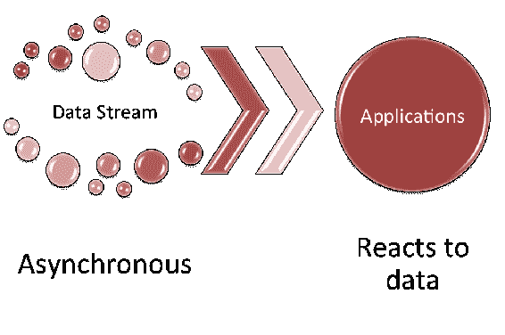
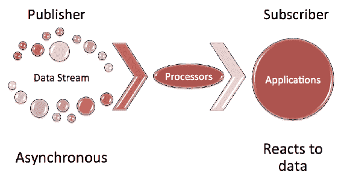
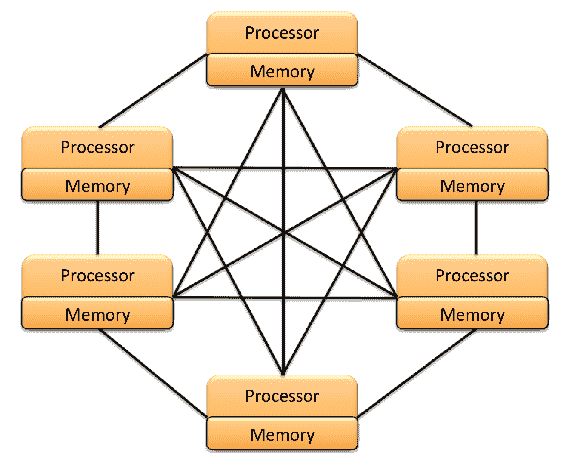

# 第十三章：并发与响应式编程

在上一章中，我们介绍了被纳入 Java 9 平台的几个**Java 增强提案**（**JEPs**）。这些 JEPs 代表了一系列工具和 API 的更新，使得使用 Java 进行开发更加容易，并为我们的 Java 应用程序提供了更大的优化可能性。我们探讨了新的 HTTP 客户端、Javadoc 和 Doclet API 的更改、新的 JavaScript 解析器、JAR 和 JRE 的更改、新的 Java 级别 JVM 编译器接口、对 TIFF 图像的新支持、平台日志、XML 目录支持、集合以及新的平台特定桌面功能。我们还探讨了方法处理增强和弃用注解。

在本章中，我们将介绍 Java 9 平台引入的并发增强。我们的主要重点是支持响应式编程，这是由`Flow`类 API 提供的并发增强。响应式编程是 Java 9 的一个新概念，因此我们将对该主题采取探索性方法。我们还将探讨 Java 9 中引入的其他并发增强。

具体来说，我们将涵盖以下主题：

+   响应式编程

+   新的`Flow` API

+   额外的并发更新

+   自旋等待提示

# 响应式编程

响应式编程是指应用程序在异步数据流发生时对其进行响应。以下图像展示了流程：



响应式编程不是一个只有学者使用的花哨的软件工程术语。实际上，它是一种编程模型，与更常见的应用程序迭代内存中数据的方法相比，可以带来更高的效率。

响应式编程还有更多内容。首先，让我们考虑数据流是由发布者以异步方式提供给订阅者的。

数据流是字符串和原始数据类型的二进制输入/输出。`DataInput`接口用于输入流，`DataOutput`接口用于输出流。

处理器或处理器链可以用来转换数据流，而不会影响发布者或订阅者。在以下示例中，**处理器**在数据流上工作，而不涉及**发布者**或**订阅者**，甚至没有意识到：



除了更高的效率外，响应式编程还代表了几项额外的优势，以下将重点介绍：

+   代码库可以更简洁，使其：

    +   更易于编码

    +   更易于维护

    +   更易于阅读

+   流处理导致内存效率提高

+   这是一个适用于各种编程应用的解决方案

+   需要编写的样板代码更少，因此可以将开发时间集中在编程核心功能上

+   以下类型的编程需要更少的时间和代码：

    +   并发

    +   低级线程

    +   同步

# 响应式编程标准化

软件开发的许多方面都有标准，反应式编程也不例外。有一个**反应式流**倡议旨在标准化异步流处理。在 Java 的上下文中，具体关注的是 JVM 和 JavaScript。

反应式流倡议旨在解决如何管理线程之间数据流交换的问题。正如您在前一节中回忆的那样，处理器的概念基于对发布者或接收者没有影响。这一无影响的要求规定以下内容是不必要的：

+   数据缓冲

+   数据转换

+   转换

标准的基本语义定义了数据流元素传输的规范。这个标准是专门为与 Java 9 平台一起交付而建立的。反应式流包括一个库，可以帮助开发者从`org.reactivestreams`和`java.util.concurrent.Flow`命名空间进行转换。

在反应式编程和反应式流标准化中取得成功的关键是理解相关的术语：

| **术语** | **描述** |
| --- | --- |
| 需求 | 需求指的是订阅者请求更多元素，同时也指尚未由发布者满足的请求元素的总数。 |
| 需求 | 需求也指尚未由发布者满足的请求元素的总数。 |
| 外部同步 | 用于线程安全的外部访问协调。 |
| 非阻塞 | 如果方法快速执行而不需要大量计算，则称这些方法为非阻塞方法。非阻塞方法不会延迟订阅者的线程执行。 |
| NOP | NOP 执行是指可以反复调用而不影响调用线程的执行。 |
| 响应性 | 这个术语指的是组件的响应能力。 |
| 正常返回 | 正常返回指的是没有错误发生时的正常状态。`onError` 方法是标准允许的唯一一种通知订阅者失败的方式。 |

| 信号 | 以下方法之一：

+   `cancel`

+   `onComplete`

+   `onError`

+   `onNext`

+   `onSubscribe`

+   `request`

|

您可以从 Maven Central（[`search.maven.org`](https://search.maven.org)）获取标准。以下是截至本书出版日期的 Maven Central 上的标准：

```java
    <dependency>
      <groupId>org.reactivestreams</groupId>
      <artifactId>reative-streams</artifactId>
      <version>1.0.1</version>
    </dependency>

    <dependency>
      <groupId>org.reactivestreams</groupId>
      <artifact>reactive-streams-tck</artifactId>
      <version>1.0.0</version>
      <scope>test</scope>
    </dependency>
```

在下一节中，我们将探讨 Java 9 平台中的 Flow API，因为它们对应于反应式流规范。

# 新的流 API

`Flow`类是`java.util.concurrent`包的一部分。它帮助开发者将反应式编程融入他们的应用程序。该类有一个方法`defaultBufferSize()`和四个接口。

`defaultBufferSize()`是一个静态方法，它返回发布和订阅缓冲的默认缓冲区大小。这个默认值是`256`，并以`int`类型返回。让我们看看这四个接口。

# `Flow.Publisher`接口

`Flow.Publisher`接口是一个功能接口。`Publisher`是向订阅者发送数据的生产者：

```java
    @FunctionalInterface
    public static interface Flow.Publisher<T>
```

此功能接口可以作为 lambda 表达式赋值的目标。它只接受一个参数--订阅的项目类型`<T>`。它有一个方法：

+   `void onSubscribe(Flow.Subscription subscription)`

# `Flow.Subscriber`接口

`Flow.Subscriber`接口用于接收消息，其实现如下：

```java
    public static interface Flow.Subscriber<T>
```

此接口被设置为接收消息。它只接受一个参数--订阅的项目类型`<T>`。它具有以下方法：

+   `void onComplete()`

+   `void onError(Throwable throwable)`

+   `void onNext(T item)`

+   `void onSubscribe(Flow.Subscription subscription)`

# `Flow.Subscription`接口

`Flow.Subscription`接口确保只有订阅者才能接收到请求的内容。同样，正如您将在这里看到的，订阅可以在任何时候取消：

```java
    public static interface Flow.Subscription
```

此接口不接受任何参数，它是控制`Flow.Publisher`和`Flow.Subscriber`实例之间消息的链接。它具有以下方法：

+   `void cancel()`

+   `void request(long n)`

# `Flow.Processor`接口

`Flow.Processor`接口可以同时作为`Subscriber`和`Publisher`。实现如下：

```java
    static interface Flow.Processor<T,R> extends Flow.Subscriber<T>,
     Flow.Publisher<R>
```

此接口接受两个参数--订阅的项目类型`<T>`和发布的项目类型`<R>`。它没有自己的方法，但继承自`java.util.concurrent.Flow.Publisher`的以下方法：

+   `void subscribe(Flow.Subscriber<? super T> subscriber)`

`Flow.Processor`还从`java.util.concurrent.Flow.Subscriber`接口继承了以下方法：

+   `void onComplete()`

+   `void onError(Throwable throwable)`

+   `void onNext(T item)`

+   `void onSubscribe(Flow.Subscription subscription)`

# 示例实现

在任何给定的响应式编程实现中，我们都会有一个请求数据的`Subscriber`和一个提供数据的`Publisher`。让我们首先看看一个示例`Subscriber`实现：

```java
    import java.util.concurrent.Flow.*;

    public class packtSubscriber<T> implements Subscriber<T>
    {
      private Subscription theSubscription;

      // We will override the four Subscriber interface methods

      @Override
      public void onComplete()
      {
        System.out.println("Data stream ended");
      }

      @Override
      public void onError(Throwable theError)
      {
        theError.printStackTrace();
      }

      @Override
      public void onNext(T theItem)
      {
        System.out.println("Next item received: " + theItem);
        theSubscription.request(19);  // arbitrary number for
         example purposes
      }

      @Override
      public void onSubscribe(Subscription theSubscription)
      {
        this.theSubscription = theSubscription;
        theSubscription.request(19);
      }

    } 
```

如您所见，实现`Subscriber`并不困难。繁重的工作是在`Subscriber`和`Publisher`之间的处理器中完成的。让我们看看一个示例实现，其中`Publisher`向订阅者发布数据流：

```java
    import java.util.concurrent.SubsmissionPublisher;

    . . . 

    // First, let's create a Publisher instance
    SubmissionPublisher<String> packtPublisher = new 
     SubmissionPublisher<>();

    // Next, we will register a Subscriber
    PacktSubscriber<String> currentSubscriber = new 
     PacktSubscriber<>();
    packtPublisher.subscribe(currentSubscriber);

    // Finally, we will publish data to the Subscriber and 
       close the publishing effort
    System.out.println("||---- Publishing Data Stream ----||");
    . . . 
    packtPublisher.close();
    System.out.println("||---- End of Data Stream Reached ----||");
```

# 其他并发更新

**更多并发更新** Java 增强提案，JEP 266，旨在改善 Java 中的并发使用。在本节中，我们将简要探讨 Java 并发的概念，并查看对 Java 9 平台的有关增强：

+   Java 并发

+   支持响应式流

+   `CompletableFuture` API 增强

# Java 并发

在本节中，我们将从并发的简要解释开始，然后查看系统配置，涵盖 Java 线程，然后查看并发改进。

# 并发解释

并发处理自 1960 年代以来就已经存在。在那些形成年份，我们已经有允许多个进程共享单个处理器的系统。这些系统更明确地定义为伪并行系统，因为它只显示出多个进程正在同时执行。我们今天的计算机仍然以这种方式运行。1960 年代和当今的区别在于，我们的计算机可以有多个 CPU，每个 CPU 有多个核心，这更好地支持了并发。

并发和并行性经常被互换使用。并发是指多个进程重叠，尽管开始和结束时间可能不同。并行性发生在任务同时开始、运行和停止时。

# 系统配置

需要考虑几种不同的处理器配置。本节介绍了两种常见配置。第一种配置是共享内存，如图所示：


如您所见，共享内存系统配置具有多个处理器，这些处理器都共享一个公共的系统内存。第二个特色系统配置是分布式内存系统：



在分布式内存系统中，每个处理器都有自己的内存，每个单独的处理器与其他处理器完全连接，从而形成一个完全连接的分布式系统。

# Java 线程

Java 中的线程是一个程序执行，它是 JVM 内置的。`Thread` 类是 `java.lang` 包的一部分（`java.lang.Thread`）。线程有优先级，控制 JVM 执行它们的顺序。虽然这个概念很简单，但实现并不简单。让我们先仔细看看 `Thread` 类。

`Thread` 类有两个嵌套类：

+   `public static enum Thread.State`

+   `public static interface Thread.UncaughtExceptionHandler`

有三个实例变量用于管理线程优先级：

+   `public static final int MAX_PRIORITY`

+   `public static final int MIN_PRIORITY`

+   `public static final int NORM_PRIORITY`

`Thread` 类有八个构造函数，所有这些构造函数都会分配一个新的 `Thread` 对象。以下是构造函数签名：

+   `public Thread()`

+   `public Thread(Runnable target)`

+   `public Thread(Runnable target, String name)`

+   `public Thread(String name)`

+   `public Thread(ThreadGroup group, Runnable target)`

+   `public Thread(ThreadGroup group, Runnable target, String name)`

+   `public Thread(ThreadGroup group, Runnable target, String name, long stackSize)`

+   `public Thread(ThreadGroup group, String name)`

`Thread` 类还有 43 个方法，其中 6 个已被弃用。其余的方法在此列出，除了访问器和修改器，它们单独列出。您可以查阅文档以了解每个方法的详细信息：

+   `public static int activeCount()`

+   `public final void checkAccess()`

+   `protected Object clone() throws CloneNotSupportedException`

+   `public static Thread currentThread()`

+   `public static void dumpStack()`

+   `public static int enumerate(Thread[] array)`

+   `public static boolean holdsLock(Object obj)`

+   `public void interrupt()`

+   `public static boolean interrupted()`

+   `public final boolean isAlive()`

+   `public final boolean isDaemon()`

+   `public boolean isInterrupted()`

+   join 方法:

    +   `public final void join() throws InterruptedException`

    +   `public final void join(long millis) throws InterruptedException`

    +   `public final void join(long millis, int nano) throws InterruptedException`

+   `public void run()`

+   sleep 方法:

    +   `public static void sleep(long mills) throws InterruptedException`

    +   `public static void sleep(long mills, int nano) throws InterruptedException`

+   `public void start()`

+   `public String toString()`

+   `public static void yield()`

以下是 `Thread` 类的访问器/获取器和修改器/设置器的列表：

+   访问器/获取器:

    +   `public static Map<Thread, StackTraceElement[]> getAllStacktraces()`

    +   `public ClassLoader getContextClassLoader()`

    +   `public static Thread.UncaughtExceptionHandler getDefaultUncaughtExceptionHandler()`

    +   `public long getId()`

    +   `public final String getName()`

    +   `public final int getPriority()`

    +   `public StackTraceElement[] getStackTrace()`

    +   `public Thread.State getState()`

    +   `public final ThreadGroup getThreadGroup()`

    +   `public Thread.UncaughtExceptionHandler getUncaughtExceptionHandler()`

+   mutators/setters:

    +   `public void setContextClassLoader(ClassLoader cl)`

    +   `public final void setDaemon(boolean on)`

    +   `public static void setDefaultUncaughtExceptionHandler(Thread.UncaughtExceptionHandler eh)`

    +   `public final void setName(String name)`

    +   `public final void setPriority(int newPriority)`

    +   `public void setUncaughtExceptionHandler(Thread.UncaughtExceptionHandler eh)`

在 Java 中，并发通常被称为多线程。如前所述，管理线程，尤其是多线程，需要极高的控制精度。Java 使用了一些技术，包括锁的使用。代码段可以被锁定，以确保在任何给定时间只有一个线程可以执行该代码。我们可以使用 `synchronized` 关键字来锁定类和方法。以下是如何锁定整个方法的示例：

```java
    public synchronized void protectedMethod()
    {
      . . . 
    }
```

下面的代码片段演示了如何使用 synchronized 关键字在方法内锁定代码块：

```java
    . . . 
    public class unprotectedMethod()
    {
      . . . 
      public int doSomething(int tValue) 
      {
        synchronized (this)
        {
          if (tValue != 0)
          {
            // do something to change tValue
            return tValue;
          }
        }
      } 
    }
```

# 并发改进

在我们的 Java 应用程序中，使用多线程可以大大提高效率并利用现代计算机不断增长的处理器能力。Java 中的线程使用为我们提供了在并发控制方面的极大粒度。

线程是 Java 并发功能的核心。我们可以在 Java 中通过定义一个 `run` 方法并实例化一个 `Thread` 对象来创建一个线程。完成这一组任务有两种方法。我们的第一个选项是扩展 `Thread` 类并重写 `Thread.run` 方法。以下是一个示例：

```java
    . . .
    class PacktThread extends Thread
    {
      . . .
      public void run()
      {
        . . . 
      }
    }

    . . . 

    Thread varT = new PacktThread();

    . . .

    // This next line is start the Thread by executing
       the run() method.
    varT.start();

    . . . 
```

第二种方法是创建一个实现 `Runnable` 接口的类，并将该类的实例传递给 `Thread` 的构造函数。以下是一个示例：

```java
    . . . 
    class PacktRunner implements Runnable
    {
       . . .
      public void run()
      {
        . . .
      }
    }

    . . . 

    PacktRunner varR = new PacktRunner();
    Thread varT = new Thread(varR);

    . . .

    // This next line is start the Thread by executing the 
       run() method.
    varT.start();

    . . . 
```

这两种方法效果相同，您使用哪一种取决于开发者的选择。当然，如果您需要额外的灵活性，第二种方法可能是一个更好的选择。您可以尝试这两种方法来帮助您做出决定。

# CompletableFuture API 增强功能

`CompleteableFuture<T>` 类是 `java.util.concurrent` 包的一部分。该类扩展了 `Object` 类并实现了 `Future<T>` 和 `CompletionStage<T>` 接口。此类用于注释可以完成的线程。我们可以使用 `CompletableFuture` 类来表示未来的结果。当使用 `complete` 方法时，该未来结果可以被完成。

重要的是要意识到，如果有多个线程尝试同时完成（完成或取消），除了一个之外，其他都会失败。让我们先看看这个类，然后再看看增强功能。

# 课程详情

`CompleteableFuture<T>` 类有一个内部类用于标记异步任务：

```java
    public static interface
     CompletableFuture.AsynchronousCompletionTask
```

`CompleteableFuture<T>` 类的构造函数必须与提供的构造函数签名同步，并且不接受任何参数。该类有以下方法，按它们返回的内容组织。

返回一个 `CompletionStage`:

+   `public CompletableFuture<Void> acceptEither(CompletionStage<? extends T> other, Consumer<? super T> action)`

+   `public CompletableFuture<Void> acceptEitherAsync(CompletionStage<? extends T> other, Consumer<? super T> action)`

+   `public CompletableFuture<Void> acceptEitherAsync(CompletionStage<? extends T> other, Consumer<? super T> action, Executor executor)`

+   `public <U> CompletableFuture<U> applyToEither(CompletionStage<? extends T> other, Function<? super T, U> fn)`

+   `public <U> CompletableFuture<U> applyToEitherAsync(CompletionStage<? extends T> other, Function<? super T, U> fn)`

+   `public <U> CompletableFuture<U> applyToEitherAsync(CompletionStage<? extends T> other, Function<? super T, U> fn, Executor executor)`

+   `public static <U> CompletedStage<U> completedStage(U value)`

+   `public static <U> CompletionStage<U> failedStage(Throwable ex)`

+   `public <U> CompletableFuture<U> handle(BiFunction<? super T, Throwable, ? extends U> fn)`

+   `public <U> CompletableFuture<U> handleAsync(BiFunction<? super T, Throwable, ? extends U> fn)`

+   `public <U> CompletableFuture<U> handleAsync(BiFunction<? super T, Throwable, ? extends U> fn, Executor executor)`

+   `public CompletionStage<T> minimalCompletionStage()`

+   `` `public CompletableFuture<Void> runAfterBoth(CompletionStage<?> other, Runnable action)` ``

+   `public CompletableFuture<Void> runAfterBothAsync(CompletionStage<?> other, Runnable action)`

+   `public CompletableFuture<Void> runAfterBothAsync(CompletionStage<?> other, Runnable action, Executor executor)`

+   `public CompletableFuture<Void> runAfterEither(CompletionStage<?> other, Runnable action)`

+   `public CompletableFuture<Void> runAfterEitherAsync(CompletionStage<?> other, Runnable action)`

+   `public CompletableFuture<Void> runAfterEitherAsync(CompletionStage<?> other, Runnable action, Executor executor)`

+   `public CompletableFuture<T> whenComplete(BiConsumer<? super T, ? super Throwable> action)`

+   `public CompletableFuture<T> whenCompleteAsync(BiConsumer<? super T, ? super Throwable> action)`

+   `public CompletableFuture<T> whenCompleteAsync(BiConsumer<? super T, ? super Throwable> action, Executor executor)`

这些方法返回一个`CompletionStage`：

+   `public CompletableFuture<Void> thenAccept(Consumer<? super T> action)`

+   `public CompletableFuture<Void> thenAcceptAsync(Consumer<? super T> action)`

+   `public CompletableFuture<Void> thenAcceptAsync(Consumer<? super T> action, Executor executor)`

+   `public <U> CompletableFuture<Void> thenAcceptBoth(CompletionStage<? extends U> other, BiConsumer<? super T, ? super U> action)`

+   `public <U> CompletableFuture<Void> thenAcceptBothAsync(CompletionStage<? extends U> other, BiConsumer<? super T, ? super U> action)`

+   `public <U> CompletableFuture<Void> thenAcceptBothAsync(CompletionStage<? extends U> other, BiConsumer<? super T, ? super U> action, Executor executor)`

+   `` `public <U> CompletableFuture<U> thenApply(Function<? super T, ? extends U> fn)` ``

+   `public <U> CompletableFuture<U> thenApplyAsync(Function<? super T, ? extends U> fn)`

+   `public <U> CompletableFuture<U> thenApplyAsync(Function<? super T, ? extends U> fn, Executor executor)`

+   `public <U, V> CompletableFuture<V> thenCombine(CompletionStage<? extends U> other, BiFunction<? super T, ? super U, ? extends V> fn)`

+   `public <U, V> CompletableFuture<V> thenCombineAsync(CompletionStage<? extends U> other, BiFunction<? super T, ? super U, ? extends V> fn)`

+   `public <U, V> CompletableFuture<V> thenCombineAsync(CompletionStage<? extends U> other, BiFunction<? super T, ? super U, ? extends V> fn, Executor executor)`

+   `public <U> CompletableFuture<U> thenCompose(Function<? super T, ? extends CompletionStage<U>> fn)`

+   `public <U> CompletableFuture<U> thenComposeAsync(Function<? super T, ? extends CompletionStage<U>> fn)`

+   `public <U> CompletableFuture<U> thenComposeAsync(Function<? super T, ? extends CompletionStage<U>> fn, Executor executor)`

+   `public CompletableFuture<Void> thenRun(Runnable action)`

+   `public CompletableFuture<Void>thenRunAsync(Runnable action)`

+   `public CompletableFuture<Void>thenRunAsync(Runnable action, Executor executor)`

这些方法返回一个`CompleteableFuture`：

+   `public static CompletableFuture<Void> allOf(CompletableFuture<?>...cfs)`

+   `public static CompletableFuture<Object> anyOf(CompletableFuture<?>... cfs)`

+   `public CompletableFuture<T> completeAsync(Supplier<? extends T> supplier, Executor executor)`

+   `public CompletableFuture<T> completeAsync(Supplier<? extends T> supplier)`

+   `` `public static <U> CompletableFuture<U> completedFuture(U value)` ``

+   `public CompletableFuture<T> completeOnTimeout(T value, long timeout, TimeUnit unit)`

+   `public CompletableFuture<T> copy()`

+   `public CompletableFuture<T> exceptionally(Function<Throwable, ? extends T> fn)`

+   `public static <U> CompletableFuture<U> failedFuture(Throwable ex)`

+   `public <U> CompletableFuture<U> newIncompeteFuture()`

+   `public CompletableFuture<T> orTimeout(long timeout, TimeUnit unit)`

+   `public static ComletableFuture<Void> runAsync(Runnable runnable)`

+   `public static CompletableFuture<Void> runAsync(Runnable runnable, Executor executor)`

+   `public static <U> CompletableFuture<U> supplyAsync(Supplier<U> supplier)`

+   `public static <U> CompletableFuture<U> supplyAsync(Supplier<U> supplier, Executor executor)`

+   `public CompletableFuture<T> toCompletableFuture()`

这些方法返回一个`Executor`：

+   `public Executor defaultExecutor()`

+   `public static Executor delayedExecutor(long delay, Timeunit unit, Executor executor)`

+   `public static Executor delayedExecutor(long delay, Timeunit unit)`

这些方法返回一个`boolean`：

+   `public boolean cancel(boolean mayInterruptIfRunning)`

+   `public boolean complete(T value)`

+   `public boolean completeExceptionally(Throwable ex)`

+   `public boolean isCancelled()`

+   `public boolean isCompletedExceptionally()`

+   `public boolean isDone()`

没有返回类型：

+   `public void obtrudeException(Throwable ex)`

+   `public void obtrudeValue(T value)`

其他方法：

+   `public T get(long timeout, TimeUnit unit) throws InterruptedException, ExecutionException, TimeoutException`

+   `public T get() throws InterruptedException, ExecutionException`

+   `public T getNow(T valueIfAbsent)`

+   `public int getNumberOfDependents()`

+   `public T join()`

+   `public String toString()`

# 增强功能

作为 Java 9 平台的一部分，`CompleteableFuture<T>`类获得了以下增强：

+   添加了基于时间增强：

    +   这使得基于超时的完成成为可能

    +   现在也支持延迟执行

+   对子类的重要增强：

    +   扩展`CompletableFuture`更加容易

    +   子类支持替代默认执行器

具体来说，以下方法是在 Java 9 中添加的：

+   `newIncompleteFuture()`

+   `defaultExecutor()`

+   `copy()`

+   `minimalCompletionStage()`

+   `completeAsync()`

+   `orTimeout()`

+   `` `completeOnTimeout()` ``

+   `delayedExecutor()`

+   `completedStage()`

+   `failedFuture()`

+   `failedStage()`

# 自旋等待提示

在并发情况下，我们需要确保等待执行的任务线程实际上能够得到执行。自旋等待的概念是一个不断检查真实条件的过程。Java 增强提案 285 的目的是创建一个 API，允许 Java 代码发出提示，表明当前正在执行自旋循环。

虽然这不是每个 Java 开发者都会使用的功能，但它对于底层编程可能很有用。提示系统仅发出提示——指示，并不执行其他操作。添加这些提示的理由包括以下假设：

+   在使用自旋提示时，自旋循环的动作时间可以得到改善

+   使用自旋提示将减少线程间的延迟

+   CPU 功耗将降低

+   硬件线程将执行得更快

这个提示功能将包含在`java.lang.Thread`类的新`onSpinWait()`方法中。以下是如何实现`onSpinWait()`方法的示例：

```java
    . . . 

    volatile boolean notInReceiptOfEventNotification; 

    . . . 

    while ( notInReceiptOfEventNotification );
    {
      java.lang.Thread.onSpinWait();
    }

    // Add functionality here to read and process the event

    . . . 
```

# 摘要

在本章中，我们介绍了 Java 9 平台引入的并发增强功能。我们深入探讨了并发，既作为 Java 的核心概念，也着眼于 Java 9 所提供的内容。我们还探讨了支持响应式编程的`Flow`类 API，这是 Java 9 中的新概念。此外，我们还探讨了 Java 9 中引入的并发增强和新自旋等待提示。

在下一章中，我们将突出介绍 Java 9 引入的安全增强功能，以及实际示例。
