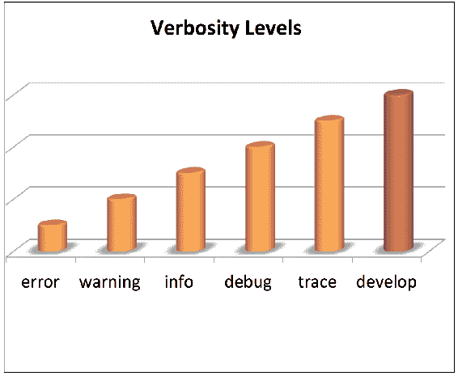
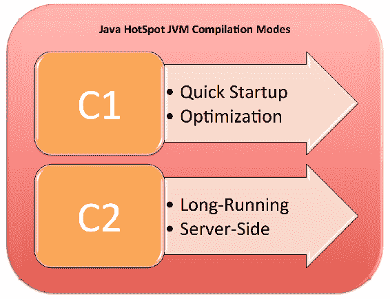
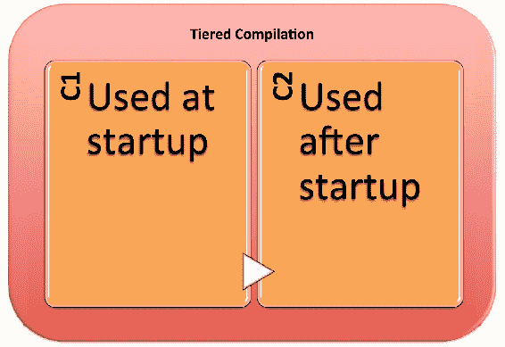
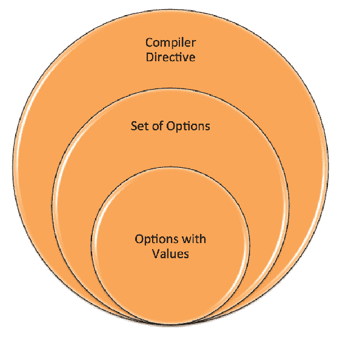
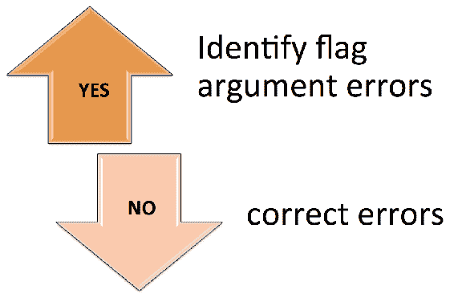
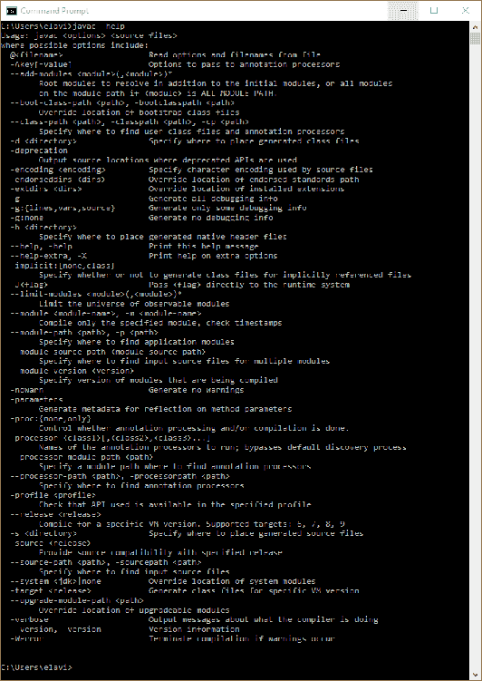

# 命令行标志

在上一章中，我们探讨了 JDK 的几个安全更改。Java 9 的安全增强为开发者提供了编写和维护实现安全的应用程序的能力。具体来说，我们涵盖了数据报传输层安全、密钥库、提高安全应用性能、TLS 应用层协议协商扩展、利用 CPU 指令进行 GHASH 和 RSA、TLS 的 OCSP stapling 以及基于 DRBG 的 `SecureRandom` 实现。

在本章中，我们将探讨 Java 9 平台的一些更改，这些更改具有命令行标志的共同主题。具体来说，我们将涵盖以下概念：

+   统一 JVM 日志

+   编译器控制

+   诊断命令

+   堆分析代理

+   删除你的 JHAT

+   命令行标志参数验证

+   为旧平台版本编译

# 统一 JVM 日志 [JEP 158]

为 JVM 创建一个统一的日志架构是 JEP-158 的中心目标。以下是 JEP 目标的详细列表：

+   为所有日志操作创建一个 JVM 范围的命令行选项集

+   使用分类标签进行日志记录

+   允许消息具有多个标签，也称为标签集

+   提供六个日志级别：

    +   错误

    +   警告

    +   信息

    +   调试

    +   跟踪

    +   开发

+   根据级别选择要记录的消息

+   可选地将日志直接输出到控制台或文件

    +   每次打印一行，且不支持同一行内的交错

+   允许输出多行日志（非交错）

+   格式化所有日志消息，使其易于人类阅读

+   添加如运行时间、级别和标签等装饰

+   与级别类似，根据装饰选择要记录的消息

+   将 Java 9 之前的 `tty>print` 日志转换为使用统一日志作为输出

+   允许使用 `jcmd` 和 `MBeans` 动态配置消息

+   允许启用和禁用单个日志消息

+   添加确定装饰打印顺序的能力

JVM 的统一日志更改可以归纳为以下列出的五个类别：

+   命令行选项

+   装饰

+   级别

+   输出

+   标签

让我们简要地看一下这些类别。

# 命令行选项

新的命令行选项 `-Xlog` 在 Java 9 的日志框架中被添加。这个命令行选项有一系列广泛的参数和可能性。基本语法是简单地 `-Xlog` 后跟一个选项。以下是正式的基本语法：

```java
-Xlog[:option]
```

这里是一个带有 `all` 选项的基本示例：

```java
-Xlog:all
```

这里是用于配置新统一日志的详细命令行语法：

```java
-Xlog[:option]

option          := [<what>][:[<output>][:[<decorators>][:<output-options>]]]
 'help'
 'disable'

what            := <selector>[,...]

selector        := <tag-set>[*][=<level>]

tag-set         := <tag>[+..]
 'all'

tag             := name of tag

level           := trace
 debug
 info
 warning
 error

output          := 'stderr'
 'stdout'
 [file=]<filename>

decorators      := <decorator>[,...]
 'none'

decorator       := time
 uptime
 timemillis
 uptimemillis
 timenanos
 uptimenanos
 pid
 tid
 level
 tags

output-options  := <output_option>[,...]

output-option   := filecount=<file count>
 filesize=<file size in kb>
 parameter=value
```

以下 `-Xlog` 示例后面跟着一个描述：

```java
-Xlog:all
```

在前面的例子中，我们正在告诉 JVM 执行以下操作：

+   记录所有消息

+   使用 `info` 级别

+   将输出提供给 `stdout`

使用此示例，所有 `warning` 消息仍然会输出到 `stderr`。

下一个示例，如这里所示，记录 `debug` 级别的消息：

```java
-Xlog:gc+rt*=debug
```

在前面的例子中，我们正在告诉 JVM 执行以下操作：

+   记录至少带有 `gc` 和 `rt` 标签的消息

+   使用 `debug` 级别

+   将输出提供给 `stdout`

以下示例将输出推送到外部文件：

```java
-Xlog:disable - Xlog:rt=debug:rtdebug.txt
```

在前面的示例中，我们正在告诉 JVM 执行以下操作：

+   禁用除带有 `rt` 标签的消息之外的所有消息

+   使用 `debug` 级别

+   将输出提供给名为 `rtdebug.txt` 的文件

# 装饰

在 Java 9 日志框架的上下文中，装饰是关于日志消息的元数据。以下是可用的装饰的字母顺序列表：

+   **level**: 与记录的消息关联的级别

+   **pid**: PID = 处理器标识符

+   **tags**: 与记录的消息关联的标签集

+   **tid**: TID = 线程标识符

+   **time**: 使用 ISO-8601 格式表示当前日期和时间

+   **timemillis**: 当前时间，以毫秒为单位

+   **timenanos**: 当前时间，以纳秒为单位

+   **uptime**: JVM 启动以来的时间，以秒和毫秒为单位

+   **uptimemillis**: JVM 启动以来的时间，以毫秒为单位

+   **uptimenanos**: JVM 启动以来的时间，以纳秒为单位

装饰可以超越或包含在统一日志输出中。无论使用哪种装饰，它们都会按照以下顺序出现在输出中：

1.  time

1.  uptime

1.  timemillis

1.  uptimemillis

1.  timenanos

1.  uptimenanos

1.  pid

1.  tid

1.  level

1.  tags

# 级别

记录的消息与一个详细级别单独关联。如前所述，级别是 **error**、**warning**、**information**、**debug**、**trace** 和 **develop**。以下图表显示了级别如何根据记录的信息量具有递增的详细程度。**develop** 级别仅用于开发目的，并且在产品应用程序构建中不可用：



# 输出

Java 9 日志框架支持三种类型的输出，以下是用 `-Xlog` 命令行语法直接使用的示例：

在以下示例中，我们将输出提供给 `stderr`：

```java
-Xlog:all=warning:stderr:none
```

以下示例提供了输出到 `stdout` 的示例：

```java
-Xlog:all=warning:stdout:none
```

以下示例将输出写入文本文件：

```java
-Xlog:all=warning:file=logmessages.txt:none
```

# 标签

新的日志框架由 JVM 中标识的一组标签组成。如果需要，可以在源代码中更改这些标签。标签应该是自我标识的，例如 `gc` 表示垃圾回收。

当多个标签组合在一起时，它们形成一个标签集。当我们通过源代码添加自己的标签时，每个标签都应该与一个标签集相关联。这将有助于确保标签保持组织良好且易于人类阅读。

# 编译器控制 [JEP 165]

控制 Java 虚拟机编译器可能看起来是一项不必要的任务，但对于许多开发者来说，这是测试的重要方面。Java 增强提案 165 详细描述了实施 JVM 编译器运行时管理的计划。这是通过方法相关的编译器标志实现的。

在本节中，我们将从查看 JVM 编译模式开始，然后查看可以使用 Java 9 平台控制的编译器。

# 编译模式

Java 9 平台的变化包括对 c1 和 c2 JVM 编译器的细粒度控制。正如您在下面的插图中所见，Java HotSpot JVM 有两种即时编译模式——**c1** 和 **c2**：



**C1** 和 **C2** 编译模式使用不同的编译技术，如果用于相同的代码库，可以产生不同的机器代码集。

# C1 编译模式

Java HotSpot VM 内的 C1 编译模式通常用于具有以下特征的应用程序：

+   快速启动

+   增加优化

+   客户端

# C2 编译模式

第二种编译模式，C2，用于具有以下列出的特征的应用程序：

+   长运行时间

+   服务器端

# 分层编译

分层编译允许我们使用 **c1** 和 **c2** 编译模式。从 Java 8 开始，分层编译是默认过程。如图所示，**c1** 模式在启动时使用，以帮助提供更大的优化。然后，一旦应用足够热身，就采用 **c2** 模式：



# Java 9 中的编译器控制

Java 9 承诺能够对 JVM 编译器进行有限的控制，并在运行时进行更改。这些额外的功能不会降低性能。这允许我们进行更精确的测试和测试优化，因为我们可以在不重新启动整个 JVM 的情况下运行小的编译器测试。

为了控制编译器操作，我们需要创建一个指令文件。这些文件包含编译器指令，由一组带有值的选项组成。指令文件本质上使用 JSON 的一个子集：



**JavaScript 对象表示法**（**JSON**）格式用于数据交换。与 JSON 相比，指令文件有以下格式差异：

+   `int` 和 `doubles` 是唯一支持的数字格式

+   双斜杠（`//`）可用于注释行

+   在数组和对象中可以使用尾随逗号（`,`）

+   不支持转义字符

+   选项名称格式化为字符串，不需要引用

您可以在 [`www.json.org`](http://www.json.org) 上了解更多关于 JSON 的信息。

我们可以在命令行使用以下语法添加我们的指令文件：

```java
-XX:CompilerDirectivesFile=<file>
```

这是一个指令文件的 shell 示例：

```java
    [  // Open square bracket marks the start of the directives file

    { // Open curly brace marks the start of a directive block

      // A directives block that applies specifically to the C1 mode
      c1: {   
             // directives go here
          },

      // A directives block that applies specifically to the C2 mode
      c2: {   
             // directives go here
          },

      // Here we can put a directives that do not apply to
      // a specific compiler mode

    },

    {  // can have multiple directive blocks

       c1: {
             // directives go here
           }   

       c2: {
             // directives go here
           }    
    }

    ] // Close square bracket marks the start of the directives file
```

# 诊断命令 [JEP 228]

Java 增强提案 228，**添加更多诊断命令**，定义了七个额外的诊断命令以增强诊断 JDK 和 JVM 的能力。新的诊断命令在此详细说明。

`print_codegenlist` 命令打印当前排队编译的方法。由于 c1 和 c2 编译模式在不同的队列上，因此需要向特定队列发出此命令。

`dump_codelist` 诊断命令将为编译方法打印以下列出的信息：

+   完整签名

+   地址范围

+   状态

    +   活跃

    +   非进入性

    +   僵尸进程

此外，`dump_codelist`诊断命令允许将输出定向到`stdout`或指定的文件。输出可以是 XML 形式或标准文本。

`print_codeblocks`命令允许我们打印：

+   代码缓存大小

+   代码缓存列表

+   代码缓存中的块列表

+   代码块的地址

Th `datadump_request`诊断命令向**Java 虚拟机工具接口**（**JVMTI**）发送转储请求。这取代了**Java 虚拟机调试接口**（**JVMDI**）和**Java 虚拟机分析接口**（**JVMPI**）接口。

使用`set_vmflag`命令，我们可以在 JVM 或库中设置命令行标志或选项。

Th `print_class_summary`诊断命令打印所有已加载类的列表以及它们的继承结构。

`print_utf8pool`命令打印所有 UTF-8 字符串常量。

# 堆分析代理 [JEP 240]

Java 增强提案 240 的标题为*移除 JVM TI hprof 代理*。以下是与此 JEP 和标题相关的关键术语，这些术语可能对您来说是新的：

+   **工具接口（TI）**：这是一个本地编程接口，允许工具控制运行在 Java 虚拟机内部的应用程序的执行。该接口还允许状态查询。该工具的全称是 Java 虚拟机工具接口，或 JVM TI。

+   **堆分析（HPROF）**：这是一个内部 JDK 工具，用于分析 JVM 对 CPU 和堆的使用。开发者最常接触到的`hprof`是崩溃时生成的文件。生成的文件包含堆转储。

Java 9 JDK 不包含`hprof`代理。它被移除主要是因为有更好的替代方案。以下是与该功能相关的表格：

| **HPROF 功能** | **替代方案** |
| --- | --- |
| 分配分析器(heap=sites) | Java VisualVM |
| CPU 分析器(cpu=samples)(cpu=times) | Java VisualVMJava Flight Recorder |

| 堆转储(heap=dump) | 内部 JVM 功能：

+   `GC.heap_dump(icmd <pid> GC.heap_dump)`

+   `jmap -dump`

|

有趣的是，当 HPROF 最初创建时，它并不是打算在生产环境中使用。事实上，它仅用于测试 JVM 工具接口的代码。因此，随着 Java 9 平台的推出，HPROF 库（`libhprof.so`）将不再包含在 JDK 中。

# 移除你的 JHAT [JEP 241]

**Java 堆分析工具**（**JHAT**）用于解析 Java 堆转储文件。此堆转储文件解析工具的语法如下：

```java
jhat 
     [-stack <bool>] 
     [-refs <bool>] 
     [-port <port>] 
     [-baseline <file>] 
     [-debug <int>] 
     [-version] 
     [-h|-help] 
     <file>
```

这里简要介绍一下与 JHAT 命令相关的选项：

| **选项** | **描述** | **默认** |
| --- | --- | --- |
| `-J<flag>` | 将`<flag>`传递给运行时系统。 | N/A |
| `-stack<bool>` | 切换对对象分配调用堆栈的跟踪。 | `true` |
| `-refs<bool>` | 切换对对象引用的跟踪。 | `true` |
| `-port<port>` | 指示 JHAT HTTP 服务器的端口。 | `7000` |
| `-exclude<exclude-filename>` | 从可达对象查询中排除指定的文件。 | N/A |
| `-baseline<filename>` | 指定用于比较的基本堆转储。 | N/A |
| `-debug<int>` | 设置输出的详细程度。 | N/A |
| `-version` | 简单地输出 JHAT 版本号。 | N/A |
| `-h``-help` | 提供帮助文本。 | N/A |

JHAT 自 JDK-6 以来一直是 Java 平台的一部分，以实验形式存在。它不受支持，并被认为已过时。从 Java 9 开始，这个工具将不再包含在 JDK 中。

# JVM 命令行标志参数验证 [JEP 245]

在本章中，您已经接触到了 Java 9 平台的大部分命令行标志用法。创建了一个名为 *验证 JVM 命令行标志参数* 的 Java 增强提案 245，以确保所有带有参数的 JVM 命令行标志都得到验证。这项工作的主要目标是：

+   避免 JVM 崩溃

+   提供错误消息以通知无效的标志参数

如您从以下图形中所示，没有尝试自动纠正标志参数错误；而是仅识别错误并防止 JVM 崩溃：



这里提供了一个示例错误消息，表明标志参数超出了范围。这个错误会在 JVM 初始化期间执行的标志参数范围检查期间显示：

```java
exampleFlag UnguardOnExecutionViolation = 4 is outside the allowed range [ 0 . . . 3]
```

这里有一些关于这个 Java 平台更改的具体细节：

+   扩展当前的 `globals.hpp` 源文件，以确保完全记录标志默认值和允许的范围

+   定义一个框架以支持将来添加新的 JVM 命令行标志：

    +   这将包括值范围和值集

    +   这将确保有效性检查将应用于所有新添加的命令行标志

+   修改宏表：

    +   添加可选范围的 min/max 值

    +   为以下内容添加约束条目：

        +   确保每次标志更改时都执行约束检查

        +   在 JVM 运行期间，所有可管理的标志将继续进行检查

# 为旧平台版本编译 [JEP 247]

Java 编译器 `javac` 已更新以支持 Java 9，以确保它可以用于编译 Java 程序以在用户选择的较旧版本的 Java 平台上运行。这是 Java 增强提案 247，**为旧平台版本编译**的焦点。

如您在以下屏幕截图中所见，`javac` 有几个选项，包括 `-source` 和 `-target`。以下屏幕截图中的 `javac` 来自 Java 8：


`-source`选项用于指定编译器接受的 Java 版本。`-target`选项告知`javac`将生成哪个版本的类文件。默认情况下，`javac`会生成与最新 Java 版本和平台 API 相对应的类文件。这可能会在编译的应用程序使用仅在最新平台版本中可用的 API 时引起问题。这会使应用程序在较旧的平台版本上无法运行，尽管`-source`和`-target`选项有明确指示。

为了解决上述问题，Java 9 平台引入了一个新的命令行选项。这个选项是`--release`选项，当使用时，会自动配置`javac`以生成链接到特定平台版本的类文件。以下截图显示了 Java 9 平台的`javac`选项。如您所见，新的`--release`选项已被包括在内：



这是新选项的语法：

```java
javac --release <release> <source files>
```

# 摘要

在本章中，我们探讨了 Java 9 平台的一些变化，这些变化具有命令行标志的共性。具体来说，我们涵盖了统一的 JVM 日志记录、编译器控制、新的诊断命令、移除 HPROF 堆分析代理、移除 JHAT、命令行标志参数验证以及为旧平台版本编译的能力。

在下一章中，我们将关注 Java 9 平台提供的附加实用工具的最佳实践。这包括 UTF-8、Unicode 7.0、Linux 等。
