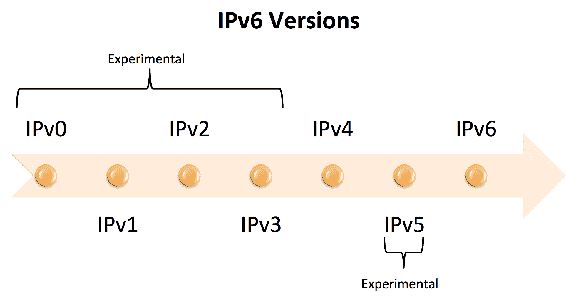

# 第十七章：未来方向

在上一章中，我们关注了 Java 9 平台提供的某些激动人心的实用工具的最佳实践。具体来说，我们涵盖了 UTF-8 属性文件、Unicode 7.0.0、Linux/AArch64 端口、多分辨率图像和常见区域数据仓库。

本章概述了 Java 平台在 Java 9 之后的未来开发。我们将探讨 Java 10 的计划以及我们未来可能看到的进一步变化。每个对 Java 平台的可能变更将被描述为针对的、提交的或草拟的。针对的指的是已标记为 Java 10 的变更。提交的指的是已提交但未针对 Java 平台特定版本的变更。草拟的变更仍在规划中，尚未准备好提交或指定为针对的。

本章具体介绍了按以下类别分组的 Java 平台的未来变更：

+   JDK 变更

+   Java 编译器

+   Java 虚拟机

+   JavaX

+   特殊项目

# JDK 的未来变更

Java 开发工具包是 Java 平台的核心，并且随着每个版本的发布，都在不断地更新，以实现新的功能和效率。展望 Java 9 之后的版本，我们可以看到 JDK 将会有许多可能的改变。其中许多改变将在 Java 10 中实现，而其他一些可能被保留到以后的版本中。

Java 10 及以后的 JDK 变更将在以下提案类别中呈现：

+   面向 Java 10

+   提交的提案

+   草拟提案

# 面向 Java 10 的 JDK 变更

在本书出版时，以下列出的与 **Java 开发工具包**（**JDK**）相关的改变被计划包含在 Java 10 平台中：

+   仓库整合

+   原生头文件工具移除

# 仓库整合

Java 9 平台由以下图中所示的八个不同的仓库组成。在 Java 10 中，我们应该看到所有这些仓库合并为一个单一仓库：


仓库整合应该有助于简化开发。此外，它应该增加维护和更新 Java 平台的便利性。

您可以提前查看这个仓库：[`hg.openjdk.java.net/jdk10/consol-proto/`](http://hg.openjdk.java.net/jdk10/consol-proto/)。

# 原生头文件工具移除

javah 工具用于从 Java 类生成 C 头文件和 C 源文件。C 程序可以引用这些生成的头文件和源文件。

下面我们来了解一下 javah 工具的诞生与消亡：


如前所述，javah 工具是在 Java 7 中引入的，其功能包含在随 JDK8 提供的 javac 中。据报道，与原始工具相比，该功能更优越。在 JDK 9 中，每次使用 javah 工具时，开发者都会收到警告，告知他们该工具将从 JDK 中移除。该工具计划在 JDK 10 中移除。

# JDK 相关的提交提案

以下 Java 增强提案已经提交，但尚未被纳入 Java 10 平台的部分。Oracle 设定了两年发布计划，因此可以合理假设，本节及以后列出的许多（如果不是全部）提案都有可能成为 Java 10 平台的一部分：

+   在 CMS 中并行化完全 GC 阶段

+   JMX 的 REST API

+   支持堆分配

# 在 CMS 中并行化完全 GC 阶段

在第七章，*利用新的默认 G1 垃圾收集器*中，我们回顾了**并发标记清除**（**CMS**）垃圾收集器的变化。CMS 垃圾收集涉及扫描堆内存，标记要删除的对象，然后进行清除以实际删除这些对象。CMS 的垃圾收集方法本质上是一种升级的“标记和清除”方法；您可以参考第七章，*利用新的默认 G1 垃圾收集器*，以获取更多信息。

CMS 垃圾收集的当前缺点是，串行标记和清除使用单个线程实现。这导致了不希望的暂停时间。目前，完全垃圾收集发生在四个阶段：

+   **标记阶段**：标记要收集的对象

+   **转发阶段**：确定活动对象将被迁移的位置

+   **调整指针阶段**：根据活动对象的新位置更新指针

+   **压缩阶段**：将对象移动到指定的位置

CMS 的未来计划是实现标记和清除，以便它们可以并行执行。这种变化不是针对垃圾收集算法。相反，上述列出的每个阶段都将被并行化。这将使 CMS 垃圾收集更加高效，并有望消除或显著减少暂停时间。

# JMX 的 REST API

**表示状态转移**（**REST**），RESTful 编程和 RESTful API 使用客户端/服务器缓存通信协议，通常是 HTTP。REST 是开发网络应用的常见软件架构。

Java 平台未来的一个变化是提供 RESTful 网络接口给 MBeans。

**托管 Bean**（**MBean**）是 Java 中表示要管理的资源的对象。这些资源可能包括特定的硬件设备、应用程序、服务或其他组件。

这些接口将允许 MBeans 使用以下 HTTP 方法：

+   `CONNECT`

+   `DELETE`

+   `GET`

+   `HEAD`

+   `OPTIONS`

+   `POST`

+   `PUT`

+   `TRACE`

MBeans 使用**Java 管理扩展**（**JMX**）进行管理。JMX 架构有三个级别，如下面的图所示：


如您所见，REST 适配器是**分布式服务**级别的一部分。该级别包含连接器和适配器。连接器提供代理级别接口到远程客户端的镜像。另一方面，适配器使用不同的协议转换接口。未来的更改将是将**代理**级别的服务转换为 REST API。

# 支持堆分配

提出的未来更改是允许开发者为 Java 堆指定替代内存设备。具体来说，建议允许开发者为 Java 堆指定非 DRAM 内存。这一变化利用了内存和内存设备的成本下降。

实施可能使用`AllocateHeapAt`标志。

# JDK 相关的草案提案

本节涵盖了几个在本书出版时处于草案阶段的与 JDK 相关的提案。这表明它们可能还没有被完全分析，甚至可能被取消。尽管如此，这些提案中的每一个很可能将从草案阶段提交，然后针对 Java 10 平台进行目标定位。

本节涵盖的草案提案如下：

+   终结化及时性

+   Java 内存模型

+   外部函数接口

+   隔离方法

+   减少元空间浪费

+   改善 IPv6 支持

+   方法句柄的无包装参数列表

+   使用值类型增强的 MandelblotSet 演示

+   高效的数组比较内建函数

# 终结化及时性

Java 语言包括终结化（finalization）来清理垃圾回收无法触及的对象。建议的更改是使此过程更快，并将需要修改以下内容：

+   `ReferenceHandleThread`

+   `FinalizerThread`

+   `java.lang.ref.Reference`

与提高终结化及时性相关的其他更改包括创建一个新的 API。以下图形详细说明了 API 将如何实现 GC 和运行时操作，然后通知需要进行终结化。这肯定会导致处理速度更快：


# Java 内存模型

一直有努力保持**Java 的内存模型**（**JMM**）更新。当前的工作重点包括几个领域，包括：

+   共享内存并发

+   JVM 并发支持

+   JDK 组件

+   工具

与 JMM（Java 内存模型）相关的工程努力的预期结果如下：

+   改进的形式化

+   JVM 覆盖

+   扩展范围

+   C11/C++11 兼容性

+   实施指南

+   测试支持

+   工具支持

# 外部函数接口

**外部函数接口**（**FFI**）是软件 API，允许程序从用不同语言编写的程序中调用方法/函数。在即将发布的 JDK 版本中，我们可能会看到一种 FFI，允许开发者在 Java 方法中直接调用共享库和操作系统内核。据称，提议的 FFI 还将使开发者能够管理本地内存块。

新的 FFI 将类似于 **Java Native Access** (**JNA**) 和 **Java Native Runtime** (**JNR**)。JNA 是一个库，允许在不使用 **Java Native Interface** (**JNI**) 的情况下访问本地共享库。JNR 是一个用于调用本地代码的 Java API。提议的 FFI 将允许并优化本地方法调用以及优化的本地内存管理。

# 独立的方法

`MethodHandles.Lookup` 类是 `java.lang.invoke` 包的一部分。我们使用查找对象来创建方法句柄，并使用查找类来访问它们。以下是查找类的头文件：

```java
    public static final class MethodHandles.Lookup extends Object
```

`MethodHandles.Lookup` 类的未来更改将支持无需附加类即可加载方法字节码。此外，这些方法将使用方法句柄进行引用。该类将有一个新的 `loadCode` 方法。

# 减少元空间浪费

目前，当元空间块被释放时，它们不能用作不同大小的块。因此，如果元空间块 A 被释放且大小为 X，那么该空间不能被重用于大于或小于大小 X 的元空间块。这导致大量不可用的元空间浪费。这也可能导致内存不足错误。

JDK 的未来更改将通过增加元空间块的重用来解决这个问题。该更改将支持以下情况：

+   允许相邻块形成一个更大的块

+   允许较大的块被分割成较小的块

此提议的更改通过确保较小的块可以被重用，以及较大的块不会被浪费（因为它们可以被分割以支持较小块的重用）来解决这个问题。

# 改进 IPv6 支持

**互联网协议版本 6** (**IPv6**) 是当前版本的互联网协议。互联网协议提供了识别和位置模式，使得互联网流量路由成为可能。IPv6 被视为一个用于分组交换网络的互联网层协议。

以下图表显示了互联网协议的历史：



IPv6 是 IPv4 的替代品，并且有几个变化，Java 平台应该支持。从 IPv4 到 IPv6 的关键变化如下分类：

+   Jumbograms

+   更大的地址空间

+   移动性

+   多播

+   网络层安全

+   选项可扩展性

+   隐私

+   简化的路由器处理

+   无状态地址自动配置

随着互联网继续从 IPv4 过渡到 IPv6，以下情况是可能的，并且应该在 Java 10 平台上得到支持：

+   存在多个版本的 IPv4

+   存在一个版本的 IPv6

+   存在多个版本的 IPv6

+   存在多个版本的 IPv4 和一个版本的 IPv6

+   存在多个版本的 IPv4 和 IPv6

# 方法句柄的无包装参数列表

当前处理无包装参数列表的方式可能导致处理效率低下。这在我们使用`Object[]`或`List<object>`作为可变长度参数列表时尤其如此。Java 使用`java.lang.invoke`来转换使用装箱的方法调用。在 Java 中，自动装箱是编译器自动将原始类型及其相应的对象包装类进行转换。以下是包装类及其对应的原始类型的列表：

| **包装类** | **原始类型** |
| --- | --- |
| 布尔 | boolean |
| 字节 | byte |
| 字符 | char |
| 双精度浮点 | double |
| 浮点 | float |
| 整数 | int |
| 长整型 | long |
| 短 | short |

如以下插图所示，当从原始值到相关包装类的对象转换时发生自动装箱，当从包装类的对象到原始值转换时称为拆箱：


不效率是由于参数列表的实际类型与封装它们的数组或列表之间的不匹配。在未来的 Java 版本中，这些不效率将被消除。Java 平台将添加一个新的`ArgumentList`类，该类将多态地将有效的参数列表装箱到堆节点中。

# 使用值类型增强的 MandelblotSet 演示

这个低优先级的 Java 增强提案可能将在 Java 10 中实现，因为其范围有限。计划是开发一个示例 Java 应用程序，展示使用 Valhalla 项目组件、值类型和泛型而不是原始类型在内存和性能方面的改进。

Valhalla 项目组件指的是用户定义的自定义不可变原始类型为值类型。

你可以在本章的 Java 虚拟机部分中了解更多关于值类型的信息。

Mandelbrot 集是混沌理论中使用的分形数学的一个特定例子。随 JDK 8 附带的示例 MandelbrotSet 提供了并行和顺序数据流的比较。在 Java 10 或更高版本中，示例 MandelbrotSet 将被更新以展示使用 Valhalla 项目组件、值类型和泛型与使用原始类型之间的性能和内存效率。

# 高效的数组比较内建函数

Java 平台未来的一个变化是包括一个比较数组的函数。目前，这是开发者必须自己编写的。这个变化将通过添加类似于`java.util.Arrays`中的`compareTo`方法来实现。

虽然具体细节尚不可用，但能够使用原生功能比较数组的前景是令人兴奋的。这是一个将节省许多开发者时间的组件。这可能在 Java 10 平台版本中实现。

# Java 编译器的未来变更

Java 平台有两个值得注意的草案变更，特别是 Java 编译器。这些 Java 增强提案如下所示，并在本节中详细说明：

+   退役 javac `-source` 和 `-target` 选项的政策

+   可插拔静态分析器

# 退役 javac -source 和 -target 选项的政策

已提交一个正式的草案提案，以定义退役 `-source` 和 `-target` 选项的政策。这项工作旨在帮助降低编译器的维护成本。`-source` 和 `-target` 选项是为了简化开发工作而提供的，但并非任何标准所正式要求。从 Java 9 平台开始，这些目标选项不再被识别。

新政策被称为“一加三回”，这意味着当前版本将得到支持，以及之前的三个版本。此政策将延续至 JDK 10。

# 可插拔静态分析器

2013 年夏天启动了一个持续的研究 Java 增强提案（Java Enhancement Proposal），作为探索性措施，并为未来的完整 Java 增强提案提供支持，以使开发者能够定义在编译时可以执行任意静态分析的扩展。这项研究旨在了解如何为 Java 编译器实现一个可插拔的静态类型分析器框架。

研究的目标如下：

+   收集静态分析器需求

+   分析静态分析器

+   确定支持静态分析器的框架需求

+   实施和测试

持续研究的最终结果将是提交一个功能 Java 增强提案，或者建议停止追求该功能。

# Java 虚拟机的未来更改

已提交和草拟了几个针对 Java 虚拟机（JVM）和核心库的新功能和增强。很可能至少这些功能和增强将在 Java 10 平台上实现，其他则将保留在后续版本中。

# JVM 相关提交的提案

已提交了三个 Java 增强提案。虽然目前没有指定为 Java 10，但在 Java 10 发布时我们可能会看到这些变化。以下列出了这三个提案：

+   容器感知 Java

+   在 GPU 上启用 Java 方法的执行

+   Epsilon GC：任意低开销的垃圾（非）收集器

# 容器感知 Java

正在努力使 JVM 和核心库在运行在容器内时能够感知。此外，为了能够适应使用可用系统资源。这个特性与云计算的普遍性特别相关。

提出的功能有两个主要组成部分：

+   检测：

    +   确定 Java 是否在容器内运行

+   容器资源暴露：

    +   暴露容器资源限制

    +   暴露容器资源配置

已初步确定了几个配置状态点：

| **通用** | **CPU 相关** | **内存相关** |
| --- | --- | --- |
| `isContainerized` | CPU 周期 | 块 I/O 设备权重 |
|  | CPU 配额 | 块 I/O 权重 |
|  | CPU 集内存节点 | 当前内存使用 |
|  | CPU 集 | 设备 I/O 读取速率 |
|  | CPU 使用率 | 设备 I/O 写入速率 |
|  | 每个 CPU 的 CPU 使用率 | 最大内存使用量 |
|  | CPU 数量 | 最大内核内存 |
|  |  | 内存偏好 |
|  |  | OOM 杀戮启用 |
|  |  | OOM 分数调整 |
|  |  | 共享内存大小 |
|  |  | 软件内存限制 |
|  |  | 总内存限制 |

初始时，这个特性计划支持 Linux-64 上的 Docker。一个可能的场景是，这个特性将与 Java 10 一起发布，仅支持 Linux-64 上的 Docker。然后，在 Java 平台后续版本中，将扩展对特性的支持。

# 在 GPU 上启用 Java 方法的执行

使 Java 应用程序能够无缝地利用 GPU 是 Sumatra 项目的研究主题。目标是使用 Java 的 Stream API 并行和 lambda 编程模型。利用 GPU 的处理能力和效率对我们来说是非常有意义的。

总体目标是使这个特性对开发者来说易于使用。这个特性将以以下特性实现：

+   不要更改 Java 并行流 API 的语法

+   硬件和软件堆栈应自动检测

+   自动检测和分析，以确定从性能标准来看使用 GPU 是否合理

+   当将处理卸载到 GPU 失败时提供 CPU 执行

+   将不会出现性能下降

+   这个特性不会引入新的安全风险

+   CPU 和 GPU 之间将存在内存持久性

这个 Java 增强提案的主要好处将是提高我们的 Java 应用程序的性能。

# Epsilon GC - 随意低开销的垃圾（非）收集器

在第七章“利用新的默认 G1 垃圾回收器”中，我们详细介绍了 Java 垃圾回收器在 Java 9 平台发布时的增强功能。为了持续改进，已经提交了一个 Java 增强提案，以开发一个专门处理内存分配的垃圾回收器。当 Java 堆上没有更多可用内存时，这个垃圾回收器将向 JVM 发送关闭信号。

这个垃圾回收器的目标是被动且使用非常有限的额外开销。引入这种垃圾回收的目的是不降低性能。

这个更改不会影响当前的垃圾回收器。

# JVM 相关提案

以下 Java 增强提案已为 Java 平台的未来版本制定，并在本节中详细说明：

+   在 JVM 编译方法上提供稳定的 USDT 探针点

+   并发监视器膨胀

+   以低开销的方式采样 Java 堆分配

+   诊断命令框架

+   增强类重定义

+   在适当的情况下默认启用 NUMA 模式

+   值对象

+   对齐 JVM 访问检查

# 在 JVM 编译方法上提供稳定的 USDT 探针点

**用户级统计定义跟踪**（**USDT**）用于插入探针点以标记方法的进入和退出。编译器然后允许与跟踪工具进行握手，以便这些工具可以发现探针点并对其进行操作。

常见的跟踪工具有 Dtrace 和**伯克利数据包过滤器**（**BPF**）。

即使是 JVM 9，Java 虚拟机也不支持此技术集。当前缺乏支持源于 JVM 生成编译代码的方式；它以动态方式生成，没有任何静态**可执行链接文件**（**ELFs**）。跟踪工具需要 ELFs 才能工作。另一个缓解因素是 JVM 动态地修补其生成的代码，这些代码不支持外部修补。

在未来的 Java 版本中，可能是 Java 10，**JVMTI**（**JVM 工具接口**）将被修改以支持探针工具在 JVM 的动态编译代码上执行其标准操作。暂时确定的 JVMTI API 更改包括：

+   添加补丁点或方法进入和退出

+   编译方法的枚举

+   编译方法加载时的状态变化通知

+   查询支持

+   切换跟踪点的开关

+   使编译方法的块可检查

好消息是，不需要对 Java 代码的编译方式进行任何更改。它已经可以打补丁，因此所需的功能将通过修改 USDT API 以及 JVM 的一些更改来创建。

# 并发监视器膨胀

在我们的上下文中，监视器是一种同步机制，用于控制对对象的并发访问。监视器有助于防止多个线程同时访问被监视的对象。JVM 自动在三种监视器实现方法之间切换。三种实现方法如下所示：


Java 对象的初始锁定使用偏向锁定。该方法确保只有锁定线程可以锁定对象。采用这种方法，JVM 在 Java 对象中安装一个线程指针。当第二个线程尝试锁定 Java 对象时，JVM 切换到基本的锁定监视器实现方法。第二种方法使用**比较和交换**（**CAS**）操作。当 CAS 操作失败时，例如当第二个线程尝试锁定 Java 对象时，JVM 切换到第三种监视器实现方法。该方法是一个完整的监视器。该方法需要本地堆存储，被称为监视器膨胀。

并发监视器膨胀 Java 增强提案的目的是在线程运行时执行监视器膨胀。这将减少 JVM 引起的暂停时间。

# 提供一种低开销的方式来采样 Java 堆分配

管理不当的 Java 堆可能导致堆耗尽，以及由于内存碎片化（GC 抖动）导致的内存不足。在 Java 的未来版本中，很可能是 Java 10，我们将有一种方法来采样 Java 堆分配。这将通过增强**Java 虚拟机工具接口**（**JVMTI**）来实现。结果功能将提供一个极低开销的解决方案。

# 诊断命令框架

Java 增强提案 137，诊断命令框架，提议创建一个框架，用于向 Java 虚拟机发送诊断命令。

该框架将包括一个**Java 管理扩展**（JMX）接口，它将允许通过 JMX 连接远程发出诊断命令。

JRocket 任务控制工具已经成功实现了这一功能。这证明了概念的正确性，因此这一增强功能很可能将成为 Java 10 平台的一部分。

# 增强类重新定义

Java 增强提案 159，增强类重新定义，呼吁在运行时进行类重新定义时增强 JVM 的能力。具体来说，该提案包括以下类重新定义操作：

+   添加超类型

+   添加方法

+   添加静态字段

+   添加实例字段

+   移除方法

+   移除静态字段

+   移除实例字段

当前 JVM 类重新定义功能仅限于方法交换。这被视为非常限制性。在新的提议增强功能中，开发者无需在更改后重新启动他们的应用程序。这对于处理大型和分布式系统特别有益。

# 在适当的情况下默认启用 NUMA 模式

Java 增强提案 163，在适当的情况下默认启用 NUMA 模式。此提案仅适用于 NUMA 硬件。目的是当 JVM 检测到 NUMA 硬件时，启用以下标志：

```java
    XX:+UseNUMA
```

此标志目前可以通过手动调用。在提议的增强功能中，当 JVM 检测到它正在 NUMA 硬件上运行时，将自动调用此标志。

**非一致性内存访问**（**NUMA**）是计算机多处理中使用的内存模型。在这个内存模型中，访问时间取决于内存位置相对于处理器的位置。

这将是一个易于实现的增强功能，并可能成为 Java 10 平台发布的一部分。

# 值对象

Java 增强提案 169，值对象，旨在提供必要的 JVM 基础设施，以允许处理不可变对象以及无引用对象。这个新基础设施将允许使用非原始数据类型进行高效的按值计算。

此提案的目标包括以下内容：

+   更好地与`java.lang.Integer`和`int`语义对齐。

+   使 Java 数据结构更具可移植性

+   支持与 Java 原始数据类型性能相似的高级数据类型：

    +   用户定义的

    +   库定义的

+   通过启用纯数据函数式计算来优化并行计算

+   改进支持：

    +   复数

    +   向量值

    +   元组

+   提高安全性和安全性

+   减少“防御性复制”

提出的实现策略之一是添加一个`lockPermanently`操作。它将传递一个对象，然后将其标记为不可变且不可别名化。永久锁定对象的观念规定：

+   字段无法更改

+   数组的元素无法更改

+   无法进行同步

+   “等待”方法不能被调用

+   “通知”方法不能被调用

+   不允许查询身份哈希码

+   无法执行指针相等性检查

这可能是 Java 10 平台最受欢迎的添加之一。

# 对齐 JVM 访问检查

Java 增强提案 181，将嵌套类的 JVM 检查与 Java 语言规则对齐，重点关注将 JVM 访问检查规则与 Java 语言规则对齐的需要，特别是对于嵌套类中的构造函数、字段和方法。这将通过在嵌套中分区相关类来实现。类文件将能够访问同一嵌套中其他类文件的私有名称。

嵌套将共享一个访问控制上下文。随着嵌套的出现，将不再需要访问桥。大部分的更改将针对 JVM 的访问规则。

# JavaX 未来的更改

`Javax.*`包是两个特定于 Java 增强提案的主题，这些提案已提交给未来的 Java 平台发布。以下为这些提案：

+   用于注册管理资源的 JMX 特定注解

+   现代化 GTK3 的外观和感觉实现

# JMX 特定注解用于注册管理资源

标题为“JMX 特定注解用于注册管理资源”的 Java 增强提案草案将为注册和配置**MBeans**（**管理 Bean**）提供一组注解。

MBean 是一个表示可管理资源的 Java 对象（应用程序、服务、组件或设备）。

本提案的目标是减轻开发者在注册和配置 MBeans 时的负担。此外，通过确保所有 MBean 声明组件都位于同一位置，将提高源代码的可读性。

JMX 特定注解将位于`javax.management.annotations`包中。

本 Java 增强提案已特别规划用于 Java 11。尽管如此，它有可能被重新设计用于 Java 10。

# 现代化 GTK3 外观和感觉实现

GTK3 是一个用于创建图形用户界面的小部件工具包，正式名称为 GIMP 工具包。名为“现代化 GTK3 外观和感觉实现”的 Java 增强提案草案呼吁重写当前的 GTK2 外观和感觉，以便使用 GTK3。

GTK3 实现将不会取代 GTK2。需要注意的是，运行时只能使用其中一个，而不能同时使用这两个。

您可以在 [`developer.gnome.org/gtk3/stable/`](https://developer.gnome.org/gtk3/stable/) 访问 GTK3 参考手册。

# 进行中的特别项目

Java 增强提案（JEP）提出了对 Java 平台的设计和实现更改。一个 JEP 被起草的标准是工作必须至少满足以下条件之一：

+   至少需要两周的工程工作

+   这标志着 JDK 的重要变化

+   代表开发人员或客户的高需求问题

项目，另一方面，代表由以下某个小组资助的协作努力：

+   2D 图形

+   采用

+   AWT

+   构建

+   兼容性和规范审查

+   编译器

+   符合性

+   核心库

+   管理委员会

+   HotSpot

+   国际化

+   JMX

+   成员

+   网络

+   NetBeans 项目

+   移植者

+   质量

+   安全性

+   可服务性

+   音频

+   Swing

+   网络

小组是正式的，新的小组可以被提议。

以下列出的活跃项目代表了 Java 平台可能的未来增强领域。本节后面将提供每个项目的简要信息，并提供了对未来变化的一般领域洞察：

+   注解管道 2.0

+   音频合成引擎

+   卡西奥卡瓦洛

+   常见 VM 接口

+   编译器语法

+   达芬奇机器

+   设备 I/O

+   Graal

+   HarfBuzz 集成

+   科纳

+   OpenJFX

+   巴拿马

+   沙南多亚

# 注解管道 2.0

该项目探讨了如何改进 Java 编译器管道中注解的处理方式。没有意图提出更改规范；相反，重点是性能提升。

# 音频合成引擎

该项目正在研究为 JDK 创建一个新的 midi 合成器。当前的 midi 合成器属于一个授权库。工作组希望新的 midi 合成器作为一个开源 JDK 资产。

# 卡西奥卡瓦洛

卡西奥卡瓦洛项目旨在改进 OpenJDK 的 **抽象窗口工具包**（**AWT**）内部接口。这扩展到 2D 子系统。拟议的改进旨在简化 AWT 迁移到新平台的方式。

# 常见 VM 接口

常见 VM 接口项目旨在记录 OpenJDK 的 VM 接口。这应该会使 Classpath VM 和其他 VM 使用 OpenJDK 更容易。

# 编译器语法

编译器语法项目正在开发一个基于 ANTLR 语法的实验性 Java 编译器。**ANTLR**（**Another Tool for Language Recognition**）是一个解析器，它读取、处理和执行结构化文本或二进制文件。项目团队希望这个 Java 编译器能够取代当前的编译器，因为它使用的是手写的解析器，**LALR**（**Look-Ahead Left to Right**）。项目组已将 LALR 解析器识别为脆弱且难以扩展。

# 达芬奇机器

达芬奇机器项目代表了将 JVM 扩展到支持非 Java 语言的努力。当前的工作重点在于允许新的语言与 Java 一起存在于 JVM 中。性能和效率是该努力的关键特性。

# 设备 I/O

该项目旨在通过 Java 级别的 API 提供对通用外围设备的访问。项目团队希望支持的初始外围设备列表包括：

+   **GPIO**（**通用输入/输出**）

+   **I2C**（**集成电路总线**）

+   **SPI**（**串行外围接口**）

+   **UART**（**通用异步收发传输器**）

# Graal

Graal 项目的目标是通过 Java API 暴露 VM 功能。这种暴露将允许开发者在 Java 中为特定的语言运行时编写动态编译器。这项工作包括开发一个多语言解释器框架。

# HarfBuzz 集成

HarfBuzz 集成项目希望将 HarfBuzz 布局引擎集成到 Java 开发工具包中。这是为了用 HarfBuzz 布局引擎替换 ICU 布局引擎。ICU 布局引擎已被弃用，这巩固了该项目未来成功的重要性。

# Kona

Kona 项目正在努力定义和实现 Java API 以支持**物联网**（**IoT**）领域。这包括网络技术和协议。尽管没有明确说明，但安全和安全性将是该努力实施成功的关键。

# OpenJFX

关于 OpenJFX 项目的细节不多。该项目声明的目标是创建下一代 Java 客户端工具包。根据项目标题，可以假设该小组希望创建一个 OpenJFX 版本的 JavaFX，JavaFX 是一组用于创建富互联网应用的包。

# Panama

Panama 项目专注于增强 JVM 和非 Java API 之间的连接。该项目包括以下选定的组件：

+   原生函数调用

+   从 JVM 原生数据访问

+   JVM 堆内的原生数据访问

+   JVM 堆中的新数据布局

+   头文件 API 提取工具

项目团队已生成一个与 JDK 9 结构相匹配的仓库树。这显著增加了项目成功的可能性。

# Shenandoah

Project Shenandoah 的目标是通过垃圾收集操作显著减少暂停时间。方法是让更多的垃圾收集操作与 Java 应用程序并发运行。在第七章《利用新的默认 G1 垃圾收集器》中，你了解了 CMS 和 G1。Shenandoah 项目打算将并发压缩添加到可能的垃圾收集方法中。

# 摘要

在本章中，我们概述了 Java 平台未来的发展，超出了 Java 9 的范围。我们探讨了 Java 10 的计划以及我们可能看到的 Java 10 以上的进一步变化。每个可能的 Java 平台变化都被描述为有针对性的、已提交的或草案。具体来说，我们涵盖了以下类别中 Java 平台未来的变化：JDK 更改、Java 编译器、Java 虚拟机、JavaX 和特殊项目。
