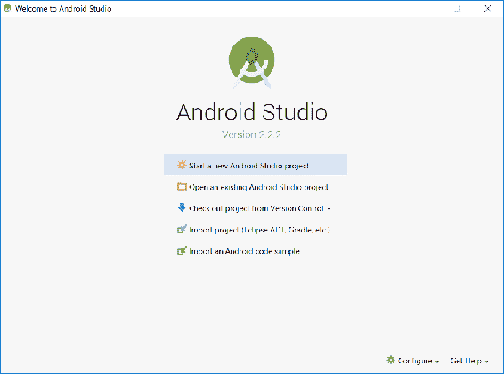
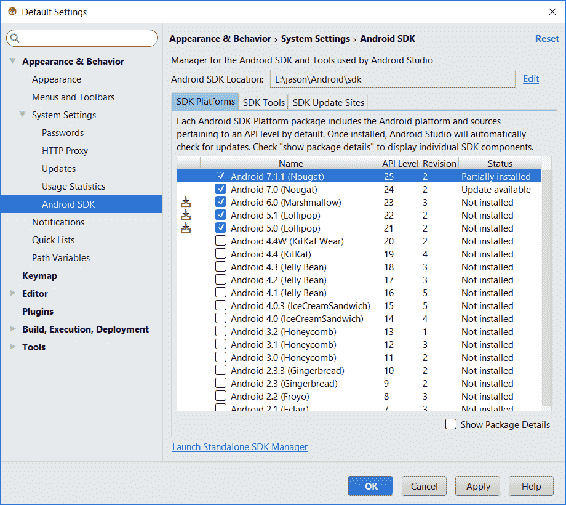
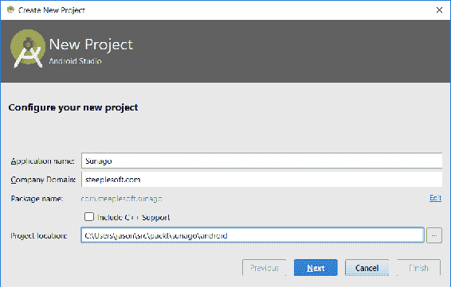
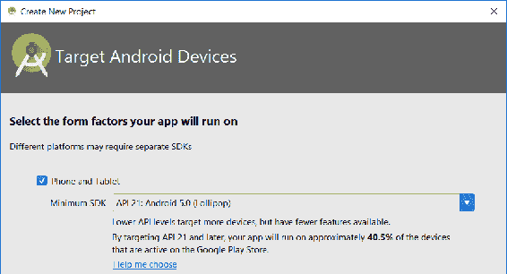
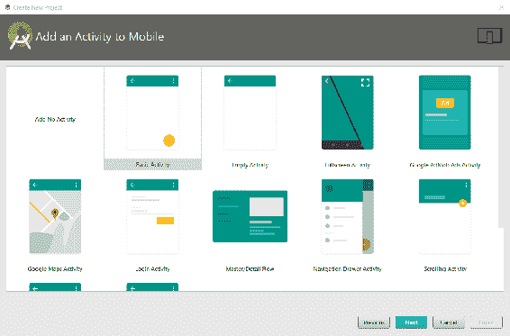
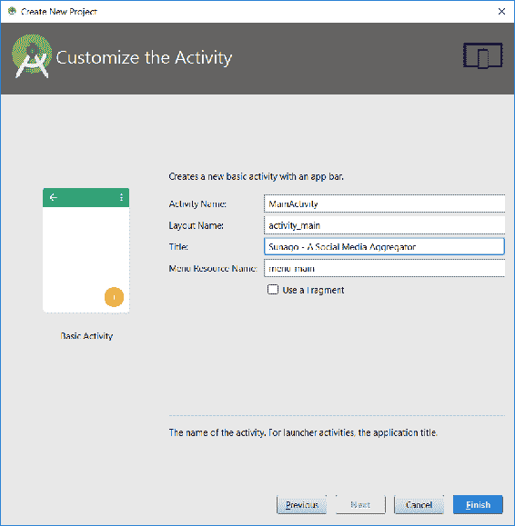
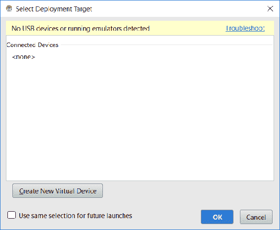
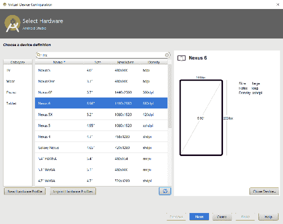
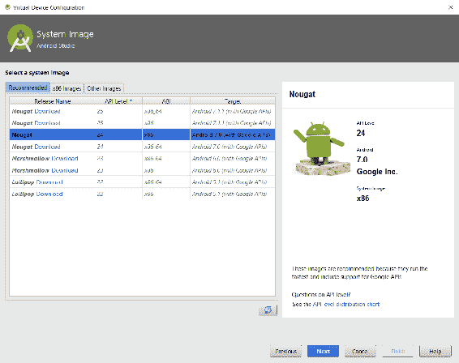
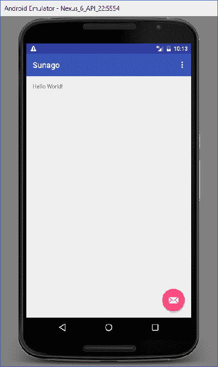

# 第二十四章：Sunago - Android 版本

在上一章中，我们构建了 Sunago，一个社交媒体聚合应用程序。在那一章中，我们了解到 Sunago 是一个基于 JavaFX 的应用程序，可以从各种社交媒体网络中抓取帖子、推文、照片等，并在一个地方显示它们。该应用程序确实提供了一些有趣的架构和技术示例，但应用程序本身可能更加实用——我们倾向于从手机和平板电脑等移动设备与社交网络互动，因此一个移动版本会更有用。因此，在这一章中，我们将编写一个 Android 版本，尽可能重用代码。

尽管 Android 应用程序是用 Java 编写的，但它们看起来与桌面应用程序大不相同。虽然我们无法涵盖 Android 开发的各个方面，但我们将在本章中涵盖足够的内容，以帮助您入门，包括以下内容：

+   设置 Android 开发环境

+   Gradle 构建

+   Android 视图

+   Android 状态管理

+   Android 服务

+   应用程序打包和部署

与其他章节一样，会有太多的小项目无法一一列举，但我们将尽力在介绍时突出新的内容。

# 入门

第一步是设置 Android 开发环境。与*常规*Java 开发一样，IDE 不是必需的，但它确实很有帮助，所以我们将安装 Android Studio，它是一个基于 IntelliJ IDEA 的 IDE。如果您已经安装了 IDEA，您只需安装 Android 插件，就可以拥有所需的一切。但在这里，我们将假设您还没有安装。

1.  要下载 Android Studio，请访问[`developer.android.com/studio/index.html`](https://developer.android.com/studio/index.html)，并下载适合您操作系统的包。当您第一次启动 Android Studio 时，您应该看到以下屏幕：



1.  在我们开始新项目之前，让我们配置可用的 Android SDK。点击右下角的“配置”菜单，然后点击“SDK 管理器”以获取以下屏幕：



您选择的 SDK 将根据您的需求而有所不同。您可能需要支持追溯到 Android 5.0 的旧设备，或者您可能只想支持最新的 Android 7.0 或 7.1.1。

1.  一旦您知道需要什么，请选择适当的 SDK（或者像我之前截图中所做的那样，从 5.0 开始选择所有内容），然后点击“确定”。在继续之前，您需要阅读并接受许可协议。

1.  完成这些操作后，Android Studio 将开始下载所选的 SDK 及其依赖项。这个过程可能需要一些时间，所以请耐心等待。

1.  当 SDK 安装完成时，点击“完成”按钮，这将带您进入欢迎屏幕。点击“开始新的 Android Studio 项目”以获取以下屏幕：



1.  这里没有什么令人兴奋的——我们需要指定我们应用的名称、公司域名和项目位置：



1.  接下来，我们需要指定我们应用的表单因子。我们的选项有手机、平板、可穿戴设备、电视、Android Auto 和 Glass。如前一个截图所示，我们对于这个应用所感兴趣的是手机和平板。

1.  在下一个窗口中，我们需要为主`Activity`选择一个类型。在 Android 应用中，我们可能称之为*屏幕*（或者如果你来自 Web 应用背景，可能是*页面*）的是`Activity`。但并非每个`Activity`都是屏幕。

从 Android 开发者文档([`developer.android.com/reference/android/app/Activity.html`](https://developer.android.com/reference/android/app/Activity.html))中，我们了解到以下内容：

[a] 活动是用户可以执行的单个、专注的事情。几乎所有活动都与用户交互，因此 Activity 类会为你创建一个窗口...

对于我们的目的来说，可能可以将这两个概念等同起来，但这样做要宽松一些，并且始终要记住这个注意事项。巫师为我们提供了许多选项，如本截图所示：



1.  如你所见，有几个选项：基本、空、全屏、Google AdMobs 广告、Google 地图、登录等等。选择哪个取决于你的应用需求。从用户界面的角度来看，我们最基本的需求是告诉用户应用名称，显示社交媒体项目列表，并提供更改应用设置的菜单。因此，从上述列表中，基本活动是最接近的匹配项，所以我们选择它，并点击下一步：



1.  前一个屏幕中的默认设置大多是可以接受的（注意 Activity 名称已更改），但在我们点击完成之前，还有一些最后的话要说。在构建任何大小的 Android 应用时，你将会有很多布局、菜单、活动等等。我发现按照这里所示命名这些工件是有帮助的——`Activity`的布局命名为`activity_`加上`Activity`名称；菜单是`menu_`加上活动名称，或者对于共享菜单，是一个对其内容的合理总结。每种工件类型都以前缀表示其类型。这种通用模式将帮助你在文件数量增加时快速导航到源文件，因为这些文件的排列非常平坦和浅层。

1.  最后，请注意“使用片段”复选框。*片段是应用程序用户界面或行为的一部分，可以放置在 Activity 中*。实际上，它是开发者将用户界面定义分解成多个部分（或片段，因此得名）的一种方式，这些部分可以根据应用程序的当前上下文以不同的方式组合成一个整体。例如，基于片段的用户界面可能为手机上的某些操作提供两个屏幕，但在平板电脑的大屏幕上可能将它们合并为一个 Activity。当然，这比那要复杂得多，但我只是简要地、不完整地描述一下，以便对复选框进行解释。在我们的应用程序中，我们不会使用片段，所以我们保留该选项未勾选，并点击“完成”。

经过一段时间处理之后，Android Studio 现在为我们创建了一个基本的应用程序。在我们开始编写应用程序代码之前，让我们运行它看看这个过程是什么样的。我们可以以几种方式运行应用程序——我们可以点击“运行”|“运行 'app'”；点击工具栏中间的绿色播放按钮，或者按 *Shift* + *F10*。所有三种方式都会弹出相同的“选择部署目标”窗口，如下所示：



由于我们刚刚安装了 Android Studio，我们没有创建任何模拟器，所以我们需要现在创建。要创建模拟器，请按照以下步骤操作：

1.  点击“创建新虚拟设备”按钮，我们会看到这个屏幕：



1.  让我们从一台相对现代的 Android 手机开始——选择 Nexus 6 配置文件，然后点击“下一步”：



在前面的屏幕上，你的选项将取决于你已安装的哪些 SDK。你选择哪个 SDK，再次，取决于你的目标受众、应用需求等等。尽管使用最新和最好的总是令人愉快，但我们并不严格需要来自，比如说，牛轧糖（Nougat）的任何 API。选择 Android 7.x 将限制 Sunago 的可用性，仅限于非常新的手机，而且这样做没有充分的理由。因此，我们将以 Lollipop（Android 5.0）为目标，它在支持尽可能多的用户和提供访问最新 Android 功能之间取得了良好的平衡。

1.  如果需要，点击下载链接以获取 x86_64 ABI，选择该版本，点击“下一步”，然后在“验证配置”屏幕上点击“完成”。

1.  创建模拟器后，我们可以在“选择部署目标”屏幕中选择它，并通过点击“确定”来运行应用程序。如果你想在下次运行应用程序时跳过选择屏幕，可以在点击“确定”之前勾选“为未来的启动使用相同的选项”复选框。

第一次运行应用程序时，可能会花费更长的时间，因为应用程序需要构建、打包，并且模拟器需要启动。几分钟后，你应该会看到以下屏幕：



这并没有什么特别之处，但它表明一切都在按预期工作。现在，我们已经准备好开始真正的移植 Sunago 的工作。

# 构建用户界面

简单来说，Android 用户界面基于 `Activity`，它们使用布局文件来描述用户界面的结构。当然，还有更多内容，但这个简单的定义应该足以满足我们在 Sunago 上的工作。那么，让我们首先看看我们的 `Activity`，`MainActivity`，如下所示：

```java
    public class MainActivity extends AppCompatActivity { 
      @Override 
      protected void onCreate(Bundle savedInstanceState) { 
        super.onCreate(savedInstanceState); 
        setContentView(R.layout.activity_main); 
        Toolbar toolbar = (Toolbar) findViewById(R.id.toolbar); 
        setSupportActionBar(toolbar); 

        FloatingActionButton fab =
            (FloatingActionButton) findViewById(R.id.fab); 
        fab.setOnClickListener(new View.OnClickListener() { 
            @Override 
            public void onClick(View view) { 
                Snackbar.make(view,
                        "Replace with your own action",
                        Snackbar.LENGTH_LONG) 
                    .setAction("Action", null).show(); 
            } 
        }); 
      } 

     @Override 
     public boolean onCreateOptionsMenu(Menu menu) { 
        getMenuInflater().inflate(R.menu.menu_main, menu); 
        return true; 
     } 

     @Override 
     public boolean onOptionsItemSelected(MenuItem item) { 
        int id = item.getItemId(); 

        if (id == R.id.action_settings) { 
            return true; 
        } 

        return super.onOptionsItemSelected(item); 
      } 
    } 
```

这段最后的代码是 Android Studio 生成的类的确切代码。它非常基础，但它包含了创建 `Activity` 所需的大部分内容。请注意，这个类扩展了 `AppCompatActivity`。虽然 Google 一直在积极推动 Android 平台，但他们也一直在不懈努力，确保旧设备不会比必要的时间更早被遗弃。为了实现这一点，Google 已经在 "compat"（或兼容性）包中回滚了许多新特性，这意味着许多新的 API 实际上可以在旧版本的 Android 上运行。然而，由于它们在单独的包中，这些更改不会破坏任何现有功能——它们必须被明确选择，这正是我们在做的事情。虽然我们并不打算支持旧版本的 Android，如 KitKat，但仍然建议你的 `Activity` 类扩展兼容性类，就像这个例子一样，因为这些类中内置了许多我们否则必须自己实现的功能。让我们按以下步骤逐步分析这个类，以了解其中发生了什么：

1.  第一种方法是 `onCreate()`，这是一个 `Activity` 生命周期方法（我们稍后会详细讨论 `Activity` 生命周期）。当系统创建 `Activity` 类时，这个方法会被调用。正是在这里，我们初始化用户界面，设置值，连接到数据源等等。请注意，这个方法接受一个 **Bundle**。这就是 Android 传递 Activity 状态以便恢复的方式。

在 `setContentView(R.layout.activity_main)` 方法中，我们告诉系统我们想要为这个 `Activity` 使用哪个布局。一旦我们为 `Activity` 设置了内容 `View`，我们就可以开始获取各种元素的引用。注意，我们首先在视图中寻找定义的 `Toolbar`，使用 `findViewById(R.id.toolbar)`，然后通过 `setSupportActionBar()` 告诉 Android 使用它作为我们的操作栏。这是一个通过 `compat` 类为我们实现的功能的例子。如果我们直接扩展了 `Activity`，那么我们需要做更多的工作来使操作栏工作。实际上，我们只需调用一个设置器，就完成了。

1.  接下来，我们查找另一个用户界面元素，即`FloatingActionButton`。在上面的截图中，这个按钮位于右下角，带有电子邮件图标。我们实际上会移除这个按钮，但由于 Android Studio 已经生成了它，我们可以在移除之前从中学习到一些东西。一旦我们有了它的引用，我们就可以附加监听器。在这种情况下，我们通过创建一个类型为`View.OnClickListener`的匿名内部类来添加一个`onClick`监听器。这可以工作，但我们刚刚花了五章的时间来消除这些。

1.  Android 构建系统现在原生支持使用 Java 8，因此我们可以修改`onClick`监听器注册，使其看起来像这样：

```java
    fab.setOnClickListener(view -> Snackbar.make(view,
        "Replace with your own action",
            Snackbar.LENGTH_LONG) 
        .setAction("Action", null).show()); 
```

当用户点击按钮时，会出现 Snackbar。根据谷歌文档，*Snackbar 通过屏幕底部的消息提供关于操作的简短反馈*。这正是我们得到的--一条消息告诉我们用我们自己的操作替换`onClick`结果。然而，如前所述，我们不需要浮动按钮，所以我们将移除此方法，稍后从布局中移除视图定义。

1.  类中的下一个方法是`onCreateOptionsMenu()`。当选项菜单首次打开以填充项目列表时调用此方法。我们使用`MenuInflater`来填充菜单定义文件，并将其中定义的内容添加到系统传入的`Menu`中。然而，此方法只调用一次，因此如果您需要一个会变化的菜单，您应该重写`onPrepareOptionsMenu(Menu)`。

1.  最后一种方法是`onOptionsItemSelected()`，当用户点击选项菜单项时会被调用。所选择的特定`MenuItem`会被传入。我们获取其 ID，并调用适用于菜单项的方法。

那是一个基本的`Activity`，但布局看起来是什么样子呢？以下是`activity_main.xml`的内容：

```java
    <?xml version="1.0" encoding="utf-8"?> 
     <android.support.design.widget.CoordinatorLayout  

      android:layout_width="match_parent" 
      android:layout_height="match_parent" 
      android:fitsSystemWindows="true" 
      tools:context="com.steeplesoft.sunago.MainActivity"> 

      <android.support.design.widget.AppBarLayout 
        android:layout_width="match_parent" 
        android:layout_height="wrap_content" 
        android:theme="@style/AppTheme.AppBarOverlay"> 

       <android.support.v7.widget.Toolbar 
            android:id="@+id/toolbar" 
            android:layout_width="match_parent" 
            android:layout_height="?attr/actionBarSize" 
            android:background="?attr/colorPrimary" 
            app:popupTheme="@style/AppTheme.PopupOverlay" /> 

      </android.support.design.widget.AppBarLayout> 

      <include layout="@layout/content_main" /> 

     <android.support.design.widget.FloatingActionButton 
        android:id="@+id/fab" 
        android:layout_width="wrap_content" 
        android:layout_height="wrap_content" 
        android:layout_gravity="bottom|end" 
        android:layout_margin="@dimen/fab_margin" 
        app:srcCompat="@android:drawable/ic_dialog_email" /> 

     </android.support.design.widget.CoordinatorLayout> 
```

这里有相当多的 XML，所以让我们快速浏览一下感兴趣的主要项目，如下所示：

1.  根元素是`CoordinatorLayout`。它的 Java 文档将其描述为一个超级强大的`FrameLayout`。其预期用途之一是作为*顶级应用程序装饰或 chrome 布局*，这正是我们在这里使用的。类似于`CoordinatorLayout`的布局大致相当于 JavaFX 的容器。不同的布局（或`ViewGroup`）提供了各种功能，例如使用精确的 X/Y 坐标布局元素（`AbsoluteLayout`）、在网格中布局（`GridLayout`）、相对于彼此布局（`RelativeLayout`）等等。

1.  除了提供我们的顶级容器外，该元素还定义了多个必需的 XML 命名空间。它还设置了控件的高度和宽度。此字段有三个可能的值--`match_parent`（在 SDK 的早期版本中，这被称为`fill_parent`，如果您遇到这种情况），这意味着控件应与其父控件匹配，`wrap_content`，这意味着控件应刚好足够容纳其内容；或者一个确切的数字。

1.  下一个元素是`AppBarLayout`，这是一个实现了许多材料设计应用栏概念的`ViewGroup`。**材料设计**是 Google 正在开发和支持的最新**视觉语言**。它为 Android 应用提供了现代、一致的外观和感觉。Google 鼓励使用它，幸运的是，新的`Activity`向导已经为我们设置了使用它，无需额外配置。布局的宽度设置为`match_parent`，以便填满屏幕，宽度设置为`wrap_content`，以便它刚好足够显示其内容，即一个单独的`Toolbar`。

1.  暂时跳过`include`元素，视图中的最后一个元素是`FloatingActionButton`。我们在这里的唯一兴趣是指出该小部件存在，如果其他项目中需要的话。尽管如此，我们像在`Activity`类中做的那样，需要移除这个小部件。

1.  最后，是`include`元素。这个元素的作用正如你所想的那样——指定的文件被包含在布局定义中，就像其内容被硬编码到文件中一样。这允许我们保持我们的布局文件小巧，重用用户界面元素定义（这在复杂场景中尤其有帮助），等等。

包含的文件`content_main.xml`看起来是这样的：

```java
        <RelativeLayout

          android:id="@+id/content_main" 
          android:layout_width="match_parent" 
          android:layout_height="match_parent" 
          android:paddingBottom="@dimen/activity_vertical_margin" 
          android:paddingLeft="@dimen/activity_horizontal_margin" 
          android:paddingRight="@dimen/activity_horizontal_margin" 
          android:paddingTop="@dimen/activity_vertical_margin" 
          app:layout_behavior="@string/appbar_scrolling_view_behavior" 
          tools:context="com.steeplesoft.sunago.MainActivity" 
          tools:showIn="@layout/activity_main"> 

         <TextView 
            android:layout_width="wrap_content" 
            android:layout_height="wrap_content" 
            android:text="Hello World!" /> 
        </RelativeLayout> 
```

上述视图使用`RelativeLayout`来包裹其唯一的子元素，一个`TextView`。请注意，我们可以设置控件的内边距。这控制了控件周围其子元素内部的多少空间。想象一下装箱——在箱子里，你可能有一个易碎的陶瓷古董，所以你需要填充箱子以保护它。你还可以设置控件的外边距，这是控件外部的空间，类似于我们经常喜欢的个人空间。

虽然`TextView`没有帮助，所以我们将其移除，并添加我们真正需要的，那就是`ListView`，如下所示：

```java
    <ListView 
      android:id="@+id/listView" 
      android:layout_width="match_parent" 
      android:layout_height="match_parent" 
      android:layout_alignParentTop="true" 
      android:layout_alignParentStart="true"/> 
```

`ListView`是一个显示垂直滚动列表中项的控件。在用户体验方面，这几乎与我们在 JavaFX 中看到的`ListView`一样。然而，它的工作方式却大不相同。要了解它是如何工作的，我们需要对活动的`onCreate()`方法做一些调整，如下所示：

```java
    protected void onCreate(Bundle savedInstanceState) { 
       super.onCreate(savedInstanceState); 
       setContentView(R.layout.activity_main); 

      if (!isNetworkAvailable()) { 
         showErrorDialog( 
            "A valid internet connection can't be established"); 
      } else { 
        Toolbar toolbar = (Toolbar) findViewById(R.id.toolbar); 
        setSupportActionBar(toolbar); 
        findPlugins(); 

        adapter = new SunagoCursorAdapter(this, null, 0); 
        final ListView listView = (ListView)
            findViewById(R.id.listView); 
        listView.setAdapter(adapter); 
        listView.setOnItemClickListener( 
                new AdapterView.OnItemClickListener() { 
            @Override 
            public void onItemClick(AdapterView<?> adapterView,
                    View view, int position, long id) { 
                Cursor c = (Cursor)
                    adapterView.getItemAtPosition(position); 
                String url = c.getString(c.getColumnIndex( 
                    SunagoContentProvider.URL)); 
                Intent intent = new Intent(Intent.ACTION_VIEW,
                    Uri.parse(url)); 
                startActivity(intent); 
            } 
         }); 

         getLoaderManager().initLoader(0, null, this); 
       } 
    } 
```

这里正在进行几件事情，这为我们讨论 Android 中的数据访问做好了很好的准备。在我们详细讨论之前，一个快速的概述是必要的：

1.  我们通过`isNetworkAvailable()`检查设备是否有可用的网络连接，我们将在本章稍后讨论它。

1.  如果连接可用，我们配置用户界面，从设置工具栏开始。

1.  接下来，我们创建了一个`SunagoCursorAdapter`的实例，我们将在稍后详细讨论。现在，尽管如此，请注意，`Adapter`是`ListView`连接到数据源的方式，它们可以由各种不同的东西支持，如 SQL 数据源或`Array`。

1.  我们将适配器传递给`ListView`，通过`ListView.setAdapter()`完成这个连接。就像 JavaFX 的`Observable`模型属性一样，我们将在数据变化时能够使用它来更新用户界面，而不需要直接交互。

1.  接下来，我们为列表中的项目设置一个`onClick`监听器。我们将使用它来在外部浏览器中显示用户点击（或点击）的项目。简而言之，给定`position`参数，我们获取该位置的项目，一个`Cursor`，提取项目的 URL，然后使用设备的默认浏览器通过一个`Intent`（我们将在后面详细讨论）显示该 URL 对应的页面。

1.  最后，完成我们的数据绑定，我们初始化`LoaderManager`，它将以异步方式处理加载和更新`Adapter`。

在深入数据访问之前，我们来看看最后一段代码——`isNetworkAvailable()`——如下所示：

```java
        public boolean isNetworkAvailable() { 
          boolean connected = false; 
          ConnectivityManager cm = (ConnectivityManager)  
            getSystemService(Context.CONNECTIVITY_SERVICE); 
          for (Network network : cm.getAllNetworks()) { 
            NetworkInfo networkInfo = cm.getNetworkInfo(network); 
            if (networkInfo.isConnected() == true) { 
                connected = true; 
                break; 
            } 
          } 
         return connected; 
        } 

        private void showErrorDialog(String message) { 
          AlertDialog alertDialog = new AlertDialog.Builder(this) 
            .create(); 
          alertDialog.setTitle("Error!"); 
          alertDialog.setMessage(message); 
          alertDialog.setIcon(android.R.drawable.alert_dark_frame); 
          alertDialog.setButton(DialogInterface.BUTTON_POSITIVE,
          "OK", new DialogInterface.OnClickListener() { 
            @Override 
            public void onClick(DialogInterface dialog, int which) { 
              MainActivity.this.finish(); 
            } 
          }); 

          alertDialog.show(); 
       } 
```

在前面的代码中，我们首先获取系统服务`ConnectivityManager`的引用，然后遍历系统所知的每个`Network`。对于每个`Network`，我们获取其`NetworkInfo`的引用并调用`isConnected()`。如果我们找到一个已连接的网络，我们返回`true`，否则返回`false`。在调用代码中，如果我们的返回值是`false`，我们显示一个错误对话框，该方法的实现也在此处展示。这是一个标准的 Android 对话框。然而，我们为 OK 按钮添加了一个`onClick`监听器，它将关闭应用程序。使用这个，我们告诉用户需要一个网络连接，然后在用户点击 OK 时关闭应用程序。当然，这种行为是否可取是有争议的，但确定设备网络状态的过程本身足够有趣，所以我将其包括在这里。

现在，让我们将注意力转向 Android 应用中数据访问通常是如何进行的——`CursorAdapters`。

# Android 数据访问

在任何平台上，都有多种方式来访问数据，从内置功能到自建 API。Android 也不例外，因此虽然你可以编写自己的方式从某些任意数据源加载数据，除非你有非常特定的要求，否则通常没有必要，因为 Android 内置了一个系统——`ContentProvider`。

Android 文档会告诉你，*内容提供者管理对数据中央存储库的访问*，并且它提供了一个一致、*标准的接口来访问数据，同时也处理进程间通信和安全的访问数据*。如果你打算将你的应用程序数据暴露给外部来源（无论是读取还是写入），`ContentProvider`是一个很好的选择。然而，如果你不打算暴露你的数据，你完全可以自己编写所需的 CRUD 方法，手动发出各种 SQL 语句。在我们的案例中，我们将使用`ContentProvider`，因为我们有兴趣允许第三方开发者访问数据。

要创建一个`ContentProvider`，我们需要创建一个新的类，该类扩展了`ContentProvider`，如下所示：

```java
    public class SunagoContentProvider extends ContentProvider { 
```

我们还需要在`AndroidManifest.xml`中注册提供者，我们将这样做：

```java
    <provider android:name=".data.SunagoContentProvider 
      android:authorities="com.steeplesoft.sunago.SunagoProvider" /> 
```

与`ContentProvider`的交互永远不会直接进行。客户端代码将指定要操作的数据的 URL，Android 系统将请求定向到适当的提供者。为了确保我们的`ContentProvider`按预期工作，因此，我们需要注册提供者的权限，这我们在之前的 XML 中已经看到。在我们的提供者中，我们将创建一些静态字段来帮助我们以 DRY（Don't Repeat Yourself）的方式管理权限的各个部分和相关的 URL。

```java
    private static final String PROVIDER_NAME =  
     "com.steeplesoft.sunago.SunagoProvider"; 
    private static final String CONTENT_URL =  
     "content://" + PROVIDER_NAME + "/items"; 
    public static final Uri CONTENT_URI = Uri.parse(CONTENT_URL); 
```

上述代码中的前两个字段是私有的，因为它们在类外部不需要。不过，我们在这里将它们定义为单独的字段，以便于理解。第三个字段`CONTENT_URI`是公开的，因为我们将在我们的应用程序的其他地方引用该字段。第三方消费者显然无法访问该字段，但他们需要知道其值，即`content://com.steeplesoft.sunago.SunagoProvider/items`，我们将在某处为附加开发者记录此值。URL 的第一部分，协议字段，告诉 Android 我们正在寻找一个`ContentProvider`。下一部分是权限，它唯一地标识了一个特定的`ContentProvider`，最后一部分指定了我们感兴趣的数据类型或模型。对于 Sunago，我们有一个单一的数据类型，即`items`。

接下来，我们需要指定我们想要支持的 URI。我们只有两个——一个用于项目集合，一个用于特定项目。请参考以下代码片段：

```java
    private static final UriMatcher URI_MATCHER =  
      new UriMatcher(UriMatcher.NO_MATCH); 
    private static final int ITEM = 1; 
    private static final int ITEM_ID = 2; 
    static { 
      URI_MATCHER.addURI(PROVIDER_NAME, "items", ITEM); 
      URI_MATCHER.addURI(PROVIDER_NAME, "items/#", ITEM_ID); 
     } 
```

在最后一行代码中，我们首先创建了一个`UriMatcher`。请注意，我们将`UriMatcher.NO_MATCH`传递给构造函数。这个值的具体用途可能并不立即明了，但这是当用户传入一个与已注册的任何 URI 都不匹配的 URI 时将返回的值。最后，我们使用唯一的`int`标识符注册每个 URI。

接下来，像许多 Android 类一样，我们需要指定一个`onCreate`生命周期钩子，如下所示：

```java
    public boolean onCreate() { 
      openHelper = new SunagoOpenHelper(getContext(), DBNAME,  
        null, 1); 
      return true; 
    } 
```

`SunagoOpenHelper`是`SQLiteOpenHelper`的子类，它管理底层 SQLite 数据库的创建和/或更新。这个类本身相当简单，如下所示：

```java
    public class SunagoOpenHelper extends SQLiteOpenHelper { 
      public SunagoOpenHelper(Context context, String name,  
            SQLiteDatabase.CursorFactory factory, int version) { 
          super(context, name, factory, version); 
      } 

      @Override 
      public void onCreate(SQLiteDatabase db) { 
        db.execSQL(SQL_CREATE_MAIN); 
      } 

      @Override 
      public void onUpgrade(SQLiteDatabase db, int oldVersion,  
        int newVersion) { 
      } 
    } 
```

我没有展示表创建 DDL，因为这是一个相当简单的表创建，但这个类就是你需要创建和维护你的数据库的全部。如果你有多个表，你将在`onCreate`中发出多个创建命令。当应用程序更新时，`onUpgrade()`被调用，以便你可以根据需要修改模式。

回到我们的`ContentProvider`中，我们需要实现两个方法，一个用于读取数据，另一个用于插入（鉴于应用的本质，我们现在对删除或更新不感兴趣）。对于读取数据，我们如下重写`query()`方法：

```java
    public Cursor query(Uri uri, String[] projection,  
      String selection, String[] selectionArgs,  
      String sortOrder) { 
        switch (URI_MATCHER.match(uri)) { 
          case 2: 
            selection = selection + "_ID = " +  
              uri.getLastPathSegment(); 
              break; 
        } 
        SQLiteDatabase db = openHelper.getReadableDatabase(); 
        Cursor cursor = db.query("items", projection, selection,  
          selectionArgs, null, null, sortOrder); 
        cursor.setNotificationUri( 
          getContext().getContentResolver(), uri); 
        return cursor; 
    } 
```

这段最后的代码是我们 URI 及其`int`标识符所在的位置。使用`UriMatcher`，我们检查调用者传入的`Uri`。鉴于我们的提供者很简单，我们只需要对`#2`进行特殊处理，即查询特定项。在这种情况下，我们提取传入的 ID 作为最后一个路径段，并将其添加到调用者指定的选择条件中。

一旦我们按照要求配置了查询，我们就从`openHelper`获取一个可读的`SQLiteDatabase`实例，并使用调用者传递的值进行查询。这是`ContentProvider`契约派上用场的一个领域之一——我们不需要手动编写任何`SELECT`语句。

在返回游标之前，我们需要对其进行一些操作，如下所示：

```java
    cursor.setNotificationUri(getContext().getContentResolver(), uri); 
```

通过这个前置调用，我们告诉系统当数据更新时希望通知游标。由于我们正在使用`Loader`，这将允许我们在数据插入时自动更新用户界面。

对于插入数据，我们如下重写`insert()`：

```java
    public Uri insert(Uri uri, ContentValues values) { 
      SQLiteDatabase db = openHelper.getWritableDatabase(); 
      long rowID = db.insert("items", "", values); 

      if (rowID > 0) { 
        Uri newUri = ContentUris.withAppendedId(CONTENT_URI,  
            rowID); 
        getContext().getContentResolver().notifyChange(newUri,  
            null); 
        return newUri; 
      } 

    throw new SQLException("Failed to add a record into " + uri); 
    } 
```

使用`openHelper`，这次我们获取数据库的可写实例，并调用`insert()`。插入方法返回刚刚插入的行的 ID。如果我们得到一个非零 ID，我们为该行生成一个 URI，我们最终将返回它。然而，在我们这样做之前，我们需要通知内容解析器数据的变化，这将在用户界面中触发自动重新加载。

我们还有一步来完成我们的数据加载代码。如果你回顾一下`MainActivity.onCreate()`，你会看到这一行：

```java
    getLoaderManager().initLoader(0, null, this); 
```

这最后一行告诉系统我们想要初始化一个`Loader`，并且这个`Loader`是`this`或`MainActivity`。在我们的`MainActivity`定义中，我们已经指定它实现了`LoaderManager.LoaderCallbacks<Cursor>`接口。这要求我们实现一些方法，如下所示：

```java
    public Loader<Cursor> onCreateLoader(int i, Bundle bundle) { 
      CursorLoader cl = new CursorLoader(this,  
        SunagoContentProvider.CONTENT_URI,  
        ITEM_PROJECTION, null, null, 
           SunagoContentProvider.TIMESTAMP + " DESC"); 
      return cl; 
    } 

    public void onLoadFinished(Loader<Cursor> loader, Cursor cursor) { 
      adapter.swapCursor(cursor); 
    } 

    public void onLoaderReset(Loader<Cursor> loader) { 
      adapter.swapCursor(null); 
    } 
```

在`onCreateLoader()`中，我们指定要加载的内容以及加载的位置。我们传入我们刚刚创建的`ContentProvider`的 URI，通过`ITEM_PROJECTION`变量（它是一个`String[]`，此处未显示）指定我们感兴趣的字段，最后指定排序顺序（我们指定为按时间戳降序排列，以便将最新项放在顶部）。`onLoadFinished()`方法是在自动重新加载发生的地方。一旦为更新后的数据创建了一个新的`Cursor`，我们就将其交换为`Adapter`当前使用的`Cursor`。虽然你可以编写自己的持久化代码，但这突出了为什么在可能的情况下使用平台功能是一个明智的选择。

在数据处理方面，还有一个大项目需要查看——`SunagoCursorAdapter`。再次查看 Android Javadocs，我们了解到*一个* `Adapter` *对象充当* `AdapterView` *和该视图的底层数据之间的桥梁*，并且`CursorAdapter` *将* `Cursor` *中的数据暴露给* `ListView` *小部件*。通常——如果不是大多数情况下——特定的`ListView`将需要一个自定义的`CursorAdapter`，以便正确渲染底层数据。Sunago 也不例外。因此，为了创建我们的`Adapter`，我们创建一个新的类，如下所示：

```java
    public class SunagoCursorAdapter extends CursorAdapter { 
      public SunagoCursorAdapter(Context context, Cursor c,  
      int flags) { 
        super(context, c, flags); 
    } 
```

这相当标准。真正有趣的部分在于视图创建，这也是`CursorAdapter`的一个原因。当`Adapter`需要创建一个新的视图来持有由游标指向的数据时，它调用以下方法。这就是我们通过调用`LayoutInflater.inflate()`指定视图外观的地方：

```java
    public View newView(Context context, Cursor cursor,  
        ViewGroup viewGroup) { 
          View view = LayoutInflater.from(context).inflate( 
          R.layout.social_media_item, viewGroup, false); 
          ViewHolder viewHolder = new ViewHolder(); 
          viewHolder.text = (TextView)
          view.findViewById(R.id.textView); 
          viewHolder.image = (ImageView) view.findViewById( 
          R.id.imageView); 

          WindowManager wm = (WindowManager) Sunago.getAppContext() 
            .getSystemService(Context.WINDOW_SERVICE); 
          Point size = new Point(); 
          wm.getDefaultDisplay().getSize(size); 
          viewHolder.image.getLayoutParams().width =  
            (int) Math.round(size.x * 0.33); 

          view.setTag(viewHolder); 
          return view; 
     } 
```

我们稍后会查看我们的布局定义，但首先，让我们看看`ViewHolder`：

```java
    private static class ViewHolder { 
      public TextView text; 
      public ImageView image; 
   } 
```

通过 ID 查找视图可能是一个昂贵的操作，因此一个非常常见的模式是这种`ViewHolder`方法。在视图被展开之后，我们立即查找我们感兴趣的字段，并将这些引用存储在`ViewHolder`实例中，然后将其作为`View`的标签存储。由于视图是由`ListView`类回收的（这意味着，当你滚动数据时，它们按需被重复使用），因此这个昂贵的`findViewById()`方法只对每个`View`调用一次并缓存，而不是对底层数据中的每个项目调用一次。对于大型数据集（和复杂视图），这可以显著提高性能。

在这个方法中，我们还设置了`ImageView`类的尺寸。Android 不支持通过 XML 标记设置视图的宽度为百分比（如下所示），因此我们在创建`View`时手动设置。我们从`WindowManager`系统服务中获取默认显示的大小。我们将显示的宽度乘以 0.33，这将限制（如果有）图像为显示宽度的 1/3，并将`ImageView`的宽度设置为该值。

那么，每一行的视图看起来是什么样子？

```java
    <LinearLayout  

      android:layout_width="match_parent" 
      android:layout_height="match_parent" 
      android:orientation="horizontal"> 

      <ImageView 
        android:id="@+id/imageView" 
        android:layout_width="wrap_content" 
        android:layout_height="wrap_content" 
        android:layout_marginEnd="5dip" 
        android:layout_gravity="top" 
        android:adjustViewBounds="true"/> 

      <TextView 
        android:layout_width="match_parent" 
        android:layout_height="wrap_content" 
        android:id="@+id/textView" 
        android:scrollHorizontally="false" 
        android:textSize="18sp" /> 
     </LinearLayout> 
```

正如`ViewHolder`所暗示的，我们的视图由一个`ImageView`和一个`TextView`组成，由于包含的`LinearLayout`而水平排列。

当`CursorAdapter`调用`newView()`来创建`View`时，它调用`bindView()`来——如果你能想象的话——将`View`绑定到`Cursor`中的特定行。这就是`View`回收发挥作用的地方。`Adapter`缓存了多个`View`实例，并按需将一个传递给此方法。我们的方法如下所示：

```java
    public void bindView(View view, Context context, Cursor cursor) { 
      final ViewHolder viewHolder = (ViewHolder) view.getTag(); 
      String image = cursor.getString(INDEX_IMAGE); 
      if (image != null) { 
        new DownloadImageTask(viewHolder.image).execute(image); 
      } else { 
        viewHolder.image.setImageBitmap(null); 
        viewHolder.image.setVisibility(View.GONE); 
      } 
      viewHolder.body.setText(cursor.getString(INDEX_BODY)); 
    } 
```

我们首先获取`ViewHolder`实例。如前所述，我们将使用这里存储的小部件引用来更新用户界面。接下来，我们从游标中拉取图像 URL。每个`SocialMediaItem`都必须决定如何填充这个字段，但它可能是一个推文中的图像或 Instagram 帖子中的照片。如果项目有一个，我们需要下载它以便显示。由于这需要网络操作，而我们正在用户界面线程上运行，所以我们把这个工作交给`DownloadImageTask`。如果没有这个项目的图像，我们需要将图像的位图设置为`null`（否则，上次使用这个视图实例时存在的图像将再次显示）。这样可以释放一些内存，这总是好的，但我们还设置了`ImageView`类的可见性为`GONE`，这样它就从用户界面中隐藏了。你可能想使用`INVISIBLE`，但这只会使其在**保留其在用户界面中的空间**的同时不可见。这样做的结果将是一个大空白方块，这不是我们想要的。最后，我们将`TextView`正文的文本设置为项目指定的文本。

图片下载由一个`AsyncTask`在后台线程处理，如下所示：

```java
    private static class DownloadImageTask extends  
       AsyncTask<String, Void, Bitmap> { 
        private ImageView imageView; 

        public DownloadImageTask(ImageView imageView) { 
         this.imageView = imageView; 
        } 
```

安卓将为这个任务创建一个后台`Thread`。我们逻辑的主要入口点是`doInBackground()`。请参考以下代码片段：

```java
    protected Bitmap doInBackground(String... urls) { 
      Bitmap image = null; 
      try (InputStream in = new URL(urls[0]).openStream()) { 
        image = BitmapFactory.decodeStream(in); 
      } catch (java.io.IOException e) { 
         Log.e("Error", e.getMessage()); 
         } 
        return image; 
    } 
```

这并不是最健壮的可想象下载代码（例如，重定向状态码被愉快地忽略），但它确实可用。使用 Java 7 的`try-with-resources`，我们在一个`URL`实例上调用`openStream()`。假设在这两个操作中都没有抛出`Exception`，我们调用`BitmapFactory.decodeStream()`将传入的字节转换为`Bitmap`，这正是该方法预期返回的内容。

那么，一旦我们返回`Bitmap`，会发生什么？我们像这样在`onPostExecute()`中处理它：

```java
    protected void onPostExecute(Bitmap result) { 
      imageView.setImageBitmap(result); 
      imageView.setVisibility(View.VISIBLE); 
      imageView.getParent().requestLayout(); 
    } 
```

在这个最后的方法中，我们使用现在下载的`Bitmap`更新`ImageView`，使其`VISIBLE`，然后请求视图在屏幕上更新自己。

到目前为止，我们已经构建了一个能够显示`SocialMediaItem`实例的应用程序，但我们没有东西可以显示。现在我们将通过查看安卓服务来解决这个问题。

# 安卓服务

对于 Sunago 的桌面版本，我们定义了一个 API，允许第三方开发者（或我们自己）为 Sunago 添加对任意社交网络的支持。这是一个桌面上的伟大目标，也是移动端的伟大目标。幸运的是，Android 为我们提供了一个机制，可以用来实现这一点：服务。*服务是一个应用程序组件，代表应用程序希望在不对用户进行交互的情况下执行长时间运行的操作，或者为其他应用程序提供功能使用*。虽然服务是为更多扩展性而设计的，但我们可以利用这个设施来实现这一目标。

尽管有几种方式来实现和与服务交互，但我们将把服务绑定到我们的`Activity`上，以便它们的生命周期与我们的`Activity`绑定，并且我们将异步地向它们发送消息。我们将首先按照以下方式定义我们的类：

```java
    public class TwitterService extends IntentService { 
      public TwitterService() { 
        super("TwitterService"); 
      } 

     @Override 
      protected void onHandleIntent(Intent intent) { 
    } 
```

从技术上讲，这些是创建服务所需的所有方法。显然，它并没有做什么，但我们将很快修复这个问题。在我们这样做之前，我们需要向 Android 声明我们的新`Service`，这通过`AndroidManifest.xml`完成，如下所示：

```java
    <service android:name=".twitter.TwitterService"  
     android:exported="false"> 
      <intent-filter> 
        <action  
          android:name="com.steeplesoft.sunago.intent.plugin" /> 
        <category  
          android:name="android.intent.category.DEFAULT" /> 
       </intent-filter> 
    </service> 
```

注意，除了服务声明之外，我们还通过`intent-filter`元素指定了一个`IntentFilter`。我们将在`MainActivity`中稍后使用它来查找和绑定我们的服务。尽管我们在查看我们的服务，但让我们看看绑定过程的这一方面。我们需要实现这两个生命周期方法：

```java
    public IBinder onBind(Intent intent) { 
      receiver = new TwitterServiceReceiver(); 
      registerReceiver(receiver,  
        new IntentFilter("sunago.service")); 
      return null; 
     } 

    public boolean onUnbind(Intent intent) { 
      unregisterReceiver(receiver); 
      return super.onUnbind(intent); 
    } 
```

这些方法在服务绑定和解除绑定时被调用，这为我们提供了注册我们的接收器的机会，这可能会引发以下问题：那是什么？Android 提供了**进程间通信**（**IPC**），但它有一定的局限性，即有效负载大小不能超过 1 MB。尽管我们的有效负载只是文本，但我们（根据我的测试，肯定会的）会超过那个限制。因此，我们的方法将是使用通过接收器进行的异步通信，并通过我们的`ContentProvider`让服务持久化数据。

要创建一个接收器，我们按照以下方式扩展`android.content.BroadcastReceiver`：

```java
    private class TwitterServiceReceiver extends BroadcastReceiver { 
      @Override 
      public void onReceive(Context context, Intent intent) { 
        if ("REFRESH".equals(intent.getStringExtra("message"))) { 
            if (SunagoUtil.getPreferences().getBoolean( 
                getString(R.string.twitter_authd), false)) { 
                new TwitterUpdatesAsyncTask().execute(); 
            } 
          } 
       } 
     } 
```

我们的消息方案非常简单——Sunago 发送`REFRESH`消息，服务执行其工作，我们将这些工作封装在`TwitterUpdatesAsyncTask`中。在`onBind()`中，我们使用特定的`IntentFilter`注册接收器，该`IntentFilter`指定了我们感兴趣的`Intent`广播。在`onUnbind()`中，当服务释放时，我们注销我们的接收器。

我们服务的其余部分在我们的`AsyncTask`中，如下所示：

```java
    private class TwitterUpdatesAsyncTask extends  
    AsyncTask<Void, Void, List<ContentValues>> { 
      @Override 
      protected List<ContentValues> doInBackground(Void... voids) { 
        List<ContentValues> values = new ArrayList<>(); 
        for (SocialMediaItem item :  
                TwitterClient.instance().getItems()) { 
            ContentValues cv = new ContentValues(); 
            cv.put(SunagoContentProvider.BODY, item.getBody()); 
            cv.put(SunagoContentProvider.URL, item.getUrl()); 
            cv.put(SunagoContentProvider.IMAGE, item.getImage()); 
            cv.put(SunagoContentProvider.PROVIDER,  
                item.getProvider()); 
            cv.put(SunagoContentProvider.TITLE, item.getTitle()); 
            cv.put(SunagoContentProvider.TIMESTAMP,  
                item.getTimestamp().getTime()); 
            values.add(cv); 
        } 
        return values; 
      } 

    @Override 
    protected void onPostExecute(List<ContentValues> values) { 
      Log.i(MainActivity.LOG_TAG, "Inserting " + values.size() +  
        " tweets."); 
      getContentResolver() 
        .bulkInsert(SunagoContentProvider.CONTENT_URI, 
           values.toArray(new ContentValues[0])); 
      } 
    }  
```

我们需要确保网络操作不在用户界面线程上执行，因此我们在`AsyncTask`中执行工作。我们不需要将任何参数传递到任务中，因此我们将`Params`和`Progress`类型设置为`Void`。然而，我们对`Result`类型感兴趣，它是`List<ContentValue>`类型，这在类型声明和`execute()`的返回类型中都有体现。然后在`onPostExecute()`中，我们对`ContentProvider`执行批量插入以保存数据。这样，我们可以在不违反 1 MB 限制的情况下，通过`IBinder`使新检索到的数据对应用程序可用。

在定义了我们的服务之后，我们现在需要看看如何查找和绑定服务。回顾`MainActivity`，我们最终将查看一个已经提到过的方法，即`findPlugins()`：

```java
    private void findPlugins() { 
     Intent baseIntent = new Intent(PLUGIN_ACTION); 
     baseIntent.setFlags(Intent.FLAG_DEBUG_LOG_RESOLUTION); 
     List<ResolveInfo> list = getPackageManager() 
            .queryIntentServices(baseIntent, 
            PackageManager.GET_RESOLVED_FILTER); 
     for (ResolveInfo rinfo : list) { 
        ServiceInfo sinfo = rinfo.serviceInfo; 
        if (sinfo != null) { 
            plugins.add(new  
                ComponentName(sinfo.packageName, sinfo.name)); 
        } 
      } 
    } 
```

为了找到我们感兴趣的插件，我们创建一个具有特定操作的`Intent`。在这种情况下，该操作是`com.steeplesoft.sunago.intent.plugin`，我们已经在`AndroidManifest.xml`中的服务定义中看到过。使用此`Intent`，我们查询`PackageManager`以获取所有匹配 Intent 的`IntentServices`。接下来，我们遍历`ResolveInfo`实例的列表，获取`ServiceInfo`实例，并创建并存储一个代表插件的`ComponentName`。

实际的服务绑定是在下面的`bindPlugins()`方法中完成的，我们从`onStart()`方法中调用它，以确保在活动生命周期中适当的时间进行绑定：

```java
    private void bindPluginServices() { 
      for (ComponentName plugin : plugins) { 
        Intent intent = new Intent(); 
        intent.setComponent(plugin); 
        PluginServiceConnection conn =  
            new PluginServiceConnection(); 
        pluginServiceConnections.add(conn); 
        bindService(intent, conn, Context.BIND_AUTO_CREATE); 
      } 
    } 
```

对于找到的每个插件，我们使用之前创建的`ComponentName`创建一个`Intent`。每个服务绑定都需要一个`ServiceConnection`对象。为此，我们创建了`PluginServiceConnection`，它实现了该接口。其方法都是空的，所以我们在这里不会查看该类。有了我们的`ServiceConnection`实例，我们现在可以通过调用`bindService()`来绑定服务。

最后，当应用程序关闭时，我们需要解绑我们的服务。从`onStop()`方法中，我们调用此方法：

```java
    private void releasePluginServices() { 
      for (PluginServiceConnection conn :  
            pluginServiceConnections) { 
        unbindService(conn); 
      } 
      pluginServiceConnections.clear(); 
    } 
```

在这里，我们只是简单地遍历我们的`ServiceConnection`插件，将每个传递给`unbindService()`，这将允许 Android 垃圾回收我们可能已启动的任何服务。

到目前为止，我们已经定义了一个服务，查找并绑定它。但我们如何与之交互呢？我们将走一条简单的路线，并添加一个选项菜单项。为此，我们按照以下方式修改`res/menu/main_menu.xml`：

```java
    <menu  

      > 
      <item android:id="@+id/action_settings"  
        android:orderInCategory="100"  
        android: 
        app:showAsAction="never" /> 
     <item android:id="@+id/action_refresh"  
        android:orderInCategory="100"  
        android: 
        app:showAsAction="never" /> 
    </menu> 
```

为了响应当前菜单项的选择，我们需要重新审视这里的`onOptionsItemSelected()`方法：

```java
    @Override 
    public boolean onOptionsItemSelected(MenuItem item) { 
      switch (item.getItemId()) { 
        case R.id.action_settings: 
            showPreferencesActivity(); 
            return true; 
        case R.id.action_refresh: 
            sendRefreshMessage(); 
            break; 
       } 

     return super.onOptionsItemSelected(item); 
    } 
```

在前面代码的`switch`块中，我们为`R.id.action_refresh`添加了一个`case`标签，它与我们的新添加的菜单项的 ID 相匹配，在其中我们调用`sendRefreshMessage()`方法：

```java
    private void sendRefreshMessage() { 
      sendMessage("REFRESH"); 
    } 

    private void sendMessage(String message) { 
      Intent intent = new Intent("sunago.service"); 
      intent.putExtra("message", message); 
      sendBroadcast(intent); 
    } 
```

第一种方法相当直接。实际上，鉴于其简单性，它可能甚至不是必需的，但它确实为消费代码增加了语义清晰度，所以我认为这是一个很好的方法来添加。

然而，有趣的部分是`sendMessage()`方法。我们首先创建一个指定我们的操作`sunago.service`的`Intent`。这是一个我们定义的任意字符串，并且为任何第三方消费者进行文档说明。这将帮助我们的服务过滤掉无兴趣的消息，这正是我们在`TwitterService.onBind()`中通过调用`registerReceiver(receiver, new IntentFilter("sunago.service"))`所做的事情。然后，我们将我们的应用程序想要发送的消息（在这种情况下为`REFRESH`）作为`Intent`上的额外内容添加，然后通过`sendBroadcast()`广播。从这里开始，Android 将处理将消息传递到我们的服务，该服务已经运行（因为我们将其绑定到我们的`Activity`）并且正在监听（因为我们注册了一个`BroadcastReceiver`）。

# Android 标签和片段

我们已经看到了很多，但还有很多我们没有看到，比如`TwitterClient`的实现，以及关于 Instagram 等网络集成的任何细节，这些我们在上一章中已经看到。就大部分而言，`TwitterClient`与我们看到的第二十一章中的内容相同，即*Sunago - 社交媒体聚合器*。唯一的重大区别在于流 API 的使用。某些 API 仅在特定的 Android 版本中可用，具体来说，是版本 24，也称为 Nougat。由于我们针对的是 Lollipop（SDK 版本 21），我们无法使用它们。除此之外，内部逻辑和 API 使用是相同的。您可以在源代码库中查看详细信息。在我们完成之前，我们还需要查看 Twitter 首选项屏幕，因为那里有一些有趣的项目。

我们将从标签布局活动开始，如下所示：

```java
    public class PreferencesActivity extends AppCompatActivity { 
      private SectionsPagerAdapter sectionsPagerAdapter; 
      private ViewPager viewPager; 

      @Override 
      protected void onCreate(Bundle savedInstanceState) { 
        super.onCreate(savedInstanceState); 
        setContentView(R.layout.activity_preferences); 

        setSupportActionBar((Toolbar) findViewById(R.id.toolbar)); 
        sectionsPagerAdapter =  
        new SectionsPagerAdapter(getSupportFragmentManager()); 

        viewPager = (ViewPager) findViewById(R.id.container); 
        viewPager.setAdapter(sectionsPagerAdapter); 

        TabLayout tabLayout = (TabLayout) findViewById(R.id.tabs); 
        tabLayout.setupWithViewPager(viewPager); 
    } 
```

要创建标签界面，我们需要两个东西——`FragmentPagerAdapter`和`ViewPager`。`ViewPager`是一个用户界面元素，实际上显示了标签。将其视为标签的`ListView`。那么，`FragmentPagerAdapter`就像标签的`CursorAdapter`。然而，与基于 SQL 的数据源不同，`FragmentPagerAdapter`是一个将页面表示为片段的适配器。在这个方法中，我们创建了一个`SectionsPagerAdapter`的实例，并将其设置为`ViewPager`上的适配器。我们还关联了`ViewPager`元素与`TabLayout`。

`SectionsPagerAdapter`是一个简单的类，编写方式如下：

```java
    public class SectionsPagerAdapter extends FragmentPagerAdapter { 
      public SectionsPagerAdapter(FragmentManager fm) { 
      super(fm); 
    } 

    @Override 
    public Fragment getItem(int position) { 
        switch (position) { 
            case 0 : 
                return new TwitterPreferencesFragment(); 
            case 1 : 
                return new InstagramPreferencesFragment(); 
            default: 
                throw new RuntimeException("Invalid position"); 
        } 
     } 

     @Override 
     public int getCount() { 
        return 2; 
     } 

     @Override 
     public CharSequence getPageTitle(int position) { 
        switch (position) { 
            case 0: 
                return "Twitter"; 
            case 1: 
                return "Instagram"; 
       } 
        return null; 
     } 
    } 
```

`getCount()`方法告诉系统我们支持多少个标签，每个标签的标题由`getPageTitle()`返回，而表示所选标签的`Fragment`则由`getItem()`返回。在这个例子中，我们根据需要创建一个`Fragment`实例。注意，我们在这里暗示了对 Instagram 的支持，但其实现与 Twitter 的实现非常相似，所以在这里我们不会详细介绍。

`TwitterPreferencesFragment`看起来如下：

```java
    public class TwitterPreferencesFragment extends Fragment { 
      @Override 
       public View onCreateView(LayoutInflater inflater,  
       ViewGroup container, Bundle savedInstanceState) { 
       return inflater.inflate( 
        R.layout.fragment_twitter_preferences,  
        container, false); 
     } 

      @Override 
      public void onStart() { 
        super.onStart(); 
        updateUI(); 
      } 
```

与`Activity`相比，片段（Fragments）具有稍微不同的生命周期。在这里，我们在`onCreateView()`中填充视图，然后从`onStart()`中更新用户界面以显示当前状态。视图看起来是什么样子？这由`R.layout.fragment_twitter_preferences`决定。

```java
    <LinearLayout  

      android:layout_width="match_parent" 
      android:layout_height="match_parent" 
      android:paddingBottom="@dimen/activity_vertical_margin" 
      android:paddingLeft="@dimen/activity_horizontal_margin" 
      android:paddingRight="@dimen/activity_horizontal_margin" 
      android:paddingTop="@dimen/activity_vertical_margin" 
      android:orientation="vertical"> 

     <Button 
       android:text="Login" 
       android:layout_width="wrap_content" 
       android:layout_height="wrap_content" 
       android:id="@+id/connectButton" /> 

     <LinearLayout 
       android:orientation="vertical" 
       android:layout_width="match_parent" 
       android:layout_height="match_parent" 
       android:id="@+id/twitterPrefsLayout"> 

     <CheckBox 
       android:text="Include the home timeline" 
       android:layout_width="match_parent" 
       android:layout_height="wrap_content" 
       android:id="@+id/showHomeTimeline" /> 

     <TextView 
       android:text="User lists to include" 
       android:layout_width="match_parent" 
       android:layout_height="wrap_content" 
       android:id="@+id/textView2" /> 

     <ListView 
       android:layout_width="match_parent" 
       android:layout_height="match_parent" 
       android:id="@+id/userListsListView" /> 
     </LinearLayout> 
    </LinearLayout> 
```

简而言之，如您在前面代码中所见，我们有一个用于登录和注销的按钮，以及一个`ListView`，允许用户选择从哪些 Twitter 列表加载数据。

由于频繁使用网络与 Twitter 交互，以及 Android 对在用户界面线程上访问网络的厌恶，这里的代码变得有些复杂。我们可以在`updateUI()`中看到这一点，如下所示：

```java
    private void updateUI() { 
      getActivity().runOnUiThread(new Runnable() { 
        @Override 
        public void run() { 
          final Button button = (Button)  
          getView().findViewById(R.id.connectButton); 
          final View prefsLayout =  
          getView().findViewById(R.id.twitterPrefsLayout); 
          if (!SunagoUtil.getPreferences().getBoolean( 
          getString(R.string.twitter_authd), false)) { 
            prefsLayout.setVisibility(View.GONE); 
            button.setOnClickListener( 
              new View.OnClickListener() { 
            @Override 
            public void onClick(View view) { 
             new TwitterAuthenticateTask().execute(); 
            } 
            }); 
            } else { 
              button.setText(getString(R.string.logout)); 
              button.setOnClickListener( 
              new View.OnClickListener() { 
                @Override 
                public void onClick(View view) { 
                 final SharedPreferences.Editor editor =  
                 SunagoUtil.getPreferences().edit(); 
                 editor.remove(getString( 
                 R.string.twitter_oauth_token)); 
                 editor.remove(getString( 
                 R.string.twitter_oauth_secret)); 
                 editor.putBoolean(getString( 
                 R.string.twitter_authd), false); 
                 editor.commit(); 
                 button.setText(getString(R.string.login)); 
                 button.setOnClickListener( 
                 new LoginClickListener()); 
               } 
              }); 

               prefsLayout.setVisibility(View.VISIBLE); 
               populateUserList(); 
              } 
            } 
        });  
      }
```

在最后一段代码中，最引人注目的是第一行。由于我们正在更新用户界面，我们必须确保此代码在用户界面线程上运行。为了实现这一点，我们将我们的逻辑包装在一个 `Runnable` 中，并将其传递给 `runOnUiThread()` 方法。在 `Runnable` 中，我们检查用户是否已登录。如果没有，我们将 `prefsLayout` 部分的可见性设置为 `GONE`，将 `Button` 的文本设置为登录，并将其 `onClick` 监听器设置为执行 `TwitterAuthenticateTask` 的 `View.OnClickListener` 方法。

如果用户未登录，我们执行相反的操作--使 `prefsLayout` 可见，将 `Button` 文本设置为注销，将 `onClick` 设置为一个匿名 `View.OnClickListener` 类，该类删除与身份验证相关的首选项，并递归调用 `updateUI()` 确保界面更新以反映注销操作。

`TwitterAuthenticateTask` 是另一个处理与 Twitter 进行身份验证的 `AsyncTask`。为了进行身份验证，我们必须获取一个 Twitter 请求令牌，这需要网络访问，因此必须在用户界面线程之外完成，这就是为什么使用 `AsyncTask`。请参考以下代码片段：

```java
    private class TwitterAuthenticateTask extends  
        AsyncTask<String, String, RequestToken> { 
      @Override 
      protected void onPostExecute(RequestToken requestToken) { 
        super.onPostExecute(requestToken); 

        Intent intent = new Intent(getContext(),  
          WebLoginActivity.class); 
        intent.putExtra("url",  
          requestToken.getAuthenticationURL()); 
        intent.putExtra("queryParam", "oauth_verifier"); 
        startActivityForResult(intent, LOGIN_REQUEST); 
      } 

      @Override 
      protected RequestToken doInBackground(String... strings) { 
        try { 
          return TwitterClient.instance().getRequestToken(); 
        } catch (TwitterException e) { 
          throw new RuntimeException(e); 
        } 
      } 
    } 
```

一旦我们有了 `RequestToken`，我们就显示 `WebLoginActivity`，用户将在此处输入服务的凭据。我们将在下一个代码中查看这一点。

当该活动返回时，我们需要检查结果并相应地做出反应。

```java
    public void onActivityResult(int requestCode, int resultCode,  
    Intent data) { 
      super.onActivityResult(requestCode, resultCode, data); 
      if (requestCode == LOGIN_REQUEST) { 
        if (resultCode == Activity.RESULT_OK) { 
            new TwitterLoginAsyncTask() 
                .execute(data.getStringExtra("oauth_verifier")); 
        } 
      } 
    } 
```

当我们启动 `WebLoginActivity` 时，我们指定我们想要获取一个结果，并指定了一个标识符，`LOGIN_REQUEST`，将其设置为 1，以唯一标识哪个 `Activity` 正在返回结果。如果 `requestCode` 是 `LOGIN_REQUEST`，并且结果代码是 `Activity.RESULT_OK`（见下面的 `WebLoginActivity`），那么我们有一个成功的响应，我们需要完成登录过程，我们将使用另一个 `AsyncTask`。

```java
    private class TwitterLoginAsyncTask  
    extends AsyncTask<String, String, AccessToken> { 
      @Override 
      protected AccessToken doInBackground(String... codes) { 
        AccessToken accessToken = null; 
        if (codes != null && codes.length > 0) { 
            String code = codes[0]; 
            TwitterClient twitterClient =  
              TwitterClient.instance(); 
            try { 
              accessToken = twitterClient.getAcccessToken( 
                twitterClient.getRequestToken(), code); 
            } catch (TwitterException e) { 
              e.printStackTrace(); 
            } 
            twitterClient.authenticateUser(accessToken.getToken(),  
              accessToken.getTokenSecret()); 
           } 

        return accessToken; 
       } 

      @Override 
      protected void onPostExecute(AccessToken accessToken) { 
        if (accessToken != null) { 
          SharedPreferences.Editor preferences =  
            SunagoUtil.getPreferences().edit(); 
          preferences.putString(getString( 
              R.string.twitter_oauth_token),  
            accessToken.getToken()); 
          preferences.putString(getString( 
              R.string.twitter_oauth_secret),  
            accessToken.getTokenSecret()); 
          preferences.putBoolean(getString( 
             R.string.twitter_authd), true); 
            preferences.commit(); 
          updateUI(); 
        } 
      } 
    } 
```

在 `doInBackground()` 中，我们执行网络操作。当我们有一个结果，即 `AccessToken` 时，我们使用它来验证我们的 `TwitterClient` 实例，然后返回令牌。在 `onPostExecute()` 中，我们将 `AccessToken` 的详细信息保存到 `SharedPreferences`。技术上，所有这些都可以在 `doInBackground()` 中完成，但我发现，特别是在学习新事物时，不偷工减料是有帮助的。一旦你对所有这些如何工作感到舒适，当然，你当然可以在你觉得舒服的时候和地方偷工减料。

我们还有最后一部分要检查，`WebLoginActivity`。从功能上讲，它与 `LoginActivity` 相同--它显示一个网页视图，显示给定网络的登录页面。当登录成功时，所需的信息将返回给调用代码。由于这是 Android 而不是 JavaFX，因此机制当然略有不同。

```java
    public class WebLoginActivity extends AppCompatActivity { 
      @Override 
      protected void onCreate(Bundle savedInstanceState) { 
        super.onCreate(savedInstanceState); 
        setContentView(R.layout.activity_web_view); 
        setTitle("Login"); 
        Toolbar toolbar = (Toolbar) findViewById(R.id.toolbar); 
        setSupportActionBar(toolbar); 
        Intent intent = getIntent(); 
        final String url = intent.getStringExtra("url"); 
        final String queryParam =  
            intent.getStringExtra("queryParam"); 
        WebView webView = (WebView)findViewById(R.id.webView); 
        final WebViewClient client =  
            new LoginWebViewClient(queryParam); 
        webView.setWebViewClient(client); 
        webView.loadUrl(url); 
      } 
```

之前的大部分代码看起来非常像我们编写的其他 `Activity` 类。我们进行了一些基本的用户界面设置，然后获取 `Intent` 的引用，提取两个感兴趣的参数——登录页面的 URL 和表示成功登录的查询参数。

要参与页面加载生命周期，我们扩展 `WebViewClient`（然后将其附加到 `Activity` 中的 `WebView`，如之前所见）。这是通过以下方式完成的：

```java
    private class LoginWebViewClient extends WebViewClient { 
      private String queryParam; 

      public LoginWebViewClient(String queryParam) { 
        this.queryParam = queryParam; 
      } 

     @Override 
     public void onPageStarted(WebView view, String url,  
            Bitmap favicon) { 
        final Uri uri = Uri.parse(url); 
        final String value = uri.getQueryParameter(queryParam); 
        if (value != null) { 
            Intent resultIntent = new Intent(); 
            for (String name : uri.getQueryParameterNames()) { 
                resultIntent.putExtra(name,  
                    uri.getQueryParameter(name)); 
            } 
            setResult(Activity.RESULT_OK, resultIntent); 
            finish(); 
        } 
        super.onPageStarted(view, url, favicon); 
       } 
   } 
```

虽然 `WebViewClient` 提供了众多生命周期事件，但我们目前只关注其中一个，即 `onPageStarted()`，它会在页面开始加载时触发。正如预期的那样，在这里挂钩，我们可以在相关的网络活动开始之前查看 URL。我们可以检查所需的 URL 是否包含感兴趣的查询参数。如果存在，我们创建一个新的 `Intent` 来将数据传回调用者，将所有查询参数复制到其中，将 `Activity` 的结果设置为 `RESULT_OK`，并结束 `Activity`。如果你回顾一下 `onActivityResult()`，你现在应该可以看到 `resultCode` 的来源。

# 摘要

有了这些，我们的应用程序就完成了。它不是一个完美的应用程序，但它是一个完整的 Android 应用程序，展示了你可能在自己的应用程序中需要的许多功能，包括 `Activities`、服务、数据库创建、内容提供者、消息传递和异步处理。显然，应用程序中的一些错误处理可以更健壮，或者设计可以更通用一些，以便更容易重用。然而，在这个上下文中这样做会过多地掩盖应用程序的基本原理。因此，对这些更改进行修改将是一个很好的练习，供读者参考。

在下一章中，我们将查看一种完全不同类型的应用程序。我们将构建一个小型实用程序来处理可能是一个严重问题——邮件过多。这个应用程序将允许我们描述一系列规则来删除或移动邮件。这是一个简单的概念，但它将允许我们与 JSON API 和 `JavaMail` 包一起工作。你将学到一些东西，并最终得到一个有用的实用程序。
