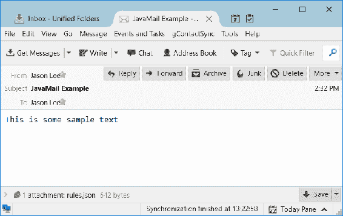
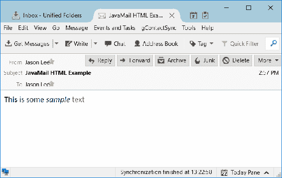
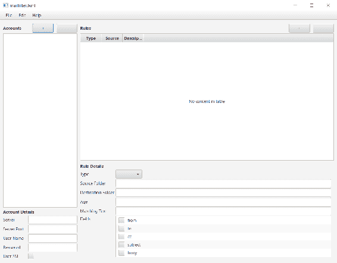
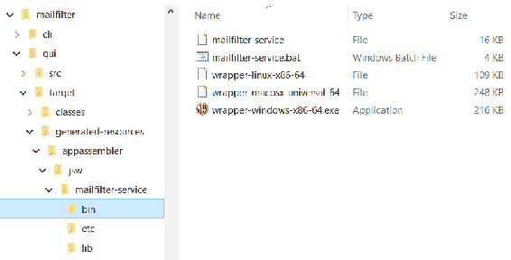

# 使用 MailFilter 进行电子邮件和垃圾邮件管理

在计算机科学中，我们有许多**定律**，其中最著名的可能是摩尔定律，它描述了计算机处理能力增加的速度。另一条定律，虽然不那么知名，而且肯定不那么严重，被称为**扎文斯基定律**。最著名的角色是 Netscape 和 Mozilla 的杰米·扎文斯基，他曾经指出：“每个程序都试图扩展，直到它可以阅读邮件。那些无法扩展的程序将被可以扩展的程序所取代。”尽管扎文斯基定律并没有像摩尔定律那样准确，但它似乎确实有一定的真实性，不是吗？

按照扎文斯基定律的精神，即使不完全符合字面意思，我们将在本章中将注意力转向电子邮件，并看看我们是否可以解决困扰我们所有人的问题：电子邮件杂乱。从垃圾邮件到邮件列表帖子，这些消息不断涌现，并且不断堆积。

我有几个电子邮件账户。作为我家中的负责人和首席技术专家，我经常被要求管理我们的数字资产，无论他们是否意识到这一点。虽然一小块垃圾邮件可能看起来微不足道，但时间久了，它可能成为一个真正的问题。在某个时刻，它几乎似乎难以处理。

在本章中，我们将探讨一个非常真实的问题，即使可能有些夸张，并尝试解决它。这将为我们使用标准的 Java 电子邮件 API，即 JavaMail，提供一个完美的借口。

在本章中，我们将涵盖以下主题：

+   JavaMail API

+   电子邮件协议

+   一些额外的 JavaFX 工作（当然）

+   使用 Quartz 在 Java 中创建工作计划

+   安装用 Java 编写的特定于操作系统的服务

可能你已很好地控制了你的电子邮件收件箱，在这种情况下，恭喜你！然而，无论你的邮件客户端多么整洁或令人不知所措，我们在这章中应该享受探索小巧但功能强大的 JavaMail API 和电子邮件美妙世界的乐趣。

# 入门指南

在我们深入应用之前，让我们停下来快速看一下电子邮件涉及的内容。对于这样一个无处不在的工具，它似乎对大多数人来说都是一个相当晦涩的话题，即使是那些可能倾向于阅读这本书的技术人员。如果我们打算与之合作，了解它将非常有帮助，即使只是了解一点。如果你对协议的细节不感兴趣，那么请随意跳到下一节。

# 简要回顾电子邮件协议的历史

就像许多伟大的计算概念一样，**电子邮件**——**电子邮件**——最早在 20 世纪 60 年代推出，尽管那时的样子大不相同。电子邮件的详尽历史，虽然无疑是一个伟大的技术好奇心，但超出了我们目的的范围，但我认为查看一些今天仍然相关的电子邮件协议会有所帮助，这些协议包括用于发送邮件的 SMTP，以及用于（从您的电子邮件客户端的角度看）接收邮件的 POP3 和 IMAP。（技术上，电子邮件是通过 SMTP 接收的，因为这是**邮件传输代理**（MTA）在服务器之间传输邮件时使用的有线协议。我们这些非 MTA 的作者从未从这些角度考虑过，所以我们不需要过分关注这个区别）。

我们将从发送电子邮件开始，因为在本章中，我们的重点将更多地放在文件夹管理上。**SMTP**（**简单邮件传输协议**），于 1982 年创建，并于 1998 年最后更新，是发送电子邮件的主要协议。通常，在 SSL 和 TLS 加密连接的时代，客户端通过端口 587 连接到 SMTP 服务器。服务器与客户端之间的对话，通常被称为对话，可能看起来像这样（摘自 SMTP RFC [`tools.ietf.org/html/rfc5321`](https://tools.ietf.org/html/rfc5321)）：

```java
    S: 220 foo.com Simple Mail Transfer Service Ready
    C: EHLO bar.com
    S: 250-foo.com greets bar.com
    S: 250-8BITMIME
    S: 250-SIZE
    S: 250-DSN
    S: 250 HELP
    C: MAIL FROM:<Smith@bar.com>
    S: 250 OK
    C: RCPT TO:<Jones@foo.com>
    S: 250 OK
    C: RCPT TO:<Green@foo.com>
    S: 550 No such user here
    C: RCPT TO:<Brown@foo.com>
    S: 250 OK
    C: DATA
    S: 354 Start mail input; end with <CRLF>.<CRLF>
    C: Blah blah blah...
    C: ...etc. etc. etc.
    C: .
    S: 250 OK
    C: QUIT
    S: 221 foo.com Service closing transmission channel
```

在这个简单的例子中，客户端与服务器握手，然后说明邮件来自谁以及将发送给谁。请注意，电子邮件地址被列出了两次，但只有这些第一次实例（`MAIL FROM`和`RCPT TO`，后者为每个收件人重复）才是重要的。第二组只是为了格式化和显示电子邮件。注意这个特殊性，实际的电子邮件在`DATA`行之后，这应该相当容易理解。行上的单个句点标志着消息的结束，此时服务器确认收到消息，我们通过说`QUIT`来结束会话。这个例子看起来非常简单，确实如此，但当消息包含附件，如图片或办公文档，或者电子邮件以 HTML 格式格式化时，事情会变得更加复杂。

虽然 SMTP 用于发送邮件，但 POP3 协议用于检索邮件。POP，或邮局协议，首次于 1984 年推出。当前标准的主体，POP3，于 1988 年推出，并在 1996 年发布更新。POP3 服务器旨在通过客户端（如 Mozilla Thunderbird）接收或下载邮件。如果服务器允许，客户端可以在端口 110 上建立非安全连接，而安全连接通常在端口 995 上建立。

在某个时候，POP3 是用户下载邮件占主导地位的协议。它快速高效，一度是我们的唯一选择。文件夹管理必须在客户端完成，因为 POP3 将邮箱视为一个巨大的存储库，没有任何文件夹的概念（POP4 原本打算添加一些文件夹的概念，以及其他一些功能，但关于提议的 RFC 已经几年没有进展了）。POP3（RC 1939，可在[`tools.ietf.org/html/rfc1939`](https://tools.ietf.org/html/rfc1939)找到）给出了以下示例对话：

```java
    S: <wait for connection on TCP port 110>
    C: <open connection>
    S:    +OK POP3 server ready <1896.697170952@dbc.mtview.ca.us>
    C:    APOP mrose c4c9334bac560ecc979e58001b3e22fb
    S:    +OK mrose's maildrop has 2 messages (320 octets)
    C:    STAT
    S:    +OK 2 320
    C:    LIST
    S:    +OK 2 messages (320 octets)
    S:    1 120
    S:    2 200
    S:    .
    C:    RETR 1
    S:    +OK 120 octets
    S:    <the POP3 server sends message 1>
    S:    .
    C:    DELE 1
    S:    +OK message 1 deleted
    C:    RETR 2
    S:    +OK 200 octets
    S:    <the POP3 server sends message 2>
    S:    .
    C:    DELE 2
    S:    +OK message 2 deleted
    C:    QUIT
    S:    +OK dewey POP3 server signing off (maildrop empty)
    C:  <close connection>
    S:  <wait for next connection>
```

注意，客户端发送一个`RETR`命令来检索邮件，然后发送一个`DELE`命令将其从服务器上删除。这似乎是大多数 POP3 客户端的标准/默认配置。

尽管如此，许多客户端可以配置为将邮件保留在服务器上，要么是几天，要么是永远，当本地删除邮件时，可能会从服务器上删除邮件。如果你曾经这样管理过邮件，你亲自见证了这如何使电子邮件管理变得复杂。

例如，在笔记本电脑出现之前的日子里，想象一下你在办公室和家里各有一台台式电脑。你希望能够在两个地方阅读你的电子邮件，所以你在两台机器上设置了你的 POP3 客户端。你花费工作日阅读、删除，也许还会对邮件进行分类。当你回到家时，那些你在工作中处理的 40 封邮件现在都躺在你的收件箱里，用大号粗体字标明未读邮件。现在，如果你希望保持两个客户端的状态相似，你必须在家里重复你的电子邮件管理任务。这既繁琐又容易出错，这也导致了我们创建 IMAP。

**IMAP**或**互联网访问消息协议**，于 1986 年创建，其中一个设计目标是允许多个客户端完整地管理邮箱、文件夹等。它多年来经历了多次修订，目前 IMAP 4 修订 1 是当前的标准。客户端通过 143 端口连接到 IMAP 服务器进行非安全连接，以及 993 端口进行基于 SSL/TLS 的连接。

由于 IMAP 提供了比 POP 更强大的功能，因此它是一个更复杂的协议。从 RFC（[`tools.ietf.org/html/rfc3501`](https://tools.ietf.org/html/rfc3501)）中，我们可以查看以下示例对话：

```java
    S:   * OK IMAP4rev1 Service Ready 
    C:   a001 login mrc secret 
    S:   a001 OK LOGIN completed 
    C:   a002 select inbox 
    S:   * 18 EXISTS 
    S:   * FLAGS (Answered Flagged Deleted Seen Draft) 
    S:   * 2 RECENT 
    S:   * OK [UNSEEN 17] Message 17 is the first unseen message 
    S:   * OK [UIDVALIDITY 3857529045] UIDs valid 
    S:   a002 OK [READ-WRITE] SELECT completed 
    C:   a003 fetch 12 full 
    S:   * 12 FETCH (FLAGS (Seen) INTERNALDATE 
         "17-Jul-1996 02:44:25 -0700" 
      RFC822.SIZE 4286 ENVELOPE ("Wed,
         17 Jul 1996 02:23:25 -0700 (PDT)" 
      "IMAP4rev1 WG mtg summary and minutes" 
      (("Terry Gray" NIL "gray" "cac.washington.edu")) 
      (("Terry Gray" NIL "gray" "cac.washington.edu")) 
      (("Terry Gray" NIL "gray" "cac.washington.edu")) 
      ((NIL NIL "imap" "cac.washington.edu")) 
      ((NIL NIL "minutes" "CNRI.Reston.VA.US") 
      ("John Klensin" NIL "KLENSIN" "MIT.EDU")) NIL NIL 
      "<B27397-0100000@cac.washington.edu>") 
       BODY ("TEXT" "PLAIN" ("CHARSET" "US-ASCII") NIL NIL "7BIT" 3028 
       92)) 
    S:    a003 OK FETCH completed 
    C:    a004 fetch 12 body[header] 
    S:    * 12 FETCH (BODY[HEADER] {342} 
    S:    Date: Wed, 17 Jul 1996 02:23:25 -0700 (PDT) 
    S:    From: Terry Gray <gray@cac.washington.edu> 
    S:    Subject: IMAP4rev1 WG mtg summary and minutes 
    S:    To: imap@cac.washington.edu 
    S:    cc: minutes@CNRI.Reston.VA.US, John Klensin <KLENSIN@MIT.EDU> 
    S:    Message-Id: <B27397-0100000@cac.washington.edu> 
    S:    MIME-Version: 1.0 
    S:    Content-Type: TEXT/PLAIN; CHARSET=US-ASCII 
    S: 
    S:    ) 
    S:    a004 OK FETCH completed 
    C:    a005 store 12 +flags deleted 
    S:    * 12 FETCH (FLAGS (Seen Deleted)) 
    S:    a005 OK +FLAGS completed 
    C:    a006 logout 
    S:    * BYE IMAP4rev1 server terminating connection 
    S:    a006 OK LOGOUT completed 
```

如您所见，这里的细节比我们示例中的 POP3 对话要多得多。这也应该突出我们为什么使用像 JavaMail 这样的 API，而不是自己打开套接字直接与服务器通信。说到 JavaMail，让我们把注意力转向这个标准 API，看看它能为我们做什么。

# JavaMail，标准的 Java 电子邮件 API

JavaMail API 是一组抽象，提供了一种协议和平台无关的方式来处理电子邮件。虽然它是**Java 企业版**（**Java EE**）的一个必需部分，但它是对 Java SE 的附加库，这意味着你将不得不单独下载它，我们将通过我们的 POM 文件来处理。

我们对本章应用程序的主要兴趣是消息管理，但我们会花一点时间看看如何使用 API 发送电子邮件，这样你就可以在需要时有所作为。

要开始发送邮件，我们需要获取一个 JavaMail `Session`。为此，我们需要设置一些属性，如下所示：

```java
    Properties props = new Properties(); 
    props.put("mail.smtps.host", "smtp.gmail.com"); 
    props.put("mail.smtps.auth", "true"); 
    props.put("mail.smtps.port", "465"); 
    props.put("mail.smtps.ssl.trust", "*"); 
```

我们将通过 Gmail 的服务器发送电子邮件，我们将使用 SSL 的 SMTP。使用这个`Properties`实例，我们可以创建我们的`Session`实例，如下所示：

```java
    Session session = Session.getInstance(props,  
      new javax.mail.Authenticator() { 
      @Override 
      protected PasswordAuthentication getPasswordAuthentication() { 
        return new PasswordAuthentication(userName, password); 
      } 
    }); 
```

要登录到服务器，我们需要指定凭证，我们通过匿名的`PasswordAuthentication`实例来做到这一点。一旦我们有了`Session`实例，我们需要创建一个`Transport`，如下所示：

```java
    transport = session.getTransport("smtps"); 
      transport.connect(); 
```

注意，对于协议参数，我们指定了`smtps`，这告诉 JavaMail 实现我们想要 SMTP over SSL/TLS。我们现在准备好使用以下代码块构建我们的消息：

```java
    MimeMessage message = new MimeMessage(session); 
    message.setFrom("jason@steeplesoft.com"); 
    message.setRecipients(Message.RecipientType.TO, 
      "jason@steeplesoft.com"); 
    message.setSubject("JavaMail Example"); 
```

电子邮件消息是通过`MimeMessage`类建模的，因此我们使用我们的`Session`实例创建该实例。我们设置了发件人和收件人地址，以及主题。为了使事情更有趣，我们将使用`MimeBodyPart`附加一个文件，就像我们在这里看到的那样：

```java
    MimeBodyPart text = new MimeBodyPart(); 
    text.setText("This is some sample text"); 

    MimeBodyPart attachment = new MimeBodyPart(); 
    attachment.attachFile("src/test/resources/rules.json"); 

    Multipart multipart = new MimeMultipart(); 
    multipart.addBodyPart(text); 
    multipart.addBodyPart(attachment); 
    message.setContent(multipart); 
```

我们的消息将包含两部分，使用`MimeBodyPart`进行建模，一部分是消息的主体，它是简单的文本，另一部分是附件。在这种情况下，我们只是从我们的测试中附加一个数据文件，我们稍后会看到。一旦我们定义了这些部分，我们就使用`MimeMultipart`将它们组合起来，然后将它设置为消息的内容，现在我们可以使用`transport.sendMessage()`方法发送：

```java
    transport.sendMessage(message, new Address[] { 
      new InternetAddress("jason@steeplesoft.com")}); 
      if (transport != null) { 
        transport.close();   
      }  
```

只需几秒钟，你应该会在你的收件箱中看到以下电子邮件：



如果你想要发送带有文本替代的 HTML 电子邮件，你可以使用以下代码：

```java
    MimeBodyPart text = new MimeBodyPart(); 
    text.setContent("This is some sample text", "text/plain");  
    MimeBodyPart html = new MimeBodyPart(); 
    html.setContent("<strong>This</strong> is some <em>sample</em>
      <span style="color: red">text</span>", "text/html"); 
    Multipart multipart = new MimeMultipart("alternative"); 
    multipart.addBodyPart(text); 
    multipart.addBodyPart(html); 
    message.setContent(multipart); 
    transport.sendMessage(message, new Address[]{ 
      new InternetAddress("jason@example.com")});
```

注意，我们在每个`MimeBodyPart`上设置了内容，指定了 MIME 类型，当我们创建`Multipart`时，我们将替代作为`subtype`参数传递。如果不这样做，将会导致电子邮件显示两个部分，一个接一个，这肯定不是我们想要的。如果我们正确编写了我们的应用程序，我们应该在我们的电子邮件客户端看到以下内容：



当然，在黑白印刷中你看不到红色文本，但你可以看到粗体和斜体文本，这意味着显示了 HTML 版本，而不是文本版本。任务完成！

发送电子邮件很有趣，但我们在这里是为了学习文件夹和消息管理，所以让我们把注意力转向那个，我们首先设置我们的项目。

# 构建 CLI

这个项目，就像其他项目一样，将是一个多模块 Maven 项目。我们将有一个模块用于所有核心代码，我们还将有一个用于我们将编写的 GUI 的模块，以帮助管理规则。

要创建项目，我们这次将做一些不同的事情。我们不会使用 NetBeans 创建项目，而是将从命令行使用 Maven 架构创建项目，这可以大致看作是项目模板，因此你可以看到如何这样做：

```java
    $ mvn archetype:generate  -DarchetypeGroupId=
      org.codehaus.mojo.archetypes  -DarchetypeArtifactId=pom-root -
      DarchetypeVersion=RELEASE 
      ... 
    Define value for property 'groupId': com.steeplesoft.mailfilter 
    Define value for property 'artifactId': mailfilter-master 
    Define value for property 'version':  1.0-SNAPSHOT 
    Define value for property 'package':  com.steeplesoft.mailfilter 
```

一旦 Maven 完成处理，请切换到新项目的目录，`mailfilter-master`。从这里，我们可以创建我们的第一个项目，CLI：

```java
    $ mvn archetype:generate  -DarchetypeGroupId=
      org.apache.maven.archetypes  -DarchetypeArtifactId=
      maven-archetype-quickstart  -DarchetypeVersion=RELEASE 
    Define value for property 'groupId': com.steeplesoft.mailfilter 
    Define value for property 'artifactId': mailfilter-cli 
    Define value for property 'version':  1.0-SNAPSHOT 
    Define value for property 'package':  com.steeplesoft.mailfilter 
```

这将在 `mailfilter-master` 下创建一个名为 `mailfilter-cli` 的新项目。现在我们可以打开 NetBeans 中的 `mailfilter-cli` 并开始工作。

我们需要做的第一件事是明确我们希望这个工具如何工作。从高层次来看，我们希望能够为账户指定任意数量的规则。这些规则将允许我们根据某些标准（如发件人或电子邮件的年龄）移动或删除电子邮件。为了保持简单，我们将所有规则范围限定在特定账户内，并将操作限制为移动和删除。

让我们先看看账户可能的样子：

```java
    public class Account { 
      @NotBlank(message="A value must be specified for serverName") 
      private String serverName; 
      @NotNull(message = "A value must be specified for serverPort") 
      @Min(value = 0L, message = "The value must be positive") 
      private Integer serverPort = 0; 
      private boolean useSsl = true; 
      @NotBlank(message = "A value must be specified for userName") 
      private String userName; 
      @NotBlank(message = "A value must be specified for password") 
      private String password; 
      private List<Rule> rules; 
```

这基本上是一个非常简单的 **POJO** (**Plain Old Java Object**)，具有六个属性：`serverName`、`serverPort`、`useSsl`、`userName`、`password` 和 `rules`。那么这些注解是什么呢？这些注解来自一个名为 Bean Validation 的库，它提供了一些注解和支持代码，允许我们声明性地表达变量可以持有的值的约束。以下是我们在使用的注解及其含义：

+   `@NotBlank`: 这告诉系统该值不能为 null，也不能为空字符串（实际上，`string != null && !string.trim() .equals("")`）

+   `@NotNull`: 这告诉系统该值不能为 null

+   `@Min`: 这描述了一个有效的最小值

当然，还有很多很多其他的，系统定义了一种方法让你定义自己的，因此它是一个非常简单但非常强大的框架，用于验证输入，这提出了一个重要的问题：这些约束仅在 Bean Validation 框架被要求这样做时才会被验证。我们很容易构建一个包含每个字段都持有无效数据的 `Account` 实例的大集合，JVM 对此会非常满意。应用 Bean Validation 约束的唯一方法是要求它检查我们提供给它的实例。简而言之，是 API 而不是 JVM 强制执行这些约束。这看起来可能很明显，但有时明确指出是有好处的。

在我们继续之前，我们需要将 Bean Validation 添加到我们的项目中。我们将使用参考实现：`Hibernate Validator`。我们还需要在项目中添加表达式语言 API 和一个实现。我们通过在 `pom.xml` 中添加以下依赖项来获取所有这些：

```java
    <dependency> 
      <groupId>org.hibernate</groupId> 
      <artifactId>hibernate-validator</artifactId> 
      <version>5.3.4.Final</version> 
    </dependency> 
    <dependency> 
      <groupId>javax.el</groupId> 
      <artifactId>javax.el-api</artifactId> 
      <version>2.2.4</version> 
    </dependency> 
    <dependency> 
      <groupId>org.glassfish.web</groupId> 
      <artifactId>javax.el</artifactId> 
      <version>2.2.4</version> 
    </dependency> 
```

回到我们的模型，当然有一些 getter 和 setter，但那些并不很有趣。然而，有趣的是`equals()`和`hashCode()`的实现。Josh Bloch 在他的开创性作品《Effective Java》中说道：

当您重写`equals`时，始终重写`hashCode`。

他断言的主要观点是，不这样做违反了`equals()`契约，该契约指出相等的对象必须具有相等的哈希值，如果您的类被用于任何基于哈希的集合，如`HashMap`，这可能会导致不正确和/或不可预测的行为。Bloch 随后列出了一些创建良好的`hashCode`实现以及良好的`equals`实现的规则，但我的建议是：让 IDE 为您完成工作，这正是我们在以下代码块中为`equals()`所做的事情：

```java
    public boolean equals(Object obj) { 
      if (this == obj) { 
        return true; 
      } 
      if (obj == null) { 
        return false; 
      } 
      if (getClass() != obj.getClass()) { 
        return false; 
      } 
      final Account other = (Account) obj; 
      if (this.useSsl != other.useSsl) { 
        return false; 
      } 
      if (!Objects.equals(this.serverName, other.serverName)) { 
        return false; 
      } 
      if (!Objects.equals(this.userName, other.userName)) { 
        return false; 
      } 
      if (!Objects.equals(this.password, other.password)) { 
        return false; 
      } 
      if (!Objects.equals(this.serverPort, other.serverPort)) { 
        return false; 
      } 
      if (!Objects.equals(this.rules, other.rules)) { 
         return false; 
      } 
      return true; 
    } 
```

我们在这里对`hashCode()`也做了同样的处理：

```java
    public int hashCode() { 
      int hash = 5; 
      hash = 59 * hash + Objects.hashCode(this.serverName); 
      hash = 59 * hash + Objects.hashCode(this.serverPort); 
      hash = 59 * hash + (this.useSsl ? 1 : 0); 
      hash = 59 * hash + Objects.hashCode(this.userName); 
      hash = 59 * hash + Objects.hashCode(this.password); 
      hash = 59 * hash + Objects.hashCode(this.rules); 
      return hash; 
    } 
```

注意在`equals()`中测试的每个方法也在`hashCode()`中使用。确保您的实现遵循此规则至关重要，否则您将得到实际上并不按预期工作的方法。您的 IDE 可能在生成方法时提供帮助，但您必须确保您确实使用了相同的字段列表，并且如果您修改了其中一个方法，另一个方法也必须相应地更新。

现在我们有了`Account`，那么`Rule`看起来是什么样子呢？让我们看一下以下代码片段：

```java
    @ValidRule 
    public class Rule { 
      @NotNull 
      private RuleType type = RuleType.MOVE; 
      @NotBlank(message = "Rules must specify a source folder.") 
      private String sourceFolder = "INBOX"; 
      private String destFolder; 
      private Set<String> fields = new HashSet<>(); 
      private String matchingText; 
      @Min(value = 1L, message = "The age must be greater than 0.") 
      private Integer olderThan; 
```

这个类的验证有两方面。首先，我们可以看到与`Account`上相同的字段级别约束：`type`不能为空，`sourceFolder`不能为空，`olderThan`必须至少为 1。虽然您可能不认识它是什么，但我们还在`@ValidRule`中有一个类级别的约束。

字段级别的约束只能看到它们所应用的字段。这意味着如果一个字段的合法值依赖于另一个字段的值，这些类型的约束就不适用了。然而，类级别的规则允许我们在验证时查看整个对象，因此我们可以在验证另一个字段时查看一个字段的值。这也意味着我们需要更多的代码，所以我们将从以下注解开始：

```java
    @Target({ElementType.TYPE, ElementType.ANNOTATION_TYPE}) 
    @Retention(RetentionPolicy.RUNTIME) 
    @Constraint(validatedBy = ValidRuleValidator.class) 
    @Documented 
    public @interface ValidRule { 
      String message() default "Validation errors"; 
      Class<?>[] groups() default {}; 
      Class<? extends Payload>[] payload() default {}; 
    } 
```

如果您之前从未见过注解的源代码，这是一个相当典型的例子。我们不是声明对象的类型为`class`或`interface`，而是使用了`@interface`，这是一个微妙但重要的区别。注解的字段也有所不同，因为没有可见性修饰符，类型也不能是原始类型。注意`default`关键字的用法。

注解本身也有注解，如下所示：

+   `@Target`：这限制了此注解可以应用到的元素类型；在这种情况下，类型和其他注解。

+   `@Retention`：这指示编译器是否应该将注解写入类文件，并在运行时使其可用。

+   `@Constraint`：这是一个 Bean Validation 注解，用于标识我们的注解作为一个新的约束类型。这个注解的值告诉系统哪个`ConstraintValidator`处理这个约束的验证逻辑。

+   `@Documented`：这表示在任何类型上出现此注解应被视为该类型公共 API 的一部分。

我们处理这个新约束的`ConstraintValidator`实现稍微复杂一些。我们声明这个类如下：

```java
    public class ValidRuleValidator implements  
      ConstraintValidator<ValidRule, Object> { 
```

Bean Validation 提供了一个参数化接口用于约束验证，它接受约束的类型和验证器中逻辑应用的对象类型。这允许你为不同的对象类型编写给定约束的不同验证器。在我们的情况下，我们可以指定`Rule`而不是`Object`。如果我们这样做，任何不是`Rule`的其他东西被`@ValidRule`注解并验证时，调用代码将看到抛出异常。但你所做的，正如你将看到的，是验证注解的类型，具体来说，如果需要，添加约束违规。

接口要求我们也要实现这个方法，但在这里我们没有工作要做，所以它有一个空的方法体，如下所示：

```java
    @Override 
    public void initialize(ValidRule constraintAnnotation) { 
    } 
```

有趣的方法是`isValid()`。它有点长，所以让我们一步一步地分析它：

```java
    public boolean isValid(Object value,  
      ConstraintValidatorContext ctx) { 
        if (value == null) { 
          return true; 
        } 
```

第一步是确保`value`不是 null。我们有两种选择：如果它是 null，返回`true`，表示没有问题；或者返回`false`，表示有问题。我们的选择取决于我们希望应用程序如何表现。对于这两种方法都可以提出合理的论据，但似乎将 null 的`Rule`视为无效是有意义的，所以让我们改变它的主体，使其看起来像这样：

```java
    ctx.disableDefaultConstraintViolation(); 
    ctx.buildConstraintViolationWithTemplate( 
      "Null values are not considered valid Rules") 
      .addConstraintViolation(); 
    return false; 
```

我们使用指定的消息构建`ConstraintViolation`，将其添加到`ConstraintValidatorContext`的`ctx`中，并返回`false`以指示失败。

接下来，我们想要确保我们正在处理`Rule`的一个实例：

```java
    if (!(value instanceof Rule)) { 
      ctx.disableDefaultConstraintViolation(); 
      ctx.buildConstraintViolationWithTemplate( 
        "Constraint valid only on instances of Rule.") 
      .addConstraintViolation(); 
      return false; 
    } 
```

一旦我们确定我们有一个非空的`Rule`实例，我们就可以进入验证逻辑的核心：

```java
    boolean valid = true; 
    Rule rule = (Rule) value; 
    if (rule.getType() == RuleType.MOVE) { 
      valid &= validateNotBlank(ctx, rule, rule.getDestFolder(),  
      "A destination folder must be specified."); 
    } 
```

我们希望能够收集所有的违规项，所以我们创建一个`boolean`变量来保存当前状态，然后将值转换为`Rule`以使处理实例更加自然。在我们的第一次测试中，我们确保如果`Rule`的类型是`RuleType.MOVE`，它指定了目标文件夹。我们使用这个私有方法来完成：

```java
    private boolean validateNotBlank(ConstraintValidatorContext ctx,  
      String value, String message) { 
      if (isBlank(value)) { 
        ctx.disableDefaultConstraintViolation(); 
        ctx.buildConstraintViolationWithTemplate(message) 
        .addConstraintViolation(); 
        return false; 
      } 
      return true; 
   } 
```

如果`value`为空，我们就像之前看到的那样，使用指定的消息添加`ConstraintViolation`，并返回`false`。如果不是空的，我们返回`true`。这个值随后与`valid`进行 AND 操作以更新`Rule`验证的当前状态。

`isBlank()`方法非常简单：

```java
    private boolean isBlank(String value) { 
      return (value == null || (value.trim().isEmpty())); 
    } 
```

这是一个非常常见的检查，实际上与 Bean Validation 背后的`@NotBlank`验证器在逻辑上是相同的。

我们接下来的两个测试是相关的。逻辑是这样的：规则必须指定要匹配的文本或最大年龄（以天为单位）。对这个测试的验证看起来像这样：

```java
     if (!isBlank(rule.getMatchingText())) { 
       valid &= validateFields(ctx, rule); 
     } else if (rule.getOlderThan() == null) { 
       ctx.disableDefaultConstraintViolation(); 
       ctx.buildConstraintViolationWithTemplate( 
         "Either matchingText or olderThan must be specified.") 
       .addConstraintViolation(); 
       valid = false; 
     } 
```

如果 `Rule` 指定了 `matchingText`，那么我们验证 `fields` 是否已正确设置。如果既没有设置 `matchingText` 也没有设置 `olderThan`，那么我们添加一个带有相应信息的 `ConstraintViolation` 并将 `valid` 设置为 false。我们的 `fields` 验证看起来像这样：

```java
    private boolean validateFields(ConstraintValidatorContext ctx, Rule rule) { 
      if (rule.getFields() == null || rule.getFields().isEmpty()) { 
        ctx.disableDefaultConstraintViolation(); 
        ctx.buildConstraintViolationWithTemplate( 
          "Rules which specify a matching text must specify the field(s)
            to match on.") 
          .addConstraintViolation(); 
        return false; 
      } 
      return true; 
    } 
```

我们确保 `fields` 既不是 null 也不是空的。虽然我们当然可以，但我们在这里不对字段 `Set` 的实际内容进行任何验证。

现在，我们可能已经编写了我们的第一个自定义验证。你的反应可能类似于，“哇！对于一个‘简单’的验证来说，代码太多了”，你说得对。在你把婴儿和洗澡水一起倒掉之前，想想这个：Bean Validation 的价值在于你可以将可能复杂的验证逻辑隐藏在一个非常小的注解后面。然后，你只需将约束注解放置在适当的位置，就可以在任何地方重用这个逻辑。逻辑在一个地方表达，在一个地方维护，但在很多地方使用，都非常整洁和简洁。

所以，是的，这是一段相当多的代码，但你只需要写一次，并且约束的消费者永远不需要看到它。实际上并没有多少额外的工作要做，但这是否值得你花时间，取决于你自己的决定。

现在我们快速浏览了自定义 Bean Validation 约束后，让我们回到我们的数据模型。最后要展示的部分是 `RuleType` 枚举：

```java
    public enum RuleType { 
      DELETE, MOVE; 
      public static RuleType getRuleType(String type) { 
        switch(type.toLowerCase()) { 
          case "delete" : return DELETE; 
          case "move" : return MOVE; 
          default : throw new IllegalArgumentException( 
            "Invalid rule type specified: " + type); 
        } 
      } 
    } 
```

这是一个基本的 Java `枚举`，包含两个可能的值，`DELETE` 和 `MOVE`，但我们还增加了一个辅助方法来返回给定字符串表示的适当 `RuleType` 实例。这将在我们从 JSON 中反序列化 `Rule` 时帮助我们。

在定义了我们的数据模型后，我们准备开始编写工具本身的代码。虽然 Maven 模块被命名为 `mailfilter-cli`，但在这里我们不会关注一个健壮的命令行界面，就像我们在前面的章节中看到的那样。相反，我们将提供与命令行的非常基本的交互，将操作系统服务（我们稍后会查看）作为首选的使用方式。

就在这个时候，我们将开始使用 JavaMail API，因此我们需要确保我们的项目设置正确，所以我们向 `pom.xml` 中添加以下代码行：

```java
    <dependency> 
      <groupId>com.sun.mail</groupId> 
      <artifactId>javax.mail</artifactId> 
      <version>1.5.6</version> 
    </dependency> 
```

在我们的 IDE 中，我们创建一个新的类 `MailFilter`，并创建熟悉的 `public static void main` 方法，如下所示：

```java
    public static void main(String... args) { 
      try { 
        final MailFilter mailFilter =  
          new MailFilter(args.length > 0 ? args[1] : null); 
        mailFilter.run(); 
        System.out.println("tDeleted count: "  
          + mailFilter.getDeleted()); 
        System.out.println("tMove count:    "  
          + mailFilter.getMoved()); 
      } catch (Exception e) { 
        System.err.println(e.getLocalizedMessage()); 
      } 
    } 
```

NetBeans 支持许多代码模板。这里感兴趣的模板是`psvm`，它将创建一个`public static void main`方法。要使用它，确保你在类定义内的空行上（以避免格式问题），然后输入`psvm`并按 Tab 键。NetBeans 会为你创建方法并将光标放在空方法的第 1 行，准备你开始编码。你可以通过导航到工具 | 选项 | 编辑器 | 代码模板找到成百上千的其他有用的代码模板。你甚至可以定义自己的模板。

在我们的`main()`方法中，我们创建一个`MainFilter`实例，传入可能已在命令行中指定的任何规则定义文件，并调用`run()`：

```java
    public void run() { 
      try { 
        AccountService service = new AccountService(fileName); 

        for (Account account : service.getAccounts()) { 
          AccountProcessor processor =  
            new AccountProcessor(account); 
          processor.process(); 
          deleted += processor.getDeleteCount(); 
          moved += processor.getMoveCount(); 
        } 
      } catch (MessagingException ex) { 
        Logger.getLogger(MailFilter.class.getName()) 
        .log(Level.SEVERE, null, ex); 
      } 
    } 
```

我们首先创建一个`AccountService`实例，它封装了读取和写入`Rules`文件的细节。对于指定文件中的每个账户，我们创建一个`AccountProcessor`，它封装了规则处理逻辑。

`AccountService`实例可能听起来并不令人兴奋，但在这个公开接口后面隐藏着一些相当有趣的技术细节。我们看到 Bean Validation 约束实际上是如何被检查的，我们还看到了 Jackson JSON 库用于读取和写入`Rules`文件的使用。在我们开始使用 Jackson 之前，我们需要将其添加到我们的项目中，这通过添加以下`pom.xml`来完成：

```java
    <dependency> 
      <groupId>com.fasterxml.jackson.core</groupId> 
      <artifactId>jackson-databind</artifactId> 
      <version>2.8.5</version> 
    </dependency> 
```

你应该始终确保你使用的是库的最新版本。

这个类一开始并不大，但这里只有三个方法值得关注。我们将从最基本的一个开始，如下所示：

```java
    private File getRulesFile(final String fileName) { 
      final File file = new File(fileName != null ? fileName 
        : System.getProperty("user.home") + File.separatorChar 
        + ".mailfilter" + File.separatorChar + "rules.json"); 
      if (!file.exists()) { 
        throw new IllegalArgumentException( 
          "The rules file does not exist: " + rulesFile); 
      } 
      return file; 
    } 
```

我在这里包含这个的原因是，从用户的家目录中读取文件是我自己经常做的事情，你可能也会。这个例子展示了如何做到这一点，尝试在用户没有明确指定文件的情况下找到`~/.mailfilter/rules.json`的规则文件。无论是生成还是指定，如果找不到规则文件，我们会抛出一个异常。

可能最有趣的方法是`getAccounts()`方法。我们将逐步分析这个方法：

```java
    public List<Account> getAccounts() { 
      final Validator validator = Validation 
        .buildDefaultValidatorFactory().getValidator(); 
      final ObjectMapper mapper = new ObjectMapper() 
        .configure(DeserializationFeature. 
        ACCEPT_SINGLE_VALUE_AS_ARRAY, true); 
      List<Account> accounts = null; 
```

这三个语句正在设置一些处理账户所需的对象。第一个是`Validator`，这是一个 Bean Validation 类，它是我们应用和检查我们在数据模型上描述的约束的入口点。接下来是`ObjectMapper`，这是一个 Jackson 类，它将 JSON 数据结构映射到我们的 Java 数据模型上。我们需要指定`ACCEPT_SINGLE_VALUE_AS_ARRAY`以确保 Jackson 正确处理模型中的任何列表。最后，我们创建`List`来保存我们的`Account`实例。

使用 Jackson 将规则文件读入内存并将其作为我们数据模型的实例非常简单：

```java
    accounts = mapper.readValue(rulesFile,  
      new TypeReference<List<Account>>() {}); 
```

由于我们 Java 类中的属性名与我们的 JSON 文件中使用的键匹配，`ObjectMapper`可以轻松地从 JSON 文件中读取数据，并仅用这一行就构建我们的内存模型。注意`TypeReference`实例。我们希望 Jackson 返回一个`List<Account>`实例，但由于 JVM 中的一些设计决策，在运行时直接访问参数化类型是不可能的。然而，`TypeReference`类可以帮助捕获这些信息，然后 Jackson 在创建数据模型时使用这些信息。如果我们传递`List.class`，我们将在运行时得到类型转换失败。

现在我们有了`Account`实例，我们准备开始验证：

```java
    accounts.forEach((account) -> { 
      final Set<ConstraintViolation<Account>> violations =  
        validator.validate(account); 
      if (violations.size() > 0) { 
        System.out.println( 
          "The rule file has validation errors:"); 
        violations.forEach(a -> System.out.println("  "" + a)); 
        throw new RuntimeException("Rule validation errors"); 
      } 
      account.getRules().sort((o1, o2) ->  
        o1.getType().compareTo(o2.getType())); 
    }); 
```

使用`List.forEach()`，我们遍历`List`中的每个账户（这里没有显示 null 检查）。对于每个`Account`，我们调用`validator.validate()`，这时约束条件实际上被验证。到目前为止，它们只是存储在类中的注释，JVM 愉快地带着它们，但没有对它们做任何事情。Bean Validation，如我们之前讨论的，是约束条件的执行者，在这里我们看到手动 API 调用。

当`validator`的调用返回时，我们需要查看是否有任何`ConstraintViolations`。如果有，我们相当天真地打印一条消息到标准输出，详细说明每个失败。由于我们编写了验证器，如果规则有多个违规，我们一次就能看到它们，这样用户就可以一次性修复它们，而无需多次尝试处理规则。将这些打印到控制台不一定是最优的方法，因为我们不能以编程方式处理它们，但这对我们目前的需求来说是足够的。

在 Bean Validation 真正发光发热的地方是那些代表你进行集成的框架。例如，JAX-RS，这是构建 REST 资源的标准 Java API，提供了这种类型的集成。我们在这个示例 REST 资源方法中看到了功能的使用：

`@GET`

`public Response getSomething (`

`@QueryParam("foo") @NotNull Integer bar) {`

当请求被路由到这个方法时，JAX-RS 确保如果可能的话，将查询参数`foo`转换为`Integer`，并且它不是`null`，因此在你的代码中，你可以假设你有一个有效的`Integer`引用。

我们在这个类中想要查看的最后一个方法是`saveAccounts()`，它可能听起来很疯狂，但它将`Account`实例保存到指定的规则文件中：

```java
    public void saveAccounts(List<Account> accounts) { 
      try { 
        final ObjectMapper mapper =  
          new ObjectMapper().configure(DeserializationFeature. 
          ACCEPT_SINGLE_VALUE_AS_ARRAY, true); 
        mapper.writeValue(rulesFile, accounts); 
      } catch (IOException ex) { 
        // ... 
      } 
    } 
```

与读取文件类似，只要你的 Java 类和你的 JSON 结构匹配，写入它就极其简单。如果你确实有不同的名称（例如，Java 类可能有`accountName`属性，而 JSON 文件使用`account_name`），Jackson 提供了一些可以应用于 POJO 的注释，以说明如何正确映射字段。你可以在 Jackson 的网站上找到这些注释的完整详细信息（[`github.com/FasterXML/jackson`](https://github.com/FasterXML/jackson)）。

当我们将 `Account` 实例加载到内存并验证其正确性后，我们现在需要处理它们。入口点是 `process()` 方法：

```java
    public void process() throws MessagingException { 
      try { 
        getImapSession(); 

        for (Map.Entry<String, List<Rule>> entry :  
          getRulesByFolder(account.getRules()).entrySet()) { 
          processFolder(entry.getKey(), entry.getValue()); 
        } 
      } catch (Exception e) { 
        throw new RuntimeException(e); 
      } finally { 
        closeFolders(); 
        if (store != null) { 
          store.close(); 
        } 
      } 
    } 
```

我们需要注意的三行是调用 `getImapSession()`、`getRulesByFolder()` 和 `processFolder()`，我们将现在详细查看：

```java
    private void getImapSession()  
      throws MessagingException, NoSuchProviderException { 
      Properties props = new Properties(); 
      props.put("mail.imap.ssl.trust", "*"); 
      props.put("mail.imaps.ssl.trust", "*"); 
      props.setProperty("mail.imap.starttls.enable",  
        Boolean.toString(account.isUseSsl())); 
      Session session = Session.getInstance(props, null); 
      store = session.getStore(account.isUseSsl() ?  
        "imaps" : "imap"); 
      store.connect(account.getServerName(), account.getUserName(),  
        account.getPassword()); 
    } 
```

要获取 IMAP `Session`，正如我们在本章前面看到的，我们创建一个 `Properties` 实例并设置一些重要属性。我们使用规则文件中用户指定的协议获取 `Store` 引用：对于非基于 SSL 的连接使用 `imap`，对于基于 SSL 的连接使用 `imaps`。

一旦我们有了会话，我们就遍历我们的规则，按源文件夹分组：

```java
    private Map<String, List<Rule>> getRulesByFolder(List<Rule> rules) { 
      return rules.stream().collect( 
        Collectors.groupingBy(r -> r.getSourceFolder(), 
        Collectors.toList())); 
    } 
```

我们现在可以按以下方式处理文件夹：

```java
    private void processFolder(String folder, List<Rule> rules)  
      throws MessagingException { 
      Arrays.stream(getFolder(folder, Folder.READ_WRITE) 
        .getMessages()).forEach(message -> 
        rules.stream().filter(rule ->  
        rule.getSearchTerm().match(message)) 
        .forEach(rule -> { 
          switch (rule.getType()) { 
            case MOVE: 
              moveMessage(message, getFolder( 
                rule.getDestFolder(),  
                Folder.READ_WRITE)); 
            break; 
            case DELETE: 
              deleteMessage(message); 
            break; 
          } 
      })); 
    } 
```

使用 `Stream`，我们遍历源文件夹中的每条消息，只过滤与 `SearchTerm` 匹配的消息，但这是什么，它从哪里来？

`Rule` 类中还有一些额外的项目我们没有查看过：

```java
    private SearchTerm term; 
    @JsonIgnore 
    public SearchTerm getSearchTerm() { 
      if (term == null) { 
        if (matchingText != null) { 
          List<SearchTerm> terms = fields.stream() 
          .map(f -> createFieldSearchTerm(f)) 
          .collect(Collectors.toList()); 
          term = new OrTerm(terms.toArray(new SearchTerm[0])); 
        } else if (olderThan != null) { 
          LocalDateTime day = LocalDateTime.now() 
          .minusDays(olderThan); 
          term = new SentDateTerm(ComparisonTerm.LE, 
            Date.from(day.toLocalDate().atStartOfDay() 
            .atZone(ZoneId.systemDefault()).toInstant())); 
        } 
      } 
      return term; 
    } 
```

我们添加一个私有字段来缓存 `SearchTerm`，这样我们就不必为大型文件夹中的每条消息重新创建它。这是一个小的优化，但我们想避免因重新创建 `SearchTerm` 而带来的不必要的性能损失。如果规则设置了 `matchingText`，我们根据指定的字段创建一个 `List<SearchTerm>`。一旦我们有了这个列表，我们就用 `OrTerm` 包装它，这将指示 JavaMail 匹配任何指定的字段与文本匹配的消息。

如果设置了 `olderThan`，那么我们创建 `SentDateTerm` 来匹配至少 `olderThan` 天前发送的任何消息。我们将 `SearchTerm` 引用保存到我们的私有实例变量中，然后返回它。

注意到该方法有 `@JsonIgnore` 注解。我们使用这个注解来确保 Jackson 不会尝试将此 getter 返回的值序列化到 JSON 文件中。

对于好奇的人来说，`createFieldSearchTerm()` 的样子如下：

```java
    private SearchTerm createFieldSearchTerm(String f) { 
      switch (f.toLowerCase()) { 
        case "from": 
          return new FromStringTerm(matchingText); 
        case "cc": 
          return new RecipientStringTerm( 
            Message.RecipientType.CC, matchingText); 
        case "to": 
          return new RecipientStringTerm( 
            Message.RecipientType.TO, matchingText); 
        case "body": 
          return new BodyTerm(matchingText); 
        case "subject": 
          return new SubjectTerm(matchingText); 
        default: 
            return null; 
      } 
    } 
```

那么，消息实际上是如何移动或删除的呢？当然，有一个 JavaMail API 可以做到这一点，其使用可能看起来像这样：

```java
    private static final Flags FLAGS_DELETED =  
      new Flags(Flags.Flag.DELETED); 
    private void deleteMessage(Message toDelete) { 
      if (toDelete != null) { 
        try { 
          final Folder source = toDelete.getFolder(); 
          source.setFlags(new Message[]{toDelete},  
            FLAGS_DELETED, true); 
          deleteCount++; 
        } catch (MessagingException ex) { 
          throw new RuntimeException(ex); 
        } 
      } 
    } 
```

我们进行快速空值检查，然后获取消息 `Folder` 的引用。有了这个，我们指示 JavaMail 在文件夹中的消息上设置一个标志 `FLAGS_DELETED`。JavaMail API 通常在 `Message` 的数组 (`Message[]`) 上工作，所以我们需要将 `Message` 包装在数组中，然后将其传递给 `setFlags()`。当我们完成时，我们增加已删除消息计数器，以便我们完成时可以打印报告。

移动 `Message` 非常相似：

```java
    private void moveMessage(Message toMove, Folder dest) { 
      if (toMove != null) { 
        try { 
          final Folder source = toMove.getFolder(); 
          final Message[] messages = new Message[]{toMove}; 
          source.setFlags(messages, FLAGS_DELETED, true); 
          source.copyMessages(messages, dest); 
          moveCount++; 
        } catch (MessagingException ex) { 
          throw new RuntimeException(ex); 
        } 
      } 
    } 
```

这个方法的大部分看起来就像 `deleteMessage()`，但有一个细微的差别。JavaMail 没有提供 `moveMessages()` API。我们不得不做的是调用 `copyMessages()` 来在目标文件夹中创建消息的副本，然后从源文件夹中删除消息。我们增加已移动计数器并返回。

最后两个感兴趣的方法是处理文件夹的。首先，我们需要获取文件夹，我们在这里做：

```java
    final private Map<String, Folder> folders = new HashMap<>(); 
    private Folder getFolder(String folderName, int mode) { 
      Folder source = null; 
      try { 
        if (folders.containsKey(folderName)) { 
          source = folders.get(folderName); 
        } else { 
          source = store.getFolder(folderName); 
          if (source == null || !source.exists()) { 
            throw new IllegalArgumentException( 
             "Invalid folder: " + folderName); 
          } 
          folders.put(folderName, source); 
        } 
        if (!source.isOpen()) { 
          source.open(mode); 
        } 
      } catch (MessagingException ex) { 
        //... 
      } 
      return source; 
    } 
```

由于性能原因，我们按文件夹名称在`Map`中缓存每个`Folder`实例。如果我们找到`Folder`在`Map`中，我们就使用它。如果没有，我们就从 IMAP `Store`请求所需`Folder`的引用，并将其缓存到`Map`中。最后，我们确保`Folder`是打开的，否则我们的移动和删除命令将抛出`Exception`。

我们还需要确保在完成时关闭`文件夹`：

```java
    private void closeFolders() { 
      folders.values().stream() 
      .filter(f -> f.isOpen()) 
      .forEachOrdered(f -> { 
        try { 
          f.close(true); 
        } catch (MessagingException e) { 
        } 
      }); 
    } 
```

我们过滤我们的`Folder`流，只保留那些打开的，然后调用`folder.close()`，吞咽可能发生的任何失败。在处理这个阶段，没有太多可以做的事情。

我们现在技术上已经完成了邮件过滤器，但它并不像它本可以做到的那样易于使用。我们需要一种方式来按计划运行它，并且能够在 GUI 中查看和编辑规则将会非常方便，所以我们将构建这两者。由于如果没有要运行的内容，安排某件事就没有意义，所以我们将从 GUI 开始。

# 构建 GUI

由于我们希望使其尽可能易于使用，我们现在将构建一个 GUI 来帮助管理这些规则。为了创建项目，我们将使用在创建 CLI 时使用的相同 Maven 存档：

```java
$ mvn archetype:generate  -DarchetypeGroupId=org.apache.maven.archetypes  -DarchetypeArtifactId=maven-archetype-quickstart  -DarchetypeVersion=RELEASE 
Define value for property 'groupId': com.steeplesoft.mailfilter 
Define value for property 'artifactId': mailfilter-gui 
Define value for property 'version':  1.0-SNAPSHOT 
Define value for property 'package':  com.steeplesoft.mailfilter.gui 
```

一旦创建了 POM，我们需要对其进行一些编辑。我们需要通过向`pom.xml`添加此元素来设置父元素：

```java
    <parent> 
      <groupId>com.steeplesoft.j9bp.mailfilter</groupId> 
      <artifactId>mailfilter-master</artifactId> 
      <version>1.0-SNAPSHOT</version> 
    </parent> 
```

我们还将添加对 CLI 模块的依赖，如下所示：

```java
    <dependencies> 
      <dependency> 
        <groupId>${project.groupId}</groupId> 
        <artifactId>mailfilter-cli</artifactId> 
        <version>${project.version}</version> 
      </dependency> 
    </dependencies> 
```

由于我们不依赖于 NetBeans 为我们生成 JavaFX 项目，我们还需要手动创建一些基本组件。让我们从应用程序的入口点开始：

```java
    public class MailFilter extends Application { 
      @Override 
      public void start(Stage stage) throws Exception { 
        Parent root = FXMLLoader.load(getClass() 
        .getResource("/fxml/mailfilter.fxml")); 
        Scene scene = new Scene(root); 
        stage.setTitle("MailFilter"); 
        stage.setScene(scene); 
        stage.show(); 
      } 

      public static void main(String[] args) { 
        launch(args); 
      } 
    } 
```

这是一个非常典型的 JavaFX 主类，所以我们将直接跳到 FXML 文件。现在，我们将只创建一个使用以下代码片段的存根：

```java
    <?xml version="1.0" encoding="UTF-8"?> 
    <?import java.lang.*?> 
    <?import java.util.*?> 
    <?import javafx.scene.*?> 
    <?import javafx.scene.control.*?> 
    <?import javafx.scene.layout.*?> 

    <AnchorPane id="AnchorPane" prefHeight="200" prefWidth="320"  

      fx:controller= 
        "com.steeplesoft.mailfilter.gui.Controller"> 
      <children> 
        <Button layoutX="126" layoutY="90" text="Click Me!"  
          fx:id="button" /> 
        <Label layoutX="126" layoutY="120" minHeight="16"  
          minWidth="69" fx:id="label" /> 
      </children> 
    </AnchorPane> 
```

最后，我们创建控制器：

```java
    public class Controller implements Initializable { 
      @Override 
      public void initialize(URL url, ResourceBundle rb) { 
      } 
    } 
```

这给我们一个可以启动和运行的 JavaFX 应用程序，但除此之外没有做太多。在之前的章节中，我们已经详细介绍了如何构建 JavaFX 应用程序，所以在这里我们不会再次做这件事，但其中有一些有趣的挑战值得一看。

为了让你了解我们正在努力实现的目标，这里有一个最终用户界面的截图：



在左侧，我们有`ListView`来显示规则文件中配置的`账户`。在`ListView`下方，我们有一些控件来编辑当前选中的`账户`。在右侧，我们有`TableView`来显示`规则`，以及下方类似区域用于编辑`规则`。

当用户点击`账户`或`规则`时，我们希望下面的表单区域填充相关内容。随着用户修改数据，`账户`/`规则`以及`ListView`/`TableView`都应该更新。

通常情况下，这是 JavaFX 真正发光发热的领域之一，即属性绑定。我们已经通过`ObservableList`看到了其中的一小部分：我们可以在`List`中添加一个项目，并且它会被自动添加到与之绑定的 UI 组件中。然而，我们现在所处的情境略有不同，因为我们的模型是一个 POJO，它没有使用任何 JavaFX API，所以我们并不能那么容易地获得这种功能。让我们看看将这些事物连接在一起需要做些什么。

首先，让我们看看`Account`列表。我们有`ObservableList`：

```java
    private final ObservableList<Account> accounts =  
      FXCollections.observableArrayList(); 
```

我们按照以下方式将我们的账户添加到这个`ObservableList`中：

```java
    private void configureAccountsListView() { 
      accountService = new AccountService(); 
      accounts.addAll(accountService.getAccounts()); 
```

然后，我们按照以下方式绑定`List`和`ListView`：

```java
    accountsListView.setItems(accounts); 
ListView clicks:
```

```java
    accountProperty = new AccountProperty(); 
    accountsListView.setOnMouseClicked(e -> { 
      final Account account = accountsListView.getSelectionModel() 
      .getSelectedItem(); 
      if (account != null) { 
        accountProperty.set(account); 
      } 
    }); 
```

当用户点击`ListView`时，我们在`AccountProperty`实例上设置`Account`。在我们离开这个方法并查看`AccountProperty`之前，我们需要设置最后一项：

```java
    final ChangeListener<String> accountChangeListener =  
      (observable, oldValue, newValue) ->  
      accountsListView.refresh(); 
    serverName.textProperty().addListener(accountChangeListener); 
    userName.textProperty().addListener(accountChangeListener); 
```

我们定义了`ChangeListener`，它简单地调用`accountsListView.refresh()`，这会指示`ListView`重新绘制自己。我们希望它在模型本身更新时这样做，这种更新`ObservableList`并不会冒泡到`ListView`。接下来的两行代码将`Listener`添加到`serverName`和`userName``TextField`上。这两个控件通过相同的名称编辑`Account`上的属性，并且是用于生成`ListView`显示字符串的唯一两个控件，这里我们没有展示。

`AccountProperty`是一个自定义的 JavaFX 属性，因此我们按照以下方式扩展`ObjectPropertyBase`：

```java
    private class AccountProperty extends ObjectPropertyBase<Account> { 
```

这提供了一部分绑定解决方案，但繁重的工作是由来自优秀的 JFXtras 项目的`BeanPathAdapter`类来处理的：

```java
    private final BeanPathAdapter<Account> pathAdapter; 
```

就在本书撰写时，JFXtras 库并不与 Java 9 兼容。我们只需要从库中获取这个类，所以我将 JFXtras 仓库中类的源代码复制到了这个项目中。一旦 JFXtras 在 Java 9 下运行，我们就可以移除这个副本。

文档描述这个类为“一个适配器，它接受一个 POJO bean，并在内部递归地将其字段绑定/解绑到其他`Property`组件”。这是一个非常强大的类，我们在这里无法全面介绍，所以我们只跳到我们的特定用法，如下所示：

```java
    public AccountProperty() { 
        pathAdapter = new BeanPathAdapter<>(new Account()); 
        pathAdapter.bindBidirectional("serverName",  
            serverName.textProperty()); 
        pathAdapter.bindBidirectional("serverPort",  
            serverPort.textProperty()); 
        pathAdapter.bindBidirectional("useSsl",  
            useSsl.selectedProperty(), Boolean.class); 
        pathAdapter.bindBidirectional("userName",  
            userName.textProperty()); 
        pathAdapter.bindBidirectional("password",  
            password.textProperty()); 
        addListener((observable, oldValue, newValue) -> { 
            rules.setAll(newValue.getRules()); 
        }); 
    } 
```

`BeanPathAdapter`允许我们将 JavaFX 的`Property`绑定到 POJO 上的属性，这些属性可以嵌套到任意深度，并使用点分隔的路径表示法进行引用。在我们的例子中，属性是`Account`对象上的顶级属性，所以路径既短又简单。在我们将控件绑定到属性之后，我们添加一个`Listener`来更新当前账户的`ObservableList`规则。

在前述代码中，当在`ListView`中更改`Account`选择时调用的`set()`方法非常简单：

```java
    @Override 
    public void set(Account newValue) { 
      pathAdapter.setBean(newValue); 
      super.set(newValue); 
    } 
```

在这些组件就位之后，当我们在各种控件中输入时，`Account`对象会得到更新，并且当`serverName`和/或`userName`字段被编辑时，`ListView`的标签也会得到更新。

现在，我们需要为将显示用户配置的每个 `Rule` 的 `TableView` 做同样的事情。设置几乎相同：

```java
    private void configureRuleFields() { 
        ruleProperty = new RuleProperty(); 
        fields.getCheckModel().getCheckedItems().addListener( 
          new RuleFieldChangeListener()); 
        final ChangeListener<Object> ruleChangeListener =  
            (observable, oldValue, newValue) ->  
                rulesTableView.refresh(); 
        sourceFolder.textProperty() 
           .addListener(ruleChangeListener); 
        destFolder.textProperty().addListener(ruleChangeListener); 
        matchingText.textProperty() 
            .addListener(ruleChangeListener); 
        age.textProperty().addListener(ruleChangeListener); 
        type.getSelectionModel().selectedIndexProperty() 
            .addListener(ruleChangeListener); 
    } 
```

在这里，我们看到相同的基本结构：实例化 `RuleProperty`，创建 `ChangeListener` 以请求 `TableView` 刷新自身，并将该监听器添加到相关的表单字段。

`RuleProperty` 也类似于 `AccountProperty`：

```java
    private class RuleProperty extends ObjectPropertyBase<Rule> { 
      private final BeanPathAdapter<Rule> pathAdapter; 

      public RuleProperty() { 
        pathAdapter = new BeanPathAdapter<>(new Rule()); 
        pathAdapter.bindBidirectional("sourceFolder",  
          sourceFolder.textProperty()); 
        pathAdapter.bindBidirectional("destFolder",  
          destFolder.textProperty()); 
        pathAdapter.bindBidirectional("olderThan",  
          age.textProperty()); 
        pathAdapter.bindBidirectional("matchingText",  
          matchingText.textProperty()); 
        pathAdapter.bindBidirectional("type",  
          type.valueProperty(), String.class); 
        addListener((observable, oldValue, newValue) -> { 
          isSelectingNewRule = true; 
          type.getSelectionModel().select(type.getItems() 
          .indexOf(newValue.getType().name())); 

          IndexedCheckModel checkModel = fields.getCheckModel(); 
          checkModel.clearChecks(); 
          newValue.getFields().forEach((field) -> { 
            checkModel.check(checkModel.getItemIndex(field)); 
          }); 
          isSelectingNewRule = false; 
      }); 
    } 
```

这里的最大不同之处在于创建的 `Listener`。鉴于使用了来自伟大的 ControlsFX 项目的自定义控件 `CheckListView`，值得注意的是逻辑：我们获取 `IndexedCheckModel`，然后将其清空，然后遍历每个字段，找到其在 `CheckModel` 中的索引并检查它。

我们通过 `RuleFieldChangeListener` 控制 `Rule` 上设置的值的更新：

```java
    private class RuleFieldChangeListener implements ListChangeListener { 
      @Override 
      public void onChanged(ListChangeListener.Change c) { 
        if (!isSelectingNewRule && c.next()) { 
          final Rule bean = ruleProperty.getBean(); 
          bean.getFields().removeAll(c.getRemoved()); 
          bean.getFields().addAll(c.getAddedSubList()); 
        } 
      } 
    } 
```

`ListChangeListener` 通知我们哪些被移除以及哪些被添加，因此我们相应地处理了这些。

GUI 中还有其他几个动态部分，但在前面的章节中我们已经看到它们是如何相互关联的，所以在这里我们不会涉及它们。如果你对这些细节感兴趣，可以在本书的源代码仓库中找到它们。让我们将注意力转向我们项目的最后一部分：特定于操作系统的服务。

# 构建服务

本项目的其中一个目标是可以定义规则来管理和过滤电子邮件，并且希望它几乎一直运行，而不仅仅是当电子邮件客户端运行时。（当然，我们无法控制运行此机器的电源被关闭，因此我们无法保证始终如一的覆盖）。为了实现这一承诺的部分，我们需要一些额外的部分。我们已经有了执行实际工作的系统部分，但我们还需要一种方式来按计划运行这部分，我们还需要一个部分来启动计划任务。

对于调度方面，我们有多种选择，但我们将使用名为 Quartz 的库。Quartz 任务调度库是一个开源库，可以在 Java SE 以及 Java EE 应用程序中使用。它提供了一个干净且简单的 API，非常适合在这里使用。要将 Quartz 添加到我们的项目中，我们需要在 `pom.xml` 中做以下操作：

```java
    <dependency> 
      <groupId>org.quartz-scheduler</groupId> 
      <artifactId>quartz</artifactId> 
      <version>2.2.3</version> 
    </dependency> 
```

API 简单到什么程度？以下是我们的 `Job` 定义：

```java
    public class MailFilterJob implements Job { 
      @Override 
      public void execute(JobExecutionContext jec)  
        throws JobExecutionException { 
        MailFilter filter = new MailFilter(); 
        filter.run(); 
      } 
    } 
```

我们扩展 `org.quartz.Job` 并覆盖 `execute()` 方法，其中我们简单地实例化 `MailFilter` 并调用 `run()`。这就是全部内容。在我们的任务定义完成后，我们只需要对其进行调度，这将在 `MailFilterService` 中完成：

```java
    public class MailFilterService { 
      public static void main(String[] args) { 
        try { 
          final Scheduler scheduler =  
            StdSchedulerFactory.getDefaultScheduler(); 
          scheduler.start(); 

          final JobDetail job =  
            JobBuilder.newJob(MailFilterJob.class).build(); 
          final Trigger trigger = TriggerBuilder.newTrigger() 
          .startNow() 
          .withSchedule( 
             SimpleScheduleBuilder.simpleSchedule() 
             .withIntervalInMinutes(15) 
             .repeatForever()) 
          .build(); 
          scheduler.scheduleJob(job, trigger); 
        } catch (SchedulerException ex) { 
          Logger.getLogger(MailFilterService.class.getName()) 
          .log(Level.SEVERE, null, ex); 
        } 
      } 
    } 
```

我们首先获取默认的 `Scheduler` 引用并启动它。接下来，我们使用 `JobBuilder` 创建一个新的任务，然后使用 `TriggerBuilder` 构建 `Trigger`。我们告诉 `Trigger` 立即开始执行，但请注意，它不会开始，直到它被实际构建并分配给 `Scheduler`。一旦发生这种情况，`Job` 将立即执行。最后，我们使用 `SimpleScheduleBuilder` 辅助类为 `Trigger` 定义 `Schedule`，指定十五分钟的间隔，这将无限期运行。我们希望它在计算机关闭或服务停止之前一直运行。

如果我们现在运行/调试`MailFilterService`，我们可以观察`MailFilter`的运行。如果你这样做，并且你不是极其有耐心，我建议你降低间隔到一个更合理的值。

这就留下了我们最后的一个部分：操作系统集成。简而言之，我们希望能够在操作系统启动时运行`MailFilterService`。理想情况下，我们更愿意不使用临时脚本拼凑来实现这一点。幸运的是，我们又面临了许多选择。

我们将使用来自 Tanuki Software 的优秀 Java Service Wrapper 库（详细信息可在[`wrapper.tanukisoftware.com`](https://wrapper.tanukisoftware.com/)找到）。虽然我们可以手动构建服务工件，但我们更愿意让我们的构建为我们做这项工作，当然，有一个名为`appassembler-maven-plugin`的 Maven 插件来完成这项工作。为了将它们集成到我们的项目中，我们需要通过添加以下代码片段修改我们的 POM 的`build`部分：

```java
    <build> 
      <plugins> 
        <plugin> 
          <groupId>org.codehaus.mojo</groupId> 
          <artifactId>appassembler-maven-plugin</artifactId> 
          <version>2.0.0</version> 
```

此插件的传递依赖将引入我们需要的所有 Java Service Wrapper 组件，所以我们只需要配置我们的使用。我们首先添加一个执行步骤，告诉 Maven 在打包项目时运行`generate-daemons`目标：

```java
    <executions> 
      <execution> 
        <id>generate-jsw-scripts</id> 
        <phase>package</phase> 
        <goals> 
          <goal>generate-daemons</goal> 
        </goals> 
```

接下来，我们需要配置插件，我们通过`configuration`元素来完成：

```java
    <configuration> 
      <repositoryLayout>flat</repositoryLayout> 
```

`repositoryLayout`选项告诉插件构建一个**lib**风格的仓库，而不是 Maven 2 风格的布局，后者是一系列嵌套目录。这主要是一个风格问题，至少对我们这里的用途来说是这样，但我发现能够快速扫描生成的目录并查看包含的内容是有帮助的。

接下来，我们需要定义**daemons**（来自 Unix 世界的另一个术语，代表**磁盘和执行监控器**），如下所示：

```java
    <daemons> 
      <daemon> 
        <id>mailfilter-service</id> 
        <wrapperMainClass> 
          org.tanukisoftware.wrapper.WrapperSimpleApp 
        </wrapperMainClass> 
        <mainClass> 
         com.steeplesoft.mailfilter.service.MailFilterService 
        </mainClass> 
        <commandLineArguments> 
          <commandLineArgument>start</commandLineArgument> 
        </commandLineArguments> 
```

Java Service Wrapper 是一个非常灵活的系统，提供多种方式来包装你的 Java 项目。我们的需求很简单，所以我们指示它使用`WrapperSimpleApp`并指向主类`MailFilterService`。

此插件支持几种其他服务包装方法，但我们感兴趣的是 Java Service Wrapper，所以我们在这里指定，使用`platform`元素：

```java
        <platforms> 
          <platform>jsw</platform> 
        </platforms> 
```

最后，我们需要配置生成器，告诉它支持哪个操作系统：

```java
        <generatorConfigurations> 
          <generatorConfiguration> 
            <generator>jsw</generator> 
            <includes> 
              <include>linux-x86-64</include> 
              <include>macosx-universal-64</include> 
              <include>windows-x86-64</include> 
            </includes> 
          </generatorConfiguration> 
        </generatorConfigurations> 
      </daemon> 
    </daemons> 
```

每个操作系统定义都提供了一个 32 位选项，如果需要可以添加，但为了简洁起见，我在这里省略了它们。

当我们现在构建应用程序时，无论是通过`mvn package`还是`mvn install`，此插件将为我们的服务生成一个包装器，包括配置操作系统的适当二进制文件。好事是，它将为每个操作系统构建包装器，而不管构建实际运行在哪个操作系统下。例如，这是在 Windows 机器上构建此应用程序的输出（注意 Linux 和 Mac 的二进制文件）：



这个包装器功能强大得多，所以如果你感兴趣，可以阅读 Tanuki Software 网站上所有的详细信息。

# 摘要

就这样，我们的应用程序再次**完成**了。在这一章中，我们涵盖了相当多的内容。我们首先简要了解了几个电子邮件协议（SMTP、POP3 和 IMAP4）的历史和技术细节，然后学习了如何使用 JavaMail API 与基于这些协议的服务进行交互。在这个过程中，我们发现并使用了 Jackson JSON 解析器，用它来将 POJO 序列化和反序列化到磁盘。我们使用 ControlsFX 类`BeanPathAdapter`将非 JavaFX 感知的 POJO 绑定到 JavaFX 控件，并使用 Quartz 作业调度库按计划执行代码。最后，我们使用 Java Service Wrapper 包装我们的应用程序以创建安装包。

我们得到了一个我希望既有趣又实用的应用程序。当然，如果你有动力，有很多方法可以改进它。账户/规则数据结构可以扩展，以便定义跨账户共享的全局规则。GUI 可以支持在账户的文件夹中查看电子邮件并基于实时数据生成规则。构建可以扩展以创建应用程序的安装程序。你可能还能想到更多。随时可以查看代码并进行修改。如果你想出了一些有趣的东西，请务必分享，因为我很乐意看到你所做的一切。

在完成另一个项目（无意中开玩笑）之后，我们准备将注意力转向另一个项目。在下一章中，我们将把所有时间都花在 GUI 上，构建一个照片管理系统。这将给我们一个机会来查看 JDK 的一些图像处理能力，包括新添加的 TIFF 支持，这个特性应该会让图像爱好者非常高兴。翻到下一页，让我们开始吧！
