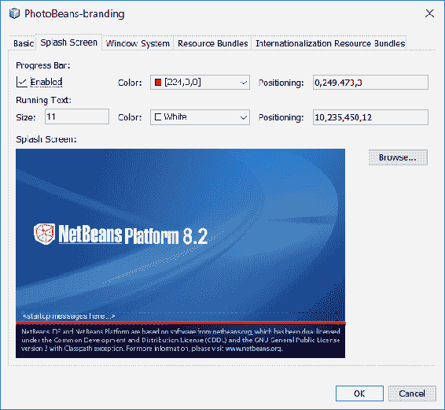

# 第二十六章：使用 PhotoBeans 进行照片管理

到目前为止，我们编写了库。我们编写了命令行工具。我们还使用 JavaFX 编写了 GUI。在本章中，我们将尝试一些完全不同的事情。我们将构建一个照片管理系统，这当然需要一个图形应用程序，但我们将采取不同的方法。而不是使用纯 JavaFX 从头开始构建一切，我们将使用现有的应用程序框架。这个框架就是 NetBeans **富客户端平台**（**RCP**），这是一个成熟、稳定且强大的框架，不仅为我们在使用的 NetBeans IDE 提供动力，还为从石油和天然气到航空和太空的无数行业中的无数应用程序提供动力。

在本章中，我们将涵盖以下主题：

+   如何启动 NetBeans RCP 项目

+   如何将 JavaFX 集成到 NetBeans RCP 中

+   RCP 应用程序的基本要素，如节点、动作、查找、服务和 TopComponents

那么就不再多说了，让我们直接进入正题。

# 入门

可能你列表中排在最前面的问题就是，**我为什么要使用 NetBeans RCP**？在我们深入探讨应用程序的细节之前，让我们来回答这个非常合理的问题，并尝试理解我们为什么要以这种方式构建它。

当你开始研究 NetBeans 平台时，你首先会注意到的是模块化的强烈概念。鉴于 Java 模块系统是 Java 9 的一个突出特性，这可能会显得是一个小细节，但 NetBeans 将这个概念暴露给我们，使我们能够在应用层面进行操作，使得插件变得极其简单，同时也允许我们分块更新应用程序。

RCP 还提供了一个强大、经过良好测试的框架来处理窗口、菜单、动作、节点、服务和等等。如果我们像前几章中使用**纯**JavaFX 那样从头开始构建这个应用程序，我们就必须手动定义屏幕上的区域，然后手动处理窗口位置。有了 RCP，我们已经有了一个丰富的窗口规范，我们可以轻松地使用。它提供了诸如最大化/最小化窗口、滑动、分离和停靠窗口等功能。

RCP 还提供了一种对**节点**的强烈概念，这是在用户界面概念中对特定领域数据的封装，通常在应用程序左侧的树视图中看到，以及可以与这些节点（或菜单项）关联的动作来操作它们所代表的数据。再次强调，所有这些都可以在 JavaFX（或 Swing）中完成，但你必须自己编写所有这些功能。实际上，有一些开源框架提供这样做，例如 Canoo 的 Dolphin 平台([`www.dolphin-platform.io`](http://www.dolphin-platform.io/))，尽管它们都没有像 NetBeans RCP 那样经过多年的生产强化和测试，所以我们将保持关注点在这里。

# 启动项目

你如何创建 NetBeans RCP 项目将对整个项目的处理方式产生非常根本的影响。默认情况下，NetBeans 使用 Ant 作为所有 RCP 应用程序的构建系统。NetBeans 项目的大部分在线文档和博客条目通常也反映了这种偏好。我们一直在使用 Maven 进行其他所有项目，并且我们不会改变这一点。幸运的是，NetBeans 允许我们使用 Maven 创建 RCP 项目，这正是我们将要做的。


在新项目窗口中，我们选择 Maven，然后是 NetBeans 应用程序。在下一屏幕上，我们像往常一样配置项目，指定项目名称、photobeans、项目位置、包等。

当我们点击“下一步”时，我们将进入新项目向导的模块选项步骤。在此步骤中，我们配置 RCP 应用程序的一些基本方面。具体来说，我们需要指定我们将使用的 NetBeans API 版本，以及我们是否希望将 OSGi 打包作为依赖项，如以下截图所示：


在撰写本文时，最新平台版本是 RELEASE82。到 Java 9 发布时，我们可以合理地预期 NetBeans 9.0 和因此 RELEASE90 将会可用。我们希望使用可用的最新版本，但请注意，根据 NetBeans 项目的发布计划，它可能根本不是 9.0。对于允许 OSGi 打包作为依赖项的选项，我们可以安全地接受默认设置，尽管更改它不会给我们带来任何问题，如果需要，我们也可以轻松地稍后更改该值。

一旦创建项目，我们应该在项目窗口中看到三个新的条目：`PhotoBeans-parent`、`PhotoBeans-app` 和 `PhotoBeans-branding`。`-parent` 项目没有实际的交付物。像其他章节的`master`项目一样，这只是为了组织相关模块、协调依赖关系等。

# 为应用程序添加品牌

`-branding` 模块是我们定义应用程序品牌细节的地方。正如你可能已经猜到的，你可以通过右键单击品牌模块，并在内容菜单底部选择`Branding...`来访问这些品牌属性。这样做后，你会看到一个类似于这样的屏幕：


在此 preceding 标签页中，你可以设置或更改应用程序的名称，以及指定应用程序图标。

在启动屏幕标签页中，你可以配置，最重要的是，当应用程序加载时在启动屏幕上显示的图像。你还可以启用或禁用进度条，并设置进度条和启动信息的颜色、字体大小和位置：



目前对我们来说，唯一感兴趣的另一个标签页是“窗口系统”标签页。在这个标签页中，我们可以配置许多功能，例如窗口拖放、窗口滑动、关闭等：


很可能，默认设置对我们的目的来说是可接受的。然而，在你自己的 NetBeans RCP 应用程序中，这个屏幕可能要重要得多。

我们的主要兴趣是`-app`模块。这个模块将定义应用程序的所有依赖项，并将作为其入口点。然而，与我们在前几章中看到的 JavaFX 应用程序不同，我们不需要定义`public static void main`方法，因为 NetBeans 会为我们处理这个。实际上，`-app`模块根本不包含任何 Java 类，但应用程序可以立即运行，尽管它目前并没有做什么。我们现在将解决这个问题。

# NetBeans 模块

NetBeans 平台的一个优势是其模块化。如果你曾经使用过 NetBeans IDE 本身（比如在阅读本书之前），你会在使用插件时看到这种模块化的实际应用：每个 NetBeans 插件都由一个或多个模块组成。实际上，NetBeans 本身由许多模块组成。这就是 RCP 应用程序设计成这样工作的原因。它促进了解耦，使得扩展和升级应用程序变得更加简单。

通常接受的模式是将 API 类放在一个模块中，将实现放在另一个模块中。这使得 API 类可以被其他实现者重用，有助于通过隐藏私有类来强制低耦合，等等。然而，为了在我们学习平台时保持简单，我们将创建一个模块，该模块将提供所有核心功能。为此，我们在父项目下的“模块”节点上右键单击，并选择“创建新模块...”，如下面的截图所示：


一旦选择，你将看到“新建项目”窗口。在这里，你需要选择 Maven 类别，以及 NetBeans 模块项目类型，如下所示：


点击“下一步”将带你去到我们在本书中已经多次见过的“名称和位置”步骤。在这个面板上，我们将模块命名为`main`，设置包为`com.steeplesoft.photobeans.main`，并接受其他字段的默认设置。在下一个面板“模块选项”中，我们将确保 NetBeans 版本与之前选择的版本相同，然后点击“完成”。

# TopComponent - 标签页和窗口的类

我们现在有一个主要为空的模块。NetBeans 为我们创建了一些工件，但我们不需要担心这些，因为构建将为我们管理这些。不过，我们需要做的是创建我们的第一个 GUI 元素，这将是 NetBeans 称为 TopComponent 的东西。从 NetBeans Javadoc 中，网址为[`bits.netbeans.org/8.2/javadoc/`](http://bits.netbeans.org/8.2/javadoc/)，我们找到了以下定义：

可嵌入的视觉组件，将在 NetBeans 中显示。这是显示的基本单元--窗口不应直接创建，而应使用此类。顶级组件可能对应单个窗口，也可能是一个窗口中的标签页（例如）。它可以停靠或取消停靠，有选定的节点，提供操作等。

正如我们将看到的，这个类是 NetBeans RCP 应用程序的主要组件。它将持有并控制各种相关的用户界面元素。换句话说，它是用户界面组件层次结构中的顶层。要创建 TopComponent，我们可以通过在项目资源管理器树中右键单击现在为空的包，并选择“新建 | 窗口”来使用 NetBeans 向导。如果“窗口”不是选项，请选择“其他 | 模块开发 | 窗口”。

您现在应该看到以下基本设置窗口：


在前面的窗口中，我们有多个选项。我们正在创建一个将显示照片列表的窗口，因此一些合理的设置可能是选择以下选项：

+   应用程序启动时打开

+   关闭不允许

+   最大化不允许

这些选项看起来相当直接，但窗口位置是什么意思？与从头开始编写相比，使用 NetBeans RCP 的一个好处是，平台提供了一系列预定义的概念和功能，这样我们就不必担心它们。其中一个关注点是窗口定位和放置。NetBeans 用户界面规范（可在 NetBeans 网站上找到，网址为[`ui.netbeans.org/docs/ui/ws/ws_spec-netbeans_ide.html`](https://ui.netbeans.org/docs/ui/ws/ws_spec-netbeans_ide.html)）定义了以下区域：

+   **资源管理器：** 这用于提供对用户对象访问的所有窗口，通常在树浏览器中

+   **输出：** 默认情况下，这用于输出窗口和 VCS 输出窗口

+   **调试器：** 这用于所有调试窗口和其他需要水平布局的支持窗口

+   **调色板：** 这用于组件调色板窗口

+   **检查器：** 这用于组件检查器窗口

+   **属性：** 这用于属性窗口

+   **文档：** 这用于所有文档窗口

文档还提供了这个有用的插图：


规范页面有大量的附加信息，但这对现在来说应该足够了，可以让你开始。我们希望我们的照片列表显示在应用程序窗口的左侧，所以我们选择窗口位置的编辑器。点击下一步，我们配置组件的名称和图标。严格来说，我们不需要为 TopComponent 指定图标，所以我们可以在“类名前缀”中输入`PhotoList`，然后点击完成：


当你在这里点击完成时，NetBeans 会为你创建几个文件，尽管只有一个会在项目资源管理器树中显示，那就是`PhotoListTopComponent.java`。还有一个名为`PhotoListTopComponent.form`的文件，你需要了解它，尽管你永远不会直接编辑它。NetBeans 提供了一个非常棒的**WYSIWYG**（所见即所得）编辑器来构建你的用户界面。用户界面定义存储在`.form`文件中，它只是一个 XML 文件。当你进行更改时，NetBeans 会为你修改这个文件，并在名为`initComponents()`的方法中生成等效的 Java 代码。你还会注意到 NetBeans 不会允许你修改这个方法。当然，你可以使用另一个编辑器来这样做，但如果你在 GUI 编辑器中进行更改，那么你通过这种方式所做的任何更改都将丢失，所以最好还是不要修改这个方法。TopComponent 的其他部分看起来是什么样子？

```java
    @ConvertAsProperties( 
      dtd = "-//com.steeplesoft.photobeans.main//PhotoList//EN", 
      autostore = false 
    ) 
    @TopComponent.Description( 
      preferredID = "PhotoListTopComponent", 
      //iconBase="SET/PATH/TO/ICON/HERE", 
      persistenceType = TopComponent.PERSISTENCE_ALWAYS 
    ) 
    @TopComponent.Registration(mode = "editor",
     openAtStartup = true) 
    @ActionID(category = "Window", id =  
      "com.steeplesoft.photobeans.main.PhotoListTopComponent") 
    @ActionReference(path = "Menu/Window" /*, position = 333 */) 
    @TopComponent.OpenActionRegistration( 
      displayName = "#CTL_PhotoListAction", 
      preferredID = "PhotoListTopComponent" 
    ) 
    @Messages({ 
      "CTL_PhotoListAction=PhotoList", 
      "CTL_PhotoListTopComponent=PhotoList Window", 
      "HINT_PhotoListTopComponent=This is a PhotoList window" 
    }) 
    public final class PhotoListTopComponent 
     extends TopComponent { 
```

这有很多注解，但也是一个很好的提醒，说明 NetBeans 平台为你做了多少工作。在构建过程中，这些注解被处理以创建平台在运行时用于配置和连接你的应用程序的元数据。

一些亮点如下：

```java
    @TopComponent.Registration(mode = "editor",
      openAtStartup = true) 
```

这注册了我们的`TopComponent`，并反映了我们放置它的位置和打开它的时间的选择。

我们还有一些国际化本地化工作正在进行，如下所示：

```java
    @ActionID(category = "Window", id =  
      "com.steeplesoft.photobeans.main.PhotoListTopComponent") 
    @ActionReference(path = "Menu/Window" /*, position = 333 */) 
    @TopComponent.OpenActionRegistration( 
      displayName = "#CTL_PhotoListAction", 
      preferredID = "PhotoListTopComponent" 
    ) 
    @Messages({ 
      "CTL_PhotoListAction=PhotoList", 
      "CTL_PhotoListTopComponent=PhotoList Window", 
      "HINT_PhotoListTopComponent=This is a PhotoList window" 
    }) 
```

不深入细节，以免混淆，前三个注解注册了一个打开动作，并暴露了应用程序`Window`菜单中的一个项目。最后一个注解`@Messages`用于定义本地化键和字符串。当这个类编译时，在同一个包中创建了一个名为`Bundle`的类，它使用指定的键定义方法来返回本地化字符串。例如，对于`CTL_PhotoListAction`，我们得到以下：

```java
    static String CTL_PhotoListAction() { 
      return org.openide.util.NbBundle.getMessage(Bundle.class,  
        "CTL_PhotoListAction"); 
    } 
```

以下代码在标准的 Java `.properties`文件中查找用于本地化消息的键。这些键/值对与 NetBeans 向导为我们生成的`Bundle.properties`文件中的任何条目合并。

我们`TopComponent`的以下构造函数也很有趣：

```java
    public PhotoListTopComponent() { 
      initComponents(); 
      setName(Bundle.CTL_PhotoListTopComponent()); 
      setToolTipText(Bundle.HINT_PhotoListTopComponent()); 
      putClientProperty(TopComponent.PROP_CLOSING_DISABLED,  
       Boolean.TRUE); 
      putClientProperty(TopComponent.PROP_MAXIMIZATION_DISABLED,  
       Boolean.TRUE); 
    } 
```

在前面的构造函数中，我们可以看到组件的名称和工具提示是如何设置的，以及我们的窗口相关选项设置在哪里。

如果我们现在运行我们的应用程序，我们不会看到任何变化。那么，我们需要做的是将`main`模块的依赖项添加到应用程序中。我们通过在应用程序模块的“依赖项”节点上右键单击来完成此操作，如图所示：


你现在应该能看到“添加依赖”窗口。选择“打开项目”选项卡，然后选择如图所示的`main`：


一旦我们添加了依赖项，我们需要构建这两个模块，首先是`main`，然后是`app`，然后我们就可以第一次运行 PhotoBeans 了：


注意到前面屏幕窗口标题中的奇怪日期吗？那是 NetBeans 平台的构建日期，在我们的应用程序中看起来并不美观，所以，让我们来修复它。我们有两种选择。第一种是使用我们之前查看的品牌用户界面。另一种是直接编辑文件。为了保持事情有趣，并帮助理解磁盘上的位置，我们将使用第二种方法。

在品牌模块中，在“其他来源”|“nbm-branding”下，你应该能找到`modules/org-netbeans-core-windows.jar/org/netbeans/core/windows/view/ui/Bundle.properties`文件。在这个文件中，你应该能看到以下几行：

```java
    CTL_MainWindow_Title=PhotoBeans {0} 
    CTL_MainWindow_Title_No_Project=PhotoBeans {0} 
```

我们需要做的就是移除`{0}`部分，重新构建此模块和应用程序，我们的标题栏就会变得更加美观。虽然这样看起来更好，但我们的 TopComponent 怎么办？为了修复它，我们需要学习一些新的概念。

# 节点，NetBeans 演示对象

你已经听说过“节点”这个词。我已经多次用它来描述点击什么和在哪里点击。正式来说，节点代表对象（bean）层次结构中的一个元素。它提供了在探索视图和 bean 之间进行通信所需的所有方法。在我们的应用程序的探索部分，我们希望向用户展示照片列表。我们将每个照片以及它被拍摄的年份和月份表示为一个节点。为了显示这些节点，我们将使用一个名为`BeanTreeView`的 NetBeans 类，它将以树的形式显示这个节点层次结构。还有更多概念需要学习，但让我们先从我们已有的开始。

我们将从定义我们的节点开始，这些节点将作为我们应用程序的业务领域模型和 NetBeans API 之间的一种包装器或桥梁。当然，我们还没有定义这样的模型，所以我们需要现在确定它。我们的基本数据项是一张照片，一个存储图像的磁盘文件。在应用程序中，我们将以嵌套的树结构显示这些照片，按年份分组，然后按月份。如果你展开一个年份节点，你会看到一个月份节点列表，如果你展开一个月份节点，你会看到一个照片节点列表。这是一个非常基础、有些天真的数据模型，但它既足够有效以展示概念，又足够简单，以至于我们不会掩盖概念。

正如所有层次结构一样，我们需要一个根节点，所以我们将从这里开始：

```java
    public class RootNode extends AbstractNode 
```

所有节点的基类在技术上来说是 Node，但扩展该类给我们带来了更大的负担，因此我们使用 NetBeans 提供的`AbstractNode`，它为我们实现了一部分节点的基本行为，并提供了合理的默认值。

接下来，我们定义了一些构造函数，如下所示：

```java
    public RootNode() { 
      this(new InstanceContent()); 
    } 

    protected RootNode(InstanceContent ic) { 
      super(Children.create(new YearChildFactory(), true), 
       new AbstractLookup(ic)); 
      setDisplayName(Bundle.LBL_RootNode()); 
      setShortDescription(Bundle.HINT_RootNode()); 

      instanceContent = ic; 
    } 
```

注意，我们有两个构造函数，一个是`public`的，另一个是`protected`的。之所以这样，是因为我们想要创建和捕获一个`InstanceContent`的实例，这个实例可以被我们，即这个类 Lookup 的创建者，用来控制实际上在 lookup 中的内容。由于我们需要将`Lookup`传递给我们的类的父构造函数，所以我们采用了这种两步对象实例化的方法。

# Lookup，NetBeans 的基本组成部分

什么是 Lookup？它是一个**通用注册表，允许客户端查找服务实例（给定接口的实现）**。换句话说，它是一种机制，我们可以通过它发布各种工件，而系统的其他部分可以通过键（可以是`Class`或`Lookup.Template`，这里我们不讨论）查找这些工件，而模块之间没有耦合。

如我们所见，这通常用于查找服务接口的实现。你还记得我之前提到过，我们经常看到 API 在一个模块中定义，实现却在另一个模块中吗？这正是这种做法特别有用之处。假设你正在开发一个用于从在线服务检索照片的 API（这对这个应用程序来说将是一个很棒的功能！）。你计划为一种服务提供实现，比如 Google Photos，但希望第三方开发者能够为 Flickr 提供实现。如果你将所需的 API 接口、类等放在一个模块中，而将 Google Photos 的实现放在另一个模块中，第三方开发者就可以仅依赖于你的 API 模块，避免你的实现模块的负担。Flickr 模块将声明对照片服务 API 的实现，我们可以通过向 Lookup 发送请求来加载这两个实现。简而言之，该系统允许以非常干净、简单的方式解耦 API 定义、实现和实例获取。

那是 Lookup，但`InstanceContent`是什么？Lookup API 只公开了获取项的方法。没有将项添加到 Lookup 的机制，这是有道理的，因为 Lookup 实例被未知第三方使用，我们不希望他们随机更改 Lookup 的内容。然而，我们实际上可能想要更改这些内容，我们通过`InstanceContent`来实现，它公开了我们需要添加或删除项的方法。我们将在应用程序的后面部分看到这个概念的演示。

# 编写我们自己的节点

前一节介绍了这两个类，但`YearChildFactory`是什么？`RootNode`类为系统定义了将成为我们树根的根节点。然而，每个节点（如果它有子节点），都要负责加载和构建这些子节点，这是通过这个`ChildFactory`类来完成的。我们的实例看起来是这样的：

```java
    public class YearChildFactory extends ChildFactory<String> { 
      private final PhotoManager photoManager; 
      private static final Logger LOGGER =  
        Logger.getLogger(YearChildFactory.class.getName()); 
      public YearChildFactory() { 
        this.photoManager =  
          Lookup.getDefault().lookup(PhotoManager.class); 
        if (photoManager == null) { 
          LOGGER.log(Level.SEVERE,  
          "Cannot get PhotoManager object"); 
          LifecycleManager.getDefault().exit(); 
        } 
      } 

      @Override 
      protected boolean createKeys(List<String> list) { 
        list.addAll(photoManager.getYears()); 
        return true; 
      } 

      @Override 
      protected Node createNodeForKey(String key) { 
        return new YearNode(Integer.parseInt(key)); 
      } 
    } 
```

我们正在创建一个`ChildFactory`接口，该接口将返回操作字符串的节点。如果你有一个更复杂的数据模型，例如使用 POJOs 的模型，你将指定该类作为参数化类型。

在我们的构造函数中，我们看到通过 Lookup 找到服务实现的一个例子，这是这样的：

```java
    this.photoManager=Lookup.getDefault().lookup(
      PhotoManager.class); 
```

我们将在稍后定义服务，但，现在你需要理解的是，我们正在请求全局 Lookup（与之前创建的 Lookup 不同，它不绑定到特定类）的`PhotoManager`接口实例。也许有些天真，我们假设只有一个这样的接口实例，但由于我们没有导出接口，我们的假设是安全的。然而，我们确实检查了至少有一个实例，如果没有，则退出应用程序。

接下来的两个方法是如何使用工厂来创建子节点的。第一个方法`createKeys(List<String> list)`是由系统调用来生成子节点键列表的。在我们的实现中，我们向`PhotoManager`接口请求年份列表（正如我们将看到的，这是一个简单的数据库查询，以获取系统中照片的年份列表）。然后平台将这些键逐个传递给`createNodeForKey(String key)`来创建实际的节点。在这里，我们创建了一个`YearNode`实例来表示年份。

`YearNode`，像`RootNode`一样，扩展了`AbstractNode`。

```java
    public class YearNode extends AbstractNode { 
      public YearNode(int year) { 
        super(Children.create(new MonthNodeFactory(year), true),  
         Lookups.singleton(year)); 
        setName("" + year); 
        setDisplayName("" + year); 
      } 
    } 
```

前面的确实是更简单的节点，但基本原理是相同的--我们创建`ChildFactory`来创建我们的子节点，并创建一个 Lookup，在这个例子中，它持有一个单一值，即节点所代表的年份。

`MonthNodeFactory`几乎与`YearNodeFactory`完全相同，除了它为给定的年份加载月份，所以我们在这里不展示源代码。它还为列表中的每个月份创建`MonthNode`实例。像`YearNode`一样，`MonthNode`相当简单，如下面的代码片段所示：

```java
    public class MonthNode extends AbstractNode { 
      public MonthNode(int year, int month) { 
        super(Children.create( 
          new PhotoNodeFactory(year, month), true),  
           Lookups.singleton(month)); 
          String display = month + " - " +  
           Month.values()[month-1].getDisplayName( 
             TextStyle.FULL, Locale.getDefault()); 
          setName(display); 
          setDisplayName(display); 
      } 
    } 
```

我们做了一些额外的工作来给节点一个有意义的名称和显示名称，但基本上是相同的。注意，我们还有一个`ChildFactory`，正如其名所示，将生成我们需要作为子节点的 PhotoNodes。工厂本身没有什么新奇的，但`PhotoNode`有，所以让我们看看：

```java
    public class PhotoNode extends AbstractNode { 
      public PhotoNode(String photo) { 
        this(photo, new InstanceContent()); 
    } 

    private PhotoNode(String photo, InstanceContent ic) { 
      super(Children.LEAF, new AbstractLookup(ic)); 
      final String name = new File(photo).getName(); 
      setName(name); 
      setDisplayName(name); 

      ic.add((OpenCookie) () -> { 
        TopComponent tc = findTopComponent(photo); 
        if (tc == null) { 
          tc = new PhotoViewerTopComponent(photo); 
          tc.open(); 
        } 
        tc.requestActive(); 
      }); 
    } 
```

在这里，我们再次看到双重构造方法，尽管在这种情况下，我们确实使用了`InstanceContent`。注意，`super()`的第一个参数是`Children.LEAF`，表示这个节点没有子节点。我们还传递了现在熟悉的`new AbstractLookup(ic)`。

在设置名称和显示名称之后，我们在 `InstanceContent` 对象中添加了一个 lambda 表达式。这个 lambda 表达式的非 lambda 版本看起来像这样：

```java
    ic.add(new OpenCookie() { 
      @Override 
      public void open() { 
      } 
    }); 
```

什么是 `OpenCookie`？它是标记接口 `Node.Cookie` 的子类，而 cookie 是 **一种用于向现有数据对象和节点添加行为，或将实现与主要对象分离的设计模式**。使用这个 cookie，我们可以优雅地抽象出表示某物可以打开以及如何打开它的信号。

在这种情况下，当系统尝试打开节点表示的图片时，它将调用我们定义的 `OpenCookie.open()`，这将尝试找到打开的图片实例。无论它找到现有的实例还是需要创建一个新的实例，它都会指示系统使其活动（或给予它焦点）。

注意，打开的图片由另一个 TopComponent 表示。为了找到它，我们有这个方法：

```java
    private TopComponent findTopComponent(String photo) { 
      Set<TopComponent> openTopComponents =  
        WindowManager.getDefault().getRegistry().getOpened(); 
      for (TopComponent tc : openTopComponents) { 
        if (photo.equals(tc.getLookup().lookup(String.class))) { 
          return tc; 
        } 
      } 
      return null; 
    } 
```

我们向 `WindowManager` 的 Lookup 请求所有打开的 TopComponent，然后遍历每个组件，比较 `String photo`，即图像的完整路径，与 TopComponent Lookup 中存储的任何 `String`。如果匹配，我们返回该 TopComponent。这种通过 `String` 的查找方法虽然有些简单，但在更复杂的应用中可能会导致意外的匹配。在这个应用中我们可能足够安全，但你需要确保在自己的应用中匹配标准严格且唯一，以避免错误匹配。

# 执行操作

我们稍后将查看 `PhotoViewerTopComponent`，但在继续之前，我们还需要查看一些其他项目。

`PhotoNode` 覆盖了两个额外的方法，具体如下：

```java
    @Override 
    public Action[] getActions(boolean context) { 
      return new Action[]{SystemAction.get(OpenAction.class)}; 
    } 

    @Override 
    public Action getPreferredAction() { 
      return SystemAction.get(OpenAction.class); 
    } 
```

不足为奇，`getActions()` 方法返回一个包含该节点动作的数组。动作是一种抽象（来自 Swing，而非 NetBeans），它允许我们向菜单中添加项目，并为用户提供与系统交互的手段。主菜单或上下文菜单中的每个条目都由一个动作支持。在我们的例子中，我们将 NetBeans 定义的 `OpenAction` 与我们的节点关联，当点击时，将在节点的 Lookup 中查找 `OpenCookie` 实例并调用我们之前定义的 `OpenCookie.open()`。

我们还覆盖了 `getPreferredAction()` 方法，这让我们可以定义当节点被双击时的行为。这两个方法的组合使得用户可以通过右键单击节点并选择“打开”，或者双击节点，最终结果是打开该节点的 TopComponent。

# 服务 - 暴露解耦的功能

在查看我们的 `TopComponent` 定义之前，让我们先看看 `PhotoManager`，并了解一下它的服务。`PhotoManager` 接口本身相当简单：

```java
    public interface PhotoManager extends Lookup.Provider { 
      void scanSourceDirs(); 
      List<String> getYears(); 
      List<String> getMonths(int year); 
      List<String> getPhotos(int year, int month); 
    } 
```

在前面的代码中，除了`extends Lookup.Provider`部分外，没有太多有趣的内容。在这里添加它，我们可以强制实现该接口上的唯一方法，因为我们需要在以后使用它。有趣的部分来自实现，如下所示：

```java
    @ServiceProvider(service = PhotoManager.class) 
    public class PhotoManagerImpl implements PhotoManager { 
```

注册服务到平台所需的就是这些。注解指定了所需的元数据，构建过程会处理其余部分。让我们看看其余的实现：

```java
    public PhotoManagerImpl() throws ClassNotFoundException { 
      setupDatabase(); 

      Preferences prefs =  
        NbPreferences.forModule(PhotoManager.class); 
      setSourceDirs(prefs.get("sourceDirs", "")); 
      prefs.addPreferenceChangeListener(evt -> { 
        if (evt.getKey().equals("sourceDirs")) { 
          setSourceDirs(evt.getNewValue()); 
          scanSourceDirs(); 
        } 
      }); 

      instanceContent = new InstanceContent(); 
      lookup = new AbstractLookup(instanceContent); 
      scanSourceDirs(); 
    } 
```

在这个非常简单的实现中，我们将使用 SQLite 来存储我们找到的照片信息。该服务将提供扫描配置的源目录、存储找到的照片信息以及公开检索这些信息片段的方法。

首先，我们需要确保如果这是应用程序第一次运行，数据库已经正确设置。我们可以包含一个预构建的数据库，但在用户的机器上创建它为那些意外删除数据库的情况增加了一丝弹性。

```java
    private void setupDatabase() { 
      try { 
       connection = DriverManager.getConnection(JDBC_URL); 
       if (!doesTableExist()) { 
         createTable(); 
       } 
      } catch (SQLException ex) { 
        Exceptions.printStackTrace(ex); 
      } 
    } 

    private boolean doesTableExist() { 
      try (Statement stmt = connection.createStatement()) { 
        ResultSet rs = stmt.executeQuery("select 1 from images"); 
        rs.close(); 
        return true; 
      } catch (SQLException e) { 
        return false; 
      } 
    } 

    private void createTable() { 
      try (Statement stmt = connection.createStatement()) { 
        stmt.execute( 
          "CREATE TABLE images (imageSource VARCHAR2(4096), " 
          + " year int, month int, image VARCHAR2(4096));"); 
          stmt.execute( 
            "CREATE UNIQUE INDEX uniq_img ON images(image);"); 
      } catch (SQLException e) { 
        Exceptions.printStackTrace(e); 
      } 
    } 
```

接下来，我们请求模块`PhotoManager`的 NetBeans 首选项引用。我们将在本章的后面部分讨论首选项管理，但现在我们只能说，我们将请求系统的`sourceDirs`首选项，然后我们将使用它来配置我们的扫描代码。

我们还创建了`PreferenceChangeListener`来捕捉用户更改首选项的情况。在这个监听器中，我们验证我们关心的首选项`sourceDirs`是否已更改，如果是，我们将新值存储在我们的`PhotoManager`实例中，并启动目录扫描。

最后，我们创建`InstanceContent`，创建并存储一个查找，并启动目录扫描以确保应用程序与磁盘上照片的状态保持最新。

`getYears()`、`getMonths()`和`getPhotos()`方法在很大程度上是相同的，只是在处理的数据类型上有所不同，因此我们将`getYears()`作为这三个方法的解释：

```java
    @Override 
    public List<String> getYears() { 
      List<String> years = new ArrayList<>(); 
      try (Statement yearStmt = connection.createStatement(); 
      ResultSet rs = yearStmt.executeQuery( 
        "SELECT DISTINCT year FROM images ORDER BY year")) { 
          while (rs.next()) { 
            years.add(rs.getString(1)); 
          } 
        } catch (SQLException ex) { 
          Exceptions.printStackTrace(ex); 
        } 
      return years; 
    } 
```

如果你熟悉 JDBC，这应该不会让你感到惊讶。我们使用 Java 7 的`try-with-resources`语法来声明和实例化我们的`Statement`和`ResultSet`对象。对于那些不熟悉这个结构的人来说，它允许我们声明某些类型的资源，并且不必担心关闭它们，因为系统会在`try`的作用域结束时自动为我们关闭它们。然而，需要注意的是，类必须实现`AutoCloseable`；`Closeable`将不起作用。其他两个`get*`方法在逻辑上是相似的，所以这里没有展示。

这里最后的主要功能是扫描源目录，这由`scanSourceDirs()`方法协调，如下所示：

```java
    private final ExecutorService executorService =  
      Executors.newFixedThreadPool(5); 
    public final void scanSourceDirs() { 
      RequestProcessor.getDefault().execute(() -> { 
        List<Future<List<Photo>>> futures = new ArrayList<>(); 
        sourceDirs.stream() 
         .map(d -> new SourceDirScanner(d)) 
         .forEach(sds ->  
          futures.add((Future<List<Photo>>)  
          executorService.submit(sds))); 
        futures.forEach(f -> { 
          try { 
            final List<Photo> list = f.get(); 
            processPhotos(list); 
          } catch (InterruptedException|ExecutionException ex) { 
            Exceptions.printStackTrace(ex); 
          } 
        }); 
        instanceContent.add(new ReloadCookie()); 
      }); 
    } 
```

为了加快处理过程，我们为每个配置的源目录创建一个 Future，并将其传递给我们的`ExecutorService`。我们在池中将其配置为最多五个线程，这基本上是随意的。一个更复杂的方法可能会使这可配置，或者可能是自动调整的，但这应该足以满足我们的需求。

一旦创建了 Futures，我们就遍历列表，请求每个结果。如果源目录的数量超过线程池的大小，额外的 Futures 将等待直到有线程可用，此时`ExecutorService`将选择一个来运行。一旦它们都完成了，对`.get()`的调用将不再阻塞，应用程序可以继续。请注意，我们没有阻塞用户界面以允许这样做，因为我们把大部分这个方法作为 lambda 传递给`RequestProcessor.getDefault().execute()`，以请求在用户界面线程上运行。

当照片列表构建并返回后，我们使用此方法处理这些照片：

```java
    private void processPhotos(List<Photo> photos) { 
      photos.stream() 
       .filter(p -> !isImageRecorded(p)) 
       .forEach(p -> insertImage(p)); 
    } 
```

`isImageRecorded()`方法检查图像路径是否已经在数据库中，如果是，则返回 true。我们根据这个测试的结果`filter()`流，所以`forEach()`只对之前未知的图像操作，然后通过`insertImage()`将它们插入到数据库中。这两个方法看起来是这样的：

```java
    private boolean isImageRecorded(Photo photo) { 
      boolean there = false; 
      try (PreparedStatement imageExistStatement =  
        connection.prepareStatement( 
          "SELECT 1 FROM images WHERE image = ?")) { 
            imageExistStatement.setString(1, photo.getImage()); 
            final ResultSet rs = imageExistStatement.executeQuery(); 
            there = rs.next(); 
            close(rs); 
          } catch (SQLException ex) { 
            Exceptions.printStackTrace(ex); 
          } 
      return there; 
    } 

    private void insertImage(Photo photo) { 
      try (PreparedStatement insertStatement =  
       connection.prepareStatement( 
         "INSERT INTO images (imageSource, year, month, image)
          VALUES (?, ?, ?, ?);")) { 
            insertStatement.setString(1, photo.getSourceDir()); 
            insertStatement.setInt(2, photo.getYear()); 
            insertStatement.setInt(3, photo.getMonth()); 
            insertStatement.setString(4, photo.getImage()); 
            insertStatement.executeUpdate(); 
       } catch (SQLException ex) { 
         Exceptions.printStackTrace(ex); 
       } 
    } 
```

我们正在使用`PreparedStatement`，因为通常通过连接创建 SQL 语句是不明智的，这可能导致，并且经常导致 SQL 注入攻击，所以我们不能在第一个方法中完全使用`try-with-resources`，这需要我们手动关闭`ResultSet`。

# PhotoViewerTopComponent

我们现在可以找到图像，但我们仍然不知道系统在哪里查找。在将注意力转向使用 NetBeans 平台处理首选项之前，我们还有一个 TopComponent 要查看--`PhotoViewerTopComponent`。

如果你回顾一下我们对 NetBeans 窗口系统提供的区域进行的讨论，当我们查看图像时，我们希望图像在`Editor`区域加载。为了创建一个 TopComponent，我们指示 NetBeans 通过在所需的包上右键单击并选择“新建 | 窗口”来创建一个新`Window`：


在下一个面板中，我们为我们的新 TopComponent 指定一个类名前缀--如以下截图所示的`PhotoViewer`：


NetBeans 现在将创建`PhotoViewerTopComponent.java`和`PhotoViewerTopComponent.form`文件，正如之前讨论的那样。然而，对于这个 TopComponent，我们需要做一些更改。当我们打开`Window`时，我们需要指定一个图像让它加载，因此我们需要提供一个接受图像路径的构造函数。但是，TopComponents 必须有一个无参构造函数，所以我们保留它，但让它调用我们的新构造函数，并使用空图像路径。

```java
    public PhotoViewerTopComponent() { 
      this(""); 
    } 

    public PhotoViewerTopComponent(String photo) { 
      initComponents(); 
      this.photo = photo; 
      File file = new File(photo); 
      setName(file.getName()); 
      setToolTipText(photo); 
      associateLookup(Lookups.singleton(photo)); 
      setLayout(new BorderLayout()); 
      init(); 
    } 
```

虽然步骤看起来可能很多，但这些步骤很简单：我们将照片路径保存在一个实例变量中，我们从中创建一个`File`实例以更容易地获取文件名，将照片路径添加到 TopComponent 的 Lookup（这是我们找到给定照片的 TopComponent 的方式），更改布局，然后初始化窗口。

# 将 JavaFX 与 NetBeans RCP 集成

虽然`init()`方法很有趣，因为我们将要做一些稍微不同的事情；我们将使用 JavaFX 来查看图片。我们没有理由不能像我们在其他 TopComponent 中那样使用 Swing，但这也为我们提供了一个很好的机会来展示如何集成 JavaFX 和 Swing，以及 JavaFX 和 NetBeans 平台。

```java
    private JFXPanel fxPanel; 
    private void init() { 
      fxPanel = new JFXPanel(); 
      add(fxPanel, BorderLayout.CENTER); 
      Platform.setImplicitExit(false); 
      Platform.runLater(this::createScene); 
    } 
```

`JFXPanel`是一个用于将 JavaFX 嵌入 Swing 的 Swing 组件。我们的窗口布局是`BorderLayout`，所以我们将其添加到`CENTER`区域，并让它填充整个`Window`。JavaFX 组件的任何复杂布局都将由我们`JFXPanel`内的另一个容器处理。然而，我们的用户界面相当简单。就像我们之前的 JavaFX 系统一样，我们通过以下方式定义我们的用户界面：

```java
    <BorderPane fx:id="borderPane" prefHeight="480.0"  
      prefWidth="600.0"  

      fx:controller= 
        "com.steeplesoft.photobeans.main.PhotoViewerController"> 
      <center> 
        <ScrollPane fx:id="scrollPane"> 
          <content> 
            <Group> 
              <children> 
                <ImageView fx:id="imageView"  
                  preserveRatio="true" /> 
              </children> 
            </Group> 
          </content> 
        </ScrollPane> 
      </center> 
    </BorderPane> 
```

由于 FXML 需要一个根元素，我们指定了一个`BorderLayout`，正如讨论的那样，这在我们位于`BorderLayout`中的`JFXPanel`中提供了一个`BorderLayout`。这听起来可能真的很奇怪，但这就是嵌入 JavaFX 的方式。注意，我们仍然指定了一个控制器。在这个控制器中，我们的`initialize()`方法看起来是这样的：

```java
    @FXML 
    private BorderPane borderPane; 
    @FXML 
    private ScrollPane scrollPane; 
    public void initialize(URL location,
     ResourceBundle resources) { 
       imageView.fitWidthProperty() 
        .bind(borderPane.widthProperty()); 
       imageView.fitHeightProperty() 
        .bind(borderPane.heightProperty()); 
    } 
```

在这个最后的方法中，我们只是在将宽度和高度属性绑定到边框面板的属性上。我们还在 FXML 中将`preserveRatio`设置为`True`，所以图片不会变形。当我们接下来旋转图片时，这将非常重要。

我们还没有看到旋转的代码，所以现在让我们看看。我们将首先添加一个按钮，如下所示：

```java
    <top> 
      <ButtonBar prefHeight="40.0" prefWidth="200.0"  
         BorderPane.alignment="CENTER"> 
         <buttons> 
           <SplitMenuButton mnemonicParsing="false" 
             text="Rotate"> 
              <items> 
                <MenuItem onAction="#rotateLeft"  
                  text="Left 90°" /> 
                <MenuItem onAction="#rotateRight"  
                  text="Right 90°" /> 
              </items> 
            </SplitMenuButton> 
         </buttons> 
      </ButtonBar> 
    </top> 
```

我们将`ButtonBar`添加到`BorderPane`的`top`部分，然后向其中添加一个单独的`SplitMenuButton`。这给了我们一个像右边那样的按钮。在其非聚焦状态下，它看起来像一个正常的按钮。当用户点击箭头时，就像这里看到的那样，菜单会呈现给用户，提供旋转图片在列出的方向上的能力：


我们已经将那些菜单项绑定到我们的 FXML 定义中控制器的相应方法：

```java
    @FXML 
    public void rotateLeft(ActionEvent event) { 
      imageView.setRotate(imageView.getRotate() - 90); 
    } 
    @FXML 
    public void rotateRight(ActionEvent event) { 
      imageView.setRotate(imageView.getRotate() + 90); 
    } 
```

使用 JavaFX `ImageView`提供的 API，我们设置了图片的旋转。

我们可以找到图片，查看它们，并旋转它们，但我们仍然无法告诉系统在哪里寻找这些图片。是时候解决这个问题了。

# NetBeans 首选项和选项面板

管理首选项的关键有两点：`NbPreferences`和选项面板。`NbPreferences`是存储和加载首选项的手段，而选项面板是向用户提供编辑这些首选项的用户界面的手段。我们将首先查看如何添加选项面板，这将自然地引出对`NbPreferences`的讨论。接下来是 NetBeans 选项窗口：


在前面的窗口中，我们可以看到两种类型的选项面板——主选项面板和二级选项面板。主选项面板由顶部的图标表示：常规、编辑器、字体和颜色等。二级选项面板类似于我们在中间部分看到的标签：差异、文件、输出和终端。当添加选项面板时，您必须选择主选项面板或二级选项面板。我们希望添加一个新的主选项面板，因为它不仅可以从视觉上区分我们的首选项与其他面板，还给我们一个机会创建两种类型的面板。

# 添加主面板

要创建一个主选项面板，在所需的包或项目节点上右键单击，然后点击新建 | 选项面板。如果选项面板不可见，请选择新建 | 其他 | 模块开发 | 选项面板。接下来，选择创建主面板：


我们必须指定一个标签，这是我们将在图标下看到的文本。我们还必须选择一个图标。系统将允许您选择除 32x32 图像之外的内容，但如果它的大小不正确，它将在用户界面中看起来很奇怪；因此，请仔细选择。系统还将要求您输入关键词，如果用户在选项窗口中应用过滤器，将使用这些关键词。最后，选择允许二级面板。主面板没有任何实际内容，仅用于显示我们即将创建的二级面板。

当您点击下一步时，您将被要求输入类前缀和包：


当您点击完成时，NetBeans 将创建此单个文件，`package-info.java`：

```java
    @OptionsPanelController.ContainerRegistration(id = "PhotoBeans", 
      categoryName = "#OptionsCategory_Name_PhotoBeans",  
      iconBase = "com/steeplesoft/photobeans/main/options/
       camera-icon-32x32.png",  
       keywords = "#OptionsCategory_Keywords_PhotoBeans",  
       keywordsCategory = "PhotoBeans") 
    @NbBundle.Messages(value = { 
      "OptionsCategory_Name_PhotoBeans=PhotoBeans",  
      "OptionsCategory_Keywords_PhotoBeans=photo"}) 
    package com.steeplesoft.photobeans.main.options; 

    import org.netbeans.spi.options.OptionsPanelController; 
    import org.openide.util.NbBundle; 
```

# 添加二级面板

在定义了主选项面板后，我们准备创建二级面板，它将执行我们的工作。我们再次在包上右键单击，并选择新建 | 选项面板，这次选择创建二级面板：


由于我们已经定义了自己的主选项面板，我们可以选择它作为父面板，并设置标题和关键词，就像之前做的那样。点击下一步，选择并/或验证类前缀和包，然后点击完成。这将创建三个工件——`SourceDirectoriesOptionPanelController.java`、`SourceDirectoriesPanel.java`和`SourceDirectoriesPanel.form`，NetBeans 将向您展示您的面板的 GUI 编辑器。

我们想在面板中添加四个元素——一个标签、一个列表视图和两个按钮。我们通过从右侧的调色板拖动它们并将它们按照下面的形式排列来实现这一点：


为了使与这些用户界面元素一起工作更有意义，我们需要设置变量名。我们还需要设置用户界面的文本，以便每个元素对用户都有意义。我们可以通过在每个元素上右键单击来实现这两点，如以下截图所示：


在前面的屏幕中，我们可以看到三个感兴趣的项目——编辑文本、更改变量名...和事件 | 操作 | actionPeformed [buttonAddActionPerformed]。对于我们的按钮，我们需要使用所有三个，所以我们设置文本为`添加`（或`删除`），更改变量名为`buttonAdd`/`buttonRemove`，并选择`actionPerformed`。回到我们的 Java 源代码中，我们看到为我们创建了一个方法，我们需要填写它：

```java
    private void buttonAddActionPerformed(ActionEvent evt) {                                               
      String lastDir = NbPreferences 
       .forModule(PhotoManager.class).get("lastDir", null); 
      JFileChooser chooser = new JFileChooser(); 
      if (lastDir != null) { 
        chooser.setCurrentDirectory( 
          new java.io.File(lastDir)); 
      } 
      chooser.setDialogTitle("Add Source Directory"); 
      chooser.setFileSelectionMode(
        JFileChooser.DIRECTORIES_ONLY); 
      chooser.setAcceptAllFileFilterUsed(false); 
      if (chooser.showOpenDialog(null) ==  
        JFileChooser.APPROVE_OPTION) { 
          try { 
            String dir = chooser.getSelectedFile() 
            .getCanonicalPath(); 
            ensureModel().addElement(dir); 
            NbPreferences.forModule(PhotoManager.class) 
            .put("lastDir", dir); 
          } catch (IOException ex) { 
              Exceptions.printStackTrace(ex); 
            } 
        } else { 
            System.out.println("No Selection "); 
          } 
    } 
```

这里有很多事情在进行中：

1.  我们首先检索`lastDir`首选项值。如果已设置，我们将使用它作为选择要添加的目录的起点。通常，至少在我的经验中，感兴趣的目录在文件系统中通常彼此很近，所以我们使用这个首选项来节省用户一些点击。

1.  接下来我们创建`JFileChooser`，这是 Swing 类，它将允许我们选择目录。

1.  如果`lastDir`不为空，我们将其传递给`setCurrentDirectory()`。

1.  我们将对话框的标题设置为有意义的名称。

1.  我们指定对话框应只允许我们选择目录。

1.  最后，我们禁用“全选”文件过滤器选项。

1.  我们调用`chooser.showOpenDialog()`向用户展示对话框，并等待其关闭。

1.  如果对话框的返回代码是`APPROVE_OPTION`，我们需要将所选目录添加到我们的模型中。

1.  我们获取所选文件的规范路径。

1.  我们调用`ensureModel()`，稍后我们将对其进行探讨，以获取我们的`ListView`模型，然后向其中添加这个新路径。

1.  最后，我们将所选路径作为`lastDir`存储到我们的首选项中，以设置之前讨论的起始目录。

1.  删除按钮的动作要简单得多，如下所示：

```java
        private void buttonRemoveActionPerformed(ActionEvent evt) {                                              
          List<Integer> indexes = IntStream.of( 
            sourceList.getSelectedIndices()) 
            .boxed().collect(Collectors.toList()); 
          Collections.sort(indexes); 
          Collections.reverse(indexes); 
          indexes.forEach(i -> ensureModel().remove(i)); 
        } 
```

当我们从模型中删除项目时，我们通过项目索引来删除它们。然而，当我们删除一个项目时，之后任何内容的索引号都会改变。因此，我们在这里创建一个包含所选索引的列表，对其进行排序以确保它处于正确的顺序（这里可能有些过度，但这是一个相对低成本的运算，并且使下一个操作更安全），然后我们反转列表的顺序。现在我们的索引现在是降序的，我们可以遍历列表，从我们的模型中删除每个索引。

我们已经使用`ensureModel()`几次了，所以让我们看看它的样子：

```java
    private DefaultListModel<String> ensureModel() { 
      if (model == null) { 
        model = new DefaultListModel<>(); 
        sourceList.setModel(model); 
      } 
      return model; 
    } 
```

重要的是我们以`DefaultListModel`而不是`ListView`期望的`ListModel`类型来处理模型，因为后者不公开任何用于修改模型内容的方法，而前者则公开。通过处理`DefaultListModel`，我们可以根据需要添加和删除项目，就像我们在这里所做的那样。

# 加载和保存首选项

在这个类中，我们还需要查看另外两个方法，即加载和存储面板中表示的选项。我们将从`load()`开始，如下所示：

```java
    protected void load() { 
      String dirs = NbPreferences 
       .forModule(PhotoManager.class).get("sourceDirs", ""); 
      if (dirs != null && !dirs.isEmpty()) { 
        ensureModel(); 
        model.clear(); 
        Set<String> set = new HashSet<>( 
          Arrays.asList(dirs.split(";"))); 
        set.forEach(i -> model.addElement(i)); 
      } 
    } 
```

`NbPreferences`不支持存储字符串列表，因此，正如我们下面将要看到的，我们将源目录列表存储为一个分号分隔的字符串列表。在这里，我们加载`sourceDirs`的值，如果它不为 null，我们就用分号分割它，并将每个条目添加到我们的`DefaultListModel`中。

保存源目录也是相当直接的：

```java
    protected void store() { 
      Set<String> dirs = new HashSet<>(); 
      ensureModel(); 
      for (int i = 0; i < model.getSize(); i++) { 
        final String dir = model.getElementAt(i); 
        if (dir != null && !dir.isEmpty()) { 
          dirs.add(dir); 
        } 
      } 
      if (!dirs.isEmpty()) { 
        NbPreferences.forModule(PhotoManager.class) 
        .put("sourceDirs", String.join(";", dirs)); 
      } else { 
        NbPreferences.forModule(PhotoManager.class) 
          .remove("sourceDirs"); 
      } 
    } 
```

我们遍历`ListModel`，将每个目录添加到本地的`HashSet`实例中，这有助于我们删除任何重复的目录。如果`Set`不为空，我们使用`String.join()`创建我们的分隔列表，并将其`put()`到我们的首选项存储中。如果它是空的，我们就从存储中删除首选项条目以清除可能之前持久化的任何旧数据。

# 对首选项更改做出反应

现在我们能够持久化更改，我们需要让应用程序对更改做出反应。幸运的是，NetBeans RCP 提供了一个整洁的解耦方式来处理这个问题。我们在这里不需要显式地调用代码中的方法。我们可以在系统中我们感兴趣更改的点附加一个监听器。我们已经在`PhotoManagerImpl`中看到了这段代码：

```java
    prefs.addPreferenceChangeListener(evt -> { 
      if (evt.getKey().equals("sourceDirs")) { 
        setSourceDirs(evt.getNewValue()); 
        scanSourceDirs(); 
      } 
    }); 
```

当我们为`PhotoManager`模块保存任何首选项时，这个监听器就会被调用。我们只是简单地检查确保它是对我们感兴趣的关键，然后相应地采取行动，正如我们所看到的，这涉及到重新启动源目录扫描过程。

一旦新数据被加载，我们如何让用户界面反映这个变化？我们是否必须手动更新用户界面？再次感谢 RCP，答案是肯定的。我们在`scanSourceDirs()`的末尾看到了第一部分，如下所示：

```java
    instanceContent.add(new ReloadCookie()); 
```

NetBeans 提供了一些 cookie 类来指示某些动作应该发生。虽然我们不共享类层次结构（由于不幸依赖于 Nodes API），但我们确实共享相同的命名约定，以便可以说“借鉴”一点熟悉感。那么`ReloadCookie`看起来是什么样子呢？它并不复杂；它看起来是这样的：

```java
    public class ReloadCookie { 
    } 
```

在我们的情况下，我们只有一个空类。我们并不打算在其他地方使用它，所以我们不需要在类中编码任何功能。我们只是将其用作指示器，正如我们在`RootNode`的构造函数中看到的那样，如下所示：

```java
    reloadResult = photoManager.getLookup().lookup( 
      new Lookup.Template(ReloadCookie.class)); 
    reloadResult.addLookupListener(event -> setChildren( 
      Children.create(new YearChildFactory(), true))); 
```

`Lookup.Template` 用于定义系统可以过滤我们的 `Lookup` 请求的模式。使用我们的模板，我们创建了一个 `Lookup.Result` 对象，`reloadResult`，并通过 lambda 表达式添加一个监听器。lambda 表达式使用 `Children.create()` 和之前查看过的 `YearChildFactory` 创建一组新的子节点，并将它们传递给 `setChildren()` 以更新用户界面。

这可能看起来为了在预设改变时更新用户界面而需要编写相当多的代码，但解耦的好处无疑是值得的。想象一个更复杂的应用或一个依赖的模块树。使用这种监听器方法，我们不需要向外界暴露方法，甚至不需要暴露类，这样我们的内部代码就可以在不破坏客户端代码的情况下进行修改。简而言之，这就是解耦代码的一个主要原因。

# 摘要

再次，我们又完成了一个应用的开发。你学习了如何启动基于 Maven 的 NetBeans 富客户端平台应用。你了解了 RCP 模块，以及如何在我们的应用构建中包含这些模块。你还学习了 NetBeans RCP 节点 API 的基础知识，如何创建我们自己的节点，以及如何嵌套子节点。我们解释了如何使用 NetBeans 预设 API，包括创建新的选项面板来编辑预设，如何加载和存储它们，以及如何对预设的变化做出反应。

最后关于 NetBeans RCP 的一点——虽然我们在这里构建了一个令人尊重的应用，但我们并没有完全发挥 RCP 的潜力。我试图涵盖足够多的平台内容以帮助你开始，但如果你要继续使用这个平台，你几乎肯定需要学习更多。虽然官方文档很有帮助，但全面覆盖的入门指南是 Jason Wexbridge 和 Walter Nyland 所著的《NetBeans 平台入门》（[`leanpub.com/nbp4beginners`](https://leanpub.com/nbp4beginners)）。这是一本很好的书，我强烈推荐它。

在下一章中，我们将尝试涉足客户端/服务器编程的领域，并实现我们自己的记事应用。它可能不会像市场上已有的竞争对手那样功能强大和全面，但我们将在这个方向上取得良好的进展，并且有望在过程中学到很多。
