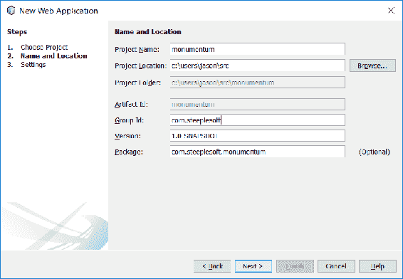
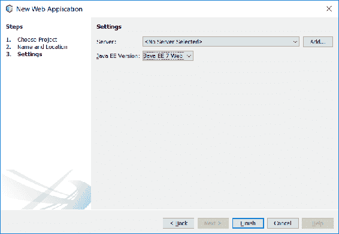
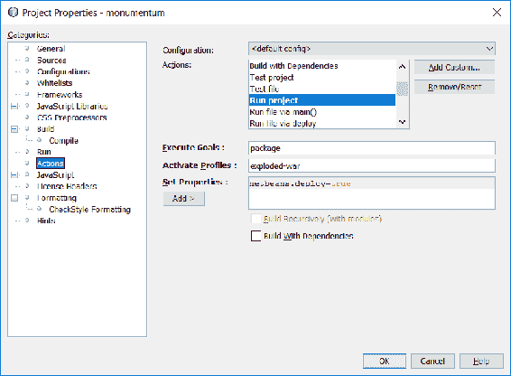
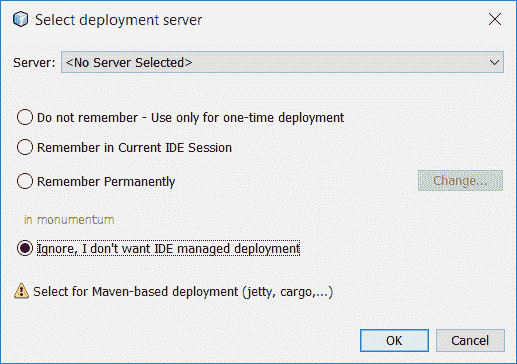
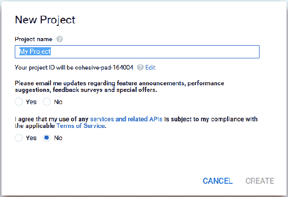
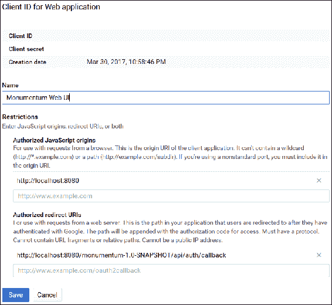
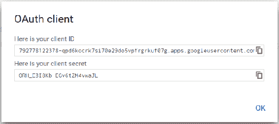
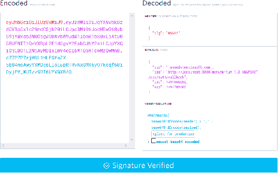

# 使用 Monumentum 记笔记

对于我们的第八个项目，我们又将做一些新的事情——我们将构建一个 Web 应用程序。与其他所有项目都是命令行、GUI 或它们的某种组合不同，这个项目将是一个由一个 REST API 和一个 JavaScript 前端组成的单一模块，所有这些都是在关注当前的微服务趋势的情况下构建的。

为了构建应用程序，你将学习以下主题：

+   一些用于构建微服务应用程序的 Java 选项

+   Payara Micro 和`microprofile.io`

+   Java API for RESTful Web Services

+   文档数据存储和 MongoDB

+   OAuth 身份验证（针对 Google，具体而言）

+   **JSON Web Tokens**（**JWT**）

正如你所见，这将是一个在很多方面与我们迄今为止所研究的项目截然不同的项目。

# 入门指南

大多数人可能都使用过某种笔记应用，如 EverNote、OneNote 或 Google Keep。它们是记录笔记和想法的极其方便的方式，并且几乎可以在任何可想象的环境中访问——桌面、移动和网页。在本章中，我们将构建这些行业巨头的相当基础的克隆版，以便练习许多概念。我们将把这个应用命名为 Monumentum，这是拉丁语中提醒或纪念的意思，对于这类应用来说是一个恰当的名字。

在我们深入探讨这些之前，让我们花些时间列出我们应用程序的需求：

+   能够创建笔记

+   能够列出笔记

+   能够编辑笔记

+   能够删除笔记

+   笔记内容必须能够存储/显示富文本

+   能够创建用户账户

+   必须能够使用 OAuth2 凭据登录到现有系统中的应用程序

我们的非功能性需求相当适度：

+   必须有一个 RESTful API

+   必须有一个 HTML 5/JavaScript 前端

+   必须有一个灵活、可扩展的数据存储

+   必须能够在资源受限的系统上轻松部署

当然，这个非功能性需求的列表部分是基于它们反映了现实世界的需求，但它们也为我们讨论我在本章中想涵盖的一些技术提供了很好的基础。直截了当地说，我们将创建一个提供基于 REST 的 API 和 JavaScript 客户端的 Web 应用程序。它将使用文档数据存储，并使用 JVM 上可用的许多微服务库/框架之一构建。

那么，这个堆栈看起来是什么样子呢？在我们确定一个特定的选择之前，让我们快速浏览一下我们的选项。让我们先看看微服务框架。

# JVM 上的微服务框架

虽然我不愿意花太多时间在解释微服务是什么上，因为大多数人对此已经很熟悉了，但我认为如果不至少简要描述一下，可能会有些失职，以防你对这个概念不熟悉。话虽如此，以下是来自 SmartBear（一个软件质量工具提供商，可能最出名的是他们维护 Swagger API 和相关库）的一个关于微服务的简洁定义：

实质上，微服务架构是一种将软件应用程序作为一套独立可部署的、小型、模块化服务的方法，其中每个服务运行一个独特的进程，并通过一个定义良好、轻量级的机制进行通信，以实现业务目标。

换句话说，与将几个相关系统捆绑在一个 Web 应用程序中并部署到大型应用程序服务器（如 GlassFish/Payara Server、Wildfly、WebLogic Server 或 WebSphere）的较旧、更成熟的方法相比，这些系统将分别在其自己的 JVM 进程中独立运行。这种方法的好处包括更容易的逐部分升级、通过进程隔离增加稳定性、更小的资源需求、更高的机器利用率等等。这个概念本身可能并不新颖，但它确实在近年来获得了流行，并且仍在以快速的速度增长。

那么，在 JVM 上我们的选择有哪些呢？我们有很多选择，包括但不限于以下内容：

+   **Eclipse Vert.x**：这是一个官方的*在 JVM 上构建反应式应用程序的工具包*。它提供了一个事件驱动的应用程序框架，非常适合编写微服务。Vert.x 可以使用多种语言，包括 Java、JavaScript、Kotlin、Ceylon、Scala、Groovy 和 Ruby。更多信息可以在[`vertx.io/`](http://vertx.io/)找到。

+   **Spring Boot**：这是一个用于构建独立 Spring 应用程序的库。Spring Boot 应用程序可以完全访问整个 Spring 生态系统，并且可以使用单个 fat/uber JAR 运行。Spring Boot 的网站是[`projects.spring.io/spring-boot/`](https://projects.spring.io/spring-boot/)。

+   **Java EE MicroProfile**：这是一个由社区和供应商领导的努力，旨在为 Java EE 创建一个新的配置文件，特别针对微服务。在撰写本文时，该配置文件包括**Java API for RESTful Web Services**（**JAX-RS**）、CDI 和 JSON-P，并由包括 Tomitribe、Payara、Red Hat、Hazelcast、IBM 和 Fujitsu 在内的多家公司以及如伦敦 Java 社区和 SouJava 等用户团体赞助。MicroProfile 的主页是[`microprofile.io/`](http://microprofile.io/)。

+   **Lagom**：这是一个相对较新的框架，由 Scala 背后的公司 Lightbend 开发的响应式微服务框架。它被描述为一个有偏见的微服务框架，并使用 Lightbend 的两个更著名的库——Akka 和 Play 构建。Lagom 应用程序可以用 Java 或 Scala 编写。更多详细信息可以在[`www.lightbend.com/platform/development/lagom-framework`](https://www.lightbend.com/platform/development/lagom-framework)找到。

+   **Dropwizard**：这是一个用于开发操作友好、高性能、RESTful Web 服务的 Java 框架。它提供了一个包含 Jetty（用于 HTTP）、Jersey（用于 REST 服务）和 Jackson（用于 JSON）的框架。它还支持其他库，如 Guava、Hibernate Validator、Freemarker 等。您可以在[`www.dropwizard.io/`](http://www.dropwizard.io/)找到 Dropwizard。

还有其他一些选择，但应该很清楚，作为 JVM 开发者，我们有无数的选择，这几乎总是好的。由于我们只能使用一个，因此我选择了 MicroProfile。具体来说，我们将基于 Payara Micro，这是基于 GlassFish 源代码（加上 Payara 的 bug 修复、增强等）的实现。

通过选择 MicroProfile 和 Payara Micro，我们隐含地选择了 JAX-RS 作为我们 REST 服务的基石。当然，我们可以使用我们想要的任何东西，但偏离框架提供的功能会降低框架本身的价值。

这就让我们面临选择数据存储的问题。我们已经看到的一个选项是关系型数据库。这是一个经过考验且可靠的选项，为整个行业提供了广泛的支持。然而，它们并非没有局限性和问题。虽然数据库本身在分类和功能方面可能很复杂，但最流行的关系型数据库替代品可能是 NoSQL 数据库。尽管这些数据库已经存在了半个世纪，但直到大约十年前，随着**Web 2.0**的出现，这一理念才在市场上获得了显著的影响力。

虽然**NoSQL**这个术语非常广泛，但这类数据库的大多数例子往往是键值、文档或图数据存储，每种都提供独特的性能和行为特征。全面介绍每种 NoSQL 数据库及其各种实现超出了本书的范围，因此，为了节省时间和空间，我们将直接进入我们的选择——MongoDB。它在文档模式方面的可扩展性和灵活性非常适合我们的目标用例。

最后，在客户端，我们又有许多选择。其中最受欢迎的是来自 Facebook 的 ReactJS 和来自 Google 的 Angular。还有各种各样的其他框架，包括较老的选择，如 Knockout 和 Backbone，以及较新的选择，如 Vue.js。我们将使用后者。这不仅是一个非常强大和灵活的选择，而且它还提供了最少的启动摩擦。由于这本书专注于 Java，我觉得选择一个在满足我们需求的同时设置最少的选项是明智的。

# 创建应用程序

要使用 Payara Micro，我们创建一个像平常一样的 Java Web 应用程序。在 NetBeans 中，我们将选择文件 | 新项目 | Maven | Web 应用程序，然后点击下一步。对于项目名称，输入`monumentum`，选择适当的 Project Location，并按需设置 Group ID 和 Package：



下一个窗口将要求我们选择一个服务器，我们可以将其留空，并选择 Java EE 版本，我们希望将其设置为 Java EE 7 Web：



几分钟后，我们应该创建好项目并准备就绪。由于我们创建了一个 Java EE 7 Web 应用程序，NetBeans 已经将 Java EE API 依赖项添加到了项目中。在我们开始编码之前，让我们将 Payara Micro 添加到构建中，以便准备好这部分。为此，我们需要向构建中添加一个插件。它看起来可能像这样（尽管我们在这里只展示了高亮部分）：

```java
    <plugin>
      <groupId>org.codehaus.mojo</groupId>
      <artifactId>exec-maven-plugin</artifactId>
      <version>1.5.0</version>
      <dependencies>
        <dependency>
          <groupId>fish.payara.extras</groupId>
          <artifactId>payara-microprofile</artifactId>
          <version>1.0</version>
        </dependency>
      </dependencies>
```

这设置了 Maven exec 插件，用于执行外部应用程序，或者像我们在这里要做的那样，执行 Java 应用程序：

```java
    <executions>
      <execution>
        <id>payara-uber-jar</id>
        <phase>package</phase>
        <goals>
          <goal>java</goal>
        </goals>
```

在这里，我们将此插件的执行与 Maven 的 package 阶段关联起来。这意味着当我们运行 Maven 来构建我们的项目时，插件的目标将在 Maven 开始打包项目时运行，这样我们就可以精确地改变 JAR 中包含的内容：

```java
    <configuration>
      <mainClass>
        fish.payara.micro.PayaraMicro
      </mainClass>
      <arguments>
        <argument>--deploy</argument>
        <argument>
          ${basedir}/target/${warfile.name}.war
        </argument>
        <argument>--outputUberJar</argument>
        <argument>
          ${basedir}/target/${project.artifactId}.jar
        </argument>
      </arguments>
    </configuration>
```

这个最后一部分配置了插件。它将运行`PayaraMicro`类，传递`--deploy <path> --outputUberJar ...`命令。实际上，我们正在告诉 Payara Micro 如何运行我们的应用程序，但我们不想立即执行包，而是希望它创建一个稍后运行的 uber JAR。

通常，当你构建你的项目时，你会得到一个只包含直接包含在你的项目中的类和资源的 jar 文件。任何外部依赖项都作为执行环境必须提供的东西留下。在 uber JAR 中，所有的依赖项都包含在我们的项目 jar 中，然后以这种方式配置，以便执行环境可以按需找到它们。

设置的问题在于，如果保持原样，当我们构建时，我们会得到一个 uber JAR，但我们将没有简单的方法从 NetBeans 运行应用程序。为了解决这个问题，我们需要一个稍微不同的插件配置。具体来说，它需要这些行：

```java
    <argument>--deploy</argument> 
    <argument> 
      ${basedir}/target/${project.artifactId}-${project.version} 
    </argument> 
```

这些选项替换了先前的 `deploy` 和 `outputUberJar` 选项。为了加快我们的构建速度，我们也不希望在请求之前创建 uber JAR，因此我们可以将这些两个插件配置分别放入两个独立的配置文件中，如下所示：

```java
    <profiles> 
      <profile> 
        <id>exploded-war</id> 
        <!-- ... --> 
      </profile> 
      <profile> 
        <id>uber</id> 
        <!-- ... --> 
      </profile> 
    </profiles> 
```

当我们准备构建部署工件时，在执行 Maven 时激活 uber 配置文件，我们将得到可执行的 jar 文件：

```java
$ mvn -Puber install 
```

`exploded-war` 配置文件是我们将在 IDE 中使用的配置，它运行 Payara Micro，指向我们构建目录中的展开的 war 文件。为了指导 NetBeans 使用它，我们需要修改几个操作配置。为此，在 NetBeans 中右键单击项目，并从上下文菜单底部选择属性。在操作下，找到运行项目并选择它，然后在激活配置文件下输入 `exploded-war`：



如果我们现在运行应用程序，NetBeans 会抱怨因为我们还没有选择服务器。虽然这是一个 Web 应用程序，通常需要服务器，但我们使用的是 Payara Micro，因此不需要定义应用程序服务器。幸运的是，NetBeans 会允许我们告诉它，如下面的截图所示：



选择忽略，我不想让 IDE 管理部署，然后点击确定，接着观察输出窗口。你应该会看到相当多的文本滚动过去，几秒钟后，你应该会看到类似这样的文本：

```java
Apr 05, 2017 1:18:59 AM fish.payara.micro.PayaraMicro bootStrap 
INFO: Payara MicroProfile  4.1.1.164-SNAPSHOT (build ${build.number}) ready in 9496 (ms) 
```

一旦看到这一点，我们就准备好测试我们的应用程序，就像现在这样。在你的浏览器中打开 `http://localhost:8080/monumentum-1.0-SNAPSHOT/index.html`，你应该会在页面上看到一个大型且令人兴奋的 *Hello World!* 消息。如果你看到这个，你就已经成功启动了一个 Payara Micro 项目。花点时间祝贺自己，然后我们将让应用程序做一些有用的事情。

# 创建 REST 服务

虽然这基本上是一个 Java EE 应用程序，尽管它的打包和部署方式略有不同，但你可能学到的关于编写 Java EE 应用程序的大部分内容很可能仍然适用。当然，你可能从未编写过这样的应用程序，所以我们将一步步进行。

在 Java EE 中编写的 REST 应用程序使用 JAX-RS，我们 JAX-RS 的起点是一个 `Application`。`Application` 是一种与部署无关的声明根级资源给运行时的方法。运行时如何找到 `Application` 当然取决于运行时本身。对于像我们这样的 MicroProfile 应用程序，我们将在 Servlet 3.0 环境中运行，所以我们不需要做任何特殊的事情，因为 Servlet 3.0 支持无描述符的部署选项。运行时将扫描带有 `@ApplicationPath` 注解的 `Application` 类，并使用它来配置 JAX-RS 应用程序，如下所示：

```java
    @ApplicationPath("/api") 
      public class Monumentum extends javax.ws.rs.core.Application { 
      @Override 
      public Set<Class<?>> getClasses() { 
        Set<Class<?>> s = new HashSet<>(); 
        return s; 
      } 
    } 
```

使用 `@ApplicationPath` 注解，我们指定应用程序 REST 端点的根 URL，这当然是相对于 Web 应用程序的根上下文。`Application` 有三个我们可以覆盖的方法，但我们只对这里列出的一个感兴趣：`getClasses()`。我们将在稍后提供关于此方法的更多详细信息，但就目前而言，请记住这是我们向 JAX-RS 描述顶级资源的方式。

Monumentum 将有一个非常简单的 API，主要端点是用于与笔记交互。为了创建这个端点，我们创建一个简单的 Java 类，并用适当的 JAX-RS 注解标记它：

```java
    @Path("/notes") 
    @RequestScoped 
    @Produces(MediaType.APPLICATION_JSON)  
    public class NoteResource { 
    } 
```

使用这个类，我们正在描述一个将位于 `/api/notes` 的端点，并将产生 JSON 结果。JAX-RS 支持，例如，XML，但大多数 REST 开发者习惯于 JSON，并期望没有其他内容，所以我们不需要支持除 JSON 之外的内容。当然，您应用程序的需求可能会有所不同，因此您可以根据需要调整支持的媒体类型列表。

虽然这将编译并运行，JAX-RS 将尝试处理对端点的请求，但我们还没有实际定义它。为了做到这一点，我们需要向端点添加一些方法来定义端点的输入和输出，以及我们将使用的 HTTP 动词/方法。让我们从笔记集合端点开始：

```java
    @GET 
    public Response getAll() { 
      List<Note> notes = new ArrayList<>(); 
      return Response.ok( 
        new GenericEntity<List<Note>>(notes) {}).build(); 
    } 
```

现在我们有一个端点，它回答 `/api/notes` 的 `GET` 请求，并返回 `Note` 实例的 `List`。在 REST 开发者中，关于这些方法的正确返回值有一些争议。有些人更喜欢返回客户端将看到的实际类型，例如我们案例中的 `List<Note>`，因为它使阅读源代码的开发者或由此生成的文档更清楚。其他人，像我们在这里所做的那样，更喜欢返回 JAX-RS `Response` 对象，因为它提供了对响应的更多控制，包括 HTTP 标头、状态码等。我倾向于更喜欢这种第二种方法，就像我们在这里所做的那样。当然，您当然可以自由选择使用任何一种方法。

最后要注意的一点是我们构建响应体的方式：

```java
    new GenericEntity<List<Note>>(notes) {} 
```

通常，在运行时，由于类型擦除，List 的参数化类型会丢失。使用像这样的 `GenericEntity` 允许我们捕获参数化类型，从而使运行时能够序列化数据。使用这允许我们避免编写自己的 `MessageBodyWriter`。代码越少几乎总是好事。

如果我们现在运行我们的应用程序，我们将得到以下响应，尽管它非常无聊：

```java
$ curl http://localhost:8080/monumentum-1.0-SNAPSHOT/api/notes/
[] 
```

这既令人满意，又并非如此，但它确实表明我们正在正确的轨道上。显然，我们希望这个端点返回数据，但我们没有添加注释的方法，所以现在让我们解决这个问题。

通过 REST 创建新实体是通过将其 POST 到其集合来完成的。该方法看起来像这样：

```java
    @POST 
    public Response createNote(Note note) { 
      Document doc = note.toDocument(); 
      collection.insertOne(doc); 
      final String id = doc.get("_id",  
        ObjectId.class).toHexString(); 

      return Response.created(uriInfo.getRequestUriBuilder() 
        .path(id).build()) 
      .build(); 
    } 
```

`@POST`注解表示使用 HTTP POST 动词。该方法接受一个`Note`实例，并返回一个`Response`，正如我们在前面的代码中所看到的。注意，我们没有直接处理 JSON。通过在方法签名中指定`Note`，我们可以利用 JAX-RS 的一个伟大特性--POJO 映射。我们在之前的代码中已经看到了它的一个暗示，即`GenericEntity`。JAX-RS 将尝试反序列化--即，将序列化形式转换为模型对象--JSON 请求体。如果客户端发送了正确格式的 JSON 对象，我们将得到一个可用的`Note`实例。如果客户端发送了一个构建不当的对象，它将得到一个响应。这个特性允许我们只处理我们的领域对象，而不必担心 JSON 编码和解码，这可以节省大量的时间和精力。

# 添加 MongoDB

在方法体中，我们首次看到了与 MongoDB 的集成。为了使这个编译成功，我们需要添加对 MongoDB Java Driver 的依赖：

```java
    <dependency> 
      <groupId>org.mongodb</groupId> 
      <artifactId>mongodb-driver</artifactId> 
      <version>3.4.2</version> 
    </dependency> 
```

MongoDB 处理文档，因此我们需要将我们的领域模型转换为`Document`，这是通过我们的模型类上的一个方法来实现的。我们还没有查看`Note`类的细节，所以现在让我们看看：

```java
    public class Note { 
      private String id; 
      private String userId; 
      private String title; 
      private String body; 
      private LocalDateTime created = LocalDateTime.now(); 
      private LocalDateTime modified = null; 

      // Getters, setters and some constructors not shown 

      public Note(final Document doc) { 
        final LocalDateTimeAdapter adapter =  
          new LocalDateTimeAdapter(); 
        userId = doc.getString("user_id"); 
        id = doc.get("_id", ObjectId.class).toHexString(); 
        title = doc.getString("title"); 
        body = doc.getString("body"); 
        created = adapter.unmarshal(doc.getString("created")); 
        modified = adapter.unmarshal(doc.getString("modified")); 
      } 

      public Document toDocument() { 
        final LocalDateTimeAdapter adapter =  
           new LocalDateTimeAdapter(); 
        Document doc = new Document(); 
        if (id != null) { 
           doc.append("_id", new ObjectId(getId())); 
        } 
        doc.append("user_id", getUserId()) 
         .append("title", getTitle()) 
         .append("body", getBody()) 
         .append("created",  
           adapter.marshal(getCreated() != null 
           ? getCreated() : LocalDateTime.now())) 
         .append("modified",  
           adapter.marshal(getModified())); 
         return doc; 
      } 
    } 
```

这基本上只是一个普通的 POJO。我们添加了一个构造函数和一个实例方法来处理转换为和从 MongoDB 的`Document`类型。

这里有几个需要注意的地方。第一个是如何处理 MongoDB `Document`的 ID。存储在 MongoDB 数据库中的每个文档都会被分配一个`_id`。在 Java API 中，这个`_id`被表示为`ObjectId`。我们不希望这个细节暴露在我们的领域模型中，所以我们将其转换为`String`然后再转换回来。

我们还需要对我们日期字段进行一些特殊处理。我们选择将`created`和`modified`属性表示为`LocalDateTime`实例，因为新的日期/时间 API 比旧的`java.util.Date`更优越。不幸的是，MongoDB Java Driver 目前还不支持 Java 8，因此我们需要自己处理转换。我们将这些日期存储为字符串，并在需要时进行转换。这种转换是通过`LocalDateTimeAdapter`类来处理的：

```java
    public class LocalDateTimeAdapter  
      extends XmlAdapter<String, LocalDateTime> { 
      private static final Pattern JS_DATE = Pattern.compile 
        ("\d{4}-\d{2}-\d{2}T\d{2}:\d{2}:\d{2}\.\d+Z"); 
      private static final DateTimeFormatter DEFAULT_FORMAT =  
        DateTimeFormatter.ISO_LOCAL_DATE_TIME; 
      private static final DateTimeFormatter JS_FORMAT =  
        DateTimeFormatter.ofPattern 
        ("yyyy-MM-dd'T'HH:mm:ss.SSS'Z'"); 

      @Override 
      public LocalDateTime unmarshal(String date) { 
        if (date == null) { 
          return null; 
        } 
        return LocalDateTime.parse(date,  
          (JS_DATE.matcher(date).matches()) 
          ? JS_FORMAT : DEFAULT_FORMAT); 
      } 

      @Override 
      public String marshal(LocalDateTime date) { 
        return date != null ? DEFAULT_FORMAT.format(date) : null; 
      } 
    } 
```

这可能比你预期的要复杂一些，这是因为它所做的不仅仅是我们在之前讨论过的。我们现在正在查看的使用，即从我们的模型类中，并不是这个类的首要目的，但我们会稍后讨论这一点。除了这一点，类的行为相当简单--接受一个`String`，确定它代表的是两种支持格式中的哪一种，并将其转换为`LocalDateTime`。它也可以反过来操作。

这个类的主要目的是为了 JAX-RS 的使用。当我们通过线传递`Note`实例时，`LocalDateTime`也需要进行反序列化，我们可以通过一个`XmlAdapter`告诉 JAX-RS 如何进行这一操作。

类定义好后，我们需要告诉 JAX-RS 关于它。我们可以通过几种不同的方式做到这一点。我们可以在模型中的每个属性上使用注解，如下所示：

```java
    @XmlJavaTypeAdapter(value = LocalDateTimeAdapter.class) 
    private LocalDateTime created = LocalDateTime.now(); 
```

虽然这可行，但就这类事情而言，这是一个相当大的注解，你必须将它放在每个 `LocalDateTime` 属性上。如果你有多个具有此类字段的模型，你将不得不触摸每个属性。幸运的是，有一种方法可以将类型与适配器关联一次。我们可以在一个特殊的 Java 文件 `package_info.java` 中做到这一点。大多数人从未听说过这个文件，甚至更少的人使用它，但它只是一个用于包级文档和注解的地方。正是这个后者的用例引起了我们的兴趣。在我们的模型类包中创建 `package_info.java` 并将其放入其中：

```java
    @XmlJavaTypeAdapters({ 
      @XmlJavaTypeAdapter(type = LocalDateTime.class,  
        value = LocalDateTimeAdapter.class) 
    }) 
    package com.steeplesoft.monumentum.model; 
```

我们有前面代码中看到的相同注解，但它被 `@XmlJavaTypeAdapters` 包装。JVM 只允许在元素上注解特定类型，因此这个包装器允许我们绕过这个限制。我们还需要在 `@XmlJavaTypeAdapter` 注解上指定类型参数，因为它不再在目标属性上。有了这个，每个 `LocalDateTime` 属性都将被正确处理，而无需任何额外的工作。

这需要相当多的设置，但我们仍然还没有完全准备好。我们在 REST 侧已经设置了一切。现在我们需要将 MongoDB 类放在适当的位置。要连接到 MongoDB 实例，我们从一个 `MongoClient` 开始。然后从 `MongoClient` 获取一个 `MongoDatabase` 的引用，从而得到一个 `MongoCollection`：

```java
    private MongoCollection<Document> collection; 
    private MongoClient mongoClient; 
    private MongoDatabase database; 

    @PostConstruct 
    public void postConstruct() { 
      String host = System.getProperty("mongo.host", "localhost"); 
      String port = System.getProperty("mongo.port", "27017"); 
      mongoClient = new MongoClient(host, Integer.parseInt(port)); 
      database = mongoClient.getDatabase("monumentum"); 
      collection = database.getCollection("note"); 
    } 
```

`@PostConstruct` 方法在构造函数运行之后在 Bean 上运行。在这个方法中，我们初始化我们的各种 MongoDB 类并将它们存储在实例变量中。有了这些类就绪，我们可以重新访问，例如，`getAll()`：

```java
    @GET 
    public Response getAll() { 
      List<Note> notes = new ArrayList<>(); 
      try (MongoCursor<Document> cursor = collection.find() 
      .iterator()) { 
        while (cursor.hasNext()) { 
          notes.add(new Note(cursor.next())); 
        } 
      } 

      return Response.ok( 
        new GenericEntity<List<Note>>(notes) {}) 
      .build(); 
    } 
```

现在我们可以查询数据库中的笔记，并且根据前面代码中展示的 `createNote()` 实现，我们可以创建以下笔记：

```java
$ curl -v -H "Content-Type: application/json" -X POST -d '{"title":"Command line note", "body":"A note from the command line"}' http://localhost:8080/monumentum-1.0-SNAPSHOT/api/notes/ 
*   Trying ::1... 
* TCP_NODELAY set 
* Connected to localhost (::1) port 8080 (#0) 
> POST /monumentum-1.0-SNAPSHOT/api/notes/ HTTP/1.1 
... 
< HTTP/1.1 201 Created 
... 
$ curl http://localhost:8080/monumentum-1.0-SNAPSHOT/api/notes/ | jq . 
[ 
  { 
    "id": "58e5d0d79ccd032344f66c37", 
    "userId": null, 
    "title": "Command line note", 
    "body": "A note from the command line", 
    "created": "2017-04-06T00:23:34.87", 
    "modified": null 
  } 
] 
```

要在你的机器上使这可行，你需要一个正在运行的 MongoDB 实例。你可以下载适用于你的操作系统的安装程序，也可以在 MongoDB 网站上找到安装说明（[`docs.mongodb.com/manual/installation/`](https://docs.mongodb.com/manual/installation/)）。

在我们继续探讨其他资源方法之前，让我们最后再看看我们的 MongoDB API 实例。虽然像我们这样实例化实例是可行的，但它也给资源本身带来了一定的工作量。理想情况下，我们应该能够将这些关注点移至其他地方并注入实例。希望这对你来说很熟悉，因为这正是**依赖注入（DI**）或**控制反转（IoC**）框架被创建来解决的问题。

# 使用 CDI 进行依赖注入

Java EE 提供了一个框架，如 CDI。使用 CDI，我们可以以编译时类型安全的方式将任何容器控制的对象注入到另一个对象中。然而，问题在于相关的对象需要是容器控制的，而我们的 MongoDB API 对象不是。幸运的是，CDI 提供了一种方法，容器可以通过这种方法创建这些实例，这种设施被称为生产者方法。这会是什么样子呢？让我们从注入点开始，因为这是最简单的部分：

```java
    @Inject 
    @Collection("notes") 
    private MongoCollection<Document> collection; 
```

当 CDI 容器看到`@Inject`时，它会检查注解所在的元素以确定类型。然后它将尝试查找一个可以满足注入请求的实例。如果有多个，注入通常会失败。尽管我们使用了限定符注解来帮助 CDI 确定要注入的内容。这个注解的定义如下：

```java
    @Qualifier  
    @Retention(RetentionPolicy.RUNTIME)  
    @Target({ElementType.METHOD, ElementType.FIELD,  
      ElementType.PARAMETER, ElementType.TYPE})   
    public @interface Collection { 
      @Nonbinding String value() default "unknown";   
    } 
```

使用这个注解，我们可以向容器传递提示，帮助它选择注入的实例。正如我们提到的，`MongoCollection`不是容器管理的，因此我们需要修复这个问题，我们通过以下生产者方法来完成：

```java
    @RequestScoped 
    public class Producers { 
      @Produces 
      @Collection 
      public MongoCollection<Document>  
        getCollection(InjectionPoint injectionPoint) { 
          Collection mc = injectionPoint.getAnnotated() 
          .getAnnotation(Collection.class); 
        return getDatabase().getCollection(mc.value()); 
      } 
    } 
```

`@Produces`方法告诉 CDI 此方法将产生容器需要的实例。CDI 从方法签名中确定可注入实例的类型。我们还把限定符注解放在方法上，作为对运行时的额外提示，当它尝试解决我们的注入请求时。

在方法本身中，我们在方法签名中添加`InjectionPoint`。当 CDI 调用此方法时，它将提供一个此类实例，我们可以从中获取每个特定注入点的信息，在它们被处理时。从`InjectionPoint`，我们获取`Collection`实例，从中我们可以获取我们感兴趣的 MongoDB 集合的名称。我们现在已经准备好获取之前看到的`MongoCollection`实例。`MongoClient`和`MongoDatabase`的实例化是在类内部处理的，并且与我们之前的用法没有显著变化。

对于 CDI 有一个小的设置步骤。为了避免 CDI 容器进行可能昂贵的类路径扫描，我们需要告诉系统我们希望启用 CDI，换句话说。为了做到这一点，我们需要一个`beans.xml`文件，它可以包含 CDI 配置元素，也可以完全为空，这就是我们将要做的。对于 Java EE Web 应用程序，`beans.xml`需要放在`WEB-INF`目录中，所以我们创建文件在`src/main/webapp/WEB-INF`。

确保文件确实是空的。即使只有一行空白，Weld，Payara 的 CDI 实现，也会尝试解析文件，导致 XML 解析错误。

# 完成笔记资源

在我们可以从`Note`资源继续前进之前，我们需要完成一些操作，即读取、更新和删除。读取单个笔记非常简单：

```java
    @GET 
    @Path("{id}") 
    public Response getNote(@PathParam("id") String id) { 
      Document doc = collection.find(buildQueryById(id)).first(); 
      if (doc == null) { 
        return Response.status(Response.Status.NOT_FOUND).build(); 
      } else { 
        return Response.ok(new Note(doc)).build(); 
      } 
    } 
```

我们已经指定了使用 HTTP 动词`GET`，正如我们之前看到的，但我们对这个方法有一个额外的注解，`@Path`。使用这个注解，我们告诉 JAX-RS 这个端点有额外的路径段，请求需要与之匹配。在这种情况下，我们指定了一个额外的段，但我们将其括在花括号中。如果没有这些括号，匹配将是字面匹配，也就是说，“这个 URL 的末尾是否有字符串'id'？”然而，通过使用花括号，我们告诉 JAX-RS 我们想要匹配额外的段，但它的内容可以是任何东西，我们想要捕获这个值并将其命名为`id`。在我们的方法签名中，我们指示 JAX-RS 通过`@PathParam`注解注入值，这样我们就可以在我们的方法中访问用户指定的`Note` ID。

从 MongoDB 检索笔记，我们第一次真正了解了如何查询 MongoDB：

```java
    Document doc = collection.find(buildQueryById(id)).first(); 
```

简而言之，将`BasicDBObject`传递给`collection`上的`find()`方法，该方法返回一个`FindIterable<?>`对象，然后我们调用`first()`来获取应该返回的唯一元素（当然，假设有一个）。这里有趣的部分隐藏在`buildQueryById()`中：

```java
    private BasicDBObject buildQueryById(String id) { 
      BasicDBObject query =  
        new BasicDBObject("_id", new ObjectId(id)); 
      return query; 
    } 
```

我们的查询过滤器使用这个`BasicDBObject`定义，我们用键和值初始化它。在这种情况下，我们想要根据文档中的`_id`字段进行过滤，所以我们使用它作为键，但请注意，我们传递的是`ObjectId`作为值，而不是简单的`String`。如果我们想要根据更多字段进行过滤，我们将向`BasicDBObject`变量追加更多的键/值对，我们将在后面看到。

一旦我们查询了集合并获取了用户请求的文档，我们就使用`Note`上的辅助方法将其从`Document`转换为`Note`，并以状态码 200 或`OK`返回它。

在数据库中更新文档稍微复杂一些，但并不过分，如下所示：

```java
    @PUT 
    @Path("{id}") 
    public Response updateNote(Note note) { 
      note.setModified(LocalDateTime.now()); 
      UpdateResult result =  
        collection.updateOne(buildQueryById(note.getId()), 
        new Document("$set", note.toDocument())); 
      if (result.getModifiedCount() == 0) { 
        return Response.status(Response.Status.NOT_FOUND).build(); 
      } else { 
        return Response.ok().build(); 
      } 
    } 
```

首先要注意的是 HTTP 方法--`PUT`。关于更新应该使用什么动词有一些争议。有些人，如 Dropbox 和 Facebook，说`POST`，而其他人，如 Google（取决于你查看哪个 API），说`PUT`。我会争辩说，选择在很大程度上取决于你。只要保持一致性。我们将完全用客户端传递的内容替换服务器上的实体，因此操作是幂等的。通过选择`PUT`，我们可以向客户端发出这个信号，使 API 对客户端来说更具自描述性。

在方法内部，我们首先将修改日期设置为反映操作。接下来，我们调用`Collection.updateOne()`来修改文档。语法有点奇怪，但这是在发生的——我们在查询集合以获取我们想要修改的笔记，然后告诉 MongoDB 用我们提供的新的文档替换加载的文档。最后，我们查询`UpdateResult`以查看更新了多少个文档。如果没有，则表示请求的文档不存在，因此我们返回`NOT_FOUND`（`404`）。如果它是非零的，我们返回`OK`（`200`）。

最后，我们的删除方法看起来是这样的：

```java
    @DELETE 
    @Path("{id}") 
    public Response deleteNote(@PathParam("id") String id) { 
      collection.deleteOne(buildQueryById(id)); 
      return Response.ok().build(); 
    } 
```

我们告诉 MongoDB 使用我们之前看到的相同查询过滤器来过滤集合，然后删除一个文档，当然，考虑到我们的过滤器，它应该只找到这一个，但`deleteOne()`是一个合理的防护措施。我们可以在`updateNote()`中做像上面那样的检查，看看是否真的有东西被删除了，但几乎没有意义——无论文档在请求开始时是否存在，它最终都不存在，这就是我们的目标，所以返回错误响应几乎没有收获。

我们现在可以创建、读取、更新和删除笔记，但那些细心的你可能已经注意到，任何人都可以读取系统中的每一篇笔记。对于多用户系统来说，这并不是一个好事情，所以让我们来修复这个问题。

# 添加身份验证

身份验证系统可以很容易地变得极其复杂。从自建系统，包括定制的用户管理屏幕，到复杂的单点登录解决方案，我们有大量的选择。其中更受欢迎的选项之一是 OAuth2，有许多选择。对于 Monumentum，我们将使用 Google 进行登录。为此，我们需要在 Google 开发者控制台中创建一个应用程序，该控制台位于[`console.developers.google.com`](https://console.developers.google.com)。

登录后，点击页面顶部的项目下拉菜单，然后点击创建项目，这将显示此屏幕给你：



提供项目名称，然后为接下来的两个问题做出选择，然后点击创建。一旦项目创建完成，你应该会被重定向到库页面。点击左侧的凭据链接，然后点击创建凭据并选择 OAuth 客户端 ID。如有需要，按照指示填写 OAuth 同意屏幕。选择 Web 应用程序作为应用程序类型，输入名称，并提供如截图所示的授权重定向 URI：



在此内容移至生产环境之前，我们需要向此屏幕添加一个生产 URI，但此配置在开发环境中运行良好。当你点击保存时，你会看到你的新客户端 ID 和客户端密钥。请注意这些信息：



使用这些数据（注意，这些不是我的实际 ID 和密钥，所以您需要生成自己的），我们就可以开始处理我们的认证资源了。我们将首先定义资源如下：

```java
    @Path("auth") 
    public class AuthenticationResource { 
```

我们需要在我们的`Application`中注册此操作，如下所示：

```java
    @ApplicationPath("/api") 
    public class Monumentum extends javax.ws.rs.core.Application { 
      @Override 
      public Set<Class<?>> getClasses() { 
        Set<Class<?>> s = new HashSet<>(); 
        s.add(NoteResource.class); 
        s.add(AuthenticationResource.class); 
        return s; 
      } 
    } 
```

要与 Google OAuth 提供者一起工作，我们需要声明一些实例变量并实例化一些 Google API 类：

```java
    private final String clientId; 
    private final String clientSecret; 
    private final GoogleAuthorizationCodeFlow flow; 
    private final HttpTransport HTTP_TRANSPORT =  
      new NetHttpTransport(); 
    private static final String USER_INFO_URL =  
      "https://www.googleapis.com/oauth2/v1/userinfo"; 
    private static final List<String> SCOPES = Arrays.asList( 
      "https://www.googleapis.com/auth/userinfo.profile", 
      "https://www.googleapis.com/auth/userinfo.email"); 
```

变量`clientId`和`clientSecret`将保存 Google 刚刚给出的值。其他两个类对于我们将要执行的过程是必要的，而`SCOPES`保存了我们希望从 Google 获得的权限，即访问用户的个人资料和电子邮件。类构造函数完成这些项的设置：

```java
    public AuthenticationResource() { 
      clientId = System.getProperty("client_id"); 
      clientSecret = System.getProperty("client_secret"); 
      flow = new GoogleAuthorizationCodeFlow.Builder(HTTP_TRANSPORT, 
        new JacksonFactory(), clientId, clientSecret, 
        SCOPES).build(); 
    } 
```

认证流程的第一部分是创建一个认证 URL，其创建方式如下：

```java
    @Context 
    private UriInfo uriInfo; 
    @GET 
    @Path("url") 
    public String getAuthorizationUrl() { 
      return flow.newAuthorizationUrl() 
      .setRedirectUri(getCallbackUri()).build(); 
    } 
    private String getCallbackUri()  
      throws UriBuilderException, IllegalArgumentException { 
      return uriInfo.getBaseUriBuilder().path("auth") 
        .path("callback").build() 
        .toASCIIString(); 
    } 
```

使用 JAX-RS 类`UriInfo`，我们创建一个指向我们应用程序中另一个端点的`URI`，即`/api/auth/callback`。然后我们将它传递给`GoogleAuthorizationCodeFlow`以完成登录 URL 的构建。当用户点击链接时，浏览器将被导向 Google 的登录对话框。在成功认证后，用户将被重定向到我们的回调 URL，该 URL 由此方法处理：

```java
    @GET 
    @Path("callback") 
    public Response handleCallback(@QueryParam("code")  
    @NotNull String code) throws IOException { 
      User user = getUserInfoJson(code); 
      saveUserInformation(user); 
      final String jwt = createToken(user.getEmail()); 
      return Response.seeOther( 
        uriInfo.getBaseUriBuilder() 
        .path("../loginsuccess.html") 
        .queryParam("Bearer", jwt) 
        .build()) 
      .build(); 
    } 
```

当 Google 重定向到我们的`callback`端点时，它将提供一个代码，我们可以使用它来完成认证。我们在`getUserInfoJson()`方法中这样做：

```java
    private User getUserInfoJson(final String authCode)  
    throws IOException { 
      try { 
        final GoogleTokenResponse response =  
          flow.newTokenRequest(authCode) 
          .setRedirectUri(getCallbackUri()) 
          .execute(); 
        final Credential credential =  
          flow.createAndStoreCredential(response, null); 
        final HttpRequest request =  
          HTTP_TRANSPORT.createRequestFactory(credential) 
          .buildGetRequest(new GenericUrl(USER_INFO_URL)); 
        request.getHeaders().setContentType("application/json"); 
        final JSONObject identity =  
          new JSONObject(request.execute().parseAsString()); 
        return new User( 
          identity.getString("id"), 
          identity.getString("email"), 
          identity.getString("name"), 
          identity.getString("picture")); 
      } catch (JSONException ex) { 
        Logger.getLogger(AuthenticationResource.class.getName()) 
        .log(Level.SEVERE, null, ex); 
        return null; 
      } 
    } 
```

使用我们从 Google 刚刚获得的认证代码，我们向 Google 发送另一个请求，这次是为了获取用户信息。当请求返回时，我们取响应体中的 JSON 对象，并使用它来构建一个`User`对象，然后返回。

在我们的 REST 端点方法中，我们调用此方法以在需要时将用户保存到数据库中：

```java
    private void saveUserInformation(User user) { 
      Document doc = collection.find( 
        new BasicDBObject("email", user.getEmail())).first(); 
      if (doc == null) { 
        collection.insertOne(user.toDocument()); 
      } 
    } 
```

一旦我们从 Google 获得了用户信息，我们就不再需要代码，因为我们不需要与任何其他 Google 资源交互，所以我们不会将其持久化。

最后，我们希望向客户端返回一些东西——某种类型的令牌——可以用来证明客户端的身份。为此，我们将使用一种名为 JSON Web Token（JWT）的技术，简称 JWT。JWT 是一种基于 JSON 的开放标准（RFC 7519），用于创建断言一定数量声明的访问令牌。我们将使用用户的电子邮件地址创建一个 JWT。我们将使用只有服务器使用的密钥对其进行签名，这样我们就可以安全地将它传递给客户端，客户端将在每次请求时将其传递回来。由于它必须使用服务器密钥进行加密/签名，不可信的客户端将无法成功修改或伪造令牌。

要创建 JWT，我们需要将库添加到我们的项目中，如下所示：

```java
    <dependency> 
      <groupId>io.jsonwebtoken</groupId> 
      <artifactId>jjwt</artifactId> 
      <version>0.7.0</version> 
    </dependency> 
```

我们可以编写此方法：

```java
    @Inject 
    private KeyGenerator keyGenerator; 
    private String createToken(String login) { 
      String jwtToken = Jwts.builder() 
      .setSubject(login) 
      .setIssuer(uriInfo.getAbsolutePath().toString()) 
      .setIssuedAt(new Date()) 
      .setExpiration(Date.from( 
        LocalDateTime.now().plusHours(12L) 
      .atZone(ZoneId.systemDefault()).toInstant())) 
      .signWith(SignatureAlgorithm.HS512,  
        keyGenerator.getKey()) 
      .compact(); 
      return jwtToken; 
    } 
```

令牌的主题是电子邮件地址，我们 API 的基本地址是发行者，过期日期和时间是未来的 12 小时，令牌由我们使用新类`KeyGenerator`生成的密钥签名。当我们调用`compact()`时，会生成一个 URL 安全的字符串，我们将其返回给调用者。我们可以使用[`jwt.io`](http://jwt.io/)上的 JWT 调试器来查看令牌内部：



显然，令牌中的声明是可读的，所以不要在其中存储任何敏感信息。使这变得安全的是在签名令牌时使用秘密密钥，从理论上讲，没有检测到的情况下不可能更改其内容。

用于给我们签名密钥的`KeyGenerator`类看起来像这样：

```java
    @Singleton 
    public class KeyGenerator { 
      private Key key; 

      public Key getKey() { 
        if (key == null) { 
          String keyString = System.getProperty("signing.key",  
            "replace for production"); 
          key = new SecretKeySpec(keyString.getBytes(), 0,  
            keyString.getBytes().length, "DES"); 
        } 

        return key; 
      } 
    } 
```

该类被注解为`@Singleton`，因此容器保证系统中只存在一个此 bean 的实例。`getKey()`方法将使用系统属性`signing.key`作为密钥，允许用户在启动系统时指定一个唯一的秘密。当然，完全随机的密钥更安全，但如果我们试图水平扩展此系统，这会增加一些复杂性。我们需要所有实例使用相同的签名密钥，以便无论客户端被导向哪个服务器，JWT 都可以被验证。在这种情况下，Hazelcast 这样的数据网格解决方案将是一个合适的工具。就目前而言，这已经足够满足我们的需求了。

我们的认证资源现在已经完成，但我们的系统实际上还没有被保护。为了做到这一点，我们需要告诉 JAX-RS 如何认证请求，我们将使用一个新的注解和`ContainerRequestFilter`来实现。

如果我们安装一个没有额外信息的请求过滤器，它将应用于每个资源，包括我们的认证资源。这意味着我们必须先进行认证才能进行认证。显然，这没有意义，因此我们需要一种方法来区分请求，以便只有对某些资源的请求应用此过滤器，这意味着需要一个新注解：

```java
    @NameBinding 
    @Retention(RetentionPolicy.RUNTIME) 
    @Target({ElementType.TYPE, ElementType.METHOD}) 
    public @interface Secure { 
    } 
```

我们定义了一个语义上有意义的注解。`@NameBinding`注解告诉 JAX-RS 只将注解应用于某些资源，这些资源通过名称绑定（而不是在运行时动态绑定）。注解定义后，我们需要定义事物的另一面，即请求过滤器：

```java
    @Provider 
    @Secure 
    @Priority(Priorities.AUTHENTICATION) 
    public class SecureFilter implements ContainerRequestFilter { 
      @Inject 
      private KeyGenerator keyGenerator; 

      @Override 
      public void filter(ContainerRequestContext requestContext)  
       throws IOException { 
        try { 
          String authorizationHeader = requestContext 
          .getHeaderString(HttpHeaders.AUTHORIZATION); 
          String token = authorizationHeader 
          .substring("Bearer".length()).trim(); 
          Jwts.parser() 
          .setSigningKey(keyGenerator.getKey()) 
          .parseClaimsJws(token); 
        } catch (Exception e) { 
          requestContext.abortWith(Response.status 
          (Response.Status.UNAUTHORIZED).build()); 
        } 
      } 
    } 
```

我们首先定义一个实现`ContainerRequestFilter`接口的类。我们必须用`@Provider`注解它，以便 JAX-RS 能够识别和加载该类。我们将`@Secure`注解应用于将过滤器与注解关联。我们将在稍后将其应用于资源。最后，我们应用`@Priority`注解来指示系统，此过滤器应在请求周期中较早应用。

在过滤器内部，我们注入了之前查看过的相同 `KeyGenerator`。由于这是一个单例，我们保证这里使用的密钥和认证方法中使用的密钥是相同的。接口上唯一的方法是 `filter()`，在这个方法中，我们从请求中获取授权头，提取出 JWT 的 Bearer 令牌，并使用 JWT API 进行验证。如果我们能够解码并验证令牌，那么我们知道用户已经成功对系统进行了认证。为了告诉系统这个新的过滤器，我们需要修改我们的 JAX-RS `Application` 如下：

```java
    @ApplicationPath("/api") 
    public class Monumentum extends javax.ws.rs.core.Application { 
      @Override 
      public Set<Class<?>> getClasses() { 
        Set<Class<?>> s = new HashSet<>(); 
        s.add(NoteResource.class); 
        s.add(AuthenticationResource.class); 
        s.add(SecureFilter.class); 
        return s; 
      } 
    } 
```

系统现在知道了过滤器，但在它做任何事情之前，我们需要将其应用于我们想要保护的资源。我们通过将 `@Secure` 注解应用于适当的资源来实现这一点。它可以在类级别应用，这意味着类中的每个端点都将被保护，或者可以在资源方法级别应用，这意味着只有那些特定的端点将被保护。在我们的情况下，我们希望每个 `Note` 端点都被保护，所以将以下注解放在类上：

```java
    @Path("/notes") 
    @RequestScoped 
    @Produces(MediaType.APPLICATION_JSON) 
    @Secure 
    public class NoteResource { 
```

只需再走几步，我们的应用程序就会变得安全。我们需要对 `NoteResource` 进行一些修改，以便它知道谁登录了，并且使笔记与认证用户相关联。我们将从注入 `User` 开始：

```java
    @Inject 
    private User user; 
```

这显然不是一个容器管理的类，因此我们需要编写另一个 `Producer` 方法。那里有一些工作要做，所以我们将它封装在自己的类中：

```java
    @RequestScoped 
    public class UserProducer { 
      @Inject 
      private KeyGenerator keyGenerator; 
      @Inject 
      HttpServletRequest req; 
      @Inject 
      @Collection("users") 
      private MongoCollection<Document> users; 
```

我们将其定义为请求范围的 CDI 实例，并注入我们的 `KeyGenerator`、`HttpServletRequest` 和我们的用户集合。实际的工作是在 `Producer` 方法中完成的：

```java
    @Produces 
    public User getUser() { 
      String authHeader = req.getHeader(HttpHeaders.AUTHORIZATION); 
      if (authHeader != null && authHeader.contains("Bearer")) { 
        String token = authHeader 
        .substring("Bearer".length()).trim(); 
        Jws<Claims> parseClaimsJws = Jwts.parser() 
        .setSigningKey(keyGenerator.getKey()) 
        .parseClaimsJws(token); 
        return getUser(parseClaimsJws.getBody().getSubject()); 
      } else { 
        return null; 
      }  
    } 
```

使用 Servlet 请求，我们检索 `AUTHORIZATION` 头。如果它存在并且包含 `Bearer` 字符串，我们可以处理令牌。如果该条件不成立，我们返回 null。要处理令牌，我们从头中提取令牌值，然后让 `Jwts` 为我们解析声明，它返回一个类型为 `Jws<Claims>` 的对象。我们在 `getUser()` 方法中按照以下方式构建用户：

```java
    private User getUser(String email) { 
      Document doc = users.find( 
        new BasicDBObject("email", email)).first(); 
      if (doc != null) { 
        return new User(doc); 
      } else { 
        return null; 
      } 
    } 
```

解析了声明后，我们可以提取主题并使用它来查询我们的 `Users` 集合，如果找到则返回 `User`，如果没有找到则返回 `null`。

回到我们的 `NoteResource`，我们需要修改我们的资源方法以使其 `User-aware`：

```java
    public Response getAll() { 
      List<Note> notes = new ArrayList<>(); 
      try (MongoCursor<Document> cursor =  
        collection.find(new BasicDBObject("user_id",  
        user.getId())).iterator()) { 
      // ... 
      @POST 
      public Response createNote(Note note) { 
        Document doc = note.toDocument(); 
        doc.append("user_id", user.getId()); 
        // ... 
      @PUT 
      @Path("{id}") 
      public Response updateNote(Note note) { 
        note.setModified(LocalDateTime.now()); 
        note.setUser(user.getId()); 
        // ... 
      private BasicDBObject buildQueryById(String id) { 
        BasicDBObject query =  
        new BasicDBObject("_id", new ObjectId(id)) 
         .append("user_id", user.getId()); 
        return query; 
    } 
```

现在我们有一个完整且安全的 REST API。除了像 curl 这样的命令行工具外，我们没有其他很好的方式来使用它，所以让我们构建一个用户界面。

# 构建用户界面

对于 UI，我们有多种选择。在这本书中，我们已经探讨了 JavaFX 和 NetBeans RCP。虽然这些是很好的选择，但我们将为这个应用做一些不同的处理，并构建一个基于 Web 的界面。即使在这里，我们也有许多、许多选项：JSF、Spring MVC、Google Web Toolkit、Vaadin 等等。在现实世界的应用中，虽然我们可能有 Java 后端，但我们可能有 JavaScript 前端，所以这就是我们将要做的，这也是你的选择变得非常令人眼花缭乱的地方。

在本书撰写时，该市场的两大主要玩家是来自 Facebook 的 React 和来自 Google 的 Angular。还有一些较小的竞争者，例如与 React API 兼容的 Preact、VueJS、Backbone、Ember 等等。你的选择将对应用产生重大影响，从架构到更琐碎的事情，比如构建项目本身，或者如果你有强烈的特定架构需求，你也可以让架构驱动框架。一如既往，你的特定环境将有所不同，并且应该比你在书中或在线上读到的内容更能驱动这个决定。

由于这是一本 Java 书，并且我想避免深入探讨 JavaScript 构建系统和替代**JavaScript 虚拟机**语言、转译等亲密细节，我选择使用 Vue，因为它是一个快速、现代且流行的框架，满足我们的需求，同时仍然允许我们构建一个简单的系统，无需复杂的构建配置。如果你有使用其他框架的经验或偏好，你应该能够相当简单地使用你选择的框架构建一个类似的系统。

注意，我**不是**一个 JavaScript 开发者。在本章的这一部分，我们将构建的应用不应被视为最佳实践的例子。这仅仅是一个尝试构建一个可用、尽管简单的 JavaScript 前端，以展示全栈应用。请查阅 Vue 或你选择的框架的文档，了解如何使用该工具构建惯用应用的相关细节。

让我们从索引页开始。在 NetBeans 的项目资源管理器窗口中，展开“其他源”节点，右键单击“webapp”节点，选择“新建 | 空文件”，将其命名为`index.html`。目前文件中我们需要的最基本内容如下：

```java
    <!DOCTYPE html> 
      <html> 
        <head> 
          <title>Monumentum</title> 
          <meta charset="UTF-8"> 
          <link rel="stylesheet" href="monumentum.css"> 
          <script src="img/vue"></script> 
        </head> 
        <body> 
          <div id="app"> 
            {{ message }} 
          </div> 
          <script type="text/javascript" src="img/index.js"></script> 
        </body> 
      </html> 
```

目前这会显示一个空白页，但它确实导入了 Vue 的源代码，以及我们客户端应用的 JavaScript，即`index.js`，我们需要创建它：

```java
    var vm = new Vue({ 
      el: '#app', 
      data: { 
        message : 'Hello, World!' 
      } 
    }); 
```

如果我们部署这些更改（提示：如果应用已经运行，只需按*F11*键告诉 NetBeans 构建；这不会使任何 Java 更改生效，但它会将这些静态资源复制到输出目录），并在浏览器中刷新页面，我们现在应该能在页面上看到*Hello, World!*。

简而言之，所发生的事情是我们正在创建一个新的 `Vue` 对象，将其锚定到具有 `app` ID 的 (`el`) 元素。我们还在定义此组件的一些状态（`data`），其中包括单个属性 `message`。在页面上，`app` 元素内部的任何位置，我们可以使用我们在首页中看到的 Mustache 语法访问组件的状态--`{{ message }}`。让我们扩展一下我们的组件：

```java
    var vm = new Vue({ 
      el: '#app', 
      store, 
      computed: { 
        isLoggedIn() { 
          return this.$store.state.loggedIn; 
        } 
      }, 
      created: function () { 
        NotesActions.fetchNotes(); 
      } 
    }); 
```

我们在这里添加了三项：

+   我们引入了一个全局数据存储，恰当地命名为 `store`

+   我们添加了一个名为 `isLoggedIn` 的新属性，它从方法调用中获取其值

+   我们添加了一个生命周期方法 `created`，当组件在页面上创建时，将从服务器加载 `Note`

我们的数据存储基于 Vuex，这是一个为 `Vue.js` 应用程序提供状态管理模式和库。它作为应用程序中所有组件的集中存储，有规则确保状态只能以可预测的方式变异。([`vuex.vuejs.org`](https://vuex.vuejs.org/))。要将它添加到我们的应用程序中，我们需要在我们的页面中添加以下代码行：

```java
    <script src="img/vuex"></script>
```

然后，我们在组件中添加了一个名为 `store` 的字段，您可以在前面的代码中看到。到目前为止的大部分工作都在 `NotesActions` 对象中完成：

```java
    var NotesActions = { 
      buildAuthHeader: function () { 
        return new Headers({ 
          'Content-Type': 'application/json', 
          'Authorization': 'Bearer ' +    
          NotesActions.getCookie('Bearer') 
        }); 
      }, 
      fetchNotes: function () { 
        fetch('api/notes', { 
          headers: this.buildAuthHeader() 
        }) 
        .then(function (response) { 
          store.state.loggedIn = response.status === 200; 
          if (response.ok) { 
            return response.json(); 
          } 
        }) 
        .then(function (notes) { 
          store.commit('setNotes', notes); 
        }); 
      } 
    } 
```

当页面加载时，应用程序将立即向后端发送 Notes 的请求，如果有的话，在 `Authorization` 头部发送 bearer 令牌。当响应返回时，我们更新商店中 `isLoggedIn` 属性的状态，如果请求成功，我们更新页面上的 `Notes` 列表。请注意，我们正在使用 `fetch()`。这是在浏览器中发送 XHR 或 Ajax 请求的新实验性 API。截至本书编写时，它被所有主要浏览器支持，除了 Internet Explorer，所以如果您不能控制客户端的浏览器，请小心在生产应用程序中使用此功能。

我们已经看到商店被使用了几次，所以让我们来看看它：

```java
    const store = new Vuex.Store({ 
      state: { 
        notes: [], 
        loggedIn: false, 
        currentIndex: -1, 
        currentNote: NotesActions.newNote() 
      } 
    }; 
```

该商店的类型为 `Vuex.Store`，我们在其 `state` 属性中指定了各种状态字段。如果处理得当，任何绑定到这些状态字段之一的 Vue 组件都会自动为您更新。您不需要跟踪和管理状态，手动在页面反映应用状态的变化。Vue 和 Vuex 会为您处理这些。大多数情况下是这样的。有些情况，例如数组变异（或替换），需要一些特殊处理。Vuex 提供了 **mutations** 来帮助处理这种情况。例如，`NotesAction.fetchNotes()` 在请求成功后，我们将执行以下调用：

```java
     store.commit('setNotes', notes); 
```

前面的代码告诉商店提交一个名为 `setNotes` 的变异，其中 `notes` 作为负载。我们像这样定义变异：

```java
    mutations: { 
      setNotes(state, notes) { 
        state.notes = []; 
        if (notes) { 
          notes.forEach(i => { 
            state.notes.push({ 
              id: i.id, 
              title: i.title, 
              body: i.body, 
              created: new Date(i.created), 
              modified: new Date(i.modified) 
            }); 
        }); 
      } 
    } 
```

我们传递给这个突变的（如果你这样想有助于理解，可以将其视为具有奇特调用语法的函数或方法）是一个 JSON 数组（希望这里没有类型检查），所以我们首先清除当前的笔记列表，然后迭代这个数组，创建和存储新的对象，并在这样做的同时重新格式化一些数据。严格地仅使用这个突变来替换笔记集，我们可以保证用户界面与应用程序状态的变化保持同步，这一切都是免费的。

那么，这些笔记是如何显示的呢？为了做到这一点，我们定义一个新的 Vue 组件并将其添加到页面上，如下所示：

```java
    <div id="app"> 
      <note-list v-bind:notes="notes" v-if="isLoggedIn"></note-list> 
    </div> 
```

在这里，我们引用了一个名为 `note-list` 的新组件。我们将模板变量 `notes` 绑定到同名应用程序变量上，并指定只有当用户登录时才显示该组件。实际的组件定义发生在 JavaScript 中。回到 `index.js`，我们有如下代码：

```java
    Vue.component('note-list', { 
      template: '#note-list-template', 
      store, 
      computed: { 
        notes() { 
          return this.$store.state.notes; 
        }, 
        isLoggedIn() { 
          return this.$store.state.loggedIn; 
        } 
      }, 
      methods: { 
        loadNote: function (index) { 
          this.$store.commit('noteClicked', index); 
        }, 
        deleteNote: function (index) { 
          if (confirm 
            ("Are you sure want to delete this note?")) { 
              NotesActions.deleteNote(index); 
            } 
        } 
      } 
    }); 
```

这个组件被命名为 `note-list`；其模板位于具有 `note-list-template` ID 的元素中；它有两个计算值：`notes` 和 `isLoggedIn`；并且提供了两个方法。在一个典型的 Vue 应用程序中，我们会有许多文件，所有这些文件最终都会使用类似 Grunt 或 Gulp 之类的工具一起编译，其中一个文件就是我们的组件模板。由于我们试图通过避免 JS 构建过程来使这一切尽可能简单，所以我们直接在我们的页面上声明了一切。在 `index.html` 中，我们可以找到我们组件的模板：

```java
    <script type="text/x-template" id="note-list-template"> 
      <div class="note-list"> 
        <h2>Notes:</h2> 
        <ul> 
          <div class="note-list"  
            v-for="(note,index) in notes" :key="note.id"> 
          <span : 
             v-on:click="loadNote(index,note);"> 
          {{ note.title }} 
          </span> 
            <a v-on:click="deleteNote(index, note);"> 
               
            </a> 
          </div> 
        </ul> 
        <hr> 
      </div>  
    </script> 
```

使用具有 `text/x-template` 类型的 `script` 标签，我们可以在不将其渲染到页面上时将模板添加到 DOM 中。在这个模板中，有趣的部分是具有 `note-list` 类的 `div` 标签。我们在这个标签上有一个 `v-` 属性，这意味着 Vue 模板处理器将使用这个 `div` 作为模板来迭代 `notes` 列表，并显示数组中的每个 `note`。

每个笔记都将使用 `span` 标签进行渲染。通过使用模板标记 `:title`，我们能够使用我们的应用程序状态创建一个标题标签的值（我们无法说因为字符串插值在 Vue 2.0 中已被弃用）。`span` 标签的唯一子元素是 `{{ note.title }}` 表达式，它将 `note` 列表的标题作为字符串渲染。当用户在页面上点击笔记标题时，我们希望对此做出反应，因此我们将 `onClick` 处理程序绑定到 DOM 元素上，通过 `v-on:click`。这里引用的函数是我们定义在组件定义的 `methods` 块中的 `loadNote()` 函数。

`loadNote()` 函数调用了一个我们尚未查看的突变：

```java
    noteClicked(state, index) { 
      state.currentIndex = index; 
      state.currentNote = state.notes[index]; 
      bus.$emit('note-clicked', state.currentNote); 
    } 
```

这种突变修改了状态以反映用户点击的笔记，然后触发（或发出）一个名为 `note-clicked` 的事件。事件系统实际上非常简单。它被设置为如下：

```java
    var bus = new Vue(); 
```

就是这样。这只是一个基础、全局范围的 Vue 组件。我们通过调用 `bus.$emit()` 方法来触发事件，并通过调用 `bus.$on()` 方法来注册事件监听器。我们将在笔记形式中看到它的样子。

我们将像添加 `note-list` 组件一样将笔记表单组件添加到页面：

```java
    <div id="app"> 
      <note-list v-bind:notes="notes" v-if="isLoggedIn"></note-list> 
      <note-form v-if="isLoggedIn"></note-form> 
    </div> 
```

再次强调，组件是在 `index.js` 中定义的，如下所示：

```java
    Vue.component('note-form', { 
      template: '#note-form-template', 
      store, 
      data: function () { 
        return { 
          note: NotesActions.newNote() 
        }; 
      }, 
      mounted: function () { 
        var self = this; 
        bus.$on('add-clicked', function () { 
          self.$store.currentNote = NotesActions.newNote(); 
          self.clearForm(); 
        }); 
        bus.$on('note-clicked', function (note) { 
          self.updateForm(note); 
        }); 
        CKEDITOR.replace('notebody'); 
      } 
    }); 
```

模板也位于 `index.html` 中，如下所示：

```java
    <script type="text/x-template" id="note-form-template"> 
      <div class="note-form"> 
        <h2>{{ note.title }}</h2> 
        <form> 
          <input id="noteid" type="hidden"  
            v-model="note.id"></input> 
          <input id="notedate" type="hidden"  
            v-model="note.created"></input> 
          <input id="notetitle" type="text" size="50"  
            v-model="note.title"></input> 
          <br/> 
          <textarea id="notebody"  
            style="width: 100%; height: 100%"  
            v-model="note.body"></textarea> 
          <br> 
          <button type="button" v-on:click="save">Save</button> 
        </form> 
      </div> 
    </script> 
```

这基本上是一个正常的 HTML 表单。有趣的部分是 v-model 将表单元素绑定到组件的属性。在表单上所做的更改将自动反映在组件中，而在组件中（例如，通过事件处理器）所做的更改将自动反映在 UI 中。我们还通过熟悉的 `v-on:click` 属性附加了一个 `onClick` 处理器。

你注意到了我们组件定义中关于 `CKEDITOR` 的引用吗？我们将使用富文本编辑器 `CKEditor` 来提供更好的体验。我们可以去 `CKEditor` 下载发行版包，但我们有更好的方法--WebJars。WebJars 项目将流行的客户端 Web 库打包成 JAR 文件。这使得将支持的库添加到项目中变得非常简单：

```java
    <dependency> 
      <groupId>org.webjars</groupId> 
      <artifactId>ckeditor</artifactId> 
      <version>4.6.2</version> 
    </dependency> 
```

当我们打包应用程序时，这个二进制 jar 文件会被添加到 Web 归档中。然而，如果它仍然被归档，我们如何访问资源呢？这取决于你正在构建的应用程序类型，有多种选择。我们将利用 Servlet 3 的静态资源处理功能（任何打包在 Web 应用程序的 `lib` 目录下的 `META-INF/resources` 下的内容都会自动暴露）。在 `index.html` 中，我们通过以下简单行将 `CKEditor` 添加到页面：

```java
    <script type="text/javascript"
      src="img/ckeditor.js"></script>
```

`CKEditor` 现在已准备好使用。

最后一个主要的前端功能是允许用户登录。为此，我们将创建另一个组件，如下所示：

```java
    <div id="app"> 
      <navbar></navbar> 
      <note-list v-bind:notes="notes" v-if="isLoggedIn"></note-list> 
      <note-form v-if="isLoggedIn"></note-form> 
    </div> 
```

然后，我们将添加以下组件定义：

```java
    Vue.component('navbar', { 
      template: '#navbar-template', 
      store, 
      data: function () { 
        return { 
          authUrl: "#" 
        }; 
      }, 
      methods: { 
        getAuthUrl: function () { 
          var self = this; 
          fetch('api/auth/url') 
          .then(function (response) { 
            return response.text(); 
          }) 
          .then(function (url) { 
            self.authUrl = url; 
          }); 
        } 
      }, 
      mounted: function () { 
        this.getAuthUrl(); 
      } 
    }); 
```

最后，我们将按照以下方式添加模板：

```java
    <script type="text/x-template" id="navbar-template"> 
      <div id="nav" style="grid-column: 1/span 2; grid-row: 1 / 1;"> 
        <a v-on:click="add" style="padding-right: 10px;"> 
           
        </a> 
        <a v-on:click="logout" v-if="isLoggedIn">Logout</a> 
        <a v-if="!isLoggedIn" :href="authUrl"  
         style="text-decoration: none">Login</a> 
      </div> 
    </script> 
```

当这个组件被 **mounted**（或附加到 DOM 中的元素）时，我们调用 `getAuthUrl()` 函数，该函数向服务器发送 Ajax 请求以获取我们的 Google 登录 URL。一旦获取到，登录锚标签将被更新以引用该 URL。

在 JavaScript 文件中还有一些我们没有在这里明确覆盖的细节，但有兴趣的人可以查看存储库中的源代码，并阅读剩余的细节。我们确实有一个用于笔记应用的运行中的 JavaScript 前端，它支持列出、创建、更新和删除笔记，以及支持多用户。它不是一个很漂亮的应用程序，但它能工作。对于一个 Java 程序员来说，这已经很不错了！

# 摘要

现在我们回到了熟悉的旋律——我们的应用程序**完成了**。在这一章中我们涵盖了什么内容？我们使用 JAX-RS 创建了一个 REST API，它不需要直接操作 JSON。我们学习了如何将请求过滤器应用于 JAX-RS 端点，以限制对认证用户的访问，我们使用 Google 的 OAuth2 工作流程通过他们的 Google 账户进行认证。我们使用 Payara Micro 打包了应用程序，这是一个开发微服务的优秀选择，并且我们使用 MongoDB Java API 将 MongoDB 集成到我们的应用程序中。最后，我们使用 Vue.js 构建了一个非常基本的 JavaScript 客户端来访问我们的应用程序。

在这个应用程序中，有很多新的概念和技术在相互作用，从技术角度来看，这使得它很有趣，但还有更多可以做的事情。应用程序需要大量的样式设计，并且支持嵌入图片和视频会很好，同样需要一个移动客户端。在应用程序中，有大量的改进和增强空间，但感兴趣的各方有一个坚实的基础可以从中开始。尽管如此，对我们来说，现在是时候转向下一章和新项目了，我们将跳入以服务为函数的云计算世界。
