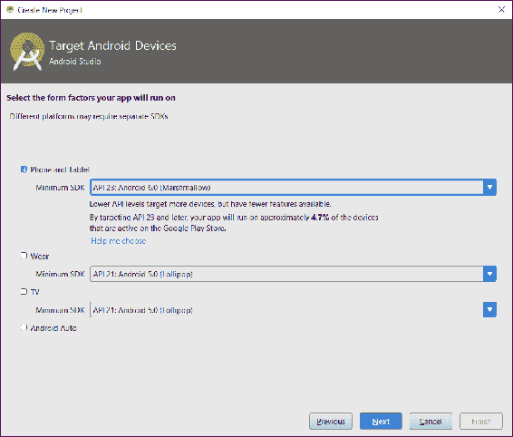

# 第二十九章：DeskDroid - 为您的 Android 手机提供的桌面客户端

我们终于来到了我们的最终项目。为了结束我们在这里的时光，我们将构建一个非常实用的应用程序，一个让我们能够从桌面舒适地发送和接收短信的应用程序。市场上现在有许多产品可以让你做这件事，但它们通常需要一个第三方服务，这意味着你的消息会通过别人的服务器。对于注重隐私的人来说，这可能是一个真正的问题。我们将构建一个 100%本地的系统。

构建应用将涵盖几个不同的主题，有些熟悉，有些新颖。以下是这个列表：

+   Android 应用程序

+   Android 服务

+   REST 服务器

+   服务器发送的事件用于事件/数据流

+   使用内容提供者进行数据访问

在我们共同度过的时间结束时，我们还将有其他许多小细节，以一个强大、高调的结尾。

# 入门

这个项目将有两个部分：

+   Android 应用程序/服务器（当然不要与应用程序服务器混淆）

+   桌面/JavaFX 应用程序

没有服务器组件，桌面组件就有些无用了，所以我们将首先构建 Android 端。

# 创建 Android 项目

虽然我们到目前为止的大部分工作都在使用 NetBeans，但我们将再次使用 Android Studio 来完成这个项目部分。虽然 NetBeans 对 Android 有一些支持，但截至本文撰写时，该项目似乎已经停滞不前。另一方面，Android Studio 是由谷歌非常积极地开发的，事实上，它是 Android 开发的官方 IDE。如果需要，我将把它留给读者作为练习，安装 IDE 和 SDK。

要创建一个新项目，我们点击文件 | 新建项目，并指定应用程序名称、公司域名和项目位置，如下面的截图所示：


接下来，我们需要指定我们想要的目标 API 版本。这是一个棘手的选择。一方面，我们希望走在前沿，能够使用 Android 提供的大多数新功能，但另一方面，我们不想针对如此新的 API 级别，以至于让更多的 Android 用户无法使用（或者说无法卸载）应用程序。在这种情况下，Android 6.0，或 Marshmallow，似乎是一个可接受的折衷方案：



点击下一步，选择空白活动，然后点击下一步，完成，我们的项目就准备好开发了。

在 Android 端，我们不会在用户界面方面做太多工作。一旦我们完成项目，你可能会想到各种可以做的事情，这很好，但我们不会在这里花时间做这些。话虽如此，我们真正需要做的第一件事是请求用户允许访问他们手机上的短信。

# 请求权限

在 Android 的早期版本中，权限是一个全有或全无的提议。然而，从 Android 6 开始，对于应用程序请求的每个权限，用户都会被提示，这允许用户授予一些权限同时拒绝其他权限。我们需要请求一些权限——我们需要能够读取和写入短信消息，并且我们需要访问联系人（这样我们就可以尝试找出谁给我们发送了特定的消息）。Android 提供了一个非常容易请求这些权限的 API，我们将在 `onCreate()` 方法中实现，如下所示：

```java
    public static final int PERMISSION_REQUEST_CODE = 42; 
    @Override 
    protected void onCreate(Bundle savedInstanceState) { 
      super.onCreate(savedInstanceState); 
     // ... 
     ActivityCompat.requestPermissions(this, 
            new String[]{ 
                    Manifest.permission.SEND_SMS, 
                    Manifest.permission.RECEIVE_SMS, 
                    Manifest.permission.READ_CONTACTS 
            }, 
            PERMISSION_REQUEST_CODE); 
    } 
```

当这段前置代码运行时，Android 会提示用户授予或拒绝请求的权限。这是异步进行的，因此，在你的应用程序中，你需要确保在用户有机会授予权限之前，不要尝试任何需要你请求的权限的操作（如果用户拒绝权限，应用程序应该优雅地降级或失败）。

为了允许应用程序响应权限授予，Android 提供了一个回调。在我们的回调中，我们想要确保用户授予我们两个权限：

```java
    @Override 
    public void onRequestPermissionsResult(int requestCode, 
     String permissions[], int[] grantResults) { 
      switch (requestCode) { 
        case PERMISSION_REQUEST_CODE: { 
          if (grantResults.length != 3 
           || grantResults[0] !=  
                PackageManager.PERMISSION_GRANTED 
           || grantResults[1] !=  
                PackageManager.PERMISSION_GRANTED 
           || grantResults[2] !=  
                PackageManager.PERMISSION_GRANTED) { 
                  AlertDialog.Builder dialog =  
                    new AlertDialog.Builder(this); 
                  dialog.setCancelable(false); 
                  dialog.setTitle("Error"); 
                  dialog.setMessage("This app requires access
                   to text messages and contacts. Click OK
                   to close."); 
                  dialog.setPositiveButton("OK",  
                   new DialogInterface.OnClickListener() { 
                     @Override 
                     public void onClick(DialogInterface dialog,  
                      int id) { 
                        finish(); 
                      } 
                  }); 

                  final AlertDialog alert = dialog.create(); 
                  alert.show(); 
                } 
        } 
      } 
    } 
```

当 Android 回调到我们的应用程序时，我们需要确保 `requestCode` 是我们指定的——`PERMISSION_REQUEST_CODE`——以确保我们只响应我们自己的请求。

一旦我们确定了适当的响应，我们确保 `grantResults` 的长度正确，并且每个条目都是 `PERMISSION_GRANTED`。如果数组太短，或者如果任一数组元素不是正确的类型，我们将显示一个对话框通知用户需要这两个权限，然后退出应用程序。

在我们的例子中，我们同时请求这两个权限，因此我们同时响应。如果你有一组复杂的权限，例如，如果你的应用程序只能使用请求的一些权限，你可以多次调用 `ActivityCompat.requestPermissions`，为每个提供不同的 `requestCode`。然后你需要扩展 `onRequestPermissionsResult()` 中的 switch 块，以覆盖每个新的 `requestCode`。

最后关于权限的问题。通常情况下，你应该始终检查以确保你有执行特定任务所需的权限。你可以使用以下方法来完成：

```java
    protected boolean checkPermission(Permissions permission) { 
      return ContextCompat.checkSelfPermission(this,  
        permission.permission) ==  
        PackageManager.PERMISSION_GRANTED; 
   } 
```

在我们的例子中，如果我们没有得到所需的权限，我们就不允许应用程序运行，因此我们不需要担心额外的权限检查。

# 创建服务

项目中 Android 部分的精髓是我们的 REST 端点。我们希望这些端点在手机开启时始终可用，因此我们不能使用`Activity`来托管它们。我们想要的是一个`Service`。Android 文档将`Service`定义为*一种可以在后台执行长时间运行操作的应用程序组件，并且它不提供用户界面*。有三种类型的 Service--`计划`（按计划运行）、`启动`（可以被其他应用程序组件显式启动）和`绑定`（通过`bindService()`调用绑定到应用程序组件，直到所有绑定组件被销毁为止）。由于我们希望它始终可用，我们想要一个启动服务。

要创建服务，请点击文件 | 新建 | 服务 | 服务。为服务输入`DeskDroidService`，取消勾选导出，然后点击完成。这将生成以下示例代码：

```java
    public class DeskDroidService extends Service { 
      public DeskDroidService() { 
      } 

     @Override 
     public IBinder onBind(Intent intent) { 
       throw new UnsupportedOperationException( 
           "Not yet implemented"); 
     } 
    } 
```

向导还会按如下方式更新`AndroidManifest.xml`：

```java
    <service 
      android:name=".DeskDroidService" 
      android:enabled="true" 
      android:exported="false" /> 
```

`onBind()`方法是抽象的，因此必须实现。我们不是创建一个绑定服务，所以我们可以将其留空不实现，尽管我们将更改它，使其返回`null`而不是抛出`Exception`。然而，我们对服务启动和停止的时间感兴趣，因此我们需要重写这两个相关生命周期方法：

```java
    public int onStartCommand(Intent intent, int flags, int startId) { 
      super.onStartCommand(intent, flags, startId); 
    }  
    public void onDestroy() { 
    } 
```

我们将在这些方法中放置我们的 REST 服务代码。我们再次使用 Jersey，JAX-RS 的参考实现，它为在 Java SE 环境中启动服务器提供了一种很好的方式，就像我们在 Android 应用程序中找到的那样。我们将把这个逻辑封装在一个名为`startServer()`的新方法中，如下所示：

```java
    protected static Server server; 
    protected void startServer() { 
      WifiManager WifiMgr = (WifiManager) getApplicationContext() 
       .getSystemService(Service.Wifi_SERVICE); 
      if (WifiMgr.isWifiEnabled()) { 
        String ipAddress = Formatter. 
         formatIpAddress(WifiMgr.getConnectionInfo() 
          .getIpAddress()); 
        URI baseUri = UriBuilder.fromUri("http://" + ipAddress) 
         .port(49152) 
         .build(); 
        ResourceConfig config =  
          new ResourceConfig(SseFeature.class) 
           .register(JacksonFeature.class); 
        server = JettyHttpContainerFactory.createServer(baseUri, 
         config); 
      } 
    } 
```

我们首先确保我们正在使用 Wi-Fi。这并不是绝对必要的，但似乎是一个谨慎的预防措施，以防止应用程序在无论网络状态如何的情况下监听连接。如果手机没有连接 Wi-Fi，那么目标笔记本电脑很可能也没有。然而，可能存在允许端点在蜂窝网络上监听的有效用例。将此限制设置为可配置的是偏好驱动选项的一个很好的候选。

为了使此代码能够正常工作，我们需要在清单文件中添加这个新的权限：

```java
    <uses-permission android:name= 
      "android.permission.ACCESS_WIFI_STATE" /> 
```

一旦我们确定正在使用 Wi-Fi，我们查找我们的 IP 地址，并启动一个基于 Jetty 的 Jersey 服务器。向那些还记得这位计算先驱的尊敬的指挥官 64 致敬，对于那些足够老的人来说，我们在 Wi-Fi 网络接口上监听端口`49152`。

接下来，我们创建一个`ResourceConfig`实例，提供我们感兴趣的两种功能引用--`SseFeature`和`JacksonFeature`。我们已经看到了`JacksonFeature`；这正是让我们能够处理 POJOs，将 JSON 问题留给 Jersey 的功能。那么，`SseFeature`是什么呢？

# 服务器端事件

SSE，或服务器发送事件，是我们可以从服务器向客户端流式传输数据的一种方式。通常，REST 请求的生命周期非常短暂——建立连接，发送请求，获取响应，关闭连接。有时，尽管如此，REST 服务器可能没有在请求时客户端所需的所有数据（例如，从另一个数据源读取数据，如日志文件或网络套接字）。因此，能够将那些数据在它们可用时推送到客户端将是非常好的。这正是 SSE 允许我们做到的。我们将在稍后更详细地探讨这一点。

最后，我们通过调用`JettyHttpContainerFactory.createServer()`来启动服务器实例。由于我们需要能够在以后停止服务器，我们捕获服务器实例，并将其存储在一个实例变量中。我们从`onStartCommand()`中调用`startServer()`，如下所示：

```java
    private static final Object lock = new Object(); 
    public int onStartCommand(Intent intent, int flags, int startId) { 
      super.onStartCommand(intent, flags, startId); 

      synchronized (lock) { 
        if (server == null) { 
          startServer(); 
          messageReceiver = new BroadcastReceiver() { 
            @Override 
            public void onReceive(Context context,  
             Intent intent) { 
               String code = intent.getStringExtra("code"); 
               DeskDroidService.this.code = code; 
               Log.d("receiver", "Got code: " + code); 
            } 
          }; 
          LocalBroadcastManager.getInstance(this). 
           registerReceiver( 
             messageReceiver,  
              new IntentFilter(CODE_GENERATED)); 
        } 
      } 

      return Service.START_STICKY; 
    } 
```

注意，我们已经将`startServer()`的调用包裹在一个`synchronized`块中。对于那些可能不知道的人来说，`synchronized`是 Java 开发者可用的更基本的并发代码方法之一。这个关键字的效果是，尝试执行此代码块的多线程必须同步执行，或者一次一个。我们在这里这样做是为了确保如果有两个不同的进程试图启动服务器，我们可以保证最多只有一个正在运行。如果没有这个块，第一个线程可能会启动服务器并将实例存储在变量中，而第二个线程可能会做同样的事情，但它的服务器实例，存储在变量中的，无法启动。现在我们会有一个正在运行的服务器，但没有有效的引用，因此我们将无法停止它。

我们还注册了一个监听`CODE_GENERATED`的`BroadcastReceiver`。我们将在本章稍后解释这一点，所以现在不用担心。

# 控制服务状态

如果我们现在运行应用程序，我们的服务将不会运行，因此我们需要确保它能够运行。我们将通过几种不同的方式来实现这一点。第一种方式将来自我们的应用程序。我们想要确保在打开应用程序时服务正在运行，尤其是在它刚刚安装之后。为此，我们需要在`MainActivity.onCreate()`中添加一行，如下所示：

```java
    startService(new Intent(this, DeskDroidService.class)); 
```

当应用程序现在启动时，它将保证服务正在运行。但我们不希望用户打开应用程序来运行服务。幸运的是，我们有一种在手机启动时启动应用程序的方法。我们可以通过安装一个监听启动事件的`BroadcastReceiver`来实现这一点，如下所示：

```java
    public class BootReceiver extends BroadcastReceiver { 
      @Override 
      public void onReceive(Context context, Intent intent) { 
        context.startService(new Intent(context,  
         DeskDroidService.class)); 
      } 
    } 
```

上述方法的主体与我们在`MainActivity`中最近添加的内容相同。不过，我们需要注册服务并请求权限。在`AndroidManifest.xml`中，我们需要添加以下内容：

```java
    <uses-permission android:name= 
      "android.permission.RECEIVE_BOOT_COMPLETED" /> 
    <receiver android:name=".BootReceiver" android:enabled="true"> 
      <intent-filter> 
        <action android:name= 
        "android.intent.action.BOOT_COMPLETED" /> 
      </intent-filter> 
    </receiver> 
```

现在我们有一个在设备启动或应用程序启动时启动的服务。然而，它并没有做任何有趣的事情，因此我们需要向我们的服务器添加一些端点。

# 向服务器添加端点

如在 第二十五章 中所述，*使用 Monumentum 记笔记*，一个 JAX-RS 资源存在于一个带有特定注解的 POJO 中。为了构建我们的端点类，我们可以从以下内容开始：

```java
    @Path("/") 
    @Produces(MediaType.APPLICATION_JSON) 
    protected class DeskDroidResource { 
    } 
```

我们还需要将这个类注册到 JAX-RS 中，我们通过在 `startServer()` 方法中的这一行来完成：

```java
    config.registerInstances(new DeskDroidResource()); 
```

通常，我们会将 `DeskDroidResource.class` 传递给 `ResourceConfig` 构造函数，就像我们处理 `JacksonFeature.class` 一样。我们将访问 Android 资源，为此，我们需要 `Service` 的 `Context` 实例。互联网上有许多资源建议创建一个自定义的 `Application` 类并将其存储在 `public static` 中。虽然这似乎可行，但它也会导致内存泄漏，所以，例如，如果你在 Android Studio 中尝试这样做，它将会报错。然而，我们可以通过使用嵌套类来避免这种情况。这种方法可能会有些难以管理，但我们的类应该足够小，以至于仍然可以管理。

# 获取对话

让我们从添加一个端点开始，以获取手机上的所有对话，如下所示：

```java
    @GET 
    @Path("conversations") 
    public Response getConversations() { 
      List<Conversation> conversations = new ArrayList<>(); 
      Cursor cur = getApplication().getContentResolver() 
      .query(Telephony.Sms.Conversations.CONTENT_URI,  
      null, null, null, null); 
      while (cur.moveToNext()) { 
        conversations.add(buildConversation(cur)); 
      } 

      Collections.sort(conversations, new ConversationComparator()); 

      return Response.ok(new GenericEntity<List<Conversation>>( 
      conversations) {}).build(); 
     } 
```

这里我们可以看到 Android 的组件开始显现——我们将使用 `ContentProvider` 来访问短信数据。`ContentProvider` 是一种方式，允许一个应用程序，或者在这个案例中是一个 Android 子系统，以可移植、不依赖于存储的方式向外部消费者公开数据。我们不在乎数据是如何存储的。我们只需指定我们想要的字段，我们想要对那些数据施加的过滤器或限制，然后 `ContentProvider` 会完成剩余的工作。

使用 `ContentProvider`，我们不是通过表名来指定数据类型，就像我们使用 SQL 一样，而是通过 `Uri`。在这种情况下，我们指定 `Telephony.Sms.Conversations.CONTENT_URI`。我们还向 `query()` 传递几个 null 值。这些代表投影（或字段列表）、选择（或过滤器）、选择参数和排序顺序。由于这些全部是 `null`，我们希望获取提供者自然排序顺序下的所有字段和每一行。这给我们一个 `Cursor` 对象，然后我们遍历它，创建 `Conversation` 对象，并将它们添加到我们的 `List` 中。

我们使用这个方法创建 `Conversation` 实例：

```java
    private Conversation buildConversation(Cursor cur) { 
      Conversation conv = new Conversation(); 
      final int threadId =  
        cur.getInt(cur.getColumnIndex("thread_id")); 
      conv.setThreadId(threadId); 
      conv.setMessageCount( 
        cur.getInt(cur.getColumnIndex("msg_count"))); 
      conv.setSnippet(cur.getString(cur.getColumnIndex("snippet"))); 
      final List<Message> messages =  
        getSmsMessages(conv.getThreadId()); 
      Set<String> participants = new HashSet<>(); 
      for (Message message : messages) { 
        if (!message.isMine()) { 
          participants.add(message.getAddress()); 
        } 
      } 
      conv.setParticipants(participants); 
      conv.setMessages(messages); 
      return conv; 
    } 
getSmsMessages() as follows:
```

```java
    private List<Message> getSmsMessages(int threadId) { 
      List<Message> messages = new ArrayList<>(); 
      Cursor cur = null; 
      try { 
        cur = getApplicationContext().getContentResolver() 
         .query(Telephony.Sms.CONTENT_URI, 
         null, "thread_id = ?", new String[] 
         {Integer.toString(threadId)}, 
         "date DESC"); 

        while (cur.moveToNext()) { 
          Message message = new Message(); 
          message.setId(cur.getInt(cur.getColumnIndex("_id"))); 
          message.setThreadId(cur.getInt( 
            cur.getColumnIndex("thread_id"))); 
          message.setAddress(cur.getString( 
            cur.getColumnIndex("address"))); 
          message.setBody(cur.getString( 
            cur.getColumnIndexOrThrow("body"))); 
          message.setDate(new Date(cur.getLong( 
            cur.getColumnIndexOrThrow("date")))); 
          message.setMine(cur.getInt( 
            cur.getColumnIndex("type")) ==  
              Telephony.Sms.MESSAGE_TYPE_SENT); 
          messages.add(message); 
        } 
      } catch (Exception e) { 
          e.printStackTrace(); 
      } finally { 
          if (cur != null) { 
            cur.close(); 
          } 
      } 
      return messages; 
    } 
```

这个方法和处理逻辑基本上与对话的相同。`ContentProvider` 的 `Uri`，即 `Telephony.Sms.CONTENT_URI`，当然不同，我们按照如下方式指定查询的过滤器：

```java
    cur = getApplicationContext().getContentResolver().query( 
      Telephony.Sms.CONTENT_URI, 
       null, "thread_id = ?", new String[] 
       {Integer.toString(threadId)}, 
       "date DESC"); 
```

我们在这里进行了一些数据分析。我们需要知道哪些是我们发送的消息，哪些是我们接收的消息，以便我们可以更有意义地显示线程。在设备上，我们发送的消息类型为`Telephony.Sms.MESSAGE_TYPE_SENT`。这个字段的值大致对应于文件夹（已发送、已接收、草稿等）。我们不是通过共享常量的值将 Android API 的一部分泄露到我们的 API 中，而是有一个`boolean`类型的字段`isMine`，如果消息类型为`MESSAGE_TYPE_SENT`，则该字段为 true。诚然，这是一个稍微有些笨拙的替代方案，但它有效，并且应该足够清晰。

一旦我们返回消息列表，我们就遍历列表，获取唯一参与者的列表（由于我们处理的是短信消息，所以应该只有一个）。

最后，我们使用 Jersey 的 POJO-mapping 功能将这个`List<Conversation>`返回给客户端，如下所示：

```java
    return Response.ok(new GenericEntity<List<Conversation>>( 
      conversations) {}).build();
```


如果我们点击运行或调试按钮（工具栏中的大三角形或三角形-over-a-bug 图标），你会被要求选择部署目标，如下截图所示：


由于我们需要 Wi-Fi，我选择了我的物理设备。如果你想要配置具有 Wi-Fi 的模拟器，那也可以。点击确定，经过几分钟，应用程序应该在你选择的设备上启动，然后我们可以进行我们的第一个 REST 请求，如下所示：

```java
    $ curl http://192.168.0.2:49152/conversations | jq . 
    [ 
    { 
      "messageCount": 2, 
      "messages": [ 
        { 
          "address": "5551234567", 
          "body": "Demo message", 
          "date": 1493269498618, 
          "id": 301, 
          "mine": true, 
          "threadId": 89 
        }, 
        { 
          "address": "+15551234567", 
          "body": "Demo message", 
          "date": 1493269498727, 
          "id": 302, 
          "mine": false, 
          "threadId": 89 
        } 
      ], 
      "participants": [ "+15551234567" ], 
      "snippet": "Demo message", 
      "threadId": 89 
    } 
    ] 
```

以下示例代码显示了我和自己进行的对话。或许是因为太多的深夜，但你可以看到第一条消息，即最旧的消息，被标记为我的，这是我给自己发送的，第二条是我接收到的。非常酷，但你是如何发送消息的呢？实际上，这实际上非常简单。

# 发送短信消息

要发送消息，我们将创建一个 POST 端点，该端点接受一个`Message`对象，然后我们将将其拆分并传递给 Android 的电信 API。

```java
    @POST 
    @Path("conversations") 
    public Response sendMessage(Message message)  
    throws InterruptedException { 
       final SmsManager sms = SmsManager.getDefault(); 
       final ArrayList<String> parts =  
       sms.divideMessage(message.getBody()); 
       final CountDownLatch sentLatch =  
       new CountDownLatch(parts.size()); 
       final AtomicInteger statusCode = new AtomicInteger( 
       Response.Status.CREATED.getStatusCode()); 
       final BroadcastReceiver receiver = new BroadcastReceiver() { 
       @Override 
       public void onReceive(Context context, Intent intent) { 
            if (getResultCode() != Activity.RESULT_OK) { 
                    statusCode.set( 
                        Response.Status.INTERNAL_SERVER_ERROR 
                            .getStatusCode()); 
            } 
             sentLatch.countDown(); 
          } 
        }; 
      registerReceiver(receiver,  
      new IntentFilter("com.steeplesoft.deskdroid.SMS_SENT")); 
      ArrayList<PendingIntent> sentPIs = new ArrayList<>(); 
      for (int i = 0; i < parts.size(); i++) { 
         sentPIs.add(PendingIntent.getBroadcast( 
            getApplicationContext(), 0, 
            new Intent("com.steeplesoft.deskdroid.SMS_SENT"), 0)); 
      } 
      sms.sendMultipartTextMessage(message.getAddress(), null,  
      parts, sentPIs, null); 

      sentLatch.await(5, TimeUnit.SECONDS); 
      unregisterReceiver(receiver); 
      return Response.status(statusCode.get()).build(); 
     } 
```

这个方法中有很多事情在进行。以下是分解：

1.  我们获取到`SmsManager`类的引用。这个类将为我们完成所有工作。

1.  我们要求`SmsManager`为我们分割消息。通常，短信文本限制在 160 个字符，所以这将根据需要分割消息。

1.  我们创建一个计数与消息部分数量相匹配的`CountDownLatch`。

1.  我们创建一个`AtomicInteger`来存储状态码。正如我们一会儿将看到的，我们需要从匿名类内部更改这个变量的值。然而，为了让匿名类能够访问其封装作用域中的变量，这些变量必须是`final`的，这意味着我们不能有一个`final int`，因为那样我们就无法更改其值。不过，使用`AtomicInteger`，我们可以调用`set()`来更改值，同时保持实例引用不变，这就是变量将保持的内容。

1.  我们创建一个新的 `BroadcastReceiver`，它将在消息发送时处理 `Intent` 广播（正如我们稍后看到的）。在 `onReceive()` 中，如果结果代码不是 `ACTIVITY.RESULT_OK`，我们调用 `AtomicInteger.set()` 来反映失败。然后我们调用 `sentLatch.countDown()` 来表示此消息部分已被处理。

1.  通过调用 `registerReceiver()`，我们让操作系统知道我们的新接收器。我们提供一个 `IntentFilter` 来限制我们的接收器必须处理的 `Intents`。

1.  我们为消息的每一部分创建一个新的 `PendingIntent`。这将使我们能够单独对每一部分的发送尝试做出反应。

1.  我们调用 `sendMultipartTextMessage()` 来发送消息部分。Android 会为我们处理多部分消息的细节，因此不需要额外的努力。

1.  我们需要等待所有消息部分发送完成，因此我们调用 `sentLatch.await()` 给系统发送消息的时间。但我们不想永远等待，所以我们给它一个五秒的超时，这应该足够长。可以想象，某些网络在发送短信方面可能非常慢，因此这个值可能需要调整。

1.  一旦我们通过 latch，我们就取消注册我们的接收器，并返回状态码。

再次使用 curl，我们现在可以测试发送消息（确保再次点击运行或调试以部署您的更新代码）：

```java
        $ curl -v -X POST -H 'Content-type: application/json'
        http://192.168.0.2:49152/conversations -d 
        '{"address":"++15551234567", "body":"Lorem ipsum dolor sit 
         amet..."}' 
        > POST /conversations HTTP/1.1 
        > Content-type: application/json 
        > Content-Length: 482 
        < HTTP/1.1 201 Created 
```

在前面的 `curl` 中，我们向我们的收件人发送一些 `lorem ipsum` 文本，这给我们提供了一个很长的消息（请求有效载荷总共有 482 个字符），它被正确地分块并发送到目标电话号码，如 `201 Created` 响应状态所示。

我们现在在手机上有一个工作的 REST 服务，它允许我们读取现有的消息并发送新的消息。使用 `curl` 与服务交互已经足够好，但现在是时候构建我们的桌面客户端，并给这个项目一个美好的外观。

# 创建桌面应用程序

要构建我们的应用程序，我们将回到 NetBeans 和 JavaFX。与前面的章节一样，我们将通过点击文件 | 新项目来创建一个新的基于 Maven 的 JavaFX 应用程序：


在下一步中，将项目命名为 `deskdroid-desktop`，验证包名，然后点击完成。虽然不是严格必要的，但让我们稍微整理一下命名，将控制器改为 `DeskDroidController`，将 FXML 文件改为 `deskdroid.fxml`。我们还需要修改控制器中 FXML 和 CSS 的引用，以及 FXML 中控制器的引用。点击运行 | 运行项目以确保一切连接正确。一旦应用程序启动，我们就可以立即关闭它，以便开始进行更改。

# 定义用户界面

让我们从构建用户界面开始。以下是应用程序的外观：


在前面的屏幕中，我们将有左边的会话列表，并将显示选定的会话在右侧。我们将添加自动刷新的机制，但刷新会话将允许手动刷新，如果需要的话。新消息应该很容易理解。

我们可以使用 Gluon 的场景构建器来构建用户界面，当然，但让我们先看看 FXML。我们将像往常一样，从一个 `BorderPane` 开始，如下所示：

```java
    <BorderPane fx:id="borderPane" minWidth="1024" prefHeight="768"  

    fx:controller="com.steeplesoft.deskdroid.
    desktop.DeskDroidController"> 
```

对于 `top` 部分，我们将添加一个菜单栏，如下所示：

```java
    <MenuBar BorderPane.alignment="CENTER"> 
      <menus> 
        <Menu text="_File"> 
            <items> 
                <MenuItem onAction="#connectToPhone"  
                    text="_Connect to Phone" /> 
                <MenuItem onAction="#disconnectFromPhone"  
                    text="_Disconnect from Phone" /> 
                <MenuItem onAction="#closeApplication"  
                    text="E_xit"> 
                    <accelerator> 
                        <KeyCodeCombination alt="ANY" code="F4"  
                            control="UP" meta="UP" shift="UP"  
                            shortcut="UP" /> 
                    </accelerator> 
                </MenuItem> 
              </items> 
          </Menu> 
       </menus> 
    </MenuBar> 
```

在 `FileMenu` 中，我们将有三个 `MenuItem`：`connectToPhone`、`disconnectFromPhone` 和 `Exit`。每个菜单项都将有一个快捷键，如下划线所示。`ExitMenuItem` 有一个加速键，`ALT-F4`。

我们将把大部分用户界面放在 `center` 部分。垂直分割允许我们调整用户界面的两侧大小。为此，我们使用以下 `SplitPane`：

```java
    <center> 
      <SplitPane dividerPositions="0.25"  
        BorderPane.alignment="CENTER"> 
      <items> 
```

使用 `dividerPositions`，我们将默认分割设置为水平规则上的 25% 标记处。`SplitPane` 有一个嵌套的 `items` 元素来持有其子元素，我们将左侧元素 `ListView` 添加到其中：

```java
    <VBox> 
      <children> 
        <ListView fx:id="convList" VBox.vgrow="ALWAYS" /> 
      </children> 
    </VBox> 
```

我们将 `ListView` 包裹在一个 `VBox` 中，以便 `ListView` 可以更容易地根据需要增长和收缩。

最后，让我们构建用户界面的右侧：

```java
     <VBox fx:id="convContainer"> 
       <children> 
        <HBox> 
            <children> 
                <Button mnemonicParsing="false"  
                        onAction="#refreshConversations"  
                        text="Refresh Conversations"> 
                    <HBox.margin> 
                        <Insets right="5.0" /> 
                    </HBox.margin> 
                </Button> 
                <Button fx:id="newMessageBtn"  
                    text="New Message" /> 
            </children> 
            <padding> 
                <Insets bottom="5.0" left="5.0"  
                    right="5.0" top="5.0" /> 
            </padding> 
        </HBox> 
        <ListView fx:id="messageList" VBox.vgrow="ALWAYS" /> 
      </children> 
    </VBox> 
```

在右侧，我们还有一个 `VBox`，我们使用它来排列我们的两个用户界面元素。第一个是 `HBox`，它包含两个按钮：刷新会话和新消息。第二个是我们用于显示选定会话的 `ListView`。

# 定义用户界面行为

尽管我们可以在除最简单应用之外的所有应用中定义用户界面的结构，但用户界面仍然需要一些 Java 代码来最终定义其行为。我们现在将在 `DeskDroidController.initialize()` 中完成这项工作。我们将从用户界面的左侧开始，即会话列表，如下所示：

```java
    @FXML 
    private ListView<Conversation> convList; 
    private final ObservableList<Conversation> conversations =  
    FXCollections.observableArrayList(); 
    private final SimpleObjectProperty<Conversation> conversation =  
    new SimpleObjectProperty<>(); 
    @Override 
    public void initialize(URL url, ResourceBundle rb) { 
      convList.setCellFactory(list ->  
      new ConversationCell(convList)); 
      convList.setItems(conversations); 
       convList.getSelectionModel().selectedItemProperty() 
            .addListener((observable, oldValue, newValue) -> { 
                conversation.set(newValue); 
                messages.setAll(newValue.getMessages()); 
                messageList.scrollTo(messages.size() - 1); 
     }); 
```

我们声明一个可注入的变量来保存对 `ListView` 的引用。JavaFX 将通过 `@FXML` 注解为我们设置该值。`ListView` 需要一个模型来显示，我们将其声明为 `conversations`，并声明 `conversation` 来保存当前选定的会话。

在 `initialize()` 方法中，我们将一切连接起来。由于 `ListView` 将显示我们的域对象，我们需要为它声明一个 `CellFactory`，我们通过传递给 `setCellFactory()` 的 lambda 来实现这一点。我们稍后会看看 `ListCell`。

接下来，我们将 `ListView` 与其模型 `conversations` 相关联，并定义实际上是一个 `onClick` 监听器的内容。然而，我们是通过向 `ListView` 的 `SelectionModel` 添加监听器来实现这一点的。在这个监听器中，我们更新当前选中的会话，更新显示会话的消息 `ListView`，并将该 `ListView` 滚动到最底部，以便我们看到最新的消息。

初始化消息 `ListView` 要简单得多。我们需要这些实例变量：

```java
    @FXML 
    private ListView<Message> messageList; 
    private final ObservableList<Message> messages =  
    FXCollections.observableArrayList(); 
```

我们还需要在 `initialize()` 中添加以下这些行：

```java
    messageList.setCellFactory(list -> new MessageCell(messageList)); 
    messageList.setItems(messages); 
```

新消息按钮需要一个处理程序：

```java
    newMessageBtn.setOnAction(event -> sendNewMessage()); 
```

`ConversationCell`告诉 JavaFX 如何显示一个`Conversation`实例。为了做到这一点，我们创建一个新的`ListCell`子项，如下所示：

```java
    public class ConversationCell extends ListCell<Conversation> { 
```

然后我们重写`updateItem()`：

```java
    @Override 
    protected void updateItem(Conversation conversation,  
    boolean empty) { 
    super.updateItem(conversation, empty); 
    if (conversation != null) { 
        setWrapText(true); 
        final Participant participant =  
            ConversationService.getInstance() 
                .getParticipant(conversation 
                    .getParticipant()); 
        HBox hbox = createWrapper(participant); 

        hbox.getChildren().add( 
            createConversationSnippet(participant,  
                conversation.getSnippet())); 
        setGraphic(hbox); 
     } else { 
        setGraphic(null); 
     } 
    } 
```

如果单元格被赋予一个`Conversation`，我们就处理它。如果没有，我们将单元格的图形设置为 null。如果我们无法做到这一点，在滚动列表时可能会出现不可预测的结果。

要构建单元格内容，我们首先获取`Participant`并创建以下包装组件：

```java
    protected HBox createWrapper(final Participant participant) { 
      HBox hbox = new HBox(); 
      hbox.setManaged(true); 
      ImageView thumbNail = new ImageView(); 
      thumbNail.prefWidth(65); 
      thumbNail.setPreserveRatio(true); 
      thumbNail.setFitHeight(65); 
      thumbNail.setImage(new Image( 
        ConversationService.getInstance() 
           .getParticipantThumbnail( 
               participant.getPhoneNumber()))); 
      hbox.getChildren().add(thumbNail); 
      return hbox; 
    } 
```

这相当标准化的 JavaFX 操作——创建一个`HBox`，并向其中添加一个`ImageView`。不过，我们正在使用我们尚未查看的类——`ConversationService`。我们稍后会查看这个类，但就目前而言，我们只需要知道我们将在这个类中封装我们的 REST 调用。在这里，我们正在调用一个端点（我们尚未看到）来获取这个对话另一端的电话号码的联系人信息。

我们还需要按照以下方式创建对话摘要：

```java
    protected VBox createConversationSnippet( 
     final Participant participant, String snippet) { 
      VBox vbox = new VBox(); 
      vbox.setPadding(new Insets(0, 0, 0, 5)); 
      Label sender = new Label(participant.getName()); 
      sender.setWrapText(true); 
      Label phoneNumber = new Label(participant.getPhoneNumber()); 
      phoneNumber.setWrapText(true); 
      Label label = new Label(snippet); 
      label.setWrapText(true); 
      vbox.getChildren().addAll(sender, phoneNumber, label); 
      return vbox; 
    } 
```

使用`VBox`确保垂直对齐，我们创建两个标签，一个包含参与者的信息，另一个包含对话的摘要。

当那部分完成单元格定义后，如果我们现在就运行应用程序，`ListCell`的内容可能会被`ListView`本身的边缘裁剪。例如，看看以下截图中的顶部列表和底部列表之间的区别：


要使我们的`ListCell`表现得像我们在最后一屏底部看到的那样，我们需要对我们的代码进行一个额外的更改，如下所示：

```java
    public ConversationCell(ListView list) { 
      super(); 
      prefWidthProperty().bind(list.widthProperty().subtract(2)); 
      setMaxWidth(Control.USE_PREF_SIZE); 
    } 
```

在我们之前的`CellFactory`中，我们传递了引用到封装的`ListView`。

```java
    convList.setCellFactory(list -> new ConversationCell(convList)); 
```

在构造函数中，我们将我们单元格的首选宽度绑定到列表的实际宽度（并减去一小部分以调整控件边框）。现在渲染时，我们的单元格将像我们预期的那样自动换行。

`MessageCell`的定义类似，如下所示：

```java
    public class MessageCell extends ListCell<Message> { 
      public MessageCell(ListView list) { 
          prefWidthProperty() 
            .bind(list.widthProperty().subtract(20)); 
          setMaxWidth(Control.USE_PREF_SIZE); 
      } 

    @Override 
    public void updateItem(Message message, boolean empty) { 
        super.updateItem(message, empty); 
        if (message != null && !empty) { 
            if (message.isMine()) { 
                wrapMyMessage(message); 
            } else { 
                wrapTheirMessage(message); 
            } 
         } else { 
            setGraphic(null); 
        } 
    } 
```

对于*我的*消息，我们这样创建内容：

```java
    private static final SimpleDateFormat DATE_FORMAT =  
     new SimpleDateFormat("EEE, MM/dd/yyyy hh:mm aa"); 
    private void wrapMyMessage(Message message) { 
     HBox hbox = new HBox(); 
     hbox.setAlignment(Pos.TOP_RIGHT); 
     createMessageBox(message, hbox, Pos.TOP_RIGHT); 
     setGraphic(hbox); 
    } 
    private void createMessageBox(Message message, Pane parent,  
     Pos alignment) { 
       VBox vbox = new VBox(); 
       vbox.setAlignment(alignment); 
       vbox.setPadding(new Insets(0,0,0,5)); 
       Label body = new Label(); 
       body.setWrapText(true); 
       body.setText(message.getBody()); 

       Label date = new Label(); 
       date.setText(DATE_FORMAT.format(message.getDate())); 

       vbox.getChildren().addAll(body,date); 
       parent.getChildren().add(vbox); 
    } 
my messages and *their* messages, so we use javafx.geometry.Pos to align the controls to the right or left, respectively.
```

*对方*的消息是这样创建的：

```java
    private void wrapTheirMessage(Message message) { 
      HBox hbox = new HBox(); 
      ImageView thumbNail = new ImageView(); 
      thumbNail.prefWidth(65); 
      thumbNail.setPreserveRatio(true); 
      thumbNail.setFitHeight(65); 
      thumbNail.setImage(new Image( 
            ConversationService.getInstance() 
                .getParticipantThumbnail( 
                    message.getAddress()))); 
      hbox.getChildren().add(thumbNail); 
      createMessageBox(message, hbox, Pos.TOP_LEFT); 
      setGraphic(hbox); 
   } 
```

这与*我的*消息类似，但不同之处在于我们显示发送者的个人资料图片，如果手机上与联系人相关联的话，我们可以通过`ConversationService`类从手机中检索到。

我们还有更多的工作要做，但这就是有数据的应用程序的外观：


要获取数据，我们需要一个 REST 客户端，这可以在`ConversationService`中找到：

```java
    public class ConversationService { 
      public static class LazyHolder { 
        public static final ConversationService INSTANCE =  
            new ConversationService(); 
      } 

     public static ConversationService getInstance() { 
        return LazyHolder.INSTANCE; 
      } 
     private ConversationService() { 
        Configuration configuration = new ResourceConfig() 
                .register(JacksonFeature.class) 
                .register(SseFeature.class); 
        client = ClientBuilder.newClient(configuration); 
     } 
```

使用所谓的 *按需初始化持有者* 习语，我们创建了一种类似穷人的单例。由于构造函数是私有的，所以它不能从类外部调用。嵌套的静态类 `LazyHolder` 只在最终引用时初始化，这发生在对 `getInstance()` 的第一次调用时。一旦该方法被调用，`LazyHolder` 就会被加载和初始化，此时构造函数会被运行。创建的实例存储在静态变量中，只要 JVM 运行，它就会存在。后续的每次调用都将返回相同的实例。这对我们来说很重要，因为我们有一些创建成本高昂的对象，以及一些简单的类内缓存：

```java
    protected final Client client; 
    protected final Map<String, Participant> participants =  
      new HashMap<>(); 
```

在前面的代码中，我们初始化了客户端实例，注册了 `JacksonFeature`，这为我们提供了之前讨论过的 POJO 映射。我们还注册了 `SseFeature`，这是 Jersey 的一个更高级的功能，我们将在稍后详细讨论。

我们已经看到了会话列表。这是使用此方法的数据生成的：

```java
    public List<Conversation> getConversations() { 
      List<Conversation> list; 
      try { 
       list = getWebTarget().path("conversations") 
                .request(MediaType.APPLICATION_JSON) 
                .header(HttpHeaders.AUTHORIZATION,  
                    getAuthorizationHeader()) 
                .get(new GenericType<List<Conversation>>() {}); 
       } catch (Exception ce) { 
        list = new ArrayList<>(); 
      } 
      return list; 
    } 
    public WebTarget getWebTarget() { 
    return client.target("http://" 
            + preferences.getPhoneAddress() + ":49152/"); 
    } 
```

`WebTarget` 是一个 JAX-RS 类，它表示由资源 URI 标识的 *资源目标*。我们从偏好设置中获取电话地址，这我们稍后讨论。一旦我们有了 `WebTarget`，我们就通过添加 `conversations` 来完成 URI 的构建，指定请求的 MIME 类型，并发出 `GET` 请求。请注意，我们这里的请求有些乐观，因为我们没有进行任何状态码检查。如果抛出 `Exception`，我们只需返回一个空的 `List`。

我们已经看到的另一个方法是 `getParticipant()`，如下所示：

```java
    public Participant getParticipant(String number) { 
      Participant p = participants.get(number); 
      if (p == null) { 
        Response response = getWebTarget() 
                .path("participants") 
                .path(number) 
                .request(MediaType.APPLICATION_JSON) 
                .header(HttpHeaders.AUTHORIZATION,  
                    getAuthorizationHeader()) 
                .get(Response.class); 
        if (response.getStatus() == 200) { 
            p = response.readEntity(Participant.class); 
            participants.put(number, p); 
            if (p.getThumbnail() != null) { 
                File thumb = new File(number + ".png"); 
                try (OutputStream stream =  
                        new FileOutputStream(thumb)) { 
                    byte[] data = DatatypeConverter 
                        .parseBase64Binary(p.getThumbnail()); 
                    stream.write(data); 
                } catch (IOException e) { 
                    e.printStackTrace(); 
                } 
             } 
          } 
       } 
     return p; 
   } 
```

在最后一个方法中，我们看到我们的缓存开始发挥作用。当请求 `Participant` 时，我们会查看是否已经获取了这些信息。如果是这样，我们就返回缓存的信息。如果不是，我们可以请求它。

与 `getConversations()` 类似，我们为适当的端点构建一个请求，并发送 `GET` 请求。不过，这次我们确实检查了状态码。只有当状态为 `200 (OK)` 时，我们才继续处理响应。在这种情况下，我们请求 JAX-RS 返回的 `Participant` 实例，`JacksonFeature` 会从 JSON 响应体中为我们构建它，并且我们立即将其添加到我们的缓存中。

如果服务器找到了联系人的缩略图，我们需要处理它。服务器部分，我们将在讨论完这个方法后立即查看，它将缩略图作为 base 64 编码的字符串发送到 JSON 对象的主体中，因此我们将其转换回二进制表示，并将其保存到文件中。请注意，我们正在使用 try-with-resources，所以我们不需要担心清理。

```java
    try (OutputStream stream = new FileOutputStream(thumb)) 
```

我们还没有看到这个操作的客户端，所以现在让我们看看它。在我们的 Android 应用程序中，Android Studio 的 `DeskDroidResource` 上有这个方法：

```java
    @GET 
    @Path("participants/{address}") 
    public Response getParticipant(@PathParam("address")  
    String address) { 
      Participant p = null; 
      try { 
        p = getContactsDetails(address); 
        } catch (IOException e) { 
        return Response.serverError().build(); 
       } 
      if (p == null) { 
        return Response.status(Response.Status.NOT_FOUND).build(); 
       } else { 
        return Response.ok(p).build(); 
       } 
    } 
```

我们尝试构建`Participant`实例。如果抛出异常，我们返回`500`（服务器错误）。如果返回`null`，我们返回`404`（未找到）。如果找到参与者，我们返回`200`（OK）和参与者。

要构建参与者，我们需要查询电话联系人。这与 SMS 查询的工作方式几乎相同：

```java
    protected Participant getContactsDetails(String address) throws 
     IOException { 
      Uri contactUri = Uri.withAppendedPath( 
        ContactsContract.PhoneLookup.CONTENT_FILTER_URI,  
        Uri.encode(address)); 
        Cursor phones = deskDroidService.getApplicationContext() 
        .getContentResolver().query(contactUri, 
        new String[]{ 
          ContactsContract.CommonDataKinds.Phone.DISPLAY_NAME, 
          "number", 
          ContactsContract.CommonDataKinds.Phone 
            .PHOTO_THUMBNAIL_URI}, 
            null, null, null); 
        Participant participant = new Participant(); 
        if (phones.moveToNext()) { 
          participant.setName(phones.getString(phones 
          .getColumnIndex( 
          ContactsContract.CommonDataKinds.Phone 
           .DISPLAY_NAME))); 
          participant.setPhoneNumber(phones.getString( 
            phones.getColumnIndex("number"))); 
          String image_uri = phones.getString( 
            phones.getColumnIndex( 
              ContactsContract.CommonDataKinds.Phone 
               .PHOTO_THUMBNAIL_URI)); 
          if (image_uri != null) { 
            try (InputStream input = deskDroidService 
              .getApplicationContext().getContentResolver() 
              .openInputStream(Uri.parse(image_uri)); 
            ByteArrayOutputStream buffer = 
              new ByteArrayOutputStream()) { 
                int nRead; 
                byte[] data = new byte[16384]; 

                while ((nRead = input.read(data, 0,  
                        data.length)) != -1) { 
                    buffer.write(data, 0, nRead); 
                } 

                buffer.flush(); 
                participant.setThumbnail(Base64 
                    .encodeToString(buffer.toByteArray(),  
                        Base64.DEFAULT)); 
            } catch (IOException e) { 
                e.printStackTrace(); 
              } 
            } 
        } 
        phones.close(); 
        return participant; 
    } 
```

前面的查询和光标管理类型与之前我们看到的对话相同，但有一个例外。如果联系人有一个缩略图，查询将返回一个指向该图像的`Uri`。我们可以使用`ContentResolver`通过该`Uri`打开一个`InputStream`来读取内容，然后将其加载到`ByteArrayOutputStream`中。使用 Android 的`Base64`类，我们将这个二进制图像编码成一个`String`，并将其添加到我们的`Participant`模型中。我们之前已经看到了这个操作的解码部分。

# 发送消息

现在我们能够看到我们一直在进行的对话，我们需要添加参与这些对话的能力——发送新的文本消息。我们将从客户端开始。实际上，我们已经在`New Message`按钮的处理器上看到了。如下所示：

```java
    newMessageBtn.setOnAction(event -> sendNewMessage()); 
```

我们现在需要查看这个`sendNewMessage()`方法本身：

```java
    private void sendNewMessage() { 
      Optional<String> result = SendMessageDialogController 
        .showAndWait(conversation.get()); 
      if (result.isPresent()) { 
        Conversation conv = conversation.get(); 
        Message message = new Message(); 
        message.setThreadId(conv.getThreadId()); 
        message.setAddress(conv.getParticipant()); 
        message.setBody(result.get()); 
        message.setMine(true); 
        if (cs.sendMessage(message)) { 
            conv.getMessages().add(message); 
            messages.add(message); 
        } else { 
            Alert alert = new Alert(AlertType.ERROR); 
            alert.setTitle("Error"); 
            alert.setHeaderText( 
                "An error occured while sending the message."); 
            alert.showAndWait(); 
        } 
      } 
    } 
```

实际的对话框在另一个窗口中显示，因此我们有一个单独的 FXML 文件`message_dialog.fxml`和控制器`SendMessageDialogController`。当对话框关闭时，我们检查返回的`Optional`以查看用户是否输入了消息。如果是这样，按照以下方式处理消息：

1.  获取所选`Conversation`的引用。

1.  创建一条新消息，设置会话 ID、收件人和正文。

1.  使用`ConversationService`尝试发送消息：

    1.  如果操作成功，我们将更新用户界面以显示新消息。

    1.  如果操作失败，我们将显示一个错误消息。

`SendMessageController`的工作方式与我们所查看的其他控制器一样。最有趣的是`showAndWait()`方法。我们将使用该方法来显示对话框，等待其关闭，并将任何用户响应返回给调用者。对话框如下所示：


该方法如下所示：

```java
    public static Optional<String> showAndWait( 
      Conversation conversation) { 
      try { 
        FXMLLoader loader =  
            new FXMLLoader(SendMessageDialogController.class 
                .getResource("/fxml/message_dialog.fxml")); 
        Stage stage = new Stage(); 
        stage.setScene(new Scene(loader.load())); 
        stage.setTitle("Send Text Message"); 
        stage.initModality(Modality.APPLICATION_MODAL); 
        final SendMessageDialogController controller =  
            (SendMessageDialogController) loader.getController(); 
        controller.setConversation(conversation); 
        stage.showAndWait(); 
        return controller.getMessage(); 
      } catch (IOException ex) { 
          throw new RuntimeException(ex); 
      } 
    } 
```

在前面的方法中，前几行是我们通常看到的，即创建加载器和`Stage`。在显示`Stage`之前，我们设置模式，并传入当前的`Conversation`。最后，我们调用`showAndWait()`，此时方法会阻塞，直到用户关闭对话框，然后我们返回输入的消息：

```java
    public Optional<String> getMessage() { 
      return Optional.ofNullable(message); 
    } 
```

Java 的`Optional`是一个*可能包含或不包含非空值的容器对象*。`message`的值可能设置或不设置，这取决于在对话框中点击哪个按钮。使用`Optional`，我们可以返回一个可能为 null 的值，并在调用者中更安全地处理它——`if (result.isPresent())`。

在`ConversationService`中发送消息是一个简单的 POST 操作，如下所示：

```java
    public boolean sendMessage(Message message) { 
      Response r = getWebTarget().path("conversations") 
        .request() 
        .header(HttpHeaders.AUTHORIZATION, 
          getAuthorizationHeader()) 
        .post(Entity.json(message)); 
      return r.getStatus() == Response.Status.CREATED 
        .getStatusCode(); 
    } 
```

客户端很简单，但服务器端呢？不出所料，复杂性就在这里：

```java
    @POST 
    @Path("conversations") 
    public Response sendMessage(Message message) throws
    InterruptedException { 
      final SmsManager sms = SmsManager.getDefault(); 
      final ArrayList<String> parts =  
        sms.divideMessage(message.getBody()); 
```

要添加端点，我们定义一个新的方法，并使用正确的注解。这个方法将监听`conversations`路径的`POST`请求，并期望其有效载荷为`Message`。发送消息的实际工作由`SmsManager`处理，所以我们获取默认管理器的引用。下一步调用`divideMessage()`，但这究竟是怎么回事？

文本消息在技术上限制为 160 个字符。Twitter 用户可能已经对这一点有所了解。Twitter 将推文限制为 140 个字符，为发送者姓名留下 20 个字符。虽然 Twitter 一直坚持这个限制，但常规短信用户有更好的体验。如果消息超过 160 个字符，大多数现代手机在发送时会将消息分成 153 个字符的片段（使用 7 个字符的分割信息用于将片段重新组合），如果手机支持，这些片段在接收端会合并成一个消息。`SmsManager` API 通过`divideMessage()`为我们处理这个复杂性。

然而，一旦消息被分割，我们的工作就变得有点困难。我们希望能够返回一个状态码，指示消息是否成功发送。为此，我们需要检查消息的每个片段的状态，无论是单个还是十个。使用`SmsManager`发送短信时，Android 会广播一个带有结果的`Intent`。为了响应这个，我们需要注册一个接收器。把这些放在一起，我们就得到了以下代码：

```java
    final CountDownLatch sentLatch = new CountDownLatch(parts.size()); 
    final AtomicInteger statusCode = 
      new AtomicInteger( 
        Response.Status.CREATED.getStatusCode()); 
    final BroadcastReceiver receiver = new BroadcastReceiver() { 
      @Override 
      public void onReceive(Context context, Intent intent) { 
        if (getResultCode() != Activity.RESULT_OK) { 
          statusCode.set(Response.Status. 
           INTERNAL_SERVER_ERROR.getStatusCode()); 
        } 
        sentLatch.countDown(); 
      } 
    }; 
    deskDroidService.registerReceiver(receiver,  
      new IntentFilter("com.steeplesoft.deskdroid.SMS_SENT")); 
    ArrayList<PendingIntent> sentPIs = new ArrayList<>(); 
    for (int i = 0; i < parts.size(); i++) { 
      sentPIs.add(PendingIntent.getBroadcast( 
        deskDroidService.getApplicationContext(), 0, 
        new Intent("com.steeplesoft.deskdroid.SMS_SENT"), 0)); 
    } 
    sms.sendMultipartTextMessage(message.getAddress(), null,
    parts, sentPIs, null); 
    sentLatch.await(5, TimeUnit.SECONDS); 
    deskDroidService.unregisterReceiver(receiver); 
    return Response.status(statusCode.get()).build(); 
```

为了确保我们已经收到了每个消息片段的`Intent`，我们首先创建一个与消息中片段数量相匹配的`CountDownLatch`。我们还创建了一个`AtomicInteger`来保存状态码。我们这样做的原因是我们需要一个可以从我们的`BroadcastReceiver`访问的最终变量，但我们还需要能够改变它的值。`AtomicInteger`允许我们这样做。

我们创建并注册了一个`BroadcastReceiver`，它分析`Intent`上的结果代码。如果不是`Activity.RESULT_OK`，我们将`statusCode`设置为`INTERNAL_SERVER_ERROR`。无论如何，我们都减少闩锁的计数。

我们的接收器准备就绪后，我们创建一个`PendingIntent`的`List`，每个片段一个，然后我们将这个列表和我们的消息片段列表一起传递给`SmsManager.sendMultipartTextMessage()`。消息发送是异步的，所以我们调用`sentLatch.await()`等待结果返回。我们限制等待时间为五秒，以免永远等待。一旦等待时间到期或闩锁被清除，我们就注销我们的接收器并返回状态码。

# 获取更新

到目前为止，我们可以看到所有的对话，查看对话中的单个消息，并发送新的消息。但我们目前还无法在设备上收到新消息的更新，所以现在让我们来实现这个功能，从服务器端开始。

为了获得一个持续的事件流，我们将使用一个名为 Server-Sent Events 的功能，这是一个 W3C 规范，用于从服务器接收推送通知。我们在 Jersey 中通过在客户端和服务器设置步骤中注册`SseFeature`来启用此功能。为了创建一个 SSE 端点，我们指定方法返回的媒体类型为`SERVER_SENT_EVENTS`，并且我们将`EventOutput`作为有效负载返回：

```java
    @GET 
    @Path("status") 
    @Produces(SseFeature.SERVER_SENT_EVENTS) 
    @Secure 
    public EventOutput streamStatus() { 
      final EventOutput eventOutput = new EventOutput(); 
      // ... 
      return eventOutput; 
    } 
```

从 Jersey 文档中，我们了解到如下内容：

在方法返回`eventOutput`之后，Jersey 运行时识别出这是一个 ChunkedOutput 扩展，并且不会立即关闭客户端连接。相反，它将 HTTP 头写入响应流，并等待发送更多块（SSE 事件）。此时，客户端可以读取头信息，并开始监听单个事件。

然后，服务器保持与客户端的套接字打开，并将数据推送到它。但是数据从哪里来？Server-sent Event 端点创建了一个`Thread`，将数据写入我们之前创建的`EventOutput`实例。当`Thread`完成后，它调用`eventOutput.close()`，这向运行时发出信号，表明适当地关闭客户端连接是合适的。为了流式传输更新，我们的`Thread`看起来如下所示：

```java
    final Thread thread = new Thread() { 
      @Override 
      public void run() { 
        final LinkedBlockingQueue<SmsMessage> queue =  
          new LinkedBlockingQueue<>(); 
        BroadcastReceiver receiver = null; 
        try { 
          receiver = new BroadcastReceiver() { 
            @Override 
            public void onReceive(Context context,  
             Intent intent) { 
               Bundle intentExtras = intent.getExtras(); 
               if (intentExtras != null) { 
                 Object[] sms = (Object[])  
                  intentExtras.get("pdus"); 
                 for (int i = 0; i < sms.length; ++i) { 
                   SmsMessage smsMessage =  
                     SmsMessage.createFromPdu( 
                       (byte[]) sms[i]); 
                       queue.add(smsMessage); 
                 } 
               } 
            } 
          }; 
          deskDroidService.registerReceiver(receiver, 
           new IntentFilter( 
             "android.provider.Telephony.SMS_RECEIVED")); 
          while (!eventOutput.isClosed()) { 
            SmsMessage message = queue.poll(5,  
             TimeUnit.SECONDS); 
            while (message != null) { 
              JSONObject json = new JSONObject() 
               .put("participant", message. 
                getDisplayOriginatingAddress()) 
               .put("body", message. 
                getDisplayMessageBody()); 
              eventOutput.write(new OutboundEvent.Builder() 
               .name("new-message") 
               .data(json.toString()) 
               .build() 
              ); 
              message = queue.poll(); 
            } 
          } 
        } catch (JSONException | InterruptedException |  
           IOException e) { 
          } finally { 
              try { 
                if (receiver != null) { 
                  deskDroidService.unregisterReceiver(receiver); 
                } 
                eventOutput.close(); 
              } catch (IOException ioClose) { 
                  // ... 
                } 
            } 
      } 
    }; 
    thread.setDaemon(true); 
    thread.start(); 
```

正如我们之前看到的，我们设置了一个`BroadcastReceiver`，在这里注册并在`Thread`结束时注销，但这次，我们正在监听接收到的短信消息广播。为了确保我们的`Thread`不在一个小的、紧密的、快速的循环中，这样会迅速耗尽设备的电池，我们使用了`LinkedBlockingQueue`。当收到消息时，我们从`Intent`中提取`SmsMessage`(s)，并将它们添加到`queue`中。在我们的 while 循环中，我们尝试从`queue`中`take()`一个项目。如果我们找到一个，我们处理它以及在我们处理过程中可能已经存在于队列中或被添加的项目。一旦`queue`为空，我们就返回等待。我们在`take()`上设置了一个超时，以确保线程可以响应退出条件，最值得注意的是，客户端断开连接。只要客户端保持连接，这个操作就会继续。那么，让我们看看客户端。

我们将细节封装在`ConversationService.subscribeToNewMessageEvents()`中，如下所示：

```java
    public void subscribeToNewMessageEvents( 
      Consumer<Message> callback) { 
        Thread thread = new Thread() { 
          @Override 
          public void run() { 
            stopListening = false; 
            EventInput eventInput = getWebTarget().path("status") 
             .request() 
             .header(HttpHeaders.AUTHORIZATION,  
              getAuthorizationHeader()) 
               .get(EventInput.class); 
            while (!eventInput.isClosed() && !stopListening) { 
              final InboundEvent inboundEvent =  
                eventInput.read(); 
              if (inboundEvent == null) { 
                // connection has been closed 
                break; 
              } 
              if ("new-message".equals(inboundEvent.getName())){ 
                Message message =  
                  inboundEvent.readData(Message.class); 
                if (message != null) { 
                  callback.accept(message); 
                } 
              } 
            } 
          } 
        }; 
        thread.setDaemon(true); 
        thread.start(); 
    } 
```

在前面的代码中，我们创建了一个`Thread`，在其中调用 SSE 端点。客户端的返回类型是`EventInput`。我们循环处理每个传入的事件，我们将其作为`InboundEvent`获取。如果它是 null，那么连接已经关闭，因此我们退出处理循环。如果不是 null，我们确保事件名称与我们等待的匹配--`new-message`。如果找到，我们提取事件有效负载，一个`Message`，并调用我们的回调，我们将其作为`Consumer<Message>`传递。

从应用程序本身，我们这样订阅状态流：

```java
    cs.subscribeToNewMessageEvents(this::handleMessageReceived); 
```

`handleMessageReceived()`看起来是这样的：

```java
    protected void handleMessageReceived(final Message message) { 
      Platform.runLater(() -> { 
        Optional<Conversation> optional = conversations.stream() 
          .filter(c -> Objects.equal(c.getParticipant(),  
           message.getAddress())) 
          .findFirst(); 
        if (optional.isPresent()) { 
          Conversation c = optional.get(); 
          c.getMessages().add(message); 
          c.setSnippet(message.getBody()); 
          convList.refresh(); 
          if (c == conversation.get()) { 
            messages.setAll(c.getMessages()); 
            messageList.scrollTo(messages.size() - 1); 
          } 
        } else { 
            Conversation newConv = new Conversation(); 
            newConv.setParticipant(message.getAddress()); 
            newConv.setSnippet(message.getBody()); 
            newConv.setMessages(Arrays.asList(message)); 
            conversations.add(0, newConv); 
        } 
        final Taskbar taskbar = Taskbar.getTaskbar(); 
        if (taskbar.isSupported(Taskbar.Feature.USER_ATTENTION)) { 
          taskbar.requestUserAttention(true, false); 
        } 
        Toolkit.getDefaultToolkit().beep(); 
      }); 
    } 
```

处理这条新消息的第一步非常重要--我们向 `Platform.runLater()` 传递一个 `Runnable`。如果我们不这样做，任何尝试修改用户界面的操作都将失败。我们已经警告过您。在我们的 `Runnable` 中，我们创建一个 `Conversation` 的 `Stream`，使用 `filter()` 查找与 `Message` 发送者匹配的 `Conversation`，然后获取第一个（也是唯一一个）匹配项。

```java
Conversation's last message body). We also ask the Conversation list to refresh() itself to make sure the user interface reflects these changes. Finally, if the Conversation is the currently selected one, we update the message list and scroll to the bottom to make sure the new message shows.
```

如果我们在列表中没有找到 `Conversation`，我们创建一个新的，并将其添加到 `ConversationObservable` 中，这会导致屏幕上的 `List` 自动更新。

最后，我们尝试执行一些桌面集成任务。如果 `Taskbar` 支持的 `USER_ATTENTION` 功能，我们将请求用户注意。从 Javadocs 中我们了解到，*根据平台的不同，这可能会在任务区域中以弹跳或闪烁的图标来视觉上表示*。无论如何，我们发出蜂鸣声以吸引用户的注意。

# 安全性

我们还没有讨论的最后一件重要的事情是安全性。目前，任何拥有桌面应用程序的人理论上都可以连接到您的手机，查看您的消息，发送给其他人等等。让我们现在解决这个问题。

# 保护端点

为了保护 REST 服务器，我们将使用一个与我们在 第二十五章，*使用 Monumentum 记笔记* 中使用的过滤器一样。我们将首先定义一个注解，该注解将指定哪些端点需要被保护，如下所示：

```java
    @NameBinding 
    @Retention(RetentionPolicy.RUNTIME) 
    @Target({ElementType.TYPE, ElementType.METHOD}) 
    public @interface Secure {} 
```

我们将应用此前的注解到每个受保护的端点（为了简洁，将注解压缩到一行）：

```java
    @GET @Path("conversations") @Secure 
    public Response getConversations() { 
      ... 
      @POST @Path("conversations") @Secure 
      public Response sendMessage(Message message)  
       throws InterruptedException { 
         ... 
         @GET @Path("status") @Produces(SseFeature.SERVER_SENT_EVENTS)  
         @Secure 
         public EventOutput streamStatus() { 
           ... 
           @GET @Path("participants/{address}") @Secure 
           public Response getParticipant( 
             @PathParam("address") String address) { 
               ... 
```

我们还需要一个过滤器来强制执行安全性，我们添加如下：

```java
    @Provider 
    @Secure 
    @Priority(Priorities.AUTHENTICATION) 
    public class SecureFilter implements ContainerRequestFilter { 
      private DeskDroidService deskDroidService; 

      public SecureFilter(DeskDroidService deskDroidService) { 
        this.deskDroidService = deskDroidService; 
      } 

      @Override 
      public void filter(ContainerRequestContext requestContext)  
        throws IOException { 
          try { 
            String authorizationHeader = requestContext. 
             getHeaderString(HttpHeaders.AUTHORIZATION); 
            String token = authorizationHeader. 
             substring("Bearer".length()).trim(); 
            final Key key = KeyGenerator. 
             getKey(deskDroidService.getApplicationContext()); 
            final JwtParser jwtParser =  
              Jwts.parser().setSigningKey(key); 
            jwtParser.parseClaimsJws(token); 
          } catch (Exception e) { 
              requestContext.abortWith(Response.status( 
                Response.Status.UNAUTHORIZED).build()); 
            } 
      } 
    } 
```

类似于 第二十五章，*使用 Monumentum 记笔记*，我们将使用 **JSON Web Tokens** (**JWT**) 来帮助验证和授权客户端。在这个过滤器中，我们从请求头中提取 JWT 并通过以下步骤进行验证：

1.  从 `KeyGenerator` 获取签名密钥。

1.  使用签名密钥创建 `JwtParser`。

1.  解析 JWT 中的声明。就我们这里的用途而言，这基本上只是对令牌本身的验证。

1.  如果令牌无效，则使用 `UNAUTHORIZED` (`401`) 中断请求。

`KeyGenerator` 本身看起来有点像我们在 第二十五章，*使用 Monumentum 记笔记* 中看到的，但已经修改为使用 Android API 以这种方式：

```java
    public class KeyGenerator { 
      private static Key key; 
      private static final Object lock = new Object(); 

      public static Key getKey(Context context) { 
        synchronized (lock) { 
          if (key == null) { 
            SharedPreferences sharedPref =  
              context.getSharedPreferences( 
                context.getString( 
                  R.string.preference_deskdroid),  
                   Context.MODE_PRIVATE); 
                  String signingKey = sharedPref.getString( 
                    context.getString( 
                      R.string.preference_signing_key), null); 
                  if (signingKey == null) { 
                    signingKey = UUID.randomUUID().toString(); 
                    final SharedPreferences.Editor edit =  
                      sharedPref.edit(); 
                    edit.putString(context.getString( 
                      R.string.preference_signing_key), 
                       signingKey); 
                    edit.commit(); 
                  } 
                  key = new SecretKeySpec(signingKey.getBytes(),
                   0, signingKey.getBytes().length, "DES"); 
          } 
        } 

        return key; 
      } 
    } 
```

由于我们可能同时接收到来自多个客户端的请求，我们需要小心地生成密钥。为了确保它只生成一次，我们将使用我们在服务器启动中看到的相同类型的同步/锁定。

一旦我们获得了锁，我们会进行一个空检查，以查看该过程是否已经生成了（或读取了）密钥。如果没有，然后我们从`SharedPreferences`读取签名密钥。如果它是 null，我们创建一个随机字符串（这里，只是一个 UUID），并将其保存到`SharedPreferences`以供下次重用。请注意，为了保存到 Android 首选项，我们必须获取`SharedPreferences.Editor`的一个实例，写入字符串，然后`commit()`。一旦我们有了签名密钥，我们就创建实际的`SecretKeySpec`，我们将使用它来签名和验证我们的 JWT。

# 处理授权请求

现在我们已经保护了端点，我们需要一种方式让客户端请求授权。为此，我们将公开一个新的未加密端点，如下所示：

```java
    @POST 
    @Path("authorize") 
    @Consumes(MediaType.TEXT_PLAIN) 
    public Response getAuthorization(String clientCode) { 
      if (clientCode != null &&  
        clientCode.equals(deskDroidService.code)) { 
          String jwt = Jwts.builder() 
           .setSubject("DeskDroid") 
           .signWith(SignatureAlgorithm.HS512, 
            KeyGenerator.getKey( 
              deskDroidService.getApplicationContext())) 
               .compact(); 
          LocalBroadcastManager.getInstance( 
            deskDroidService.getApplicationContext()) 
           .sendBroadcast(new Intent( 
               DeskDroidService.CODE_ACCEPTED)); 
        return Response.ok(jwt).build(); 
      } 
      return Response.status(Response.Status.UNAUTHORIZED).build(); 
    } 
```

我们将实现一个简单的系统，只需要一个随机数，而不是要求一个更复杂的授权系统，可能需要用户名和密码或 OAuth2 提供者：

1.  在手机上，用户请求添加一个新的客户端，并显示一个随机数。

1.  在桌面应用程序中，用户输入数字，然后桌面应用程序将其 POST 到服务器。

1.  如果数字匹配，客户端将获得一个 JWT，它将在每次请求中发送。

1.  每次验证 JWT，以确保客户端有权访问目标资源。

在这个方法中，我们获取客户端 POST 的数字（我们让 JAX-RS 从请求体中提取），然后将其与手机上生成的数字进行比较。如果它们匹配，我们创建 JWT，并将其返回给客户端。在这样做之前，我们广播一个动作为`CODE_ACCEPTED`的意图。

这个数字从哪里来，为什么我们要广播这个意图？我们还没有详细查看，但在主布局`activity_main.xml`中有一个`FloatingActionButton`。我们将一个`onClick`监听器附加到它上，如下所示：

```java
    FloatingActionButton fab =  
      (FloatingActionButton) findViewById(R.id.fab); 
    fab.setOnClickListener(new View.OnClickListener() { 
      @Override 
      public void onClick(View view) { 
        startActivityForResult(new Intent( 
          getApplicationContext(),  
          AuthorizeClientActivity.class), 1); 
      } 
    }); 
```

当用户点击按钮时，以下屏幕将显示：


客户端将使用这些信息来连接并获得授权。`Activity`本身相当基础。它需要展示 IP 地址和代码，然后响应用户连接。所有这些都在我们的新`AuthorizeClientActivity`类的`onCreate()`方法中完成。我们从`WifiManager`获取 IP：

```java
    WifiManager wifiMgr = (WifiManager) getApplicationContext(). 
     getSystemService(WIFI_SERVICE); 
    String ipAddress = Formatter.formatIpAddress(wifiMgr. 
     getConnectionInfo().getIpAddress()); 
```

请记住，我们要求客户端在 Wi-Fi 网络上。代码只是一个随机的 6 位数：

```java
    String code = Integer.toString(100000 +  
     new Random().nextInt(900000)); 
```

为了监听我们之前看到的`Intent`，它表示客户端已被认证（这，据推测，将在此`Activity`显示后不久发生），我们注册另一个接收器，如下所示：

```java
    messageReceiver = new BroadcastReceiver() { 
      @Override 
      public void onReceive(Context context, Intent intent) { 
        clientAuthenticated(); 
      } 
    }; 
    LocalBroadcastManager.getInstance(this).registerReceiver( 
      messageReceiver, new IntentFilter( 
        DeskDroidService.CODE_ACCEPTED)); 
```

我们还需要告诉`Service`这个新代码是什么，以便它可以验证它。为此，我们按照以下方式广播一个`Intent`：

```java
    Intent intent = new Intent(DeskDroidService.CODE_GENERATED); 
    intent.putExtra("code", code); 
    LocalBroadcastManager.getInstance(this).sendBroadcast(intent); 
```

我们之前已经在`DeskDroidService.onStartCommand()`中看到了这个广播的另一部分，其中代码从`Intent`中检索出来，并存储在服务中以供`DeskDroidResource.getAuthorization()`使用。

最后，这个处理认证通知的方法，只是简单地清理接收器并关闭`Activity`：

```java
    protected void clientAuthenticated() { 
      LocalBroadcastManager.getInstance(this). 
        unregisterReceiver(messageReceiver); 
      setResult(2, new Intent()); 
      finish(); 
    } 
```

因此，当客户端连接并成功认证后，`Activity`关闭，用户返回到主`Activity`。

# 授权客户端

到目前为止，所有假设都是桌面已经连接到手机。现在我们已经有了足够的组件，可以有意义地讨论这一点。

在应用程序的主`菜单`中，我们有两个`MenuItem`：`连接到手机`和`从手机断开连接`。`连接到手机`处理器的样子如下：

```java
    @FXML 
    protected void connectToPhone(ActionEvent event) { 
      ConnectToPhoneController.showAndWait(); 
      if (!preferences.getToken().isEmpty()) { 
        refreshAndListen(); 
      } 
    } 
```

我们将使用现在熟悉的`showAndWait()`模式来显示模态对话框，并使用新的`ConnectToPhoneController`获取响应。用户界面非常简单，如下截图所示：


当用户点击“确定”时，我们将地址和代码保存到应用程序的首选项中，然后尝试如下授权服务器：

```java
    @FXML 
    public void connectToPhone(ActionEvent event) { 
      String address = phoneAddress.getText(); 
      String code = securityCode.getText(); 
      preferences.setPhoneAddress(address); 
      final ConversationService conversationService =  
        ConversationService.getInstance(); 

      conversationService.setPhoneAddress(address); 
      Optional<String> token = conversationService 
        .getAuthorization(code); 
      if (token.isPresent()) { 
        preferences.setToken(token.get()); 
        closeDialog(event); 
      } 
    } 
```

注意`ConversationService.getAuthorization()`的返回类型使用了`Optional<String>`。正如我们之前讨论的，使用`Optional`使处理可能为`null`的值更加安全。在这种情况下，如果`Optional`有值，那么我们已经成功认证。因此，我们将令牌保存到首选项中，并关闭对话框。

实际的认证由`ConversationService`处理：

```java
    public Optional<String> getAuthorization(String code) { 
      Response response = getWebTarget().path("authorize") 
       .request(MediaType.APPLICATION_JSON) 
       .post(Entity.text(code)); 
      Optional<String> result; 
      if(response.getStatus()==Response.Status.OK.getStatusCode()) { 
        token = response.readEntity(String.class); 
        result = Optional.of(token); 
      } else { 
          result = Optional.empty(); 
      } 
      return result; 
    } 
```

这个最后的方法通过`POST`将代码发送到服务器，如果状态码是`200`，我们创建一个包含返回令牌的`Optional`。否则，我们返回一个空的`Optional`。

# 摘要

在本章中，我们构建了一个不同类型的项目。我们之前有在 Android 上运行的应用程序，也有一些在桌面上运行。然而，这个项目同时运行在两个平台上。没有一个是好的，这需要我们以不同的方式构建东西，以确保两者同步。虽然有很多方法可以做到这一点，但我们选择在手机上使用 REST 服务器，桌面作为 REST 客户端。

到本章结束时，我们构建了一个 Android 应用程序，它不仅提供了一个用户界面，还包含一个后台进程（称为`Service`），并使用 Jersey 及其 Java SE 部署选项将 REST 服务器嵌入到 Android 应用程序中。你还学习了如何使用系统提供的 Content Providers 和平台 API 在 Android 上与文本（SMS）消息交互，并使用服务器发送事件将这些消息流式传输到客户端。我们展示了如何使用`Intent`s、广播和`BroadcastReceiver`s 在 Android 中在进程/线程之间发送消息。最后，在桌面端，我们构建了一个 JavaFX 客户端来显示和发送文本消息，该客户端通过 Jersey REST 客户端连接到手机上的 REST 服务器，并消费服务器发送事件流，根据需要更新用户界面。

由于涉及众多移动部件，这可能是我们项目中最为复杂的。这无疑是我们项目列表的一个圆满结束。在下一章中，我们将探讨 Java 的未来发展方向，以及一些可能值得关注的其它技术。
