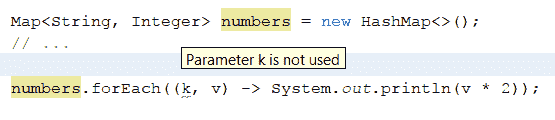

# 第三十章：下一步是什么？

最后，我们一起来到了最后一章。我们构建了多种不同类型的应用程序，试图突出和演示 Java 平台的不同部分，特别是那些新加入 Java 9 的部分。正如我们讨论的那样，仅使用 Java 9 的新技术和 API 来编写东西是不可能的，所以我们还看到了来自 Java 7 和 8 的许多有趣的项目。随着 Java 9 终于发布，展望 Java 的未来对我们来说是有意义的，但同时也明智地看看其他语言提供了什么，这样我们才能决定我们的下一个 Java 是否真的是 Java。在这一章中，我们将这样做。

在这一章中，我们将涵盖以下主题：

+   回顾我们之前讨论过的主题

+   我们可以期待的未来

# 回顾

在展望 Java 10 及其以后之前，让我们快速回顾一下这本书中我们涵盖的一些内容：

+   Java 平台模块系统，可能是这次发布中平台最大的、最受期待的添加。我们看到了如何创建一个模块，并讨论了它对运行时系统的影响。

+   我们探讨了 Java 9 中的新进程管理 API，学习了如何查看进程，并在需要时终止它们。

+   我们查看了一些 Java 8 引入的主要功能接口，讨论了它们的使用方法，并展示了使用和未使用这些接口支持的 lambda 表达式时的代码可能看起来如何。

+   我们详细讨论了 Java 8 的`Optional<T>`，展示了如何创建类的实例，它暴露的各种方法，以及如何使用它。

+   我们花了很多时间构建基于 JavaFX 的应用程序，展示了各种技巧和窍门，解决了一些**陷阱**等问题。

+   使用 Java NIO 文件和路径 API，我们在文件系统中漫步，寻找重复文件。

+   我们使用 Java 持久化 API 实现了数据持久化，展示了如何在 Java SE 环境中使用该 API，如何定义实体等。

+   我们使用 Java 8 日期/时间 API 构建了一个计算器，将功能作为库和命令行实用工具公开。

+   作为这项工作的一部分，我们简要比较了几种命令行实用工具框架（特别是关注 Crest 和 Airline），然后在 Crest 上定居，并演示了如何创建和消费命令行选项。

+   虽然我们并不是在每一章都关注它，但我们确实停下来讨论并演示了单元测试。

+   我们了解了**服务提供者接口**（**SPIs**）作为提供多个替代实现接口的手段，这些实现可以在运行时动态加载。

+   我们实现了几个 REST 服务，不仅演示了 JAX-RS 的基本功能，如何在 Java SE 环境中部署它，以及 POJO 映射，还包括一些更高级的功能，如服务器端事件和通过`Filter`保护端点。

+   我们构建了几个 Android 应用程序，讨论并展示了活动、片段、服务、内容提供者、异步消息和后台任务。

+   我们看到了 OAuth2 认证流程的实际操作，包括如何使用 Google OAuth 提供者设置凭据以及驱动此过程的 Java 代码。

+   我们发现了 JSON Web Tokens，这是一种在客户端和服务器之间安全传输数据的加密方式，例如，我们看到了它们作为认证系统一部分的基本用法。

+   我们参观了 JavaMail API，了解了一些常见电子邮件协议（如 POP3 和 SMTP）的历史和工作原理。

+   我们学习了如何使用 Quartz 调度器库进行工作调度。

+   我们看到了如何以声明性方式指定我们数据中的约束，然后如何使用 Bean Validation API 根据这些约束验证数据。

+   完全转变方向，我们使用功能丰富的 NetBeans Rich Client Platform 构建了一个中等复杂的应用程序。

+   我们简要地了解了使用 MongoDB 的世界文档数据库。

+   我们还学习了依赖注入以及如何使用 CDI 规范来实现它。

这已经是一个相当长的列表，而且还没有涵盖所有内容。本书的一个明确目的是讨论和展示 Java 9 的新特性。Java 9 的发布中包含了近 100 个**Java 增强提案**（**JEPs**），这使得其中一些特性的展示变得相当困难，但我们已经尽力了。

# 展望未来

既然 Java 9 已经完成，那么自然而然的问题是，**接下来是什么？**正如你所预期的那样，在 Java 9 被规划和开发的同时，Oracle、Red Hat、IBM、Azul Systems 等公司的工程师们已经在思考这个问题。虽然很难确定 Java 10 将包含什么（记住，完成模块系统需要三个主要版本），但我们确实有一些目前正在讨论和设计中的项目，希望它们能在下一个版本中发布。在接下来的几页中，我们将探讨其中的一些，以便提前了解作为 Java 开发者，我们的生活可能在几年后是什么样的。

# 项目 Valhalla

项目 Valhalla 是**高级语言-VM 协同开发项目的孵化地**。它由 Oracle 工程师 Brian Goetz 领导。截至本文撰写时，Valhalla 有三个计划中的特性。它们是值类型、泛型特化和具现泛型。

# 值类型

这个努力的目标是更新 Java 虚拟机，如果可能的话，更新 Java 语言，以支持小型、不可变、**无身份**的值类型。目前，如果你实例化一个新的`Object`，JVM 会为其分配一个标识符，这使得**变量**实例可以被引用。

例如，如果你创建一个新的整数，`new Integer(42)`，一个具有`java.lang.Integer@68f29546`身份的变量，但值为`42`，这个变量的值永远不会改变，这是我们作为开发者通常关心的所有。然而，JVM 实际上并不知道这一点，因此它必须维护变量的身份，以及所有相关的开销。根据戈茨的说法，这意味着每个对象的实例将需要多达 24 个额外的字节来存储实例。例如，如果你有一个这样的大型数组，那可能是一个需要管理的显著内存量，最终还需要进行垃圾回收。

那么，JVM 工程师希望实现的是一种方法，**温和地扩展**Java 虚拟机字节码和 Java 语言本身，以支持小而不可变的聚合类型（想象一下具有 0 个或更多属性的一个类）的概念，这种类型没有身份，希望这将导致“内存和局部性高效的编程习惯，而不牺牲封装性”。他们的希望是，Java 开发者能够创建这些新类型，并将它们视为另一个原始类型。戈茨说，如果他们正确地完成工作，这个特性可以总结为**像类一样编码，像 int 一样工作！**

到 2017 年 4 月为止的当前提案([`cr.openjdk.java.net/~jrose/values/shady-values.html`](http://cr.openjdk.java.net/~jrose/values/shady-values.html))提供了一个代码片段，作为如何定义值类型的示例：

```java
    @jvm.internal.value.DeriveValueType 
    public final class DoubleComplex { 
      public final double re, im; 
      private DoubleComplex(double re, double im) { 
        this.re = re; this.im = im; 
      } 
      ... // toString/equals/hashCode, accessors,
       math functions, etc. 
    } 
```

当实例化时，这种类型的实例可以在栈上而不是在堆上创建，并且使用更少的内存。这是一个非常底层和技术的讨论，远远超出了本书的范围，但如果你对更多细节感兴趣，我建议阅读前面链接的页面，或者这个努力的初始公告在[`cr.openjdk.java.net/~jrose/values/values-0.html`](http://cr.openjdk.java.net/~jrose/values/values-0.html)。

# 泛型特殊化

泛型特殊化可能更容易理解。目前，泛型类型变量只能持有引用类型。例如，你可以创建一个`List<Integer>`，但不能创建一个`List<int>`。为什么会有这样的限制，背后有一些相当复杂的原因，但能够使用原始类型和值类型会使集合在内存和计算效率上更加高效。你可以在以下文档中了解更多关于这个特性的信息，再次提到，是布赖恩·戈茨的文档--[`cr.openjdk.java.net/~briangoetz/valhalla/specialization.html`](http://cr.openjdk.java.net/~briangoetz/valhalla/specialization.html)。Jesper de Jong 也在这里详细介绍了泛型类型变量中原始类型的复杂性：

[`www.jesperdj.com/2015/10/12/project-valhalla-generic-specialization/`](http://www.jesperdj.com/2015/10/12/project-valhalla-generic-specialization/)

# 实体化泛型

“具体化泛型”这个术语，似乎常常引起非常激烈、生动的反应。目前，如果你声明一个变量为`List<Integer>`类型，生成的字节码没有对参数化类型的真正理解，因此在运行时无法发现。如果你在运行时检查该变量，你将看不到`Integer`的提及。当然，你可以查看每个元素的类型，但即使如此，你也不能确定`List`的类型，因为没有东西强制只允许将`Integer`添加到`List`中。

自从 Java 5 引入泛型以来，Java 开发者一直迫切希望实现泛型的具体化，或者说，泛型在运行时保留其类型信息。正如你可能猜到的，使 Java 的泛型具体化并非易事，但最终，我们有了正式的努力来验证它是否可行，如果可行，还要找到一种向后兼容的方法，例如，不产生例如性能下降等负面影响。

# 项目 Panama

虽然目前尚未针对任何特定的 Java 版本进行目标定位，但项目 Panama 为那些使用或希望使用第三方本地库的人提供了一些希望。目前，将本地库（即用 C 或 C++编写的特定于操作系统的库）暴露给 JVM 的主要方式是通过**Java Native Interface**（JNI）。JNI 的问题之一（至少是其中之一）是它要求每个希望将本地库暴露给 JVM 的 Java 程序员也成为 C 程序员，这意味着不仅需要 C 语言本身，还需要为每个支持的平台的相关构建工具。

项目 Panama 希望通过为 Java 开发者提供一种新的方式来暴露本地库，而无需深入了解库语言生态系统或 JVM，从而改善上述问题。项目 Panama 的 JEP（[`openjdk.java.net/jeps/191`](http://openjdk.java.net/jeps/191)）列出了以下设计目标：

+   一个元数据系统，用于描述本地库调用（调用协议、参数列表结构、参数类型、返回类型）以及本地内存结构（大小、布局、类型、生命周期）。

+   发现和加载本地库的机制。这些功能可能由当前的`System.loadLibrary`提供，或者可能包括为定位适合主机系统的平台或版本特定的二进制文件提供额外的增强。

+   基于元数据将特定的库/函数坐标绑定到 Java 端点，很可能是通过用户定义的接口，并由管道支持来实现本地下调用。

+   基于元数据将特定内存结构（布局、字节序、逻辑类型）绑定到 Java 端点，无论是通过用户定义的接口还是用户定义的类，在这两种情况下都由管道支持来管理实际的本地内存块。

+   适当的代码来将 Java 数据类型转换为本地数据类型，反之亦然。在某些情况下，这需要创建 FFI 特定的类型来支持 Java 无法表示的位宽和数值符号。

JNI 已经存在一段时间了，它终于得到了一些迟到的关注。

# 项目 Amber

项目 Amber 的目标是**探索和孵化更小、面向生产力的 Java 语言特性**。当前列表包括局部变量类型推断、增强枚举和 lambda leftovers。

# 局部-变量类型推断

就像在这本书中我们无数次看到的那样，当你 Java 中声明一个变量时，你必须声明两次类型，一次在左侧，一次在右侧，加上一个变量名：

```java
    AtomicInteger atomicInt = new AtomicInteger(42); 
```

这里的问题是这段代码冗长且重复。局部变量类型推断的努力希望解决这个问题，使得代码可以像这样：

```java
    var atomicInt = new AtomicInteger(42); 
```

这段代码更加简洁，使其更易于阅读。注意`val`关键字的添加。通常，当编译器看到`<type> <name> = ...`这样的行时，它知道这是一条变量声明。由于这项工作将消除声明左侧类型的需求，我们需要一个提示编译器，这个提示由本 JEP 的作者提出为`var`。

还有一些关于简化不可变或`final`变量声明的讨论。建议包括`final var`以及`val`，如 Scala 等语言中所示。在撰写本文时，尚未就哪个建议将最终被采纳做出决定。

# 增强枚举

增强枚举将通过允许枚举中使用类型变量（泛型枚举）并执行对枚举常量的更精确的类型检查来增强 Java 语言中枚举构造的表达能力。这意味着枚举最终将支持参数化类型，允许像这样（从之前提到的链接中的 JEP 中摘取）：

```java
    enum Primitive<X> { 
      INT<Integer>(Integer.class, 0) { 
        int mod(int x, int y) { return x % y; } 
        int add(int x, int y) { return x + y; } 
      }, 
      FLOAT<Float>(Float.class, 0f)  { 
        long add(long x, long y) { return x + y; } 
      }, ... ; 

      final Class<X> boxClass; 
      final X defaultValue; 

      Primitive(Class<X> boxClass, X defaultValue) { 
        this.boxClass = boxClass; 
        this.defaultValue = defaultValue; 
      } 
    } 
```

注意，除了为每个`enum`值指定一个泛型类型外，我们还可以为每个`enum`类型定义特定类型的函数。这将使定义一组预定义常量变得更加容易，同时也为每个常量定义类型安全和类型感知的方法。

# Lambda leftovers

目前在 Java 8 的 lambda 工作中，有两个被标记为`leftovers`的项目。第一个是 lambda 声明中未使用参数使用下划线的用法。例如，在这个非常牵强的例子中，我们只关心`Map`的值：

```java
    Map<String, Integer> numbers = new HashMap<>(); 
    numbers.forEach((k, v) -> System.out.println(v*2)); 
```

这在 IDE 中导致如下情况：



一旦允许使用下划线，这段代码将看起来像这样：

```java
    numbers.forEach((_, v) -> System.out.println(v*2)); 
```

这允许更好地检查未使用的变量，使得工具（和开发者）可以更容易地识别这样的参数，并对其进行纠正或标记。

另一个遗留问题是允许 lambda 参数遮蔽封装作用域中的变量。如果你现在尝试这样做，你将得到与尝试在语句块内重新定义变量时相同的错误——**变量已定义**：

```java
    Map<String, Integer> numbers = new HashMap<>(); 
    String key = someMethod(); 
    numbers.forEach((key, value) ->  
      System.out.println(value*2)); // error 
```

随着这一变化，前面的代码将能够编译并正常运行。

# 环顾四周

JVM 多年来一直支持替代语言。其中一些较为知名的语言包括 Groovy 和 Scala。多年来，这两种语言在某种程度上都影响了 Java，但像任何语言一样，它们并非没有问题。许多人认为 Groovy 的性能不如 Java（尽管`invokedynamic`字节码指令本应解决这个问题），许多人发现 Groovy 更动态的特性不太吸引人。另一方面，Scala（无论是否公平，取决于你问谁）给人一种过于复杂的印象。编译时间也是常见的抱怨。此外，许多组织都很高兴地使用这两种语言，因此它们绝对值得考虑，看看它们是否适合你的环境和需求。

虽然这些语言可能很出色，但我们在这里花些时间来看看接下来是什么，至少有两种语言似乎脱颖而出——塞隆和科特林。我们无法对每种语言都进行详尽的介绍，但在接下来的几页中，我们将快速浏览这些语言，看看它们现在为 JVM 开发者提供了什么，也许还能看看它们可能会如何影响 Java 语言的未来变化。

# 塞隆

由红帽赞助的塞隆语言首次出现在 2011 年左右。由 Hibernate 和 Seam 框架的知名人物 Gavin King 领导的团队着手在语言和库层面解决他们在开发自己的框架和库过程中多年来的痛点。虽然他们承认自己是 Java 语言的**无怨无悔的粉丝**，但他们也乐于承认这种语言并不完美，特别是在一些标准库方面，并旨在在塞隆中修复这些缺陷。该语言的目标包括可读性、可预测性、可工具化、模块化和元编程([`ceylon-lang.org/blog/2012/01/10/goals`](https://ceylon-lang.org/blog/2012/01/10/goals))。

当你开始使用塞隆时，你可能会注意到最大的不同之一是模块的概念已经内置于语言中。在许多方面，它看起来非常类似于 Java 9 的模块声明，如下所示：

```java
    module com.example.foo "1.0" { 
      import com.example.bar "2.1"; 
    } 
```

然而，有一个非常明显的区别——塞隆模块**确实**有版本信息，这允许不同的模块依赖于系统中可能已经存在的模块的不同版本。

塞隆与，比如说，Java 之间至少还有一个相当显著的不同点——塞隆内置了一个构建工具。虽然例如有一个 Maven 插件，但首选的方法是使用塞隆的本地工具来构建和运行项目：

```java
$ ceylonb new hello-world 
Enter project folder name [helloworld]: ceylon-helloworld 
Enter module name [com.example.helloworld]: 
Enter module version [1.0.0]: 
Would you like to generate Eclipse project files? (y/n) [y]: n 
Would you like to generate an ant build.xml? (y/n) [y]: n 
$ cd ceylon-helloworld 
$ ceylonb compile 
Note: Created module com.example.helloworld/1.0.0 
$ ceylonb run com.example.helloworld/1.0.0 
Hello, World! 
```

除了模块系统，Ceylon 还能为 Java 开发者提供什么？其中一个更直接有用且实用的特性是改进了 null 处理支持。就像我们在 Java 中必须做的那样，在 Ceylon 中我们仍然需要检查 null，但该语言提供了一种更优雅的方法，这一切都始于类型系统。

关于 Scala 的一个抱怨（无论其是否真正有理）是类型系统太复杂。无论你是否同意，似乎很清楚，在 Java 提供的基础上确实有改进的空间（例如，Java 语言架构师也同意，例如，通过提出的局部变量类型推断建议）。Ceylon 为类型系统提供了一个非常强大的补充——联合类型和交叉类型。

联合类型允许一个变量具有多个类型，但一次只能有一个。在讨论 null 时，这一点很重要，`String? foo = ...` ，这声明了一个类型为 `String` 的可空变量，实际上等同于 `String|Null foo = ...`。

这声明了一个变量，foo，其类型可以是 `String` 或 `Null`，但不能同时是两者。`?` 语法只是联合类型声明（`A | B` 或 `A` 或 `B`）的语法糖。如果我们有一个方法，那么它接受这个联合类型；我们知道该变量是可空的，因此我们需要使用以下代码片段进行检查：

```java
    void bar (String? Foo) { 
      if (exists foo) { 
        print (foo); 
      } 
    } 
```

由于这是一个联合类型，我们也可以这样做：

```java
    void bar (String? Foo) { 
      if (is String foo) { 
        print (foo); 
      } 
    } 
```

注意，一旦我们使用 `exists` 或 `is` 进行测试，我们就可以假设该变量不是 null，并且是 `String` 类型。编译器不会报错，我们也不会在运行时遇到意外的 `NullPointerException`（在 Ceylon 中实际上不存在，因为编译器要求你在处理可空变量时非常明确）。这种编译器对 null 和类型检查的感知称为 **流敏感** 类型。一旦你验证了某个类型，编译器就会知道并记住，换句话说，在整个作用域的剩余部分都会记住这个检查的结果，这样你可以编写更干净、更简洁的代码。

联合类型要么是 A 或 B，而交叉类型则是 A **和** B。为了一个完全随机的例子，让我们假设你有一个方法，其参数必须是 `Serializable` **和** `Closeable`。在 Java 中，你将不得不手动检查，如下所示：

```java
    public void someMethod (Object object) { 
      if (!(object instanceof Serializable) ||  
        !(object instanceof Closeable)) { 
        // throw Exception 
      } 
    } 
```

使用交叉类型，Ceylon 允许我们这样写：

```java
    void someMethod(Serializable&Closeable object) { 
      // ... 
    } 
```

如果我们尝试用没有实现 **两个** 接口的东西调用那个方法，或者说，扩展一个类并实现另一个接口，那么我们会在 **编译时** 得到错误。这非常强大。

在企业中采用新语言或库之前，人们通常会看看其他人是否在使用它。是否有值得注意的采用案例？是否有其他公司对这项技术有足够的信心，用它来构建生产系统？不幸的是，Ceylon 网站（在撰写本文时）在 Red Hat 之外的使用细节非常少，所以很难回答这个问题。然而，Red Hat 正在投入大量资金设计这种语言，并围绕它构建工具和社区，所以这应该是一个安全的赌注。当然，这是一个企业经过仔细考虑后必须做出的决定。你可以在[`ceylon-lang.org`](https://ceylon-lang.org)了解更多关于 Ceylon 的信息。

# Kotlin

另一种新兴的语言是 Kotlin。它是由 IntelliJ IDEA 的制造商 JetBrains 开发的一种静态类型语言，旨在针对 JVM 和 JavaScript。它甚至为那些环境（如 iOS、嵌入式系统等）提供了将代码直接编译成机器代码的支持，在这些环境中不希望或允许使用虚拟机。

Kotlin 于 2010 年开始开发，并于 2012 年开源，旨在解决 JetBrains 在大型 Java 开发中遇到的一些常见问题。在调查了当时现有的语言环境后，他们的工程师认为当时没有哪种语言能够充分解决他们的担忧。多年来被许多人视为“下一个 Java”的 Scala，尽管功能集可接受，但在编译速度上被认为太慢，因此 JetBrains 开始设计他们自己的语言，最终于 2016 年 2 月发布了 1.0 版本。

Kotlin 团队的设计目标包括表达性、可扩展性和互操作性。他们希望通过语言和库功能，让开发者用更少的代码以更清晰的方式完成更多的工作，并且在一个 100%与 Java 互操作的语言中。他们添加了诸如协程等特性，以使基于 Kotlin 的系统能够快速且容易地扩展。

说了这么多，Kotlin 是什么样的，为什么作为 Java 开发者我们应该感兴趣呢？让我们从变量开始。

如你所回忆的，Java 既有原始类型（`int`、`double`、`float`、`char`等）也有引用类型或**包装器**类型（`Integer`、`Double`、`Float`、`String`等）。正如我们在本章中讨论的，JVM 工程师正在研究方法来改善这种二分法带来的行为和能力差异。Kotlin 完全避免了这种情况，因为每个值都是一个对象，所以无需担心`List<int>`与`List<Integer>`之间的区别。

此外，Kotlin 已经支持局部变量类型推断以及不可变性。例如，以下 Java 代码可以作为示例：

```java
    Integer a = new Integer(1); 
    final String s = "This is a string literal"; 
```

上述代码行在 Kotlin 中可以写成这样：

```java
    var a = 1; 
    val s = "This is a string literal"; 
```

注意`var`和`val`关键字的使用。如前所述，关于未来 Java 语言的变化，这些关键字允许我们声明可变和不可变变量（分别）。此外，请注意，我们不需要声明变量的类型，因为编译器会为我们处理。在某些情况下，我们可能需要显式声明类型，例如，在编译器可能猜错或没有足够信息进行猜测的情况下，此时，它将停止编译并显示错误信息。在这些情况下，我们可以这样声明类型：

```java
    var a: Int  = 1; 
    val s: String = "This is a string literal"; 
```

如我们所见，随着 Java 8 的推出，我们有`Optional<T>`来帮助处理 null 值。Kotlin 也有 null 支持，但它内置在语言中。默认情况下，Kotlin 中的所有变量**都不是**可空的。也就是说，如果你尝试将 null 值赋给变量，或者编译器无法确定值是否可能为 null（例如，Java API 的返回值），你将得到编译器错误。要表示一个值是可空的，你可以在变量声明中添加一个`?`，如下所示：

```java
    var var1 : String = null; // error 
    var var2 : String? = null; // ok 
```

Kotlin 还在方法调用中提供了改进的 null 处理支持。例如，假设你想获取一个用户的 city。在 Java 中，你可能这样做：

```java
    String city = null; 
    User user = getUser(); 
    if (user != null) { 
      Address address = user.getAddress(); 
      if (address != null) { 
        city address.getCity(); 
      } 
    } 
```

在 Kotlin 中，这可以表达为以下单行代码：

```java
    var city : String? = getUser()?.getAddress()?.getCity(); 
```

如果在任何时候，其中一个方法返回 null，方法调用链将结束，并将 null 赋值给变量 city。Kotlin 在处理 null 方面并不止步于此。例如，它提供了一个`let`函数，可以作为 if-not-null 检查的快捷方式。例如，考虑以下代码行：

```java
    if (city != null) { 
      System.out.println(city.toUpperCase()); 
    } 
```

上述代码行在 Kotlin 中变为以下形式：

```java
    city?.let { 
      println(city.toUpperCase()) 
    } 
```

当然，这可以写成`city?.toUpperCase()`。但这应该展示的是在任意大、复杂的代码块中安全使用可空变量的能力。还值得注意的是，在`let`块内部，编译器知道`city`不是 null，因此不需要进一步的 null 检查。

在前面的例子中，可能隐藏着 Kotlin 对 lambda 的支持，没有这种支持，似乎现代语言就失去了考虑的价值。Kotlin 确实完全支持 lambda、高阶函数、下划线作为 lambda 参数名等。它的支持和语法与 Java 非常相似，因此 Java 开发者应该对 Kotlin 的 lambda 感到非常舒适。

当然，最大的问题是**Kotlin 是否已经准备好进入主流使用阶段了？**JetBrains 肯定是这样认为的，因为他们已经在许多内部和外部应用中使用它。其他知名用户包括 Pinterest、Gradle、Evernote、Uber、Pivotal、Atlassian 和 Basecamp。Kotlin 甚至被 Google（在 Android Studio 中）官方支持用于 Android 开发，所以它绝对是一种生产级语言。

当然，关于这门伟大的新语言，还有很多很多内容，空间有限，我们无法全部讨论，但你可以浏览[`kotlinlang.org`](https://kotlinlang.org)来了解更多信息，并看看 Kotlin 是否适合你的组织。

# 摘要

当然，关于 Java 10 以及这两种语言，以及围绕 Java 虚拟机发生的众多其他项目，还有很多可以讨论的内容。经过超过 20 年的发展，Java——这门语言**以及**其环境——仍然势头强劲。在这本书的篇章中，我试图展示语言中的一些重大进步，为你自己的项目提供各种起点，提供供你学习和重用的示例代码，以及解释各种库、API 和技术，这些可能在你的日常工作中有所帮助。我希望你像我准备这些例子和解释一样喜欢它们，更重要的是，我希望它们能帮助你构建下一个大项目。

祝你好运！
