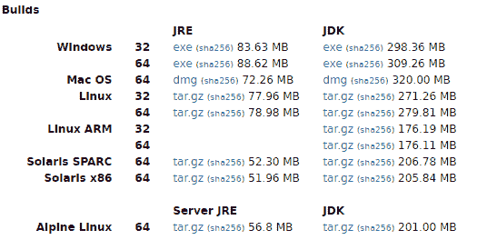
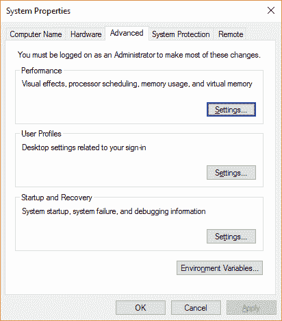
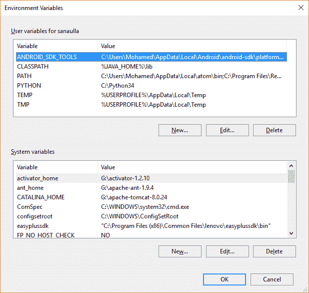
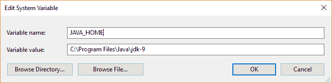
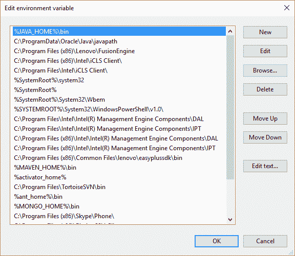
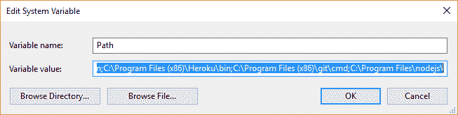
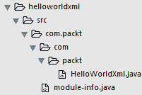
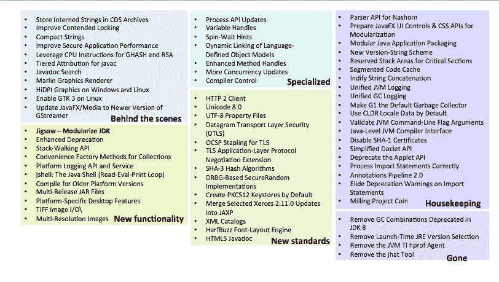
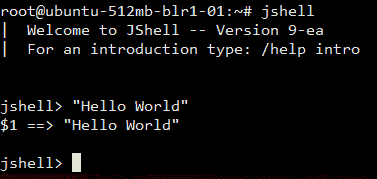
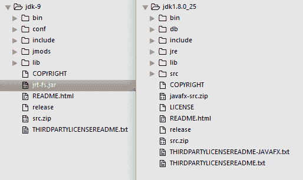

# 安装和 Java 9 的预览

在本章中，我们将介绍以下内容：

+   在 Windows 上安装 JDK 9 并设置 PATH 变量

+   在 Linux（Ubuntu，x64）上安装 JDK 9 并配置 PATH 变量

+   编译和运行 Java 应用程序

+   Java 9 的新特性

+   使用 JDK 9 中的新工具

+   比较 JDK 8 与 JDK 9

# 简介

学习任何编程语言的第一步是设置实验学习环境。与这一理念保持一致，在本章中，我们将向您展示如何设置您的开发环境，然后运行一个简单的模块化应用程序来测试我们的安装。之后，我们将向您介绍 JDK 9 中的新特性和工具。然后，我们将以 JDK 8 和 JDK 9 安装的比较来结束本章。

# 在 Windows 上安装 JDK 9 并设置 PATH 变量

在这个菜谱中，我们将探讨在 Windows 上安装 JDK 以及如何设置 `PATH` 变量，以便可以从命令行中的任何位置访问 Java 可执行文件（如 `javac`、`java` 和 `jar` 等）。

# 如何做到这一点...

1.  访问 [`jdk9.java.net/download/`](http://jdk.java.net/9/) 并接受早期采用者许可协议，它看起来像这样：

    

1.  接受许可后，您将看到一个基于操作系统和架构（32/64 位）的可用 JDK 打包网格，如下所示：

    

1.  点击下载适用于您的 Windows 平台的相应 JDK 可执行文件（`.exe`）。

1.  运行 JDK 可执行文件（`.exe`）并遵循屏幕上的说明来安装 JDK 到您的系统上。

1.  如果您在安装过程中选择了所有默认设置，您将发现在 64 位系统上 JDK 安装在 `C:/Program Files/Java`，在 32 位系统上安装在 `C:/Program Files (x86)/Java`。

现在我们已经完成了 JDK 的安装，让我们看看如何设置 `PATH` 变量。

JDK 提供的工具，包括 `javac`、`java`、`jconsole` 和 `jlink` 等，都位于 JDK 安装目录的 bin 目录中。您可以从命令提示符运行这些工具的两种方式：

1.  导航到工具安装的目录，然后按照以下方式运行它们：

```java
 cd "C:\Program Files\Java\jdk-9\bin"
      javac -version
```

1.  将路径导出到目录，以便工具可以从命令提示符中的任何目录访问。为了实现这一点，我们必须将 JDK 工具的路径添加到 `PATH` 环境变量中。命令提示符将在 `PATH` 环境变量中声明的所有位置中搜索相关工具。

让我们看看如何将 JDK bin 目录添加到 `PATH` 变量中：

1.  右键单击“我的电脑”，然后单击“属性”。您将看到系统信息。搜索“高级系统设置”并单击它以获取以下截图所示的窗口：



1.  点击“环境变量”以查看系统中定义的变量。您将看到已经定义了相当多的环境变量，如下面的截图所示（系统之间的变量会有所不同；在下面的截图中，有一些预定义的变量和几个我添加的变量）：在系统变量下定义的变量对所有系统用户都可用，而在 `sanaulla` 的用户变量下定义的变量仅对用户 `sanaulla` 可用。

1.  在 `<your username>` 的用户变量下点击“新建”，添加一个名为 `JAVA_HOME` 的新变量，其值为 JDK 9 安装的位置。例如，对于 64 位系统将是 `C:/Program Files/Java/jdk-9`，对于 32 位系统将是 `C:/Program Files (x86)/Java/jdk-9`：



1.  下一步是将 `PATH` 环境变量更新为 JDK 安装（在 `JAVA_HOME` 环境变量中定义）的 bin 目录位置。如果您已经在列表中看到了 `PATH` 变量，则需要选择该变量并点击“编辑”。如果未看到 `PATH` 变量，则点击“新建”。

1.  上一步中的任何操作都会弹出一个窗口，如下面的截图所示（在 Windows 10 上）：



以下图像显示了其他 Windows 版本：



1.  您可以点击第一张图中的“新建”并插入值，`%JAVA_HOME%/bin`，或者通过添加 `; %JAVA_HOME%/bin` 来追加变量值字段中的值。在 Windows 中，分号 (`;`) 用于分隔给定变量名的多个值。

1.  设置值后，打开命令提示符，然后运行 `javac -version`，您应该能看到输出为 `javac 9-ea`。如果您看不到它，那么这意味着您的 JDK 安装的 bin 目录尚未正确添加到 `PATH` 变量中。

# 在 Linux (Ubuntu, x64) 上安装 JDK 9 并配置 PATH 变量

在本教程中，我们将探讨如何在 Linux (Ubuntu, x64) 上安装 JDK，以及如何配置 `PATH` 变量，以便在终端的任何位置使用 JDK 工具（如 `javac`、`java`、`jar` 等）。

# 如何操作...

1.  按照教程 *在 Windows 上安装 JDK 9 并设置 PATH 变量* 的步骤 1 和 2，到达下载页面。

1.  从下载页面复制适用于 Linux x64 平台的 JDK 下载链接 (`tar.gz`)。

1.  使用 `$> wget <copied link>` 下载 JDK，例如，`$> wget http://download.java.net/java/jdk9/archive/180/binaries/jdk-9+180_linux-x64_bin.tar.gz`。

1.  下载完成后，您应该有相关的 JDK 可用，例如`jdk-9+180_linux-x64_bin.tar.gz`。您可以使用`$> tar -tf jdk-9+180_linux-x64_bin.tar.gz`列出内容。您甚至可以将它管道到`more`以分页显示输出：`$> tar -tf jdk-9+180_linux-x64_bin.tar.gz | more`。

1.  使用`$> tar -xvzf jdk-9+180_linux-x64_bin.tar.gz -C /usr/lib`通过在`/usr/lib`下提取`tar.gz`文件的内容。这将提取内容到一个目录，`/usr/lib/jdk-9`。然后，您可以使用`$> ls /usr/lib/jdk-9`列出 JDK 9 的内容。

1.  通过编辑您 Linux 主目录下的`.bash_aliases`文件来更新`JAVA_HOME`和`PATH`变量：

```java
 $> vim ~/.bash_aliases
      export JAVA_HOME=/usr/lib/jdk-9
      export PATH=$PATH:$JAVA_HOME/bin
```

源`.bashrc`文件以应用新别名：

```java
 $> source ~/.bashrc
      $> echo $JAVA_HOME
      /usr/lib/jdk-9
      $>javac -version
      javac 9
      $> java -version
      java version "9"
 Java(TM) SE Runtime Environment (build 9+180)
 Java HotSpot(TM) 64-Bit Server VM (build 9+180, mixed mode)
```

本书中的所有示例都是在 Linux（Ubuntu，x64）上针对安装的 JDK 运行的，除非我们特别指出这些是在 Windows 上运行的。我们已尝试为这两个平台提供运行脚本。

JavaFX 的菜谱在 Windows 上完全执行。

# 编译和运行 Java 应用程序

在这个菜谱中，我们将编写一个非常简单的模块化`Hello world`程序来测试我们的 JDK 安装。这个简单的示例以 XML 格式打印`Hello world`；毕竟，这是网络服务的世界。

# 准备工作

您应该已经安装了 JDK，并且将`PATH`变量更新为指向 JDK 安装位置。

# 如何做到...

1.  让我们定义具有相关属性和注释的模型对象，这些注释将被序列化为 XML：

```java
        @XmlRootElement
        @XmlAccessorType(XmlAccessType.FIELD) 
        class Messages{     
          @XmlElement 
          public final String message = "Hello World in XML"; 
        }
```

在前面的代码中，`@XmlRootElement`用于定义根标签，`@XmlAccessorType`用于定义标签名称和标签值的源类型，`@XmlElement`用于标识成为 XML 中标签名称和标签值的源：

1.  现在，让我们使用 JAXB 将`Message`类的实例序列化为 XML：

```java
        public class HelloWorldXml{
          public static void main(String[] args) throws JAXBException{
            JAXBContext jaxb = JAXBContext.newInstance(Messages.class);
            Marshaller marshaller = jaxb.createMarshaller();
            marshaller.setProperty(Marshaller.JAXB_FRAGMENT,
                                   Boolean.TRUE);
            StringWriter writer = new StringWriter();
            marshaller.marshal(new Messages(), writer);
            System.out.println(writer.toString());
          } 
        }
```

1.  现在，我们将创建一个名为`com.packt`的模块。要创建一个模块，我们需要创建一个名为`module-info.java`的文件，其中包含模块定义。模块定义包含模块的依赖项以及模块导出到其他模块的包：

```java
        module com.packt{
          //depends on the java.xml.bind module
          requires java.xml.bind;
          //need this for Messages class to be available to java.xml.bind
          exports  com.packt to java.xml.bind;
        }
```

我们将在第三章中详细解释模块，*模块化编程*。但这个例子只是为了给您一个模块化编程的尝鲜，同时也是为了测试您的 JDK 安装。

前面文件的目录结构如下：



1.  让我们现在编译并运行代码。从`hellowordxml`目录中，创建一个新的目录来放置您的编译后的类文件：

```java
      mkdir -p mods/com.packt
```

将源代码`HelloWorldXml.java`和`module-info.java`编译到`mods/com.packt`目录中：

```java
 javac -d mods/com.packt/ src/com.packt/module-info.java
      src/com.packt/com/packt/HelloWorldXml.java
```

1.  使用`java --module-path mods -m com.packt/com.packt.HelloWorldXml`运行编译后的代码。您将看到以下输出：

```java
<messages><message>Hello World in XML</message></messages>
```

如果您无法理解`java`或`javac`命令传递的选项，请不要担心。您将在第三章《模块化编程》中了解它们。

# Java 9 的新特性

Java 9 的发布是 Java 生态系统中的一个里程碑。在 Project Jigsaw 下开发的备受期待的模块化框架将成为这个 Java SE 版本的一部分。另一个主要特性是 JShell 工具，这是一个 Java 的 REPL 工具。除此之外，还有其他重要的 API 更改和 JVM 级别的更改，以提高 JVM 的性能和调试性。在一篇博客文章([`blogs.oracle.com/java/jdk-9-categories`](https://blogs.oracle.com/java/jdk-9-categories))中，Yolande Poirier 将 JDK 9 特性分类如下：

1.  背后

1.  新功能

1.  专用

1.  新标准

1.  清理工作

1.  已消失

同一篇博客文章将前面的分类总结成以下图像：



在这个菜谱中，我们将讨论 JDK 9 的一些重要特性，并在可能的情况下，也会展示该特性的一个小代码片段。JDK 中的每个新特性都是通过**JDK 增强提案**（也称为**JEP**）引入的。有关 JDK 9 中不同 JEP 的更多信息以及 JDK 9 的发布计划，可以在官方项目页面上找到：

[`openjdk.java.net/projects/jdk9/`](http://openjdk.java.net/projects/jdk9/)

# 如何做到这一点...

我们挑选了一些我们认为很棒且值得了解的特性。在接下来的几个部分中，我们将简要介绍这些特性。

# JEP 102 -- Process API 更新

Java 的 Process API 相当原始，仅支持启动新进程、重定向进程的输出和错误流。在这个版本中，Process API 的更新使得以下功能成为可能：

+   获取当前 JVM 进程的 PID 以及由 JVM 产生的任何其他进程的 PID

+   列出系统中运行的过程以获取诸如 PID、名称和资源使用情况等信息

+   管理进程树

+   管理子进程

让我们看看一个示例代码，该代码打印当前 PID 以及当前进程信息：

```java
//NewFeatures.java
public class NewFeatures{
  public static void main(String [] args) {
    ProcessHandle currentProcess = ProcessHandle.current();
    System.out.println("PID: " + currentProcess.getPid());
    ProcessHandle.Info currentProcessInfo = currentProcess.info();
    System.out.println("Info: " + currentProcessInfo);
  }
}
```

# JEP 110 -- HTTP/2 客户端

这个特性被包含在孵化器模块中。这意味着该特性预计在后续版本中会有所变化，甚至可能被完全删除。因此，我们建议您以实验性方式使用它。

Java 的 HTTP API 一直是最原始的。开发者经常求助于使用第三方库，例如 Apache HTTP、RESTlet、Jersey 等。除此之外，Java 的 HTTP API 早于 HTTP/1.1 规范，并且是同步的，难以维护。这些限制要求添加一个新的 API。新的 HTTP 客户端 API 提供了以下功能：

+   一个简单且简洁的 API 来处理大多数 HTTP 请求

+   支持 HTTP/2 规范

+   更好的性能

+   更好的安全性

+   一些额外的增强

让我们看看一个示例代码，使用新的 API 来进行 HTTP GET 请求。以下是在文件 `module-info.java` 中定义的模块定义：

```java
//module-info.java
module newfeatures{
    requires jdk.incubator.httpclient;
}

```

以下代码使用 HTTP 客户端 API，它是 `jdk.incubator.httpclient` 模块的一部分：

```java
import jdk.incubator.http.*;
import java.net.URI;
public class Http2Feature{
  public static void main(String[] args) throws Exception{ 
    HttpClient client = HttpClient.newBuilder().build();
    HttpRequest request = HttpRequest
      .newBuilder(new URI("http://httpbin.org/get"))
      .GET()
      .version(HttpClient.Version.HTTP_1_1)
      .build();
    HttpResponse<String> response = client.send(request, 
      HttpResponse.BodyHandler.asString());
    System.out.println("Status code: " + response.statusCode());
    System.out.println("Response Body: " + response.body()); 
  }
}
```

# JEP 213 -- 磨削项目硬币

在 Java SE 7 中，下划线 `_` 被引入作为数字的一部分，通过在数字之间引入 `_` 可以方便地写出大数字。这有助于提高数字的可读性，例如：

```java
Integer large_Number = 123_123_123; 
System.out.println(large_Number); 
```

在 Java SE 8 中，变量名中使用 `_`，如前所述，会导致警告，但在 Java SE 9 中，这种使用会导致错误，这意味着变量名不能再包含 `_`。

这个 JEP 的另一个变化部分是支持接口中的私有方法。Java 从没有方法实现的接口开始。然后，Java SE 8 引入了默认方法，允许接口具有具有实现的方法，称为默认方法。因此，任何实现此接口的类都可以选择不覆盖默认方法，并使用接口中提供的方法实现。

Java SE 9 正在引入私有方法，其中接口中的默认方法可以通过将公共代码重构为私有方法来相互共享代码。

另一个有用的特性是允许在 try-with-resources 中使用实际上是最终的变量。截至 Java SE 8，我们需要在 try-with-resources 块内声明一个变量，如下所示：

```java
try(Connection conn = getConnection()){}catch(Exception ex){}. 
```

然而，在 Java SE 9 中，我们可以做以下事情：

```java
try(conn){}catch(Exception ex){} 
```

在这里，`conn` 是实际上是最终的；也就是说，它已经在之前声明和定义，并且在程序执行过程中永远不会重新分配。

# JEP 222: jshell -- Java shell（读取-评估-打印循环）

你一定见过像 Ruby、Scala、Groovy、Clojure 等语言，它们都附带了一个工具，通常被称为 **REPL**（**读取-评估-打印-循环**）。这个 REPL 工具在尝试语言特性时非常实用。例如，在 Scala 中，我们可以编写一个简单的 `Hello World` 程序，如下所示：`scala> println("Hello World");`

JShell REPL 的一些优点如下：

+   帮助语言学习者快速尝试语言特性

+   帮助经验丰富的开发者在使用主代码库之前快速原型设计和实验

+   Java 开发者现在可以吹嘘拥有一个 REPL

让我们快速启动我们的命令提示符/终端，并运行 JShell 命令，如下面的图像所示：



我们可以做更多的事情，但我们将把那留到第十三章，*使用 JShell 的读取-评估-打印循环（REPL）*。

# JEP 238 -- 多版本 JAR 文件

目前，JAR 文件可以包含只能运行在它们编译的 Java 版本上的类。为了利用 Java 平台在较新版本上的新功能，库开发者必须发布他们库的新版本。很快，开发者将维护库的多个版本，这可能会成为一个噩梦。为了克服这一限制，多版本 JAR 文件的新特性允许开发者构建包含不同 Java 版本类文件的不同版本的 JAR 文件。以下示例使这一点更加清晰。

下面是当前 JAR 文件的示例：

```java
jar root
  - A.class
  - B.class
  - C.class
```

下面是多版本 JAR 文件的外观：

```java
jar root
  - A.class
  - B.class
  - C.class
  - META-INF
    - versions 
      - 9
        - A.class
      - 10
        - B.class
```

在前面的示例中，JAR 文件支持两个 Java 版本的类文件--9 和 10。因此，当较早的 JAR 文件在 Java 9 上执行时，`versions` `- 9` 文件夹下的 `A.class` 会被选中执行。在不支持多版本 JAR 文件的平台上，版本目录下的类永远不会被使用。所以，如果你在 Java 8 上运行多版本 JAR 文件，它就像运行一个简单的 JAR 文件一样。

# JEP 266 -- 更多的并发更新

在这次更新中，引入了一个新的类 `java.util.concurrent.Flow`，它包含嵌套接口，支持实现发布-订阅框架。发布-订阅框架允许开发者通过设置生产数据的发布者和通过订阅消费数据的订阅者来构建可以异步消费实时数据流组件，订阅管理这些订阅者。以下是新增加的四个接口：

+   `java.util.concurrent.Flow.Publisher`

+   `java.util.concurrent.Flow.Subscriber`

+   `java.util.concurrent.Flow.Subscription`

+   `java.util.concurrent.Flow.Processor`（它同时充当 `Publisher` 和 `Subscriber`）。

# 项目 Jigsaw

本项目的主要目标是引入模块化的概念；在 Java 中支持创建模块，然后将这些应用到 JDK 中；也就是说，模块化 JDK。模块化的一些好处如下：

+   更强的封装性：模块只能访问那些已公开供使用的模块部分。因此，除非包在模块信息文件中明确导出，否则包中的公共类不是公共的。这种封装性不能通过反射（除非模块是开放模块或模块中的特定包已被公开）来破坏。

+   清晰的依赖关系：模块必须通过 `requires` 子句声明它们将使用哪些其他模块。

+   将模块组合起来创建更小的运行时环境，这可以轻松地扩展到更小的计算设备。

+   通过消除运行时错误来提高应用程序的可靠性。例如，你可能经历过应用程序在运行时由于缺少类而失败，导致 `ClassNotFoundException`。

有各种 JEP，它们是这个项目的一部分，如下所示：

+   **JEP 200 - 模块化 JDK**：这将 Java 平台模块系统应用于模块化 JDK，使其成为一组可以在编译时、构建时或运行时组合的模块。

+   **JEP 201 - 模块化源代码**：这将 JDK 源代码模块化，并增强构建工具以编译模块。

+   **JEP 220 - 模块化运行时图像**：这重构了 JDK 和 JRE 运行时图像以适应模块并提高性能、安全性和可维护性。

+   **JEP 260 - 封装大多数内部 API**：这允许许多内部 API 可以直接访问或通过反射访问。访问那些注定要改变的内部 API 风险很大。为了防止其使用，它们被封装到模块中，并且只有那些广泛使用的内部 API 才被提供，直到合适的 API 取代它们。

+   **JEP 261 - 模块系统**：这通过更改 Java 编程语言、JVM 和其他标准 API 来实现 Java 模块系统规范。这包括引入一个名为模块的新构造，`{ }`，以及其支持的键词，如 `requires`、`exports`、`opens` 和 `uses`。

+   **JEP 282: jlink，Java 链接器**：这允许将模块及其依赖项打包到更小的运行时中。

更多关于 Project Jigsaw 的详细信息可以在 Project Jigsaw 主页上找到 ([`openjdk.java.net/projects/jigsaw/`](http://openjdk.java.net/projects/jigsaw/)).

# 还有更多...

列出了许多对开发者来说很重要的功能，我们考虑将它们分组在一起以供您参考：

+   增强 Javadoc 工具以生成 HTML 5 输出，并且生成的 Javadoc 应该支持对类和其他元素的本地搜索。

+   将 G1 作为默认的垃圾回收器，并移除 Java 8 中已弃用的 GC 组合。G1 是一个新的垃圾回收器（自 Java SE 7 以来一直存在），它专注于减少垃圾回收活动的暂停时间。这些暂停时间对于延迟敏感的应用程序至关重要，因此，这些应用程序正在转向采用新的垃圾回收器。

+   将 `String` 的内部表示从使用字符数组改为使用字节数组。在字符数组中，每个数组元素是 2 个字节，观察到大多数字符串使用 1 个字节。这导致了浪费的分配。新的表示也将引入一个标志来指示使用的编码类型。

+   新的堆栈跟踪 API 支持导航堆栈跟踪，这将有助于做更多不仅仅是打印堆栈跟踪的事情。

+   允许图像 I/O 插件支持 TIFF 图像格式。

# 在 JDK 9 中使用新工具

JDK 9 中引入了一些新的命令行工具来支持新特性。我们将为您快速概述这些工具，并在后面的章节中用各自的配方进行解释。

# 准备工作

你应该已经安装了 JDK 9，并且将 JDK 安装目录下的 `bin` 目录路径添加到 `PATH` 环境变量中。此外，你需要尝试过配方中解释的 `HelloWorldXml`，即 *编译和运行 Java 应用程序*。

# 如何操作...

我们将探讨一些新引入的有趣命令行工具。

# jdeprscan

此工具用于扫描给定 JAR 文件、类路径或源目录中弃用的 API 的使用情况。假设我们有一个简单的类，它使用了 `java.awt.List` 类中弃用的方法 `addItem`，如下所示：

```java
import java.awt.List;
public class Test{
  public static void main(String[] args){
    List list = new List();
    list.addItem("Hello");
  }
}
```

编译前面的类，然后使用 `jdeprscan`，如下所示：

```java
C:Program FilesJavajdk-9bin>jdeprscan.exe -cp . Test
```

你会注意到这个工具打印出 `class Test uses method java/awt/List addItem (Ljava/lang/String;)V deprecated`，这正是我们预期的。

# jdeps

该工具通过指定 `.class` 文件、目录或 JAR 的路径来分析你的代码库，列出应用程序的包依赖关系，并列出包含该包的 JDK 模块。这有助于识别应用程序所依赖的 JDK 模块，并且是迁移到模块化应用程序的第一步。

我们可以在之前编写的 `HelloWorldXml` 示例上运行此工具，看看 `jdeps` 提供了什么：

```java
$> jdeps mods/com.packt/
com.packt -> java.base
com.packt -> java.xml.bind
com.packt -> java.io                          java.base
com.packt -> java.lang                        java.base
com.packt -> javax.xml.bind                   java.xml.bind
com.packt -> javax.xml.bind.annotation        java.xml.bind
```

# jlink

此工具用于选择模块并创建包含所选模块的较小运行时镜像。例如，我们可以通过添加在 `HelloWorldXml` 示例中创建的 `com.packt` 模块来创建运行时镜像：

```java
$> jlink --module-path mods/:$JAVA_HOME/jmods/ --add-modules com.packt --output img
```

查看文件夹 `img` 的内容，我们应该发现它包含 `bin`、`conf`、`include` 和 `lib` 目录。我们将在第三章 *模块化编程* 中学习更多关于 `jlink` 的内容。

# jmod

JMOD 是一种新的模块打包格式。这种格式允许包含原生代码、配置文件和其他不适合放入 JAR 文件中的数据。JDK 模块已被打包为 JMOD 文件。

`jmod` 命令行工具允许 `create`、`list`、`describe` 和 `hash` JMOD 文件：

+   `create`：这个用于创建一个新的 `jmod` 文件

+   `list`：这个用于列出 `jmod` 文件的内容

+   `describe`：这个用于描述模块详情

+   `hash`：这个用于记录绑定模块的哈希值

# JShell

此工具已在标题为 *JEP 222: jshell - Java shell（读取-评估-打印循环）* 的部分中简要介绍。

# 比较 JDK 8 和 JDK 9

由于在 Project Jigsaw 项目下对 JDK 应用了模块化系统，因此您的系统中安装的 JDK 目录结构发生了一些变化。除此之外，还进行了一些更改以修复 JDK 安装结构，这些更改可以追溯到 Java 1.2 时代。JDK 团队认为这是一个修复 JDK 目录结构问题的绝佳机会。

# 准备工作

要查看 JDK 9 目录结构中的差异，您需要安装一个 JDK 9 之前的版本。我们选择使用 JDK 8 与 JDK 9 进行比较。因此，在继续之前，请先安装 JDK 8。

# 如何操作...

1.  我们对以下所示的两个 JDK 安装目录进行了并排比较：



1.  以下是我们从先前的比较中得出的观察结果：

    +   `jre` 目录已被完全删除，并已被 `jmods` 和 `conf` 替换。`jmods` 目录包含 JDK 模块的运行时镜像，`conf` 目录包含配置和属性文件，这些文件之前位于 `jre` 目录下。

    +   `jrebin` 和 `jrelib` 的内容已移动到 JDK 安装目录的 lib 和 bin 目录中。

# 参考以下内容

参考本章以下配方：

+   在 JDK 9 中使用新工具
