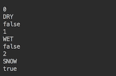
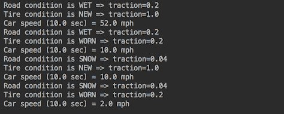
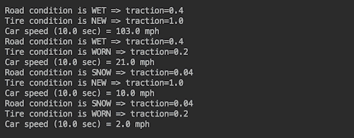
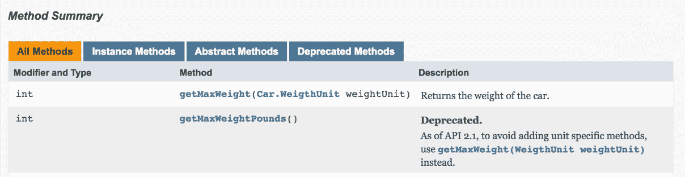
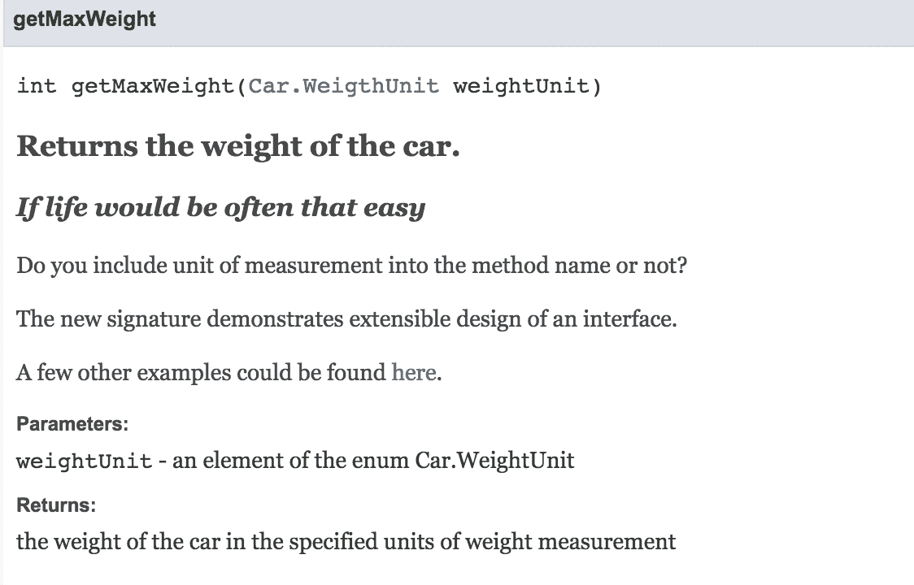

# 面向对象编程快速入门 - 类和接口

本章将涵盖以下内容：

+   使用类实现面向对象设计

+   使用内部类

+   使用继承和组合来使设计可扩展

+   面向接口编码

+   创建具有默认和静态方法的接口

+   创建具有私有方法的接口

+   使用枚举表示常量实体

+   使用@Deprecated 注解弃用 API

+   在 Javadocs 中使用 HTML5

# 简介

本章为您快速介绍了面向对象编程的组件，并涵盖了 Java 8 和 Java 9 中这些组件的新增强功能。我们还将尝试在适用的情况下涵盖一些好的面向对象设计（OOD）实践。

在整个食谱中，我们将使用新的增强功能（Java 8 和 Java 9 中引入），定义并使用具体的代码示例演示面向对象设计（OOD）的概念，并展示新的代码文档化能力。

一个人可以在书籍和互联网上花费许多小时阅读关于面向对象设计（OOD）的文章和实用建议。其中一些活动对某些人可能有益。但根据我们的经验，掌握面向对象设计的最快方式是在自己的代码中尽早尝试其原则。这正是本章的目的：让您有机会看到并使用面向对象设计（OOD）原则，以便正式定义能立即理解。

一段好代码的主要标准之一是其表达意图的清晰度。一个有动机且清晰的设计有助于实现这一点。代码是由计算机运行的，但它是由人类维护和扩展的。记住这一点将确保您编写的代码的长期有效性，也许还能得到一些感谢和赞赏的提及。

在本章中，您将学习如何使用五个基本的面向对象设计（OOD）概念：

+   对象/类 - 将数据和过程放在一起

+   封装 - 隐藏数据或过程

+   继承 - 扩展另一个类的数据或过程

+   接口 - 延迟类型实现的编码

+   多态性 - 当使用父类引用来引用子类对象时，使用基类类型为其所有扩展

这些概念将在本章提供的代码片段中定义和演示。如果您在互联网上搜索，可能会注意到许多其他概念和它们的补充都可以从我们刚才讨论的五个要点中推导出来。

虽然以下文本不需要对面向对象设计（OOD）有先前的知识，但有一些使用 Java 编写代码的经验将是有益的。代码示例完全有效，且与 Java 9 兼容。为了更好地理解，我们建议您尝试运行所提供的示例。

我们还鼓励您根据您在团队经验中的需求，将本章中的提示和建议适应到您的实际需求中。考虑与您的同事分享您新获得的知识，并讨论如何将描述的原则应用到您的领域，以及您当前的项目中。

# 使用类实现面向对象设计

在这个菜谱中，你将了解前两个面向对象设计（OOD）概念：对象/类和封装。

# 准备工作

术语*对象*通常指的是将数据和处理程序（可以应用于这些数据）结合在一起。数据和处理程序都不是必需的，但其中之一是必需的，通常两者都是始终存在的。数据被称为对象属性，而处理程序被称为方法。属性捕获对象的状态。方法描述对象的行为。每个对象都有一个类型，该类型由其类定义（见下文）。一个对象也被说成是类的实例。

术语*类*是一组定义，这些定义将存在于其每个实例中--基于此类创建的对象。

封装是指隐藏那些不应该被其他对象访问的对象属性和方法。

封装是通过在属性和方法声明中使用 Java 关键字`private`或`protected`来实现的。

# 如何做到这一点...

1.  创建一个具有`horsePower`属性、设置此属性值的`setHorsePower()`方法以及基于车辆启动以来经过的时间、车辆重量和发动机功率计算车辆速度的`getSpeedMph()`方法的`Engine`类：

```java
        public class Engine { 
          private int horsePower; 
          public void setHorsePower(int horsePower) { 
            this.horsePower = horsePower; 
          } 
          public double getSpeedMph(double timeSec, 
                                    int weightPounds) { 
            double v = 2.0*this.horsePower*746; 
            v = v*timeSec*32.17/weightPounds; 
            return Math.round(Math.sqrt(v)*0.68); 
          } 
        }
```

1.  创建`Vehicle`类：

```java
        public class Vehicle { 
          private int weightPounds; 
          private Engine engine; 
          public Vehicle(int weightPounds, Engine engine) { 
            this.weightPounds = weightPounds; 
            this.engine = engine; 
          } 
          public double getSpeedMph(double timeSec){ 
            return this.engine.getSpeedMph(timeSec, weightPounds); 
         } 
       } 
```

1.  创建将使用这些类的应用程序：

```java
        public static void main(String... arg) { 
          double timeSec = 10.0; 
          int horsePower = 246; 
          int vehicleWeight = 4000;  
          Engine engine = new Engine(); 
          engine.setHorsePower(horsePower); 
          Vehicle vehicle = new Vehicle(vehicleWeight, engine); 
          System.out.println("Vehicle speed (" + timeSec + " sec)=" +
                             vehicle.getSpeedMph(timeSec) + " mph"); 
        } 
```

# 它是如何工作的...

前面的应用程序产生以下输出：


正如你所见，通过调用`Engine`类的默认构造函数并使用 Java 关键字`new`（在堆上为新创建的对象分配内存）不带参数地创建了一个`engine`对象。

第二个对象，即`vehicle`，是通过使用`Vehicle`类的显式定义的构造函数创建的，该构造函数有两个参数。构造函数的第二个参数是一个`engine`对象，它携带了`horsePower`属性，其值通过`setHorsePower()`方法设置为`246`。

它还包含一个`getSpeedMph()`方法，可以被任何有权访问`engine`对象的另一个对象调用，就像在`Vehicle`类的`getSpeedMph()`方法中所做的那样。

值得注意的是，`Vehicle`类的`getSpeedMph()`方法依赖于分配给`engine`属性值的存续。`Vehicle`类的对象将速度计算委托给`Engine`类的对象。如果后者未设置（例如，在`Vehicle()`构造函数中传递`null`），则在运行时将得到`NullPointerException`。为了避免这种情况，我们可以在`Vehicle()`构造函数中放置一个检查这个值是否存在：

```java
if(engine == null){ 
   throw new RuntimeException("Engine" + " is required parameter."); 
}   
```

或者，我们可以在`Vehicle`类的`getSpeedMph()`方法中放置一个检查：

```java
if(getEngine() == null){ 
  throw new RuntimeException("Engine value is required."); 
} 
```

这样，我们避免了`NullPointerException`的不确定性，并确切地告诉用户问题的来源。

如你所注意到的，`getSpeedMph()` 方法可以从 `Engine` 类中移除，并在 `Vehicle` 类中完全实现：

```java
public double getSpeedMph(double timeSec){
  double v = 2.0 * this.engine.getHorsePower() * 746;
  v = v * timeSec * 32.174 / this.weightPounds;
  return Math.round(Math.sqrt(v) * 0.68);
}
```

要做到这一点，我们需要向 `Engine` 类添加一个 `public` 方法 `getHorsePower()`，以便使其可用于 `Vehicle` 类中的 `getSpeedMph()` 方法。现在，我们保留 `Engine` 类中的 `getSpeedMph()` 方法。

这是你需要做出的设计决策之一。如果你认为 `Engine` 类的对象将被传递给不同类的对象（而不仅仅是 `Vehicle`），那么你需要在 `Engine` 类中保留 `getSpeedMph()` 方法。否则，如果你认为 `Vehicle` 类将负责速度计算（这是有意义的，因为它是车辆的速度，而不是引擎的速度），那么你应该在 `Vehicle` 类内部实现该方法。

# 更多...

Java 提供了扩展类的能力，允许子类访问基类的所有功能。例如，你可以决定所有可以询问其速度的对象都属于从 `Vehicle` 类派生出的子类。在这种情况下，`Car` 可能看起来像这样：

```java
public class Car extends Vehicle {
  private int passengersCount;
  public Car(int passengersCount, int weightPounds, 
             Engine engine){
    super(weightPounds, engine);
    this.passengersCount = passengersCount;
  }
  public int getPassengersCount() {
    return this.passengersCount;
  }
}
```

现在我们可以通过将 `Vehicle` 类替换为 `Car` 类来更改我们的测试代码：

```java
public static void main(String... arg) { 
  double timeSec = 10.0; 
  int horsePower = 246; 
  int vehicleWeight = 4000; 
  Engine engine = new Engine(); 
  engine.setHorsePower(horsePower); 
  Vehicle vehicle = new Car(4, vehicleWeight, engine); 
  System.out.println("Car speed (" + timeSec + " sec) = " + 
                     vehicle.getSpeedMph(timeSec) + " mph"); 
} 
```

当运行时，它产生的值与 `Vehicle` 类对象的值相同：


由于多态性，`Car` 类对象的引用可以被分配给基类（即 `Vehicle`）的引用。`Car` 类的对象有两个类型：它自己的类型，即 `Car`，以及基类的类型，即 `Vehicle`。

在 Java 中，一个类也可以实现多个接口，此类对象的类型也会是每个实现接口的类型。我们将在后续的菜谱中讨论这一点。

通常有几种方式来设计具有相同功能的应用程序。这完全取决于你项目的需求和发展团队采用的风格。但在任何情况下，设计清晰都将帮助你传达意图。良好的设计有助于提高代码的质量和寿命。

# 参见

参考本章中的以下菜谱：

+   使用继承和组合来使设计可扩展

# 使用内部类

在这个菜谱中，你将了解三种类型的内部类：

+   **内部类**：这是在另一个（封装）类内部定义的类。其从外部封装类访问的权限由 `public`、`protected` 和 `private` 关键字控制。它可以访问封装类的私有成员，封装类可以访问其内部类的私有成员。

+   **方法局部内部类**：这是在方法内部定义的类。其作用域限制在方法内部。

+   **匿名内部类**：这是在对象实例化期间定义的匿名类。

# 准备工作

当一个类只被一个其他类使用时，设计者可能会决定没有必要使此类公开。例如，假设`Engine`类只被`Vehicle`类使用。

# 如何做到这一点...

1.  将`Engine`类作为`Vehicle`类的内部类创建：

```java
        public class Vehicle {
          private int weightPounds;
          private Engine engine;
          public Vehicle(int weightPounds, int horsePower) {
            this.weightPounds = weightPounds;
            this.engine = new Engine(horsePower);
          }
          public double getSpeedMph(double timeSec){
            return this.engine.getSpeedMph(timeSec);
          }
          private int getWeightPounds(){ return weightPounds; }
          private class Engine {
            private int horsePower;
            private Engine(int horsePower) {
              this.horsePower = horsePower;
            }
            private double getSpeedMph(double timeSec){
              double v = 2.0 * this.horsePower * 746;
              v = v * timeSec * 32.174 / getWeightPounds();
              return Math.round(Math.sqrt(v) * 0.68);
            }
          }
        }
```

1.  注意，`Vehicle`类的`getSpeedMph()`方法可以访问`Engine`类（尽管它被声明为`private`），甚至可以访问`Engine`类的私有`getSpeedMph()`方法。内部类也可以访问封装类的所有私有元素。这就是为什么`Engine`类的`getSpeedMph()`方法可以访问封装类`Vehicle`的私有`getWeightPounds()`方法。

1.  更仔细地看看内部类`Engine`的使用。只有`getSpeedMph()`方法使用了它。如果设计者认为将来也会是这样，那么将其作为方法局部内部类（内部类的第二种类型）是合理的：

```java
        public class Vehicle {
          private int weightPounds;
          private int horsePower;
          public Vehicle(int weightPounds, int horsePower) {
            this.weightPounds = weightPounds;
            this.horsePower = horsePower;
          }
          private int getWeightPounds() { return weightPounds; }
          public double getSpeedMph(double timeSec){
            class Engine {
              private int horsePower;
              private Engine(int horsePower) {
                this.horsePower = horsePower;
              }
              private double getSpeedMph(double timeSec){
                double v = 2.0 * this.horsePower * 746;
                v = v * timeSec * 32.174 / getWeightPounds();
                return Math.round(Math.sqrt(v) * 0.68);
              }
            }
            Engine engine = new Engine(this.horsePower);
            return engine.getSpeedMph(timeSec);
          }
        }
```

封装——隐藏对象的状态和行为——有助于避免由于意外更改或覆盖而导致的意外副作用。这使得行为更加可预测，更容易理解。这就是为什么一个好的设计只暴露必须从外部访问的功能。通常，这是最初创建类的动机所在的主要功能。

# 它是如何工作的...

无论`Engine`类是作为内部类还是方法局部内部类实现，测试代码看起来都是一样的：

```java
public static void main(String arg[]) {
  double timeSec = 10.0;
  int engineHorsePower = 246;
  int vehicleWeightPounds = 4000;
  Vehicle vehicle = new Vehicle(vehicleWeightPounds, engineHorsePower);
  System.out.println("Vehicle speed (" + timeSec + " sec) = " + 
                     vehicle.getSpeedMph(timeSec) + " mph");
}
```

如果我们运行这个程序，我们将得到相同的输出：


现在，让我们假设我们需要测试`getSpeedMph()`方法的多种实现：

```java
public double getSpeedMph(double timeSec){ return -1.0d; }
```

如果这个速度计算公式对你来说没有意义，你是正确的。它确实没有。我们这样做是为了使结果可预测，并且与之前实现的结果不同。

有许多方法可以引入这种新的实现。例如，我们可以更改`Engine`类中`getSpeedMph()`方法的实现。或者，我们可以更改`Vehicle`类中相同方法的实现。

在这个菜谱中，我们将使用第三种类型的内部类，称为匿名内部类。当你想尽可能少地编写新代码或想通过临时覆盖旧代码来快速测试新行为时，这种方法特别有用。代码将如下所示：

```java
public static void main(String... arg) {
  double timeSec = 10.0;
  int engineHorsePower = 246;
  int vehicleWeightPounds = 4000;
  Vehicle vehicle = new Vehicle(vehicleWeightPounds, engineHorsePower) {
    public double getSpeedMph(double timeSec){ 
      return -1.0d;
    }
  };
  System.out.println("Vehicle speed (" + timeSec + " sec) = " + 
                     vehicle.getSpeedMph(timeSec) + " mph");
}
```

如果我们运行这个程序，结果将如下所示：


我们通过只留下一个方法（返回硬编码值的`getSpeedMph()`方法）来覆盖`Vehicle`类的实现。我们也可以覆盖其他方法或添加新方法，但为了演示目的，我们将保持简单。

根据定义，匿名内部类必须是一个表达式，它是语句的一部分，并以分号结束（就像任何语句一样）。该表达式由以下部分组成：

+   `new`运算符

+   实现的接口名称（后跟表示默认构造函数的括号`()`）或扩展类的构造函数（后者是我们的情况，扩展类是`Vehicle`）

+   带有方法声明（匿名内部类体中不允许有语句）的类体

与任何内部类一样，匿名内部类可以访问封装类的任何成员，并可以捕获其变量的值。为了能够这样做，这些变量必须声明为`final`。否则，它们会隐式地成为`final`，这意味着它们的值不能被更改（如果你尝试更改这样的值，一个好的现代 IDE 会警告你违反了这个约束）。

使用这些特性，我们可以修改我们的示例代码，并为新实现的`getSpeedMph()`方法提供更多输入数据，而无需将它们作为方法参数传递：

```java
public static void main(String... arg) {
  double timeSec = 10.0;
  int engineHorsePower = 246;
  int vehicleWeightPounds = 4000;
  Vehicle vehicle = new Vehicle(vehicleWeightPounds, engineHorsePower){
    public double getSpeedMph(double timeSec){
      double v = 2.0 * engineHorsePower * 746;
      v = v * timeSec * 32.174 / vehicleWeightPounds;
      return Math.round(Math.sqrt(v) * 0.68);
    }
  };
  System.out.println("Vehicle speed (" + timeSec + " sec) = " + 
                     vehicle.getSpeedMph(timeSec) + " mph");
}
```

注意，变量`timeSec`、`engineHorsePower`和`vehicleWeightPounds`可以通过内部类的`getSpeedMph()`方法访问，但不能被修改。如果我们运行这段代码，结果将与之前相同：


在只有一个抽象方法（称为函数式接口）的接口情况下，有一种特殊的匿名内部类，称为**lambda 表达式**，它允许你使用更短的表示法，但提供了接口实现。我们将在下一章讨论函数式接口和 lambda 表达式。

# 更多内容...

内部类是非静态嵌套类。Java 还允许你创建一个静态嵌套类，当内部类不需要访问封装类的非公共属性和方法时可以使用。以下是一个示例（关键字`static`被添加到`Engine`类中）：

```java
public class Vehicle {
  private Engine engine;
  public Vehicle(int weightPounds, int horsePower) {
    this.engine = new Engine(horsePower, weightPounds);
  }
  public double getSpeedMph(double timeSec){
    return this.engine.getSpeedMph(timeSec);
  }
  private static class Engine {
    private int horsePower;
    private int weightPounds;
    private Engine(int horsePower, int weightPounds) {
      this.horsePower = horsePower;
    }
    private double getSpeedMph(double timeSec){
      double v = 2.0 * this.horsePower * 746;
      v = v * timeSec * 32.174 / this.weightPounds;
      return Math.round(Math.sqrt(v) * 0.68);
    }
  }
}
```

因为静态类不能访问非静态成员（封装类`Vehicle`的`getWeightPounds()`方法），我们被迫在构造`Engine`类时传递重量值（并且我们移除了不再需要的`getWeightPounds()`方法）。

# 参见

参考本章中的以下菜谱：

+   走向函数式编程

# 使用继承和组合来使设计可扩展

在这个菜谱中，你将了解两个重要的面向对象设计（OOD）概念，即继承和多态，这些概念已经在之前的菜谱示例中提到并使用过。

# 准备工作

继承是某个类扩展（可选地覆盖）另一个类的属性和/或方法的能力。被扩展的类被称为基类、超类或父类。新扩展的类被称为子类或子类。

多态是使用基类作为其子类对象引用的类型的能力。

为了展示这两个概念的力量，让我们创建代表汽车和卡车的类，每个类都有重量、发动机功率和最大负载下能到达的速度（作为时间的函数）。此外，在这种情况下，汽车将由乘客数量来表征，而卡车的重要特征将是其载货量。

# 如何做到这一点...

1.  看看 `Vehicle` 类：

```java
        public class Vehicle {
          private int weightPounds, horsePower;
          public Vehicle(int weightPounds, int horsePower) {
            this.weightPounds = weightPounds;
            this.horsePower = horsePower;
          }
          public double getSpeedMph(double timeSec){
            double v = 2.0 * this.horsePower * 746;
            v = v * timeSec * 32.174 / this.weightPounds;
            return Math.round(Math.sqrt(v) * 0.68);
          }
        }
```

汽车和卡车之间存在一个明显的共性，可以封装在 `Vehicle` 类作为基类中。

1.  创建一个名为 `Car` 的子类：

```java
        public class Car extends Vehicle {
          private int passengersCount;
          public Car(int passengersCount, int weightPounds, 
                     int horsepower){
            super(weightPounds, horsePower);
            this.passengersCount = passengersCount;
          }
          public int getPassengersCount() { 
            return this.passengersCount; 
          }
        }
```

1.  创建另一个名为 `Truck` 的子类：

```java
         public class Truck extends Vehicle {
           private int payload;
           public Truck(int payloadPounds, int weightPounds, 
                        int horsePower){
             super(weightPounds, horsePower);
             this.payload = payloadPounds;
           }
           public int getPayload() { 
             return this.payload; 
           }
         }
```

由于基类 `Vehicle` 没有参数的隐式或显式构造函数（因为我们选择只使用带参数的显式构造函数），我们必须在每个子类的构造函数的第一行调用基类构造函数 `super()`。

# 它是如何工作的...

让我们编写一个测试程序：

```java
public static void main(String... arg) {
  double timeSec = 10.0;
  int engineHorsePower = 246;
  int vehicleWeightPounds = 4000;
  Vehicle vehicle = new Car(4, vehicleWeightPounds, engineHorsePower);
  System.out.println("Passengers count=" + 
                     ((Car)vehicle).getPassengersCount());
  System.out.println("Car speed (" + timeSec + " sec) = " + 
                     vehicle.getSpeedMph(timeSec) + " mph");
  vehicle = new Truck(3300, vehicleWeightPounds, engineHorsePower);
  System.out.println("Payload=" + 
                     ((Truck)vehicle).getPayload() + " pounds");
  System.out.println("Truck speed (" + timeSec + " sec) = " + 
                     vehicle.getSpeedMph(timeSec) + " mph");
}
```

注意，对基类 `Vehicle` 的引用 `vehicle` 指向子类 `Car` 的对象。这是通过多态实现的，根据多态，一个对象具有其继承线上的每个类的类型（包括所有接口，我们将在稍后讨论）。

如前例所示，需要将此类引用转换为子类类型，以便调用仅在子类中存在的方法。

如果我们运行前面的示例，结果将如下所示：


我们看到汽车和卡车都计算出了相同的速度，即 `117.0 mph`，这并不令人惊讶——因为使用了相同的重量和发动机功率来计算每个的速度。但是，直观上，我们感觉一辆重载的卡车不应该能够达到与汽车相同的速度。为了验证这一点，我们需要在 `getSpeedMph()` 方法中包含汽车（包括乘客和他们的行李）和卡车（包括货物）的总重量。一种方法是在每个子类中覆盖基类 `Vehicle` 的 `getSpeedMph()` 方法。

现在，向 `Car` 类添加 `horsePower` 和 `weightPounds` 属性以及以下方法（我们假设一个乘客加上行李平均重 250 磅）：

```java
public double getSpeedMph(double timeSec) {
  int weight = this.weightPounds + this.passengersCount * 250;
  double v = 2.0 * this.horsePower * 746;
  v = v * timeSec * 32.174 / weight;
  return Math.round(Math.sqrt(v) * 0.68);
}
```

还要向 `Truck` 类添加 `horsePower` 和 `weightPounds` 属性以及以下方法：

```java
public double getSpeedMph(double timeSec) {
  int weight = this.weightPounds + this.payload;
  double v = 2.0 * this.horsePower * 746;
  v = v * timeSec * 32.174 / weight;
  return Math.round(Math.sqrt(v) * 0.68);
}
```

这两个添加的结果（如果我们运行相同的测试类）将如下所示：


这些结果确实证实了我们的直觉：一辆满载的汽车或卡车不会达到与空载相同的速度。

子类中的新方法覆盖了基类 `Vehicle` 的 `getSpeedMph()` 方法，尽管我们通过基类引用来访问它：

```java
Vehicle vehicle =  new Car(4, vehicleWeightPounds, engineHorsePower);
System.out.println("Car speed (" + timeSec + " sec) = " + 
                   vehicle.getSpeedMph(timeSec) + " mph");
```

覆盖的方法是动态绑定的，这意味着方法调用的上下文由实际引用的对象类型决定。由于在我们的例子中，引用`vehicle`指向子类`Car`的对象，因此`vehicle.getSpeedMph()`构造调用的是子类的方法，而不是基类的方法。

在这两个新方法中存在明显的代码冗余，我们可以通过在基类中创建一个方法来重构，即`Vehicle`：

```java
protected double getSpeedMph(double timeSec, int weightPounds) {
  double v = 2.0 * this.horsePower * 746;
  v = v * timeSec * 32.174 / weightPounds;
  return Math.round(Math.sqrt(v) * 0.68);
}
```

由于这个方法只被子类使用，它可以被声明为受保护的（因此，只能由子类访问）。

现在子类`Car`的`getSpeedMph()`方法将如下所示：

```java
public double getSpeedMph(double timeSec) {
  int weightPounds = this.weightPounds + this.passengersCount * 250;
  return getSpeedMph(timeSec, weightPounds);
}
```

这就是它在`Truck`子类中的样子：

```java
public double getSpeedMph(double timeSec) {
  int weightPounds = this.weightPounds + this.payload;
  return getSpeedMph(timeSec, weightPounds);
}
```

现在我们需要通过添加强制类型转换来修改测试类。否则，由于基类`Vehicle`中没有`getSpeedMph(int timeSec)`方法，将会有运行时错误：

```java
public static void main(String... arg) {
    double timeSec = 10.0;
    int engineHorsePower = 246;
    int vehicleWeightPounds = 4000;
    Vehicle vehicle = new Car(4, vehicleWeightPounds, engineHorsePower);
    System.out.println("Passengers count=" + 
                       ((Car)vehicle).getPassengersCount());
    System.out.println("Car speed (" + timeSec + " sec) = " +
                       ((Car)vehicle).getSpeedMph(timeSec) + " mph");
    vehicle = new Truck(3300, vehicleWeightPounds, engineHorsePower);
    System.out.println("Payload=" + 
                       ((Truck)vehicle).getPayload() + " pounds");
    System.out.println("Truck speed (" + timeSec + " sec) = " + 
                       ((Truck)vehicle).getSpeedMph(timeSec) + " mph");
  }
}
```

如您所预期，测试类产生了相同的值：


为了简化测试代码，我们可以省略强制类型转换，改写如下：

```java
public static void main(String... arg) {
  double timeSec = 10.0;
  int engineHorsePower = 246;
  int vehicleWeightPounds = 4000;
  Car car = new Car(4, vehicleWeightPounds, engineHorsePower);
  System.out.println("Passengers count=" + car.getPassengersCount());
  System.out.println("Car speed (" + timeSec + " sec) = " + 
                     car.getSpeedMph(timeSec) + " mph");
  Truck truck = new Truck(3300, vehicleWeightPounds, engineHorsePower);
  System.out.println("Payload=" + truck.getPayload() + " pounds");
  System.out.println("Truck speed (" + timeSec + " sec) = " + 
                     truck.getSpeedMph(timeSec) + " mph");
}
```

此代码产生的速度值保持不变。

然而，还有更简单的方法可以达到相同的效果。我们可以将`getMaxWeightPounds()`方法添加到基类和每个子类中。`Car`类现在将如下所示：

```java
public class Car extends Vehicle {
  private int passengersCount, weightPounds;
  public Car(int passengersCount, int weightPounds, int horsePower){
    super(weightPounds, horsePower);
    this.passengersCount = passengersCount;
    this.weightPounds = weightPounds;
  }
  public int getPassengersCount() { 
    return this.passengersCount;
  }
  public int getMaxWeightPounds() {
    return this.weightPounds + this.passengersCount * 250;
  }
}
```

这是新版本的`Truck`类将呈现的样子：

```java
public class Truck extends Vehicle {
  private int payload, weightPounds;
  public Truck(int payloadPounds, int weightPounds, int horsePower) {
    super(weightPounds, horsePower);
    this.payload = payloadPounds;
    this.weightPounds = weightPounds;
  }
  public int getPayload() { return this.payload; }
  public int getMaxWeightPounds() {
    return this.weightPounds + this.payload;
  }
}
```

我们还需要向基类添加`getMaxWeightPounds()`方法，以便它可以用于速度计算：

```java
public abstract class Vehicle {
  private int weightPounds, horsePower;
  public Vehicle(int weightPounds, int horsePower) {
    this.weightPounds = weightPounds;
    this.horsePower = horsePower;
  }
  public abstract int getMaxWeightPounds();
  public double getSpeedMph(double timeSec){
    double v = 2.0 * this.horsePower * 746;
    v = v * timeSec * 32.174 / getMaxWeightPounds();
    return Math.round(Math.sqrt(v) * 0.68);
  }
}
```

在`Vehicle`类中添加一个抽象方法`getMaxWeightPounds()`使该类成为抽象类。这有一个积极的影响：它强制每个子类实现`getMaxWeightPounds()`方法。

测试类保持不变，并产生相同的结果：


为了达到相同的效果，有一个更简单的代码更改——在基类中用最大重量进行速度计算。如果我们回到类的原始版本，我们只需要将最大重量传递给基类`Vehicle`的构造函数。结果类将如下所示：

```java
public class Car extends Vehicle {
  private int passengersCount;
  public Car(int passengersCount, int weightPounds, int horsepower){
    super(weightPounds + passengersCount * 250, horsePower);
    this.passengersCount = passengersCount;
  }
  public int getPassengersCount() { 
    return this.passengersCount; }
}
```

我们将乘客的重量添加到传递给超类构造函数的值中；这是这个子类中唯一的更改。在`Truck`子类中也有类似的更改：

```java
public class Truck extends Vehicle {
  private int payload;
  public Truck(int payloadPounds, int weightPounds, int horsePower) {
    super(weightPounds + payloadPounds, horsePower);
    this.payload = payloadPounds;
  }
  public int getPayload() { return this.payload; }
}
```

基类`Vehicle`保持不变：

```java
public class Vehicle {
  private int weightPounds, horsePower;
  public Vehicle(int weightPounds, int horsePower) {
    this.weightPounds = weightPounds;
    this.horsePower = horsePower;
  }
  public double getSpeedMph(double timeSec){
    double v = 2.0 * this.horsePower * 746;
    v = v * timeSec * 32.174 / this.weightPounds;
    return Math.round(Math.sqrt(v) * 0.68);
  }
}
```

测试类没有改变，并产生相同的结果：


最后这个版本——将最大重量传递给基类构造函数——现在将成为进一步演示代码开发的起点。

# 组合使设计更具可扩展性

在前面的例子中，速度模型是在`Vehicle`类的`getSpeedMph()`方法中实现的。如果我们需要使用不同的速度模型（例如，它包括更多的输入参数，并且更适应某些驾驶条件），我们需要更改`Vehicle`类或创建一个新的子类来覆盖该方法。当我们需要实验数十个甚至数百个不同的模型时，这种方法变得不可行。

此外，在现实生活中，基于机器学习和其他高级技术的建模变得如此复杂和专业，以至于汽车加速的建模通常由一个不同的团队来完成，而不是构建车辆的团队。

为了避免车辆构建者和速度模型开发者之间子类过多和代码合并冲突，我们可以通过组合来创建一个更可扩展的设计。

组合是实现必要功能的一种 OOD 原则，使用的是不属于继承层次结构的类的行为。

我们可以在`SpeedModel`类的`getSpeedMph()`方法中封装速度计算：

```java
private Properties conditions;
  public SpeedModel(Properties drivingConditions){
    this.drivingConditions = drivingConditions;
  }
  public double getSpeedMph(double timeSec, int weightPounds,
                            int horsePower){
    String road = drivingConditions.getProperty("roadCondition","Dry");
    String tire = drivingConditions.getProperty("tireCondition","New");
    double v = 2.0 * horsePower * 746;
    v = v * timeSec * 32.174 / weightPounds;
    return Math.round(Math.sqrt(v) * 0.68) 
                      - (road.equals("Dry") ? 2 : 5) 
                      - (tire.equals("New") ? 0 : 5);
   }
}
```

可以创建此类的一个对象，并将其设置在`Vehicle`类上：

```java
public class Vehicle {
   private SpeedModel speedModel;
   private int weightPounds, horsePower;
   public Vehicle(int weightPounds, int horsePower) {
      this.weightPounds = weightPounds;
      this.horsePower = horsePower;
   }
   public void setSpeedModel(SpeedModel speedModel){
      this.speedModel = speedModel;
   }
   public double getSpeedMph(double timeSec){
      return this.speedModel.getSpeedMph(timeSec,
                       this.weightPounds, this.horsePower);
   }
}
```

因此，测试类可能看起来像这样：

```java
public static void main(String... arg) {
  double timeSec = 10.0;
  int horsePower = 246;
  int vehicleWeight = 4000;
  Properties drivingConditions = new Properties();
  drivingConditions.put("roadCondition", "Wet");
  drivingConditions.put("tireCondition", "New");
  SpeedModel speedModel = new SpeedModel(drivingConditions);
  Car car = new Car(4, vehicleWeight, horsePower);
  car.setSpeedModel(speedModel);
  System.out.println("Car speed (" + timeSec + " sec) = " + 
                     car.getSpeedMph(timeSec) + " mph");
}
```

结果将如下所示：


我们将速度计算功能隔离到一个单独的类中，现在可以修改或扩展它，而无需更改`Vehicle`层次结构中的任何类。这就是组合设计原则如何允许你更改`Vehicle`类及其子类的行为，而无需更改它们的实现。

在下一个菜谱中，我们将展示 OOD 概念接口如何解锁组合和多态的更多功能，使设计更简单，甚至更具表现力。

# 参见

参考本章中的以下菜谱：

+   面向接口的编码

+   使用枚举来表示常量实体

# 面向接口的编码

在这个菜谱中，你将了解 OOD 概念中的最后一个，称为接口，并进一步练习组合和多态的使用，以及内部类和继承。

# 准备工作

在这种情况下，接口是一种引用类型，它定义了实现该接口的类可以期望看到的方法签名。它是客户端可访问的功能的公共面孔，因此通常被称为**应用程序程序接口**（**API**）。它支持多态和组合，从而促进了更灵活和可扩展的设计。

接口是隐式抽象的，这意味着它不能被实例化（不能仅基于接口创建对象）。它只用于包含抽象方法（没有方法体）。现在，自从 Java 8 以来，可以向接口添加默认和私有方法--我们将在接下来的菜谱中讨论这一功能。

每个接口可以扩展多个其他接口，并且类似于类继承，继承扩展接口的所有方法。

# 如何做...

1.  创建描述 API 的接口：

```java
        public interface SpeedModel {
          double getSpeedMph(double timeSec, int weightPounds,
                             int horsePower);
        }
        public interface Vehicle {
          void setSpeedModel(SpeedModel speedModel);
          double getSpeedMph(double timeSec);
        }
        public interface Car extends Vehicle {
          int getPassengersCount();
        }
        public interface Truck extends Vehicle {
          int getPayloadPounds();
        }
```

1.  使用工厂，这些是生成实现特定接口的对象的类。工厂是创建对象模式的实现，无需指定创建的对象的确切类——只需指定接口，而不是调用构造函数。当对象实例的创建需要复杂的过程和/或大量的代码重复时，这特别有帮助。

    在我们的情况下，有一个`FactoryVehicle`类来为`Vehicle`、`Car`和`Truck`接口创建对象，以及一个`FactorySpeedModel`类来为`SpeedModel`接口生成对象是有意义的。这样的 API 将允许您编写以下代码：

```java
        public static void main(String... arg) {
          double timeSec = 10.0;
          int horsePower = 246;
          int vehicleWeight = 4000;
          Properties drivingConditions = new Properties();
          drivingConditions.put("roadCondition", "Wet");
          drivingConditions.put("tireCondition", "New");
           SpeedModel speedModel =  FactorySpeedModel
                .generateSpeedModel(drivingConditions);
           Car car = FactoryVehicle.buildCar(4, vehicleWeight, 
                                             horsePower);
           car.setSpeedModel(speedModel);
           System.out.println("Car speed (" + timeSec + " sec) = " + 
                              car.getSpeedMph(timeSec) + " mph");
        }
```

1.  注意代码行为是相同的：


然而，设计要灵活得多。

# 工作原理...

我们已经看到了`SpeedModel`类的一个可能的实现。这里是在`FactorySpeedModel`类内部实现它的另一种方法：

```java
public class FactorySpeedModel {
  public static SpeedModel generateSpeedModel(
  Properties drivingConditions){
    //if drivingConditions includes "roadCondition"="Wet"
    return new SpeedModelWet(...);
    //if drivingConditions includes "roadCondition"="Dry"
    return new SpeedModelDry(...);
  }
  private class SpeedModelWet implements SpeedModel{
    public double getSpeedMph(double timeSec, int weightPounds, 
                              int horsePower){...}
  }
  private class SpeedModelDry implements SpeedModel{
    public double getSpeedMph(double timeSec, int weightPounds, 
                              int horsePower){...}
   }
}
```

为了简洁，我们用注释（作为伪代码）和`...`符号代替了代码。

如您所见，工厂类可以隐藏许多不同的私有和静态嵌套类，每个类都包含特定驾驶条件下的专用模型。每个模型都会带来不同的结果。

`FactoryVehicle`类的实现可能如下所示：

```java
public class FactoryVehicle {
  public static Car buildCar(int passengersCount, int weightPounds,
                             int horsePower){
    return new CarImpl(passengersCount, weightPounds, horsePower);
  }
  public static Truck buildTruck(int payloadPounds, int weightPounds,
                                 int horsePower){
    return new TruckImpl(payloadPounds, weightPounds, horsePower);
  }
  class CarImpl extends VehicleImpl implements Car {
    private int passengersCount;
    private CarImpl(int passengersCount, int weightPounds,
                    int horsePower){
      super(weightPounds + passengersCount * 250, horsePower);
      this.passengersCount = passengersCount;
    }
    public int getPassengersCount() { 
      return this.passengersCount;
    }
  }
  class TruckImpl extends VehicleImpl implements Truck {
    private int payloadPounds;
    private TruckImpl(int payloadPounds, int weightPounds, 
                      int horsePower){
      super(weightPounds+payloadPounds, horsePower);
      this.payloadPounds = payloadPounds;
    }
    public int getPayloadPounds(){ return payloadPounds; }
  }
  abstract class VehicleImpl implements Vehicle {
    private SpeedModel speedModel;
    private int weightPounds, horsePower;
    private VehicleImpl(int weightPounds, int horsePower){
      this.weightPounds = weightPounds;
      this.horsePower = horsePower;
    }
    public void setSpeedModel(SpeedModel speedModel){ 
      this.speedModel = speedModel; 
    }
    public double getSpeedMph(double timeSec){
      return this.speedModel.getSpeedMph(timeSec, weightPounds, 
                                         horsePower);
    }
  }
}
```

如您所见，接口描述了如何调用对象行为；它还允许您在不更改主应用程序代码的情况下，为不同的请求（和提供的值）生成不同的实现。

# 还有更多...

让我们尝试模拟一个乘员舱——一种结合了汽车和卡车特性的多乘客座位卡车。Java 不允许多重继承。这是接口救命的一个例子。

`CrewCab`类可能看起来像这样：

```java
class CrewCab extends VehicleImpl implements Car, Truck {
  private int payloadPounds;
  private int passengersCount;
  private CrewCabImpl(int passengersCount, int payloadPounds,
                      int weightPounds, int horsePower) {
    super(weightPounds + payloadPounds
          + passengersCount * 250, horsePower);
    this.payloadPounds = payloadPounds;
    this. passengersCount = passengersCount;
  }
  public int getPayloadPounds(){ return payloadPounds; }
  public int getPassengersCount() { 
    return this.passengersCount;
  }
}
```

这个类实现了两个接口——`Car`和`Truck`——并将车辆的总重量、载货和乘客及其行李传递给基类构造函数。

我们还可以向`FactoryVehicle`添加以下方法：

```java
public static Vehicle buildCrewCab(int passengersCount, 
           int payload, int weightPounds, int horsePower){
  return new CrewCabImpl(passengersCount, payload, 
                         weightPounds, horsePower);
}
```

`CrewCab`对象的二重性可以在以下测试中展示：

```java
public static void main(String... arg) {
  double timeSec = 10.0;
  int horsePower = 246;
  int vehicleWeight = 4000;
  Properties drivingConditions = new Properties();
  drivingConditions.put("roadCondition", "Wet");
  drivingConditions.put("tireCondition", "New");
  SpeedModel speedModel = FactorySpeedModel
                    .generateSpeedModel(drivingConditions);
  Vehicle vehicle = FactoryVehicle
         .buildCrewCab(4, 3300, vehicleWeight, horsePower);
  vehicle.setSpeedModel(speedModel);
  System.out.println("Payload = " +
                     ((Truck)vehicle).getPayloadPounds()) + " pounds");
  System.out.println("Passengers count = " + 
                     ((Car)vehicle).getPassengersCount());
  System.out.println("Crew cab speed (" + timeSec + " sec) = "  + 
                     vehicle.getSpeedMph(timeSec) + " mph");
}
```

如您所见，我们可以将`CrewCub`类的对象强制转换为它实现的每个接口。如果我们运行这个程序，结果将如下所示：


# 参见

参考本章以下食谱：

+   创建具有默认和静态方法的接口

+   创建具有私有方法的接口

# 创建具有默认和静态方法的接口

在这个食谱中，您将了解 Java 8 首次引入的两个新功能：接口中的默认和静态方法。

# 准备中

默认方法允许你在不更改实现该接口的类的情况下向接口添加新功能。这个方法被称为*默认*，因为它在类没有实现方法时提供功能。然而，如果类实现了它，接口的默认实现就会被忽略，并被类实现覆盖。

接口中的静态方法可以提供与类中的静态方法相同的功能。与类静态方法（可以在没有类实例化的情况下调用）一样，接口静态方法也可以通过在前面添加接口名称来调用。

静态接口方法不能被任何类覆盖，包括实现该接口的类，它也不能隐藏任何类的静态方法，包括实现该接口的类。

到目前为止，我们已经创建了一个令人惊叹的软件，它可以计算车辆的行驶速度。如果这个程序变得流行（正如它应该的那样），它就可以被那些喜欢使用重量单位公制系统的读者使用。为了满足这种需求——在我们计算速度的软件变得流行之后——我们决定向`Truck`接口添加更多方法；然而，我们不想破坏由其他公司创建的`FactoryVehicle`的现有实现。

默认接口方法就是为了这种情况而引入的。使用它们，我们可以在不需要与`FactoryVehicle`的开发协调的情况下发布接口的新版本。

# 如何做到这一点...

1.  通过添加`getPayloadKg()`方法来增强`Truck`接口，该方法返回以千克为单位的车辆载重。你可以通过向`FactoryVehicle`内部实现`Truck`接口的`TruckImpl`类添加新的默认方法来实现这一点，而不必强制改变该类：

```java
        public interface Truck extends Vehicle {
          int getPayloadPounds();
          default int getPayloadKg(){
            return (int) Math.round(0.454 * getPayloadPounds());
          }
        }
```

注意新方法`getPayloadKg()`是如何像后者在接口内部实现一样使用现有的`getPayloadPounds()`方法的，尽管实际上它是`FactoryVehicle`内部的一个类实现的。这种魔法发生在运行时，当这个方法动态绑定到实现该接口的类的实例时。

我们不能使`getPayloadKg()`方法成为静态的，因为它将无法访问非静态的`getPayloadPounds()`方法，我们必须使用`default`关键字，因为只有接口的默认或静态方法可以有主体。

1.  编写使用新方法的演示代码：

```java
        public static void main(String... arg) {
          Truck truck = FactoryVehicle.buildTruck(3300, 4000, 246);
          System.out.println("Payload in pounds: " + 
                             truck.getPayloadPounds());
          System.out.println("Payload in kg: " + truck.getPayloadKg());
        }
```

1.  运行前面的程序并查看输出：


1.  注意，这个新方法即使在没有更改实现它的类的情况下也能工作。

1.  当你决定改进`FactoryVehicle`类的实现时，你可以通过添加相应的方法来实现，例如：

```java
        class TruckImpl extends VehicleImpl implements Truck {
          private int payloadPounds;
          private TruckImpl(int payloadPounds, int weightPounds,
                            int horsePower) {
            super(weightPounds + payloadPounds, horsePower);
            this.payloadPounds = payloadPounds;
          }
          public int getPayloadPounds(){ return payloadPounds; }
          public int getPayloadKg(){ return -2; }
        }
```

我们实现了`return -2`的版本，以便使使用哪个实现变得明显。

1.  运行相同的演示程序。结果将如下所示：


如您所见，`TruckImpl`类中的方法已覆盖了`Truck`接口中的默认实现。

1.  在不改变`FactoryVehicle`实现的情况下，增强`Truck`接口以能够以千克为单位输入载重。但我们还希望`Truck`实现保持不可变，并且我们不希望添加 setter 方法。在这些限制下，我们唯一的办法是在`Truck`接口中添加`convertKgToPounds()`，并且它必须是`static`的，因为我们将在实现`Truck`接口的对象构造之前使用它：

```java
        public interface Truck extends Vehicle {
          int getPayloadPounds();
          default int getPayloadKg(){
            return (int) Math.round(0.454 * getPayloadPounds());
          }
          static int convertKgToPounds(int kgs){
            return (int) Math.round(2.205 * kgs);
          }
        }
```

# 它是如何工作的...

喜欢使用公制单位系统的粉丝现在可以利用新的方法：

```java
public static void main(String... arg) {
  int horsePower = 246;
  int payload = Truck.convertKgToPounds(1500);
  int vehicleWeight = Truck.convertKgToPounds(1800);
  Truck truck = FactoryVehicle 
           .buildTruck(payload, vehicleWeight, horsePower);
  System.out.println("Payload in pounds: " + truck.getPayloadPounds());
  int kg = truck.getPayloadKg();
  System.out.println("Payload converted to kg: " + kg);
  System.out.println("Payload converted back to pounds: " + 
                     Truck.convertKgToPounds(kg));
}
```

结果将如下所示：


值 1,502 接近原始的 1,500，而 3,308 接近 3,312。差异是由转换过程中的近似误差引起的。

# 参见

参考本章中的以下配方：

+   创建具有私有方法的接口

# 创建具有私有方法的接口

在这个配方中，您将了解 Java 9 中引入的新功能：私有接口方法，它有两种类型，即静态和非静态。

# 准备工作

接口中的私有方法是在 Java 9 中引入的。它们允许您使接口方法（具有正文）仅对同一接口中的其他方法（具有正文）可访问。

接口中的私有方法在任何地方都不能被覆盖--既不能被任何接口的方法覆盖，也不能被任何类中的方法覆盖。它的唯一目的是包含两个或多个方法（无论是私有还是公共）之间的共同功能，这些方法在同一个接口中具有正文。它也可以仅由一个方法使用，以便使代码更容易理解。

私有接口方法必须有一个实现。同一接口中未使用其他方法的私有接口方法没有意义。

静态私有接口方法可以被同一接口的非静态和静态方法访问。非静态私有接口方法只能被同一接口的静态方法访问。

# 如何操作...

1.  还要添加`getWeightKg()`实现。由于接口中没有`getWeightPounds()`方法，方法签名应包括一个输入参数：

```java
        public interface Truck extends Vehicle {
          int getPayloadPounds();
          default int getPayloadKg(){
            return (int) Math.round(0.454 * getPayloadPounds());
          }
          static int convertKgToPounds(int kilograms){
            return (int) Math.round(2.205 * kilograms);
          }
          default int getWeightKg(int pounds){
            return (int) Math.round(0.454 * pounds);
          }
        }
```

1.  使用私有接口方法删除冗余代码：

```java
        public interface Truck extends Vehicle {
          int getPayloadPounds();
          default int getPayloadKg(int pounds){
            return convertPoundsToKg(pounds);
          }
          static int convertKgToPounds(int kilograms){
            return (int) Math.round(2.205 * kilograms);
          }
          default int getWeightKg(int pounds){
            return convertPoundsToKg(pounds);
          }
          private int convertPoundsToKg(int pounds){
            return (int) Math.round(0.454 * pounds);
          }
        }
```

# 它是如何工作的...

以下代码演示了新的添加：

```java
public static void main(String... arg) {
  int horsePower = 246;
  int payload = Truck.convertKgToPounds(1500);
  int vehicleWeight = Truck.convertKgToPounds(1800);
  Truck truck = FactoryVehicle
            .buildTruck(payload, vehicleWeight, horsePower);
  System.out.println("Weight in pounds: " + vehicleWeight);
  int kg = truck.getWeightKg(vehicleWeight);
  System.out.println("Weight converted to kg: " + kg);
  System.out.println("Weight converted back to pounds: " + 
                     Truck.convertKgToPounds(kg));
}
```

测试运行的结果没有变化：


# 更多内容...

好吧，`getWeightKg(int pounds)` 方法接受输入参数，方法名可能会误导，因为（与 `getPayloadKg()` 相比）该方法不控制数据来源。输入值可以代表任何东西。意识到这一点后，我们决定接口最好没有它，但只有在将 `convertPoundsToKg()` 方法公开之后。由于它不需要访问对象元素，它也可以是静态的：

```java
public interface Truck extends Vehicle {
  int getPayloadPounds();
  default int getPayloadKg(int pounds){
    return convertPoundsToKg(pounds);
  }
  static int convertKgToPounds(int kilograms){
    return (int) Math.round(2.205 * kilograms);
  }
  static int convertPoundsToKg(int pounds){
    return (int) Math.round(0.454 * pounds);
  }
}
```

公制系统的爱好者仍然可以将磅转换为千克，然后再转换回来。此外，由于转换方法都是静态的，我们不需要创建实现 `Truck` 接口的类的实例：

```java
public static void main(String... arg) {
  int payload = Truck.convertKgToPounds(1500);
  int vehicleWeight = Truck.convertKgToPounds(1800);
  System.out.println("Weight in pounds: " + vehicleWeight);
  int kg = Truck.convertPoundsToKg(vehicleWeight);
  System.out.println("Weight converted to kg: " + kg);
  System.out.println("Weight converted back to pounds: " + 
                     Truck.convertKgToPounds(kg));
}
```

结果没有变化：


# 参见

参考本章以下食谱：

+   创建具有默认和静态方法的接口

# 使用枚举表示常量实体

在这个食谱中，你将了解允许你创建具有预定义值的自定义类型的特殊数据类型 `enum`。

# 准备工作

让我们快速看一下几个例子。这里是最简单的 `enum` 类型：

```java
public enum RoadCondition {
  DRY, WET, SNOW
}
```

假设我们运行以下循环：

```java
for(RoadCondition v: RoadCondition.values()){
  System.out.println(v);
}
```

这将产生以下结果：


`enum` 类型隐式扩展 `java.util.Enum`（因此你不能扩展你自定义的类型 `RoadCondition`，例如）并自动获得其方法。在前面的代码中，我们已经看到了一个（最有用的）方法，`values()`，它返回 `enum` 元素的数组。

另一个有用的 `enum` 方法是 `valueOf(String)`，它返回具有指定名称（作为 `String` 传入）的指定 `enum` 类型的常量。

每个元素的方法包括有用的方法，例如 `equals()`、`name()` 和 `ordinal()`。现在假设我们运行以下循环：

```java
for(RoadCondition v: RoadCondition.values()){
  System.out.println(v.ordinal());
  System.out.println(v.name());
  System.out.println(RoadCondition.SNOW.equals(v));
}
```

我们将得到以下结果：



如你所猜，`ordinal()` 返回值在 `enum` 声明中的位置，从零开始。

其他 `enum` 功能包括以下内容：

+   `enum` 类体可以包含构造函数、方法、变量和常量

+   当 `enum` 第一次被访问时，构造函数会自动调用

+   静态常量可以通过类名访问

+   非静态常量可以通过任何元素访问

Java 包含几个预定义的 `enum` 类型，包括 `DayOfWeek` 和 `Month`。

为了让它看起来更像现实生活中的 `enum`，让我们使用牵引系数作为元素值。这样的系数反映了道路和轮胎之间的牵引程度。值越高，牵引力越好。这个值可以用于改进车辆速度计算。例如，`SpeedModel` 应该能够接收 `RoadCondition.WET` 并从中提取牵引系数 `0.2`。

# 如何做到这一点...

1.  在 `SpeedModel` 接口中定义 `RoadCondition` 枚举（因为它属于 `SpeedModel` API）：

```java
        public interface SpeedModel {
          double getSpeedMph(double timeSec, int weightPounds,
                             int horsePower);

          enum RoadCondition {
            DRY(1.0), WET(0.2), SNOW(0.04);
            private double traction;
            RoadCondition(double traction){ this.traction = traction;}
            public double getTraction(){ return this.traction; }
          }
        }
```

在接口中，无需在 `enum RoadCondition` 前添加 `public` 关键字，因为默认情况下它就是 `public`（除非使用 `private` 关键字代替）。

1.  运行以下循环：

```java
        for(RoadCondition v: RoadCondition.values()){
          System.out.println(v + " => " + v.getTraction());
        }
```

1.  你将得到以下结果：


1.  将 `enum TireCondition` 也添加到 `iSpeedModel` 接口：

```java
        enum TireCondition {
          NEW(1.0), WORN(0.2);
          private double traction;
          TireCondition(double traction){ this.traction = traction; }
          public double getTraction(){return this.traction;}
        }
```

1.  为 `DrivingCondition` 添加 `enum`：

```java
        enum DrivingCondition {
          ROAD_CONDITION, TIRE_CONDITION
        }
```

# 它是如何工作的...

在有了三个 `enum` 类型之后，我们可以计算给定驾驶条件所有可能组合的车辆速度：

```java
public static void main(String... arg) {
  double timeSec = 10.0;
  String[] roadConditions = { RoadCondition.WET.toString(), 
                              RoadCondition.SNOW.toString() };
  String[] tireConditions = { TireCondition.NEW.toString(), 
                              TireCondition.WORN.toString() };
  for(String rc: roadConditions){
    for(String tc: tireConditions){
      Properties drivingCond = new Properties();
      drivingCond.put(DrivingCondition
                      .ROAD_CONDITION.toString(), rc);
      drivingCond.put(DrivingCondition
                      .TIRE_CONDITION.toString(), tc);
      SpeedModel speedModel = FactorySpeedModel
                      .generateSpeedModel(drivingCond);
      Car car = FactoryVehicle.buildCar(4, 4000, 246);
      car.setSpeedModel(speedModel);
      System.out.println("Car speed (" + timeSec + " sec) = " +
                          car.getSpeedMph(timeSec) + " mph");
      }
   }
}
```

结果将如下所示：



这就是 `enum` 如何允许你定义 API 输入并使输入数据验证成为不必要的。

# 还有更多...

温度越高，道路越快干燥，牵引系数也越高。为了考虑这一点，我们可以在 `enum RoadCondition` 中添加一个 `temperature` 属性，并覆盖 `WET` 元素的 `getTraction()` 方法，例如：

```java
enum RoadCondition {
  public int temperature;
  DRY(1.0),
  WET(0.2) {
    public double getTraction(){ 
      RoadCondition return temperature > 60 ? 0.4 : 0.2 
    } 
  },
  SNOW(0.04);
  private double traction;
  RoadCondition(double traction){this.traction = traction; }
  public double getTraction(){ return this.traction; }
}
```

现在，我们可以在速度计算之前在 `RoadCondition` 上设置 `temperature` 属性，并得到湿路条件下的不同速度值。在调用速度计算之前添加此行：

```java
RoadCondition.temperature = 63;
```

如果你这样做，结果将如下所示：



# 使用 `@Deprecated` 注解来弃用 API

在这个菜谱中，你将了解 API 元素的弃用以及 Java 9 中 `@Deprecated` 注解的增强。

# 准备工作

`@Deprecated` 注解首次在 Java 5 中引入，而 Javadoc 标签 `@deprecated` 在 Java 中更早被引入。该注解的存在会强制编译器生成一个警告，该警告可以通过注解来抑制：

```java
@SuppressWarnings("deprecation")
```

自从 Java 9 以来，注解可以有一个或两个方法，即 `since()` 和 `forRemoval()`：

```java
@Deprecated(since = "2.1", forRemoval = true)
```

`since()` 方法允许设置 API 版本（作为 `String`）。它描述了特定类或方法被弃用的 API 版本。如果没有指定，`since()` 方法的默认值是 `""`（空 `String`）。

`forRemoval()` 方法描述了移除标记元素的意图（如果为 `true`）或不是（如果为 `false`）。如果没有设置，默认值是 `false`。如果 `forRemoval()` 方法存在且值为 `true` 以抑制警告，则需要指定以下内容：

```java
@SuppressWarnings("removal")
```

# 如何操作...

1.  再次看看 `Car` 接口：

```java
        public interface Truck extends Vehicle {
          int getPayloadPounds();
        }
```

1.  代替 `getPayloadKg()` 方法，引入一个更通用的方法和 `enum` 以支持重量单位的公制系统：

```java
        int getPayload(WeigthUnit weightUnit);
        enum WeigthUnit { Pound, Kilogram }
```

这样的增强使得你在未来有更多的灵活性。

1.  弃用 `getPayloadPounds()` 方法并添加带有解释的 Javadoc：

```java
        /**
        * Returns the payload of the truck.
        *
        * @return the payload of the truck in the specified units
        * of weight measurements
        * @deprecated As of API 2.1, to avoid adding methods
        * for each possible weight unit,
        * use {@link #getPayload(WeigthUnit weightUnit)} instead.
        */
        @Deprecated(since = "2.1", forRemoval = true)
        int getPayloadPounds();
```

`@Deprecated` 注解中的每个方法都是可选的。

# 它是如何工作的...

如果我们编译前面的代码，在其实现的每个地方都会有一个警告*此方法已被弃用并标记为删除*。

如果`forRemoval()`方法不存在或设置为`false`，警告信息只会说*已被弃用*。

为了避免警告，我们需要避免使用已弃用的方法或如前所述抑制警告。

# 更多内容...

在 Java 9 中，Javadoc 标签`@deprecated`和`@Deprecated`注解都是必需的。只有其中一个存在被视为错误。

# 在 Javadocs 中使用 HTML5

在这个菜谱中，你将了解在 Java 9 中 Javadoc 注释中 HTML5 标签的使用。

# 准备工作

互联网上有许多资源描述了 HTML5 标签。自从 Java 9 以来，可以在 Javadoc 注释中使用其中任何一个。

HTML5 提供了更好的浏览器兼容性。它也比其前身 HTML4 更易于移动设备使用。但为了利用 HTML5，必须在生成 Javadoc 时指定`-html5`参数。否则，将只继续支持 HTM4 风格的注释。

# 如何操作...

这里是用于 Javadoc 注释的 HTML5 标签的示例：

```java
/**
<h2>Returns the weight of the car.</h2>
<article>
  <h3>If life would be often that easy</h3>
  <p>
    Do you include unit of measurement into the method name or not?
  </p>
  <p>
    The new signature demonstrates extensible design of an interface.
  </p>
</article>
<aside>
  <p> A few other examples could be found
    <a href="http://www.nicksamoylov.com/cat/programming/">here</a>.
  </p>
</aside>
* @param weightUnit - an element of the enum Car.WeightUnit
* @return the weight of the car in the specified units of weight
*/
int getMaxWeight(WeigthUnit weightUnit);
```

如果你正在使用 IntelliJ IDEA，请转到工具 | 生成 JavaDoc... 并在其他命令行参数字段中设置`-html5`值，然后点击确定。如果没有 IDE，请使用以下命令：

```java
javadoc [options] [packagenames] [sourcefiles] [@files]
```

考虑以下示例：


这里，`src`是包含`com`子文件夹中源代码的文件夹，而`api`是当前目录中将要存储 Javadoc 的文件夹。`com.cookbook.oop`是你想要生成 Javadoc 的包。

生成的 Javadoc 将看起来像这样：



上述描述是从`<h2>`标签内的文本中提取的，但它的字体与其他行没有区别。完整的描述将如下所示：



你可以看到标签`<h2>`和`<h3>`中的文本是如何突出显示的，以及`here`链接是如何被突出显示并可以点击的。
