# 模块化编程

在本章中，我们将介绍以下食谱：

+   使用 jdeps 在 Java 应用程序中查找依赖项

+   创建一个简单的模块化应用程序

+   创建模块化 JAR 文件

+   在预 JDK 9 应用程序中使用模块 JAR 文件

+   自底向上的迁移

+   自顶向下的迁移

+   使用服务在消费者模块和提供者模块之间创建松耦合

+   使用 jlink 创建自定义模块化运行时映像

+   为旧平台版本编译

+   创建多版本 JAR 文件

+   使用 Maven 开发模块化应用程序

# 简介

模块化编程使人们能够将代码组织成独立的、凝聚的模块，这些模块可以组合在一起以实现所需的功能。这允许创建以下代码：

+   更具凝聚力，因为模块是针对特定目的构建的，所以驻留在那里的代码往往是为了满足那个特定目的。

+   封装的，因为模块只能与那些由其他模块提供的 API 交互。

+   可靠的，因为可发现性是基于模块而不是基于单个类型。这意味着如果某个模块不存在，那么依赖模块将无法执行，直到它被依赖模块发现。这有助于防止运行时错误。

+   松耦合。如果你使用服务接口，那么模块接口和服务接口实现可以松耦合。

因此，在设计和组织代码时的思维过程现在将涉及识别模块、代码和配置文件，这些文件将进入模块，以及代码在模块内组织的包。之后，我们必须决定模块的公共 API，从而使它们可供依赖模块使用。

说到 Java 平台模块系统的开发，它正由**Java 规范请求**（**JSR**）376（[`www.jcp.org/en/jsr/detail?id=376`](https://www.jcp.org/en/jsr/detail?id=376)）管理。JSR 提到模块系统的需求是为了解决以下基本问题：

+   **可靠的配置**：开发者长期以来一直遭受脆弱、易出错的类路径机制来配置程序组件。类路径不能表达组件之间的关系，因此如果必要的组件缺失，那么它将不会被发现，直到尝试使用它。类路径还允许从不同的组件中加载同一包中的类，导致不可预测的行为和难以诊断的错误。所提出的规范将允许一个组件声明它依赖于其他组件，就像其他组件依赖于它一样。

+   **强封装**：Java 编程语言和 JVM 的访问控制机制没有提供任何方法来阻止一个组件防止其他组件访问其内部包。所提出的规范将允许一个组件声明其可以被其他组件访问的包以及那些不可以被访问的包。

JSR 还进一步列出了解决上述问题所带来的优势，如下所示：

+   **可扩展的平台**：Java SE 平台的大小不断增加，使得在小型设备上使用变得越来越困难，尽管许多此类设备能够运行 SE 类 JVM。Java SE 8（JSR 337）中引入的紧凑配置有助于解决这个问题，但它们远不够灵活。拟议的规范将允许 Java SE 平台及其实现被分解成一组组件，开发者可以将这些组件组装成自定义配置，其中只包含应用程序实际需要的功能。

+   **更高的平台完整性**：对 Java SE 平台实现内部 API 的随意使用既是安全风险也是维护负担。拟议的规范提供的强大封装将允许实现 Java SE 平台的组件防止对其内部 API 的访问。

+   **改进的性能**：当知道一个类只能引用几个其他特定组件中的类，而不是运行时加载的任何类时，许多提前时间、整个程序优化技术可以更有效。当应用程序的组件可以与实现 Java SE 平台的组件一起优化时，性能尤其得到提升。

在本章中，我们将探讨一些重要的食谱，这些食谱将帮助您开始模块化编程。

# 使用 jdeps 在 Java 应用程序中查找依赖项

将您的应用程序模块化的第一步是确定其依赖项。在 JDK 8 中引入了一个名为 `jdeps` 的静态分析工具，以使开发者能够找到其应用程序的依赖项。命令支持多个选项，这使开发者能够检查对 JDK 内部 API 的依赖，显示包级别的依赖，显示类级别的依赖，以及过滤依赖，等等。

在本食谱中，我们将探讨如何通过探索其功能和使用它支持的多个命令行选项来利用 `jdeps` 工具。

# 准备工作

我们需要一个示例应用程序，我们可以运行 `jdeps` 命令来找到其依赖项。因此，我们想到了创建一个非常简单的应用程序，该应用程序使用 Jackson API 从 REST API 消费 JSON：[`jsonplaceholder.typicode.com/users`](http://jsonplaceholder.typicode.com/users)。

在示例代码中，我们还添加了对已弃用的 JDK 内部 API 的调用，该 API 被称为 `sun.reflect.Reflection.getCallerClass()`。这样，我们可以看到 `jdeps` 如何帮助找到对 JDK 内部 API 的依赖。

以下步骤将帮助您设置本食谱的先决条件：

1.  你可以从位置 `chp3/1_json-jackson-sample` 获取示例的完整代码。我们针对 Java 9 构建了此代码，并且它可以很好地编译。因此，您不需要安装除 Java 9 以外的任何东西来编译它。

1.  一旦你有代码，就可以使用以下命令编译它：

```java
 #On Linux
 javac -cp 'lib/*' -d classes -sourcepath src $(find src -name *.java)

 #On Windows
 javac -cp lib\*;classes -d classes src\com\packt\model\*.java
      src\com\packt\*.java
```

你将看到一个关于使用内部 API 的警告，你可以安全地忽略它。我们添加这个是为了演示 `jdeps` 的能力。现在，你应该已经在 classes 目录中有编译好的类文件。

1.  你可以使用以下命令运行示例程序：

```java
 #On Linux:
 java -cp lib/*:classes/ com.packt.Sample
 #On Windows:
 java -cp lib\*;classes com.packt.Sample
```

1.  我们在 `chp3/1_json-jackson-sample` 提供了 `run.bat` 和 `run.sh` 脚本。您也可以使用这些脚本进行编译和运行。

1.  让我们也为这个示例创建一个 JAR 文件，这样我们就可以在 JAR 文件上运行 `jdeps`：

```java
 jar cvfm sample.jar manifest.mf -C classes .
```

在当前目录下创建了一个 `sample.jar` 文件。您也可以通过以下命令运行 JAR：`java -jar sample.jar`。

# 如何做到这一点...

1.  使用 `jdeps` 的最简单方法是如下所示：

```java
      jdeps -cp classes/:lib/* classes/com/packt/Sample.class
```

前面的命令等同于以下命令：

```java
      jdeps -verbose:package -cp classes/:lib/*
      classes/com/packt/Sample.class
```

前面代码的输出如下：

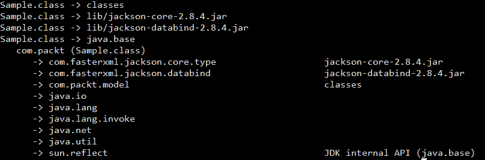

在前面的命令中，我们使用 `jdeps` 列出类文件 `Sample.class` 在包级别的依赖关系。我们必须为 `jdeps` 提供搜索正在分析的代码依赖关系的路径。这可以通过设置 `jdeps` 命令的 `-classpath`、`-cp` 或 `--class-path` 选项来完成。

`-verbose:package` 选项列出包级别的依赖关系。

1.  让我们列出类级别的依赖关系：

```java
 jdeps -verbose:class -cp classes/:lib/*      classes/com/packt/Sample.class
```

前面命令的输出如下：

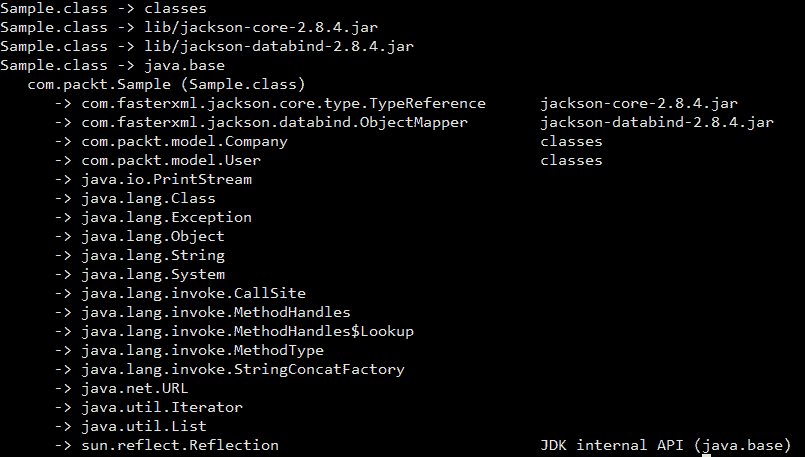

在这种情况下，我们使用了 `-verbose:class` 选项来列出类级别的依赖关系，这就是为什么你可以看到 `com.packt.Sample` 类依赖于 `com.packt.model.Company`、`java.lang.Exception`、`com.fasterxml.jackson.core.type.TypeReference` 等原因。

1.  让我们获取依赖关系的摘要：

```java
      jdeps -summary -cp classes/:lib/* classes/com/packt/Sample.class
```

输出如下：

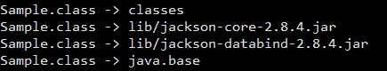

1.  让我们检查对 JDK 内部 API 的依赖性：

```java
        jdeps -jdkinternals -cp classes/:lib/*
 classes/com/packt/Sample.class
```

前面命令的输出如下：

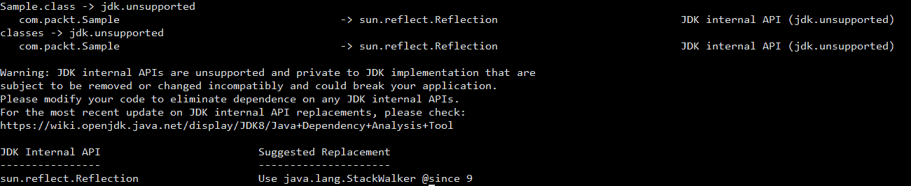

StackWalker API 是 Java 9 中引入的用于遍历调用栈的新 API。这是 `sun.reflect.Reflection.getCallerClass()` 方法的替代品。我们将在第十二章，*内存管理和调试*中讨论这个 API。

1.  让我们在 JAR 文件 `sample.jar` 上运行 `jdeps`：

```java
 jdeps -s -cp lib/* sample.jar
```

我们得到的结果如下：

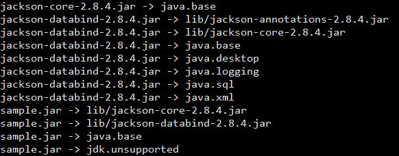

使用 `jdeps` 检查 `sample.jar` 后得到的信息非常有用。它清楚地说明了我们的 JAR 文件的依赖关系，当我们尝试将此应用程序迁移到模块化应用程序时非常有用。

1.  让我们查找是否有对给定包名的依赖关系：

```java
 jdeps -p java.util sample.jar
```

输出如下：

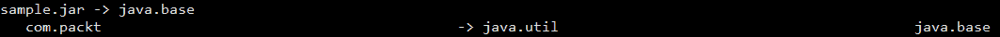

`-p`选项用于查找给定包名的依赖。因此，我们得知我们的代码依赖于`java.util`包。让我们尝试使用其他包名：

```java
 jdeps -p java.util.concurrent sample.jar
```

没有输出，这意味着我们的代码不依赖于`java.util.concurrent`包。

1.  我们只想为我们的代码运行依赖性检查。是的，这是可能的。假设我们运行`jdeps -cp lib/* sample.jar`，你会看到甚至库 JAR 文件也被分析了。我们不想这样，对吧？让我们只包含`com.packt`包的类：

```java
 jdeps -include 'com.packt.*' -cp lib/* sample.jar
```

输出如下：

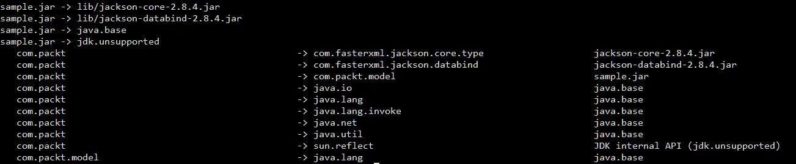

1.  让我们检查我们的代码是否依赖于特定的包：

```java
 jdeps -p 'com.packt.model' sample.jar
```

输出如下：

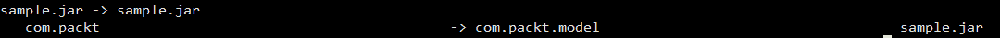

1.  我们可以使用`jdeps`来分析 JDK 模块。让我们选择`java.httpclient`模块进行分析：

```java
 jdeps -m java.httpclient
```

下面是输出结果：

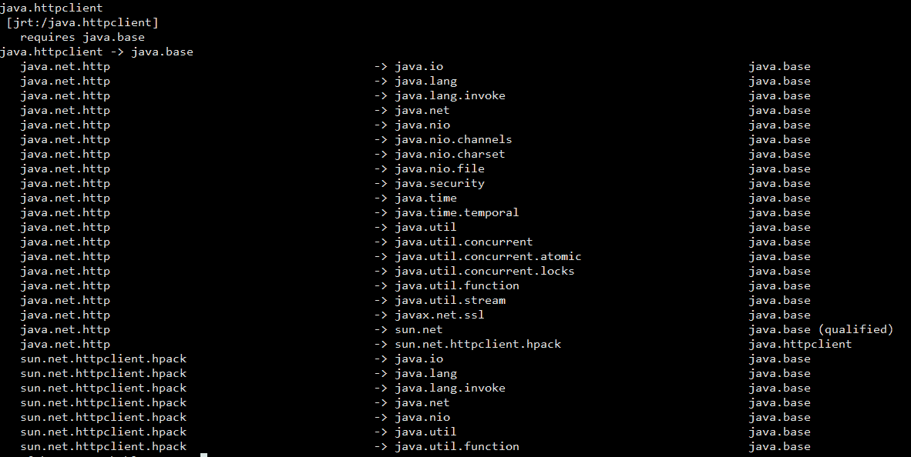

我们也可以使用`--require`选项来查找给定模块是否依赖于另一个模块，如下所示：

```java
 jdeps --require java.logging -m java.sql
```

下面是输出结果：

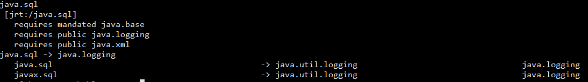

在前面的命令中，我们试图找出`java.sql`模块是否依赖于`java.logging`模块。我们得到的输出是`java.sql`模块及其使用`java.logging`模块代码的包的依赖摘要。

# 它是如何工作的...

`jdeps`命令是一个静态类依赖分析器，用于分析应用程序及其库的静态依赖。默认情况下，`jdeps`命令显示输入文件的包级别依赖，这些可以是`.class`文件、目录或 JAR 文件。这是可配置的，可以更改以显示类级别依赖。有多个选项可用于过滤依赖并指定要分析的类文件。我们已经看到了`-cp`命令行选项的常规使用。此选项用于提供搜索分析代码依赖的位置。

我们已经分析了类文件、JAR 文件和 JDK 模块，我们还尝试了`jdeps`命令的不同选项。有几个选项，如`-e`、`-regex`、`--regex`、`-f`、`--filter`和`-include`，它们接受正则表达式（regex）。理解`jdeps`命令的输出是很重要的。对于每个正在分析的类/JAR 文件，有两部分信息：

1.  分析文件的依赖摘要（JAR 或类文件）。这包括左侧的类或 JAR 文件名称和右侧的依赖实体名称。依赖实体可以是目录、JAR 文件或 JDK 模块，如下所示：

```java
 Sample.class -> classes
      Sample.class -> lib/jackson-core-2.8.4.jar
      Sample.class -> lib/jackson-databind-2.8.4.jar
      Sample.class -> java.base
      Sample.class -> jdk.unsupported
```

1.  在包或类级别（根据命令行选项）上，对分析文件内容的更详细依赖信息（取决于命令行选项）。这由三列组成：第 1 列包含包/类的名称，第 2 列包含依赖包的名称，第 3 列包含找到依赖项的模块/JAR 的名称。一个示例输出如下：

```java
 com.packt  -> com.fasterxml.jackson.core.type  jackson-core-2.8.4.jar
      com.packt  -> com.fasterxml.jackson.databind   jackson-databind-
                                                     2.8.4.jar
      com.packt  -> com.packt.model                  sample.jar
```

# 更多内容...

我们已经看到了`jdeps`命令的许多选项。还有一些与过滤依赖项和过滤要分析的类相关的选项。除此之外，还有一些与模块路径相关的选项。

以下是可以尝试的选项：

+   `-e`, `-regex`, `--regex`：这些查找与给定模式匹配的依赖项。

+   `-f`, `-filter`：这些排除与给定模式匹配的依赖项。

+   `-filter:none`：这允许不通过`filter:package`或`filter:archive`应用过滤。

+   `-filter:package`：这排除同一包内的依赖项。这是默认选项。例如，如果我们向`jdeps sample.jar`添加了`-filter:none`，它将打印出包对自己的依赖项。

+   `-filter:archive`：这排除同一存档内的依赖项。

+   `-filter:module`：这排除同一模块中的依赖项。

+   `-P`, `-profile`：这用于显示包的配置文件，无论是 compact1、compact2、compact3 还是 Full JRE。

+   `-R`, `-recursive`：这些递归遍历所有运行时依赖项；它们与`-filter:none`选项等价。

# 创建一个简单的模块化应用程序

你可能正在想这个模块化是什么意思，以及如何在 Java 中创建一个模块化应用程序。在这个菜谱中，我们将通过一个简单的示例来帮助你解开在 Java 中创建模块化应用程序的神秘面纱。我们的目标是向你展示如何创建一个模块化应用程序；因此，我们选择了一个简单的例子，以便专注于我们的目标。

我们的例子是一个简单的先进计算器，它可以检查一个数字是否为素数，计算素数的和，检查一个数字是否为偶数，并计算偶数和奇数的和。

# 准备工作

我们将把我们的应用程序分为两个模块：

+   `math.util`模块，它包含执行数学计算的 API

+   `calculator`模块，它启动一个高级计算器

# 如何做到这一点...

1.  让我们在`com.packt.math.MathUtil`类中实现 API，从`isPrime(Integer number)` API 开始：

```java
        public static Boolean isPrime(Integer number){
          if ( number == 1 ) { return false; }
          return IntStream.range(2,num).noneMatch(i -> num % i == 0 );
        }
```

1.  下一步是实现`sumOfFirstNPrimes(Integer count)` API：

```java
        public static Integer sumOfFirstNPrimes(Integer count){
          return IntStream.iterate(1,i -> i+1)
                          .filter(j -> isPrime(j))
                          .limit(count).sum();
        }
```

1.  让我们编写一个函数来检查数字是否为偶数：

```java
        public static Boolean isEven(Integer number){
          return number % 2 == 0;
        }
```

1.  `isEven`函数的否定告诉我们数字是否为奇数。我们可以有函数来找到前*N*个偶数和前*N*个奇数的和，如下所示：

```java
        public static Integer sumOfFirstNEvens(Integer count){
          return IntStream.iterate(1,i -> i+1)
                          .filter(j -> isEven(j))
                          .limit(count).sum();
        }

        public static Integer sumOfFirstNOdds(Integer count){
          return IntStream.iterate(1,i -> i+1)
                          .filter(j -> !isEven(j))
                          .limit(count).sum();
        }
```

我们可以在先前的 API 中看到以下操作是重复的：

+   从 1 开始的无限数字序列

+   根据某些条件过滤数字

+   限制数字流到给定的数量

+   求得这些数字的总和

根据我们的观察，我们可以重构前面的 API 并将这些操作提取到一个方法中，如下所示：

```java
private static Integer computeFirstNSum(Integer count, IntPredicate filter){
  return IntStream.iterate(1,i -> i+1)
                  .filter(filter)
                  .limit(count).sum();
 }
```

在这里，`count` 是我们需要找到总和的数字的限制，而 `filter` 是选择要相加的数字的条件。

让我们根据我们刚刚做的重构重写 API：

```java
public static Integer sumOfFirstNPrimes(Integer count){
  return computeFirstNSum(count, (i -> isPrime(i)));
}

public static Integer sumOfFirstNEvens(Integer count){
  return computeFirstNSum(count, (i -> isEven(i)));
}

public static Integer sumOfFirstNOdds(Integer count){
  return computeFirstNSum(count, (i -> !isEven(i)));
}
```

你可能想知道以下内容：

+   `IntStream` 类和相关的方法链

+   代码库中 `->` 的使用

+   `IntPredicate` 类的使用

如果你确实在疑惑，那么你不必担心，因为我们在第四章 *功能化* 和第五章 *流操作和管道* 中将涵盖这些内容。Chapter 4, *功能化* 和 Chapter 5, *流操作和管道*。

到目前为止，我们已经看到了一些数学计算的 API。这些 API 是我们 `com.packt.math.MathUtil` 类的一部分。这个类的完整代码可以在代码库中找到，位置是 `chp3/2_simple-modular-math-util/math.util/com/packt/math`，这是为这本书下载的代码库。

让我们将这个小实用类模块化为一个名为 `math.util` 的模块。以下是我们创建模块时使用的某些约定：

1.  将与模块相关的所有代码放置在一个名为 `math.util` 的目录下，并将其视为我们的模块根目录。

1.  在根文件夹中，放置一个名为 `module-info.java` 的文件。

1.  然后，我们将包和代码文件放置在根目录下。

`module-info.java` 包含什么内容？

+   模块的名字

+   它导出的包，即，使其可供其他模块使用

+   它依赖的模块

+   它使用的服务

+   它提供的实现服务

如第一章 Chapter 1 *安装和 Java 9 漫游* 中所述，JDK 随带了许多模块，也就是说，现有的 Java SDK 已经模块化了！其中之一是一个名为 `java.base` 的模块。所有用户定义的模块都隐式依赖于（或要求）`java.base` 模块（想想每个类都隐式扩展了 `Object` 类）。

我们的 `math.util` 模块不依赖于任何其他模块（当然，除了 `java.base` 模块）。然而，它使它的 API 可供其他模块使用（如果不是，那么这个模块的存在就值得怀疑）。让我们继续将这个声明放入代码中：

```java
module math.util{
  exports com.packt.math;
}
```

我们正在告诉 Java 编译器和运行时，我们的 `math.util` 模块正在 *导出* `com.packt.math` 包中的代码到任何依赖于 `math.util` 的模块。

这个模块的代码可以在位置 `chp3/2_simple-modular-math-util/math.util` 找到。

现在，让我们创建另一个名为 `calculator` 的模块，它使用 `math.util` 模块。这个模块有一个 `Calculator` 类，其工作是为用户接受要执行哪种数学运算的选择，然后接受执行该运算所需的输入。用户可以从五种可用的数学运算中选择：

1.  素数检查

1.  偶数检查

1.  *N* 个素数的和

1.  *N* 个偶数的和

1.  *N* 个奇数的和

让我们看看代码示例：

```java
private static Integer acceptChoice(Scanner reader){
  System.out.println("************Advanced Calculator************");
  System.out.println("1\. Prime Number check");
  System.out.println("2\. Even Number check");
  System.out.println("3\. Sum of N Primes");
  System.out.println("4\. Sum of N Evens");
  System.out.println("5\. Sum of N Odds");
  System.out.println("6\. Exit");
  System.out.println("Enter the number to choose operation");
  return reader.nextInt();
}
```

然后，对于每个选择，我们接受所需的输入并调用相应的 `MathUtil` API，如下所示：

```java
switch(choice){
  case 1:
    System.out.println("Enter the number");
    Integer number = reader.nextInt();
    if (MathUtil.isPrime(number)){
      System.out.println("The number " + number +" is prime");
    }else{
      System.out.println("The number " + number +" is not prime");
    }
  break;
  case 2:
    System.out.println("Enter the number");
    Integer number = reader.nextInt();
    if (MathUtil.isEven(number)){
      System.out.println("The number " + number +" is even");
    }
  break;
  case 3:
    System.out.println("How many primes?");
    Integer count = reader.nextInt();
    System.out.println(String.format("Sum of %d primes is %d", 
          count, MathUtil.sumOfFirstNPrimes(count)));
  break;
  case 4:
    System.out.println("How many evens?");
    Integer count = reader.nextInt();
    System.out.println(String.format("Sum of %d evens is %d", 
          count, MathUtil.sumOfFirstNEvens(count)));
  break;
  case 5: 
    System.out.println("How many odds?");
    Integer count = reader.nextInt();
    System.out.println(String.format("Sum of %d odds is %d", 
          count, MathUtil.sumOfFirstNOdds(count)));
  break;
}
```

`Calculator` 类的完整代码可以在 `chp3/2_simple-modular-math-util/calculator/com/packt/calculator/Calculator.java` 找到。

让我们以创建 `math.util` 模块相同的方式创建我们的 `calculator` 模块的模块定义：

```java
module calculator{
  requires math.util;
}
```

在前面的模块定义中，我们提到 `calculator` 模块通过使用关键字 `required` 依赖于 `math.util` 模块。

该模块的代码可以在 `chp3/2_simple-modular-math-util/calculator` 找到。

现在让我们编译代码：

```java
javac -d mods --module-source-path . $(find . -name "*.java")
```

必须在 `chp3/2_simple-modular-math-util` 目录下执行前面的命令。

此外，您应该在 `mods` 目录中拥有来自两个模块的编译代码，即 `math.util` 和 `calculator`。这难道不是很简单吗？只需一个命令，包括模块之间的依赖关系，编译器就全部处理了。我们不需要像 `ant` 这样的构建工具来管理模块的编译。

`--module-source-path` 命令是 `javac` 的新命令行选项，用于指定我们的模块源代码的位置。

现在，让我们执行前面的代码：

```java
java --module-path mods -m calculator/com.packt.calculator.Calculator
```

`--module-path` 命令，类似于 `--classpath`，是 `java` 的新命令行选项，用于指定编译模块的位置。

执行前面的命令后，您将看到计算器正在运行：

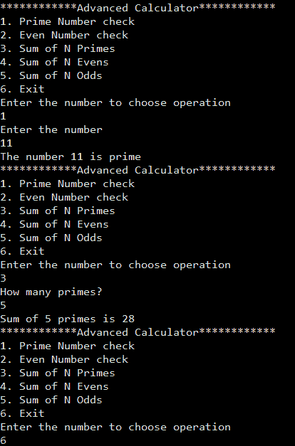

恭喜！有了这个，我们有一个简单的模块化应用程序正在运行。

我们提供了在 Windows 和 Linux 平台上测试代码的脚本。请使用 `run.bat` 用于 Windows 和 `run.sh` 用于 Linux。

# 它是如何工作的...

现在您已经通过了这个例子，我们将看看如何将其推广，以便我们可以在所有模块中应用相同的模式。我们遵循了特定的约定来创建模块：

```java
|application_root_directory
|--module1_root
|----module-info.java
|----com
|------packt
|--------sample
|----------MyClass.java
|--module2_root
|----module-info.java
|----com
|------packt
|--------test
|----------MyAnotherClass.java
```

我们将特定模块的代码放在其文件夹中，并在文件夹根目录下放置相应的 `module-info.java` 文件。这样，代码组织得很好。

让我们看看 `module-info.java` 可以包含什么。根据 Java 语言规范 ([`cr.openjdk.java.net/~mr/jigsaw/spec/lang-vm.html`](http://cr.openjdk.java.net/~mr/jigsaw/spec/lang-vm.html))，模块声明具有以下形式：

```java
{Annotation} [open] module ModuleName { {ModuleStatement} }
```

下面是语法说明：

+   `{注释}`: 这是指任何形式的注释 `@注释(2)`。

+   `open`: 这个关键字是可选的。一个开放的模块使其所有组件在运行时通过反射可访问。然而，在编译时和运行时，只有那些明确导出的组件是可访问的。

+   `module`: 这是用于声明模块的关键字。

+   `ModuleName`: 这是模块的名称，它是一个有效的 Java 标识符，标识符名称之间可以有允许的点（`.`）--类似于 `math.util`。

+   `{ModuleStatement}`: 这是一个模块定义中允许的语句集合。让我们接下来扩展这个概念。

模块语句的形式如下：

```java
ModuleStatement:
  requires {RequiresModifier} ModuleName ;
  exports PackageName [to ModuleName {, ModuleName}] ;
  opens PackageName [to ModuleName {, ModuleName}] ;
  uses TypeName ;
  provides TypeName with TypeName {, TypeName} ;
```

模块语句在这里被解码：

+   `requires`: 这用于声明对模块的依赖。`{RequiresModifier}` 可以是 **transitive**、**static** 或两者都是。传递性意味着任何依赖于给定模块的模块也隐式地依赖于给定模块所要求的模块。静态意味着模块依赖在编译时是强制性的，但在运行时是可选的。一些例子是 `requires math.util`、`requires transitive math.util` 和 `requires static math.util`。

+   `exports`: 这用于使给定的包对依赖模块可访问。可选地，我们可以通过指定模块名称来强制包的可访问性到特定的模块，例如 `exports com.package.math to claculator`。

+   `opens`: 这用于打开一个特定的包。我们之前看到，我们可以通过在模块声明中使用 `open` 关键字来打开一个模块。但这可能不够严格。因此，为了使其更加严格，我们可以通过使用 `opens` 关键字在运行时通过反射访问特定包：`opens com.packt.math`。

+   `uses`: 这用于声明对通过 `java.util.ServiceLoader` 可访问的服务接口的依赖。服务接口可以在当前模块中，也可以在任何当前模块依赖的模块中。

+   `provides`: 这用于声明一个服务接口并提供至少一个实现。服务接口可以在当前模块中声明，也可以在任何其他依赖模块中声明。然而，服务实现必须在同一模块中提供；否则，将发生编译时错误。

我们将在我们的配方中更详细地查看 `uses` 和 `provides` 子句，*使用服务在消费者模块和提供者模块之间创建松耦合*。

所有模块的模块源可以一次使用 `--module-source-path` 命令行选项编译。这样，所有模块都将被编译并放置在由 `-d` 选项提供的目录下的相应目录中。例如， `javac -d mods --module-source-path . $(find . -name "*.java")`  将当前目录中的代码编译到 `mods` 目录中。

运行代码同样简单。我们使用命令行选项指定所有模块编译到的路径，即`--module-path`。然后，我们使用命令行选项`-m`提及模块名称以及完全限定主类名称，例如`java --module-path mods -m calculator/com.packt.calculator.Calculator`。

# 参考信息

请参阅配方，*编译和运行 Java 应用程序*，来自第一章，*安装和 Java 9 的预览*，其中我们尝试运行另一个模块化应用程序。

# 创建模块化 JAR 文件

将模块编译成类是好的，但并不适合共享二进制文件和部署。JAR 文件是更好的共享和部署格式。我们可以将编译好的模块打包成 JAR 文件，其中包含顶层`module-info.class`的 JAR 文件被称为**模块化 JAR 文件**。在本配方中，我们将探讨如何创建模块化 JAR 文件，同时也会探讨如何执行由多个模块化 JAR 文件组成的应用程序。

# 准备工作

我们在配方中看到了并创建了一个简单的模块化应用程序，*创建一个更简单的模块化应用程序*。为了构建模块化 JAR 文件，我们将利用在`chp3/3_modular_jar`可用的示例代码。这个示例代码包含两个模块：`math.util`和`calculator`。我们将为这两个模块创建模块化 JAR 文件。

# 如何操作...

1.  编译代码并将编译后的类放置在目录中，例如`mods`：

```java
 javac -d mods --module-source-path . $(find . -name *.java)
```

1.  为`math.util`模块构建一个模块化 JAR 文件：

```java
      jar --create --file=mlib/math.util@1.0.jar --module-version 1.0
      -C mods/math.util .
```

不要忘记在前面代码的末尾加上点（`.`）。

1.  为`calculator`模块构建一个模块化 JAR 文件，指定主类以使 JAR 文件可执行：

```java
 jar --create --file=mlib/calculator@1.0.jar --module-version 1.0 
      --main-class com.packt.calculator.Calculator -C mods/calculator .
```

前一个命令中的关键部分是`--main-class`选项。这使我们能够在执行时无需提供主类信息即可执行 JAR 文件。

1.  现在我们已经在`mlib`目录中有两个 JAR 文件：`math.util@1.0.jar`和`calculator@1.0.jar`。这些 JAR 文件被称为模块化 JAR 文件。如果您想运行示例，可以使用以下命令：

```java
 java -p mlib -m calculator
```

Java 9 中引入了 JAR 命令的新命令行选项，称为`-d`或`--describe-module`。这会打印出模块化 JAR 文件包含的模块信息：

```java
jar -d --file=mlib/calculator@1.0.jar
```

`jar -d`对`calculator@1.0.jar`的输出如下：

```java
calculator@1.0
  requires mandated java.base
  requires math.util
  conceals com.packt.calculator
  main-class com.packt.calculator.Calculator

jar -d --file=mlib/math.util@1.0.jar
```

`jar -d`对`math.util@1.0.jar`的输出如下：

```java
math.util@1.0
  requires mandated java.base
  exports com.packt.math
```

我们提供了以下脚本，以便在 Windows 上尝试运行配方代码：

+   `compile-math.bat`

+   `compile-calculator.bat`

+   `jar-math.bat`

+   `jar-calculator.bat`

+   `run.bat`

我们提供了以下脚本，以便在 Linux 上尝试运行配方代码：

+   `compile.sh`

+   `jar-math.sh`

+   `jar-calculator.sh`

+   `run.sh`

您必须按照列出的顺序运行脚本。

# 在 JDK 9 之前的应用程序中使用模块化 JAR 文件

如果我们的模块化 JAR 可以与 JDK 9 之前的应用程序一起运行，那将非常神奇。这样，我们就无需再为 JDK 9 之前的应用程序编写另一个版本的 API。好消息是，我们可以像使用普通 JAR 一样使用我们的模块化 JAR，也就是说，根目录下没有 `module-info.class` 的 JAR。我们将在本食谱中看到如何做到这一点。

# 准备工作

对于这个食谱，我们需要一个模块化 JAR 和一个非模块化应用程序。我们的模块化代码可以在 `chp3/4_modular_jar_with_pre_java9/math.util` 找到（这是我们在食谱 *创建一个简单的模块化应用程序* 中创建的同一个 `math.util` 模块）。让我们使用以下命令编译这个模块化代码并创建一个模块化 JAR：

```java
javac -d classes --module-source-path . $(find math.util -name *.java)
mkdir mlib
jar --create --file mlib/math.util.jar -C classes/math.util .
```

我们还在 `chp3/4_modular_jar_with_pre_java9` 提供了一个 `jar-math.bat` 脚本，可用于在 Windows 上创建模块化 JAR。我们已经有了模块化 JAR。让我们使用 `jar` 命令的 `-d` 选项进行验证：

```java
jar -d --file mlib/math.util@1.0.jar
math.util@1.0
  requires mandated java.base
  exports com.packt.math
```

# 如何做到...

现在，让我们创建一个简单的应用程序，它不是模块化的。我们的应用程序将包含一个名为 `NonModularCalculator` 的类，它从食谱 *创建一个简单的模块化应用程序* 中的 `Calculator` 类借用代码。

您可以在 `chp3/4_modular_jar_with_pre_java9/calculator` 目录下的 `com.packt.calculator` 包中找到 `NonModularCalculator` 类的定义。由于它不是模块化的，它不需要 `module-info.java` 文件。此应用程序使用我们的模块化 JAR `math.util.jar` 执行一些数学计算。

在这一点上，您应该有以下内容：

+   一个名为 `math.util@1.0.jar` 的模块化 JAR

+   由 `NonModularCalculator` 包组成的非模块化应用程序

现在，我们需要编译我们的 `NonModularCalculator` 类：

```java
javac -d classes/ --source-path calculator $(find calculator -name *.java)
```

在运行上一个命令后，您将看到一系列错误，表示 `com.packt.math` 包不存在，找不到 `MathUtil` 符号等。您猜对了；我们遗漏了为编译器提供模块化 JAR 位置。让我们使用 `--class-path` 选项添加模块化 JAR 位置：

```java
javac --class-path mlib/* -d classes/ --source-path calculator $(find calculator -name *.java)
```

现在，我们已经成功编译了依赖于模块化 JAR 的非模块化代码。让我们运行编译后的代码：

```java
java -cp classes:mlib/* com.packt.calculator.NonModularCalculator
```

恭喜！您已经成功使用模块化 JAR 与非模块化应用程序一起使用。太神奇了，对吧！

我们在 `chp3/4_modular_jar_with_pre_java9` 提供了以下脚本，用于在 Windows 平台上运行代码：

+   `compile-calculator.bat`

+   `run.bat`

# 参见

我们建议您尝试以下食谱：

+   创建一个简单的模块化应用程序

+   创建一个模块化 JAR

# 自下而上的迁移

现在，Java 9 已经发布，备受期待的模块化特性现在可供开发者采用。在某个时候，你将参与将你的应用程序迁移到 Java 9，因此尝试将其模块化。这种涉及第三方库和代码结构重新思考的重大变化需要适当的规划和实施。Java 团队建议了两种迁移方法：

+   自底向上迁移

+   自顶向下迁移

在学习自底向上迁移之前，了解未命名模块和自动模块是什么非常重要。假设你正在访问任何模块中不可用的类型；在这种情况下，模块系统将在类路径上搜索该类型，如果找到，该类型就成为了未命名模块的一部分。这类似于我们编写的不属于任何包的类，但 Java 将它们添加到一个未命名的包中，以便简化新类的创建。

因此，未命名模块是一个没有名称的通用模块，它包含所有不属于任何模块但在类路径中找到的类型。未命名模块可以访问所有命名模块（用户定义模块）和内置模块（Java 平台模块）导出的类型。另一方面，命名模块（用户定义模块）将无法访问未命名模块中的类型。换句话说，命名模块不能声明对未命名模块的依赖。如果你确实想声明依赖关系，你将如何做？未命名模块没有名称！

使用未命名模块的概念，你可以直接将你的 Java 8 应用程序运行在 Java 9 上（除了任何已弃用的内部 API，这些 API 在 Java 9 中可能对用户代码不可用）。

如果你尝试过*使用 jdeps 在 Java 应用程序中查找依赖关系*的配方，你可能见过这种情况，其中我们有一个非模块化应用程序，并且能够在 Java 9 上运行它。然而，直接在 Java 9 上运行将违背引入模块化系统的目的。

如果一个包在命名和未命名模块中都有定义，那么在命名模块中的包将优先于在未命名模块中的包。这有助于防止来自命名和未命名模块的包之间的冲突。

自动模块是由 JVM 自动创建的。这些模块是在我们引入模块路径中打包在 JAR 文件中的类时创建的，而不是在类路径中。这个模块的名称将派生自没有`.jar`扩展名的 JAR 文件名，因此与未命名模块不同。或者，可以通过在 JAR 清单文件中提供`Automatic-Module-Name`来为这些自动模块提供名称。这些自动模块导出其包含的所有包，并且依赖于所有自动和命名的（用户/JDK）模块。

根据这个解释，模块可以分为以下几类：

+   **未命名模块**：位于类路径上但不在模块路径上的代码被放置在未命名模块中

+   **命名模块**：所有与名称相关联的模块——这可以是用户定义的模块和 JDK 模块。

+   **自动模块**：所有由 JVM 根据模块路径中存在的 jar 文件隐式创建的模块

+   **隐式模块**：隐式创建的模块。它们与自动模块相同

+   **显式模块**：所有由用户或 JDK 显式创建的模块。

但未命名模块和自动模块是开始迁移的良好第一步。所以让我们开始吧！

# 准备工作

我们需要一个非模块化应用程序，我们最终将对其进行模块化。我们已创建了一个简单的应用程序，其源代码位于位置`chp3/6_bottom_up_migration_before`。这个简单应用程序有 3 个部分：

1.  一个包含我们最喜欢的数学 API 的数学实用程序库，即：素数检查器、偶数检查器、素数之和、偶数之和和奇数之和。此代码位于位置`chp3/6_bottom_up_migration_before/math_util`。

1.  一个包含计算简单利息和复利 API 的银行实用程序库。此代码位于位置`chp3/6_bottom_up_migration_before/banking_util`。

1.  我们的计算器应用程序，它帮助我们进行数学和银行计算。为了使它更有趣，我们将结果输出为 JSON，为此，我们将使用 Jackson JSON API。此代码位于位置`chp3/6_bottom_up_migration_before/calculator`。

在您复制或下载代码后，我们将编译和构建相应的 jar 文件。因此，请使用以下命令编译和构建 jar 文件：

```java
#Compiling math util

javac -d math_util/out/classes/ -sourcepath math_util/src $(find math_util/src -name *.java)
jar --create --file=math_util/out/math.util.jar 
-C math_util/out/classes/ .

#Compiling banking util

javac -d banking_util/out/classes/ -sourcepath banking_util/src $(find banking_util/src -name *.java)
jar --create --file=banking_util/out/banking.util.jar 
-C banking_util/out/classes/ .

#Compiling calculator

javac -cp calculator/lib/*:math_util/out/math.util.jar:banking_util/out/banking.util.jar -d calculator/out/classes/ -sourcepath calculator/src $(find calculator/src -name *.java)
```

让我们也为这个创建一个 JAR（我们使用 JAR 来构建依赖图，但不是为了运行应用程序）

```java
jar --create --file=calculator/out/calculator.jar -C calculator/out/classes/ .
```

请注意，我们的 Jackson JAR 位于`calculator/lib`中，因此您无需担心下载它们。让我们使用以下命令运行我们的计算器：

```java
java -cp calculator/out/classes:calculator/lib/*:math_util/out/math.util.jar:banking_util/out/banking.util.jar com.packt.calculator.Calculator
```

您将看到一个菜单，询问操作选择，然后您可以尝试不同的操作。现在让我们对这个应用程序进行模块化！

我们已提供`package-*.bat`和 run.bat 在 Windows 上打包和运行应用程序。以及`package-*.sh`和`run.sh`在 Linux 上打包和运行应用程序。

# 如何操作...

将您的应用程序模块化的第一步是理解其依赖图。让我们为我们的应用程序创建一个依赖图。为此，我们使用`jdeps`工具。如果您想知道`jdeps`工具是什么，请立即停止并阅读配方：*使用 jdeps 在 Java 应用程序中查找依赖关系*。好的，那么让我们运行`jdeps`工具：

```java
jdeps -summary -R -cp calculator/lib/*:math_util/out/*:banking_util/out/* calculator/out/calculator.jar
```

我们要求`jdeps`为我们提供`calculator.jar`的依赖关系摘要，然后对`calculator.jar`的每个依赖项递归地执行此操作。我们得到的结果是：

```java
banking.util.jar -> java.base
calculator.jar -> banking_util/out/banking.util.jar
calculator.jar -> calculator/lib/jackson-databind-2.8.4.jar
calculator.jar -> java.base
calculator.jar -> math_util/out/math.util.jar
jackson-annotations-2.8.4.jar -> java.base
jackson-core-2.8.4.jar -> java.base
jackson-databind-2.8.4.jar -> calculator/lib/jackson-annotations-2.8.4.jar
jackson-databind-2.8.4.jar -> calculator/lib/jackson-core-2.8.4.jar
jackson-databind-2.8.4.jar -> java.base
jackson-databind-2.8.4.jar -> java.logging
jackson-databind-2.8.4.jar -> java.sql
jackson-databind-2.8.4.jar -> java.xml
math.util.jar -> java.base
```

前面的输出不是很清晰，因此我们以图示的形式再次展示，如下所示：


在自下而上的迁移中，我们从模块化叶节点开始。在我们的图中，叶节点`java.xml`、`java.sql`、`java.base`和`java.logging`已经进行了模块化。让我们选择模块化`banking.util.jar`。

本食谱的所有代码都可在位置`chp3/6_bottom_up_migration_after`找到。

# 模块化`banking.util.jar`

1.  将`BankUtil.java`从`chp3/6_bottom_up_migration_before/banking_util/src/com/packt/banking`复制到位置`chp3/6_bottom_up_migration_after/src/banking.util/com/packt/banking`。请注意以下两点：

    +   我们已将文件夹从`banking_util`重命名为`banking.util`。这是为了遵循将模块相关代码放置在以模块名称命名的文件夹下的约定。

    +   我们将包直接放置在`banking.util`文件夹下，而不是在`src`文件夹下，这再次是为了遵循约定。我们还将把所有模块放置在`src`文件夹下。

1.  在`chp3/6_bottom_up_migration_after/src/banking.util`下创建模块定义文件`module-info.java`，内容如下：

```java
        module banking.util{   
          exports com.packt.banking;
        }
```

1.  在`6_bottom_up_migration_after`文件夹内，通过运行以下命令编译模块的 Java 代码：

```java
 javac -d mods --module-source-path src $(find src -name *.java)
```

1.  你会看到模块`banking.util`中的 Java 代码被编译到 mods 目录中。

1.  让我们为这个模块创建一个模块化的 JAR：

```java
 jar --create --file=mlib/banking.util.jar -C mods/banking.util .
```

如果你想知道什么是模块化 JAR，请随意阅读本章的食谱，*创建模块化 JAR*。

现在我们已经模块化了`banking.util.jar`，让我们使用这个模块化 JAR 替换之前在*准备就绪*部分使用的非模块化 JAR。你应该从`6_bottom_up_migration_before`文件夹中执行以下操作，因为我们还没有完全模块化应用程序。

```java
java --add-modules ALL-MODULE-PATH --module-path ../6_bottom_up_migration_after/mods/banking.util -cp calculator/out/classes:calculator/lib/*:math_util/out/math.util.jar com.packt.calculator.Calculator
```

`--add-modules`选项告诉 Java 运行时通过模块名称或预定义常量（例如：`ALL-MODULE-PATH`、`ALL-DEFAULT`、`ALL-SYSTEM`）来包含模块。我们使用了`ALL-MODULE-PATH`来添加位于我们的模块路径上的模块。

`--module-path`选项告诉 Java 运行时我们的模块位置。

你会看到我们的计算器仍然正常运行。尝试进行简单利息计算和复利计算，以检查是否找到了`BankUtil`类。因此，我们的依赖关系图现在看起来如下：

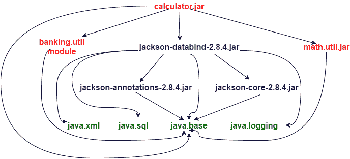

# 模块化`math.util.jar`

1.  将`MathUtil.java`从`chp3/6_bottom_up_migration_before/math_util/src/com/packt/math`复制到位置`chp3/6_bottom_up_migration_after/src/math.util/com/packt/math`。

1.  在`chp3/6_bottom_up_migration_after/src/math.util`下创建模块定义文件`module-info.java`，内容如下：

```java
        module math.util{
          exports com.packt.math;
        }
```

1.  在 `6_bottom_up_migration_after` 文件夹内，通过运行以下命令编译模块的 Java 代码：

```java
 javac -d mods --module-source-path src $(find src -name *.java)
```

1.  你会看到模块 `math.util` 和 `banking.util` 中的 Java 代码被编译到了 `mods` 目录。

1.  让我们为这个模块创建一个模块化 JAR：

```java
 jar --create --file=mlib/math.util.jar -C mods/math.util .
```

如果你想知道什么是模块化 JAR，请随意阅读本章中的配方，*创建一个模块化 JAR*。

1.  现在我们已经模块化了 `math.util.jar`，让我们使用这个模块化 JAR 替换之前在 *准备就绪* 部分中使用的非模块化 JAR。你应该从 `6_bottom_up_migration_before` 文件夹中执行以下操作，因为我们还没有完全模块化应用程序：

```java
 java --add-modules ALL-MODULE-PATH --module-path
      ../6_bottom_up_migration_after/mods/banking.util:
      ../6_bottom_up_migration_after/mods/math.util 
      -cp calculator/out/classes:calculator/lib/*
      com.packt.calculator.Calculator
```

这次我们的应用程序运行良好。依赖关系图看起来像：

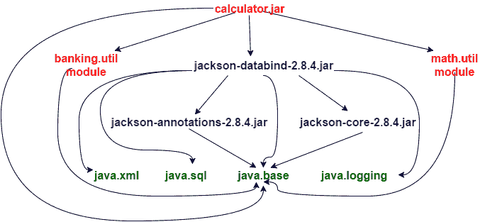

我们不能模块化 calculator.jar，因为它依赖于彼此的非模块化代码 jackson-databind。而且我们不能模块化 `jackson-databind`，因为它不是由我们维护的。因此，我们无法实现应用程序的 100%模块化。我们在本配方开头介绍了未命名的模块。所有我们的非模块化代码都在类路径中的未命名模块中分组，这意味着所有与 jackson 相关的代码仍然可以保留在未命名模块中，我们可以尝试模块化 `calculator.jar`。但是，我们不能这样做，因为 `calculator.jar` 不能声明对 `jackson-databind-2.8.4.jar` 的依赖（因为它是一个未命名的模块，而命名模块不能声明对未命名模块的依赖）。

解决这个问题的方法是将与 jackson 相关的代码作为自动模块。我们可以通过移动与 jackson 相关的 JAR 文件来实现，即：

+   `jackson-databind-2.8.4.jar`

+   `jackson-annotations-2.8.4.jar`

+   `jackson-core-2.8.4.jar`

将其移动到 `6_bottom_up_migration_after` 文件夹下的 `mods` 文件夹，使用以下命令：

```java
$ pwd 
/root/java9-samples/chp3/6_bottom_up_migration_after
$ cp ../6_bottom_up_migration_before/calculator/lib/*.jar mlib/
$ mv mlib/jackson-annotations-2.8.4.jar mods/jackson.annotations.jar
$ mv mlib/jackson-core-2.8.4.jar mods/jackson.core.jar
$ mv mlib/jackson-databind-2.8.4.jar mods/jackson.databind.jar
```

重命名 JAR 的原因是模块的名称必须是一个有效的标识符（不应仅由数字组成，不应包含 `-` 和其他规则），并且用 `.` 分隔，由于名称是从 JAR 文件名派生的，因此我们必须重命名 JAR 文件以符合 Java 标识符规则。

如果 `6_bottom_up_migration_after` 下不存在，创建一个新的 `mlib` 目录。

现在我们再次使用命令运行我们的计算器程序：

```java
java --add-modules ALL-MODULE-PATH --module-path ../6_bottom_up_migration_after/mods:../6_bottom_up_migration_after/mlib -cp calculator/out/classes com.packt.calculator.Calculator
```

应用程序将像往常一样运行。你会注意到我们的 `-cp` 选项值正在变小，因为所有依赖库都已作为模块移动到模块路径。依赖关系图现在看起来像：

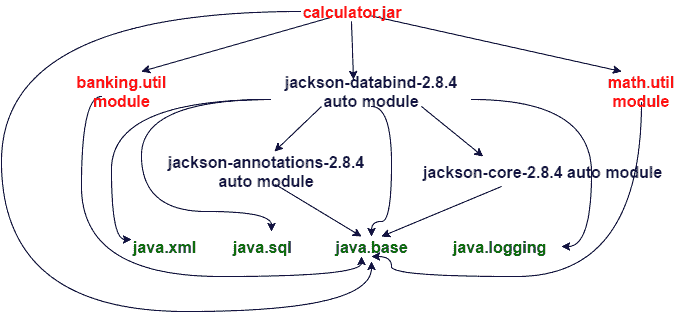

# 模块化 calculator.jar

迁移的最后一步是模块化 `calculator.jar`。按照以下步骤进行模块化：

1.  将 `chp3/6_bottom_up_migration_before/calculator/src` 下的 `com` 文件夹复制到 `chp3/6_bottom_up_migration_after/src/calculator` 位置。

1.  在 `chp3/6_bottom_up_migration_after/src/calculator` 下创建模块定义文件 `module-info.java`，内容如下：

```java
        module calculator{ 
          requires math.util; 
          requires banking.util; 
          requires jackson.databind; 
          requires jackson.core; 
          requires jackson.annotations; 
        }
```

1.  在文件夹`6_bottom_up_migration_after`内部，通过运行以下命令编译模块的 Java 代码：

```java
 javac -d mods --module-path mlib:mods --module-source-path src $(find src -name *.java)
```

1.  您将看到我们所有模块的 Java 代码都被编译到了`mods`目录中。请注意，您应该已经将自动模块（即与 jackson 相关的 JAR 文件）放置在`mlib`目录中。

1.  让我们为这个模块创建一个模块化 JAR，并说明哪个是`main`类：

```java
 jar --create --file=mlib/calculator.jar --main-
      class=com.packt.calculator.Calculator -C mods/calculator .
```

1.  现在，我们为我们的计算器模块创建了一个模块化 JAR，这是我们的主模块，因为它包含了`main`类。有了这个，我们也已经模块化了我们的完整应用程序。让我们从文件夹`6_bottom_up_migration_after`中运行以下命令：

```java
 java -p mlib:mods -m calculator
```

因此，我们已经看到了如何使用自下而上的迁移方法对非模块化应用程序进行模块化。最终的依赖图看起来大致如下：

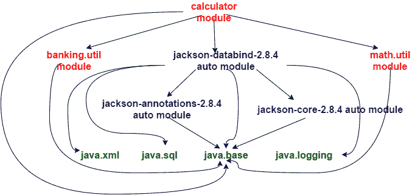

这个模块化应用程序的最终代码可以在以下位置找到：`chp3/6_bottom_up_migration_after`。

我们本可以在同一目录`6_bottom_up_migration_before`中对代码进行修改，即模块化该目录中的代码。但我们更倾向于在不同的目录`6_bottom_up_migration_after`中单独进行，以保持其整洁，并避免干扰现有的代码库。

# 它是如何工作的...

未命名模块的概念帮助我们能够在 Java 9 上运行我们的非模块化应用程序。同时使用模块路径和类路径帮助我们迁移时运行部分模块化应用程序。我们首先对那些不依赖于任何非模块化代码的代码库进行模块化。而对于我们无法模块化的代码库，我们将它们转换为自动模块。从而使得我们能够模块化依赖于这些代码库的代码。最终，我们得到了一个完全模块化的应用程序。

# 自上而下迁移

迁移的另一种技术是自上而下的迁移。在这种方法中，我们从依赖图中 JAR 文件的根 JAR 开始。

JAR 表示一个代码库。我们假设代码库以 JAR 文件的形式提供，因此我们得到的依赖图具有节点，这些节点是 JAR 文件。

将依赖图根部的模块化意味着所有依赖于这个根部的其他 JAR 文件也必须进行模块化。否则，这个模块化根无法声明对未命名的模块的依赖。让我们考虑我们在之前的菜谱中引入的示例非模块化应用程序。依赖图看起来大致如下：

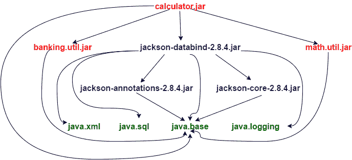

在自上而下的迁移中，我们广泛地使用了自动模块。自动模块是 JVM 隐式创建的模块。这些模块基于模块路径中可用的非模块化 JAR 文件创建。

# 准备工作

我们将使用之前在*自下而上迁移*菜谱中介绍的计算器示例。请继续复制来自以下位置的代码：`chp3/7_top_down_migration_before`。如果您想运行它并查看是否正常工作，请使用以下命令：

```java
$ javac -d math_util/out/classes/ -sourcepath math_util/src $(find math_util/src -name *.java)

$ jar --create --file=math_util/out/math.util.jar 
-C math_util/out/classes/ .

$ javac -d banking_util/out/classes/ -sourcepath banking_util/src $(find banking_util/src -name *.java)

$ jar --create --file=banking_util/out/banking.util.jar 
-C banking_util/out/classes/ .

$ javac -cp calculator/lib/*:math_util/out/math.util.jar:banking_util/out/banking.util.jar -d calculator/out/classes/ -sourcepath calculator/src $(find calculator/src -name *.java)

$ java -cp calculator/out/classes:calculator/lib/*:math_util/out/math.util.jar:banking_util/out/banking.util.jar com.packt.calculator.Calculator
```

我们提供了`package-*.bat`和`run.bat`来在 Windows 上打包和运行代码。以及`package-*.sh`和`run.sh`来在 Linux 上打包和运行代码。

# 如何做到这一点...

我们将在`chp3/7_top_down_migration_after`目录下对应用程序进行模块化。在`chp3/7_top_down_migration_after`下创建两个目录`src`和`mlib`。

# 模块化计算器：

1.  在我们没有对计算器的所有依赖项进行模块化之前，我们无法对计算器进行模块化。但有时对依赖项进行模块化可能更容易，有时则不然，尤其是在依赖项来自第三方的情况下。在这种情况下，我们使用自动模块。我们将非模块化 JAR 文件复制到`mlib`文件夹下，并确保 JAR 文件名为`<identifier>(.<identifier>)*`的形式，其中`<identifier>`是一个有效的 Java 标识符：

```java
 $ cp ../7_top_down_migration_before/calculator/lib/jackson-
      annotations-
 2.8.4.jar mlib/jackson.annotations.jar 

 $ cp ../7_top_down_migration_before/calculator/lib/jackson-core-
      2.8.4.jar
 mlib/jackson.core.jar 

 $ cp ../7_top_down_migration_before/calculator/lib/jackson-databind-
 2.8.4.jar mlib/jackson.databind.jar 

 $ cp ../7_top_down_migration_before/banking_util/out/banking.util.jar 
      mlib/ 

 $ cp ../7_top_down_migration_before/math_util/out/math.util.jar mlib/
```

我们提供了脚本`copy-non-mod-jar.bat`和`copy-non-mod-jar.sh`，以便轻松复制 JAR 文件。

让我们看看我们复制到`mlib`中的所有内容：

```java
     $ ls mlib
      banking.util.jar  jackson.annotations.jar  jackson.core.jar 
 jackson.databind.jar  math.util.jar
```

只有在您已经编译并将`chp3/7_top_down_migration_before/banking_util`和`chp3/7_top_down_migration_before/math_util`目录中的代码打包成 JAR 文件后，`banking.util.jar`和`math.util.jar`才会存在。我们之前在*准备就绪*部分已经这样做过了。

1.  在`src`目录下创建一个新的文件夹`calculator`。这个文件夹将包含`calculator`模块的代码。

1.  在`chp3/7_top_down_migration_after/src/calculator`目录下创建`module-info.java`文件，其中包含以下内容**：

```java
        module calculator{ 
          requires math.util; 
          requires banking.util; 
          requires jackson.databind; 
          requires jackson.core; 
          requires jackson.annotations; 
        }
```

1.  将`chp3/7_top_down_migration_before/calculator/src/com`目录及其所有代码复制到`chp3/7_top_down_migration_after/src/calculator`。

1.  编译计算器模块：

```java
 #On Linux
 javac -d mods --module-path mlib --module-source-path src $(find
      src -name *.java)

 #On Windows
 javac -d mods --module-path mlib --module-source-path src 
      src\calculator\module-info.java 
      src\calculator\com\packt\calculator\Calculator.java 
      src\calculator\com\packt\calculator\commands\*.java
```

1.  为`calculator`模块创建模块化 JAR 文件：

```java
 jar --create --file=mlib/calculator.jar --main-
      class=com.packt.calculator.Calculator -C mods/calculator/ .
```

1.  运行`calculator`模块：

```java
 java --module-path mlib -m calculator
```

我们将看到我们的计算器正在正确执行。您可以尝试不同的操作来验证是否所有操作都正确执行。

# 模块化`banking.util`：

由于这不依赖于其他非模块化代码，我们可以通过遵循以下步骤直接将其转换为模块：

1.  在`src`目录下创建一个新的文件夹`banking.util`。这个文件夹将包含`banking.util`模块的代码。

1.  在`chp3/7_top_down_migration_after/src/banking.util`目录下创建`module-info.java`文件，其中包含以下内容**：

```java
        module banking.util{
          exports com.packt.banking; 
        }
```

1.  将`chp3/7_top_down_migration_before/banking_util/src/com`目录及其所有代码复制到`chp3/7_top_down_migration_after/src/banking.util`。

1.  编译模块：

```java
 #On Linux
 javac -d mods --module-path mlib --module-source-path src $(find 
      src -name *.java)

 #On Windows
 javac -d mods --module-path mlib --module-source-path src 
      src\banking.util\module-info.java 
      src\banking.util\com\packt\banking\BankUtil.java
```

1.  为`banking.util`模块创建模块化 JAR 文件。这将替换`mlib`中已存在的非模块化`banking.util.jar`：

```java
 jar --create --file=mlib/banking.util.jar -C mods/banking.util/ .
```

1.  运行`calculator`模块以测试是否已成功创建`banking.util`模块化 JAR 文件：

```java
 java --module-path mlib -m calculator
```

1.  你应该看到计算器正在执行。尝试不同的操作以确保没有找不到类的错误。

# 模块化`math.util`

1.  在`src`下创建一个新的文件夹`math.util`。这将包含`math.util`模块的代码。

1.  在`chp3/7_top_down_migration_after/src/math.util`目录下创建`module-info.java`，其中包含以下内容**：

```java
        module math.util{ 
          exports com.packt.math; 
        }
```

1.  将`chp3/7_top_down_migration_before/math_util/src/com`目录及其下的所有代码复制到`chp3/7_top_down_migration_after/src/math.util`。

1.  编译模块：

```java
 #On Linux
 javac -d mods --module-path mlib --module-source-path src $(find 
      src -name *.java)

 #On Windows
 javac -d mods --module-path mlib --module-source-path src 
      src\math.util\module-info.java 
      src\math.util\com\packt\math\MathUtil.java
```

1.  为`banking.util`模块创建模块化 JAR。这将替换`mlib`中已经存在的非模块化`banking.util.jar`：

```java
 jar --create --file=mlib/math.util.jar -C mods/math.util/ .
```

1.  运行`calculator`模块以测试是否已成功创建`math.util`模块的模块化 JAR。

```java
 java --module-path mlib -m calculator
```

1.  你应该看到计算器正在执行。尝试不同的操作以确保没有找不到类的错误。

通过这种方式，我们已经完全模块化了应用程序，除了我们已将其转换为自动模块的 Jackson 库。

我们更倾向于自上而下的迁移方法。这是因为我们不必同时处理类路径和模块路径。我们可以将所有内容都变成自动模块，然后在我们继续将非模块化 JAR 迁移到模块化 JAR 时使用模块路径。

# 使用服务在消费者模块和提供者模块之间创建松耦合

通常，在我们的应用程序中，我们有一些接口和这些接口的多个实现。然后在运行时根据某些条件，我们使用某些特定的实现。这个原则被称为**依赖倒置**。这个原则被依赖注入框架如 Spring 用来创建具体实现的实例并将它们（或注入）到抽象接口的引用中。

Java 长期以来（自 Java 6 以来）通过`java.util.ServiceLoader`类支持服务提供者加载功能。使用服务加载器，你可以有一个**服务提供者接口**（**SPI**）和该 SPI 的多个实现，这些实现简单地称为服务提供者。这些服务提供者位于类路径中，并在运行时加载。当这些服务提供者位于模块内，并且我们不再依赖于类路径扫描来加载服务提供者时，我们需要一个机制来告诉我们的模块关于服务提供者和它所提供的服务 SPI。在这个菜谱中，我们将通过一个简单的示例来查看这个机制。

# 准备中

对于这个菜谱，我们不需要设置任何特定内容。在这个菜谱中，我们将使用一个简单的示例。我们有一个支持 CRUD 操作的`BookService`抽象类。现在，这些 CRUD 操作可以在 SQL 数据库、MongoDB 或文件系统上工作等等。这种灵活性可以通过使用服务提供者接口和`ServiceLoader`类来加载所需的服务提供者实现来提供。

# 如何操作...

在这个菜谱中，我们有四个模块：

1.  `book.service`: 这是一个包含我们的服务提供者接口的模块，即服务

1.  `mongodb.book.service`: 这是服务提供者模块之一

1.  `sqldb.book.service`: 这是另一个服务提供者模块

1.  `book.manage`: 这是一个服务消费者模块

以下步骤演示了如何使用`ServiceLoader`实现松耦合：

1.  在`chp3/8_services/src`目录下创建一个名为`book.service`的文件夹。我们所有关于`book.service`模块的代码都将位于这个文件夹下。

1.  在新包`com.packt.model`下创建一个新类`Book`。这是我们包含以下属性的模型类：

```java
        public String id; 
        public String title; 
        public String author;
```

1.  在新包`com.packt.service`下创建一个新类`BookService`。这是我们主要的服务接口，服务提供者将为这个接口提供实现。除了 CRUD 操作的抽象方法外，还有一个值得注意的方法是`getInstance()`。该方法使用`ServiceLoader`类加载任何一个服务提供者（具体来说是最后一个），然后使用该服务提供者来获取`BookService`的实现。让我们看看下面的代码：

```java
        public static BookService getInstance(){ 
          ServiceLoader<BookServiceProvider> sl = 
                 ServiceLoader.load(BookServiceProvider.class);
          Iterator<BookServiceProvider> iter = sl.iterator(); 
          if (!iter.hasNext()) 
            throw new RuntimeException("No service providers found!");

          BookServiceProvider provider = null; 
          while(iter.hasNext()){ 
            provider = iter.next(); 
            System.out.println(provider.getClass()); 
          } 
          return provider.getBookService(); 
        }
```

第一个`while`循环只是为了演示`ServiceLoader`加载了所有的服务提供者，我们选择了一个服务提供者。你也可以有条件地返回服务提供者，但这完全取决于需求。

1.  另一个重要的部分是实际的服务提供者接口。其责任是返回适当的服务实现实例。在我们的方案中，`com.packt.spi`包中的`BookServiceProvider`是一个服务提供者接口。

```java
        public interface BookServiceProvider{ 
          public BookService getBookService(); 
        }
```

1.  接下来是主要部分，即模块定义。我们在`chp3/8_services/src/book.service`目录下创建`module-info.java`，它包含以下内容：

```java
        module book.service{ 
          exports com.packt.model; 
          exports com.packt.service; 
          exports com.packt.spi; 
          uses com.packt.spi.BookServiceProvider; 
        }
```

在前面的模块定义中的`uses`语句指定了模块使用`ServiceLoader`发现的服务的接口。

1.  现在让我们创建一个名为`mongodb.book.service`的服务提供者模块。这将为我们`BookService`和`book.service`模块中的`BookServiceProvider`接口提供实现。我们的想法是，这个服务提供者将使用 MongoDB 数据存储实现 CRUD 操作。

1.  在`chp3/8_services/src`目录下创建一个名为`mongodb.book.service`的文件夹。

1.  在`com.packt.mongodb.service`包中创建一个名为`MongoDbBookService`的类，它扩展了`BookService`抽象类，并为我们的抽象 CRUD 操作方法提供了实现。

```java
        public void create(Book book){ 
          System.out.println("Mongodb Create book ... " + book.title); 
        } 

        public Book read(String id){ 
          System.out.println("Mongodb Reading book ... " + id); 
          return new Book(id, "Title", "Author"); 
        } 

        public void update(Book book){ 
          System.out.println("Mongodb Updating book ... " + book.title); 
        }

        public void delete(String id){ 
          System.out.println("Mongodb Deleting ... " + id); 
        }
```

1.  在`com.packt.mongodb`包中创建一个名为`MongoDbBookServiceProvider`的类，它实现了`BookServiceProvider`接口。这是我们服务发现类。基本上，它返回一个相关的`BookService`实现实例。它覆盖了`BookServiceProvider`接口中的方法如下：

```java
        @Override 
        public BookService getBookService(){ 
          return new MongoDbBookService(); 
        }
```

1.  模块定义非常有趣。我们必须在模块定义中声明这个模块是 `BookServiceProvider` 接口的服务提供者，并且可以如下进行：

```java
        module mongodb.book.service{ 
          requires book.service; 
          provides com.packt.spi.BookServiceProvider 
                   with com.packt.mongodb.MongoDbBookServiceProvider; 
        }
```

使用 `provides .. with ..` 语句来指定服务接口和其中一个服务提供者。

1.  现在让我们创建一个名为 `book.manage` 的服务消费者模块。

1.  在 `chp3/8_services/src` 下创建一个新的文件夹 `book.manage`，它将包含模块的代码。

1.  在 `com.packt.manage` 包中创建一个新的类 `BookManager`。这个类的主要目的是获取 `BookService` 的一个实例，然后执行其 CRUD 操作。返回的实例由 `ServiceLoader` 加载的服务提供者决定。`BookManager` 类看起来像这样：

```java
        public class BookManager{ 
          public static void main(String[] args){ 
            BookService service = BookService.getInstance();
            System.out.println(service.getClass()); 
            Book book = new Book("1", "Title", "Author"); 
            service.create(book); 
            service.read("1"); 
            service.update(book); 
            service.delete("1"); 
          }
        }
```

1.  现在让我们使用以下命令编译并运行我们的主模块：

```java
 $ javac -d mods --module-source-path src $(find src -name *.java) 
 $ java --module-path mods -m book.manage/com.packt.manage.BookManager 
 class com.packt.mongodb.MongoDbBookServiceProvider
 class com.packt.mongodb.service.MongoDbBookService
 Mongodb Create book ... Title
 Mongodb Reading book ... 1
 Mongodb Updating book ... Title
 Mongodb Deleting ... 1
```

在前面的输出中，第一行说明了可用的服务提供者，第二行说明了我们正在使用的 `BookService` 实现。

1.  使用一个服务提供者时看起来很简单。让我们继续添加另一个模块 `sqldb.book.service`，其模块定义如下：

```java
        module sqldb.book.service{ 
          requires book.service; 
          provides com.packt.spi.BookServiceProvider 
                   with com.packt.sqldb.SqlDbBookServiceProvider; 
        }
```

1.  `com.packt.sqldb` 包中的 `SqlDbBookServiceProvider` 类是实现 `BookServiceProvider` 接口的一个实现，如下所示：

```java
        @Override 
        public BookService getBookService(){     
          return new SqlDbBookService(); 
        }
```

1.  CRUD 操作的实现由 `com.packt.sqldb.service` 包中的 `SqlDbBookService` 类完成。

1.  让我们编译并运行主模块，这次使用两个服务提供者：

```java
 $ javac -d mods --module-source-path src $(find src -name *.java) 
 $ java --module-path mods -m book.manage/com.packt.manage.BookManager 
 class com.packt.sqldb.SqlDbBookServiceProvider
 class com.packt.mongodb.MongoDbBookServiceProvider
 class com.packt.mongodb.service.MongoDbBookService
 Mongodb Create book ... Title
 Mongodb Reading book ... 1
 Mongodb Updating book ... Title
 Mongodb Deleting ... 1
```

前两行打印可用的服务提供者的类名，第三行打印我们正在使用的 `BookService` 实现。

# 使用 jlink 创建自定义模块化运行时镜像

Java 有两种风味：

+   Java 运行时，也称为 JRE - 支持 Java 应用程序的执行

+   Java 开发工具包，也称为 JDK - 支持 Java 应用程序的开发和执行。

除了这个之外，Java 8 中还引入了 3 个紧凑配置文件，目的是为了提供具有更小内存占用量的运行时，以便在嵌入式和较小的设备上运行。

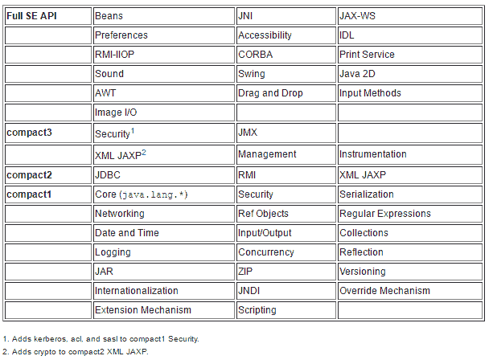

前面的图像显示了不同的配置文件及其支持的功能。

Java 9 中引入了一个名为 `jLink` 的新工具，它使得创建模块化运行时镜像成为可能。这些运行时镜像实际上是一组模块及其依赖项的集合。有一个名为 JEP 220 的 Java 增强提案，它规定了该运行时镜像的结构。

在这个食谱中，我们将使用 `jLink` 创建一个运行时镜像，该镜像包含我们的模块 `math.util`、`banking.util` 和 `calculator` 以及 Jackson 自动模块。

# 准备工作

在《创建一个简单的模块化应用程序》的食谱中，我们创建了一个简单的模块化应用程序，它由以下模块组成：

+   `math.util`

+   `calculator` - 包含主类

我们将重用同一组模块和代码来演示 jLink 工具的使用。为了方便读者，代码可以在以下位置找到：`chp3/9_jlink_modular_run_time_image`。

# 如何做到这一点...

1.  让我们编译这些模块：

```java
 $ javac -d mods --module-path mlib --module-source-path src $(find 
      src - name *.java)
```

1.  让我们为所有模块创建模块化 JAR：

```java
     $ jar --create --file mlib/math.util.jar -C mods/math.util . 

 $ jar --create --file=mlib/calculator.jar --main-
 class=com.packt.calculator.Calculator -C mods/calculator/ .
```

1.  让我们使用 `jlink` 创建包含以下模块的运行时镜像：`calculator`、`math.util` 及其依赖项：

```java
 $ jlink --module-path mlib:$JAVA_HOME/jmods --add-modules 
 calculator,math.util --output image --launcher 
 launch=calculator/com.packt.calculator.Calculator
```

运行时镜像在 `--output` 命令行选项指定的位置创建。

1.  在名为 image 的目录下创建的运行时镜像包含 `bin` 目录以及其他目录。这个 `bin` 目录包含一个名为 `calculator` 的 shell 脚本。这可以用来启动我们的应用程序：

```java
    $ ./image/bin/launch 

 ************Advanced Calculator************
 1\. Prime Number check
 2\. Even Number check
 3\. Sum of N Primes
 4\. Sum of N Evens
 5\. Sum of N Odds
 6\. Exit
 Enter the number to choose operation
```

我们不能创建包含自动模块的模块的运行时镜像。如果 JAR 文件不是模块化的或没有 `module-info.class`，jLink 会报错。

# 为旧平台版本编译

我们在某个时候使用了 `-source` 和 `-target` 选项来创建一个 java 构建。`-source` 选项用于指示编译器接受的 java 语言版本，而 `-target` 选项用于指示类文件支持的版本。我们经常忘记使用 `-source` 选项，并且默认情况下，`javac` 会编译最新的可用 Java 版本，因此有可能会使用新的 API，结果导致生成的构建在目标版本上无法按预期运行。

为了克服提供两个不同命令行选项的混淆，Java 9 中引入了一个新的命令行选项 `--release`。这个选项作为 `-source`、`-target` 和 `-bootclasspath` 选项的替代。`-bootclasspath` 选项用于提供给定版本 *N* 的引导类文件的位置。

# 准备中

我们创建了一个名为 demo 的简单模块，其中包含一个非常简单的类 `CollectionsDemo`，它只是将一些值放入映射中并遍历它们，如下所示：

```java
public class CollectionsDemo{
  public static void main(String[] args){
    Map<String, String> map = new HashMap<>();
    map.put("key1", "value1");
    map.put("key2", "value3");
    map.put("key3", "value3");
    map.forEach((k,v) -> System.out.println(k + ", " + v));
  }
}
```

让我们编译并运行它以查看其输出：

```java
$ javac -d mods --module-source-path src src\demo\module-info.java src\demo\com\packt\CollectionsDemo.java
$ java --module-path mods -m demo/com.packt.CollectionsDemo
```

我们得到的输出是：

```java
key1, value1
key2, value3
key3, value3
```

现在让我们编译它以在 Java 8 上运行，然后运行它。

# 如何做到这一点...

1.  由于较老的 Java 版本，即 Java 8 及之前版本不支持模块，我们不得不在较老版本编译时去除 `module-info.java`。所以我们所做的是在编译过程中不包含 `module-info.java`。因此，我们使用以下代码进行编译：

```java
 $ javac --release 8 -d mods src\demo\com\packt\CollectionsDemo.java
```

你可以看到我们正在使用 `--release` 选项针对 Java 8，并且没有编译 `module-info.java`。

1.  让我们创建一个 JAR 文件，因为与复制所有类文件相比，它更容易传输 java 构建文件：

```java
 $jar --create --file mlib/demo.jar --main-class 
      com.packt.CollectionsDemo -C mods/ .
```

1.  让我们在 Java 9 上运行前面的 JAR：

```java
 $ java -version
 java version "9"
 Java(TM) SE Runtime Environment (build 9+179)
 Java HotSpot(TM) 64-Bit Server VM (build 9+179, mixed mode)

 $ java -jar mlib/demo.jar
 key1, value1
 key2, value3
 key3, value3
```

1.  让我们在 Java 8 上运行这个 JAR：

```java
 $ "%JAVA8_HOME%"\bin\java -version 
 java version "1.8.0_121"
 Java(TM) SE Runtime Environment (build 1.8.0_121-b13)
 Java HotSpot(TM) 64-Bit Server VM (build 25.121-b13, mixed mode)

 $ "%JAVA8_HOME%"\bin\java -jar mlib\demo.jar
 key1, value1
 key2, value3
 key3, value3
```

如果我们在 Java 9 构建时没有使用 `-release` 选项会怎样？让我们也试试这个。

1.  不使用 `--release` 选项进行编译，并将生成的类文件创建成 JAR：

```java
 $ javac -d mods src\demo\com\packt\CollectionsDemo.java 
 $ jar --create --file mlib/demo.jar --main-class 
      com.packt.CollectionsDemo -C mods/ .
```

1.  让我们在 Java 9 上运行这个 JAR：

```java
 $ java -jar mlib/demo.jar 
 key1, value1
 key2, value3
 key3, value3
```

按预期工作

1.  让我们在 Java 8 上运行这个 JAR：

```java
 $ "%JAVA8_HOME%"\bin\java -version
 java version "1.8.0_121"
 Java(TM) SE Runtime Environment (build 1.8.0_121-b13)
 Java HotSpot(TM) 64-Bit Server VM (build 25.121-b13, mixed mode)
```

输出是：

```java
$ java -jar mlib\demo.jar

Exception in thread "main" java.lang.UnsupportedClassVersionError:

com/packt/CollectionsDemo has been compiled by a more recent version of the Java Runtime (class file version 53.0), this version of the Java Runtime only recognizes class file versions up to 52.0
```

它明确指出类文件版本不匹配。因为它是为 Java 9（版本 53.0）编译的，所以它不能在 Java 8（版本 52.0）上运行

# 它是如何工作的...

编译到目标旧版本所需的数据存储在 `$JDK_ROOT/lib/ct.sym` 文件中。此信息由 `--release` 选项用于定位 `bootclasspath`。`ct.sym` 文件是一个 ZIP 文件，包含与目标平台版本对应的简化后的类文件（直接引用自 [`openjdk.java.net/jeps/247`](http://openjdk.java.net/jeps/247)）。

# 创建多版本 JAR

在 Java 9 之前，库的开发者很难在不发布新库版本的情况下采用语言中引入的新功能。但在 Java 9 中，多版本 JAR 提供了这样的功能，您可以将某些类文件捆绑在一起，以便在使用更高版本的 Java 时运行。

在这个菜谱中，我们将向您展示如何创建这样的多版本 JAR。

# 如何操作...

1.  为 Java 8 平台创建所需的 Java 代码。我们将在 `src\8\com\packt` 目录中添加两个类 `CollectionUtil.java` 和 `FactoryDemo.java`：

```java
        public class CollectionUtil{
          public static List<String> list(String ... args){
            System.out.println("Using Arrays.asList");
            return Arrays.asList(args);
          }

          public static Set<String> set(String ... args){
            System.out.println("Using Arrays.asList and set.addAll");
            Set<String> set = new HashSet<>();
            set.addAll(list(args));
            return set;
          }
        }

        public class FactoryDemo{
          public static void main(String[] args){
            System.out.println(CollectionUtil.list("element1", 
                       "element2", "element3"));
            System.out.println(CollectionUtil.set("element1", 
                       "element2", "element3"));
          }
        }
```

1.  我们希望使用 Java 9 中引入的 `Collection` 工厂方法。所以我们可以创建 `src` 下的另一个子目录来放置我们的 Java 9 相关代码：`src\9\com\packt`，我们将添加另一个 `CollectionUtil` 类：

```java
        public class CollectionUtil{
          public static List<String> list(String ... args){
            System.out.println("Using factory methods");
            return List.of(args);
          }
          public static Set<String> set(String ... args){
            System.out.println("Using factory methods");
            return Set.of(args);
          }
        }
```

1.  上述代码使用了 Java 9 集合工厂方法。使用以下命令编译源代码：

```java
 javac -d mods --release 8 src\8\com\packt\*.java
      javac -d mods9 --release 9 src\9\com\packt\*.java
```

记下用于编译不同 Java 版本代码的 `--release` 选项。

1.  现在让我们创建多版本 JAR：

```java
 jar --create --file mr.jar --main-class=com.packt.FactoryDemo 
      -C mods . --release 9 -C mods9 .
```

在创建 JAR 文件时，我们也提到当在 Java 9 上运行时，要使用 Java 9 特定的代码。

1.  我们将在 Java 9 上运行 `mr.jar`：

```java
 java -jar mr.jar
 [element1, element2, element3]
 Using factory methods
 [element2, element3, element1]
```

1.  我们将在 Java 8 上运行 `mr.jar`：

```java
      #Linux
 $ /usr/lib/jdk1.8.0_144/bin/java -version
 java version "1.8.0_144"
 Java(TM) SE Runtime Environment (build 1.8.0_144-b01)
 Java HotSpot(TM) 64-Bit Server VM (build 25.144-b01, mixed mode)
 $ /usr/lib/jdk1.8.0_144/bin/java -jar mr.jar
 Using Arrays.asList
 [element1, element2, element3]
 Using Arrays.asList and set.addAll
 Using Arrays.asList
 [element1, element2, element3]

 #Windows
 $ "%JAVA8_HOME%"\bin\java -version 
 java version "1.8.0_121"
 Java(TM) SE Runtime Environment (build 1.8.0_121-b13)
 Java HotSpot(TM) 64-Bit Server VM (build 25.121-b13, mixed mode)
 $ "%JAVA8_HOME%"\bin\java -jar mr.jar
 Using Arrays.asList
 [element1, element2, element3]
 Using Arrays.asList and set.addAll
 Using Arrays.asList
 [element1, element2, element3]
```

# 它是如何工作的...

让我们看看 `mr.jar` 中内容的布局：

```java
jar -tvf mr.jar
```

JAR 的内容如下所示：

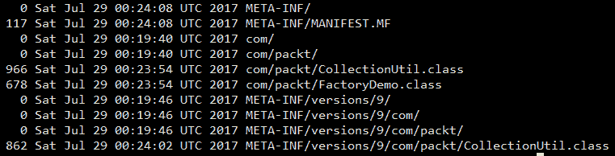

之前的布局中包含 `META-INF/versions/9`，其中包含 Java 9 特定的代码。另一个需要注意的重要事项是 `META-INF/MANIFEST.MF` 文件的内容。让我们提取 JAR 并查看其内容：

```java
jar -xvf mr.jar

$ cat META-INF/MANIFEST.MF
Manifest-Version: 1.0
Created-By: 9 (Oracle Corporation)
Main-Class: com.packt.FactoryDemo
Multi-Release: true
```

新的清单属性 `Multi-Release` 用于指示 JAR 是否为多版本 JAR。

# 使用 Maven 开发模块化应用程序

在这个菜谱中，我们将探讨使用 Maven，Java 生态系统中最受欢迎的构建工具，来开发一个简单的模块化应用程序。我们将在这个章节中介绍的服务菜谱中重用我们之前介绍的想法。

# 准备工作

我们在示例中有以下模块：

+   `book.manage`：这是与数据源交互的主要模块

+   `book.service`：这是包含服务提供者接口的模块

+   `mongodb.book.service`：这是提供服务提供者接口实现的模块

+   `sqldb.book.service`：这是提供另一个服务提供者接口实现的模块

在这个菜谱的过程中，我们将创建一个 Maven 项目，并将前面的 JDK 模块包含为 Maven 模块。那么，让我们开始吧。

# 如何做到这一点...

1.  创建一个文件夹来包含所有模块。我们将其命名为 `12_services_using_maven`，其文件夹结构如下：

```java
      12_services_using_maven
 |---book-manage
 |---book-service
 |---mongodb-book-service
 |---sqldb-book-service
 |---pom.xml
```

1.  父项目的 `pom.xml` 如下：

```java
        <?xml version="1.0" encoding="UTF-8"?>
        <project 

         xsi:schemaLocation="http://maven.apache.org/POM/4.0.0 
         http://maven.apache.org/xsd/maven-4.0.0.xsd">
          <modelVersion>4.0.0</modelVersion>
          <groupId>com.packt</groupId>
          <artifactId>services_using_maven</artifactId>
          <version>1.0</version>
          <packaging>pom</packaging>
          <modules>
            <module>book-service</module>
            <module>mongodb-book-service</module>
            <module>sqldb-book-service</module>
            <module>book-manage</module>
          </modules>
          <build>
            <plugins>
              <plugin>
                <groupId>org.apache.maven.plugins</groupId>
                <artifactId>maven-compiler-plugin</artifactId>
                <version>3.6.1</version>
                <configuration>
                  <source>9</source>
                  <target>9</target>
                  <showWarnings>true</showWarnings>
                  <showDeprecation>true</showDeprecation>
                </configuration>
              </plugin>
            </plugins>
          </build>
        </project>
```

1.  让我们为 `book-service` Maven 模块创建结构：

```java
 book-service
 |---pom.xml
 |---src
 |---main
 |---book.service
 |---module-info.java
 |---com
 |---packt
 |---model
 |---Book.java
 |---service
 |---BookService.java
 |---spi
 |---BookServiceProvider.java
```

1.  `book-service` Maven 模块的 `pom.xml` 内容如下：

```java
        <?xml version="1.0" encoding="UTF-8"?>
        <project 

        xsi:schemaLocation="http://maven.apache.org/POM/4.0.0 
        http://maven.apache.org/xsd/maven-4.0.0.xsd">
          <modelVersion>4.0.0</modelVersion>
          <parent>
            <groupId>com.packt</groupId>
            <artifactId>services_using_maven</artifactId>
            <version>1.0</version>
          </parent>
          <artifactId>book-service</artifactId>
          <version>1.0</version>
          <build>
            <sourceDirectory>src/main/book.service</sourceDirectory>
          </build>
        </project>
```

1.  `module-info.java` 的内容是：

```java
        module book.service{
          exports com.packt.model;
          exports com.packt.service;
          exports com.packt.spi;
          uses com.packt.spi.BookServiceProvider;
       }
```

1.  `Book.java` 的内容是：

```java
       public class Book{
         public Book(String id, String title, String author){
           this.id = id;
           this.title = title
           this.author = author;
         }
         public String id;
         public String title;
         public String author;
       }
```

1.  `BookService.java` 的内容是：

```java
         public abstract class BookService{
           public abstract void create(Book book); 
           public abstract Book read(String id); 
           public abstract void update(Book book); 
           public abstract void delete(String id);
           public static BookService getInstance(){ 
             ServiceLoader<BookServiceProvider> sl      
                  ServiceLoader.load(BookServiceProvider.class);          
             Iterator<BookServiceProvider> iter = sl.iterator();        
             if (!iter.hasNext())
                throw new RuntimeException("No service providers found!");              
             BookServiceProvider provider = null;        
             while(iter.hasNext()){
               provider = iter.next();
               System.out.println(provider.getClass());        
             }        
             return provider.getBookService(); 
           }
        }
```

1.  `BookServiceProvider.java` 的内容是：

```java
        public interface BookServiceProvider{
          public BookService getBookService();
        }
```

按照类似的思路，我们定义了其他三个 Maven 模块，分别是 `mongodb-book-service`、`sqldb-book-service` 和 `book-manager`。这段代码可以在位置 `chp3/12_services_using_maven` 找到。

我们可以使用以下命令编译类和构建所需的 JAR 文件：

```java
mvn clean install
```

我们提供了 `run-with-mongo.*` 来使用 `mongodb-book-service` 作为服务提供者实现，以及 `run-with-sqldb.*` 来使用 `sqldb-book-service` 作为服务提供者实现。

这个菜谱的完整代码可以在 `chp3/12_services_using_maven` 找到。
