# 走向函数式编程

本章介绍了名为函数式编程的编程范式及其在 Java 9 中的适用性。我们将涵盖以下食谱：

+   理解和创建函数式接口

+   理解 lambda 表达式

+   使用方法引用

+   创建和调用 lambda 友好的 API

+   在您的程序中利用 lambda 表达式

# 简介

函数式编程——将某些功能作为对象处理，并将其作为参数或方法的返回值的能力——是许多编程语言中存在的一个特性。它避免了对象状态的改变和可变数据。函数的结果仅取决于输入数据，无论它被调用多少次。这种风格使结果更具可预测性，这是函数式编程最具吸引力的方面。

它在 Java 中的引入也允许您通过将并行性的责任从客户端代码转移到库中来提高 Java 8 的并行编程能力。在此之前，为了处理 Java 集合的元素，客户端代码必须从集合中获取迭代器并组织集合的处理。

在 Java 8 中，添加了新的（默认）方法，这些方法接受一个函数（函数式接口的实现）作为参数，并将其应用于集合的每个元素。因此，组织并行处理的责任在库。一个例子是每个 `Iterable` 接口都有的 `forEach(Consumer)` 方法，其中 `Consumer` 是一个函数式接口。另一个例子是每个 `Collection` 接口都有的 `removeIf(Predicate)` 方法，其中 `Predicate` 也是一个函数式接口。然后我们有 `sort(Comparator)` 和 `replaceAll(UnaryOperator)` 方法，这些方法在 `List` 和其他几个方法中可用，例如 `Map` 的 `compute()` 方法。

`java.util.function` 包提供了四十三种函数式接口。每个接口都只包含一个抽象方法。Lambda 表达式利用单抽象方法限制，显著简化了此类接口的实现。

没有函数式编程，Java 中传递某些功能作为参数的唯一方法是通过编写一个实现接口的类，创建其对象，然后将其作为参数传递。但即使是最低程度的参与方式——使用匿名类——也需要编写过多的代码。使用函数式接口和 lambda 表达式可以使代码更短、更清晰、更具表现力。

在本章中，我们将定义和解释这些新的 Java 特性——功能性接口和 lambda 表达式——并在代码示例中展示它们的适用性。将这些新特性引入 Java 使得函数成为语言的第一等公民。但对于尚未接触过函数式编程的人来说，利用它们的强大功能需要一种新的思考方式和代码组织方式。

展示这些特性并分享使用它们的最佳实践是本章的目的。

# 理解和创建功能性接口

在这个菜谱中，你将了解自 Java 8 以来支持的功能性接口。

# 准备工作

任何只有一个抽象方法的接口被称为功能性接口。为了帮助避免运行时错误，Java 8 中引入了 `@FunctionalInterface` 注解，它告诉编译器关于意图的信息。在我们前几章的演示代码中，我们已经有一个功能性接口的例子：

```java
public interface SpeedModel {
  double getSpeedMph(double timeSec, 
  int weightPounds, int horsePower);
  enum DrivingCondition {
    ROAD_CONDITION,
    TIRE_CONDITION
  }
  enum RoadCondition {
    //...
  }
  enum TireCondition {
    //...
  }
}
```

存在 `enum` 类型或任何已实现的（默认或静态）方法并不会使其成为非功能性接口。只有抽象（未实现）的方法才算数。因此，这也是一个功能性接口的例子：

```java
public interface Vehicle {
  void setSpeedModel(SpeedModel speedModel);
  default double getSpeedMph(double timeSec){ return -1; };
  default int getWeightPounds(){ return -1; }
  default int getWeightKg(){ 
    return convertPoundsToKg(getWeightPounds());
  }
  private int convertPoundsToKg(int pounds){
    return (int) Math.round(0.454 * pounds);
  }
  static int convertKgToPounds(int kilograms){
    return (int) Math.round(2.205 * kilograms);
  }
}
```

为了回顾你在前几章中关于接口所学的内容，`getWeightPounds()` 方法的实现会在被 `getWeightKg()` 调用时返回 `-1`。然而，这只有在 `getWeightPounds()` 方法在类中没有实现的情况下才成立。否则，将在运行时使用类的实现。

除了默认和静态接口方法之外，功能性接口还可以包括基类 `java.lang.Object` 的任何和所有抽象方法。在 Java 中，每个对象都提供了 `java.lang.Object` 方法的默认实现，因此编译器和 Java 运行时忽略这些抽象方法。

例如，这也是一个功能性接口：

```java
public interface SpeedModel {
  double getSpeedMph(double timeSec, 
  int weightPounds, int horsePower);
  boolean equals(Object obj);
  String toString();
}
```

以下不是功能性接口：

```java
public interface Car extends Vehicle {
  int getPassengersCount();
}
```

这是因为 `Car` 接口有两个抽象方法：它自己的 `getPassengersCount()` 方法以及从 `Vehicle` 接口继承的 `setSpeedModel()` 方法。比如说，我们给 `Car` 接口添加 `@FunctionalInterface` 注解：

```java
@FunctionalInterface 
public interface Car extends Vehicle {
  int getPassengersCount();
}
```

如果我们这样做，编译器将生成以下错误：


使用 `@FunctionalInterface` 注解不仅有助于在编译时捕获错误，而且还能确保设计意图的可靠传达。它帮助你或其他程序员记住，这个接口不能有超过一个抽象方法，这在代码已经存在且依赖于这种假设的情况下尤为重要。

由于同样的原因，Java 8 中的 `Runnable` 和 `Callable` 接口（它们在 Java 的早期版本中就已经存在）被标注为 `@FunctionalInterface`，以使这种区分明确，并提醒用户或试图向它们添加另一个抽象方法的人：

```java
@FunctionalInterface
interface Runnable { void run(); }

@FunctionalInterface
interface Callable<V> { V call() throws Exception; }
```

在创建你打算用作方法参数的自定义功能接口之前，首先考虑使用`java.util.function`包中提供的四十三种功能接口之一。其中大多数是以下四个接口的特化：`Function`、`Consumer`、`Supplier`和`Predicate`。

# 如何做到这一点……

你可以遵循以下步骤来熟悉功能接口：

1.  看一下功能接口`Function`：

```java
        @FunctionalInterface
        public interface Function<T,R>
```

这里是其 Javadoc，*接受一个类型为 T 的参数并产生类型为 R 的结果。功能方法是 apply(Object)*。你可以使用匿名类来实现这个接口：

```java
        Function<Integer, Double> ourFunc = new 
                          Function<Integer, Double>(){
          public Double apply(Integer i){
            return i * 10.0;
          }
        };
```

它的唯一方法，即`apply()`，接受类型为`Integer`（或原始的`int`，它将被自动装箱）的值作为参数，然后乘以`10`，并返回类型为`Double`（或解箱为原始的`double`）的值，因此我们可以编写以下代码：

```java
        System.out.println(ourFunc.apply(1));
```

结果将如下所示：


在下一个菜谱中，我们将介绍 lambda 表达式，并展示其使用如何使实现更加简洁。但到目前为止，我们仍将继续使用匿名类。

1.  看一下功能接口`Consumer`（名称有助于记住该接口的方法接受一个值但不返回任何内容——它只消费）：

```java
        public interface Consumer<T>
        Accepts a single input argument of type T and returns no result.
        The functional method is accept(Object).
```

该接口的实现可以如下所示：

```java
        Consumer<String> ourConsumer = new Consumer<String>() {
          public void accept(String s) {
            System.out.println("The " + s + " is consumed.");
          }
        };
```

`accepts()`方法接收类型为`String`的参数值并打印它。比如说，我们编写以下代码：

```java
        ourConsumer.accept("Hello!");
```

结果将如下所示：


1.  看一下功能接口`Supplier`（名称有助于记住该接口的方法不接受任何值但返回某些内容——仅提供）：

```java
        public interface Supplier<T>
        Represents a supplier of results of type T.
        The functional method is get().
```

这意味着该接口的唯一方法是`get()`，它没有输入参数并返回类型为`T`的值。基于此，我们可以创建一个函数：

```java
        Supplier<String> ourSupplier = new Supplier<String>() {
          public String get() {
            String res = "Success";
            //Do something and return result – Success or Error.
            return res;
          }
        };
```

`(get()`方法执行某些操作然后返回类型为`String`的值，因此我们可以编写以下代码：

```java
        System.out.println(ourSupplier.get());
```

结果将如下所示：


1.  看一下功能接口`Predicate`（名称有助于记住该接口的方法返回一个布尔值——断言某事）：

```java
       @FunctionalInterface
       public interface Predicate<T>
```

它的 JavaDoc 声明：*表示一个类型为 T 的单参数谓词（布尔值函数）。功能方法是 test(Object)*。这意味着该接口的唯一方法是`test(Object)`，它接受一个类型为`T`的输入参数并返回一个布尔值。让我们创建一个函数：

```java
        Predicate<Double> ourPredicate = new Predicate<Double>() {
          public boolean test(Double num) {
            System.out.println("Test if " + num + 
                               " is smaller than 20");
            return num < 20;
          }
        };
```

它的`test()`方法接受一个`Double`类型的参数并返回一个`boolean`类型的值，因此我们可以编写以下代码：

```java
        System.out.println(ourPredicate.test(10.0) ? 
                           "10 is smaller" : "10 is bigger");
```

结果将如下所示：


1.  看看 `java.util.function` 包中的其他 39 个功能接口。注意，它们是我们已经讨论过的四个接口的变体。这些变体是为了以下原因而创建的：

+   +   通过显式使用 `int`、`double` 或 `long` 原始类型来避免自动装箱和拆箱，以获得更好的性能

    +   对于接受两个输入参数

    +   对于简短的表示法

以下功能接口只是 39 个接口列表中的几个例子。

功能接口 `IntFunction<R>`（其唯一抽象方法是 `apply(int)`）接受一个 `int` 原始类型，并返回类型为 `R` 的值。它提供了一种简短的表示法（参数类型不使用泛型）并避免了自动装箱（通过将 `int` 原始类型定义为参数）。以下是一个例子：

```java
        IntFunction<String> function = new IntFunction<String>() {
          public String apply(int i) {
            return String.valueOf(i * 10);
          }
        };
```

功能接口 `BiFunction<T,U,R>`（`apply(T,U)` 方法）接受类型为 `T` 和 `U` 的两个参数，并返回类型为 `R` 的值。以下是一个例子：

```java
         BiFunction<String, Integer, Double> function = 
               new BiFunction<String, Integer, Double >() {
           public Double apply(String s, Integer i) {
             return (s.length() * 10d)/i;
           }
         };
```

功能接口 `BinaryOperator<T>`（`apply(T,T)` 方法）接受两个类型为 `T` 的参数，并返回类型为 `T` 的值。它通过避免重复三次相同的类型来提供简短的表示法。以下是一个例子：

```java
         BinaryOperator<Integer> function = 
                           new BinaryOperator<Integer>(){
           public Integer apply(Integer i, Integer j) {
             return i >= j ? i : j;
           }
         };
```

功能接口 `IntBinaryOperator`（`applyAsInt(int,int)` 方法）接受两个类型为 `int` 的参数，并返回类型为 `int` 的值。以下是一个例子：

```java
        IntBinaryOperator function = new IntBinaryOperator(){
          public int apply(int i, int j) {
            return i >= j ? i : j;
          }
        };
```

我们将在下面的菜谱中看到此类特殊化的使用示例。

# 它是如何工作的...

你可以创建并传递任何功能接口的实现，就像传递任何对象一样。例如，让我们编写一个创建 `Function<Integer, Double>` 的方法：

```java
Function<Integer, Double> createMultiplyBy10(){
  Function<Integer, Double> ourFunc = new Function<Integer, Double>(){
    public Double apply(Integer i){ return i * 10.0; }
  };
  return ourFunc;
}
```

更好的是，我们可以创建一个使用以下内容的泛型方法：

```java
Function<Integer, Double> createMultiplyBy(double num){
  Function<Integer, Double> ourFunc = new Function<Integer, Double>(){
    public Double apply(Integer i){ return i * num; }
  };
  return ourFunc;
}
```

现在，我们可以写出这个：

```java
Function<Integer, Double> multiplyBy10 = createMultiplyBy(10d);
System.out.println(multiplyBy10.apply(1));

Function<Integer, Double> multiplyBy30 = createMultiplyBy(30d);
System.out.println(multiplyBy30.apply(1));
```

结果将如下所示：


类似地，我们可以有创建 `Function<Double, Double>` 函数、`Consumer<String>` 函数和 `Supplier<String>` 函数的工厂方法：

```java
Function<Double, Double> createSubtract(double num){
  Function<Double, Double> ourFunc = new Function<Double, Double>(){
    public Double apply(Double dbl){ return dbl - num; }
  };
  return ourFunc;
}
public static Consumer<String> createTalker(String value){
  Consumer<String> consumer = new Consumer<String>() {
    public void accept(String s) { 
      System.out.println(s + value); 
    }
  };
  return consumer;
}
public static Supplier<String> createResultSupplier(){
  Supplier<String> supplier = new Supplier<String>() {
    public String get() {
      String res = "Success";
      //Do something and return Success or Error.
      return res;
    }
  };
  return supplier;
}
```

让我们使用前面的函数：

```java
Function<Double,Double> subtract7 = createSubtract(7.0);
System.out.println(subtract7.apply(10.0));

Consumer<String> sayHappyToSee = createTalker("Happy to see
                                              you again!");
sayHappyToSee.accept("Hello!");

Supplier<String> successOrFailure = createResultSupplier();
System.out.println(successOrFailure.get());
```

结果将如下所示：


我们还可以有创建不同版本的 `Predicate<Double>` 函数的工厂方法：

```java
Predicate<Double> createIsSmallerThan(double limit){
  Predicate<Double> pred = new Predicate<Double>() {
    public boolean test(Double num) {
      System.out.println("Test if " + num + " is smaller than " 
                         + limit);
      return num < limit;
    }
  };
  return pred;
}
Predicate<Double> createIsBiggerThan(double limit){
  Predicate<Double> pred = new Predicate<Double>() {
    public boolean test(Double num) {
      System.out.println("Test if " + num + " is bigger than " 
                         + limit);
      return num > limit;
    }
  };
  return pred;
}
```

让我们按照以下方法使用前面的方法：

```java
Predicate<Double> isSmallerThan20 = createIsSmallerThan(20d);
System.out.println(isSmallerThan20.test(10d));

Predicate<Double> isBiggerThan18 = createIsBiggerThan(18d);
System.out.println(isBiggerThan18.test(10d));
```

当我们使用它们时，我们得到以下结果：

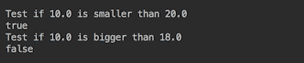

如果需要，具有更复杂逻辑的函数可以由几个已存在的函数组合而成：

```java
Supplier<String> applyCompareAndSay(int i,
                      Function<Integer, Double> func,
                      Predicate<Double> isSmaller){
  Supplier<String> supplier = new Supplier<String>() {
    public String get() {
      double v = func.apply(i);
      return isSmaller.test(v)? v + " is smaller" : v + " is bigger";
    }
  };
  return supplier;
}
```

我们可以通过将 `multiplyBy10`、`multiplyBy30` 和 `isSmallerThan20` 函数传递给之前创建的工厂方法来创建它：

```java
Supplier<String> compare1By10And20 = 
         applyCompareAndSay(1, multiplyBy10, isSmallerThan20);
System.out.println(compare1By10And20.get());
Supplier<String> compare1By30And20 = 
         applyCompareAndSay(1, multiplyBy30, isSmallerThan20);
System.out.println(compare1By30And20.get());
```

如果我们运行前面的代码，你会得到以下结果：

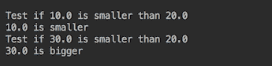

第一行和第三行来自 `isSmallerThan20` 函数，而第二行和第四行来自 `compare1By10And20` 和 `compare1By30And20` 函数，相应地。

正如你所见，函数式接口的引入通过允许传递函数作为参数来增强了 Java。现在，应用程序开发者可以专注于函数（业务流程）的实现，而不用担心将其应用到集合的每个元素。

# 还有更多...

`java.util.function`包中的许多函数式接口都有默认方法，这些方法不仅增强了它们的功能，还允许你链式调用函数，并将一个函数的结果作为另一个函数的输入参数。例如，我们可以使用`Function`接口的默认方法`andThen(Function after)`：

```java
Supplier<String> compare1By30Less7To20 = 
         applyCompareAndSay(1, multiplyBy30.andThen(subtract7), 
                            isSmallerThan20);
System.out.println(compare1By30Less7To20.get());
Supplier<String> compare1By30Less7TwiceTo20 = 
         applyCompareAndSay(1, multiplyBy30.andThen(subtract7)
                               .andThen(subtract7),isSmallerThan20);
System.out.println(compare1By30Less7TwiceTo20.get());
```

`after`函数应用于这个函数的结果，因此，`after`函数的输入类型必须与这个函数的结果类型相同或为其基类型。这段代码的结果如下：

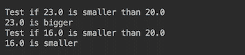

我们可以使用`Function`接口的另一个默认方法`compose(Function before)`来达到相同的结果，该方法首先应用`before`函数，然后再应用这个函数。自然地，在这种情况下，我们需要交换`multiplyBy30`函数和`subtract7`函数的位置：

```java
Supplier<String> compare1By30Less7To20 = 
         applyCompareAndSay(1, subtract7.compose(multiplyBy30),
                            isSmallerThan20);
System.out.println(compare1By30Less7To20.get());
Supplier<String> compare1By30Less7TwiceTo20 = 
         applyCompareAndSay(1, subtract7.compose(multiplyBy30)
                               .andThen(subtract7), isSmallerThan20);
 System.out.println(compare1By30Less7TwiceTo20.get());
```

结果如下所示：


`Consumer`接口也有`andThen(Consumer after)`方法，因此我们可以使用之前创建的`sayHappyToSee`函数来创建一个对话：

```java
Consumer<String> askHowAreYou = createTalker("How are you?");
sayHappyToSee.andThen(askHowAreYou).accept("Hello!");
```

结果将如下所示：


`Supplier`接口没有默认方法，而`Predicate`接口有一个`isEqual(Object targetRef)`静态方法和三个默认方法：`and(Predicate other)`、`negate()`和`or(Predicate other)`。我们将演示`and(Predicate other)`方法的用法。

我们可以创建一个谓词，使用已经创建的函数`isSmallerThan20`和`isBiggerThan18`来检查输入值是否介于这两个值之间。但在做这个之前，我们需要通过向签名中添加另一个名为`message`的参数来重载`applyCompareAndSay()`工厂方法：

```java
Supplier<String> applyCompareAndSay(int i, 
                   Function<Integer, Double> func, 
                   Predicate<Double> compare, String message) {
  Supplier<String> supplier = new Supplier<String>() {
    public String get() {
      double v = func.apply(i);
      return (compare.test(v)? v + " is " : v + " is not ") + message;
    }
  };
  return supplier;
} 
```

现在，我们可以写出以下内容：

```java
Supplier<String> compare1By30Less7TwiceTo18And20 = 
         applyCompareAndSay(1, multiplyBy30.andThen(subtract7)
                               .andThen(subtract7),
                            isSmallerThan20.and(isBiggerThan18), 
                            "between 18 and 20");
System.out.println(compare1By30Less7TwiceTo18And20.get());
```

我们得到以下结果：

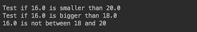

如果这段代码看起来有点过度设计且复杂，这是真的。我们这样做是为了演示目的。好消息是 lambda 表达式（在下一道菜谱中介绍）允许你以更直接、更清晰的方式达到相同的结果。

在结束这道菜谱之前，我们想提到，`java.util.function`包中的函数式接口有其他有用的默认方法。其中最突出的是`identity()`方法，它返回一个总是返回其输入参数的函数：

```java
Function<Integer, Integer> id = Function.identity();
System.out.println("Function.identity.apply(4) => " + id.apply(4));
```

我们将得到以下输出：


当某些过程需要你提供一个特定函数，但你又不想这个函数修改结果时，`identity()` 方法非常有用。

其他默认方法大多与转换、装箱和拆箱以及提取两个参数的最小和最大值有关。我们鼓励你遍历 `java.util.function` 包中所有函数式接口的 API，并感受其可能性。

# 参见

参考本章以下食谱：

+   理解 lambda 表达式

+   使用方法引用

# 理解 lambda 表达式

在这个食谱中，你将了解自 Java 8 以来支持的 lambda 表达式。

# 准备工作

在前面的食谱（使用匿名类实现函数式接口）中的例子看起来很庞大，感觉过于冗长。首先，我们没有必要重复接口名称，因为我们已经将其声明为对象引用的类型。其次，在函数式接口（只有一个抽象方法）的情况下，没有必要指定要实现的方法名称。编译器和 Java 运行时无论如何都能弄清楚。我们需要的只是提供新的功能。这就是 lambda 表达式发挥作用的地方。

# 如何做...

以下步骤将帮助你理解 lambda 表达式：

1.  考虑以下代码，例如：

```java
        Function<Integer, Double> ourFunc = 
                          new Function<Integer, Double>(){
          public Double apply(Integer i){ return i * 10.0; }
        };
        System.out.println(ourFunc.apply(1));

        Consumer<String> consumer = new Consumer<String>() {
          public void accept(String s) {
            System.out.println("The " + s + " is consumed.");
          }
        };
        consumer.accept("Hello!");

        Supplier<String> supplier = new Supplier<String>() {
          public String get() {
            String res = "Success";
            //Do something and return result – Success or Error.
            return res;
          }
        };
        System.out.println(supplier.get());

        Predicate<Double> pred = new Predicate<Double>() {
          public boolean test(Double num) {
            System.out.println("Test if " + num + 
                               " is smaller than 20");
            return num < 20;
          }
        };
        System.out.println(pred.test(10.0) ? 
                           "10 is smaller" : "10 is bigger");
```

1.  用 lambda 表达式重写它：

```java
        Function<Integer, Double> ourFunc = i -> i * 10.0;
        System.out.println(ourFunc.apply(1));

        Consumer<String> consumer = 
           s -> System.out.println("The " + s + " is consumed.");
        consumer.accept("Hello!");

        Supplier<String> supplier = () -> {
          String res = "Success";
          //Do something and return result – Success or Error.
          return res;
        };
        System.out.println(supplier.get());

        Predicate<Double> pred = num -> {
          System.out.println("Test if " + num + " is smaller than 20");
          return num < 20;
        };
        System.out.println(pred.test(10.0) ? 
                           "10 is smaller" : "10 is bigger");
```

1.  运行它，你会得到相同的结果：

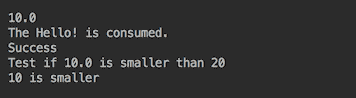

# 它是如何工作的...

lambda 表达式的语法包括参数列表、箭头符号 (`->`) 和主体。参数列表可以是空的 (`()`), 没有括号（如果只有一个参数，如我们的示例所示），或者是一个用括号包围的逗号分隔的参数列表。主体可以是一个单独的表达式（如我们前面的代码所示）或一个语句块。以下是一个例子：

```java
BiFunction<Integer, String, Double> demo = 
                  (x,y) -> x * 10d + Double.parseDouble(y);
System.out.println(demo.apply(1, "100"));

//The above is the equivalent to the statement block: 
demo = (x,y) -> {
  //You can add here any code you need
  double v = 10d;
  return x * v + Double.parseDouble(y); 
};
System.out.println(demo.apply(1, "100"));
```

本例的结果如下：


只有在语句块的情况下才需要大括号。在单行 lambda 表达式中，无论函数是否返回值，大括号都是可选的。

让我们用 lambda 表达式重写我们之前写的代码：

```java
Function<Integer, Double> multiplyBy10 = i -> i * 10.0;
System.out.println("1 * 10.0 => "+multiplyBy10.apply(1));

Function<Integer, Double> multiplyBy30 = i -> i * 30.0;
System.out.println("1 * 30.0 => "+multiplyBy30.apply(1));

Function<Double,Double> subtract7 = x -> x - 7.0;
System.out.println("10.0 - 7.0 =>"+subtract7.apply(10.0));

Consumer<String> sayHappyToSee = 
   s -> System.out.println(s + " Happy to see you again!");
sayHappyToSee.accept("Hello!");

Predicate<Double> isSmallerThan20 = x -> x < 20d;
System.out.println("10.0 is smaller than 20.0 => " + 
                   isSmallerThan20.test(10d));

Predicate<Double> isBiggerThan18 = x -> x > 18d;
System.out.println("10.0 is smaller than 18.0 => " + 
                   isBiggerThan18.test(10d));
```

如果我们运行这个，我们会得到以下结果：

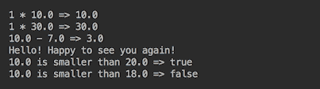

如你所见，结果完全相同，但代码更简单，只捕捉了本质。

工厂方法也可以用 lambda 表达式重写和简化：

```java
Supplier<String> applyCompareAndSay(int i, 
                      Function<Integer, Double> func, 
                      Predicate<Double> compare, String message){
  return () -> {
    double v = func.apply(i);
    return (compare.test(v) ? v + " is " : v + " is not ") + message;
  };
}
```

我们不再重复实现 `Supplier<String>` 接口的名称，因为它已经在方法签名中指定为返回类型。我们也不再指定实现 `test()` 方法的名称，因为它必须是 `Supplier` 接口中唯一必须实现的方法。编写这样紧凑高效的代码成为可能，是因为 lambda 表达式和函数式接口的结合。

与匿名类一样，在 lambda 表达式外部创建并在内部使用的变量成为实际上是 final 的，不能被修改。你可以编写以下代码：

```java
double v = 10d;
multiplyBy10 = i -> i * v;
```

然而，你无法在 lambda 表达式外部更改变量`v`的值：

```java
double v = 10d;
v = 30d; //Causes compiler error
multiplyBy10 = i -> i * v;
```

你也无法在表达式中更改它：

```java
double v = 10d;
multiplyBy10 = i -> {
  v = 30d; //Causes compiler error
  return i * v;
};

```

这种限制的原因是，一个函数可以在不同的上下文中（例如不同的线程）为不同的参数传递和执行，尝试同步这些上下文将违背函数分布式评估的原始想法。

匿名类和 lambda 表达式之间一个主要的不同之处在于`this`关键字的解释。在匿名类内部，它指的是匿名类的实例。在 lambda 表达式内部，`this`指的是包围表达式的类的实例。以下是一个演示代码示例：

```java
public static void main(String arg[]) {
  Demo d = new Demo();
  d.method();
}

public static class Demo{
  private String prop = "DemoProperty";
  public void method(){
    Consumer<String> consumer = s -> {
    System.out.println("Lambda accept(" + s + "): this.prop=" 
                       + this.prop);
  };
  consumer.accept(this.prop);

  consumer = new Consumer<String>() {
    private String prop = "ConsumerProperty";
    public void accept(String s) {
      System.out.println("Anonymous accept(" + s + "): this.prop=" 
                         + this.prop);
    }
  };
  consumer.accept(this.prop);
}
```

此代码的输出如下：


lambda 表达式不是一个内部类，不能通过`this`来引用。根据 Java 规范，这种做法通过将`this`引用视为来自周围上下文，允许你拥有更多的实现灵活性。

# 还有更多...

看看演示代码如何变得更加简单和复杂度更低。我们可以在传递参数的同时动态创建函数：

```java
Supplier<String> compare1By30Less7TwiceTo18And20 = 
        applyCompareAndSay(1, x -> x * 30.0 - 7.0 - 7.0, 
                           x -> x < 20 && x > 18, "betwen 18 and 20");
System.out.println("Compare (1 * 30 - 7 - 7) and the range"
                   + " 18 to 20 => " 
                   + compare1By30Less7TwiceTo18And20Lambda.get());
```

然而，结果并没有改变：


这就是 lambda 表达式与函数式接口结合的强大和美丽之处。

# 参见

参考本章中的以下菜谱：

+   理解和创建函数式接口

+   使用方法引用

此外，请参阅第五章，*流操作和管道*

# 使用方法引用

在这个菜谱中，你将学习如何使用方法引用，构造器引用只是其中的一种情况。

# 准备工作

在以下情况下，当一行 lambda 表达式仅由对现有方法的引用组成（在别处实现）时，可以使用方法引用进一步简化表示法。引用方法可以是静态的或非静态的（后者可以绑定到特定的对象或不行）或带有或不带有参数的构造器。

方法引用的语法是`Location::methodName`，其中`Location`表示`methodName`方法可以在哪里（在哪个对象或类）找到。两个冒号（`::`）作为位置和方法名之间的分隔符。如果在指定位置有多个具有相同名称的方法（由于方法重载），则通过 lambda 表达式实现的函数式接口的抽象方法的签名来识别引用方法。

# 如何做到这一点...

使用方法引用很简单，可以通过每个案例的几个示例来轻松说明：

1.  首先，我们有静态方法引用。如果一个`Food`类有一个名为`String getFavorite()`的静态方法，那么 lambda 表达式可能看起来像这样：

```java
         Supplier<String> supplier = Food::getFavorite;
```

如果`Foo`类还有一个名为`String getFavorite(int num)`的方法，使用它的 lambda 表达式可能看起来完全一样：

```java
         Function<Integer, String> func = Food::getFavorite; 
```

差异在于这个 lambda 表达式实现的接口。它允许编译器和 Java 运行时识别要使用的方法。让我们看看代码。以下是`Food`类：

```java
         public class Food{
           public static String getFavorite(){ return "Donut!"; }
           public static String getFavorite(int num){
             return num > 1 ? String.valueOf(num) 
                              + " donuts!" : "Donut!";
           }
         }
```

我们可以使用它的静态方法作为函数式接口的实现：

```java
         Supplier<String> supplier = Food::getFavorite;
         System.out.println("supplier.get() => " + supplier.get());

         Function<Integer, String> func = Food::getFavorite;
         System.out.println("func.getFavorite(1) => "
                            + func.apply(1));
         System.out.println("func.getFavorite(2) => " 
                            + func.apply(2));
```

结果将会如下：

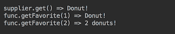

1.  其次，我们有构造函数的方法引用。

假设`Food`类没有显式的构造函数，或者有一个不带参数的构造函数。最接近这种签名的函数式接口是`Supplier<Food>`，因为它也不接受任何参数。让我们向我们的`Food`类添加以下内容：

```java
         private String name;
         public Food(){ this.name = "Donut"; };
         public String sayFavorite(){
           return this.name + (this.name.toLowerCase()
                      .contains("donut") ? "? Yes!" : "? D'oh!");
         }
```

然后，我们可以写出以下内容：

```java
         Supplier<Food> constrFood = Food::new;
         Food food = constrFood.get();
         System.out.println("new Food().sayFavorite() => " 
                            + food.sayFavorite());
```

如果我们这样写，我们会得到以下输出：


之前非静态方法引用绑定到了`Food`类的特定实例。我们稍后会回到它，并讨论非绑定非静态方法引用。但现在，我们将向`Food`类添加另一个带有一个参数的构造函数：

```java
         public Food(String name){ 
           this.name = name; 
         } 
```

一旦我们这样做，我们将通过方法引用来表示它：

```java
         Function<String, Food> constrFood1 = Food::new;
         food = constrFood1.apply("Donuts");
         System.out.println("new Food(Donuts).sayFavorite() => " 
                            + food.sayFavorite());
         food = constrFood1.apply("Carrot");
         System.out.println("new Food(Carrot).sayFavorite() => " 
                            + food.sayFavorite());
```

这会导致以下代码：


以同样的方式，我们可以添加一个带有两个参数的构造函数：

```java
         public Food(String name, String anotherName) {
           this.name = name + " and " + anotherName;
         }
```

一旦我们这样做，我们就可以通过`BiFunction<String, String>`来表示它：

```java
         BiFunction<String, String, Food> constrFood2 = Food::new;
         food = constrFood2.apply("Donuts", "Carrots");
         System.out.println("new Food(Donuts,Carrot).sayFavorite() => "
                            + food.sayFavorite());
         food = constrFood2.apply("Carrot", "Broccoli");
         System.out.println("new Food(Carrot,Broccoli)
                            .sayFavorite() => " + food.sayFavorite());
```

这会导致以下结果：


要表示接受超过两个参数的构造函数，我们可以创建一个具有任意数量参数的自定义函数式接口。例如，考虑以下内容：

```java
        @FunctionalInterface
        interface Func<T1,T2,T3,R>{ R apply(T1 t1, T2 t2, T3 t3);}
```

我们可以使用它来处理不同类型：

```java
         Func<Integer, Double, String, Food> constr3 = Food::new;
         Food food = constr3.apply(1, 2d, "Food");
```

这个自定义接口的名称及其唯一方法的名称可以是我们喜欢的任何名称：

```java
        @FunctionalInterface
        interface FourParamFunction<T1,T2,T3,R>{
          R construct(T1 t1, T2 t2, T3 t3);
        }
        Func<Integer, Double, String, Food> constr3 = Food::new;
        Food food = constr3.construct(1, 2d, "Food");
```

1.  第三，我们有绑定和非绑定非静态方法。

我们用于`sayFavorite()`方法的引用方法需要（绑定到）类实例。这意味着在函数创建之后，我们无法更改函数中使用的类实例。为了演示这一点，让我们创建三个`Food`类的实例和三个捕获`sayFavorite()`方法功能的`Supplier<String>`接口的实例：

```java
         Food food1 = new Food();
         Food food2 = new Food("Carrot");
         Food food3 = new Food("Carrot", "Broccoli");
         Supplier<String> supplier1 = food1::sayFavorite;
         Supplier<String> supplier2 = food2::sayFavorite;
         Supplier<String> supplier3 = food3::sayFavorite;
         System.out.println("new Food()=>supplier1.get() => " + 
                            supplier1.get());
         System.out.println("new Food(Carrot)=>supplier2.get() => " 
                            + supplier2.get());
         System.out.println("new Food(Carrot,Broccoli)" +
                            "=>supplier3.get() => " + supplier3.get());
```

如您所见，在创建供应商之后，我们只能调用其上的`get()`方法，并且不能更改绑定到其上的实例（`Food`类的实例）（`get()`方法指的是`food1`、`food2`或`food3`对象的方法）。结果如下：

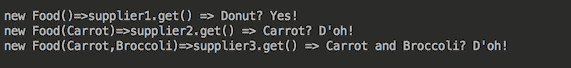

相比之下，我们可以使用`Function<Food, String>`接口的实例创建一个未绑定的主引用（注意，方法位置被指定为名为`Food`的类名）：

```java
        Function<Food, String> func = Food::sayFavorite;
```

这意味着我们可以为这个函数的每次调用使用`Food`类的不同实例：

```java
        System.out.println("new Food().sayFavorite() => " 
                           + func.apply(food1));
        System.out.println("new Food(Carrot).sayFavorite() => " 
                           + func.apply(food2));
        System.out.println("new Food(Carrot,Broccoli).sayFavorite()=> " 
                           + func.apply(food3));
```

这就是为什么这个方法引用被称为**未绑定**的。

最后，我们可以通过添加`sayFavorite(String name)`方法（与我们对静态方法`getFavorite()`所做的方式相同）来重载`sayFavorite()`方法：

```java
        public String sayFavorite(String name){
          this.name = this.name + " and " + name;
          return sayFavorite();
        }
```

通过这种方式，我们可以证明编译器和 Java 运行时仍然可以通过指定的功能接口签名理解我们的意图并调用正确的方法：

```java
        Function<String, String> func1 = food1::sayFavorite;
        Function<String, String> func2 = food2::sayFavorite;
        Function<String, String> func3 = food3::sayFavorite;
        System.out.println("new Food().sayFavorite(Carrot) => " 
                           + func1.apply("Carrot"));
        System.out.println("new Food(Carrot).sayFavorite(Broccoli) => "
                           + func2.apply("Broccoli"));
        System.out.println("new Food(Carrot,Broccoli)" +
                           ".sayFavorite(Donuts) => " + 
                           func3.apply("Donuts"));
```

结果如下：


# 还有更多...

在实践中，经常使用一些简单但有用的 lambda 表达式和方法引用：

```java
Function<String, Integer> strLength = String::length;
System.out.println(strLength.apply("3"));

Function<String, Integer> parseInt = Integer::parseInt;
System.out.println(parseInt.apply("3"));

Consumer<String> consumer = System.out::println;
consumer.accept("Hello!");
```

如果我们运行它们，结果将如下所示：


这里有一些用于处理数组和列表的有用方法：

```java
Function<Integer, String[]> createArray = String[]::new;
String[] arr = createArray.apply(3);
System.out.println("Array length=" + arr.length);
int i = 0;
for(String s: arr){ arr[i++] = String.valueOf(i); }

Function<String[], List<String>> toList = Arrays::<String>asList;
List<String> l = toList.apply(arr);
System.out.println("List size=" + l.size());
for(String s: l){ System.out.println(s); }
```

以下是前面代码的结果：

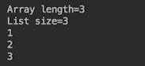

我们将分析它们是如何创建和使用的留给你。

# 参考以下内容

参考本章以下菜谱：

+   理解和创建功能接口

+   理解 lambda 表达式

此外，请参阅第五章，*流操作和管道*

# 创建和调用 lambda 友好的 API

在这个菜谱中，你将学习如何创建 lambda 友好的 API 以及最佳实践。

# 准备工作

当一个新的 API 的想法首次出现时，它通常看起来干净且聚焦良好。即使是第一个实现的版本也往往保持相同的品质。但随后，“一次性”和其他与主要用例的小偏差变得紧迫，随着用例种类的增加，API 开始增长（并且变得越来越复杂，更难使用）。生活并不总是符合我们对它的愿景。这就是为什么任何 API 设计者在某个时候都会面临如何使 API 既通用又灵活的问题。过于通用的 API 在特定业务领域难以理解，而非常灵活的 API 会使实现更加复杂，更难测试、维护和使用。

将接口用作参数可以促进灵活性，但需要编写实现它们的新代码。功能接口和 lambda 表达式允许通过几乎不需要管道的方式捕获功能，从而将此类代码的范围减少到最小。这种实现的粒度可以细到或粗到所需，无需创建新类、它们的对象工厂和其他传统基础设施。

然而，过度追求灵活性是有可能的，过度使用新功能的力量，以至于它通过使 API 难以理解和使用几乎不可能来违背初衷。本食谱的目的是警告某些陷阱并分享适合 lambda 表达式的 API 设计的最佳实践。

适合 lambda 表达式使用的 API 设计最佳实践包括以下内容：

+   优先使用`java.util.function`包中的接口

+   避免通过函数式接口的类型来过度加载方法

+   使用`@FunctionalInterface`注解来定义自定义函数式接口

+   将函数式接口作为参数考虑，而不是创建几个只在功能步骤上有所不同的方法

# 它是如何工作的...

我们在*理解和创建函数式接口*的食谱中讨论了所列出的前两种实践。使用`java.util.function`包中的接口的优势基于两个事实。首先，任何标准化都促进了更好的理解和 API 使用的便利性。其次，它促进了代码编写的最小化。

为了说明这些考虑，让我们尝试创建一个 API，并将其命名为`GrandApi`——一个将在`GrandApiImpl`类中实现的接口。

让我们在新的 API 中添加一个方法，允许客户端传递一个计算某个值的函数。这种安排允许客户端根据需要自定义 API 的行为。这种设计被称为委托模式。它有助于对象组合，这在第二章中讨论过，*快速掌握面向对象 - 类和接口*。

首先，我们演示传统的面向对象方法，并引入一个具有计算方法`Calculator`接口：

```java
public interface Calculator {
  double calculateSomething();
}
public class CalcImpl implements Calculator{
  private int par1;
  private double par2;
  public CalcImpl(int par1, double par2){
    this.par1 = par1;
    this.par2 = par2;
  }
  public double calculateSomething(){
    return par1 * par2;
  }
}
```

因此，我们新接口的第一个方法可以有如下方法：

```java
public interface GrandApi{
  double doSomething(Calculator calc, String str, int i);
}
```

该方法的实现可能如下所示：

```java
double doSomething(Calculator calc, String str, int i){
  return calc.calculateSomething() * i + str.length();
}
```

我们现在可以创建一个实现`Calculator`接口的`CalucaltorImpl`类，并将`CalculatorImpl`对象的实例传递给`doSomething()`方法：

```java
GrandApi api = new GrandImpl();
Calculator calc = new CalcImpl(20, 10d);
double res = api.doSomething(calc, "abc", 2);
System.out.println(res);
```

结果将如下所示：


如果客户端想要使用另一个`Calculator`实现，这种方法将需要你创建一个新的类或使用匿名类：

```java
GrandApi api = new GrandImpl();
double res = api.doSomething(new Calculator() {
  public double calculateSomething() {
    return 20 * 10d;
  }
}, "abc", 2);
System.out.println(res);
```

在 Java 8 之前，客户端有两个可用的选项。如果客户端被迫使用某个`Calculator`实现（例如，由第三方开发），则不能使用匿名类；因此，只剩下一个选项。

在 Java 8 中，客户端可以利用只有一个抽象方法的`Calculator`接口（因此，它是一个函数式接口）。比如说，客户端被迫使用第三方实现：

```java
public static class AnyImpl{
  public double doIt(){ return 1d; }
  public double doSomethingElse(){ return 100d; }
}
```

客户端可以编写以下代码：

```java
GrandApi api = new GrandImpl();
AnyImpl anyImpl = new AnyImpl();
double res = api.doSomething(anyImpl::doIt, "abc", 2); 
System.out.println(res);
```

如果他们这样做，将会得到以下结果：


编译器和 Java 运行时主要根据输入参数的数量以及返回值的是否存在来匹配功能接口。

如果使用第三方实现不是强制性的，客户端可以使用 lambda 表达式，例如以下内容：

```java
double res = api.doSomething(() -> 20 * 10d, "abc", 2);
System.out.println(res);
```

他们还可以使用以下方法：

```java
int i = 20;
double d = 10.0;
double res = api.doSomething(() -> i * d, "abc", 2);
System.out.println(res);
```

在这两种情况下，他们都会得到以下结果：


然而，所有这些只有在`Calculator`接口只有一个抽象方法的情况下才可能。因此，如果我们能的话，最好给它添加`@FunctionalInterface`注解。这是因为一旦`Calculator`获得另一个抽象方法，带有 lambda 表达式的客户端代码就会崩溃。

然而，如果我们使用`java.util.function`包中的一个标准功能接口，我们可以避免创建一个自定义接口。在这种情况下，匹配的接口将是`Supplier<Double>`，我们可以将我们的第一个 API 方法更改为以下内容：

```java
public interface GrandApi{
  double doSomething(Supplier<Double> supp, String str, int i);
}
```

现在，我们确信带有 lambda 表达式的客户端代码永远不会崩溃，并且客户端代码将会更短：

```java
GrandApi api = new GrandImpl();
Supplier<Double> supp = () -> 20 * 10d;
double res = api.doSomething(supp, "abc", 2);
System.out.println(res);
```

它也可以是这样的：

```java
GrandApi api = new GrandImpl();
double res = api.doSomething(() -> 20 * 10d, "abc", 2);
System.out.println(res);
```

在任何情况下，结果都将相同：


如果客户端被迫使用现有的实现，代码可以如下所示：

```java
GrandApi api = new GrandImpl();
AnyImpl anyImpl = new AnyImpl();
double res = api.doSomething(anyImpl::doIt, "abc", 2); 
System.out.println(res);
```

对于`AnyImpl`类，它仍然会产生相同的结果：


这就是为什么使用标准功能接口非常推荐的原因，因为它允许更多的灵活性，并且减少了客户端代码的编写。然而，一个人应该小心不要仅仅通过功能接口的类型来过度加载方法。问题在于，通过功能接口参数识别方法的算法通常没有太多可以工作的，特别是如果方法调用只包含内联 lambda 表达式。算法检查输入参数的数量（arity）以及返回值的是否存在（`void`）。但这可能还不够，API 用户可能会遇到严重的调试问题。让我们看一个例子，并将这两个方法添加到我们的 API 中：

```java
double doSomething2(Function<Integer,Integer> function, double num);
void doSomething2(Consumer<String> consumer, double num);

```

对于人类眼睛来说，这些方法具有非常不同的签名。只要传递给功能接口的实例是明确指定的，它们就会被正确解析：

```java
 GrandApi api = new GrandImpl();
 Consumer<String> consumer = System.out::println;
 api.doSomething2(consumer, 2d);
```

功能接口的类型也可以通过类型转换来指定：

```java
GrandApi api = new GrandImpl();
api.doSomething2((Consumer<String>)System.out::println,2d);
```

现在考虑不指定传入功能接口类型的代码：

```java
GrandApi api = new GrandImpl();
api.doSomething2(System.out::println, 2d);
```

它甚至无法编译，并给出以下错误信息：

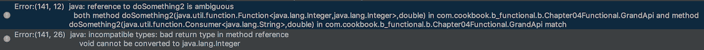

错误的原因是，这两个接口（`Function<Integer, Integer>`和`Consumer<String>`）具有相同数量的输入参数，而不同的返回类型（`Integer`和`void`）显然不足以解决这种情况下的方法重载。因此，不要使用不同的函数式接口来重载方法，而应使用不同的方法名。例如，看看以下内容：

```java
double doSomethingWithFunction(Function<Integer, Integer> function,
                               double num);
void doSomethingWIthConsumer(Consumer<String> consumer, double num);
```

# 还有更多...

以下是为构建 lambda 表达式最佳实践：

+   保持无状态

+   避免使用块语句

+   使用方法引用

+   依赖有效的最终状态

+   不要绕过有效的最终状态

+   避免指定参数类型

+   避免为单个参数使用括号

+   避免使用大括号和返回语句

API 设计者也应牢记这些指南，因为 API 客户端可能会使用它们。

保持 lambda 表达式无状态意味着函数评估的结果必须仅依赖于输入参数，无论表达式评估多少次或使用了哪些参数。例如，这将是一个容易出错的代码：

```java
GrandApi api = new GrandImpl();
int[] arr = new int[1];
arr[0] = 1;
double res = api.doSomething(() -> 20 * 10d + arr[0]++, "abc", 2);
System.out.println(res);
res = api.doSomething(() -> 20 * 10d + arr[0]++, "abc", 2);
System.out.println(res);
res = api.doSomething(() -> 20 * 10d + arr[0]++, "abc", 2);
System.out.println(res);
```

这是因为它每次都会产生不同的结果：


此示例还涵盖了依赖有效的最终状态而不是绕过它的建议。通过在先前的示例中指定`final int[] arr`，给人一种代码无懈可击的错觉，而实际上它隐藏了缺陷。

其他 lambda 表达式最佳实践有助于使代码更清晰，更好地表达其主要逻辑，否则可能会在冗长的代码和众多符号中丢失。只需比较以下行。这是第一行：

```java
double res = api.doSomething2((Integer i) -> { return i * 10; }, 2d);
```

这是第二行：

```java
double res = api.doSomething2(i -> i * 10, 2d); 
```

第二行更加简洁明了，尤其是在块语句中有多个参数和复杂逻辑的情况下。我们将在下一配方中看到块语句的示例以及如何避免它们。任何现代编辑器都有助于移除不必要的符号。

# 另请参阅

请参考本章中的以下配方：

+   在你的程序中利用 lambda 表达式

还请参考第五章，“流操作和管道”

# 在你的程序中利用 lambda 表达式

在本配方中，你将学习如何将 lambda 表达式应用到你的代码中。我们将回到演示应用，并通过引入 lambda 表达式来修改它，使其变得有意义。

# 准备工作

通过配备函数式接口、lambda 表达式和 lambda 友好的 API 设计最佳实践，我们可以显著提高我们的速度计算应用，使其设计更加灵活和用户友好。让我们尽可能接近现实生活中的问题来设置一些背景、动机和基础设施，同时不要让它过于复杂。

无人驾驶汽车和相关问题现在是头条新闻，有很好的理由相信这种情况将持续相当长一段时间。这个领域的一个任务是基于真实数据分析和建模城市地区的交通流量。已经存在大量此类数据，并且未来还将继续收集。让我们假设我们通过日期、时间和地理位置可以访问这样的数据库。让我们还假设从这个数据库中来的交通数据以单元为单位，每个单元都捕捉到一辆车及其驾驶条件的详细信息：

```java
public interface TrafficUnit {
  VehicleType getVehicleType();
  int getHorsePower();
  int getWeightPounds();
  int getPayloadPounds();
  int getPassengersCount();
  double getSpeedLimitMph();
  double getTraction();
  RoadCondition getRoadCondition();
  TireCondition getTireCondition();
  int getTemperature();
} 
```

这里的`VehicleType`、`RoadCondition`和`TireCondition`是我们已经在上一章中构建的`enum`类型：

```java
enum VehicleType { 
  CAR("Car"), TRUCK("Truck"), CAB_CREW("CabCrew");
  private String type;
  VehicleType(String type){ this.type = type; }
  public String getType(){ return this.type;}
}
enum RoadCondition {
  DRY(1.0), 
  WET(0.2) { public double getTraction() { 
    return temperature > 60 ? 0.4 : 0.2; } }, 
  SNOW(0.04);
  public static int temperature;
  private double traction;
  RoadCondition(double traction){ this.traction = traction; }
  public double getTraction(){return this.traction;}
}
enum TireCondition {
  NEW(1.0), WORN(0.2);
  private double traction;
  TireCondition(double traction){ this.traction = traction; }
  public double getTraction(){ return this.traction;}
}

```

访问交通数据的接口可能看起来像这样：

```java
TrafficUnit getOneUnit(Month month, DayOfWeek dayOfWeek, 
                       int hour, String country, String city, 
                       String trafficLight);
List<TrafficUnit> generateTraffic(int trafficUnitsNumber, 
                  Month month, DayOfWeek dayOfWeek, int hour,
                  String country, String city, String trafficLight);
```

因此，可能的调用可以这样进行：

```java
TrafficUnit trafficUnit = FactoryTraffic.getOneUnit(Month.APRIL, 
               DayOfWeek.FRIDAY, 17, "USA", "Denver", "Main103S");
```

这里的`17`指的是一天中的某个小时（下午 5 点），而`Main1035`是交通灯识别，或者调用可以请求多个结果，如下所示：

```java
List<TrafficUnit> trafficUnits = 
    FactoryTrafficModel.generateTraffic(20, Month.APRIL, DayOfWeek.FRIDAY,
                                        17, "USA", "Denver", "Main103S");
```

其中`20`是请求的交通单元数量。

如您所见，这样的交通工厂提供了特定地点特定时间（以我们的例子中的下午 5 点到 6 点为例）的交通数据。每次调用工厂都会产生不同的结果，而交通单元列表描述了指定地点的统计正确数据（包括最可能的天气条件）。

我们还将更改`FactoryVehicle`和`FactorySpeedModel`的接口，以便它们可以根据`TrafficUnit`接口构建`Vehicle`和`SpeedModel`。生成的示例代码如下：

```java
double timeSec = 10.0;
TrafficUnit trafficUnit = FactoryTraffic.getOneUnit(Month.APRIL, 
            DayOfWeek.FRIDAY, 17, "USA", "Denver", "Main103S");
Vehicle vehicle = FactoryVehicle.build(trafficUnit);
SpeedModel speedModel =  
          FactorySpeedModel.generateSpeedModel(trafficUnit);
vehicle.setSpeedModel(speedModel);
printResult(trafficUnit, timeSec, vehicle.getSpeedMph(timeSec));
```

其中`printResult()`方法具有以下代码：

```java
void printResult(TrafficUnit tu, double timeSec, 
                                          double speedMph){
   System.out.println("Road " + tu.getRoadCondition() + ", tires "
                      + tu.getTireCondition() + ": " 
                      + tu.getVehicleType().getType() 
                      + " speedMph (" + timeSec + " sec)=" 
                      + speedMph + " mph");
}
```

此代码的输出可能看起来像这样：


由于我们现在使用的是“真实”数据，因此每次运行此程序都会产生不同的结果，这取决于数据的统计特性。在某个地点，在特定日期和时间，汽车或干燥天气可能会更频繁地出现，而在另一个地点，卡车或雪可能会更典型。

在这次运行中，交通单元带来了一条湿滑的道路、新轮胎，以及具有这样发动机功率和负载的`Truck`，在 10 秒内它能够达到 22 英里/小时的速度。我们用来计算速度的公式（在`SpeedModel`对象内部）对您来说应该是熟悉的：

```java
double weightPower = 2.0 * horsePower * 746 * 32.174 / weightPounds;
double speed = Math.round(Math.sqrt(timeSec * weightPower) 
                          * 0.68 * traction);
```

在这里，`traction`值来自`TrafficUnit`（参见我们刚才讨论的其接口）。在实现`TrafficUnit`接口的类中，`getTraction()`方法看起来如下：

```java
public double getTraction() {
  double rt = getRoadCondition().getTraction();
  double tt = getTireCondition().getTraction();
  return rt * tt;
}
```

`getRoadCondition()`和`getTireCondition()`方法返回我们刚才描述的相应`enum`类型的元素。

现在我们已经准备好使用之前菜谱中讨论的 Java 新特性来改进我们的速度计算应用程序。

# 如何做到这一点...

按照以下步骤学习如何使用 lambda 表达式：

1.  让我们开始构建一个 API。我们将称之为`Traffic`。不使用功能接口，它可能看起来像这样：

```java
        public interface Traffic {
          void speedAfterStart(double timeSec, int trafficUnitsNumber);
        }  
```

其实现可能如下所示：

```java
        public class TrafficImpl implements Traffic {
          private int hour;
          private Month month;
          private DayOfWeek dayOfWeek;
          private String country, city, trafficLight;
          public TrafficImpl(Month month, DayOfWeek dayOfWeek, 
                             int hour, String country, String city, 
                             String trafficLight){
            this.month = month;
            this.dayOfWeek = dayOfWeek;
            this.hour = hour;
            this.country = country;
            this.city = city;
            this.trafficLight = trafficLight;
          }
          public void speedAfterStart(double timeSec, 
                                      int trafficUnitsNumber) {
            List<TrafficUnit> trafficUnits = 
                FactoryTraffic.generateTraffic(trafficUnitsNumber,
                               month, dayOfWeek, hour, country,
                               city, trafficLight);
            for(TrafficUnit tu: trafficUnits){
              Vehicle vehicle = FactoryVehicle.build(tu);
              SpeedModel speedModel = 
                  FactorySpeedModel.generateSpeedModel(tu);
              vehicle.setSpeedModel(speedModel);
              double speed = vehicle.getSpeedMph(timeSec);
              printResult(tu, timeSec, speed);
            }
          }
        }
```

1.  现在，让我们编写使用此接口的示例代码：

```java
        Traffic api = new TrafficImpl(Month.APRIL, DayOfWeek.FRIDAY,
                                      17, "USA", "Denver", "Main103S");
        double timeSec = 10.0;
        int trafficUnitsNumber = 10;
        api.speedAfterStart(timeSec, trafficUnitsNumber); 
```

我们得到以下类似的结果：

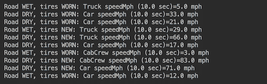

如前所述，由于我们使用的是真实数据，相同的代码每次并不产生完全相同的结果。不应该期望看到与前面的截图中的速度值相同，而应该看到非常相似的结果。

1.  让我们使用 lambda 表达式。前面的 API 相当有限。例如，它不允许你在不更改`FactorySpeedModel`的情况下测试不同的速度计算公式。同时，`SpeedModel`接口只有一个名为`getSpeedMph()`的抽象方法：

```java
        public interface SpeedModel {
          double getSpeedMph(double timeSec, int weightPounds, 
                             int horsePower);
        }
```

这使其成为一个功能接口，我们可以利用这一事实，并添加另一个方法到我们的 API 中，该方法能够接受`SpeedModel`实现作为 lambda 表达式：

```java
        public interface Traffic {
          void speedAfterStart(double timeSec, int trafficUnitsNumber, 
                               SpeedModel speedModel);
        }
```

然而，问题在于`牵引力`值并不是作为参数传递给`getSpeedMph()`方法的，因此我们无法在将其传递给我们的 API 方法之前将其实现为一个函数。更仔细地看看速度计算：

```java
        double weightPower = 
               2.0 * horsePower * 746 * 32.174/weightPounds;
        double speed = Math.round(Math.sqrt(timeSec * weightPower) 
                                  * 0.68 * traction);
```

当你这样做时，你会注意到`牵引力`作为`速度`值的简单乘数，因此我们可以在速度计算之后应用它（并避免调用`FactorySpeedModel`）：

```java
        public void speedAfterStart(double timeSec, 
               int trafficUnitsNumber, SpeedModel speedModel) {
          List<TrafficUnit> trafficUnits = 
               FactoryTraffic.generateTraffic(trafficUnitsNumber,
                                   month, dayOfWeek, hour, country,
                                   city, trafficLight);
          for(TrafficUnit tu: trafficUnits){
            Vehicle vehicle = FactoryVehicle.build(tu);
            vehicle.setSpeedModel(speedModel);
            double speed = vehicle.getSpeedMph(timeSec);
            speed = Math.round(speed * tu.getTraction());
            printResult(tu, timeSec, speed);
          }
        }
```

此更改允许 API 用户将`SpeedModel`作为函数传递：

```java
        Traffic api = new TrafficImpl(Month.APRIL, DayOfWeek.FRIDAY, 
                                      17, "USA", "Denver", "Main103S");
        double timeSec = 10.0;
        int trafficUnitsNumber = 10;
        SpeedModel speedModel = (t, wp, hp) -> {
          double weightPower = 2.0 * hp * 746 * 32.174 / wp;
          return Math.round(Math.sqrt(t * weightPower) * 0.68);
        };
        api.speedAfterStart(timeSec, trafficUnitsNumber, speedModel);
```

1.  此代码的结果与`FactorySpeedModel`生成的`SpeedModel`相同。但现在 API 用户可以提出他们自己的速度计算函数。例如，他们可以编写以下内容：

```java
        Vehicle vehicle = FactoryVehicle.build(trafficUnit);
        SpeedModel speedModel = (t, wp, hp) -> {
 return -1.0;
        };
        vehicle.setSpeedModel(speedModel);
        printResult(trafficUnit, timeSec, vehicle.getSpeedMph(timeSec));
```

结果将如下所示：


1.  将`SpeedModel`接口注释为`@FunctionalInterface`，这样任何试图向其中添加另一个方法的人都会得到忠告，并且在没有移除此注释并意识到破坏已实现此功能接口的现有客户端代码的风险的情况下，将无法添加另一个抽象方法。

1.  通过添加各种标准，将所有可能的流量切割成各个部分，来改进 API。

例如，API 用户可能只想分析汽车、卡车、发动机功率大于 300 马力的汽车、发动机功率大于 400 马力的卡车等等。完成此任务的传统方法可能是创建如下方法：

```java
        void speedAfterStartCarEngine(double timeSec, 
                            int trafficUnitsNumber, int horsePower);
        void speedAfterStartCarTruckOnly(double timeSec, 
                                 int trafficUnitsNumber);
        void speedAfterStartCarTruckEngine(double timeSec, 
                            int trafficUnitsNumber, int carHorsePower, 
                            int truckHorsePower);
```

相反，我们只需向现有方法添加标准功能接口，并让 API 用户决定提取哪部分流量：

```java
        void speedAfterStart(double timeSec, int trafficUnitsNumber,
                             SpeedModel speedModel, 
                             Predicate<TrafficUnit> limitTraffic);
```

实现看起来可能如下所示：

```java
        public void speedAfterStart(double timeSec, 
                    int trafficUnitsNumber, SpeedModel speedModel, 
                    Predicate<TrafficUnit> limitTraffic) {
          List<TrafficUnit> trafficUnits = 
               FactoryTraffic.generateTraffic(trafficUnitsNumber,
                                      month, dayOfWeek, hour, country,
                                      city, trafficLight);
          for(TrafficUnit tu: trafficUnits){
            if(limitTraffic.test(tu){
              Vehicle vehicle = FactoryVehicle.build(tu);
              vehicle.setSpeedModel(speedModel);
              double speed = vehicle.getSpeedMph(timeSec);
              speed = Math.round(speed * tu.getTraction());
              printResult(tu, timeSec, speed);
            }
          }
        }
```

API 用户可以像以下这样调用它：

```java
        Predicate<TrafficUnit> limitTraffic = tu ->
                  (tu.getHorsePower() < 250 && tu.getVehicleType() 
                   == VehicleType.CAR) || (tu.getHorsePower() < 400 
                   && tu.getVehicleType()==VehicleType.TRUCK);

        api.speedAfterStart(timeSec, trafficUnitsNumber, 
                            speedModel, limitTraffic);
```

现在的结果仅限于发动机功率小于 250 马力的汽车和发动机功率小于 400 马力的卡车：


实际上，API 用户现在可以应用任何适用于`TrafficUnit`对象中值的限制标准。例如，用户可以编写以下内容：

```java
        Predicate<TrafficUnit> limitTraffic2 = 
            tu -> tu.getTemperature() > 65 
            && tu.getTireCondition() == TireCondition.NEW 
            && tu.getRoadCondition() == RoadCondition.WET;
```

或者，他们可以编写任何其他来自`TrafficUnit`的值限制的组合。如果用户决定移除限制并分析所有交通，此代码也将执行此操作：

```java
        api.speedAfterStart(timeSec, trafficUnitsNumber, 
                            speedModel, tu -> true);
```

1.  允许将计算出的速度值包含在标准中。一种方法是将实现更改如下：

```java
        public void speedAfterStart(double timeSec,  
                    int trafficUnitsNumber, SpeedModel speedModel,
                    BiPredicate<TrafficUnit, Double> limitSpeed){
          List<TrafficUnit> trafficUnits = 
               FactoryTraffic.generateTraffic(trafficUnitsNumber,
                                      month, dayOfWeek, hour, country,
                                      city, trafficLight);
          for(TrafficUnit tu: trafficUnits){
            Vehicle vehicle = FactoryVehicle.build(tu);
            vehicle.setSpeedModel(speedModel);
            double speed = vehicle.getSpeedMph(timeSec);
            speed = Math.round(speed * tu.getTraction());
            if(limitSpeed.test(tu, speed)){
              printResult(tu, timeSec, speed);
            }
          }
        }
```

因此，API 将看起来像这样：

```java
        void speedAfterStart(double timeSec, int trafficUnitsNumber, 
                       SpeedModel speedModel,
                       BiPredicate<TrafficUnit, Double> limitSpeed);
```

客户端代码可能如下所示：

```java
          BiPredicate<TrafficUnit, Double> limitSpeed = (tu, sp) ->
            (sp > (tu.getSpeedLimitMph() + 8.0) 
             && tu.getRoadCondition() == RoadCondition.DRY) || 
            (sp > (tu.getSpeedLimitMph() + 5.0) 
             && tu.getRoadCondition() == RoadCondition.WET) || 
            (sp > (tu.getSpeedLimitMph() + 0.0) 
             && tu.getRoadCondition() == RoadCondition.SNOW);

          api.speedAfterStart(timeSec, trafficUnitsNumber, 
                              speedModel, limitSpeed);
```

此示例通过超出不同驾驶条件下不同缓冲区的速度来限制交通。如果需要，它可以完全忽略速度，并以与先前谓词相同的方式限制交通。这种实现的唯一缺点是它稍微不太高效，因为谓词是在速度计算之后应用的。这意味着速度计算将针对每个生成的交通单元进行，而不是像先前实现中那样限制在有限的数量。如果这是一个问题，你可以在 API 中保留所有不同的签名：

```java
        public interface Traffic {
          void speedAfterStart(double timeSec, int trafficUnitsNumber);
          void speedAfterStart(double timeSec, int trafficUnitsNumber,
                               SpeedModel speedModel);
          void speedAfterStart(double timeSec, int trafficUnitsNumber,
                         SpeedModel speedModel, 
                         Predicate<TrafficUnit> limitTraffic);
          void speedAfterStart(double timeSec, int trafficUnitsNumber,
                         SpeedModel speedModel, 
                         BiPredicate<TrafficUnit,Double> limitTraffic);
        }
```

一旦你离开它们，让用户决定使用哪种方法，更灵活还是更高效（如果默认的速度计算实现是可以接受的）。

# 更多...

到目前为止，我们没有给 API 用户提供输出格式的选择。目前，它实现为`printResult()`方法：

```java
void printResult(TrafficUnit tu, double timeSec, double speedMph) {
  System.out.println("Road " + tu.getRoadCondition() + ", tires " 
                     + tu.getTireCondition() + ": " 
                     + tu.getVehicleType().getType() + " speedMph (" 
                     + timeSec + " sec)=" + speedMph + " mph");
}
```

为了使其更加灵活，我们可以在我们的 API 中添加另一个参数：

```java
Traffic api = new TrafficImpl(Month.APRIL, DayOfWeek.FRIDAY, 17,
                              "USA", "Denver", "Main103S");
double timeSec = 10.0;
int trafficUnitsNumber = 10;
BiConsumer<TrafficUnit, Double> output = (tm, sp) ->
  System.out.println("Road " + tm.getRoadCondition() + ", tires " 
                     + tm.getTireCondition() + ": " 
                     + tm.getVehicleType().getType() + " speedMph (" 
                     + timeSec + " sec)=" + sp + " mph");
api.speedAfterStart(timeSec, trafficUnitsNumber, speedModel, output);
```

注意，我们不是将`timeSec`值作为函数参数之一，而是从函数的封闭作用域中获取。我们可以这样做，因为它在整个计算过程中保持不变（并且可以有效地视为 final）。以同样的方式，我们可以将任何其他对象添加到`output`函数中——例如，一个文件名或另一个输出设备——从而将所有与输出相关的决策留给 API 用户。为了适应这个新函数，API 实现改为以下：

```java
public void speedAfterStart(double timeSec, int trafficUnitsNumber,
                            SpeedModel speedModel) {
  List<TrafficUnit> trafficUnits = FactoryTraffic
              .generateTraffic(trafficUnitsNumber, month, 
                               dayOfWeek, hour, country, city,
                               trafficLight);
  for(TrafficUnit tu: trafficUnits){
    Vehicle vehicle = FactoryVehicle.build(tu);
    vehicle.setSpeedModel(speedModel);
    double speed = vehicle.getSpeedMph(timeSec);
    speed = Math.round(speed * tu.getTraction());
    printResult.accept(tu, speed);
  }
}
```

我们花了很长时间才达到这个点，即函数式编程的力量开始闪耀并证明学习它的努力是值得的。然而，结合下一章中描述的响应式流，这个 Java 新增功能带来了更多的力量。在下一章中，这种增强的动机变得更加明显和完全得到认可。

# 参见

参考第五章 Stream Operations and Pipelines，*流操作和管道*
