# 流操作和管道

在最新的 Java 版本（8 和 9）中，通过利用 lambda 表达式引入了流和内部迭代，集合 API 得到了重大改进。本章将向您展示如何利用流在集合上链式执行多个操作以创建管道。此外，我们还想向您展示这些操作如何并行执行。我们将涵盖以下食谱：

+   使用新的工厂方法创建集合对象

+   创建和操作流

+   在流上创建操作管道

+   流的并行计算

# 简介

在上一章中描述和演示的 lambda 表达式是在 Java 8 中引入的。与函数式接口一起，它们为 Java 添加了函数式编程能力，允许将行为（函数）作为参数传递给针对数据处理性能优化的库。这样，应用程序程序员可以专注于开发系统的业务方面，将性能方面留给专家——库的作者。

这样的库的一个例子是`java.util.stream`包，这个包将是本章的重点。这个包允许你以声明性的方式展示可以随后应用于数据的程序，也可以并行执行；这些程序以流的形式呈现，是`Stream`接口的对象。为了更好地从传统集合过渡到流，`java.util.Collection`接口中添加了两个默认方法（`stream()`和`parallelStream()`），同时还在`Stream`接口中添加了新的流生成工厂方法。

这种方法利用了在前面章节中讨论的复合能力的优势。与其他设计原则——封装、接口和多态性一起，它促进了高度可扩展和灵活的设计，而 lambda 表达式允许你以简洁的方式实现它。

现在，当大规模数据处理的需求和操作的微调变得普遍时，这些新特性加强了 Java 在现代编程语言选择中的地位。

# 使用新的工厂方法创建集合对象

在这个食谱中，我们将回顾传统的创建集合的方法，并介绍 Java 9 带来的新工厂方法，即`List.of()`、`Set.of()`、`Map.of()`和`Map.ofEntries()`。

# 准备工作

在 Java 9 之前，有几种创建集合的方法。以下是最流行的创建`List`的方法：

```java
List<String> list = new ArrayList<>();
list.add("This ");
list.add("is ");
list.add("built ");
list.add("by ");
list.add("list.add()");
//Let us print the created list:
list.forEach(System.out::print);
```

注意到在 Java 8 中添加到`Iterable`接口的默认方法`forEach(Consumer)`的使用。

如果我们运行前面的代码，我们会得到以下结果：

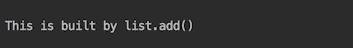

做这件事的更简单的方法是从一个数组开始：

```java
Arrays.asList("This ", "is ", "created ", "by ", 
              "Arrays.asList()").forEach(System.out::print);
```

结果如下：


类似地，在创建`Set`时，我们可以写出以下内容：

```java
Set<String> set = new HashSet<>();
set.add("This ");
set.add("is ");
set.add("built ");
set.add("by ");
set.add("set.add() ");
//Now print the created set:
set.forEach(System.out::print);
```

或者，我们可以写出以下内容：

```java
new HashSet<>(Arrays.asList("This ", "is ", "created ", "by ", 
                            "new HashSet(Arrays.asList()) "))
                            .forEach(System.out::print);
```

下面是最后两个示例结果的说明：

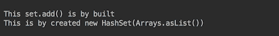

注意，与`List`不同，`Set`中元素的顺序不被保留。它取决于哈希码实现，并且可能因计算机而异。但在同一台计算机上的运行之间顺序保持不变（请注意这个事实，因为我们稍后会回到它）。

相同的结构，即元素顺序，也适用于`Map`。这就是我们在 Java 9 之前创建`Map`的方式：

```java
Map<Integer, String> map = new HashMap<>();
map.put(1, "This ");
map.put(2, "is ");
map.put(3, "built ");
map.put(4, "by ");
map.put(5, "map.put() ");
//Print the results:
map.entrySet().forEach(System.out::print);
```

上述代码的输出如下：

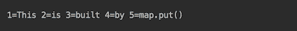

那些经常需要创建集合的人会欣赏 JDK 增强提案 269（JEP 269）——*集合的便利工厂方法*，该提案指出*Java 经常因其冗长而受到批评*，其目标是*在集合接口上提供静态工厂方法，以创建紧凑、不可修改的集合实例*。

作为对批评和建议的回应，Java 9 为三个接口中的每一个引入了十二个`of()`静态工厂方法。以下是`List`的代码：

```java
static <E> List<E> of()  //Returns list with zero elements
static <E> List<E> of(E e1) //Returns list with one element
static <E> List<E> of(E e1, E e2)  //etc
static <E> List<E> of(E e1, E e2, E e3)
static <E> List<E> of(E e1, E e2, E e3, E e4)
static <E> List<E> of(E e1, E e2, E e3, E e4, E e5)
static <E> List<E> of(E e1, E e2, E e3, E e4, E e5, E e6)
static <E> List<E> of(E e1, E e2, E e3, E e4, E e5, E e6, E e7)
static <E> List<E> of(E e1, E e2, E e3, E e4, E e5, 
                                        E e6, E e7, E e8)
static <E> List<E> of(E e1, E e2, E e3, E e4, E e5, 
                                  E e6, E e7, E e8, E e9)
static <E> List<E> of(E e1, E e2, E e3, E e4, E e5, 
                            E e6, E e7, E e8, E e9, E e10)
static <E> List<E> of(E... elements)
```

还为`Set`和`Map`添加了十二个类似的静态方法。十个具有固定元素数量的重载工厂方法被优化以提高性能，并且如 JEP 269 所述，这些方法*避免了由 varargs 调用产生的数组分配、初始化和垃圾回收开销*。

相同示例的代码现在变得更加紧凑：

```java
List.of("This ", "is ", "created ", "by ", "List.of()")
    .forEach(System.out::print);
System.out.println();
Set.of("This ", "is ", "created ", "by ", "Set.of() ")
   .forEach(System.out::print);
System.out.println();
Map.of(1, "This ", 2, "is ", 3, "built ", 4, "by ", 5,"Map.of() ")
   .entrySet().forEach(System.out::print);
```

添加了`System.out.println()`语句以在不同类型的输出之间注入换行符：

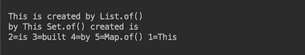

添加到`Map`接口的十二个静态工厂方法中的一个与其他`of()`方法不同：

```java
static <K,V> Map<K,V> ofEntries(Map.Entry<? extends K,
                                ? extends V>... entries)
```

下面是它使用的一个例子：

```java
Map.ofEntries(
  entry(1, "This "),
  entry(2, "is "),
  entry(3, "built "),
  entry(4, "by "),
  entry(5, "Map.ofEntries() ")
).entrySet().forEach(System.out::print);
```

这是它的输出：

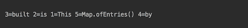

因此，没有为无限数量的元素提供`Map.of()`工厂方法。在创建包含超过 10 个元素的映射时，必须使用`Map.ofEntries()`。

# 如何做到这一点...

你可能已经注意到了`Set.of()`、`Map.of()`和`Map.ofEntries()`方法不保留其元素的顺序。这与 Java 9 之前的`Set`和`Map`实例不同；现在元素的顺序在运行之间会发生变化，即使在同一台计算机上也是如此（但在同一运行期间不会变化，无论集合被迭代多少次）。这是一个旨在帮助程序员避免依赖特定顺序的故意特性，因为当代码在另一台计算机上运行时，顺序可能会发生变化。

新的`List`、`Set`和`Map`接口的`of()`静态方法生成的集合的另一个特性是这些集合是不可变的。这是什么意思？考虑以下代码：

```java
List<String> list = List.of("This ", "is ", "immutable");
list.add("Is it?");
```

这意味着前面的代码在运行时会抛出`java.lang.UnsupportedOperationException`异常，而下面的代码也会抛出相同的异常：

```java
 List<Integer> list = List.of(1,2,3,4,5);
 list.set(2, 9);
```

此外，由新的`of()`静态方法生成的集合不允许包含 null 元素，下面的代码在运行时也会抛出`java.lang.NullPointerException`异常：

```java
List<String> list = List.of("This ", "is ", "not ", "created ", null);
```

# 还有更多...

非空值和不可变性保证在 lambda 和流引入后不久就被添加，这并非偶然。正如你将在后续食谱中看到的，函数式编程和流管道鼓励一种流畅的编码风格（使用方法链，就像我们在本食谱示例中使用`forEach()`方法时做的那样）。这种流畅风格提供了更紧凑和可读的代码，非空保证通过消除检查`null`值的需要来支持它。

不可变特性反过来又很好地与 lambda 表达式在外部上下文中使用的变量的实际最终概念相一致。例如，可变集合允许你绕过这种限制，以下代码：

```java
List<Integer> list = Arrays.asList(1,2,3,4,5);
list.set(2, 0);
list.forEach(System.out::print);

list.forEach(i -> {
  int j = list.get(2);
  list.set(2, j + 1);
});
System.out.println();
list.forEach(System.out::print);
```

此代码生成以下输出：


这意味着有意或无意地在 lambda 表达式中引入状态，并导致同一函数在不同上下文中有不同的输出。这在并行处理中尤其危险，因为无法预测每个可能上下文的状态。这就是为什么集合的不可变性是一个有用的补充，它有助于使代码更加健壮和可靠。

# 参考以下内容

参考本章以下食谱：

+   创建和操作流

+   在流上创建操作管道

# 创建和操作流

在这个食谱中，我们将描述如何创建流以及可以应用于流输出的元素的运算。

# 准备工作

创建流有许多方法。自从 Java 8 以来，`Collection`接口有了`stream()`方法，该方法返回一个顺序流，该集合作为其源，以及`parallelStream()`方法，该方法返回一个可能并行流，该集合作为其源。这意味着包括`Set`和`List`在内的所有子接口也有这些方法。此外，`Arrays`类还增加了八个重载的`stream()`方法，可以从相应的数组或子集创建不同类型的流。

`Stream`接口有`of()`、`generate()`和`iterate()`方法。专门的接口`IntStream`、`DoubleStream`和`LongStream`也有类似的方法，而`IntStream`还有`range()`和`rangeClosed()`方法；两者都返回`IntStream`。

JDK 中有许多产生流的函数，例如`Files.list()`、`Files.lines()`、`Files.find()`、`BufferedReader.lines()`等。

流创建后，可以对其元素应用各种操作。流本身不存储数据。它更像是根据需要从源（并提供或输出给操作）获取它们。由于许多中间操作也可以返回流，因此操作可以形成一个使用流畅式风格的管道。这些操作被称为**中间操作**。中间操作的例子包括`filter()`（仅选择符合标准的元素）、`map()`（根据函数转换元素）、`distinct()`（删除重复项）、`limit()`（将流限制为指定的元素数量）、`sorted()`（将未排序的流转换为排序后的流），以及`Stream`接口返回`Stream`的其他方法（除了我们刚才提到的创建流的方法）。

管道以**终端操作**结束。流元素的加工实际上只有在执行终端操作时才开始。然后，所有中间操作（如果有的话）开始处理，一旦终端操作执行完毕，流就会关闭，并且无法重新打开。终端操作的例子有`forEach()`、`findFirst()`、`reduce()`、`collect()`、`sum()`、`max()`以及`Stream`接口的其他不返回`Stream`的方法。终端操作返回一个结果或产生副作用。

所有的`Stream`方法都支持并行处理，这在处理大量数据的多核计算机上特别有帮助。所有的 Java Stream API 接口和类都在`java.util.stream`包中。

在本食谱中，我们将主要演示由`stream()`方法及其类似方法创建的顺序流。并行流的处理与顺序流没有太大区别。只需注意处理管道不要使用可能在不同处理环境中变化的上下文状态。我们将在本章后面的另一个食谱中讨论并行处理。

# 如何实现...

在本食谱的这一部分，我们将介绍流创建的方法。正如引言中提到的，每个实现了`Set`接口或`List`接口的类都有`stream()`方法和`parallelStream()`方法，这两个方法返回`Stream`接口的实例。目前，我们将只查看由`stream()`方法创建的顺序流，稍后再回到并行流。

1.  考虑以下流创建的示例：

```java
        List.of("This", "is", "created", "by", "List.of().stream()")
            .stream().forEach(System.out::print);
        System.out.println();
        Set.of("This", "is", "created", "by", "Set.of().stream()")
           .stream().forEach(System.out::print);
        System.out.println();
        Map.of(1, "This ", 2, "is ", 3, "built ", 4, "by ", 5,
               "Map.of().entrySet().stream()")
           .entrySet().stream().forEach(System.out::print);
```

我们使用了流畅式风格来使代码更加紧凑，并在输出中插入`System.out.println()`以开始新的一行。

1.  运行前面的示例并查看结果：

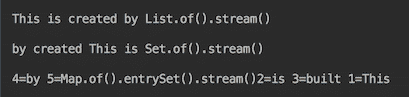

注意，`List`保留了元素的顺序，而`Set`元素的顺序在每次运行时都会改变。这有助于揭示基于某些顺序的缺陷，当这个顺序无法保证时。

1.  查看一下`Arrays`类的 Javadoc。它有八个重载的`stream()`方法：

```java
        static DoubleStream stream(double[] array)
        static DoubleStream stream(double[] array, int startInclusive,
                                   int endExclusive)
        static IntStream stream(int[] array)
        static IntStream stream(int[] array, int startInclusive, 
                                int endExclusive)
        static LongStream stream(long[] array)
        static LongStream stream(long[] array, int startInclusive, 
                                 int endExclusive)
        static <T> Stream<T> stream(T[] array)
        static <T> Stream<T> stream(T[] array, int startInclusive, 
                                    int endExclusive)
```

1.  编写最后两个方法的用法示例：

```java
        String[] array = {"That ", "is ", "an ",
                          "Arrays.stream(array)"};
        Arrays.stream(array).forEach(System.out::print);
        System.out.println();
        String[] array1 = { "That ", "is ", "an ", 
                            "Arrays.stream(array,0,2)" };
        Arrays.stream(array1, 0, 2).forEach(System.out::print);
```

1.  运行它并查看结果：

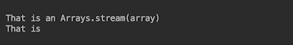

注意，只有前两个元素（索引为`0`和`1`）被选中包含在流中，正如前面的第二个示例所意图的。

1.  现在打开`Stream`接口的 Javadoc，查看工厂方法`of()`、`generate()`和`iterate()`：

```java
        static <T> Stream<T> of(T t) //Returns Stream of one
        static <T> Stream<T> ofNullable(T t)//Returns Stream of one
        // element, if non-null, otherwise returns an empty Stream
        static <T> Stream<T> of(T... values)
        static <T> Stream<T> generate(Supplier<? extends T> s)
        static <T> Stream<T> iterate(T seed, UnaryOperator<T> f)
        static <T> Stream<T> iterate(T seed, 
          Predicate<? super T> hasNext, UnaryOperator<T> next)
```

前两个方法很简单，所以我们跳过它们的演示，从第三个方法`of()`开始。它可以接受一个数组或逗号分隔的元素。

1.  按如下方式编写示例：

```java
        String[] array = { "That ", "is ", "a ", "Stream.of(array)" };
        Stream.of(array).forEach(System.out::print); 
        System.out.println();
        Stream.of( "That ", "is ", "a ", "Stream.of(literals)" )
              .forEach(System.out::print);
```

1.  运行它并观察输出：

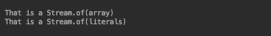

1.  按如下方式编写`generate()`和`iterate()`方法的用法示例：

```java
        Stream.generate(() -> "generated ")
              .limit(3).forEach(System.out::print);
        System.out.println();
        System.out.print("Stream.iterate().limit(10): ");
        Stream.iterate(0, i -> i + 1)
              .limit(10).forEach(System.out::print);
        System.out.println();
        System.out.print("Stream.iterate(Predicate < 10): ");
        Stream.iterate(0, i -> i < 10, i -> i + 1)
              .forEach(System.out::print);
```

我们不得不对前两个示例生成的流的尺寸进行限制。否则，它们将是无限的。第三个示例接受一个谓词，它提供了迭代何时停止的标准。

1.  运行示例并观察结果：

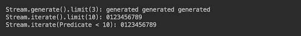

1.  现在为专门的接口`IntStream`、`DoubleStream`和`LongStream`编写示例。它们的实现通过避免装箱和拆箱的开销，在处理原始数据时优化了性能。此外，`IntStream`接口还有两个额外的流生成方法，即`range()`和`rangeClosed()`。两者都返回`IntStream`：

```java
        System.out.print("IntStream.range(0,10): ");
        IntStream.range(0, 9).forEach(System.out::print);
        System.out.println();
        System.out.print("IntStream.rangeClosed(0,10): ");
        IntStream.rangeClosed(0, 9).forEach(System.out::print);
```

1.  运行它们并查看输出：

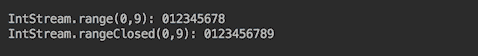

如你所猜，`range()`方法通过增量步长`1`生成整数序列，从左参数开始但不包括右参数。而`rangeClosed()`方法生成一个类似的序列，包括右参数。

1.  现在让我们看看`Files.list(Path dir)`方法的示例，它返回目录中所有条目的`Stream<Path>`：

```java
        System.out.println("Files.list(dir): ");
        Path dir = FileSystems.getDefault()
                  .getPath("src/com/packt/cookbook/ch05_streams/");
        try(Stream<Path> stream = Files.list(dir)) {
          stream.forEach(System.out::println);
        } catch (Exception ex){ ex.printStackTrace(); }
```

以下摘录来自 JDK API：*此方法必须在 try-with-resources 语句或类似控制结构中使用，以确保在流操作完成后立即关闭流的打开目录*。这正是我们所做的；在这种情况下，我们使用了 try-with-resources 语句。或者，我们也可以使用`try...catch...finally`结构，并在 finally 块中关闭流，结果不会改变。

1.  运行示例并观察输出：

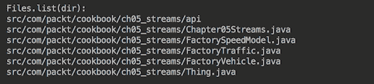

明确关闭流的需求可能会让人困惑，因为`Stream`接口扩展了`AutoCloseable`接口，因此人们会预期流会自动关闭。但实际上并非如此。以下是`Stream`接口的 Javadoc 对这一点的说明：*流有一个`BaseStream.close()`方法，并实现了`AutoCloseable`接口。大多数流实例在使用后实际上不需要关闭，因为它们由集合、数组或生成函数支持，这些不需要特殊资源管理。通常，只有源为 I/O 通道的流，例如由`Files.lines(Path)`返回的流，才需要关闭*。这意味着程序员必须知道流的来源，并确保在 API 要求时关闭它。

1.  请看`Files.lines()`方法的使用示例：

```java
        System.out.println("Files.lines().limit(3): ");
        String file = "src/com/packt/cookbook/ch05_streams
                       /Chapter05Streams.java";
        try(Stream<String> stream = Files.lines(Paths.get(file))
                                                     .limit(3)){ 
          stream.forEach(l -> { 
            if( l.length() > 0 ) System.out.println("   " + l); 
          } );
        } catch (Exception ex){ ex.printStackTrace(); }
```

目的是读取指定文件的头三行，并打印带有三个空格缩进的非空行。

1.  运行它并查看结果：

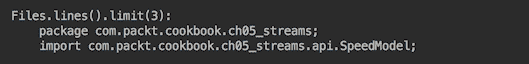

请看`ind()`方法的使用示例：

```java
        static Stream<Path> find(Path start, int maxDepth, 
               BiPredicate<Path, BasicFileAttributes> matcher, 
               FileVisitOption... options)
```

1.  与前一个案例类似，由该方法生成的流也必须显式关闭。`find()`方法遍历以给定起始文件为根的文件树和请求的深度，并返回匹配谓词（包括文件属性）的文件路径。现在请编写以下代码：

```java
        Path dir = FileSystems.getDefault()
                   .getPath("src/com/packt/cookbook/ch05_streams/");
        BiPredicate<Path, BasicFileAttributes> select = 
          (p, b) -> p.getFileName().toString().contains("Factory");
        try(Stream<Path> stream = Files.find(f, 2, select)){
          stream.map(path -> path.getFileName())
                .forEach(System.out::println);
        } catch (Exception ex){ ex.printStackTrace(); }
```

1.  运行它，你会得到以下输出：

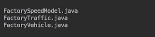

如果需要，可以将`FileVisitorOption.FOLLOW_LINKS`作为`Files.find()`的最后一个参数包含在内，如果我们需要执行会跟随所有遇到的符号链接的搜索。

使用`BufferedReader.lines()`方法（该方法返回从文件中读取的`Stream<String>`行）的要求略有不同。根据 Javadoc，*在终端流操作执行期间，不得对读取器进行操作。否则，终端流操作的结果是未定义的*。

JDK 中还有许多其他方法可以生成流。但它们更专业化，我们不会在这里演示它们，因为空间有限。

# 它是如何工作的...

在前面的示例中，我们已经展示了几个流操作——`Stream`接口的方法。我们最常使用`forEach()`，几次使用了`limit()`。第一个是一个终端操作，第二个是一个中间操作。现在让我们看看`Stream`接口的其他方法。以下是中间操作，返回`Stream`的方法，可以以流畅的方式连接：

```java
Stream<T> peek(Consumer<T> action)

Stream<T> distinct() //Returns stream of distinct elements
Stream<T> skip(long n)    //Discards the first n elements 
Stream<T> limit(long max) //Discards elements after max 
Stream<T> filter(Predicate<T> predicate)
Stream<T> dropWhile(Predicate<T> predicate) 
Stream<T> takeWhile(Predicate<T> predicate)

Stream<R> map(Function<T, R> mapper)
IntStream mapToInt(ToIntFunction<T> mapper)
LongStream mapToLong(ToLongFunction<T> mapper)
DoubleStream mapToDouble(ToDoubleFunction<T> mapper)

Stream<R> flatMap(Function<T, Stream<R>> mapper)
IntStream flatMapToInt(Function<T, IntStream> mapper)
LongStream flatMapToLong(Function<T, LongStream> mapper)
DoubleStream flatMapToDouble(Function<T, DoubleStream> mapper)

static Stream<T> concat(Stream<T> a, Stream<T> b) 

Stream<T> sorted()
Stream<T> sorted(Comparator<T> comparator)
```

前述方法的签名通常包括输入参数的 `"? super T"` 和结果的 `"? extends R"`（参见 Javadoc 的正式定义）。我们通过移除这些符号来简化它们，以便更好地概述方法的多样性和共性。为了补偿，我们希望回顾相关泛型符号的含义，因为它们在 Stream API 中被广泛使用，可能会让您感到困惑。让我们看看 `flatMap()` 方法的正式定义，因为它包含了所有这些符号：

```java
<R> Stream<R> flatMap(Function<? super T,
                      ? extends Stream<? extends R>> mapper)
```

方法前的 `<R>` 接口表示编译器这是一个泛型方法（具有自己的类型参数）。没有它，编译器会寻找类或 `R` 接口的定义。类型 `T` 不在方法前列出，因为它包含在 `Stream<T>` 接口定义中。`? super T` 表示类型 `T` 可以在这里或其超类中使用。`? extends R` 表示类型 `R` 可以在这里或其子类中使用。同样适用于 `? extends Stream...` 。

现在，让我们回到我们的（简化后的）中间操作列表，`Stream` 接口的方法。我们根据相似性将它们分为几个组。第一组只包含一个 `peek()` 方法，允许您将 `Consumer` 函数应用于流中的每个元素，而不会对其产生任何影响，因为 `Consumer` 函数不返回任何内容。它通常用于调试：

```java
int sum = Stream.of( 1,2,3,4,5,6,7,8,9 )
  .filter(i -> i % 2 != 0)
  .peek(i -> System.out.print(i))
  .mapToInt(Integer::intValue)
  .sum();
System.out.println("\nsum = " + sum);
```

结果如下：

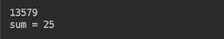

在第二个中间操作组中，前三个是自解释的。`filter()` 方法是最常用的操作之一。它做其名字暗示的事情；它丢弃了匹配传递给方法的 `Predicate` 函数作为标准的元素。我们在上一段代码的示例中看到了它的用法。`dropWhile()` 方法在满足标准的情况下丢弃元素（然后允许流中的其余元素流向下一个操作）。`takeWhile()` 方法做相反的事情；它在满足标准的情况下允许元素流动（然后丢弃其余元素）。以下是一个示例：

```java
System.out.println("Files.lines().dropWhile().takeWhile(): ");
String file = "src/com/packt/cookbook/ch05_streams
               /Chapter05Streams.java";
try(Stream<String> stream = Files.lines(Paths.get(file))){
  stream.dropWhile(l -> !l.contains("dropWhile().takeWhile()"))
        .takeWhile(l -> !l.contains("} catc"+"h"))
        .forEach(System.out::println);
} catch (Exception ex){ ex.printStackTrace(); }

```

这段代码读取存储此代码的文件。它丢弃了所有不包含 `dropWhile().takeWhile()` 子串的第一行，然后允许所有行流动，直到找到 `} catch` 子串。请注意，我们必须将这个字符串拆分为 `"} catch" + "h"`，这样标准就不会对这一行返回 `true`。结果是以下内容：

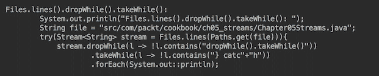

`map()` 操作组也很简单。这种操作通过将传入的函数应用于每个流元素来转换流中的每个元素。我们已经看到了 `mapToInt()` 方法使用的一个例子。以下是 `map()` 操作的另一个例子：

```java
Stream.of( "That ", "is ", "a ", "Stream.of(literals)" )
      .map(s -> s.contains("i")).forEach(System.out::println);
```

在这个例子中，我们将 `String` 字面量转换为 `boolean`。结果如下：

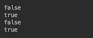

下一个中间操作组，称为 `flatMap()`，提供了更复杂的处理。`flatMap()` 操作将传入的函数（返回一个流）应用于每个元素，以便操作可以生成由每个元素提取的流组成的流。以下是一个例子：

```java
Stream.of( "That ", "is ", "a ", "Stream.of(literals)" )
      .filter(s -> s.contains("Th"))
      .flatMap(s -> Pattern.compile("(?!^)").splitAsStream(s))
      .forEach(System.out::print);
```

从输入流中，前面的代码只选择包含 `Th` 的字面量，并将它们转换成一个字符流，然后通过 `forEach()` 打印出来。结果如下：

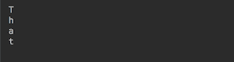

`concat()` 方法从两个输入流创建一个流，使得第一个流的所有元素都跟随第二个流的所有元素。以下是一个例子：

```java
Stream.concat(Stream.of(4,5,6), Stream.of(1,2,3))
      .forEach(System.out::print);
```

结果如下：


如果存在超过两个流连接，你可以写如下：

```java
Stream.of(Stream.of(4,5,6), Stream.of(1,2,3), Stream.of(7,8,9))
      .flatMap(Function.identity())
      .forEach(System.out::print);
```

在这里，`Function.identity()` 是一个返回其输入参数的函数（因为我们不需要转换输入流，只需将它们原样传递给结果流）。结果如下：


最后一个中间操作组由 `sorted()` 方法组成，这些方法按自然顺序（无参数）或指定顺序（根据传入的 `Comparator`）对流元素进行排序。这是一个有状态的操作（以及 `distinct()`、`limit()` 和 `skip()`），在并行处理的情况下会产生非确定性的结果；然而，这将是后续菜谱的主题。

现在让我们看看终端操作（我们也通过移除 `? super T` 和 `? extends R` 简化了它们的签名）：

```java
long count()            //Returns count of elements
Optional<T> max(Comparator<T> comparator) //Max according 
                                          // to Comparator
Optional<T> min(Comparator<T> comparator) //Min according
                                          // to Comparator

Optional<T> findAny() //Returns any or empty Optional
Optional<T> findFirst()  //Returns the first element 
                         // or empty Optional 
boolean allMatch(Predicate<T> predicate) //All elements 
                                        // match Predicate?
boolean anyMatch(Predicate<T> predicate)  //Any element 
                                        // match Predicate?
boolean noneMatch(Predicate<T> predicate) //No element 
                                        // match Predicate?

void forEach(Consumer<T> action) //Apply action to each el 
void forEachOrdered(Consumer<T> action) 

Optional<T> reduce(BinaryOperator<T> accumulator) 
T reduce(T identity, BinaryOperator<T> accumulator) 
U reduce(U identity, BiFunction<U,T,U> accumulator, 
         BinaryOperator<U> combiner) 
R collect(Collector<T,A,R> collector) 
R collect(Supplier<R> supplier, BiConsumer<R,T> accumulator, 
          BiConsumer<R,R> combiner) 
Object[] toArray() 
A[] toArray(IntFunction<A[]> generator)
```

前两组是自解释的，但我们需要说几句关于 `Optional` 的话。Javadoc 这样定义它：*一个可能包含或不包含非空值的容器对象。如果存在值，isPresent() 返回 true，get() 返回该值*。它允许你避免 `NullPointerException` 或检查 `null`（这会破坏代码的一行风格）。出于同样的原因，它有自己的方法：`map()`、`filter()` 和 `flatMap()`。此外，Optional 还包含隐式包含 `isPresent()` 检查的方法：

+   `ifPresent(Consumer<T> action)`: 如果存在值，则执行该操作。

+   `ifPresentOrElse(Consumer<T> action, Runnable emptyAction)`: 如果存在值，则执行给定操作；如果不存在，则执行给定的空操作。

+   `or(Supplier<Optional<T>> supplier)`: 返回一个 `Optional` 类，描述了值（如果存在，或者返回由供应函数产生的 `Optional` 类）。

+   `orElse(T other)`: 如果存在值，则返回该值，或者返回 `other`。

+   `orElseGet(Supplier<T> supplier)`: 如果存在值，则返回该值，或者返回由供应函数产生的结果。

+   `orElseThrow(Supplier<X> exceptionSupplier)`: 如果存在值，则返回该值，或者抛出由异常供应函数产生的异常。

注意，当可能返回 `null` 时，使用 `Optional` 作为返回值。以下是一个使用示例。我们重新实现了使用返回 `Optional` 的 `reduce()` 操作的流连接代码：

```java
Stream.of(Stream.of(4,5,6), Stream.of(1,2,3), Stream.of(7,8,9))
      .reduce(Stream::concat)
      .orElseGet(Stream::empty)
      .forEach(System.out::print);
```

结果与之前的实现相同，使用了 `flatMap()` 方法：


下一个终端操作组被称为 `forEach()`。这些操作确保给定的函数将被应用到流中的每个元素上，但 `forEach()` 并没有说明任何关于顺序的内容，这可能为了更好的性能而改变。相比之下，`forEachOrdered()` 不仅保证了处理流中的所有元素，而且无论流是顺序的还是并行的，都会按照其源指定的顺序执行。以下是一些示例：

```java
Stream.of("3","2","1").parallel().forEach(System.out::print);
System.out.println();
Stream.of("3","2","1").parallel().forEachOrdered(System.out::print);
```

结果如下：


如您所见，在并行处理的情况下，`forEach()` 不保证顺序，而 `forEachOrdered()` 则保证。以下是一个同时使用 `Optional` 和 `forEach()` 的示例：

```java
 Stream.of( "That ", "is ", "a ", null, "Stream.of(literals)" )
       .map(Optional::ofNullable) 
       .filter(Optional::isPresent)
       .map(Optional::get)
       .map(String::toString)
       .forEach(System.out::print);
```

我们不能使用 `Optional.of()`，而是使用了 `Optional.ofNullable()`，因为 `Optional.of()` 在遇到 `null` 时会抛出 `NullPointerException`。在这种情况下，`Optional.ofNullable()` 只会返回一个空的 `Optional`。结果如下：


现在，让我们谈谈下一组终端操作，称为 `reduce()`。这三个重载方法在处理所有流元素后返回一个单一值。最简单的例子是找到流元素的总和（如果它们是数字），或者最大、最小值等。但也可以为任何类型的对象流构建更复杂的结果。

第一种方法，即 `reduce(BinaryOperator<T> accumulator)`，返回 `Optional`，因为计算结果的责任在于提供的累加器函数。而且，JDK 实现的作者不能保证它总是有一些值：

```java
 int sum = Stream.of(1,2,3).reduce((p,e) -> p + e).orElse(0);
 System.out.println("Stream.of(1,2,3).reduce(acc): " +sum);
```

传入的函数提供了相同函数的前一个结果（作为第一个参数 `p`）和流中的下一个元素（作为第二个参数 `e`）。对于第一个元素，`p` 获取其值，而 `e` 是第二个元素。结果如下：


为了避免使用`Optional`的额外步骤，第二个方法在流为空的情况下返回作为第一个参数`identity`的类型`T`（它是`Stream<T>`元素的类型）的值。此参数必须符合以下要求（来自 Javadoc）：*对于所有 t，accumulator.apply(identity, t)等于 t*。在我们的情况下，它必须是`0`，以便符合`0 + e == e`。以下是如何使用第二个方法的例子：

```java
int sum = Stream.of(1,2,3).reduce(0, (p,e) -> p + e);
System.out.println("Stream.of(1,2,3).reduce(0,acc): " +sum);
```

结果与第一个`reduce()`方法相同。第三个方法使用`BiFunction<U,T,U>`函数将类型`T`的值转换为类型`U`的值。然后，结果（类型为`R`）通过与类型`T`相同的逻辑进行处理，就像上一个方法一样。以下是一个例子：

```java
String sum = Stream.of(1,2,3).reduce("", (p,e) -> p + e.toString(),
                                     (x,y) -> x + "," + y);
System.out.println("Stream.of(1,2,3).reduce(,acc,comb): " + sum);

```

人们自然期望看到的结果是`1,2,3`。然而，我们看到的是以下内容：


将流并行化如下：

```java
String sum = Stream.of(1,2,3).parallel()  
                   .reduce("", (p,e) -> p + e.toString(), 
                           (x,y) -> x + "," + y);
System.out.println("Stream.of(1,2,3).reduce(,acc,comb): " + sum);
```

只有这样做，你才会看到预期的结果：


这意味着组合器仅在并行处理时被调用，以便组装（组合）不同流（并行处理）的结果。这是我们迄今为止发现的唯一一个与声明意图提供顺序和并行流相同行为的偏差。但是，有许多方法可以实现相同的结果，而不使用`reduce()`的第三个版本。例如，考虑以下代码：

```java
String sum = Stream.of(1,2,3)
                   .map(i -> i.toString() + ",")
                   .reduce("", (p,e) -> p + e);
System.out.println("Stream.of(1,2,3).map.reduce(,acc): " 
                   + sum.substring(0, sum.length()-1));

```

它产生相同的结果，如下所示：

```java
String sum = Stream.of(1,2,3).parallel()
                   .map(i -> i.toString() + ",")
                   .reduce("", (p,e) -> p + e);
System.out.println("Stream.of(1,2,3).map.reduce(,acc): " 
                   + sum.substring(0, sum.length()-1));

```

这是结果：


下一个中间操作组，称为`collect()`，由两个方法组成。第一个方法接受`Collector`作为参数。它比第二个方法更受欢迎，因为它得到了`Collectors`类的支持，该类提供了`Collector`接口的多种实现。我们鼓励您查阅`Collectors`类的 Javadoc，看看它提供了什么。让我们讨论一些这个方法的例子。首先，我们将创建一个小的`demo`类：

```java
public class Thing {
  private int someInt;
  public Thing(int i) { this.someInt = i; }
  public int getSomeInt() { return someInt; }
  public String getSomeStr() { 
    return Integer.toString(someInt); }
} 
```

我们可以使用它来演示几个收集器：

```java
double aa = Stream.of(1,2,3).map(Thing::new)
                  .collect(Collectors.averagingInt(Thing::getSomeInt));
System.out.println("stream(1,2,3).averagingInt(): " + aa);

String as = Stream.of(1,2,3).map(Thing::new).map(Thing::getSomeStr)
                  .collect(Collectors.joining(","));
System.out.println("stream(1,2,3).joining(,): " + as);

String ss = Stream.of(1,2,3).map(Thing::new).map(Thing::getSomeStr)
                  .collect(Collectors.joining(",", "[", "]"));
System.out.println("stream(1,2,3).joining(,[,]): " + ss);
```

结果将如下所示：

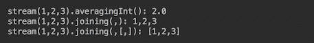

连接收集器是任何编写过检查添加的元素是否是第一个、最后一个或删除最后一个字符（就像我们在`reduce()`操作的最后一个例子中所做的那样）的代码的程序员的一种快乐来源。`joining()`收集器在幕后完成这项工作。程序员只需要传递分隔符、前缀和后缀。

大多数程序员永远不会需要编写自定义收集器。但在需要的情况下，可以使用`Stream`的第二个`collect()`方法（并提供将组合收集器的函数）或使用两个静态方法`Collector.of()`之一来生成可以重用的收集器。

如果你比较 `reduce()` 和 `collect()` 操作，你会注意到 `reduce()` 的主要目的是操作不可变对象和原始数据类型。`reduce()` 的结果是通常（但不限于）与流中的元素类型相同的一个值。相比之下，`collect()` 产生一个不同类型的封装在可变容器中的结果。`collect()` 最受欢迎的使用集中在使用相应的 `Collectors.toList()`、`Collectors.toSet()` 或 `Collectors.toMap()` 收集器来生成 `List`、`Set` 或 `Map`。 

最后一个终端操作组包括两个 `toArray()` 方法。其中一个返回 `Object[]`，另一个返回指定类型的数组。让我们看看它们使用的例子：

```java
 Object[] os = Stream.of(1,2,3).toArray();
 Arrays.stream(os).forEach(System.out::print);
 System.out.println();
 String[] sts = Stream.of(1,2,3).map(i -> i.toString())
                      .toArray(String[]::new);
 Arrays.stream(sts).forEach(System.out::print);
```

这些例子的输出如下：


第一个例子相当直接。不过，值得注意的是，我们不能写出以下内容：

```java
Stream.of(1,2,3).toArray().forEach(System.out::print);
```

这是因为 `toArray()` 是一个终端操作，在它之后流会自动关闭。这就是为什么我们不得不在第二行打开一个新的流。

第二个例子——使用重载的 `A[] toArray(IntFunction<A[]> generator)` 方法——更为复杂。Javadoc 中说：“生成器函数接收一个整数，它是所需数组的尺寸，并生成所需尺寸的数组。”这意味着在最后一个例子中，`toArray(String[]::new)` 构造函数的方法引用是 `toArray(size -> new String[size])` 的简短版本。

# 还有更多...

`java.util.stream` 包还提供了专门接口，即 `IntStream`、`DoubleStream` 和 `LongStream`，它们针对处理相应原始类型值的流进行了优化。在执行减少操作时使用它们非常方便。例如，它们有 `max()`、`min()`、`average()`、`sum()` 以及许多其他可以直接作为中间和终端操作调用的简化（针对性能调优）方法。

# 参见

参考本章中的以下食谱：

+   在流上创建操作管道

+   在流上执行并行计算

# 在流上创建操作管道

在这个食谱中，你将学习如何从 `Stream` 操作构建管道。

# 准备中

在上一章中，当我们创建一个适合 lambda 表达式的 API 时，我们得到了以下 API 方法：

```java
public interface Traffic {
  void speedAfterStart(double timeSec, 
    int trafficUnitsNumber, SpeedModel speedModel, 
    BiPredicate<TrafficUnit, Double> limitTraffic,     
    BiConsumer<TrafficUnit, Double> printResult);
 }
```

在 `speedAfterStart()` 方法内部生成了指定的 `TrafficUnit` 实例。它们被 `limitTrafficAndSpeed` 函数限制，并按照 `speedAfterStart()` 方法内部的 `speedModel` 函数进行处理。结果在设备上以及由 `printResults` 函数指定的格式中显示。

这是一个非常灵活的设计，允许你通过修改传递给 API 的函数进行相当广泛的实验。然而，在现实中，尤其是在数据分析的早期阶段，拥有一个 API 会带来开销。如果提供的灵活性不足，就需要对其进行更改，构建和部署新版本。这需要时间，而且实现缺乏透明度。

公平地说，封装实现细节是 API 设计要求之一。但是，它与需要封装为产品供用户群体使用的过程相结合时效果良好。在研究阶段，情况发生了根本性的变化。当开发并测试新的算法，以及需要处理大量数据时，其自身带来的挑战，使得整个开发系统的透明度成为一项基本要求。没有它，今天在大数据分析领域中的许多成功将是不可能的。

流和流操作管道解决了透明度问题，并最小化了编写基础设施代码的开销。

# 如何做到这一点...

让我们回顾一下用户是如何调用 lambda 友好的 API 的：

```java
double timeSec = 10.0;
int trafficUnitsNumber = 10;

SpeedModel speedModel = (t, wp, hp) -> ...;
BiConsumer<TrafficUnit, Double> printResults = (tu, sp) -> ...;
BiPredicate<TrafficUnit, Double> limitSpeed = (tu, sp) -> ...;

Traffic api = new TrafficImpl(Month.APRIL, DayOfWeek.FRIDAY, 17, 
                              "USA", "Denver", "Main103S");
api.speedAfterStart(timeSec, trafficUnitsNumber, speedModel, 
                    limitSpeed, printResults);
```

正如我们已经注意到的，使用这样的 API（不改变它）对速度计算操作的自由度扩展到了速度计算的公式、输出设备和格式，以及交通的选择。在我们的简单应用中，这并不坏，但在更复杂的计算情况下，它可能无法涵盖模型演变的所有可能性。但这是一个良好的开端，使我们能够构建流和操作管道，以实现更高的透明度和实验灵活性。

现在让我们看看 API 实现：

```java
double timeSec = 10.0;
int trafficUnitsNumber = 10;

SpeedModel speedModel = (t, wp, hp) -> ...;
BiConsumer<TrafficUnit, Double> printResults = (tu, sp) -> ...;
BiPredicate<TrafficUnit, Double> limitSpeed = (tu, sp) -> ...;
List<TrafficUnit> trafficUnits = FactoryTraffic
     .generateTraffic(trafficUnitsNumber, Month.APRIL, 
                      DayOfWeek.FRIDAY, 17, "USA", "Denver",
                      "Main103S");
for(TrafficUnit tu: trafficUnits){
  Vehicle vehicle = FactoryVehicle.build(tu);
  vehicle.setSpeedModel(speedModel);
  double speed = vehicle.getSpeedMph(timeSec);
  speed = Math.round(speed * tu.getTraction());
    if(limitSpeed.test(tu, speed)){
      printResults.accept(tu, speed);
    }
  }
```

接下来，我们将`for`循环转换为交通单位流，并将相同的函数直接应用于流的元素。但首先，我们可以要求交通生成系统提供`Stream`而不是数据`List`。这允许你避免在内存中存储所有数据：

```java
Stream<TrafficUnit> stream = FactoryTraffic
       .getTrafficUnitStream(trafficUnitsNumber, Month.APRIL,
                             DayOfWeek.FRIDAY, 17, "USA", "Denver",
                             "Main103S");
```

这允许你在不存储超过一个单位的同时处理无限数量的交通单位。在演示代码中，我们仍然创建`List`，因此流不会节省我们内存。但有一些真实系统，例如传感器，可以在不首先将所有数据存储在内存中的情况下提供流。

我们还将创建一个便利的方法：

```java
Stream<TrafficUnit>getTrafficUnitStream(int trafficUnitsNumber){
  return FactoryTraffic
         .getTrafficUnitStream(trafficUnitsNumber,Month.APRIL, 
                               DayOfWeek.FRIDAY, 17, "USA", "Denver",
                               "Main103S");
}
```

因此，我们现在将写下以下内容：

```java
getTrafficUnitStream(trafficUnitsNumber).map(tu -> {
  Vehicle vehicle = FactoryVehicle.build(tu);
  vehicle.setSpeedModel(speedModel);
  return vehicle;
})
.map(v -> {
  double speed = v.getSpeedMph(timeSec);
  return Math.round(speed * tu.getTraction());
})
.filter(s -> limitSpeed.test(tu, s))
.forEach(tuw -> printResults.accept(tu, s));
```

我们将`TrafficUnit`映射（转换）为`Vehicle`，然后将`Vehicle`映射到`speed`，接着使用当前的`TrafficUnit`实例计算`speed`以限制交通并打印结果。如果你在现代编辑器中看到这段代码，你会注意到它无法编译，因为第一次映射之后，当前的`TrafficUnit`元素就不再可访问了；它被`Vehicle`所取代。这意味着我们需要携带原始元素并在过程中添加新值。为了实现这一点，我们需要一个容器——一种交通单元包装器。让我们创建一个：

```java
private static class TrafficUnitWrapper {
  private double speed;
  private Vehicle vehicle;
  private TrafficUnit trafficUnit;
  public TrafficUnitWrapper(TrafficUnit trafficUnit){
    this.trafficUnit = trafficUnit;
  }
  public TrafficUnit getTrafficUnit(){ return this.trafficUnit; }
  public Vehicle getVehicle() { return vehicle; }
  public void setVehicle(Vehicle vehicle) { 
    this.vehicle = vehicle; 
  }
  public double getSpeed() { return speed; }
  public void setSpeed(double speed) { this.speed = speed; }
}
```

现在我们可以构建一个有效的管道：

```java
getTrafficUnitStream(trafficUnitsNumber)
   .map(TrafficUnitWrapper::new)
   .map(tuw -> {
  Vehicle vehicle = FactoryVehicle.build(tuw.getTrafficUnit());
  vehicle.setSpeedModel(speedModel);
  tuw.setVehicle(vehicle);
  return tuw;
})
.map(tuw -> {
  double speed = tuw.getVehicle().getSpeedMph(timeSec);
  speed = Math.round(speed * tuw.getTrafficUnit()
                                .getTraction());
  tuw.setSpeed(speed);
  return tuw;
})
.filter(tuw -> limitSpeed.test(tuw.getTrafficUnit(), 
                               tuw.getSpeed()))
.forEach(tuw -> printResults.accept(tuw.getTrafficUnit(), 
                                    tuw.getSpeed()));
```

代码看起来有点冗长，特别是`Vehicle`和`SpeedModel`设置。我们可以通过将它们移动到`TrafficUnitWrapper`类来隐藏这些管道细节：

```java
private static class TrafficUnitWrapper {
  private double speed;
  private Vehicle vehicle;
  private TrafficUnit trafficUnit;
  public TrafficUnitWrapper(TrafficUnit trafficUnit){
    this.trafficUnit = trafficUnit;
    this.vehicle = FactoryVehicle.build(trafficUnit);
  }
  public TrafficUnitWrapper setSpeedModel(SpeedModel speedModel) {
    this.vehicle.setSpeedModel(speedModel);
    return this;
  }
  pubic TrafficUnit getTrafficUnit(){ return this.trafficUnit; }
  public Vehicle getVehicle() { return vehicle; }
  public double getSpeed() { return speed; }
  public TrafficUnitWrapper setSpeed(double speed) { 
    this.speed = speed;
    return this; 
  }
}
```

注意我们是如何从`setSpeedModel()`和`setSpeed()`方法返回`this`的。这允许我们保持流畅的风格。现在管道看起来更加清晰：

```java
getTrafficUnitStream(trafficUnitsNumber)
   .map(TrafficUnitWrapper::new)
   .map(tuw -> tuw.setSpeedModel(speedModel))
   .map(tuw -> {
  double speed = tuw.getVehicle().getSpeedMph(timeSec);
  speed = Math.round(speed * tuw.getTrafficUnit()
                                .getTraction());
  return tuw.setSpeed(speed);
})
.filter(tuw -> limitSpeed.test(tuw.getTrafficUnit(), 
                               tuw.getSpeed()))
 .forEach(tuw -> printResults.accept(tuw.getTrafficUnit(), 
                                     tuw.getSpeed()));
```

如果没有必要让速度计算的公式易于修改，我们可以通过将`setSpeed()`方法更改为`calcSpeed()`将这个公式也移动到`TrafficUnitWrapper`类中：

```java
public TrafficUnitWrapper calcSpeed(double timeSec) {
  double speed = this.vehicle.getSpeedMph(timeSec);
  this.speed = Math.round(speed * this.trafficUnit
                                      .getTraction());
  return this;
}
```

因此，管道变得更加简洁：

```java
getTrafficUnitStream(trafficUnitsNumber)
   .map(TrafficUnitWrapper::new)
   .map(tuw -> tuw.setSpeedModel(speedModel))
   .map(tuw -> tuw.calcSpeed(timeSec))
   .filter(tuw -> limitSpeed.test(tuw.getTrafficUnit(), 
                                  tuw.getSpeed()))
   .forEach(tuw -> printResults.accept(tuw.getTrafficUnit(), 
                                       tuw.getSpeed()));
```

基于这项技术，我们现在可以创建一个计算交通密度的方法——对于每条车道给定的速度限制，计算多车道道路上每条车道中的车辆数量：

```java
Integer[] trafficByLane(Stream<TrafficUnit> stream, 
                 int trafficUnitsNumber, double timeSec, 
                 SpeedModel speedModel, double[] speedLimitByLane) {
  int lanesCount = speedLimitByLane.length;
  Map<Integer, Integer> trafficByLane = stream
               .limit(trafficUnitsNumber)
               .map(TrafficUnitWrapper::new)
               .map(tuw -> tuw.setSpeedModel(speedModel))
               .map(tuw -> tuw.calcSpeed(timeSec))
               .map(speed -> countByLane(lanesCount, 
                                  speedLimitByLane, speed))
               .collect(Collectors
                   .groupingBy(CountByLane::getLane, Collectors
                   .summingInt(CountByLane::getCount)));
  for(int i = 1; i <= lanesCount; i++){
    trafficByLane.putIfAbsent(i, 0);
  }
  return trafficByLane.values().toArray(new Integer[lanesCount]);
}
```

它使用了两个私有类，如下所示：

```java
private class CountByLane {
  int count, lane;
  private CountByLane(int count, int lane){
    this.count = count;
    this.lane = lane;
  }
  public int getLane() { return lane; }
  public int getCount() { return count; }
}
```

它还使用了以下内容：

```java
private static class TrafficUnitWrapper {
  private Vehicle vehicle;
  private TrafficUnit trafficUnit;
  public TrafficUnitWrapper(TrafficUnit trafficUnit){
    this.vehicle = FactoryVehicle.build(trafficUnit);
    this.trafficUnit = trafficUnit;
  }
  public TrafficUnitWrapper setSpeedModel(SpeedModel speedModel) {
    this.vehicle.setSpeedModel(speedModel);
    return this;
  }
  public double calcSpeed(double timeSec) {
    double speed = this.vehicle.getSpeedMph(timeSec);
    return Math.round(speed * this.trafficUnit.getTraction());
  }
}
```

它也使用了私有方法：

```java
private CountByLane countByLane(int lanesNumber, double[] speedLimit, 
                                double speed){
  for(int i = 1; i <= lanesNumber; i++){
    if(speed <= speedLimit[i - 1]){ 
      return new CountByLane(1, i);
    }
  }
  return new CountByLane(1, lanesNumber);
}
```

在第十五章 *测试* 中，我们将更详细地讨论这个方法（`TrafficDensity`类的这个方法），并重新审视这个实现，以便你可以进行更好的单元测试。

这就是为什么在代码开发的同时编写单元测试可以带来更高的生产力，因为它消除了之后修改代码的需求。这也导致了更可测试（质量更好）的代码。

# 更多内容...

管道允许你轻松地添加另一个过滤器（或任何其他操作）：

```java
Predicate<TrafficUnit> limitTraffic = tu ->
    tu.getVehicleType() == Vehicle.VehicleType.CAR
    || tu.getVehicleType() == Vehicle.VehicleType.TRUCK;

getTrafficUnitStream(trafficUnitsNumber)
   .filter(limitTraffic)
   .map(TrafficUnitWrapper::new)
   .map(tuw -> tuw.setSpeedModel(speedModel))
   .map(tuw -> tuw.calcSpeed(timeSec))
   .filter(tuw -> limitSpeed.test(tuw.getTrafficUnit(), 
                                  tuw.getSpeed()))
   .forEach(tuw -> printResults.accept(tuw.getTrafficUnit(), 
                                       tuw.getSpeed()));
```

当需要处理多种类型的数据时，这一点尤为重要。值得一提的是，在计算之前有一个过滤器是提高性能的最佳方式，因为它允许你避免不必要的计算。

使用流的另一个主要优点是，可以在不额外编码的情况下使过程并行化。所有你需要做的就是将管道的第一行更改为`getTrafficUnitStream(trafficUnitsNumber).parallel()`（假设源不生成并行流，可以通过`.isParallel()`操作识别）。我们将在下一章中更详细地讨论这一点。

# 参见

参考本章中的以下配方：

+   流的并行计算

# 流的并行计算

在之前的菜谱中，我们已经演示了一些并行流处理技术。在这个菜谱中，我们将更详细地讨论这个问题，并分享最佳实践和可能的问题以及如何避免它们。

# 准备工作

很容易就设置所有流为并行，并且不再考虑它。不幸的是，并行性并不总是提供优势。事实上，它因为工作线程的协调而产生了开销。此外，一些流源本质上是顺序的，一些操作可能共享相同的（同步）资源。更糟糕的是，使用有状态的操作可能导致不可预测的结果。并不是说不能为并行流使用有状态的操作；它需要仔细规划和清楚理解状态管理。

# 如何做到这一点...

如前一道菜谱中所述，可以通过集合的 `parallelStream()` 方法或应用于流的 `parallel()` 方法创建并行流。相反，可以通过调用流的 `sequential()` 方法将现有的并行流转换为顺序流。

作为第一条最佳实践，默认使用顺序流，并且只有在必须且能够这样做的情况下才考虑并行流。通常，当性能不足且需要处理大量数据时，这种情况才会出现。可能性受到流源和操作性质的限制。其中一些既不能并行处理，也可能产生非确定性的结果。例如，从文件中读取是顺序的，基于文件的流在并行时并不表现更好。任何阻塞操作也会否定并行带来的性能提升。

顺序流和并行流不同的领域之一是排序。以下是一个例子：

```java
List.of("This ", "is ", "created ", "by ", 
        "List.of().stream()").stream()
        .forEach(System.out::print);
System.out.println();
List.of("This ", "is ", "created ", "by ", 
        "List.of().parallelStream()")
    .parallelStream()
    .forEach(System.out::print);
```

结果如下：

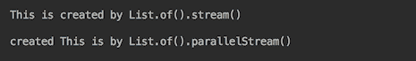

如您所见，`List` 保留了元素的顺序，但在并行流的情况下并不保持它。

在 *创建和操作流* 的菜谱中，我们展示了使用 `reduce()` 和 `collect()` 操作时，组合器只为并行流调用。因此，对于顺序流来说，它不是必需的，但在操作并行流时必须存在。如果没有它，多个工作者的结果将无法正确汇总。

我们还演示了 `sorted()`、`distinct()`、`limit()` 和 `skip()` 等有状态操作在并行处理的情况下产生非确定性的结果。如果顺序很重要，您可以通过流方法来依赖。

如果顺序很重要，我们已经展示了您可以通过依赖 `forEachOrdered()` 流方法来确保处理流的所有元素，并且按照其源指定的顺序进行处理，无论流是顺序的还是并行的。

无论并行流是由集合的 `parallelStream()` 方法创建，还是由应用于流的 `parallel()` 方法创建，其底层实现都使用了在 Java 7 中引入的相同 `ForkJoin` 框架。流被分解成段，然后分配给不同的工作线程进行处理。在只有一个处理器的计算机上，它没有优势，但在多核计算机上，工作线程可以由不同的处理器执行。更重要的是，如果一个工作线程空闲，它可以 *窃取* 来自忙碌工作线程的一部分工作。然后从所有工作线程收集结果，并聚合以完成终端操作（即，当收集操作的合并器变得忙碌时）。

一般而言，如果一个资源不适合并发访问，那么在并行流处理期间使用它是不安全的。考虑以下两个例子（`ArrayList` 并非线程安全）：

```java
List<String> wordsWithI = new ArrayList<>();
Stream.of("That ", "is ", "a ", "Stream.of(literals)")
      .parallel()
      .filter(w -> w.contains("i"))
      .forEach(wordsWithI::add);
System.out.println(wordsWithI);
System.out.println();

wordsWithI = Stream.of("That ", "is ", "a ", "Stream.of(literals)" )
                   .parallel()
                   .filter(w -> w.contains("i"))
                   .collect(Collectors.toList());
System.out.println(wordsWithI);
```

如果多次运行此代码，可能会产生以下结果：

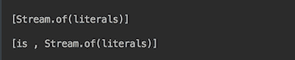

`Collectors.toList()` 方法始终生成由 `is` 和 `Stream.of(literals)` 组成的相同列表，而 `forEach()` 有时会错过 `is` 或 `Stream.of(literals)`。

如果可能，首先尝试使用由 `Collectors` 类构建的收集器，并在并行计算期间避免使用共享资源。

总体来说，使用无状态函数是并行流管道的最佳选择。如果有疑问，测试你的代码，最重要的是，多次运行相同的测试以检查结果是否稳定。

# 参见

参考第七章 Concurrent and Multithreaded Programming，了解更多关于 `java.util.stream` 包中类使用示例。
