# 数据库编程

本章涵盖了 Java 应用程序和数据库（**DB**）之间基本和常用的交互，从连接到数据库和执行 CRUD 操作，到创建事务、存储过程和与 **大型对象** （**LOBs**） 一起工作。我们将涵盖以下食谱：

+   使用 JDBC 连接到数据库

+   设置用于数据库交互所需的表格

+   执行 CRUD 操作

+   使用预处理语句

+   使用事务

+   处理大型对象

+   执行存储过程

# 简介

很难想象一个复杂的软件应用程序不会使用某种类型的数据存储。一种结构化和可访问的数据存储称为数据库。这就是为什么任何现代语言实现都包括一个框架，允许你访问数据库并在其中 **创建、读取、更新和删除** （**CRUD**） 数据。在 Java 中，提供这种访问的是 **Java 数据库连接** （**JDBC**） API，它根据 Javadoc 的描述，可以访问 *几乎所有数据源，从关系数据库到电子表格和平面文件*。

组成 JDBC API 的 `java.sql` 和 `javax.sql` 包包含在 **Java 平台标准版** （**Java SE**） 中。`java.sql` 包提供了 *访问和处理存储在数据源中（通常是关系数据库）的数据的 API。* `javax.sql` 包提供了服务器端数据源访问和处理的 API。具体来说，它提供了 `DataSource` 接口以建立与数据库的连接、连接和语句池、分布式事务和行集。我们将在本章的食谱中更详细地讨论这些功能。

然而，要实际将 `DataSource` 连接到物理数据库，还需要一个数据库特定的驱动程序（由数据库供应商提供，例如 MySQL、Oracle、PostgreSQL 或 SQL 服务器数据库等）。这些驱动程序可能用 Java 编写，也可能是 Java 和 **Java Native Interface** (**JNI**) 本地方法的混合。此驱动程序实现了 JDBC API。

与数据库一起工作涉及八个步骤：

1.  按照供应商的说明安装数据库。

1.  将数据库特定驱动程序的 `.jar` 依赖添加到应用程序中。

1.  创建用户、数据库和数据库模式：表、视图、存储过程等。

1.  从应用程序连接到数据库。

1.  构建一个 SQL 语句。

1.  执行 SQL 语句。

1.  使用执行结果。

1.  关闭数据库连接和其他资源。

步骤 1-3 在应用程序运行之前，在数据库设置阶段只执行一次。

步骤 4-8 根据需要由应用程序重复执行。

步骤 5-7 可以使用相同的数据库连接重复多次。

# 使用 JDBC 连接到数据库

在本食谱中，你将学习如何连接到数据库。

# 如何做到这一点...

1.  选择你想要工作的数据库。有好的商业数据库和好的开源数据库。我们唯一要假设的是你选择的数据库支持 **结构化查询语言**（**SQL**），这是一种标准化的语言，允许你在数据库上执行 CRUD 操作。在我们的食谱中，我们将使用标准 SQL 并避免特定于特定数据库类型的构造和过程。

1.  如果数据库尚未安装，请按照供应商的说明进行安装。然后，下载数据库驱动程序。最流行的是类型 4 和 5，用 Java 编写。它们非常高效，并通过套接字连接与数据库服务器通信。如果包含此类驱动程序的 `.jar` 文件放置在类路径上，它将自动加载。类型 4 和 5 驱动程序是数据库特定的，因为它们使用数据库本机协议来访问数据库。我们将假设你正在使用此类类型的驱动程序。

如果你的应用程序需要访问多种类型的数据库，那么你需要一个类型 3 的驱动程序。这样的驱动程序可以通过一个中间件应用程序服务器与不同的数据库进行通信。

类型 1 和 2 的驱动程序仅在没有其他数据库驱动程序类型可用时使用。

1.  将下载的 `.jar` 文件（包含驱动程序）添加到你的应用程序的类路径中。现在你可以创建一个数据库，并通过你的应用程序访问它。

1.  你的数据库可能有一个控制台、一个图形用户界面（GUI）或某种其他与它交互的方式。阅读说明，首先创建一个用户，即 `cook`，然后创建一个数据库，即 `cookbook`。

例如，以下是为 PostgreSQL 执行此操作的命令：

```java
        CREATE USER cook SUPERUSER;
        CREATE DATABASE cookbook OWNER cook;
```

我们为我们的用户选择了 `SUPERUSER` 角色；然而，一个良好的安全实践是将如此强大的角色分配给管理员，并创建另一个特定于应用程序的用户，该用户可以管理数据但不能更改数据库结构。创建另一个名为模式（schema）的逻辑层是一个好习惯，它可以有自己的用户和权限集合。这样，同一个数据库中的多个模式可以隔离，每个用户（其中之一是你的应用程序）将只能访问特定的模式。

1.  此外，在企业级应用中，常见的做法是为数据库模式创建同义词，这样没有任何应用程序可以直接访问原始结构。你也可以为每个用户创建密码，但，再次强调，对于本书的目的，这并不是必需的。因此，我们将这项工作留给数据库管理员，由他们根据每个企业的特定工作条件建立规则和指南。

现在我们将我们的应用程序连接到数据库。在我们的演示中，我们将使用，正如你可能已经猜到的，开源（免费）的 PostgreSQL 数据库。

# 它是如何工作的...

这里是创建到我们本地 PostgreSQL 数据库连接的代码片段：

```java
String URL = "jdbc:postgresql://localhost/cookbook";
Properties prop = new Properties( );
//prop.put( "user", "cook" );
//prop.put( "password", "secretPass123" );
Connection conn = DriverManager.getConnection(URL, prop);
```

注释行显示了如何为您的连接设置用户名和密码。由于在这个演示中，我们保持数据库开放并允许任何人访问，我们可以使用重载的 `DriverManager.getConnection(String url)` 方法。然而，我们将展示最通用的实现，这将允许任何人从属性文件中读取，并将其他有用的值（如 `ssl` 为真/假，`autoReconnect` 为真/假，`connectTimeout` 以秒为单位等）传递给创建连接的方法。传递的属性键对于所有主要数据库类型都是相同的，但其中一些是数据库特定的。

作为替代，如果我们只想传递用户名和密码，我们可以使用第三个重载版本，即 `DriverManager.getConnection(String url, String user, String password)`。值得一提的是，保持密码加密是一个好的实践。我们不会展示如何做这件事，但网上有很多指南。

此外，`getConnection()` 方法会抛出 `SQLException`，因此我们需要将其包裹在 `try...catch` 块中。

为了隐藏所有这些和其他管道，将连接建立代码放在一个方法中是一个好主意：

```java
private static Connection getDbConnection(){
  String url = "jdbc:postgresql://localhost/cookbook";
  try {
    return DriverManager.getConnection(url);
  }
  catch(Exception ex) {
    ex.printStackTrace();
    return null;
  }
}
```

连接到数据库的另一种方式是使用 `DataSource` 接口。其实现通常包含在包含数据库驱动的同一 `.jar` 文件中。在 PostgreSQL 的例子中，有两个类实现了 `DataSource` 接口：`org.postgresql.ds.PGSimpleDataSource` 和 `org.postgresql.ds.PGPoolingDataSource`。我们可以使用它们来代替 `DriverManager`。以下是 `PGSimpleDataSource` 的使用示例：

```java
private static Connection getDbConnection(){
  PGSimpleDataSource source = new PGSimpleDataSource();
  source.setServerName("localhost");
  source.setDatabaseName("cookbook");
  source.setLoginTimeout(10);
  try {
    return source.getConnection();
  }
  catch(Exception ex) {
    ex.printStackTrace();
    return null;
  }
}

```

以下是一个 `PGPoolingDataSource` 的使用示例：

```java
private static Connection getDbConnection(){
  PGPoolingDataSource source = new PGPoolingDataSource();
  source.setServerName("localhost");
  source.setDatabaseName("cookbook");
  source.setInitialConnections(3);
  source.setMaxConnections(10);
  source.setLoginTimeout(10);
  try {
    return source.getConnection();
  }
  catch(Exception ex) {
    ex.printStackTrace();
    return null;
  }
}
```

`getDbConnection()` 方法的最后一个版本通常是首选的连接方式，因为它允许你使用连接池和一些其他功能，而不仅仅是通过 `DriverManager` 连接时可用的一些功能。

无论你选择哪种版本的 `getDbConnection()` 实现，你都需要以相同的方式在所有代码示例中使用它。

# 还有更多...

良好的实践是在创建连接后立即考虑关闭它。这样做的方法是使用 `try-with-resources` 构造，它确保在 `try...catch` 块结束时关闭资源：

```java
try (Connection conn = getDbConnection()) {
  // code that uses the connection to access the DB
} 
catch(Exception ex) { 
  ex.printStackTrace();
}
```

这种结构可以与实现 `java.lang.AutoCloseable` 或 `java.io.Closeable` 接口的任何对象一起使用。

# 参见

参考本章中的以下配方：

+   设置用于数据库交互所需的表

# 设置用于数据库交互所需的表

在这个配方中，你将学习如何创建、更改和删除表以及其他构成数据库模式的逻辑数据库结构。

# 准备工作

标准的 SQL 表创建语句看起来是这样的：

```java
CREATE TABLE table_name (
  column1_name data_type(size),
  column2_name data_type(size),
  column3_name data_type(size),
  ....
);
```

在这里，`table_name` 和 `column_name` 必须是字母数字且唯一的（在模式内）标识符。名称和数据类型的限制是数据库特定的。例如，Oracle 允许表名有 128 个字符，而在 PostgreSQL 中，表名和列名的最大长度是 63 个字符。数据类型也有差异，所以请阅读数据库文档。

# 它是如何工作的...

这里是一个在 PostgreSQL 中创建 `traffic_unit` 表的命令示例：

```java
CREATE TABLE traffic_unit (
  id SERIAL PRIMARY KEY,
  vehicle_type VARCHAR NOT NULL,
  horse_power integer NOT NULL,
  weight_pounds integer NOT NULL,
  payload_pounds integer NOT NULL,
  passengers_count integer NOT NULL,
  speed_limit_mph double precision NOT NULL,
  traction double precision NOT NULL,
  road_condition VARCHAR NOT NULL,
  tire_condition VARCHAR NOT NULL,
  temperature integer NOT NULL
);
```

在这里，我们没有设置 `VARCHAR` 类型列的大小，因此允许这些列存储任何长度的值。在这种情况下，`integer` 类型允许你存储从 -2147483648 到 +2147483647 的数字。添加了 `NOT NULL` 类型，因为默认情况下，列将是可空的，我们想确保每个记录都会填充所有列。

我们还确定了 `id` 列作为 `PRIMARY KEY`，这表示该列（或列的组合）唯一地标识了记录。例如，如果有一个包含所有国家所有人的信息的表，唯一的组合可能就是他们的全名、地址和出生日期。嗯，可以想象在某些家庭中，双胞胎可能出生并拥有相同的名字，所以我们说是“可能”。如果这种情况发生的可能性很高，我们就需要向主键组合中添加另一个列，即出生顺序，默认值为 1。下面是如何在 PostgreSQL 中实现这一点的示例：

```java
CREATE TABLE person (
  name VARCHAR NOT NULL,
  address VARCHAR NOT NULL,
  dob date NOT NULL,
  order integer DEFAULT 1 NOT NULL,
  PRIMARY KEY (name,address,dob,order)
);
```

在 `traffic_unit` 表的情况下，没有列的组合可以作为主键。许多汽车具有相同的值。但我们需要引用一个 `traffic_unit` 记录，以便知道哪些单位已被选择和处理，哪些没有被处理，例如。这就是为什么我们添加了一个 `id` 列，并用一个唯一的生成数字填充它，我们希望数据库自动生成这个主键。

如果你查看生成的表描述（`\d traffic_unit`），你会看到分配给 `id` 列的 `nextval('traffic_unit_id_seq'::regclass)` 函数。这个函数按顺序生成数字，从 1 开始。如果你需要不同的行为，可以手动创建序列号生成器。下面是如何做到这一点的示例：

```java
CREATE SEQUENCE traffic_unit_id_seq 
START WITH 1000 INCREMENT BY 1 
NO MINVALUE NO MAXVALUE CACHE 10; 
ALTER TABLE ONLY traffic_unit ALTER COLUMN id SET DEFAULT nextval('traffic_unit_id_seq'::regclass);
```

这个序列从 1,000 开始，缓存 10 个数字，以便在需要快速连续生成数字时提高性能。

根据前几章中共享的代码示例，`vehicle_type`、`road_condition` 和 `tire_condition` 的值受代码中 `enum` 类型的限制。这就是为什么当填充 `traffic_unit` 表时，我们希望确保只有代码中 `enum` 类型中存在的值被设置在列中。为了完成这个任务，我们将创建一个名为 `enums` 的查找表，并用我们的 `enum` 类型的值填充它：

```java
CREATE TABLE enums (
  id integer PRIMARY KEY,
  type VARCHAR NOT NULL,
  value VARCHAR NOT NULL
);

insert into enums (id, type, value) values 
(1, 'vehicle', 'car'),
(2, 'vehicle', 'truck'),
(3, 'vehicle', 'crewcab'),
(4, 'road_condition', 'dry'),
(5, 'road_condition', 'wet'),
(6, 'road_condition', 'snow'),
(7, 'tire_condition', 'new'),
(8, 'tire_condition', 'worn');
```

PostgreSQL 有一个 `enum` 数据类型，但如果可能值列表不是固定的并且需要随时间更改，则会造成开销。我们认为我们应用程序中的值列表很可能扩展。因此，我们决定不使用数据库 `enum` 类型，而是自己创建查找表。

现在，我们可以使用它们的 ID 作为外键从 `traffic_unit` 表中引用 `enums` 表的值。首先，我们删除该表：

```java
drop table traffic_unit;
```

然后我们使用稍微不同的 SQL 命令来重新创建它：

```java
CREATE TABLE traffic_unit (
  id SERIAL PRIMARY KEY,
  vehicle_type integer REFERENCES enums (id),
  horse_power integer NOT NULL,
  weight_pounds integer NOT NULL,
  payload_pounds integer NOT NULL,
  passengers_count integer NOT NULL,
  speed_limit_mph double precision NOT NULL,
  traction double precision NOT NULL,
  road_condition integer REFERENCES enums (id),
  tire_condition integer REFERENCES enums (id),
  temperature integer NOT NULL
);
```

现在必须使用 `enums` 表中相应记录的主键来填充 `vehicle_type`、`road_condition` 和 `tire_condition` 列。这样，我们可以确保我们的交通分析代码能够将这些列中的值与代码中 `enum` 类型的值相匹配。

# 还有更多...

`enums` 表不应有重复的类型-值组合，因为这可能会导致混淆，尤其是在填充 `traffic_unit` 表的代码在 `enums` 表中查找必要的 `id` 时。查询将返回两个值，那么选择哪一个呢？为了避免重复，我们可以在 `enums` 表中添加一个唯一约束：

```java
ALTER TABLE enums ADD CONSTRAINT enums_unique_type_value 
UNIQUE (type, value);
```

现在如果我们尝试添加一个重复项，数据库将不允许这样做。

数据库表创建的另一个重要考虑因素是是否需要添加索引。索引是一种数据结构，它有助于加速表中的数据搜索，而无需检查每个表记录。它可以包括一个或多个表的列。例如，主键的索引是自动创建的。如果你查看我们已创建的表的描述，你会看到以下内容：

```java
 Indexes: "traffic_unit_pkey" PRIMARY KEY, btree (id)
```

如果我们认为（并通过实验证明）它将有助于应用程序性能，我们也可以自己添加索引。在 `traffic_unit` 的例子中，我们发现我们的代码经常通过 `vehicle_type` 和 `passengers_count` 搜索这个表。因此，我们在搜索期间测量了代码的性能，并将这两个列添加到索引中：

```java
CREATE INDEX idx_traffic_unit_vehicle_type_passengers_count 
ON traffic_unit USING btree (vehicle_type,passengers_count);
```

然后我们再次测量了性能。如果它有所改善，我们会保留索引，但在这个案例中，我们移除了它：

```java
drop index idx_traffic_unit_vehicle_type_passengers_count;
```

我们这样做是因为索引有额外的写入和存储空间开销。

在我们的主键、约束和索引的示例中，我们遵循了 PostgreSQL 的命名约定。如果你使用不同的数据库，我们建议你查找其命名约定并遵循它，以便你的命名与自动创建的名称相一致。

# 参考以下内容

参考本章中的以下食谱：

+   执行 CRUD 操作

+   处理大型对象

# 执行 CRUD 操作

在这个食谱中，你将学习如何在数据库中填充、读取、更改和删除数据。

# 准备工作

我们已经看到了创建（填充）数据库中数据的 SQL 语句的示例：

```java
INSERT INTO table_name (column1,column2,column3,...)
VALUES (value1,value2,value3,...);
```

我们还看到了需要添加多个表记录的实例的示例：

```java
INSERT INTO table_name (column1,column2,column3,...)
VALUES (value1,value2,value3, ... ), 
       (value21,value22,value23, ...), 
       ( ...                       );
```

如果一列指定了默认值，则不需要在`INSERT INTO`语句中列出它，除非要插入不同的值。

数据的读取是通过`SELECT`语句完成的：

```java
SELECT column_name,column_name
FROM table_name WHERE some_column=some_value;
```

这也是在所有列都必须按顺序选择时所做的：

```java
SELECT * FROM table_name WHERE some_column=some_value;
```

下面是`WHERE`子句的一般定义：

```java
WHERE column_name operator value
Operator:
  = Equal
  <> Not equal. In some versions of SQL, !=
  > Greater than
  < Less than
  >= Greater than or equal
  <= Less than or equal
  BETWEEN Between an inclusive range
  LIKE Search for a pattern
  IN To specify multiple possible values for a column
```

`column_name operator value`构造可以与逻辑运算符`AND`和`OR`结合，并用括号`(`和`)`分组。

数据可以通过`UPDATE`语句进行更改：

```java
UPDATE table_name SET column1=value1,column2=value2,... 
WHERE-clause;
```

或者，它也可以通过`DELETE`语句删除：

```java
DELETE FROM table_name WHERE-clause;
```

没有使用`WHERE`子句，`UPDATE`或`DELETE`语句将影响表中的所有记录。

# 如何做到这一点...

我们已经看到了一个`INSERT`语句。这里是一个其他类型语句的例子：

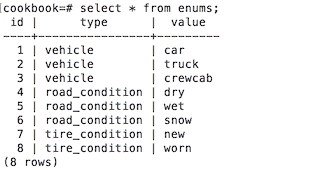

前面的`SELECT`语句需要检索表中所有行的所有列。如果行数超过了屏幕上的行数，数据库控制台将只显示第一屏，你需要输入一个命令（特定于数据库）来显示下一屏：

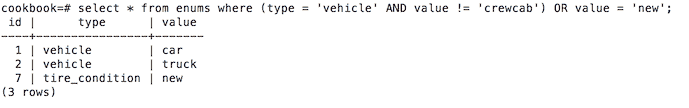

这个`SELECT`语句有一个`WHERE`子句，要求你只显示那些`type`列中的值为`vehicle`且`value`列中的值不为`crewcab`的行。它还要求你显示`value`列中的值为`new`的行：

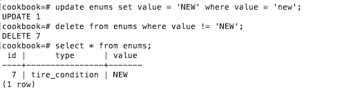

前面的截图捕获了三个语句。第一个是一个`UPDATE`语句，要求你将`value`列中的值更改为`NEW`，但只在没有`value`列中的值为`NEW`的行中更改（显然，值是区分大小写的）。第二个语句要求你删除所有`value`列中没有`NEW`值的行。第三个语句是`SELECT`，我们刚刚讨论过。

值得注意的是，如果我们不能删除`traffic_unit`表中的这些记录，因为它们作为外键被引用，我们就无法删除`enums`表中的记录。只有删除`traffic_unit`表中的相应记录后，我们才能这样做。但是，现在，也就是说，为了演示目的，我们保持`traffic_unit`表为空。

要在代码中执行任何 CRUD 操作，首先必须获取一个 JDBC 连接，然后创建并执行一个语句：

```java
try (Connection conn = getDbConnection()) {
  try (Statement st = conn.createStatement()) {
    boolean res = st.execute("select id, type, value from enums");
    if (res) {
      ResultSet rs = st.getResultSet();
      while (rs.next()) {
        int id = rs.getInt(1); 
        String type = rs.getString(2);
        String value = rs.getString(3);
        System.out.println("id = " + id + ", type = " 
                           + type + ", value = " + value);
      }
    } else {
      int count = st.getUpdateCount();
      System.out.println("Update count = " + count);
    }
  }
} catch (Exception ex) { ex.printStackTrace(); }
```

对于`Statement`对象，使用`try-with-resources`构造也是良好的实践。`Connection`对象的关闭会自动关闭`Statement`对象。然而，当你显式关闭`Statement`对象时，清理会立即发生，而不是等待必要的检查和操作通过框架的各个层传播。

`execute()` 方法是三种可以执行语句的方法中最通用的一个。其他两种包括 `executeQuery()`（仅用于 `SELECT` 语句）和 `executeUpdate()`（用于 `UPDATE`、`DELETE`、`CREATE` 或 `ALTER` 语句）。正如您在我们的示例中所看到的，`execute()` 方法返回 `boolean`，这表示结果是一个 `ResultSet` 对象还是只是一个计数。这意味着 `execute()` 对于 `SELECT` 语句充当 `executeQuery()` 的角色，对于我们刚刚列出的其他语句充当 `executeUpdate()` 的角色。

我们可以通过以下语句序列运行前面的代码来演示这一点：

```java
"select id, type, value from enums"
"insert into enums (id, type, value)" + " values(1,'vehicle','car')"
"select id, type, value from enums"
"update enums set value = 'bus' where value = 'car'"
"select id, type, value from enums"
"delete from enums where value = 'bus'"
"select id, type, value from enums"
```

结果将如下所示：

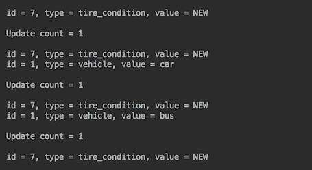

我们从 `ResultSet` 中提取值的位置是因为这比使用列名（如 `rs.getInt("id")` 或 `rs.getInt("type")`）更高效。尽管性能差异很小，但只有在操作多次时才会变得重要。只有实际的测量和测试才能告诉你，在您应用程序的情况下，这种差异是否显著。请记住，通过名称获取值可以提供更好的代码可读性，这在长期的应用程序维护中是非常有益的。

我们为了演示目的使用了 `execute()` 方法。在实践中，`executeQuery()` 方法用于 `SELECT` 语句，因为程序员通常必须以针对执行 SQL 语句特定的方式进行数据提取。相比之下，`executeUpdate()` 的调用可以封装在一个通用方法中：

```java
private static void executeUpdate(String sql){
  try (Connection conn = getDbConnection()) {
    try (Statement st = conn.createStatement()) {
      int count = st.executeUpdate(sql);
      System.out.println("Update count = " + count);
    }
  } catch (Exception ex) { ex.printStackTrace(); }
}
```

# 还有更多...

SQL 是一种丰富的语言，我们没有足够的空间来涵盖其所有功能。我们只想列举其中一些最流行的功能，让您了解它们的存在，并在需要时查找它们：

+   `SELECT` 语句允许使用 `DISTINCT` 关键字来去除所有重复的值

+   添加 `ORDER BY` 关键字将结果按指定顺序呈现

+   关键字 `LIKE` 允许您将搜索模式设置为 `WHERE` 子句

+   搜索模式可以使用多个通配符：`%，_`，`[字符列表]`，`[^字符列表]` 或 `[!字符列表]`

+   可以使用 `IN` 关键字列举匹配的值

+   `SELECT` 语句可以使用 `JOIN` 子句包含多个表

+   `SELECT * INTO table_2 from table_1` 创建 `table_2` 表并从 `table_1` 表复制数据

+   当删除一个表的全部行时，`TRUNCATE` 更快且使用的资源更少

`ResultSet` 接口还有许多其他有用的方法。以下是一些方法如何被用来编写通用的代码，该代码将遍历返回的结果并使用元数据来打印出列名和返回的值：

```java
private static void traverseRS(String sql){
  System.out.println("traverseRS(" + sql + "):");
  try (Connection conn = getDbConnection()) {
    try (Statement st = conn.createStatement()) {
      try(ResultSet rs = st.executeQuery(sql)){
        int cCount = 0;
        Map<Integer, String> cName = new HashMap<>();
        while (rs.next()) {
          if (cCount == 0) {
            ResultSetMetaData rsmd = rs.getMetaData();
            cCount = rsmd.getColumnCount();
            for (int i = 1; i <= cCount; i++) {
              cName.put(i, rsmd.getColumnLabel(i));
            }
          }
          List<String> l = new ArrayList<>();
          for (int i = 1; i <= cCount; i++) {
            l.add(cName.get(i) + " = " + rs.getString(i));
          }
          System.out.println(l.stream()
                              .collect(Collectors.joining(", ")));
        }
      }
    }
  } catch (Exception ex) { ex.printStackTrace(); }
}
```

我们只使用了一次 `ResultSetMetaData` 来收集返回的列名和一行（列数）。然后，我们通过位置提取每行的值，并使用相应的列名创建了 `List<String>` 元素。为了打印，我们使用了我们已熟悉的——程序员的乐趣——连接收集器（我们已在之前的章节中讨论过）。如果我们调用 `traverseRS("select * from enums")` 方法，结果将如下所示：

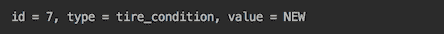

# 参见

参考本章以下菜谱：

+   使用预编译语句

+   使用事务

+   处理大型对象

+   执行存储过程

# 使用预编译语句

在这个菜谱中，你将学习如何使用预编译语句：这是一种可以存储在数据库中并使用不同输入值高效执行的语句模板。

# 准备工作

`PreparedStatement` 对象——`Statement` 的子接口——可以预先编译并存储在数据库中，然后用于针对不同输入值多次高效执行 SQL 语句。类似于通过 `createStatement()` 方法创建的 `Statement` 对象，它可以通过同一 `Connection` 对象的 `prepareStatement()` 方法创建。

还有一种声明的第三种版本，它创建了一个名为 `prepareCall()` 的方法，该方法反过来创建用于执行数据库存储过程的 `CallableStatement` 对象，但我们将在此后的单独菜谱中讨论这一点。

用于生成 `Statement` 的相同 SQL 语句也可以用于生成 `PreparedStatement`。实际上，考虑为任何多次调用的 SQL 语句使用 `PreparedStatement` 是一个好主意，因为它比 `Statement` 性能更好。为此，我们只需要更改上一节示例代码中的这两行：

```java
try (Statement st = conn.createStatement()) {
  boolean res = st.execute("select * from enums");

```

我们将这些行更改为以下内容：

```java
try (PreparedStatement st = 
           conn.prepareStatement("select * from enums")) {
  boolean res = st.execute();

```

# 如何操作...

`PreparedStatement` 的真正实用性体现在其接受参数的能力——即替代（按出现顺序）`?` 符号的输入值。以下是一个示例：

```java
traverseRS("select * from enums");
System.out.println();
try (Connection conn = getDbConnection()) {
  String[][] values = {{"1", "vehicle", "car"},
                       {"2", "vehicle", "truck"}};
  String sql = "insert into enums (id, type, value) values(?, ?, ?)");
  try (PreparedStatement st = conn.prepareStatement(sql) {
    for(String[] v: values){
      st.setInt(1, Integer.parseInt(v[0]));
      st.setString(2, v[1]);
      st.setString(3, v[2]);
      int count = st.executeUpdate();
      System.out.println("Update count = " + count);
    }
  }
} catch (Exception ex) { ex.printStackTrace(); }
System.out.println();
traverseRS("select * from enums");

```

结果如下：

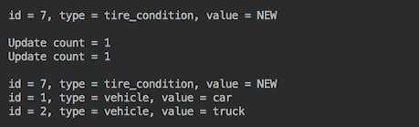

# 还有更多...

对于 CRUD 操作，始终使用预编译语句并不是一个坏主意。如果只执行一次，它们可能会慢一些，但你可以在测试中看到这是否是你愿意付出的代价。使用预编译语句，你将获得一致的（更易读的）代码，更高的安全性（预编译语句不受 SQL 注入攻击的影响），以及更少的决策（只需在所有地方重用相同的代码）。

# 参见

参考本章以下菜谱：

+   使用事务

+   处理大型对象

+   执行存储过程

# 使用事务

在这个菜谱中，你将学习数据库事务是什么以及如何在 Java 代码中使用它。

# 准备工作

事务是包括一个或多个更改数据的操作的工作单元。如果成功，所有数据更改都将 *提交*（应用到数据库）。如果其中一个操作出错或事务被 *回滚*，则事务中包含的所有更改都不会应用到数据库中。

事务属性是在 `Connection` 对象上设置的。它们可以在不关闭连接的情况下进行更改，因此不同的交易可以重用同一个 `Connection` 对象。

JDBC 只允许对 CRUD 操作进行事务控制。表修改（`CREATE TABLE`、`ALTER TABLE` 等）会自动提交，并且无法从 Java 代码中进行控制。

默认情况下，CRUD 操作事务也被设置为自动提交。这意味着由 SQL 语句引入的每个数据更改都会在 SQL 语句执行完成后立即应用到数据库中。所有前面的示例都使用了这种默认行为。

要改变这一点，必须使用 `Connection` 对象的 `setAutoCommit()` 方法。如果设置为 `false`，即 `setAutoCommit(false)`，则数据更改将不会在调用 `Connection` 对象上的 `commit()` 方法之前应用到数据库中。如果调用 `rollback()` 方法，则自事务开始以来或自上次调用 `commit()` 以来所做的所有数据更改将被丢弃。

显式的程序性事务管理可以提高性能，但在调用一次且不常调用的短原子操作的情况下，这是微不足道的。当多个操作引入必须应用的变化时，接管事务控制变得至关重要。它允许您将数据库更改分组为原子单元，从而避免意外违反数据完整性。

# 如何做到这一点...

首先，让我们向 `traverseRS()` 方法添加一个输出：

```java
private static void traverseRS(String sql){
  System.out.println("traverseRS(" + sql + "):");
  try (Connection conn = getDbConnection()) {
    ...
  }
}
```

这将帮助您分析在同一个演示示例中执行多个不同的 SQL 语句时的输出。

现在让我们运行以下代码，该代码从 `enums` 表中读取数据，然后插入一行，然后再次从表中读取所有数据：

```java
traverseRS("select * from enums");
System.out.println();
try (Connection conn = getDbConnection()) {
  conn.setAutoCommit(false);
  String sql = "insert into enums (id, type, value) "
                       + " values(1,'vehicle','car')";
  try (PreparedStatement st = conn.prepareStatement(sql)) {
    System.out.println(sql);
    System.out.println("Update count = " + st.executeUpdate());
  }
  //conn.commit();
} catch (Exception ex) { ex.printStackTrace(); }
System.out.println();
traverseRS("select * from enums");

```

注意，我们通过调用 `conn.setAutoCommit(false)` 来接管事务控制。结果如下：

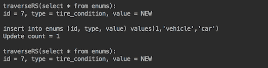

如您所见，更改没有被应用，因为对 `commit()` 的调用被注释掉了。当我们取消注释它时，结果如下：

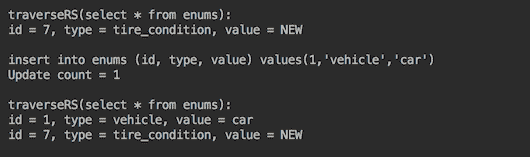

现在让我们执行两个插入操作，但在第二个插入中引入一个拼写错误：

```java
traverseRS("select * from enums");
System.out.println();
try (Connection conn = getDbConnection()) {
  conn.setAutoCommit(false);
  String sql = "insert into enums (id, type, value) "
                       + " values(1,'vehicle','car')";
  try (PreparedStatement st = conn.prepareStatement(sql)) {
    System.out.println(sql);
    System.out.println("Update count = " + st.executeUpdate());
  }
  conn.commit();
  sql = "insert into enums (id, type, value) " 
                     + " values(2,'vehicle','truck')";
  try (PreparedStatement st = conn.prepareStatement(sql)) {
    System.out.println(sql);
    System.out.println("Update count = " + st.executeUpdate());
  }
  conn.commit();
} catch (Exception ex) { ex.printStackTrace(); }
System.out.println();
traverseRS("select * from enums");
```

我们得到了错误堆栈跟踪（我们为了节省空间没有显示）：

```java
org.postgresql.util.PSQLException: ERROR: syntax error at or near "inst"
```

结果如下：

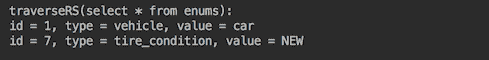

第二行没有插入。如果在第一个`INSERT INTO`语句之后没有`conn.commit()`，第一个插入也不会生效。这是在许多独立数据更改的情况下程序性事务控制的优点：如果其中一个失败，我们可以跳过它并继续应用其他更改。

现在，让我们尝试在第二行插入三行带有错误（未设置`id`值作为数字）的记录：

```java
traverseRS("select * from enums");
System.out.println();
try (Connection conn = getDbConnection()) {
  conn.setAutoCommit(false);
  String[][] values = { {"1", "vehicle", "car"},
                        {"b", "vehicle", "truck"},
                        {"3", "vehicle", "crewcab"} };
  String sql = "insert into enums (id, type, value) " 
                            + " values(?, ?, ?)";
  try (PreparedStatement st = conn.prepareStatement(sql)) {
    for (String[] v: values){
      try {
        System.out.print("id=" + v[0] + ": ");
        st.setInt(1, Integer.parseInt(v[0]));
        st.setString(2, v[1]);
        st.setString(3, v[2]);
        int count = st.executeUpdate();
        conn.commit();
        System.out.println("Update count = "+count);
      } catch(Exception ex){
        //conn.rollback();
        System.out.println(ex.getMessage());
      }
    }
  }
} catch (Exception ex) { ex.printStackTrace(); }
System.out.println();
traverseRS("select * from enums");

```

我们将每个插入执行放在`try...catch`块中，并在打印出结果（更新计数或错误消息）之前提交更改。结果如下：

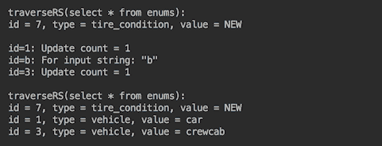

你可以看到，尽管注释掉了`conn.rollback()`，第二行还是没有插入。为什么？这是因为这个事务中唯一的 SQL 语句失败了，所以没有可以回滚的内容。

现在让我们使用数据库控制台创建一个`test`表：

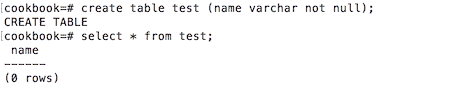

我们将使用这个表格来记录插入到`enums`表中的记录的车辆类型：

```java
traverseRS("select * from enums");
System.out.println();
try (Connection conn = getDbConnection()) {
  conn.setAutoCommit(false);
  String[][] values = { {"1", "vehicle", "car"},
                        {"b", "vehicle", "truck"},
                        {"3", "vehicle", "crewcab"} };
  String sql = "insert into enums (id, type, value) " +
                                        " values(?, ?, ?)";
  try (PreparedStatement st = conn.prepareStatement(sql)) {
    for (String[] v: values){
      try(Statement stm = conn.createStatement()) {
        System.out.print("id=" + v[0] + ": ");
        stm.execute("insert into test values('"+ v[2] + "')");
        st.setInt(1, Integer.parseInt(v[0]));
        st.setString(2, v[1]);
        st.setString(3, v[2]);
        int count = st.executeUpdate();
        conn.commit();
        System.out.println("Update count = " + count);
      } catch(Exception ex){
         //conn.rollback();
         System.out.println(ex.getMessage());
      }
    }
  }
} catch (Exception ex) { ex.printStackTrace(); }
System.out.println();
traverseRS("select * from enums");
System.out.println();
traverseRS("select * from test");

```

在注释掉`conn.rollback()`之后，结果如下：

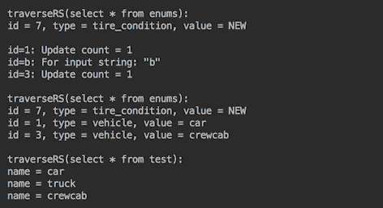

带有`truck`的行没有在`enums`表中插入，而是添加到了`test`表中，尽管我们的意图是记录在`enums`中插入的所有车辆，并且只在`test`表中记录它们。这就是回滚的有用之处可以体现出来的时候。如果我们取消注释`conn.rollback()`，结果将如下：

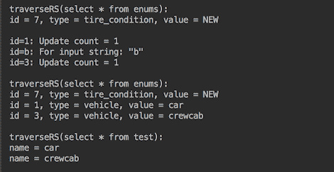

# 还有更多...

事务的一个重要属性是*事务隔离级别*。它定义了数据库用户之间的边界。例如，其他用户在提交之前能看到你的数据库更改吗？隔离级别越高（最高是*可序列化*），在并发访问相同记录的情况下，事务完成所需的时间就越长。隔离级别越不严格（最不严格的是*读取未提交*），数据就越脏；这是因为其他用户可以获取你最终不会提交的值。

通常，使用默认级别就足够了，尽管它可能因数据库而异，通常是`TRANSACTION_READ_COMMITTED`。JDBC 允许你使用名为`getTransactionIsolation()`的`Connection`方法获取当前事务隔离级别，而`setTransactionIsolation()`方法允许你根据需要设置任何其他级别。

在关于哪些更改需要提交以及哪些需要回滚的复杂决策逻辑中，可以使用两个`Connection`方法来创建和删除**保存点**。`setSavepoint(String savepointName)`方法创建一个新的保存点并返回一个`Savepoint`对象，该对象可以稍后用于使用`rollback (Savepoint savepoint)`方法回滚到这个点之前的所有更改。可以通过调用`releaseSavepoint(Savepoint savepoint)`来删除保存点。

最复杂的数据库事务类型是**分布式事务**。有时它们被称为**全局事务**、**XA 事务**或**JTA 事务**（后者是一个 Java API，由两个 Java 包组成，即`javax.transaction`和`javax.transaction.xa`）。它们允许你创建和执行跨越两个不同数据库的操作的事务。提供分布式事务的详细概述超出了本书的范围。

# 处理大型对象

在这个菜谱中，你将学习如何存储和检索一个可以是三种类型之一的 LOB：**二进制大对象**（**BLOB**）、**字符大对象**（**CLOB**）和**国家字符大对象**（**NCLOB**）。

# 准备工作

在数据库内部对 LOB 对象的实际处理是供应商特定的，但 JDBC API 通过将三种 LOB 类型表示为接口来隐藏这些实现细节：`java.sql.Blob`、`java.sql.Clob`和`java.sql.NClob`。

`Blob`通常用于存储图像或其他非字母数字数据。在通往数据库的路上，一张图像可以被转换成字节流并使用`INSERT INTO`语句进行存储。`Blob`接口允许你找到对象长度并将其转换为 Java 可以处理的字节数组，例如用于显示图像。

`Clob`允许你存储字符数据。`NClob`以支持国际化的方式存储 Unicode 字符数据。它扩展了`Clob`接口并提供了相同的方法。这两个接口都允许你找到 LOB 的长度和值内的子字符串。

`ResultSet`、`CallableStatement`（我们将在下一道菜谱中讨论）和`PreparedStatement`接口中的方法允许应用程序以各种方式存储和访问存储的值：其中一些通过相应对象的 setter 和 getter 方法，而其他则作为`bytes[]`或作为二进制、字符或 ASCII 流。

# 如何做到这一点...

每个数据库都有其特定的存储 LOB 的方式。在 PostgreSQL 的情况下，`Blob`通常映射到`OID`或`BYTEA`数据类型，而`Clob`和`NClob`则映射到`TEXT`类型。因此，让我们编写一个新的方法，允许我们以编程方式创建表：

```java
private static void execute(String sql){
  try (Connection conn = getDbConnection()) {
    try (PreparedStatement st = conn.prepareStatement(sql)) {
      st.execute();
    }
  } catch (Exception ex) {
    ex.printStackTrace();
  }
}
```

这与`executeUpdate()`不同，因为它调用`PreparedStatement`的`execute()`方法而不是`executeUpdate()`。原则上，我们可以用`execute()`代替`executeUpdate()`在任何地方使用，但在我们的`executeUpdate()`实现中，我们期望有一个返回值（`count`），在创建表的情况下没有返回，因此我们编写了这个新方法。现在我们可以创建三个表：

```java
execute("create table images (id integer, image bytea)");
execute("create table lobs (id integer, lob oid)");
execute("create table texts (id integer, text text)");
```

查看 JDBC 接口`PreparedStatement`和`ResultSet`，你会注意到对象的 setter 和 getter--`get/setBlob()`、`get/setClob()`、`get/setNClob()`、`get/setBytes()`--在内存中以及使用`InputStream`和`Reader`的方法（`get/setBinaryStream()`、`get/setAsciiStream()`或`get/setCharacterStream()`）。流式方法的优点是它们在数据库和源之间移动数据，而不需要在内存中存储整个 LOB。

然而，对象的 setter 和 getter 更接近我们的心，因为它们用于面向对象的编码。所以我们将从它们开始，使用不太大的对象进行演示。我们期望代码能够正常工作：

```java
try (Connection conn = getDbConnection()) {
  String sql = "insert into images (id, image) values(?, ?)";
  try (PreparedStatement st = conn.prepareStatement(sql)) {
    st.setInt(1, 100);
    File file = new File("src/com/packt/cookbook/ch06_db/image1.png");
    FileInputStream fis = new FileInputStream(file);
    Blob blob = conn.createBlob();   
    OutputStream out = blob.setBinaryStream(1);
    int i = -1;
    while ((i = fis.read()) != -1) {
      out.write(i);
    }
    st.setBlob(2, blob);
    int count = st.executeUpdate();
    System.out.println("Update count = " + count);
  }
} catch (Exception ex) { ex.printStackTrace(); }
```

或者，在`Clob`的情况下，我们编写以下代码：

```java
try (Connection conn = getDbConnection()) {
  String sql = "insert into texts (id, text) values(?, ?)";
  try (PreparedStatement st = conn.prepareStatement(sql)) {
    st.setInt(1, 100);
    File file = new File("src/com/packt/cookbook/ch06_db/"
                         + "Chapter06Database.java");
    Reader reader = new FileReader(file);
    st.setClob(2, reader);  
    int count = st.executeUpdate();
    System.out.println("Update count = " + count);
  }
} catch (Exception ex) { ex.printStackTrace(); }
```

结果表明，并非所有 JDBC API 中可用的方法都由所有数据库的驱动程序实现。例如，`createBlob()`对于 Oracle 和 MySQL 似乎工作得很好，但在 PostgreSQL 的情况下，我们得到以下结果：

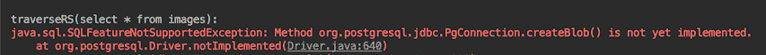

对于`Clob`示例，我们得到以下结果：

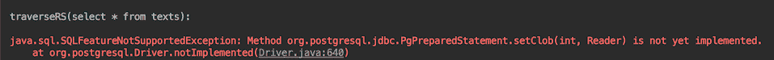

我们也可以尝试通过 getter 从`ResultSet`检索对象：

```java
String sql = "select image from images";
try (PreparedStatement st = conn.prepareStatement(sql)) {
  st.setInt(1, 100);
  try(ResultSet rs = st.executeQuery()){
    while (rs.next()){
      Blob blob = rs.getBlob(1); 
      System.out.println("blob length = " + blob.length());
    }
  }
}
```

结果将如下所示：

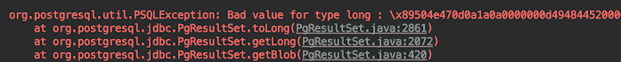

显然，仅了解 JDBC API 是不够的；还必须阅读数据库的文档。以下是 PostgreSQL ([`jdbc.postgresql.org/documentation/80/binary-data.html`](https://jdbc.postgresql.org/documentation/80/binary-data.html)) 文档关于 LOB 处理的说明：

要使用 BYTEA 数据类型，应简单地使用 getBytes()、setBytes()、getBinaryStream()或 setBinaryStream()方法。

要使用大型对象功能，可以使用 PostgreSQL JDBC 驱动程序提供的 LargeObject 类，或者使用 getBLOB()和 setBLOB()方法。

此外，*你必须在一个 SQL 事务块内访问大型对象。你可以通过调用 setAutoCommit(false)来开始一个事务块*。

在不知道这些具体信息的情况下，找出处理 LOB 的方法需要花费大量时间，并造成很多挫败感。

在处理 LOB 时，我们首先会使用流式方法，因为直接从源到数据库或相反方向的流式传输比 setter 和 getter 消耗的内存要少得多（它们必须首先在内存中加载 LOB）。以下是流式传输 PostgreSQL 中的`Blob`的代码：

```java
traverseRS("select * from images");
System.out.println();
try (Connection conn = getDbConnection()) {
  String sql = "insert into images (id, image) values(?, ?)";
  try (PreparedStatement st = conn.prepareStatement(sql)) {
    st.setInt(1, 100);
    File file = new File("src/com/packt/cookbook/ch06_db/image1.png");
    FileInputStream fis = new FileInputStream(file);
    st.setBinaryStream(2, fis);
    int count = st.executeUpdate();
    System.out.println("Update count = " + count);
  }
  sql = "select image from images where id = ?";
  try (PreparedStatement st = conn.prepareStatement(sql)) {
    st.setInt(1, 100);
    try(ResultSet rs = st.executeQuery()){
      while (rs.next()){
        try(InputStream is = rs.getBinaryStream(1)){
          int i;
          System.out.print("ints = ");
          while ((i = is.read()) != -1) {
            System.out.print(i);
          }
        }
      }
    }
  }
} catch (Exception ex) { ex.printStackTrace(); }
System.out.println();
traverseRS("select * from images");

```

这将是你的结果。我们在右侧任意裁剪了截图；否则，它水平上非常长：

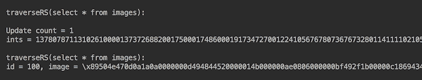

处理检索到的图像的另一种方式是使用 `byte[]`：

```java
try (Connection conn = getDbConnection()) {
  String sql =  "insert into images (id, image) values(?, ?)";
  try (PreparedStatement st = conn.prepareStatement(sql)) {
    st.setInt(1, 100);
    File file = new File("src/com/packt/cookbook/ch06_db/image1.png");
    FileInputStream fis = new FileInputStream(file);
    byte[] bytes = fis.readAllBytes();
    st.setBytes(2, bytes);
    int count = st.executeUpdate();
    System.out.println("Update count = " + count);
  }
  sql = "select image from images where id = ?";
  System.out.println();
  try (PreparedStatement st = conn.prepareStatement(sql)) {
    st.setInt(1, 100);
    try(ResultSet rs = st.executeQuery()){
      while (rs.next()){
        byte[] bytes = rs.getBytes(1);
        System.out.println("bytes = " + bytes);
      }
    }
  }
} catch (Exception ex) { ex.printStackTrace(); }

```

PostgreSQL 将 BYTEA 的大小限制为 1 GB。更大的二进制对象可以存储为 **对象标识符**（**OID**）数据类型：

```java
traverseRS("select * from lobs");
System.out.println();
try (Connection conn = getDbConnection()) {
  conn.setAutoCommit(false);
  LargeObjectManager lobm = 
        conn.unwrap(org.postgresql.PGConnection.class)
            .getLargeObjectAPI();
  long lob = lobm.createLO(LargeObjectManager.READ 
                           | LargeObjectManager.WRITE);
  LargeObject obj = lobm.open(lob, LargeObjectManager.WRITE);
  File file = new File("src/com/packt/cookbook/ch06_db/image1.png");
  try (FileInputStream fis = new FileInputStream(file)){
    int size = 2048;
    byte[] bytes = new byte[size];
    int len = 0;
    while ((len = fis.read(bytes, 0, size)) > 0) {
      obj.write(bytes, 0, len);
    }
    obj.close();
    String sql = "insert into lobs (id, lob) values(?, ?)";
    try (PreparedStatement st = conn.prepareStatement(sql)) {
      st.setInt(1, 100);
      st.setLong(2, lob);
      st.executeUpdate();
    }
  }
    conn.commit();
} catch (Exception ex) { ex.printStackTrace(); }
System.out.println();
traverseRS("select * from lobs");

```

结果将如下：

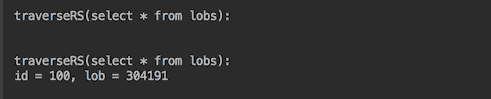

注意，`select` 语句从 `lob` 列返回一个长值。这是因为 OID 列本身不存储值，就像 BYTEA 一样。相反，它存储对存储在数据库其他地方的对象的引用。这种安排使得删除具有 OID 类型的行不像这样直接：

```java
execute("delete from lobs where id = 100"); 

```

如果只是这样做，它将实际的对象留作孤儿，继续消耗磁盘空间，但没有任何应用程序表引用它。为了避免这个问题，必须首先通过执行以下命令来 `unlink` LOB：

```java
execute("select lo_unlink((select lob from lobs " + " where id=100))");

```

只有在执行完 `delete from lobs where id = 100` 命令之后，你才能安全地执行。

如果你忘记先 `unlink`，或者意外地创建了一个孤儿 LOB（因为代码中的错误或其他原因），有一种方法可以在系统表中找到孤儿。同样，数据库文档应该提供如何操作的说明。在 PostgreSQL v.9.3 或更高版本中，你可以通过执行 `select count(*) from pg_largeobject` 命令来检查是否有孤儿 LOB。如果返回的计数大于 0，则可以使用以下连接删除所有孤儿（假设 `lobs` 表是唯一可以引用 LOB 的表）：

```java
SELECT lo_unlink(pgl.oid) FROM pg_largeobject_metadata pgl
WHERE (NOT EXISTS (SELECT 1 FROM lobs ls" + "WHERE ls.lob = pgl.oid));
```

虽然这是一个开销，但这是存储 LOB 到数据库必须付出的代价。值得注意的是，尽管 BYTEA 在删除操作期间不需要这种复杂性，但它有不同类型的开销。根据 PostgreSQL 文档，当接近 1 GB 时，*处理如此大的值将需要大量的内存*。

要读取 LOB 数据，可以使用以下代码：

```java
try (Connection conn = getDbConnection()) {
  conn.setAutoCommit(false);
  LargeObjectManager lobm =      
          conn.unwrap(org.postgresql.PGConnection.class)
              .getLargeObjectAPI();
  String sql = "select lob from lobs where id = ?";
  try (PreparedStatement st = conn.prepareStatement(sql)) {
    st.setInt(1, 100);
    try(ResultSet rs = st.executeQuery()){
      while (rs.next()){
        long lob = rs.getLong(1);
        LargeObject obj = lobm.open(lob, LargeObjectManager.READ);
        byte[] bytes = new byte[obj.size()];
        obj.read(bytes, 0, obj.size());
        System.out.println("bytes = " + bytes);
        obj.close();
      }
    }
  }
  conn.commit();
} catch (Exception ex) { ex.printStackTrace(); }

```

或者，如果 LOB 不是太大，也可以通过直接从 `ResultSet` 对象获取 `Blob` 来使用一个更简单的版本：

```java
while (rs.next()){
  Blob blob = rs.getBlob(1);
  byte[] bytes = blob.getBytes(1, (int)blob.length());
  System.out.println("bytes = " + bytes);
}
```

要在 PostgreSQL 中存储 `Clob`，可以使用与前面相同的代码。在从数据库读取时，可以将字节转换为 `String` 数据类型或类似类型（如果 LOB 不是太大）：

```java
String str = new String(bytes, Charset.forName("UTF-8"));
System.out.println("bytes = " + str);

```

然而，PostgreSQL 中的 `Clob` 可以直接存储为无限大小的 `TEXT` 数据类型。此代码读取编写此代码的文件，并将其存储/检索到数据库中：

```java
traverseRS("select * from texts");
System.out.println();
try (Connection conn = getDbConnection()) {
  String sql = "insert into texts (id, text) values(?, ?)";
  try (PreparedStatement st = conn.prepareStatement(sql)) {
    st.setInt(1, 100);
    File file = new File("src/com/packt/cookbook/ch06_db/"
                         + "Chapter06Database.java");
    try (FileInputStream fis = new FileInputStream(file)) {
      byte[] bytes = fis.readAllBytes();
      st.setString(2, new String(bytes, Charset.forName("UTF-8")));
    }
    int count = st.executeUpdate();
    System.out.println("Update count = " + count);
  }
  sql = "select text from texts where id = ?";
  try (PreparedStatement st = conn.prepareStatement(sql)) {
    st.setInt(1, 100);
    try(ResultSet rs = st.executeQuery()){
      while (rs.next()) {
        String str = rs.getString(1);
        System.out.println(str);
      }
    }
  }
} catch (Exception ex) { ex.printStackTrace(); }
```

结果将如下（我们只显示了输出结果的前几行）：

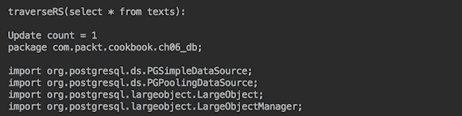

对于更大的对象，流式方法会是一个更好的（如果不是唯一的选择）：

```java
traverseRS("select * from texts");
System.out.println();
try (Connection conn = getDbConnection()) {
  String sql = "insert into texts (id, text) values(?, ?)";
  try (PreparedStatement st = conn.prepareStatement(sql)) {
    st.setInt(1, 100);
    File file = new File("src/com/packt/cookbook/ch06_db/"
                         + "Chapter06Database.java");
    //This is not implemented:
    //st.setCharacterStream(2, reader, file.length()); 
    st.setCharacterStream(2, reader, (int)file.length());

    int count = st.executeUpdate();
    System.out.println("Update count = " + count);
  }
} catch (Exception ex) { ex.printStackTrace(); }
System.out.println();
traverseRS("select * from texts");
```

注意，`setCharacterStream(int, Reader, long)` 没有实现，而 `setCharacterStream(int, Reader, int)` 工作正常。

我们还可以将`texts`表中的文件作为字符流读取，并限制为前 160 个字符：

```java
String sql = "select text from texts where id = ?";
try (PreparedStatement st = conn.prepareStatement(sql)) {
  st.setInt(1, 100);
  try(ResultSet rs = st.executeQuery()){
    while (rs.next()) {
      try(Reader reader = rs.getCharacterStream(1)) {
        char[] chars = new char[160];
        reader.read(chars);
        System.out.println(chars);
      }
    }
  }
}
```

结果将如下：

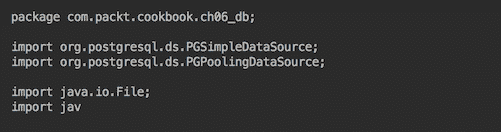

# 还有更多...

这里是来自 PostgreSQL 文档的另一条建议（你可以在[`jdbc.postgresql.org/documentation/80/binary-data.html`](https://jdbc.postgresql.org/documentation/80/binary-data.html)访问它）：

BYTEA 数据类型不适合存储大量的二进制数据。虽然 BYTEA 类型的列可以存储高达 1 GB 的二进制数据，但处理如此大的值需要大量的内存。

大对象（Large Object）方法更适合存储非常大的值，但它也有自己的局限性。具体来说，删除包含大对象引用的行并不会删除大对象。删除大对象是一个需要单独执行的操作。大对象也存在一些安全问题，因为任何连接到数据库的人都可以查看和/或修改任何大对象，即使他们没有权限查看/更新包含大对象引用的行。

在决定将 LOB 存储在数据库中时，必须记住，数据库越大，维护它就越困难。访问速度——选择数据库作为存储设施的主要优势——也会减慢，而且无法为 LOB 类型创建索引以改进搜索。此外，除了少数 CLOB 情况外，不能在`WHERE`子句中使用 LOB 列，也不能在`INSERT`或`UPDATE`语句的多个行中使用 LOB 列。

因此，在考虑为 LOB 选择数据库之前，应该始终考虑是否将文件名、关键词和一些其他内容属性存储在数据库中就足够解决问题。

# 执行存储过程

在这个菜谱中，你将学习如何从 Java 程序中执行数据库存储过程。

# 准备工作

有时，现实生活中的 Java 程序员会遇到需要在多个表中操作和/或选择数据的需要，并因此提出一系列复杂的 SQL 语句。在一个场景中，数据库管理员查看建议的流程，并对其进行改进和优化，以至于在 Java 中实现它变得不可能或至少不切实际。这就是将开发的一组 SQL 语句封装成存储过程，编译并存储在数据库中，然后通过 JDBC 接口调用的时刻。或者，在命运的另一个转折点，Java 程序员可能会遇到需要在程序中包含对现有存储过程的调用的需要。为了完成这个任务，可以使用`CallableStatement`接口（它扩展了`PreparedStatement`接口），尽管一些数据库允许你使用`Statement`或`PreparedStatement`接口中的任何一个来调用存储过程。

`CallableStatement` 可以有三种类型的参数：`IN` 用于输入值，`OUT` 用于结果，以及 `IN OUT` 用于输入或输出值。`OUT` 参数必须通过 `CallableStatement` 的 `registerOutParameter()` 方法进行注册。IN 参数的设置方式与 `PreparedStatement` 的参数相同。

请记住，从 Java 程序中程序化执行存储过程是标准化程度最低的领域之一。例如，PostgreSQL 不直接支持存储过程，但它们可以作为函数调用，这些函数已经通过将 `OUT` 参数解释为返回值而进行了修改。另一方面，Oracle 允许函数也有 `OUT` 参数。

因此，以下数据库函数和存储过程之间的区别只能作为一般指南，而不是正式定义：

+   函数有一个返回值，但它不允许 `OUT` 参数（除了某些数据库），并且可以在 SQL 语句中使用。

+   存储过程没有返回值（除了某些数据库）；它允许 `OUT` 参数（对于大多数数据库）并且可以使用 JDBC 接口的 `CallableStatement` 执行。

这就是为什么阅读数据库文档以学习如何执行存储过程，与之前菜谱中讨论的，处理 LOBs 一样重要。

因为存储过程是在数据库服务器上编译和存储的，所以 `CallableStatement` 的 `execute()` 方法对于相同的 SQL 语句比 `Statement` 或 `PreparedStatement` 的相应方法性能更好。这就是为什么很多 Java 代码有时会被一个或多个包含甚至业务逻辑的存储过程所取代的原因之一。做出这种决定的另一个原因是，人们可以以最熟悉的方式实现解决方案。因此，对于所有情况和情况，没有正确答案，我们将避免提出具体建议，除了重复关于测试价值和编写代码清晰度的熟悉箴言。

# 如何实现...

如前所述，我们将继续使用 PostgreSQL 数据库进行演示。在编写自定义 SQL 语句、函数和存储过程之前，应该首先查看现有函数的列表。通常，它们提供了丰富的功能。

这里是一个调用 `replace(string text, from text, to text)` 函数的例子，该函数查找 `string text` 中的所有 `from text` 子串，并将它们替换为 `to text`：

```java
String sql = "{ ? = call replace(?, ?, ? ) }";
try (CallableStatement st = conn.prepareCall(sql)) {
  st.registerOutParameter(1, Types.VARCHAR);
  st.setString(2, "Hello, World! Hello!");
  st.setString(3, "llo");
  st.setString(4, "y");
  st.execute();
  String res = st.getString(1);
  System.out.println(res);
}
```

结果如下：


我们将把这个功能整合到我们的自定义函数和存储过程中，以展示如何实现。

存储过程可以没有任何参数，只有 `IN` 参数，只有 `OUT` 参数，或者两者都有。结果可能是一个或多个值，或者一个 `ResultSet` 对象。以下是在 PostgreSQL 中创建不带任何参数的存储过程的示例：

```java
execute("create or replace function createTableTexts() " 
        + " returns void as " 
        + "$$ drop table if exists texts; "
        + "  create table texts (id integer, text text); "
        + "$$ language sql");

```

我们使用一个我们已熟悉的方法：

```java
private static void execute(String sql){
  try (Connection conn = getDbConnection()) {
    try (PreparedStatement st = conn.prepareStatement(sql)) {
      st.execute();
    }
  } catch (Exception ex) {
    ex.printStackTrace();
  }
}
```

这个存储过程（在 PostgreSQL 中它始终是一个函数）创建一个 `texts` 表（如果表已存在，则删除）。你可以在数据库文档中找到创建函数的 SQL 语法。我们只想在这里评论一下，你可以使用单引号而不是表示函数体的符号 `$$`。我们更喜欢使用 `$$`，因为它有助于避免在需要将单引号包含在函数体中时进行转义。

这个过程可以通过 `CallableStatement` 调用：

```java
String sql = "{ call createTableTexts() }";
try (CallableStatement st = conn.prepareCall(sql)) {
  st.execute();
}
```

或者，可以使用 SQL 语句 `select createTableTexts()` 或 `select * from createTableTexts()` 来调用它。这两个语句都返回一个 `ResultSet` 对象（在 `createTableTexts()` 函数的情况下为 `null`），因此我们可以通过我们的方法遍历它：

```java
private static void traverseRS(String sql){
  System.out.println("traverseRS(" + sql + "):");
  try (Connection conn = getDbConnection()) {
    try (Statement st = conn.createStatement()) {
      try(ResultSet rs = st.executeQuery(sql)){
        int cCount = 0;
        Map<Integer, String> cName = new HashMap<>();
        while (rs.next()) {
          if (cCount == 0) {
            ResultSetMetaData rsmd = rs.getMetaData();
            cCount = rsmd.getColumnCount();
            for (int i = 1; i <= cCount; i++) {
              cName.put(i, rsmd.getColumnLabel(i));
            }
          }
          List<String> l = new ArrayList<>();
          for (int i = 1; i <= cCount; i++) {
            l.add(cName.get(i) + " = " + rs.getString(i));
          }
          System.out.println(l.stream()
                      .collect(Collectors.joining(", ")));
        }
      }
    }
  } catch (Exception ex) { ex.printStackTrace(); }
}
```

我们已经在之前的菜谱中使用了这个方法。

可以使用 `drop function if exists createTableTexts()` 语句删除函数。

现在让我们将这些内容全部整合到 Java 代码中，创建一个函数，并以三种不同的方式调用它：

```java
execute("create or replace function createTableTexts() " 
        + "returns void as "
        + "$$ drop table if exists texts; "
        + "  create table texts (id integer, text text); "
        + "$$ language sql");
String sql = "{ call createTableTexts() }";
try (Connection conn = getDbConnection()) {
  try (CallableStatement st = conn.prepareCall(sql)) {
    st.execute();
  }
}
traverseRS("select createTableTexts()");
traverseRS("select * from createTableTexts()");
execute("drop function if exists createTableTexts()");

```

结果如下：

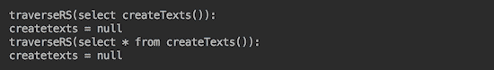

注意，函数的名称不区分大小写。我们保持驼峰式命名只是为了提高可读性。

现在让我们创建并调用一个带有两个输入参数的存储过程（函数）：

```java
execute("create or replace function insertText(int,varchar)" 
        + " returns void "
        + " as $$ insert into texts (id, text) "
        + "   values($1, replace($2,'XX','ext'));" 
        + " $$ language sql");
String sql = "{ call insertText(?, ?) }";
try (Connection conn = getDbConnection()) {
  try (CallableStatement st = conn.prepareCall(sql)) {
    st.setInt(1, 1);
    st.setString(2, "TXX 1");
    st.execute();
  }
}
execute("select insertText(2, 'TXX 2')");
traverseRS("select * from texts");
execute("drop function if exists insertText()");

```

在函数体中，输入参数通过它们的 `$1` 和 `$2` 位置引用。如前所述，我们在将第二个输入参数插入表之前，也使用了内置的 `replace()` 函数来操作该参数的值。我们调用了新创建的存储过程两次：首先通过 `CallableStatment`，然后通过 `execute()` 方法，使用不同的输入值。然后我们使用 `traverseRS("select * from texts")` 查看表内容，并删除新创建的函数以进行清理（在实际代码中，一旦创建，函数就会保留并利用其存在，编译并准备好运行）。如果我们运行此代码，我们将得到以下结果：

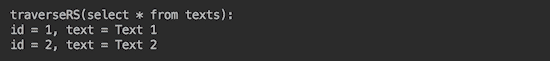

以下代码向 `texts` 表中添加两行，然后查询它并创建一个存储过程（函数），该函数计算表中的行数并返回结果（注意返回值的 `bigint` 值和 `OUT` 参数 `Types.BIGINT` 的匹配类型）：

```java
execute("insert into texts (id, text) " 
         + "values(3,'Text 3'),(4,'Text 4')");
traverseRS("select * from texts");
execute("create or replace function countTexts() " 
        + "returns bigint as " 
        + "$$ select count(*) from texts; " 
        + "$$ language sql");
String sql = "{ ? = call countTexts() }";
try (Connection conn = getDbConnection()) {
  try (CallableStatement st = conn.prepareCall(sql)) {
    st.registerOutParameter(1, Types.BIGINT);
    st.execute();
    System.out.println("Result of countTexts() = " + st.getLong(1));
  }
}
traverseRS("select countTexts()");
traverseRS("select * from countTexts()");
execute("drop function if exists countTexts()");

```

新创建的存储过程被执行了三次，然后被删除。结果如下：

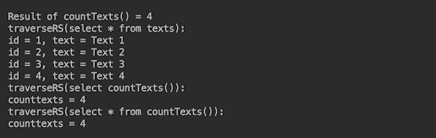

一个具有一个输入参数（类型为`int`）并返回`ResultSet`的存储过程示例将如下所示（注意返回类型定义为`setof texts`，其中`texts`是表名称）：

```java
execute("create or replace function selectText(int) " 
        + "returns setof texts as 
        + "$$ select * from texts where id=$1; " 
        + "$$ language sql");
traverseRS("select selectText(1)");
traverseRS("select * from selectText(1)");
execute("drop function if exists selectText(int)");
```

结果将如下所示：

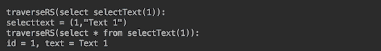

值得分析两次调用存储过程的`ResultSet`内容之间的差异。没有`select *`时，它包含过程名称和返回的对象（`ResultSet`类型）。但是，使用`select *`时，它返回过程中的最后一个 SQL 语句的实际`ResultSet`内容。

自然地，人们会问为什么我们不能像这样通过`CallableStatement`调用这个存储过程：

```java
String sql = "{ ? = call selectText(?) }";
try (CallableStatement st = conn.prepareCall(sql)) {
  st.registerOutParameter(1, Types.OTHER);
  st.setInt(2, 1);
  st.execute();
  traverseRS((ResultSet)st.getObject(1));
}

```

我们尝试了，但不起作用。以下是 PostgreSQL 文档对此的说明：

应该通过 CallableStatement 接口而不是通过 CallableStatement 接口调用返回数据集的函数。

尽管存在这种限制，但有一种方法可以绕过。相同的数据库文档描述了如何检索一个`refcursor`（一个 PostgreSQL 特定的功能）的值，然后可以将其转换为`ResultSet`：

```java
execute("create or replace function selectText(int) " 
        + "returns refcursor " +
        + "as $$ declare curs refcursor; " 
        + " begin " 
        + "   open curs for select * from texts where id=$1;" 
        + "     return curs; " 
        + " end; " 
        + "$$ language plpgsql");
String sql = "{ ? = call selectText(?) }";
try (Connection conn = getDbConnection()) {
  conn.setAutoCommit(false);
  try(CallableStatement st = conn.prepareCall(sql)){
    st.registerOutParameter(1, Types.OTHER);
    st.setInt(2, 2);
    st.execute();
    try(ResultSet rs = (ResultSet) st.getObject(1)){
      System.out.println("traverseRS(refcursor()=>rs):");
      traverseRS(rs);
    }
  }
}
traverseRS("select selectText(2)");
traverseRS("select * from selectText(2)");
execute("drop function if exists selectText(int)");

```

关于前面代码的一些注释可能有助于你理解它是如何完成的：

+   自动提交必须关闭

+   在函数内部，`$1`指的是第一个`IN`参数（不包括`OUT`参数）

+   为了访问`refcursor`功能（PL/pgSQL 是 PostgreSQL 数据库的可加载过程语言），语言设置为`plpgsql`

+   要遍历`ResultSet`，我们编写了一个新方法，如下所示：

```java
        private void traverseRS(ResultSet rs) throws Exception {
          int cCount = 0;
          Map<Integer, String> cName = new HashMap<>();
          while (rs.next()) {
            if (cCount == 0) {
              ResultSetMetaData rsmd = rs.getMetaData();
              cCount = rsmd.getColumnCount();
              for (int i = 1; i <= cCount; i++) {
                cName.put(i, rsmd.getColumnLabel(i));
              }
            }
            List<String> l = new ArrayList<>();
            for (int i = 1; i <= cCount; i++) {
              l.add(cName.get(i) + " = " + rs.getString(i));
            }
            System.out.println(l.stream()
                      .collect(Collectors.joining(", ")));
          }
        }
```

因此，我们的老朋友现在可以被重构为这样：

```java
private static void traverseRS(String sql){
  System.out.println("traverseRS(" + sql + "):");
  try (Connection conn = getDbConnection()) {
    try (Statement st = conn.createStatement()) {
      try(ResultSet rs = st.executeQuery(sql)){
        traverseRS(rs);
      }
    }
  } catch (Exception ex) { ex.printStackTrace(); }
}
```

结果将如下所示：

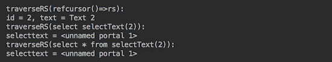

你可以看到，在这种情况下，不提取对象并将其转换为`ResultSet`的结果遍历方法没有显示正确数据。

# 还有更多...

我们介绍了从 Java 代码调用存储过程最常见的情况。本书的范围不允许我们展示 PostgreSQL 和其他数据库中更复杂且可能有用的存储过程形式。然而，我们想在这里提及它们，以便你了解其他可能性：

+   复合类型上的函数

+   具有参数名称的函数

+   具有可变数量参数的函数

+   具有默认参数值的函数

+   作为表源的函数

+   返回表格的函数

+   多态 SQL 函数

+   具有校对的函数
