# 并发和多线程编程

并发编程一直是一项艰巨的任务。它可能听起来很简单，但它却是许多难以解决的问题的来源。在本章中，我们将向您展示不同的并发实现方式以及一些最佳实践，例如不可变性，这将有助于创建更好的并发应用程序。我们还将讨论使用 Java 提供的构造实现一些常用模式，例如分而治之和发布-订阅。我们将涵盖以下食谱：

+   使用并发的基本元素——线程

+   不同的同步方法

+   不可变性作为实现并发的手段

+   使用并发集合

+   使用执行器服务执行异步任务

+   使用 fork/join 实现分而治之

+   使用流实现发布-订阅模式

# 简介

并发——并行执行多个程序的能力——随着大数据分析进入现代应用的主流，变得越来越重要。拥有 CPU 或一个 CPU 中的多个核心有助于提高吞吐量，但数据量的增长速度将始终超过硬件的进步。此外，即使在多 CPU 系统中，仍然需要结构化代码并考虑资源共享，以充分利用可用的计算能力。

在前面的章节中，我们展示了如何使用具有函数式接口的 lambda 表达式和并行流将并发处理变成每个 Java 程序员工具箱的一部分。如果需要的话，人们可以很容易地利用这一功能，几乎不需要任何指导。

在本章中，我们将描述一些其他——旧（在 Java 9 之前存在）和新——Java 特性和 API，它们允许对并发有更多的控制。高级并发 Java API 自 Java 5 以来一直存在。JDK 增强提案（JEP）266，“更多并发更新”，在`java.util.concurrent`包中引入了“一个可互操作的发布-订阅框架，CompletableFuture API 的增强以及各种其他改进”。但在我们深入探讨最新添加的细节之前，让我们回顾一下 Java 并发编程的基本知识，并看看如何使用它们。

Java 有两种执行单元：进程和线程。进程通常代表整个 JVM，尽管应用程序可以使用`ProcessBuilder`创建另一个进程。但由于多进程的情况超出了本书的范围，我们将专注于第二个执行单元，即线程，它类似于进程，但与其他线程的隔离性较低，并且执行所需的资源较少。

一个进程可以有多个线程运行，至少有一个称为主线程。线程可以共享资源，包括内存和打开的文件，这可以提高效率，但也会带来更高的风险，即意外的互斥干扰甚至执行阻塞。这就是需要编程技能和对并发技术的理解的地方。这也是本章将要讨论的内容。

# 使用并发的基本元素——线程

在本章中，我们将探讨`java.lang.Thread`类，并了解它可以为并发性和程序性能带来什么。

# 准备工作

一个 Java 应用程序以主线程的形式启动（不包括支持进程的系统线程）。然后它可以创建其他线程，并让它们并行运行（通过时间切片共享同一核心，或者为每个线程分配一个专用的 CPU）。这可以通过实现`Runnable`功能接口的`java.lang.Thread`类来完成，该接口只有一个`run()`方法。

创建新线程有两种方式：创建`Thread`的子类或实现`Runnable`接口并将实现类的对象传递给`Thread`构造函数。我们可以通过调用`Thread`类的`start()`方法来启动新线程（它反过来调用我们实现的`run()`方法）。

然后，我们可以让新线程运行直到其完成，或者暂停它并再次让它继续。如果需要，我们还可以访问其属性或中间结果。

# 如何实现...

首先，我们创建一个名为`AThread`的类，它继承自`Thread`并重写其`run()`方法：

```java
class AThread extends Thread {
  int i1,i2;
  AThread(int i1, int i2){
    this.i1 = i1;
    this.i2 = i2;
  }
  public void run() {
    IntStream.range(i1, i2)
             .peek(Chapter07Concurrency::doSomething)
             .forEach(System.out::println);
  }
}
```

在这个例子中，我们希望线程生成一定范围内的整数流。然后，我们检查每个发出的整数（方法`peek()`不能改变流元素）并调用主类的静态方法`doSomething()`，以便让线程忙碌一段时间。参考以下代码：

```java
private static int doSomething(int i){
  IntStream.range(i, 99999).asDoubleStream().map(Math::sqrt).average();
  return i;
}
```

如您所见，此方法生成另一个范围在`i`和`99999`之间的整数流，然后将流转换为双流，计算流中每个元素的平方根，并最终计算流的平均平均值。我们丢弃结果并返回传入的参数（作为一个便利，允许我们在线程的流管道中保持流畅的样式，最终打印出每个元素）。使用这个新类，我们现在可以演示三个线程的并发执行：

```java
Thread thr1 = new AThread(1, 4);
thr1.start();

Thread thr2 = new AThread(11, 14);
thr2.start();

IntStream.range(21, 24)
         .peek(Chapter07Concurrency::doSomething)
         .forEach(System.out::println);

```

第一个线程生成整数`1`、`2`和`3`，第二个线程生成整数`11`、`12`和`13`，第三个线程（主线程）生成`21`、`22`和`23`。

如前所述，我们可以通过创建和使用一个可以实现`Runnable`接口的类来重写相同的程序：

```java
class ARunnable implements Runnable {
  int i1,i2;
  ARunnable(int i1, int i2){
    this.i1 = i1;
    this.i2 = i2;
  }
  public void run() {
    IntStream.range(i1, i2)
             .peek(Chapter07Concurrency::doSomething)
             .forEach(System.out::println);
  }
}
```

因此，你可以这样运行相同的三个线程：

```java
Thread thr1 = new Thread(new ARunnable(1, 4));
thr1.start();

Thread thr2 = new Thread(new ARunnable(11, 14));
thr2.start();

IntStream.range(21, 24)
         .peek(Chapter07Concurrency::doSomething)
         .forEach(System.out::println);

```

我们还可以利用`Runnable`是一个函数式接口的优势，通过传递 lambda 表达式而不是创建中间类来避免创建中间类：

```java
Thread thr1 = new Thread(() -> IntStream.range(1, 4)
                  .peek(Chapter07Concurrency::doSomething)
                  .forEach(System.out::println));
thr1.start();

Thread thr2 = new Thread(() -> IntStream.range(11, 14)
                  .peek(Chapter07Concurrency::doSomething)
                  .forEach(System.out::println));
thr2.start();

IntStream.range(21, 24)
         .peek(Chapter07Concurrency::doSomething)
         .forEach(System.out::println);

```

哪个实现更好取决于你的目标和风格。实现`Runnable`有一个优点（在某些情况下，是唯一可能的选择），即它允许实现从另一个类扩展。当你想向现有类添加类似线程的行为时，这尤其有用。你甚至可以直接调用`run()`方法，而不需要将对象传递给`Thread`构造函数。

当只需要`run()`方法的实现时，使用 lambda 表达式胜过`Runnable`实现，无论它有多大。如果它太大，你可以将它隔离在单独的方法中：

```java
public static void main(String arg[]) {
  Thread thr1 = new Thread(() -> runImpl(1, 4));
  thr1.start();

  Thread thr2 = new Thread(() -> runImpl(11, 14));
  thr2.start();

  runImpl(21, 24);
}

private static void runImpl(int i1, int i2){
  IntStream.range(i1, i2)
           .peek(Chapter07Concurrency::doSomething)
           .forEach(System.out::println);
}
```

很难想出一个更短的实现相同功能的方法。

如果我们运行前面的任何版本，我们将会得到类似这样的结果：


如你所见，三个线程并行打印出它们的数字，但顺序取决于特定的 JVM 实现和底层操作系统。因此，你可能会得到不同的输出。此外，它还会在每次运行时发生变化。

`Thread`类有几个构造函数，允许你设置线程名称和它所属的组。线程分组有助于在并行运行多个线程时管理它们。该类还有几个方法，可以提供有关线程状态和属性的信息，并允许你控制其行为。将这两行添加到前面的示例中：

```java
System.out.println("Id=" + thr1.getId() + ", " + thr1.getName() + ",
                   priority=" + thr1.getPriority() + ",
                   state=" + thr1.getState());
System.out.println("Id=" + thr2.getId() + ", " + thr2.getName() + ",
                   priority=" + thr2.getPriority() + ",
                   state=" + thr2.getState());
```

你可能会得到类似这样的结果：


接下来，比如，你给线程添加名称：

```java
Thread thr1 = new Thread(() -> runImpl(1, 4), "First Thread");
thr1.start();

Thread thr2 = new Thread(() -> runImpl(11, 14), "Second Thread");
thr2.start();

```

在这种情况下，输出将显示以下内容：


线程的`id`是自动生成的，不能更改，但在线程终止后可以重用。另一方面，线程名称可以被多个线程共享。可以通过在`Thread.MIN_PRIORITY`和`Thread.MAX_PRIORITY`之间设置值来程序化地设置优先级。值越小，线程被允许运行的时间越长（这意味着它有更高的优先级）。如果没有设置，优先级值默认为`Thread.NORM_PRIORITY`。线程的状态可以有以下之一：

+   `NEW`: 当一个线程尚未启动

+   `RUNNABLE`: 当一个线程正在执行

+   `BLOCKED`: 当一个线程被阻塞并正在等待监视器锁时

+   `WAITING`: 当一个线程无限期地等待另一个线程执行特定操作时

+   `TIMED_WAITING`: 当一个线程等待另一个线程执行操作，最长等待指定的时间

+   `TERMINATED`: 当一个线程已退出

我们将在我们的某个菜谱中讨论`BLOCKED`和`WAITING`状态。

`sleep()`方法可以用来暂停线程执行指定的时间（以毫秒为单位）。互补的方法`interrupt()`向线程发送`InterruptedException`，可以用来唤醒*睡眠*的线程。让我们在代码中实现这一点，并创建一个新的类：

```java
private static class BRunnable implements Runnable {
  int i1, result;
  BRunnable(int i1){ this.i1 = i1; }
  public int getCurrentResult(){ return this.result; }
  public void run() {
    for(int i = i1; i < i1 + 6; i++){
      //Do something useful here
      this.result = i;
      try{ Thread.sleep(1000);
      } catch(InterruptedException ex){}
    }
  }
}
```

上述代码产生中间结果，这些结果存储在`result`属性中。每次产生新的结果时，线程会暂停一秒钟。在这个仅用于演示的具体示例中，代码并没有做特别有用的事情。它只是迭代一组值，并将每个值视为一个结果。在实际代码中，您会根据系统的当前状态或其他东西进行一些计算，并将计算值分配给`result`属性。现在让我们使用这个类：

```java
BRunnable r1 = new BRunnable(1);
Thread thr1 = new Thread(r1);
thr1.start();

IntStream.range(21, 29)
         .peek(i -> thr1.interrupt())
         .filter(i ->  {
           int res = r1.getCurrentResult();
           System.out.print(res + " => ");
           return res % 2 == 0;
         })
         .forEach(System.out::println);

```

上述程序生成一系列整数：21, 22, ..., 28。在生成每个整数之后，主线程中断`thr1`线程，并让它生成下一个结果，然后通过`getCurrentResult()`方法访问并分析。如果当前结果是偶数，过滤器允许生成的数字流被打印出来。如果不是，则跳过。以下是一个可能的结果：


如果在不同的计算机上运行程序，结果可能会有所不同，但您应该明白：这样，一个线程可以控制另一个线程的输出。

# 还有更多...

还有两种其他重要方法允许线程协作。首先是`join()`方法，它允许当前线程等待直到另一个线程终止。`join()`的重载版本接受定义线程等待多长时间才能做其他事情的参数。

`setDaemon()`方法在所有非守护线程终止后自动终止线程。通常，它用于后台和支持进程。

# 参见

参考本章中的以下食谱：

+   不同的同步方法

+   不可变性作为实现并发的手段

+   使用并发集合

+   使用执行器服务执行异步任务

+   使用 fork/join 实现分而治之

+   使用流实现发布-订阅模式

# 不同的同步方法

在本食谱中，您将了解 Java 中管理对公共资源并发访问最流行和基本的方法：一个`synchronized`方法和一个`synchronized`块。

# 准备工作

两个或更多线程修改相同的值，而其他线程正在读取它，这是并发访问问题最一般的描述。更微妙的问题包括*线程干扰*和*内存一致性错误*，两者都会在看似良性的代码片段中产生意外的结果。我们将演示这些情况以及避免它们的方法。

初看之下，这似乎非常简单：只需允许一次只有一个线程修改/访问资源，就是这样。但如果访问需要很长时间，那么它就会创建一个瓶颈，可能会消除多个线程并行工作的优势。或者，如果一个线程在等待访问另一个资源时阻塞了对一个资源的访问，而第二个线程在等待访问第一个资源时阻塞了对第二个资源的访问，那么它就会创建一个称为死锁的问题。这些都是程序员在处理多个线程时必须应对的可能挑战的两个非常简单的例子。

# 如何做到这一点...

首先，我们将检查由并发引起的问题。让我们创建一个具有`calculate()`方法的`Calculator`类：

```java
class Calculator{
  private double prop;
  public double calculate(int i){
    this.prop = 2.0 * i;
    DoubleStream.generate(new Random()::nextDouble)
                .limit(10);
    return Math.sqrt(this.prop);
  }
}
```

此方法将输入值分配给一个属性，然后计算其平方根。我们还插入了一段生成 10 个值的代码。我们这样做是为了让方法忙碌一段时间。否则，一切完成得太快，几乎没有并发发生的可能性。此外，我们希望返回值始终明显相同，所以我们没有通过计算复杂化它，而是通过无关的活动使方法忙碌。现在我们将在以下代码中使用它：

```java
Calculator c = new Calculator();
Thread thr1 = new Thread(() -> System.out.println(IntStream.range(1, 4)
          .peek(x ->DoubleStream.generate(new Random()::nextDouble)
          .limit(10)).mapToDouble(c::calculate).sum()));
thr1.start();
Thread thr2 = new Thread(() -> System.out.println(IntStream.range(1, 4)
          .mapToDouble(c::calculate).sum()));
thr2.start();

```

即使对于一个新手来说，很明显，两个线程访问同一个对象有很大可能会相互干扰。正如你所看到的，`Random`接口实现打印出相同的三个数字之和，即 1、2 和 3，在`Calculator`对象的`calculate()`方法处理每个数字之后。在`calculate()`内部，每个数字都乘以 2，然后通过开方提取过程。这个操作非常简单，我们甚至可以提前手动计算出结果。结果将是`5.863703305156273`。再次，为了使第一个线程运行得慢一些，以便给并发更好的机会，我们在`peek()`操作符中添加了 10 个双精度生成代码。如果你在自己的电脑上运行这些示例而没有看到并发效果，尝试增加双精度数字的数量，例如将`10`替换为`100`。

现在运行代码。这里是一个可能的结果：


一个线程得到了正确的结果，而另一个没有。显然，在设置`prop`属性的值和使用它来返回`calculate()`方法的结果之间，另一个线程设法将其（较小的）值分配给了`prop`。这是线程干扰的情况。

有两种方法可以保护代码免受此类问题的影响：使用`同步`方法或`同步`块；这些有助于包含始终作为原子操作执行且不受其他线程干扰的代码行。

创建一个`同步`方法既简单又直接：

```java
class Calculator{
  private double prop;
 synchronized public double calculate(int i){
    this.prop = 2.0 * i;
    DoubleStream.generate(new Random()::nextDouble).limit(10);
    return Math.sqrt(this.prop);
  }
}
```

我们只是在方法定义前添加了`synchronized`关键字。现在，无论生成的双精度流有多大，我们程序的结果始终如下：


这是因为另一个线程无法进入`synchronized`方法，直到当前线程（已经进入方法的那个线程）退出它。如果该方法执行时间较长，这种方法可能会导致性能下降，因此许多线程可能会被阻塞，等待它们的轮次使用该方法。在这种情况下，可以使用`synchronized`块来包装几行代码，以执行原子操作：

```java
private static class Calculator{
  private double prop;
  public double calculate(int i){
    synchronized (this) {
      this.prop = 2.0 * i;
      DoubleStream.generate(new Random()::nextDouble).limit(10);
      return Math.sqrt(this.prop);
    }
  }

```

或者，你也可以这样做：

```java
private static class Calculator{
  private double prop;
  public double calculate(int i){
    DoubleStream.generate(new Random()::nextDouble).limit(10);
    synchronized (this) {
      this.prop = 2.0 * i;
      return Math.sqrt(this.prop);
    }
  }

```

我们可以这样做是因为通过研究代码，我们发现我们可以重新排列它，使得同步部分将小得多，因此有更少的可能性成为瓶颈。

一个`synchronized`块会锁定一个对象，任何对象都一样。例如，它可能是一个专用的对象：

```java
private static class Calculator{
  private double prop;
  private Object calculateLock = new Object();
  public double calculate(int i){
    DoubleStream.generate(new Random()::nextDouble).limit(10);
    synchronized (calculateLock) {
      this.prop = 2.0 * i;
      return Math.sqrt(this.prop);
    }
  }
}
```

专用锁的优势在于你可以确信这样的锁只会用于访问特定的块。否则，当前对象（`this`）可能会被用来控制对另一个块的访问；在一个庞大的类中，你可能不会在编写代码时注意到这一点。锁也可以从类中获取，这甚至更容易用于无关的共享目的。

我们做所有这些例子只是为了演示同步方法。如果它们是真正的代码，我们就会让每个线程创建自己的`Calculator`对象：

```java
Thread thr1 = new Thread(() -> System.out.println(IntStream.range(1, 4)
  .peek(x ->DoubleStream.generate(new Random()::nextDouble)
  .limit(10))
  .mapToDouble(x -> {
     Calculator c = new Calculator();
     return c.calculate(x);
  }).sum()));
thr1.start();

Thread thr2 = new Thread(() -> System.out.println(IntStream.range(1, 4)
    .mapToDouble(x -> {
       Calculator c = new Calculator();
       return c.calculate(x);
    }).sum()));
thr2.start();

```

这将与使 lambda 表达式独立于它们创建的上下文的一般思想一致。这是因为在一个多线程环境中，在执行期间，没有人知道上下文会是什么样子。每次创建新对象的开销是可以忽略不计的，除非需要处理大量数据，并且测试确保对象创建的开销是可察觉的。将`calculate()`方法（和属性）设为静态（这很有吸引力，因为它避免了对象创建并保留了流畅的风格）并不能消除并发问题，因为属性的一个共享（这次是在类级别）值仍然会保留。

在多线程环境中，内存一致性错误可能具有多种形式和原因。它们在`java.util.concurrent`包的 Javadoc 中得到了很好的讨论。在这里，我们只提及由可见性不足引起的最常见情况。当一个线程更改属性值时，另一个线程可能不会立即看到这个变化，而且你不能为原始类型使用`synchronized`关键字。在这种情况下，考虑为这样的属性使用`volatile`关键字；它保证其在不同线程之间的读写可见性。

# 还有更多...

`java.util.concurrent.locks`包中组装了不同类型和不同行为的锁，以满足不同的需求。

`java.util.concurrent.atomic` 包为单变量上的无锁、线程安全编程提供了支持。

以下类也提供了同步支持：

+   `Semaphore`: 这限制了可以访问某些资源的线程数量

+   `CountDownLatch`: 这允许一个或多个线程等待其他线程中正在执行的操作完成

+   `CyclicBarrier`: 这允许一组线程等待其他线程到达一个共同的屏障点

+   `Phaser`: 这提供了一种更灵活的屏障形式，可用于在多个线程之间控制分阶段计算

+   `Exchanger`: 这允许两个线程在 rendezvous 点交换对象，并在多个管道设计中非常有用

Java 中的每个对象都继承自基对象的 `wait()`, `notify()`, 和 `notifyAll()` 方法；这些也可以用来控制线程的行为以及它们对锁的访问和释放。

`Collections` 类有使各种集合同步的方法。然而，这意味着只有集合的修改可以成为线程安全的，而不是集合成员的更改。此外，在通过其迭代器遍历集合时，也需要保护，因为迭代器不是线程安全的。以下是一个同步映射的正确使用 Javadoc 示例：

```java
 Map m = Collections.synchronizedMap(new HashMap());
 ...
 Set s = m.keySet(); // Needn't be in synchronized block
 ...
 synchronized (m) { // Synchronizing on m, not s!
   Iterator i = s.iterator(); //Must be synchronized block
   while (i.hasNext())
   foo(i.next());
 }
```

为了作为程序员增加你的负担，你必须意识到以下代码不是线程安全的：

```java
List<String> l = 
       Collections.synchronizedList(new ArrayList<>());
l.add("first");
//... code that adds more elements to the list
int i = l.size();
//... some other code
l.add(i, "last");

```

这是因为虽然 `List l` 是同步的，但在多线程处理中，完全有可能其他代码会向列表中添加更多元素（那么预期的最后一个元素就不会反映现实）或者移除一个元素（那么代码会因 `IndexOutOfBoundException` 而失败）。

这里描述的是一些最常见的并发问题。这些问题并不容易解决。这就是为什么越来越多的开发者现在采取更激进的策略并不令人惊讶。他们避免管理状态。相反，他们更愿意编写非阻塞代码，以在一系列无状态操作中对异步和并行处理数据进行处理。我们在关于流管道的章节中看到了类似的代码。这似乎表明 Java 和许多现代语言和计算机系统正在向这个方向发展。

# 参见

参考本章中的以下菜谱：

+   不可变性作为实现并发的手段

+   使用并发集合

+   使用执行器服务执行异步任务

+   使用 fork/join 实现分而治之

+   使用流程实现发布-订阅模式

# 不可变性作为实现并发的手段

在这个菜谱中，你将学习如何使用不可变性来对抗由并发引起的问题。

# 准备工作

并发问题最常发生在不同的线程修改和从同一共享资源读取数据时。减少修改操作的数量可以降低并发问题的风险。这就是不可变性——只读值条件——介入的阶段。

对象不可变性意味着在对象创建后没有改变其状态的手段。它不保证线程安全，但有助于显著提高线程安全并提供足够的保护，以防止许多实际应用中的并发问题。

创建一个新对象而不是重用现有对象（通过 setter 和 getter 更改其状态）通常被认为是一种昂贵的做法。但是，随着现代计算机的强大，必须进行大量的对象创建，以便在性能上产生任何显著的影响。即使如此，程序员通常更愿意以牺牲一些性能为代价来获得更可靠的结果。

# 如何做到这一点...

这里是一个非常基本的类，它产生可变对象：

```java
class MutableClass{
  private int prop;
  public MutableClass(int prop){
    this.prop = prop;
  }
  public int getProp(){
    return this.prop;
  }
  public void setProp(int prop){
    this.prop = prop;
  }
}
```

要使其不可变，我们需要移除 setter 并添加`final`关键字到其唯一的属性和类本身：

```java
final class ImmutableClass{
  final private int prop;
  public ImmutableClass(int prop){
    this.prop = prop;
  }
  public int getProp(){
    return this.prop;
  }
}
```

将`final`关键字添加到类中可以防止其被扩展，因此其方法不能被重写。将`final`添加到私有属性并不那么明显。动机相对复杂，与编译器在对象构造期间重新排序字段的方式有关。如果字段被声明为`final`，编译器会将其视为同步的。这就是为什么将`final`添加到私有属性对于使对象完全不可变是必要的。

如果类由其他类组成，特别是可变的类，那么挑战就会增加。当这种情况发生时，注入的类可能会引入会影响包含类的代码。此外，通过 getter 通过引用检索的内部（可变）类，然后可以被修改并在包含类内部传播更改。关闭这种漏洞的方法是在对象检索的组成期间生成新对象。以下是一个示例：

```java
final class ImmutableClass{
  private final double prop;
  private final MutableClass mutableClass;
  public ImmutableClass(double prop, MutableClass mc){
    this.prop = prop;
    this.mutableClass = new MutableClass(mc.getProp());
  }
  public double getProp(){
    return this.prop;
  }
  public MutableClass getMutableClass(){
    return new MutableClass(mutableClass.getProp());
  }
}
```

# 还有更多...

在我们的示例中，我们使用了非常简单的代码。如果任何方法增加了更多的复杂性，特别是与参数（尤其是当一些参数是对象时）相关，那么你可能会再次遇到并发问题：

```java
int getSomething(AnotherMutableClass amc, String whatever){
  //... code is here that generates a value "whatever" 
  amc.setProperty(whatever);
  //...some other code that generates another value "val"
  amc.setAnotherProperty(val);
  return amc.getIntValue();
}
```

即使这种方法属于`ImmutableClass`且不影响`ImmutableClass`对象的状态，它仍然是线程竞争的主题，需要根据需要进行分析和保护。

`Collections`类有使各种集合不可变的方法。这意味着集合本身的修改变为只读，而不是集合成员。

# 参见

参考本章中的以下食谱：

+   使用并发集合

+   使用执行器服务执行异步任务

+   使用 fork/join 实现分而治之

+   使用流来实现发布-订阅模式

# 使用并发集合

在这个菜谱中，你将了解`java.util.concurrent`包中的线程安全集合。

# 准备中

如果你对集合应用了`Collections.synchronizeXYZ()`方法之一，则该集合可以同步；在这里，我们使用 XYZ 作为占位符，代表`Set`、`List`、`Map`或`Collections`类中的几种集合类型（参见`Collections`类的 API）。我们已经提到，同步应用于集合本身，而不是其迭代器或集合成员。

这样的同步集合也被称为**包装器**，因为所有功能仍然由传递给`Collections.synchronizeXYZ()`方法的集合提供，所以包装器只为它们提供线程安全的访问。通过在原始集合上获取锁也可以达到相同的效果。显然，这种同步在多线程环境中会带来性能开销，导致每个线程都要等待其轮到访问集合。

`java.util.concurrent`包提供了一个针对性能实现的线程安全集合的优秀应用。

# 如何做到这一点...

`java.util.concurrent`包中的每个并发集合都实现了`java.util`包中的四个接口之一（或扩展，如果它是接口）：`List`、`Set`、`Map`或`Queue`：

1.  `List`接口只有一个实现：`CopyOnWriteArrayList`类。根据该类的 Javadoc，*所有可变操作（添加、设置等）都是通过创建底层数组的副本来实现的....“快照”风格的迭代器方法使用迭代器创建时的数组状态引用。这个数组在迭代器的整个生命周期中都不会改变，因此干扰是不可能的，迭代器保证不会抛出`ConcurrentModificationException`。迭代器不会反映自创建以来列表的添加、删除或更改。不支持迭代器本身的元素更改操作（删除、设置和添加）。这些方法会抛出`UnsupportedOperationException`。为了演示`CopyOnWriteArrayList`类的行为，让我们将其与`java.util.ArrayList`（它不是`List`的线程安全实现）进行比较。以下是向列表添加元素的同时迭代同一列表的方法：

```java
        void demoListAdd(List<String> list) {
          System.out.println("list: " + list);
          try {
            for (String e : list) {
              System.out.println(e);
              if (!list.contains("Four")) {
                System.out.println("Calling list.add(Four)...");
                list.add("Four");
              }
            }
          } catch (Exception ex) {
            System.out.println(ex.getClass().getName());
          }
          System.out.println("list: " + list);
        }
```

考虑以下代码：

```java
        System.out.println("***** ArrayList add():");
        demoListAdd(new ArrayList<>(Arrays
                          .asList("One", "Two", "Three")));

        System.out.println();
        System.out.println("***** CopyOnWriteArrayList add():");
        demoListAdd(new CopyOnWriteArrayList<>(Arrays.asList("One", 
                                         "Two", "Three")));

```

如果我们执行这段代码，结果将如下所示：

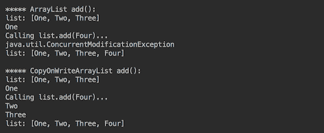

如您所见，`ArrayList`在遍历列表时修改列表会抛出`ConcurrentModificationException`（我们为了简单起见使用了相同的线程，并且因为它会导致相同的效果，就像另一个线程修改列表的情况一样）。然而，规范并不保证会抛出异常或应用列表修改（就像在我们的案例中一样），因此程序员不应将应用程序逻辑建立在这样的行为之上。另一方面，`CopyOnWriteArrayList`类容忍相同的干预；然而，请注意，它不会向当前列表添加新元素，因为迭代器是从底层数组的最新副本的快照中创建的。

现在我们尝试在遍历列表的同时并发地删除列表元素，使用此方法：

```java
        void demoListRemove(List<String> list) {
          System.out.println("list: " + list);
          try {
            for (String e : list) {
              System.out.println(e);
              if (list.contains("Two")) {
                System.out.println("Calling list.remove(Two)...");
                list.remove("Two");
              }
            }
          } catch (Exception ex) {
            System.out.println(ex.getClass().getName());
          }
          System.out.println("list: " + list);
        }
```

考虑以下代码：

```java
        System.out.println("***** ArrayList remove():");
        demoListRemove(new ArrayList<>(Arrays.asList("One", 
                                         "Two", "Three")));

        System.out.println();
        System.out.println("***** CopyOnWriteArrayList remove():");
        demoListRemove(new CopyOnWriteArrayList<>(Arrays
                                .asList("One", "Two", "Three")));

```

如果我们执行此操作，我们将得到以下结果：

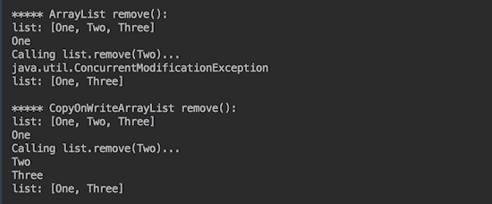

其行为与上一个例子类似。`CopyOnWriteArrayList`类容忍对列表的并发访问，但不会修改当前列表的副本。

我们知道`ArrayList`在很长时间内都不会是线程安全的，所以我们使用不同的技术来在遍历列表时删除元素。以下是 Java 8 发布之前是如何做到这一点的：

```java
        void demoListIterRemove(List<String> list) {
          System.out.println("list: " + list);
          try {
            Iterator iter = list.iterator();
            while (iter.hasNext()) {
              String e = (String) iter.next();
              System.out.println(e);
              if ("Two".equals(e)) {
                System.out.println("Calling iter.remove()...");
                iter.remove();
              }
            }
          } catch (Exception ex) {
              System.out.println(ex.getClass().getName());
          }
          System.out.println("list: " + list);
        }
```

让我们尝试运行此代码：

```java
        System.out.println("***** ArrayList iter.remove():");
        demoListIterRemove(new ArrayList<>(Arrays
                           .asList("One", "Two", "Three")));

        System.out.println();
        System.out.println("*****" 
                           + " CopyOnWriteArrayList iter.remove():");
        demoListIterRemove(new CopyOnWriteArrayList<>(Arrays
                           .asList("One", "Two", "Three")));

```

结果将如下所示：

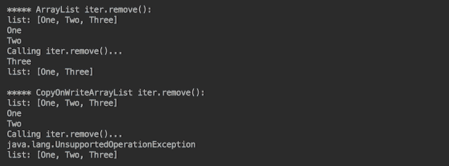

这正是 Javadoc 所警告的：“*迭代器本身的元素更改操作（remove、set 和 add）是不支持的。这些方法会抛出 UnsupportedOperationException。* 我们在升级应用程序以使其在多线程环境中工作时应记住这一点：如果我们使用迭代器删除列表元素，仅仅从`ArrayList()`更改为`CopyOnWriteArrayList`是不够的。

自 Java 8 以来，我们有了使用 lambda 从集合中删除元素的一种更好的方法，我们现在可以使用它（将管道细节留给库）：

```java
        void demoRemoveIf(Collection<String> collection) {
          System.out.println("collection: " + collection);
          System.out.println("Calling list.removeIf(e ->" 
                              + " Two.equals(e))...");
          collection.removeIf(e -> "Two".equals(e));
          System.out.println("collection: " + collection);
        }
```

所以让我们这样做：

```java
        System.out.println("***** ArrayList list.removeIf():");
        demoRemoveIf(new ArrayList<>(Arrays
                          .asList("One", "Two", "Three")));

        System.out.println();
        System.out.println("*****" 
                   + " CopyOnWriteArrayList list.removeIf():");
        demoRemoveIf(new CopyOnWriteArrayList<>(Arrays
                          .asList("One", "Two", "Three")));

```

上述代码的结果如下：


它很短，与任何集合都没有问题，并且符合使用带有 lambda 和函数式接口的无状态并行计算的一般趋势。

此外，在我们将应用程序升级到使用`CopyOnWriteArrayList`类之后，我们可以利用一种更简单的方法向列表中添加新元素（无需首先检查它是否已经存在）：

```java
        CopyOnWriteArrayList<String> list =  new CopyOnWriteArrayList<>
                              (Arrays.asList("Five", "Six", "Seven"));
        list.addIfAbsent("One");

```

使用`CopyOnWriteArrayList`，这可以作为一个原子操作来完成，因此不需要同步此代码块：if-not-present-then-add。

1.  现在，让我们回顾实现`Set`接口的`java.util.concurrent`包中的并发集合。这里有三种这样的实现：`ConcurrentHashMap.KeySetView`、`CopyOnWriteArraySet`和`ConcurrentSkipListSet`。

第一个只是一个 `ConcurrentHashMap` 的键的视图。它由 `ConcurrentHashMap` 支持（可以通过 `getMap()` 方法检索）。我们将在稍后回顾 `ConcurrentHashMap` 的行为。

`java.util.concurrent` 包中 `Set` 的第二个实现是 `CopyOnWriteArraySet` 类。其行为类似于 `CopyOnWriteArrayList` 类。实际上，它底层使用的是 `CopyOnWriteArrayList` 类的实现。唯一的区别是它不允许集合中有重复的元素。

`java.util.concurrent` 包中 `Set` 的第三个（也是最后一个）实现是 `ConcurrentSkipListSet`；它实现了 `Set` 的一个子接口，称为 `NavigableSet`。根据 `ConcurrentSkipListSet` 类的 Javadoc，插入、删除和访问操作可以由多个线程安全地并发执行。Javadoc 中也描述了一些限制：

+   +   它不允许使用 `null` 元素。

    +   集合的大小是通过遍历集合动态计算的，因此如果在操作期间修改此集合，可能会报告不准确的结果。

    +   操作 `addAll()`、`removeIf()` 或 `forEach()` 不保证原子执行。例如，如果与 `addAll()` 操作并发，`forEach()` 操作*可能只能观察到部分添加的元素*（如 Javadoc 中所述）。

`ConcurrentSkipListSet` 类的实现基于我们稍后将讨论的 `ConcurrentSkipListMap` 类。为了演示 `ConcurrentSkipListSet` 类的行为，让我们将其与 `java.util.TreeSet` 类（`NavigableSet` 的非并发实现）进行比较。我们首先尝试删除一个元素：

```java
        void demoNavigableSetRemove(NavigableSet<Integer> set) {
          System.out.println("set: " + set);
          try {
            for (int i : set) {
              System.out.println(i);
              System.out.println("Calling set.remove(2)...");
              set.remove(2);
            }
          } catch (Exception ex) {
            System.out.println(ex.getClass().getName());
          }
          System.out.println("set: " + set);
        }
```

当然，这段代码效率不高；我们没有检查其存在就多次删除了相同的元素。我们这样做只是为了演示目的。此外，自从 Java 8 以来，相同的 `removeIf()` 方法对 `Set` 也能正常工作。但我们要提出新类 `ConcurrentSkipListSet` 的行为，所以让我们执行以下代码：

```java
        System.out.println("***** TreeSet set.remove(2):");
        demoNavigableSetRemove(new TreeSet<>(Arrays
                                    .asList(0, 1, 2, 3)));

        System.out.println();
        System.out.println("*****"
                           + " ConcurrentSkipListSet set.remove(2):");
        demoNavigableSetRemove(new ConcurrentSkipListSet<>(Arrays
                                     .asList(0, 1, 2, 3)));

```

输出将如下所示：

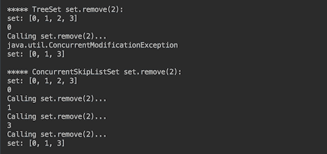

如预期，`ConcurrentSkipListSet` 类处理并发，甚至可以从当前集合中删除元素，这很有帮助。它还通过迭代器删除元素而不抛出异常。考虑以下代码：

```java
        void demoNavigableSetIterRemove(NavigableSet<Integer> set){
          System.out.println("set: " + set);
          try {
            Iterator iter = set.iterator();
            while (iter.hasNext()) {
              Integer e = (Integer) iter.next();
              System.out.println(e);
              if (e == 2) {
                System.out.println("Calling iter.remove()...");
                iter.remove();
              }
            }
          } catch (Exception ex) {
            System.out.println(ex.getClass().getName());
          }
          System.out.println("set: " + set);
        }
```

对 `TreeSet` 和 `ConcurrentSkipListSet` 运行此操作：

```java
        System.out.println("***** TreeSet iter.remove():");
        demoNavigableSetIterRemove(new TreeSet<>(Arrays
                                     .asList(0, 1, 2, 3)));

        System.out.println();
        System.out.println("*****"
                           + " ConcurrentSkipListSet iter.remove():");
        demoNavigableSetIterRemove(new ConcurrentSkipListSet<>(
                                  Arrays.asList(0, 1, 2, 3)));
```

我们不会得到任何异常：

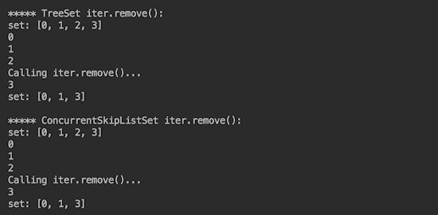

这是因为，根据 Javadoc，`ConcurrentSkipListSet` 的迭代器是弱一致的，这意味着以下（根据 Javadoc）：

+   +   它们可能与其他操作并发进行

    +   它们永远不会抛出 `ConcurrentModificationException`

    +   它们保证按构造时存在的元素顺序恰好遍历一次，并且可能（但不保证）反映构造之后（从 Javadoc 中）的任何修改。

这部分并不保证，但比抛出异常要好，例如使用`CopyOnWriteArrayList`时。

向`Set`类添加内容不像向`List`类添加那样有问题，因为`Set`不允许重复，并且内部处理必要的检查：

```java
        void demoNavigableSetAdd(NavigableSet<Integer> set) {
          System.out.println("set: " + set);
          try {
            int m = set.stream().max(Comparator.naturalOrder())
                                .get() + 1;
            for (int i : set) {
              System.out.println(i);
              System.out.println("Calling set.add(" + m + ")");
              set.add(m++);
              if (m > 6) {
                break;
              }
            }
          } catch (Exception ex) {
            System.out.println(ex.getClass().getName());
          }
          System.out.println("set: " + set);
        }
```

考虑以下代码：

```java
        System.out.println("***** TreeSet set.add():");
        demoNavigableSetAdd(new TreeSet<>(Arrays
                                     .asList(0, 1, 2, 3)));

        System.out.println();
        System.out.println("*****" 
                            + " ConcurrentSkipListSet set.add():");
        demoNavigableSetAdd(new ConcurrentSkipListSet<>(Arrays
                                        .asList(0,1,2,3)));

```

如果我们运行这个，我们会得到以下结果：

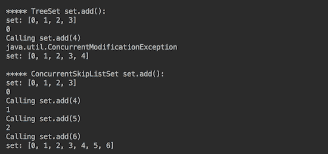

如前所述，我们观察到并发`Set`版本在处理并发方面表现更好。

1.  现在我们转向`Map`接口，它在`java.util.concurrent`包中有两个实现：`ConcurrentHashMap`和`ConcurrentSkipListMap`。

`ConcurrentHashMap`类*支持完全的检索并发性和高并发更新*（来自 Javadoc）。它是`java.util.HashMap`的线程安全版本，在这方面与`java.util.Hashtable`类似。实际上，`ConcurrentHashMap`类满足与`java.util.Hashtable`相同的函数规范，尽管其实现细节在同步方面*有所不同*（来自 Javadoc）。

与`java.util.HashMap`和`java.util.Hashtable`不同，`ConcurrentHashMap`根据 JavaDoc，*支持一系列顺序和并行批量操作，与大多数 Stream 方法不同，即使是在其他线程并发更新映射的情况下，也可以安全地、通常是有意义地应用*：

+   +   `forEach()`: 这个方法对每个元素执行给定的操作

    +   `search()`: 这个方法返回将给定函数应用于每个元素后的第一个非空结果

    +   `reduce()`: 这个方法累积每个元素（有五种重载版本）

这些批量操作接受一个`parallelismThreshold`参数，允许在映射大小达到指定的阈值之前延迟并行化。自然地，当阈值设置为`Long.MAX_VALUE`时，将没有任何并行化。

类 API 中还有许多其他方法，因此请参阅其 Javadoc 以获取概述。

与`java.util.HashMap`（类似于`java.util.Hashtable`）不同，`ConcurrentHashMap`和`ConcurrentSkipListMap`都不允许使用 null 作为键或值。

`Map`的第二个实现——`ConcurrentSkipListSet`类——基于我们之前提到的`ConcurrentSkipListMap`类，因此我们刚才描述的`ConcurrentSkipListSet`类的所有限制也适用于`ConcurrentSkipListMap`类。`ConcurrentSkipListSet`类实际上是一个线程安全的`java.util.TreeMap`版本。`SkipList`是一种排序数据结构，允许并发快速搜索。所有元素都是根据其键的自然排序顺序排序的。我们在`ConcurrentSkipListSet`类中演示的`NavigableSet`功能也存在于`ConcurrentSkipListMap`类中。对于类 API 中的许多其他方法，请参阅其 Javadoc。

现在，让我们演示 `java.util.HashMap`、`ConcurrentHashMap` 和 `ConcurrentSkipListMap` 类在响应并发行为方面的差异。首先，我们将编写生成测试 `Map` 对象的方法：

```java
        Map createhMap() {
          Map<Integer, String> map = new HashMap<>();
          map.put(0, "Zero");
          map.put(1, "One");
          map.put(2, "Two");
          map.put(3, "Three");
          return map;
       }
```

这里是向 `Map` 对象并发添加元素的代码：

```java
        void demoMapPut(Map<Integer, String> map) {
          System.out.println("map: " + map);
          try {
            Set<Integer> keys = map.keySet();
            for (int i : keys) {
              System.out.println(i);
              System.out.println("Calling map.put(8, Eight)...");
              map.put(8, "Eight");

              System.out.println("map: " + map);
              System.out.println("Calling map.put(8, Eight)...");
              map.put(8, "Eight");

              System.out.println("map: " + map);
              System.out.println("Calling" 
                                 + " map.putIfAbsent(9, Nine)...");
              map.putIfAbsent(9, "Nine");

              System.out.println("map: " + map);
              System.out.println("Calling" 
                                 + " map.putIfAbsent(9, Nine)...");
              map.putIfAbsent(9, "Nine");

              System.out.println("keys.size(): " + keys.size());
              System.out.println("map: " + map);
            }
          } catch (Exception ex) {
            System.out.println(ex.getClass().getName());
          }
        }
```

对 `Map` 的三种实现都运行此代码：

```java
        System.out.println("***** HashMap map.put():");
        demoMapPut(createhMap());

        System.out.println();
        System.out.println("***** ConcurrentHashMap map.put():");
        demoMapPut(new ConcurrentHashMap(createhMap()));

        System.out.println();
        System.out.println("*****"
                          + " ConcurrentSkipListMap map.put():");
        demoMapPut(new ConcurrentSkipListMap(createhMap()));

```

如果我们这样做，我们只会得到 `HashMap` 的第一个键的输出：

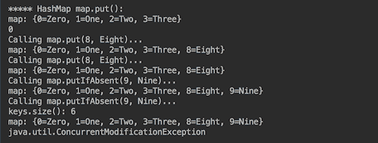

我们还得到了 `ConcurrentHashMap` 和 `ConcurrentSkipListMap` 的输出，包括新添加的键。以下是 `ConcurrentHashMap` 输出的最后部分：

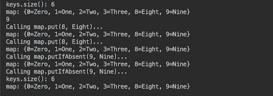

如前所述，`ConcurrentModificationException` 的出现并不保证。现在我们看到（如果有的话），它被抛出的时刻（如果有的话）是代码发现修改发生的时刻。在我们的例子中，它发生在下一次迭代时。另一个值得注意的点是，即使我们在一个单独的变量中某种程度上隔离了集合，当前的键集也会发生变化：

```java
      Set<Integer> keys = map.keySet();
```

这提醒我们不要忽视通过对象的引用传播的变化。

为了节省书籍空间和您的宝贵时间，我们将不展示并发删除的代码，而是仅总结结果。正如预期的那样，当以以下任何一种方式删除元素时，`HashMap` 会抛出 `ConcurrentModificationException` 异常。以下是第一种方法：

```java
        String result = map.remove(2);

```

这里是第二种方法：

```java
        boolean success = map.remove(2, "Two");
```

它允许通过 `Iterator` 以两种方式并发删除。以下是第一种方法：

```java
         iter.remove();
```

然后是第二种方法：

```java
         boolean result = map.keySet().remove(2);
```

这里是第三种方法：

```java
        boolean result = map.keySet().removeIf(e -> e == 2);
```

相比之下，这两个并发的 `Map` 实现允许并发执行上述任何一种删除方式。

所有 `Queue` 接口的并发实现也表现出类似的行为：`LinkedTransferQueue`、`LinkedBlockingQueue`、`LinkedBlockingDequeue`、`ArrayBlockingQueue`、`PriorityBlockingQueue`、`DelayQueue`、`SynchronousQueue`、`ConcurrentLinkedQueue` 和 `ConcurrentLinkedDequeue`，所有这些都在 `java.util.concurrent` 包中。但要演示所有这些就需要另一本书，所以我们留给您去浏览 Javadoc，并提供 `ArrayBlockingQueue` 的一个示例。队列将由 `QueueElement` 类表示：

```java
         class QueueElement {
           private String value;
           public QueueElement(String value){
             this.value = value;
           }
           public String getValue() {
             return value;
           }
         }
```

队列生产者将如下所示：

```java
        class QueueProducer implements Runnable {
          int intervalMs, consumersCount;
          private BlockingQueue<QueueElement> queue;
          public QueueProducer(int intervalMs, int consumersCount, 
                               BlockingQueue<QueueElement> queue) {
            this.consumersCount = consumersCount;
            this.intervalMs = intervalMs;
            this.queue = queue;
          }
          public void run() {
            List<String> list = 
               List.of("One","Two","Three","Four","Five");
            try {
              for (String e : list) {
                Thread.sleep(intervalMs);
                queue.put(new QueueElement(e));
                System.out.println(e + " produced" );
              }
              for(int i = 0; i < consumersCount; i++){
                queue.put(new QueueElement("Stop"));
              }
            } catch (InterruptedException e) {
              e.printStackTrace();
            }
           }
         }
```

下面的将是队列消费者：

```java
        class QueueConsumer implements Runnable{
          private String name;
          private int intervalMs;
          private BlockingQueue<QueueElement> queue;
          public QueueConsumer(String name, int intervalMs, 
                               BlockingQueue<QueueElement> queue){
             this.intervalMs = intervalMs;
             this.queue = queue;
             this.name = name;
          }
          public void run() {
            try {
              while(true){
                String value = queue.take().getValue();
                if("Stop".equals(value)){
                  break;
                }
                System.out.println(value + " consumed by " + name);
                Thread.sleep(intervalMs);
              }
            } catch(InterruptedException e) {
              e.printStackTrace();
            }
          }
        }
```

运行以下代码：

```java
        BlockingQueue<QueueElement> queue = 
                      new ArrayBlockingQueue<>(5);
        QueueProducer producer = new QueueProducer(queue);
        QueueConsumer consumer = new QueueConsumer(queue);
        new Thread(producer).start();
        new Thread(consumer).start();

```

其结果可能看起来像这样：

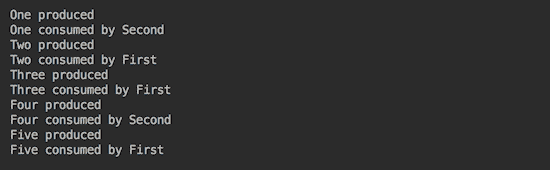

# 它是如何工作的...

在我们选择要使用的集合之前，阅读 Javadoc 并查看集合的限制是否适合您的应用程序。

例如，根据 Javadoc，`CopyOnWriteArrayList`类*通常成本较高，但在遍历操作远多于突变时可能比替代方案更有效，当无法或不想同步遍历，但需要防止并发线程之间的干扰时很有用。当不需要在不同位置添加新元素且不需要排序时，请使用它。否则，使用`ConcurrentSkipListSet`。

根据 Javadoc，`ConcurrentSkipListSet`和`ConcurrentSkipListMap`类*提供预期的平均对数(n)时间成本，用于包含、添加和删除操作及其变体。升序视图及其迭代器比降序视图更快。当需要快速迭代特定顺序的元素并默认排序时，请使用它们。

当并发需求非常严格，并且需要在写操作上允许加锁但不需要锁定元素时，请使用`ConcurrentHashMap`。

`ConcurrentLinkedQueque`和`ConcurrentLinkedDeque`是当许多线程共享对公共集合的访问时的一个合适选择。`ConcurrentLinkedQueque`采用一个高效的非阻塞算法。

当自然顺序可接受且需要快速向队列尾部添加元素和从队列头部快速删除元素时，`PriorityBlockingQueue`是一个更好的选择。阻塞意味着在检索元素时队列等待变为非空，在存储元素时等待队列中有空间可用。

`ArrayBlockingQueue`、`LinkedBlockingQueue`和`LinkedBlockingDeque`具有固定大小（有界）。其他队列是无界的。

使用这些和类似的特点及建议作为指导方针，但在实现功能前后进行全面的测试和性能测量。

# 参见

参考本章以下菜谱：

+   使用执行器服务执行异步任务

+   使用分治法实现 fork/join

+   使用流实现发布-订阅模式

# 使用执行器服务执行异步任务

在这个菜谱中，你将学习如何使用`ExecutorService`来实现可控的线程执行。

# 准备工作

在之前的配方中，我们展示了如何直接使用 `Thread` 类创建和执行线程。对于少量运行并快速产生可预测结果的线程来说，这是一个可接受的机制。对于具有较长时间运行线程、复杂逻辑（可能使它们存活时间不可预测地长）以及线程数量不可预测地增长的大规模应用程序，简单的创建和运行直到退出的方法可能会导致 `OutOfMemory` 错误或需要复杂的自定义线程状态维护和管理系统。对于此类情况，`ExecutorService` 和 `java.util.concurrent` 包中的相关类提供了一种现成的解决方案，可以减轻程序员编写和维护大量基础设施代码的需要。

执行器框架的基础是一个 `Executor` 接口，它只有一个 `void execute(Runnable command)` 方法，该方法将在未来的某个时间执行给定的命令。

其子接口 `ExecutorService` 添加了允许你管理执行器的方法：

+   `invokeAny()`、`invokeAll()`、`awaitTermination()` 方法以及 `submit()` 允许你定义线程的执行方式以及它们是否预期返回某些值。

+   `shutdown()` 和 `shutdownNow()` 方法允许你关闭执行器。

+   `isShutdown()` 和 `isTerminated()` 方法提供了执行器状态。

可以使用 `java.util.concurrent.Executors` 类的静态工厂方法创建 `ExecutorService` 对象：

+   `newSingleThreadExecutor()` - 这创建了一个使用单个工作线程并操作无界队列的 `Executor` 方法。它有一个带有 `ThreadFactory` 参数的重载版本。

+   `newCachedThreadPool()` - 这将创建一个线程池，根据需要创建新线程，但在可用时重用先前构建的线程。它有一个带有 `ThreadFactory` 参数的重载版本。

+   `newFixedThreadPool(int nThreads)` - 这将创建一个线程池，它重用固定数量的线程，这些线程在一个共享的无界队列上操作。它有一个带有 `ThreadFactory` 参数的重载版本。

`ThreadFactory` 实现允许你覆盖创建新线程的过程，使应用程序能够使用特殊的线程子类、优先级等。其使用示例超出了本书的范围。

# 如何做到这一点...

1.  你需要记住 `Executor` 接口行为的一个重要方面是，一旦创建，它就会继续运行（等待执行新任务），直到 Java 进程停止。因此，如果你想释放内存，必须显式停止 `Executor` 接口。如果不关闭，被遗忘的执行器将导致内存泄漏。以下是一个确保没有执行器被遗留的方法：

```java
        int shutdownDelaySec = 1;
        ExecutorService execService = 
                       Executors.newSingleThreadExecutor();
        Runnable runnable =  () -> System.out.println("Worker One did
                                                       the job.");
        execService.execute(runnable);
        runnable =   () -> System.out.println("Worker Two did the 
                                               job.");
        Future future = execService.submit(runnable);
        try {
          execService.shutdown();
          execService.awaitTermination(shutdownDelaySec, 
                                       TimeUnit.SECONDS);
        } catch (Exception ex) {
          System.out.println("Caught around" 
                  + " execService.awaitTermination(): " 
                  + ex.getClass().getName());
        } finally {
          if (!execService.isTerminated()) {
            if (future != null && !future.isDone() 
                               && !future.isCancelled()){
              System.out.println("Cancelling the task...");
              future.cancel(true);
            }
          }
          List<Runnable> l = execService.shutdownNow();
          System.out.println(l.size() 
                 + " tasks were waiting to be executed." 
                 + " Service stopped.");
        }
```

您可以通过多种方式将工作者（`Runnable` 或 `Callable` 函数式接口的实现）传递给 `ExecutorService` 以进行执行，我们将在稍后看到。在这个例子中，我们执行了两个线程：一个使用 `execute()` 方法，另一个使用 `submit()` 方法。两种方法都接受 `Runnable` 或 `Callable`，但在这个例子中我们只使用了 `Runnable`。`submit()` 方法返回 `Future`，它表示异步计算的结果。

`shutdown()` 方法启动先前提交任务的有序关闭，并阻止接受任何新任务。此方法不会等待任务完成执行。`awaitTermination()` 方法会这样做。但是，在 `shutdownDelaySec` 之后，它停止阻塞，代码流程进入 `finally` 块，其中 `isTerminated()` 方法在所有任务在关闭后完成时返回 `true`。在这个例子中，我们执行了两个不同的语句中的两个任务，但请注意，`ExecutorService` 的其他方法接受任务集合。

在这种情况下，当服务正在关闭时，我们遍历 `Future` 对象的集合。我们调用每个任务，如果它尚未完成，则取消它，可能还会执行在取消任务之前必须执行的其他操作。等待时间（`shutdownDelaySec` 的值）必须为每个应用程序和可能的运行任务进行测试。

最后，`shutdownNow()` 方法表示：*尝试停止所有正在执行的任务，停止等待任务的执行，并返回等待执行的任务列表*（根据 Javadoc）。

1.  现在我们可以收集和评估结果。在实际应用中，我们通常不希望频繁地关闭服务。我们只是检查任务的状况，并收集从 `isDone()` 方法返回 true 的那些任务的结果。在上面的代码示例中，我们只是展示了当我们确实停止服务时，我们如何确保以一种受控的方式停止，而不留下任何失控的进程。如果我们运行这个代码示例，我们将得到以下结果：


1.  将前面的代码泛化，创建一个关闭服务和已返回 `Future` 的任务的方法：

```java
        void shutdownAndCancelTask(ExecutorService execService, 
                  int shutdownDelaySec, String name, Future future) {
          try {
            execService.shutdown();
            System.out.println("Waiting for " + shutdownDelaySec 
                         + " sec before shutting down service...");
            execService.awaitTermination(shutdownDelaySec,
                                         TimeUnit.SECONDS);
          } catch (Exception ex) {
            System.out.println("Caught around" 
                        + " execService.awaitTermination():" 
                        + ex.getClass().getName());
         } finally {
           if (!execService.isTerminated()) {
             System.out.println("Terminating remaining tasks...");
             if (future != null && !future.isDone() 
                                && !future.isCancelled()) {
               System.out.println("Cancelling task " 
                                  + name + "...");
               future.cancel(true);
             }
           }
           System.out.println("Calling execService.shutdownNow(" 
                              + name + ")...");
           List<Runnable> l = execService.shutdownNow();
           System.out.println(l.size() + " tasks were waiting" 
                         + " to be executed. Service stopped.");
         }
       }
```

1.  通过让 `Runnable`（使用 lambda 表达式）睡眠一段时间（模拟要执行的有用工作）来增强示例：

```java
        void executeAndSubmit(ExecutorService execService, 
                    int shutdownDelaySec, int threadSleepsSec) {
          System.out.println("shutdownDelaySec = " 
                            + shutdownDelaySec + ", threadSleepsSec = " 
                            + threadSleepsSec);
          Runnable runnable = () -> {
            try {
              Thread.sleep(threadSleepsSec * 1000);
              System.out.println("Worker One did the job.");
            } catch (Exception ex) {
              System.out.println("Caught around One Thread.sleep(): " 
                                 + ex.getClass().getName());
            }
          };
          execService.execute(runnable);
          runnable = () -> {
            try {
              Thread.sleep(threadSleepsSec * 1000);
              System.out.println("Worker Two did the job.");
            } catch (Exception ex) {
              System.out.println("Caught around Two Thread.sleep(): " 
                                 + ex.getClass().getName());
            }
          };
          Future future = execService.submit(runnable);
          shutdownAndCancelTask(execService, shutdownDelaySec, 
                                "Two", future);
        }
```

注意两个参数：`shutdownDelaySec`（定义服务在继续并最终关闭自身之前将等待多长时间，不允许提交新任务）和 `threadSleepSec`（定义工作线程将睡眠多长时间，表示模拟的过程正在执行其工作）。

1.  为不同的 `ExecutorService` 实现和 `shutdownDelaySec`、`threadSleepSec` 的值运行新代码：

```java
        System.out.println("Executors.newSingleThreadExecutor():");
        ExecutorService execService = 
                       Executors.newSingleThreadExecutor();
        executeAndSubmit(execService, 3, 1);

        System.out.println();
        System.out.println("Executors.newCachedThreadPool():");
        execService = Executors.newCachedThreadPool();
        executeAndSubmit(execService, 3, 1);

        System.out.println();
        int poolSize = 3;
        System.out.println("Executors.newFixedThreadPool(" 
                                            + poolSize + "):");
        execService = Executors.newFixedThreadPool(poolSize);
        executeAndSubmit(execService, 3, 1);

```

这就是输出可能的样子（它可能因操作系统控制的事件的确切时间而略有不同）：

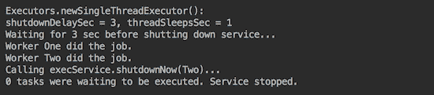

1.  分析结果。在第一个例子中，我们没有发现任何惊喜，因为以下行：

```java
        execService.awaitTermination(shutdownDelaySec, 
                                     TimeUnit.SECONDS);

```

它阻塞了三秒钟，而每个工作者只需工作一秒钟。所以对于单线程执行器来说，这已经足够每个工作者完成其工作了。

让我们让服务只等待一秒钟：

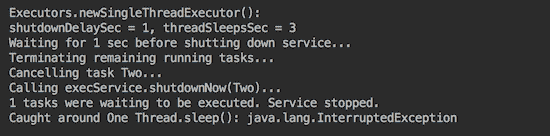

当你这样做时，你会发现没有任何任务会被完成。在这种情况下，工作者`One`被中断（见输出的最后一行），而任务`Two`被取消。

让我们让服务等待三秒钟：

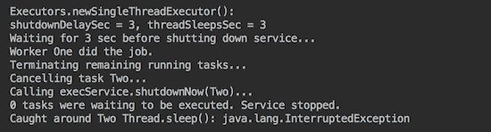

现在，我们看到工作者`One`能够完成其任务，而工作者`Two`被中断了。

由`newCachedThreadPool()`或`newFixedThreadPool()`生成的`ExecutorService`接口在一个核心计算机上表现相似。唯一的显著区别是，如果`shutdownDelaySec`值等于`threadSleepSec`值，那么它们都允许你完成线程：

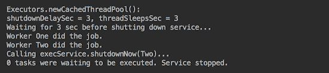

这是使用`newCachedThreadPool()`的结果。在一个核心计算机上，使用`newFixedThreadPool()`的示例输出看起来完全一样。

1.  当你需要对任务有更多控制时，使用`Future`对象作为返回值，而不仅仅是提交一个并等待。`ExecutorService`接口中还有一个名为`submit()`的方法，它允许你不仅返回一个`Future`对象，还可以将作为方法第二个参数传递的结果包含在返回对象中。让我们看看这个例子：

```java
        Future<Integer> future = execService.submit(() -> 
               System.out.println("Worker 42 did the job."), 42);
        int result = future.get();

```

`result`的值是`42`。这个方法在你提交了许多工作者（`nWorkers`）并需要知道哪个完成了时可能很有用：

```java
        Set<Integer> set = new HashSet<>();
        while (set.size() < nWorkers){
          for (Future<Integer> future : futures) {
            if (future.isDone()){
              try {
                String id = future.get(1, TimeUnit.SECONDS);
                if(!set.contains(id)){
                  System.out.println("Task " + id + " is done.");
                  set.add(id);
                }
              } catch (Exception ex) {
                System.out.println("Caught around future.get(): "
                                   + ex.getClass().getName());
              }
            }
          }
        }
```

嗯，问题是`future.get()`是一个阻塞方法。这就是为什么我们使用一个允许我们设置`delaySec`超时的`get()`方法版本。否则，`get()`会阻塞迭代。

# 它是如何工作的...

让我们更接近现实代码，创建一个实现`Callable`并允许你将工作者的结果作为`Result`类对象的类：

```java
class Result {
  private int sleepSec, result;
  private String workerName;
  public Result(String workerName, int sleptSec, int result) {
    this.workerName = workerName;
    this.sleepSec = sleptSec;
    this.result = result;
  }
  public String getWorkerName() { return this.workerName; }
  public int getSleepSec() { return this.sleepSec; }
  public int getResult() { return this.result; }
}
```

`getResult()`方法返回一个实际的数值结果。在这里，我们也包括了工作者的名称和线程预期休眠（工作）的时间，只是为了方便和更好地说明输出。

工作者本身将是`CallableWorkerImpl`类的一个实例：

```java
class CallableWorkerImpl implements CallableWorker<Result>{
  private int sleepSec;
  private String name;
  public CallableWorkerImpl(String name, int sleepSec) {
    this.name = name;
    this.sleepSec = sleepSec;
  }
  public String getName() { return this.name; }
  public int getSleepSec() { return this.sleepSec; }
  public Result call() {
    try {
      Thread.sleep(sleepSec * 1000);
    } catch (Exception ex) {
      System.out.println("Caught in CallableWorker: " 
                         + ex.getClass().getName());
    }
    return new Result(name, sleepSec, 42);
  }
}
```

在这里，数字`42`是一个实际的数值结果，一个工作者在睡眠时可能计算出的结果。`CallableWorkerImpl`类实现了`CallableWorker`接口：

```java
interface CallableWorker<Result> extends Callable<Result> {
  default String getName() { return "Anonymous"; }
  default int getSleepSec() { return 1; }
}
```

我们不得不将这些方法设为默认并返回一些数据（它们将由类实现覆盖）以保留其`functional interface`状态。否则，我们就无法在 lambda 表达式中使用它。

我们还将创建一个工厂，该工厂将生成工作者列表：

```java
List<CallableWorker<Result>> createListOfCallables(int nSec){
  return List.of(new CallableWorkerImpl("One", nSec),
                 new CallableWorkerImpl("Two", 2 * nSec),
                 new CallableWorkerImpl("Three", 3 * nSec));
}
```

现在我们可以使用所有这些新类和方法来演示`invokeAll()`方法：

```java
void invokeAllCallables(ExecutorService execService, 
        int shutdownDelaySec, List<CallableWorker<Result>> callables) {
  List<Future<Result>> futures = new ArrayList<>();
  try {
    futures = execService.invokeAll(callables, shutdownDelaySec, 
                                    TimeUnit.SECONDS);
  } catch (Exception ex) {
    System.out.println("Caught around execService.invokeAll(): " 
                       + ex.getClass().getName());
  }
  try {
    execService.shutdown();
    System.out.println("Waiting for " + shutdownDelaySec 
                       + " sec before terminating all tasks...");
    execService.awaitTermination(shutdownDelaySec,
                                 TimeUnit.SECONDS);
  } catch (Exception ex) {
    System.out.println("Caught around awaitTermination(): " 
                       + ex.getClass().getName());
  } finally {
    if (!execService.isTerminated()) {
      System.out.println("Terminating remaining tasks...");
      for (Future<Result> future : futures) {
        if (!future.isDone() && !future.isCancelled()) {
          try {
            System.out.println("Cancelling task "
                       + future.get(shutdownDelaySec, 
                               TimeUnit.SECONDS).getWorkerName());
            future.cancel(true);
          } catch (Exception ex) {
            System.out.println("Caught at cancelling task: " 
                               + ex.getClass().getName());
          }
        }
      }
    }
    System.out.println("Calling execService.shutdownNow()...");
    execService.shutdownNow();
  }
  printResults(futures, shutdownDelaySec);
}
```

`printResults()`方法输出从工作者那里接收到的结果：

```java
void printResults(List<Future<Result>> futures, int timeoutSec) {
  System.out.println("Results from futures:");
  if (futures == null || futures.size() == 0) {
    System.out.println("No results. Futures" 
                       + (futures == null ? " = null" : ".size()=0"));
  } else {
    for (Future<Result> future : futures) {
      try {
        if (future.isCancelled()) {
          System.out.println("Worker is cancelled.");
        } else {
          Result result = future.get(timeoutSec, TimeUnit.SECONDS);
          System.out.println("Worker "+ result.getWorkerName() + 
                             " slept " + result.getSleepSec() + 
                             " sec. Result = " + result.getResult());
        }
      } catch (Exception ex) {
        System.out.println("Caught while getting result: " 
                           + ex.getClass().getName());
      }
    }
  }
}
```

为了获取结果，我们再次使用具有超时设置的`get()`方法版本。运行以下代码：

```java
List<CallableWorker<Result>> callables = createListOfCallables(1);
System.out.println("Executors.newSingleThreadExecutor():");
ExecutorService execService = Executors.newSingleThreadExecutor();
invokeAllCallables(execService, 1, callables);

```

其输出将如下所示：


可能值得提醒的是，三个工作者分别以 1 秒、2 秒和 3 秒的睡眠时间创建，而服务关闭前的等待时间是 1 秒。这就是为什么所有工作者都被取消的原因。

现在如果我们把等待时间设置为六秒，单线程执行器的输出将如下所示：

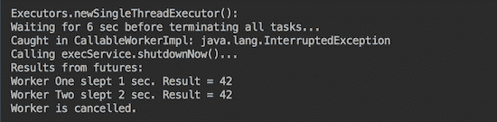

自然地，如果我们再次增加等待时间，所有工作者都将能够完成他们的任务。

由`newCachedThreadPool()`或`newFixedThreadPool()`生成的`ExecutorService`接口，即使在单核计算机上也能表现得更好：

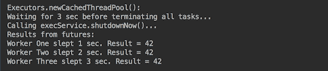

如您所见，所有线程即使在等待了三秒钟之后也能完成任务。

作为一种替代方案，你可以在服务关闭期间而不是设置超时，可能设置在`invokeAll()`方法的重载版本上：

```java
List<Future<T>> invokeAll(Collection<? extends Callable<T>> tasks,
                          long timeout, TimeUnit unit)
```

`invokeAll()`方法的一个特定行为常常被忽视，并给初次用户带来惊喜：它只有在所有任务都完成（无论是正常完成还是通过抛出异常）之后才返回。请阅读 Javadoc 并实验，直到你认识到这种行为对你的应用程序是可接受的。

相比之下，`invokeAny()`方法只阻塞到至少有一个任务成功完成（没有抛出异常），如果有任何任务的话。在正常或异常返回时，未完成的任务将被取消（根据 Javadoc）。以下是一个实现此功能的代码示例：

```java
void invokeAnyCallables(ExecutorService execService, 
        int shutdownDelaySec, List<CallableWorker<Result>> callables) {
  Result result = null;
  try {
    result = execService.invokeAny(callables, shutdownDelaySec,                                    TimeUnit.SECONDS);
  } catch (Exception ex) {
    System.out.println("Caught around execService.invokeAny(): " 
                       + ex.getClass().getName());
  }
  shutdownAndCancelTasks(execService, shutdownDelaySec,
                         new ArrayList<>());
  if (result == null) {
    System.out.println("No result from execService.invokeAny()");
  } else {
    System.out.println("Worker " + result.getWorkerName() + 
                       " slept " + result.getSleepSec() + 
                       " sec. Result = " + result.getResult());
  }
}
```

你可以尝试设置不同的等待时间（`shutdownDelaySec`）和线程的睡眠时间，直到你对这个方法的行为感到满意。如您所见，我们通过传递一个空的`Future`对象列表来重用了`shutdownAndCancelTasks()`方法，因为我们在这个情况下没有这些对象。

# 还有更多...

在`Executors`类中还有两个更多的静态工厂方法，用于创建`ExecutorService`的实例：

+   `newWorkStealingPool()`: 这将创建一个使用可用处理器数量作为其目标并行级别的线程池。它有一个带有并行级别参数的重载版本。

+   `unconfigurableExecutorService(ExecutorService executor)`: 这返回一个对象，将所有定义的 `ExecutorService` 方法委托给给定的执行器，但不包括那些可能通过类型转换访问的方法。

此外，`ExecutorService` 接口的一个子接口，称为 `ScheduledExecutorService`，通过提供在将来调度线程执行和/或其周期性执行的能力来增强 API。

可以使用 `java.util.concurrent.Executors` 类的静态工厂方法创建 `ScheduledExecutorService` 对象：

+   `newSingleThreadScheduledExecutor()`: 这创建一个单线程执行器，可以调度在给定延迟后运行或周期性执行的命令。它有一个带有 `ThreadFactory` 参数的重载版本。

+   `newScheduledThreadPool(int corePoolSize)`: 这创建一个线程池，可以调度在给定延迟后运行或周期性执行的命令。它有一个带有 `ThreadFactory` 参数的重载版本。

+   `unconfigurableScheduledExecutorService(ScheduledExecutorService executor)`: 这返回一个对象，将所有定义的 `ScheduledExecutorService` 方法委托给给定的执行器，但不包括那些可能通过类型转换访问的其他方法。

`Executors` 类也有几个重载方法，可以接受、执行并返回 `Callable`（与 `Runnable` 相比，它包含结果）。

`java.util.concurrent` 包还包括实现 `ExecutorService` 的类：

+   **ThreadPoolExecutor 类**：这个类使用几个池化线程中的任何一个来执行每个提交的任务，通常使用 `Executors` 工厂方法配置。

+   **ScheduledThreadPoolExecutor 类**：这个类扩展了 `ThreadPoolExecutor` 类并实现了 `ScheduledExecutorService` 接口。

+   **ForkJoinPool 类**：这个类使用工作窃取算法管理工作者的执行（`ForkJoinTask` 进程）。我们将在下一个食谱中讨论它。

这些类的实例可以通过接受更多参数的类构造函数创建，包括用于存储结果的队列，以提供更精细的线程池管理。

# 参见

参考本章以下食谱：

+   使用 fork/join 实现分而治之

+   使用流程实现发布-订阅模式

# 使用 fork/join 实现分而治之

在这个食谱中，你将学习如何使用 fork/join 框架来实现分而治之计算模式。

# 准备工作

如前一个食谱中提到的，`ForkJoinPool` 类是 `ExecutorService` 接口的一个实现，它使用工作窃取算法管理工作者的执行--`ForkJoinTask` 进程。它利用可用的多个处理器，并在可以递归分解为更小任务的任务上表现最佳，这也就是所谓的 *分而治之* 策略。

池中的每个线程都有一个专用的双端队列（deque），用于存储任务，线程在完成当前任务后立即从队列头部获取下一个任务。当另一个线程完成其队列中的所有任务时，它可以从另一个非空队列的尾部窃取一个任务。

与任何`ExecutorService`实现一样，fork/join 框架将任务分配给线程池中的工作线程。这个框架的独特之处在于它使用了一个工作窃取算法。当工作线程耗尽任务时，可以从仍然忙碌的其他线程那里窃取任务。

这样的设计平衡了负载，并允许高效地使用资源。

为了演示目的，我们将使用在第三章中创建的 API，*模块化编程*：`TrafficUnit`、`SpeedModel`和`Vehicle`接口以及`TrafficUnitWrapper`、`FactoryTraffic`、`FactoryVehicle`和`FactorySpeedModel`类。我们还将依赖第三章中描述的流和流管道，*模块化编程*。

为了刷新你的记忆，以下是`TrafficUnitWrapper`类：

```java
class TrafficUnitWrapper {
  private double speed;
  private Vehicle vehicle;
  private TrafficUnit trafficUnit;
  public TrafficUnitWrapper(TrafficUnit trafficUnit){
    this.trafficUnit = trafficUnit;
    this.vehicle = FactoryVehicle.build(trafficUnit);
  }
  public TrafficUnitWrapper setSpeedModel(SpeedModel speedModel) {
    this.vehicle.setSpeedModel(speedModel);
    return this;
  }
  TrafficUnit getTrafficUnit(){ return this.trafficUnit;}
  public double getSpeed() { return speed; }

  public TrafficUnitWrapper calcSpeed(double timeSec) {
    double speed = this.vehicle.getSpeedMph(timeSec);
    this.speed = Math.round(speed * this.trafficUnit.getTraction());
    return this;
  }
}
```

我们还将稍微修改现有的 API 接口，通过引入一个新的`DateLocation`类使其更加紧凑：

```java
class DateLocation {
  private int hour;
  private Month month;
  private DayOfWeek dayOfWeek;
  private String country, city, trafficLight;

  public DateLocation(Month month, DayOfWeek dayOfWeek, 
                      int hour, String country, String city, 
                      String trafficLight) {
    this.hour = hour;
    this.month = month;
    this.dayOfWeek = dayOfWeek;
    this.country = country;
    this.city = city;
    this.trafficLight = trafficLight;
  }
  public int getHour() { return hour; }
  public Month getMonth() { return month; }
  public DayOfWeek getDayOfWeek() { return dayOfWeek; }
  public String getCountry() { return country; }
  public String getCity() { return city; }
  public String getTrafficLight() { return trafficLight;}
}
```

它还将允许你隐藏细节，并帮助你看到这个菜谱的重要方面。

# 如何实现...

所有计算都被封装在`ForkJoinTask`类的两个子类（`RecursiveAction`或`RecursiveTask<T>`）之一的子类中。你可以扩展`RecursiveAction`（并实现`void compute()`方法）或`RecursiveTask<T>`（并实现`T compute()`方法）。正如你可能已经注意到的，你可以选择扩展`RecursiveAction`类来处理不返回任何值的任务，当你需要任务返回值时扩展`RecursiveTask<T>`。在我们的演示中，我们将使用后者，因为它稍微复杂一些。

假设我们想要计算在特定日期和时间以及驾驶条件下（所有这些参数都由`DateLocation`对象定义）某个地点的交通平均速度。其他参数如下：

+   `timeSec`：车辆在停止在交通灯后有机会加速的秒数

+   `trafficUnitsNumber`：用于平均速度计算的车辆数量

自然地，包含在计算中的车辆越多，预测就越好。但随着这个数字的增加，计算的数量也会增加。这产生了将车辆数量分解成更小组并与其他组并行计算每个组平均速度的需要。然而，存在一个计算的最小数量，不值得在两个线程之间分割。以下是 Javadoc 对此的说明：*作为一个非常粗略的经验法则，一个任务应该执行超过 100 次和少于 10000 次基本计算步骤，并应避免无限循环。如果任务太大，那么并行化不能提高吞吐量。如果太小，那么内存和内部任务维护开销可能会压倒处理能力。*然而，像往常一样，关于最佳最小计算数量而不分割的最终答案将来自测试。这就是我们建议将其作为参数传递的原因。我们将把这个参数命名为 `threshold`。请注意，它也作为退出递归的标准。

我们将把我们的类（任务）命名为 `AverageSpeed` 并扩展 `RecursiveTask<Double>`，因为我们希望平均速度的结果是 `double` 类型的值：

```java
class AverageSpeed extends RecursiveTask<Double> {
  private double timeSec;
  private DateLocation dateLocation;
  private int threshold, trafficUnitsNumber;
  public AverageSpeed(DateLocation dateLocation, 
                      double timeSec, int trafficUnitsNumber, 
                      int threshold) {
    this.timeSec = timeSec;
    this.threshold = threshold;
    this.dateLocation = dateLocation;
    this.trafficUnitsNumber = trafficUnitsNumber;
  }
  protected Double compute() {
    if (trafficUnitsNumber < threshold) {
      //... write the code here that calculates
      //... average speed trafficUnitsNumber vehicles
      return averageSpeed;
    } else{
      int tun = trafficUnitsNumber / 2;
      //write the code that creates two tasks, each
      //for calculating average speed of tun vehicles 
      //then calculates an average of the two results
      double avrgSpeed1 = ...;
      double avrgSpeed2 = ...;
      return (double) Math.round((avrgSpeed1 + avrgSpeed2) / 2);
    }
  }
}
```

在我们完成 `compute()` 方法的代码编写之前，让我们编写将执行此任务的代码。有几种方法可以做到这一点。例如，我们可以使用 `fork()` 和 `join()`：

```java
void demo1_ForkJoin_fork_join() {
  AverageSpeed averageSpeed = createTask();
  averageSpeed.fork();  
  double result = averageSpeed.join();
  System.out.println("result = " + result);
}
```

这种技术为框架提供了名字。根据 Javadoc，`fork()` 方法负责在当前任务运行的池中异步执行此任务（如果适用），或者在不在 ForkJoinPool 的情况下使用 ForkJoinPool.commonPool()。在我们的案例中，我们还没有使用任何池，所以 `fork()` 默认将使用 `ForkJoinPool.commonPool()`。它将任务放入池中一个线程的队列中。`join()` 方法在任务完成后返回计算结果。

`createTask()` 方法包含以下内容：

```java
AverageSpeed createTask() {
  DateLocation dateLocation = new DateLocation(Month.APRIL, 
        DayOfWeek.FRIDAY, 17, "USA", "Denver", "Main103S");
  double timeSec = 10d;
  int trafficUnitsNumber = 1001;
  int threshold = 100;
  return new AverageSpeed(dateLocation, timeSec, 
                          trafficUnitsNumber, threshold);
}
```

注意 `trafficUnitsNumber` 和 `threshold` 参数的值。这对于分析结果将非常重要。

完成此任务的另一种方法是使用 `execute()` 或 `submit()` 方法（每个都提供相同的功能）来执行任务。执行的结果可以通过 `join()` 方法检索（与上一个例子相同）：

```java
void demo2_ForkJoin_execute_join() {
  AverageSpeed averageSpeed = createTask();
  ForkJoinPool commonPool = ForkJoinPool.commonPool();
  commonPool.execute(averageSpeed);
  double result = averageSpeed.join();
  System.out.println("result = " + result);
}
```

我们将要回顾的最后一种方法是 `invoke()`，它等同于先调用 `fork()` 方法，然后调用 `join()` 方法：

```java
void demo3_ForkJoin_invoke() {
  AverageSpeed averageSpeed = createTask();
  ForkJoinPool commonPool = ForkJoinPool.commonPool();
  double result = commonPool.invoke(averageSpeed);
  System.out.println("result = " + result);
}
```

自然地，这是启动分而治之过程最受欢迎的方式。

现在，让我们回到 `compute()` 方法，看看它是如何实现的。首先，让我们实现 `if` 块（计算小于 `threshold` 辆车的平均速度）。我们将使用我们在 第三章，*模块化编程* 中描述的技术和代码：

```java
double speed = FactoryTraffic.getTrafficUnitStream(dateLocation, 
                                  trafficUnitsNumber)
        .map(TrafficUnitWrapper::new)
        .map(tuw -> tuw.setSpeedModel(FactorySpeedModel.
                         generateSpeedModel(tuw.getTrafficUnit())))
        .map(tuw -> tuw.calcSpeed(timeSec))
        .mapToDouble(TrafficUnitWrapper::getSpeed)
        .average()
        .getAsDouble();
System.out.println("speed(" + trafficUnitsNumber + ") = " + speed);
return (double) Math.round(speed);

```

我们从`FactoryTraffic`获取车辆的`trafficUnitsNumber`，并为每个发出的元素创建一个`TrafficUnitWrapper`对象，并在其上调用`setSpeedModel()`方法（通过传递基于新生成的`SpeedModel`对象，该对象基于发出的`TrafficUnit`对象）。然后我们计算速度，获取流中所有速度的平均值，并将结果作为`double`从`Optional`对象（`average()`操作的返回类型）中获取。然后我们打印出结果，并四舍五入以获得更易读的格式。

同样，也可以使用传统的`for`循环来实现相同的结果。但是，如前所述，Java 似乎遵循更流畅和流式风格的通用趋势，旨在处理大量数据。因此，我们建议你习惯这种方式。

在第十五章“测试”中，你会看到相同功能的另一个版本，它允许对每个步骤进行更好的单元测试，这再次支持了单元测试，连同编写代码一样，可以帮助你使代码更易于测试，并减少以后重写代码的需求。

现在，让我们回顾一下`else`块实现的选项。前几行总是相同的：

```java
int tun = trafficUnitsNumber / 2;
System.out.println("tun = " + tun);
AverageSpeed as1 = new AverageSpeed(dateLocation, timeSec, tun,
                                    threshold);
AverageSpeed as2 = new AverageSpeed(dateLocation, timeSec, tun,
                                    threshold);

```

我们将`trafficUnitsNumber`数量除以二（在处理大集合的平均值时，我们不担心可能丢失一个单位），并创建两个任务。

以下——实际的任务执行代码——可以以几种不同的方式编写。以下是第一个可能的解决方案，这是我们首先想到的，也是我们熟悉的：

```java
as1.fork();                //add to the queue
double res1 = as1.join();  //wait until completed
as2.fork();
double res2 = as2.join();
return (double) Math.round((res1 + res2) / 2);

```

运行以下代码：

```java
demo1_ForkJoin_fork_join();
demo2_ForkJoin_execute_join();
demo3_ForkJoin_invoke();

```

如果我们这样做，我们将看到相同的输出（但速度值不同），总共三次：

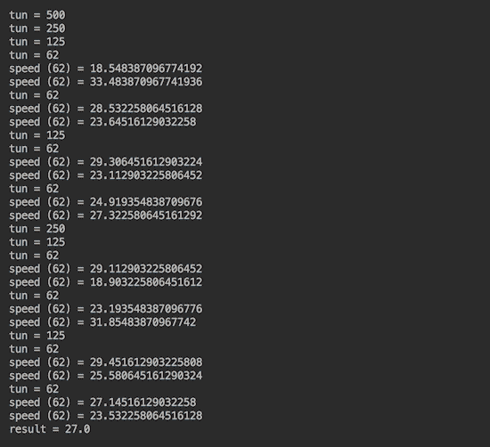

你可以看到，原始任务是在 1,001 个单位（车辆）上计算平均速度，首先被分成几组，直到一组（62）的数量低于 100 的阈值。然后，计算最后两组的平均速度，并将其与其他组的结果合并（连接）。

实现计算方法`compute()`的`else`块还有另一种方式，如下所示：

```java
as1.fork();                   //add to the queue
double res1 = as2.compute();  //get the result recursively
double res2 = as1.join();     //wait until the queued task ends
return (double) Math.round((res1 + res2) / 2);

```

结果将如下所示：

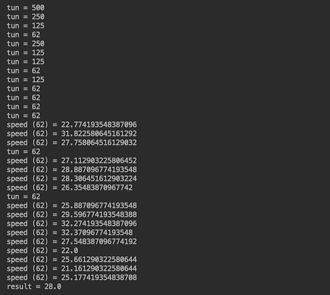

你可以看到，在这种情况下，计算方法（第二个任务）被递归调用多次，直到通过元素数量达到阈值，然后将其结果与第一个任务的`fork()`和`join()`方法调用的结果合并。

如前所述，所有这些复杂性都可以通过调用`invoke()`方法来替换：

```java
double res1 = as1.invoke();
double res2 = as2.invoke();
return (double) Math.round((res1 + res2) / 2);

```

它产生的结果与对每个任务调用`fork()`和`join()`产生的结果相似：

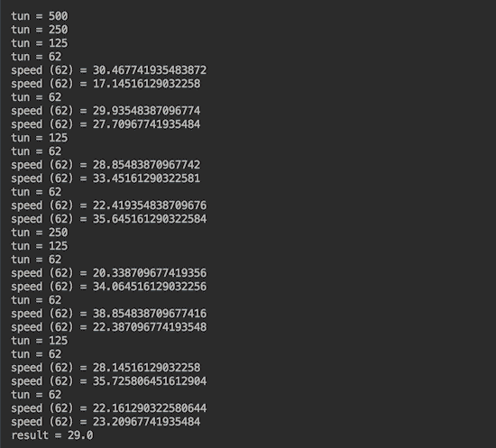

然而，还有更好的方法来实现计算方法`compute()`的`else`块：

```java
return ForkJoinTask.invokeAll(List.of(as1, as2))
        .stream()
        .mapToDouble(ForkJoinTask::join)
        .map(Math::round)
        .average()
        .getAsDouble();

```

如果这看起来很复杂，只需注意这只是一个类似于流的方式来遍历 `invokeAll()` 的结果：

```java
<T extends ForkJoinTask> Collection<T> invokeAll(Collection<T> tasks)
```

这也是为了遍历对每个返回的任务调用 `join()` 的结果（并将结果合并为平均值）。其优势在于我们让框架决定如何优化负载分配。结果如下：

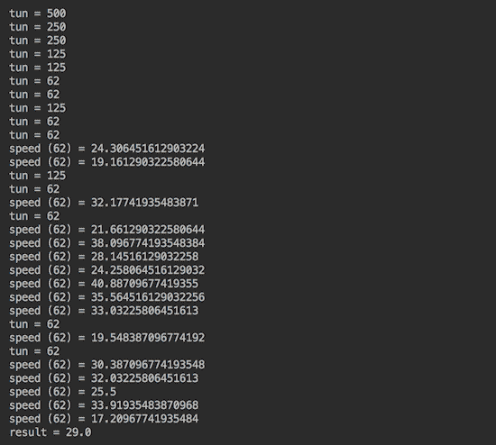

你可以看到它与前面的任何结果都不同，并且可能根据你计算机上 CPU 的可用性和负载而变化。

# 使用流实现发布-订阅模式

在这个菜谱中，你将了解 Java 9 中引入的新发布-订阅功能。

# 准备工作

在许多其他特性中，Java 9 在 `java.util.concurrent.Flow` 类中引入了这四个接口：

```java
Flow.Publisher<T> - producer of items (messages) of type T
Flow.Subscriber<T> - receiver of messages of type T
Flow.Subscription - links producer and receiver
Flow.Processor<T,R> - acts as both producer and receiver
```

有了这个，Java 步入了响应式编程的世界——使用数据流的异步处理进行编程。

我们在 第三章 *模块化编程* 中讨论了流，并指出它们不是数据结构，因为它们不在内存中保留数据。流管道在发出元素之前不做任何事情。这种模型允许最小化资源分配，并且仅在需要时使用资源。应用程序对它所响应的数据的出现做出反应，因此得名。

在发布-订阅模式中，主要有两个角色：`Publisher` 和 `Subscriber`。`Publisher` 流式传输数据（发布），而 `Subscriber` 监听数据（订阅）。

`Flow.Publisher<T>` 接口是一个函数式接口。它只有一个抽象方法：

```java
void subscribe(Flow.Subscriber<? super T> subscriber)

```

根据 Javadoc，此方法如果可能的话会添加给定的 Flow.Subscriber<T>。如果已经订阅，或者尝试订阅失败，则调用 Flow.Subscriber<T> 的 onError() 方法并传入 IllegalStateException。否则，调用 Flow.Subscriber<T> 的 onSubscribe() 方法并传入新的 Flow.Subscription。订阅者可以通过调用此 Flow.Subscription 的 request() 方法来启用接收项目，也可以通过调用其 cancel() 方法来取消订阅。

`Flow.Subscriber<T>` 接口有四个方法；其中一些刚才已经提到了：

+   `void onSubscribe(Flow.Subscription subscription)` 在调用给定 `Subscription` 的任何其他 `Subscriber` 方法之前被调用

+   `void onError(Throwable throwable)` 在 `Publisher` 或 `Subscription` 遇到不可恢复的错误后调用，之后不再通过 `Subscription` 调用任何其他 `Subscriber` 方法

+   `void onNext(T item)` 使用 `Subscription` 的下一个项目调用

+   `void onComplete()`：当知道不会为 `Subscription` 调用任何额外的 `Subscriber` 方法时，调用此方法

`Flow.Subscription` 接口有两个方法：

+   `void cancel()`：此方法导致 `Subscriber` （最终）停止接收消息

+   `void request(long n)`: 此方法将给定的 n 个项目添加到当前未满足的订阅需求

`Flow.Processor<T,R>`接口超出了本书的范围。

# 如何做到这一点...

为了节省一些时间和空间，我们不必创建自己的`Flow.Publisher<T>`接口实现，我们可以使用`java.util.concurrent`包中的`SubmissionPublisher<T>`类。但是，我们将创建自己的`Flow.Subscriber<T>`接口实现：

```java
class DemoSubscriber<T> implements Flow.Subscriber<T> {
  private String name;
  private Flow.Subscription subscription;
  public DemoSubscriber(String name){ this.name = name; }
  public void onSubscribe(Flow.Subscription subscription) {
    this.subscription = subscription;
    this.subscription.request(0);
  }
  public void onNext(T item) {
    System.out.println(name + " received: " + item);
    this.subscription.request(1);
  }
  public void onError(Throwable ex){ ex.printStackTrace();}
  public void onComplete() { System.out.println("Completed"); }
}
```

我们还将实现`Flow.Subscription`接口：

```java
class DemoSubscription<T> implements Flow.Subscription {
  private final Flow.Subscriber<T> subscriber;
  private final ExecutorService executor;
  private Future<?> future;
  private T item;
  public DemoSubscription(Flow.Subscriber subscriber,
                          ExecutorService executor) {
    this.subscriber = subscriber;
    this.executor = executor;
  }
  public void request(long n) {
    future = executor.submit(() -> {
      this.subscriber.onNext(item );
    });
  }
  public synchronized void cancel() {
    if (future != null && !future.isCancelled()) {
      this.future.cancel(true);
    }
  }
}
```

正如您所看到的，我们只是遵循了 Javadoc 推荐，并期望当订阅者被添加到发布者时，会调用订阅者的`onSubscribe()`方法。

另一个需要注意的细节是，`SubmissionPublisher<T>`类有一个`submit(T item)`方法，根据 Javadoc，该方法*通过异步调用其 onNext()方法将给定项发布到每个当前订阅者，在任何订阅者的资源不可用时不中断地阻塞*。这样，`SubmissionPublisher<T>`类将项目提交给当前订阅者，直到它被关闭。这允许项目生成器充当反应式流发布者。

为了演示这一点，让我们使用`demoSubscribe()`方法创建几个订阅者和订阅：

```java
void demoSubscribe(SubmissionPublisher<Integer> publisher, 
        ExecutorService execService, String subscriberName){
  DemoSubscriber<Integer> subscriber = 
                     new DemoSubscriber<>(subscriberName);
  DemoSubscription subscription = 
            new DemoSubscription(subscriber, execService);
  subscriber.onSubscribe(subscription);
  publisher.subscribe(subscriber);
}
```

然后在以下代码中使用它们：

```java
ExecutorService execService =  ForkJoinPool.commonPool();
try (SubmissionPublisher<Integer> publisher = 
                            new SubmissionPublisher<>()){
  demoSubscribe(publisher, execService, "One");
  demoSubscribe(publisher, execService, "Two");
  demoSubscribe(publisher, execService, "Three");
  IntStream.range(1, 5).forEach(publisher::submit);
} finally {
  //...make sure that execService is shut down
}
```

上述代码创建了三个订阅者，它们通过专用订阅连接到同一个发布者。最后一行生成数字流 1, 2, 3 和 4，并将每个数字提交给发布者。我们预计每个订阅者都将通过`onNext()`方法的参数接收到每个生成的数字。

在`finally`块中，我们包含了您从之前的菜谱中已经熟悉的代码：

```java
try {
  execService.shutdown();
  int shutdownDelaySec = 1;
  System.out.println("Waiting for " + shutdownDelaySec 
                     + " sec before shutting down service...");
  execService.awaitTermination(shutdownDelaySec, TimeUnit.SECONDS);
} catch (Exception ex) {
  System.out.println("Caught around execService.awaitTermination(): " 
                     + ex.getClass().getName());
} finally {
  System.out.println("Calling execService.shutdownNow()...");
  List<Runnable> l = execService.shutdownNow();
  System.out.println(l.size() 
              +" tasks were waiting to be executed. Service stopped.");
}
```

如果我们运行前面的代码，输出可能看起来像以下这样：

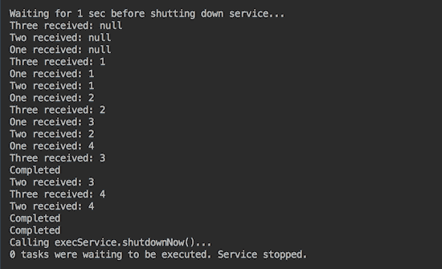

正如您所看到的，由于异步处理，控制流很快到达`finally`块，并在关闭服务之前等待 1 秒。这个等待期足以让项目被生成并传递给订阅者。我们还确认每个生成的项目都被发送到每个订阅者。每当每个订阅者的`onSubscribe()`方法被调用时，都会生成三个`null`值。

有理由预期在未来的 Java 版本中，将增加更多对反应式（异步和非阻塞）功能的支持。
