# 更好地管理操作系统进程

在这一章中，我们将涵盖以下菜谱：

+   生成新进程

+   将进程输出和错误流重定向到文件

+   更改子进程的工作目录

+   为子进程设置环境变量

+   运行 shell 脚本

+   获取当前 JVM 的进程信息

+   获取生成进程的进程信息

+   管理生成的进程

+   列举系统中的活动进程

+   使用管道连接多个进程

+   管理子进程

# 简介

你有多少次最终编写了生成新进程的代码？不经常。然而，会有一些需要编写此类代码的情况。在这种情况下，你会求助于使用第三方 API，例如 Apache Commons Exec ([`commons.apache.org/proper/commons-exec/`](https://commons.apache.org/proper/commons-exec/)) 等。为什么会这样？Java API 不够用吗？不，它不够用，至少直到 Java 9。现在，随着 Java 9 的推出，我们为进程 API 添加了许多新特性。

在 Java 7 之前，重定向输入、输出和错误流并不简单。Java 7 引入了一些新的 API，允许将输入、输出和错误重定向到其他进程（管道）、文件或标准输入/输出。然后在 Java 8 中，又引入了一些新的 API。在 Java 9 中，为以下领域引入了新的 API：

+   获取进程信息，例如**进程 ID**（**PID**）、启动进程的用户、进程运行的时间等

+   列举系统中运行的进程

+   通过在进程层次结构中向上导航来管理子进程并获取进程树访问权限

在这一章中，我们将探讨一些菜谱，这些菜谱将帮助您探索进程 API 中的新特性，您还将了解从 `Runtime.getRuntime().exec()` 时代引入的变化。你们都知道使用那个是犯罪。

所有这些菜谱只能在 Linux 平台上执行，因为我们将在从 Java 代码中生成新进程时使用 Linux 特定的命令。在 Linux 上执行 `run.sh` 脚本有两种方式：

+   `sh run.sh`

+   `chmod +x run.sh && ./run.sh`

# 生成新进程

在这个菜谱中，我们将看到如何使用 `ProcessBuilder` 生成新进程。我们还将看到如何利用输入、输出和错误流。这应该是一个非常简单且常见的菜谱。然而，引入这个菜谱的目的是使这一章更加完整，而不仅仅是关注 Java 9 的特性。

# 准备工作

Linux 中有一个名为 `free` 的命令，它显示系统空闲和使用的 RAM 量。它接受一个选项 `-m`，以兆字节为单位显示输出。因此，只需运行 `free -m` 就会得到以下输出：

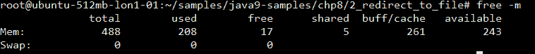

我们将在 Java 程序内部运行前面的代码。

# 如何做到...

1.  通过提供所需的命令及其选项来创建`ProcessBuilder`的实例：

```java
        ProcessBuilder pBuilder = new ProcessBuilder("free", "-m");
```

指定命令和选项的另一种方法是：

```java
        pBuilder.command("free", "-m");
```

1.  设置进程构建器的输入和输出流以及其他属性，如执行目录和环境变量。之后，在`ProcessBuilder`实例上调用`start()`以启动进程并获取`Process`对象的引用：

```java
        Process p = pBuilder.inheritIO().start();
```

`inheritIO()`函数将产生的子进程的标准 I/O 设置为与当前 Java 进程相同。

1.  然后，我们等待进程完成，或者等待 1 秒，以先到者为准，如下面的代码所示：

```java
        if(p.waitFor(1, TimeUnit.SECONDS)){
          System.out.println("process completed successfully");
        }else{
          System.out.println("waiting time elapsed, process did 
                              not complete");   
          System.out.println("destroying process forcibly");
          p.destroyForcibly();
        }
```

如果在指定的时间内没有完成，那么我们将通过调用`destroyForcibly()`方法来终止该过程。

1.  使用以下命令编译和运行代码：

```java
 $ javac -d mods --module-source-path src $(find src -name *.java)
      $ java -p mods -m process/com.packt.process.NewProcessDemo
```

1.  我们得到的结果如下：

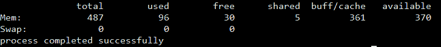

这个菜谱的代码可以在`chp8/1_spawn_new_process`中找到。

# 它是如何工作的...

有两种方法让`ProcessBuilder`知道要运行哪个命令：

1.  在创建`ProcessBuilder`对象时，通过将命令及其选项传递给构造函数。

1.  通过将命令及其选项作为参数传递给`ProcessBuilder`对象的`command()`方法。

在启动进程之前，我们可以做以下操作：

+   我们可以使用`directory()`方法更改执行目录

+   我们可以将输入流、输出流和错误流重定向到文件或另一个进程

+   我们可以为子进程提供所需的环境变量

我们将在本章的相应菜谱中看到所有这些活动。

当调用`start()`方法时，会启动一个新的进程，调用者会以`Process`类实例的形式获得对这个子进程的引用。使用这个`Process`对象，我们可以做很多事情，例如以下内容：

+   获取关于进程的信息，包括其 PID

+   获取输出和错误流

+   检查过程的完成情况

+   终止进程

+   将任务与进程完成后要执行的操作关联起来

+   检查由该进程产生的子进程

+   如果存在，找到该过程的所有父过程

在我们的菜谱中，我们`waitFor` 1 秒或等待进程完成（以先到者为准）。如果进程已经完成，则`waitFor`返回`true`；否则，返回`false`。如果进程没有完成，我们可以通过在`Process`对象上调用`destroyForcibly()`方法来终止进程。

# 将进程的输出和错误流重定向到文件

在这个菜谱中，我们将了解如何处理从 Java 代码中产生的过程的输出和错误流。我们将把产生的过程的输出或错误写入文件。

# 准备工作

在这个菜谱中，我们将使用`iostat`命令。这个命令用于报告不同设备和分区的 CPU 和 I/O 统计信息。让我们运行这个命令并看看它报告了什么：

```java
$ iostat
```

在某些 Linux 发行版中，例如 Ubuntu，`iostat` 不是默认安装的。你可以通过运行 `sudo apt-get install sysstat` 来安装这个实用工具。

上述命令的输出如下：

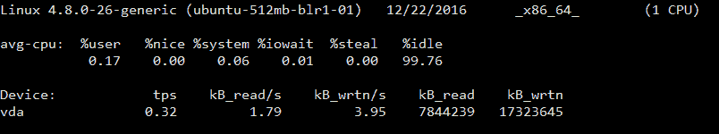

# 如何操作...

1.  通过指定要执行的命令创建一个新的 `ProcessBuilder` 对象：

```java
        ProcessBuilder pb = new ProcessBuilder("iostat");
```

1.  将输出和错误流分别重定向到文件的输出和错误：

```java
        pb.redirectError(new File("error"))
          .redirectOutput(new File("output"));
```

1.  启动进程，并等待其完成：

```java
        Process p = pb.start();
        int exitValue = p.waitFor();
```

1.  读取输出文件的内容：

```java
        Files.lines(Paths.get("output"))
                         .forEach(l -> System.out.println(l));
```

1.  读取错误文件的内容。这仅在命令中有错误时创建：

```java
        Files.lines(Paths.get("error"))
                         .forEach(l -> System.out.println(l));
```

第 4 步和第 5 步仅供参考。这与 `ProcessBuilder` 或生成的进程无关。使用这两行代码，我们可以检查进程写入输出和错误文件的内容。

完整的代码可以在 `chp8/2_redirect_to_file` 找到。

1.  使用以下命令编译代码：

```java
 $ javac -d mods --module-source-path src $(find src -name *.java)
```

1.  使用以下命令运行代码：

```java
 $ java -p mods -m process/com.packt.process.RedirectFileDemo
```

我们将得到以下输出：

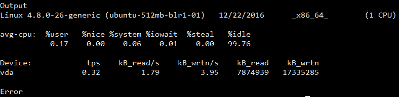

我们可以看到，命令执行成功时，错误文件中没有内容。

# 还有更多...

你可以向 `ProcessBuilder` 提供一个错误的命令，然后看到错误被写入错误文件，而输出文件中没有任何内容。你可以通过以下方式更改 `ProcessBuilder` 实例的创建：

```java
ProcessBuilder pb = new ProcessBuilder("iostat", "-Z");
```

使用 *如何操作...* 部分中给出的命令编译和运行。

你将看到错误文件中报告了一个错误，但输出文件中没有内容：

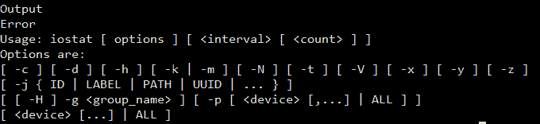

# 改变子进程的工作目录

通常，你可能会希望在一个路径的上下文中执行一个进程，例如列出某个目录中的文件。为了做到这一点，我们必须告诉 `ProcessBuilder` 在给定位置启动进程。我们可以通过使用 `directory()` 方法来实现这一点。此方法有两个目的：

1.  当我们不传递任何参数时，返回执行当前目录。

1.  当我们传递一个参数时，将执行当前目录设置为传递的值。

在本菜谱中，我们将看到如何执行 `tree` 命令以递归遍历当前目录下的所有目录，并以树形结构打印出来。

# 准备工作

通常，`tree` 命令不是预安装的。因此，你必须安装包含该命令的软件包。在基于 Ubuntu/Debian 的系统上安装，运行以下命令：

```java
sudo apt-get install tree
```

在支持 `yum` 软件包管理器的 Linux 上安装，运行以下命令：

```java
yum install tree
```

为了验证你的安装，只需运行 `tree` 命令，你应该能够看到当前目录结构被打印出来。对我来说，它看起来像这样：

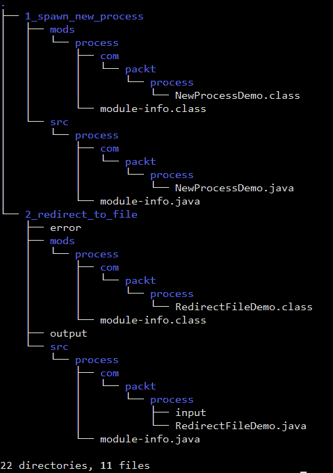

`tree` 命令支持多个选项。这需要你自己去探索。

# 如何操作...

1.  创建一个新的 `ProcessBuilder` 对象：

```java
        ProcessBuilder pb = new ProcessBuilder();
```

1.  将命令设置为 `tree`，并将输出和错误设置为与当前 Java 进程相同：

```java
        pb.command("tree").inheritIO();
```

1.  将目录设置为任何你想要的目录。我将其设置为根文件夹：

```java
        pb.directory(new File("/root"));
```

1.  启动进程并等待其退出：

```java
        Process p = pb.start();
        int exitValue = p.waitFor();
```

1.  使用以下命令编译和运行：

```java
 $ javac -d mods --module-source-path src $(find src -name *.java)
      $ java -p mods -m process/com.packt.process.ChangeWorkDirectoryDemo
```

1.  输出将是 `ProcessBuilder` 对象的 `directory()` 方法中指定的目录的递归内容，以树形格式打印。

完整代码可以在 `chp8/2_redirect_to_file` 找到。

# 它是如何工作的...

`directory()` 方法接受 `Process` 的工作目录路径。路径指定为一个 `File` 实例。

# 设置子进程的环境变量

环境变量就像我们在编程语言中使用的任何其他变量一样。它们有一个名称并持有一些值，这些值可以变化。这些变量被 Linux/Windows 命令或 shell/batch 脚本用来执行不同的操作。这些被称为环境变量，因为它们存在于正在执行的过程/命令/脚本的运行环境中。通常，进程会从父进程继承环境变量。

在不同的操作系统中，它们以不同的方式访问。在 Windows 中，它们以 `%ENVIRONMENT_VARIABLE_NAME%` 的形式访问，而在基于 Unix 的操作系统中，它们以 `$ENVIRONMENT_VARIABLE_NAME` 的形式访问。

在基于 Unix 的系统中，你可以使用 `printenv` 命令来打印进程可用的所有环境变量，而在基于 Windows 的系统中，你可以使用 `SET` 命令。

在这个菜谱中，我们将传递一些环境变量给我们的子进程，并使用 `printenv` 命令来打印所有可用的环境变量。

# 如何操作...

1.  创建一个 `ProcessBuilder` 实例：

```java
        ProcessBuilder pb = new ProcessBuilder();
```

1.  将命令设置为 `printenv`，并将输出和错误流设置为与当前 Java 进程相同：

```java
        pb.command("printenv").inheritIO();
```

1.  提供环境变量，`COOKBOOK_VAR1` 的值为 `First variable`，`COOKBOOK_VAR2` 的值为 `Second variable`，以及 `COOKBOOK_VAR3` 的值为 `Third variable`：

```java
        Map<String, String> environment = pb.environment();
        environment.put("COOKBOOK_VAR1", "First variable");
        environment.put("COOKBOOK_VAR2", "Second variable");
        environment.put("COOKBOOK_VAR3", "Third variable");

```

1.  启动进程并等待其完成：

```java
        Process p = pb.start();
        int exitValue = p.waitFor();
```

本菜谱的完整代码可以在 `chp8/4_environment_variables` 找到。

1.  使用以下命令编译和运行代码：

```java
 $ javac -d mods --module-source-path src $(find src -name *.java)
      $ java -p mods -m process/com.packt.process.EnvironmentVariableDemo
```

你得到的输出如下：

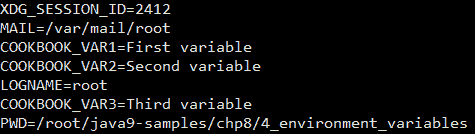

你可以在其他变量中看到打印出的三个变量。

# 它是如何工作的...

当你在 `ProcessBuilder` 实例上调用 `environment()` 方法时，它会复制当前进程的环境变量，将它们填充到一个 `HashMap` 实例中，并将其返回给调用代码。

加载环境变量的所有工作都由一个包私有的最终类 `ProcessEnvironment` 完成，它实际上扩展了 `HashMap`。

我们然后使用这个映射来填充我们自己的环境变量，但我们不需要将映射设置回`ProcessBuilder`，因为我们将有映射对象的引用而不是副本。对映射对象所做的任何更改都将反映在`ProcessBuilder`实例实际持有的映射对象中。

# 运行 shell 脚本

我们通常将执行操作时使用的命令集合保存在一个文件中，在 Unix 世界中称为 shell 脚本，在 Windows 中称为批处理文件。这些文件中存在的命令是按顺序执行的，除非脚本中有条件块或循环。

这些 shell 脚本由执行它们的 shell 进行评估。可用的 shell 类型有`bash`、`csh`、`ksh`等。`bash` shell 是最常用的 shell。

在这个配方中，我们将编写一个简单的 shell 脚本，然后使用`ProcessBuilder`和`Process`对象从 Java 代码中调用它。

# 准备就绪

首先，让我们编写我们的 shell 脚本。此脚本执行以下操作：

1.  打印环境变量`MY_VARIABLE`的值。

1.  执行`tree`命令。

1.  执行`iostat`命令。

让我们创建一个名为`script.sh`的 shell 脚本文件，其中包含以下命令：

```java
echo $MY_VARIABLE;
echo "Running tree command";
tree;
echo "Running iostat command"
iostat;
```

您可以将`script.sh`放置在您的家目录中，即`/home/<username>`。现在让我们看看如何从 Java 中执行它。

# 如何操作...

1.  创建一个新的`ProcessBuilder`实例：

```java
        ProcessBuilder pb = new ProcessBuilder();
```

1.  将执行目录设置为指向 shell 脚本文件的目录：

```java
         pb.directory(new File("/root"));
```

注意，在创建`File`对象时传递的上述路径将取决于您放置脚本`script.sh`的位置。在我们的案例中，我们将其放置在`/root`。您可能已经将脚本复制到`/home/yourname`，因此`File`对象将被创建为`new File("/home/yourname")`。

1.  设置一个将被 shell 脚本使用的环境变量：

```java
        Map<String, String> environment = pb.environment();
        environment.put("MY_VARIABLE", "From your parent Java process");
```

1.  设置要执行的命令以及传递给命令的参数。同时，设置进程的输出和错误流与当前 Java 进程相同：

```java
         pb.command("/bin/bash", "script.sh").inheritIO();
```

1.  启动进程，并等待其完全执行：

```java
         Process p = pb.start();
         int exitValue = p.waitFor();
```

您可以从`chp8/5_running_shell_script`获取完整的代码。

您可以使用以下命令编译和运行代码：

```java
$ javac -d mods --module-source-path src $(find src -name *.java)
$ java -p mods -m process/com.packt.process.RunningShellScriptDemo
```

我们得到的输出如下：

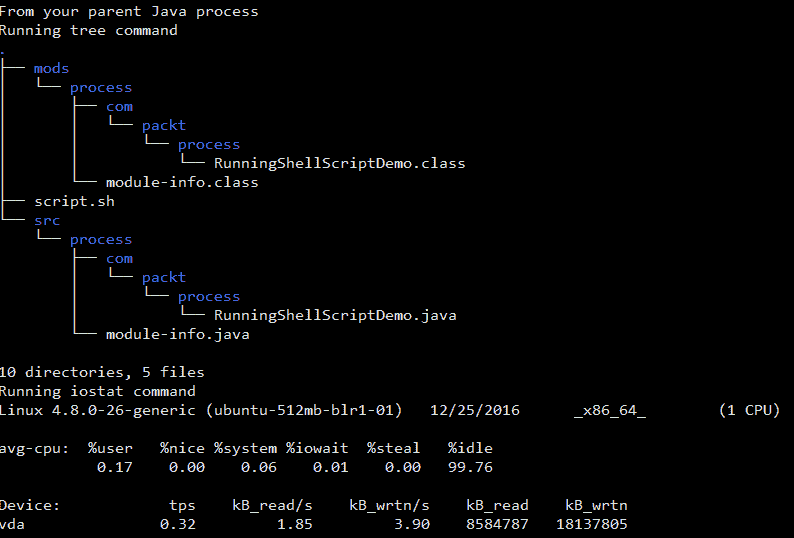

# 它是如何工作的...

在这个配方中，您必须注意两件事：

1.  将进程的工作目录更改为 shell 脚本的位置。

1.  使用`/bin/bash`来执行 shell 脚本。

如果您没有执行步骤 1，那么您将不得不使用 shell 脚本文件的绝对路径。然而，在我们的配方中，我们已经执行了步骤 1，因此我们只需使用 shell 脚本名称来对`/bin/bash`命令进行操作。

步骤 2 基本上是您想要执行 shell 脚本的方式。这样做的方法是将 shell 脚本传递给解释器，解释器将解释并执行脚本。这就是以下代码行所做的事情：

```java
pb.command("/bin/bash", "script.sh")
```

# 获取当前 JVM 的进程信息

运行中的进程有一组与之关联的属性，例如以下内容：

+   **PID**：这是进程的唯一标识

+   **所有者**：这是启动进程的用户名称

+   **命令**：这是在进程下运行的命令

+   **CPU 时间**：这表示进程活跃的时间

+   **启动时间**：这表示进程启动的时间

这些是我们通常感兴趣的几个属性。也许，我们也会对 CPU 使用率或内存使用率感兴趣。现在，在 Java 9 之前，从 Java 内部获取这些信息是不可能的。然而，在 Java 9 中，引入了一套新的 API，使我们能够获取关于进程的基本信息。

在这个菜谱中，我们将看到如何获取当前 Java 进程的进程信息，即执行你代码的进程。

# 如何做到这一点...

1.  创建一个简单的类并使用`ProcessHandle.current()`来获取当前 Java 进程的`ProcessHandle`：

```java
        ProcessHandle handle = ProcessHandle.current();
```

1.  我们添加了一些代码，这将增加代码的运行时间：

```java
        for ( int i = 0 ; i < 100; i++){
          Thread.sleep(1000);
        }
```

1.  在`ProcessHandle`实例上使用`info()`方法来获取`ProcessHandle.Info`实例：

```java
        ProcessHandle.Info info = handle.info();
```

1.  使用`ProcessHandle.Info`实例来获取接口提供的所有信息：

```java
        System.out.println("Command line: " + info.commandLine().get());
        System.out.println("Command: " + info.command().get());
        System.out.println("Arguments: " + 
                     String.join(" ", info.arguments().get()));
        System.out.println("User: " + info.user().get());
        System.out.println("Start: " + info.startInstant().get());
        System.out.println("Total CPU Duration: " + 
                     info.totalCpuDuration().get().toMillis() +"ms");
```

1.  使用`ProcessHandle`的`pid()`方法来获取当前 Java 进程的进程 ID：

```java
        System.out.println("PID: " + handle.pid());
```

1.  我们还将使用代码即将结束的时间来打印结束时间。这将给我们一个关于进程执行时间的概念：

```java
        Instant end = Instant.now();
        System.out.println("End: " + end);
```

你可以从`chp8/6_current_process_info`获取完整的代码。

使用以下命令编译和运行代码：

```java
$ javac -d mods --module-source-path src $(find src -name *.java) 
$ java -p mods -m process/com.packt.process.CurrentProcessInfoDemo
```

你看到的输出将类似于以下内容：

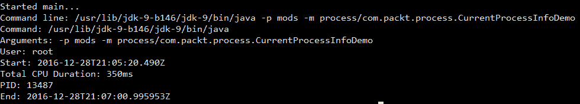

程序完成执行将需要一些时间。

需要注意的一个观察结果是，即使程序运行了大约 2 分钟，总的 CPU 持续时间也只有 350 毫秒。这是 CPU 忙碌的时间段。

# 它是如何工作的...

为了给本地进程更多的控制权并获取其信息，Java API 中增加了一个名为`ProcessHandle`的新接口。使用`ProcessHandle`，你可以控制进程执行以及获取一些进程信息。该接口还有一个名为`ProcessHandle.Info`的内部接口。该接口提供 API 来获取关于进程的信息。

有多种方式可以获取进程的`ProcessHandle`对象。以下是一些方法：

+   `ProcessHandle.current()`: 这用于获取当前 Java 进程的`ProcessHandle`实例

+   `Process.toHandle()`: 这用于获取给定`Process`对象的`ProcessHandle`

+   `ProcessHandle.of(pid)`: 这用于获取由给定 PID 标识的进程的`ProcessHandle`

在我们的配方中，我们使用第一种方法，即我们使用 `ProcessHandle.current()`。这使我们能够掌握当前 Java 进程。在 `ProcessHandle` 实例上调用 `info()` 方法将给我们一个 `ProcessHandle.Info` 接口的实现实例，我们可以利用它来获取进程信息，如配方代码所示。

`ProcessHandle` 和 `ProcessHandle.Info` 是接口。JDK 提供者，即 Oracle JDK 或 Open JDK，将为这些接口提供实现。Oracle JDK 有一个名为 `ProcessHandleImpl` 的类，它实现了 `ProcessHandle`，并在 `ProcessHandleImpl` 内部还有一个名为 `Info` 的内部类，它实现了 `ProcessHandle.Info` 接口。因此，每次您调用上述方法之一来获取 `ProcessHandle` 对象时，都会返回一个 `ProcessHandleImpl` 实例。

这同样适用于 `Process` 类。它是一个抽象类，Oracle JDK 提供了一个名为 `ProcessImpl` 的实现，它实现了 `Process` 类中的抽象方法。

在本章的所有配方中，任何关于 `ProcessHandle` 实例或 `ProcessHandle` 对象的提及都将指代 `ProcessHandleImpl` 实例或对象或您所使用的 JDK 提供的任何其他实现类。

此外，任何关于 `ProcessHandle.Info` 实例或 `ProcessHandle.Info` 对象的提及都将指代 `ProcessHandleImpl.Info` 实例或对象或您所使用的 JDK 提供的任何其他实现类。

# 获取生成的进程的进程信息

在我们之前的配方中，我们看到了如何获取当前 Java 进程的进程信息。在这个配方中，我们将探讨如何获取由 Java 代码生成的进程的进程信息，即由当前 Java 进程生成的进程。使用的 API 将与我们在之前的配方中看到的一样，只是 `ProcessHandle` 实例的实现方式不同。

# 准备工作

在这个配方中，我们将使用一个 Unix 命令，`sleep`，它用于在秒内暂停执行一段时间。

# 如何操作...

1.  从 Java 代码中生成一个新的进程，该进程运行 `sleep` 命令：

```java
        ProcessBuilder pBuilder = new ProcessBuilder("sleep", "20");
        Process p = pBuilder.inheritIO().start();
```

1.  获取此生成的进程的 `ProcessHandle` 实例：

```java
        ProcessHandle handle = p.toHandle();
```

1.  等待生成的进程完成执行：

```java
        int exitValue = p.waitFor();
```

1.  使用 `ProcessHandle` 获取 `ProcessHandle.Info` 实例，并使用其 API 获取所需信息。或者，我们甚至可以直接使用 `Process` 对象，通过在 `Process` 类中使用 `info()` 方法来获取 `ProcessHandle.Info`：

```java
        ProcessHandle.Info info = handle.info();

        System.out.println("Command line: " + info.commandLine().get());
        System.out.println("Command: " + info.command().get());
        System.out.println("Arguments: " + String.join(" ", 
                           info.arguments().get()));
        System.out.println("User: " + info.user().get());
        System.out.println("Start: " + info.startInstant().get());
        System.out.println("Total CPU time(ms): " + 
                           info.totalCpuDuration().get().toMillis());
        System.out.println("PID: " + handle.pid());
```

您可以从 `chp8/7_spawned_process_info` 获取完整的代码。

使用以下命令编译和运行代码：

```java
$ javac -d mods --module-source-path src $(find src -name *.java)
$ java -p mods -m process/com.packt.process.SpawnedProcessInfoDemo
```

或者，在 `chp8\7_spawned_process_info` 中有一个名为 `run.sh` 的脚本，您可以从任何基于 Unix 的系统作为 `/bin/bash run.sh` 运行它。

您看到的输出将类似于以下内容：

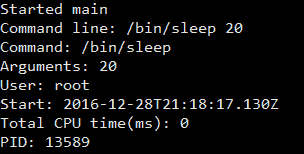

# 管理生成的进程

有几种方法，例如`destroy()`、`destroyForcibly()`（在 Java 8 中添加）、`isAlive()`（在 Java 8 中添加）和`supportsNormalTermination()`（在 Java 9 中添加），可以用来控制生成的进程。这些方法在`Process`对象以及`ProcessHandle`对象上都是可用的。在这里，控制只是检查进程是否处于活动状态，如果是，则销毁进程。

在这个菜谱中，我们将生成一个长时间运行的进程，并执行以下操作：

+   检查其活动性

+   检查它是否可以正常停止，也就是说，根据平台，进程可以通过仅使用销毁或使用强制销毁来停止

+   停止进程

# 如何操作...

1.  从 Java 代码中生成一个新的进程，运行`sleep`命令，例如 1 分钟，即 60 秒：

```java
        ProcessBuilder pBuilder = new ProcessBuilder("sleep", "60");
        Process p = pBuilder.inheritIO().start();

```

1.  等待，比如说，10 秒：

```java
        p.waitFor(10, TimeUnit.SECONDS);
```

1.  检查进程是否处于活动状态：

```java
        boolean isAlive = p.isAlive();
        System.out.println("Process alive? " + isAlive);
```

1.  检查进程是否可以正常停止：

```java
        boolean normalTermination = p.supportsNormalTermination();
        System.out.println("Normal Termination? " + normalTermination);
```

1.  停止进程并检查其活动性：

```java
        p.destroy();
        isAlive = p.isAlive();
        System.out.println("Process alive? " + isAlive);
```

您可以从`chp8\8_manage_spawned_process`获取完整的代码。

我们提供了一个名为`run.sh`的实用脚本，您可以使用它来编译和运行代码：`sh run.sh`。

我们得到的输出如下：

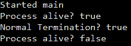

如果我们在 Windows 上运行程序，`supportsNormalTermination()`返回`false`，但在 Unix 上`supportsNormalTermination()`返回`true`（如前面的输出所示）。

# 列举系统中的活动进程

在 Windows 中，您打开 Windows 任务管理器来查看当前活动的进程，而在 Linux 中，您使用带有各种选项的`ps`命令来查看进程以及其他详细信息，如用户、耗时、命令等。

在 Java 9 中，添加了一个新的 API，称为`ProcessHandle`，用于处理进程的控制和获取信息。API 的一个方法是`allProcesses()`，它返回当前进程可见的所有进程的快照。在这个菜谱中，我们将查看该方法的工作方式以及我们可以从 API 中提取哪些信息。

# 如何操作...

1.  使用`ProcessHandle`接口上的`allProcesses()`方法获取当前活动进程的流：

```java
         Stream<ProcessHandle> liveProcesses = 
                       ProcessHandle.allProcesses();
```

1.  使用`forEach()`遍历流，并传递一个 lambda 表达式来打印可用的详细信息：

```java
         liveProcesses.forEach(ph -> {
           ProcessHandle.Info phInfo = ph.info();
           System.out.println(phInfo.command().orElse("") +" " + 
                              phInfo.user().orElse(""));
         });
```

您可以从`chp8/9_enumerate_all_processes`获取完整的代码。

我们提供了一个名为`run.sh`的实用脚本，您可以使用它来编译和运行代码：`sh run.sh`。

我们得到的输出如下：

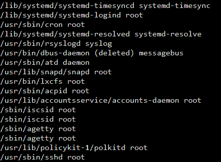

在前面的输出中，我们打印了进程的命令名称以及用户。我们只展示了输出的一小部分。

# 使用管道连接多个进程

在 Unix 中，使用`|`符号将一组命令连接起来是常见的，以创建一系列活动的管道，其中命令的输入是前一个命令的输出。这样，我们可以处理输入以获得所需的输出。

一个常见的场景是当你想在日志文件中搜索某些内容或某些模式，或者在日志文件中查找某些文本的出现。在这种情况下，你可以创建一个管道，通过一系列命令（如`cat`、`grep`、`wc -l`等）传递所需的日志文件数据。

在这个菜谱中，我们将使用来自 UCI 机器学习仓库的 Iris 数据集（可在[`archive.ics.uci.edu/ml/datasets/Iris`](https://archive.ics.uci.edu/ml/datasets/Iris)找到）来创建一个管道，其中我们将计算每种类型花的出现次数。

# 准备中...

我们已经下载了 Iris 花数据集，可以在本书代码下载的`chp8/10_connecting_process_pipe/iris.data`中找到。

如果你查看`Iris`数据，你会看到有 150 行以下格式的数据：

```java
4.7,3.2,1.3,0.2,Iris-setosa
```

这里，有多个属性由逗号（`,`）分隔，属性如下：

+   花萼长度（厘米）

+   花萼宽度（厘米）

+   花瓣长度（厘米）

+   花瓣宽度（厘米）

+   类：

    +   Iris Setosa

    +   Iris Versicolour

    +   Iris Virginica

在这个菜谱中，我们将找到每个类（Setosa、Versicolour 和 Virginica）中花的总数。

我们将使用以下命令的管道（使用基于 Unix 的操作系统）：

```java
$ cat iris.data.txt | cut -d',' -f5 | uniq -c
```

我们得到的结果如下：

```java
50 Iris-setosa
50 Iris-versicolor
50 Iris-virginica
1
```

文件末尾的 1 表示文件末尾的新行。因此，每个类有 50 朵花。让我们分析上述 shell 命令管道，了解每个命令的功能：

+   `cat`：这个命令读取作为参数给出的文件

+   `cut`：这个命令使用`-d`选项中给出的字符分割每一行，并返回由`-f`选项指定的列中的值。

+   `uniq`：这个命令从给定的值中返回一个唯一的列表，当使用`-c`选项时，它返回每个唯一值在列表中出现的次数

# 如何做...

1.  创建一个`ProcessBuilder`对象列表，它将包含参与我们管道的`ProcessBuilder`实例。同时，将管道中最后一个进程的输出重定向到当前 Java 进程的标准输出：

```java
         List<ProcessBuilder> pipeline = List.of(
           new ProcessBuilder("cat", "iris.data.txt"),
           new ProcessBuilder("cut", "-d", ",", "-f", "5"),
           new ProcessBuilder("uniq", "-c")
               .redirectOutput(ProcessBuilder.Redirect.INHERIT)
         );
```

1.  使用`ProcessBuilder`的`startPipeline()`方法，并将`ProcessBuilder`对象列表传递给它以启动管道。它将返回一个`Process`对象列表，每个对象代表列表中的一个`ProcessBuilder`对象：

```java
         List<Process> processes = ProcessBuilder.startPipeline(pipeline);
```

1.  获取列表中的最后一个进程并`waitFor`它完成：

```java
         int exitValue = processes.get(processes.size() - 1).waitFor();
```

你可以从`chp8/10_connecting_process_pipe`获取完整的代码。

我们提供了一个名为`run.sh`的实用脚本，你可以使用它来编译和运行代码：`sh run.sh`。

我们得到的结果如下：

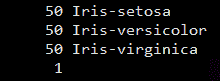

# 它是如何工作的...

`startPipeline()`方法为列表中的每个`ProcessBuilder`对象启动一个`Process`。除了第一个和最后一个进程外，它通过使用`ProcessBuilder.Redirect.PIPE`将一个进程的输出重定向到另一个进程的输入。如果你为任何中间进程提供了除`ProcessBuilder.Redirect.PIPE`之外的其他`redirectOutput`，则会抛出错误，类似于以下内容：

```java
Exception in thread "main" java.lang.IllegalArgumentException: builder redirectOutput() must be PIPE except for the last builder: INHERIT. 
```

它指出除了最后一个构建器之外，任何构建器都应该将其输出重定向到下一个进程。对于`redirectInput`也是如此。

# 管理子进程

当一个进程启动另一个进程时，被启动的进程成为启动进程的子进程。反过来，启动的进程也可以启动另一个进程，这个链可以继续下去。这导致了一个进程树。我们通常需要处理有问题的子进程，可能想要杀死该子进程，或者我们可能想知道启动的子进程并可能想要获取一些关于它的信息。

在 Java 9 中，`Process`类中添加了两个新的 API：`children()`和`descendants()`。`children()` API 允许你获取当前进程的直接子进程的快照列表，而`descendants()` API 提供了当前进程的递归`children()`的快照，即它们在每个子进程中递归调用`children()`。

在这个菜谱中，我们将查看`children()`和`descendants()` API，并看看我们可以从进程快照中收集哪些信息。

# 准备工作

让我们创建一个简单的 shell 脚本，我们将在菜谱中使用它。这个脚本可以在`chp8/11_managing_sub_process/script.sh`找到：

```java
echo "Running tree command";
tree;
sleep 60;
echo "Running iostat command";
iostat;
```

在前面的脚本中，我们正在运行`tree`和`iostat`命令，它们之间有 1 分钟的睡眠时间。如果你想知道这些命令，请参阅本章的*运行 shell 脚本*菜谱。当从 bash shell 中执行睡眠命令时，每次调用都会创建一个新的子进程。

我们将创建，比如说，10 个`ProcessBuilder`实例来运行前面的 shell 脚本并将它们同时启动。

# 如何做到这一点...

1.  我们将创建 10 个`ProcessBuilder`实例来运行我们的 shell 脚本（位于`chp8/11_managing_sub_process/script.sh`）。我们对其输出不感兴趣，所以让我们通过将输出重定向到预定义的重定向`ProcessHandle.Redirect.DISCARD`来丢弃命令的输出：

```java
        for ( int i = 0; i < 10; i++){
          new ProcessBuilder("/bin/bash", "script.sh")
              .redirectOutput(ProcessBuilder.Redirect.DISCARD)
              .start();
        }
```

1.  获取当前进程的句柄：

```java
        ProcessHandle currentProcess = ProcessHandle.current();
```

1.  使用当前进程通过`children()` API 获取其子进程，并对每个子进程迭代以打印其信息。一旦我们有一个`ProcessHandle`实例，我们就可以做很多事情，比如销毁进程、获取进程信息等等：

```java
        System.out.println("Obtaining children");
        currentProcess.children().forEach(pHandle -> {
          System.out.println(pHandle.info());
        });
```

1.  使用当前进程通过`descendants()` API 获取所有其后代子进程，并对每个子进程迭代以打印它们的信息：

```java
        currentProcess.descendants().forEach(pHandle -> {
          System.out.println(pHandle.info());
        });
```

您可以从`chp8/11_managing_sub_process`获取完整的代码。

我们提供了一个名为`run.sh`的实用脚本，您可以使用它来编译和运行代码：`sh run.sh`。

我们得到的结果如下：

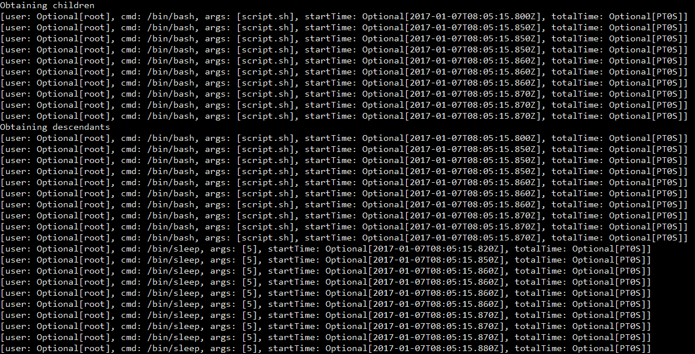

# 它是如何工作的...

`children()`和`descendants()` API 为每个进程返回`Stream`的`ProcessHandler`，这些进程是当前进程的直接子进程或后代。使用`ProcessHandler`的实例，我们可以执行以下操作：

1.  获取进程信息。

1.  检查进程的状态。

1.  停止进程。
