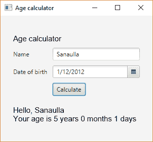

# 使用 JavaFX 进行 GUI 编程

在本章中，我们将介绍以下菜谱：

+   使用 JavaFX 控件创建 GUI

+   使用 FXML 标记创建 GUI

+   使用 CSS 在 JavaFX 中设置元素样式

+   创建柱状图

+   创建饼图

+   创建折线图

+   创建面积图

+   创建气泡图

+   创建散点图

+   在应用程序中嵌入 HTML

+   在应用程序中嵌入媒体

+   为控件添加效果

+   使用新的 TIFF I/O API 读取 TIFF 图像

# 简介

GUI 编程自 JDK 1.0 以来就在 Java 中，通过名为**抽象窗口工具包**（**AWT**）的 API 实现。这在当时是一个了不起的事情，但它也有自己的局限性，以下是一些例子：

+   它具有有限的组件集

+   由于 AWT 使用原生组件，因此无法创建自定义的可重用组件

+   组件的外观和感觉无法控制，并且它们采用了宿主操作系统的外观和感觉

然后，在 Java 1.2 中，引入了一个新的 GUI 开发 API，称为**Swing**，它通过提供以下功能来弥补 AWT 的不足：

+   更丰富的组件库。

+   支持创建自定义组件。

+   本地外观和感觉以及支持插入不同的外观和感觉。一些 Java 外观和感觉主题包括 Nimbus、Metal、Motif 以及系统默认值。

许多使用 Swing 的桌面应用程序已经被构建，其中许多仍在使用。然而，随着时间的推移，技术必须发展；否则，它最终会过时，很少使用。2008 年，Adobe 的 Flex 开始引起关注。它是一个用于构建**丰富互联网应用程序**（**RIAs**）的框架。桌面应用程序始终是丰富的基于组件的 UI，但 Web 应用程序并不那么令人惊叹。Adobe 推出了一种名为 Flex 的框架，使 Web 开发者能够在 Web 上创建丰富、沉浸式的 UI。因此，Web 应用程序不再无聊。

Adobe 还推出了一种针对桌面的丰富互联网应用程序运行环境，称为 Adobe AIR，它允许在桌面上运行 Flex 应用程序。这对古老的 Swing API 是一次重大打击。为了重返市场，2009 年，Sun Microsystems 推出了一种名为 JavaFX 的东西。这个框架受到了 Flex（使用 XML 定义 UI）的启发，并引入了自己的脚本语言，称为 JavaFX 脚本，它比 JSON 和 JavaScript 更接近。可以从 JavaFX 脚本中调用 Java API。引入了一种新的架构，它有一个新的窗口工具包和一个新的图形引擎。它是对 Swing 的一个更好的替代品，但有一个缺点——开发者必须学习 JavaFX 脚本才能开发基于 JavaFX 的应用程序。除了 Sun Microsystems 无法在 JavaFX 和 Java 平台总体上投入更多之外，JavaFX 从未像预期的那样起飞。

Oracle（在收购 Sun Microsystems 之后）宣布了一个新的 JavaFX 版本 2.0，这是一个对 JavaFX 的全面重写，从而消除了脚本语言，使 JavaFX 成为 Java 平台内的 API。这使得使用 JavaFX API 类似于使用 Swing API。此外，可以在 Swing 中嵌入 JavaFX 组件，从而使基于 Swing 的应用程序功能更强大。从那时起，JavaFX 就没有回头路了。

在本章中，我们将完全关注 JavaFX 周围的食谱。我们将尝试涵盖尽可能多的食谱，以给您所有人提供良好的 JavaFX 使用体验。

# 使用 JavaFX 控件创建 GUI

在这个食谱中，我们将查看如何使用 JavaFX 控件创建一个简单的 GUI 应用程序。我们将构建一个应用程序，通过提供您的出生日期来帮助您计算年龄。可选地，您甚至可以输入您的姓名，应用程序将问候您并显示您的年龄。这是一个相当简单的例子，试图展示您如何通过使用布局、组件和事件处理来创建 GUI。

# 准备工作

您已安装的 JDK 包含 JavaFX 模块，因此无需进行任何操作即可开始使用 JavaFX。包含 JavaFX 类的各种模块如下：

+   `javafx.base`

+   `javafx.controls`

+   `javafx.fxml`

+   `javafx.graphics`

+   `javafx.media`

+   `javafx.swing`

+   `javafx.web`

在我们的食谱中，我们将根据需要从前面列表中使用几个模块。

# 如何操作...

1.  创建一个继承自`javafx.application.Application`的类。`Application`类管理 JavaFX 应用程序的生命周期。`Application`类有一个抽象方法`start(Stage stage)`，必须实现。这将是我们 JavaFX UI 的起点：

```java
        public class CreateGuiDemo extends Application{
          public void start(Stage stage){
            //to implement in new steps
          }
        }
```

该类也可以通过提供`public static void main(String [] args) {}`方法作为应用程序的起点：

```java
        public class CreateGuiDemo extends Application{
          public void start(Stage stage){
            //to implement in new steps
          }
          public static void main(String[] args){
            //launch the JavaFX application
          }
        }
```

后续步骤的代码必须在`start(Stage stage)`方法中编写。

1.  让我们创建一个容器布局，以正确对齐我们将要添加的组件。在这种情况下，我们将使用`javafx.scene.layout.GridPane`将组件排列成行和列的网格形式：

```java
        GridPane gridPane = new GridPane();
        gridPane.setAlignment(Pos.CENTER);
        gridPane.setHgap(10);
        gridPane.setVgap(10);
        gridPane.setPadding(new Insets(25, 25, 25, 25));
```

在创建`GridPane`实例的同时，我们正在设置其布局属性，例如`GridPane`的对齐方式、行与列之间的水平和垂直间距以及网格中每个单元格的填充。

1.  创建一个新的标签，用于显示我们应用程序的名称，特别是`Age calculator`，并将其添加到我们在前面步骤中创建的`gridPane`中：

```java
        Text appTitle = new Text("Age calculator");
        appTitle.setFont(Font.font("Arial", FontWeight.NORMAL, 15));
        gridPane.add(appTitle, 0, 0, 2, 1);
```

1.  创建一个标签和一个文本输入框的组合，用于接受用户的姓名。然后将这两个组件添加到`gridPane`中：

```java
        Label nameLbl = new Label("Name");
        TextField nameField = new TextField();
        gridPane.add(nameLbl, 0, 1);
        gridPane.add(nameField, 1, 1);
```

1.  创建一个标签和一个日期选择器的组合，用于接受用户的出生日期：

```java
        Label dobLbl = new Label("Date of birth");
        gridPane.add(dobLbl, 0, 2);
        DatePicker dateOfBirthPicker = new DatePicker();
        gridPane.add(dateOfBirthPicker, 1, 2);
```

1.  创建一个按钮，用户将使用它来触发年龄计算，并将其添加到`gridPane`中：

```java
        Button ageCalculator = new Button("Calculate");
        gridPane.add(ageCalculator, 1, 3);
```

1.  创建一个组件来保存计算出的年龄结果：

```java
        Text resultTxt = new Text();
        resultTxt.setFont(Font.font("Arial", FontWeight.NORMAL, 15));
        gridPane.add(resultTxt, 0, 5, 2, 1);
```

1.  现在，我们需要将一个动作绑定到第 6 步中创建的按钮。这个动作将获取在姓名字段中输入的姓名和在日期选择器字段中输入的出生日期。如果提供了出生日期，则使用 Java 时间 API 计算现在和出生日期之间的时间段。如果提供了姓名，则在结果前添加问候语，`Hello, <name>`：

```java
        ageCalculator.setOnAction((event) -> {
          String name = nameField.getText();
          LocalDate dob = dateOfBirthPicker.getValue();
          if ( dob != null ){
            LocalDate now = LocalDate.now();
            Period period = Period.between(dob, now);
            StringBuilder resultBuilder = new StringBuilder();
            if ( name != null && name.length() > 0 ){
              resultBuilder.append("Hello, ")
                         .append(name)
                         .append("n");
            }
            resultBuilder.append(String.format(
              "Your age is %d years %d months %d days",
              period.getYears(), 
              period.getMonths(), 
              period.getDays())
            );
            resultTxt.setText(resultBuilder.toString());
          }
        });
```

1.  通过提供我们在第 2 步中创建的`gridPane`对象和场景的宽度和高度来创建`Scene`类的实例：

```java
        Scene scene = new Scene(gridPane, 300, 250);
```

`Scene`实例持有 UI 组件的图，称为场景图。

1.  我们已经看到`start()`方法为我们提供了一个`Stage`对象的引用。`Stage`对象是 JavaFX 中的顶级容器，类似于 Swing 使用的 AWT。我们将`Scene`对象设置到`Stage`对象，并使用其`show()`方法来渲染 UI：

```java
        stage.setTitle("Age calculator");
        stage.setScene(scene);
        stage.show();
```

1.  现在，我们需要从主方法启动这个 JavaFX UI。我们使用`Application`类的`launch(String[] args)`方法来启动 JavaFX UI：

```java
        public static void main(String[] args) {
          Application.launch(args);
        }
```

完整的代码可以在`chp9/1_create_javafx_gui`中找到。

我们在`chp9/1_create_javafx_gui`中提供了两个脚本，`run.bat`和`run.sh`。`run.bat`脚本将用于在 Windows 上运行应用程序，而`run.sh`将用于在 Linux 上运行应用程序。

使用`run.bat`或`run.sh`运行应用程序，你将看到以下截图所示的 GUI：


输入姓名和出生日期，然后点击`Calculate`来查看年龄：



# 它是如何工作的...

在深入其他细节之前，让我们先简要概述一下 JavaFX 架构。我们已从 JavaFX 文档中提取了以下描述架构堆栈的图像（[`docs.oracle.com/javase/8/javafx/get-started-tutorial/jfx-architecture.htm#JFXST788`](http://docs.oracle.com/javase/8/javafx/get-started-tutorial/jfx-architecture.htm#JFXST788)）：


让我们从堆栈的顶部开始：

+   **JavaFX API 和场景图**：这是应用程序的起点，我们将大部分精力集中在这一部分。这提供了不同组件、布局和其他实用工具的 API，以促进基于 JavaFX 的 UI 开发。场景图持有应用程序的视觉元素。

+   **棱镜、量子工具包以及蓝色中的其他组件**：这些组件管理 UI 的渲染，并在底层操作系统和 JavaFX 之间提供桥梁。这一层在图形硬件无法提供丰富 UI 和 3D 元素的硬件加速渲染的情况下提供软件渲染。

+   **玻璃窗口工具包**：这是窗口工具包，就像 Swing 使用的 AWT。

+   **媒体引擎**：这支持 JavaFX 中的媒体。

+   **网络引擎**：这支持网络组件，允许完全渲染 HTML。

+   **JDK API 和 JVM**：这些与 Java API 集成，并将代码编译成字节码以在 JVM 上运行。

让我们回到解释食谱。`javafx.application.Application` 类是启动 JavaFX 应用程序的入口点。它具有以下方法，这些方法映射到应用程序的生命周期（按调用顺序）：

+   **`init()`**：此方法在 `javafx.application.Application` 实例化后立即调用。可以在应用程序开始之前重写此方法以进行一些初始化。默认情况下，此方法不执行任何操作。

+   `start(javafx.stage.Stage)`：此方法在 `init()` 之后立即调用，并且在系统完成运行应用程序所需的初始化之后调用。此方法传递一个 `javafx.stage.Stage` 实例，这是组件渲染的主要阶段。可以创建其他 `javafx.stage.Stage` 对象，但应用程序提供的是主要阶段。

+   `stop()`：当应用程序应该停止时调用此方法。可以执行必要的退出相关操作。

阶段是一个顶级 JavaFX 容器。作为 `start()` 方法参数传递的主阶段是由平台创建的，并且应用程序可以在需要时创建其他 `Stage` 容器。

与 `javafx.application.Application` 相关的另一个重要方法是 `launch()` 方法。这个方法有两种变体：

+   `launch(Class<? extends Application> appClass, String... args)`

+   `launch(String... args)`

此方法从主方法中调用，并且应该只调用一次。第一个变体接受扩展 `javafx.application.Application` 类的类的名称以及传递给主方法的参数，第二个变体不接收类的名称，而应该从扩展 `javafx.application.Application` 类的类内部调用。在我们的食谱中，我们使用了第二个变体。

我们创建了一个名为 `CreateGuiDemo` 的类，它扩展了 `javafx.application.Application`。这将是 JavaFX UI 的入口点，我们还向该类添加了一个主方法，使其成为我们应用程序的入口点。

布局构造函数决定了你的组件如何布局。JavaFX 支持多种布局，如下所示：

+   `javafx.scene.layout.HBox` 和 `javafx.scene.layout.VBox`：这些用于水平垂直对齐组件

+   `javafx.scene.layout.BorderPane`：这允许将组件放置在顶部、右侧、底部、左侧和中心位置

+   `javafx.scene.layout.FlowPane`：这种布局允许将组件放置在流中，即并排放置，在流面板的边界处换行

+   `javafx.scene.layout.GridPane`：这种布局允许将组件放置在行和列的网格中

+   `javafx.scene.layout.StackPane`：这种布局将组件放置在从后到前的堆栈中

+   `javafx.scene.layout.TilePane`：这种布局将组件放置在大小均匀的网格中

在我们的菜谱中，我们使用了`GridPane`并配置了布局，以便我们可以实现以下功能：

+   网格被放置在中心位置（`gridPane.setAlignment(Pos.CENTER);`）

+   设置列之间的间隔为 10（`gridPane.setHgap(10);`）

+   设置行之间的间隔为 10（`gridPane.setVgap(10);`）

+   设置网格单元格内的填充（`gridPane.setPadding(new Insets(25, 25, 25, 25));`）

使用`javafx.scene.text.Font`对象可以设置`javafx.scene.text.Text`组件的字体，如下所示：`appTitle.setFont(Font.font("Arial", FontWeight.NORMAL, 15));`

当我们将组件添加到`javafx.scene.layout.GridPane`时，我们必须提到列号、行号和列跨度，即组件占用的列数和行跨度，即组件在该顺序中占用的行数。列跨度和行跨度是可选的。在我们的菜谱中，我们将`appTitle`放置在第一行第一列，它占用两个列空间和一个行空间，如代码所示：`appTitle.setFont(Font.font("Arial", FontWeight.NORMAL, 15));`

在这个菜谱中，另一个重要的部分是为`ageCalculator`按钮设置事件。我们使用`javafx.scene.control.Button`类的`setOnAction()`方法来设置按钮点击时执行的操作。这接受一个实现`javafx.event.EventHandler<ActionEvent>`接口的实现。由于`javafx.event.EventHandler`是一个函数式接口，其实现可以写成 lambda 表达式的形式，如下所示：

```java
ageCalculator.setOnAction((event) -> {
  //event handling code here
});
```

前面的语法看起来与 Swing 时代广泛使用的匿名内部类相似。你可以在第四章的菜谱中了解更多关于函数式接口和 lambda 表达式的信息，*走向函数式*。

在我们的事件处理代码中，我们通过使用`getText()`和`getValue()`方法分别从`nameField`和`dateOfBirthPicker`获取值。`DatePicker`返回所选日期作为一个`java.time.LocalDate`实例。这是 Java 8 中添加的新日期时间 API 之一。它表示一个日期，即年、月和日，没有任何时区相关信息。然后我们使用`java.time.Period`类来找到当前日期和所选日期之间的持续时间，如下所示：

```java
LocalDate now = LocalDate.now();
Period period = Period.between(dob, now);
```

`Period`以年、月和日为单位的日期持续时间表示，例如，3 年、2 个月和 3 天。这正是我们试图从这一行代码中提取的内容：`String.format("Your age is %d years %d months %d days", period.getYears(), period.getMonths(), period.getDays())`。

我们已经提到，JavaFX 中的 UI 组件以场景图的形式表示，然后该场景图被渲染到称为`Stage`的容器上。创建场景图的方法是使用`javafx.scene.Scene`类。我们通过传递场景图的根以及提供场景图将要渲染的容器的尺寸来创建一个`javafx.scene.Scene`实例。

我们使用`start()`方法提供的容器，这实际上是一个`javafx.stage.Stage`实例。为`Stage`对象设置场景并调用其`show()`方法，使完整的场景图在显示上渲染：

```java
stage.setScene(scene);
stage.show();
```

# 使用 FXML 标记创建 GUI

在我们的第一个食谱中，我们探讨了使用 Java API 构建 UI。通常情况下，精通 Java 的人可能不是一个好的 UI 设计师，也就是说，他可能在识别他们应用程序的最佳用户体验方面表现不佳。在 Web 开发的世界里，我们有开发者根据 UX 设计师提供的设计在前端工作，而另一组开发者则在后端工作，构建被前端消费的服务。

开发双方就一组 API 和公共数据交换模型达成一致。前端开发者通过使用基于数据交换模型的模拟数据来工作，并将 UI 与所需的 API 集成。另一方面，后端开发者致力于实现 API，以便它们返回在交换模型中达成一致的数据。因此，双方同时使用各自工作领域的专业知识进行工作。

如果在桌面应用程序中能够实现同样的效果（至少在一定程度上），那将是非常令人惊叹的。在这个方向上迈出的一个步伐是引入了一种基于 XML 的语言，称为 FXML。这允许使用声明性方法进行 UI 开发，其中开发者可以使用相同的 JavaFX 组件独立开发 UI，这些组件作为 XML 标签提供。JavaFX 组件的不同属性作为 XML 标签的属性提供。事件处理程序可以在 Java 代码中声明和定义，然后从 FXML 中引用。

在这个食谱中，我们将指导你使用 FXML 构建 UI，然后集成 FXML 与 Java 代码，以绑定动作并启动在 FXML 中定义的 UI。

# 准备工作

如果你已经能够实现前面的食谱，那么就没有太多需要做的。如果你是直接来到这个食谱的，也没有太多需要做的。JavaFX API 与 OpenJDK 一起提供，你必须已经在你系统上安装了它。

我们将开发一个简单的年龄计算器应用程序。此应用程序将要求用户输入姓名（可选）和出生日期，并从给定的出生日期计算年龄，并将其显示给用户。

# 如何实现...

1.  所有 FXML 文件都应该以`.fxml`扩展名结尾。让我们在`src/gui/com/packt`位置创建一个空的`fxml_age_calc_gui.xml`文件。在后续步骤中，我们将使用 JavaFX 组件的 XML 标签更新此文件：

1.  创建一个`GridPane`布局，它将按行和列的网格形式持有所有组件。我们还将使用`vgap`和`hgap`属性提供行与列之间所需的空间。此外，我们还将为我们的根组件`GridPane`提供对将添加所需事件处理的 Java 类的引用。这个 Java 类将类似于 UI 的控制器：

```java
        <GridPane alignment="CENTER" hgap="10.0" vgap="10.0"

          fx:controller="com.packt.FxmlController">
        </GridPane>
```

1.  我们将通过在`GridPane`中定义一个带有`Insets`的`padding`标签来为网格中的每个单元格提供填充：

```java
        <padding>
          <Insets bottom="25.0" left="25.0" right="25.0" top="25.0" />
        </padding>
```

1.  接下来是添加一个显示应用程序标题的`Text`标签：`Age Calculator`。我们在`style`属性中提供所需样式信息，并使用`GridPane.columnIndex`和`GridPane.rowIndex`属性在`GridPane`中放置`Text`组件。可以使用`GridPane.columnSpan`和`GridPane.rowSpan`属性提供单元格占用信息：

```java
        <Text style="-fx-font: NORMAL 15 Arial;" text="Age calculator"
          GridPane.columnIndex="0" GridPane.rowIndex="0" 
          GridPane.columnSpan="2" GridPane.rowSpan="1">
        </Text>
```

1.  然后我们添加用于接受名称的`Label`和`TextField`组件。注意在`TextField`中使用了`fx:id`属性。这有助于通过创建与`fx:id`值相同的字段来在 Java 控制器中绑定此组件：

```java
        <Label text="Name" GridPane.columnIndex="0" 
          GridPane.rowIndex="1">
        </Label>
        <TextField fx:id="nameField" GridPane.columnIndex="1" 
          GridPane.rowIndex="1">
        </TextField>
```

1.  我们添加了用于接受出生日期的`Label`和`DatePicker`组件：

```java
        <Label text="Date of Birth" GridPane.columnIndex="0" 
          GridPane.rowIndex="2">
        </Label>
        <DatePicker fx:id="dateOfBirthPicker" GridPane.columnIndex="1" 
          GridPane.rowIndex="2">
        </DatePicker>
```

1.  然后，我们添加一个`Button`对象，并将其`onAction`属性设置为处理此按钮点击事件的 Java 控制器中的方法名称：

```java
        <Button onAction="#calculateAge" text="Calculate"
          GridPane.columnIndex="1" GridPane.rowIndex="3">
        </Button>
```

1.  最后我们添加一个`Text`组件来显示计算出的年龄：

```java
        <Text fx:id="resultTxt" style="-fx-font: NORMAL 15 Arial;"
          GridPane.columnIndex="0" GridPane.rowIndex="5"
          GridPane.columnSpan="2" GridPane.rowSpan="1"
        </Text>
```

1.  下一步是实现与前面步骤中创建的基于 XML 的 UI 组件直接相关的 Java 类。创建一个名为`FxmlController`的类。这将包含与 FXML UI 相关的代码；也就是说，它将包含对在 FXML 动作处理程序中创建的组件的引用：

```java
        public class FxmlController {
          //to implement in next few steps
        }
```

1.  我们需要`nameField`、`dateOfBirthPicker`和`resultText`组件的引用。我们使用前两个来获取输入的名称和出生日期，第三个来显示年龄计算的结果：

```java
        @FXML private Text resultTxt;
        @FXML private DatePicker dateOfBirthPicker;
        @FXML private TextField nameField;
```

1.  下一步是实现`calculateAge`方法，该方法被注册为`Calculate`按钮的动作事件处理程序。实现方式与前面的食谱类似。唯一的区别是它是一个方法，而前面的食谱中它是一个 lambda 表达式：

```java
        @FXML
        public void calculateAge(ActionEvent event){
          String name = nameField.getText();
          LocalDate dob = dateOfBirthPicker.getValue();
          if ( dob != null ){
            LocalDate now = LocalDate.now();
            Period period = Period.between(dob, now);
            StringBuilder resultBuilder = new StringBuilder();
            if ( name != null && name.length() > 0 ){
              resultBuilder.append("Hello, ")
                           .append(name)
                           .append("n");
            }
            resultBuilder.append(String.format(
              "Your age is %d years %d months %d days", 
              period.getYears(), 
              period.getMonths(), 
              period.getDays())
            );
            resultTxt.setText(resultBuilder.toString());
          }
        }
```

1.  在步骤 10 和 11 中，我们都使用了注解`@FXML`。这个注解表示类或成员对基于 FXML 的 UI 是可访问的：

1.  接下来，我们将创建另一个 Java 类，名为`FxmlGuiDemo`，它负责渲染基于 FXML 的 UI，并且也将是启动应用程序的入口点：

```java
        public class FxmlGuiDemo extends Application{ 
          //code to launch the UI + provide main() method
        }
```

1.  现在，我们需要通过重写`javafx.application.Application`类的`start(Stage stage)`方法来从 FXML UI 定义创建场景图，然后在传递的`javafx.stage.Stage`对象中渲染场景图：

```java
        @Override
        public void start(Stage stage) throws IOException{
          FXMLLoader loader = new FXMLLoader();
          Pane pane = (Pane)loader.load(getClass()
              .getModule()
              .getResourceAsStream("com/packt/fxml_age_calc_gui.fxml")
          );

          Scene scene = new Scene(pane,300, 250);
          stage.setTitle("Age calculator");
          stage.setScene(scene);
          stage.show();
        }
```

1.  最后，我们提供了`main()`方法的实现：

```java
        public static void main(String[] args) {
          Application.launch(args);
        }
```

完整的代码可以在指定位置找到，`chp9/2_fxml_gui`。

我们在`chp9/2_fxml_gui`中提供了两个运行脚本，`run.bat`和`run.sh`。`run.bat`脚本将用于在 Windows 上运行应用程序，而`run.sh`将用于在 Linux 上运行应用程序。

使用`run.bat`或`run.sh`运行应用程序，你将看到以下截图所示的 GUI：


输入姓名和出生日期，然后点击`Calculate`按钮查看年龄：


# 它是如何工作的...

没有 XSD 定义 FXML 文档的架构。因此，为了知道要使用的标签，它们遵循一个简单的命名约定。组件的 Java 类名也是 XML 标签的名称。例如，`javafx.scene.layout.GridPane`布局的 XML 标签是`<GridPane>`，`javafx.scene.control.TextField`的标签是`<TextField>`，而`javafx.scene.control.DatePicker`的标签是`<DatePicker>`：

```java
Pane pane = (Pane)loader.load(getClass()
    .getModule()
    .getResourceAsStream("com/packt/fxml_age_calc_gui.fxml")
 );
```

上一行代码使用`javafx.fxml.FXMLLoader`的实例来读取 FXML 文件，并获取 UI 组件的 Java 表示。`FXMLLoader`使用基于事件的 SAX 解析器来解析 FXML 文件。通过反射创建相应 Java 类的 XML 标签实例，并将 XML 标签的属性值填充到 Java 类的相应属性中。

由于我们的 FXML 的根是`javafx.scene.layout.GridPane`，它扩展了`javafx.scene.layout.Pane`，因此我们可以将`FXMLLoader.load()`的返回值转换为`javafx.scene.layout.Pane`。

在这个食谱中，另一个有趣的事情是`FxmlController`类。这个类充当 FXML 的接口。我们在 FXML 中使用`fx:controller`属性对`<GridPane>`标签进行指示。我们可以通过在`FxmlController`类的成员字段上使用`@FXML`注解来获取在 FXML 中定义的 UI 组件，就像在这个食谱中所做的那样：

```java
@FXML private Text resultTxt;
@FXML private DatePicker dateOfBirthPicker;
@FXML private TextField nameField;
```

成员名称与 FXML 中`fx:id`属性值的名称相同，成员的类型与 FXML 中标签的类型相同。例如，第一个成员绑定到以下内容：

```java
<Text fx:id="resultTxt" style="-fx-font: NORMAL 15 Arial;"
  GridPane.columnIndex="0" GridPane.rowIndex="5" 
  GridPane.columnSpan="2" GridPane.rowSpan="1">
</Text>
```

类似地，我们在`FxmlController`中创建了一个事件处理器，并用`@FXML`注解它，并在 FXML 中用`<Button>`的`onAction`属性引用了它。请注意，我们在`onAction`属性值的开头添加了`#`。

# 参见

参考本章的以下食谱：

+   使用 JavaFX 控件创建 GUI

# 使用 CSS 在 JavaFX 中设置元素样式

来自网页开发背景的人将能够欣赏**层叠样式表**（**CSS**）的有用性，而对于那些不熟悉的人来说，我们将在深入研究 JavaFX 中的 CSS 应用之前，提供一个概述它们是什么以及它们如何有用。

你在网页上看到的元素或组件通常是根据网站的主题进行样式的。这种样式可以通过使用一种叫做 CSS 的语言来实现。CSS 由一组由分号分隔的 name:value 对组成。当这些 name:value 对与一个 HTML 元素关联时，比如`<button>`，就会给它赋予所需的样式。

有多种方式可以将这些 name:value 对关联到元素上，最简单的方式是将这个 name:value 对放在你的 HTML 元素的 style 属性中。例如，为了给按钮一个蓝色背景，我们可以这样做：

```java
<button style="background-color: blue;"></button>
```

对于不同的样式属性有预定义的名称，并且它们具有特定的值集；也就是说，属性`background-color`只会接受有效的颜色值。

另一种方法是定义这些 name:value 对的组在不同的文件中，具有`.css`扩展名。让我们称这个 name:value 对的组为 CSS 属性。我们可以将这些 CSS 属性与不同的选择器关联起来，即选择器用于选择 HTML 页面上的元素以应用 CSS 属性。提供选择器有三种不同的方式：

1.  通过直接给出 HTML 元素的名称，即它是一个锚点标签（`<a>`）、按钮还是输入。在这种情况下，CSS 属性应用于页面上的所有 HTML 元素类型。

1.  通过使用 HTML 元素的`id`属性。假设我们有一个`id="btn1"`的按钮，那么我们可以定义一个选择器`#btn1`，针对这个选择器提供 CSS 属性。看看下面的例子：

```java
        #btn1 { background-color: blue; }
```

1.  通过使用 HTML 元素的`class`属性。假设我们有一个`class="blue-btn"`的按钮，那么我们可以定义一个选择器`.blue-btn`，针对这个选择器提供 CSS 属性。看看下面的例子：

```java
        .blue-btn { background-color: blue; }
```

使用不同的 CSS 文件的优势在于，我们可以独立地发展网页的外观，而不会紧密耦合到元素的位置。此外，这也鼓励在不同页面之间重复使用 CSS 属性，从而在整个页面上提供统一的样式。

当我们将类似的方法应用于 JavaFX 时，我们可以利用我们的网页设计师已经拥有的 CSS 知识来为 JavaFX 组件构建 CSS，这有助于比使用 Java API 更容易地样式化组件。当这种 CSS 与 FXML 混合时，它就成为了网页开发者所熟知的领域。

在这个菜谱中，我们将查看如何使用外部 CSS 文件来样式化几个 JavaFX 组件。

# 准备工作

在定义 JavaFX 组件的 CSS 属性时存在一个小的差异。所有属性都必须以`-fx-`为前缀，即`background-color`变为`-fx-background-color`。在 JavaFX 世界中，选择器，即`#id`和`.class`-name 仍然保持不变。我们甚至可以为 JavaFX 组件提供多个类，从而将这些 CSS 属性应用到组件上。

我在这个菜谱中使用的 CSS 是基于一个流行的 CSS 框架 Bootstrap（[`getbootstrap.com/css/`](http://getbootstrap.com/css/))。

# 如何做到这一点...

1.  让我们创建一个`GridPane`，它将以行和列的形式持有组件：

```java
        GridPane gridPane = new GridPane();
        gridPane.setAlignment(Pos.CENTER);
        gridPane.setHgap(10);
        gridPane.setVgap(10);
        gridPane.setPadding(new Insets(25, 25, 25, 25));
```

1.  首先，我们将创建一个按钮并添加两个类，`btn`和`btn-primary`。在下一步中，我们将定义这些选择器并使用所需的 CSS 属性：

```java
        Button primaryBtn = new Button("Primary");
        primaryBtn.getStyleClass().add("btn");
        primaryBtn.getStyleClass().add("btn-primary");
        gridPane.add(primaryBtn, 0, 1);
```

1.  现在，让我们为类`btn`和`btn-primary`提供所需的 CSS 属性。类的选择器形式为`.<class-name>`：

```java
        .btn{
          -fx-border-radius: 4px;
          -fx-border: 2px;
          -fx-font-size: 18px;
          -fx-font-weight: normal;
          -fx-text-align: center;
        }
        .btn-primary {
          -fx-text-fill: #fff;
          -fx-background-color: #337ab7;
          -fx-border-color: #2e6da4;
        }
```

1.  让我们创建另一个具有不同 CSS 类的按钮：

```java
        Button successBtn = new Button("Sucess");
        successBtn.getStyleClass().add("btn");
        successBtn.getStyleClass().add("btn-success");
        gridPane.add(successBtn, 1, 1);
```

1.  现在我们定义`.btn-success`选择器的 CSS 属性如下：

```java
        .btn-success {
          -fx-text-fill: #fff;
          -fx-background-color: #5cb85c;
          -fx-border-color: #4cae4c;
        }
```

1.  让我们创建另一个具有不同 CSS 类的按钮：

```java
        Button dangerBtn = new Button("Danger");
        dangerBtn.getStyleClass().add("btn");
        dangerBtn.getStyleClass().add("btn-danger");
        gridPane.add(dangerBtn, 2, 1);
```

1.  我们将为选择器`.btn-danger`定义 CSS 属性：

```java
        .btn-danger {
          -fx-text-fill: #fff;
          -fx-background-color: #d9534f;
          -fx-border-color: #d43f3a;
        }
```

1.  现在，让我们添加一些具有不同选择器的标签，即`badge`和`badge-info`：

```java
        Label label = new Label("Default Label");
        label.getStyleClass().add("badge");
        gridPane.add(label, 0, 2);

        Label infoLabel = new Label("Info Label");
        infoLabel.getStyleClass().add("badge");
        infoLabel.getStyleClass().add("badge-info");
        gridPane.add(infoLabel, 1, 2);
```

1.  之前选择器的 CSS 属性如下：

```java
        .badge{
          -fx-label-padding: 6,7,6,7;
          -fx-font-size: 12px;
          -fx-font-weight: 700;
          -fx-text-fill: #fff;
          -fx-text-alignment: center;
          -fx-background-color: #777;
          -fx-border-radius: 4;
        }

        .badge-info{
          -fx-background-color: #3a87ad;
        }
        .badge-warning {
          -fx-background-color: #f89406;
        }
```

1.  让我们添加一个具有`big-input`类的`TextField`：

```java
        TextField bigTextField = new TextField();
        bigTextField.getStyleClass().add("big-input");
        gridPane.add(bigTextField, 0, 3, 3, 1);
```

1.  我们定义 CSS 属性，以便文本框的内容大小大且颜色为红色：

```java
        .big-input{
          -fx-text-fill: red;
          -fx-font-size: 18px;
          -fx-font-style: italic;
          -fx-font-weight: bold;
        }
```

1.  让我们添加一些单选按钮：

```java
        ToggleGroup group = new ToggleGroup();
        RadioButton bigRadioOne = new RadioButton("First");
        bigRadioOne.getStyleClass().add("big-radio");
        bigRadioOne.setToggleGroup(group);
        bigRadioOne.setSelected(true);
        gridPane.add(bigRadioOne, 0, 4);
        RadioButton bigRadioTwo = new RadioButton("Second");
        bigRadioTwo.setToggleGroup(group);
        bigRadioTwo.getStyleClass().add("big-radio");
        gridPane.add(bigRadioTwo, 1, 4);
```

1.  我们定义 CSS 属性，以便单选按钮的标签大小大且颜色为绿色：

```java
        .big-radio{
          -fx-text-fill: green;
          -fx-font-size: 18px;
          -fx-font-weight: bold;
          -fx-background-color: yellow;
          -fx-padding: 5;
        }
```

1.  最后，我们将`javafx.scene.layout.GridPane`添加到场景图中，并在`javafx.stage.Stage`上渲染场景图。我们还需要将`stylesheet.css`与`Scene`关联起来：

```java
        Scene scene = new Scene(gridPane, 600, 500);
        scene.getStylesheets().add("com/packt/stylesheet.css");
        stage.setTitle("Age calculator");
        stage.setScene(scene);
        stage.show();
```

1.  添加一个`main()`方法以启动 GUI：

```java
        public static void main(String[] args) {
          Application.launch(args);
        }
```

完整的代码可以在位置`chp9/3_css_javafx`找到。

我们在`chp9/3_css_javafx`目录下提供了两个运行脚本，`run.bat`和`run.sh`。`run.bat`用于在 Windows 上运行应用程序，而`run.sh`用于在 Linux 上运行应用程序。

使用`run.bat`或`run.sh`运行应用程序，你将看到以下 GUI：


# 它是如何工作的...

在这个菜谱中，我们使用类名及其对应的 CSS 选择器来将组件与不同的样式属性关联起来。JavaFX 支持 CSS 属性的一个子集，并且有适用于不同类型 JavaFX 组件的不同属性。JavaFX CSS 参考指南([`docs.oracle.com/javase/8/javafx/api/javafx/scene/doc-files/cssref.html`](http://docs.oracle.com/javase/8/javafx/api/javafx/scene/doc-files/cssref.html))将帮助您识别支持的 CSS 属性。

所有的场景图节点都扩展自一个抽象类`javax.scene.Node`。这个抽象类提供了一个 API，`getStyleClass()`，它返回一个添加到节点或 JavaFX 组件中的类名列表（这些是普通的`String`）。由于这是一个简单的类名列表，我们甚至可以通过使用`getStyleClass().add("new-class-name")`来向其中添加更多的类名。

使用类名的优点是它允许我们通过一个共同的类名将相似的组件分组。这种技术在 Web 开发世界中得到了广泛的应用。假设我在 HTML 页面上有一个按钮列表，并且我想在点击每个按钮时执行类似操作。为了实现这一点，我将为每个按钮分配相同的类，比如说`my-button`，然后使用`document.getElementsByClassName('my-button')`来获取这些按钮的数组。现在我们可以遍历获取到的按钮数组，并添加所需的动作处理程序。

在将类分配给组件后，我们需要为给定的类名编写 CSS 属性。然后，这些属性将应用于具有相同类名的所有组件。

让我们从我们的配方中挑选一个组件，看看我们是如何对相同的组件进行样式的。考虑以下具有两个类`btn`和`btn-primary`的组件：

```java
primaryBtn.getStyleClass().add("btn");
primaryBtn.getStyleClass().add("btn-primary");
```

我们使用了选择器`.btn`和`.btn-primary`，并且我们已经将这些 CSS 属性分组在这些选择器下，如下所示：

```java
.btn{
  -fx-border-radius: 4px;
  -fx-border: 2px;
  -fx-font-size: 18px;
  -fx-font-weight: normal;
  -fx-text-align: center;
}
.btn-primary {
  -fx-text-fill: #fff;
  -fx-background-color: #337ab7;
  -fx-border-color: #2e6da4;
}
```

注意，在 CSS 中，我们有一个`color`属性，其在 JavaFX 中的等效属性是`-fx-text-fill`。其余的 CSS 属性，即`border-radius`、`border`、`font-size`、`font-weight`、`text-align`、`background-color`和`border-color`，都以前缀`-fx-`开头。

重要的部分是如何将样式表与 Scene 组件关联起来。代码行`scene.getStylesheets().add("com/packt/stylesheet.css");`将样式表与 Scene 组件关联起来。由于`getStylesheets()`返回一个字符串列表，我们可以向其中添加多个字符串，这意味着我们可以将多个样式表关联到一个 Scene 上。

`getStylesheets()`的文档说明了以下内容：

URL 是具有以下形式的分层 URI：[scheme:][//authority][path]。如果 URL 没有[scheme:]组件，则 URL 被认为是仅有的[path]组件。任何[path]前面的'/'字符都将被忽略，并且[path]被视为相对于应用程序 classpath 根部的路径。

在我们的配方中，我们只使用`path`组件，因此它会在 classpath 中查找文件。这就是为什么我们将样式表添加到与场景相同的包中。这是一种使其在 classpath 上可用的更简单的方法。

# 创建柱状图

数据以表格形式表示时很难理解，但以图表形式图形化表示时，对眼睛来说更舒适，更容易理解。我们已经看到了许多用于 Web 应用的图表库。然而，在桌面应用程序方面，这种支持却缺乏。Swing 没有创建图表的原生支持，我们不得不依赖于第三方应用程序，如**JFreeChart**（[`www.jfree.org/jfreechart/`](http://www.jfree.org/jfreechart/)）。但是，使用 JavaFX，我们有创建图表的原生支持，我们将向您展示如何使用 JavaFX 图表组件以图表形式表示数据。

JavaFX 支持以下图表类型：

+   柱状图

+   折线图

+   饼图

+   散点图

+   面积图

+   气泡图

在接下来的几个菜谱中，我们将介绍每种图表类型的构建。将每种图表类型单独作为一个菜谱，将有助于我们以更简单的方式解释菜谱，并有助于更好地理解。

这个菜谱将全部关于柱状图。一个示例柱状图看起来像这样：


柱状图可以为*x*轴上的每个值有一个或多个柱子（如前面的图像所示）。多个柱子有助于我们比较*x*轴上每个值的多个值点。

# 准备工作

我们将利用学生表现机器学习仓库中的一部分数据（[`archive.ics.uci.edu/ml/datasets/Student+Performance`](https://archive.ics.uci.edu/ml/datasets/Student+Performance)）。该数据集包括学生在数学和葡萄牙语两门课程的表现，以及他们的社会背景信息，例如父母的职业和教育，以及其他信息。数据集中有很多属性，但我们将选择以下内容：

+   学生的性别

+   学生的年龄

+   父亲的教育程度

+   父亲的职业

+   母亲的教育程度

+   母亲的职业

+   学生是否参加了课外班

+   第一学期成绩

+   第二学期成绩

+   最终成绩

正如我们之前提到的，数据中捕获了大量的属性，但我们应该能够处理几个重要的属性，这些属性将帮助我们绘制一些有用的图表。因此，我们已经从机器学习仓库中可用的数据集中提取了信息，并将其保存到一个单独的文件中，该文件位于书籍代码下载的`chp9/4_bar_charts/src/gui/com/packt/students`位置。学生文件的摘录如下：

```java
"F";18;4;4;"at_home";"teacher";"no";"5";"6";6
"F";17;1;1;"at_home";"other";"no";"5";"5";6
"F";15;1;1;"at_home";"other";"yes";"7";"8";10
"F";15;4;2;"health";"services";"yes";"15";"14";15
"F";16;3;3;"other";"other";"yes";"6";"10";10
"M";16;4;3;"services";"other";"yes";"15";"15";15
```

这些条目是用分号（`;`）分隔的。每个条目都对其所代表的内容进行了说明。教育信息（字段 3 和 4）是一个数值，其中每个数字代表教育水平，如下所示：

+   0: 无

+   1: 小学教育（四年级）

+   2: 五到九年级

+   3: 中等教育

+   4: 高等教育

我们已经创建了一个用于处理学生文件的模块。该模块名为 `student.processor`，其代码可以在 `chp9/101_student_data_processor` 找到。因此，如果您想修改那里的任何代码，可以通过运行 `build-jar.bat` 或 `build-jar.sh` 文件来重新构建 JAR。这将创建一个模块化的 JAR，名为 `student.processor.jar`，位于 `mlib` 目录中。然后，您必须用此模块化 JAR 替换此食谱中 `mlib` 目录中现有的 JAR，即 `chp9/4_bar_charts/mlib`。

我们建议您从 `chp9/101_student_data_processor` 中可用的源代码构建 `student.processor` 模块化 JAR。我们提供了 `build-jar.bat` 和 `build-jar.sh` 脚本来帮助您构建 JAR。您只需运行与您的平台相关的脚本。然后，将 `101_student_data_processor/mlib` 中的构建好的 JAR 复制到 `4_bar_charts/mlib`。

这样，我们可以在所有图表的食谱中重用此模块。

# 如何做到这一点...

1.  首先，创建 `GridPane` 并配置它以放置我们将要创建的图表：

```java
        GridPane gridPane = new GridPane();
        gridPane.setAlignment(Pos.CENTER);
        gridPane.setHgap(10);
        gridPane.setVgap(10);
        gridPane.setPadding(new Insets(25, 25, 25, 25));
```

1.  使用来自 `student.processor` 模块的 `StudentDataProcessor` 类来解析学生文件并将数据加载到 `Student` 的 `List` 中：

```java
        StudentDataProcessor sdp = new StudentDataProcessor();
        List<Student> students = sdp.loadStudent();
```

1.  原始数据，即 `Student` 对象的列表，对于绘制图表没有用，因此我们需要通过根据母亲和父亲的教育程度对学生进行分组并计算这些学生的成绩平均值（所有三个学期）来处理学生的成绩。为此，我们将编写一个简单的方法，该方法接受 `List<Student>`、一个分组函数，即学生需要分组的值，以及一个映射函数，即用于计算平均值的值：

```java
        private Map<ParentEducation, IntSummaryStatistics> summarize(
          List<Student> students,
          Function<Student, ParentEducation> classifier,
          ToIntFunction<Student> mapper
        ){
          Map<ParentEducation, IntSummaryStatistics> statistics =
            students.stream().collect(
              Collectors.groupingBy(
                classifier,
                Collectors.summarizingInt(mapper)
              )
          );
          return statistics;
        }
```

前面的方法使用了新的基于流的 API。这些 API 非常强大，它们使用 `Collectors.groupingBy()` 对学生进行分组，然后使用 `Collectors.summarizingInt()` 计算他们成绩的统计数据。

1.  柱状图的数据以 `XYChart.Series` 实例的形式提供。每个序列对应一个给定的 `X` 值的一个 `Y` 值，即一个给定的 `X` 值对应一个柱子。我们将有多个序列，每个学期一个，即第一学期成绩、第二学期成绩和最终成绩。让我们创建一个方法，该方法接受每个学期成绩的统计数据和 `seriesName`，并返回一个 `series` 对象：

```java
        private XYChart.Series<String,Number> getSeries(
            String seriesName,
            Map<ParentEducation, IntSummaryStatistics> statistics
        ){
          XYChart.Series<String,Number> series = new XYChart.Series<>();
          series.setName(seriesName);
          statistics.forEach((k, v) -> {
            series.getData().add(
              new XYChart.Data<String, Number>(
                k.toString(),v.getAverage()
              )
            );
          });
          return series;
        }
```

1.  我们将创建两个柱状图：一个表示母亲教育程度的平均成绩，另一个表示父亲教育程度的平均成绩。为此，我们将创建一个方法，该方法将接受 `List<Student>` 和一个分类器，即一个返回用于对学生进行分组的值的函数。此方法将执行必要的计算并返回一个 `BarChart` 对象：

```java
        private BarChart<String, Number> getAvgGradeByEducationBarChart(
          List<Student> students,
          Function<Student, ParentEducation> classifier
        ){
          final CategoryAxis xAxis = new CategoryAxis();
          final NumberAxis yAxis = new NumberAxis();
          final BarChart<String,Number> bc = 
                new BarChart<>(xAxis,yAxis);
          xAxis.setLabel("Education");
          yAxis.setLabel("Grade");
          bc.getData().add(getSeries(
            "G1",
            summarize(students, classifier, Student::getFirstTermGrade)
          ));
          bc.getData().add(getSeries(
            "G2",
            summarize(students, classifier, Student::getSecondTermGrade)
          ));
          bc.getData().add(getSeries(
            "Final",
            summarize(students, classifier, Student::getFinalGrade)
          ));
          return bc;
        }
```

1.  通过 `gridPane` 创建表示母亲教育程度的平均成绩的 `BarChart` 并将其添加到 `gridPane`：

```java
        BarChart<String, Number> avgGradeByMotherEdu = 
                        getAvgGradeByEducationBarChart(
          students, 
          Student::getMotherEducation
        );
        avgGradeByMotherEdu.setTitle("Average grade by Mother's
                                      Education");
        gridPane.add(avgGradeByMotherEdu, 1,1);
```

1.  通过父亲教育程度创建表示平均成绩的 `BarChart` 并将其添加到 `gridPane`：

```java
        BarChart<String, Number> avgGradeByFatherEdu = 
                      getAvgGradeByEducationBarChart(
          students, 
          Student::getFatherEducation
        );
        avgGradeByFatherEdu.setTitle("Average grade by Father's 
                                      Education");
        gridPane.add(avgGradeByFatherEdu, 2,1);
```

1.  使用 `gridPane` 创建场景图并将其设置为 `Stage`：

```java
        Scene scene = new Scene(gridPane, 800, 600);
        stage.setTitle("Bar Charts");
        stage.setScene(scene);
        stage.show();
```

完整代码可以在`chp9/4_bar_charts`中找到。

我们在`chp9/4_bar_charts`目录下提供了两个运行脚本，`run.bat`和`run.sh`。`run.bat`脚本将用于在 Windows 上运行应用程序，而`run.sh`将用于在 Linux 上运行应用程序。

使用`run.bat`或`run.sh`运行应用程序，你将看到以下 GUI：


# 工作原理...

让我们首先看看创建`BarChart`需要什么。`BarChart`是一个基于两个轴的图表，数据绘制在两个轴上，即*x*轴（水平轴）和*y*轴（垂直轴）。其他基于两个轴的图表还包括面积图、气泡图和折线图。

在 JavaFX 中，支持两种类型的轴：

+   `javafx.scene.chart.CategoryAxis`：这个支持轴上的字符串值

+   `javafx.scene.chart.NumberAxis`：这个支持轴上的数值

在我们的配方中，我们创建了以`CategoryAxis`作为*x*轴的`BarChart`，其中我们绘制了教育数据，以及以`NumberAxis`作为*y*轴的`BarChart`，其中我们绘制了成绩，如下所示：

```java
final CategoryAxis xAxis = new CategoryAxis();
final NumberAxis yAxis = new NumberAxis();
final BarChart<String,Number> bc = new BarChart<>(xAxis,yAxis);
xAxis.setLabel("Education");
yAxis.setLabel("Grade");
```

在接下来的几段中，我们向您展示`BarChart`的绘图是如何工作的。

要绘制在`BarChart`上的数据应该是一对值，其中每一对代表*(x, y)*值，即*x*轴上的一个点和*y*轴上的一个点。这对值由`javafx.scene.chart.XYChart.Data`表示。`Data`是`XYChart`中的一个嵌套类，代表一个基于两个轴的图表的单个数据项。一个`XYChart.Data`对象可以非常简单地创建，如下所示：

```java
XYChart.Data item = new XYChart.Data("Cat1", "12");
```

这只是一个数据项。一个图表可以有多个数据项，即一系列数据项。为了表示一系列数据项，JavaFX 提供了一个名为`javafx.scene.chart.XYChart.Series`的类。这个`XYChart.Series`对象是一系列`XYChart.Data`项的命名序列。让我们创建一个简单的序列，如下所示：

```java
XYChart.Series<String,Number> series = new XYChart.Series<>();
series.setName("My series");
series.getData().add(
  new XYChart.Data<String, Number>("Cat1", 12)
);
series.getData().add(
  new XYChart.Data<String, Number>("Cat2", 3)
);
series.getData().add(
  new XYChart.Data<String, Number>("Cat3", 16)
);
```

`BarChart`可以有多个数据项系列。如果我们提供多个系列，那么*x*轴上的每个数据点都会有多个条形。为了演示它是如何工作的，我们将坚持使用一个系列。但我们的配方中的`BarChart`类使用了多个系列。让我们将系列添加到`BarChart`中，然后将其渲染到屏幕上：

```java
bc.getData().add(series);
Scene scene = new Scene(bc, 800, 600);
stage.setTitle("Bar Charts");
stage.setScene(scene);
stage.show();
```

这产生了以下图表：


这个配方中另一个有趣的部分是根据母亲和父亲的教育程度对学生进行分组，然后计算他们的第一学期、第二学期和最终成绩的平均值。执行分组和平均计算的代码行如下：

```java
Map<ParentEducation, IntSummaryStatistics> statistics =
        students.stream().collect(
  Collectors.groupingBy(
    classifier,
    Collectors.summarizingInt(mapper)
  )
);
```

上一行代码执行以下操作：

+   它从`List<Student>`创建一个流。

+   它通过使用`collect()`方法将这个流缩减到所需的分组。

+   `collect()` 的一个重载版本接受两个参数。第一个参数是返回学生需要按其分组的价值的函数。第二个参数是一个额外的映射函数，它将分组的学生对象映射到所需的格式。在我们的情况下，所需的格式是获取任何年级值的学生组 `IntSummaryStatistics`。

前面的两个部分（设置条形图数据并创建填充 `BarChart` 实例所需的对象）是配方的重要部分；理解它们将为您提供一个更清晰的配方图景。

# 参见

参考本章以下配方：

+   创建面积图

+   创建气泡图

+   创建折线图

+   创建散点图

# 创建饼图

如其名所示，饼图是带有切片（要么连接要么分离）的圆形图表，其中每个切片及其大小表示切片所代表的项目的量级。饼图用于比较不同类别、类别、产品等的量级。这是一个示例饼图的样子：


# 准备工作

我们将使用与我们在“创建条形图”配方中讨论的相同的学生数据（从机器学习存储库中获取并在我们端进行处理），为此，我们创建了一个模块 `student.processor`，该模块将读取学生数据并提供给我们一个 `Student` 对象的列表。该模块的源代码可以在 `chp9/101_student_data_processor` 中找到。我们已提供 `student.processor` 模块的模块化 jar 文件，位于本配方代码的 `chp9/5_pie_charts/mlib`。

我们建议您从 `chp9/101_student_data_processor` 中可用的源代码构建 `student.processor` 模块化 jar。我们已提供 `build-jar.bat` 和 `build-jar.sh` 脚本来帮助您构建 jar。您只需运行与您的平台相关的脚本。然后，将 `101_student_data_processor/mlib` 中的 jar 文件复制到 `4_bar_charts/mlib`。

# 如何做...

1.  让我们先创建和配置 `GridPane` 以容纳我们的饼图：

```java
        GridPane gridPane = new GridPane();
        gridPane.setAlignment(Pos.CENTER);
        gridPane.setHgap(10);
        gridPane.setVgap(10);
        gridPane.setPadding(new Insets(25, 25, 25, 25));
```

1.  创建 `StudentDataProcessor` 实例（来自 `student.processor` 模块）并使用它来加载 `List` 中的 `Student`：

```java
        StudentDataProcessor sdp = new StudentDataProcessor();
        List<Student> students = sdp.loadStudent();
```

1.  现在，我们需要根据学生的母亲和父亲的职业来获取学生的数量。我们将编写一个方法，该方法将接受一个学生列表和一个分类器，即返回学生需要按其分组的价值的函数。该方法返回一个 `PieChart` 实例：

```java
        private PieChart getStudentCountByOccupation(
            List<Student> students,
            Function<Student, String> classifier
        ){
          Map<String, Long> occupationBreakUp = 
                  students.stream().collect(
            Collectors.groupingBy(
              classifier,
              Collectors.counting()
            )
          );
          List<PieChart.Data> pieChartData = new ArrayList<>();
          occupationBreakUp.forEach((k, v) -> {
            pieChartData.add(new PieChart.Data(k.toString(), v));
          });
          PieChart chart = new PieChart(
            FXCollections.observableList(pieChartData)
          );
          return chart;
        }
```

1.  我们将调用前面的方法两次 - 一次以母亲的职业作为分类器，另一次以父亲的职业作为分类器。然后我们将返回的 `PieChart` 实例添加到 `gridPane`。这应该在 `start()` 方法内部完成：

```java
        PieChart motherOccupationBreakUp = getStudentCountByOccupation(
          students, Student::getMotherJob
        );
        motherOccupationBreakUp.setTitle("Mother's Occupation");
        gridPane.add(motherOccupationBreakUp, 1,1);

        PieChart fatherOccupationBreakUp = getStudentCountByOccupation(
          students, Student::getFatherJob
        );
        fatherOccupationBreakUp.setTitle("Father's Occupation");
        gridPane.add(fatherOccupationBreakUp, 2,1);
```

1.  接下来是使用 `gridPane` 创建场景图并将其添加到 `Stage` 中：

```java
        Scene scene = new Scene(gridPane, 800, 600);
        stage.setTitle("Pie Charts");
        stage.setScene(scene);
        stage.show();
```

1.  可以通过调用 `Application.launch` 方法从主方法启动 UI：

```java
        public static void main(String[] args) {
          Application.launch(args);
        }
```

完整的代码可以在 `chp9/5_pie_charts` 中找到。

我们在 `chp9/5_pie_charts` 下提供了两个运行脚本，`run.bat` 和 `run.sh`。`run.bat` 脚本将用于在 Windows 上运行应用程序，而 `run.sh` 将用于在 Linux 上运行应用程序。

使用 `run.bat` 或 `run.sh` 运行应用程序，你将看到以下图形用户界面：


# 它是如何工作的...

在这个菜谱中执行所有工作的最重要的方法是 `getStudentCountByOccupation()`。它执行以下操作：

1.  按专业分组学生数量。这可以通过使用新流式 API（作为 Java 8 的一部分添加）的单行代码来完成：

```java
        Map<String, Long> occupationBreakUp = 
                    students.stream().collect(
          Collectors.groupingBy(
            classifier,
            Collectors.counting()
          )
        );
```

1.  构建 `PieChart` 所需的数据。`PieChart` 实例的数据是 `ObservableList` 的 `PieChart.Data`。我们首先使用前一步中获得的 `Map` 创建 `PieChart.Data` 的 `ArrayList`。然后，我们使用 `FXCollections.observableList()` API 从 `List<PieChart.Data>` 获取 `ObservableList<PieChart.Data>`：

```java
        List<PieChart.Data> pieChartData = new ArrayList<>();
        occupationBreakUp.forEach((k, v) -> {
          pieChartData.add(new PieChart.Data(k.toString(), v));
        });
        PieChart chart = new PieChart(
          FXCollections.observableList(pieChartData)
        );
```

菜谱中另一个重要的事情是我们使用的分类器：`Student::getMotherJob` 和 `Student::getFatherJob`。这两个方法引用在 `Student` 列表的不同实例上调用 `getMotherJob` 和 `getFatherJob` 方法。

一旦我们获得 `PieChart` 实例，我们将它们添加到 `GridPane` 中，然后使用 `GridPane` 构建场景图。场景图必须与 `Stage` 关联，以便在屏幕上渲染。

主方法通过调用 `Application.launch(args);` 方法启动 UI。

# 创建折线图

折线图是一种双轴图表，类似于条形图；与条形图不同，数据使用点在 X-Y 平面上绘制，并且点被连接起来以描绘数据的变化。折线图用于了解某个变量的表现，并且当结合多个变量时，即通过使用多个系列，我们可以看到每个变量与其他变量相比的表现。

# 准备工作

在这个菜谱中，我们将利用过去三年原油和布伦特原油价格的变化。这些数据可以在以下位置找到，`chp9/6_line_charts/src/gui/com/packt/crude-oil` 和 `chp9/6_line_charts/src/gui/com/packt/brent-oil`。

# 如何做...

1.  我们将创建一个 **普通 Java 对象**（**POJO**）来表示给定月份和年份的油价：

```java
        public class OilPrice{
          public String period;
          public Double value;
        }
```

1.  接下来是编写 `getOilData(String oilType)` 方法，该方法将读取给定文件中的数据并构建 `List<OilPrice>`：

```java
        private List<OilPrice> getOilData(String oilType)
                throws IOException{
          Scanner reader = new Scanner(getClass()
                      .getModule()
                      .getResourceAsStream("com/packt/"+oilType)
          );
          List<OilPrice> data = new LinkedList<>();
          while(reader.hasNext()){
            String line = reader.nextLine();
            String[] elements = line.split("t");
            OilPrice op = new OilPrice();
            op.period = elements[0];
            op.value = Double.parseDouble(elements[1]);
            data.add(op);
          }
          Collections.reverse(data);
          return data;
        }
```

1.  接下来，我们将编写一个方法，该方法将接受系列名称和要填充到系列中的数据：

```java
        private XYChart.Series<String,Number> getSeries(
          String seriesName, List<OilPrice> data
        ) throws IOException{
          XYChart.Series<String,Number> series = new XYChart.Series<>();
          series.setName(seriesName);
          data.forEach(d -> {
            series.getData().add(new XYChart.Data<String, Number>(
              d.period, d.value
            ));
          });
          return series;
        }
```

1.  创建一个空的 `start(Stage stage)` 方法，我们将在接下来的几个步骤中重写它：

```java
        @Override
        public void start(Stage stage) throws IOException {
          //code to be added here from the next few steps
        }
```

1.  创建并配置 `GridPane`：

```java
        GridPane gridPane = new GridPane();
        gridPane.setAlignment(Pos.CENTER);
        gridPane.setHgap(10);
        gridPane.setVgap(10);
        gridPane.setPadding(new Insets(25, 25, 25, 25));
```

1.  创建 `CategoryAxis` 作为 *x* 轴和 `NumberAxis` 作为 *y* 轴，并相应地标记它们：

```java
        final CategoryAxis xAxis = new CategoryAxis();
        final NumberAxis yAxis = new NumberAxis();
        xAxis.setLabel("Month");
        yAxis.setLabel("Price");
```

1.  使用前面步骤中创建的轴初始化一个 `LineChart` 实例：

```java
        final LineChart<String,Number> lineChart = 
        new LineChart<>(xAxis,yAxis);
```

1.  将原油数据加载到 `List<OilPrice>`：

```java
        List<OilPrice> crudeOil = getOilData("crude-oil");
```

1.  将布伦特原油数据加载到 `List<OilPrice>`：

```java
        List<OilPrice> brentOil = getOilData("brent-oil");
```

1.  创建一个系列，每个系列分别用于原油和布伦特原油，并将其添加到 `lineChart`：

```java
        lineChart.getData().add(getSeries("Crude Oil", crudeOil));
        lineChart.getData().add(getSeries("Brent Oil", brentOil));
```

1.  将 `LineChart` 添加到 `gridPane`：

```java
        gridPane.add(lineChart, 1, 1);
```

1.  使用 `GridPane` 作为根节点创建场景图，并设置所需的大小：

```java
        Scene scene = new Scene(gridPane, 800, 600);
```

1.  为传递给 `start(Stage stage)` 方法的 `Stage` 对象设置属性，并将前面步骤中创建的场景图关联起来：

```java
        stage.setTitle("Line Charts");
        stage.setScene(scene);
        stage.show();
```

1.  通过从 `main` 方法调用 `javafx.application.Application.launch()` 方法来启动 UI：

```java
        public static void main(String[] args) {
          Application.launch(args);
        }
```

完整代码可以在 `chp9/6_line_charts` 中找到。

我们在 `chp9/6_line_charts` 下提供了两个运行脚本，`run.bat` 用于在 Windows 上运行应用程序，`run.sh` 用于在 Linux 上运行应用程序。

使用 `run.bat` 或 `run.sh` 运行应用程序，你将看到以下 GUI：


# 它是如何工作的...

如同任何其他双轴图表一样，折线图有 *x* 轴和 *y* 轴。这些轴可以是字符串类型或数值类型。字符串值由 `javafx.scene.chart.CategoryAxis` 表示，数值值由 `javafx.scene.chart.NumberAxis` 表示。

通过将 *x* 轴和 *y* 轴对象作为参数传递给其构造函数来创建一个新的 `LineChart`：

```java
final CategoryAxis xAxis = new CategoryAxis();
final NumberAxis yAxis = new NumberAxis();
xAxis.setLabel("Category");
yAxis.setLabel("Price");
final LineChart<String,Number> lineChart = new LineChart<>(xAxis,yAxis);
```

`LineChart` 的数据以 `XYChart.Series` 实例的形式提供。因此，如果 `LineChart` 在 *x* 轴上使用 `String`，在 *y* 轴上使用 `Number`，那么我们创建一个 `XYChart.Series<String, Number>` 实例，如下所示：

```java
XYChart.Series<String,Number> series =  new XYChart.Series<>();
series.setName("Series 1");
```

`XYChart.Series` 包含 `XYChart.Data` 类型的数据，因此 `XYChart.Series<String, Number>` 将包含 `XYChart.Data<String, Number>` 类型的数据。让我们向前面步骤中创建的系列添加一些数据：

```java
series.getData().add(new XYChart.Data<String, Number>("Cat 1", 10));
series.getData().add(new XYChart.Data<String, Number>("Cat 2", 20));
series.getData().add(new XYChart.Data<String, Number>("Cat 3", 30));
series.getData().add(new XYChart.Data<String, Number>("Cat 4", 40));
```

然后将系列添加到 `lineChart` 的数据中：

```java
lineChart.getData().add(series);
```

我们可以在此基础上创建另一个系列：

```java
XYChart.Series<String, Number> series2 = new XYChart.Series<>();
series2.setName("Series 2");
series2.getData().add(new XYChart.Data<String, Number>("Cat 1", 40));
series2.getData().add(new XYChart.Data<String, Number>("Cat 2", 30));
series2.getData().add(new XYChart.Data<String, Number>("Cat 3", 20));
series2.getData().add(new XYChart.Data<String, Number>("Cat 4", 10));
lineChart.getData().add(series2);
```

创建的图表看起来如下：


# 参见

参考本章以下食谱：

+   创建柱状图

+   创建面积图

+   创建气泡图

+   创建散点图

# 创建面积图

面积图与折线图类似，唯一的区别是绘制线与轴之间的区域被着色，不同的系列用不同的颜色着色。在本食谱中，我们将探讨如何创建面积图。

# 准备工作

我们将利用之前食谱（*创建折线图*）中的原油和布伦特原油价格变动数据来绘制面积图。

# 如何做到这一点...

1.  我们将创建一个 POJO 来表示给定月份和年份的油价：

```java
        public class OilPrice{
          public String period;
          public Double value;
        }
```

1.  接下来，我们将编写一个方法，`getOilData(String oilType)`，它将读取给定文件中的数据并构建 `List<OilPrice>`：

```java
        private List<OilPrice> getOilData(String oilType)
                  throws IOException{
          Scanner reader = new Scanner(getClass()
                           .getModule()
                           .getResourceAsStream("com/packt/"+oilType)
          );
          List<OilPrice> data = new LinkedList<>();
          while(reader.hasNext()){
            String line = reader.nextLine();
            String[] elements = line.split("t");
            OilPrice op = new OilPrice();
            op.period = elements[0];
            op.value = Double.parseDouble(elements[1]);
            data.add(op);
          }
          Collections.reverse(data);
          return data;
        }
```

1.  接下来，我们将编写一个方法，该方法将接受序列的名称和要填充在序列中的数据：

```java
        private XYChart.Series<String,Number> getSeries(
          String seriesName, List<OilPrice> data
        ) throws IOException{
          XYChart.Series<String,Number> series = new XYChart.Series<>();
          series.setName(seriesName);
          data.forEach(d -> {
            series.getData().add(new XYChart.Data<String, Number>(
              d.period, d.value
            ));
          });
          return series;
        }
```

1.  创建一个空的`start(Stage stage)`方法，我们将在接下来的几个步骤中重写它：

```java
        @Override
        public void start(Stage stage) throws IOException {
          //code to be added here from the next few steps
        }
```

1.  创建并配置`GridPane`：

```java
        GridPane gridPane = new GridPane();
        gridPane.setAlignment(Pos.CENTER);
        gridPane.setHgap(10);
        gridPane.setVgap(10);
        gridPane.setPadding(new Insets(25, 25, 25, 25));
```

1.  创建`CategoryAxis`作为*x*轴，`NumberAxis`作为*y*轴，并相应地标注它们：

```java
        final CategoryAxis xAxis = new CategoryAxis();
        final NumberAxis yAxis = new NumberAxis();
        xAxis.setLabel("Month");
        yAxis.setLabel("Price");
```

1.  使用前一步骤中创建的坐标轴初始化`AreaChart`：

```java
        final AreaChart<String,Number> areaChart = 
                        new AreaChart<>(xAxis,yAxis);
```

1.  将原油数据加载到`List<OilPrice>`中：

```java
        List<OilPrice> crudeOil = getOilData("crude-oil");
```

1.  将布伦特原油数据加载到`List<OilPrice>`中：

```java
        List<OilPrice> brentOil = getOilData("brent-oil");
```

1.  为原油和布伦特原油分别创建一个序列，并将其添加到`AreaChart`中：

```java
        areaChart.getData().add(getSeries("Crude Oil", crudeOil));
        areaChart.getData().add(getSeries("Brent Oil", brentOil));
```

1.  将`AreaChart`添加到`GridPane`中：

```java
        gridPane.add(areaChart, 1, 1);
```

1.  使用`GridPane`作为根节点创建场景图并设置所需的大小：

```java
        Scene scene = new Scene(gridPane, 800, 600);
```

1.  设置传递给`start(Stage stage)`方法的`Stage`对象的属性，并将前一步骤中创建的场景图关联起来：

```java
        stage.setTitle("Area Charts");
        stage.setScene(scene);
        stage.show();
```

1.  通过从`main`方法中调用`javafx.application.Application.launch()`方法来启动 UI：

```java
        public static void main(String[] args) {
          Application.launch(args);
        }
```

完整代码可在`chp9/7_area_charts`中找到。

在`chp9/7_area_charts`目录下提供了两个运行脚本，`run.bat`和`run.sh`。`run.bat`脚本用于在 Windows 上运行应用程序，而`run.sh`脚本用于在 Linux 上运行应用程序。

使用`run.bat`或`run.sh`运行应用程序，您将看到以下 GUI：


# 它是如何工作的...

面积图与折线图类似，所以我们强烈建议阅读菜谱，*创建折线图*。面积图由两个坐标轴组成，数据分别绘制在*x*轴和*y*轴上。要绘制的数据以`XYChart.Series`实例的形式提供。图表的坐标轴可以是`javafx.scene.chart.CategoryAxis`或`javafx.scene.chart.NumberAxis`。

`XYChart.Series`包含封装在`XYChart.Data`实例中的数据。

# 参见

参考本章以下菜谱：

+   创建柱状图

+   创建面积图

+   创建气泡图

+   创建饼图

+   创建散点图

# 创建气泡图

气泡图也是一个双轴图表，数据具有第三个维度，即气泡的半径。气泡图仅支持`NumberAxis`，因此*x*轴和*y*轴上只能有数字。

在这个菜谱中，我们将创建一个简单的气泡图。

# 准备工作

我们提供了一天中不同时间段的样本商店访问数据以及该小时的销售额信息。此样本数据文件可在位置`chp9/8_bubble_charts/src/gui/com/packt/store`找到。数据文件中的每一行由三个部分组成：

1.  白天的小时

1.  访问次数

1.  总销售额

# 如何操作...

1.  让我们创建一个方法，从文件中读取数据到`StoreVisit`对象中：

```java
        private List<StoreVisit> getData() throws IOException{
          Scanner reader = new Scanner(getClass()
                        .getModule()
                        .getResourceAsStream("com/packt/store")
          );
          List<StoreVisit> data = new LinkedList<>();
          while(reader.hasNext()){
            String line = reader.nextLine();
            String[] elements = line.split(",");
            StoreVisit sv = new StoreVisit(elements);
            data.add(sv);
          }
          return data;
        }
```

1.  我们还需要一天中任何时段的最大销售额。因此，让我们创建一个方法，该方法接受`List<StoreVisit>`并返回最大销售额。我们将使用这个最大销售额来确定图表中气泡的半径：

```java
        private Integer getMaxSale(List<StoreVisit> data){
          return data.stream()
                     .mapToInt(StoreVisit::getSales)
                     .max()
                     .getAsInt();
        }
```

1.  创建并配置一个`GridPane`对象，我们将在此处放置图表：

```java
        GridPane gridPane = new GridPane();
        gridPane.setAlignment(Pos.CENTER);
        gridPane.setHgap(10);
        gridPane.setVgap(10);
        gridPane.setPadding(new Insets(25, 25, 25, 25));
```

1.  为*x*轴和*y*轴创建两个`NumberAxis`对象并给它们相应的名称：

```java
        final NumberAxis xAxis = new NumberAxis();
        final NumberAxis yAxis = new NumberAxis();
        xAxis.setLabel("Hour");
        yAxis.setLabel("Visits");
```

1.  使用这两个轴创建一个`BubbleChart`实例：

```java
        final BubbleChart<Number,Number> bubbleChart = 
                          new BubbleChart<>(xAxis,yAxis);
```

1.  从文件中读取的商店访问数据创建一个`XYChart.Series`：

```java
        List<StoreVisit> data = getData();
        Integer maxSale = getMaxSale(data);
        XYChart.Series<Number,Number> series = 
                       new XYChart.Series<>();
        series.setName("Store Visits");
        data.forEach(sv -> {
          series.getData().add(
            new XYChart.Data<Number, Number>(
              sv.hour, sv.visits, (sv.sales/(maxSale * 1d)) * 2
            )
          );
        });
```

1.  使用前面步骤中创建的序列填充`bubbleChart`并将其添加到`gridPane`：

```java
        bubbleChart.getData().add(series);
        gridPane.add(bubbleChart, 1, 1);
```

1.  通过使用`gridPane`创建场景图并设置到`start(Stage stage)`方法传入的`Stage`对象中来渲染图表：

```java
        Scene scene = new Scene(gridPane, 600, 400);
        stage.setTitle("Bubble Charts");
        stage.setScene(scene);
        stage.show();
```

完整的代码可以在`chp9/8_bubble_charts`中找到。

我们在`chp9/8_bubble_charts`目录下提供了两个运行脚本，`run.bat`和`run.sh`。`run.bat`脚本用于在 Windows 上运行应用程序，而`run.sh`脚本用于在 Linux 上运行应用程序。

使用`run.bat`或`run.sh`运行应用程序，您将看到以下 GUI：


# 它是如何工作的...

气泡图是另一种双轴图，就像区域图、折线图和柱状图一样。唯一的区别在于`XYChart.Data`对象在其构造函数中接受第三个参数，该参数确定气泡的半径。一般思路是，气泡半径越大，该数据点的冲击力/贡献就越大。所以，在我们的例子中，我们使用了销售额和最大销售额来确定半径，使用公式`(sales/(maxSale * 1d)) * 2`，这意味着我们将销售额缩放到 2 的比例。

其余的细节与我们所见的其他双轴图完全相同，即柱状图、折线图和区域图。因此，我们不会深入探讨其细节，并且强烈建议您访问那些食谱。

# 参见

参考本章以下食谱：

+   创建柱状图

+   创建区域图

+   创建折线图

+   创建散点图

# 创建散点图

散点图是另一种类型的双轴图，其中数据以点的集合形式呈现。图表中的每个序列都由不同的形状表示。这些点不像折线图那样相连。此类图表有助于我们通过查看数据点的密度来识别数据的大致分布。在本食谱中，我们将查看如何创建一个简单的散点图。

# 准备工作

我收集了 2016 年 10 月 26 日在印度和新西兰之间举行的一日国际板球比赛的统计数据（[`www.espncricinfo.com/series/1030193/scorecard/1030221`](http://www.espncricinfo.com/series/1030193/scorecard/1030221)）。收集的数据是新西兰和印度回合中钩子落下时的得分和进行中的球数。这些数据可以在文件`chp9/9_scatter_charts/src/gui/com/packt/wickets`中找到。数据看起来如下：

```java
NZ,0.2,0
NZ,20.3,120
NZ,30.6,158
NZ,40.5,204
```

在前面的示例中，每行数据有三个部分：

+   团队

+   钩子落下的进行中的球数

+   钩子落下的团队得分

我们将此数据绘制在散点图上，并了解每个队伍回合中板球是如何失掉的。

对于那些想知道这项被称为板球的游戏是什么的人来说，我们建议你花几分钟时间在这里阅读有关它的内容：[`en.wikipedia.org/wiki/Cricket`](https://en.wikipedia.org/wiki/Cricket)。

# 如何实现...

1.  让我们首先创建一个方法来从文件中读取板球失球数据：

```java
        private Map<String, List<FallOfWicket>> getFallOfWickets() 
                throws IOException{
          Scanner reader = new Scanner(getClass()
                           .getModule()
                           .getResourceAsStream("com/packt/wickets")
          );
          Map<String, List<FallOfWicket>> data = new HashMap<>();
          while(reader.hasNext()){
            String line = reader.nextLine();
            String[] elements = line.split(",");
            String country = elements[0];
            if ( !data.containsKey(country)){
              data.put(country, new ArrayList<FallOfWicket>());
            }
            data.get(country).add(new FallOfWicket(elements));
          }
          return data;
        }
```

1.  散点图也是一个 X-Y 图；我们将使用`XYChart.Series`来创建图表的数据。让我们编写一个方法来使用从文件解析的数据创建`XYChart.Series<Number,Number>`的实例：

```java
        private XYChart.Series<Number, Number> getSeries(
          List<FallOfWicket> data, String seriesName
        ){
          XYChart.Series<Number,Number> series = new XYChart.Series<>();
          series.setName(seriesName);
          data.forEach(s -> {
            series.getData().add(
              new XYChart.Data<Number, Number>(s.over, s.score)
            );
          });
          return series;
        }
```

1.  现在我们来构建 UI（所有这些代码都放在`start(Stage stage)`方法中），首先创建一个`GridPane`实例并对其进行配置：

```java
        GridPane gridPane = new GridPane();
        gridPane.setAlignment(Pos.CENTER);
        gridPane.setHgap(10);
        gridPane.setVgap(10);
        gridPane.setPadding(new Insets(25, 25, 25, 25));
```

1.  使用第一步中创建的方法从文件加载数据：

```java
        Map<String, List<FallOfWicket>> fow = getFallOfWickets();
```

1.  创建所需的*x*和*y*轴并将它们添加到`ScatterChart`：

```java
        final NumberAxis xAxis = new NumberAxis();
        final NumberAxis yAxis = new NumberAxis();
        xAxis.setLabel("Age");
        yAxis.setLabel("Marks");
        final ScatterChart<Number,Number> scatterChart = 
                           new ScatterChart<>(xAxis,yAxis);
```

1.  为每个队伍的回合创建`XYChart.Series`并将其添加到`ScatterChart`：

```java
        scatterChart.getData().add(getSeries(fow.get("NZ"), "NZ"));
        scatterChart.getData().add(getSeries(fow.get("IND"), "IND"));
```

1.  将`ScatterChart`添加到`gridPane`并创建一个新的`Scene`图，以`gridPane`为根：

```java
        gridPane.add(scatterChart, 1, 1);
        Scene scene = new Scene(gridPane, 600, 400);
```

1.  将场景图设置为要渲染在显示上的`Stage`实例：

```java
        stage.setTitle("Bubble Charts");
        stage.setScene(scene);
        stage.show();
```

1.  从`main`方法启动 UI，如下所示：

```java
        public static void main(String[] args) {
          Application.launch(args);
        }
```

你可以在位置找到完整的代码，`chp9/9_scatter_charts`。

我们在`chp9/9_scatter_charts`目录下提供了两个运行脚本，`run.bat`和`run.sh`。`run.bat`脚本将用于在 Windows 上运行应用程序，而`run.sh`将用于在 Linux 上运行应用程序。

使用`run.bat`或`run.sh`运行应用程序，你将看到以下 GUI：


# 它是如何工作的...

散点图的工作方式与柱状图或线图类似。它是一个双轴图，数据点绘制在两个轴上。轴是通过使用`javafx.scene.chart.CategoryAxis`或`javafx.scene.chart.NumberAxis`创建的，具体取决于数据是字符串还是数值。

要绘制的数据以`XYChart.Series<X,Y>`的形式提供，其中`X`和`Y`可以是`String`或任何扩展`Number`的类型，并且它包含以`XYChart.Data`对象列表形式的数据，如下所示：

```java
XYChart.Series<Number,Number> series  = new XYChart.Series<>();
series.getData().add(new XYChart.Data<Number, Number>(xValue, yValue));
```

在散点图中，数据以点的形式绘制，每个系列都有特定的颜色和形状，这些点之间没有连接，与线图或面积图不同。这可以在食谱中使用的示例中看到。

# 参见

参考本章以下食谱：

+   创建柱状图

+   创建面积图

+   创建线图

+   创建饼图

+   创建气泡图

# 在应用程序中嵌入 HTML

JavaFX 通过 `javafx.scene.web` 包中定义的类提供对管理网页的支持。它支持通过接受网页 URL 或接受网页内容来加载网页。它还管理网页的文档模型，应用相关的 CSS，并运行相关的 JavaScript 代码。它还扩展了对 JavaScript 和 Java 代码之间双向通信的支持。

在这个配方中，我们将构建一个非常原始和简单的网页浏览器，它支持以下功能：

+   在访问过的页面历史记录中导航

+   重新加载当前页面

+   一个用于接受 URL 的地址栏

+   一个用于加载输入 URL 的按钮

+   显示网页

+   显示网页加载状态

# 准备就绪

我们需要互联网连接来测试页面加载。所以，请确保你已经连接到互联网。除此之外，没有其他特定要求来使用这个配方。

# 如何实现...

1.  让我们首先创建一个具有空方法的类，它将代表启动应用程序以及 JavaFX UI 的主应用程序：

```java
        public class BrowserDemo extends Application{
          public static void main(String[] args) {
            Application.launch(args);
          }
          @Override
          public void start(Stage stage) {
            //this will have all the JavaFX related code
          }
        }
```

在后续步骤中，我们将把所有代码都写入 `start(Stage stage)` 方法中。

1.  让我们创建一个 `javafx.scene.web.WebView` 组件，它将渲染我们的网页。这具有所需的 `javafx.scene.web.WebEngine` 实例，该实例管理网页的加载：

```java
        WebView webView = new WebView();
```

1.  获取由 `webView` 使用的 `javafx.scene.web.WebEngine` 实例。我们将使用这个 `javafx.scene.web.WebEngine` 实例来浏览历史记录并加载其他网页。然后，默认情况下，我们将加载以下 URL，[`www.google.com`](http://www.google.com)：

```java
        WebEngine webEngine = webView.getEngine();
        webEngine.load("http://www.google.com/");
```

1.  现在，让我们创建一个 `javafx.scene.control.TextField` 组件，它将充当我们的浏览器地址栏：

```java
        TextField webAddress = new TextField("http://www.google.com/");
```

1.  我们希望根据完全加载的网页的标题和 URL 来更改浏览器和地址栏中的网页标题。这可以通过监听从 `javafx.scene.web.WebEngine` 实例获取的 `javafx.concurrent.Worker` 的 `stateProperty` 的变化来实现：

```java
        webEngine.getLoadWorker().stateProperty().addListener(
          new ChangeListener<State>() {
            public void changed(ObservableValue ov, 
                                State oldState, State newState) {
              if (newState == State.SUCCEEDED) {
                stage.setTitle(webEngine.getTitle());
                webAddress.setText(webEngine.getLocation());
              }
            }
          }
        );
```

1.  让我们创建一个 `javafx.scene.control.Button` 实例，当点击时，将加载地址栏中输入的 URL 指定的网页：

```java
        Button goButton = new Button("Go");
        goButton.setOnAction((event) -> {
          String url = webAddress.getText();
          if ( url != null && url.length() > 0){
            webEngine.load(url);
          }
        });
```

1.  让我们创建一个 `javafx.scene.control.Button` 实例，当点击时，将转到历史记录中的上一个网页。为此，我们将在动作处理程序中执行 JavaScript 代码，`history.back()`：

```java
        Button prevButton = new Button("Prev");
        prevButton.setOnAction(e -> {
          webEngine.executeScript("history.back()");
        });
```

1.  让我们创建一个 `javafx.scene.control.Button` 实例，当点击时，将转到由 `javafx.scene.web.WebEngine` 实例维护的历史记录中的下一个条目。为此，我们将使用 `javafx.scene.web.WebHistory` API：

```java
        Button nextButton = new Button("Next");
        nextButton.setOnAction(e -> {
          WebHistory wh = webEngine.getHistory();
          Integer historySize = wh.getEntries().size();
          Integer currentIndex = wh.getCurrentIndex();
          if ( currentIndex < (historySize - 1)){
            wh.go(1);
          }
        });
```

1.  接下来是重新加载当前页面的按钮。同样，我们将使用 `javafx.scene.web.WebEngine` 来重新加载当前页面：

```java
        Button reloadButton = new Button("Refresh");
        reloadButton.setOnAction(e -> {
          webEngine.reload();
        });
```

1.  现在，我们需要将迄今为止创建的所有组件（即 `prevButton`、`nextButton`、`reloadButton`、`webAddress` 和 `goButton`）分组，以便它们彼此水平对齐。为了实现这一点，我们将使用 `javafx.scene.layout.HBox` 以及相关的间距和填充，使组件看起来有良好的间距：

```java
        HBox addressBar = new HBox(10);
        addressBar.setPadding(new Insets(10, 5, 10, 5));
        addressBar.setHgrow(webAddress, Priority.ALWAYS);
        addressBar.getChildren().addAll(
          prevButton, nextButton, reloadButton, webAddress, goButton
        );
```

1.  我们想知道网页是否正在加载以及是否已加载完成。让我们创建一个 `javafx.scene.layout.Label` 字段来更新状态，如果网页已加载。然后，我们将监听 `javafx.concurrent.Worker` 实例的 `workDoneProperty` 的更新，我们可以从 `javafx.scene.web.WebEngine` 实例中获取它：

```java
        Label websiteLoadingStatus = new Label();
        webEngine.getLoadWorker().workDoneProperty().addListener(
                            new ChangeListener<Number>(){
          public void changed(ObservableValue ov, Number oldState,
                              Number newState) {
            if (newState.doubleValue() != 100.0){
              websiteLoadingStatus.setText("Loading " + 
              webAddress.getText());
            }else{
              websiteLoadingStatus.setText("Done");
            }
          }
        });
```

1.  让整个地址栏（包括其导航按钮）、`webView` 和 `websiteLoadingStatus` 垂直对齐：

```java
        VBox root = new VBox();
        root.getChildren().addAll(
          addressBar, webView, websiteLoadingStatus
        );
```

1.  使用前一步骤中创建的 `VBox` 实例作为根，创建一个新的 `Scene` 对象：

```java
        Scene scene = new Scene(root);
```

1.  我们希望 `javafx.stage.Stage` 实例占据整个屏幕大小；为此，我们将使用 `Screen.getPrimary().getVisualBounds()`。然后，像往常一样，我们将在舞台上渲染场景图：

```java
        Rectangle2D primaryScreenBounds = 
                    Screen.getPrimary().getVisualBounds();
        stage.setTitle("Web Browser");
        stage.setScene(scene);
        stage.setX(primaryScreenBounds.getMinX());
        stage.setY(primaryScreenBounds.getMinY());
        stage.setWidth(primaryScreenBounds.getWidth());
        stage.setHeight(primaryScreenBounds.getHeight());
        stage.show();
```

完整的代码可以在位置 `chp9/10_embed_html` 中找到。

我们在 `chp9/10_embed_html` 目录下提供了两个运行脚本，`run.bat` 和 `run.sh`。`run.bat` 脚本用于在 Windows 上运行应用程序，而 `run.sh` 脚本用于在 Linux 上运行应用程序。

使用 `run.bat` 或 `run.sh` 运行应用程序，您将看到以下 GUI：


# 它是如何工作的...

与网页相关的 API 在模块 `javafx.web` 中可用，因此我们将在 `module-info` 中引入它：

```java
module gui{
  requires javafx.controls;
  requires javafx.web;
  opens com.packt;
}
```

在处理 JavaFX 中的网页时，以下是在 `javafx.scene.` web 包中重要的类：

+   `WebView`：这个 UI 组件使用 `WebEngine` 来管理网页的加载、渲染和与网页的交互

+   `WebEngine`：这是处理加载和管理网页的主要组件

+   `WebHistory`：这记录了当前 `WebEngine` 实例中访问的网页

+   `WebEvent`：这些是传递给由 JavaScript 事件触发的 `WebEngine` 事件处理器的实例

在我们的配方中，我们使用了前三个类。

我们不会直接创建 `WebEngine` 的实例；相反，我们使用 `WebView` 来获取它管理的 `WebEngine` 实例的引用。`WebEngine` 实例通过将加载网页的任务提交给 `javafx.concurrent.Worker` 实例来异步加载网页。然后，我们将注册这些工作实例属性的变化监听器以跟踪网页加载的进度。在这个配方中，我们使用了两个这样的属性，即 `stateProperty` 和 `workDoneProperty`。前者跟踪工作状态的变化，后者跟踪已完成的工作百分比。

工作者可以经过以下状态（如 `javafx.concurrent.Worker.State` 枚举中列出）：

+   `CANCELLED`

+   `FAILED`

+   `READY`

+   `RUNNING`

+   `SCHEDULED`

+   `SUCCEEDED`

在我们的配方中，我们只检查`SUCCEEDED`，但你也可以增强它以检查`FAILED`。这将帮助我们报告无效的 URL，甚至从事件对象中获取消息并显示给用户。

我们通过在`*Property()`上使用`addListener()`方法来添加监听器以跟踪属性的变化，其中`*`可以是`state`、`workDone`或任何其他已公开为属性的 worker 属性：

```java
webEngine.getLoadWorker().stateProperty().addListener( 
  new ChangeListener<State>() {
    public void changed(ObservableValue ov, 
      State oldState, State newState) {
        //event handler code here
    }
  }
);

webEngine.getLoadWorker().workDoneProperty().addListener(
  new ChangeListener<Number>(){
    public void changed(ObservableValue ov, 
      Number oldState, Number newState) {
        //event handler code here
    }
  }
);
```

然后`javafx.scene.web.WebEngine`组件也支持：

+   重新加载当前页面

+   获取它加载的页面历史

+   执行 JavaScript 代码

+   监听 JavaScript 属性，例如显示警告框或确认框

+   使用`getDocument()`方法与网页的文档模型交互

在这个配方中，我们还探讨了使用从`WebEngine`获取的`WebHistory`。`WebHistory`存储了给定`WebEngine`实例加载的网页，这意味着一个`WebEngine`实例将有一个`WebHistory`实例。`WebHistory`支持以下功能：

+   使用`getEntries()`方法获取条目列表。这将也会获取历史中的条目数量。在向前和向后导航历史时需要这个数量；否则，你可能会遇到索引越界异常。

+   获取`currentIndex`，即它在`getEntries()`列表中的索引。

+   在`WebHistory`的条目列表中导航到特定的条目。这可以通过使用接受偏移量的`go()`方法实现。这个偏移量表示相对于当前位置要加载哪个网页。例如，`+1`表示下一个条目，而`-1`表示上一个条目。检查边界条件很重要；否则，你可能会超出范围，即到达`0`之前的`-1`，或者超出条目列表的大小。

# 更多...

在这个配方中，我们向您展示了使用 JavaFX 支持创建网络浏览器的基本方法。你可以增强它以支持以下功能：

+   更好的错误处理和用户消息，即通过跟踪工作线程的状态变化来显示网页地址是否有效。

+   多个标签页

+   收藏夹

+   在本地存储浏览器的状态，以便下次运行时加载所有书签和历史记录

# 在应用程序中嵌入媒体

JavaFX 提供了一个组件`javafx.scene.media.MediaView`，用于查看视频和收听音频。这个组件由媒体引擎`javafx.scene.media.MediaPlayer`支持，该引擎加载并管理媒体的播放。

在这个配方中，我们将查看如何通过使用媒体引擎上的方法来播放示例视频并控制其播放。

# 准备工作

我们将使用位于`chp9/11_embed_audio_video/sample_video1.mp4`的示例视频。

# 如何做到这一点...

1.  让我们首先创建一个具有空方法的类，它将代表启动应用程序以及 JavaFX UI 的主应用程序：

```java
        public class EmbedAudioVideoDemo extends Application{
          public static void main(String[] args) {
            Application.launch(args);
          }
          @Override
          public void start(Stage stage) {
            //this will have all the JavaFX related code
          }
        }
```

1.  为位于`chp9/11_embed_audio_video/sample_video1.mp4`的视频创建一个`javafx.scene.media.Media`对象：

```java
        File file = new File("sample_video1.mp4");
        Media media = new Media(file.toURI().toString());
```

1.  使用上一步创建的`javafx.scene.media.Media`对象创建一个新的媒体引擎`javafx.scene.media.MediaPlayer`：

```java
        MediaPlayer mediaPlayer = new MediaPlayer(media);
```

1.  让我们通过在`javafx.scene.media.MediaPlayer`对象的`statusProperty`上注册一个更改监听器来跟踪媒体播放器的状态：

```java
        mediaPlayer.statusProperty().addListener(
                    new ChangeListener<Status>() {
          public void changed(ObservableValue ov, 
                              Status oldStatus, Status newStatus) {
            System.out.println(oldStatus +"->" + newStatus);
          }
        });
```

1.  现在让我们使用上一步创建的媒体引擎来创建一个媒体查看器：

```java
        MediaView mediaView = new MediaView(mediaPlayer);
```

1.  我们将限制媒体查看器的宽度和高度：

```java
        mediaView.setFitWidth(350);
        mediaView.setFitHeight(350); 
```

1.  接下来，我们创建三个按钮来暂停视频播放、恢复播放和停止播放。我们将使用`javafx.scene.media.MediaPlayer`类中的相关方法：

```java
        Button pauseB = new Button("Pause");
        pauseB.setOnAction(e -> {
          mediaPlayer.pause();
        });

        Button playB = new Button("Play");
        playB.setOnAction(e -> {
          mediaPlayer.play();
        });

        Button stopB = new Button("Stop");
        stopB.setOnAction(e -> {
          mediaPlayer.stop();
        });
```

1.  使用`javafx.scene.layout.HBox`水平对齐所有这些按钮：

```java
        HBox controlsBox = new HBox(10);
        controlsBox.getChildren().addAll(pauseB, playB, stopB);
```

1.  使用`javafx.scene.layout.VBox`垂直对齐媒体查看器和按钮栏：

```java
        VBox vbox = new VBox();
        vbox.getChildren().addAll(mediaView, controlsBox);
```

1.  使用`VBox`对象作为根创建一个新的场景图，并将其设置到舞台对象：

```java
        Scene scene = new Scene(vbox);
        stage.setScene(scene);
        // Name and display the Stage.
        stage.setTitle("Media Demo");
```

1.  在显示上渲染舞台：

```java
        stage.setWidth(400);
        stage.setHeight(400);
        stage.show();
```

完整的代码可以在`chp9/11_embed_audio_video`找到。

我们在`chp9/11_embed_audio_video`下提供了两个运行脚本，`run.bat`和`run.sh`。`run.bat`脚本将用于在 Windows 上运行应用程序，而`run.sh`将用于在 Linux 上运行应用程序。

使用`run.bat`或`run.sh`运行应用程序，您将看到以下 GUI：


# 它是如何工作的...

在`javafx.scene.media`包中，对于媒体播放的重要类如下：

+   `Media`：这个类代表媒体的源，即视频或音频。它接受 HTTP/HTTPS/FILE 和 JAR URL 形式的源。

+   `MediaPlayer`：这个类管理媒体的播放。

+   `MediaView`：这是一个 UI 组件，允许查看媒体。

还有其他一些类，但我们没有在这个菜谱中介绍它们。与媒体相关的类在`javafx.media`模块中。所以，不要忘记像这里所示那样要求依赖它：

```java
module gui{
  requires javafx.controls;
  requires javafx.media;
  opens com.packt;
}
```

在这个菜谱中，我们有一个示例视频在`chp9/11_embed_audio_video/sample_video1.mp4`，我们使用`java.io.File` API 来构建`File` URL 以定位视频：

```java
File file = new File("sample_video1.mp4");
Media media = new Media(file.toURI().toString());
```

媒体播放是通过使用`javafx.scene.media.MediaPlayer`类公开的 API 来管理的。在这个菜谱中，我们使用了它的一些方法，即`play()`、`pause()`和`stop()`。`javafx.scene.media.MediaPlayer`类是通过使用`javafx.scene.media.Media`对象来初始化的：

```java
MediaPlayer mediaPlayer = new MediaPlayer(media);
```

通过`javafx.scene.media.MediaView`类管理 UI 上的媒体渲染，它背后是一个`javafx.scene.media.MediaPlayer`对象：

```java
MediaView mediaView = new MediaView(mediaPlayer);
```

我们可以通过使用`setFitWidth()`和`setFitHeight()`方法来设置查看器的高度和宽度。

# 更多...

我们在 JavaFX 中提供了一个基本的媒体支持演示。还有很多可以探索的。您可以添加音量控制选项、向前或向后查找选项、播放音频和音频均衡器。

# 向控件添加效果

以受控的方式添加效果会给用户界面带来良好的外观。有多种效果，如模糊、阴影、反射、光晕等。JavaFX 在`javafx.scene.effects`包下提供了一套类，可以用来添加效果以增强应用程序的外观。此包在`javafx.graphics`模块中可用。

在这个菜谱中，我们将查看几个效果：模糊、阴影和反射。

# 如何做到这一点...

1.  让我们首先创建一个具有空方法的类，它将代表启动应用程序以及 JavaFX UI 的主应用程序：

```java
        public class EffectsDemo extends Application{
          public static void main(String[] args) {
            Application.launch(args);
          }
          @Override
          public void start(Stage stage) {
            //code added here in next steps
          }
        }
```

1.  后续代码将在`start(Stage stage)`方法中编写。创建并配置`javafx.scene.layout.GridPane`：

```java
        GridPane gridPane = new GridPane();
        gridPane.setAlignment(Pos.CENTER);
        gridPane.setHgap(10);
        gridPane.setVgap(10);
        gridPane.setPadding(new Insets(25, 25, 25, 25));
```

1.  创建用于应用模糊效果的矩形：

```java
        Rectangle r1 = new Rectangle(100,25, Color.BLUE);
        Rectangle r2 = new Rectangle(100,25, Color.RED);
        Rectangle r3 = new Rectangle(100,25, Color.ORANGE);
```

1.  将`javafx.scene.effect.BoxBlur`添加到`Rectangle r1`，将`javafx.scene.effect.MotionBlur`添加到`Rectangle r2`，将`javafx.scene.effect.GaussianBlur`添加到`Rectangle r3`：

```java
        r1.setEffect(new BoxBlur(10,10,3));
        r2.setEffect(new MotionBlur(90, 15.0));
        r3.setEffect(new GaussianBlur(15.0));
```

1.  将矩形添加到`gridPane`：

```java
        gridPane.add(r1,1,1);
        gridPane.add(r2,2,1);
        gridPane.add(r3,3,1);
```

1.  创建三个圆形，用于应用阴影：

```java
        Circle c1 = new Circle(20, Color.BLUE);
        Circle c2 = new Circle(20, Color.RED);
        Circle c3 = new Circle(20, Color.GREEN);
```

1.  将`javafx.scene.effect.DropShadow`添加到`c1`，将`javafx.scene.effect.InnerShadow`添加到`c2`：

```java
        c1.setEffect(new DropShadow(0, 4.0, 0, Color.YELLOW));
        c2.setEffect(new InnerShadow(0, 4.0, 4.0, Color.ORANGE));
```

1.  将这些圆形添加到`gridPane`：

```java
        gridPane.add(c1,1,2);
        gridPane.add(c2,2,2);
        gridPane.add(c3,3,2);
```

1.  在我们将应用反射效果的简单文本`Reflection Sample`上创建一个文本：

```java
        Text t = new Text("Reflection Sample");
        t.setFont(Font.font("Arial", FontWeight.BOLD, 20));
        t.setFill(Color.BLUE);
```

1.  创建一个`javafx.scene.effect.Reflection`效果并将其添加到文本中：

```java
        Reflection reflection = new Reflection();
        reflection.setFraction(0.8);
        t.setEffect(reflection);
```

1.  将文本组件添加到`gridPane`：

```java
        gridPane.add(t, 1, 3, 3, 1);
```

1.  使用`gridPane`作为根节点创建一个场景图：

```java
        Scene scene = new Scene(gridPane, 500, 300);
```

1.  将场景图设置到舞台并渲染到显示上：

```java
        stage.setScene(scene);
        stage.setTitle("Effects Demo");
        stage.show();
```

完整的代码可以在`chp9/12_effects_demo`中找到。

我们在`chp9/12_effects_demo`下提供了两个运行脚本，`run.bat`用于在 Windows 上运行应用程序，`run.sh`用于在 Linux 上运行应用程序。

使用`run.bat`或`run.sh`运行应用程序，你将看到以下 GUI：


# 它是如何工作的...

在这个菜谱中，我们使用了以下效果：

+   `javafx.scene.effect.BoxBlur`

+   `javafx.scene.effect.MotionBlur`

+   `javafx.scene.effect.GaussianBlur`

+   `javafx.scene.effect.DropShadow`

+   `javafx.scene.effect.InnerShadow`

+   `javafx.scene.effect.Reflection`

`BoxBlur`效果是通过指定模糊效果的宽度和高度以及效果需要应用多少次来创建的：

```java
BoxBlur boxBlur = new BoxBlur(10,10,3);
```

`MotionBlur`效果是通过提供模糊角度和其半径来创建的。这会产生一种在运动中捕捉到某物的效果：

```java
MotionBlur motionBlur = new MotionBlur(90, 15.0);
```

`GaussianBlur`效果是通过提供效果半径来创建的，效果使用高斯公式来应用效果：

```java
GaussianBlur gb = new GaussianBlur(15.0);
```

`DropShadow`在对象后面添加阴影，而`InnerShadow`在对象内部添加阴影。每个效果都接受阴影的半径、阴影开始位置的*x*和*y*坐标以及阴影的颜色：

```java
DropShadow dropShadow = new DropShadow(0, 4.0, 0, Color.YELLOW);
InnerShadow innerShadow = new InnerShadow(0, 4.0, 4.0, Color.ORANGE);
```

`Reflection`是一个非常简单的效果，它添加了对象的反射。我们可以设置原始对象反射的分数：

```java
Reflection reflection = new Reflection();
reflection.setFraction(0.8);
```

# 更多...

还有相当多的其他效果：

+   混合效果，通过预定义的混合方法将两个不同的输入混合在一起

+   花瓣效果，使亮度较高的部分看起来更亮

+   发光效果，使对象发光

+   灯光效果，通过在对象上模拟光源，从而使其具有 3D 效果。

我们建议您以我们尝试它们的方式尝试这些效果。

# 使用新的 TIFF I/O API 读取 TIFF 图像

**标记图像文件格式** (**TIFF**) 是一种常见的图像格式，用于在应用程序之间交换图像。之前，JDK 没有任何读取 TIFF 图像的支持，开发者必须使用 JDK 外部的 Java 图像 API。

在本菜谱中，我们将向您展示如何读取 TIFF 图像文件。

# 准备工作

我们在位置 `chp9/13_tiff_reader/sample.tif` 有一个示例 TIFF 图像文件。

# 如何实现...

1.  通过格式名称获取图像读取器，对于 TIFF 图像，格式名称是 `tiff`

```java
         Iterator iterator = ImageIO.getImageReadersByFormatName("tiff");
```

1.  从上一步获取的图像读取器中获取第一个 `ImageReader` 对象：

```java
         ImageReader reader = (ImageReader) iterator.next();
```

1.  为 `sample.tif` 图像创建一个 `FileImageInputStream` 对象：

```java
        try(ImageInputStream is = 
                 new FileImageInputStream(new File("sample.tif"))) {
          //image reading code here.
        } catch (Exception ex){
          //exception handling
        }
```

1.  使用获取到的读取器读取图像文件：

```java
         reader.setInput(is, false, true);
```

1.  让我们获取一些属性，例如图像数量、宽度和高度，以确认我们已经真正读取了图像：

```java
         System.out.println("Number of Images: " + 
                            reader.getNumImages(true));
         System.out.println("Height: " + reader.getHeight(0));
         System.out.println("Width: " + reader.getWidth(0));
         System.out.println(reader.getFormatName());
```

此代码的完整内容可以在 `chp9/13_tiff_reader` 文件夹中找到。您可以通过使用 `run.bat` 或 `run.sh` 运行示例。
