# 使用 Spring Boot 的 RESTful Web 服务

在本章中，我们将介绍以下食谱：

+   创建一个简单的 Spring Boot 应用程序

+   与数据库交互

+   创建 RESTful Web 服务

+   为 Spring Boot 创建多个配置文件

+   将 RESTful Web 服务部署到 Heroku

+   使用 Docker 容器化 RESTful Web 服务

# 简介

近年来，基于微服务架构的推动力得到了广泛的应用，这得益于它提供的简单性和易于维护。许多公司，如 Netflix、Amazon 等，已经从单体系统迁移到更专注和更轻的系统，所有这些系统都通过 RESTful Web 服务相互通信。RESTful Web 服务的出现及其使用已知 HTTP 协议创建 Web 服务的直接方法，使得应用程序之间的通信比旧的基于 SOAP 的 Web 服务更容易。

在本章中，我们将探讨**Spring Boot**框架，该框架提供了一个方便的方式来使用 Spring 库创建生产就绪的微服务。使用 Spring Boot，我们将开发一个简单的 RESTful Web 服务并将其部署到云上。

# 创建一个简单的 Spring Boot 应用程序

Spring Boot 可以帮助轻松地创建生产就绪的基于 Spring 的应用程序。它提供了对几乎所有 Spring 库的支持，无需显式配置。它提供了自动配置类，以便与大多数常用库、数据库、消息队列等轻松集成。

在这个食谱中，我们将探讨创建一个简单的 Spring Boot 应用程序，其中包含一个控制器，当在浏览器中打开时打印一条消息。

# 准备工作

Spring Boot 支持 Maven 和 Gradle 作为构建工具，在我们的食谱中我们将使用 Maven。URL [`start.spring.io/`](http://start.spring.io/) 提供了一种方便的方式来创建一个带有所需依赖项的空项目。我们将使用它来下载一个空项目。按照以下步骤创建和下载一个基于 Spring Boot 的空项目：

1.  导航到 [`start.spring.io/`](http://start.spring.io/) 以查看以下截图类似的内容：

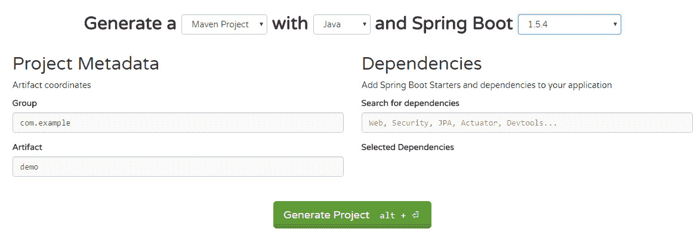

1.  您可以通过在文本后的下拉菜单中选择适当的选项来选择依赖关系管理和构建工具，**Generate a**。

1.  Spring Boot 支持 Java、Kotlin 和 Groovy。您可以通过更改文本后的下拉菜单来选择语言，**with**。

1.  通过在文本后的下拉菜单中选择 Spring Boot 的版本值，选择 Spring Boot。对于这个食谱，我们将使用 Spring Boot 2 的最新里程碑版 2.0.0 M2。

1.  在左侧，在项目元数据下，我们必须提供与 Maven 相关的信息，即组 ID 和工件 ID。我们将组设置为`com.packt`，工件设置为`boot_demo`。

1.  在右侧的依赖项下，你可以搜索你想添加的依赖项。对于这个菜谱，我们需要 web 和 Thymeleaf 依赖项。这意味着我们想要创建一个使用 Thymeleaf UI 模板的 Web 应用程序，并且希望所有依赖项，如 Spring MVC、嵌入式 Tomcat 等，都成为应用程序的一部分。

1.  然后，点击生成项目按钮以下载空项目。你可以将这个空项目加载到你选择的任何 IDE 中，就像其他 Maven 项目一样。

到目前为止，你将把你的空项目加载到你选择的 IDE 中，并准备好进一步探索。在这个菜谱中，我们将使用 Thymeleaf 模板引擎来定义我们的 Web 页面，并创建一个简单的控制器来渲染 Web 页面。

本菜谱的完整代码可以在位置`chp10/1_boot_demo`找到。

# 如何做到这一点...

1.  如果你遵循了*准备就绪*部分中提到的组 ID 和工件 ID 命名，你将有一个包结构`com.packt.boot_demo`和一个为你创建的`BootDemoApplication.java`主类。在`tests`文件夹下将有一个等效的包结构和`BootDemoApplicationTests.java`主类。

1.  在`com.packt.boot_demo`包下创建一个新的类，名为`SimpleViewController`，代码如下：

```java
        @Controller
        public class SimpleViewController{
          @GetMapping("/message")
          public String message(){
            return "message";
          }  
        }
```

1.  在位置`src/main/resources/templates`下创建一个名为`message.html`的 Web 页面，代码如下：

```java
        <h1>Hello, this is a message from the Controller</h1>
        <h2>The time now is [[${#dates.createNow()}]]</h2>
```

1.  从命令提示符导航到项目根目录，并执行命令`mvn spring-boot:run`；你会看到应用程序正在启动。一旦初始化完成并开始运行，它将默认在端口`8080`上运行。导航到`http://localhost:8080/message`以查看消息。

我们正在使用 Spring Boot 的 Maven 插件，它为我们提供了在开发期间启动应用程序的便捷工具。但对于生产环境，我们将创建一个胖 JAR，即包含所有依赖项的 JAR 文件，并将其作为 Linux 或 Windows 服务部署。我们甚至可以使用`java -jar`命令运行胖 JAR。

# 它是如何工作的...

我们不会深入探讨 Spring Boot 或其他 Spring 库的工作原理。但简要来说，Spring Boot 创建了一个在默认端口`8080`上运行的嵌入式 Tomcat。然后，它将类中带有`@SpringBootApplication`注解的包和子包中的所有控制器、组件和服务注册到 Spring 框架中。

在我们的菜谱中，位于`com.packt.boot_demo`包下的`BootDemoApplication`类被注解为`@SpringBootApplication`。因此，所有被注解为`@Controller`、`@Service`、`@Configuration`、`@Component`等注解的类都会注册到 Spring 框架中作为 bean，并由它管理。现在，我们可以通过使用`@Autowired`注解将这些类注入到代码中。

我们有两种方式可以创建一个 Web 控制器：

1.  使用`@Controller`注解

1.  使用`@RestController`注解

在第一种方法中，我们创建了一个可以提供原始数据和 HTML 数据（由模板引擎如 Thymeleaf、Freemarker、JSP 等）生成的控制器。在第二种方法中，控制器支持只能以 JSON 或 XML 格式提供原始数据的端点。在我们的菜谱中，我们使用了前者，如下所示：

```java
@Controller
public class SimpleViewController{
  @GetMapping("/message")
  public String message(){
    return "message";
  }
}
```

我们可以用 `@RequestMapping` 注解类，例如 `@RequestMapping("/api")`。在这种情况下，控制器中暴露的任何 HTTP 端点都将由 `/api` 预先添加。对于 HTTP `GET`、`POST`、`DELETE` 和 `PUT` 方法，有专门的注解映射，分别是 `@GetMapping`、`@PostMapping`、`@DeleteMapping` 和 `@PutMapping`。我们还可以将我们的控制器类重写如下：

```java
@Controller
@RequestMapping("/message")
public class SimpleViewController{
  @GetMapping
  public String message(){
    return "message";
  }
}
```

我们可以通过在 `application.properties` 文件中提供 `server.port = 9090` 来修改端口号。此文件位于 `src/main/resources/application.properties` 位置。我们可以使用一整套属性（[`docs.spring.io/spring-boot/docs/current/reference/html/common-application-properties.html`](http://docs.spring.io/spring-boot/docs/current/reference/html/common-application-properties.html)）来自定义并连接到不同的组件。

# 与数据库交互

在这个菜谱中，我们将探讨如何与数据库集成以创建、读取、修改和删除数据。为此，我们将设置一个包含所需表的 MySQL 数据库。随后，我们将从我们的 Spring Boot 应用程序中更新表中的数据。

我们将使用 Windows 作为本菜谱的开发平台。你同样可以在 Linux 上执行类似操作，但首先你必须设置你的 MySQL 数据库。

# 准备工作

在我们将应用程序与数据库集成之前，我们需要在我们的开发机器上本地设置数据库。在接下来的章节中，我们将下载并安装 MySQL 工具，然后创建一个包含一些数据的示例表，我们将使用这个表与我们的应用程序一起。

# 安装 MySQL 工具

首先，从 [`dev.mysql.com/downloads/windows/installer/5.7.html`](https://dev.mysql.com/downloads/windows/installer/5.7.html) 下载 MySQL 安装程序。这个 MySQL 包仅适用于 Windows。遵循屏幕上的说明成功安装 MySQL 以及其他工具，如 MySQL Workbench。要确认 MySQL 守护进程（`mysqld`）正在运行，打开任务管理器，你应该能看到以下图像中类似的过程：

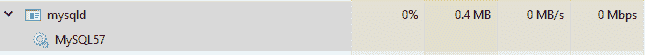

你应该记住为 root 用户设置的密码。

让我们运行 MySQL 工作台；启动时，你应该能看到以下图像以及其他由该工具提供的图像：

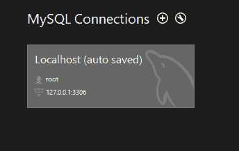

如果您找不到前面的图像中的连接，您可以使用（+）符号添加一个。点击（+）后，您将看到以下对话框。填写它并点击测试连接以获取成功消息：

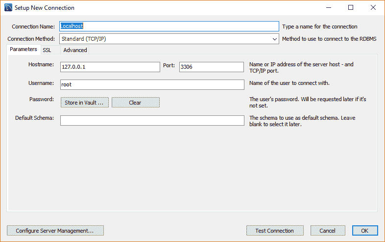

成功的测试连接将产生以下消息：

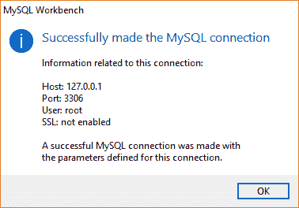

双击连接以连接到数据库，您应该在左侧看到数据库列表，右侧有一个空白区域，顶部有菜单和工具栏。从文件菜单中，点击新建查询标签或，作为替代，按*Ctrl* + *T*以获取一个新的查询窗口。在这里，我们将编写我们的查询以创建数据库并在该数据库中创建一个表。

从[`dev.mysql.com/downloads/windows/installer/5.7.html`](https://dev.mysql.com/downloads/windows/installer/5.7.html)下载的捆绑安装程序仅适用于 Windows。Linux 用户必须分别下载 MySQL 服务器和 MySQL Workbench（与数据库交互的 GUI）。

MySQL 服务器可以从[`dev.mysql.com/downloads/mysql/`](https://dev.mysql.com/downloads/mysql/)下载。

MySQL Workbench 可以从[`dev.mysql.com/downloads/workbench/`](https://dev.mysql.com/downloads/workbench/)下载。

# 创建示例数据库

运行以下 SQL 语句来创建数据库：

```java
create database sample;
```

# 创建人员表

运行以下 SQL 语句以使用新创建的数据库并创建一个简单的人员表：

```java
create table person( 
  id int not null auto_increment,    
  first_name varchar(255),    
  last_name varchar(255),
  place varchar(255),    
  primary key(id)
);
```

# 填充示例数据

让我们继续在我们的新创建的表中插入一些示例数据：

```java
insert into person(first_name, last_name, place) 
values('Raj', 'Singh', 'Bangalore');

insert into person(first_name, last_name, place) 
values('David', 'John', 'Delhi');
```

现在我们已经准备好了数据库，我们将继续从[`start.spring.io/`](http://start.spring.io/)下载空的 Spring Boot 项目，以下是一些选项：

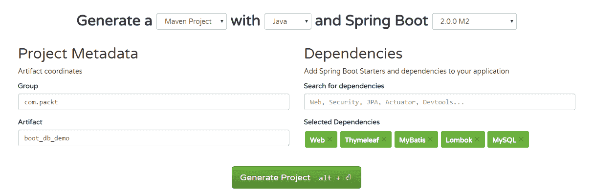

# 如何做到这一点...

1.  创建一个表示人员的模型类`com.packt.boot_db_demo.Person`。我们将使用 Lombok 注解为我们生成 getter 和 setter：

```java
        @Data
        public class Person{
          private Integer id;
          private String firstName;
          private String lastName;
          private String place;
        }
```

1.  让我们创建`com.packt.boot_db_demo.PersonMapper`来将数据库中的数据映射到我们的模型类`Person`：

```java
        @Mapper
        public interface PersonMapper {
        }
```

1.  让我们添加一个方法来获取表中的所有行。注意，接下来的几个方法将编写在`PersonMapper`接口内部：

```java
        @Select("SELECT * FROM person")
        public List<Person> getPersons();
```

1.  另一个方法是通过 ID 获取单个人员的详细信息如下：

```java
        @Select("SELECT * FROM person WHERE id = #{id}")
        public Person getPerson(Integer id);
```

1.  创建表中新行的方法如下：

```java
        @Insert("INSERT INTO person(first_name, last_name, place) " +
                " VALUES (#{firstName}, #{lastName}, #{place})")
        @Options(useGeneratedKeys = true)
        public void insert(Person person);
```

1.  更新表中由 ID 标识的现有行的方法如下：

```java
        @Update("UPDATE person SET first_name = #{firstName}, last_name = 
                #{lastName}, "+ "place = #{place}  WHERE id = #{id} ")
        public void save(Person person);
```

1.  最后，删除表中由 ID 标识的行的方法如下：

```java
        @Delete("DELETE FROM person WHERE id = #{id}")
        public void delete(Integer id);
```

1.  让我们创建一个`com.packt.boot_db_demo.PersonController`类，我们将使用它来编写我们的 Web 端点：

```java
        @Controller
        @RequestMapping("/persons")
        public class PersonContoller {
          @Autowired PersonMapper personMapper;
        }
```

1.  让我们创建一个端点来列出`person`表中的所有条目：

```java
        @GetMapping
        public String list(ModelMap model){
          List<Person> persons = personMapper.getPersons();
          model.put("persons", persons);
          return "list";
        }
```

1.  让我们创建一个端点来在`person`表中添加新行：

```java
        @GetMapping("/{id}")
        public String detail(ModelMap model, @PathVariable Integer id){
          System.out.println("Detail id: " + id);
          Person person = personMapper.getPerson(id);
          model.put("person", person);
          return "detail";
        }
```

1.  让我们在`person`表中创建一个端点来添加新行或编辑现有行：

```java
        @PostMapping("/form")
        public String submitForm(Person person){
          System.out.println("Submiting form person id: " + 
                             person.getId());
          if ( person.getId() != null ){
            personMapper.save(person);
          }else{
            personMapper.insert(person);
          }
          return "redirect:/persons/";
        }  
```

1.  让我们创建一个端点来从`person`表中删除一行：

```java
        @GetMapping("/{id}/delete")
        public String deletePerson(@PathVariable Integer id){
          personMapper.delete(id);
          return "redirect:/persons";
        }
```

1.  最后，我们需要更新`src/main/resources/application.properties`文件，以提供与我们的数据源（即我们的 MySQL 数据库）相关的配置：

```java
        spring.datasource.driver-class-name=com.mysql.jdbc.Driver
        spring.datasource.url=jdbc:mysql://localhost/sample?useSSL=false
        spring.datasource.username=root
        spring.datasource.password=mohamed
        mybatis.configuration.map-underscore-to-camel-case=true
```

你可以使用`mvn spring-boot:run`命令行运行应用程序。该应用程序在默认端口启动，即`8080`。在浏览器中导航到`http://localhost:8080/persons`。

本食谱的完整代码可以在以下位置找到，`chp10/2_boot_db_demo`。

访问`http://localhost:8080/persons`时，你会看到以下内容：

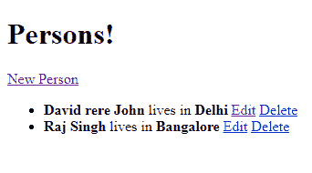

点击**新建人员**后，你会看到以下内容：

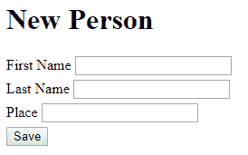

点击**编辑**后，你会看到以下内容：

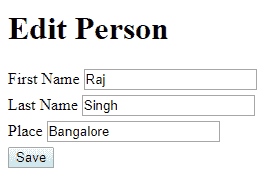

# 它是如何工作的...

首先，`com.packt.boot_db_demo.PersonMapper`被`org.apache.ibatis.annotations.Mapper`注解，知道如何执行`@Select`、`@Update`或`@Delete`注解中提供的查询，并返回相关结果。这一切都由 MyBatis 和 Spring Data 库管理。

你可能想知道数据库连接是如何实现的。Spring Boot 自动配置类之一`DataSourceAutoConfiguration`通过使用你在`application.properties`文件中定义的`spring.datasource.*`属性来设置配置，为我们提供一个`javax.sql.DataSource`实例。然后，MyBatis 库使用这个`javax.sql.DataSource`对象为你提供一个`SqlSessionTemplate`实例，这就是我们的`PersonMapper`在底层使用的。

然后，我们通过使用`@AutoWired`将`com.packt.boot_db_demo.PersonMapper`注入到`com.packt.boot_db_demo.PersonController`类中，来使用`com.packt.boot_db_demo.PersonMapper`。`@AutoWired`注解会查找任何 Spring 管理的 bean，这些 bean 要么是确切类型的实例，要么是其实现。查看本章中的*创建一个简单的 Spring Boot 应用程序*食谱，以了解`@Controller`注解。

通过极少的配置，我们能够快速设置简单的 CRUD 操作。这正是 Spring Boot 为开发者提供的灵活性和敏捷性！

# 创建 RESTful Web 服务

在我们之前的食谱中，我们使用 Web 表单与数据交互。在这个食谱中，我们将看到如何使用 RESTful Web 服务与数据交互。这些 Web 服务是使用已知的 HTTP 协议及其方法（即 GET、POST、PUT 等）与其他应用程序交互的一种方式。数据可以以 XML、JSON 或纯文本的形式交换。在我们的食谱中，我们将使用 JSON。

因此，我们将创建 RESTful API 来支持检索数据、创建新数据、编辑数据和删除数据。

# 准备工作

如往常一样，通过选择以下截图所示的依赖项，从[`start.spring.io/`](http://start.spring.io/)下载启动项目：

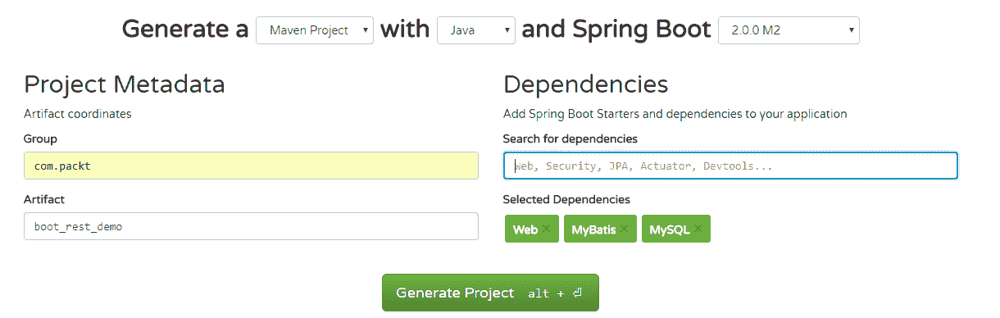

# 如何做到这一点...

1.  我们将从之前的菜谱中复制`Person`类：

```java
        public class Person {
          private Integer id;
          private String firstName;
          private String lastName;
          private String place;
          //required getters and setters
        }
```

1.  我们将以不同的方式处理`PersonMapper`部分。我们将把所有的 SQL 查询写在映射 XML 文件中，然后从`PersonMapper`接口中引用它们。我们将映射 XML 放在`src/main/resources/mappers`文件夹下。我们将`mybatis.mapper-locations`属性的值设置为`classpath*:mappers/*.xml`。这样，`PersonMapper`接口就可以发现与其方法对应的 SQL 查询。

1.  首先，让我们创建`com.packt.boot_rest_demo.PersonMapper`接口：

```java
        @Mapper
        public interface PersonMapper {
          public List<Person> getPersons();
          public Person getPerson(Integer id);
          public void save(Person person);
          public void insert(Person person);
          public void delete(Integer id);
        }
```

1.  现在，让我们在`PersonMapper.xml`中创建 SQL。需要确保的是`<mapper>`标签的`namespace`属性应该与`PersonMapper`映射接口的完全限定名称相同：

```java
        <!DOCTYPE mapper PUBLIC "-//mybatis.org//DTD Mapper 3.0//EN"
          "http://mybatis.org/dtd/mybatis-3-mapper.dtd">
        <mapper namespace="com.packt.boot_rest_demo.PersonMapper">
          <select id="getPersons"
           resultType="com.packt.boot_rest_demo.Person">
            SELECT id, first_name firstname, last_name lastname, place
            FROM person
          </select>

          <select id="getPerson"
           resultType="com.packt.boot_rest_demo.Person"
           parameterType="long">
            SELECT id, first_name firstname, last_name lastname, place
            FROM person
            WHERE id = #{id}
          </select>

          <update id="save"
           parameterType="com.packt.boot_rest_demo.Person">
            UPDATE person SET
              first_name = #{firstName},
              last_name = #{lastName},
              place = #{place}
            WHERE id = #{id}
          </update>

          <insert id="insert" 
           parameterType="com.packt.boot_rest_demo.Person"
           useGeneratedKeys="true" keyColumn="id" keyProperty="id">
            INSERT INTO person(first_name, last_name, place)
            VALUES (#{firstName}, #{lastName}, #{place})
          </insert>

          <delete id="delete" parameterType="long">
            DELETE FROM person WHERE id = #{id}
          </delete>
        </mapper>
```

1.  我们将在`src/main/resources/application.properties`文件中定义应用程序属性：

```java
        spring.datasource.driver-class-name=com.mysql.jdbc.Driver
        spring.datasource.url=jdbc:mysql://localhost/sample?useSSL=false
        spring.datasource.username=root
        spring.datasource.password=mohamed
        mybatis.mapper-locations=classpath*:mappers/*.xml
```

1.  为我们的 REST API 创建一个空的控制器。这个控制器将使用`@RestController`注解，因为其中的所有 API 都将仅处理数据：

```java
        @RestController
        @RequestMapping("/api/persons")
        public class PersonApiController {
          @Autowired PersonMapper personMapper;
        }
```

1.  让我们添加一个 API 来列出`person`表中的所有行：

```java
        @GetMapping
        public ResponseEntity<List<Person>> getPersons(){
          return new ResponseEntity<>(personMapper.getPersons(),
                                      HttpStatus.OK);
        }
```

1.  让我们添加一个 API 来获取单个人员的详细信息：

```java
        @GetMapping("/{id}")
        public ResponseEntity<Person> getPerson(@PathVariable Integer id){
          return new ResponseEntity<>(personMapper.getPerson(id),
                                      HttpStatus.OK);
        }
```

1.  让我们添加一个 API 来向表中添加新数据：

```java
        @PostMapping
        public ResponseEntity<Person> newPerson
                       (@RequestBody Person person){
          personMapper.insert(person);
          return new ResponseEntity<>(person, HttpStatus.OK);
        }
```

1.  让我们添加一个 API 来编辑表中的数据：

```java
        @PostMapping("/{id}")
        public ResponseEntity<Person> updatePerson
                       (@RequestBody Person person,
          @PathVariable Integer id){
            person.setId(id);
            personMapper.save(person);
            return new ResponseEntity<>(person, HttpStatus.OK);
          }
```

1.  让我们添加一个 API 来删除表中的数据：

```java
        @DeleteMapping("/{id}")
        public ResponseEntity<Void> deletePerson
                       (@PathVariable Integer id){
          personMapper.delete(id);
          return new ResponseEntity<>(HttpStatus.OK);
        }
```

您可以在指定位置找到完整的代码，`chp10/3_boot_rest_demo`。您可以从项目文件夹中使用`mvn spring-boot:run`启动应用程序。一旦应用程序启动，导航到`http://localhost:8080/api/persons`以查看人员表中的所有数据。

要测试其他 API，我们将使用 Google Chrome 的 Postman REST 客户端应用。

这就是添加新人员的样子。看看请求体，即 JSON 中指定的人员详细信息：

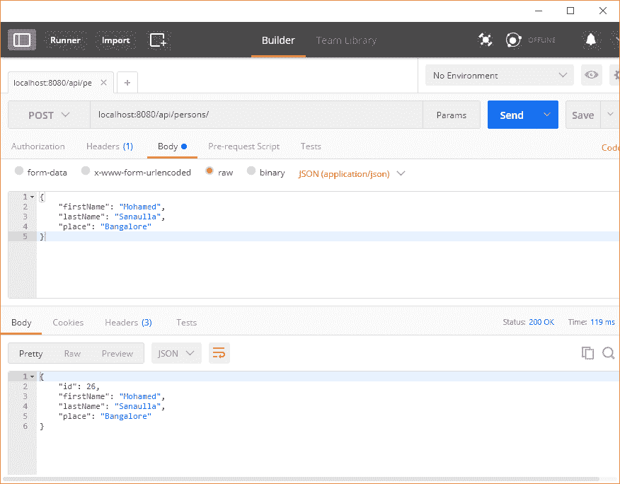

这是我们如何编辑一个人的详细信息：

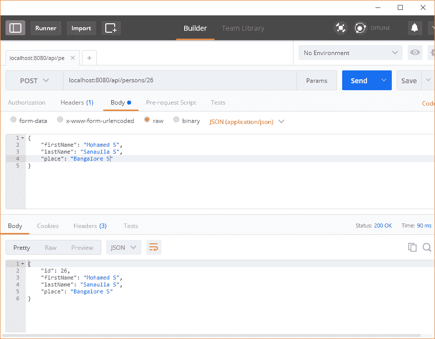

这就是删除一个人的样子：

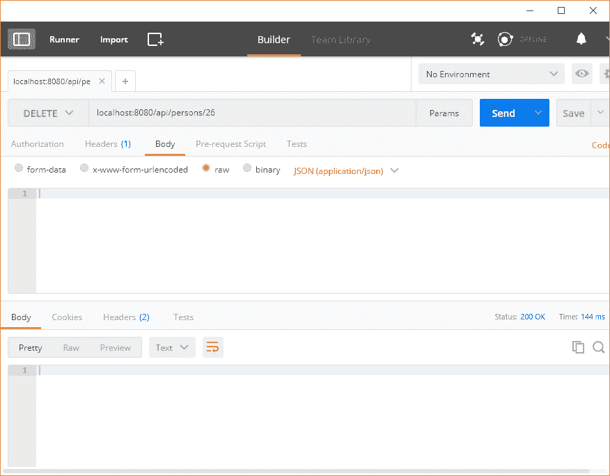

# 它是如何工作的...

首先，让我们看看`PersonMapper`接口是如何发现要执行的 SQL 语句的。如果您查看`src/main/resources/mappers/PersonMapper.xml`，您会发现`<mapper>`的`namespace`属性是`org.packt.boot_rest_demo.PersonMapper`。这是`namespace`属性值应该是映射接口的完全限定名称的要求，在我们的例子中是`org.packt.boot_rest_demo.PersonMapper`。

接下来，在`<select>`、`<insert>`、`<update>`和`<delete>`中定义的各个 SQL 语句的`id`属性应该与映射接口中的方法名称匹配。例如，`PersonMapper`接口中的`getPersons()`方法查找`id="getPersons"`的 SQL 语句。

现在 MyBatis 库通过读取`mybatis.mapper-locations`属性的值来发现这个 mapper XML 的位置。

来到控制器部分，我们引入了一个新的注解`@RestController`。这个特殊的注解除了表示它是一个 Web 控制器外，还表示类中定义的所有方法都返回通过 HTTP 响应体发送的响应；所有 REST API 也是如此。它们只是与数据一起工作。

如同往常一样，你可以通过使用 Maven Spring-Boot 插件`mvn spring-boot:run`或通过执行 Maven 打包创建的 JAR 文件`java -jar my_jar_name.jar`来启动你的 Spring Boot 应用程序。

# 为 Spring Boot 创建多个配置文件

通常，Web 应用程序部署在不同的环境中--首先，它们在开发者的机器上本地运行，然后部署到测试服务器，最后部署到生产服务器。对于每个环境，应用程序都会与位于不同位置的不同组件交互。为此，最佳做法是为每个环境维护不同的配置文件。一种方法是通过创建`application.properties`文件的不同版本来实现，即存储应用程序级别属性的文件的不同版本。这些 Spring Boot 中的属性文件也可以是 YML 文件，例如`application.yml`。即使你创建了不同的版本，你也需要一种机制来告诉你的应用程序根据它部署到的环境选择相关版本的文件。

Spring Boot 为这样的特性提供了惊人的支持。它允许你拥有多个配置文件，每个文件代表一个特定的配置文件，然后，你可以根据应用程序部署到的环境启动应用程序。让我们看看它是如何工作的，然后我们将解释它是如何工作的。

# 准备工作

对于这个食谱，有两种方式来托管 MySQL 数据库的另一个实例：

1.  使用像 AWS 这样的云服务提供商，并使用其 Amazon **关系数据库服务**（**RDS**）([`aws.amazon.com/rds/`](https://aws.amazon.com/rds/))。他们有一定的免费使用限制。

1.  使用像 DigitalOcean([`www.digitalocean.com/`](https://www.digitalocean.com/))这样的云服务提供商，以每月最低 5 美元的价格购买一个 droplet（即服务器）。然后在上面安装 MySQL 服务器。

1.  使用 VirtualBox 在你的机器上安装 Linux，假设我们使用 Windows，或者如果你使用 Linux，则相反。然后在上面安装 MySQL 服务器。

选项从托管数据库服务到服务器，这些服务器可以让你完全访问 root 权限来安装 MySQL 服务器。对于这个食谱，我们做了以下操作：

1.  我们从 DigitalOcean 购买了基本 droplet。

1.  我们使用`sudo apt-get install mysql-server-5.7`安装 MySQL，并为 root 用户设置密码。

1.  我们创建了一个名为`springboot`的新用户，这样我们就可以使用这个用户从我们的 RESTful Web 服务应用程序连接：

```java
 $ mysql -uroot -p
 Enter password: 
 mysql> create user 'springboot'@'%' identified by 'springboot';
```

1.  我们修改了 MySQL 配置文件，以便 MySQL 允许远程连接。这可以通过在`/etc/mysql/mysql.conf.d/mysqld.cnf`文件中编辑`bind-address`属性为服务器的 IP 地址来实现。

1.  从 MySQL 工作台，我们通过使用`IP = <Digital Ocean droplet IP>`、`username = springboot`和`password = springboot`添加了新的 MySQL 连接。

在 Ubuntu OS 中，MySQL 配置文件的位置是`/etc/mysql/mysql.conf.d/mysqld.cnf`。找出特定于您的操作系统的配置文件位置的一种方法如下：

1.  运行`mysql --help`

1.  在输出中，搜索`Default options are read from the following files in the given order:`，后面是 MySQL 配置文件的可能位置。

我们将创建所需的表并填充一些数据。但在那之前，我们将以`root`用户创建`sample`数据库，并授予`springboot`用户对该数据库的所有权限。

```java
mysql -uroot
Enter password: 

mysql> create database sample;

mysql> GRANT ALL ON sample.* TO 'springboot'@'%';
Query OK, 0 rows affected (0.00 sec)

mysql> flush privileges;
```

现在，让我们以`springboot`用户连接到数据库，创建所需的表，并用一些示例数据填充它：

```java
mysql -uspringboot -pspringboot

mysql> use sample
Database changed
mysql> create table person(
-> id int not null auto_increment,
-> first_name varchar(255),
-> last_name varchar(255),
-> place varchar(255),
-> primary key(id)
-> );
Query OK, 0 rows affected (0.02 sec)

mysql> INSERT INTO person(first_name, last_name, place) VALUES('Mohamed', 'Sanaulla', 'Bangalore');
mysql> INSERT INTO person(first_name, last_name, place) VALUES('Nick', 'Samoylov', 'USA');

mysql> SELECT * FROM person;
+----+------------+-----------+-----------+
| id | first_name | last_name | place     |
+----+------------+-----------+-----------+
| 1  | Mohamed    | Sanaulla  | Bangalore |
| 2  | Nick       | Samoylov  | USA       |
+----+------------+-----------+-----------+
2 rows in set (0.00 sec)
```

现在我们已经准备好了 MySQL DB 的云实例。让我们看看如何根据应用程序运行的配置来管理两个不同连接的信息。

为此菜谱所需的初始示例应用程序可以在位置`chp10/4_boot_multi_profile_incomplete`找到。我们将转换此应用程序，使其能够在不同的环境中运行。

# 如何做到这一点...

1.  在`src/main/resources/application.properties`文件中，添加一个新的`springboot`属性，`spring.profiles.active = local`。

1.  在`src/main/resources/`位置创建一个新的文件，`application-local.properties`。

1.  将以下属性添加到`application-local.properties`中，并从`application.properties`文件中删除它们：

```java
        spring.datasource.url=jdbc:mysql://localhost/sample?useSSL=false
        spring.datasource.username=root
        spring.datasource.password=mohamed
```

1.  在`src/main/resources/`处创建另一个文件，`application-cloud.properties`。

1.  将以下属性添加到`application-cloud.properties`中：

```java
        spring.datasource.url=jdbc:mysql://<digital_ocean_ip>/sample?                                useSSL=false
        spring.datasource.username=springboot
        spring.datasource.password=springboot
```

完整应用程序的完整代码可以在`chp10/4_boot_multi_profile_incomplete`**.**处找到。您可以通过使用`mvn spring-boot:run`命令来运行应用程序。Spring Boot 从`application.properties`文件中读取`spring.profiles.active`属性，并在本地配置下运行应用程序。在浏览器中打开 URL，`http://localhost:8080/api/persons`，以找到以下数据：

```java
[ 
  {
    "id": 1,
    "firstName": "David ",
    "lastName": "John",
    "place": "Delhi"
  },
  {
    "id": 2,
    "firstName": "Raj",
    "lastName": "Singh",
    "place": "Bangalore"
  }
]
```

现在，通过使用`mvn spring-boot:run -Dspring.profiles.active=cloud`命令在云配置下运行应用程序。然后，在浏览器中打开`http://localhost:8080/api/persons`以找到以下数据：

```java
[
  {
    "id": 1,
    "firstName": "Mohamed",
    "lastName": "Sanaulla",
    "place": "Bangalore"
  },
  {
    "id": 2,
    "firstName": "Nick",
    "lastName": "Samoylov",
    "place": "USA"
  }
]
```

您可以看到，相同的 API 返回了不同的数据集，而先前的数据已被插入到我们在云上运行的 MySQL 数据库中。因此，我们已经成功地在两个不同的配置下运行了应用程序：本地和云。

# 它是如何工作的...

Spring Boot 可以以多种方式读取应用程序的配置。这里按相关性的顺序列出了一些重要的方式（在较早的源中定义的属性会覆盖在较晚的源中定义的属性）：

+   从命令行。使用 `-D` 选项指定属性，就像我们在云配置文件中启动应用程序时做的那样，`mvn spring-boot:run -Dspring.profiles.active=cloud`。或者，如果您正在使用 JAR 文件，那么它将是 `java -Dspring.profiles.active=cloud -jar myappjar.jar`。

+   从 Java 系统属性，使用 `System.getProperties()`。

+   操作系统环境变量。

+   与特定配置文件相关的应用程序属性，`application-{profile}.properties` 或 `application-{profile}.yml` 文件，位于打包的 JAR 文件之外。

+   打包在 JAR 中的特定配置文件应用程序属性 `application-{profile}.properties` 或 `application-{profile}.yml` 文件。

+   定义在打包的 JAR 之外的应用程序属性，`application.properties` 或 `application.yml`。

+   打包在 JAR 中的应用程序属性，`application.properties` 或 `application.yml`。

+   作为属性源（带有 `@PropertySource` 注解）的配置类（即带有 `@Configuration` 注解的类）。

+   Spring Boot 的默认属性。

在我们的配方中，我们在 `application.properties` 文件中指定了所有通用的属性，如下所示，并且任何特定配置文件的属性都在特定配置文件的应用程序属性文件中指定：

```java
spring.profiles.active=local
spring.datasource.driver-class-name=com.mysql.jdbc.Driver

mybatis.mapper-locations=classpath*:mappers/*.xml
mybatis.configuration.map-underscore-to-camel-case=true  
```

从前面的列表中，我们可以找到 `application.properties` 或 `application-{profile}.properties` 文件可以定义在应用程序 JAR 之外。Spring Boot 将在默认位置搜索属性文件，其中一个路径是应用程序运行当前目录的 `config` 子目录。

Spring Boot 支持的所有应用程序属性的完整列表可以在 [`docs.spring.io/spring-boot/docs/current/reference/html/common-application-properties.html`](http://docs.spring.io/spring-boot/docs/current/reference/html/common-application-properties.html) 找到。除了这些之外，我们还可以创建我们应用程序所需的自己的属性。

完整代码可以在位置 `chp10/4_boot_multi_profile_complete` 找到。

# 还有更多...

我们可以使用 Spring Boot 创建一个配置服务器，该服务器将作为所有配置文件中所有应用程序的所有属性的存储库。然后，客户端应用程序可以连接到配置服务器，根据应用程序名称和应用程序配置读取相关属性。

在配置服务器中，可以使用类路径或 GitHub 仓库从文件系统读取应用程序属性。使用 GitHub 仓库的优势在于属性文件可以进行版本控制。配置服务器中的属性文件可以更新，并且可以通过设置消息队列来中继更改，将这些更新推送到客户端应用程序。另一种方法是使用 `@RefreshScope` 实例，并在需要客户端应用程序拉取配置更改时调用 `/refresh` API。

# 在 Heroku 上部署 RESTful 网络服务

**平台即服务**（**PaaS**）是云计算模型之一（其他两个是**软件即服务**（**SaaS**）和**基础设施即服务**（**IaaS**）），其中云计算提供商提供管理的计算平台，包括操作系统、编程语言运行时、数据库以及其他附加功能，如队列、日志管理和警报。他们还提供工具以简化部署，并提供仪表板以监控您的应用程序。

Heroku 是 PaaS（平台即服务）提供商领域的早期参与者之一。它支持以下编程语言：Ruby、Node.js、Java、Python、Clojure、Scala、Go 和 PHP。Heroku 支持多种数据存储，如 MySQL、MongoDB、Redis 和 Elastic search。它提供与日志工具、网络工具、电子邮件服务和监控工具的集成。

Heroku 提供了一个名为 heroku-cli 的命令行工具（[cli.heroku.com](http://cli.heroku.com)），可用于创建 Heroku 应用程序、部署、监控、添加资源等。他们提供的网页仪表板功能也由 CLI 支持。它使用 Git 存储应用程序的源代码。因此，当您将应用程序代码推送到 Heroku 的 Git 仓库时，它将根据您使用的构建包触发构建。然后，它将使用默认方式启动应用程序或使用 `ProcFile` 执行您的应用程序。

在本食谱中，我们将部署我们的基于 Spring Boot 的 RESTful 网络服务到 Heroku。我们将继续使用在前一个食谱“为 Spring Boot 创建多个配置文件”中创建的数据库。

# 准备工作

在我们开始在 Heroku 上部署我们的示例应用程序之前，我们需要注册一个 Heroku 账户并安装其工具，这将使我们能够从命令行工作。在接下来的章节中，我们将指导您完成注册过程，通过网页用户界面创建一个示例应用程序，以及通过 Heroku **命令行界面**（**CLI**）创建。

# 设置 Heroku 账户

如果您还没有账户，请访问 [`www.heroku.com`](http://www.heroku.com) 并注册。如果您已有账户，则可以登录。注册的 URL 是 [`signup.heroku.com`](https://signup.heroku.com)：

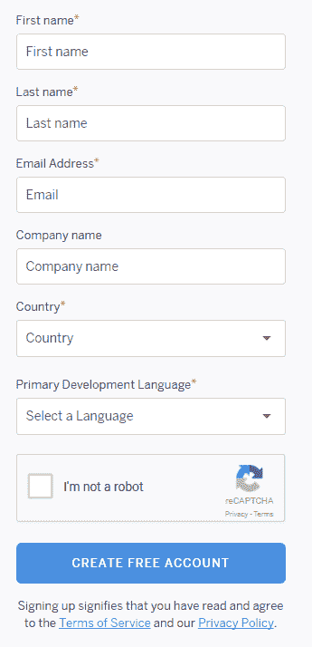

登录的 URL 是 [`id.heroku.com/login`](https://id.heroku.com/login)：

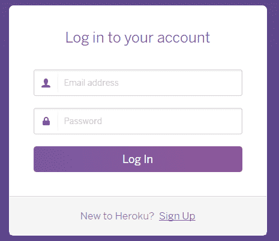

登录成功后，您将看到一个包含应用程序列表的仪表板，如果您有任何应用程序：

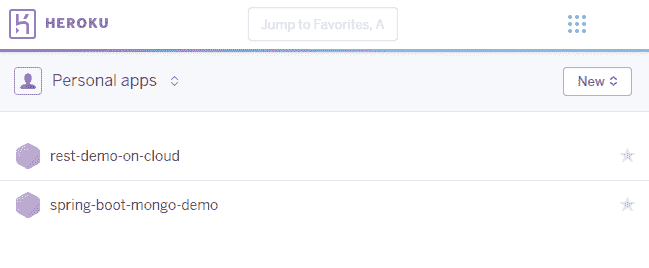

# 从 UI 创建新应用

点击“新建 | 创建新应用”，并填写以下截图中的详细信息，然后点击“创建应用”：

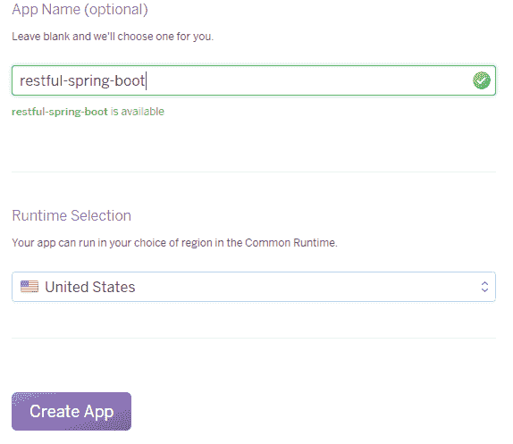

# 从 CLI 创建新应用

执行以下步骤从 CLI 创建新应用：

1.  从[`cli.heroku.com`](https://cli.heroku.com)安装 Heroku CLI。

1.  安装完成后，Heroku 应该位于您的系统`PATH`变量中。

1.  打开命令提示符并运行`heroku create`。您将看到类似于以下输出的内容：

```java
 Creating app... done, glacial-beyond-27911
 https://glacial-beyond-27911.herokuapp.com/ |
 https://git.heroku.com/glacial-beyond-27911.git
```

1.  应用程序名称是动态生成的，并创建了一个远程 Git 仓库。您可以通过运行命令指定应用程序名称和区域（如通过 UI 执行）：

```java
 $ heroku create test-app-9812 --region us
 Creating test-app-9812... done, region is us
 https://test-app-9812.herokuapp.com/ |
      https://git.heroku.com/test-app-9812.git
```

将部署到 Heroku 是通过`git push`到在 Heroku 上创建的远程 Git 仓库完成的。我们将在下一节中看到这一点。

我们在`chp10/5_boot_on_heroku`有应用程序的源代码。因此，复制此应用程序并继续在 Heroku 上部署。

在运行 Heroku cli 中的任何命令之前，您必须登录到 Heroku 账户。您可以通过运行命令`heroku login`来登录。

# 如何操作...

1.  运行以下命令创建 Heroku 应用程序：

```java
 $ heroku create <app_name> -region us
```

1.  在项目文件夹中初始化 Git 仓库：

```java
 $ git init
```

1.  将 Heroku Git 仓库作为远程仓库添加到本地 Git 仓库：

```java
 $ heroku git:remote -a <app_name_you_chose>
```

1.  将源代码，即 master 分支，推送到 Heroku Git 仓库：

```java
 $ git add .
 $ git commit -m "deploying to heroku"
 $ git push heroku master
```

1.  当代码推送到 Heroku Git 仓库时，会触发构建。由于我们使用 Maven，它会运行以下命令：

```java
 ./mvnw -DskipTests clean dependency:list install
```

1.  代码完成构建和部署后，您可以使用`heroku open`命令打开应用程序。这将使用浏览器打开应用程序。

1.  您可以使用`heroku logs --tail`命令监控应用程序的日志。

应用程序成功部署后，运行`heroku open`命令后，您应该在浏览器中看到正在加载的 URL：

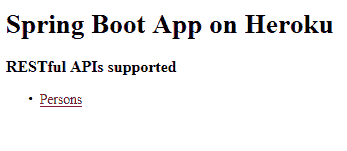

点击“人员”链接将显示以下信息：

```java
[
  {
    "id":1,
    "firstName":"Mohamed",
    "lastName":"Sanaulla",
    "place":"Bangalore"
  },
  {
    "id":2,
    "firstName":"Nick",
    "lastName":"Samoylov",
    "place":"USA"
  }
]
```

这里有趣的是，我们的应用程序正在 Heroku 上运行，它连接到 DigitalOcean 服务器上的 MySQL 数据库。我们甚至可以与 Heroku 应用程序一起配置数据库并连接到该数据库。在“更多...”部分查看如何操作。

# 更多...

1.  向应用程序添加新的数据库附加组件：

```java
 $ heroku addons:create jawsdb:kitefin
```

这里，`addons:create`接受附加组件名称和服务计划名称，两者之间用冒号（`:`）分隔。您可以在[`elements.heroku.com/addons/jawsdb-maria`](https://elements.heroku.com/addons/jawsdb-maria)了解更多关于附加组件和计划的详细信息。此外，所有附加组件详情页面末尾都提供了将附加组件添加到应用程序的 Heroku CLI 命令。

1.  打开数据库仪表板以查看连接详情，例如 URL、用户名、密码和数据库名称：

```java
 $ heroku addons:open jawsdb
```

`jawsdb`仪表板看起来与以下所示类似：

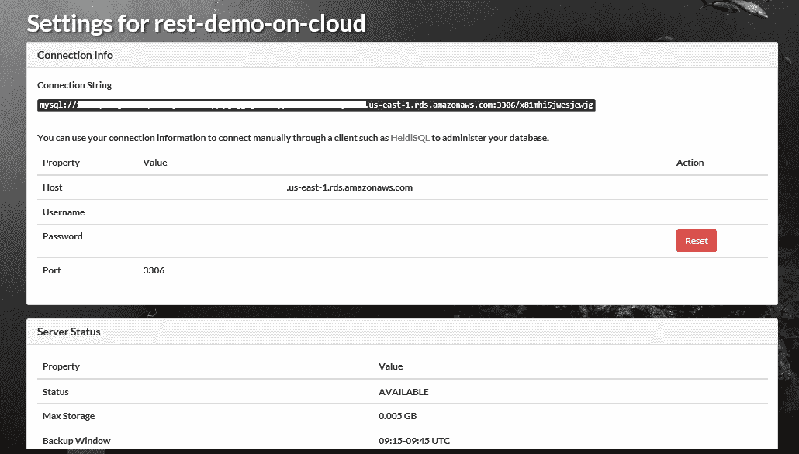

1.  您甚至可以从`JAWSDB_URL`配置属性中获取 MySQL 连接字符串。您可以使用以下命令列出您应用的配置：

```java
 $ heroku config
 === rest-demo-on-cloud Config Vars
 JAWSDB_URL: <URL>
```

1.  复制连接详情，在 MySQL Workbench 中创建一个新的连接并连接到此连接。数据库名称也是由附加组件创建的。连接到数据库后，运行以下 SQL 语句：

```java
        use x81mhi5jwesjewjg;
        create table person( 
          id int not null auto_increment, 
          first_name varchar(255), 
          last_name varchar(255), 
          place varchar(255), 
          primary key(id)
        );

        INSERT INTO person(first_name, last_name, place) 
        VALUES('Heroku First', 'Heroku Last', 'USA');

        INSERT INTO person(first_name, last_name, place) 
        VALUES('Jaws First', 'Jaws Last', 'UK');
```

1.  在`src/main/resources`下为 Heroku 配置创建一个新的属性文件，名为`application-heroku.properties`，包含以下属性：

```java
        spring.datasource.url=jdbc:mysql://
        <URL DB>:3306/x81mhi5jwesjewjg?useSSL=false
        spring.datasource.username=zzu08pc38j33h89q
        spring.datasource.password=<DB password>

```

您可以从附加仪表板中找到连接相关详情。

1.  更新`src/main/resources/application.properties`文件，将`spring.profiles.active`属性的值替换为`heroku`

1.  将更改提交并推送到 Heroku 远程仓库：

```java
 $ git commit -am"using heroky mysql addon"
 $ git push heroku master
```

1.  部署成功后，运行`heroku open`命令。然后，一旦页面在浏览器中加载，点击“人员”链接。这次，您将看到一组不同的数据，这是我们输入到我们的 Heroku 附加组件中的：

```java
        [
          {
            "id":1,
            "firstName":"Heroku First",
            "lastName":"Heroku Last",
            "place":"USA"
          },
          {
            "id":2,
            "firstName":"Jaws First",
            "lastName":"Jaws Last",
            "place":"UK"
          }
        ]
```

通过这种方式，我们已经与在 Heroku 上创建的数据库集成了。

# 使用 Docker 容器化 RESTful Web 服务

我们从应用安装在服务器上的时代，到每个服务器都被虚拟化，然后应用被安装在这些较小的虚拟机上，我们已经取得了很大的进步。通过添加更多的虚拟机，并让应用运行到负载均衡器上，解决了应用的扩展性问题。

在虚拟化中，通过在多个虚拟机之间分配计算能力、内存和存储，一个大服务器被分割成多个虚拟机。这样，每个虚拟机本身就能够具备服务器所具有的所有功能，尽管规模较小。这种方式，虚拟化大大帮助我们合理利用服务器的计算、内存和存储资源。

然而，虚拟化需要一些设置，也就是说，您需要创建虚拟机，安装所需的依赖项，然后运行应用。此外，您可能无法 100%确定应用是否能够成功运行。失败的原因可能是由于不兼容的操作系统版本，甚至可能是由于在设置过程中遗漏了一些配置或缺失的依赖项。这种设置还导致了一些水平扩展的困难，因为虚拟机的配置和应用的部署都需要花费一些时间。

使用 Puppet 和 Chef 等工具确实有助于配置，但设置应用时往往会遇到一些问题，这些问题可能是由于缺少或错误的配置引起的。这导致了另一个概念的出现，即容器化。

在虚拟化的世界中，我们有宿主操作系统和虚拟化软件，即虚拟机管理程序。然后我们最终创建了多个机器，每个机器都有自己的操作系统，应用程序就在这些操作系统上运行。然而，在容器化中，我们不分割服务器的资源。相反，我们有一个带有宿主操作系统的服务器，在其之上，我们有一个容器化层，这是一个软件抽象层。我们将应用程序打包成容器，其中容器只包含运行应用程序所需的足够操作系统功能、应用程序的软件依赖以及应用程序本身。以下图像来自 [`docs.docker.com/get-started/#container-diagram`](https://docs.docker.com/get-started/#containers-vs-virtual-machines)，最能描绘这一点：

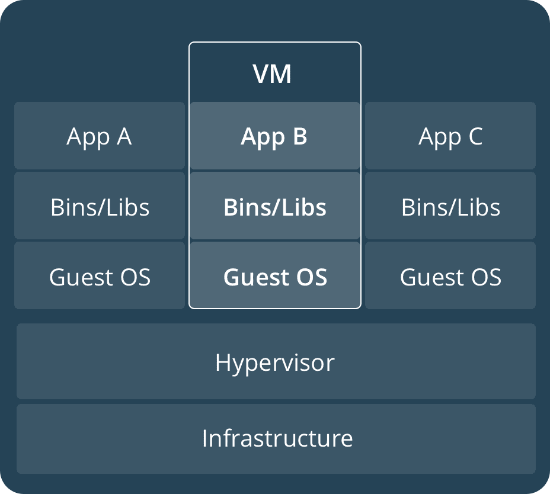

前面的图像展示了虚拟化系统的典型架构。下面的图像展示了容器化系统的典型架构：

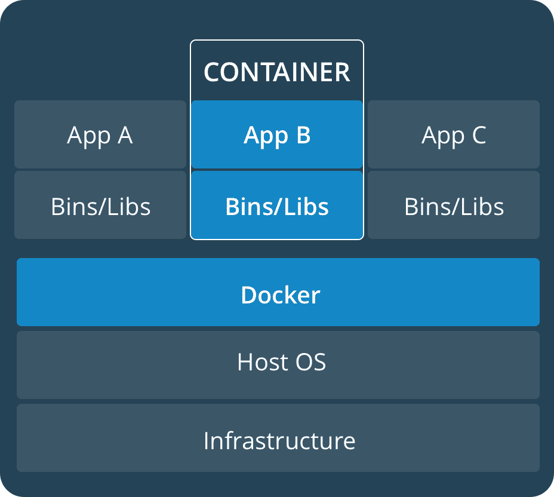

容器化的最大优势在于，你可以将应用程序的所有依赖项打包到一个容器镜像中。然后，这个镜像在容器化平台上运行，从而创建一个容器。我们可以在服务器上同时运行多个容器。如果需要添加更多实例，我们只需部署镜像，并且这种部署可以自动化，以支持简单易行的高可扩展性。

Docker 是全球最受欢迎的软件容器化平台。在本教程中，我们将把位于指定位置的示例应用程序打包成 Docker 镜像，并运行 Docker 镜像来启动我们的应用程序。

# 准备工作

对于本教程，我们将使用运行 Ubuntu 16.04.2 x64 的 Linux 服务器。

1.  从 [`download.docker.com/linux/ubuntu/dists/xenial/pool/stable/amd64/`](https://download.docker.com/linux/ubuntu/dists/xenial/pool/stable/amd64/) 下载最新的 `.deb` 文件。对于其他 Linux 发行版，你可以在 [`download.docker.com/linux/`](https://download.docker.com/linux/) 找到相应的软件包：

```java
 $ wget https://download.docker.com/linux/ubuntu/dists/xenial
        /pool/stable/amd64/docker-ce_17.03.2~ce-0~ubuntu-xenial_amd64.deb
```

1.  使用 `dpkg` 软件包管理器安装 Docker 软件包：

```java
 $  sudo dpkg -i docker-ce_17.03.2~ce-0~ubuntu-xenial_amd64.deb
```

软件包的名称将根据你下载的版本而有所不同。

1.  安装成功后，Docker 服务开始运行。你可以使用 `service` 命令来验证这一点：

```java
 $ service docker status
 docker.service - Docker Application Container Engine
 Loaded: loaded (/lib/systemd/system/docker.service; enabled;
        vendor preset: enabled)
 Active: active (running) since Fri 2017-07-28 13:46:50 UTC;
              2min 3s ago
 Docs: https://docs.docker.com
 Main PID: 22427 (dockerd)
```

要容器化的应用程序位于源代码下载的 `chp10/6_boot_with_docker` 位置。

# 如何操作...

1.  在应用程序的根目录下创建 `Dockerfile`，内容如下：

```java
 FROM ubuntu:17.10
      FROM openjdk:9-b177-jdk
 VOLUME /tmp
 ADD target/boot_docker-1.0.jar restapp.jar
 ENV JAVA_OPTS="-Dspring.profiles.active=cloud"
      ENTRYPOINT [ "sh", "-c", "java $JAVA_OPTS -jar /restapp.jar" ]
```

1.  运行以下命令，使用前面步骤中创建的 `Dockerfile` 构建 Docker 镜像：

```java
 $ docker build --tag restapp-image .

 Sending build context to Docker daemon 18.45 MB
 Step 1/6 : FROM ubuntu:17.10
 ---> c8cdcb3740f8
 Step 2/6 : FROM openjdk:9-b177-jdk
 ---> 38d822ff5025
 Step 3/6 : VOLUME /tmp
 ---> Using cache
 ---> 38367613d375
 Step 4/6 : ADD target/boot_docker-1.0.jar restapp.jar
 ---> Using cache
 ---> 54ad359f53f7
 Step 5/6 : ENV JAVA_OPTS "-Dspring.profiles.active=cloud"
 ---> Using cache
 ---> dfa324259fb1
 Step 6/6 : ENTRYPOINT sh -c java $JAVA_OPTS -jar /restapp.jar
 ---> Using cache
 ---> 6af62bd40afe
 Successfully built 6af62bd40afe
```

1.  你可以使用命令查看已安装的镜像：

```java
 $ docker images

      REPOSITORY     TAG        IMAGE ID     CREATED     SIZE
 restapp-image  latest     6af62bd40afe 4 hours ago 606 MB
 openjdk        9-b177-jdk 38d822ff5025 6 days ago  588 MB
 ubuntu         17.10      c8cdcb3740f8 8 days ago  93.9 MB
```

你会看到还有 OpenJDK 和 Ubuntu 镜像。这些是为了构建我们的应用程序镜像而下载的，并且列在第一位。

1.  现在，我们需要运行镜像以创建一个包含运行应用程序的容器的容器：

```java
 docker run -p 8090:8080 -d --name restapp restapp-image
 d521b9927cec105d8b69995ef6d917121931c1d1f0b1f4398594bd1f1fcbee55
```

在 `run` 命令之后打印出的长字符串是容器的标识符。您可以使用前几个字符来唯一标识容器。或者，您可以使用容器名称，`restapp`。

1.  应用程序已经启动。您可以通过运行以下命令来查看日志：

```java
 docker logs restapp
```

1.  您可以使用以下命令查看创建的 Docker 容器：

```java
 docker ps
```

上述命令的输出类似于以下所示：

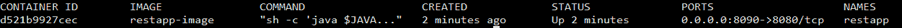

1.  您可以使用以下命令管理容器：

```java
 $ docker stop restapp
 $ docker start restapp
```

一旦应用程序运行，打开 `http://<hostname>:8090/api/persons`。

# 它是如何工作的...

您通过定义 `Dockerfile` 来定义容器结构和其内容。`Dockerfile` 遵循一种结构，其中每一行都是 `INSTRUCTION arguments` 的形式。存在一组预定义的指令，包括 `FROM`、`RUN`、`CMD`、`LABEL`、`ENV`、`ADD`、`COPY` 以及其他指令。完整的列表可以在 [`docs.docker.com/engine/reference/builder/#from`](https://docs.docker.com/engine/reference/builder/#from) 找到。让我们看看我们定义的 `Dockerfile`：

```java
FROM ubuntu:17.10
FROM openjdk:9-b177-jdk
VOLUME /tmp
ADD target/boot_docker-1.0.jar restapp.jar
ENV JAVA_OPTS="-Dspring.profiles.active=cloud"
ENTRYPOINT [ "sh", "-c", "java $JAVA_OPTS -jar /restapp.jar" ]
```

使用 `FROM` 指令的前两行指定了我们的 Docker 镜像的基础镜像。我们使用 Ubuntu 操作系统镜像作为基础镜像，然后与 OpenJDK 9 镜像结合。`VOLUME` 指令用于指定镜像的挂载点。这通常是在主机操作系统中的一个路径。

`ADD` 指令用于将文件从源目录复制到工作目录下的目标目录。`ENV` 指令用于定义环境变量。

`ENTRYPOINT` 指令用于配置容器以可执行方式运行。对于此指令，我们传递一个参数数组，否则我们将直接从命令行执行这些参数。在我们的场景中，我们使用 bash shell 来运行 `java -$JAVA_OPTS -jar <jar name>`。

一旦我们定义了 `Dockerfile`，我们就指导 Docker 工具使用 `Dockerfile` 构建镜像。我们还使用 `--tag` 选项为镜像提供名称。在构建我们的应用程序镜像时，它将下载所需的基于镜像，在我们的例子中是 Ubuntu 和 OpenJDK 镜像。因此，如果您列出 Docker 镜像，您将看到基础镜像以及我们的应用程序镜像。

这个 Docker 镜像是一个可重用的实体。如果我们需要更多应用程序的实例，我们可以使用 `docker run` 命令创建一个新的容器。当我们运行 Docker 镜像时，我们有多个选项，其中之一是 `-p` 选项，它将容器内的端口映射到主机操作系统。在我们的例子中，我们将 Spring Boot 应用程序的 `8080` 端口映射到主机操作系统的 `8090`。

现在，为了检查运行中的应用程序的状态，我们可以使用 `docker logs restapp` 命令来查看日志。除了这个之外，`docker` 工具支持多个命令。强烈建议运行 `docker help` 并探索支持的命令。

Docker 公司，作为 Docker 背后的公司，创建了一系列基础镜像，这些镜像可以用来创建容器。例如，有 MySQL 数据库、Couchbase、Ubuntu 以及其他操作系统的镜像。您可以在[`store.docker.com/`](https://store.docker.com/)上探索这些包。
