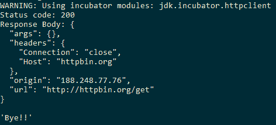

# 网络通信

在本章中，我们将介绍以下菜谱：

+   发送 HTTP GET 请求

+   发送 HTTP POST 请求

+   为受保护资源发送 HTTP 请求

+   发送异步 HTTP 请求

+   使用 Apache HttpClient 发送 HTTP 请求

+   使用 Unirest HTTP 客户端库发送 HTTP 请求

# 简介

Java 对与 HTTP 特定功能的交互支持一直非常原始。自 JDK 1.1 以来可用的 `HttpURLConnection` 类提供了与具有 HTTP 特定功能的 URL 交互的 API。由于此 API 在 HTTP/1.1 之前就已经存在，它缺乏高级功能，使用起来很不方便。这就是为什么开发者大多求助于使用第三方库，例如 **Apache HttpClient**、Spring 框架、HTTP API 等等。

在 JDK 9 中，一个新的 HTTP 客户端 API 正在 JEP 110 ([`openjdk.java.net/jeps/110`](http://openjdk.java.net/jeps/110)) 下引入。不幸的是，这个 API 正在被引入为一个孵化模块 ([`openjdk.java.net/jeps/11`](http://openjdk.java.net/jeps/11))。孵化模块包含非最终 API，这些 API 非常庞大，并且尚未完全成熟，不能包含在 Java SE 中。这是一种 API 的 beta 版本，以便开发者能够更早地使用这些 API。但这里的难点是，这些 API 在 JDK 的新版本中没有向后兼容性支持。这意味着依赖于孵化模块的代码可能会在新版本的 JDK 中中断。这可能是由于孵化模块被提升到 Java SE 或被无声地从孵化模块中删除。

无论如何，了解可能在未来 JDK 版本中出现的 HTTP 客户端 API 将是有益的。除此之外，了解我们现在拥有的替代方案也是有益的。因此，在本章中，我们将介绍一些菜谱，展示如何在 JDK 9 孵化模块中使用 HTTP 客户端 API，然后介绍一些其他 API，这些 API 使用了 Apache HttpClient ([`hc.apache.org/httpcomponents-client-ga/`](http://hc.apache.org/httpcomponents-client-ga/)) API 和 Unirest Java HTTP 库 ([`unirest.io/java.html`](http://unirest.io/java.html))。

# 发送 HTTP GET 请求

在这个菜谱中，我们将探讨使用 JDK 9 HTTP 客户端 API 向 URL 发送 `GET` 请求，[`httpbin.org/get`](http://httpbin.org/get)。

# 如何做到...

1.  使用 `jdk.incubator.http.HttpClient.Builder` 构建器创建 `jdk.incubator.http.HttpClient` 的实例：

```java
        HttpClient client = HttpClient.newBuilder().build();
```

1.  使用 `jdk.incubator.http.HttpRequest.Builder` 构建器创建 `jdk.incubator.http.HttpRequest` 的实例。请求的 URL 应该提供为 `java.net.URI` 的实例：

```java
        HttpRequest request = HttpRequest
                    .newBuilder(new URI("http://httpbin.org/get"))
                    .GET()
                    .version(HttpClient.Version.HTTP_1_1)
                    .build();
```

1.  使用 `jdk.incubator.http.HttpClient` 的 `send` API 发送 HTTP 请求。此 API 接受 `jdk.incubator.http.HttpRequest` 的实例和 `jdk.incubator.http.HttpResponse.BodyHandler` 的实现：

```java
        HttpResponse<String> response = client.send(request,
                             HttpResponse.BodyHandler.asString());
```

1.  打印 `jdk.incubator.http.HttpResponse` 的状态码和响应体：

```java
        System.out.println("Status code: " + response.statusCode());
        System.out.println("Response Body: " + response.body());
```

此代码的完整内容可以在位置 `chp11/1_making_http_get` 找到。你可以使用运行脚本 `run.bat` 或 `run.sh` 来编译和运行代码：


# 它是如何工作的...

向 URL 发送 HTTP 请求主要有两个步骤：

1.  创建 HTTP 客户端以发起调用。

1.  设置目标 URL、必需的 HTTP 头部和 HTTP 方法类型，即 `GET`、`POST` 或 `PUT`。

Java HTTP 客户端 API 提供了一个构建器类 `jdk.incubator.http.HttpClient.Builder`，它可以用来构建 `jdk.incubator.http.HttpClient` 的实例，同时利用构建器 API 来设置 `jdk.incubator.http.HttpClient`。以下代码片段展示了如何使用默认配置获取 `jdk.incubator.http.HttpClient` 的实例：

```java
HttpClient client = HttpClient.newHttpClient();
```

以下代码片段使用构建器进行配置，然后创建 `jdk.incubator.http.HttpClient` 的实例：

```java
HttpClient client = HttpClient
                    .newBuilder()
                    //redirect policy for the client. Default is NEVER
                    .followRedirects(HttpClient.Redirect.ALWAYS) 
                    //HTTP client version. Defabult is HTTP_2
                    .version(HttpClient.Version.HTTP_1_1)
                    //few more APIs for more configuration
                    .build();
```

构建器中还有更多 API，例如设置身份验证、代理和提供 SSL 上下文，我们将在不同的菜谱中查看。

设置目标 URL 只是创建一个 `jdk.incbator.http.HttpRequest` 的实例，使用其构建器和 API 进行配置。以下代码片段展示了如何创建 `jdk.incbator.http.HttpRequest` 的实例：

```java
HttpRequest request = HttpRequest
                .newBuilder()
                .uri(new URI("http://httpbin.org/get")
                .headers("Header 1", "Value 1", "Header 2", "Value 2")
                .timeout(Duration.ofMinutes(5))
                .version(HttpClient.Version.HTTP_1_1)
                .GET()
                .build();
```

`jdk.incubator.http.HttpClient` 对象提供了两个 API 来进行 HTTP 调用：

+   使用 `HttpClient#send()` 方法同步发送

+   使用 `HttpClient#sendAsync()` 方法异步发送

`send()` 方法接收两个参数：HTTP 请求和 HTTP 响应的处理程序。响应的处理程序由 `jdk.incubator.http.HttpResponse.BodyHandler` 接口的实现表示。有几个可用的实现，例如 `asString()`，它将响应体读取为 `String`，`asByteArray()`，它将响应体读取为字节数组，等等。我们将使用 `asString()` 方法，它将响应 `Body` 返回为字符串：

```java
HttpResponse<String> response = client.send(request,
                                HttpResponse.BodyHandler.asString());
```

`jdk.incubator.http.HttpResponse` 的实例表示来自 HTTP 服务器的响应。它提供了以下 API：

+   获取响应体（`body()`）

+   HTTP 头部（`headers()`）

+   初始 HTTP 请求（`request()`）

+   响应状态码（`statusCode()`）

+   请求使用的 URL（`uri()`）

传递给 `send()` 方法的 `HttpResponse.BodyHandler` 实现将 HTTP 响应转换为兼容格式，例如 `String`、`byte` 数组等。

# 发送 HTTP POST 请求

在本菜谱中，我们将通过请求体向 HTTP 服务发送一些数据。我们将数据发送到 URL：`http://httpbin.org/post`。

我们将跳过类的包前缀，因为它假定是 `jdk.incubator.http`。

# 如何操作...

1.  使用其 `HttpClient.Builder` 构建器创建 `HttpClient` 的实例：

```java
        HttpClient client = HttpClient.newBuilder().build();
```

1.  创建要传递到请求体的所需数据：

```java
        Map<String, String> requestBody = 
                    Map.of("key1", "value1", "key2", "value2");
```

1.  创建一个`HttpRequest`对象，请求方法为 POST，并通过提供请求体数据作为`String`。我们使用 Jackson 的`ObjectMapper`将请求体`Map<String, String>`转换为普通的 JSON`String`，然后使用`HttpRequest.BodyProcessor`处理`String`请求体：

```java
        ObjectMapper mapper = new ObjectMapper();
        HttpRequest request = HttpRequest
                   .newBuilder(new URI("http://httpbin.org/post"))
                   .POST(
          HttpRequest.BodyProcessor.fromString(
            mapper.writeValueAsString(requestBody)
          )
        )
        .version(HttpClient.Version.HTTP_1_1)
        .build();
```

1.  使用`send(HttpRequest, HttpRequest.BodyHandler)`方法发送请求并获取响应：

```java
        HttpResponse<String> response = client.send(request, 
                             HttpResponse.BodyHandler.asString());
```

1.  然后我们打印出服务器发送的响应状态码和响应体：

```java
        System.out.println("Status code: " + response.statusCode());
        System.out.println("Response Body: " + response.body());
```

这个完整的代码可以在`chp11/2_making_http_post`中找到。请确保在`chp11/2_making_http_post/mods`位置有以下的 Jackson JAR 文件：

+   `jackson.databind.jar`

+   `jackson.core.jar`

+   `jackson.annotations.jar`

还要注意模块定义文件`module-info.java`，它位于`chp11/2_making_http_post/src/http.client.demo`位置。

要了解如何在模块化代码中使用 Jackson JAR 文件，请参考第三章中关于*自下而上的迁移*和*自上而下的迁移*的食谱，*模块化编程*。

提供了`run.bat`和`run.sh`脚本来方便代码的编译和执行：


# 对受保护资源的 HTTP 请求

在这个示例中，我们将探讨如何调用一个受用户凭证保护的网络资源。URL，[`httpbin.org/basic-auth/user/passwd`](http://httpbin.org/basic-auth/user/passwd)，已被 HTTP 基本认证保护。基本认证要求提供用户名和密码，并以明文形式提供，然后由 HTTP 资源用来判断用户认证是否成功。

如果你通过浏览器打开链接，[`httpbin.org/basic-auth/user/passwd`](http://httpbin.org/basic-auth/user/passwd)，将会提示输入用户名和密码，如下面的截图所示：


使用用户名作为`user`和密码作为`passwd`，你将能够通过认证并显示 JSON 响应，如下所示：

```java
{
  "authenticated": true,
  "user": "user"
}
```

让我们使用`HttpClient` API 实现同样的功能。

# 如何实现...

1.  我们需要扩展`java.net.Authenticator`类并重写其`getPasswordAuthentication()`方法。该方法应该返回一个`java.net.PasswordAuthentication`实例。让我们创建一个类，`UsernamePasswordAuthenticator`，它扩展了`java.net.Authenticator`：

```java
        public class UsernamePasswordAuthenticator 
          extends Authenticator{
        }
```

1.  我们将在`UsernamePasswordAuthenticator`类中创建两个实例变量来存储用户名和密码，并提供一个构造函数来初始化它们：

```java
        private String username;
        private String password;

        public UsernamePasswordAuthenticator(){}
        public UsernamePasswordAuthenticator ( String username, 
                                               String password){
          this.username = username;
          this.password = password;
        }
```

1.  然后我们重写`getPasswordAuthentication()`方法来返回一个初始化了用户名和密码的`java.net.PasswordAuthentication`实例：

```java
        @Override
        protected PasswordAuthentication getPasswordAuthentication(){
          return new PasswordAuthentication(username, 
                                            password.toCharArray());
        }
```

1.  然后我们创建一个`UsernamePasswordAuthenticator`实例：

```java
        String username = "user";
        String password = "passwd"; 
        UsernamePasswordAuthenticator authenticator = 
                new UsernamePasswordAuthenticator(username, password);
```

1.  我们在初始化`HttpClient`时提供`UsernamePasswordAuthenticator`的实例：

```java
        HttpClient client = HttpClient.newBuilder()
                                      .authenticator(authenticator)
                                      .build();
```

1.  创建一个对应的`HttpRequest`对象来调用受保护的 HTTP 资源，[`httpbin.org/basic-auth/user/passwd`](http://httpbin.org/basic-auth/user/passwd)：

```java
        HttpRequest request = HttpRequest.newBuilder(new URI(
          "http://httpbin.org/basic-auth/user/passwd"
        ))
        .GET()
        .version(HttpClient.Version.HTTP_1_1)
        .build();
```

1.  我们通过执行请求来获取`HttpResponse`，并打印状态码和请求体：

```java
        HttpResponse<String> response = client.send(request,
        HttpResponse.BodyHandler.asString());

        System.out.println("Status code: " + response.statusCode());
        System.out.println("Response Body: " + response.body());
```

完整的代码位于位置，`chp11/3_making_http_request_protected_res`。您可以通过使用运行脚本`run.bat`或`run.sh`来运行代码：


# 它是如何工作的...

`Authenticator`对象在网络调用中用于获取认证信息。开发者通常扩展`java.net.Authenticator`类并重写其`getPasswordAuthentication()`方法。用户名和密码要么从用户输入中读取，要么从配置中读取，并由扩展类用来创建`java.net.PasswordAuthentication`的实例。

在菜谱中，我们创建了一个`java.net.Authenticator`的扩展，如下所示：

```java
public class UsernamePasswordAuthenticator 
  extends Authenticator{
    private String username;
    private String password;

    public UsernamePasswordAuthenticator(){}

    public UsernamePasswordAuthenticator ( String username, 
                                           String password){
        this.username = username;
        this.password = password;
    }

    @Override
    protected PasswordAuthentication getPasswordAuthentication(){
      return new PasswordAuthentication(username, 
                         password.toCharArray());
    }
}
```

然后将`UsernamePasswordAuthenticator`的实例提供给`HttpClient.Builder` API。HttpClient 实例在调用受保护的 HTTP 请求时使用此认证器来获取用户名和密码。

# 进行异步 HTTP 请求

在这个菜谱中，我们将探讨如何进行异步 GET 请求。在异步请求中，我们不等待响应；相反，我们处理客户端接收到的响应。在 jQuery 中，我们将进行异步请求并提供一个回调来处理响应，而在 Java 的情况下，我们获取`java.util.concurrent.CompletableFuture`的实例，然后调用`thenApply`方法来处理响应。让我们看看实际操作。

# 如何实现...

1.  使用其构建器`HttpClient.Builder`创建`HttpClient`的实例：

```java
        HttpClient client = HttpClient.newBuilder().build();
```

1.  使用其`HttpRequest.Builder`构建器创建`HttpRequest`的实例，表示 URL 和要使用的相应 HTTP 方法：

```java
        HttpRequest request = HttpRequest
                        .newBuilder(new URI("http://httpbin.org/get"))
                        .GET()
                        .version(HttpClient.Version.HTTP_1_1)
                        .build();
```

1.  使用`sendAsync`方法进行异步 HTTP 请求，并保留所获得的`CompletableFuture<HttpResponse<String>>`对象的引用。我们将使用它来处理响应：

```java
        CompletableFuture<HttpResponse<String>> responseFuture = 
                  client.sendAsync(request, 
                         HttpResponse.BodyHandler.asString());
```

1.  我们提供`CompletionStage`以便在先前的阶段完成后处理响应。为此，我们使用`thenAccept`方法，该方法接受一个 lambda 表达式：

```java
        CompletableFuture<Void> processedFuture = 
                   responseFuture.thenAccept(response -> {
          System.out.println("Status code: " + response.statusCode());
          System.out.println("Response Body: " + response.body());
        });
```

1.  最后，我们等待 future 完成：

```java
        CompletableFuture.allOf(processedFuture).join();
```

完整的代码可以在位置`chp11/4_async_http_request`找到。我们提供了`run.bat`和`run.sh`脚本以编译和运行菜谱：



# 使用 Apache HttpClient 进行 HTTP 请求

在这个菜谱中，我们将使用 Apache HttpClient ([`hc.apache.org/httpcomponents-client-4.5.x/index.html`](https://hc.apache.org/httpcomponents-client-4.5.x/index.html))库来发送简单的 HTTP GET 请求。由于我们使用的是 Java 9，我们希望使用模块路径而不是类路径。因此，我们需要模块化 Apache HttpClient 库。实现这一目标的一种方法是通过使用自动模块的概念。让我们看看如何在*准备就绪*部分设置菜谱的依赖关系。

# 准备就绪

所需的所有 JAR 文件都已经存在于`chp11\5_apache_http_demo\mods`位置：


当这些 JAR 文件在模块路径上时，我们可以在`module-info.java`中声明对这些 JAR 文件的依赖，该文件位于`chp11\5_apache_http_demo\src\http.client.demo`位置，如下代码片段所示：

```java
module http.client.demo{
  requires httpclient;
  requires httpcore;
  requires commons.logging;
  requires commons.codec;
}
```

# 如何做到这一点...

1.  使用其`org.apache.http.impl.client.HttpClients`工厂创建`org.http.client.HttpClient`的默认实例：

```java
        CloseableHttpClient client = HttpClients.createDefault();
```

1.  创建一个`org.apache.http.client.methods.HttpGet`实例以及所需的 URL。这代表 HTTP 方法类型和请求的 URL：

```java
        HttpGet request = new HttpGet("http://httpbin.org/get");
```

1.  使用`HttpClient`实例执行 HTTP 请求以获取`CloseableHttpResponse`实例：

```java
        CloseableHttpResponse response = client.execute(request);
```

执行 HTTP 请求后返回的`CloseableHttpResponse`实例可以用来获取响应状态码和其他嵌入在`HttpEntity`实例中的响应内容。

1.  我们使用`EntityUtils.toString()`从`HttpEntity`实现实例中获取嵌入的响应体，并打印状态码和响应体：

```java
        int statusCode = response.getStatusLine().getStatusCode();
        String responseBody = EntityUtils.toString(response.getEntity());
        System.out.println("Status code: " + statusCode);
        System.out.println("Response Body: " + responseBody);
```

这个菜谱的完整代码可以在`chp11\5_apache_http_demo`位置找到。我们提供了`run.bat`和`run.sh`来编译和执行菜谱代码：


# 还有更多...

在调用`HttpClient.execute`方法时，我们可以提供一个自定义的响应处理器，如下所示：

```java
String responseBody = client.execute(request, response -> {
  int status = response.getStatusLine().getStatusCode();
  HttpEntity entity = response.getEntity();
  return entity != null ? EntityUtils.toString(entity) : null;
});
```

在这种情况下，响应由响应处理器处理，并返回给我们响应体字符串。完整的代码可以在`chp11\5_1_apache_http_demo_response_handler`位置找到。

# 使用 Unirest HTTP 客户端库发送 HTTP 请求

在这个菜谱中，我们将使用 Unirest HTTP ([`unirest.io/java.html`](http://unirest.io/java.html)) Java 库来访问 HTTP 服务。Unirest Java 是基于 Apache 的 HTTP 客户端库的库，并提供了一个用于发送 HTTP 请求的流畅 API。

# 准备就绪

由于 Java 库不是模块化的，我们将利用第三章模块化编程中解释的自动模块的概念。库所属的 JAR 文件被放置在应用程序的模块路径上，然后应用程序通过使用 JAR 文件名作为其模块名来声明对 JAR 文件的依赖。这样，JAR 文件就自动成为了一个模块，因此被称为自动模块。

Java 库的 Maven 依赖项如下：

```java
<dependency>
  <groupId>com.mashape.unirest</groupId>
  <artifactId>unirest-java</artifactId>
  <version>1.4.9</version>
</dependency>
```

由于我们在示例中没有使用 Maven，我们已经将 JAR 文件下载到了文件夹中，`chp11/6_unirest_http_demo/mods`。

模块定义如下：

```java
module http.client.demo{
  requires httpasyncclient;
  requires httpclient;
  requires httpmime;
  requires json;
  requires unirest.java;
  requires httpcore;
  requires httpcore.nio;
  requires commons.logging;
  requires commons.codec;
}
```

# 如何做到这一点...

Unirest 提供了一个非常流畅的 API 来进行 HTTP 请求。我们可以发送一个 `GET` 请求，如下所示：

```java
HttpResponse<JsonNode> jsonResponse = 
  Unirest.get("http://httpbin.org/get")
         .asJson();
```

可以从 `jsonResponse` 对象中获取响应状态和响应体，如下所示：

```java
int statusCode = jsonResponse.getStatus();
JsonNode jsonBody = jsonResponse.getBody();
```

我们可以发送一个 `POST` 请求并传递一些数据，如下所示：

```java
jsonResponse = Unirest.post("http://httpbin.org/post")
                      .field("key1", "val1")
                      .field("key2", "val2")
                      .asJson();
```

我们可以调用受保护的 HTTP 资源，如下所示：

```java
jsonResponse = Unirest.get("http://httpbin.org/basic-auth/user/passwd")
                      .basicAuth("user", "passwd")
                      .asJson();
```

代码可以在以下位置找到，`chp11\6_unirest_http_demo`。

我们提供了 `run.bat` 和 `run.sh` 脚本来执行代码。

# 还有更多...

Unirest Java 库提供了许多更高级的功能，例如异步请求、文件上传和使用代理等。建议您尝试这些库的不同功能。
