# 第十三章：使用 JShell 的 Read-Evaluate-Print Loop (REPL)

在本章中，我们将涵盖以下食谱：

+   熟悉 REPL

+   导航 JShell 及其命令

+   评估代码片段

+   JShell 中的面向对象编程

+   保存和恢复 JShell 命令历史

+   使用 JShell Java API

# 简介

**REPL** 代表 **Read-Evaluate-Print Loop**，正如其名，它读取命令行上输入的命令，评估它，打印评估结果，并在任何输入的命令上继续此过程。

所有主要的语言，如 Ruby、Scala、Python、JavaScript 和 Groovy 等，都有 REPL 工具。Java 缺少这个非常需要的 REPL。如果我们想尝试一些示例代码，比如使用 `SimpleDateFormat` 解析一个字符串，我们必须编写一个完整的程序，包括创建一个类、添加一个主方法，然后是我们想要实验的单行代码。然后，我们必须编译并运行代码。这些仪式使得实验和学习语言特性变得更加困难。

使用 REPL，你只需输入你想要实验的代码行，你将立即得到关于表达式是否语法正确以及是否给出预期结果的反馈。REPL 是一个非常强大的工具，特别是对于第一次接触这门语言的人来说。假设你想展示如何在 Java 中打印 *Hello World*；为此，你必须开始编写类定义，然后是 `public static void main(String [] args)` 方法，到结束时，你会解释或尝试解释很多新手难以理解的概念。

无论如何，随着 Java 9 的推出，Java 开发者现在可以停止抱怨缺少 REPL 工具了。一个新的名为 JShell 的 REPL 正被捆绑到 JDK 安装中。因此，我们现在可以自豪地写出我们的第一个 *Hello World* 代码。

在本章中，我们将探索 JShell 的特性，并编写一些真正令人惊叹的代码，以欣赏 REPL 的力量。我们还将看到如何使用 JShell Java API 创建我们自己的 REPL。

# 熟悉 REPL

在这个食谱中，我们将查看一些基本操作，帮助我们熟悉 JShell 工具。

# 准备工作

确保你已经安装了最新的 JDK 9 版本，其中包含 JShell。

# 如何操作...

1.  到目前为止，你应该已经将 `%JAVA_HOME%/bin`（在 Windows 上）或 `$JAVA_HOME/bin`（在 Linux 上）添加到你的 `PATH` 变量中。如果没有，请访问第一章中的食谱，*在 Windows 上安装 JDK 9 并设置 PATH 变量* 和 *在 Linux (Ubuntu, x64) 上安装 JDK 9 并配置 PATH 变量*。

1.  在你的命令提示符中，输入 `jshell` 并按回车键。

1.  你将看到一个消息，然后是一个 `jshell>` 提示符：

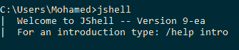

1.  前缀斜杠(`/`)**，**后跟 JShell 支持的命令，帮助您与 JShell 交互。就像我们尝试 `/help intro` 来获取以下内容：

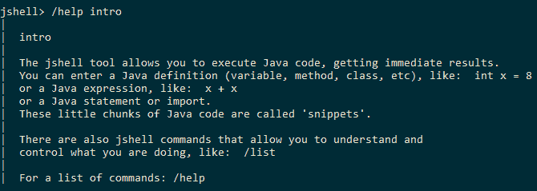

1.  让我们打印一个 `Hello World` 消息：

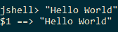

1.  让我们打印一个定制的 `Hello World` 消息：


1.  您可以使用上箭头键和下箭头键在已执行的命令之间导航。

# 它是如何工作的...

在 `jshell` 提示符中输入的代码片段被包裹在仅足够执行它们的代码中。因此，变量、方法和类声明被包裹在一个类中，表达式被包裹在一个方法中，而这个方法又反过来被包裹在类中。其他如导入和类定义等事物保持原样，因为它们是顶级实体，即不需要在另一个类中包裹类定义，因为类定义是一个顶级实体，可以独立存在。同样，在 Java 中，导入语句可以独立存在，并且它们出现在类声明之外，因此不需要在类中包裹。

在随后的菜谱中，我们将看到如何定义方法、导入额外的包、定义类等等。

在前面的菜谱中，我们看到了 `$1 ==> "Hello World"`。如果我们有一些没有与任何变量关联的值，那么 `jshell` 会给它一个变量名，例如 `$1`、`$2` 等等。

# 在 JShell 中导航及其命令

为了利用一个工具，我们需要熟悉如何使用它、它提供的命令以及我们可以使用的各种快捷键，以便提高生产力。在这个菜谱中，我们将查看我们可以通过不同的方式在 JShell 中导航，以及它提供的不同键盘快捷键，以便在使用时提高生产力。

# 如何做...

1.  通过在命令提示符中输入 `jshell` 来启动 JShell，您将看到一个包含开始指令的欢迎消息。

1.  输入 `/help intro` 获取 JShell 的简要介绍：

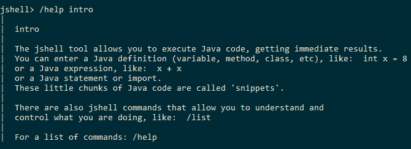

1.  输入 `/help` 获取支持的命令列表：

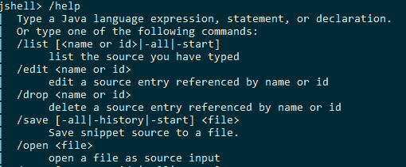

1.  要获取有关命令的更多信息，请输入 `/help <command>`。例如，要获取有关 `/edit` 的信息，请输入 `/help /edit`：

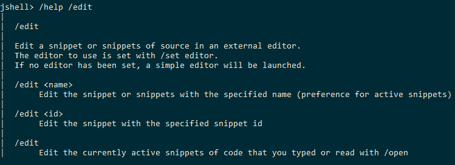

1.  JShell 中有自动完成支持。这使得 Java 开发者感到宾至如归。您可以使用 *Tab* 键调用自动完成：

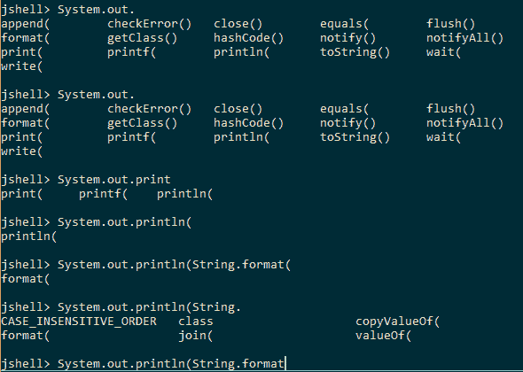

1.  您可以使用 `/!` 来执行之前执行过的命令，以及使用 `/line_number` 在指定行号重新执行表达式。

1.  要通过命令行导航光标，请使用 *Ctrl* + *A* 来到达行的开头，以及 *Ctrl* + *E* 来到达行的末尾。

# 评估代码片段

在这个菜谱中，我们将查看执行以下代码片段：

+   导入语句

+   类声明

+   接口声明

+   方法声明

+   字段声明

+   语句

# 如何操作...

1.  打开命令提示符并启动 JShell。

1.  默认情况下，JShell 导入了一些库。我们可以通过发出`/imports`命令来检查这一点：

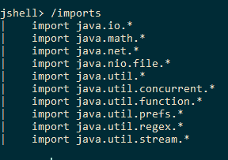

1.  让我们通过发出`import java.text.SimpleDateFormat`命令来导入`java.text.SimpleDateForm`。这将导入`SimpleDateFormat`类。

1.  让我们声明一个`Employee`类。我们将每行发出一个语句，使其成为一个不完整的语句，然后以与任何普通编辑器相同的方式进行操作。以下插图将阐明这一点：

```java
        class Employee{
          private String empId;
          public String getEmpId() {
            return empId;
          }
          public void setEmpId ( String empId ) {
            this.empId = empId;
          }
        }
```

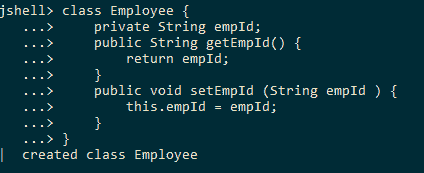

1.  让我们声明一个`Employability`接口，该接口定义了一个方法`employable()`，如下面的代码片段所示：

```java
        interface Employability { 
          public boolean employable();
        }
```

通过`jshell`创建的上述接口如下所示：

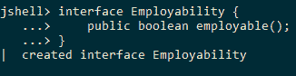

1.  让我们声明一个`newEmployee(String empId)`方法，该方法使用给定的`empId`构建一个`Employee`对象：

```java
        public Employee newEmployee(String empId ) {
          Employee emp = new Employee();
          emp.setEmpId(empId);
          return emp;
        }
```

以下是在 JShell 中定义的方法：

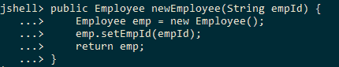

1.  我们将使用上一步中定义的方法来创建一个声明`Employee`变量的语句：

```java
        Employee e = newEmployee("1234");
```

上述语句及其在 JShell 中执行时的输出如下所示。`e.get + Tab`键生成由 IDEs 支持的自动完成。

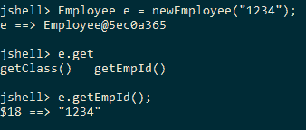

# 还有更多...

我们可以调用一个未定义的方法。请看以下示例：

```java
public void newMethod(){
  System.out.println("New  Method");
  undefinedMethod();
}
```

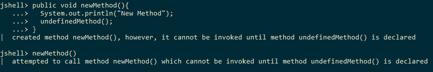

然而，在定义被使用的方法之前，不能调用该方法：

```java
public void undefinedMethod(){
  System.out.println("Now defined");
}
```

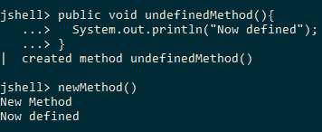

我们只能在定义了`undefinedMethod()`之后调用`newMethod()`。

# JShell 中的面向对象编程

在这个食谱中，我们将使用预定义的 Java 类定义文件并将它们导入 JShell。然后，我们将在 JShell 中玩转这些类。

# 如何操作...

1.  我们将在本食谱中使用位于代码下载中`chp13/4_oo_programming`位置的类定义文件。

1.  有三个类定义文件：`Engine.java`、`Dimensions.java`和`Car.java`。

1.  导航到包含这三个类定义文件的目录。

1.  `/open`命令允许从文件中加载代码。

1.  我们将加载`Engine`类的定义并创建一个`Engine`对象。

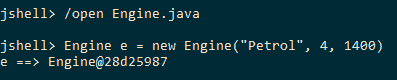

1.  接下来，我们将加载`Dimensions`类的定义并创建一个`Dimensions`对象：

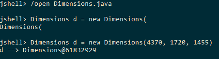

1.  最后，我们将加载`Car`类的定义并创建一个`Car`对象：

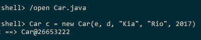

# 保存和恢复 JShell 命令历史

我们将尝试在`jshell`中运行一些代码片段，作为向初学者解释 Java 编程的手段。此外，记录执行过的代码片段对于学习语言的人来说将是有用的。

在这个菜谱中，我们将执行一些代码片段并将它们保存到文件中。然后我们将从保存的文件中加载代码片段。

# 如何做到这一点...

1.  让我们执行一系列代码片段，如下所示：

```java
        "Hello World"
        String msg = "Hello, %s. Good Morning"
        System.out.println(String.format(msg, "Friend"))
        int someInt = 10
        boolean someBool = false
        if ( someBool ) {
          System.out.println("True block executed");
        }
        if ( someBool ) {
          System.out.println("True block executed");
        }else{
          System.out.println("False block executed");
        }
        for ( int i = 0; i < 10; i++ ){
          System.out.println("I is : " + i );
        }
```

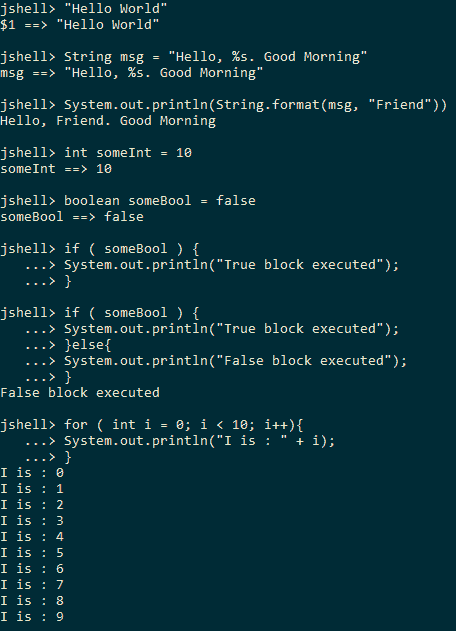

1.  使用`/save history`命令将执行过的代码片段保存到名为`history`的文件中。

1.  使用`/exit`退出 shell，然后根据操作系统使用`dir`或`ls`列出目录中的文件。列表中会有一个`history`文件。

1.  打开`jshell`并使用`/list`检查执行过的代码片段的历史记录。您将看到没有执行过的代码片段。

1.  使用`/open history`加载`history`文件，然后使用`/list`检查执行过的代码片段的历史记录。您将看到所有之前执行并添加到历史记录中的代码片段：


# 使用 JShell Java API

JDK 9 提供了用于创建工具（如用于评估 Java 代码片段的`jshell`）的 Java API。这个 Java API 存在于`jdk.jshell`模块中([`cr.openjdk.java.net/~rfield/arch/doc/jdk/jshell/package-summary.html`](http://cr.openjdk.java.net/~rfield/arch/doc/jdk/jshell/package-summary.html))。因此，如果您想在您的应用程序中使用此 API，那么您需要声明对`jdk.jshell`模块的依赖。

在这个菜谱中，我们将使用 JShell JDK API 评估简单的代码片段，您还将看到不同的 API 来获取 JShell 的状态。我们的想法不是重新创建 JShell，而是展示如何利用其 JDK API。

对于这个菜谱，我们不会使用 JShell；相反，我们将遵循使用`javac`编译和使用`java`运行的传统方式。

# 如何做到这一点...

1.  我们的这个模块将依赖于`jdk.jshell`模块。因此，模块定义将如下所示：

```java
        module jshell{
          requires jdk.jshell;
        }
```

1.  让我们使用`jdk.jshell.JShell`类的`create()`方法或`jdk.jshell.JShell.Builder`中的构建器 API 来创建一个实例：

```java
        JShell myShell = JShell.create();
```

1.  让我们使用`java.util.Scanner`从`System.in`读取代码片段：

```java
        try(Scanner reader = new Scanner(System.in)){
          while(true){
            String snippet = reader.nextLine();
            if ( "EXIT".equals(snippet)){
              break;
            }
            //TODO: Code here for evaluating the snippet using JShell API
          }
        }
```

1.  我们将使用`jdk.jshell.JShell#eval(String snippet)`方法来评估输入。评估将产生一个包含评估状态和输出的`jdk.jshell.SnippetEvent`列表。前一个代码片段中的 TODO 将被以下行替换：

```java
        List<SnippetEvent> events = myShell.eval(snippet);
        events.stream().forEach(se -> {
          System.out.print("Evaluation status: " + se.status());
          System.out.println(" Evaluation result: " + se.value());
        });
```

1.  评估完成后，我们将使用`jdk.jshell.JShell.snippets()`方法打印处理过的代码片段，该方法将返回处理过的`Snippet`的`Stream`。

```java
        System.out.println("Snippets processed: ");
        myShell.snippets().forEach(s -> {
          String msg = String.format("%s -> %s", s.kind(), s.source());
          System.out.println(msg);
        });
```

1.  同样，我们可以按如下方式打印活动方法和变量：

```java
        System.out.println("Methods: ");
        myShell.methods().forEach(m -> 
          System.out.println(m.name() + " " + m.signature()));

        System.out.println("Variables: ");
        myShell.variables().forEach(v -> 
          System.out.println(v.typeName() + " " + v.name()));
```

1.  在应用程序退出之前，我们通过调用其`close()`方法来关闭`JShell`实例：

```java
        myShell.close();
```

此菜谱的代码可以在以下位置找到，`chp13/6_jshell_api`。您可以通过使用同一目录中可用的`run.bat`或`run.sh`脚本运行示例。示例执行和输出如下所示：

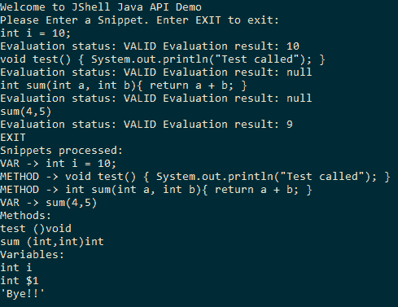

# 它是如何工作的...

API 中的核心类是`jdk.jshell.JShell`类。这个类是评估状态引擎，其状态在每次评估片段时都会被修改。正如我们之前看到的，片段是通过`eval(String snippet)`方法进行评估的。我们甚至可以使用`drop(Snippet snippet)`方法丢弃之前评估的片段。这两个方法都会导致`jdk.jshell.JShell`维护的内部状态发生变化。

传递给`JShell`评估引擎的代码片段被分类如下：

+   **错误**: 语法不正确的输入

+   **表达式**: 可能或可能不产生某些输出的输入

+   **导入**: 一个导入语句

+   **方法**: 方法声明

+   **语句**: 一个语句

+   **类型声明**: 一个类型，即类/接口声明

+   **变量声明**: 一个变量声明

所有这些类别都被捕获在`jdk.jshell.Snippet.Kind`枚举中。

我们还看到了不同的 API 来获取评估的片段、创建的方法、变量声明和其他特定片段类型的执行。每种片段类型都由扩展`jdk.jshell.Snippet`类的类支持。
