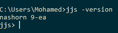
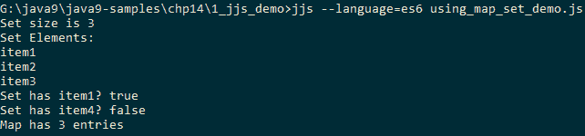
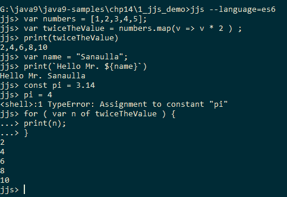
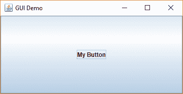
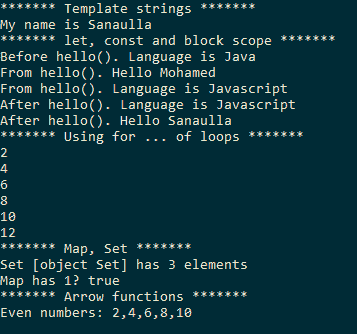

# 使用 Oracle Nashorn 进行脚本编写

在本章中，我们将涵盖以下菜谱：

+   使用 jjs 命令行工具

+   嵌入 Oracle Nashorn 引擎

+   从 Oracle Nashorn 调用 Java

+   使用 Oracle Nashorn 实现的 ECMAScript 6 功能

# 简介

Oracle Nashorn 是为 Java 平台开发的 JavaScript 引擎。这是在 Java 8 中引入的。在 Nashorn 之前，Java 平台的 JavaScript 引擎基于 Mozilla Rhino JavaScript 引擎。Oracle Nashorn 引擎利用 Java 8 中引入的 `invokedynamic` 支持以获得更好的运行时性能，并且也提供了对 ECMAScript 规范的更好遵守。

Oracle Nashorn 支持使用 `jjs` 工具以独立模式执行 JavaScript 代码，以及使用其嵌入的脚本引擎在 Java 中嵌入。在本章中，我们将探讨从 Java 执行 JavaScript 代码以及从 Java 调用 JavaScript 函数，反之亦然，包括从 JavaScript 访问 Java 类型。我们还将探讨使用命令行工具 `jjs` 执行 JavaScript 代码。

在本章的其余部分，我们将使用术语 ES6 来指代 ECMAScript 6。

# 使用 jjs 命令行工具

`jjs` 命令行工具支持执行 JavaScript 代码文件以及交互式执行 JavaScript 代码片段，如其他 JavaScript shell（如 `node.js`）所支持的那样。它使用 Oracle Nashorn，这是一个为 JVM 提供支持的下一代 JavaScript 引擎。除了 JavaScript 代码外，`jjs` 还支持执行 shell 命令，从而允许我们使用 JavaScript 创建 shell 脚本实用程序。

在这个菜谱中，我们将探讨通过 `jjs` 执行 JavaScript 代码文件，以及代码片段的交互式执行。

# 准备工作

首先，通过执行命令 `jjs -version` 验证 `jjs` 工具是否可用。这将打印版本为 `nashorn 9-ea` 并将其输入到 shell 中，如下面的图像所示：



我们甚至可以使用 `jjs -fv` 获取更具体的版本信息，它打印的版本为 `nashorn full version 9-ea+169`。

本菜谱中使用的 JavaScript 代码文件位于位置 `chp14/1_jjs_demo`。

# 如何操作...

1.  让我们使用 `jjs` 执行脚本，`$ jjs hellojjs.js`，它给出以下输出：`Hello via JJS using Nashorn`。

1.  现在我们尝试使用 ECMAScript 6 的 `Set`、`Map` 和模板字符串功能。模板字符串支持使用占位符构建 `String`，占位符由 `${variable}` 标识，完整的 `String` 被嵌入在 ```java `` ``` 中。我们使用 `jjs --language=es6 using_map_set_demo.js` 命令运行此脚本。默认情况下，`jjs` 以 `es5` 模式运行，我们通过提供此选项来启用它以在 `es6` 模式下运行，如下面的截图所示：



1.  现在，让我们交互式地使用 `jjs` 工具。在命令提示符中运行 `$ jjs --language=es6` 以启动外壳并执行一些 JavaScript 代码片段，如下所示：

```java
        var numbers = [1,2,3,4,5];
        var twiceTheValue = numbers.map(v => v * 2 ) ;
        print(twiceTheValue);
        var name = "Sanaulla";
        print(`Hello Mr. ${name}`);
        const pi = 3.14
        pi = 4
        for ( var n of twiceTheValue ) {
          print(n);
        }
```

屏幕上将会打印以下内容：



# 还有更多...

可以使用 `-scripting` 命令在 `jjs` 中启用 shell 脚本模式。因此，可以在 JavaScript 代码中嵌入 Shell/Batch 命令，如下所示：

```java
var files = $EXEC("dir").split("\n");
for( let file of files){
  print(file);
}
```

如果你使用 ES5 作为 `jjs` 的语言，则可以将 `$EXEC("dir")` 替换为 `` `dir` ``。但在 ES6 中，使用 `````java `` ````` 来表示模板字符串。前面的脚本可以使用 `jjs` 执行，如下所示：

```java
$ jjs -scripting=true --language=es6 embedded_shell_command.js
embedded_shell_command.js  hellojjs.js  using_map_set_demo.js
```

还有两个可用的变量，分别是 `$ARG` 和 `$ENV`，可以用来访问传递给脚本的参数和相应的环境变量。

# 嵌入 Oracle Nashorn 引擎

在这个菜谱中，我们将查看在 Java 代码中嵌入 Nashorn JavaScript 引擎并执行不同的 JavaScript 代码片段、函数和 JavaScript 源文件。

# 准备工作

应该已经安装了 JDK 9，因为我们将在 Nashorn 引擎中使用一些 ES6 JavaScript 语言特性。

# 如何做...

1.  首先，我们获取一个启用 ES6 语言特性的 `ScriptEngine` 实例：

```java
        NashornScriptEngineFactory factory = 
               new NashornScriptEngineFactory();
        ScriptEngine engine = factory.getScriptEngine("--language=es6");
```

1.  让我们定义一个 JavaScript 函数来计算两个数字的和：

```java
        engine.eval("function sum(a, b) { return a + b; }");
```

1.  让我们调用上一步定义的函数：

```java
        System.out.println(engine.eval("sum(1, 2);"));
```

1.  然后，我们将查看模板字符串支持：

```java
        engine.eval("let name = 'Sanaulla'");
        System.out.println(engine.eval("print(`Hello Mr. ${name}`)"));
```

1.  我们将使用 ES6 中的新 `Set` 构造和新的 `for` 循环来打印 `Set` 元素：

```java
        engine.eval("var s = new Set();
        s.add(1).add(2).add(3).add(4).add(5).add(6);");
        System.out.println("Set elements");
        engine.eval("for (let e of s) { print(e); }");
```

1.  最后，我们将查看如何加载 JavaScript 源文件并执行其中定义的方法：

```java
        engine.eval(new FileReader("src/embedded.nashorn/com/packt
                                    /embeddable.js"));
        int difference = (int)engine.eval("difference(1, 2);");
        System.out.println("Difference between 1, 2 is: " + difference);
```

此代码的完整内容可以在以下位置找到，`chp14/2_embedded_nashorn`。

执行示例后的输出将如下所示：

```java
3
Hello Mr. Sanaulla
null
Set elements
1
2
3
4
5
6
Difference between 1, 2 is: -1
```

# 从 Oracle Nashorn 调用 Java

在这个菜谱中，我们将查看从 JavaScript 代码中调用 Java API，包括使用 Java 类型，以及处理包和类导入。结合 Java API 的广泛性和 Oracle Nashorn JavaScript 引擎利用的 JavaScript 的动态性具有更大的潜力。我们将查看创建一个纯 JavaScript 代码，该代码使用 Java API，并使用 `jjs` 工具来执行它。

我们还将查看纯 JavaScript 创建基于 Swing 的应用程序。

# 如何做...

1.  让我们使用 `Arrays.asList` API 创建一个数字 `List`：

```java
        var numbers = java.util.Arrays.asList(12,4,5,67,34,567,32);
```

1.  现在，计算列表中的最大数：

```java
        var max = java.util.Collections.max(numbers);
```

1.  我们可以使用 JavaScript 的 `print()` 方法打印 `max`，并且可以使用模板字符串：

```java
        print(`Max of ${numbers} is ${max}`);
```

1.  让我们运行使用 `jjs` 创建的脚本：

```java
        jjs --language=es6 java_from_javascript.js
```

1.  现在，让我们导入 `java.util` 包：

```java
        var javaUtils = new JavaImporter(java.util);
```

1.  让我们使用导入的包来打印今天的日期：

```java
        with(javaUtils){
          var date = new Date();
          print(`Todays date is ${date}`);
        }
```

1.  使用 `Java.type` API 为 Java 类型创建一个别名：

```java
        var jSet = Java.type('java.util.HashSet');
```

1.  使用别名创建一个集合，添加一些元素，并打印它：

```java
        var mySet = new jSet();
        mySet.add(1);
        mySet.add(4);
        print(`My set is ${mySet}`);
```

我们得到以下输出：

```java
 Max of [12, 4, 5, 67, 34, 567, 32] is 567
 Todays date is Wed May 24 2017 00:43:35 GMT+0300 (AST)
 My set is [1, 4]
```

此脚本文件的代码可以在以下位置找到，`chp14/3_java_from_nashorn/java_from_javascript.js`。

# 它是如何工作的...

可以通过使用它们的完全限定名从 JavaScript 代码中访问 Java 类型及其 API，就像我们在上一节中创建数字列表时使用 `java.util.Arrays.asList()` 和使用 `java.util.Collections.max()` 查找最大值时所看到的那样。

如果我们想省略包名和类名一起指定，我们可以使用 `JavaImporter` 来导入包，并使用 `with` 子句来包装代码，这样就可以在内部使用导入包中的类，如下所示：

```java
var javaUtils = new JavaImporter(java.util);
with(javaUtils){
  var date = new Date();
  print(`Todays date is ${date}`);
}
```

我们看到的另一个特性是通过使用 `Java.type(<fully qualified class name>)` 为 Java 类型创建类型别名，就像在以下示例中所做的那样：

```java
var jSet = Java.type('java.util.HashSet');
```

如果您使用别名创建对象，类型必须是实现类：

```java
var mySet = new jSet();
```

# 还有更多...

让我们创建一个脚本，创建一个简单的 Swing GUI，包含一个按钮和一个按钮的事件处理器。我们还将探讨如何利用导入和通过匿名内部类方法实现接口。

首先，我们将创建一个新的 `JavaImporter` 对象，包含所需的 Java 包：

```java
var javaGui = new JavaImporter(javax.swing, java.awt, java.awt.event);
```

我们使用 `with(obj){}` 子句来包装所有使用所需导入的语句：

```java
with(javaGui){
  //other statements
}
```

接下来，我们创建 `JButton` 并提供 `ActionListener` 来监听其点击事件：

```java
var button = new JButton("My Button");
button.addActionListener(new ActionListener({
  actionPerformed: function(e){
    print("Button clicked");
  }
}));
```

然后，我们创建 `JFrame` 来渲染包含其组件的 GUI：

```java
var frame = new JFrame("GUI Demo");
frame.setDefaultCloseOperation(JFrame.EXIT_ON_CLOSE);
frame.getContentPane().add(button, BorderLayout.CENTER);
frame.pack();
frame.setVisible(true);
```

这个完整的代码可以在 `chp14/3_java_from_nashorn/gui_from_javascript.js` 中找到。让我们使用 `jjs` 运行这个脚本：

```java
jjs --language=es6 java_from_javascript.js
```

我们可以看到一个小型 GUI，如下面的截图所示：



要退出程序，我们必须使用 *Ctrl* + *C* 来停止进程，因为 `setDefaultCloseOperation` 在 Java 运行时才会生效。另一个选项是覆盖 JFrame 的 `close` 操作来退出程序。

# 使用 Oracle Nashorn 实现的 ES6 特性

在这个菜谱中，我们将探讨一些在 Oracle Nashorn JavaScript 引擎中实现的 ES6 特性。为此，我们将创建一个 JavaScript 文件并使用 `jjs` 来执行它。请记住使用 `jjs` 在 ES6 模式下，可以通过传递 `--language=es6` 命令行选项来启用。

# 如何做到这一点...

1.  模板字符串是带有变量占位符的字符串，从而允许创建动态文本。这些字符串必须嵌入在符号 ```java `` ``` 内：

```java
        var name = "Sanaulla";
        print(`My name is ${name}`);
```

1.  JavaScript 中的任何变量都具有全局作用域。ES6 引入了块作用域，可以使用 `let` 关键字声明。现在可以使用 `const` 关键字定义常量，如下面的代码片段所示：

```java
        const pi = 3.14;
        var language = "Java";
        function hello(){
          let name = "Mohamed";
          language = "Javascript";
          print(`From hello(). Hello ${name}`);
          print(`From hello(). Language is ${language}`);
        }
        print(`Before hello(). Language is ${language}`);
        hello();
        print(`After hello(). Language is ${language}`);
        print(`After hello(). Hello ${name}`);
        //pi = 4.5; 
        //above will be error because pi is defined as a constant
```

1.  让我们看看新的迭代构造 `for ... of`：

```java
        let numbers = [2,4,6,8,10,12];
        for ( const number of numbers ){
          print(number);
        }
```

1.  让我们看看如何使用新的 `Set` 和 `Map` 类来创建集合和映射：

```java
        var set = new Set();
        set.add("elem 1").add("elem 2").add("elem 3").add("elem 1");
        print(`Set ${set} has ${set.size} elements`);
        var map = new Map();
        map.set(1, "elem 1");
        map.set(2, "elem 2");
        map.set(3, "elem 3");
        print(`Map has 1? ${map.has(1)}`);
```

1.  让我们看看箭头函数。这些与从 Java 8 开始的 lambda 表达式概念类似。箭头函数的形式为 `(parameters) => {function body}`：

```java
        numbers = [1,2,3,4,5,6,7,8,9,10];
        var evenNumbers = numbers.filter(n => n % 2 == 0);
        print(`Even numbers: ${evenNumbers}`);
```

该代码的完整版本可以在文件中找到，`chp14/4_es6_features/es6_features.js`。使用`jjs --language=es6 es6_features.js`命令执行完整脚本后的输出如下：


